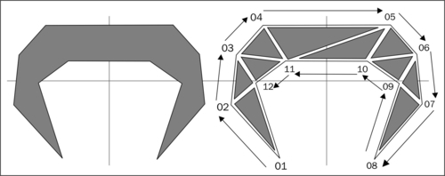
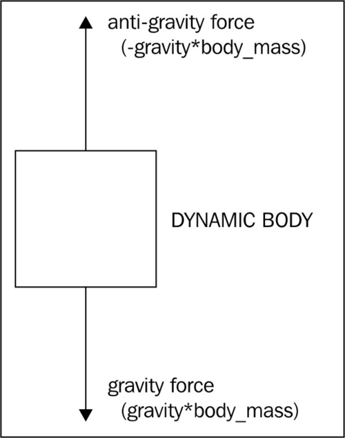
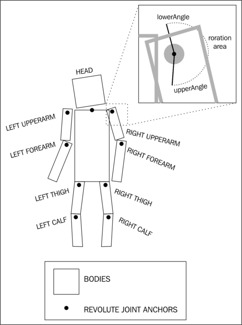
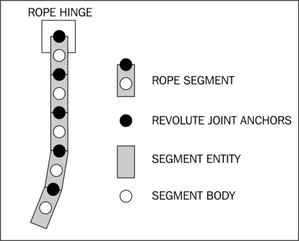
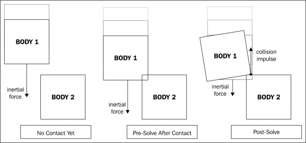
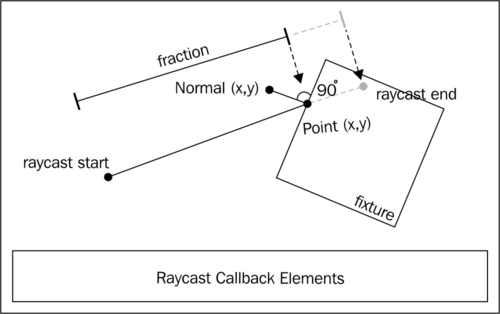

# 六、物理学的应用

基于物理的游戏为玩家提供了一种独特的体验，这种体验在许多其他类型的游戏中都没有遇到过。本章涵盖了 和工程师 **Box2D 物理扩展**的使用。我们的食谱包括:

*   Box2D 物理扩展介绍
*   了解不同的体型
*   创建类别过滤的正文
*   创建多夹具主体
*   通过指定顶点创建唯一实体
*   使用力、速度和扭矩
*   对特定物体施加反重力
*   使用关节
*   创造一个布娃娃
*   创造一根绳子
*   处理碰撞
*   使用前求解和后求解
*   创建可析构对象
*   光线投射

# Box2D 物理扩展介绍

基于物理的游戏是移动设备上最受欢迎的游戏类型之一。AndEngine 允许使用 Box2D 扩展创建基于物理的游戏。有了这个扩展，我们可以构建任何类型的物理上真实的 2D 环境，从小的、简单的模拟到复杂的游戏。在本食谱中，我们将创建一个活动，演示利用 Box2D 物理引擎扩展的简单设置。此外，我们将在本章的剩余食谱中使用这个活动。

## 做好准备...

首先，创建一个名为`PhysicsApplication`的新活动类，扩展`BaseGameActivity`并实现`IAccelerationListener`和`IOnSceneTouchListener`。

## 怎么做...

按照以下步骤构建我们的`PhysicsApplication`活动课:

1.  在类中创建以下变量:

    ```java
      public static int cameraWidth = 800;
      public static int cameraHeight = 480;
      public Scene mScene;
      public FixedStepPhysicsWorld mPhysicsWorld;
      public Body groundWallBody;
      public Body roofWallBody;
      public Body leftWallBody;
      public Body rightWallBody;
    ```

2.  我们需要建立我们活动的基础。首先，在类中放置这四个常见的重写方法来设置引擎、资源和主场景:

    ```java
      @Override
      public Engine onCreateEngine(final EngineOptions
          pEngineOptions) {
        return new FixedStepEngine(pEngineOptions, 60);
      }

      @Override
      public EngineOptions onCreateEngineOptions() {
        EngineOptions engineOptions = new EngineOptions(true,
          ScreenOrientation.LANDSCAPE_SENSOR, new
            FillResolutionPolicy(), new Camera(0,
              0, cameraWidth, cameraHeight));
        engineOptions.getRenderOptions().setDithering(true);
        engineOptions.getRenderOptions().
          getConfigChooserOptions()
            .setRequestedMultiSampling(true);
        engineOptions.setWakeLockOptions(
          WakeLockOptions.SCREEN_ON);
        return engineOptions;
      }

      @Override
      public void onCreateResources(OnCreateResourcesCallback
          pOnCreateResourcesCallback) {
        pOnCreateResourcesCallback.
          onCreateResourcesFinished();
      }

      @Override
      public void onCreateScene(OnCreateSceneCallback
          pOnCreateSceneCallback) {
        mScene = new Scene();
        mScene.setBackground(new Background(0.9f,0.9f,0.9f));
        pOnCreateSceneCallback.onCreateSceneFinished(mScene);
      }
    ```

3.  通过添加以下覆盖方法继续设置活动，该方法将用于填充我们的场景:

    ```java
      @Override
      public void onPopulateScene(Scene pScene,
        OnPopulateSceneCallback pOnPopulateSceneCallback) {
      }
    ```

4.  接下来，我们将使用下面的代码填充前面的方法来创建我们的`PhysicsWorld`对象和`Scene`对象:

    ```java
        mPhysicsWorld = new FixedStepPhysicsWorld(60, new
          Vector2(0f,-SensorManager.GRAVITY_EARTH*2),
            false, 8, 3);
        mScene.registerUpdateHandler(mPhysicsWorld);
        final FixtureDef WALL_FIXTURE_DEF =
          PhysicsFactory.createFixtureDef(0, 0.1f,
            0.5f);
        final Rectangle ground =
          new Rectangle(cameraWidth / 2f, 6f,
            cameraWidth - 4f, 8f,
            this.getVertexBufferObjectManager());
        final Rectangle roof = 
          new Rectangle(cameraWidth / 2f, cameraHeight – 
            6f, cameraWidth - 4f, 8f,
            this.getVertexBufferObjectManager());
        final Rectangle left = 
          new Rectangle(6f, cameraHeight / 2f, 8f, 
            cameraHeight - 4f,
            this.getVertexBufferObjectManager());
        final Rectangle right =
            new Rectangle(cameraWidth - 6f,
            cameraHeight / 2f, 8f,
            cameraHeight - 4f,
            this.getVertexBufferObjectManager());
        ground.setColor(0f, 0f, 0f);
        roof.setColor(0f, 0f, 0f);
        left.setColor(0f, 0f, 0f);
        right.setColor(0f, 0f, 0f);
        groundWallBody =
          PhysicsFactory.createBoxBody(
          this.mPhysicsWorld, ground, 
          BodyType.StaticBody, WALL_FIXTURE_DEF);
        roofWallBody =
          PhysicsFactory.createBoxBody(
          this.mPhysicsWorld, roof,
          BodyType.StaticBody, WALL_FIXTURE_DEF);
        leftWallBody =
          PhysicsFactory.createBoxBody(
          this.mPhysicsWorld, left,
          BodyType.StaticBody, WALL_FIXTURE_DEF);
        rightWallBody =
          PhysicsFactory.createBoxBody(
          this.mPhysicsWorld, right,
          BodyType.StaticBody, WALL_FIXTURE_DEF);
        this.mScene.attachChild(ground);
        this.mScene.attachChild(roof);
        this.mScene.attachChild(left);
        this.mScene.attachChild(right);
        // Further recipes in this chapter will require us
          to place code here.
        mScene.setOnSceneTouchListener(this);
        pOnPopulateSceneCallback.onPopulateSceneFinished();
    ```

5.  以下被覆盖的活动处理场景触摸事件、加速度计输入和两个发动机生命周期事件— `onResumeGame`和`onPauseGame`。把它们放在课程的最后来完成这个食谱:

    ```java
      @Override
      public boolean onSceneTouchEvent(Scene pScene, TouchEvent
          pSceneTouchEvent) {
        // Further recipes in this chapter will require us
          to place code here.
        return true;
      }

      @Override
      public void onAccelerationAccuracyChanged(
          AccelerationData pAccelerationData) {}

      @Override
      public void onAccelerationChanged(
          AccelerationData pAccelerationData) {
        final Vector2 gravity = Vector2Pool.obtain(
          pAccelerationData.getX(), 
          pAccelerationData.getY());
        this.mPhysicsWorld.setGravity(gravity);
        Vector2Pool.recycle(gravity);
      }

      @Override
      public void onResumeGame() {
        super.onResumeGame();
        this.enableAccelerationSensor(this);
      }

      @Override
      public void onPauseGame() {
        super.onPauseGame();
        this.disableAccelerationSensor();
      }
    ```

## 它是如何工作的...

我们要做的第一件事是定义相机的宽度和高度。然后，我们定义一个`Scene`物体和一个`FixedStepPhysicsWorld`物体，物理模拟将在其中进行。最后一组变量定义了什么将作为我们基于物理的场景的边界。

在第二步中，我们覆盖`onCreateEngine()`方法返回一个`FixedStepEngine`对象，该对象将每秒处理`60`更新。我们这样做的原因，同时也使用了一个`FixedStepPhysicsWorld`对象，是为了创建一个所有设备都一致的模拟，而不管设备处理物理模拟的效率如何。然后我们用标准偏好创建`EngineOptions`对象，用简单的回调创建`onCreateResources()`方法，用浅灰色背景设置主场景。

在`onPopulateScene()`方法中，我们创建我们的`FixedStepPhysicsWorld`物体，它的重力是地球的两倍，作为`(x,y)`坐标`Vector2`物体传递，并且每秒将更新`60`次。重力可以设置为其他值，以使我们的模拟更加真实，或者`0`创建零重力模拟。`0`的重力设置对于空间模拟或使用自上而下的相机视图而不是轮廓的游戏非常有用。`false`布尔参数设置`PhysicsWorld`对象的`AllowSleep`属性，该属性告诉`PhysicsWorld`停止后不要让任何物体去激活自己。`FixedStepPhysicsWorld`对象的最后两个参数告诉物理引擎计算速度和位置移动的次数。更高的迭代将创建更精确的模拟，但由于处理器上的额外负载，可能会导致延迟或抖动。创建`FixedStepPhysicsWorld`对象后，我们将其作为更新处理器注册到主场景中。未经注册，物理世界不会运行模拟。

变量`WALL_FIXTURE_DEF`是**夹具定义**T4。夹具定义保存将在物理世界中作为夹具创建的实体的形状和材质属性。夹具的形状可以是圆形或多边形。夹具的材质由其密度、弹性和摩擦来定义，所有这些在创建夹具定义时都是必需的。在创建`WALL_FIXTURE_DEF`变量之后，我们创建四个矩形来表示墙体的位置。Box2D 物理世界中的物体是由夹具组成的。虽然创建主体只需要一个夹具，但多个夹具可以创建具有不同特性的复杂主体。

在接下来的`onPopulateScene()`方法中，我们创建了将在物理世界中充当我们墙壁的箱体。先前创建的矩形被传递给实体以定义它们的位置和形状。然后，我们将物体定义为静态的，这意味着它们不会对物理模拟中的任何力做出反应。最后，我们将墙夹具定义传递给实体，以完成它们的创建。

创建身体后，我们将矩形附加到主场景，并将场景的触摸监听器设置到我们的活动中，该活动将通过`onSceneTouchEvent()`方法访问。`onPopulateScene()`方法的最后一行告诉引擎场景已经准备好显示了。

被覆盖的`onSceneTouchEvent()`方法将处理我们场景的所有触摸交互。`onAccelerationAccuracyChanged()`和`onAccelerationChanged()`方法继承自`IAccelerationListener`界面，允许我们在设备倾斜、旋转或平移时改变物理世界的重力。当我们的游戏活动不在前景中时，我们覆盖`onResumeGame()`和`onPauseGame()`以防止加速计使用不必要的电池电量。

## 还有更多...

在被覆盖的`onAccelerationChanged()`方法中，我们对`Vector2Pool`类进行了两次调用。`Vector2Pool`类只是为我们提供了一种重用`Vector2`对象的方法，否则这些对象可能需要系统进行垃圾收集。在较新的设备上，安卓垃圾收集器已经被简化以减少明显的打嗝，但是旧设备可能仍然会经历延迟，这取决于被垃圾收集的变量占用了多少内存。

### 注

访问[http://www.box2d.org/manual.html](http://www.box2d.org/manual.html)查看 **Box2D 用户手册**。AndEngine Box2D 扩展基于官方 Box2D C++物理引擎的一个 Java 端口，因此在过程中存在一些变化，但是一般概念仍然适用。

## 另见

*   *了解不同体型【本章 T1】。*

# 了解不同体型

Box2D 物理世界为我们提供了创建不同身体类型的方法，使我们能够控制物理模拟。我们可以生成 **对力和其他物体起反应的动态物体**、 **不运动的静态物体**和运动但不受力或其他物体影响的**运动物体** 。选择每个物体的类型对产生精确的物理模拟至关重要。在这个食谱中，我们将看到三个物体在碰撞中如何相互反应，这取决于它们的身体类型。

## 做好准备...

遵循本章开头给出的 Box2D 物理扩展部分*介绍中的食谱，创建一个新的活动，该活动将有助于创建我们不同体型的身体。*

## 怎么做...

完成以下步骤，查看为实体指定实体类型对其有何影响:

1.  首先，在`onPopulateScene()`方法中插入以下夹具定义:

    ```java
    FixtureDef BoxBodyFixtureDef = 
      PhysicsFactory.createFixtureDef(20f, 0f, 0.5f);
    ```

2.  接下来，将创建三个矩形及其对应实体的以下代码放在上一步的夹具定义之后:

    ```java
    Rectangle staticRectangle = new Rectangle(cameraWidth /
      2f,75f,400f,40f,this.getVertexBufferObjectManager());
    staticRectangle.setColor(0.8f, 0f, 0f);
    mScene.attachChild(staticRectangle);
    PhysicsFactory.createBoxBody(mPhysicsWorld, staticRectangle,
      BodyType.StaticBody, BoxBodyFixtureDef);

    Rectangle dynamicRectangle = new Rectangle(400f, 120f, 40f, 40f,
      this.getVertexBufferObjectManager());
    dynamicRectangle.setColor(0f, 0.8f, 0f);
    mScene.attachChild(dynamicRectangle);
    Body dynamicBody = PhysicsFactory.createBoxBody(mPhysicsWorld,
      dynamicRectangle, BodyType.DynamicBody, BoxBodyFixtureDef);
    mPhysicsWorld.registerPhysicsConnector(new PhysicsConnector(
      dynamicRectangle, dynamicBody);

    Rectangle kinematicRectangle = new Rectangle(600f, 100f,
      40f, 40f, this.getVertexBufferObjectManager());
    kinematicRectangle.setColor(0.8f, 0.8f, 0f);
    mScene.attachChild(kinematicRectangle);
    Body kinematicBody = PhysicsFactory.createBoxBody(mPhysicsWorld,
      kinematicRectangle, BodyType.KinematicBody, BoxBodyFixtureDef);
    mPhysicsWorld.registerPhysicsConnector(new PhysicsConnector(
      kinematicRectangle, kinematicBody);
    ```

3.  最后，在前一步的定义后添加以下代码，为我们的运动体设置线速度和角速度:

    ```java
    kinematicBody.setLinearVelocity(-2f, 0f);
    kinematicBody.setAngularVelocity((float) (-Math.PI));
    ```

## 它是如何工作的...

在第一步，我们创建`BoxBodyFixtureDef`夹具定义，我们将在第二步创建我们的身体时使用它。有关夹具定义的更多信息，请参见本章中的*Box2D 物理扩展*配方介绍。

在第二步中，我们首先通过调用`Rectangle`构造函数来定义`staticRectangle`矩形。我们将`staticRectangle`放置在`cameraWidth / 2f, 75f`的位置，该位置靠近场景的下中心，我们将矩形设置为宽度为`400f`，高度为`40f`，这使得矩形成为一个长而平的条。然后，我们通过调用`staticRectangle.setColor(0.8f, 0f, 0f)`将`staticRectangle`矩形的颜色设置为红色。最后，对于`staticRectangle`矩形，我们通过调用以`staticRectangle`为参数的`mScene.attachChild()`方法将其附加到场景中。接下来，我们在物理世界中创造一个与我们的`staticRectangle`相匹配的身体。为此，我们用`mPhysicsWorld`的参数调用`PhysicsFactory.createBoxBody()`方法，这是我们的物理世界，`staticRectangle`告诉要创建的盒子的位置和大小与`staticRectangle`矩形相同，`BodyType.StaticBody`定义身体为静态，我们的`BoxBodyFixtureDef`夹具定义。

我们的下一个矩形`dynamicRectangle`是在`400f`和`120f`的位置创建的，这是场景的中间，略高于`staticRectangle`矩形。我们的`dynamicRectangle`矩形的宽度和高度设置为`40f`使其成为一个小正方形。然后，我们通过调用`dynamicRectangle.setColor(0f, 0.8f, 0f)`将其颜色设置为绿色，并使用`mScene.attachChild(dynamicRectangle)`将其附加到我们的场景中。接下来，我们使用 `PhysicsFactory.createBoxBody()`方法创建`dynamicBody`变量，就像我们创建`staticRectangle`矩形一样。请注意，我们将`dynamicBody`变量设置为`DynamicBody`的`BodyType`。这将主体设置为动态的。现在，我们向物理世界注册`PhysicsConnector`链接`dynamicRectangle`和`dynamicBody`。一个`PhysicsConnecter`类将我们场景中的一个实体链接到物理世界中的一个物体，代表物体在我们场景中的实时位置和旋转。

我们的最后一个矩形`kinematicRectangle`是在`600f`和`100f`的位置创建的，这将它放在场景右侧的`staticRectangle`矩形之上。它的高度和宽度设置为`40f`，这使得它成为一个像我们的`dynamicRectangle`矩形一样的小正方形。然后我们将`kinematicRectangle`矩形的颜色设置为黄色，并将其附加到我们的场景中。类似于前面我们创建的两个实体，我们调用`PhysicsFactory.createBoxBody()`方法来创建我们的`kinematicBody`变量。请注意，我们使用`BodyType`类型的`KinematicBody`创建我们的`kinematicBody`变量。这将它设置为运动学的，因此只能通过设置其速度来移动。最后，我们在`kinematicRectangle`矩形和`kinematicBody`体型之间注册一个`PhysicsConnector`类。

在最后一步中，我们通过在 x 轴上用`-2f`的向量调用`setLinearVelocity()`方法来设置我们的`kinematicBody`物体的线速度，这使得它向左移动。最后，我们通过调用`kinematicBody.setAngularVelocity((float) (-Math.PI))`将`kinematicBody`身体的角速度设置为负`pi`。有关设置身体速度的更多信息，请参见本章中的*使用力、速度和扭矩*方法。

## 还有更多...

静态物体不能从施加的或设定的力移动，但是可以使用`setTransform()`方法重新定位。但是，我们应该避免在模拟运行时使用`setTransform()`方法，因为它会使模拟不稳定，并可能导致一些奇怪的行为。相反，如果我们想要改变静态体的位置，我们可以在创建模拟时这样做，或者如果我们需要在运行时改变位置，只需检查新位置不会导致静态体与现有的动态体或运动体重叠。

运动物体不能施加力，但是我们可以通过`setLinearVelocity()`和`setAngularVelocity()`方法设置它们的速度。

## 另见

*   *本章介绍 Box2D 物理扩展*。
*   使用本章中的力、速度和扭矩。

# 创建类别过滤的正文

根据我们想要实现的物理模拟的类型，控制哪些物体能够碰撞是非常有益的。在 Box2D 中，我们可以为设备分配一个类别和类别过滤器，以控制哪些设备可以交互。本食谱将涵盖两个类别过滤夹具的定义，这两个夹具将应用于通过触摸场景创建的物体，以演示类别过滤。

## 做好准备...

按照本章开头给出的 Box2D 物理扩展部分的*介绍中的步骤创建一个活动。此活动将有助于创建本节中使用的类别筛选主体。*

## 怎么做...

按照以下步骤构建我们的类别过滤演示活动:

1.  在活动中定义以下类级变量:

    ```java
    private int mBodyCount = 0;
    public static final short CATEGORYBIT_DEFAULT = 1;
    public static final short CATEGORYBIT_RED_BOX = 2;
    public static final short CATEGORYBIT_GREEN_BOX = 4;
    public static final short MASKBITS_RED_BOX =
      CATEGORYBIT_DEFAULT + CATEGORYBIT_RED_BOX;
    public static final short MASKBITS_GREEN_BOX =
      CATEGORYBIT_DEFAULT + CATEGORYBIT_GREEN_BOX;
    public static final FixtureDef RED_BOX_FIXTURE_DEF =
      PhysicsFactory.createFixtureDef(1, 0.5f, 0.5f, false,
        CATEGORYBIT_RED_BOX, MASKBITS_RED_BOX, (short)0);
    public static final FixtureDef GREEN_BOX_FIXTURE_DEF =
      PhysicsFactory.createFixtureDef(1, 0.5f, 0.5f, false,
        CATEGORYBIT_GREEN_BOX, MASKBITS_GREEN_BOX, (short)0);
    ```

2.  接下来，在给定位置生成新的类别过滤主体的类中创建这个方法:

    ```java
    private void addBody(final float pX, final float pY) {
      this.mBodyCount++;
      final Rectangle rectangle = new Rectangle(pX, pY, 50f, 50f,
        this.getVertexBufferObjectManager());
      rectangle.setAlpha(0.5f);
      final Body body;
      if(this.mBodyCount % 2 == 0) {
        rectangle.setColor(1f, 0f, 0f);
        body = PhysicsFactory.createBoxBody(this.mPhysicsWorld,
          rectangle, BodyType.DynamicBody, RED_FIXTURE_DEF);
      } else {
        rectangle.setColor(0f, 1f, 0f);
        body = PhysicsFactory.createBoxBody(this.mPhysicsWorld,
          rectangle, BodyType.DynamicBody, GREEN_FIXTURE_DEF);
      }
      this.mScene.attachChild(rectangle);
      this.mPhysicsWorld.registerPhysicsConnector(new PhysicsConnector(
        rectangle, body, true, true));
    }
    ```

3.  最后，用以下代码填充`onSceneTouchEvent()`方法的主体，通过传递触摸的位置来调用`addBody()`方法:

    ```java
    if(this.mPhysicsWorld != null)
      if(pSceneTouchEvent.isActionDown())
        this.addBody(pSceneTouchEvent.getX(),
          pSceneTouchEvent.getY());
    ```

## 它是如何工作的...

第一步，我们创建一个整数`mBodyCount`，它统计了我们给物理世界增加了多少个物体。在第二步中使用`mBodyCount`整数来确定应该为新几何体分配哪种颜色，从而确定哪个类别。

我们还通过用两个短整数的唯一幂来定义`CATEGORYBIT_DEFAULT`、`CATEGORYBIT_RED_BOX`和`CATEGORYBIT_GREEN_BOX`类别位，并通过将它们相关的类别位相加来创建`MASKBITS_RED_BOX`和`MASKBITS_GREEN_BOX`掩码位。类别位用于将类别分配给夹具，而掩码位组合不同的类别位，以确定夹具可以碰撞的类别。然后，我们将类别位和掩码位传递给夹具定义，以创建具有类别冲突规则的夹具。

第二步是创建一个矩形及其相应主体的简单方法。该方法采用我们想要用来创建新实体的`X`和`Y`位置参数，并将它们传递给`Rectangle`对象的构造器，我们还将`50f`的高度和宽度以及活动的`VertexBufferObjectManager`传递给该构造器。然后，我们使用 `rectangle.setAlpha()`方法将矩形设置为 50%透明。之后，我们定义一个主体，并通过`2`调整`mBodyCount`变量，以确定每一个其他创建的主体的颜色和夹具。确定颜色和夹具后，我们通过设置矩形的颜色来分配它们，并通过传递我们的`mPhysicsWorld`物理世界、矩形、动态体类型和先前确定要使用的夹具来创建一个体。最后，我们将矩形附加到我们的场景，并注册一个`PhysicsConnector`类来将矩形连接到我们的身体。

第三步从第二步开始调用 `addBody()`方法，前提是物理世界已经创建，并且场景的`TouchEvent`是`ActionDown`。传递的参数`pSceneTouchEvent.getX()`和`pSceneTouchEvent.getY()`表示场景中接收到触摸输入的位置，这也是我们想要创建新的类别过滤主体的位置。

## 还有更多...

所有装置的默认类别的值为 1。为特定夹具创建遮罩位时，请记住，任何包含默认类别的组合都将导致夹具与所有未被遮罩的其他夹具发生碰撞，以避免与夹具发生碰撞。

## 另见

*   *本章介绍 Box2D 物理扩展*。
*   *了解不同体型【本章 T1】。*

# 创建多夹具主体

我们有时需要一个身体的某些部分具有不同的物理属性。例如，如果一辆有保险杠的汽车撞上了没有保险杠的汽车，它的反应应该是不同的。在 Box2D 中创建这样一个多重混成体是相当简单和直接的。在本食谱中，我们将看到如何通过创建两个夹具并将其添加到一个空体中来创建一个多夹具体。

## 做好准备...

按照本章开头的 Box2D 物理扩展部分*介绍中的步骤，创建一个新的活动，这将有助于创建我们的多形体。*

## 怎么做...

按照以下步骤，了解我们如何创建多刚体:

1.  将以下代码放入`onPopulateScene()`方法中，创建两个矩形，这两个矩形具有修改后的`AnchorCenter`值，当链接到身体时，允许精确放置:

    ```java
    Rectangle nonbouncyBoxRect = new Rectangle(0f, 0f, 100f, 100f,
      this.getEngine().getVertexBufferObjectManager());
    nonbouncyBoxRect.setColor(0f, 0f, 0f);
    nonbouncyBoxRect.setAnchorCenter(((nonbouncyBoxRect.getWidth() / 2) -
      nonbouncyBoxRect.getX()) / nonbouncyBoxRect.getWidth(),
        ((nonbouncyBoxRect.getHeight() / 2) –
          nonbouncyBoxRect.getY()) /
            nonbouncyBoxRect.getHeight());
    mScene.attachChild(nonbouncyBoxRect);
    Rectangle bouncyBoxRect = new Rectangle(0f, -55f, 90f, 10f,
      this.getEngine().getVertexBufferObjectManager());
    bouncyBoxRect.setColor(0f, 0.75f, 0f);
    bouncyBoxRect.setAnchorCenter(((bouncyBoxRect.getWidth() / 2) –
      bouncyBoxRect.getX()) / bouncyBoxRect.getWidth(),
        ((bouncyBoxRect.getHeight() / 2) –
          bouncyBoxRect.getY()) /
            bouncyBoxRect.getHeight());
    mScene.attachChild(bouncyBoxRect);
    ```

2.  下面的代码创建了一个`Body`对象和两个夹具，一个是完全弹性的，另一个是完全非弹性的。在前一步创建矩形后添加:

    ```java
    Body multiFixtureBody = mPhysicsWorld.createBody(new BodyDef());
    multiFixtureBody.setType(BodyType.DynamicBody);

    FixtureDef nonbouncyBoxFixtureDef =   PhysicsFactory.createFixtureDef(20, 0.0f, 0.5f);
    final PolygonShape nonbouncyBoxShape = new PolygonShape();
    nonbouncyBoxShape.setAsBox((nonbouncyBoxRect.getWidth() / 2f) /
      PhysicsConstants.PIXEL_TO_METER_RATIO_DEFAULT,
        (nonbouncyBoxRect.getHeight() / 2f) /
          PhysicsConstants.PIXEL_TO_METER_RATIO_DEFAULT, 
            new Vector2(nonbouncyBoxRect.getX() /
          PhysicsConstants.PIXEL_TO_METER_RATIO_DEFAULT,
              nonbouncyBoxRect.getY() /
          PhysicsConstants.PIXEL_TO_METER_RATIO_DEFAULT), 0f);
    nonbouncyBoxFixtureDef.shape = nonbouncyBoxShape;
    multiFixtureBody.createFixture(nonbouncyBoxFixtureDef);
    mPhysicsWorld.registerPhysicsConnector(new PhysicsConnector(
      nonbouncyBoxRect, multiFixtureBody));

    FixtureDef bouncyBoxFixtureDef = 
      PhysicsFactory.createFixtureDef(20, 	1f, 0.5f);
    final PolygonShape bouncyBoxShape = new PolygonShape();
    bouncyBoxShape.setAsBox((bouncyBoxRect.getWidth() / 2f) /
      PhysicsConstants.PIXEL_TO_METER_RATIO_DEFAULT,
        (bouncyBoxRect.getHeight() / 2f) /
          PhysicsConstants.PIXEL_TO_METER_RATIO_DEFAULT, 
            new Vector2(bouncyBoxRect.getX() /
          PhysicsConstants.PIXEL_TO_METER_RATIO_DEFAULT,
              bouncyBoxRect.getY() /
          PhysicsConstants.PIXEL_TO_METER_RATIO_DEFAULT), 0f);
    bouncyBoxFixtureDef.shape = bouncyBoxShape;
    multiFixtureBody.createFixture(bouncyBoxFixtureDef);
    mPhysicsWorld.registerPhysicsConnector(new PhysicsConnector(
      bouncyBoxRect, multiFixtureBody));
    ```

3.  最后，我们需要设置我们的多功能体现在已经创建的位置。在上一步创建实体后，对`setTransform()`进行如下调用:

    ```java
    multiFixtureBody.setTransform(400f /
      PhysicsConstants.PIXEL_TO_METER_RATIO_DEFAULT, 240f /
        PhysicsConstants.PIXEL_TO_METER_RATIO_DEFAULT, 0f);
    ```

## 它是如何工作的...

我们采取的第一步是通过使用`Rectangle`构造器并通过 x 轴上的`0f`和 y 轴上的`0f`，定义一个表示非弹性夹具的矩形，表示世界的原点。然后我们传递`100f`的高度和宽度，这使得矩形成为一个大正方形，并且活动的`VertexBufferObjectManager`。

然后，我们将非弹性矩形的颜色设置为黑色，`0f, 0f, 0f`，并使用`nonbouncyBoxRect.setAnchorCenter()`方法设置其锚点中心，以表示在第二步中创建的身体上的位置，在该位置将附加非弹性矩形。`(((nonbouncyBoxRect.getWidth() / 2) - nonbouncyBoxRect.getX()) / nonbouncyBoxRect.getWidth(), ((nonbouncyBoxRect.getHeight() / 2) – nonbouncyBoxRect.getY()) / nonbouncyBoxRect.getHeight()`的锚点中心位置将矩形的位置和大小转换为矩形位于原点的位置。在我们的非弹性矩形的情况下，锚定中心保持在默认的`0.5f, 0.5f`处，但是公式对于将从不以原点为中心的矩形创建的任何夹具是必要的。接下来，我们将非弹性矩形附加到场景中。然后，我们使用与创建非弹性矩形相同的方法创建一个矩形来表示弹性夹具，但是我们将矩形放在 y 轴上的`-55f`处，使其位于非弹性矩形的正下方。我们还将矩形的宽度设置为`90f`，使其略小于前一个矩形，将高度设置为`10f`，使其成为一个细长条，在非弹性矩形的正下方充当弹性部分。使用与非弹性矩形相同的公式设置弹性矩形的锚点中心后，我们将其附加到场景中。请注意，我们已经修改了每个矩形的`AnchorCenter`值，以便我们在第二步中注册的`PhysicsConnectors`类可以在运行模拟时将矩形放置在适当的位置。此外，请注意，我们在世界原点创建了我们的矩形和多重几何体，以使计算简单快速。在我们的身体被创建之后，我们将它移动到它应该在的位置进行模拟，正如在第三步中可以看到的，当我们用参数`400f / PhysicsConstants.PIXEL_TO_METER_RATIO_DEFAULT`和`240f / PhysicsConstants.PIXEL_TO_METER_RATIO_DEFAULT`调用`multiFixtureBody.setTransform()`方法时，参数`400f / PhysicsConstants.PIXEL_TO_METER_RATIO_DEFAULT`和`240f / PhysicsConstants.PIXEL_TO_METER_RATIO_DEFAULT`代表物理世界中屏幕的中心，参数`0f`代表身体将有零旋转。

在第二步中，我们通过调用`mPhysicsWorld.createBody(new BodyDef())`创建一个空体`multiFixtureBody`，并通过使用参数`BodyType.DynamicBody`调用其`setType()`方法将其设置为动态的。然后，我们为非弹性夹具定义一个夹具定义`nonbouncyBoxFixtureDef`。

接下来，我们创建一个名为`nonbouncyBoxShape`的`PolygonShape`形状，并通过调用`nonbouncyBoxShape`形状的`setAsBox()`方法将其设置为模仿我们的`nonbouncyBoxRect`的盒子，前两个参数为`nonbouncyBoxRect.getWidth() / 2f`和`nonbouncyBoxRect.getHeight() / 2f`，以将`nonbouncyBoxShape`对象设置为与我们的`nonbouncyBoxRect`矩形具有相同的宽度和高度。这两个参数都被`PhysicsConstants.PIXEL_TO_METER_RATIO_DEFAULT`划分，以将数值缩放到物理世界。此外，`setAsBox()`方法的前两个参数是半尺寸。这意味着`10f`的正常宽度将作为`5f`传递给`setAsBox()`方法。`setAsBox()`方法的下一个参数是`Vector2`参数，它将识别我们的`nonbouncyBoxShape`形状在物理世界中的位置。我们将其设置为我们的`nonbouncyBoxRect`矩形的位置，通过使用`PhysicsConstants.PIXEL_TO_METER_RATIO_DEFAULT`变量进行缩放，将该位置转换为物理世界坐标。`setAsBox()`方法的最后一个参数是`nonbouncyBoxShape`应有的旋转。因为我们的`nonbouncyBoxRect`矩形没有旋转，所以我们使用`0f`。

然后，我们将`nonbouncyBoxFixtureDef`夹具定义的`shape`属性设置为`nonbouncyBoxShape`，这将形状应用于夹具定义。接下来，我们通过调用以`nonbouncyBoxFixtureDef`夹具定义为参数的主体的`createFixture()`方法，将夹具附加到我们的多夹具主体。然后，我们注册一个`PhysicsConnector`类，将场景中的`nonbouncyBoxRect`矩形链接到物理世界中的`multiFixtureBody`主体。最后，我们遵循与创建非弹性夹具时相同的过程来创建弹性夹具。结果应该是一个有弹性的绿色的黑色正方形。

### 注

通过将夹具定义的`isSensor`属性设置为`true`，夹具可以被创建为传感器，这允许它接触其他夹具而不发生物理交互。有关传感器的更多信息，请参见位于[http://www.box2d.org/manual.html](http://www.box2d.org/manual.html)的 Box2D 手册的**夹具**部分。

## 另见

*   *本章介绍 Box2D 物理扩展*。
*   *了解不同体型【本章 T1】。*

# 通过指定顶点创建唯一的实体

在我们的物理模拟中，并不是所有的东西都必须由矩形或圆形组成。我们也可以通过创建多边形点的列表来创建多边形体。这种方法对于创建特定类型的地形、车辆和角色非常有用。在本食谱中，我们将演示如何从顶点列表中创建一个唯一的主体。

## 做好准备...

按照本章开头给出的 Box2D 物理扩展部分的*介绍中的步骤创建一个活动。这项活动将很容易允许创建一个独特的顶点构造体。*

## 怎么做...

完成以下步骤来定义和创建我们独特的多边形几何体:

1.  我们独特身体的顶点将由一系列`Vector2`对象定义。将以下列表添加到`onPopulateScene()`方法中:

    ```java
    List<Vector2> UniqueBodyVertices = new ArrayList<Vector2>();
    UniqueBodyVertices.addAll((List<Vector2>) ListUtils.toList(
      new Vector2[] {
        new Vector2(-53f,-75f),
        new Vector2(-107f,-14f),
        new Vector2(-101f,41f),
        new Vector2(-71f,74f),
        new Vector2(69f,74f),
        new Vector2(98f,41f),
        new Vector2(104f,-14f),
        new Vector2(51f,-75f),
        new Vector2(79f,9f),
        new Vector2(43f,34f),
        new Vector2(-46f,34f),
        new Vector2(-80f,9f)
    }));
    ```

2.  要使用前面的顶点列表，我们必须通过`EarClippingTriangulator`类运行它们，以将顶点列表转化为三角形列表，物理引擎将使用该列表来创建连接成单个实体的多个夹具。创建初始`ector2`列表后放置此代码:

    ```java
    List<Vector2> UniqueBodyVerticesTriangulated =
      new EarClippingTriangulator().
        computeTriangles(UniqueBodyVertices);
    ```

3.  要创建一个代表我们独特身体的网格，并调整三角化顶点以用于物理世界，请添加以下代码片段:

    ```java
    float[] MeshTriangles =
      new float[UniqueBodyVerticesTriangulated.size() * 3];
    for(int i = 0; i < UniqueBodyVerticesTriangulated.size(); i++) {
      MeshTriangles[i*3] = UniqueBodyVerticesTriangulated.get(i).x;
      MeshTriangles[i*3+1] = UniqueBodyVerticesTriangulated.get(i).y;
      UniqueBodyVerticesTriangulated.get(i).
        mul(1/PhysicsConstants.PIXEL_TO_METER_RATIO_DEFAULT);
    }
    Mesh UniqueBodyMesh = new Mesh(400f, 260f, MeshTriangles,
      UniqueBodyVerticesTriangulated.size(), DrawMode.TRIANGLES,
        this.getVertexBufferObjectManager());
    UniqueBodyMesh.setColor(1f, 0f, 0f);
    mScene.attachChild(UniqueBodyMesh);
    ```

4.  现在我们已经调整了用于物理世界的顶点，我们可以创建身体:

    ```java
    FixtureDef uniqueBodyFixtureDef =
      PhysicsFactory.createFixtureDef(20f, 0.5f, 0.5f);
    Body uniqueBody = PhysicsFactory.createTrianglulatedBody(
      mPhysicsWorld, UniqueBodyMesh, UniqueBodyVerticesTriangulated,
        BodyType.DynamicBody, uniqueBodyFixtureDef);
    mPhysicsWorld.registerPhysicsConnector(
      new PhysicsConnector(UniqueBodyMesh, uniqueBody));
    ```

5.  最后，我们希望独特的身体有东西可以碰撞。添加以下身体定义来创建两个静态身体，它们将在我们的物质世界中充当小钉子:

    ```java
    FixtureDef BoxBodyFixtureDef = 
      PhysicsFactory.createFixtureDef(20f, 0.6f, 0.5f);
    Rectangle Box1 = new Rectangle(340f, 160f, 20f, 20f, 
      this.getVertexBufferObjectManager());
    mScene.attachChild(Box1);
    PhysicsFactory.createBoxBody(mPhysicsWorld, Box1, 
      BodyType.StaticBody, BoxBodyFixtureDef);
    Rectangle Box2 = new Rectangle(600f, 160f, 20f, 20f, 
      this.getVertexBufferObjectManager());
    mScene.attachChild(Box2);
    PhysicsFactory.createBoxBody(mPhysicsWorld, Box2, 
      BodyType.StaticBody, BoxBodyFixtureDef);
    ```

## 它是如何工作的...

我们首先创建的顶点列表代表了相对于身体中心的我们独特身体的形状。在第二步中，我们使用`EarClippingTriangulator`类创建另一个顶点列表。这个从`EarClippingTriangulator`类的`computeTriangles()`方法返回的列表包含了构成我们独特身体的三角形的所有点。下图显示了我们的多边形身体在通过`EarClippingTriangulator`类运行其顶点之前和之后的样子。请注意，我们的身体将由几个代表原始形状的三角形组成:



在第三步中，在将每个顶点添加到`MeshTriangles`数组中以用于创建表示我们身体的网格后，我们将每个顶点乘以`1/PhysicsConstants.PIXEL_TO_METER_RATIO_DEFAULT`，这与将顶点的坐标除以默认的像素米比相同。这种划分过程是用于将场景坐标转换为物理世界坐标的常见做法。物理世界以米为单位测量距离，因此从像素转换是必要的。任何一致、合理的值都可以用作转换常数，但默认的像素/米比是每米 32 像素，并且已经被证明在几乎所有模拟中都有效。

第四步通过调用`PhysicsFactory.createTrianglulatedBody`创建唯一体。需要注意的是，虽然可以从非三角化的顶点列表中创建多边形实体，但这样做的唯一好处是我们使用的列表少于七个顶点。即使有这么小的列表，对身体进行三角测量也不会对模拟产生明显的负面影响。

### 注

有几个物理身体编辑器可以用来简化身体创建。以下内容可与和一起使用:

*   T1】物理博 T3】dy 编辑(免费):[http://code.google.com/p/box2d-editor](http://code.google.com/p/box2d-editor)
*   **物理**T2 编辑(付费):[http://www.codeandweb.com/physicseditor](http://www.codeandweb.com/physicseditor)
*   **喷墨打印机** (免费，需要插件): [http://inkscape.org/](http://inkscape.org/)

## 另见

*   *本章介绍 Box2D 物理扩展*。
*   *了解不同体型【本章 T1】。*

# 使用力、速度和扭矩

无论我们创建什么样的模拟，我们都很可能想要控制至少一个身体。要移动 Box2D 中的物体，我们可以施加线性或角度力，设置线性或角度速度，并以扭矩的形式施加角度力。在这个食谱中，我们将看到如何在多个物体上应用这些力和速度。

## 做好准备...

按照本章开头的*Box2D 物理扩展介绍*一节中的步骤创建一个新的活动，该活动将有助于创建对力、速度和扭矩有反应的物体。然后，更新活动以包含代码包中`ForcesVelocitiesTorqueActivity`类的附加代码。

## 怎么做...

参考补充的`ForcesVelocitiesTorqueActivity`类，了解该配方的完整示例。在本节中，我们将只介绍配方的基本知识:

1.  我们将首先研究处理我们身体线性运动的方法。将以下代码片段放入`LinearForceRect`矩形的被覆盖的`onAreaTouched()`方法中:

    ```java
    LinearForceBody.applyForce(0f, 2000f, 
      LinearForceBody.getWorldCenter().x, 
      LinearForceBody.getWorldCenter().y);
    ```

2.  接下来，将该代码插入到`LinearImpulseRect`矩形的`onAreaTouched()`方法中:

    ```java
    LinearImpulseBody.applyLinearImpulse(0f, 200f, 
      LinearImpulseBody.getWorldCenter().x, 
      LinearImpulseBody.getWorldCenter().y);
    ```

3.  然后，将此代码添加到`LinearVelocityRect`矩形的`onAreaTouched()`方法中:

    ```java
    LinearVelocityBody.setLinearVelocity(0f, 20f);
    ```

4.  现在，我们将使用影响我们身体角运动的`Body`方法。将此代码放入`AngularTorqueRect`矩形的`onAreaTouched()`方法中:

    ```java
    AngularTorqueBody.applyTorque(2000f);
    ```

5.  在`AngularImpulseRect`矩形的 `onAreaTouched()`方法中插入以下代码:

    ```java
    AngularImpulseBody.applyAngularImpulse(20f);
    ```

6.  最后，将此代码添加到`AngularVelocityRect`矩形的`onAreaTouched()`方法中:

    ```java
    AngularVelocityBody.setAngularVelocity(10f);
    ```

## 它是如何工作的...

在第一步中，我们通过调用其`applyForce()`方法对`LinearForceBody`施加线性力，x 轴上的`0f`和 y 轴上的`2000f`的力参数施加强的、正的垂直力，并且在世界坐标中的`LinearForceBody.getWorldCenter().x`和`LinearForceBody.getWorldCenter().y`的力位置施加力到`LinearForceBody`身体的中心。

第二步通过`applyLinearImpulse()`方法在`LinearImpulseBody`身体上施加线性脉冲。`applyLinearImpulse()`方法的前两个参数是相对于世界轴的冲量。我们使用`0f`和`200f`的值来应用指向上方的中等脉冲。 `applyLinearImpulse()`方法的其余两个参数是在世界坐标中脉冲将应用于身体的 x 和 y 位置。我们通过`LinearImpulseBody.getWorldCenter().x`和`LinearImpulseBody.getWorldCenter().y`来施加`LinearImpulseBody`身体中心的冲量。

第三步，我们通过参数`0f`和`20f`调用`setLinearVelocity()`方法来设置`LinearVelocityBody`的线速度。`0f`参数表示物体不会在 x 轴上运动，`20f`参数立即将 y 轴运动设置为每秒 20 米。使用`setLinearVelocity()`方法时，速度自动设置在身体的质心。

第四步向`AngularTorqueBody`施加扭矩。我们称之为`AngularTorqueBody.applyTorque()`方法，其值为`2000f`，以在身体的质心处向`AngularTorqueBody`身体施加非常强的扭矩。

第五步，我们通过调用值为`20f`的`AngularImpulseBody.applyAngularImpulse()`方法，对`AngularImpulseBody`身体施加角脉冲。这个小的角脉冲将施加到`AngularImpulseBody`身体的质心。

最后一步，我们设置`AngularVelocityBody`物体的角速度。我们用`10f`的值调用`AngularVelocityBody.setAngularVelocity()`方法，使物体立即以每秒 10 弧度的速度旋转。

## 还有更多...

*脉冲*不同于*力*，因为它们独立于时间步长运行。一个冲动实际上等于*力*乘以*时间*。同样地，*力*等于*脉冲*除以*时间*。

设定物体的速度和施加脉冲是相似的，但是有一个重要的区别——施加脉冲直接增加或减少速度，而设定速度不会递增或递减速度。

## 另见

*   *本章介绍 Box2D 物理扩展*。
*   *了解不同体型【本章 T1】。*

# 对特定物体施加反重力

在之前的食谱中，我们研究了力是如何影响身体的。利用一个与重力相反的恒力，我们可以将一个物体从物理世界的重力中释放出来。如果对抗重力的力足够大，身体甚至会飘走！在这个食谱中，我们将创造一个抵消重力的物体。

## 做好准备...

按照本章开头的 Box2D 物理扩展部分的*介绍中的步骤创建一个活动。这一活动将有助于创造一个有一个恒定的反引力的物体。*

## 怎么做...

对于这个食谱，按照以下步骤创建一个对抗重力的身体:

1.  在活动中放置以下定义:

    ```java
    Body gravityBody;
    Body antigravityBody;
    final FixtureDef boxFixtureDef = PhysicsFactory.createFixtureDef(2f, 0.5f, 0.9f);
    ```

2.  接下来，创建一个矩形和身体，将演示重力对身体的正常影响。将以下代码片段放入`onPopulateScene()`方法中:

    ```java
    Rectangle GravityRect = new Rectangle(300f, 240f, 100f, 100f,   this.getEngine().getVertexBufferObjectManager());
    GravityRect.setColor(0f, 0.7f, 0f);
    mScene.attachChild(GravityRect);
    mScene.registerTouchArea(GravityRect);
    gravityBody = PhysicsFactory.createBoxBody(mPhysicsWorld, 
      GravityRect, BodyType.DynamicBody, boxFixtureDef);
    gravityBody.setLinearDamping(0.4f);
    gravityBody.setAngularDamping(0.6f);
    mPhysicsWorld.registerPhysicsConnector(new PhysicsConnector(
      GravityRect, gravityBody));
    ```

3.  最后，创建一个矩形和身体，显示身体如何通过在每次更新期间施加反重力来忽略重力:

    ```java
    Rectangle AntiGravityRect = new Rectangle(500f, 240f, 100f, 100f, 
      this.getEngine().getVertexBufferObjectManager()) {
      @Override
      protected void onManagedUpdate(final float pSecondsElapsed) {
        super.onManagedUpdate(pSecondsElapsed);
        antigravityBody.applyForce(
          -mPhysicsWorld.getGravity().x * 
            antigravityBody.getMass(),
          -mPhysicsWorld.getGravity().y * 
            antigravityBody.getMass(),
          antigravityBody.getWorldCenter().x, 
          antigravityBody.getWorldCenter().y);
      }
    };
    AntiGravityRect.setColor(0f, 0f, 0.7f);
    mScene.attachChild(AntiGravityRect);
    mScene.registerTouchArea(AntiGravityRect);
    antigravityBody = PhysicsFactory.createBoxBody(mPhysicsWorld, 
      AntiGravityRect, BodyType.DynamicBody, boxFixtureDef);
    antigravityBody.setLinearDamping(0.4f);
    antigravityBody.setAngularDamping(0.6f);
    mPhysicsWorld.registerPhysicsConnector(new PhysicsConnector(
      AntiGravityRect, antigravityBody));
    ```

## 它是如何工作的...

我们要做的第一步是定义一个受重力影响的物体，一个抵抗重力的物体，以及一个在创建物体时使用的夹具定义。

接下来，我们创建一个矩形和它对应的受重力影响的身体。有关创建矩形的更多信息，请参考[第 2 章](02.html "Chapter 2. Working with Entities")、*中的*将图元应用于图层*方法，或有关创建实体的更多信息，请参考本章中的*了解不同的实体类型*方法。*

然后，我们创建反重力体及其连接的矩形。通过覆盖反重力矩形的`onManagedUpdate()`方法，我们可以在其中放置代码，该代码将在每次引擎更新后运行。在我们的`AntiGravityRect`矩形的情况下，我们用`antigravityBody.applyForce()`方法填充`onManagedUpdate()`方法，通过被否定的`mPhysicsWorld.getGravity()`方法的`x`和`y`值乘以`antigravityBody`身体质量，最后设置要在`antigravityBody`的世界中心施加的力。通过在`onManagedUpdate()`方法中使用与物理世界的重力完全相反的力，反重力体在每次更新后都会相对于物理世界的重力进行校正。此外，我们施加的力必须乘以身体的质量，才能完全补偿重力的影响。参考下图，更好地理解反重力物体的作用:



## 另见

*   *本章介绍 Box2D 物理扩展*。
*   使用本章中的力、速度和扭矩。

# 用关节工作

在 Box2d 中， **关节**用于连接两个物体，这样每个物体都以某种方式附着在另一个物体上。各种类型的关节使得定制我们的角色、车辆和世界成为可能。此外，关节可以在模拟过程中创建和破坏，这给了我们游戏无限的可能性。在这个食谱中，我们将创建一个直线关节来演示如何在物理世界中设置和使用关节。

## 做好准备...

按照本章开头给出的*Box2D 物理扩展介绍*一节中的步骤创建一个活动。这项活动将有助于创建两个身体和一个连接线接头，我们将使用这个食谱。更多类型的接头示例，请参考补充代码中的`JointsActivity`类。

## 怎么做...

按照以下步骤创建线连接:

1.  在我们的活动中定义以下变量:

    ```java
    Body LineJointBodyA;
    Body LineJointBodyB;
    final FixtureDef boxFixtureDef =
      PhysicsFactory.createFixtureDef(20f, 0.2f, 0.9f);
    ```

2.  在`onPopulateScene()`方法中添加以下代码，创建两个矩形及其关联体:

    ```java
    Rectangle LineJointRectA = new Rectangle(228f, 240f, 30f, 30f,   this.getEngine().getVertexBufferObjectManager());
    LineJointRectA.setColor(0.5f, 0.25f, 0f);
    mScene.attachChild(LineJointRectA);
    LineJointBodyA = PhysicsFactory.createBoxBody(mPhysicsWorld, 
      LineJointRectA, BodyType.KinematicBody, boxFixtureDef);
    Rectangle LineJointRectB = new Rectangle(228f, 200f, 30f, 30f,
        this.getEngine().getVertexBufferObjectManager()) {
      @Override
      protected void onManagedUpdate(final float pSecondsElapsed) 
      {
        super.onManagedUpdate(pSecondsElapsed);
        LineJointBodyB.applyTorque(1000f);
        LineJointBodyB.setAngularVelocity( Math.min(
          LineJointBodyB.getAngularVelocity(),0.2f));
      }
    };
    LineJointRectB.setColor(0.75f, 0.375f, 0f);
    mScene.attachChild(LineJointRectB);
    LineJointBodyB = PhysicsFactory.createBoxBody(mPhysicsWorld, 
      LineJointRectB, BodyType.DynamicBody, boxFixtureDef);
    mPhysicsWorld.registerPhysicsConnector(new PhysicsConnector(
      LineJointRectB, LineJointBodyB));
    ```

3.  在上一步显示的代码后放置以下代码，创建连接上一步实体的线连接:

    ```java
    final LineJointDef lineJointDef = new LineJointDef();
    lineJointDef.initialize(LineJointBodyA, LineJointBodyB, 
    	LineJointBodyB.getWorldCenter(), new Vector2(0f,1f));
    lineJointDef.collideConnected = true;
    lineJointDef.enableLimit = true;
    lineJointDef.lowerTranslation = -220f / 
      PhysicsConstants.PIXEL_TO_METER_RATIO_DEFAULT;
    lineJointDef.upperTranslation = 0f;
    lineJointDef.enableMotor = true;
    lineJointDef.motorSpeed = -200f;
    lineJointDef.maxMotorForce = 420f;
    mPhysicsWorld.createJoint(lineJointDef);
    ```

## 它是如何工作的...

我们首先定义两个主体，`LineJointBodyA`和`LineJointBodyB`，它们将连接到我们的线关节和将应用于主体的`boxFixtureDef`夹具定义。有关创建夹具定义的更多信息，请参考本章开头给出的 Box2D 物理扩展配方的*介绍。*

在第二步中，我们使用`Rectangle()`构造器创建`LineJointRectA`矩形，其位置为`228f`和`240f`，将其放置在场景左半部分的中间，高度和宽度为`30f`，使其成为一个小正方形。然后我们通过调用`LineJointRectA.setColor()`方法将其颜色设置为深橙色，参数为`0.5f`、`0.25f`和`0f`。接下来，我们通过用参数`mPhysicsWorld`调用`PhysicsFactory.createBoxBody()`构造器来创建`LineJointRectA`矩形的关联`LineJointBodyA`体，参数`mPhysicsWorld`是我们的物理世界，`LineJointRectA`用于定义体的形状和位置，`BodyType.KinematicBody`的`BodyType`和`boxFixtureDef`夹具定义。

接下来，我们以创建`LineJointRectA`和`LineJointBodyA`的相同方式处理`LineJointRectB`和`LineJointBodyB`的创建，但是在`LineJointRectB`的创建中添加了被覆盖的`onManagedUpdate()`方法和一个`PhysicsConnector`类来连接`LineJointRectB`和`LineJointBodyB`。`LineJointRectB`的超驰`onManagedUpdate()`方法通过调用值为`1000f`的`LineJointBodyB.applyTorque()`方法向`LineJointBodyB`施加大扭矩。施加扭矩后，通过将`Math.min(LineJointBodyB.getAngularVelocity(), 0.2f)`传递到`LineJointBodyB.setAngularVelocity()`方法，确保 LineJointBodyB 物体的角速度不超过`0.2f`。最后，第二步末尾创建并注册的`PhysicsConnector`类将我们场景中的`LineJointRectB`链接到物理世界中的`LineJointBodyB`。

在第三步中，我们创建我们的线连接。为了初始化线关节，我们使用`lineJointDef.initialize()`方法，我们将关联的实体`LineJointBodyA`和`LineJointBodyB`传递到该方法。然后，我们通过`LineJointBodyB`的基于世界的中心作为关节和`Vector2`的锚点，这包含了我们关节的单位向量世界轴。我们关节的世界轴设置在`0f`和`1f`，这意味着 x 轴上的零运动和 y 轴上的`1f`刻度运动。然后，我们通过将`lineJointDef.collideConnected`变量设置为`true`来告诉关节允许关节主体之间的碰撞，并通过将`lineJointDef.enableLimit`变量设置为`true`来启用关节的限制，这将限制`LineJointBodyB`主体与第一个主体的距离。为了设置我们关节的距离下限，代表`LineJointBodyB`身体可以负向移动到关节多远，我们将`lineJointDef.lowerTranslation`变量设置为`-220f / PhysicsConstants.PIXEL_TO_METER_RATIO_DEFAULT`。对于距离上限，我们将`lineJointDef.upperTranslation`变量设置为`0f`，以防止`LineJointBodyB`被强制高于`LineJointBodyA`。接下来，我们通过将`lineJointDef.enableMotor`变量设置为`true`来启用关节的电机，这将根据电机的速度将`LineJointBodyB`拉向或推离`LineJointBodyA`。最后，通过将`lineJointDef.motorSpeed`变量设置为`-200f`使`LineJointBodyB`向`lowerTranslation`极限移动，给关节电机一个快速的负速度，并通过将`lineJointDef.maxMotorForce`变量设置为`420f`给电机一个强大的最大力。

直线接头的作用类似于汽车的悬架和车轮部分。它允许在一个轴上的受限运动，对于车辆来说通常是垂直的，并且允许第二主体旋转或者在必要时充当动力轮。下图说明了管路接头的各个部件:


## 还有更多...

所有关节都有两个实体，并为我们提供了允许这些连接的实体之间发生碰撞的选项。我们在任何需要的时候都会启用碰撞，但是每个关节的`collideConnected`变量的默认值是`false`。此外，所有关节的第二个身体应该始终是一个`BodyType`类型的`BodyType.DynamicBody`。

对于任何具有频率的关节，频率决定了关节的弹性，永远不要将频率设置为超过物理世界时间步长的一半。如果物理世界的时间步长是 40，我们应该分配给关节频率的最大值将是`20f`。

如果在关节处于活动状态时，连接到关节的任一实体被破坏，关节也会被破坏。这意味着，当我们处置一个物理世界时，只要我们摧毁所有的身体，我们就不需要处置其中的关节。

### 更多关节类型

线连接只是我们的物理模拟中可用的几种类型的连接之一。其他类型的接头有距离接头、鼠标接头、棱柱接头、滑轮接头、旋转接头和焊接接头。继续阅读，了解每种类型的更多信息。有关每种接头类型的更深入示例，请参考补充的`JointsActivity`类。


#### 距离关节

**距离关节** 只是试图使其连接的身体彼此保持一定的距离。如果我们不设置距离关节的长度，它会假设长度是其主体之间的初始距离。以下代码创建了一个距离关节:

```java
final DistanceJointDef distanceJointDef = new DistanceJointDef();
distanceJointDef.initialize(DistanceJointBodyA,
  DistanceJointBodyB, DistanceJointBodyA.getWorldCenter(),
    DistanceJointBodyB.getWorldCenter());
distanceJointDef.length = 3.0f;
distanceJointDef.frequencyHz = 1f;
distanceJointDef.dampingRatio = 0.001f;
```

请注意，我们通过将两个要连接的实体`DistanceJointBodyA`和`DistanceJointBodyB`以及实体的中心`DistanceJointBodyA.getWorldCenter()`和`DistanceJointBodyB.getWorldCenter()`作为关节的锚点来初始化距离关节。接下来，我们通过将`distanceJointDef.length`变量设置为`3.0f`来设置关节的长度，这告诉关节在物理世界中两个物体应该相距 3 米。最后，我们将`distanceJointDef.frequencyHz`变量设置为`1f`以强制关节弹簧的小频率，将`distanceJointDef.dampingRatio`变量设置为`0.001f`以对连接的物体产生非常小的阻尼效果。为了更容易理解距离关节的样子，请参考上图。

#### 小鼠关节

**鼠标关节**试图使用设定的最大力将身体拉到特定位置，通常是触摸的位置。对于测试目的来说，这是一个很好的关节，但是对于大多数游戏的发布版本来说，我们应该选择使用带有适当代码的运动体来将其移动到注册触摸的地方。要了解鼠标关节的作用，请参考前面的图表。以下代码定义了鼠标关节:

```java
final MouseJointDef mouseJointDef = new MouseJointDef();
mouseJointDef.bodyA = MouseJointBodyA;
mouseJointDef.bodyB = MouseJointBodyB;
mouseJointDef.dampingRatio = 0.0f;
mouseJointDef.frequencyHz = 1f;
mouseJointDef.maxForce = (100.0f * MouseJointBodyB.getMass());
```

与其他关节不同，鼠标关节没有 `initialize()`方法来帮助设置关节。我们首先创建`mouseJointDef`鼠标关节定义，并将`mouseJointDef.bodyA`变量设置为`MouseJointBodyA`，将`mouseJointDef.bodyB`变量设置为`MouseJointBodyB`，以便告诉关节它将链接哪些身体。在我们所有的模拟中，`MouseJointBodyA`应该是一个不动的物体，当鼠标关节活动时不动。

接下来，我们将`mouseJointDef.dampingRatio`变量设置为`0.0f`，使关节完全没有阻尼。然后，我们将`mouseJointDef.frequencyHz` 变量设置为`1f`，以便每当`MouseJointBodyB`到达鼠标关节的目标时强制进行轻微的频率响应，我们可以在下面的代码中看到设置。最后，我们设置`mouseJointDef to (100.0f * MouseJointBodyB.getMass())`方法的`maxForce`变量。`100.0f`的强大力量乘以`MouseJointBodyB`身体的质量，以说明`MouseJointBodyB`质量的任何变化。

在这段代码中，我们初始化了鼠标关节，但它应该只有在模拟开始后才是活动的。要在模拟运行时从类的`onSceneTouchEvent()`方法中激活鼠标关节，请参见以下代码。请注意，`mouseJoint`变量是鼠标关节，是在类级别创建的:

```java
if(pSceneTouchEvent.isActionDown()) {
  mouseJointDef.target.set(MouseJointBodyB.getWorldCenter());
  mouseJoint = (MouseJoint)mPhysicsWorld.createJoint(
    mouseJointDef);
  final Vector2 vec = Vector2Pool.obtain(
    pSceneTouchEvent.getX() / 
    PhysicsConstants.PIXEL_TO_METER_RATIO_DEFAULT, 
    pSceneTouchEvent.getY() / 
    PhysicsConstants.PIXEL_TO_METER_RATIO_DEFAULT);
  mouseJoint.setTarget(vec);
  Vector2Pool.recycle(vec);
} else if(pSceneTouchEvent.isActionMove()) {
  final Vector2 vec = Vector2Pool.obtain(
    pSceneTouchEvent.getX() / 
    PhysicsConstants.PIXEL_TO_METER_RATIO_DEFAULT, 
    pSceneTouchEvent.getY() / 
    PhysicsConstants.PIXEL_TO_METER_RATIO_DEFAULT);
  mouseJoint.setTarget(vec);
  Vector2Pool.recycle(vec);
} else if(pSceneTouchEvent.isActionCancel() || 
    pSceneTouchEvent.isActionOutside() || 
      pSceneTouchEvent.isActionUp()) {
  mPhysicsWorld.destroyJoint(mouseJoint);
}
```

第一次触摸屏幕时，通过勾选`pSceneTouchEvent.isActionDown()`确定，我们使用`mouseJointDef.target.set()`方法将初始鼠标关节目标通过`MouseJointBodyB.getWorldCenter()`方法设置到`MouseJointBodyB`的世界中心。然后，我们使用`MouseJoint`关节铸造`mPhysicsWorld.createJoint()`方法，以`mouseJointDef`变量为参数，通过在物理世界中创建鼠标关节定义来设置`mouseJoint`变量。创建关节后，我们从`Vector2Pool`创建`Vector2`，保存场景触摸位置的位置，`pSceneTouchEvent.getX()`和`pSceneTouchEvent.getY()`，通过将位置除以`PhysicsConstants.PIXEL_TO_METER_RATIO_DEFAULT`转换为物理世界协调。

然后，我们将`mouseJoint`关节的目标变量更改为之前创建的`Vector2`，并将`Vector2`循环到`Vector2Pool`。当触摸仍然活跃时，通过检查`pSceneTouchEvent.isActionMove()`来确定，我们使用在物理世界中创建鼠标关节后立即使用的相同过程来更新鼠标关节的目标。我们从`Vector2Pool`调用`Vector2`，也就是设置为物理世界转换的触摸位置，将鼠标关节的目标设置为那个`Vector2`，然后回收`Vector2`。一旦释放触摸，这是通过检查`pSceneTouchEvent.isActionCancel()`、`pSceneTouchEvent.isActionOutside()`或`pSceneTouchEvent.isActionUp()`来确定的，我们就通过调用以我们的`mouseJoint`变量为参数的 `mPhysicsWorld.destroyJoint()`方法来破坏世界上的鼠标关节。


#### 棱柱形关节

**棱柱形关节**允许其连接的主体在单个轴上分开或一起滑动，必要时由电机驱动。几何体具有锁定的旋转，因此在设计使用棱柱形关节的模拟时，我们必须记住这一点。考虑前面的图表来理解这个关节是如何工作的。以下代码创建了一个棱柱形关节:

```java
final PrismaticJointDef prismaticJointDef =
  new PrismaticJointDef();
prismaticJointDef.initialize(PrismaticJointBodyA,
  PrismaticJointBodyB, PrismaticJointBodyA.getWorldCenter(), 
    new Vector2(0f,1f));
prismaticJointDef.collideConnected = false;
prismaticJointDef.enableLimit = true;
prismaticJointDef.lowerTranslation = -80f / 
  PhysicsConstants.PIXEL_TO_METER_RATIO_DEFAULT;
prismaticJointDef.upperTranslation = 80f / 
  PhysicsConstants.PIXEL_TO_METER_RATIO_DEFAULT;
prismaticJointDef.enableMotor = true;
prismaticJointDef.maxMotorForce = 400f;
prismaticJointDef.motorSpeed = 500f;
mPhysicsWorld.createJoint(prismaticJointDef);
```

在定义了我们的`prismaticJointDef`变量之后，我们使用`prismaticJointDef.initialize()`方法对其进行初始化，并将我们的连接体`PrismaticJointBodyA`和`PrismaticJointBodyB`传递给它，锚点我们声明为世界坐标中的`PrismaticJointBodyA`的中心，关节的单位向量世界轴以`Vector2`对象表示，`Vector2(0f,1f)`。我们通过将`prismaticJointDef.collideConnected`变量设置为`false`来禁止物体之间的碰撞，然后通过将`prismaticJointDef.enableLimit`变量设置为`true`来启用关节滑动范围的限制。

为了设置关节的极限，我们将`lowerTranslation`和`upperTranslation`属性分别设置为`-80f`和`80f`像素，除以`PhysicsConstants.PIXEL_TO_METER_RATIO_DEFAULT`将像素极限转换为物理世界中的米。最后，我们通过将`prismaticJointDef.enableMotor`属性设置为`true`来启用电机，通过`prismaticJointDef.maxMotorForce`属性将其最大力设置为`400f`，并通过 `prismaticJointDef.motorSpeed`属性将其速度设置为正`500f`，以驱动`PrismaticJointBodyB`朝向关节的上限。

#### 滑轮接头

**滑轮关节**的作用很像现实中的滑轮——一边下降，另一边上升。滑轮接头的长度在初始化时确定，创建后不应更改。参考上图，看看滑轮接头是什么样子的。以下代码创建了一个滑轮接头:

```java
final PulleyJointDef pulleyJointDef = new PulleyJointDef();
pulleyJointDef.initialize(
    PulleyJointBodyA,
    PulleyJointBodyB,
    PulleyJointBodyA.getWorldPoint(
      new Vector2(0f, 2.5f)),
    PulleyJointBodyB.getWorldPoint(
      new Vector2(0f, 2.5f)),
    PulleyJointBodyA.getWorldCenter(),
    PulleyJointBodyB.getWorldCenter(),
    1f);
mPhysicsWorld.createJoint(pulleyJointDef);
```

创建`pulleyJointDef`变量后，我们通过`pulleyJointDef.initialize()`方法初始化它。`pulleyJointDef.initialize()`方法的前两个参数是两个连接体`PulleyJointBodyA`和`PulleyJointBodyB`。接下来的两个参数是滑轮的地锚，在这种情况下是每个主体上方的`2.5f`米。为了获得世界坐标中每个物体上方的相对点，我们使用每个物体的`getWorldPoint()`方法，每个物体上方的 x 参数为`0`，y 参数为`2.5`。 `pulleyJointDef.initialize()`方法的第五个和第六个参数是世界坐标中每个体的锚点。我们在这个模拟中使用中心，所以我们通过每个连接体的`getWorldCenter()`方法。

该方法的最终参数是滑轮的比率，在这种情况下为`1f`。`2`的比率将导致`PulleyJointBodyA`相对于其地锚的距离每变化一次`PulleyJointBodyB`就移动两倍于其地锚的距离。此外，由于`PulleyJointBodyA`相对于地锚移动所需的功是`PulleyJointBodyB`移动所需功的一半，`PulleyJointBodyA`比`PulleyJointBodyB`具有更大的杠杆作用，使得`PulleyJointBodyA`更容易受到重力的影响，从而在正常模拟中起到提升`PulleyJointBodyB`的作用。创建滑轮关节的最后一步是调用`mPhysicsWorld.createJoint()`方法，将我们的`pulleyJointDef`变量传递给它。


#### 旋转关节

**旋转关节**是 Box2D 仿真中最受欢迎的关节。它本质上是两个连接体之间的枢轴点，带有可选的电机和限位器。参见上图，以帮助阐明旋转关节如何工作。以下代码创建了一个旋转关节:

```java
final RevoluteJointDef revoluteJointDef = new RevoluteJointDef();
revoluteJointDef.initialize(
    RevoluteJointBodyA,
    RevoluteJointBodyB,
    RevoluteJointBodyA.getWorldCenter());
revoluteJointDef.enableMotor = true;
revoluteJointDef.maxMotorTorque = 5000f;
revoluteJointDef.motorSpeed = -1f;
mPhysicsWorld.createJoint(revoluteJointDef);
```

我们首先将`revoluteJointDef`定义定义为一种新的`RevoluteJointDef()`方法。然后，我们用`revoluteJointDef.initialize()`方法初始化它，用`RevoluteJointBodyA`和`RevoluteJointBodyB`的参数连接身体，用`RevoluteJointBodyA`的 `getWorldCenter()`方法定义关节旋转的位置。然后，我们通过将`revoluteJointDef.enableMotor`属性设置为`true`来启用旋转关节的电机。接下来，我们将`maxMotorTorque`属性设置为`5000f`以使电机非常强劲，将`motorSpeed`属性设置为`-1f`以使电机以非常慢的速度顺时针旋转。最后，我们通过调用`mPhysicsWorld.createJoint(revoluteJointDef)`在物理世界中创建旋转关节，以使物理世界使用我们的`revoluteJointDef`变量创建旋转关节。

#### 焊缝

**焊接接头**将两个物体焊接在一起，并禁止它们之间的旋转。它是可析构对象的一个有用的关节，但是由于 Box2D 迭代位置解算器的抖动，较大的可析构对象偶尔会失败。在这种情况下，我们将从多个夹具中创建对象，并在分离时以新实体的形式重新创建对象的每个部分。参考前面的焊接接头图，以更好地理解其工作原理。以下代码创建了一个焊缝:

```java
final WeldJointDef weldJointDef = new WeldJointDef();
weldJointDef.initialize(WeldJointBodyA, WeldJointBodyB,
  WeldJointBodyA.getWorldCenter());
mPhysicsWorld.createJoint(weldJointDef);
```

为了创建我们的焊缝，我们首先创建一个名为`weldJointDef`的`WeldJointDef`定义。然后，我们用`WeldJointBodyA`和`WeldJointBodyB`的身体参数调用`weldJointDef.initialize()`方法来初始化它，以连接我们的身体和世界坐标中`WeldJointBodyA`身体中心的关节锚点。焊接接头的锚点看起来可以放在任何地方，但是由于 Box2D 在碰撞过程中如何处理焊接接头的锚点，我们希望将其放在一个连接体的中心位置。否则，当与质量较大的物体碰撞时，会导致关节剪切或移位。

## 另见

*   *本章介绍 Box2D 物理扩展*。
*   *了解不同体型【本章 T1】。*

# 制作布娃娃

物理模拟中最受欢迎的角色描述之一是布娃娃。这些角色的视觉外观因细节而异，但底层系统总是相同的——我们只是通过关节将几个物理体连接到一个更大的物理体上。在这个食谱中，我们将创造一个布娃娃。

## 做好准备...

回顾在*中创建基于物理的活动，介绍 Box2D 物理扩展*配方，在*中创建身体，理解不同的身体类型*配方，以及在*中使用旋转关节和鼠标关节使用关节*配方，这些都可以在本章中找到。

## 怎么做...

参考补充的`RagdollActivity`类，了解我们在这个配方中使用的代码。

## 它是如何工作的...

第一步是定义代表构成我们的布娃娃的多个身体的变量。我们的身体是`headBody`代表头部，`torsoBody`代表躯干，`leftUpperarmBody`和`leftForearmBody`代表左臂，`rightUpperarmBody`和`rightForearmBody`代表右臂，`leftThighBody`和`leftCalfBody`代表左腿，最后是`rightThighBody`和`rightCalfBody`代表右腿。下图显示了如何使用旋转关节将我们所有的身体连接在一起:



接下来，我们定义鼠标关节在触摸屏幕时投掷布娃娃所使用的必要变量，鼠标关节的`Vector2 localMouseJointTarget`目标，`mouseJointDef`鼠标关节定义，`mouseJoint`关节，以及鼠标关节的地面体，`MouseJointGround`。然后，我们创建夹具定义，我们将应用于我们的布娃娃的各个部分-`headFixtureDef`的头部，`torsoFixtureDef`的躯干，`armsFixtureDef`的手臂，`legsFixtureDef`的腿。有关创建夹具定义的更多信息，请参考本章中 Box2D 物理扩展配方的*介绍。*

然后，在`onPopulateScene()`方法中，我们为布娃娃的每个身体部位创建活动中定义的单个矩形及其链接的身体。每个矩形都与其对应的身体部位所在的确切位置和大小相匹配。当我们创建要链接到矩形的身体时，我们通过`PhysicsFactory.createBoxBody()`方法的最终参数分配活动中定义的适当夹具定义。最后，对于每个矩形物体组，我们向物理世界注册一个`PhysicsConnector`物体。有关创建几何体和`PhysicsConnector`对象的更多信息，请参考本章中的*了解不同的几何体类型*配方。

接下来，我们创建许多连接布娃娃身体部位的旋转关节。每个关节的锚点位置是我们希望身体部位旋转的位置，在世界坐标中，通过每个关节定义的`initialize()`方法的最终参数传递。通过将关节的 `collideConnected`属性设置为`false`，我们可以确保每个关节的连接体不会碰撞。这不会阻止身体与布娃娃的其他部分碰撞，但它确实允许关节的身体在旋转时重叠。接下来，请注意，我们对关节定义应用了限制，以防止身体部位移动超出设定的运动范围，就像人类移动四肢时的限制一样。不为关节设置限制将创建一个允许其四肢完全旋转的布娃娃，这是一个不切实际的表示，但对于一些模拟是必要的。有关旋转关节的更多信息，请参考本章中的*使用关节*配方。

在创建代表布娃娃关节的旋转关节之后，我们创建`mouseJointDef`鼠标关节定义，这将允许我们在场景中投掷布娃娃。我们将布娃娃的`headBody`身体作为鼠标关节的第二个身体，但是根据模拟情况，可以使用任何附着在布娃娃上的身体。我们创建布娃娃的最后一步是通过我们活动的`onSceneTouchEvent()`方法传递的触摸交互来设置运行时使用的鼠标关节。有关使用鼠标关节的更多信息，请参考本章中的*使用关节*食谱。

## 另见

*   *本章介绍 Box2D 物理扩展*。
*   *了解不同体型【本章 T1】。*
*   *使用关节工作【本章中的 T1】。*

# 创造一根绳子

虽然使用 Box2D 模拟真实的绳子需要很高的性能，但是简单的绳子不仅速度快，而且非常容易定制。从结构的角度来看，绳子类似于布娃娃，可以给游戏增加一层可玩性。如果一个物理模拟看起来过于平淡无奇，无法吸引玩家，那么绳子的加入一定会给玩家另一个喜欢游戏的理由。在这个配方中，我们将创建一个物理实现的绳子，用于我们的模拟。

## 做好准备...

回顾在*中创建基于物理的活动，介绍 Box2D 物理扩展*配方，在*中创建身体，理解不同的身体类型*配方，以及在*中使用旋转关节和鼠标关节使用关节*配方，这些都可以在本章中找到。

## 怎么做...

参考补充的`Rope`和`RopeActivity`类，了解我们在这个配方中使用的代码。

## 它是如何工作的...

在 Box2D 中创建的绳子可以被认为是由关节连接在一起的类似物体的链。我们可以使用矩形或圆形物体来定义绳子的每个部分，但是圆形物体抓住其他物体并从与其他物体的碰撞中拉伸的机会会更少。请看下图，了解我们如何为物理模拟设计绳索:



首先，参考`Rope`类，这将使我们更容易创建多条绳索，并为我们的模拟一次微调所有绳索。`Rope`类中的初始代码是一组反映每根绳子特定属性的变量。`numRopeSegments`变量保存了我们的绳子将有多少段。`ropeSegmentsLength`和`ropeSegmentsWidth`变量表示每段绳子的长度和宽度。接下来，`ropeSegmentsOverlap`变量表示每个绳段将与前一个绳段重叠的程度，这可以防止轻微拉伸时出现间隙。`RopeSegments`数组和`RopeSegmentsBodies`数组定义了我们绳子每一段的矩形和主体。最后，`RopeSegmentFixtureDef`夹具定义将保存夹具数据，我们将应用于绳索的每一段。

接下来，我们创建一个名为`Rope`的构造器，来处理绳索的放置、细节、长度、宽度、重量和一般创建。然后，我们为上一步中创建的变量赋值。注意`RopeSegmentFixtureDef`夹具定义从最大密度开始。当绳索的每一段都是通过稍后在构造器中的`for`环创建的，固定装置的密度和质量减少到最小密度。这通过给予最高的身体部分最大的力量来保持较低的身体部分来防止拉伸。

在`Rope`构造器的`for`循环开始时，我们为每个绳段定义旋转关节。有关旋转关节的更多信息，请参见本章中的*使用关节*方法。然后，我们创建矩形`RopeSegments[i]`，它将代表线段，检查以确保当`i`小于`1`时，第一个线段根据构造函数中传递的`pAttachTo`铰链放置，而剩余的线段相对于它们的前一个线段`RopeSegments[i-1]`放置。矩形的创建包括一个重叠值`ropeSegmentsOverlap`，以消除由 Box2D 迭代过程引起的绳索间距。

在我们创建了线段的矩形并通过调用`RopeSegments[i].setColor(0.97f, 0.75f, 0.54f)`将其颜色设置为棕色之后，我们将密度计算应用于`RopeSegmentFixtureDef`夹具定义，并使用`PhysicsFactory.createCircleBody()`方法基于线段的矩形创建圆形体。有关创建身体的更多信息，请参考本章中的*了解不同的身体类型*食谱。然后，我们通过`setAngularDamping(4f)`方法设置每个绳索段主体的适度角度阻尼，并通过`setLinearDamping(0.5f)`方法设置轻微线性阻尼，以消除绳索行为中的不可预测性。

之后，我们通过将`RopeSegmentsBodies[i].setBullet`属性设置为`true`来使绳索段充当子弹，这减少了我们的段滑过碰撞物体的机会。最后，我们为当前绳段创建相对于前一个绳段的旋转关节，如果当前绳段是绳中的第一个绳段，则创建铰链。有关旋转关节的更多信息，请参考本章中的*使用关节*配方。

对于我们的活动类，我们首先为我们的鼠标关节创建必要的变量，这将把绳子的铰链体移动到触摸的位置，并定义我们的`RopeHingeBody`体，它将充当绳子的锚点。然后，在`onPopulateScene()`方法中，我们创建我们的`RopeHingeBody`主体，随后创建我们的`rope`对象，将绳索铰链主体作为第一个参数传递给`Rope`构造器。有关创建身体的更多信息，请参考本章中的*了解不同的身体类型*食谱。`Rope`构造器的下一个参数告诉我们的绳子是`10`段长，使每个段`25f`像素长和`10f`像素宽，重叠`2f`像素，最小密度为`5f`和最大密度为`50f`，以及我们的`mScene`场景，我们将绳子段矩形连接到该场景。`Rope`构造器的最后两个参数告诉绳子在我们的`mPhysicsWorld`物理世界中创建线段体，并设置每个线段的矩形由活动的`VertexBufferObjectManager`类管理。

接下来，我们定义并设置用于鼠标关节的变量。请注意，我们将`RopeHingeBody`身体设置为鼠标关节的第二个身体。最后，我们设置`onSceneTouchEvent()`方法来处理我们的鼠标关节。有关鼠标关节的更多信息，请参考本章中的*使用关节*食谱。

## 另见

*   *本章介绍 Box2D 物理扩展*。
*   *了解不同体型【本章 T1】。*
*   *使用关节工作【本章中的 T1】。*

# 处理碰撞

无论是声音的播放还是物体的处理，都是基于物理模拟的游戏中必不可少的一部分。处理碰撞起初似乎是一项令人生畏的任务，但当我们了解到`ContactListener`界面的每个部分是如何工作的后，它将成为第二天性。在这个食谱中，我们将演示如何处理夹具之间的碰撞。

## 做好准备...

按照本章开头的 Box2D 物理扩展部分*介绍中的步骤，创建一个新的活动，该活动将有助于创建我们的模拟，在该模拟中，我们将控制碰撞行为。*

## 怎么做...

按照以下步骤演示我们对碰撞的控制:

1.  将以下定义放在活动类的开头:

    ```java
    public Rectangle dynamicRect;
    public Rectangle staticRect;
    public Body dynamicBody;
    public Body staticBody;
    public boolean setFullAlphaForDynamicBody = false;
    public boolean setHalfAlphaForDynamicBody = false;
    public boolean setFullAlphaForStaticBody = false;
    public boolean setHalfAlphaForStaticBody = false;
    final FixtureDef boxFixtureDef = PhysicsFactory.createFixtureDef(2f,
      0f, 0.9f);
    ```

2.  要确定在`ContactListener`界面是否接触到特定的身体，在活动中插入以下方法:

    ```java
    public boolean isBodyContacted(Body pBody, Contact pContact)
    {
      if(pContact.getFixtureA().getBody().equals(pBody) ||
        pContact.getFixtureB().getBody().equals(pBody))
        return true;
      return false;
    }
    ```

3.  下面的方法类似于前面的方法，但是除了第一个方法之外，还测试了另一个实体。在前一个方法之后添加到类中:

    ```java
    public boolean areBodiesContacted(Body pBody1, Body pBody2, Contact pContact)
    {
      if(pContact.getFixtureA().getBody().equals(pBody1) ||
          pContact.getFixtureB().getBody().equals(pBody1))
        if(pContact.getFixtureA().getBody().equals(pBody2) ||
          pContact.getFixtureB().getBody().equals(pBody2))
          return true;
      return false;
    }
    ```

4.  接下来，我们将创建一个动态物体和一个静态物体来测试碰撞。将以下内容放入`onPopulateScene()`方法中:

    ```java
    dynamicRect = new Rectangle(300f, 240f, 100f, 100f, 
      this.getEngine().getVertexBufferObjectManager());
    dynamicRect.setColor(0f, 0.7f, 0f);
    dynamicRect.setAlpha(0.5f);
    mScene.attachChild(dynamicRect);
    dynamicBody = PhysicsFactory.createBoxBody(mPhysicsWorld, 
      dynamicRect, BodyType.DynamicBody, boxFixtureDef);
    dynamicBody.setLinearDamping(0.4f);
    dynamicBody.setAngularDamping(0.6f);
    mPhysicsWorld.registerPhysicsConnector(new PhysicsConnector(
      dynamicRect, dynamicBody));

    staticRect = new Rectangle(500f, 240f, 100f, 100f, 
      this.getEngine().getVertexBufferObjectManager());
    staticRect.setColor(0f, 0f, 0.7f);
    staticRect.setAlpha(0.5f);
    mScene.attachChild(staticRect);
    staticBody = PhysicsFactory.createBoxBody(mPhysicsWorld, staticRect,
      BodyType.StaticBody, boxFixtureDef);
    ```

5.  现在我们需要设置物理世界的`ContactListener`属性。将以下内容添加到`onPopulateScene()`方法中:

    ```java
    mPhysicsWorld.setContactListener(new ContactListener(){
      @Override
      public void beginContact(Contact contact) {
        if(contact.isTouching())
        if(areBodiesContacted(staticBody,dynamicBody,contact))
          setFullAlphaForStaticBody = true;
        if(isBodyContacted(dynamicBody,contact))
          setFullAlphaForDynamicBody = true;
      }
      @Override
      public void endContact(Contact contact) {
        if(areBodiesContacted(staticBody,dynamicBody,contact))
          setHalfAlphaForStaticBody = true;
        if(isBodyContacted(dynamicBody,contact))
          setHalfAlphaForDynamicBody = true;
      }
      @Override
      public void preSolve(Contact contact, Manifold oldManifold) {}
      @Override
      public void postSolve(Contact contact, ContactImpulse impulse) {}
    });
    ```

6.  因为物理世界可能会在每次接触中多次调用`ContactListener`接口，所以我们希望将所有逻辑从`ContactListener`接口转移到每次引擎更新调用一次的更新处理器。在`onPopulateScene()`方法中放置以下内容来完成我们的活动:

    ```java
    mScene.registerUpdateHandler(new IUpdateHandler() {
      @Override
      public void onUpdate(float pSecondsElapsed) {
        if(setFullAlphaForDynamicBody) {
          dynamicRect.setAlpha(1f);
          setFullAlphaForDynamicBody = false;
        } else if(setHalfAlphaForDynamicBody) {
          dynamicRect.setAlpha(0.5f);
          setHalfAlphaForDynamicBody = false;
        }
        if(setFullAlphaForStaticBody) {
          staticRect.setAlpha(1f);
          setFullAlphaForStaticBody = false;
        } else if(setHalfAlphaForStaticBody) {
          staticRect.setAlpha(0.5f);
          setHalfAlphaForStaticBody = false;
        }
      }
      @Override public void reset() {}
    });
    ```

## 它是如何工作的...

首先，我们定义矩形和物体，我们将使用它们来可视化碰撞。我们还定义了几个布尔变量，这些变量将根据`ContactListener`界面的结果而改变。最后一个变量是用于创建碰撞使能实体的夹具定义。

在第二步和第三步中，我们创建了两个方便的方法，`isBodyContacted()`和`areBodiesContacted()`，这将使确定身体在`ContactListener`界面中的存在变得更加容易。请注意，每种方法中的`if`语句针对每个主体检查两个夹具。由于接触式监听器通过`Contact`对象的方式，我们无法确定哪个夹具将与某个身体相关联，因此我们必须检查两者。

第四步创建矩形和实体，一个静态的，一个动态的，用于这个模拟。我们使用`setAlpha()`方法设置矩形的α值`0.5f`，以证明接触当前没有发生。矩形的 alpha 在碰撞时恢复为不透明，在碰撞结束后恢复为透明。

在第五步中，我们通过重写继承的方法来设置物理世界的联系监听器。第一种方法`beginContact()`，是在物理世界发生碰撞时调用的。在该方法中，我们首先通过检查`contact`参数的 `isTouching()`属性来测试碰撞实际上涉及两个物体的接触。每当两个实体的 **AABB** 或边界框重叠时，而不是当实际的实体接触时，Box2D 认为碰撞开始。请参考下一张图表，了解碰撞和触摸有何不同。之后，我们检查是否我们的两个身体或仅仅一个身体参与了碰撞。如果是这样，我们将我们的全阿尔法布尔变量设置为`true`。当物体不再碰撞时，调用下一个方法`endContact()`。如果我们的身体参与了即将结束的碰撞，我们将半阿尔法布尔变量设置为`true`。在冲突纠正计算发生之前或之后调用联系侦听器中的其余方法。因为我们只是想测试哪些物体发生了碰撞，所以不需要使用这两种方法。


在第六步中，我们创建一个更新处理器，从`ContactListener`界面移除有效代码。它只是检查`ContactListener`界面中设置的布尔值，以确定每次引擎更新后需要采取哪些操作。采取正确的操作后，我们重置布尔变量。我们需要从联系侦听器中移除有效代码的原因是，联系侦听器在每次冲突中都可以被调用多次。如果我们要从联系人监听器内部更改游戏的分数，分数的变化幅度通常会比我们预期的大得多。我们可以有一个变量来检查一个联系是否已经被处理，但是这样的代码流会变得混乱，最终会产生反效果。

## 另见

*   *本章介绍 Box2D 物理扩展*。
*   *了解不同体型【本章 T1】。*
*   本章中的预解和后解。

# 使用前求解和后求解

在 Box2D 迭代器引起反应之前调用的联系侦听器的`presolve`方法中，利用冲突的可用数据，允许我们对冲突如何发生进行独特的控制。`preSolve()`方法最常用于创建“单向”平台，角色可以从下面跳过去，同时仍然可以从上面走过去。`postSolve()`方法是在反应开始后调用的，它为我们提供了碰撞的校正数据，也称为 **冲击力**。然后，这些数据可以用来摧毁或分裂物体。在本食谱中，我们将演示如何正确使用`ContactListener`界面的`preSolve()`和`postSolve()`方法。

## 做好准备...

按照本章开头的*Box2D 物理扩展介绍*部分中的步骤创建一个新活动。这个新活动将有助于我们使用联系监听器中调用的`preSolve()`和`postSolve()`方法。

## 怎么做...

按照以下步骤完成演示这些方法使用的活动:

1.  将以下定义放在活动的开头:

    ```java
    Body dynamicBody;
    Body staticBody;
    FixtureDef boxFixtureDef = PhysicsFactory.createFixtureDef(20f, 0.5f,
      0.9f);
    Vector2 localMouseJointTarget = new Vector2();
    MouseJointDef mouseJointDef;
    MouseJoint mouseJoint;
    Body groundBody;
    ```

2.  要确定接触了哪个或哪些身体，请将这些方法插入类:

    ```java
    public boolean isBodyContacted(Body pBody, Contact pContact)
    {
      if(pContact.getFixtureA().getBody().equals(pBody) ||
          pContact.getFixtureB().getBody().equals(pBody))
        return true;
      return false;
    }

    public boolean areBodiesContacted(Body pBody1, Body pBody2, Contact pContact)
    {
      if(pContact.getFixtureA().getBody().equals(pBody1) ||
          pContact.getFixtureB().getBody().equals(pBody1))
        if(pContact.getFixtureA().getBody().equals(pBody2) ||
          pContact.getFixtureB().getBody().equals(pBody2))
          return true;
      return false;
    }
    ```

3.  我们将测试一个小的动态物体和一个大的静态物体之间的碰撞。在`onPopulateScene()`方法中放置以下代码来创建这样的实体:

    ```java
    Rectangle dynamicRect = new Rectangle(400f, 60f, 40f, 40f, 
      this.getEngine().getVertexBufferObjectManager());
    dynamicRect.setColor(0f, 0.6f, 0f);
    mScene.attachChild(dynamicRect);
    dynamicBody = PhysicsFactory.createBoxBody(mPhysicsWorld, 
      dynamicRect, BodyType.DynamicBody, boxFixtureDef);
    mPhysicsWorld.registerPhysicsConnector(new PhysicsConnector(
      dynamicRect, dynamicBody));

    Rectangle staticRect = new Rectangle(400f, 240f, 200f, 10f,
      this.getEngine().getVertexBufferObjectManager());
    staticRect.setColor(0f, 0f, 0f);
    mScene.attachChild(staticRect);
    staticBody = PhysicsFactory.createBoxBody(mPhysicsWorld, staticRect,
      BodyType.StaticBody, boxFixtureDef);
    mPhysicsWorld.registerPhysicsConnector(new PhysicsConnector(
      staticRect, staticBody));
    ```

4.  接下来，我们需要为我们的物理世界设置联系监听器。在`onPopulateScene()`方法中插入以下内容:

    ```java
    mPhysicsWorld.setContactListener(new ContactListener(){
      float maxImpulse;
      @Override
      public void beginContact(Contact contact) {}

      @Override
      public void endContact(Contact contact) {}

      @Override
      public void preSolve(Contact contact, Manifold oldManifold) {
        if(areBodiesContacted(dynamicBody, staticBody, contact))
          if(dynamicBody.getWorldCenter().y < 
              staticBody.getWorldCenter().y)
            contact.setEnabled(false);
      }

      @Override
      public void postSolve(Contact contact, ContactImpulse impulse) {
        if(areBodiesContacted(dynamicBody, staticBody, contact)) {
          maxImpulse = impulse.getNormalImpulses()[0];
          for(int i = 1; i <
              impulse.getNormalImpulses().length;
              i++)
            maxImpulse = Math.max( 
              impulse.getNormalImpulses()[i],
              maxImpulse);
          if(maxImpulse>400f)
            dynamicBody.setAngularVelocity(30f);
        }
      }
    });
    ```

5.  我们希望能够通过触摸我们希望它移动到的地方来移动较小的身体。添加以下代码来设置一个鼠标关节，它将允许我们这样做:

    ```java
    groundBody = mPhysicsWorld.createBody(new BodyDef());
    mouseJointDef = new MouseJointDef();
    mouseJointDef.bodyA = groundBody;
    mouseJointDef.bodyB = dynamicBody;
    mouseJointDef.dampingRatio = 0.5f;
    mouseJointDef.frequencyHz = 1f;
    mouseJointDef.maxForce = (40.0f * dynamicBody.getMass());
    mouseJointDef.collideConnected = false;
    ```

6.  最后，在`onSceneTouchEvent()`方法中插入以下内容来控制上一步创建的鼠标关节:

    ```java
    if(pSceneTouchEvent.isActionDown()) {
      mouseJointDef.target.set(dynamicBody.getWorldCenter());
      mouseJoint = (MouseJoint)mPhysicsWorld.createJoint(mouseJointDef);
      final Vector2 vec = Vector2Pool.obtain(pSceneTouchEvent.getX() / 
        PhysicsConstants.PIXEL_TO_METER_RATIO_DEFAULT, 
          pSceneTouchEvent.getY() / 
          PhysicsConstants.PIXEL_TO_METER_RATIO_DEFAULT);
      mouseJoint.setTarget(vec);
      Vector2Pool.recycle(vec);
    } else if(pSceneTouchEvent.isActionMove()) {
      final Vector2 vec = Vector2Pool.obtain(pSceneTouchEvent.getX() / 
        PhysicsConstants.PIXEL_TO_METER_RATIO_DEFAULT, 
          pSceneTouchEvent.getY() / 
          PhysicsConstants.PIXEL_TO_METER_RATIO_DEFAULT);
      mouseJoint.setTarget(vec);
      Vector2Pool.recycle(vec);
      return true;
    } else if(pSceneTouchEvent.isActionCancel() || 
        pSceneTouchEvent.isActionOutside() || 
        pSceneTouchEvent.isActionUp()) {
      mPhysicsWorld.destroyJoint(mouseJoint);
    }
    ```

## 它是如何工作的...

我们首先定义一个静态主体、一个动态主体和一个用于创建这两个主体的夹具定义。然后，我们创建了两种方法，使得使用联系侦听器管理冲突变得更加容易。接下来，我们使用相关的矩形来创建实体。



第四步，我们设置物理世界的联系监听器。请注意，我们在联系侦听器的开头创建了一个变量`maxImpulse`，用于联系侦听器末尾的`postSolve()`方法。对于这个模拟，我们没有使用 `beginContact()`和`endContact()`方法，所以我们将它们留空。在`preSolve()`方法中，我们首先测试确定接触是否在我们的两个身体之间，`dynamicBody`和`staticBody`。如果是，我们通过检查`dynamicBody.getWorldCenter().y`属性是否小于`staticBody.getWorldCenter().y`属性来测试`dynamicBody`身体是否低于我们的`staticBody`身体，如果是，我们取消碰撞。这允许动态物体从下面穿过静态物体，同时仍然从上面与静态物体碰撞。

在`postSolve()`方法中，我们进行测试以确保我们只处理之前定义的动态和静态物体。如果是，我们将`maxImpulse`变量设置为`impulse.getNormalImpulses()`数组中的第一个脉冲。该列表包含两个碰撞夹具之间所有接触点的校正脉冲。接下来，我们浏览脉冲列表并将`maxImpulse`变量设置为当前的`maxImpulse`值或列表中的当前脉冲值，以较大者为准。这给了我们碰撞中最大的修正冲量，如果冲量足够大，我们就用它来旋转动体，在这个模拟中是`400f`的冲量。

第五步初始化鼠标关节，用于在屏幕周围拖动我们的动态身体，第六步使用`onSceneTouchEvent()`方法控制鼠标关节。有关鼠标关节的更多信息，请参考*使用关节*。

## 另见

*   *本章介绍 Box2D 物理扩展*。
*   *了解不同体型【本章 T1】。*
*   *使用关节工作【本章中的 T1】。*
*   *处理碰撞【本章中的 T1】。*

# 创建可析构对象

在物理世界的接触式监听器中使用`postSolve()`方法的脉冲数据，可以为我们提供每次碰撞的冲击力。扩展该数据以导致多体物体分离，只需确定哪个物体碰撞，以及力是否大到足以将物体从多体物体上分离。在这个食谱中，我们将演示如何创建一个由物体构成的可析构对象。

## 做好准备...

按照本章开头的 Box2D 物理扩展部分的*介绍中的步骤创建一个活动。这个活动将有助于创建我们将在本节中使用的可析构体组。*

## 怎么做...

按照以下步骤创建一个可破坏的对象，当它与一个大的力碰撞时会破裂:

1.  在活动类中添加以下定义:

    ```java
    public Body box1Body;
    public Body box2Body;
    public Body box3Body;
    public boolean breakOffBox1 = false;
    public boolean breakOffBox2 = false;
    public boolean breakOffBox3 = false;
    public Joint box1And2Joint;
    public Joint box2And3Joint;
    public Joint box3And1Joint;
    public boolean box1And2JointActive = true;
    public boolean box2And3JointActive = true;
    public boolean box3And1JointActive = true;
    public final FixtureDef boxFixtureDef = 
      PhysicsFactory.createFixtureDef(20f, 0.0f, 0.9f);
    ```

2.  要确定哪个身体更容易接触，请将此方法插入类:

    ```java
    public boolean isBodyContacted(Body pBody, Contact pContact)
    {
      if(pContact.getFixtureA().getBody().equals(pBody) ||
          pContact.getFixtureB().getBody().equals(pBody))
        return true;
      return false;
    }
    ```

3.  我们将创建一个由三个盒子组成的物理对象，这些盒子通过焊接连接在一起。在`onPopulateScene()`方法中定义以下方框:

    ```java
    Rectangle box1Rect = new Rectangle(400f, 260f, 40f, 40f, 
      this.getEngine().getVertexBufferObjectManager());
    box1Rect.setColor(0.75f, 0f, 0f);
    mScene.attachChild(box1Rect);
    box1Body = PhysicsFactory.createBoxBody(mPhysicsWorld, box1Rect,
      BodyType.DynamicBody, boxFixtureDef);
    mPhysicsWorld.registerPhysicsConnector(new PhysicsConnector(
      box1Rect, box1Body));

    Rectangle box2Rect = new Rectangle(380f, 220f, 40f, 40f, 
      this.getEngine().getVertexBufferObjectManager());
    box2Rect.setColor(0f, 0.75f, 0f);
    mScene.attachChild(box2Rect);
    box2Body = PhysicsFactory.createBoxBody(mPhysicsWorld, box2Rect, 
      BodyType.DynamicBody, boxFixtureDef);
    mPhysicsWorld.registerPhysicsConnector(new PhysicsConnector(
      box2Rect, box2Body));
    Rectangle box3Rect = new Rectangle(420f, 220f, 40f, 40f,
      this.getEngine().getVertexBufferObjectManager());
    box3Rect.setColor(0f, 0f, 0.75f);
    mScene.attachChild(box3Rect);
    box3Body = PhysicsFactory.createBoxBody(mPhysicsWorld, box3Rect, 
      BodyType.DynamicBody, boxFixtureDef);
    mPhysicsWorld.registerPhysicsConnector(new PhysicsConnector(
      box3Rect, box3Body));
    ```

4.  接下来，将以下焊接接头定义放在`onPopulateScene()`方法中上一步定义的框定义之后:

    ```java
    final WeldJointDef box1and2JointDef = new WeldJointDef();
    box1and2JointDef.initialize(box1Body, box2Body,
      box1Body.getWorldCenter());
    box1And2Joint = mPhysicsWorld.createJoint(box1and2JointDef);

    final WeldJointDef box2and3JointDef = new WeldJointDef();
    box2and3JointDef.initialize(box2Body, box3Body,
      box2Body.getWorldCenter());
    box2And3Joint = mPhysicsWorld.createJoint(box2and3JointDef);

    final WeldJointDef box3and1JointDef = new WeldJointDef();
    box3and1JointDef.initialize(box3Body, box1Body,
      box3Body.getWorldCenter());
    box3And1Joint = mPhysicsWorld.createJoint(box3and1JointDef);
    ```

5.  我们现在需要设置物理世界的联系监听器。将以下代码添加到`onPopulateScene()`方法中:

    ```java
    mPhysicsWorld.setContactListener(new ContactListener(){
      float maxImpulse;
      @Override
      public void beginContact(Contact contact) {}
      @Override
      public void endContact(Contact contact) {}
      @Override
      public void preSolve(Contact contact, Manifold oldManifold) {}	@Override
      public void postSolve(Contact contact, ContactImpulse impulse) {
        maxImpulse = impulse.getNormalImpulses()[0];
        for(int i = 1; i < impulse.getNormalImpulses().length; i++) 
        {
          maxImpulse = Math.max(impulse.getNormalImpulses()[i],
            maxImpulse);
        }
        if(maxImpulse>800f) {
          if(isBodyContacted(box1Body,contact))
            breakOffBox1 = true;
          else if(isBodyContacted(box2Body,contact))
            breakOffBox2 = true;
          else if(isBodyContacted(box3Body,contact))
            breakOffBox3 = true;
        }
      }
    });
    ```

6.  最后，要从联系侦听器中移除逻辑，请在`onPopulateScene()`方法中放置以下更新处理器:

    ```java
    mScene.registerUpdateHandler(new IUpdateHandler() {
      @Override
      public void onUpdate(float pSecondsElapsed) {
        if(breakOffBox1) {
          if(box1And2JointActive)
            mPhysicsWorld.destroyJoint(box1And2Joint);
          if(box3And1JointActive)
            mPhysicsWorld.destroyJoint(box3And1Joint);
          box1And2JointActive = false;
          box3And1JointActive = false;
          breakOffBox1 = false;
        }
        if(breakOffBox2) {
          if(box1And2JointActive)
            mPhysicsWorld.destroyJoint(box1And2Joint);
          if(box2And3JointActive)
            mPhysicsWorld.destroyJoint(box2And3Joint);
          box1And2JointActive = false;
          box2And3JointActive = false;
          breakOffBox1 = false;
        }
        if(breakOffBox3) {
          if(box2And3JointActive)
            mPhysicsWorld.destroyJoint(box2And3Joint);
          if(box3And1JointActive)
            mPhysicsWorld.destroyJoint(box3And1Joint);
          box2And3JointActive = false;
          box3And1JointActive = false;
          breakOffBox1 = false;
        }
      }
      @Override public void reset() {}
    });
    ```

## 它是如何工作的...

第一步首先定义了三个主体，我们将使用焊接点将它们连接在一起。接下来，我们定义三个布尔变量，表示哪个身体，如果有的话，应该从身体组中释放。然后，我们定义三个将我们的身体固定在一起的焊接接头，以及它们各自的布尔值，代表接头是否存在。最后，我们定义一个夹具定义，我们将根据它创建我们的三个箱体。

第二步创建了一种方法，允许我们确定某个特定的物体是否参与了碰撞，也可以在*处理碰撞*配方中看到。第三步创建我们的身体，第四步创建连接它们的焊接点。有关创建身体的更多信息，请参考*了解不同身体类型*食谱，或*使用关节*食谱，了解使用关节的更多信息。

第五步，我们设置物理世界的联系监听器，只创建`maxImpulse`变量，只填充`postSolve()`方法。在`postSolve()`方法中，我们确定碰撞冲力是否大到足以破坏与物体相连的关节。如果是，我们确定哪些实体应该从组中断开，并为该实体设置相关的布尔值。设置`ContactListener`界面后，我们注册一个更新处理器，根据哪个身体被标记为断开来破坏合适的关节。因为三个身体中的每一个都与另外两个身体相连，所以组中的每一个身体都有两个关节要破坏。当我们破坏关节时，我们将每个被破坏的关节标记为不活动，这样我们就不会试图破坏已经被破坏的关节。

## 另见

*   *本章介绍 Box2D 物理扩展*。
*   *了解不同体型【本章 T1】。*
*   *使用关节工作【本章中的 T1】。*
*   使用本章中的预求解和后求解。

# 光线投射

**通过物理世界进行光线投射**是一种计算，从一个点到另一个点拍摄一条假想线，并报告距离、每个遇到的夹具和每个表面命中的法向量。光线投射可以用于从激光和视锥到确定假想子弹击中什么的任何东西。在这个食谱中，我们将在我们的物理世界中演示光线投射。

## 做好准备...

按照本章开头 Box2D 物理扩展部分*介绍中的步骤，创建一个新的活动，促进我们在物理世界中使用光线投射。*

## 怎么做...

按照以下步骤创建光线投射演示:

1.  将以下定义放在活动的开头:

    ```java
    Body BoxBody;
    Line RayCastLine;
    Line RayCastLineHitNormal;
    Line RayCastLineHitBounce;
    float[] RayCastStart = {cameraWidth/2f,15f};
    float RayCastAngle = 0f;
    float RayCastNormalAngle = 0f;
    float RayCastBounceAngle = 0f;
    float RaycastBounceLineLength = 200f;
    final FixtureDef boxFixtureDef =
      PhysicsFactory.createFixtureDef(1f, 0.5f, 0.9f);
    ```

2.  当我们告诉物理世界执行射线投射时，它将使用提供的`callback`界面来允许我们利用射线投射收集的信息。将以下`RayCastCallback`定义放入活动中:

    ```java
    RayCastCallback rayCastCallBack = new RayCastCallback() {
      @Override
      public float reportRayFixture(Fixture fixture, Vector2 point,
        Vector2 normal, float fraction)
      {
        float[] linePos = {
          point.x * 
          PhysicsConstants.PIXEL_TO_METER_RATIO_DEFAULT,
          point.y * 
          PhysicsConstants.PIXEL_TO_METER_RATIO_DEFAULT,
          (point.x + (normal.x)) *
          PhysicsConstants.PIXEL_TO_METER_RATIO_DEFAULT,
          (point.y + (normal.y)) *
          PhysicsConstants.PIXEL_TO_METER_RATIO_DEFAULT};
      RayCastLineHitNormal.setPosition(
        linePos[0],linePos[1],
        linePos[2],linePos[3]);
      RayCastLineHitNormal.setVisible(true);
      RayCastNormalAngle = MathUtils.radToDeg(
        (float) Math.atan2(
          linePos[3]-linePos[1],
          linePos[2]-linePos[0]));
      RayCastBounceAngle = (2*RayCastNormalAngle)-RayCastAngle;
      RayCastLineHitBounce.setPosition(
        linePos[0], linePos[1],
        (linePos[0] + FloatMath.cos((RayCastBounceAngle + 180f) * 
          MathConstants.DEG_TO_RAD) * RaycastBounceLineLength),
        (linePos[1] + FloatMath.sin((RayCastBounceAngle + 180f) * 
          MathConstants.DEG_TO_RAD)*RaycastBounceLineLength));
      RayCastLineHitBounce.setVisible(true);
      return 0f;
      }
    };
    ```

3.  为了给我们的射线投射一些东西，我们将在物理世界中创造一个盒子。在`onPopulateScene()`方法中插入以下代码片段:

    ```java
    Rectangle Box1 = new Rectangle(400f, 350f, 200f, 200f, 
      this.getEngine().getVertexBufferObjectManager());
    Box1.setColor(0.3f, 0.3f, 0.3f);
    BoxBody = PhysicsFactory.createBoxBody(mPhysicsWorld, Box1,
      BodyType.StaticBody, boxFixtureDef);
    BoxBody.setTransform(BoxBody.getWorldCenter(), MathUtils.random(0.349f, 1.222f));
    mScene.attachChild(Box1);
    mPhysicsWorld.registerPhysicsConnector(
      new PhysicsConnector(Box1, BoxBody));
    ```

4.  接下来，我们将定义`Line`对象，该对象代表从光线投射中收集的一些信息。将以下内容添加到`onPopulateScne()`方法中:

    ```java
    RayCastLine = new Line(0f, 0f, 0f, 0f,
      mEngine.getVertexBufferObjectManager());
    RayCastLine.setColor(0f, 1f, 0f);
    RayCastLine.setLineWidth(8f);
    mScene.attachChild(RayCastLine);

    RayCastLineHitNormal = new Line(0f, 0f, 0f, 0f, 
      mEngine.getVertexBufferObjectManager());
    RayCastLineHitNormal.setColor(1f, 0f, 0f);
    RayCastLineHitNormal.setLineWidth(8f);
    mScene.attachChild(RayCastLineHitNormal);

    RayCastLineHitBounce = new Line(0f, 0f, 0f, 0f, 
      mEngine.getVertexBufferObjectManager());
    RayCastLineHitBounce.setColor(0f, 0f, 1f);
    RayCastLineHitBounce.setLineWidth(8f);
    mScene.attachChild(RayCastLineHitBounce);
    ```

5.  最后，我们希望光线投射发生在我们接触场景的任何地方。将以下内容放入`onSceneTouchEvent()`方法中:

    ```java
    if(pSceneTouchEvent.isActionMove()||pSceneTouchEvent.isActionDown()){
      RayCastAngle = MathUtils.radToDeg((float)
        Math.atan2(pSceneTouchEvent.getY() - RayCastStart[1],
          pSceneTouchEvent.getX() - RayCastStart[0]));
      RayCastLine.setPosition(
        RayCastStart[0], RayCastStart[1],
        pSceneTouchEvent.getX(), pSceneTouchEvent.getY());
      RayCastLine.setVisible(true);
      RayCastLineHitNormal.setVisible(false);
      RayCastLineHitBounce.setVisible(false);
      mPhysicsWorld.rayCast(rayCastCallBack, 
        new Vector2(
          RayCastStart[0] / 
          PhysicsConstants.PIXEL_TO_METER_RATIO_DEFAULT,
          RayCastStart[1] /
          PhysicsConstants.PIXEL_TO_METER_RATIO_DEFAULT),
        new Vector2(
          pSceneTouchEvent.getX() /
          PhysicsConstants.PIXEL_TO_METER_RATIO_DEFAULT,
          pSceneTouchEvent.getY() /
          PhysicsConstants.PIXEL_TO_METER_RATIO_DEFAULT));
    }
    if(pSceneTouchEvent.isActionUp() || 
      pSceneTouchEvent.isActionOutside() || 
      pSceneTouchEvent.isActionCancel())
    {
      RayCastLine.setVisible(false);
    }
    ```

## 它是如何工作的...

我们首先定义一个物体，`BoxBody`，我们将对其使用射线投射。然后，我们定义几条线来直观地表示光线投射。最后，我们定义了一系列变量来帮助我们确定 raycast 的定位和结果。

在第二步中，我们定义了一个`RayCastCallback`接口，每当我们请求它计算光线投射时，我们都会将其传递给物理世界。在回调中，我们使用被覆盖的 `reportRayFixture()`方法。每当请求的 raycast 遇到新的夹具时，都会调用此方法。在该方法中，我们使用 raycast 返回的点和法线变量来修改我们的线的位置，该线表示报告的夹具的命中表面的法线。将法线设置为可见后，我们确定法线角度，然后确定反弹角度。然后，我们定位反弹线来表示光线投射的反弹，并将反弹线设置为可见。最后，我们返回`0`获取方法，告诉 raycast 在命中第一个夹具后终止。为了更好地理解 raycast 回调中返回的各种参数，请考虑下图:



第三步创建第一步中定义的几何体，并通过调用最后一个参数为`MathUtils.random(0.349f, 1.222f)`的 `BoxBody.setTransform()`方法将其设置为半随机旋转，该方法将几何体定向为`0.349`弧度和`1.222`弧度之间的旋转。第四步创建代表光线投射不同部分的视觉线条。有关创建实体的更多信息，请参见本章中的*了解不同的实体类型*配方，有关行的更多信息，请参见[第 2 章](02.html "Chapter 2. Working with Entities")、*使用实体*。

在第五步中，我们指定`onSceneTouchEvent()`方法来处理我们的光线投射。当触摸发生时，我们首先设置`RayCastAngle`变量用于 raycast 的回调。然后，我们定位主光线投射线并将其设置为可见，同时将与光线投射相关的其他线设置为不可见。最后，我们通过传递回调、射线投射的开始位置和射线投射的结束位置，向物理世界请求射线投射。当触摸事件结束时，我们将主光线投射线设置为不可见。

## 另见

*   *本章介绍 Box2D 物理扩展*。