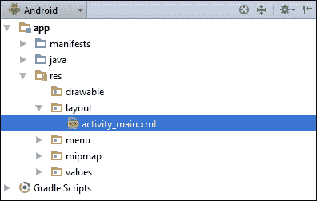
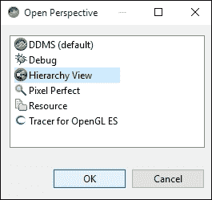
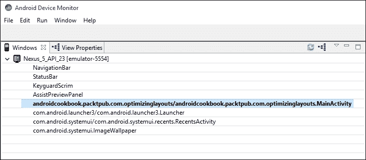

# 二、布局

在本章中，我们将涵盖以下主题:

*   定义和扩展布局
*   使用相对视频
*   使用线性布局
*   创建表格–表格布局和网格布局
*   使用列表视图、网格视图和适配器
*   运行时更改布局属性
*   使用层次查看器优化布局

# 简介

在安卓系统中，用户界面在**布局**中定义。布局可以用 XML 声明，也可以用代码动态创建。(建议用 XML 而不是代码来声明布局，以保持表示层与实现层的分离。)一个布局可以定义一个单独的`ListItem`，一个片段，甚至整个活动。布局文件存储在`/res/layout`文件夹中，并在代码中用以下标识符引用:`R.layout.<filename_without_extension>`。

安卓提供了各种有用的`Layout`类，包含并组织活动的单个元素(如按钮、复选框和其他`Views`)。`ViewGroup`对象是一个容器对象，作为安卓系列`Layout`类的基类。放置在布局中的视图形成层次结构，最上面的布局是父布局。

安卓提供了几种为特定目的设计的内置布局类型，例如`RelativeLayout`，它允许视图相对于其他元素定位。`LinearLayout`可以堆叠视图或将其水平对齐，具体取决于指定的方向。`TableLayout`可用于布局视图网格。在各种布局中，我们还可以通过`Gravity`调整视图，并通过`Weight`控制提供比例大小。布局和`ViewGroups`可以相互嵌套，以创建复杂的配置。提供了十几个不同的布局对象来管理小部件、列表、表格、图库和其他显示格式，此外，您还可以从基类派生来创建自己的自定义布局。

# 定义和扩展布局

使用安卓工作室向导创建新项目时，会自动创建`res/layout/activity_main.xml`文件(如下图截图所示)。然后，它用`setContentView(R.layout.activity_main)`对`onCreate()`回调中的 XML 文件进行膨胀。



对于这个食谱，我们将创建两个稍微不同的布局，并用一个按钮在它们之间切换。

## 做好准备

在 Android Studio 中创建新项目，并将其称为`InflateLayout`。项目创建后，展开`res/layout`文件夹，这样我们就可以编辑`activity_main.xml`文件。

## 怎么做...

1.  编辑`res/layout/activity_main.xml`文件，使其包括一个按钮，如这里所定义的:

    ```java
    <Button
        android:id="@+id/buttonLeft"
        android:layout_width="wrap_content"
        android:layout_height="wrap_content"
        android:text="Left Button"
        android:layout_centerVertical="true"
        android:layout_alignParentLeft="true"
        android:onClick="onClickLeft"/>
    ```

2.  现在复制`activity_main.xml`的，称之为 `activity_main2.xml`。更改按钮，使其与以下内容匹配:

    ```java
    <Button
        android:id="@+id/buttonRight"
        android:layout_width="wrap_content"
        android:layout_height="wrap_content"
        android:text="Right Button"
        android:layout_centerVertical="true"
        android:layout_alignParentRight="true"
        android:onClick="onClickRight"/>
    ```

3.  打开`MainActivity.java`，增加以下两种方法处理按钮点击:

    ```java
    public void onClickLeft(View view) {
        setContentView(R.layout.activity_main2);
    }

    public void onClickRight(View view) {
        setContentView(R.layout.activity_main);
    }
    ```

4.  在设备或模拟器上运行此应用，查看其运行情况。

## 它是如何工作的...

这里的关键是对`setContentView()`的调用，这是我们之前在自动生成的`onCreate()`代码中遇到过的。只需将一个布局标识传递给`setContentView()`，它就会自动放大布局。

这段代码旨在使这个概念易于理解，但是对于简单地更改按钮的属性来说，这就有些过分了(在本例中，我们可以只更改按钮单击时的对齐方式)。在`onCreate()`方法中，通常需要对布局进行一次膨胀，但是有时您可能想要手动膨胀布局，就像我们在这里所做的那样。(如果您手动处理方向更改，这将是一个很好的例子。)

## 还有更多...

除了使用资源标识来标识布局，就像我们在这里所做的那样，`setContentView()`还可以将视图作为参数，例如:

```java
findViewById(R.id.myView)
setContentView(myView);
```

## 另见

*   如前所述，关于更改屏幕布局的替代方法，请参见[第 5 章](05.html "Chapter 5. Exploring Fragments, AppWidgets, and the System UI")、*探索片段、应用部件和系统用户界面*中的*片段*主题

# 使用相对布局

正如在*简介*中提到的，`RelativeLayout`允许视图相对于彼此和父视图进行定位。`RelativeLayout`对于减少嵌套布局的数量特别有用，这对于降低内存和处理需求非常重要。

## 做好准备

创建一个新项目，并将其称为`RelativeLayout`。默认布局使用`RelativeLayout`，我们将使用它来水平和垂直对齐视图。

## 怎么做...

1.  打开`res/layout/activity_main.xml`文件，更改如下:

    ```java
    <TextView
        android:id="@+id/textView1"
        android:layout_width="wrap_content"
        android:layout_height="wrap_content"
        android:text="Centered"
        android:layout_centerVertical="true"
        android:layout_centerHorizontal="true" />
    <TextView
        android:id="@+id/textView2"
        android:layout_width="wrap_content"
        android:layout_height="wrap_content"
        android:text="Below TextView1"
        android:layout_below="@+id/textView1"
        android:layout_toLeftOf="@id/textView1" />
    <TextView
        android:id="@+id/textView3"
        android:layout_width="wrap_content"
        android:layout_height="wrap_content"
        android:text="Bottom Right"
        android:layout_alignParentBottom="true"
        android:layout_alignParentEnd="true" />
    ```

2.  运行代码，或在**设计**选项卡中查看布局

## 它是如何工作的...

这是一个非常简单的练习，但是它演示了几个`RelativeLayout`选项:`layout_centerVertical`、`layout_centerHorizontal`、`layout_below`、`layout_alignParentBottom`等等。

最常用的`RelativeLayout`布局属性包括:

*   `layout_below`:这个视图应该在指定视图的下方
*   `layout_above`:这个视图应该在指定视图的上方
*   `layout_alignParentTop`:将视图与父视图的上边缘对齐
*   `layout_alignParentBottom`:将视图与父视图的底边对齐
*   `layout_alignParentLeft`:将此视图与父视图的左边缘对齐
*   `layout_alignParentRight`:将视图与父视图的右边缘对齐
*   `layout_centerVertical`:在父视图中垂直居中
*   `layout_centerHorizontal`:在父视图中水平居中
*   `layout_center`: Center this View both horizontally and vertically within the parent

    ### 注

    完整的`RelativeLayout`参数列表，请访问:[。LayoutParams.html](http://developer.android.com/reference/android/widget/RelativeLayout.LayoutParams.html)。

## 还有更多...

与我们之前看到的不同，这里有一个使用`LinearLayout`将`TextView`居中的例子(创建与`RelativeLayout`的`layout_center`参数相同的效果):

```java
<?xml version="1.0" encoding="utf-8"?>
<LinearLayout xmlns:android="http://schemas.android.com/apk/res/android"
    android:orientation="horizontal"
    android:layout_width="match_parent"
    android:layout_height="match_parent"
    android:gravity="center">
    <LinearLayout
        android:layout_width="0dp"
        android:layout_height="wrap_content"
        android:layout_weight="1"
        android:gravity="center" >
        <TextView
            android:id="@+id/imageButton_speak"
            android:layout_width="wrap_content"
            android:layout_height="wrap_content"
            android:text="Centered" />
    </LinearLayout>
</LinearLayout>
```

请注意，该布局比等效的`RelativeLayout`(嵌套在父级`LinearLayout`中的`LinearLayout`)深一级。)虽然这是一个简单的例子，但是避免不必要的嵌套是一个好主意，因为这会影响性能，尤其是当布局被重复膨胀时(例如`ListItem`)。

## 另见

*   下一个食谱，*使用线性布局*，它会给你一个替代布局
*   有关高效布局设计的更多信息，请参见*使用层次查看器优化布局*方法

# 使用线性布局

另一个常见的布局选项是`LinearLayout`，它根据指定的方向将子视图排列成单列或单行。默认方向(如果未指定)是垂直的，这将视图对齐在一列中。

`LinearLayout`有一个在`RelativeLayout`中没有提供的关键特性—`weight`属性。我们可以在定义视图时指定`layout_weight`参数，以允许视图基于可用空间动态调整大小。选项包括让一个视图填充所有剩余空间(如果一个视图具有更高的权重)，让多个视图适合给定的空间(如果所有视图具有相同的权重)，或者根据视图的权重按比例分隔视图。

我们将创建一个带有三个`EditText`视图的`LinearLayout`来演示如何使用权重属性。对于本例，我们将使用三个`EditText`视图—一个输入`To Address`参数，另一个输入`Subject`，第三个输入`Message`。`To`和`Subject`视图将各为一行，剩余空间留给消息视图。

## 做好准备

创建一个新项目，并将其称为`LinearLayout`。我们将用`LinearLayout`替换在`activity_main.xml`创建的默认`RelativeLayout`。

## 怎么做...

1.  打开`res/layout/activity_main.xml`文件，替换如下:

    ```java
    <LinearLayout xmlns:android="http://schemas.android.com/apk/res/android"
        android:orientation="vertical"
        android:layout_width="match_parent"
        android:layout_height="match_parent">
        <EditText
            android:id="@+id/editTextTo"
            android:layout_width="match_parent"
            android:layout_height="wrap_content"
            android:hint="To" />
        <EditText
            android:id="@+id/editTextSubject"
            android:layout_width="match_parent"
            android:layout_height="wrap_content"
            android:hint="Subject" />
        <EditText
            android:id="@+id/editTextMessage"
            android:layout_width="match_parent"
            android:layout_height="0dp"
            android:layout_weight="1"
            android:gravity="top"
            android:hint="Message" />
    </LinearLayout>
    ```

2.  运行代码，或在**设计**选项卡中查看布局。

## 它是如何工作的...

当使用垂直方向和`LinearLayout`方向时，子视图被创建在一个单独的列中(相互堆叠)。前两个视图使用`android:layout_height="wrap_content"` 属性，给它们各一行。`editTextMessage`使用以下内容指定高度:

```java
android:layout_height="0dp"
android:layout_weight="1"
```

使用`LinearLayout`时，它告诉安卓根据体重计算身高。权重为 0(如果未指定，则为默认值)表示视图不应展开。在本例中，`editTextMessage`是唯一定义了权重的视图，因此它将单独扩展以填充父布局中的任何剩余空间。

### 类型

使用水平方向时，指定`android:layout_height="0dp"`(连同重量)让安卓计算宽度。

将重量属性视为百分比可能会有所帮助。在这种情况下，定义的总重量为 1，因此该视图获得 100%的剩余空间。如果我们给另一个视图分配 1 的权重，那么总数将是 2，因此这个视图将获得 50%的空间。尝试在其他视图中添加一个权重(确保将高度也更改为`0dp`)以查看其运行情况。

如果您给一个(或两个)其他视图添加了权重，您注意到文本位置了吗？没有为`gravity`指定值，文本只是保留在视图空间的中心。`editTextMessage`指定:`android:gravity="top"`，强制文本位于视图顶部。

## 还有更多...

可以使用按位`OR`组合多个属性选项。(Java 使用管道字符(|)表示`OR`)。例如，我们可以组合两个重力选项，使其沿着父对象的顶部对齐，并在可用空间内居中对齐:

```java
android:layout_gravity="top|center"
```

需要注意的是`layout_gravity`和`gravity`标签不是一回事。`layout_gravity`指示视图应位于其父视图的何处，`gravity`控制视图中内容的位置，例如，按钮上文本的对齐。

## 另见

*   上一个食谱，使用相对布局

# 创建表格–表格布局和网格布局

当您需要在用户界面中创建表格时，安卓提供了两个方便的布局选项:`TableLayout`(与`TableRow`一起)和`GridLayout`(在 API 14 中添加)。两种布局选项都可以创建外观相似的表格，但每种都使用不同的方法。使用`TableLayout`，在构建表格时会动态添加行和列。使用`GridLayout`，行和列的大小在布局定义中定义。

两种布局都不是更好的，只是用最好的布局来满足你的需求。我们将使用每种布局创建一个 3×3 的网格来进行比较，因为您可以很容易地发现自己使用了两种布局，即使是在同一个应用中。

## 做好准备

为了专注于布局并提供更容易的比较，我们将为这个配方创建两个独立的应用。创建两个新的安卓项目，第一个名为`TableLayout`，另一个名为`GridLayout`。

## 怎么做...

1.  从`TableLayout`项目开始，打开 **activity_main.xml** `.`将根布局改为`TableLayout`。
2.  将三个`TableRows`和三组`TextViews`加到每个`TableRow`上，创建一个 3×3 矩阵。出于演示目的，列标为 A-C，行标为 1-3，因此`TextViews`的第一行将是 A1、B1 和 C1。最终结果会是这样的:

    ```java
    <TableLayout
        xmlns:android="http://schemas.android.com/apk/res/android"
        xmlns:tools="http://schemas.android.com/tools"
        android:layout_width="match_parent"
        android:layout_height="match_parent">
        <TableRow
            android:layout_width="match_parent"
            android:layout_height="match_parent">
            <TextView
                android:layout_width="wrap_content"
                android:layout_height="wrap_content"
                android:text="A1"
                android:id="@+id/textView1" />
            <TextView
                android:layout_width="wrap_content"
                android:layout_height="wrap_content"
                android:text="B1"
                android:id="@+id/textView2" />
            <TextView
                android:layout_width="wrap_content"
                android:layout_height="wrap_content"
                android:text="C1"
                android:id="@+id/textView3" />
        </TableRow>
        <TableRow
            android:layout_width="match_parent"
            android:layout_height="match_parent">
            <TextView
                android:layout_width="wrap_content"
                android:layout_height="wrap_content"
                android:text="A2"
                android:id="@+id/textView4" />
            <TextView
                android:layout_width="wrap_content"
                android:layout_height="wrap_content"
                android:text="B2"
                android:id="@+id/textView5" />
            <TextView
                android:layout_width="wrap_content"
                android:layout_height="wrap_content"
                android:text="C2"
                android:id="@+id/textView6" />
        </TableRow>
        <TableRow
            android:layout_width="match_parent"
            android:layout_height="match_parent">
            <TextView
                android:layout_width="wrap_content"
                android:layout_height="wrap_content"
                android:text="A3"
                android:id="@+id/textView7" />
            <TextView
                android:layout_width="wrap_content"
                android:layout_height="wrap_content"
                android:text="B3"
                android:id="@+id/textView8" />
            <TextView
                android:layout_width="wrap_content"
                android:layout_height="wrap_content"
                android:text="C3"
                android:id="@+id/textView9" />
        </TableRow>
    </TableLayout>
    ```

3.  现在，打开项目编辑`activity_main.xml`。将根布局改为`GridLayout`。将`columnCount=3`和`rowCount=3`属性添加到`GridLayout` 元素中。
4.  现在，在`GridLayout`上增加九个`TextViews`。我们将使用与前面`TableLayout`相同的文本进行一致的比较。由于`GridView`不使用`TableRows`，前三个`TextViews`在第一排，后三个在第二排，以此类推。最终结果会是这样的:

    ```java
    <GridLayout
        xmlns:android="http://schemas.android.com/apk/res/android"
        android:layout_width="match_parent"
        android:layout_height="match_parent"
        android:columnCount="3"
        android:rowCount="3">
        <TextView
            android:layout_width="wrap_content"
            android:layout_height="wrap_content"
            android:text="A1"
            android:id="@+id/textView1" />
        <TextView
            android:layout_width="wrap_content"
            android:layout_height="wrap_content"
            android:text="B1"
            android:id="@+id/textView2" />
        <TextView
            android:layout_width="wrap_content"
            android:layout_height="wrap_content"
            android:text="C1"
            android:id="@+id/textView3" />
        <TextView
            android:layout_width="wrap_content"
            android:layout_height="wrap_content"
            android:text="A2"
            android:id="@+id/textView4" />
        <TextView
            android:layout_width="wrap_content"
            android:layout_height="wrap_content"
            android:text="B2"
            android:id="@+id/textView5" />
        <TextView
            android:layout_width="wrap_content"
            android:layout_height="wrap_content"
            android:text="C2"
            android:id="@+id/textView6" />
        <TextView
            android:layout_width="wrap_content"
            android:layout_height="wrap_content"
            android:text="A3"
            android:id="@+id/textView7" />
        <TextView
            android:layout_width="wrap_content"
            android:layout_height="wrap_content"
            android:text="B3"
            android:id="@+id/textView8" />
        <TextView
            android:layout_width="wrap_content"
            android:layout_height="wrap_content"
            android:text="C3"
            android:id="@+id/textView9" />
    </GridLayout>
    ```

5.  您可以运行应用或使用**设计**选项卡查看结果。

## 它是如何工作的...

在查看创建的表格时可以看到，表格在屏幕上看起来基本相同。主要区别在于创建它们的代码。

在`TableLayout` XML 中，每一行都使用`TableRow`添加到表格中。每个视图都成为一列。这不是必需的，因为单元格可以跳过或留空。(参见下节如何指定`TableRow`中的单元格位置。)

`GridLayout`采用相反的方法。创建表时会指定行数和列数。我们不必指定行或列信息(尽管我们可以，讨论如下)。安卓会自动按顺序将每个视图添加到单元格中。

## 还有更多...

首先，让我们看看布局之间更多的相似之处。这两种布局都能够拉伸列以使用剩余的屏幕空间。对于`TableLayout`，在 xml 声明中添加以下属性:

```java
android:stretchColumns="1"
```

`stretchColumns`指定要拉伸的列的(从零开始)索引。(`android:shrinkColumns`是可以收缩的列的从零开始的索引，因此表格可以适合屏幕。)

为了达到与`GridLayout`相同的效果，在 B 栏(`textView2`、`textView5`和`textView8`)的所有视图中添加以下属性:

```java
android:layout_columnWeight="1"
```

### 注

给定列中的所有单元格都必须定义重量，否则将无法拉伸。

现在，让我们来看看的一些差异，因为这确实是决定给定任务使用哪种布局的关键。首先要注意的是列和行是如何定义的。在`TableLayout`中，使用`TableRow`具体定义行。(Android 会根据单元格最多的行来确定表中的列数。)定义视图时使用`android` : `layoutColumn`属性来指定列。

相比之下，使用`GridLayout`，在定义表格时会指定行数和列数(如前所示，使用`columnCount`和`rowCount`)。)

在前面的例子中，我们只是将`TextViews`添加到`GridLayout`中，并让系统自动定位它们。我们可以通过在定义视图时指定行和列的位置来改变这种行为，例如:

```java
android:layout_row="2"
android:layout_column="2"
```

### 类型

安卓在添加每个视图后会自动递增单元格计数器，所以下一个*视图也应该指定行和列，否则可能得不到预期的结果。*

 *像*线性布局*配方中显示的`LinearLayout`一样，`GridLayout`也提供了支持水平(默认)和垂直的方向属性。方向决定了单元格的放置方式。(水平首先填充列，然后向下移动到下一行。垂直填充每行的第一列，然后移动到下一列。)

# 使用列表视图、网格视图和适配器

`ListView`和`GridView`都是`ViewGroup`的后代，但是它们更像视图使用，因为它们是数据驱动的。换句话说，不是定义所有可能在设计时填充`ListView`(或`GridView`)的视图，而是根据传递给视图的数据动态创建内容。(可能会在设计时创建`ListItem`的布局，以便在运行时控制数据的外观。)

例如，如果您需要向用户显示国家列表，您可以创建一个`LinearLayout`并为每个国家添加一个按钮。这种方法有几个问题:确定可用的国家，保持按钮列表最新，有足够的屏幕空间来容纳所有国家，等等。否则，您可以创建一个国家列表来填充`ListView`，然后为每个条目创建一个按钮。

我们将使用第二种方法创建一个示例，从一组国家名称中填充一个`ListView`。

## 做好准备

在 Android Studio 中创建新项目，并将其称为`ListView`。默认的`ActivityMain`类扩展了`Activity`类。我们将改为扩展`ListActivity`类。然后我们将创建一个简单的字符串列表，并将其绑定到`ListView`，以便在运行时派生按钮。

## 怎么做...

1.  打开**MainActivity.java**文件并更改基础声明，这样它将扩展`ListActivity`而不是`Activity`类:

    ```java
    public class MainActivity extends ListActivity {
    ```

2.  更改`onCreate()`使其匹配以下内容:

    ```java
    protected void onCreate(Bundle savedInstanceState) {
      super.onCreate(savedInstanceState);
      String[] countries = new String[]{"China", "France", "Germany", "India", "Russia", "United Kingdom", "United States"};

      ListAdapter countryAdapter = new ArrayAdapter<String>(this, android.R.layout.simple_list_item_1, countries);
      setListAdapter(countryAdapter);

        getListView().setOnItemClickListener(new AdapterView.OnItemClickListener() {
            @Override
            public void onItemClick(AdapterView<?> parent, Viewview, int position, long id) {
                String s = ((TextView) view).getText() + " " +position;
                Toast.makeText(getApplicationContext(), s, 
                    Toast.LENGTH_SHORT).show();
            }
        });
    }
    ```

3.  现在在模拟器或设备上运行应用，查看填充的`ListView`。

## 它是如何工作的...

我们首先创建一个简单的国家名称数组，然后用它来填充一个`ListAdapter`。在这个例子中，我们在构建`ListAdapter`时使用了`ArrayAdapter`，但是安卓也有其他几种适配器类型可用。例如，如果您的数据存储在数据库中，您可以使用`CursorAdapter`。如果内置类型之一不能满足您的需求，您可以随时使用`CustomAdapter`。

我们用以下代码创建适配器:

```java
ListAdapter countryAdapter = new ArrayAdapter<String>(this, android.R.layout.simple_list_item_1, countries);
```

这里，我们使用字符串数组(最后一个参数)实例化`ArrayAdapter`。注意`android.R.layout.simple_list_item_1`参数？这定义了按钮的布局。在这里，我们使用的是安卓提供的布局之一，但是我们可以创建自己的布局并传递我们的标识。

一旦我们准备好适配器，我们只需通过`setListAdapter()` 调用将其传递给底层`ListView`。(底层的`ListView`来自于延伸`ListViewActivity`。)最后，我们实现`setOnItemClickListener`当用户按下列表中的一个按钮(代表一个国家)时显示一个吐司。

`ListViews`在安卓中非常常见，因为它们通过滚动视图有效利用屏幕空间，这在小屏幕上非常方便。`ScrollView`布局提供了一种创建类似滚动效果的替代方法。这两种方法的主要区别在于`ScrollView`布局在显示给用户之前是完全膨胀的，而`ListView`仅膨胀将可见的视图。对于有限的数据，这可能不是问题，但是对于更大的数据集，应用可能会在列表显示之前耗尽内存。

此外，由于`ListView`由数据适配器驱动，数据可以很容易地改变。即使在我们有限的例子中，在屏幕上添加一个新的国家就像在国家列表中添加名字一样简单。更重要的是，当用户使用应用时，可以在运行时更新列表(例如，从网站下载更新的列表以显示实时选项)。

## 还有更多...

`ListView`也支持使用`setChoiceMode()`方法的多选模式。要在动作中查看，请在`setListAdapter()`后添加以下代码行:

```java
getListView().setChoiceMode(ListView.CHOICE_MODE_MULTIPLE);
```

然后将`ListItem`布局从`android.R.layout.simple_list_item_1`改为`android.R.layout.simple_list_item_checked`。

虽然大多数需要滚动列表的应用都转到了`ListView`，但安卓也提供了`GridView`。它们在功能上非常相似，甚至使用相同的数据适配器。主要区别是可视化，允许多列。为了更好的理解，让我们把`ListView`的例子改成`GridView`。

首先，我们需要将`MainActivity`改为再次从`Activity`延伸，而不是`ListActivity`。(这将撤销前面的步骤 1。)然后，用以下代码替换`onCreate()`:

```java
protected void onCreate(Bundle savedInstanceState) {
    super.onCreate(savedInstanceState);
    GridView gridView = new GridView(this);
    setContentView(gridView);
    String[] countries = new String[]{"China", "France", "Germany", "India", "Russia", "United Kingdom", "United States"};
    ListAdapter countryAdapter = new ArrayAdapter<String>(this, android.R.layout.simple_list_item_1, countries);
    gridView.setAdapter(countryAdapter);
    gridView.setNumColumns(2);
    gridView.setOnItemClickListener(new AdapterView.OnItemClickListener() {
        @Override
        public void onItemClick(AdapterView<?> parent, View view, int position, long id) {
                String s = ((TextView) view).getText() + " " + position;
            Toast.makeText(getApplicationContext(), s, Toast.LENGTH_SHORT).show();
        }
    });
}
```

如您所见，`GridView`的设置代码比`ListView`多。`onCreate()`方法创建一个新的`GridView`并在`setContentView()`调用中传递它。(我们使用了`setContentView`的这个变体，就像在*中提到的定义和膨胀一个布局*，而不是创建一个只有一个`GridView`的布局，但是最终的结果是一样的。)

`ListViewActivity`基地类处理了大部分，但是`GridView`没有对应的活动类来扩展。

# 在运行时更改布局属性

在安卓开发中，通常首选的做法是用 XML 定义用户界面，用 Java 定义应用代码，将用户界面代码与应用代码分开。有时候，从 Java 代码中改变(甚至构建)用户界面要容易得多，也更有效率。幸运的是，这在安卓中很容易得到支持。

我们在前面的食谱中看到了一个从代码修改布局的小例子，在这里我们设置了要在代码中显示的`GridView`列的数量。在本食谱中，我们将获得对`LayoutParams`对象的引用，以在运行时更改边距。

## 做好准备

在这里，我们将使用 XML 设置一个简单的布局，并使用`LinearLayout.LayoutParams`对象在运行时更改视图的边距。

## 怎么做....

1.  打开`activity_main.xml`文件，将布局从`RelativeLayout`更改为`LinearLayout`。看起来如下:

    ```java
    <LinearLayout xmlns:android="http://schemas.android.com/apk/res/android"
        xmlns:tools="http://schemas.android.com/tools"
        android:layout_width="match_parent"
        android:layout_height="match_parent">
    </LinearLayout>
    ```

2.  添加一个文本视图，并包括如下标识:

    ```java
    android:id="@+id/textView"
    ```

3.  添加`Button`并包括如下标识:

    ```java
    android:id="@+id/button"
    ```

4.  打开`MainActivity.java`并在`onCreate()`方法中添加以下代码来设置`onClick`事件监听器:

    ```java
    Button button = (Button)findViewById(R.id.button);
    button.setOnClickListener(new View.OnClickListener() {
        @Override
        public void onClick(View view) {
            ((TextView)findViewById(R.id.textView)).setText("Changed at runtime!");
            LinearLayout.LayoutParams params = (LinearLayout.LayoutParams)view.getLayoutParams();
            params.leftMargin += 5;
        }
    });
    ```

5.  在设备或模拟器上运行程序。

## 它是如何工作的...

每个视图(因此`ViewGroup`)都有一组与之关联的布局参数。特别是，所有视图都有参数告知其父视图所需的高度和宽度。这些是用`layout_height`和`layout_width`参数定义的。我们可以通过`getLayoutParams()`方法从代码中访问这些布局信息。布局信息包括布局高度、宽度、边距和任何特定于类的参数。在本例中，我们通过获取按钮`LayoutParams`并更改边距来移动每次点击的按钮。

# 使用层次查看器优化布局

在你可以开始优化你的布局之前，它有助于了解安卓布局过程。当活动第一次显示时，开始膨胀布局。有三个步骤:

*   **测量**:这是视图决定它们的大小，从父母开始，贯穿所有的孩子。父母可能需要多次给孩子打电话才能算出最终的尺寸。
*   **布局**:这里是，父母决定孩子的位置
*   **绘制**:这是视图实际渲染的地方

这个过程从父节点开始，然后父节点迭代所有的子节点。那些孩子通过他们的孩子进行迭代。这将创建布局树，父节点成为树中的根节点。

**层次查看器** 是一个包含在**安卓软件开发工具包** 中的工具，用于检查布局。它以图形方式显示布局树以及每个视图/节点的定时结果。通过检查树形布局和时序；你可以寻找低效的设计和瓶颈。有了这些信息，你就可以优化布局了。

对于这个配方，我们将使用层次查看器使用相对布局配方检查*中给出的示例布局。*

## 做好准备

在*的*部分还有更多…* 使用相对布局*配方，显示了一个`LinearLayout`示例来突出布局之间的差异。评论指出`LinearLayout`需要嵌套布局。我们将使用示例`LinearLayout`创建一个名为`OptimizingLayouts`的新项目。然后，我们将使用层次查看器检查布局。我们将需要一个根安卓设备或这个食谱模拟器。

### 注

层次查看器将只连接到根设备，如仿真器。

## 怎么做...

1.  在安卓工作室打开`OptimizingLayouts`项目。在您的根设备(或模拟器)上运行项目，并确保屏幕可见(如果需要，请解锁)。
2.  在安卓工作室，进入以下菜单选项启动安卓设备监视器:**工具** | **安卓** | **安卓设备监视器**。
3.  In Android Device Monitor, change to the Hierarchy View perspective, by going to **Window** | **Open Perspective…** this will bring up the following dialog:

    

4.  现在点击**等级查看器**和**确定**。
5.  In the **Windows** section on the left is the list of devices with the running processes. Click on the `OptimizingLayouts` process to inspect the layout.

    

6.  See the graphical representation of this activity in the **TreeView** section (in the center pane, which occupies most of the Hierarch Viewer perspective).

    

## 它是如何工作的...

树形布局部分显示了构成该布局的视图的图形层次结构，以及布局时间。(不幸的是，对于这个演示，渲染时间对于视觉颜色编码参考来说太快了。)这个例子中重要的是前面显示的嵌套`LinearLayouts`。(值得花一些时间来探索组成这个布局的其他视图，这样您就可以看到安卓在幕后为我们做了什么。)

如`RelativeLayout`示例中已经提到的，解决方案是使用`RelativeLayout`重新设计该布局。理想情况下，我们想要更宽、更平的布局，而不是深度嵌套的布局，以减少调整步骤中所需的迭代次数。出于计时的目的，这显然是一个微不足道的例子，但即使是这个例子也会产生影响。想象一下，基于这种低效的布局，用户浏览一个包含数千个项目的`ListView`。如果您在滚动时遇到口吃，您的优化步骤可以从检查层次查看器中的布局开始。

## 还有更多...

**Lint** 是 Android SDK 附带的另一个工具，内置了 Android Studio 提供的支持。默认情况下，您已经在使用 Lint 检查代码中的问题，例如不推荐使用的 API 调用、目标 API 级别不支持的 API 调用、安全问题等等。出于优化布局的考虑，Lint 将自动检查的一些条件包括:

*   深度布局-默认最大值为 10 层
*   嵌套权重，这不利于性能
*   无用的父母
*   无用的叶子

如果您在安卓工作室中查看该布局的 Lint 警告，您将在第二个`LinearLayout`元素上看到以下警告:


`ViewStub` 也可以用来优化布局。把`ViewStub`的当成你布局的“懒负荷”。`ViewStub`中的布局在需要之前不会膨胀，这减少了膨胀所需的视图。布局渲染速度更快，占用的内存更少。这是一个很好的方法来获得很少使用的功能，如`Print`功能，在需要时可用，但在不需要时不占用内存。这里有一个`ViewStub`的例子:

```java
<ViewStub
    android:id="@+id/viewStubPrint"
    android:inflatedId="@id/print"
    android:layout="@layout/print"
    android:layout_width="wrap_content"
    android:layout_height="wrap_content"/>
```

实际充气`ViewStub`有两种方式:

*   将`ViewStub`的能见度参数设置为`VISIBLE` :

    ```java
    ((ViewStub) findViewById(R.id.viewStubPrint)).setVisibility(View.VISIBLE);
    ```

*   调用`ViewStub`上的`inflate()`方法:

    ```java
    View view = ((ViewStub) findViewById(R.id.viewStubPrint)).inflate();
    ```

一旦`ViewStub`被充气，则`ViewStub` ID 将从布局中移除并用充气的 ID 替换。*