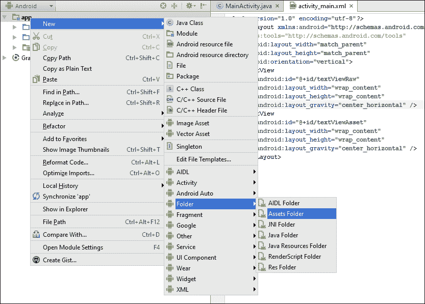

# 六、使用数据

在本章中，我们将涵盖以下主题:

*   存储简单数据
*   将文本文件读写到内部存储器
*   将文本文件读写到外部存储器
*   在项目中包含资源文件
*   创建和使用 SQLite 数据库
*   使用加载器在后台访问数据

# 简介

由于几乎任何应用，无论大小，都需要保存某种数据，安卓提供了许多选择。从保存简单值到使用 SQLite 创建完整数据库，存储选项包括以下内容:

*   共享首选项:简单的名称/值对
*   内部存储:私有存储中的数据文件
*   外部存储:私有或公共存储中的数据文件
*   SQLite 数据库:私有数据可以通过内容提供者公开数据
*   云存储:私有服务器或服务提供商

使用内部和外部存储各有利弊。我们将在此列出一些差异，以帮助您决定是使用内部存储还是外部存储:

*   **内部存储**:
    *   与外部存储不同，内部存储总是可用的，但通常可用空间较少
    *   用户无法访问文件(除非设备具有根访问权限)
    *   卸载应用时，文件会自动删除(或使用应用管理器中的清除缓存/清除文件选项)
*   **外部存储**:
    *   设备可能没有外部存储器，或者可能无法访问(例如当它连接到计算机时)
    *   用户(和其他应用)可以访问文件，而不需要 root 访问权限
    *   卸载应用时不会删除文件(除非您使用`getExternalFilesDir()`获取特定于应用的公共存储)

在本章中，我们将演示如何使用共享首选项、内部和外部存储以及 SQLite 数据库。对于云存储，看一下[第 12 章](12.html "Chapter 12. Telephony, Networks, and the Web")、*电话、网络和网络*中的互联网食谱以及[第 15 章](15.html "Chapter 15. The Backend as a Service Options")、*后端即服务选项*中的在线服务提供商。

# 存储简单数据

存储简单数据是常见的要求，安卓使用 Preferences API 使其变得简单。它也不仅限于用户偏好；您可以使用名称/值对存储任何基本数据类型。

我们将演示从`EditText`保存一个名称，并在应用启动时显示它。下面的屏幕截图显示了应用第一次没有保存名称时的外观，以及在启动时保存名称后的外观:


## 做好准备

在安卓工作室创建一个新项目，并将其命名为:`Preferences`。使用默认的**电话&平板电脑**选项，并在提示输入**活动类型**时选择**空活动**。

## 怎么做...

我们将使用现有的**文本视图**显示**欢迎回来**消息，并创建一个新的`EditText`按钮来保存名称。首先打开`activity_main.xml`:

1.  替换现有的**文本视图**并添加以下新视图:

    ```java
    <TextView
        android:id="@+id/textView"
        android:text="Hello World!"
        android:layout_width="wrap_content"
        android:layout_height="wrap_content" />

    <EditText
        android:id="@+id/editTextName"
        android:layout_width="wrap_content"
        android:layout_height="wrap_content"
        android:layout_centerVertical="true"
        android:layout_centerHorizontal="true"
        android:hint="Enter your name" />

    <Button
        android:id="@+id/button"
        android:layout_width="wrap_content"
        android:layout_height="wrap_content"
        android:text="Save"
        android:layout_centerHorizontal="true"
        android:layout_below="@id/editTextName"
        android:onClick="saveName"/>
    ```

2.  打开`ActivityMain.java`并添加以下全局声明:

    ```java
    private final String NAME="NAME";
    private EditText mEditTextName;
    ```

3.  将以下代码添加到`onCreate()`以保存对`EditText`的引用并加载任何已保存的名称:

    ```java
    TextView textView = (TextView)findViewById(R.id.textView);
    SharedPreferences sharedPreferences = getPreferences(MODE_PRIVATE);
    String name = sharedPreferences.getString(NAME,null);
    if (name==null) {
        textView.setText("Hello");
    } else {
        textView.setText("Welcome back " + name + "!");
    }
    mEditTextName = (EditText)findViewById(R.id.editTextName);
    ```

4.  增加以下`saveName()`方法:

    ```java
    public void saveName(View view) {
        SharedPreferences.Editor editor = getPreferences(MODE_PRIVATE).edit();
        editor.putString(NAME, mEditTextName.getText().toString());
        editor.commit();
    }
    ```

5.  在设备或模拟器上运行程序。因为我们正在演示持久化数据，它在`onCreate()`期间加载名称，所以保存一个名称并重新启动程序来查看它的加载。

## 它是如何工作的...

要加载名称，我们首先要获得对`SharedPreference`的引用，这样我们就可以调用`getString()`方法。我们为我们的名称/值对传入密钥，如果找不到密钥，则传入要返回的默认值。

要保存首选项，我们首先需要获取对首选项编辑器的引用。我们用`putString()`跟着用`commit().`没有`commit()`就不会保存改动。

## 还有更多...

我们的示例将所有首选项存储在一个文件中。我们也可以使用`getSharedPreferences()`和传入名称将偏好存储在不同的文件中。如果您想为多个用户创建单独的配置文件，可以使用此选项。

# 读写一个文本文件到内部存储器

当简单的名称/值对不够用时，安卓也支持常规的文件操作，包括处理文本和二进制数据。

下面的食谱演示了如何读写文件到内部或私有存储器。

## 做好准备

在 Android Studio 中创建新项目，并将其称为:`InternalStorageFile`。使用默认的**电话&平板电脑**选项，并在提示输入**活动类型**时选择**空活动**。

## 怎么做...

为了演示阅读和书写文本，我们需要一个带有`EditText`和两个按钮的布局。首先打开`main_activity.xml`，按照以下步骤操作:

1.  将现有的`<TextView>` 元素替换为以下视图:

    ```java
    <EditText
        android:id="@+id/editText"
        android:layout_width="wrap_content"
        android:layout_height="wrap_content"
        android:inputType="textMultiLine"
        android:ems="10"
        android:layout_above="@+id/buttonRead"
        android:layout_alignParentTop="true"
        android:layout_centerHorizontal="true" />
    <Button
        android:layout_width="wrap_content"
        android:layout_height="wrap_content"
        android:text="Read"
        android:id="@+id/buttonRead"
        android:layout_centerVertical="true"
        android:layout_centerHorizontal="true"
        android:onClick="readFile"/>
    <Button
        android:layout_width="wrap_content"
        android:layout_height="wrap_content"
        android:text="Write"
        android:id="@+id/buttonWrite"
        android:layout_below="@+id/buttonRead"
        android:layout_centerHorizontal="true"
        android:onClick="writeFile"/>
    ```

2.  现在打开`ActivityMain.java`并添加以下全局变量:

    ```java
    private final String FILENAME="testfile.txt";
    EditText mEditText;
    ```

3.  在`setContentView ()`之后的`onCreate()`方法中添加以下内容:

    ```java
    mEditText = (EditText)findViewById(R.id.editText);
    ```

4.  增加以下`writeFile()`方法:

    ```java
    public void writeFile(View view) {
        try {
            FileOutputStream fileOutputStream = openFileOutput(FILENAME, Context.MODE_PRIVATE);
            fileOutputStream.write(mEditText.getText().toString().getBytes());
            fileOutputStream.close();
        } catch (java.io.IOException e) {
            e.printStackTrace();
        }
    }
    ```

5.  现在添加`readFile()`方法:

    ```java
    public void readFile(View view) {
        StringBuilder stringBuilder = new StringBuilder();
        try {
            InputStream inputStream = openFileInput(FILENAME);
            if ( inputStream != null ) {
                InputStreamReader inputStreamReader = new InputStreamReader(inputStream);
                BufferedReader bufferedReader = new BufferedReader(inputStreamReader);
                String newLine = null;
                while ((newLine = bufferedReader.readLine()) != null ) {
                    stringBuilder.append(newLine+"\n");
                }
                inputStream.close();
            }
        } catch (java.io.IOException e) {
            e.printStackTrace();
        }
        mEditText.setText(stringBuilder);
    }
    ```

6.  在设备或仿真器上运行程序。

## 它是如何工作的...

我们分别使用`InputStream`和`FileOutputStream`类进行读写。写入文件就像从`EditText`获取文本并调用`write()`方法一样简单。

读回内容要稍微复杂一些。我们可以使用`FileInputStream`类进行阅读，但是当处理文本时，助手类使它变得更容易。在我们的例子中，我们用`openFileInput()`打开文件，它返回一个`InputStream`对象。然后我们用`InputStream`得到一个`BufferedReader`，提供`ReadLine()`方法。我们遍历文件中的每一行，并将其附加到我们的`StringBuilder`中。当我们读完文件后，我们将文本分配给`EditText`。

### 类型

我们之前的文件是在应用的私有数据文件夹中创建的。要查看文件的内容，您可以使用安卓设备监视器将文件拖到您的计算机上。完整的文件路径是:`/data/data/com.packtpub.androidcookbook.` `internalstoragetile/files/testfile.txt`。

以下截图显示了通过**安卓设备监视器**查看时文件的显示方式:


### 注

您将需要一个具有 root 访问权限的设备来查看前面显示的私有文件夹。

## 还有更多...

让我们看一些可能有帮助的附加信息。

### 缓存文件

如果你只需要暂时存储数据，你也可以使用缓存文件夹。以下方法将缓存文件夹作为`File`对象返回(下一个配方演示了如何使用`File`对象):

```java
getCacheDir()
```

缓存文件夹的主要好处是，如果存储空间不足，系统可以清除缓存。(用户也可以从设置中的应用管理中清除缓存文件夹。)

例如，如果您的应用下载新闻文章，您可以将这些文章存储在缓存中。当您的应用启动时，您可以显示已经下载的新闻。这些文件不是使您的应用工作所必需的。如果系统资源不足，可以在不影响应用的情况下清除缓存。(即使系统可能会清除缓存，您的应用删除旧文件仍然是一个好主意。)

## 另见

*   下一个食谱，*读写一个文本文件到外部存储器*。

# 读写一个文本文件到外部存储器

读写文件到外存的过程与使用内存基本相同。的区别在于获得对存储位置的引用。此外，如*简介*中所述，外部存储可能不可用，因此最好在尝试访问之前检查可用性。

这个食谱将读写一个文本文件，就像我们在前面的食谱中所做的那样。我们还将演示如何在访问外部存储之前检查它的状态。

## 做好准备

在 Android Studio 中创建新项目，并将其称为:`ExternalStorageFile`。使用默认的**电话&平板电脑**选项，并在提示输入**活动类型**时选择**空活动**。我们将使用与前一个食谱相同的布局，所以如果你已经输入了，你可以复制粘贴。否则，使用上一个配方中步骤 1 的布局，*读写一个文本文件到内部存储器*。

## 怎么做...

正如前面在*准备*部分提到的，我们将使用上一个食谱中的布局。布局文件完成后，第一步是添加对外部存储器的写权限。以下是步骤:

1.  打开安卓清单，添加权限后的:

    ```java
    <uses-permission android:name="android.permission.WRITE_EXTERNAL_STORAGE" />
    ```

2.  接下来，打开`ActivityMain.java`并添加以下全局变量:

    ```java
    private final String FILENAME="testfile.txt";
    EditText mEditText;
    ```

3.  在`setContentView ()`之后的`onCreate()`方法中添加以下内容:

    ```java
    mEditText = (EditText)findViewById(R.id.editText);
    ```

4.  增加以下两种检查存储状态的方法:

    ```java
    public boolean isExternalStorageWritable() {
        if (Environment.MEDIA_MOUNTED.equals(Environment.getExternalStorageState())) {
            return true;
        }
        return false;
    }

    public boolean isExternalStorageReadable() {
        if (Environment.MEDIA_MOUNTED.equals(Environment.getExternalStorageState()) ||
                Environment.MEDIA_MOUNTED_READ_ONLY.equals(Environment.getExternalStorageState())) {
            return true;
        }
        return false;
    }
    ```

5.  增加以下`writeFile()`方法:

    ```java
    public void writeFile(View view) {
        if (isExternalStorageWritable()) {
            try {
                File textFile = new File(Environment.getExternalStorageDirectory(), FILENAME);
                FileOutputStream fileOutputStream = new FileOutputStream(textFile);
                fileOutputStream.write(mEditText.getText().toString().getBytes());
                fileOutputStream.close();
            } catch (java.io.IOException e) {
                e.printStackTrace();
                Toast.makeText(this, "Error writing file", Toast.LENGTH_LONG).show();
            }
        } else {
            Toast.makeText(this, "Cannot write to External Storage", Toast.LENGTH_LONG).show();
        }
    }
    ```

6.  在 `readFile()` 后面加上方法:

    ```java
    public void readFile(View view) {
        if (isExternalStorageReadable()) {
            StringBuilder stringBuilder = new StringBuilder();
            try {
                File textFile = new File(Environment.getExternalStorageDirectory(), FILENAME);
                FileInputStream fileInputStream = new FileInputStream(textFile);
                if (fileInputStream != null ) {
                    InputStreamReader inputStreamReader = new InputStreamReader(fileInputStream);
                    BufferedReader bufferedReader = new BufferedReader(inputStreamReader);
                    String newLine = null;
                    while ( (newLine = bufferedReader.readLine()) != null ) {
                        stringBuilder.append(newLine+"\n");
                    }
                    fileInputStream.close();
                }
                mEditText.setText(stringBuilder);
            } catch (java.io.IOException e) {
                e.printStackTrace();
                Toast.makeText(this, "Error reading file", Toast.LENGTH_LONG).show();
            }
        } else {
            Toast.makeText(this, "Cannot read External Storage", Toast.LENGTH_LONG).show();
        }
    }
    ```

7.  在带有外部存储的设备或仿真器上运行程序。

## 它是如何工作的...

对于内部和外部存储，读取和写入文件基本相同。主要的区别在于，我们应该在尝试访问外部存储器之前检查外部存储器的可用性，这是我们使用`isExternalStorageWritable()`和`isExternalStorageReadable()`方法进行的。检查存储状态时，`MEDIA_MOUNTED`表示我们可以对其进行读写。

与内部存储示例不同，我们请求工作路径，就像在这一行代码中所做的那样:

```java
File textFile = new File(Environment.getExternalStorageDirectory(), FILENAME);
```

实际的阅读和写作是在同一个班级完成的，因为只是地点不同。

### 类型

硬编码外部文件夹路径是不安全的。不同版本的操作系统之间，尤其是硬件制造商之间的路径可能会有所不同。最好一直叫`getExternalStorageDirectory()`，如图所示。

## 还有更多...

下面讨论一些附加信息。

### 获取公共文件夹

`getExternalStorageDirectory()`方法返回外部存储器的根文件夹。如果您希望获取特定的公共文件夹，如`Music`或`Ringtone`文件夹，请使用`getExternalStoragePublicDirectory()`并输入所需的文件夹类型，例如:

```java
getExternalStoragePublicDirectory(Environment.DIRECTORY_MUSIC)
```

### 检查可用空间

内部和外部存储一致的一个问题是空间有限。如果提前知道需要多少空间，可以在`File`对象上调用`getFreeSpace()`方法。(`getTotalSpace()`将返回总空间。)下面是一个使用调用`getFreeSpace()`的简单示例:

```java
if (Environment.getExternalStorageDirectory().getFreeSpace() < RQUIRED_FILE_SPACE) {
    //Not enough space
} else {
    //We have enough space
}
```

### 删除文件

通过`File`对象有许多辅助方法可用，包括删除文件。如果我们想删除我们在示例中创建的文本文件，我们可以如下调用`delete()`:

```java
textFile.delete()
```

### 使用目录

虽然被称为`File`对象，但它也支持目录命令，例如创建和删除目录。如果要创建或删除目录，构建`File`对象，然后调用各自的方法:`mkdir()`和`delete()`。(还有一种叫做`mkdirs()`(复数)的方法也可以创建父文件夹。)有关完整列表，请参见以下链接。

### 防止文件包含在图库中

安卓采用了一个**媒体扫描仪** ，自动将声音、视频和图像文件包含在系统集合中，例如图像库。要排除您的目录，请在与您想要排除的文件相同的目录中创建一个名为`.nomedia`的空文件(注意前面的句点)。

## 另见

*   欲了解 `File`课程中可用方法的完整列表，请访问[http://developer.android.com/reference/java/io/File.html](http://developer.android.com/reference/java/io/File.html)

# 在项目中包含资源文件

安卓提供了两个选项来将文件包含在你的项目中:`raw`文件夹和`Assets`文件夹。您使用哪个选项取决于您的要求。首先，我们将简要概述每个选项，以帮助您决定何时使用每个选项:

*   **原始文件**
    *   包含在资源目录中:`/res/raw`
    *   作为资源，通过原始标识符`R.raw.<resource>`访问
    *   存储 MP3、MP4 和 OOG 文件等媒体文件的好地方
*   **资产档案**
    *   创建在您的 APK 中编译的文件系统(难道*没有*提供资源标识)
    *   使用文件名访问文件，通常会使动态创建的名称更容易使用
    *   有些应用编程接口不支持资源标识符，因此需要将其作为资产包括在内

通常，`raw`文件更容易处理，因为它们是通过资源标识符访问的。正如我们将在本食谱中演示的那样，主要区别在于如何访问文件。在这个例子中，我们将加载一个`raw`文本文件和一个`asset`文本文件并显示内容。

## 做好准备

在 Android Studio 中创建新项目，并将其称为:`ReadingResourceFiles`。使用默认的**电话&平板电脑**选项，并在提示输入**活动类型**时选择**空活动**。

## 怎么做...

为了演示如何从两个资源位置读取内容，我们将创建一个拆分布局。我们还需要创建两个资源文件夹，因为它们不包括在默认的安卓项目中。以下是步骤:

1.  打开`activity_main.xml`并用以下布局替换内容:

    ```java
    <?xml version="1.0" encoding="utf-8"?>
    <LinearLayout xmlns:android="http://schemas.android.com/apk/res/android"
        xmlns:tools="http://schemas.android.com/tools"
        android:layout_width="match_parent"
        android:layout_height="match_parent"
        android:orientation="vertical">
        <TextView
            android:id="@+id/textViewRaw"
            android:layout_width="match_parent"
            android:layout_height="0dp"
            android:layout_weight="1"
            android:gravity="center_horizontal|center_vertical"/>
        <TextView
            android:id="@+id/textViewAsset"
            android:layout_width="match_parent"
            android:layout_height="0dp"
            android:layout_weight="1"
            android:gravity="center_horizontal|center_vertical"/>
    </LinearLayout>
    ```

2.  在 res 文件夹中创建`raw` 资源文件夹。将显示为:`res/raw`。
3.  右键单击`raw`文件夹，选择**新建** | **文件**，新建一个文本文件。命名文件`raw_text.txt`并在文件中键入一些文本。(此文本将在您运行应用时显示。)
4.  Create the `asset` folder. The `asset` folder is trickier because of the location. Fortunately, Android Studio provides a menu option that makes creating it very easy. Go to the **File** menu (or right-click on the **app** node) and select **New** | **Folder** | **Assets Folder** as shown in this screenshot:

    

5.  Create another text file in the asset folder called `asset_text.txt`. Again, whatever text you type here will be shown when you run the app. Here's how the final result should look after both text files are created:

    

6.  现在是的时候了。打开`MainActivity.java`添加以下方法读取文本文件(传入方法):

    ```java
    private String getText(InputStream inputStream) {
        StringBuilder stringBuilder = new StringBuilder();
        try {;
            if ( inputStream != null ) {
                InputStreamReader inputStreamReader = new InputStreamReader(inputStream);
                BufferedReader bufferedReader = new BufferedReader(inputStreamReader);
                String newLine = null;
                while ((newLine = bufferedReader.readLine()) != null ) {
                    stringBuilder.append(newLine+"\n");
                }
                inputStream.close();
            }
        } catch (java.io.IOException e) {
            e.printStackTrace();
        }
        return stringBuilder.toString();
    }
    ```

7.  最后，将以下代码添加到`onCreate()`方法中:

    ```java
    TextView textViewRaw = (TextView)findViewById(R.id.textViewRaw);
    textViewRaw.setText(getText(this.getResources().openRawResource(R.raw.raw_text)));

    TextView textViewAsset = (TextView)findViewById(R.id.textViewAsset);
    try {
        textViewAsset.setText(getText(this.getAssets().open("asset_text.txt")));
    } catch (IOException e) {
        e.printStackTrace();
    }
    ```

8.  在设备或模拟器上运行程序。

## 它是如何工作的...

综上所述，唯一的区别在于我们如何获得对每个文件的引用。这一行代码读取`raw`资源:

```java
this.getResources().openRawResource(R.raw.raw_text)
```

该代码读取`asset`文件:

```java
this.getAssets().open("asset_text.txt")
```

两个调用都返回一个`InputStream`，这个`getText()`方法用来读取文件内容。不过值得注意的是，打开`asset`文本文件的调用需要额外的`try` / `catch`。正如在配方介绍中提到的，资源被编入索引，所以我们有编译时验证，而`asset`文件夹没有。

## 还有更多...

一种常见的方法是将资源包含在您的 APK 中，但在新资源可用时下载它们。(参见第 12 章、*电话、网络和网络*中的网络通信。)如果没有新的资源，您可以随时依靠 APK 的资源。

## 另见

*   第 12 章、*电话、网络和网络中的网络通信食谱。*

# 创建和使用 SQLite 数据库

在本食谱中，我们将到演示如何使用 SQLite 数据库。如果您已经熟悉其他平台的 SQL 数据库，那么您所知道的大部分内容都将适用。如果您是 SQLite 的新手，请查看“另请参阅”一节中的参考链接，因为该方法假设您对数据库概念有基本的了解，包括模式、表、游标和原始 SQL。

为了让您快速启动并运行 SQLite 数据库，我们的示例实现了基本的 CRUD 操作。一般来说，在 Android 中创建数据库时，会创建一个扩展`SQLiteOpenHelper`的类，这是实现数据库功能的地方。下面是提供每个基本操作的函数列表:

*   创建:`insert()`
*   读作:`query()`和`rawQuery()`
*   更新:`update()`
*   删除:`delete()`

为了演示一个完全工作的数据库，我们将创建一个简单的`Dictionary`数据库，这样我们就可以存储单词及其定义。我们将通过允许添加新单词(及其定义)和更新现有单词定义来演示 CRUD 操作。我们将使用光标在`ListView`中显示单词。在`ListView`中按下一个单词将从数据库中读取定义，并在吐司信息中显示。长按会删除这个词。

## 做好准备

在安卓工作室新建一个项目，并命名为:`SQLiteDatabase`。使用默认的**手机&平板电脑**选项，当提示输入**活动类型**时，选择**空活动**。

## 怎么做...

首先，我们将创建用户界面，它将由两个`EditText`字段、一个按钮和一个`ListView`组成。当我们向数据库添加单词时，它们将填充`ListView`。首先，打开`activity_main.xml`并按照以下步骤操作:

1.  将现有的`<TextView>`替换为这些新视图:

    ```java
    <EditText
        android:id="@+id/et_word"
        android:layout_width="wrap_content"
        android:layout_height="wrap_content"
        android:layout_alignParentTop="true"
        android:layout_alignParentLeft="true"
        android:layout_alignParentStart="true"
        android:hint="Word"/>
    <EditText
        android:id="@+id/et_definition"
        android:layout_width="match_parent"
        android:layout_height="wrap_content"
        android:layout_below="@+id/editTextWord"
        android:layout_alignParentLeft="true"
        android:layout_alignParentStart="true"
        android:hint="Definition"/>
    <Button
        android:layout_width="wrap_content"
        android:layout_height="wrap_content"
        android:text="Save"
        android:id="@+id/button_add_update"
        android:layout_alignParentRight="true"
        android:layout_alignParentTop="true" />
    <ListView
        android:layout_width="wrap_content"
        android:layout_height="wrap_content"
        android:id="@+id/listView"
        android:layout_below="@+id/et_definition"
        android:layout_alignParentLeft="true"
        android:layout_alignParentBottom="true" />
    ```

2.  向名为`DictionaryDatabase`的项目中添加一个新的 Java 类。这个类从`SQLiteOpenHelper`扩展而来，处理所有的 SQLite 函数。这是班级申报单:

    ```java
    public class DictionaryDatabase extends SQLiteOpenHelper {
    ```

3.  在声明下面，添加以下常量:

    ```java
    private static final String DATABASE_NAME = "dictionary.db";
    private static final String TABLE_DICTIONARY = "dictionary";

    private static final String FIELD_WORD = "word";
    private static final String FIELD_DEFINITION = "definition";
    private static final int DATABASE_VERSION = 1;
    ```

4.  添加以下构造函数，`OnCreate()`和`onUpgrade()`方法:

    ```java
    DictionaryDatabase(Context context) {
        super(context, DATABASE_NAME, null, DATABASE_VERSION);
    }

    @Override
    public void onCreate(SQLiteDatabase db) {
        db.execSQL("CREATE TABLE " + TABLE_DICTIONARY +
                "(_id integer PRIMARY KEY," +
                FIELD_WORD + " TEXT, " +
                FIELD_DEFINITION + " TEXT);");
    }

    @Override
    public void onUpgrade(SQLiteDatabase db, int oldVersion, int newVersion) {
        //Handle database upgrade as needed
    }
    ```

5.  以下方法负责创建、更新和删除记录:

    ```java
    public void saveRecord(String word, String definition) {
        long id = findWordID(word);
        if (id>0) {
            updateRecord(id, word,definition);
        } else {
            addRecord(word,definition);
        }
    }

    public long addRecord(String word, String definition) {
        SQLiteDatabase db = getWritableDatabase();

        ContentValues values = new ContentValues();
        values.put(FIELD_WORD, word);
        values.put(FIELD_DEFINITION, definition);
        return db.insert(TABLE_DICTIONARY, null, values);
    }

    public int updateRecord(long id, String word, String definition) {
        SQLiteDatabase db = getWritableDatabase();
        ContentValues values = new ContentValues();
        values.put("_id", id);
        values.put(FIELD_WORD, word);
        values.put(FIELD_DEFINITION, definition);
        return db.update(TABLE_DICTIONARY, values, "_id = ?", new String[]{String.valueOf(id)});
    }
    public int deleteRecord(long id) {
        SQLiteDatabase db = getWritableDatabase();
        return db.delete(TABLE_DICTIONARY, "_id = ?", new String[]{String.valueOf(id)});
    }
    ```

6.  而这些方法处理从数据库中读取信息:

    ```java
    public long findWordID(String word) {
        long returnVal = -1;
        SQLiteDatabase db = getReadableDatabase();
        Cursor cursor = db.rawQuery("SELECT _id FROM " + TABLE_ DICTIONARY + " WHERE " + FIELD_WORD + " = ?", new String[]{word});
        Log.i("findWordID","getCount()="+cursor.getCount());
        if (cursor.getCount() == 1) {
            cursor.moveToFirst();
            returnVal = cursor.getInt(0);
        }
        return returnVal;
    }

    public String getDefinition(long id) {
        String returnVal = "";
        SQLiteDatabase db = getReadableDatabase();
        Cursor cursor = db.rawQuery("SELECT definition FROM " + TABLE_ DICTIONARY + " WHERE _id = ?", new String[]{String.valueOf(id)});
        if (cursor.getCount() == 1) {
            cursor.moveToFirst();
            returnVal = cursor.getString(0);
        }
        return returnVal;
    }

    public Cursor getWordList() {
        SQLiteDatabase db = getReadableDatabase();
        String query = "SELECT _id, " + FIELD_WORD + " FROM " + TABLE_DICTIONARY + " ORDER BY " + FIELD_WORD + " ASC";
        return db.rawQuery(query, null);
    }
    ```

7.  数据库类完成后，打开`MainActivity.java`。在类声明下面添加以下全局变量:

    ```java
    EditText mEditTextWord;
    EditText mEditTextDefinition;
    DictionaryDatabase mDB;
    ListView mListView;
    ```

8.  点击按钮时添加以下方法保存字段:

    ```java
    private void saveRecord() {
        mDB.saveRecord(mEditTextWord.getText().toString(), mEditTextDefinition.getText().toString());
        mEditTextWord.setText("");
        mEditTextDefinition.setText("");
        updateWordList();
    }
    ```

9.  添加此方法以填充`ListView` :

    ```java
    private void updateWordList() {
        SimpleCursorAdapter simpleCursorAdapter = new SimpleCursorAdapter(
            this,
            android.R.layout.simple_list_item_1,
            mDB.getWordList(),
            new String[]{"word"},
            new int[]{android.R.id.text1},
            0);
        mListView.setAdapter(simpleCursorAdapter);
    }
    ```

10.  最后，在`onCreate()`中添加以下代码:

    ```java
    mDB = new DictionaryDatabase(this);

    mEditTextWord = (EditText)findViewById(R.id.editTextWord);
    mEditTextDefinition = (EditText)findViewById(R.id.editTextDefinition);

    Button buttonAddUpdate = (Button)findViewById(R.id.buttonAddUpdate);
    buttonAddUpdate.setOnClickListener(new View.OnClickListener() {
        @Override
        public void onClick(View v) {
            saveRecord();
        }
    });

    mListView = (ListView)findViewById(R.id.listView);
    mListView.setOnItemClickListener(new AdapterView.OnItemClickListener() {
        @Override
        public void onItemClick(AdapterView<?> parent, View view, int position, long id) {
            Toast.makeText(MainActivity.this, mDB.getDefinition(id),Toast.LENGTH_SHORT).show();
        }
    });
    mListView.setOnItemLongClickListener(new AdapterView.OnItemLongClickListener() {
        @Override
        public boolean onItemLongClick(AdapterView<?> parent, 
            View view, int position, long id) {
            Toast.makeText(MainActivity.this, "Records deleted = " + mDB.deleteRecord(id), Toast.LENGTH_SHORT).show();
            updateWordList();
            return true;
        }
    });
    updateWordList();
    ```

11.  在设备或模拟器上运行该程序并试用。

## 它是如何工作的...

我们将从开始解释`DictionaryDatabase`类，因为它是 SQLite 数据库的核心。首先要注意的是构造函数:

```java
DictionaryDatabase(Context context) {
    super(context, DATABASE_NAME, null, DATABASE_VERSION);
}
```

注意`DATABASE_VERSION`？只有在对数据库模式进行更改时，才需要增加该值。

接下来是`onCreate()`，数据库实际就是在这里创建的。这仅在第一次创建数据库时调用，而不是每次创建类时调用。`_id`场也值得注意。安卓不要求表格有主字段，除了一些类如`SimpleCursorAdapter`需要`_id`。

我们需要实现`onUpgrade()`回调，但是由于这是一个新的数据库，所以没有什么可做的。当数据库版本增加时，将调用此方法。

`saveRecord()`方法根据情况处理调用`addRecord()`或`updateRecord()`。因为我们要修改数据库，所以这两种方法都调用`getWritableDatabase()`以便我们可以进行更改。可写数据库需要更多的资源，因此如果不需要进行更改，请改用只读数据库。

最后要注意的方法是`getWordList()`，它使用游标对象返回数据库中的所有单词。我们使用这个光标填充`ListView`，这将我们带到`ActivityMain.java`。`onCreate()`方法执行我们之前看到的标准初始化，并使用下面一行代码创建数据库实例:

```java
mDB = new DictionaryDatabase(this);
```

`onCreate()`方法也是我们设置事件的地方，当一个项目被按下时显示单词定义(用一个吐司)，并在长按时删除该单词。可能最复杂的代码在`updateWordList()`里。

这不是我们第一次使用适配器，但这是第一个光标适配器，所以我们将解释。我们使用`SimpleCursorAdapter`在光标中的字段和`ListView`项之间创建映射。我们使用`layout.simple_list_item_1`布局，它只包含一个带有标识`android.R.id.text1`的文本字段。在实际应用中，我们可能会创建一个自定义布局，并将定义包含在`ListView`项中，但是我们想演示一种从数据库中读取定义的方法。

我们在三个地方调用`updateWordList()`——在`onCreate()`期间创建初始列表，然后在我们添加/更新列表后再次调用，最后在删除列表时调用。

## 还有更多...

虽然这是 SQLite 的一个功能完整的例子，但它仍然只是基础。一整本书可以，而且已经，写在了安卓的 SQLite 上。

### 升级数据库

就像我们前面提到的一样，当我们增加数据库版本时，会调用`onUpgrade()`方法。你在这里做什么取决于变化。如果您更改了现有的表，理想情况下，您会希望通过查询现有的数据并将其插入新的格式来将用户数据迁移到新的格式。请记住，不能保证用户会连续升级——例如，他们可以从版本 1 跳到版本 4。

## 另见

*   SQLite 主页:[https://www.sqlite.org/](https://www.sqlite.org/)
*   SQLite 数据库安卓参考:[http://developer . Android . com/Reference/Android/Database/SQLite/SQLite Database . html](http://developer.android.com/reference/android/database/sqlite/SQLiteDatabase.html)

# 使用加载器在后台访问数据

任何潜在的长时间运行的操作都不应该在 UI 线程上进行，因为这可能会导致您的应用变慢或无响应。当应用无响应时，安卓操作系统将弹出**应用无响应** ( **ANR** )对话框。

由于查询数据库可能很耗时，安卓在安卓 3.0 中引入了加载器应用编程接口。加载器在后台线程上处理查询，并在查询完成时通知用户界面线程。

装载机的两个主要优势包括:

*   在后台线程上(自动)处理数据库查询
*   查询会自动更新(使用内容提供者数据源时)

为了演示加载器，我们将修改前面的 SQLite 数据库示例，使用`CursorLoader`来填充`ListView`。

## 做好准备

我们将使用前一个例子中的项目*创建和使用一个 SQLite 数据库，*作为这个食谱的基础。在 Android Studio 中创建新项目，并将其称为:`Loader`。使用默认的**电话&平板**选项，当提示输入**活动类型**时，选择**空活动**。从之前的食谱中复制`DictionaryDatabase`类和布局。虽然我们将使用以前的`ActivityMain.java`代码的一部分，但我们将从这个食谱的开头开始，使它更容易理解。

## 怎么做...

按照前面的描述建立项目后，我们将从创建两个新的 Java 类开始，然后在`ActivityMain.java`中把它们联系在一起。以下是步骤:

1.  创建一个名为`DictionaryAdapter`的新 Java 类，扩展`CursorAdapter`。这个类取代了我们在之前的食谱中使用的`SimpleCursorAdapater`。这里是完整的代码:

    ```java
    public class DictionaryAdapter extends CursorAdapter {
        public DictionaryAdapter(Context context, Cursor c, int flags) {
            super(context, c, flags);
        }

        @Override
        public View newView(Context context, Cursor cursor, ViewGroup parent) {
            return LayoutInflater.from(context).inflate(android.R.layout.simple_list_item_1,parent,false);
        }

        @Override
        public void bindView(View view, Context context, Cursor cursor) {
            TextView textView = (TextView)view.findViewById(android.R.id.text1);
            textView.setText(cursor.getString(getCursor().getColumnIndex("word")));
        }
    }
    ```

2.  接下来，创建另一个新的 Java 类，并调用这个类`DictionaryLoader`。虽然这是在后台线程上处理数据加载的类，但它实际上非常简单:

    ```java
    public class DictionaryLoader extends CursorLoader {
        Context mContext;
        public DictionaryLoader(Context context) {
            super(context);
            mContext = context;
        }

        @Override
        public Cursor loadInBackground() {
            DictionaryDatabase db = new DictionaryDatabase(mContext);
            return db.getWordList();
        }
    }
    ```

3.  接下来，打开`ActivityMain.java`。我们需要更改申报以实现`LoaderManager.LoaderCallbacks<Cursor>`界面，如下所示:

    ```java
    public class MainActivity extends AppCompatActivity implements {
    ```

4.  将适配器添加到全局声明中。完整列表如下:

    ```java
    EditText mEditTextWord;
    EditText mEditTextDefinition;
    DictionaryDatabase mDB;
    ListView mListView;
    DictionaryAdapter mAdapter;
    ```

5.  在删除记录后，更改`onCreate()`使用新适配器并添加一个调用来更新加载程序。最终的`onCreate()`方法应该如下:

    ```java
    protected void onCreate(Bundle savedInstanceState) {
        super.onCreate(savedInstanceState);
        setContentView(R.layout.activity_main);

        mDB = new DictionaryDatabase(this);

        mEditTextWord = (EditText) findViewById(R.id.editTextWord);
        mEditTextDefinition = (EditText) findViewById(R.id.editTextDefinition);

        Button buttonAddUpdate = (Button) findViewById(R.id.buttonAddUpdate);
        buttonAddUpdate.setOnClickListener(new View.OnClickListener() {
            @Override
            public void onClick(View v) {
                saveRecord();
            }
        });

        mListView = (ListView) findViewById(R.id.listView);
        mListView.setOnItemClickListener(new AdapterView.OnItemClickListener() {
            @Override
            public void onItemClick(AdapterView<?> parent, View view, int position, long id) {
                Toast.makeText(MainActivity.this, mDB.getDefinition(id), Toast.LENGTH_SHORT).show();
            }
        });
        mListView.setOnItemLongClickListener(new AdapterView.OnItemLongClickListener() {
            @Override
            public boolean onItemLongClick(AdapterView<?> parent, View view, int position, long id) {
                Toast.makeText(MainActivity.this, "Records deleted = " + mDB.deleteRecord(id), Toast.LENGTH_SHORT).show();
                getSupportLoaderManager().restartLoader(0, null, MainActivity.this);
                return true;
            }
        });
        getSupportLoaderManager().initLoader(0, null, this);
        mAdapter = new DictionaryAdapter(this,mDB.getWordList(),0);
        mListView.setAdapter(mAdapter);
    }
    ```

6.  我们不再有`updateWordList()`方法，所以将`saveRecord()`更改如下:

    ```java
    private void saveRecord() {
        mDB.saveRecord(mEditTextWord.getText().toString(), mEditTextDefinition.getText().toString());
        mEditTextWord.setText("");
        mEditTextDefinition.setText("");
        getSupportLoaderManager().restartLoader(0, null, MainActivity.this);
    }
    ```

7.  最后，为加载器接口

    ```java
    @Override
    public Loader<Cursor> onCreateLoader(int id, Bundle args) {
        return new DictionaryLoader(this);
    }

    @Override
    public void onLoadFinished(Loader<Cursor> loader, Cursor data) {
        mAdapter.swapCursor(data);
    }

    @Override
    public void onLoaderReset(Loader<Cursor> loader) {
        mAdapter.swapCursor(null);
    }
    ```

    实现这三种方法
8.  在设备或模拟器上运行程序。

## 它是如何工作的...

默认`CursorAdapter`需要内容提供商 URI。因为我们是直接访问 SQLite 数据库(而不是通过内容提供者)，所以我们没有 URI 可以传递，所以我们通过扩展`CursorAdapter`类创建了一个自定义适配器。`DictionaryAdapter`仍然执行与前一个食谱中的前一个`SimpleCursorAdapter`相同的功能，即从光标到项目布局的数据映射。

我们添加的下一个类是`DictionaryLoader`，这是实际的 Loader。如你所见，其实很简单。它所做的只是从`getWordList()`返回光标。这里的关键是这个查询正在后台线程中处理，当它完成时将调用`onLoadFinished()`回调(在`MainActivity.java`中)。幸运的是，大多数繁重的工作都是在基类中处理的。

这将我们带到`ActivityMain.java`，在这里我们从`LoaderManager.LoaderCallbacks`接口实现了以下三个回调:

*   `onCreateLoader()`:最初是用`initLoader()`这个称呼在`onCreate()`里面称呼的。在我们对数据库进行更改后，它再次被`restartLoader()`调用。
*   `onLoadFinished()`:装载机`loadInBackground()`完成时调用。
*   `onLoaderReset()`:在重新创建加载器时调用(如使用`restart()`方法)。我们将旧光标设置为`null`，因为它将被无效，并且我们不希望保留引用。

## 还有更多...

正如您在前面的示例中看到的，我们需要手动通知加载器使用`restartLoader()`重新查询数据库。使用加载器的好处之一是它可以自动更新，但是它需要内容提供者作为数据源。内容提供商支持使用 SQLite 数据库作为数据源，对于严肃的应用，建议使用。请参见以下内容提供商链接以开始。

## 另见

*   [第 14 章](14.html "Chapter 14. Getting your app ready for the Play Store")、*中的 *AsyncTask* 食谱为游戏商店*准备好你的应用。
*   创建内容提供商:[http://developer . Android . com/guide/topics/providers/Content-Provider-creating . html](http://developer.android.com/guide/topics/providers/content-provider-creating.html)