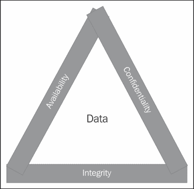
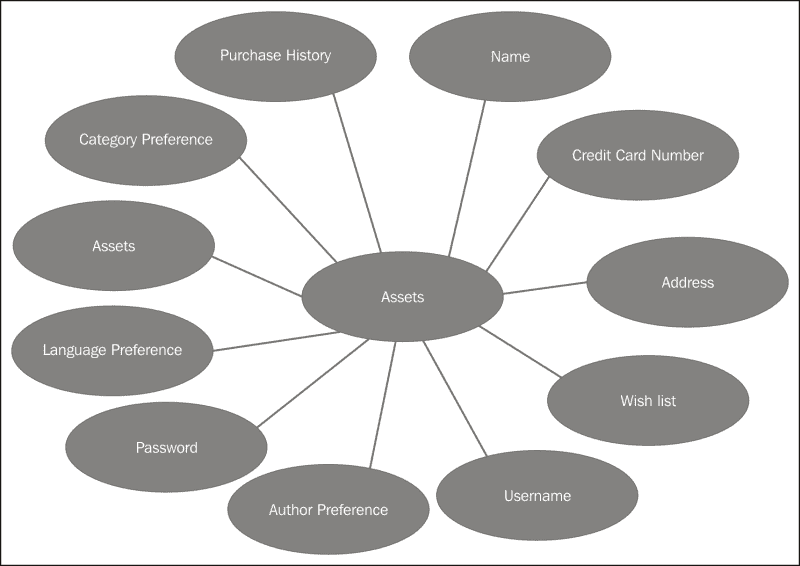
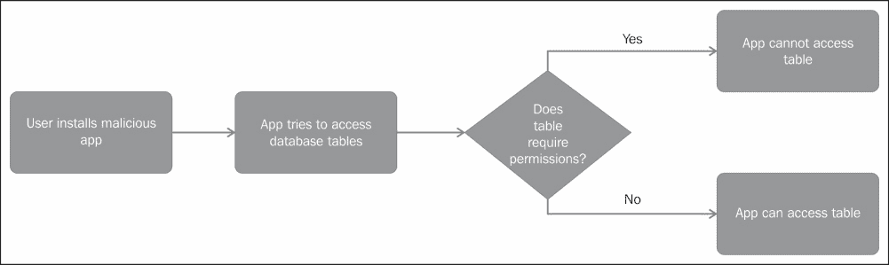
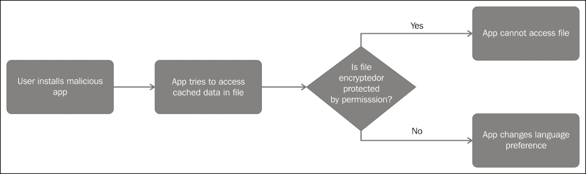
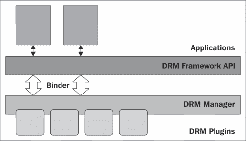

# 五、尊重你的用户

现在，我们已经清楚地了解了安卓平台和应用的安全框架和组件，接下来让我们深入探讨安全性最具挑战性的方面:数据保护。正如我之前所说的，作为应用开发人员，您的可信度取决于您处理用户数据的安全程度。因此本章的名称为:*尊重你的用户*！

本章是理解保护用户数据的重要性和意义的基础。这一章首先讨论了评估数据安全性的基准和中央情报局的三位一体。接下来，我们以书店应用为例，在资产、威胁和攻击场景中运行它。我们讨论移动生态系统，以及该生态系统的不同组件如何影响用户数据的安全性。最后，我们将回顾一下安卓的**数字版权管理** ( **数字版权管理** ) 框架。

# 数据安全原则

本节讨论数据安全的三个原则，即机密性、完整性和可用性，通常称为 **CIA** 。存储在设备或服务器上的任何一条数据都应该满足这三个安全属性。了解这些基准将有助于我们评估我们的数据存储解决方案的安全性。所有这三个原则通常被表述为一个中情局的三位一体。



## 保密

保密性是安全的第一支柱，它关注的是数据的隐私性。这一原则确保私人数据远离窥探的视线，并且只对具有适当访问权限的用户可用。例如，安卓应用的私有数据应该只能由该应用的组件或具有适当权限的其他组件访问(以防数据受到权限保护)。Linux 操作系统沙箱和权限加强了这种保密性。在另一种情况下，SD 卡上可能存在包含敏感数据的加密文件。即使设备或 SD 卡已经泄露，这些信息也不会泄露出去。这种保密性是通过加密技术来实现的。另一个保密性的例子是当设备在一段时间不活动后锁定自己，并且需要用户凭证来解锁时。请注意，默认情况下，Linux 内核不支持文件系统加密，因此在存储敏感数据之前对其进行加密对于安全性至关重要。

## 诚信

数据完整性确保数据在传输或静止时不会被故意或意外地更改或修改。例如，不恰当地写入数据库表可能会导致意外的完整性问题。因此，总是建议使用内置的同步方法来加强数据完整性，除非你非常了解你的东西。一个故意破坏数据完整性的例子可能是在应用与服务器通信的传输过程中造成的。中间的一个人可以听数据并在它行进时更改它。为了减少这种欺诈，始终建议加密数据，并在与服务器通信时使用**安全套接字层** ( **SSL** )协议。为了额外的安全性，可以使用校验和。SSL 还需要 CA 的证书验证链，这在安卓应用中很少使用。

## 可用性

数据可用性确保数据在需要时可用。我想补充一下，数据在有适当权限访问的用户需要时是可用的。这非常重要，因为以可用性的名义，应用不应该让未经授权的用户访问敏感信息。

# 识别资产、威胁和攻击

没有什么比绝对安全更好的了。当我们谈论数据安全时，我们需要确定我们保护的是什么以及保护的对象是谁。以下三个问题可以帮助我们规划我们的方法:

1.  *我们试图保护什么？*从安卓应用的角度来看，我们是否试图保护用户的用户名和密码，或者用户可能通过您的应用购买的优惠券代码和信用卡号，或者用户使用您的应用购买的受版权保护的歌曲或图片？通过回答这个问题，我们可以确定我们的资产。
2.  *我们试图保护资产免受谁的侵害？*换句话说，我们的威胁是什么？我们是试图保护用户数据免受系统上其他应用的影响，还是试图保护这些信息免受您开发的其他应用的影响？即使设备被盗，我们也要保护我们的资产吗？
3.  *什么是攻击？*回答这个问题有助于识别我们应用中的漏洞。我们进入黑客的大脑，思考如何利用我们应用中的漏洞。

回答前面三个问题将有助于我们确定资产的价值，以及我们愿意花费多少时间和精力来保护这些资产。让我们用一个示例应用来回答前面的问题。我们返回到我们的书店应用，用户可以从目录中浏览书籍，将书籍添加到愿望列表中，并订购要发送给用户的书籍。我们的应用会记住用户的基本信息，比如用户浏览过的最后一个作者和类别，以及语言和用户名，这样当用户登录时，app 会给出一定的建议，用户会有家的感觉。我们的应用还为用户提供了商店信用卡号、邮寄地址和姓名，以便在用户准备付款时轻松结账。

让我们试着回答第一个问题:我们试图保护什么？在上例中，我们的资产是:

*   名字
*   信用卡号
*   邮寄地址
*   上次搜索的作者
*   上次搜索的语言
*   上次搜索的类别
*   用户名
*   密码
*   书籍愿望清单

下图说明了我们示例中不同的敏感数据工件:



请注意，并非所有这些资产都同样需要保护。必须根据信息的敏感程度来决定存储机制。例如，信用卡号和密码(如果它们存储在设备上)需要严格保护。您可以加密这些信息，也可以存储这些信息的散列，而不是以原始形式存储这些信息。您将对传输中的信息进行加密，并使用安全通信的 SSL 协议。用户偏好(如语言、作者和类别)的丧失不会带来重大风险。即使这些信息丢失，用户也可以重新设置。

前面的分析也引发了关于 PII 的厚客户和薄客户的争论。胖客户端在设备本身上存储了大量信息。因此，应用最终也会在设备上存储 PII。瘦客户机依靠后端服务器来完成所有繁重的工作。它们在设备上存储的信息很少。这是一个很好的方法，因为设备可能会丢失或被盗，然后风险是用户数据泄露。

接下来，我们将了解攻击场景。下面讨论一些示例场景。

让我们假设用户安装了一个恶意应用。这个应用现在试图以不同的方式窃取用户信息。在第一种情况下，它试图访问不同的数据库表并提取用户信息。这是一起窃取私人信息的案件。如果数据库表受到权限保护，我们就处于安全的位置。如果内容提供商检查组件的身份，我们就处于更加安全的境地。



在另一种情况下，恶意应用可能会发送带有不良数据的广播消息，接收应用可能会尝试对其采取行动，或者恶意应用可能会尝试启动其他应用的组件，这些不良数据可能会导致其他应用崩溃。因此，检查调用应用的身份并在对其进行操作之前检查输入数据是很重要的。

从这个攻击场景中得到的重要教训如下:

*   除非绝对需要，否则不要公开组件。保持组件的私密性是我们的第一道防线。
*   如果我们公开一个组件，我们会确保用权限保护它。这是一个很好的地方来决定我们是要向整个系统公开它，还是只向您创建的其他应用公开它。如果用例是在同一作者编写的应用之间共享组件，我们可以定义自定义权限。
*   通过指定一些意图过滤器来减少攻击面。
*   Always remember to check for input data before acting upon it. If the data is not in the desired format or form, there should be a plan to exit the situation gracefully. Displaying an error message to the user can be an option in this case.

    

其他场景可能包括一个恶意应用，该应用从连接到恶意无线网络的设备监听数据交换。这个应用可以截取信息，修改信息，冒充用户正在连接的服务器，或者完全阻断数据流。所有这些场景都是安全风险。


然而另一个例子是当恶意的应用改变存储在设备上的数据时。用户甚至可能不知道该信息已经被改变的事实。假设我们的应用本地化为不同的语言，并且用户设置了首选语言。在下面的场景中，用户的首选语言从英语变成了日语。下次用户登录时，应用会以日语打开。在我们的情况下，安全风险不大对用户来说是一个烦恼，但是这个例子证明了信息修改是另一个安全风险的观点。



最后，我们需要了解损失情况，以防发生安全漏洞和我们的行动计划。如果信用卡信息、密码和社会安全号码等私人信息被盗，将带来严重的安全风险。必须考虑一个计划，在发生安全漏洞时通知用户。用户偏好和愿望列表被不恰当地访问；它可能会引起用户的烦恼，但可能不会有这样的隐私风险。

## 储存什么和在哪里储存

前面的分析引导我们做出应用开发人员必须考虑的两个重要决定。

首先，应用开发人员必须决定他/她想要从用户那里收集的信息。正如有最小特权原则一样，也有最小存储原则。最小存储的原则导致风险和责任最小化。应用开发人员应始终尝试卸载**个人身份信息**(**【PII】**)的存储。在我们前面的示例中，应用可能不喜欢存储信用卡详细信息、账单地址和其他与支付相关的信息。支付是一个棘手的领域，像贝宝这样的公司可以帮助用户完成结账过程。此外，任何处理信用卡号码的应用都建议遵循 **PCI** ( **支付卡行业**)标准。本标准列出了此类应用和服务器必须遵守的要求。我的建议是将这样的操作卸载给最了解这些事情的服务。

要考虑的第二个重要决定是在哪里存储用户数据。在当今的分布式数据存储环境中，开发人员有许多存储选项，例如设备上、服务器上、云上或第三方应用上。移动设备不应被视为安全存储位置，部分原因是它很容易被盗或丢失，还因为大多数设备不具备台式机和笔记本电脑所具备的复杂安全机制，如安全元件和双引导。密码、密钥、大型内容文件、PII 和其他敏感数据应该存储在后端服务器上。同样，对这些服务器进行防火墙也很重要。

我们将在[第 7 章](07.html "Chapter 7. Securing Application Data")、*安全应用数据*中回到这个示例，其中基于前面的分析，我们决定了适当的存储选项和保护机制。

# 端到端安全

大约十年前，我们把音乐储存在磁带和磁盘上；我们的照片保存在相册里，我们只在紧急情况下使用手机。快进到今天；我们生活中越来越多的走向数字化。我们的朋友、家人、喜欢的、不喜欢的、图片、联系人列表，甚至我们的购买记录和信用卡号码都在数字化。想象一下用户丢失手机的场景。除了设备的货币价值和与存储在设备上的内容相关联的情感价值之外，最大的风险是存储在设备上的用户个人信息的泄露。这些信息可能包括 PII，它可以识别一个人，如姓名、社会保险号、出生日期和母亲的娘家姓。它还可以包括访问密码、联系人列表和短信数据。即使拥有该设备的用户和该设备因恶意软件而受到损害，这种风险也是潜在的。

## 移动生态系统

如下图所示，移动生态系统中有不同的工件，例如设备、网络、用户安装在设备上的应用、原始设备制造商(OEMs)以及消费者设备与之交互的其他服务。


让我们更深入地看看这些组件。

*   **消费者**:整个生态系统围绕着消费者以及消费者如何与生态系统的不同部分互动。
*   **设备制造商**:也叫原始设备制造商，这些公司生产设备的硬件。HTC、摩托罗拉、三星、LG 等公司均设计制造安卓设备。除了设备的大小和样式，每个设备制造商还会在芯片上放置**系统** ( **SOC** )、设备驱动程序和固件，它们会影响应用在不同设备上的工作方式。如果您已经在不同的设备上测试了您的应用，您可以很容易地注意到这些差异。硬件级别的任何安全缺陷都会影响使用该硬件的所有设备。硬件缺陷也很难修补。
*   **操作系统厂商**:安卓是一个开源操作系统，厂商可以随意修改或者使用自己的软件。例如，设备制造商可能会决定使用不同的 WebKit 引擎、音乐播放器或屏幕，而不是安卓堆栈附带的引擎、音乐播放器或屏幕。这将导致应用在不同设备上的行为和外观不同。这些专有软件包中的安全缺陷可能会导致您的应用受损。运行特定版本操作系统的所有设备都会受到缺陷的影响。软件层面的缺陷通常可以修补，建议用户随时更新他们的软件。
*   **运营商** : AT & T、 Sprint、威瑞森、Orange、和沃达丰都是提供让移动设备真正移动化的基础设施的运营商。他们为我们的设备提供数据和语音计划。他们还与设备制造商(在大多数情况下也是操作系统供应商)合作，将他们的定制应用捆绑在系统映像中。他们还可能与原始设备制造商合作，调整安全规则以满足他们的需求。例如，他们可能会要求原始设备制造商直接加载和安装应用，而无需征得用户同意或显示权限请求。
*   **服务**:这些是设备交互的服务，比如用于备份的云服务。在大多数情况下，用户安装一个与后端交互的客户端。其他服务可能是支付服务，如贝宝，邮寄服务，如 Gmail，以及社交网络服务，如脸书和推特。这些服务大多作为第三方应用提供给用户。
*   **应用开发人员**:这是个人应用开发人员或小组开发人员的类别，他们将他们的应用放在谷歌 Play 和亚马逊 appstore 等应用商店上。这种应用的例子包括实用应用、游戏、内容消费应用。这本书的大多数读者都属于这一类。
*   **基础设施**:这些是技术和协议，是移动基础设施的主干。其中包括 **CDMA** ( **码分多址** ) 、 **GSM** ( **全球移动通信系统** ) 、 **WiMAX** ( **全球微波接入互操作性** ) 、 **WAP** ( **无线应用协议**)以及 NFC、RFID 和蓝牙等邻近技术。这些技术中的安全缺陷会使我们的应用容易受到攻击。
*   **标准和安全**:这些是移动生态系统的两个部分，在我们写这本书的时候，它们还在进化中。

您可能已经注意到，移动生态系统中有许多参与者，因此增加了风险和威胁面。此外，并非移动领域的所有主要参与者都在一起工作，并且在某些情况下会相互对抗，从而导致复杂的攻击模型。此外，制造商为目标市场生产设备。因此，它是一个复杂的景观，有移动和演变的部分。从端到端的角度来看安全性，不难发现应用开发人员唯一的优势在于他们创建的应用。设备或操作系统中的任何其他缺陷也会导致安全漏洞。例如，操作系统中的一个缺陷会导致权限升级并让一个应用充当根。在这种情况下，这个根应用可以访问设备上的所有信息。所有的应用都会受到损害，但是如果开发人员使用了良好的安全标准，他们的责任是最小的。

### 类型

应用开发人员拥有的唯一权力是他们自己的应用。任何恶意用户都可以利用设备硬件、操作系统或运营商应用中的弱点，获得对用户数据的访问权限。

例如，我们的书店应用与数据库对话，向服务器发送信息，并缓存一些数据。所有这些情况都需要得到保护。如果设备使用某种邻近技术，如**近场通信** ( **NFC** ) 、蓝牙或**射频识别** ( **射频识别**)来交换数据，了解与这些技术相关的安全风险和新的附加场景非常重要。

[第 6 章](06.html "Chapter 6. Your Tools – Crypto APIs")*您的工具–加密应用编程接口*，讨论了可用于保护传输数据的加密算法。

## 数据的三种状态

让我们看看典型移动应用中的信息流。再次考虑书店应用。在我们的书店应用中，用户可以浏览目录中的书籍，将书籍添加到愿望列表中，并订购要发送给用户的书籍。我们的应用记住关于用户的基本信息，例如用户浏览的最后一个作者和类别，以及语言和用户名。用户的信用卡号、邮寄地址和姓名也被存储起来，以便于结账。

下图显示了一种可能的情况。书店应用使用一个 SQLite 数据库和安卓设备上的平面文件作为缓存。该应用将账户详细信息、图书目录和愿望清单存储在外部服务器上，并使用无线网络连接到后端服务器。


在任何给定的点上，数据可以位于某个位置，从一个节点传输到另一个节点，或者正在处理中。我们称这三种数据状态为静态数据、传输中数据和使用中数据。让我们更仔细地看看这三个:

1.  **静态数据**:这个是存储在一些类型的存储介质上的数据，例如 SD 卡、设备内存、后端服务器和数据库。该数据处于非活动状态。在前面的示例中，驻留在平面文件、SQLite 数据库表和后端服务器上的数据都被视为静态数据。
2.  **在用数据**:当前正在处理的数据称为在用数据。这类数据的示例包括从数据库表中访问的数据、发送到应用组件的数据以及当前正在写入或读取的文件。
3.  **Data in transit**: When data is being transferred from one node to another it is termed as data in transit. Data being transferred to the application from the database in response to a query is an example of data in transit.

    

处理数据和思考端到端安全时，保护所有三种状态的数据很重要。

# 数字版权管理

**数字版权管理** ( **DRM** )是针对音乐、电子书、应用、视频和电影等数字内容的访问控制技术。访问控制基于与内容相关联的权限对象。此权限对象包含限制内容的使用、分发和复制的规则。像 OMA DRM v1 和 OMA DRM v2 这样的 DRM 方案是由 **开放移动联盟** ( **OMA** )开发的，但是很多设备厂商也有自己专有的 DRM 方案。

数字版权管理系统包含以下组件:

*   **内容服务器**:这里是设备拉取媒体内容的服务器。
*   **权限服务器**:设备从其拉入权限对象的服务器。权限对象通常是一个带有与内容相关联的权限和约束的 XML 文件。
*   **数字版权管理代理**:代理生活在设备内，是将内容和权利以及对内容的权利和许可的实施相关联的可信主体。
*   **Storage device**: This is the device where the content and the rights objects are stored. It could be a phone or a tablet, or external storage such as an SD card or even cloud storage.

    

您可以在[www.openmobilealliance.org](http://www.openmobilealliance.org)阅读关于 OMA 数字版权管理的完整规范。OMA DRM 1.0 支持诸如内容前向锁定(内容不能转发到另一个设备)、组合交付(内容和权限对象一起交付)和单独交付(内容和权限对象分别从不同的服务器中拉出)等模型。OMA DRM v2.0 的安全性基于 PKI，安全性明显更高。制造商可以挑选他们想要在设备上支持的数字版权管理方案。他们还可以相应地实现或修改数字版权管理方案。

Android 在 API 11 中开始支持 DRM。安卓系统对数字版权管理的支持是开放的，这样制造商就可以选择自己的数字版权管理代理。这是通过在两个架构层中实现 DRM 框架来实现的。安卓开发者网站([developer.android.com](http://developer.android.com))如下图所示:



数字版权管理管理器实现了数字版权管理框架，并引起了设备制造商的兴趣，他们将自己选择的数字版权管理代理与该框架集成为插件。框架层抽象了数字版权管理器的所有复杂性，并向开发人员展示了一组统一的应用编程接口。这些 API 与应用代码的其余部分一起在 Dalvik 虚拟机中运行。

所有的数字版权管理应用编程接口都存在于`android.drm`包中。这个包有类和接口来获取权限信息，将内容与权限相关联，查询数字版权管理插件和 MIME 类型。`DrmManager`类为每个 `DrmManagerClient`提供一个唯一的 ID 来操作它。

应用首先需要*找出设备上可用的数字版权管理插件*。这可以通过使用`DrmManagerClient`类来完成。

```java
DrmManagerClient mDrmManagerClient = new DrmManagerClient(getContext());
String[] plugins = mDrmManagerClient.getAvailableDrmEngines();
```

下一步是*向 DRM 服务器*注册并下载权限对象。

```java
DrmManagerClient mDrmManagerClient = new DrmManagerClient(context);
DrmInfoRequest infoRequest = new DrmInfoRequest(DrmInfoRequest.TYPE_RIGHTS_ACQUISITION_INFO, MIME);
mDrmManagerClient.acquireDrmInfo(infoRequest);
```

第三步是*从权限对象中提取许可信息*。这是使用`DrmManager`的`getConstraints`方法完成的。

```java
ContentValues constraintsValues = mDrmManager.getConstraints(String path, int action);
ContentValues constraintsValues = mDrmManager.getConstraints(Uri uri, int action);
```

现在，我们需要*将内容与权限对象*相关联。这是通过在`DrmManager`的`saveRights`方法中指定内容路径和权限路径来完成的。一旦这个关联完成，数字版权管理代理将继续在没有用户干预的情况下对内容强制执行权限。

```java
int status = mDrmManager.saveRights(DrmRights  drmRights, String rightsPath, String  contentPath);
```

`android.drm`包还提供了一些其他实用工具功能。查看此包([https://developer . Android . com/reference/Android/DRM/package-summary . html](https://developer.android.com/reference/android/drm/package-summary.html))中所有可用的功能。

# 总结

本章介绍了数据安全的基础知识。我们讨论了数据安全的三个核心原则，即机密性、完整性和可用性。我们浏览了一个示例应用场景，并试图描绘出我们的资产、威胁和攻击场景。我们试图评估与安全漏洞相关的成本。我们的数据存储选项以及我们计划在保护数据安全上花费的时间、精力和金钱将取决于这一分析。我们还思考了整个移动生态系统，以及端到端安全性在移动环境中意味着什么。不难意识到，我们只控制自己编写的应用。我们在本章结束时回顾了安卓的数字版权管理框架和可用功能。有了这些关于数据安全的知识，让我们进入下一章，学习应用开发人员可以用来保护用户数据的不同工具。