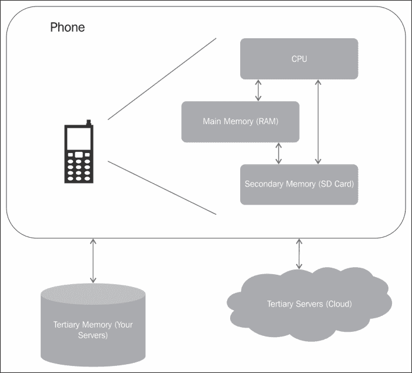

# 七、保护应用数据

应用开发人员的可信度取决于他们处理用户数据的安全程度。谨慎的做法是不要在设备上存储大量用户数据。它不仅会消耗内存，还会带来巨大的安全风险。但是，也有应用需要共享数据、缓存应用首选项以及在设备上存储数据的用例。这些数据可以是应用的私有数据，也可以与其他应用共享。这种数据的一个例子可以是用户偏好的语言或书籍类别。这种数据由应用保存，以增强用户体验。它在应用本身中很有用，不会与其他应用共享。共享数据的一个例子可能是用户在商店浏览时不断添加到收藏中的图书的愿望列表。这些数据可能会也可能不会与其他应用共享。

基于隐私和数据的种类，可以采用不同的存储机制。应用可以决定使用共享首选项、内容提供程序、存储在内部或外部内存中的文件，甚至开发人员自己的服务器来存储数据。

本章从识别应用应该存储的信息以及如何决定数据的存储位置这一最重要的问题开始。一如既往，在收集敏感信息之前，应收集最少量的信息，并征得用户同意。接下来，我们讨论 Android 中的存储机制，包括共享首选项、设备存储、外部存储以及在后端服务器上存储数据。我们将讨论保护传输中的数据的协议。我们将以关于在外部存储器上安装应用的讨论来结束这一章。

# 数据存储决策

许多因素会影响应用环境中的数据存储决策。其中大多数都是基于开发人员应该注意的数据安全方面，例如隐私、数据保留和系统的实现细节。这些将在以下章节中讨论。

## 隐私

今天的应用收集和使用不同种类的用户信息。用户偏好、位置、健康记录、财务账户和资产都是其中的一部分。此类信息的收集应谨慎进行，并征得用户同意，因为收集私人信息会引起法律和道德问题，可被称为侵犯隐私。即使收集了此类信息，也应妥善存储、加密并安全传输。安全的数据存储和传输是本章后半部分的重点。

隐私以不同的形式表现出来。首先，在不同的文化和国家是不同的。每个国家都制定了关于个人身份信息或 PII 的规则和条例。例如，欧盟有一个用于处理和移动个人数据的**数据保护指令**。更多信息可以在这个由欧盟委员会司法总局[http://ec.europa.eu/justice/data-protection/index_en.htm](http://ec.europa.eu/justice/data-protection/index_en.htm)维护的网站上找到。印度关于这方面的网络法律可以在[http://deity.gov.in/content/cyber-laws](http://deity.gov.in/content/cyber-laws)找到。美国遵循数据保护的部门方法。这是立法、监管和自我监管的结合，而不是政府一家独大。

第二，不同的用例有不同的规律。例如，如果应用与医疗或健康相关，则规则与跟踪用户位置或进行金融交易的应用不同。美国具体法律的一些例子是《美国残疾人法》、1998 年《儿童在线隐私法》和 1986 年《电子通信隐私法》。因此，了解与您的使用案例相关的规则和法规以及您希望在哪个国家运营非常重要。如有疑问，请使用本领域专家公司的服务。例如，与其尝试开发自己的支付系统，不如使用 PayPal 等支付提供商，这些提供商多年来一直在进行支付处理，并且在这一领域符合 PCI 等规则和法规。

第三，私人信息从一个国家转移到另一个国家也要遵守规则和条例。在大多数情况下，另一个国家应该有足够的保护法律来满足另一个国家的保护标准。

《世界人权宣言》第十二条对隐私规则规定如下:

> *“不得任意干涉任何人的隐私、家庭、住宅或通信，也不得攻击其荣誉和名誉。每个人都有权受到法律的保护，免受这种干涉或攻击。”*

PII 的一些例子包括全名、电子邮件地址、邮寄地址、驾驶执照、选民登记号、出生日期、母亲的娘家姓、出生地、信用卡号码、犯罪记录和国民身份证号码。在某些情况下，年龄、性别、工作职位和种族可能被认为是 PII。有时候隐私可能意味着匿名。

如果你的应用正在收集 PII，你将不得不向你的用户披露它，也许还会征得他们的同意。您可以向他们提供使用应用或使用某些功能的条款和条件，这些条款和条件可能要求您的应用收集用户的敏感信息。

## 数据保留

数据保留是指在特定时间段内存储数据。这些数据用于跟踪和识别人员、设备和位置等信息。例如，银行数据通常保存七年。在大多数用例中，数据保留不应该是一个问题，除非它是一个服务于特定用例的组织，例如邮政、银行、政府、电信、公共卫生和安全。在大多数情况下，必须为进入 PII 定义适当的访问权限。同样，对于不同的国家和不同的用例，数据保留规则也是不同的。

## 实施决定

当处理数据和决定最安全的安全机制时，第一个问题是确定数据将存储在哪里。让我们回到书店的例子。正如我们在[第 3 章](03.html "Chapter 3. Permissions")、*权限*中所确定的，我们示例的数据元素是:

*   名字
*   信用卡号
*   邮寄地址
*   上次搜索的作者
*   上次搜索的语言
*   上次搜索的类别
*   用户名
*   密码
*   书籍愿望清单

对上述资产的进一步分析，基于其隐私需求，引导我们识别 PII 的姓名、信用卡号、邮寄地址和密码。请注意，这个分类也是根据国家而改变的。

接下来是坚持的问题。我们希望数据仅在应用的一个实例中可用还是在多个实例中可用？我们希望数据保持重置吗？在我们的例子中，我们希望所有的资产都被持久化。但是，如果用户偏好(如作者、类别和语言)没有持续重置，我们不会丢失有价值的信息，用户可以再次选择它们。

第三个重要任务是识别哪些数据是应用私有的，哪些数据是共享的。数据的可见性将影响我们选择的存储选项。

第四个问题是数据的大小。大文件最好存储在外部存储器上。下图显示了典型安卓手机设备中可用的内存选项:



使用框架提供的存储机制总是明智的，而不是发明一个新的。在接下来的章节中，我已经讨论了安卓框架为不同的存储需求提供的存储机制。

# 用户偏好

应用以两种方式收集用户偏好。在第一种情况下，应用向用户呈现设置屏幕，以选择偏好，例如语言、每页显示的结果数量等。这种偏好最好使用`Preference`类存储。另一种情况是，当用户在应用中导航时，用户首选项被选中。例如，当搜索一本书时，用户选择特定作者的书。应用可能希望在用户下次登录时保存这样的首选项。这样的用户偏好最好使用`SharedPreferences`存储。引擎盖下，`Preference`班也叫`SharedPreferences`。请注意`SharedPreferences`只保留原始数据类型。

## 共享偏好

`SharedPreferences`类用于存储键值对中的原始数据类型。这些原始类型包括`int`、`long`、`Boolean`、`float`、`string set`和`string`。存储在该`SharedPreferences`中的数据保持应用会话。偏好文件以 XML 文件的形式存储在设备上的应用的`data`目录中。因此，该文件由与应用本身相同的 Linux 权限进行沙箱保护。即使应用被终止，首选项文件中的数据仍然存在，并且仅当应用被卸载或使用`Preference`类的方法移除特定值时才会被销毁。

任何类型的数据存储的三个操作是实例化存储、存储数据和检索数据。

### 创建首选项文件

以下代码片段使用默认文件名实例化`SharedPreferences`:

```java
SharedPreferences preferences = PreferenceManager.getDefaultSharedPreferences(context);
```

在这种情况下，可以使用以下代码检索文件名:

```java
String preferencesName = this.getPreferenceManager().getSharedPreferencesName();
```

您也可以指定首选项文件的名称。在以下示例中，首选项文件的名称为`MyPref`:

```java
public Static final String PREF_FILE = "MyPref";
SharedPreferences preferences = getSharedPreferences(PREF_FILE, MODE_PRIVATE);
```

前面的代码片段提出了关于偏好文件可见性和共享的重要讨论。默认情况下，所有首选项文件对于创建它的应用都是私有的。所以他们的模式是`MODE_PRIVATE`。如果偏好文件需要在不同的应用之间共享，可以设置为`MODE_WORLD_WRITABLE`或`MODE_WORLD_READABLE`，允许其他应用分别读写偏好文件。

### 书写偏好

下一步是将原始数据存储到首选项文件中。下面的代码片段来自前面的代码片段，并展示了如何将数据添加到首选项文件中。您会注意到您需要`SharedPreferences.Editor`类来存储值。`Editor`类中的所有值都是批处理的，需要提交才能保持值。在以下示例中，`MyString`是字符串的键，其值为`Hello World!`。

```java
SharedPreferences.Editor editor = preferences.edit();
editor.putString("MyString", "Hello World!");
editor.commit();
```

### 阅读偏好

下一步是读取偏好文件中的键值对。下面的代码片段是前面代码片段的延续，显示了如何从首选项文件中读取数据:

```java
String myString = preferences.getString("MyString", "");
```

### 类型

应用的所有组件都可以访问`SharedPreferences`。如果分别设置为`MODE_WORLD_WRITABLE`或`MODE_WORLD_READABLE`，其他应用可以写入和读取首选项文件。

要读取不同应用的首选项文件，第一步是获取指向其他应用上下文的指针，然后读取该值。

```java
Context myContext = getApplicationContext().createPackageContext("com.android.example", Context.MODE_WORLD_READABLE);
SharedPreferences preference =
myContext.getSharedPreferences("MyPref",Context.MODE_WORLD_READABLE);
String mMyString = preference.getString("MyString", "");
```

## 偏好活动

通过蜂巢，安卓扩展了`Preference`类从用户界面收集设置的功能。这些值被设置为一个 XML 文件，活动从该文件膨胀。在引擎盖下， `Preference`类使用`SharedPreferences`类来存储键值对。此类设置是应用的私有设置，只能由`Activity`类访问。

要选择铃声，必须在`res/xml`目录下的`Preference.xml`文件中设置以下代码:

```java
<RingtonePreference
  android:name="Ringtone Preference"
  android:summary="Select a Ringtone"
  android:title="Ringtones"
  android:key="ringtonePref" />
```

为了从这个 XML 文件中展开一个活动，在`onCreate()`方法中使用了以下代码:

```java
public class Preferences extends PreferenceActivity {
  @Override
  protected void onCreate(Bundle savedInstanceState) {
    super.onCreate(savedInstanceState);
    addPreferencesFromResource(R.xml.preferences);
. . . .
}
```

请记住在清单文件中添加此活动。

# 文件

应用也可以使用安卓的文件系统来存储和检索数据。`java.io`包提供此功能。这个包提供了从文件中写入和读取不同数据类型的类。默认情况下，应用创建的文件对应用是私有的，其他应用无法访问。文件持续重启，应用崩溃；只有在卸载应用时，它们才会被删除。

## 创建文件

下面的代码片段展示了如何创建一个文件。正如我之前所说的，默认情况下，所有文件对于应用都是私有的。

```java
FileOutputStream fOut = openFileOutput("MyFile.txt", MODE_WORLD_READABLE);
```

文件`MyFile.txt`将在`/data/data/<application-path>/files/`目录中创建。前面的文件被创建为`MODE_WORLD_READABLE`，这意味着其他应用可以读取该文件。其他选项有`MODE_WORLD_READABLE`、`MODE_PRIVATE`和`MODE_APPEND`，它们分别允许其他应用写入文件、保持文件对应用的私密性或附加到文件。决定适当的可见性很重要。正如安全规则一样，只提供最少的可见性。

由于`MODE_WORLD_READABLE`和`MODE_WORLD_WRITABLE`是非常危险的选项，从 API 等级 17 开始，这些选项已被弃用。如果文件仍然需要在与同一证书相关联的应用之间共享，可以使用`android:sharedUserId`选项。如果这些是不同的应用，那么文件访问可以用包装类来处理，该类与文件接口并提供读写功能。使用权限可以保护对此包装类的访问。

## 写入文件

下一步是写一个文件。下面的代码片段显示了使用`OutputStreamWriter`类将字符串写入文件。在`java.io`包中有很多选项可以将不同类型的数据写入文件。请检查包，为您的用例选择正确的选项。

```java
String myString = new String ("Hello World!");
FileOutputStream fOut = context.openFileOutput("MyFile.txt", MODE_PRIVATE);
OutputStreamWriter osw = new OutputStreamWriter(fOut);
osw.write(myString);
osw.flush();
osw.close();
```

## 从文件中读取

再次如前所述，请查看`java.io`包，找到从文件读取数据的最佳方法。下面的代码片段显示了如何从文件中读取字符串。

以下示例一次从文件中读取一行:

```java
FileInputStream fIn = context.openFileInput("MyFile.txt");
InputStreamReader isr = new InputStreamReader(fIn);
BufferedReader bReader = new BufferedReader(isr);
StringBuffer stringBuf = new StringBuffer();
String in;
while ((in = bReader.readLine()) != null) {
  stringBuf.append(in);
  stringBuf.append("\n");
}
bReader.close();
String myString = stringBuf.toString();
```

## 外部存储器上的文件操作

也可以在外部存储器上创建文件。如果 API 级别为 8 或更高，Android 会提供一个名为`getExternalFilesDir()` 的特殊功能来获取外部存储上的应用目录。

```java
File file = new File (getExternalFilesDir(null), "MyFile.txt");
```

正如您将在前面的代码片段中注意到的那样，`getExternalFilesDir()`方法接受一个参数。此参数用于根据介质类型识别适当的存储目录。例如，存储图片使用`ENVIRONMENT.DIRECTORY_PICTURES`，存储音乐文件使用`ENVIRONMENT.DIRECTORY_MUSIC`。如果这样的目录不存在，它将被创建，然后文件将被存储在那里。值`null`是应用的根目录。

```java
File file = new File(
  getExternalFilesDir(ENVIRONMENT.DIRECTORY_PICTURES),
  "MyFile.jpg");
```

对于小于 8 的 API 级别，用户可以使用`getExternalStorageDirectory()` 获取外部存储的根。然后可以在`/Android/data/<application-path>/files/`目录中创建文件。

要在外部存储器上创建文件，应用应该具有`WRITE_EXTERNAL_STORAGE`权限。当用户卸载应用时，在外部存储上创建的文件将被删除。

外部存储缺乏内部存储的安全机制。最好假设存储在外部存储上的任何数据都是不安全的，并且是全局可读的。如果没有装载外部存储，文件将不可访问，必须采用适当的错误处理机制，应用才能正常失败。

在某些情况下，实际上可能需要外部存储，特别是如果文件没有 PII，并且打算在不同的设备上共享和可用。媒体扫描器将在搜索相关内容时扫描这些目录。这些目录如下所示。这些遵循应用的根目录`/data/data/<application-path>/`。

*   **音频(音乐)文件** : `Music/`
*   **播客文件** : `Podcasts/`
*   **视频文件(摄像机除外)** : `Movie/`
*   **铃声** : `Ringtones/`
*   **图片** : `Pictures/`
*   **杂项下载** : `Downloads/`
*   **通知声音** : `Notifications/`
*   **警报** : `Alarms/`

# 缓存

如果应用需要缓存数据，谨慎的做法是使用 Android 栈提供的缓存存储机制。安卓将缓存文件与应用一起存储在文件系统中，以便它们与创建它的应用一起被沙箱保护。所有缓存文件都是在`/data/data/<application-path>/cache/`目录下创建的。如果系统内存不足，将首先删除这些缓存文件。定期清理这些文件是必要的，因为它们可能会变大并耗尽磁盘空间。

下面的代码片段首先将一个字符串写入缓存文件，然后从缓存文件中读取相同的字符串。你会注意到，读写和任何文件输入输出一样，只是使用`getCacheDir()` 写一个字符串得到文件的位置。

```java
//Write to the cache file
String myString = new String ("Hello World!");
File file = new File (getCacheDir(), "MyCacheFile");
FileOutputStream fOut = new FileOutputStream(file);
OutputStreamWriter osw = new OutputStreamWriter(fOut);
osw.write(myString);
osw.flush();
osw.close();

// Now read from the cache file
File file = new File (getCacheDir(), "MyCacheFile");

FileInputStream fIn = new FileInputStream (file);
InputStreamReader isr = new InputStreamReader(fIn);
BufferedReader bReader = new BufferedReader(isr);
StringBuffer stringBuf = new StringBuffer();
String in;
while ((in = bReader.readLine()) != null) {
  stringBuf.append(in);
  stringBuf.append("\n");
}
bReader.close();
String myString = stringBuf.toString();
```

正如文件可以在外部存储上创建一样，缓存文件也可以。方法因应用编程接口级别而异。从 API 级开始，Android 提供了一个名为`getExternalCacheDir()`的特殊功能来获取外部存储上的缓存目录。

```java
File file = new File (getExternalCacheDir(), "MyCacheFile");
```

该目录链接到应用，当卸载该目录中的应用时，该目录将不复存在。如果是多用户环境，每个用户都有自己的个人目录。

如果 API 级别小于 8，用户可以使用`getExternalStorageDirectory()`获取外部存储，然后在`/Android/data/<application-path>/cache/`目录下创建文件。

要在外部存储器上创建缓存，应用应该具有`WRITE_EXTERNAL_STORAGE`权限。

在外部存储上创建缓存并非没有安全问题。首先，如果外部存储没有装载缓存文件，它是不可访问的，必须采用适当的错误处理机制才能使应用正常失败。其次，外部存储器本质上是不安全的，所以存储在外部存储器上的任何东西都应该被认为是全局可读的。

### 类型

应该定期清理缓存文件，并删除不需要的文件以保留内存。

# 数据库

数据库是存储结构化数据的最佳选择。安卓使用`android.database.sqlite`包为 SQLite 提供支持。该数据库是安卓堆栈的一部分，系统管理该数据库。将 SQLite 用于移动操作系统是一个谨慎的选择，因为它很小，不需要设置或管理。而且是免费的！

一旦创建，数据库文件就被应用沙箱化，并存储在`/data/data/<application-path>/databases/`目录中。应用的所有组件都可以访问这个私有数据库，但不能在应用之外访问。

下面的代码片段显示了如何创建驻留在内部内存中的数据库。该类将扩展`SQLiteOpenHelper`类，并使用 SQL(结构化查询语言)`CREATE_TABLE`子句。该表存储用户标记为愿望列表的图书列表。我们的表中有两列`wishlist`，一个自动递增的列标识和图书名称。

这里你会注意到两种方法，`onCreate()`和`onUpgrade()`。`OnCreate()`将创建一个新的数据库(如果它不存在)和一个新的数据库表。如果数据库已经存在，调用`onUpgrade()`方法。

```java
public class MySQLiteHelper extends SQLiteOpenHelper {
  public static final String TABLE_NAME = "wishlist";
  public static final String COLUMN_ID = "_id";
  public static final String COLUMN_BOOK = "book";
  private static final String DATABASE_NAME = "bookstore.db";
  private static final int DATABASE_VERSION = 1;
  @Override
  public void onCreate(SQLiteDatabase database) {
    database.execSQL("create table " + TABLE_NAME + "("
      + COLUMN_ID + " integer primary key autoincrement, "
      + COLUMN_BOOK + " text not null);");
  }

  @Override
  public void onUpgrade(SQLiteDatabase database) {
    database.execSQL("drop table if exists " + TABLE_NAME);
    onCreate(db);
  }
. . . .
}
```

类似地，其他数据库查询可用于添加行、读取行和删除行。任何一本关于 SQL 的好书都可以帮助你进行这些查询。

也可以创建一个存在于外部存储器中的数据库。创建一个接受目录路径的自定义上下文类可以实现这一点。您还需要对外部存储有写权限。但是，如果表中有敏感信息，不建议这样做。

正如我前面提到的，SQLite 数据库是一个私有数据库，并且与应用一起被沙箱化。如果这些数据需要与其他应用共享，那么这就需要使用一个称为 URI 的内容提供商来完成。我们已经在[第 2 章](02.html "Chapter 2. Application Building Blocks")、*应用构建模块*中详细介绍了内容提供商。

# 客户经理

在存储敏感数据的环境中，存储密码或身份验证令牌是一个重要方面。考虑像谷歌邮件、推特和脸书这样允许用户登录的应用。其他应用使用身份协议(如 OAuth2)使用的身份验证令牌。

安卓提供了`android.accounts.AccountManager`类作为存储用户凭证的集中存储库。应用可以选择使用自己的可插拔身份验证器来处理帐户身份验证。从存储用户名到身份信息，再到创建您的自定义帐户管理器，安卓的`AccountManager`是一个强大的实用程序。

`AccountManager`类函数受权限保护，因此您的应用必须请求`android.permission.GET_ACCOUNTS`访问存储在其上的帐户列表，并请求`android.permission.ACCOUNT_MANAGER`访问 OAuth2。

每个帐户都采用命名空间格式。例如，谷歌账户使用`com.google`，推特账户使用`com.twitter.android.auth.login`。`AccountManager`访问方式如下:

```java
AccountManager am = AccountManager.get(getApplicationContext());
```

可以使用以下代码检索整个帐户列表:

```java
Account[] accounts = am.getAccounts();
```

`auth`令牌以`Bundle`的形式获取，并使用`KEY_AUTHTOKEN`的命名值进行检索。

```java
String token = bundle.getString(AccountManager.KEY_AUTHTOKEN);
```

使用`AccountManager`时有两点需要记住。首先，如果您的应用试图使用 OAuth2 进行身份验证，您的应用将与服务器进行对话，因此这可能会导致延迟，并且调用应该异步进行。第二，凭证以纯文本形式存储在`AccountManager`上。因此，在根手机上，使用`adb shell`命令的任何用户都可以看到这些。因此，就像在设备上存储信息的情况一样，与其清晰地存储密码和其他 PII 信息，不如通过散列或加密的方式以加密安全的方式存储信息。这将最大限度地降低设备受损的风险。

# SSL/TLS

我在读一个非常有趣的研究，由汉诺威莱布尼茨大学和德国马尔堡菲利普大学的学生进行，关于 MITM(中间人)攻击传输中的数据。所研究的应用使用 SSL(安全套接字层)或 TLS(传输层安全)协议来保护网络上的数据。许多应用没有正确使用 SSL/TLS，这导致了漏洞。另一个有趣的观察是，由于安卓浏览器没有显示通常与使用 SSL/TLS 的网站相关联的绿色挂锁，用户没有意识到他们使用的是一个不安全的网站。在[http://www2 . dcsec . uni-hannover . de/files/Android/p50-fahl . pdf](http://www2.dcsec.uni-hannover.de/files/android/p50-fahl.pdf)查看论文。我相信这将是一篇有趣的文章。

前面的研究揭示了在应用中正确实现协议的重要性。本节介绍 SSL/TLS 以及正确实现它的一些注意事项。由网景公司开发的 SSL 是一种通过互联网进行安全通信的协议。该协议遵循客户端和服务器之间的一系列调用，在这些调用中，客户端和服务器协商用于数据交换的密钥和密码套件。

安卓提供了使用`javax.net.ssl`、`org.apache.http.conn.ssl`和`android.net`包集成 SSL/TLS 的能力。下图说明了 SSL 中的序列:


第一步是设置密钥库并导入服务器证书链。接下来是将密钥库链接到`DefaultHttpClient`，这样它就知道在哪里可以找到服务器的证书。

在开发阶段，特别是在企业环境中，我们通过创建一个自定义的`TrustManager`来设置我们的 SSL 来信任所有证书，并允许所有主机名使用`SSLSocketFactory.ALLOW_ALL_HOSTNAME_VERIFIER`。如果发布这样的应用，它会带来严重的安全缺陷。请在发布应用之前检查这一点。因此，请记住在发布应用之前修复这些问题。

# 在外部存储器上安装应用

正如我们在[第 4 章](04.html "Chapter 4. Defining the Application's Policy File")、*定义应用的策略文件*中所讨论的，从 API 级别 8 开始，应用可以选择安装在 SD 卡上。一旦 APK 移动到外部存储器，应用占用的唯一内存就是存储在内部存储器中的应用的私有数据。需要注意的是，即使是 SD 卡常驻 apk，DEX(Dalvik executive)文件、私有数据目录和本机共享库仍保留在内部存储中。

在清单文件中添加可选属性可以启用此功能。此类应用的**应用信息**屏幕有一个**移动到 SD 卡**或**移动到电话**按钮，具体取决于 APK 的当前存储位置。然后，用户可以选择相应地移动 APK 文件。如果外部设备未安装或 USB 模式设置为**大容量存储**(其中设备用作磁盘驱动器)，则该外部设备上托管的所有运行活动和服务会立即终止。

以下截图显示了应用设置中的**移动到 SD 卡**选项:


每个应用的`ApplicationInfo`对象现在有一个名为`FLAG_EXTERNAL_STORAGE`的新标志。对于存储在外部设备上的应用，该标志的值设置为`true`。如果卸载了这样的应用，该应用的内部存储器也将被删除。如果外部设备变得不可用(例如，当 SD 卡被卸载时)，内部存储器不会被清除。在这种情况下，用户可以通过卸载应用来清除内部内存。此操作不需要安装 SD 卡。

还增加了两个新的广播节目。

*   `ACTION_EXTERNAL_APPLICATIONS_UNAVAILABLE`:SD 卡卸载时发出此意向。它包含禁用应用列表(使用`EXTRA_CHANGED_PACKAGE_LIST`属性)和不可用应用指南列表(使用`EXTRA_CHANGED_UID_LIST`属性)。
*   `ACTION_EXTERNAL_APPLICATIONS_AVAILABLE`:当 SD 卡再次可用时，发出该意向。它包含禁用应用列表(使用`EXTRA_CHANGED_PACKAGE_LIST`属性)和不可用应用指南列表(使用`EXTRA_CHANGED_UID_LIST`属性)。

当应用从内部存储器移动到外部位置时，触发`ACTION_EXTERNAL_APPLICATIONS_UNAVAILABLE`。资产和资源随后被复制到新的位置。然后，应用被启用，再次触发`ACTION_EXTERNAL_APPLICATIONS_AVAILABLE`广播意图。

### 类型

任何类型的外部设备本质上都是不安全的。例如，SD 卡容易因电源故障(电话电池没电)或卡拆卸不当(未正确卸载)而损坏内存。SD 卡也是全球可读的，因此应用可以被读取、写入、复制或删除。

为了在外部设备上安全地存储 APKs，安卓应用被存储在一个加密的容器(ASEC 文件)中，这样其他应用或程序就不能修改或破坏它们。ASEC 文件是一个加密的文件系统，其密钥由设备随机生成和存储，因此只能由最初安装它的设备解密。因此，安装在 SD 卡上的应用只能用于一个设备。

安装 SD 卡时(使用 Linux 环回机制)，这些容器的安装方式与应用在内存中的安装方式相同。文件系统强制执行权限，这样其他应用就不能修改其内容，除了系统本身，没有人可以通过 ASEC 文件修改任何内容，因为其他应用没有它的密钥。SD 卡也是作为`noexec`挂载的，所以没有人可以在里面放可执行代码。

多个 SD 卡可以与一个设备相关联，以便 SD 卡可以轻松交换。只要安装了 SD 卡，就不存在性能问题。

安卓开发者网站([developer.android.com](http://developer.android.com))给出了在 SD 卡上安装应用时的用例列表可以让应用执行不稳定，如果 SD 卡被卸载的话。其中一些，如服务，是基于当手机启动时服务可用的顺序。这些措施如下:

*   **服务**:运行服务会被杀死。应用可以注册`ACTION_EXTERNAL_APPLICATIONS_AVAILABLE`广播意图，当安装在外部存储上的应用可供系统使用时，它会通知您的应用。收到意向后，服务可以重新启动。
*   **报警服务**:在`AlarmManager`注册的报警将被取消，必须在重新安装外部存储器时手动重新注册。
*   **输入法引擎(IME)** : An IME 是一个让用户输入文本的控件。如果您的 IME 位于外部存储器中，它将被默认的 IME 所取代。重新安装外部存储时，用户必须打开系统设置才能再次启用自定义 IME。
*   **实时壁纸**:默认的实时壁纸将取代运行的实时壁纸，如果设置的壁纸存储在外部存储器中。当重新安装外部存储器时，用户将不得不再次选择他们的定制实时壁纸。
*   **App Widgets** :如果你的 App Widgets 存在于外存储器中，它将从主屏幕中移除。在大多数情况下，应用小部件需要系统重置才能再次出现在主屏幕上。
*   **账户经理**:如果有任何账户是用`AccountManager`创建的，它们将消失，直到外部存储器被重新装载。
*   **同步适配器** : `AbstractThreadedSyncAdapter`及其所有同步功能将无法工作。必须重新装载外部存储器，同步才能再次工作。
*   **设备管理员**:这一块很关键，因为`DeviceAdminReceiver`及其所有管理功能都将被禁用，即使重新安装 SD 卡，这也可能无法完全正常工作。
*   **广播接收器**:任何正在收听`ACTION_BOOT_COMPLETE`广播的广播接收器将停止工作，因为系统会在外部存储器安装到设备之前传送该广播。所以任何安装在外部存储器上的应用都无法接收这个广播。

# 总结

本章介绍了安卓系统上可用的存储机制。我们从了解隐私和数据保留等术语开始。在收集个人身份信息之前，我们应该始终考虑这些问题，以避免法律和道德问题。需要注意的是，与隐私和数据安全相关的规则和法规因国家和使用情况而异。我们研究了使用共享首选项存储用户首选项，在文件、缓存和数据库中存储、读取和写入数据。我们还介绍了在外部内存上使用 SSL/TLS 和应用安装时的一些重要注意事项。

接下来的三章将涵盖非常有趣的主题，如设备管理、安全测试以及安卓上新出现的用例。继续读！