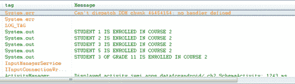
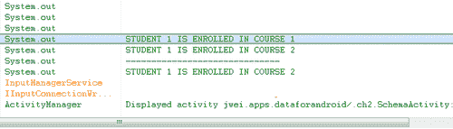
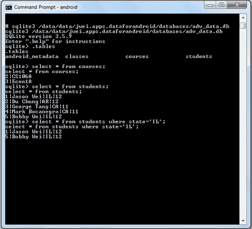

# 二、使用 SQLite 数据库

早些时候，我们被介绍了在安卓数据上存储数据的各种方法，从小而简单的原始值到大而复杂的文件类型。在本章中，我们将深入探讨一种极其强大和高效的方法来保存和检索结构化数据:即使用 SQLite 数据库。目前，我们将关注 SQLite 数据库作为应用程序本地后端的多功能性和健壮性，然后在后面的章节中切换焦点，并寻找将这个 SQLite 后端与用户界面前端绑定的方法。

# 创建高级 SQLite 模式

在前一章中，我们通过一个简单的例子来创建和使用一个包含两个字段的表:一个整数标识字段和一个字符串名称字段。然而，应用程序需要的数据库模式往往需要不止一个表。因此，现在您突然需要多个表，其中一些表可能相互依赖，您如何有效地利用 `SQLiteOpenHelper`类来使应用程序的开发变得简洁明了，而又不影响模式的健壮性？让我们一起通过一个例子来解决这个问题！

考虑一个包含三个表的简单模式:第一个是包含字段标识、姓名、州和年级的 `Students`表，第二个是包含字段标识和姓名的 `Courses`表，第三个是包含字段标识、学生标识和课程标识的 `Classes`表。我们将尝试创建一个模式，在这个模式中，我们可以添加/删除学生，添加/删除课程，以及注册/删除不同课程的学生。我们可以立即想到的一些挑战如下:

*   我们如何获得简单的分析，例如每门课程的学生人数？
*   当我们放弃一门有学生的课程时会发生什么？
*   当我们移除注册课程的学生时会发生什么？

注意，让我们直接进入代码。我们从用几个类定义模式开始:

```java
public class StudentTable {
// EACH STUDENT HAS UNIQUE ID
public static final String ID = "_id";
// NAME OF THE STUDENT
public static final String NAME = "student_name";
// STATE OF STUDENT'S RESIDENCE
public static final String STATE = "state";
// GRADE IN SCHOOL OF STUDENT
public static final String GRADE = "grade";
// NAME OF THE TABLE
public static final String TABLE_NAME = "students";
}
public class CourseTable {
// UNIQUE ID OF THE COURSE
public static final String ID = "_id";
// NAME OF THE COURSE
public static final String NAME = "course_name";
// NAME OF THE TABLE
public static final String TABLE_NAME = "courses";
}
// THIS ESSENTIALLY REPRESENTS A MAPPING FROM STUDENTS TO COURSES
public class ClassTable {
// UNIQUE ID OF EACH ROW - NO REAL MEANING HERE
public static final String ID = "_id";
// THE ID OF THE STUDENT
public static final String STUDENT_ID = "student_id";
// THE ID OF ASSOCIATED COURSE
public static final String COURSE_ID = "course_id";
// THE NAME OF THE TABLE
public static final String TABLE_NAME = "classes";
}

```

下面是创建数据库模式的代码(看起来应该与我们之前看到的非常相似):

```java
public class SchemaHelper extends SQLiteOpenHelper {
private static final String DATABASE_NAME = "adv_data.db";
// TOGGLE THIS NUMBER FOR UPDATING TABLES AND DATABASE
private static final int DATABASE_VERSION = 1;
SchemaHelper(Context context) {
super(context, DATABASE_NAME, null, DATABASE_VERSION);
}
@Override
public void onCreate(SQLiteDatabase db) {
// CREATE STUDENTS TABLE
db.execSQL("CREATE TABLE " + StudentTable.TABLE_NAME
+ " (" + StudentTable.ID + " INTEGER PRIMARY KEY AUTOINCREMENT,"
+ StudentTable.NAME + " TEXT,"
+ StudentTable.STATE + " TEXT,"
+ StudentTable.GRADE + " INTEGER);");
// CREATE COURSES TABLE
db.execSQL("CREATE TABLE " + CourseTable.TABLE_NAME + " (" + CourseTable.ID + " INTEGER PRIMARY KEY AUTOINCREMENT,"
+ CourseTable.NAME + " TEXT);");
// CREATE CLASSES MAPPING TABLE
db.execSQL("CREATE TABLE " + ClassTable.TABLE_NAME + " (" + ClassTable.ID + " INTEGER PRIMARY KEY AUTOINCREMENT,"
+ ClassTable.STUDENT_ID + " INTEGER,"
+ ClassTable.COURSE_ID + " INTEGER);");
}
@Override
public void onUpgrade(SQLiteDatabase db, int oldVersion, int newVersion) {
Log.w("LOG_TAG", "Upgrading database from version " + oldVersion + " to " + newVersion + ", which will destroy all old data");
// KILL PREVIOUS TABLES IF UPGRADED
db.execSQL("DROP TABLE IF EXISTS " + StudentTable.TABLE_NAME);
db.execSQL("DROP TABLE IF EXISTS " + CourseTable.TABLE_NAME);
db.execSQL("DROP TABLE IF EXISTS " + ClassTable.TABLE_NAME);
// CREATE NEW INSTANCE OF SCHEMA
onCreate(db);
}
}

```

这里我们看到，在我们的 `onCreate()`方法中，我们执行 SQL 命令来创建所有三个表，此外，在 `onUpgrade()`方法中，我们执行 SQL 命令来删除所有三个表，然后重新创建所有三个表。当然，由于我们覆盖了 `SQLiteOpenHelper`类，理论上我们可以以任何我们想要的方式定制这些方法的行为(例如，一些开发人员可能不想在 `onUpgrade()`方法中删除整个模式)，但是现在让我们保持功能简单。

在这一点上，对于精通 SQL 编程和数据库模式的人来说，您可能想知道是否有可能向您的 SQLite 数据库模式添加触发器和键约束。答案是，“是的，您可以使用触发器，但是不行，您不能使用外键约束。”无论如何，花任何时间来编写和实现触发器都将偏离这本书的核心内容太多，所以我选择省略这个讨论(尽管即使在我们的简单示例中，这些也肯定会有所帮助)。

现在我们已经创建了模式，在继续设计各种复杂的查询来提取不同的数据组之前(我们将在下一章中看到)，是时候编写一些包装方法了。这将帮助我们解决前面提到的一些问题，最终将帮助我们创建一个健壮的数据库。

# SQLite 数据库的包装器

现在我们面前有一个有点复杂的模式，前面我们提到了这样的问题:如果我们删除一个注册了课程的学生，会发生什么，反之亦然，如果我们删除一个有多个学生注册的课程，会发生什么？当然，我们不希望这两种情况都发生——第一种情况是，我们的课程中挤满了甚至不再在大学注册的学生，第二种情况是，我们的学生出现在甚至不再提供的课程中！

因此，是时候执行这些规则了，我们将通过向我们的 `SchemaHelper`类添加一些方便的方法来做到这一点。同样，其中一些规则可以通过使用触发器语句来强制执行(请记住，安卓的 SQLite 数据库不支持键约束)，但是使用包装器方法的好处之一是，对于可能不熟悉应用程序代码库的开发人员来说，它们要直观得多。通过使用包装类，开发人员能够安全地与数据库交互，而开发人员可能对该数据库的模式知之甚少。现在，让我们从简单的包装器开始:

```java
public class SchemaHelper extends SQLiteOpenHelper {
private static final String DATABASE_NAME = "adv_data.db";
// TOGGLE THIS NUMBER FOR UPDATING TABLES AND DATABASE
private static final int DATABASE_VERSION = 1;
SchemaHelper(Context context) {
super(context, DATABASE_NAME, null, DATABASE_VERSION);
}
@Override
public void onCreate(SQLiteDatabase db) {
...
}
@Override
public void onUpgrade(SQLiteDatabase db, int oldVersion, int newVersion) {
...
}
// WRAPPER METHOD FOR ADDING A STUDENT
public long addStudent(String name, String state, int grade) {
// CREATE A CONTENTVALUE OBJECT
ContentValues cv = new ContentValues();
cv.put(StudentTable.NAME, name);
cv.put(StudentTable.STATE, state);
cv.put(StudentTable.GRADE, grade);
// RETRIEVE WRITEABLE DATABASE AND INSERT
SQLiteDatabase sd = getWritableDatabase();
long result = sd.insert(StudentTable.TABLE_NAME, StudentTable.NAME, cv);
return result;
}
// WRAPPER METHOD FOR ADDING A COURSE
public long addCourse(String name) {
ContentValues cv = new ContentValues();
cv.put(CourseTable.NAME, name);
SQLiteDatabase sd = getWritableDatabase();
long result = sd.insert(CourseTable.TABLE_NAME, CourseTable.NAME, cv);
return result;
}
// WRAPPER METHOD FOR ENROLLING A STUDENT INTO A COURSE
public boolean enrollStudentClass(int studentId, int courseId) {
ContentValues cv = new ContentValues();
cv.put(ClassTable.STUDENT_ID, studentId);
cv.put(ClassTable.COURSE_ID, courseId);
SQLiteDatabase sd = getWritableDatabase();
long result = sd.insert(ClassTable.TABLE_NAME, ClassTable.STUDENT_ID, cv);
return (result >= 0);
}
}

```

现在，我们有三种简单的包装方法来将数据添加到我们的模式中。前两个涉及向数据库中添加新的学生和新课程，最后一个涉及在学生(由他/她的 ID 表示)和课程之间添加新的映射(本质上，我们是通过这个映射将学生注册到课程中)。请注意，在每个包装器方法中，我们只是将值添加到一个 `ContentValue`对象中，检索可写的 SQLite 数据库，然后将这个 `ContentValue`作为一个新行插入到指定的表中。接下来，让我们编写一些用于检索数据的包装方法:

```java
public class SchemaHelper extends SQLiteOpenHelper {
public long addStudent(String name, String state, int grade) {
}
public long addCourse(String name) {
}
public boolean enrollStudentClass(int studentId, int courseId) {
}
// GET ALL STUDENTS IN A COURSE
public Cursor getStudentsForCourse(int courseId) {
SQLiteDatabase sd = getWritableDatabase();
// WE ONLY NEED TO RETURN STUDENT IDS
String[] cols = new String[] { ClassTable.STUDENT_ID };
String[] selectionArgs = new String[] { String.valueOf(courseId) };
// QUERY CLASS MAP FOR STUDENTS IN COURSE
Cursor c = sd.query(ClassTable.TABLE_NAME, cols, ClassTable.COURSE_ID + "= ?", selectionArgs, null, null, null);
return c;
}
// GET ALL COURSES FOR A GIVEN STUDENT
public Cursor getCoursesForStudent(int studentId) {
SQLiteDatabase sd = getWritableDatabase();
// WE ONLY NEED TO RETURN COURSE IDS
String[] cols = new String[] { ClassTable.COURSE_ID };
String[] selectionArgs = new String[] { String.valueOf(studentId) };
Cursor c = sd.query(ClassTable.TABLE_NAME, cols, ClassTable.STUDENT_ID + "= ?", selectionArgs, null, null, null);
return c;
}
public Set<Integer> getStudentsByGradeForCourse(int courseId, int grade) {
SQLiteDatabase sd = getWritableDatabase();
// WE ONLY NEED TO RETURN COURSE IDS
String[] cols = new String[] { ClassTable.STUDENT_ID };
String[] selectionArgs = new String[] { String.valueOf(courseId) };
// QUERY CLASS MAP FOR STUDENTS IN COURSE
Cursor c = sd.query(ClassTable.TABLE_NAME, cols, ClassTable.COURSE_ID + "= ?", selectionArgs, null, null, null);
Set<Integer> returnIds = new HashSet<Integer>();
while (c.moveToNext()) {
int id = c.getInt(c.getColumnIndex
(ClassTable.STUDENT_ID));
returnIds.add(id);
}
// MAKE SECOND QUERY
cols = new String[] { StudentTable.ID };
selectionArgs = new String[] { String.valueOf(grade) };
c = sd.query(StudentTable.TABLE_NAME, columns, StudentTable.GRADE + "= ?", selectionArgs, null, null, null);
Set<Integer> gradeIds = new HashSet<Integer>();
while (c.moveToNext()) {
int id = c.getInt(c.getColumnIndex(StudentTable.ID));
gradeIds.add(id);
}
// RETURN INTERSECTION OF ID SETS
returnIds.retainAll(gradeIds);
return returnIds;
}
}

```

这里我们有三种非常相似的方法，它们允许我们从模式中获得非常实用的数据集:

*   能够获取给定课程的学生名单
*   能够抓取给定学生的课程列表
*   最后(只是为了增加一些复杂性)，能够抓取给定课程的某个年级的学生列表

请注意，在所有三种方法中，我们都开始使用 `SQLiteDatabase`对象的 `query()`方法中的一些参数，因此现在似乎是仔细查看这些参数是什么以及我们之前到底做了什么的好时机:

```java
public Cursor query(String table, String[] columns, String selection, String[] selectionArgs, String groupBy, String having, String orderBy)

```

或者:

```java
public Cursor query(String table, String[] columns, String selection, String[] selectionArgs, String groupBy, String having, String orderBy, String limit)
public Cursor query(boolean distinct, String table, String[] columns, String selection, String[] selectionArgs, String groupBy, String having, String orderBy, String limit)

```

为了简单起见，我们这样调用前面的方法:

```java
Cursor c = sd.query(ClassTable.TABLE_NAME, cols, ClassTable.COURSE_ID + "= ?", selectionArgs, null, null, null);

```

所以快速解释一下这三种方法。第一个 `query()`方法是标准方法，在第一个参数中指定表，然后在第二个参数中指定要返回的列。这相当于在标准 SQL 中执行 `SELECT`语句。然后，在第三个参数中，我们开始过滤我们的查询，这些过滤器的语法相当于在我们的 `SELECT`查询的末尾包含一个 `WHERE`子句。在我们的例子中，我们看到我们只要求返回包含学生标识的列，因为这是我们唯一关心的列(因为我们是在课程标识列上过滤，所以返回这个列也是多余的)。然后，在过滤器参数中，我们要求按课程标识进行过滤，语法相当于传入以下字符串:

```java
WHERE course_id = ?

```

在这里，无论我们将什么值传递到过滤器中，问号都充当位置卡。换句话说， `WHERE`语句的格式是有的，但是我们只需要在问号中代入我们想要过滤的实际值。在这种情况下，我们将给定的课程标识传递给第四个参数。

最后三个参数(`groupBy`、 `having`、 `orderBy)`对于那些熟悉 SQL 的人来说应该很有意义，但是对于那些不熟悉 SQL 的人来说，这里有一个对每个参数的快速解释:

*   `groupBy` -添加此选项将允许您按指定的列对结果进行分组。如果你需要获得，比如说，一个带有课程标识和注册该课程的学生人数的表格，这将会很有用:简单地在 `Class`表格中按课程标识分组就可以完成这个任务。
*   `having` -与 `groupBy`子句结合使用，该子句允许您过滤聚合结果。假设您在 `Class`表中按课程编号分组，并希望筛选出注册学生少于 10 人的所有班级，您可以使用 `having`子句完成此操作。
*   `orderBy` -一个相当简单的子句，使用 `orderBy`子句，我们可以按照指定的列和升序或降序对查询的结果子表进行排序。例如，假设您想先按等级然后按名称对 `Students`表进行排序，指定一个 `orderBy`子句将允许您这样做。

最后，在两个 `query()`变量中，您将看到添加的参数 `limit`和 `distinct:` `limit`参数允许您限制想要返回的行数，而 `distinct`布尔值允许您指定是否只想要返回不同的行。如果这对您来说仍然没有太大的意义，请不要担心——我们将在下一章关注构建复杂的查询。

现在我们已经理解了 `query()`方法是如何工作的，让我们重新回顾一下前面的例子，并清除掉 `getStudentsByGradeForCourse()`方法。虽然有很多方法可以执行这种方法，但从概念上来说，它们都非常相似:首先，我们查询给定课程中的所有学生，然后在这些学生中，我们希望过滤并只保留指定年级的学生。我实现它的方法是首先从给定的课程中获取一组所有学生的 id，然后获取给定年级所有学生的一组 id，并简单地返回这两组的交集。至于这是否是最佳实现，只取决于数据库的大小。

现在，最后但同样重要的是，让我们用一些特殊的移除包装方法来实施前面提到的移除规则:

```java
public class SchemaHelper extends SQLiteOpenHelper {
public Cursor getStudentsForCourse(int courseId) {
...
}
public Cursor getCoursesForStudent(int studentId) {
...
}
public Set<Integer> getStudentsAndGradeForCourse(int courseId, int grade) {
...
}
// METHOD FOR SAFELY REMOVING A STUDENT
public boolean removeStudent(int studentId) {
SQLiteDatabase sd = getWritableDatabase();
String[] whereArgs = new String[] { String.valueOf(studentId) };
// DELETE ALL CLASS MAPPINGS STUDENT IS SIGNED UP FOR
sd.delete(ClassTable.TABLE_NAME, ClassTable.STUDENT_ID + "= ? ", whereArgs);
// THEN DELETE STUDENT
int result = sd.delete(StudentTable.TABLE_NAME, StudentTable.ID + "= ? ", whereArgs);
return (result > 0);
}
// METHOD FOR SAFELY REMOVING A STUDENT
public boolean removeCourse(int courseId) {
SQLiteDatabase sd = getWritableDatabase();
String[] whereArgs = new String[] { String.valueOf(courseId) };
// MAKE SURE YOU REMOVE COURSE FROM ALL STUDENTS ENROLLED
sd.delete(ClassTable.TABLE_NAME, ClassTable.COURSE_ID + "= ? ", whereArgs);
// THEN DELETE COURSE
int result = sd.delete(CourseTable.TABLE_NAME, CourseTable.ID + "= ? ", whereArgs);
return (result > 0);
}
}

```

因此，这里我们有两个移除方法，在每个方法中，我们通过防止某人在没有首先从 `Class`映射表中移除课程的情况下丢弃课程来手动实施一些模式规则，反之亦然。我们称之为 `SQLiteDatabase`类的 `delete()`方法，它很像 `query()`方法，允许你传入表名，指定一个过滤器参数(也就是一个 `WHERE`子句)，然后允许你传入那些过滤器的值(注意在 `delete()`和 `query()`方法中，你可以指定多个过滤器，但是后面会有更多的内容)。

最后，让我们将这些方法付诸行动，实现一个 `Activity`类:

```java
public class SchemaActivity extends Activity {
@Override
protected void onCreate(Bundle savedInstanceState) {
super.onCreate(savedInstanceState);
setContentView(R.layout.main);
SchemaHelper sh = new SchemaHelper(this);
// ADD STUDENTS AND RETURN THEIR IDS
long sid1 = sh.addStudent("Jason Wei", "IL", 12);
long sid2 = sh.addStudent("Du Chung", "AR", 12);
long sid3 = sh.addStudent("George Tang", "CA", 11);
long sid4 = sh.addStudent("Mark Bocanegra", "CA", 11);
long sid5 = sh.addStudent("Bobby Wei", "IL", 12);
// ADD COURSES AND RETURN THEIR IDS
long cid1 = sh.addCourse("Math51");
long cid2 = sh.addCourse("CS106A");
long cid3 = sh.addCourse("Econ1A");
// ENROLL STUDENTS IN CLASSES
sh.enrollStudentClass((int) sid1, (int) cid1);
sh.enrollStudentClass((int) sid1, (int) cid2);
sh.enrollStudentClass((int) sid2, (int) cid2);
sh.enrollStudentClass((int) sid3, (int) cid1);
sh.enrollStudentClass((int) sid3, (int) cid2);
sh.enrollStudentClass((int) sid4, (int) cid3);
sh.enrollStudentClass((int) sid5, (int) cid2);
// GET STUDENTS FOR COURSE
Cursor c = sh.getStudentsForCourse((int) cid2);
while (c.moveToNext()) {
int colid = c.getColumnIndex(ClassTable.STUDENT_ID);
int sid = c.getInt(colid);
System.out.println("STUDENT " + sid + " IS ENROLLED IN COURSE " + cid2);
}
// GET STUDENTS FOR COURSE AND FILTER BY GRADE
Set<Integer> sids = sh.getStudentsByGradeForCourse ((int) cid2, 11);
for (Integer sid : sids) {
System.out.println("STUDENT " + sid + " OF GRADE 11 IS ENROLLED IN COURSE " + cid2);
}
}
}

```

所以首先我们在模式中添加一些虚拟数据；在我的情况下，我将添加五个学生和三门课程，然后将这些学生注册到一些班级。一旦模式中有了一些数据，我会尝试一些方法，首先要求所有的学生都注册 CS106A。之后我会测试我们写的另一个包装方法，要求所有报名 CS106A 的同学，但这次只有 11 年级的同学。因此运行这个 `Activity`的输出如下:



瞧啊。我们很快看到学生 1、2、3 和 5 都注册了 CS106A。但是经过 11 年级的筛选，我们看到 11 年级只有学生 3 报名了 CS106A 可怜的乔治。现在让我们测试一下删除方法:

```java
public class SchemaActivity extends Activity {
@Override
protected void onCreate(Bundle savedInstanceState) {
super.onCreate(savedInstanceState);
setContentView(R.layout.main);
SchemaHelper sh = new SchemaHelper(this);
long sid1 = sh.addStudent("Jason Wei", "IL", 12);
// GET CLASSES I'M TAKING
c = sh.getCoursesForStudent((int) sid1);
while (c.moveToNext()) {
int colid = c.getColumnIndex(ClassTable.COURSE_ID);
int cid = c.getInt(colid);
System.out.println("STUDENT " + sid1 + " IS ENROLLED IN COURSE " + cid);
}
// TRY REMOVING A COURSE
sh.removeCourse((int) cid1);
System.out.println("------------------------------");
// SEE IF REMOVAL KEPT SCHEMA CONSISTENT
c = sh.getCoursesForStudent((int) sid1);
while (c.moveToNext()) {
int colid = c.getColumnIndex(ClassTable.COURSE_ID);
int cid = c.getInt(colid);
System.out.println("STUDENT " + sid1 + " IS ENROLLED IN COURSE " + cid);
}
}
}

```

这一次，我们首先询问学生 1(我自己)注册的所有班级。但是哦不！Math51 这个季度出了点事，所以取消了！我们删除该课程，并再次请求查看学生 1 注册的所有课程，希望看到 Math51 已从列表中删除。输出如下:



的确，我们看到一开始我同时注册了 Math51 和 CS106A，但是课程取消后，我不仅注册了 CS106A！通过在一些常见的 insert、get 和 remove 函数周围放置包装器，我们既可以简化未来的开发生活，同时也可以强制执行某些模式规则。

最后，让我们以如何连接到 SQLite 终端来查看表格形式的数据并发出 SQLite 查询来结束本章，这在调试应用程序并确保正确添加/更新/删除数据时非常有用。

# 调试您的 SQLite 数据库

安卓平台为你提供了一个非常强大的调试朋友，叫做**安卓调试桥(adb)** 。adb shell 是一个通用的命令行界面，允许您与正在运行的仿真器或连接的安卓设备进行通信。adb 工具可以在您的 SDK/platform-tools 目录中找到，一旦启动，它就可以完成从安装应用程序到从仿真器推送和提取数据，再到插入您的 sqlite3 数据库和发出查询的所有操作(有关更多详细信息，请参见开发者文档[。](http://developer.android.com/guide/developing/tools/adb.html)

要使用 adb，只需打开您的终端，导航至`/<your-sdk-directory>/platform-tools/` 并输入以下命令:

```java
adb shell

```

或者，如果您想要连接特定的模拟器，请键入以下命令:

```java
adb –s emulator-xxxx shell

```

此时，您应该已经启动了 adb 工具，此时您需要告诉它连接到模拟器的 sqlite3 数据库。这可以通过发出命令 sqlite3，然后将路径传递给应用程序的数据库文件来实现，如下所示:

```java
# sqlite3 /data/data/<your-package-path>/databases/<your-database>.db

```

在我们的例子中，命令如下所示:

```java
# sqlite3 /data/data/jwei.apps.dataforandroid/databases/adv_data.db

```

在这一点上，我们应该能够发出各种各样的 SQL 查询，允许我们做任何事情，从查看我们的数据库模式到更新和删除任何表中的单个数据行。您可能会发现最有用的一些示例命令如下:

*   `.tables`显示数据库中所有表格的列表
*   `.output FILENAME`允许您将查询结果输出到文件中(比如，用于进一步分析)
*   `.mode MODE`允许您指定输出文件格式(即作为 CSV、HTML 等，可能对电子表格类型分析有用)
*   `SELECT * FROM table_name`选择给定表的所有列的标准查询(这相当于表的行的 `get()`命令)
*   `SELECT * FROM table_name WHERE col = 'value'`选择给定表中所有列的标准查询，但带有列过滤器
*   `SELECT col1, col2 FROM table_name`选择给定表的特定列的标准查询

这里有一个例子，我们将其中一些命令用于我们之前的模式:



希望这能让你继续下去，但是要查看完整的 sqlite3 命令列表，只需查看[http://www.sqlite.org/sqlite.html](http://www.sqlite.org/sqlite.html)，要查看更广泛的复杂查询列表，只需按兵不动——接下来就要开始了。

# 总结

在这一章中，我们从一个只包含一个表的超级裸机数据库模式发展到包含多个相互依赖的表的整个模式。我们首先看到了如何通过重写 `SQLiteOpenHelper`类来创建和升级多个表，然后考虑了围绕具有相互依赖性的数据库模式的一些挑战。我们决定通过用大量包装方法围绕我们的数据库模式和它的表来解决这些挑战，这些包装方法是为了方便未来的开发以及未来数据的健壮性而设计的。这些包装方法包括从简单的添加方法到更复杂的移除方法的一切，添加方法很有帮助，因为我们能够隐藏不断请求可写的 `SQLiteDatabase`的需求，移除方法隐藏了执行各种模式规则所需的所有功能。

然后，我们实际上实现了一个 `Activity`类来展示我们的新数据库模式，并运行了一些示例数据库命令来测试它们的功能。虽然我们能够验证并输出所有命令的结果，但我们意识到这是调试 sqlite3 数据库的一种非常冗长且不太理想的方式，因此我们研究了安卓调试桥(adb)工具。使用 adb 工具，我们能够打开一个命令行终端，然后连接到仿真器或 Android 设备的运行实例，随后连接到该仿真器/设备的 sqlite3 数据库。在这里，我们能够通过发出各种 SQL 命令和查询，以非常自然的方式与 sqlite3 数据库进行交互。

现在，我们到目前为止所看到的查询已经非常简单了，但是如果必要的话，可以满足大多数应用程序开发需求。然而，我们将在下一章中看到，通过掌握更高级的 SQL 查询概念，我们可以在应用程序中享受到性能的大幅提升和内存的大幅提升！