# 三、SQLite 查询

在最后一章中，我们将我们的数据库建设提升了一个档次——将一个只包含一个单独表的简单模式转换为一个包含三个相互依赖的表的复杂模式。现在我们在为安卓开发定制的 SQLite 数据库方面有了坚实的基础，是时候锦上添花了。

虽然在理论上，我们可以有一个通用的 `get()`查询，它将数据库中每一行的所有列作为一个 `Cursor`对象返回给我们，然后为我们想要的数据过滤和操作每一行——我们可以做得更好。不要误解我的意思——Java 速度很快——但是当涉及到在相对有限的内存中处理潜在的数千行数据时，为什么不优化一些东西，让 SQL 做它最擅长的事情——也就是查询东西！

在下一章中，我们将重点关注在安卓客户端解析和过滤您的数据(即使用 Java 接口)和构建更高级的 SQL 查询以及在 SQLite 数据库本身中解析/过滤您的数据之间取得适当的平衡。

# 构建 SQLite 查询的方法

首先，让我们建立构建查询的不同方式。就像我们之前看到的，查询 SQLite 数据库最低级的方法是通过 `SQLiteDatabase`类的 `rawQuery()`方法，定义如下:

```java
Cursor rawQuery(String sql, String[] selectionArgs)

```

这个方法主要是为那些在 SQL 中有很强背景的人准备的，因为你把 SQL 查询作为第一个参数直接传递给这个方法。如果您的 SQL 查询涉及任何类型的 `WHERE`过滤器，那么第二个参数允许您传入这些过滤器值(我们将很快看到几个使用中的例子)。

`SQLiteDatabase`类提供给你的第二个查询方法是一个提交查询的便利包装器——使用 `query()`方法(我们之前也看到过)任何实际的 SQL 编程都是隐藏的，取而代之的是，查询的所有部分都作为参数传递:

```java
Cursor query(String table, String[] columns, String selection, String[] selectionArgs, String groupBy, String having, String orderBy)

```

可选的 `query()`方法包含 `distinct`和 `limit`约束的参数。同样，前面的参数应该相对来说是不言自明的，但是对于一个给定的查询，所有这些方法放在一起看最有意义。但是，在继续讨论这些示例之前，让我们看一下构建 SQL 查询的第三种方法。

第三种方法是我们还没见过的，来自 `SQLiteQueryBuilder`类。安卓平台决定提供一个完整的便利类来帮助开发人员尽可能无缝地与他们的 SQLite 数据库交互，而不是不得不提交原始的 SQL 查询，或者不得不处理便利方法，这对那些对 SQL 完全陌生的人来说似乎仍然令人生畏。虽然这个类有许多相关的方法(我邀请您在线浏览开发人员文档以了解更多细节)，但以下是我们将在本章后面重点介绍的一些更重要的方法:

```java
String buildQuery(String[] projectionIn, String selection, String groupBy, String having, String sortOrder, String limit)

```

前一种方法是构造 `SELECT`语句的便利方法，然后可以用于一组 `SELECT`语句，这些语句将通过 `buildUnionQuery()`方法中的 `UNION`运算符连接，如下所示:

```java
String buildUnionQuery(String[] subQueries, String sortOrder, String limit)

```

允许您传入一组 `SELECT`语句(可能使用 `buildQuery()`便利方法构建)并构建一个将返回这些子查询的 `UNION`的查询的方法如下:

```java
String buildQueryString(boolean distinct, String tables, String[] columns, String where, String groupBy, String having, String orderBy, String limit)

```

使用给定的参数构建一个 SQL 查询，类似于 `SQLiteDatabase`类的 `query()`方法，但是简单地以字符串形式返回查询:

```java
Void setDistinct(boolean distinct)

```

以上允许您将当前查询仅设置为 `DISTINCT`行。

```java
Void setTables(String inTables)

```

允许您设置要查询的表的列表，如果传递了多个表，则允许您对这些表执行 `JOIN`。

现在我们已经列出了所有可用的不同方法，让我们探索一些基本的 SQLite 查询，看看如何使用前面描述的每种方法执行相对简单的查询！

# 选择语句

使用来自[第 2 章](02.html "Chapter 2. Using a SQLite Database")、*的 `Students`模式使用 SQLite 数据库*，让我们先来看一下我们的 `Students`表在这一点上的样子:

<colgroup><col style="text-align: left"> <col style="text-align: left"> <col style="text-align: left"> <col style="text-align: left"></colgroup> 
| 

身份

 | 

名字

 | 

状态

 | 

级别

 |
| --- | --- | --- | --- |
| one | 贾森·魏 | 伊利诺伊 | Twelve |
| Two | 杜涌 | 阿肯色州 | Twelve |
| three | 乔治·唐 | 加拿大 | Eleven |
| four | 马克·博卡内格拉 | 加拿大 | Eleven |
| five | 鲍比·魏 | 伊利诺伊 | Twelve |

这样，对于我们做的每个查询，我们将确切地知道我们应该期望什么结果，因此，我们可以验证我们的查询。在我们开始之前，这里有一个我们将在这一部分讨论的列表:

*   `SELECT`陈述
*   `SELECT`带列规格的报表
*   `WHERE`过滤器
*   `AND/OR`操作员
*   `DISTINCT`条款
*   `LIMIT`条款

这将是一个很大的挑战，尤其是对于那些没有 SQL 经验的人来说，但是一旦你学会了这些基本的构造块，你就可以构建更长、更复杂的查询了。所以，让我们从最基本的 `SELECT`查询开始:

```java
public class BasicQueryActivity extends Activity {
@Override
protected void onCreate(Bundle savedInstanceState) {
super.onCreate(savedInstanceState);
setContentView(R.layout.main);
/*
* SELECT Query
*/
System.out.println("METHOD 1");
// METHOD #1 - SQLITEDATABASE RAWQUERY()
Cursor c = sqdb.rawQuery("SELECT * from " + StudentTable.TABLE_NAME, null);
while (c.moveToNext()) {
int colid = c.getColumnIndex(StudentTable.NAME);
String name = c.getString(colid);
System.out.println("GOT STUDENT " + name);
}
SELECT statementsaboutSystem.out.println("METHOD 2");
// METHOD #2 - SQLITEDATABASE QUERY()
c = sqdb.query(StudentTable.TABLE_NAME, null, null, null, null, null, null);
while (c.moveToNext()) {
int colid = c.getColumnIndex(StudentTable.NAME);
String name = c.getString(colid);
System.out.println("GOT STUDENT " + name);
}
System.out.println("METHOD 3");
// METHOD #3 - SQLITEQUERYBUILDER
String query = SQLiteQueryBuilder.buildQueryString (false, StudentTable.TABLE_NAME, null, null, null, null, null, null);
System.out.println(query);
c = sqdb.rawQuery(query, null);
while (c.moveToNext()) {
int colid = c.getColumnIndex(StudentTable.NAME);
String name = c.getString(colid);
System.out.println("GOT STUDENT " + name);
}
}
}

```

在这里，我们看到在第一个方法中，我们只是传入标准的 SQL 查询，而在第二个方法中，我们将查询分解成不同的参数(即，它的表名、它的选择过滤器等等)。最后，在最后一个方法中，我们注意到它看起来非常类似于第二个方法(目前)，我们再次将查询分解成不同的参数，但是我们的方法不是返回一个 `Cursor`，而是将查询作为一个字符串返回，然后我们可以作为一个原始查询执行。这背后的原因是，SQLiteQueryBuilder 的优势之一是，您可以指定多个查询并同时提交它们，并有效地执行一个 `UNION` SQL 查询——但我们稍后将再次使用该功能。

现在，让我们看看这些查询的结果，看看我们能否验证结果:


我觉得挺好的！我们看到每个方法都能够按预期返回表中的所有行。在第三种方法下，我们还可以看到使用我们的 `SQLiteQueryBuilder`类构建的查询，并且确实验证了我们在第一种方法中提交的 SQL 查询与内置的第三种方法相匹配。

现在，假设您有一个包含数千行数据和数十列的大型表-为了效率和内存，在实践中通常建议您不要用查询返回整个表，而是改进查询，只返回那些感兴趣的数据列！因此，让我们看看如何在我们的 `SELECT`查询中指定返回哪些列:

```java
/*
* SELECT COLUMNS Query
*/
System.out.println("METHOD 1");
// METHOD #1 - SQLITEDATABASE RAWQUERY()
c = sqdb.rawQuery(
"SELECT " + StudentTable.NAME + "," + StudentTable.STATE + " from " + StudentTable.TABLE_NAME, null);
while (c.moveToNext()) {
int colid = c.getColumnIndex(StudentTable.NAME);
int colid2 = c.getColumnIndex(StudentTable.STATE);
}
System.out.println("METHOD 2");
// METHOD #2 - SQLITEDATABASE QUERY()
String[] cols = new String[] { StudentTable.NAME, StudentTable.STATE };
c = sqdb.query(StudentTable.TABLE_NAME, cols, null, null, null, null, null);
SELECT statementsresults, validatingwhile (c.moveToNext()) {
SELECT statementsaboutint colid = c.getColumnIndex(StudentTable.NAME);
int colid2 = c.getColumnIndex(StudentTable.STATE);
}
System.out.println("METHOD 3");
// METHOD #3 - SQLITEQUERYBUILDER
query = SQLiteQueryBuilder.buildQueryString(false, StudentTable.TABLE_NAME, cols, null, null, null, null, null);
System.out.println(query);
c = sqdb.rawQuery(query, null);
while (c.moveToNext()) {
int colid = c.getColumnIndex(StudentTable.NAME);
int colid2 = c.getColumnIndex(StudentTable.STATE);
}

```

因此，我们看到查询的整体结构对于所有三个方法都是相同的，但是在方法二和方法三中，我们传入了一个包含我们想要的数据列的 `String[]`。同样，为了验证我们的查询是否按照我们希望的方式运行，以下是这些查询的输出:

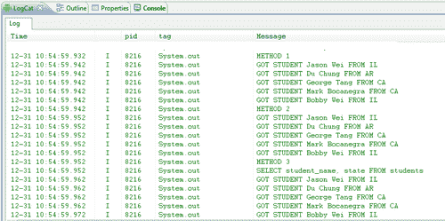

所以我们看到我们确实能够归还每个学生，以及他们各自的状态。最后，再次注意在第三种方法中构造的查询，并将其与传递给第一种方法的原始 SQL 查询进行比较——它们应该完全匹配，并且确实匹配。

# WHERE 筛选器和 SQL 运算符

现在，能够不仅按列而且按列值过滤数据通常很重要！这就是 `WHERE`过滤器派上用场的地方，这些 `WHERE`过滤器肯定会是你作为数据库开发人员遇到的最常用的子句。关于这一点，让我们看看这些 `WHERE`过滤器(在安卓系统中也称为选择参数)是如何用我们的三种查询构建方法实现的:

```java
/*
* WHERE Filter - Filter by State
*/
System.out.println("METHOD 1");
// METHOD #1 - SQLITEDATABASE RAWQUERY()
c = sqdb.rawQuery("SELECT * from " + StudentTable.TABLE_NAME + " WHERE " + StudentTable.STATE + "= ? ", new String[] { "IL" });
while (c.moveToNext()) {
int colid = c.getColumnIndex(StudentTable.NAME);
int colid2 = c.getColumnIndex(StudentTable.STATE);
}
System.out.println("METHOD 2");
// METHOD #2 - SQLITEDATABASE QUERY()
c = sqdb.query(StudentTable.TABLE_NAME, null, StudentTable.STATE + "= ? ", new String[] { "IL" }, null, null, null);
while (c.moveToNext()) {
int colid = c.getColumnIndex(StudentTable.NAME);
int colid2 = c.getColumnIndex(StudentTable.STATE);
}
System.out.println("METHOD 3");
// METHOD #3 - SQLITEQUERYBUILDER
query = SQLiteQueryBuilder.buildQueryString(false, StudentTable.TABLE_NAME, null, StudentTable.STATE + "='IL'", null, null, null, null);
System.out.println(query);
c = sqdb.rawQuery(query, null);
while (c.moveToNext()) {
int colid = c.getColumnIndex(StudentTable.NAME);
int colid2 = c.getColumnIndex(StudentTable.STATE);
}

```

使用第一种方法，我们可以看到一个标准的 SQL `WHERE`子句是如何格式化的。知道了这一点，我们的第二个和第三个方法可以看到，我们可以将一个格式类似于 `WHERE`子句的字符串传递到选择参数中，但是省略了 `WHERE`本身(这将自动附加到您的查询中)。这可以从我们的 `SQLiteQueryBuilder`类在第三个方法中返回的构造查询中清楚地看到:

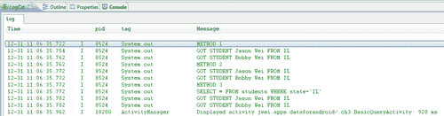

就像任何编程语言一样，可以通过使用 `AND/OR`运算符过滤逻辑；这同样适用于 SQL，特别是 SQL `WHERE`过滤器。您可以编写查询来返回满足所有给定条件的行，或者更宽泛地说，只返回几个给定条件中的一个，而不是要求满足一组条件的所有行。这方面的一个例子如下，我们使用了 SQL `OR`运算符，并要求来自阿肯色州的学生:

```java
/*
* AND/OR Clauses
*/
System.out.println("METHOD 1");
// METHOD #1 - SQLITEDATABASE RAWQUERY()
c = sqdb.rawQuery("SELECT * from " + StudentTable.TABLE_NAME + " WHERE " + StudentTable.STATE + "= ? OR " + StudentTable.STATE + "= ?", new String[] { "IL", "AR" });
System.out.println("METHOD 2");
// METHOD #2 - SQLITEDATABASE QUERY()
c = sqdb.query(StudentTable.TABLE_NAME, null, StudentTable.STATE + "= ? OR " + StudentTable.STATE + "= ?", new String[] { "IL", "AR" }, null, null, null);
System.out.println("METHOD 3");
// METHOD #3 - SQLITEQUERYBUILDER
query = SQLiteQueryBuilder.buildQueryString(false, StudentTable.TABLE_NAME, null, StudentTable.STATE + "='IL' OR " + StudentTable.STATE + "='AR'", null, null, null, null);
System.out.println(query);
c = sqdb.rawQuery(query, null);

```

在这里，您会注意到语法与前面的例子非常相似，但是这次我们在 `WHERE`过滤器(选择参数)中注入了一个 `OR`运算符，并放置了两个选择参数(即“？”)而不是一个。需要注意的是，您的 `String[]`中包含的参数顺序更为重要，具体来说，数组中的第一个字符串将对应于第一个“？”放置卡片等等。当然，如果您想使用 `AND`运算符，那么只需应用前面的语法，但将 `OR`替换为 `AND`。在输出端取一个快速峰值，我们看到如下:

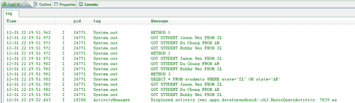

所以现在我们的好友杜已经杀入了结果集！

# DISTINCT 和 LIMIT 子句

打开电源，我们来看看 SQL 中的 `DISTINCT`子句:

```java
/*
* DISTINCT Clause
*/
System.out.println("METHOD 1");
// METHOD #1 - SQLITEDATABASE RAWQUERY()
c = sqdb.rawQuery("SELECT DISTINCT " + StudentTable.STATE + " from " + StudentTable.TABLE_NAME, null);
System.out.println("METHOD 2");
// METHOD #2 - SQLITEDATABASE QUERY()
// SWITCH TO MORE GENERAL QUERY() METHOD
c = sqdb.query(true, StudentTable.TABLE_NAME, new String[] { StudentTable.STATE }, null, null, null, null, null, null);
...
System.out.println("METHOD 3");
// METHOD #3 - SQLITEQUERYBUILDER
query = SQLiteQueryBuilder.buildQueryString(true, StudentTable.TABLE_NAME, new String[] { StudentTable.STATE },null, null, null, null, null);
System.out.println(query);
c = sqdb.rawQuery(query, null);

```

`DISTINCT`子句也相对简单，它允许您在查询中指定，对于给定的列，您只希望返回该列具有不同值的行的子集。请注意，我强调对于给定的列，为了使 `DISTINCT`子句有意义，必须在查询中指定一列。

在我前面的例子中，我们会注意到一些事情。首先，在我们的查询中，请注意我们在 `DISTINCT`子句后面跟了我们希望它应用到的列，即 `State`列。本质上，我们要求我的查询返回一个子表，其中包含我的数据库中所有不同的状态。换句话说，我们想知道我们的学生来自哪个州，并且每个州只想要一行。另一件值得一提的事情是，我们已经将先前在第二种方法中使用的 `query()`语句切换到了更通用的 `query()`方法，该方法具有用于指定 `DISTINCT`子句的参数。该查询的结果为:

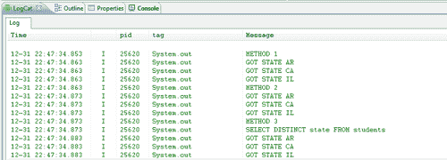

我们现在的桌子就是这种情况！最后但同样重要的是，让我们看看 `LIMIT`条款:

```java
/*
* LIMIT Clause
*/
System.out.println("METHOD 1");
// METHOD #1 - SQLITEDATABASE RAWQUERY()
c = sqdb.rawQuery("SELECT * from " + StudentTable.TABLE_NAME + " LIMIT 0,3", null);
...
System.out.println("METHOD 2");
// METHOD #2 - SQLITEDATABASE QUERY()
// SWITCH TO MORE GENERAL QUERY() METHOD
c = sqdb.query(false, StudentTable.TABLE_NAME, null, null, null, null, null, null, "3");
System.out.println("METHOD 3");
// METHOD #3 - SQLITEQUERYBUILDER
query = SQLiteQueryBuilder.buildQueryString(false, StudentTable.TABLE_NAME, null, null, null, null, null, "3");
System.out.println(query);
c = sqdb.rawQuery(query, null);

```

`LIMIT`子句只允许您限制返回多少行。 `LIMIT`子句采用两种格式:

*   `LIMIT n, m`
*   `LIMIT n`

第一种格式告诉查询从第 n 行开始只返回 m 行(即限制返回多少行)。第二种格式简单地告诉查询返回满足给定条件的前 n 行。第一种格式确实为我们提供了更多的灵活性，但是不幸的是，第二种和第三种方法都不允许我们利用这种格式(由于它自动为我们构造查询的方式)，而第一种格式(原始的 SQL 查询)可以执行任何有效的 SQL 查询。这是执行原始 SQL 查询给我们的多功能性的一个小例子，也是用多功能性换取方便和抽象的一个完美例子。无论如何，让我们在这里进行最后一次健全性检查，以确保我们的查询实际上只返回三行:


是的-我觉得不错！在所有方法中，即使我们没有指定任何 `WHERE`过滤器，我们仍然如预期的那样只返回前三个有效结果。

在本节中，我们看了一些内置于 SQL 语言中的子句，这些子句允许我们控制数据。通过一个接一个地介绍这些条款，希望你能先看到这个难题的所有部分。然后，当您实现自己的数据库的时候，您将能够将这些部分组合在一起，并执行强大的查询，从而快速返回有意义的数据。但是，在我们结束本章之前，让我们看一些高级查询，这将需要更多的时间来掌握和理解，但再次将在您的腰带下添加另一个工具。

# ORDER BY 和 GROUP BY 子句

在这一节中，我们将看看 SQL 语言的一些更高级、更细致的特性，以及它们在 Android 的各种 SQL 便利类中的实现。同样，在我们深入探讨这些特性之前，这里列出了我们将在下一部分介绍的内容:

*   `ORDER BY`条款
*   `GROUP BY`条款
*   `HAVING`过滤器
*   SQL 函数
*   连接

那么我们来看看 SQL 中的 `ORDER BY`子句:

```java
public class AdvancedQueryActivity extends Activity {
@Override
protected void onCreate(Bundle savedInstanceState) {
super.onCreate(savedInstanceState);
setContentView(R.layout.main);
SchemaHelper sch = new SchemaHelper(this);
SQLiteDatabase sqdb = sch.getWritableDatabase();
/*
* ORDER BY Clause
*/
System.out.println("METHOD 1");
// METHOD #1 - SQLITEDATABASE RAWQUERY()
Cursor c = sqdb.rawQuery("SELECT * from " + StudentTable. TABLE_NAME + " ORDER BY " + StudentTable.STATE + " ASC", null);
while (c.moveToNext()) {
int colid = c.getColumnIndex(StudentTable.NAME);
int colid2 = c.getColumnIndex(StudentTable.STATE);
String name = c.getString(colid);
String state = c.getString(colid2);
System.out.println("GOT STUDENT " + name + " FROM " + state);
}
System.out.println("METHOD 2");
// METHOD #2 - SQLITEDATABASE QUERY()
c = sqdb.query(StudentTable.TABLE_NAME, null, null, null, null, null, StudentTable.STATE + " ASC");
while (c.moveToNext()) {
int colid = c.getColumnIndex(StudentTable.NAME);
int colid2 = c.getColumnIndex(StudentTable.STATE);
...
}
System.out.println("METHOD 3");
// METHOD #3 - SQLITEQUERYBUILDER
String query = SQLiteQueryBuilder.buildQueryString (false, StudentTable.TABLE_NAME, null, null, null, null, StudentTable.STATE + " ASC", null);
System.out.println(query);
c = sqdb.rawQuery(query, null);
while (c.moveToNext()) {
int colid = c.getColumnIndex(StudentTable.NAME);
int colid2 = c.getColumnIndex(StudentTable.STATE);
...
}
}
}

```

这里 `ORDERBY`子句的语法是:

```java
ORDER BY your_column ASC|DESC

```

所以在第一个方法中，我们看到这个语法在起作用，然后在后两个方法中，我们看到我们只需要将后跟 `ASC`或 `DESC`(作为字符串)的列名传递到相应查询方法的 `ORDERBY`参数中。在后两种方法中，语法本质上是相同的，所以我在这里就不赘述了，但重要的部分就是简单地了解一个 SQL `ORDERBY`子句的组成部分。在所示的所有三种方法中，我们按照 state 列对结果子表进行排序，因此为了验证我们的查询，我们检查输出并看到以下内容:

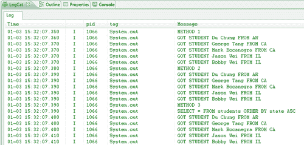

因此，实际上，我们看到结果行是按状态升序排序的。此外，就像基本查询一样，我们可以看到由 `SQLiteQueryBuilder`类创建的输出的 SQL 查询，并且可以验证这是在我们的第一个方法中执行的相同查询。

现在，进入 `GROUPBY`条款:

```java
/*
* GROUP BY Clause
*/
System.out.println("METHOD 1");
// METHOD #1 - SQLITEDATABASE RAWQUERY()
String colName = "COUNT(" + StudentTable.STATE + ")";
c = sqdb.rawQuery("SELECT " + StudentTable.STATE + "," + colName + " from " + StudentTable.TABLE_NAME + " GROUP BY " + StudentTable.STATE, null);
while (c.moveToNext()) {
int colid = c.getColumnIndex(StudentTable.STATE);
int colid2 = c.getColumnIndex(colName);
String state = c.getString(colid);
int count = c.getInt(colid2);
System.out.println("STATE " + state + " HAS COUNT " + count);
}
System.out.println("METHOD 2");
// METHOD #2 - SQLITEDATABASE QUERY()
c = sqdb.query(StudentTable.TABLE_NAME, new String[] { StudentTable.STATE, colName }, null, null, StudentTable.STATE, null, null);
while (c.moveToNext()) {
int colid = c.getColumnIndex(StudentTable.STATE);
int colid2 = c.getColumnIndex(colName);
}
SQLGROUPBY clausesSystem.out.println("METHOD 3");
// METHOD #3 - SQLITEQUERYBUILDER
query = SQLiteQueryBuilder.buildQueryString(false, StudentTable.TABLE_NAME, new String[] { StudentTable.STATE, colName }, null, StudentTable.STATE, null, null, null);
System.out.println(query);
c = sqdb.rawQuery(query, null);
while (c.moveToNext()) {
int colid = c.getColumnIndex(StudentTable.STATE);
int colid2 = c.getColumnIndex(colName);
}

```

现在，理解 `GROUPBY`查询的结构再次变得至关重要，因为它不同于我们之前看到的任何子句或过滤器。结构如下:

```java
SELECT your_column, aggregate_function(your_column) FROM your_table GROUP BY your_column

```

最棘手的部分在查询的 `aggregate_function(your_column)`段。在我们的例子中，我们使用了 SQL 中所谓的 `COUNT()`函数，顾名思义，它只是计算查询(或子查询)中返回的行数，并返回计算出的值。您可以在 SQL 中使用任意数量的 `aggregate_functions`，但是现在让我们继续使用 `COUNT()`，稍后当我们讨论 SQL 函数时，我将列出其他一些函数。

这里的想法很简单——首先我们选择一个列来分组我们的数据(在我们的例子中是按状态分组)，然后我们告诉查询返回两个列:第一个是状态本身，第二个是状态在我们的表中出现的次数(也就是说，我们的表中状态的总数)。您还会注意到，在第二个和第三个方法中， `GROUPBY`查询的执行方式非常简单，但是唯一棘手的部分是用包围它的 `COUNT()`函数指定列名(参见我们如何声明字符串 `colName)`)。一旦做到这一点，剩下的就简单明了了，就像标准的 `SELECT`带列查询一样！请注意， `COUNT()`函数也将*作为参数，它只是返回子表中所有行的计数。

现在，让我们看看我们的输出是什么:

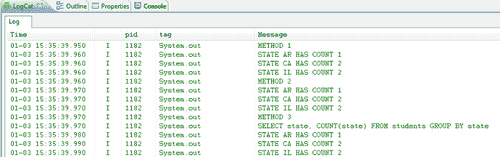

瞧啊。正如我们所料，我们的查询返回每个状态，然后是它们各自的频率！

# 具有过滤器和聚集功能

现在，伴随着 `GROUPBY`子句而来的是 `HAVING`过滤器。 `HAVING`过滤器仅与 `GROUPBY`子句一起使用，以前面的查询为例，假设我们想按表中的状态数进行分组，但我们只关心出现一定次数的状态。使用 `HAVING`过滤器，我们基本上可以将查询按状态数分组，然后只返回那些总计数大于或小于某个值的状态。

让我们看看下面的代码，并密切关注我如何构建我的查询(它看起来非常类似于 `GROUPBY`查询，但在末尾有一个额外的过滤器):

```java
/*
* HAVING Filter
*/
System.out.println("METHOD 1");
// METHOD #1 - SQLITEDATABASE RAWQUERY()
String colName = "COUNT(" + StudentTable.STATE + ")";
c = sqdb.rawQuery("SELECT " + StudentTable.STATE + "," + colName + " from " + StudentTable.TABLE_NAME + " GROUP BY " + StudentTable.STATE + " HAVING " + colName + " > 1", null);
while (c.moveToNext()) {
int colid = c.getColumnIndex(StudentTable.STATE);
int colid2 = c.getColumnIndex(colName);
}
System.out.println("METHOD 2");
// METHOD #2 - SQLITEDATABASE QUERY()
c = sqdb.query(StudentTable.TABLE_NAME, new String[] { StudentTable.STATE, colName }, null, null, StudentTable.STATE, colName + " > 1", null);
System.out.println("METHOD 3");
// METHOD #3 - SQLITEQUERYBUILDER
query = SQLiteQueryBuilder.buildQueryString(false, StudentTable.TABLE_NAME, new String[] { StudentTable.STATE, colName }, null, StudentTable.STATE, colName + " > 1", null, null);
System.out.println(query);
c = sqdb.rawQuery(query, null);

```

所以你有了。再次，注意第一个方法中我的查询的结构，并注意它如何转化为第二个和第三个方法中查询便利方法的 `HAVING`参数。现在让我们看看查询是如何进行的，以及它是否从输出中消除了 AR:

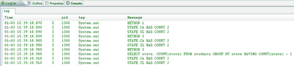

完美-非常简单。之前我们遇到了 `COUNT()`聚合函数，它与 `SUM()`和 `AVG()`一起是最受欢迎的聚合函数(完整列表见此处:[http://www.sqlite.org/lang_aggfunc.html)](http://www.sqlite.org/lang_aggfunc.html))。这些函数就像它们的名字一样，要么计算子表中特定列返回的总行数，要么计算子表中该列值的总和，要么计算子表中该列值的平均值，等等。首先，让我们检查一些聚合函数，如下所示(注意列名是如何变化的):

```java
/*
* SQL Functions - MIN/MAX/AVG
*/
System.out.println("METHOD 1");
// METHOD #1 - SQLITEDATABASE RAWQUERY()
String colName = "MIN(" + StudentTable.GRADE + ")";
c = sqdb.rawQuery("SELECT " + colName + " from " + StudentTable.TABLE_NAME, null);
while (c.moveToNext()) {
int colid = c.getColumnIndex(colName);
int minGrade = c.getInt(colid);
System.out.println("MIN GRADE " + minGrade);
}
System.out.println("METHOD 2");
// METHOD #2 - SQLITEDATABASE QUERY()
colName = "MAX(" + StudentTable.GRADE + ")";
c = sqdb.query(StudentTable.TABLE_NAME, new String[] { colName }, null, null, null, null, null);
System.out.println("METHOD 3");
// METHOD #3 - SQLITEQUERYBUILDER
colName = "AVG(" + StudentTable.GRADE + ")";
query = SQLiteQueryBuilder.buildQueryString(false, StudentTable.TABLE_NAME, new String[] { colName }, null,
null, null, null, null);
System.out.println(query);
c = sqdb.rawQuery(query, null);
while (c.moveToNext()) {
int colid = c.getColumnIndex(colName);
double avgGrade = c.getDouble(colid);
System.out.println("AVG GRADE " + avgGrade);
}

```

因此，这里我们使用三种方法中的每一种来测试不同的聚合函数。结果如下所示:

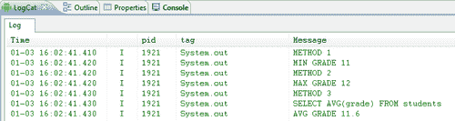

在引用了前面的表的状态之后，您可以快速地验证输出的数字，并确认函数确实在做它们应该做的事情。除了聚合函数(通常用于数字类型的列)之外，SQLite 还为您提供了各种其他核心函数，帮助您处理从字符串到日期类型等所有内容。这些核心功能的完整列表可以在[http://www.sqlite.org/lang_corefunc.html](http://www.sqlite.org/lang_corefunc.html)找到，但是现在，让我们来看几个:

```java
/*
* SQL Functions - UPPER/LOWER/SUBSTR
*/
System.out.println("METHOD 1");
// METHOD #1 - SQLITEDATABASE RAWQUERY()
String colName = "UPPER(" + StudentTable.NAME + ")";
c = sqdb.rawQuery("SELECT " + colName + " from " + StudentTable.TABLE_NAME, null);
while (c.moveToNext()) {
int colid = c.getColumnIndex(colName);
String upperName = c.getString(colid);
System.out.println("GOT STUDENT " + upperName);
}
System.out.println("METHOD 2");
// METHOD #2 - SQLITEDATABASE QUERY()
colName = "LOWER(" + StudentTable.NAME + ")";
c = sqdb.query(StudentTable.TABLE_NAME, new String[] { colName }, null, null, null, null, null);
System.out.println("METHOD 3");
// METHOD #3 - SQLITEQUERYBUILDER
colName = "SUBSTR(" + StudentTable.NAME + ",1,4)";
query = SQLiteQueryBuilder.buildQueryString(false, StudentTable.TABLE_NAME, new String[] { colName }, null,
null, null, null, null);
System.out.println(query);
c = sqdb.rawQuery(query, null);

```

同样，以下是这些核心功能的相关输出:

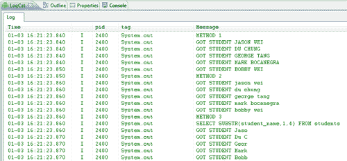

现在，就在 SQLite 中运行这些函数中的一些而不是仅仅在 Java 端运行它们的性能提升程度而言，这是有争议的，并且高度依赖于数据库的大小和您正在调用的函数。例如，一些字符串操作函数可能无法像其他更复杂的聚合函数那样提供更高的性能提升。事实上，这种 SQLite 与 Java 的比较是我们将在下一节中详细研究的内容，但无论如何，了解 SQLite 中可供您使用的功能并将其添加到您的武器库中总是更好的！

最后，是时候看看使用 `SQLiteQueryBuilder`的好处了(到目前为止，大部分语法都非常类似于 `SQLiteDatabase)`中的 `query()`方法，看看我们如何利用这个便利类来执行更复杂的连接:

```java
/*
* SQL JOINS
*/
SQLiteQueryBuilder sqb = new SQLiteQueryBuilder();
// NOTICE THE SYNTAX FOR COLUMNS IN JOIN QUERIES
String courseIdCol = CourseTable.TABLE_NAME + "." + CourseTable.ID;
String classCourseIdCol = ClassTable.TABLE_NAME + "." + ClassTable.COURSE_ID;
String classIdCol = ClassTable.TABLE_NAME + "." + ClassTable.ID;
sqb.setTables(ClassTable.TABLE_NAME + " INNER JOIN " + CourseTable.TABLE_NAME + " ON (" + classCourseIdCol + " = " + courseIdCol + ")");
String[] cols = new String[] { classIdCol, ClassTable.COURSE_ID, CourseTable.NAME };
query = sqb.buildQuery(cols, null, null, null, null, null, null);
System.out.println(query);
c = sqdb.rawQuery(query, null);
while (c.moveToNext()) {
int colid = c.getColumnIndex(0);
int colid2 = c.getColumnIndex(cols[1]);
int colid3 = c.getColumnIndex(cols[2]);
int rowId = c.getInt(colid);
int courseId = c.getInt(colid2);
String courseName = c.getString(colid3);
System.out.println(rowId + " || COURSE ID " + courseId + " || " + courseName);
}

```

首先，让我指出一些特定于 `JOIN`语句的事情。本质上, `JOIN`语句允许您基于一些列值连接两个表。例如，在我们的例子中，我们的模式是这样构建的:我们有一个班级表，每个班级都是学生标识和课程标识之间的映射。但是，假设我们不仅想快速了解什么是类映射，还想快速了解每个映射的课程名称(即课程名称和谁在学习该课程)。我们可以使用一个 SQL `JOIN`语句来返回一个联合表，而不是必须返回所有的类映射以及课程列表(也就是说，要求返回两个表)，然后手动进行这些查找。

现在，因为在执行 `JOIN`语句时，我们要求返回多个表，所以通常当您要求返回特定的列时，您需要指定该列来自哪个表。例如，考虑两个表都有标识字段的情况——在这种情况下，简单地请求标识列会导致错误，因为不清楚您真正想要哪个表的标识列。这就是我们初始化字符串 `courseIdCol, classIdCol`和 `classCourseIdCol`时所做的，语法简单如下:

```java
table_name.column_name

```

然后在我们的 `SQLiteQueryBuilder`类中，我们使用方法 `setTables()`来格式化我们的 `JOIN`语句。同样，您可以看到我们在前面的示例中使用的确切语法，但是一般的格式是首先指定您想要连接的两个表，然后告诉查询您想要什么类型的 `JOIN`(在我们的示例中，我们想要使用一个 `INNER JOIN)`)。之后，您需要告诉查询在哪两个列上执行 `JOIN`，同样，在我们的情况下，我们希望通过课程标识来连接这两个表，因此我们指定了我们的 `Class`表的课程标识列，并且还指定了我们的 `Course`表的相应课程标识列。通过这样做， `JOIN`语句知道，对于每个类映射，它应该获取课程标识，然后转到 `Course`表，找到对应的课程标识，并将该表的该行追加到 `Class`表中。为了深入讨论不同类型的连接以及每种连接的语法，我邀请您查看[http://www.w3schools.com/sql/sql_join.asp](http://www.w3schools.com/sql/sql_join.asp)并通读文档。上一条 `JOIN`语句的输出如下:

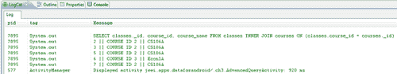

因此，您可以立即看到查询的语法和结果。

# SQL 与 Java 的性能比较

那么 SQL 语言到底有多强大和高效呢？在前面的两节中，我们探索了 SQL 的基本和更高级的特性——所有这些特性的功能(理论上)都可以用 Java 来模仿(也就是说，只需执行一个简单的 `SELECT`语句来取回整个表，并用 Java `if`语句解析它，等等)。然而，现在是时候探索在 SQLite 端过滤和操作我们的数据是否有实际的额外优势了(与在 Java 端相反)，如果有，它提供了多大的优势。因此，首先，我们需要一个更大的数据集来更好地说明性能的提高。

首先，我们在一个新的模式下创建一个新的表，该表只包含一个名称、州和收入的列——可以把它想象成一个美国数据库，其中包含每个家庭的名称、他们居住的州以及他们的家庭收入。该表有 17，576 行——考虑到一些实际应用表的数量，仍然不多——但希望这个测试表将说明其中一些性能差异。让我们从 `WHERE`过滤器开始:

```java
public class PerformanceActivity extends Activity {
@Override
protected void onCreate(Bundle savedInstanceState) {
super.onCreate(savedInstanceState);
setContentView(R.layout.main);
TestSchemaHelper sch = new TestSchemaHelper(this);
SQLiteDatabase sqdb = sch.getWritableDatabase();
// TEST WHERE FILTER PERFORMANCE //
// SQL OPTIMIZED
long start = System.nanoTime();
String query = SQLiteQueryBuilder.buildQueryString(false, TestTable.TABLE_NAME, new String[] { TestTable.NAME }, TestTable.INCOME + " > 500000", null, null, null, null);
System.out.println(query);
Cursor c = sqdb.rawQuery(query, null);
int numRows = 0;
while (c.moveToNext()) {
int colid = c.getColumnIndex(TestTable.NAME);
String name = c.getString(colid);
numRows++;
}
System.out.println("RETRIEVED " + numRows);
System.out.println((System.nanoTime() - start) / 1000000 + " MILLISECONDS");
c.close();
// JAVA OPTIMIZED
start = System.nanoTime();
query = SQLiteQueryBuilder.buildQueryString(false, TestTable.TABLE_NAME, new String[] { TestTable.NAME,
TestTable.INCOME }, null, null, null, null, null);
System.out.println(query);
c = sqdb.rawQuery(query, null);
numRows = 0;
while (c.moveToNext()) {
int colid = c.getColumnIndex(TestTable.NAME);
int colid2 = c.getColumnIndex(TestTable.INCOME);
String name = c.getString(colid);
int income = c.getInt(colid2);
if (income > 500000) {
numRows++;
}
}
System.out.println("RETRIEVED " + numRows);
System.out.println((System.nanoTime() - start) / 1000000 + " MILLISECONDS");
c.close();
}
}

```

在 SQLite 方面，我们只是简单地使用了一个 `WHERE`过滤器，它会将我们表中家庭收入超过 50 万的所有家庭返回给我们。在 Java 端，我们获取整个表并遍历每一行，并使用 `if`语句执行相同的过滤。我们可以验证输出的行是相同的，同时查看两种方法的速度进行比较:

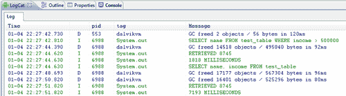

因此，我们看到这里的性能几乎提升了 5 倍！接下来，让我们看看使用 `GROUPBY`子句时获得的性能提升。在 SQLite 方面，我们将简单地在 states 列上做一个 `GROUPBY`语句，并要求计算每个州有多少个家庭。然后，在 Java 端，我们将要求整个表返回并手动遍历每一行，使用一个标准的 `Map`对象来跟踪每个状态及其各自的计数，如下所示:

```java
// TEST GROUP BY PERFORMANCE //
// SQL OPTIMIZED
start = System.nanoTime();
String colName = "COUNT(" + TestTable.STATE + ")";
query = SQLiteQueryBuilder.buildQueryString(false, TestTable. TABLE_NAME, new String[] { TestTable.STATE,
colName }, null, TestTable.STATE, null, null, null);
System.out.println(query);
c = sqdb.rawQuery(query, null);
while (c.moveToNext()) {
int colid = c.getColumnIndex(StudentTable.STATE);
int colid2 = c.getColumnIndex(colName);
String state = c.getString(colid);
int count = c.getInt(colid2);
System.out.println("STATE " + state + " HAS COUNT " + count);
}
System.out.println((System.nanoTime() - start) / 1000000 + " MILLISECONDS");
c.close();
// JAVA OPTIMIZED
start = System.nanoTime();
query = SQLiteQueryBuilder.buildQueryString(false, TestTable. TABLE_NAME, new String[] { TestTable.STATE },
null, null, null, null, null);
System.out.println(query);
c = sqdb.rawQuery(query, null);
Map<String, Integer> map = new HashMap<String, Integer>();
while (c.moveToNext()) {
int colid = c.getColumnIndex(TestTable.STATE);
String state = c.getString(colid);
if (map.containsKey(state)) {
int curValue = map.get(state);
map.put(state, curValue + 1);
} else {
map.put(state, 1);
}
}
for (String key : map.keySet()) {
System.out.println("STATE " + key + " HAS COUNT " + map. get(key));
}
System.out.println((System.nanoTime() - start) / 1000000 + " MILLISECONDS");
c.close();

```

让我们看看我们做得有多好:


因此，我们看到，在这种情况下，性能提升是存在的，但不太明显，使我们的效率提高了 33%。需要注意的是，这些陈述的统计数据高度依赖于表的模式和大小，所以对这些数字持半信半疑的态度。然而，这些小实验的目的只是让我们了解这两种方法是如何比较的。最后，让我们看看像 SQL 中的 `avg()`这样的内置聚合函数与 Java 相比如何。这两种方法的代码如下:

```java
// TEST AVERAGE PERFORMANCE //
// SQL OPTIMIZED
start = System.nanoTime();
colName = "AVG(" + TestTable.INCOME + ")";
query = SQLiteQueryBuilder.buildQueryString(false, TestTable.TABLE_NAME, new String[] { colName }, null, null,
null, null, null);
System.out.println(query);
c = sqdb.rawQuery(query, null);
while (c.moveToNext()) {
int colid = c.getColumnIndex(colName);
double avgGrade = c.getDouble(colid);
System.out.println("AVG INCOME " + avgGrade);
}
System.out.println((System.nanoTime() - start) / 1000000 + " MILLISECONDS");
c.close();
// JAVA OPTIMIZED
start = System.nanoTime();
colName = TestTable.INCOME;
query = SQLiteQueryBuilder.buildQueryString(false, TestTable.TABLE_NAME, new String[] { colName }, null, null,
null, null, null);
System.out.println(query);
c = sqdb.rawQuery(query, null);
SQL language performancecheckingdouble sumIncomes = 0.0;
double numIncomes = 0.0;
while (c.moveToNext()) {
int colid = c.getColumnIndex(colName);
int income = c.getInt(colid);
sumIncomes += income;
numIncomes++;
}
System.out.println("AVG INCOME " + sumIncomes / numIncomes);
System.out.println((System.nanoTime() - start) / 1000000 + " MILLISECONDS");
c.close();

```

快速看一下输出给我们带来了什么:

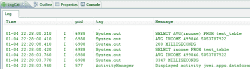

哇，说得够多了。这两种方法的结果是相同的，但是当使用 SQL 函数时，您会看到性能提高了 16 倍。

# 总结

在这一章中，我们从关注安卓操作系统开始，看看有哪些类型的查询方法可供您使用。我们看到有三种众所周知的与 SQLite 数据库交互的方式，有些比其他方式更“方便”，有些比其他方式更灵活和强大。

然而，我们也看到，尽管每种方法都有其优缺点，但所有三种查询方法最终都可以执行相同类型的查询，只是使用不同的语法集或使用不同的参数集。这就是我们从方法本身转移到更关注查询本身的时候，从简单的查询开始，从最基本的 `SELECT`查询到允许您指定特定列和行的更复杂的查询。后来，我们谈到了更高级的查询，从 `ORDERBY`和 `GROUPBY`查询到最复杂和最复杂的 `JOIN`语句。

最后，作为好奇和注重性能的程序员，我们在最后一节比较了 SQL 和 Java 在 SQL 和 Java 中实现各种查询的速度，然后运行它们来查看各自的速度。我们看到，在每种情况下，与在 Java 中执行相同的功能相比，能够将您想要的功能嵌入到 SQL 查询中会使您的性能得到提升(在一种情况下，它给我们带来了高达 16 倍的性能提升)。因此，本节故事的寓意是，如果可能的话，找到在 SQL 端而不是 Java 端操作数据的方法，因为它将帮助您优化速度和内存使用！

但是在继续之前，让我们花一点时间来综合一下我们到目前为止所学的内容。早些时候在[第 2 章](02.html "Chapter 2. Using a SQLite Database")、*使用 SQLite 数据库*中，我们了解了如何在您的安卓应用中实现 SQLite 数据库模式，刚才我们了解了内置于 SQL 中的所有不同功能，这些功能最终允许您以极其强大、高效的方式处理数据。但是现在，如果你想利用用户安卓设备上的现有数据呢？每个安卓设备都包含大量数据，其中大部分可供外部应用查询，因此在开发应用时记住这一点非常重要。此外，如果您想向其他应用公开您的数据库和模式，该怎么办？如果您正在构建任务列表应用，并且希望允许其他应用(可能是基于日历的应用)查询用户的现有任务，该怎么办？所有这些都是通过所谓的 `ContentProvider`来实现的，在接下来的两章中，我们将讨论安卓中这个极其重要的类。