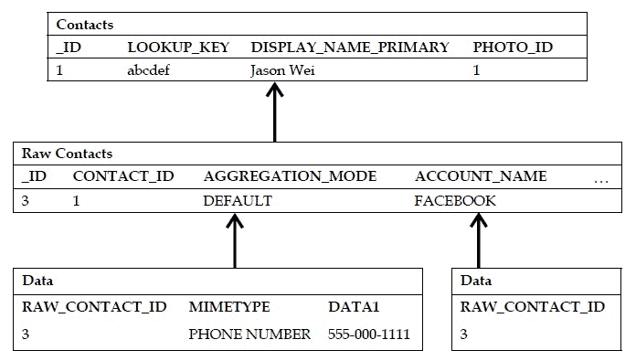
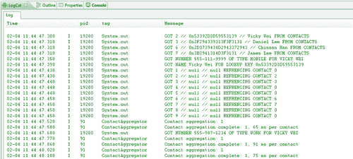

# 第五章。查询联系人表

在本书的前面，我们研究了如何通过覆盖 `SQLiteOpenHelper`类来为我们的应用程序构建一个 SQLite 数据库。然后，我们通过引入 `ContentProvider`类扩展了我们对安卓系统上数据库的理解，该类允许我们将我们的 SQLite 数据库暴露给外部应用程序，更一般地说，暴露给安卓操作系统本身。

然而，虽然知道如何设计和实现自己的数据库是一项强大的技能，但知道如何利用用户设备上的现有数据也同样有益。通常，这意味着向现有内容提供商查询各种类型的数据，但是一个特别重要的内容提供商，也是目前最常被查询的内容提供商是 `Contacts`内容提供商。

在本章中，我们将从探索 `Contacts`内容提供者的结构(即其模式)开始，然后查看查询联系人及其相关元数据的各种方法。

# 联系人内容提供商的结构

理解 `Contacts`内容提供商的模式是挑战的一半。因为大量的数据可能与联系人相关联，所以在设计一个既灵活又强大的模式来满足每个用户的需求时，必须做很多工作。在下表中，我已经概述了这个模式是如何布局的，在深入到模式的每个表中之前，我们将从高层次上研究模式是如何工作的:



这就是了——看起来不太令人畏惧，对吧？当然，前面显示的列只是每个表中实际列的一个子集，但它应该足以让您了解这些表是如何协同工作的。如果你想看到每个表中的所有列，我邀请你看看以下链接:

[http://developer . Android . com/reference/Android/provider/contacts contract。Contacts.html](http://developer.android.com/reference/android/provider/ContactsContract.Contacts.html)

[http://developer . Android . com/reference/Android/provider/contacts contract。RawContacts.html](http://developer.android.com/reference/android/provider/ContactsContract.RawContacts.html)

[http://developer . Android . com/reference/Android/provider/contacts contract。Data.html](http://developer.android.com/reference/android/provider/ContactsContract.Data.html)

让我们首先从一个高层次来思考这个模式。在顶部，我们有 `Contacts`表。在安卓的早期版本(4 级及以下)，这或多或少是你所拥有的一切。这只是典型的、直观的 `Contacts`表格，其中包含每个联系人的唯一标识以及他们的姓名、电话号码、电子邮件等。

然后事情变得复杂了。突然间，安卓 2.0(应用编程接口 5 级及以上)问世，用户可以同步他们与脸书、推特、谷歌以及其他众多服务的联系。只有一张简单的 `Contacts`桌子还有意义吗？每个来源的每个联系人会是它自己的单独行吗？我们如何知道哪些行实际上指的是同一个联系人？

因此，谷歌不得不开发第二层引用 `Contacts`表的表——这些表被称为 `Raw Contacts`。用户拥有的每个联系人都是原始联系人的集合，其中每个原始联系人代表来自特定来源的单个联系人。那么，假设你有一个朋友，并且你已经将这个联系与脸书和推特同步了。这个朋友会有两个 `Raw Contact`表，一个描述他/她的来自脸书的元数据，另一个描述他/她的来自推特的元数据。这两个原始联系人都指向 `Contacts`表中的一个条目。

但是等等，以前每个联系人的元数据或多或少地局限于几个电话号码和几封电子邮件，而现在由于社交网络，每个联系人都有大量的元数据可用。那么我们如何存储所有这些元数据呢？每个联系人的最新状态消息或最新推文？我们会有一张 30 列左右的大桌子吗？

最好不要——这可能不是一个好的内存使用方式，因为该表可能相当稀疏。因此，谷歌团队决定创建第三层表格，称为 `Data`表格。这些 `Data`表都引用了一个原始联系人，而原始联系人又引用了一个联系人。这就是安卓操作系统对联系人的基本描述——联系人是原始联系人的集合，每个原始联系人都特定于一个来源(即脸书或推特)，每个原始联系人是独立数据表的集合，其中每个数据表包含特定类型的数据(即电话号码、电子邮件、状态消息等)。这是正在发生的事情的概要，在下一节中，我们将看一看您实际上是如何查询这些表中的公共字段的，例如电话号码和电子邮件。

现在，有许多技术细节充分描述了模式中正在发生的事情，但现在我将在本节结束时简要讨论原始联系人之间的聚合实际上是如何工作的。

系统会自动聚合原始联系人，因此每次您创建新联系人或将新帐户与现有联系人同步时，都会创建原始联系人，聚合模式设置为 `DEFAULT`，这将告诉系统将此原始联系人与引用同一联系人的其他原始联系人进行聚合。但是，您可以明确定义您希望原始联系人使用哪种聚合，选项如下:

*   `AGGREGATION_MODE_DEFAULT`默认状态，允许自动聚合
*   `AGGREGATION_MODE_DISABLED`不允许自动聚合，不聚合原始联系人
*   `AGGREGATION_MODE_SUSPENDED`自动聚合被停用，但是，如果原始联系人先前已聚合，则它将保持聚合状态

这是三种聚合模式，您可以针对每个原始联系人进行更新和调整。至于聚合是如何完成的，它主要是通过匹配姓名和/或昵称来完成的，如果姓名不存在，则使用电话号码和电子邮件来尝试匹配。

到目前为止，您应该已经对 `Contacts`内容提供商的样子有了一个很好的了解，因此我们将继续研究一些代码！

# 查询联系人

首先，让我们从一个简单的查询开始，该查询以 `Contacts`表为目标，并向我们返回联系人标识、每个联系人的姓名(记住这是一个聚合的显示名称)以及他们的 `lookup`键。这个 `lookup`键对于 `Contacts`内容提供商来说是一个相对较新的概念，它意味着比使用传统的行标识更可靠地引用 `Contacts`。

原因是行标识往往不可靠，尤其是对于像 `Contacts`内容提供商这样的内容提供商来说，它可能有许多应用程序同时引用并可能更新它。假设您试图通过联系人的行标识来引用联系人，但是早些时候用户设备上的不同应用程序对 `Contacts`数据库进行了更改，因此该行标识上的联系人现在不同了，或者可能现在已经不存在了！相反， `lookup`键是每个原始联系人的服务器端标识符的串联(换句话说，它是原始联系人元数据的函数)，并且将更加稳定。不过，解释够了，让我们看看一个简单的查询可能是什么样子:

```java
public class ContactsQueryActivity extends Activity {
@Override
protected void onCreate(Bundle savedInstanceState) {
super.onCreate(savedInstanceState);
setContentView(R.layout.main);
/*
* QUERY EXAMPLE
*/
// FIRST QUERY FOR CONTACT LOOKUPS
Cursor c = getContentResolver().query(
ContactsContract.Contacts.CONTENT_URI,
new String[] { ContactsContract.Contacts._ID, ContactsContract.Contacts.DISPLAY_NAME, ContactsContract.Contacts.LOOKUP_KEY }, ContactsContract.Contacts.DISPLAY_NAME + " IS NOT NULL", null, null);
startManagingCursor(c);
int idCol = c.getColumnIndex(Contacts._ID);
int nameCol = c.getColumnIndex(Contacts.DISPLAY_NAME);
int lookCol = c.getColumnIndex(Contacts.LOOKUP_KEY);
// USE A MAP TO KEEP TRACK OF LOOKUP VALUES
Map<String, String> lookups = new HashMap<String, String>();
while (c.moveToNext()) {
int id = c.getInt(idCol);
String name = c.getString(nameCol);
String lookup = c.getString(lookCol);
lookups.put(name, lookup);
System.out.println("GOT " + id + " // " + lookup + " // " + name + " FROM CONTACTS");
}
}
}

```

因此，我们在这里检索我们的内容解析器，就像我们在上一章中所做的那样，并传递 `Contacts CONTENT_URI`。然后，我们遍历游标，得到投影数组中我们需要的字段。请注意，我还使用了一个 `Map`来记录每个联系人的 `lookup`键。在我的例子中，我将键设置为联系人的显示名称，但是您可以将 `lookup`键和/或联系人标识存储为您喜欢的任何数据结构。

如果您已经知道联系人的 `lookup`键(可能它之前已经缓存在某个地方)，那么您可以使用该 `lookup`键通过以下代码片段直接访问联系人:

```java
// ALTERNATIVELY - USE LOOKUP KEY LIKE THIS
Uri lookupUri = Uri.withAppendedPath( Contacts.CONTENT_LOOKUP_URI, lookups.get("Vicky Wei"));
Cursor c3 = getContentResolver().query(lookupUri, new String[] { Contacts.DISPLAY_NAME }, null, null, null);
if (c3.moveToFirst()) {
int nameCol = c3.getColumnIndex(Contacts.DISPLAY_NAME);
String displayName = c3.getString(nameCol);
System.out.println("GOT NAME " + displayName + " FOR LOOKUP KEY " + lookups.get("Vicky Wei"));
}
c3.close();

```

因此，这里我们将 `lookup`值附加到 URI 本身——类似于我们先前如何将行标识附加到标准内容 URI 以检索单个公民。然而，这种方法的问题是，与传统的按行标识匹配相比，试图按 `lookup`键匹配时往往会有更多的开销。换句话说，为了获得更好的查询精度，您牺牲了一些速度上的性能。然而，安卓为你提供了另一种方法，这种方法既能提高精确度，又能提高性能:

```java
Uri lookupUri = getLookupUri(contactId, lookupKey)

```

这种方法允许您首先通过联系人 ID 来搜索联系人，这是一种速度更快但仍然有些可靠的方法。但是，如果没有找到具有该联系人标识的联系人，系统将恢复使用 `lookup`键。无论是哪种情况，只要该联系人存在，就可以保证为该联系人检索到正确的 `lookup` URI，但经常使用这种方法会在不牺牲任何准确性的情况下给你带来很好的性能提升。

现在您已经有了联系人 id、 `lookup`键和他们的姓名，您将如何查询更具体的元数据——比如他们的电话号码或电子邮件？让我们看一下下面的例子，我通过他们的 `lookup`键过滤来请求联系人的电话号码和电话类型:

```java
// THEN WITH LOOKUP KEYS - FIND SPECIFIC DATA FIELDS
Cursor c2 = getContentResolver().query( ContactsContract.Data.CONTENT_URI,
new String[] { ContactsContract.CommonDataKinds.Phone.NUMBER, Phone.TYPE },ContactsContract.Data.LOOKUP_KEY + "=?", new String[] { lookups.get("Vicky Wei") }, null);
startManagingCursor(c2);
int numberCol = c2.getColumnIndex(Phone.NUMBER);
int typeCol = c2.getColumnIndex(Phone.TYPE);
if (c2.moveToFirst()) {
String number = c2.getString(numberCol);
int type = c2.getInt(typeCol);
String strType = "";
switch (type) {
case Phone.TYPE_HOME:
strType = "HOME";
break;
case Phone.TYPE_MOBILE:
strType = "MOBILE";
break;
case Phone.TYPE_WORK:
strType = "WORK";
break;
default:
strType = "MOBILE";
break;
}
System.out.println("GOT NUMBER " + number + " OF TYPE " + strType + " FOR VICKY WEI");
}

```

请注意，我们将一些完整的包路径留给了 `Phone`和 `Data`类，以便再次让您看到模式的层次特性。这里，因为我们现在瞄准的是 `Data`桌而不是 `Contact`桌，所以我们传入相应的 `Data CONTENT_URI`。然后，在投影参数中，我们请求电话号码以及电话类型，在选择参数中，我确保通过 `lookup`键进行过滤。一旦我成功地进行了查询，我们只需移动光标(此时只有一个数字与 Vicky 相关联；否则，我们将使用 `while`循环)并再次抓取字段。请注意，我们编写了一个简单的 `switch`语句，它允许我们将作为整数返回的 `PHONE_TYPE`转换为一个更加用户友好的字符串。

最后但同样重要的是，让我们看看如何查询 `Raw Contacts`表:

```java
// NOW LOOK AT RAW CONTACT IDS
c = getContentResolver().query(
ContactsContract.RawContacts.CONTENT_URI,
new String[] { ContactsContract.RawContacts._ID, RawContacts.ACCOUNT_NAME, RawContacts.ACCOUNT_TYPE, RawContacts.CONTACT_ID }, null, null, null);
startManagingCursor(c);
int rawIdCol = c.getColumnIndex(RawContacts._ID);
int accNameCol = c.getColumnIndex(RawContacts.ACCOUNT_NAME);
int accTypeCol = c.getColumnIndex(RawContacts.ACCOUNT_TYPE);
int contactIdCol = c.getColumnIndex(RawContacts.CONTACT_ID);
while (c.moveToNext()) {
int rawId = c.getInt(rawIdCol);
String accName = c.getString(accNameCol);
String accType = c.getString(accTypeCol);
int contactId = c.getInt(contactIdCol);
System.out.println("GOT " + rawId + " // " + accName + " // " + accType + " REFRENCING CONTACT " + contactId);
}

```

如果您想查看某个特定来源的联系人元数据(比如您只关心脸书在该联系人上有什么信息)，这一点尤其有用。然后，您可以通过 `ACCOUNT_NAME`或 `ACCOUNT_TYPE`潜在地过滤 `Raw Contacts`表，一旦您有了与该特定来源相关联的原始联系人标识，您就可以在 `Data`表中查询与这些特定原始联系人标识相关联的任何元数据！

现在，让我们快速了解一下如何修改联系人数据，更具体地说，如何插入和更新联系人数据。请注意，为了成功运行这些活动，我们需要在 `Android Manifest`文件中请求特殊权限。然而，现在，让我们继续关注代码，我们将确保绕道而行，并在最后覆盖所有权限。

# 修改联系人

以下示例的代码应该看起来非常熟悉。正如我前面所说的，挑战的一半只是掌握模式和理解每个表如何与其他表交互(它有助于看到像以前一样的模式布局，否则会非常混乱，可能需要浏览大量详细的文档)。假设我们想为用户插入一个新的电话号码。我们应该参考哪张桌子的 URI？

嗯，它必须是 `Data`表中的一个，我们可能应该传入数据的 `MIMETYPE`，以便内容提供商确切地知道要在哪个 `Data`表中插入新行。在这种情况下，我们将指定电话内容类型，并传入一个号码和一个号码类型。我们唯一缺少的字段是 ID -这个新行应该进入谁的电话 `Data`表？嗯，回想一下每个 `Data`表都指向一个 `Raw Contact`表，传入联系人的原始联系人 ID 是有意义的。

因此，我们尝试为每次插入、更新或删除重复这个思考过程，代码最终看起来是这样的:

```java
public class ContactsQueryActivity extends Activity {
@Override
protected void onCreate(Bundle savedInstanceState) {
super.onCreate(savedInstanceState);
setContentView(R.layout.main);
/*
* INSERT EXAMPLE
*/
ContentValues values = new ContentValues();
// IN THIS CASE - EACH RAW ID IS JUST THE CONTACT ID
values.put(ContactsContract.Data.RAW_CONTACT_ID, 2);
values.put(Data.MIMETYPE, Phone.CONTENT_ITEM_TYPE);
values.put(Phone.NUMBER, "555-987-1234");
values.put(Phone.TYPE, Phone.TYPE_WORK);
Uri contactUri = getContentResolver().insert( Data.CONTENT_URI, values);
Cursor c4 = getContentResolver().query(contactUri, new String[] { Phone.NUMBER, Phone.TYPE }, null, null, null);
startManagingCursor(c4);
// READ BACK THE ROW
if (c4.moveToFirst()) {
String number = c4.getString(numberCol);
int type = c4.getInt(typeCol);
String strType = "";
switch (type) {
case Phone.TYPE_HOME:
strType = "HOME";
break;
case Phone.TYPE_MOBILE:
strType = "MOBILE";
break;
case Phone.TYPE_WORK:
strType = "WORK";
break;
default:
strType = "MOBILE";
break;
}
System.out.println("GOT NUMBER " + number + " OF TYPE " + strType + " FOR VICKY WEI");
}
}
}

```

这里我们使用我们的内容解析器和一个 `ContentValues`对象来做一个标准的插入。一旦我们插入了它，我们就返回了新插入的行的 URI，因此我们只需在那个 URI 上运行一个查询，并读回我们刚刚插入的数据，就像检查插入是否有效一样。我将在下面的截图中指出这一点。

现在，谷歌的开发人员鼓励另一种插入方式，这就是使用批量插入。这是安卓操作系统的另一个相对较新的概念，是传统 `ContentValues`类的变体。通过使用批处理操作，您不仅可以在一次插入多行时获得相当大的性能提升(节省了从客户端切换到服务器端的时间)，还可以确保插入时的**原子性**。这只是一个花哨的数据库单词，意思是要么插入所有的行，要么不插入任何行，这样，如果在插入过程中出现错误，系统将确保回滚之前的插入，从而保持数据库的一致性。

这些批处理插入的语法如下所示，非常直观:

```java
// NOW INSERT USING BATCH OPERATIONS
ArrayList<ContentProviderOperation> ops = new ArrayList<ContentProviderOperation>();
ops.add(ContentProviderOperation.newInsert(Data.CONTENT_URI)
.withValue(Data.RAW_CONTACT_ID, 3)
.withValue(Data.MIMETYPE, Email.CONTENT_ITEM_TYPE)
.withValue(Email.DATA, "daniel@stanford.edu")
.withValue(Email.TYPE, Email.TYPE_WORK)
.build());
try {
getContentResolver().applyBatch (ContactsContract.AUTHORITY, ops);
} catch (Exception e) {
e.printStackTrace();
System.out.println("ERROR: BATCH TRANSACTION FAILED");
}

```

为了总结本章，我们将快速了解如何使用这种新的批处理操作机制来更新联系人的电子邮件:

```java
/*
* UPDATE EXAMPLE
*/
ops = new ArrayList<ContentProviderOperation>();
ops.add(ContentProviderOperation.newUpdate(Data.CONTENT_URI)
.withSelection(Data.RAW_CONTACT_ID + "=? AND " + Email.TYPE + "=?",new String[] { "7", String.valueOf(Email. TYPE_WORK) }).withValue(Email.DATA,"james@android.com"). build());
try {
getContentResolver().applyBatch( ContactsContract.AUTHORITY, ops);
} catch (Exception e) {
e.printStackTrace();
System.out.println("ERROR: BATCH TRANSACTION FAILED");
}

```

就这样！这里，我们再次想到，我们可能需要指定原始联系人 ID，以便内容提供商知道要更新谁的 `Data`表，以及 `Data`表的 `MIMETYPE`，以便内容提供商知道要更新哪个 `Data`表。关于本节中所有查询、插入和更新的结果，请参见以下内容:



在这里，我们首先看到我的联系人列表中的所有联系人以及他们的 `lookup`键、身份证和显示名称。然后，我们看到我们从 Vicky 那里检索到的电话号码，以及通过她的 `lookup`键而不是她的联系人 ID 查找她的结果，然后是我们对 `Raw Contacts`表的查询。请注意，对于帐户名和帐户类型，您会看到一堆空值，但这只是我在模拟器上运行代码的结果。当您尝试在完全同步的实时联系人列表上运行代码时，您会看到更加丰富多彩的结果。最后，我们只看到我们的插入和更新的一些结果，并且可以通过实际查看联系人列表中的联系人来进一步验证我们的插入/更新是否成功，如下所示:


这里我们看到，我们已经成功地为联系人 Vicky 插入了一个工作号码，然后又为 Daniel 插入了一个工作号码，我们看到如下:


所以他现在确实有一封工作邮件，里面有我们指定的正确电子邮件。就这样！希望现在您对 `Contacts`内容提供者的模式以及如何构建有效查询或插入的一般语法都有了很好的理解。当您考虑要传入哪些字段以及您真正想要从哪些表中进行查询时，请记住记住模式。

# 设置权限

现在我们已经掌握了 `Contacts`内容提供者，但没有声明适当的权限，当您试图运行前面的代码时，可能会遇到一些粗鲁的强制关闭。为了保护用户的个人联系信息免受潜在恶意应用程序的攻击，安卓操作系统要求您在 `Android Manifest`文件中声明应用程序的一些读写权限。为此，您需要做的就是在您的清单文件中添加以下两行:

```java
<?xml version="1.0" encoding="utf-8"?>
<manifest xmlns:android="http://schemas.android.com/apk/res/android"
package="jwei.apps.dataforandroid"
android:versionCode="1"
android:versionName="1.0">
<application android:icon="@drawable/icon" android:label= "@string/app_name">
<activity android:name=".ch5.ContactsQueryActivity" android:label="@string/app_name">
<intent-filter>
<action android:name="android.intent.action.MAIN" />
<category android:name="android.intent.category.LAUNCHER" />
</intent-filter>
</activity>
</application>
<uses-sdk android:minSdkVersion="5" />
<uses-permission android:name="android.permission.READ_CONTACTS"/>
<uses-permission android:name="android.permission.WRITE_CONTACTS"/> 
</manifest>

```

因此，基本上，您只需要在清单中声明您希望能够读写(即修改)联系人(或者根据您的应用程序需要声明其中一个)。这将在用户下载您的应用程序之前提示用户，您的应用程序需要这些权限，只要用户接受这些权限，您的应用程序就可以运行了！

# 总结

在本章中，我们通过掌握每个设备上每个应用程序可用的最广泛使用的内容提供商——内容提供商来扩展我们对内容提供商的了解。我们首先看一下 `Contacts`内容提供商的模式，随着与给定联系人相关联的元数据数量因各种社交网络来源而激增，该模式变得越来越复杂。为了解决这个问题，谷歌的团队决定切换模式，将第一层表简单地称为 `Contacts`表，接下来是第二层表，称为 `Raw Contact`表，然后是第三层表，简单地称为 `Data`表。每个联系人是一组特定于某个来源(即脸书或推特)的原始联系人的集合，每个原始联系人是一系列 `Data`表的集合，每个表都有自己的数据类型(即电话号码或电子邮件)。

之后，我们查看了查询 `Contacts`内容提供商的多种方式，以及在内容提供商中插入和更新现有联系人的多种方式。这在代码方面被证明是相对简单的(与我们在前面章节中看到的极其相似)，并且再次向我们展示了了解模式并确保包含所有正确的字段是多么的成功。

到目前为止，在本书中，我们已经研究了查询您自己以及外部数据库的方法，但是每次我们都依赖简单的系统打印语句来实际查看查询结果(到目前为止，我确信您也厌倦了查看 DDMS 日志)。那么问题就变成了——既然我已经知道如何实际构建和查询数据库，那么我该如何设计活动，让我将这些数据绑定到用户界面，以便用户查看和交互？这是我们将在下一章中重点讨论的内容，我们将探索通过用户界面与数据库进行绑定和交互的方法。