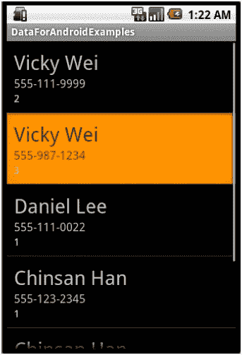
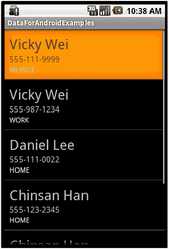

# 六、绑定到用户界面

在前面的五章中，我们已经讨论了很多内容——从轻量级的数据存储形式(如 `SharedPreferences)`)到更轻量级的数据存储形式(如 SQLite 数据库)。但是对于我们所看到的每种数据存储方法和每个示例，为了真正看到查询和后端数据操作的结果，我们必须依赖非常简单的系统 IO 打印命令。

然而，作为移动开发人员，我们的应用程序通常需要美观地显示此类数据查询的结果，并为用户提供存储和插入数据的直观界面。

在这一章中，我们将重点关注前者——将数据绑定到用户界面(UI)，并将特别关注允许我们以列表形式绑定数据的各种类(显示数据行的最常见和最直观的方式)。

# 简单光标适配器和列表视图

安卓上有两种主要的数据检索方式，每种方式都有自己的 `ListAdapters`类，这样就知道如何处理和绑定传入的数据。第一种检索数据的方式是我们已经非常熟悉的方式——通过查询和获取 `Cursor`对象。缠绕在 `Cursors`周围的 `ListAdapters`子类叫做 `CursorAdapter`，在下一节中我们将关注 `SimpleCursorAdapter`，这是 `CursorAdapter`最直接的例子。

我们已经知道， `Cursor`指向包含查询结果的行的子表。通过遍历这个游标，我们能够检查每行的字段，在前面的章节中，我们已经打印出了这些字段的值，以便检查返回的子表。现在，我们希望将子表的每一行转换为列表中相应的一行。这样做的第一步是建立一个 `ListActivity`(更常见的 `Activity`类的变体)。

顾名思义， `ListActivity`只是 `Activity`类的一个子类，它带有允许你附加 `ListAdapters`的方法。 `ListActivity`类还允许您扩展包含列表标签的 XML 布局。在我们的例子中，我们将使用一个非常简单的 XML 布局(命名为 `list.xml)`，它只包含一个 `ListView`标签，如下所示:

```java
<?xml version="1.0" encoding="utf-8"?>
<LinearLayout xmlns:android="http://schemas.android.com/apk/res/android"
android:orientation="vertical"
android:layout_width="fill_parent"
android:layout_height="wrap_content" >
<ListView
android:id="@android:id/android:list"
android:layout_width="fill_parent"
android:layout_height="wrap_content" />
</LinearLayout>

```

这是在安卓系统中设置所谓 `ListView`的第一步。类似于定义一个 `TextView`可以让你在你的 `Activity`中看到一个文本块，定义一个 `ListView`可以让你在你的 `Activity`中与一个可滚动的行对象列表交互。

直觉上，你脑海中的下一个问题应该是:我在哪里定义每行的实际外观？不仅需要在某个地方定义实际的列表对象，而且每行也应该有自己的布局。为此，我们在布局目录中创建了一个单独的 `list_entry.xml`文件。

我将要使用的示例是查询 `Contacts`内容供应器并返回包含每个联系人姓名、电话号码和电话号码类型的列表。因此，我的列表的每一行都应该包含三个文本视图，每个数据字段一个。随后，我的 `list_entry.xml`文件如下所示:

```java
<?xml version="1.0" encoding="utf-8"?>
<LinearLayout xmlns:android="http://schemas.android.com/apk/res/android"
android:orientation="vertical"
android:layout_width="fill_parent"
android:layout_height="wrap_content"
android:padding="10dip" >
<TextView
android:id="@+id/name_entry"
android:layout_width="wrap_content"
android:layout_height="wrap_content"
android:textSize="28dip" />
<TextView
android:id="@+id/number_entry"
android:layout_width="wrap_content"
android:layout_height="wrap_content"
android:textSize="16dip" />
<TextView
android:id="@+id/number_type_entry"
android:layout_width="wrap_content"
android:layout_height="wrap_content"
android:textColor="#DDD"
android:textSize="14dip" />
</LinearLayout>

```

因此，我们有一个包含三个文本视图的垂直 `LinearLayout`，每个文本视图都有自己正确定义的标识以及自己的美学属性(即文本大小和文本颜色)。

就设置而言，这就是我们所需要的！现在我们只需要创建 `ListActivity`本身，膨胀 `list.xml`布局，指定适配器。为了了解这一切是如何完成的，让我们先看看代码，然后再一点一点地分解它:

```java
public class SimpleContactsActivity extends ListActivity {
@Override
public void onCreate(Bundle savedInstanceState) {
super.onCreate(savedInstanceState);
setContentView(R.layout.list);
// MAKE QUERY TO CONTACT CONTENTPROVIDER
String[] projections = new String[] { Phone._ID, Phone.DISPLAY_NAME, Phone.NUMBER, Phone.TYPE };
Cursor c = getContentResolver().query(Phone.CONTENT_URI, projections, null, null, null);
startManagingCursor(c);
// THE DESIRED COLUMNS TO BE BOUND
String[] columns = new String[] { Phone.DISPLAY_NAME, Phone.NUMBER, Phone.TYPE };
// THE XML DEFINED VIEWS FOR EACH FIELD TO BE BOUND TO
int[] to = new int[] { R.id.name_entry, R.id.number_entry, R.id.number_type_entry };
// CREATE ADAPTER WITH CURSOR POINTING TO DESIRED DATA
SimpleCursorAdapter cAdapter = new SimpleCursorAdapter(this, R.layout.list_entry, c, columns, to);
// SET THIS ADAPTER AS YOUR LIST ACTIVITY'S ADAPTER
this.setListAdapter(cAdapter);
}
}

```

这是怎么回事？好了，现在您应该认识到代码的第一部分了——我们只是在电话的联系人列表上进行查询(特别是在联系人内容供应器的 `Phone`表格上)，并询问联系人的姓名、号码和号码类型。

接下来， `SimpleCursorAdapter`取两个参数，一个字符串数组和一个整数数组，表示 `Cursor`列和 XML 布局视图之间的映射。在我们的情况下，如下所示:

```java
// THE DESIRED COLUMNS TO BE BOUND
String[] columns = new String[] { Phone.DISPLAY_NAME, Phone.NUMBER, Phone.TYPE };
// THE XML DEFINED VIEWS FOR EACH FIELD TO BE BOUND TO
int[] to = new int[] { R.id.name_entry, R.id.number_entry, R.id.number_type_entry };

```

这是为了使 `DISPLAY_NAME`列中的数据绑定到 ID 为 `name_entry`的 `TextView`上，以此类推。一旦我们定义了这些映射，下一部分就是实例化 `SimpleCursorAdapter`，这可以在这行中看到:

```java
// CREATE ADAPTER WITH CURSOR POINTING TO DESIRED DATA
SimpleCursorAdapter cAdapter = new SimpleCursorAdapter(this, R.layout.list_entry, c, columns, to);

```

现在， `SimpleCursorAdapter`有五个参数——第一个是 `Context`，它本质上告诉 `CursorAdapter`它需要膨胀和绑定行到哪个父 `Activity`。下一个参数是您之前定义的 R 布局的 ID，它将告诉 `CursorAdapter`每一行应该是什么样子，此外，它可以在哪里膨胀相应的视图。接下来，我们传入 `Cursor`，它告诉适配器底层数据实际是什么，最后，我们传入映射。

希望前面的代码有意义， `SimpleCursorAdapter`的参数也有意义。这一次 `Activity`的结果可以在下面的截图中看到:



一切看起来都很好，除了这些在电话号码下浮动的随机整数。为什么在每一行的底部应该有类型的地方会有一堆 1、2 和 3？回想一下上一章，电话号码类型不是作为字符串返回，而是作为整数返回。从那里通过一个简单的 `switch`语句，我们可以很容易地将这些整数转换成更具描述性的字符串。

然而，您会很快看到，由于我们非常简单、直接地使用了内置的 `SimpleCursorAdapter`类，我们没有任何地方可以实现任何“特殊”的逻辑来允许我们将这样返回的整数转换为字符串。这是需要覆盖 `SimpleCursorAdapter`类的时候，因为只有这样我们才能完全控制光标数据在每行中的显示方式。所以，我们进入下一部分，我们看到的就是这个。

# 自定义光标适配器

在本节中，我们将扩展 `SimpleCursorAdapter`并尝试编写我们自己的 `CursorAdapter`类，这将在底层数据如何显示方面给予我们更大的灵活性。我们定制类的目标很简单——让我们找到一种将电话号码类型显示为可读字符串的方法，而不是将它们显示为整数。

扩展 `SimpleCursorAdapter`类后，我们需要覆盖并实现 `newView()`方法，最重要的是 `bindView()`方法。可选地，我们还可以定制我们的构造函数，这取决于您的实现，出于缓存和性能增强的原因，这可能是有用的(稍后我们将看到这方面的一个例子)。

从概念上讲，这里发生的事情是，每当安卓设备的屏幕上实际显示一个新行时，就会调用 `newView()`方法。这意味着当用户滚动活动列表时，新的行出现在设备屏幕上(第一次)，这个 `newView()`方法将被调用。因此，这个 `newView()`的功能应该保持相对简单。在我的实现中，这意味着给定上下文，我请求关联的 `LayoutInflater`类，并使用它来扩展新行的布局(如 `list_entry.xml)`中所定义的)。

逻辑的核心出现在 `bindView()`方法中。一旦 `newView()`方法被调用并且行的实际布局被初始化，下一个被调用的方法就是 `bindView()`方法。该方法将先前实例化的新视图对象以及属于该适配器类的 `Cursor`作为参数。需要注意的是，传入的 `Cursor`已经移动到正确的索引。换句话说，适配器足够智能，可以向您传递一个 `Cursor`，它指向与您正在创建的布局行相对应的数据行！当然，如果没有并排看到代码，很难看到和理解这些方法，因此，在我进一步介绍之前，让我们快速了解一下:

```java
public class CustomContactsAdapter extends SimpleCursorAdapter {
private int layout;
public CustomContactsAdapter(Context context, int layout, Cursor c, String[] from, int[] to) {
super(context, layout, c, from, to);
this.layout = layout;
}
@Override
public View newView(Context context, Cursor cursor, ViewGroup parent) {
final LayoutInflater inflater = LayoutInflater.from(context);
View v = inflater.inflate(layout, parent, false);
return v;
}
@Override
public void bindView(View v, Context context, Cursor c) {
int nameCol = c.getColumnIndex(Phone.DISPLAY_NAME);
int numCol = c.getColumnIndex(Phone.NUMBER);
int typeCol = c.getColumnIndex(Phone.TYPE);
String name = c.getString(nameCol);
String number = c.getString(numCol);
int type = c.getInt(typeCol);
String numType = "";
switch (type) {
case Phone.TYPE_HOME:
numType = "HOME";
break;
case Phone.TYPE_MOBILE:
numType = "MOBILE";
break;
case Phone.TYPE_WORK:
numType = "WORK";
break;
default:
numType = "MOBILE";
break;
}
// FIND THE VIEW AND SET THE NAME
TextView name_text = (TextView) v.findViewById (R.id.name_entry);
name_text.setText(name);
TextView number_text = (TextView) v.findViewById (R.id.number_entry);
number_text.setText(number);
TextView type_text = (TextView) v.findViewById
(R.id.number_type_entry);
type_text.setText(numType);
}
}

```

同样，您会注意到 `newView()`方法的实现非常简单。您还会注意到，对于添加的每一个新行，传入的上下文都是相同的上下文，因此每次调用这个方法时，我实际上请求的是相同的 `LayoutInflater`对象。虽然在这种情况下没有明显的区别，但是像这样的细微差别(也就是说，不连续请求相同的资源)是优化列表性能的小方法。在这里，通过在构造函数中一次实例化 `LayoutInflater`并每次重用它，我们可以潜在地节省数百个不必要的请求。虽然这看起来是一个非常小的优化，但请记住，当涉及到列表时，尤其是在移动设备上，用户期望它们非常敏捷和响应迅速。随着时间的推移，一个滞后的列表通常对用户来说是一个巨大的麻烦，并且经常表明一个写得不好的应用程序。

现在为 `bindView()`法。同样，流程是首先调用 `newView()`并实例化一个新行，然后调用 `bindView()`并传入这个新行的布局视图。这里我们也传递了一个 `Cursor`对象，但是需要注意的是 `Cursor`实际上指向的是下一行数据。换句话说， `Cursor`不是指向被查询子表的第一行，而是指向一行，并且在幕后相应地递增。这就是我所说的 `CursorAdapter`类是一个很好使用的类，因为当列表上下滚动时，它是如何为您处理底层 `Cursor`的。

至于我们绑定中的逻辑，它非常简单。给定 `Cursor`，我们要求相应的字段和它们各自的值，由于我们也传递了该行的视图对象，我们只需要为每个 `TextView`设置正确的字符串值。但是，请注意，这里我们可以灵活地插入额外的逻辑，允许我们处理电话号码的类型以整数形式返回的事实。因此，我们自然会在这里包含 switch 语句，而不是在 `type_text TextView`中设置整数，而是在那里设置可读的 String 值！

现在，虽然这是一个非常简单的例子，但是这个练习的目标是看看如何通过扩展 `SimpleCursorAdapter`类和实现我们自己的 `CursorAdapter`，我们可以覆盖 `bindView()`方法，并使用在视图和 `Cursor`对象中传递的，以我们想要的任何方式自定义我们的行的显示！

至于在前面的 `SimpleCursorAdapter`例子中你如何实际使用你的自定义 `CursorAdapter`，简单地换出下面的一行:

```java
SimpleCursorAdapter cAdapter = new SimpleCursorAdapter(this, R.layout.list_entry, c, columns, to);

```

用线:

```java
CustomContactsAdapter cAdapter = new CustomContactsAdapter(this, R.layout.list_entry, c, columns, to);

```

最后这一切看起来如何？让我们快速看一下:



这里我们看到，在每一行中，不是简单地显示电话号码的整数类型，我们可以根据需要看到实际可读的字符串类型！现在好多了。

# BaseAdapters 和 Custom BaseAdapters

前面我们提到了检索数据通常有两种方式——第一种是以 `Cursor`对象的形式，第二种是以对象列表的形式。在这一节中，我们将重点介绍后一种检索和处理数据的方法，以及如何将对象列表转换成可查看的数据行。

那么，在什么情况下，我们实际上会有一个对象列表而不是一个 `Cursor?`到目前为止，我们所有的注意力都集中在构建 SQLite 数据库和内容提供者上，在所有情况下，我们都被返回了一个 `Cursor`。但是，正如我们将在未来章节中看到的，数据存储通常不是在移动设备端完成的，而是在外部数据库上完成的。

在这些情况下，检索数据并不像只进行 SQLite 查询那么容易，而是需要通过 HTTP 请求在网络上完成。此外，一旦获得数据，它很可能是某种字符串格式(通常是 XML 或 JSON，但稍后会详细介绍)，通常您只需将每个字符串转换为一个对象，并将其存储在标准列表中，而不是解析该字符串以获取数据，然后将其插入到 SQLite 数据库中。为了处理对象列表，安卓有一种被称为 `BaseAdapter`的 `ListAdapter`，我们将在本节中覆盖和剖析它。

让我们举一个简单的例子，其中我们有一个联系人对象列表(为了简单起见，让我们只调用类 `ContactEntry)`，它像前面的例子一样，包含姓名、电话号码和电话号码类型字段。该代码简单如下:

```java
public class ContactEntry {
private String mName;
private String mNumber;
private String mType;
public ContactEntry(String name, String number, int type) {
mName = name;
mNumber = number;
String numType = "";
switch (type) {
case Phone.TYPE_HOME:
numType = "HOME";
break;
case Phone.TYPE_MOBILE:
numType = "MOBILE";
break;
case Phone.TYPE_WORK:
numType = "WORK";
break;
default:
numType = "MOBILE";
break;
}
mType = numType;
}
public String getName() {
return mName;
}
public String getNumber() {
return mNumber;
}
public String getType() {
return mType;
}
}

```

这里你会注意到在 `ContactEntry`的构造函数中，我将整数类型直接转换为可读的 String 类型。至于实现，我们创建自己的 `ContactBaseAdapter`类并扩展 `BaseAdapter`类，允许我们覆盖 `getView()`方法。

从概念上来说， `BaseAdapter`与 `CursorAdapter`非常相似，除了我们不是传入并保持一个 `Cursor`，而是传入并保持一个对象列表。这只是在 `BaseAdapter`的构造函数中完成的，此时我们存储一个指向该对象列表的私有指针，并且可以选择围绕该列表编写一堆包装方法(即 `getCount(), getItem()`，等等)。同样，正如 `CursorAdapter`类知道如何管理和迭代 `Cursor`一样， `BaseAdapter`类也知道如何管理和迭代给定的对象列表。

然后肉用 `BaseAdapter`的 `getView()`方法。注意在 `CursorAdapter`课上，我们既有 `newView()`方法，也有 `bindView()`方法。在这里，我们的 `getView()`方法被设计来扮演两个角色——在行先前为空的地方实例化新视图，以及在行先前被膨胀的地方将数据绑定到旧行。让我们快速看一下代码，并再次尝试连接所有这些部分:

```java
public class ContactBaseAdapter extends BaseAdapter {
// REMEMBER CONTEXT SO THAT IT CAN BE USED TO INFLATE VIEWS
private LayoutInflater mInflater;
// LIST OF CONTACTS
private List<ContactEntry> mItems = new ArrayList<ContactEntry>();
// CONSTRUCTOR OF THE CUSTOM BASE ADAPTER
public ContactBaseAdapter(Context context, List<ContactEntry> items) {
// HERE WE CACHE THE INFLATOR FOR EFFICIENCY
mInflater = LayoutInflater.from(context);
mItems = items;
}
public int getCount() {
return mItems.size();
}
public Object getItem(int position) {
return mItems.get(position);
}
public View getView(int position, View convertView, ViewGroup parent) {
ContactViewHolder holder;
// IF VIEW IS NULL THEN WE NEED TO INSTANTIATE IT BY INFLATING IT - I.E. INITIATING THAT ROWS VIEW IN THE LIST
if (convertView == null) {
convertView = mInflater.inflate(R.layout.list_entry, null);
holder = new ContactViewHolder();
holder.name_entry = (TextView) convertView.findViewById (R.id.name_entry);
holder.number_entry = (TextView) convertView. findViewById(R.id.number_entry);
holder.type_entry = (TextView) convertView.findViewById (R.id.number_type_entry);
convertView.setTag(holder);
} else {
// GET VIEW HOLDER BACK FOR FAST ACCESS TO FIELDS
holder = (ContactViewHolder) convertView.getTag();
}
// EFFICIENTLY BIND DATA WITH HOLDER
ContactEntry c = mItems.get(position);
holder.name_entry.setText(c.getName());
holder.number_entry.setText(c.getNumber());
holder.type_entry.setText(c.getType());
return convertView;
}
static class ContactViewHolder {
TextView name_entry;
TextView number_entry;
TextView type_entry;
}
}

```

首先，让我们看看构造函数。请注意，我利用了前面提到的优化——也就是说，我只在构造函数中实例化了一次 `LayoutInflater`，因为我知道上下文在整个活动中保持不变。当我们实际运行活动时，这将略微提升我们的性能。

现在，让我们看看这个 `getView()`方法是怎么回事。此方法的参数是(行的)位置、行的视图和父视图。我们需要检查的第一件事是当前行的视图是否为空——这将是当前行以前没有被实例化的情况，而这又会在当前行第一次出现在用户屏幕上时发生。如果是这样的话，那么我们实例化并膨胀这个行的视图。否则，我们知道我们之前已经膨胀了这个行的视图，只需要更新它的字段。

这里，我们还利用了一个静态的 `ContactViewHolder`类，它充当缓存。这种方法是由谷歌安卓团队推荐的(详情见[http://developer . Android . com/resources/samples/APidemos/src/com/example/Android/API/view/List 14 . html](http://developer.android.com/resources/samples/ApiDemos/src/com/example/android/apis/view/List14.html)，意在提升榜单的表现。视图的膨胀如下所示:

```java
if (convertView == null) {
convertView = mInflater.inflate(R.layout.list_entry, null);
holder = new ContactViewHolder();
holder.name_entry = (TextView) convertView.findViewById (R.id.name_entry);
holder.number_entry = (TextView) convertView. findViewById(R.id.number_entry);
holder.type_entry = (TextView) convertView.findViewById (R.id.number_type_entry);
convertView.setTag(holder);
} else {
// GET VIEW HOLDER BACK FOR FAST ACCESS TO FIELDS
holder = (ContactViewHolder) convertView.getTag();
}

```

请注意，当视图为空时，视图的膨胀是非常标准的。使用 `LayoutInflater`类并告诉它要膨胀哪个 R 布局。然而，一旦视图被膨胀，我们就创建一个 `ContactViewHolder`类的实例，并创建指向每个新膨胀的视图的 `TextView`字段的指针(在这种情况下——尽管它们也可以是 `ImageViews`，等等)。一旦新的 `ContactViewHolder`类已经完全启动，我们通过将它设置为当前行的标签来关联它(将它视为视图到持有人的映射，其中视图是键，持有人是值)。

如果视图不为空，那么我们只需要请求先前实例化的视图的标记(同样，您可以认为这是请求键的值)。

一旦我们有了对应的 `ContactViewHolder`，我们就可以使用传入的位置来获取我们列表中对应的 `ContactEntry`对象。从那里，我们知道当前行引用的联系人，因此我们可以找出姓名、号码和电话类型，然后相应地进行设置。

就这样！让我们看看如何实现我们的 `ContactBaseAdpater:`

```java
public class CustomBaseAdapterActivity extends ListActivity {
@Override
public void onCreate(Bundle savedInstanceState) {
super.onCreate(savedInstanceState);
setContentView(R.layout.list);
// MAKE QUERY TO CONTACT CONTENTPROVIDER
String[] projections = new String[] { Phone._ID, Phone.DISPLAY_NAME, Phone.NUMBER, Phone.TYPE };
Cursor c = getContentResolver().query(Phone.CONTENT_URI, projections, null, null, null);
startManagingCursor(c);
List<ContactEntry> contacts = new ArrayList<ContactEntry>();
while (c.moveToNext()) {
int nameCol = c.getColumnIndex(Phone.DISPLAY_NAME);
int numCol = c.getColumnIndex(Phone.NUMBER);
int typeCol = c.getColumnIndex(Phone.TYPE);
String name = c.getString(nameCol);
String number = c.getString(numCol);
int type = c.getInt(typeCol);
contacts.add(new ContactEntry(name, number, type));
}
// CREATE ADAPTER USING LIST OF CONTACT OBJECTS
ContactBaseAdapter cAdapter = new ContactBaseAdapter(this, contacts);
// SET THIS ADAPTER AS YOUR LIST ACTIVITY'S ADAPTER
this.setListAdapter(cAdapter);
}
}

```

出于我们的目的，您可以忽略第一部分，因为我们实际上是在查询 Contact 内容提供者，获取结果 `Cursor`，遍历它，并创建一个 `ContactEntry`对象列表。显然这是愚蠢的，所以假设在您的实现中，您将被直接返回一个对象列表。一旦我们有了名单，电话就简单了:

```java
// CREATE ADAPTER USING LIST OF CONTACT OBJECTS
ContactBaseAdapter cAdapter = new ContactBaseAdapter(this, contacts);

```

运行这段代码的结果看起来与我们前面示例中的第二个截图完全一样(正如预期的那样)。

现在我们已经了解了 `CursorAdapters`和 `BaseAdapters`以及如何在代码中实现它们，让我们后退一步，考虑这两个类的潜在用例。

# 处理列表交互

现在，安卓系统中每个 `ListView`的一个共同特征是，用户应该经常能够在列表中选择一行，并期望某种附加功能。例如，也许你有一个餐馆的列表，在列表中选择一个特定的餐馆会把你带到一个更详细的描述页面。这也是 `ListActivity`类派上用场的地方，因为我们可以覆盖的一个方法是 `onListItemClick()`方法。这种方法需要几个参数，但其中最重要的是位置参数。

该方法的完整声明如下:

```java
@Override
protected void onListItemClick(ListView l, View v, int position, long id) { }

```

一旦我们有了位置索引，不管我们的底层数据是 `Cursor`还是对象列表，我们都可以使用这个位置索引来检索所需的行/对象。前面 `CursorAdapter`例子的代码如下:

```java
@Override
protected void onListItemClick(ListView l, View v, int position, long id) {
super.onListItemClick(l, v, position, id);
Cursor c = (Cursor) cAdapter.getItem(position);
int nameCol = c.getColumnIndex(Phone.DISPLAY_NAME);
int numCol = c.getColumnIndex(Phone.NUMBER);
int typeCol = c.getColumnIndex(Phone.TYPE);
String name = c.getString(nameCol);
String number = c.getString(numCol);
int type = c.getInt(typeCol);
System.out.println("CLICKED ON " + name + " " + number + " " + type);
}

```

类似地， `BaseAdapter`示例的代码如下:

```java
@Override
protected void onListItemClick(ListView l, View v, int position, long id) {
super.onListItemClick(l, v, position, id);
ContactEntry c = contacts.get(position);
String name = c.getName();
String number = c.getNumber();
String type = c.getType();
System.out.println("CLICKED ON " + name + " " + number + " " + type);
}

```

两者非常相似，也非常不言自明。我们只需使用位置索引检索所需的行/对象，然后输出所需的字段。通常，开发人员可能有一个单独的 Activity，他们会向用户提供他们单击的行中的对象的更多细节(即餐馆、联系人等)。这可能需要将行/对象的标识(或其他标识符)从 `ListActivity`传递给新的详细活动，这是通过将字段嵌入到意图对象中来实现的——但在下一章中会有更多相关内容。

# 比较 CursorAdapters 和 BaseAdapters

那么，在哪些典型场景下，你会发现自己使用的是 `BaseAdapter`而不是 `CursorAdapter`，反之亦然？我们之前已经想到了几个例子，但是让我们花更多的时间来头脑风暴一些用例，只是为了让您更好地理解这两个 `ListAdapters`以及何时在这两个之间切换。

一般的经验法则应该是，无论何时你的底层数据作为 `Cursor`返回，使用 `CursorAdapter`，无论何时你的数据被返回或者可以被操纵成一个对象列表，使用 `BaseAdapter`。

这意味着，对于大多数网络请求来说，当数据作为一个长字符串返回时(同样，有点超前，但这个字符串通常是 XML 或 JSON 格式)，最好简单地解析该字符串并将其转换为对象。然后，这些可以存储在一个列表中，并传递到一个自定义的 `BaseAdapter`中。如果您正在调用一个外部应用编程接口，通常也会出现这种情况，在这种情况下，数据通常会以 XML 或 JSON 的形式返回。例外情况是当您想要缓存结果时。

缓存通常涉及将一些数据临时存储在更本地(或更快)的内存区域(对于 CPU 系统，这意味着将数据存储在 RAM 中，而不是磁盘上，对于移动应用程序，这意味着将数据存储在本地，而不是通过网络连续请求外部数据)。如果您想要缓存您的一些网络调用(无论是出于性能原因还是出于离线访问原因)，那么建议的流程是提出您的网络请求，检索格式化的数据字符串，解析数据字符串，并将数据插入 SQLite 数据库(旨在模拟外部数据库)。然后，由于您的数据已经存储在一个 SQLite 数据库中，最好(也是最简单)的方法就是快速查询并返回一个 `Cursor`。

现在，假设您有一个静态的基本对象列表，例如字符串，怎么样？如果您有某种固定的目录，用户必须从预定义的选项列表中进行选择，通常就会出现这种情况。在这种情况下，一个 `BaseAdapter`和一个 `CursorAdapter`都是多余的，相反，你应该选择使用一种更简单的适配器，称为 `ArrayAdapter`。我尽量不花时间在这种 `ListAdapter`上，因为它使用起来非常简单，从概念上来说也非常简单——如果你有一个静态的字符串数组，你想把它们列成一个列表，只要把这个数组传到一个 `ArrayAdapter`中，你就可以开始了。

然而，这是我在 `ArrayAdapter`上要说的全部内容，我邀请您通读以下网站上的示例:

[http://developer . Android . com/参考资料/教程/视图/hello-listview.html](http://developer.android.com/resources/tutorials/views/hello-listview.html)

否则，请记住，对于轻量级静态数据，使用 `ArrayAdapter`，对于动态面向对象数据，使用 `BaseAdapter`，对于本地存储的基于子表的数据，使用 `CursorAdapter`。

# 总结

在这一章中，我们最终将焦点从后端转移到了前端——深入研究将数据绑定到用户界面的方法。当然，用户可以通过多种方式与数据交互，但目前最常见的是通过 `ListView`。

`ListViews`和 `ListActivities`是方便的类，允许我们将 `ListAdapters`绑定到活动，然后绑定到列表布局，处理事件，例如当用户触摸列表中的一行时。 `ListAdapters`则是接受底层数据并为您处理绑定过程的类，也就是说，当您的列表上下滚动时，您不需要跟踪列表中的位置；所有这些都是在幕后为你做的。相反，您所需要做的就是根据您拥有的底层数据类型选择使用哪个 `ListAdapter`，并指定您希望绑定如何发生。

有了这些 `ListAdapters`，我们可以重新创建一个精简版的联系人列表，更重要的是，我们可以尝试所有的方式来获取我们的数据，并以互动、美观的方式显示它。

我们结束了思考 `ListAdapters`的每个子类之间的用例的一章(总共看到三个不同的子类， `CursorAdapter`、 `BaseAdapter`，最后是 `ArrayAdapter)`，希望在后端和前端应用程序设计过程中都建立直觉。

在下一章中，我们将继续我们的头脑风暴，并尝试将我们所看到的一切整合在一起——浏览一些实际的例子，并讨论我们可以如何设计后端和前端来实现这些例子。