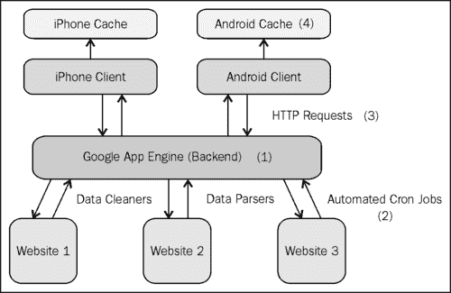

# 七、安卓数据库的实践

在前一章中，我们终于看到了将后端数据库绑定到用户界面的方法。至此，我们已经了解了 Android OS 中内置的所有各种本地存储方法([第 1 章](01.html "Chapter 1. Storing Data on Android")、*在 Android 上存储数据*和[第 2 章](02.html "Chapter 2. Using a SQLite Database")、*使用 SQLite 数据库)*，最著名的是 SQLite 数据库，以及利用 SQLite 语言执行强大查询的方法([第 3 章](03.html "Chapter 3. SQLite Queries")、 *SQLite 查询)*。此外，我们知道如何通过内容供应器向外部应用公开我们的定制 SQLite 数据库([第 4 章](04.html "Chapter 4. Using Content Providers")、*使用内容供应器)*，以及如何查询预先存在的内容供应器，例如 `Contacts`内容供应器([第 5 章](05.html "Chapter 5. Querying the Contacts Table")、*查询联系人表*)。

因此，在这一点上，我们已经为自己配备了许多工具——足以开始构建成熟的应用。然而，在此之前，让我们停下来思考一下。

我们真的应该依赖本地的 SQLite 数据库吗？如果用户的手机出了什么问题，他们的数据被删除了怎么办？或者更重要的是，每个用户都应该下载整个*数据集，并将其存储在本地手机上吗？请记住，手机的内存相当有限，只是台式电脑的一小部分。*

 *当我们开始考虑如何设计我们的应用时，所有这些问题都会发挥作用。因此，在本章中，我们将从为您的安卓应用创建本地化的 SQLite 数据库的一些实际用例开始，然后转向其他更典型的应用设计，特别是针对以数据为中心的应用(如果您的应用将是一个游戏，那么这可能不适用)。

# 本地数据库用例

因此，让我们从不同的方式开始，人们可能会看到安卓应用使用本地化的 SQLite 数据库。澄清一下，我所说的*本地化* SQLite 数据库是指仅存在于手机内存中的数据库，更具体地说，存在于应用分配的内存中，并且不受外部数据库的备份/支持。这与*外部*数据库形成对比，后者将存在于服务器上(或云中)，将作为本地化数据库的备份，或作为中央数据库，所有应用将从该数据库请求、插入、更新和删除数据。

对于我们的第一个示例，考虑一个基于谜题的应用，它跟踪用户在每个级别的所有高分。高分表将具有诸如相应分数的等级(即第一、第二、第三等)、获得该分数的用户的姓名以及分数本身的字段。让我们仔细检查每种形式的数据存储，并思考这是否是完成手头任务的明智方法:

*   `SharedPreferences:`我们可以用一个基于地图的类来完成这个吗？我想，如果我们只需要一个高分表(而不是每个级别一个)，并且该表只有几行，我们可以使用一个简单的地图。但是这可能不是 `SharedPreferences`类的一个非常自然的用法，我们可能可以用一个不同类型的数据存储做得更好，所以现在让我们继续这个。
*   **外置 SD 卡:**你可能还记得，写 SD 卡对于保存和备份文件非常有用。理论上，我们可以将这些表格保存为文件格式，特别是通过将它们保存在**逗号分隔值(CSV)** 文件中(将这些视为电子表格)。然后，我们可以每个级别只有一个 CSV 文件，由于 CSV 文件的结构类似于电子表格，我们可以非常容易地读入这些文件，并将它们绑定到类似 `GridView`的东西上。现在，将资料保存到 SD 卡的一个好处是，您的数据自然会得到备份。例如，如果用户出于任何原因必须卸载并重新安装您的应用，那些 CSV 文件将仍然存在，数据将被保留。然而，另一方面，如果用户出于某种原因移除了他们的 SD 卡或篡改了他们的 SD 卡，那么数据可能会丢失或损坏。无论如何，使用 CSV 文件和外置 SD 卡并不是一个可怕的解决方案，但它可能不是最理想或最自然的解决方案。
*   **SQLite 数据库:**鉴于我们试图保存一系列表，自然我们应该考虑使用某种数据库模式。现在，根据我们的游戏中有多少级别(以及随后我们需要多少表)，我们可以设计一个数据库模式，每个级别都有一个单独的表，对于每个级别，我们只需将 `Cursor`指向正确的表的 URI。然而，考虑一个我们有 50 个级别的场景。在这种情况下，用 50 个独特的 URIs 创造 50 张相同的桌子似乎有点愚蠢。因此，我们可以为*级*增加一个额外的字段。然后，当我们进行查询时，我们可以按*级别*列过滤该表，并按排名对剩余的子表进行排序。在这种情况下使用 SQLite 数据库会特别巧妙，因为我们可以通过一个“T2”将结果直接绑定到用户界面。现在，这里有什么问题？嗯，如果用户不得不卸载你的应用，那么你的 SQLite 数据库极有可能会从手机的内存中消失。
*   **外部数据库:**在这种情况下使用外部数据库可能会变得非常混乱。为什么呢？首先，让我们考虑一下我们的模式应该是什么样子。我们可能有一个巨大的表，其中包含发出请求的设备的字段(即请求数据的设备的电话号码或用户名)、被请求的级别等，然后只进行包含一堆筛选子句的查询。或者，更好的解决方案可能是每个级别都有一个表，并且对于每个表都包含该行所属设备的附加字段。正如您所看到的，无论哪种情况，模式看起来都有点混乱，但是现在让我们继续使用后一种模式。假设你的游戏做得还不错，达到了 10 万次活跃安装。此外，假设你的游戏有 50 个等级，对于每个高分表，你保留前 10 名。对于一个半受欢迎的游戏来说不是不合理的，对吧？在这个 sce nario 下，突然你的外部数据库有 50 个表，每个表有 100 万行，剩下一个相当大的内存密集型数据库。然后，您必须考虑到，每次用户请求查看高分表时，他/她都需要向您的外部数据库发出一个 HTTP 请求，以便检索相应的表。这个 HTTP 请求将比对本地数据库的简单 SQLite 查询慢几个数量级。那么所有这些工作的好处是什么呢？这种方法将允许您备份每个用户的高分，而不管他们卸载和重新安装您的应用的次数，或者他们更换手机的次数等等。另一个很好的功能是，一旦你有了所有用户的所有数据，你就可以潜在地创建一个全球高分表——让你的用户不仅可以看到他们特定安卓设备的高分，还可以看到所有玩你游戏的用户的最高分！

因此，即使在这种情况下，使用本地化数据库和外部数据库也各有利弊。在这种情况下，你需要问自己的问题是:

*   我备份用户的高分有多重要？
*   建立全球高分榜的可能性/有用性如何？

如果你的目标游戏和受众是一个竞争非常激烈的游戏，并且你认为如果重新安装你的应用/切换手机意味着失去他们的高分历史，用户会非常沮丧，那么使用外部数据库可能是明智的。然而，我最大的猜测是，很少有手机游戏会让用户的变得*比*有竞争力，在这种情况下，拥有一个简单的本地化数据库会更加实用。

结论？对于一个普通的基于益智游戏的简单高分表，一个本地化的数据库就可以了。数据的格式(也就是一个表)使得这个数据库成为一个自然的选择，并且假设用户不会关心他们的高分是否被保留，这使得实现一个本地化的数据库比外部数据库更加实用。

在继续之前，让我们再考虑一个例子。假设你想创建一个应用，让用户更好地找到咖啡馆和咖啡店。也许你想添加一些功能，让用户可以根据空间的可用性(很多时候，我发现自己走进附近的星巴克，却发现所有的桌子都被占了)或无线网络的可用性来过滤咖啡馆和咖啡店。这是一个不错的应用，但是你在哪里可以找到你最初的咖啡馆/咖啡店数据库呢？

谢天谢地，您遇到了来自各种服务(即 Yelp、Zagat 等)的几个 API，它们允许您查询它们的数据库，因此数据源不再是问题。但是现在呢？你会如何设计你的安卓应用的后端？让我们再次浏览我们的选项:

*   `SharedPreferences:`这一次很容易理解为什么像 `SharedPreferences`类这样简单和轻量级的方法是不合适的。我们就不讨论这个了。
*   **外部 SD 卡:**所以，像我们前面的例子一样，使用外部 SD 卡的一种可能方式是将您的数据存储在 CSV 文件(即电子表格格式)中，然后读写这些文件。因此，我们在这里可能做的是，在第一次进入我们的应用时，我们进行一系列的 API 调用来加载我们的咖啡馆/咖啡店的初始数据库。然后，我们将数据写入 CSV 文件，并在以后引用/更新该 CSV 文件。目前为止一切顺利。但是当我们想要开始过滤数据时会发生什么呢？假设用户只希望看到他/她附近的位置，或者只希望看到有免费无线网络的位置。当我们处理 CSV 文件时，不存在*查询*这个 CSV 文件的概念一个文件就是一个文件，我们唯一的解决方案是打开到该文件的连接，遍历每一行，并手动挑选出我们想要的行。在这个例子中，虽然它将是缓慢和繁重的，理论上我们可以用这个 SD 卡解决方案实现我们的后端。然而，很容易看出，一旦我们的模式变得更加复杂(需要多个表而不是一个表)，无法执行高效、复杂的查询将导致极其糟糕的设计决策。更不用说前面提到的用户移除 SD 卡、损坏 SD 卡等问题了。也许在这种情况下，我们最好远离 SD 卡。
*   **SQLite 数据库:**对于 SQLite 数据库，同样，考虑到我们数据的固有表格式，这是一个自然的解决方案。我们可以非常容易地创建一个包含名称、位置、无线可用性等字段的模式，然后编写一系列查询来快速过滤我们的数据。此外，使用 SQLite 数据库，我们将受益于数据可以轻松绑定到用户界面。然而，我们后端的机制会是什么样的呢？在第一次到达应用时，我们是否需要点击所有 API 并下载全国所有咖啡馆/咖啡店的整个数据集？如果我们不这样做，那么我们就会遇到这样的问题:当用户在旅行时，或者想要查找他们当前城市之外的位置时，我们唯一的解决方案很可能是为引入的每个新位置调用 API。如果我们一次下载整个数据集，那么根据美国咖啡馆/咖啡店的数量，我们可能会遇到内存和性能的问题。在这两种情况下，我们都需要有条不紊地选择如何使用通过 API 获得的最新信息来同步和更新我们的 SQLite 数据库，这本身就是一个完全不同的问题。
*   **外部数据库:**有了外部数据库，我们还可以利用数据固有的表格格式。就像本地化数据库一样，我们仍然可以执行快速查询来过滤数据。我们受益于集中式数据库，确保每次用户请求数据子集时，它都是最新的数据。此外，由于我们的数据库将存在于外部服务器中，因此我们不需要应用端的任何额外内存，并且我们还应该看到性能的大幅提升，因为向一个外部数据库发出一个请求比向几个 API 发出几个请求要快得多。我们丢失的地方(与 SQLite 数据库相比)是当用户重复发出相同的请求*时会发生什么。例如，假设用户打开搜索 `Activity`，搜索他/她想要的位置列表，等待几秒钟网络请求返回，然后意外关闭该 `Activity`。如果用户随后重新打开应用并返回到那个 `Activity`，他/她将需要做出相同的*网络请求，并再等待几秒钟，以便获得相同的*结果。对于活跃用户来说，这通常是一个巨大的麻烦，并且考虑到许多移动用户相对较短的注意力持续时间，这可能对您的应用的成功是致命的。***

 ***现在，我们已经浏览了可供我们使用的数据存储方法列表，让我们快速总结一下每种方法的优缺点。首先，就纯*实现*而言，本地化数据库和外部数据库显然是赢家。然后，就*内存消耗*而言，外部数据库是比本地化数据库更好的选择，因为整个数据集可以存在于应用之外。就*性能*而言，外部数据库很好，因为我们只需要访问一个数据库(我们自己的)，而不是访问多个应用编程接口。然而，本地化的数据库很好，因为用户可以在搜索中来回移动 `Activity`，而不必进行任何额外的网络呼叫。

这里没有明确的赢家，但是有一种方法可以将这两种方法结合起来，设计一个健壮的后端来解决前面讨论的所有问题。这种组合方法使用外部数据库作为中央存储单元，但随后使用本地化数据库作为*缓存*来提高性能。在下一节中，让我们深入研究将本地化的 SQLite 数据库用作外部数据库而不是独立数据库的缓存意味着什么。

# 作为缓存的数据库

那么什么是缓存呢？**缓存**通常被定义为内存中存储重复数据的地方，以便将来可以更快地提供服务。就我们而言，这正是我们要找的。

在前面的示例中，我们看到通过使用外部数据库，我们能够在不影响实现的情况下提高内存消耗，有时还能提高性能。此外，我们可以自然地确保所有用户拥有相同的数据，并且这些数据是最新的。唯一一次仅仅依赖外部数据库会受到影响的情况是，用户在您的应用周围活动，每次都必须向您的外部数据库发出相同(或相似)的网络请求，然后不得不反复等待这些网络请求返回。

一种解决方案是使用缓存，只需发出一次网络请求*。然后，当网络请求完成时，将返回数据的重复版本存储在本地化的数据库中，这样，如果用户发出相同(或相似)的请求，我们的系统只需要进行本地查询，而不是网络查询。*

 *为了帮助您更好地理解低级实现，让我们仔细看看这个缓存是如何工作的。

所以用户登陆你的搜索 `Activity`并发出请求。假设请求针对的是距离他/她的位置三英里以内的所有咖啡馆和咖啡店，这些咖啡馆和咖啡店也有免费无线网络。您必须做出的一个设计选择是，在这种情况下应该缓存多少数据？当然，您可以使用用户想要的所有过滤器发出请求，并且只缓存那些结果。但是如果用户突然决定他/她不在乎有免费的 Wi-Fi 怎么办？或者，如果用户决定放宽搜索标准，而是想寻找五英里范围内的所有商店？

虽然拥有缓存肯定会提高性能，但真正的好处来自于缓存的命中频率。对于那些熟悉设计缓存的人来说，折衷来自于缓存被命中的频率和缓存的大小。换句话说，在极端情况下，如果您将缓存设计为包含您的整个*数据集，那么显然每个请求都将是缓存命中，因此从这个意义上来说，您的缓存将非常有效。然而，您将整个数据集存储在内存中的事实是次优的(根据数据库的大小，这通常是不可能的)，因此缓存在这方面会失败。试图找到两者的完美结合是目标，所以在这种情况下，与其只请求三英里内有免费无线网络的位置，为什么不尝试请求五英里内的所有位置，并完全排除无线网络过滤器？*

 *相反，通过缓存这个请求，现在当用户决定将他/她的搜索条件从 3 英里放宽到 5 英里(或向下放宽到 2 英里)时，你已经有了所有的结果；因此，您无需发出另一个网络请求，只需过滤缓存中所需的数据子集即可。同样，如果您的用户想要移除 Wi-Fi 过滤器，您可以快速查询您的缓存中的该数据，这次仅移除了*Wi-Fi*过滤器。在这两种情况下，用户都会访问您的缓存，从而避免您发出耗时的网络请求。

设计缓存系统的最后一步是确定刷新缓存的频率。永远不要刷新缓存不是最佳选择，因为随着时间的推移，缓存的每个新请求只会消耗更多的内存，此外，您还会遇到数据过期的问题。例如，假设您的用户向他们的家乡提出咖啡馆/咖啡店请求，而您缓存了这个结果。但是，您的缓存系统永远不会刷新缓存。一年内可能会发生很多事情，一年后当用户再次拉出您的应用并发出相同的咖啡馆/咖啡店请求时，他/她会访问缓存并拉出旧数据，而不是发出新的请求。

另一方面，通过允许您的缓存刷新过于频繁，您将降低缓存命中频率，并最终不得不做出比预期更多的网络请求。因此，我们又遇到了一个优化问题，我们希望最大化缓存命中的数量，同时最小化所需的内存消耗，并最小化提取陈旧数据的频率。

这个简化的优化问题是每个缓存系统的核心，也是使用本地化数据库缓存外部数据库网络请求时需要牢记的问题。虽然关于缓存还有很多可以讨论的地方，但本节(以及整个章节)的目标是激发您的思考过程，并向您介绍本地化数据库的众多用途之一，以及它们如何与外部数据库结合使用。

在下一节中，我将讨论一个典型的以数据为中心的应用的外观，以及典型的数据流。同样，我所说的*以数据为中心的*应用是那些其主要功能涉及显示/与某种形式的数据交互的应用。这可能包括从用户可以相互读/写消息的社交网络应用(本例中的数据包括消息、事件、照片——任何可以共享的东西)到用户可以加载附近餐馆的详细信息的食品和餐饮应用的一切。这通常会排除许多基于游戏的应用，尽管即使基于游戏的应用有时也需要采用某种外部数据库(例如，我们前面讨论的全局高分表)。因此，让我们再次转移我们的注意力，从更全面的角度开始考虑移动应用——作为外部数据库和外部应用的扩展，而不是简单的独立应用。

# 典型应用设计

到目前为止，我们只是讨论和玩弄关于后端应用设计的想法。我们首先考虑了使用完全本地化的后端与完全外部的后端的利弊，然后考虑了在应用中使用这两者的方法，以尝试并获得两者的最佳效果。我们可以做到这一点的方法之一是通过使用缓存，在单独设计缓存时，我们看到必须做出大量的设计决策。

不管你是否意识到这一点，这段时间你一直在分析不同应用的不同后端设计的优缺点，现在我们准备专注于一个非常通用的设计，这个设计非常实用，并且经常在以数据为中心的移动应用中使用。不过话不多说，让我们为我们的设计画一幅画:

这里到底发生了什么？让我们分解一下:

1.  首先，我们有外部的集中式数据库。这是我们后端的核心。所有应用(无论是网络还是移动)都将引用该数据库，这样，我们可以确保所有移动设备上的所有数据都将同步并保持最新。此外，在这个设计中，我们的应用不再是特定于平台的。换句话说，人们可以很容易地创建一个适用于所有移动设备的应用，包括安卓和 iOS，因为所有设备都指向同一个数据库。
2.  外部数据库还将客户端(即移动应用和 web 应用)与数据收集/解析/清理端分开。在后一种情况下，我们拥有所有用于收集、解析和清理后端数据的流程。这可能包括定期调用 API(假设 API 允许您存储其数据的副本)、抓取网站(稍后讨论)，或者在某些情况下手动插入新数据。然后，一旦数据进来，通常需要对其进行解析和清理，以符合数据库的规范。此外，通过使用 CRON 作业(在[第 9 章](09.html "Chapter 9. Collecting and Storing Data")、*收集和存储数据*中讨论)，收集和清理数据的整个过程本身可以实现自动化。因此，通过以这种方式设置您的应用，您可以在幕后向用户隐藏所有这些数据挖掘。
3.  另一方面，网络应用和移动应用不断向外部数据库发出请求。这些请求通常采用 HTTP GET 和 POST 请求的形式(获取数据相对于插入/更新数据)，并将返回 XML 或 JSON 格式的结果。同样，因为这些只是标准的 HTTP 网络请求，它独立于发出请求的平台，所以您可以轻松地将应用从一个平台移植到另一个平台。
4.  最后，我们有缓存，它是外部数据库的一个临时的、本地化的子集，并且存在于移动/web 应用端。如前所述，这些缓存旨在提高应用的性能，使我们不必进行重复的网络请求。

这就是了。同样，就目前而言，这仍然是非常高的水平，但是我们已经看到并讨论了与我们设计的第四部分相关的组件，在接下来的章节中，我们还将看到前三部分。

# 总结

即使我们没有在这一章中查看任何代码，我们仍然设法完成了很多。我们从确定两个非常现实的需求(一个简单的高分表，然后是位置/场地数据库)开始这一章，并研究了如何选择合适的存储方法背后的思考过程。

我们看到，对于像高分表这样简单的东西，本地化的 SQLite 数据库既有效又易于实现。这种方法唯一真正的缺点是不能显示全球高分表，但对于大多数游戏来说，这只是一个小功能。然而，对于我们的咖啡馆/咖啡店应用，我们发现本地化的 SQLite 数据库远不如集中式外部数据库有效，外部数据库解决方案的唯一缺点是，如果频繁进行重复的、不必要的网络调用，性能会受到影响。

为了解决这个问题，我们将缓存作为一种解决方案，使用外部和本地数据库，并尝试利用每种方法的优势。然而，要构建有效的缓存，需要做出几个设计决策，以优化缓存命中频率，同时最大限度地减少内存消耗和陈旧数据。

最后，我们结束了这一章，不仅远离了代码，还远离了安卓应用本身，并试图从更全面的角度来看待我们的应用。我们研究了典型的以数据为中心的应用会是什么样子，并将数据的流通分成了四个部分。到目前为止，我们已经讨论了足够多的内容，能够实现设计的第四部分(本地缓存)，现在我们将为剩下的三个部分各写一章。到本书结束时，目标是让您能够自信地设计和实现一个全面的以数据为中心的应用。******