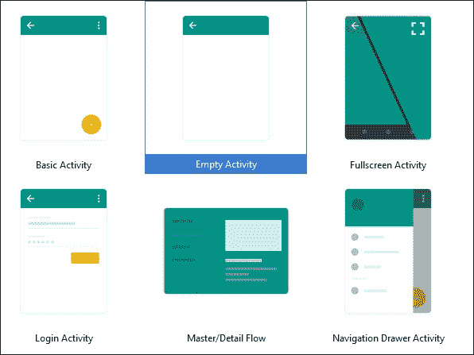
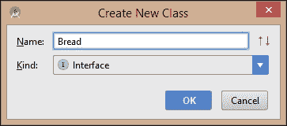
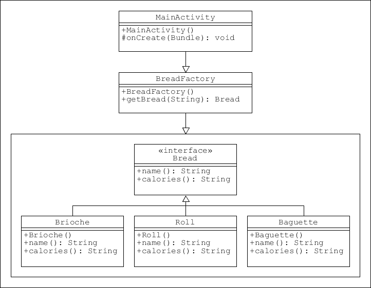
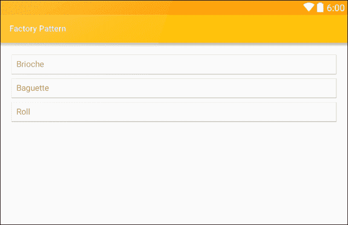
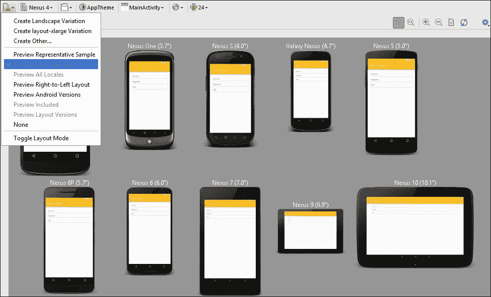
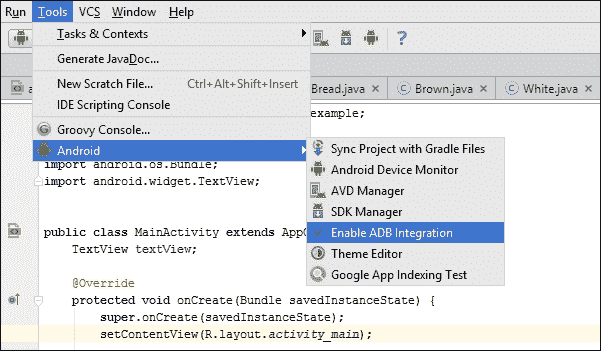
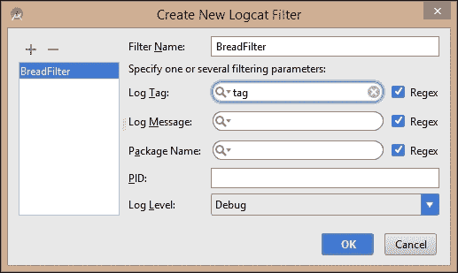
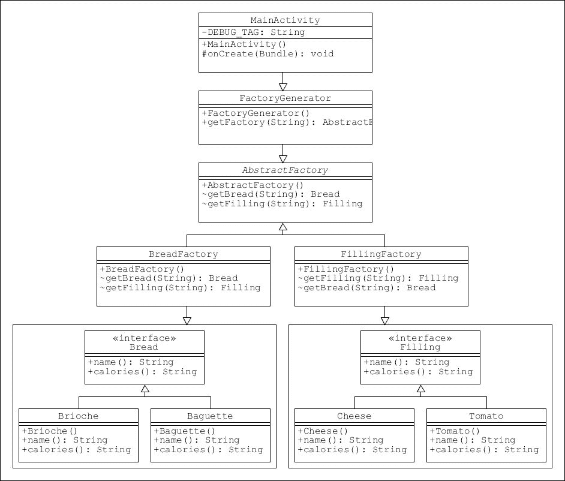

# 一、设计模式

设计模式长期以来被认为是解决常见软件设计问题的最可靠和最有用的方法。模式为经常发生的开发问题提供了通用的和可重用的解决方案，例如如何在不改变对象结构的情况下向对象添加功能，或者如何最好地构造复杂的对象。

应用模式有几个优点，尤其是这种方法帮助开发人员遵循最佳实践的方式，以及它如何简化大型项目的管理。这些好处是通过提供可以被重用来解决类似问题的整体软件结构(模式)来实现的。这并不是说代码可以简单地从一个项目剪切并粘贴到另一个项目，而是说概念本身可以在许多不同的情况下反复使用。

应用编程模式还有很多其他好处，所有这些好处都将在本书的某个时候介绍，但是现在有一两个值得一提:

*   模式为团队中的开发人员提供了一种高效的通用语言。当一个开发人员描述一个结构时，比如说一个**适配器**或者一个**外观**，其他开发人员会理解这意味着什么，并且会立即识别代码的结构和目的。
*   模式提供的附加抽象层使得对已经在开发中的代码的修改和变更变得更加容易。甚至有专门为这些情况设计的模式。
*   模式可以应用于许多规模，从项目的整体架构结构一直到最基本对象的制造。
*   模式的应用可以极大地减少所需的内嵌注释和一般文档的数量，因为模式也充当它们自己的描述。一个类或接口的名字就可以解释它在模式中的用途和位置。

安卓开发平台非常适合使用模式，因为不仅应用程序主要是用 Java 创建的，而且软件开发工具包包含许多使用模式本身的应用编程接口，例如用于创建对象的**工厂**接口和用于构建对象的**构建器**。像**单件**这样的简单模式甚至可以作为模板类类型。在这本书里，我们将不仅看到如何组合我们自己的大规模模式，还将看到如何利用这些内置结构来鼓励最佳实践和简化编码。

在这一章中，我们将首先简要地看一下这本书作为一个整体将如何发展，我们将使用的模式，我们接近它们的顺序，以及我们将构建的演示应用程序，以了解模式如何在现实世界中应用。接下来将快速检查 SDK，以及哪些组件将在我们的旅程中为我们提供最好的帮助，特别是**支持库**提供的角色，使我们能够同时为多个平台版本进行开发。没有比实际经验更好的学习方法了，因此本章的其余部分将通过开发一个非常简单的演示应用程序并采用我们的第一个模式来进行，即**工厂模式**及其关联的**抽象工厂**模式。

在本章中，您将学习以下内容:

*   模式是如何分类的，这里涵盖了哪些模式
*   本书演示应用的目的
*   如何瞄准平台版本
*   支持库做什么
*   什么是工厂模式，如何构建工厂模式
*   如何遵循 UML 类图
*   如何在真实设备和虚拟设备上测试应用程序
*   如何在运行时监控应用程序
*   如何使用简单的调试工具测试代码
*   什么是抽象工厂模式以及如何使用它

# 这本书是如何运作的

这本书的目的是展示设计模式的应用如何直接辅助安卓应用的开发。在这本书的过程中，我们将专注于开发一个完整的客户端移动应用程序，特别关注在安卓开发过程中何时、为什么以及如何使用模式。

从历史上看，对于什么是一种模式，一直存在一定程度的分歧。然而，埃里希·伽马、理查德·赫尔姆、拉尔夫·约翰逊和约翰·弗利西德斯在 1994 年出版的《设计模式》一书中提出的 23 种模式，即所谓的“四人帮”，被广泛接受为权威的集合，并为我们可能遇到的几乎所有软件工程问题提供了解决方案，正是因为这个原因，这些模式将成为这本书的支柱。这些模式可以分为三类:

*   **创造性** -用于创建对象
*   **结构** -用于组织对象组
*   **行为** -用于对象之间的通信

这本书的实用性意味着我们不会按照它们在这里出现的顺序来处理这些类别；相反，我们将探索在我们的应用程序开发过程中自然出现的单个模式，尽管这通常意味着首先从创建结构开始。

将所有的设计模式合并到一个应用程序中是困难的、笨拙的和不现实的，所以这里将尝试应用尽可能多的看似现实的设计模式。对于那些我们决定不直接使用的模式，我们将至少探索我们是如何做到的，并且在每种情况下给出至少一个如何使用它们的实际例子。

模式不是一成不变的，也不能解决每一个可能的问题，在本书的最后，我们将看看一旦我们掌握了主题，我们如何创建自己的模式或修改现存的模式，以适应罕见的情况，在这种情况下，没有一个既定的模式适合。

简而言之，模式不是一套规则，而是一系列从已知问题到测试解决方案的老路。如果你在路上发现了一条捷径，那么一定要使用它。如果你一直坚持下去，那么你将会创造出一个你自己的模式，这个模式和我们将在这里介绍的传统模式一样有效。

本书的前几章专注于用户界面设计，并介绍了一些基本的设计模式以及它们在概念上是如何工作的。从大约[第 6 章](06.html#aid-1DOR02 "Chapter 6. Activating Patterns")、*激活模式*开始，我们将开始将这些和其他模式应用于真实世界的例子，特别是一个应用。最后几章集中在开发的最后阶段，例如为不同的设备调整应用程序，这项任务几乎是专门为设计模式而设计的，触及尽可能广泛的市场，以及如何将我们的应用程序货币化。

### 注

如果你是安卓开发的新手，前两三章的说明会详细给出。如果您已经熟悉安卓开发，您将能够跳过这些部分，专注于模式本身。

在我们陷入第一个模式之前，仔细看看我们将在本书期间构建的应用程序，以及它带来的挑战和机遇是有意义的。

# 我们将建造什么

如前所述，在本书的整个过程中，我们将构建一个小而完整的安卓应用程序。现在来看一下我们将要建造什么以及为什么建造是一个好主意。

我们将把自己放在一个独立的安卓开发者的位置上，一个潜在的客户接触了这个开发者，他经营着一家小型企业，为当地的几栋办公楼制作和提供新鲜的三明治。我们的客户面临几个问题，他们认为可以通过移动应用程序来解决。为了了解应用程序可能提供的解决方案，我们将把情况分成三个部分:场景、问题和解决方案。

## 场景

这位客户经营着一家小型但成功的企业，制作新鲜的三明治，然后送到附近的上班族手中，这样他们就可以在办公桌前购买并食用。这些三明治非常好，而且由于口碑广告，越来越受欢迎。这是一个业务扩张的好机会，但在客户认为可以通过使用移动应用程序解决的业务模式中存在一些明显的低效之处。

## 问题

客户几乎不可能预料到需求。有很多场合，一个特定的三明治做得太多，导致浪费。同样，有时三明治生产线准备不足，导致销售亏损。不仅如此，客户提供的口碑广告也限制了业务向小地理区域的扩张。客户没有可靠的方法知道是否值得投资更多的员工、一辆摩托车去更远的地方旅行，甚至不知道是否在镇上的其他地方开设新的厨房。

## 解决方案

向所有客户免费提供的移动应用不仅解决了这些问题，还提供了一系列全新的机会。不要担心应用程序会解决意料之外的需求问题；我们现在有机会把这提升到一个全新的水平。当我们可以提供给顾客一个机会，让他们从一份配料清单中构造自己的个性化三明治时，为什么只给他们一份套餐呢？也许他们喜欢我们的客户已经做好的奶酪和泡菜三明治，但是喜欢加一两片苹果，或者更喜欢芒果酸辣酱而不是泡菜。也许他们是素食主义者，更喜欢从他们的选择中过滤掉肉类产品。也许他们过敏。所有这些需求都可以通过设计良好的移动应用程序来满足。

此外，口碑广告的地域限制，甚至是当地的促销活动，如广告牌或当地报纸上的通知，都不能说明一个企业在更大的舞台上有多成功。另一方面，社交媒体的使用可以让我们的客户清楚地了解当前的趋势，并把这个词传播给尽可能广泛的受众。

我们的客户现在不仅可以准确判断他们的业务范围，还可以添加现代生活数字化所特有的全新功能，例如应用的游戏化。竞争、困惑和挑战可以为吸引客户提供一个全新的维度，并为增加收入和市场份额提供一种强大的技术。

随着前面的任务变得更加清晰，我们现在可以开始编码了。我们将从工厂模式的一个非常简单的演示开始，在此过程中，仔细看看我们将发现有用的 SDK 的一些特性。

# 瞄准平台版本

为了跟上最新技术，安卓平台的新版本频繁发布。作为开发人员，这意味着我们可以将最新的特性和开发融入到我们的应用程序中。这样做的明显缺点是，只有最新的设备才能运行这个平台，而这些设备只占整个市场的一小部分。看看这个取自开发人员仪表板的图表:


仪表板可以在[developer.android.com/about/dashboards/index.html](http://developer.android.com/about/dashboards/index.html)找到，包含这个和其他最新信息，这些信息在第一次计划项目时非常有用。

如你所见，绝大多数安卓设备仍然运行在旧平台上。幸运的是，安卓使我们有可能瞄准这些旧设备，同时仍然能够整合最新平台版本的功能。这在很大程度上是通过使用**支持库**和设置最低 SDK 级别来实现的。

决定以哪些平台为目标是我们需要做出的第一批决定之一，尽管稍后可能会改变这一点，但尽早决定整合哪些功能并了解这些功能将如何出现在旧设备上可以大大简化整体任务。

要了解如何做到这一点，请启动一个新的安卓工作室项目，称之为您选择的任何东西，并选择**手机和平板电脑**作为外形规格， **API 16** 作为**最小 SDK** 。

从模板列表中，选择**清空活动**，其他一切保持原样。



安卓工作室将自动选择最高可用的 SDK 版本作为目标级别。要了解这是如何应用的，请从项目窗格中打开`build.gradle (Module: app)`文件，并注意`defaultConfig`部分，类似于以下代码:

```java
defaultConfig { 
    applicationId "com.example.kyle.factoryexample" 
    minSdkVersion 16 
    targetSdkVersion 25 
    versionCode 1 
    versionName "1.0" 
} 

```

这确保了我们的项目能够针对这一系列的应用编程接口级别进行正确编译，但是如果我们正在构建一个我们打算发布的应用程序，那么我们需要通知谷歌游戏商店在哪些设备上提供我们的应用程序。这可以通过`build.gradle`模块化文件来完成，例如:

```java
minSdkVersion 21 
targetSdkVersion 24 

```

我们还需要编辑`AndroidManifest.xml`文件。对于此处的示例，我们将向`manifest`节点添加以下`uses-sdk`元素:

```java
<uses-sdk 
    android:minSdkVersion="16" 
    android:targetSdkVersion="25" /> 

```

一旦我们确定了我们希望瞄准的平台范围，我们就可以继续下去，看看支持库如何允许我们在许多最古老的设备上集成许多最新功能。

# 支持库

说到构建向后兼容的应用程序，支持库无疑是我们最强大的工具。事实上，它是一系列独立的代码库，通过提供标准 API 中的替代类和接口来工作。

大约有 12 个独立的库，它们不仅提供兼容性；它们还包括常见的 UI 组件，如滑动抽屉和浮动操作按钮，否则这些组件将不得不从头开始构建。它们还可以简化针对不同屏幕尺寸和形状的开发过程，以及添加一两个杂项功能。

### 注

当我们使用安卓工作室开发时，我们应该下载**支持库**，而不是支持库，因为该库是专门为工作室设计的，提供完全相同的功能，并且效率更高。

在本章我们正在研究的例子中，我们将不会使用任何支持库。这个项目唯一包含的就是`v7 appcompat library`，是我们开始这个项目的时候自动给我们添加的。我们将经常回到书中的支持库，所以现在，我们可以专注于应用我们的第一个模式。

# 工厂模式

工厂模式是应用最广泛的创新模式之一。顾名思义，它制造东西，或者更准确地说，它创造物体。它的用处在于它使用一个公共接口将逻辑和使用分开的方式。最好的办法就是现在就建一个。打开我们之前开始的项目一两页，或者开始一个新的。最低和目标软件开发工具包水平对于本练习并不重要。

### 类型

选择 21 或更高的应用编程接口级别允许安卓工作室使用一种被称为热插拔的技术。这避免了每次运行项目时都必须完全重建项目，大大加快了应用程序的测试速度。即使你打算最终瞄准一个较低的平台，热交换节省的时间也是值得的，同时一旦应用程序像开发的一样好，就降低这个目标。

我们将构建一个非常简单的示例应用程序，该应用程序生成对象来表示我们的三明治构建器应用程序可能提供的不同类型的面包。为了强调模式，我们将保持它的简单性，并让我们的对象返回一个字符串:

1.  在项目视图中找到`MainActivity.java`文件。
2.  Right-click it and create a `New | Java Class` of **Kind****Interface** called `Bread`:

    

3.  完成如下界面:

    ```java
        public interface Bread { 

            String name(); 
            String calories(); 
        } 

    ```

4.  创建`Bread`的具体类，比如:

    ```java
        public class Baguette implements Bread { 

            @Override 
            public String name() { 
                return "Baguette"; 
            } 

            @Override 
            public String calories() { 
                return " : 65 kcal"; 
            } 
          } 

          public class Roll implements Bread { 

            @Override 
            public String name() { 
                return "Roll"; 
            } 

            @Override 
            public String calories() { 
                return " : 75 kcal"; 
            } 
          } 

          public class Brioche implements Bread { 

            @Override 
            public String name() { 
                return "Brioche"; 
            } 

            @Override 
            public String calories() { 
                return " : 85 kcal"; 
            } 
        } 

    ```

5.  接下来，创建一个名为`BreadFactory`的新类，如下所示:

    ```java
    public class BreadFactory { 

        public Bread getBread(String breadType) { 

            if (breadType == "BRI") { 
                return new Brioche(); 

            } else if (breadType == "BAG") { 
                return new Baguette(); 

            } else if (breadType == "ROL") { 
                return new Roll(); 
            } 

            return null; 
        } 
    } 

    ```

## UML 图

理解设计模式的关键在于理解它们的结构以及组成部分之间的相互关系。查看模式的最好方法之一是用图片，而统一建模语言(UML)类图是实现这一点的好方法。

考虑一下我们刚刚创建的模式，用图表表示，如下所示:



有了我们的模式，所有需要做的就是看到它在行动。在这个演示中，我们将使用模板为我们生成的布局中的**文本视图**以及每次我们的主要活动开始时调用的`onCreate()`方法:

1.  在**文本**模式下打开`activity_main.xml`文件。
2.  在文本视图中添加一个`id`，比如:

    ```java
    <TextView 
        android:id="@+id/text_view" 
        android:layout_width="match_parent" 
        android:layout_height="wrap_content" /> 

    ```

3.  Open the `MainActivity.java` file and edit the `onCreate()` method to match the following code:

    ```java
    @Override 
    protected void onCreate(Bundle savedInstanceState) { 
        super.onCreate(savedInstanceState); 
        setContentView(R.layout.activity_main); 

        TextView textView = (TextView) findViewById(R.id.text_view); 

        BreadFactory breadFactory = new BreadFactory(); 
        Bread bread = breadFactory.getBread("BAG"); 

        textView.setText(new StringBuilder() 
                .append(bread.name()) 
                .toString()); 
    } 

    ```

    ### 类型

    根据您如何设置安卓工作室，您可能需要导入文本视图小部件:`import android.widget.TextView;`。通常，编辑器会提示您，只需简单按下 **Alt +回车**即可导入小部件。

现在，您可以在模拟器或真实设备上测试该模式:



乍看之下，这似乎是一种难以置信的冗长方式来实现一个非常简单的目标，但这就是模式之美。增加的抽象层允许我们修改我们的类，而不必编辑我们的活动，反之亦然。随着我们开发更复杂的对象，并遇到需要多个工厂的情况，这种有用性将变得更加明显。

我们在这里创建的例子太简单了，实际上不需要任何测试，但是现在是一个很好的时机来探索我们如何在真实和虚拟设备上测试安卓应用程序，以及我们如何监控性能并使用调试工具测试输出，而不必添加不必要的屏幕组件。

# 运行和测试应用程序

现在有大量的安卓设备，它们有各种各样的形状和大小。作为开发人员，我们希望我们的应用程序能够在尽可能多的设备和外形上运行，并且我们希望能够用最少的编码来实现。幸运的是，安卓平台非常适合这一挑战，允许我们轻松调整布局和构建虚拟设备，以匹配我们可以想象的任何形状因素。

### 类型

谷歌在 firebase.google.com/docs/test-lab/提供了一个非常方便基于云的应用测试设施

显然，虚拟设备是任何测试环境的重要组成部分，但这并不是说简单地插入我们自己的设备并在上面测试我们的应用程序并不方便。这不仅比任何仿真器都快，而且正如我们现在将看到的，设置非常简单。

## 连接到真实设备

除了比虚拟设备更快之外，实际设备还允许我们在现实环境中测试我们的应用。

将真实设备连接到我们的开发环境需要两个步骤:

1.  在手机上启用开发者选项。在某些型号上，这可能涉及导航到`Settings | About phone`并点击`Build number`七次，然后将`Developer options`添加到您的设置中。使用此选项启用**通用串行总线调试**和**允许模拟位置**。
2.  现在，您很可能能够通过 USB 或 WiFi 插件电缆将设备连接到工作站，并在打开安卓工作室时显示出来。如果没有，您可能需要打开软件开发工具包管理器，并从**工具**选项卡安装**谷歌通用串行总线驱动程序**。在一些罕见的情况下，您可能需要从设备制造商那里下载一个 USB 驱动程序。

一个真实的设备对于快速测试应用程序的功能变化非常有用，但是开发我们的应用程序在各种屏幕形状和大小上的外观和行为意味着我们将创建一些虚拟设备。

## 连接到虚拟设备

安卓虚拟设备(AVDs)允许开发人员自由尝试各种仿真硬件设置，但它们速度慢是出了名的，会耗尽许多计算机系统的资源，并且缺乏实际设备中存在的许多功能。尽管有这些缺点，但虚拟设备是安卓开发人员工具包中必不可少的一部分，通过考虑一些因素，许多障碍可以被最小化:

*   将您的虚拟设备精简到仅适用于您的应用的功能。例如，如果您没有构建拍摄照片的应用程序，请从模拟器中删除相机功能；一个总是可以稍后添加。
*   将自动电压调节器的内存和存储要求保持在最低水平。当应用程序需要时，可以很容易地创建另一个设备。
*   仅当您需要测试特定的新功能时，才创建具有最新应用编程接口级别的自动增值设备。
*   首先在低屏幕分辨率和密度的虚拟设备上进行测试。这些将运行得更快，并仍然允许您测试不同的屏幕尺寸和纵横比。
*   尝试分离对资源要求很高的函数，并单独测试它们。例如，如果您的应用程序使用大量高清图像，您可以通过单独测试此功能来节省时间。

一般来说，构建虚拟设备来满足特定目的要比构建通用设备来测试我们所有的应用程序更快，并且有越来越多的第三方安卓仿真器可用，例如*安卓-x86* 和*genymion*，它们通常更快，具有更多的开发功能。

还值得注意的是，当仅针对布局进行测试时，Android Studio 提供了一些强大的预览选项，允许我们查看各种外形、SDK 级别和主题上的潜在 ui，如下图所示:



现在，创建一个基本的 AVD 来运行和测试当前项目。没有什么真正需要测试的，但是我们将看到如何在运行时监控我们的应用程序的行为，以及如何使用调试监视器服务来测试输出，而不必使用设备屏幕，这不是调试项目的一种有吸引力的方式。

## 监控装置

以下演示在模拟设备或真实设备上同样有效，因此请选择最适合您的设备。如果您正在创建 AVD，则它不需要大或高密度屏幕或大内存:

1.  打开我们刚刚完成的项目。
2.  From the `Tools | Android` menu, enable **ADB Integration**.

    

3.  从同一个菜单中，选择**安卓设备监视器**，尽管它很可能已经在运行。
4.  现在使用安卓监视器在连接的设备上运行该应用程序。

设备监视器在几个方面很有用:

*   **监视器**选项卡可以在运行时用来查看实时系统信息，例如我们的应用程序使用了多少内存或 CPU 时间。当我们想要查看我们的应用程序不在前台运行时正在使用什么资源时，这可能特别有帮助。
*   监视器可以设置为收集各种数据，如方法跟踪和资源使用情况，并将其存储为文件，可以在**捕获**窗格中查看(通常可以从左侧的装订线打开)。
*   应用程序的截图和视频非常容易捕捉。
*   **LogCat** 是一个特别有用的工具，因为它不仅实时报告应用程序的行为，而且正如我们接下来将看到的，还可以生成用户定义的输出。

使用文本视图来测试我们的工厂模式是目前测试代码的一种方便但笨拙的方式，但是一旦我们开始开发复杂的布局，它将很快变得非常不方便。一个更好的解决方案是使用调试工具，可以在不影响用户界面的情况下查看。本练习的其余部分演示了如何做到这一点:

1.  打开`MainActivity.java`文件。
2.  声明如下常量:

    ```java
    private static final String DEBUG_TAG = "tag"; 

    ```

3.  再次，您可能需要确认`android.util.Log;`的导入。
4.  将`onCreate()`方法中设置文本视图文本的行替换为以下行:

    ```java
    Log.d(DEBUG_TAG, bread); 

    ```

5.  再次打开设备监视器。这可以通过 **Alt + 6** 来完成。
6.  从监视器右上角的下拉菜单中，选择**编辑过滤器配置**。
7.  Complete the resultant dialog, as seen here:

    

运行应用程序并测试我们的工厂演示应该会在 logcat 监视器中产生一个输出，类似于这里看到的输出:

```java
05-24 13:25:52.484 17896-17896/? D/tag: Brioche
05-24 13:36:31.214 17896-17896/? D/tag: Baguette
05-24 13:42:45.180 17896-17896/? D/tag: Roll

```

### 类型

当然，如果你愿意，你还可以使用`System.out.println()`，它会在 ADB 监视器中打印出来，但是你必须在其他输出中搜索它。

在了解了如何在真实设备和虚拟设备上测试我们的应用程序，以及如何在运行时使用调试和监控工具来询问我们的应用程序后，我们现在可以进入一个更现实的情况，它涉及多个工厂，输出比两个字的字符串更复杂。

# 抽象工厂模式

做三明治时，面包只是我们的第一个也是最基本的食材；我们显然需要某种填充物。在编程术语中，这可能意味着简单地构建另一个类似`Bread`的接口，但称之为`Filling`，并为其提供自己的关联工厂。同样，我们可以创建一个名为`Ingredient`的全球界面，并以`Bread`和`Filling`为例。无论哪种方式，我们都必须在其他地方重新编码。

设计模式范例提供了**抽象工厂模式**，这可能是对这一困境最具适应性的解决方案。一个抽象的工厂只是**一个创造其他工厂的工厂**。当我们考虑到我们的主要活动中的顶层控制代码几乎不需要被修改时，这需要增加的抽象层就得到充分的回报。能够在不影响前面的结构的情况下修改低级结构是应用设计模式的主要原因之一，并且当应用于复杂的架构时，这种灵活性可以缩短许多周的开发时间，并且比其他方法有更多的实验空间。

## 与多家工厂合作

下一个项目和上一个项目之间的相似之处是惊人的，这是应该的；模式最好的一点是我们可以重用结构。您可以编辑前面的示例，也可以从头开始。在这里，我们将开始一个新项目；希望这将有助于使模式本身更加清晰。

**抽象工厂**的工作方式与我们之前的示例略有不同。在这里，我们的活动使用了一个工厂生成器，该生成器又使用了一个抽象工厂类来处理决定调用哪个实际工厂的任务，从而决定创建哪个具体的类。

和以前一样，我们不会关注实际的输入和输出机制，而是专注于模式的结构。在继续之前，启动一个新的安卓工作室项目。无论您选择什么，都可以调用它，将最低应用编程接口级别设置为您喜欢的最低级别，并使用空白活动模板:

1.  我们像以前一样，从创建界面开始；只是这一次，我们需要两个:一个做面包，一个做馅料。它们应该是这样的:

    ```java
    public interface Bread { 

        String name(); 
        String calories(); 
    } 

    public interface Filling { 

        String name(); 
        String calories(); 
    } 

    ```

2.  像以前一样，创建这些接口的具体示例。在这里，为了节省空间，我们将只创建两个。它们几乎都是一样的，所以这里只有一个:

    ```java
    public class Baguette implements Bread { 

        @Override 
        public String name() { 
            return "Baguette"; 
        } 

        @Override 
        public String calories() { 
            return " : 65 kcal"; 
        } 
    } 

    ```

3.  创建另一个名为`Brioche`的`Bread`和两个名为`Cheese`和`Tomato`的填充物。
4.  接下来，创建一个可以调用每种类型工厂的类:

    ```java
    public abstract class AbstractFactory { 

        abstract Bread getBread(String bread); 
        abstract Filling getFilling(String filling); 
    } 

    ```

5.  现在自己创建工厂。一、`BreadFactory` :

    ```java
    public class BreadFactory extends AbstractFactory { 

        @Override 
        Bread getBread(String bread) { 

            if (bread == null) { 
                return null; 
            } 

            if (bread == "BAG") { 
                return new Baguette(); 
            } else if (bread == "BRI") { 
                return new Brioche(); 
            } 

            return null; 
        } 

        @Override 
        Filling getFilling(String filling) { 
            return null; 
        } 
    } 

    ```

6.  然后，`FillingFactory` :

    ```java
    public class FillingFactory extends AbstractFactory { 

        @Override 
        Filling getFilling(String filling) { 

            if (filling == null) { 
                return null; 
            } 

            if (filling == "CHE") { 
                return new Cheese(); 
            } else if (filling == "TOM") { 
                return new Tomato(); 
            } 

            return null; 
        } 

        @Override 
        Bread getBread(String bread) { 
            return null; 
        } 
    } 

    ```

7.  最后，添加工厂生成器类本身:

    ```java
    public class FactoryGenerator { 

        public static AbstractFactory getFactory(String factory) { 

            if (factory == null) { 
                return null; 
            } 

            if (factory == "BRE") { 
                return new BreadFactory(); 
            } else if (factory == "FIL") { 
                return new FillingFactory(); 
            } 

            return null; 
        } 
    } 

    ```

8.  我们可以像以前一样使用调试标签测试我们的代码，比如:

    ```java
    AbstractFactory fillingFactory = FactoryGenerator.getFactory("FIL"); 
    Filling filling = fillingFactory.getFilling("CHE"); 
    Log.d(DEBUG_TAG, filling.name()+" : "+filling.calories()); 

    AbstractFactory breadFactory = FactoryGenerator.getFactory("BRE"); 
    Bread bread = breadFactory.getBread("BRI"); 
    Log.d(DEBUG_TAG, bread.name()+" : "+bread.calories()); 

    ```

经过测试，这应该会在安卓监视器中产生以下输出:

```java
com.example.kyle.abstractfactory D/tag: Cheese :  : 155 kcal
com.example.kyle.abstractfactory D/tag: Brioche :  : 85 kcal

```

当我们读到这本书的结尾时，每种成分本身都将是一个复杂的物体，有相关的图像和描述性文字、价格、热值等等。这是坚持模式会真正有回报的时候，但是像这里这样的一个非常简单的例子是一个很好的方式来展示创造性的模式，比如抽象工厂，如何允许我们在不影响客户端代码或部署的情况下对我们的产品进行更改。

和以前一样，我们对模式的理解可以通过可视化表示来增强:



假设我们想在菜单中加入软饮料。这些既不是面包也不是馅料，我们需要引入一种全新的物品。如何添加这个的模式已经布局好了。我们将需要一个与其他接口相同的新接口，只称为`Drink`；它将使用相同的`name() and calories()`方法，像`IcedTea`这样的具体类可以按照与上面完全相同的方式实现，例如:

```java
public class IcedTeaimplements Drink { 

    @Override 
    public String name() { 
        return "Iced tea"; 
    } 

    @Override 
    public String calories() { 
        return " : 110 kcal"; 
    } 
} 

```

我们需要扩展我们的抽象工厂，比如:

```java
abstract Drink getDrink(String drinkType); 

```

当然，我们还需要实现一个`DrinkFactory`类，但是这个类也将具有与其他工厂相同的结构。

换句话说，我们可以添加、删除、更改，通常还可以摆弄项目的具体细节，而不必担心软件的高层逻辑如何看待这些更改。

工厂模式是所有模式中最常用的模式之一。它可以而且应该在许多情况下使用。然而，像所有模式一样，如果不仔细考虑，它可能被过度使用或未被充分使用。当考虑一个项目的整体架构时，正如我们将看到的，有许多其他模式可供我们使用。

# 总结

考虑到这是一个入门章节，我们已经讲了很多。我们已经建立了两个最著名和最有用的设计模式的例子，并希望看到为什么它们可能对我们有用。

我们首先研究了什么是模式，以及为什么我们可以在安卓环境中使用它们。看看我们可以使用的开发工具，以及我们如何以及为什么能够并且应该针对特定的平台版本和外形，对这一点有所帮助。

然后，我们应用这些知识创建了两个非常简单的应用程序，它们采用了基本的工厂模式，并展示了我们如何测试和检索运行在任何设备上的应用程序的数据，无论是真实的还是虚拟的。

这让我们处于一个很好的境地，可以看看其他模式，并考虑在构建一个全面运行的应用程序时使用哪种模式。这是我们将在下一章更仔细地研究的东西，我们将在这里介绍构建器模式以及安卓布局是如何产生的。