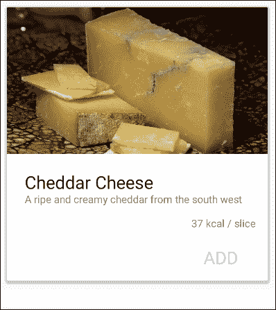
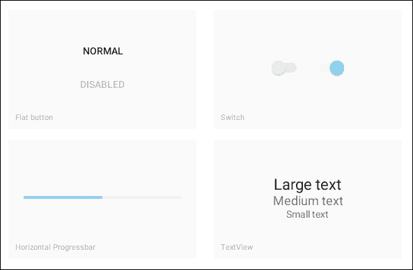
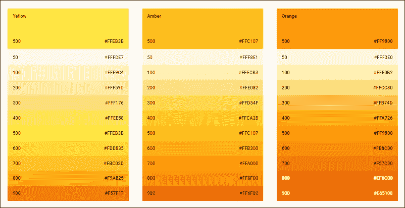
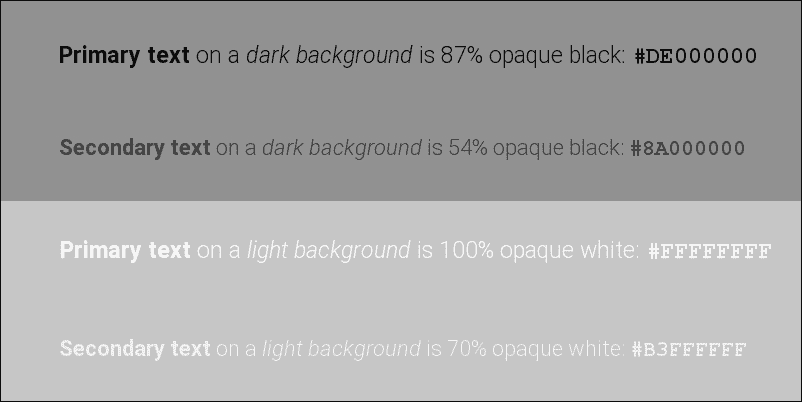
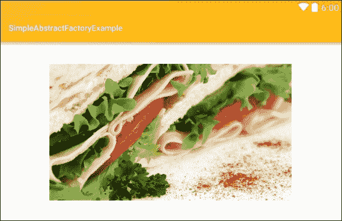
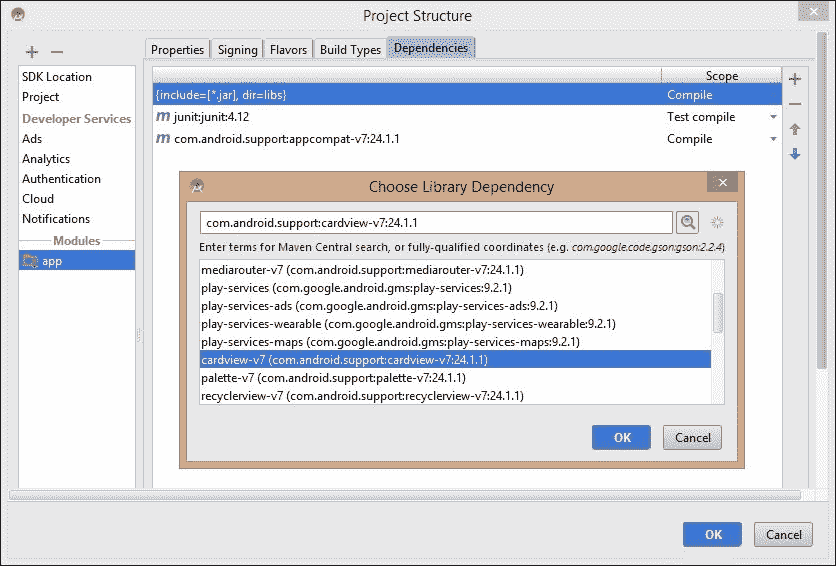
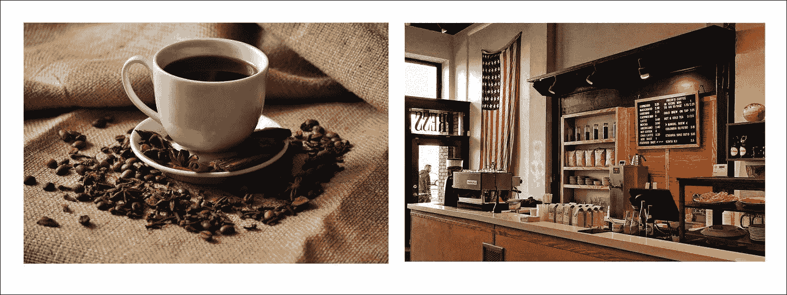
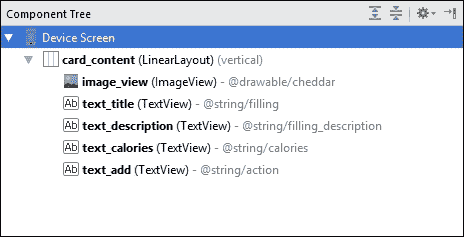
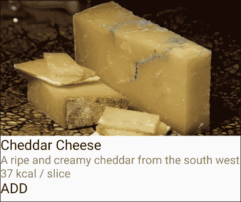
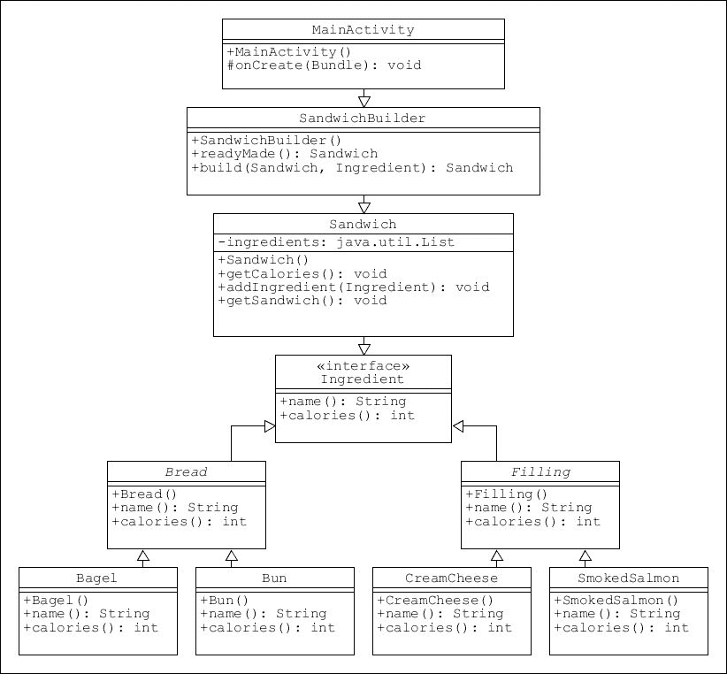

# 二、创建模式

在前一章中，我们看了一下**工厂模式**及其关联的**抽象工厂模式**。然而，我们以一种非常一般的方式来看待这些模式，而不是这些对象一旦被创建，如何在安卓设备上被表示和操作。换句话说，我们构建的模式本可以应用在许多其他软件环境中，为了了解如何使它们更适合安卓，我们需要看看安卓用户界面以及它们是如何组成的。

在本章中，我们将集中讨论如何将我们的产品表示为安卓用户界面组件。我们将使用**卡片视图**来显示这些，每张卡片将包含一个标题、一个图像、一些描述性文本和成分的热值，如下图所示:



这将引导我们初步了解**材质设计，**一种强大且日益流行的**视觉设计语言**，用于创建简洁直观的 ui。材质设计最初是为移动设备的较小屏幕而设计的，现在被广泛认为是一种非常有价值的用户界面范例，它的使用已经从安卓设备扩展到网站甚至其他移动平台。

**材质设计**不仅仅是时尚，它为遵循最佳 UI 构建实践提供了一系列非常有效的指导方针。材质设计提供了类似于我们已经讨论过的编程模式的视觉模式。这些模式提供了清晰的结构，并且操作简单。材质设计涵盖了比例、缩放、排版和间距等概念，所有这些都很容易在集成开发环境中进行管理，并由材质设计指南整齐地规定。

一旦我们了解了如何将我们的成分表示为可行的用户界面组件，我们将看看另一个常用的创建模式，即**构建器模式**。这将展示一种模式，允许我们从单个*成分*物体构建单个*三明治*物体。

在本章中，您将学习如何执行以下操作:

*   编辑材质样式和主题
*   应用选项板
*   自定义文本设置
*   管理屏幕密度
*   包括卡片视图支持库
*   理解 z 深度和阴影
*   将材质设计应用于卡片视图
*   创建构建器模式

虽然可以随时更改，但我们在构建安卓应用时首先要考虑的一件事就是配色方案。这是框架允许我们自定义许多熟悉的屏幕组件的颜色和外观的方式，例如标题和状态栏背景颜色以及文本和高亮阴影。

# 应用主题

作为开发人员，我们希望我们的应用程序能够脱颖而出，但我们也希望整合安卓用户熟悉的所有功能。一种方法是在整个应用程序中应用特定的配色方案。这最容易通过定制或创建安卓主题来实现

从 API 级(Android 5.0)开始，**素材主题**在 Android 设备上已经默认。然而，这不仅仅是一个新的面貌。材质主题还默认提供了我们与材质设计相关的触摸反馈和过渡动画。与所有安卓主题一样，材质主题基于安卓风格。

安卓风格的“T2”是一组定义特定屏幕组件外观的图形属性。样式允许我们定义从字体大小和背景颜色到填充和高度等等的一切。安卓主题只是应用于整个活动或应用的一种风格。样式定义为 XML 文件，存储在 Android Studio 项目的资源(`res`)目录中。

幸运的是，安卓工作室附带了一个图形化的**主题编辑器**，可以为我们生成 XML。尽管如此，了解幕后发生的事情总是好的，这最好通过打开上一章的抽象工厂项目或开始一个新的项目来看到。从项目浏览器中，打开`res/values/styles.xml`文件。它将包含以下样式定义:

```java
<style name="AppTheme" parent="Theme.AppCompat.Light.DarkActionBar"> 

    <item name="colorPrimary">@color/colorPrimary</item> 
    <item name="colorPrimaryDark">@color/colorPrimaryDark</item> 
    <item name="colorAccent">@color/colorAccent</item> 

</style> 

```

这里只定义了三种颜色，尽管我们可以有更多的颜色，例如主要和次要的文本颜色、窗口背景颜色以及其他颜色。颜色本身在`colors.xml`文件中定义，该文件也在`values`目录中找到，将包含以下定义:

```java
<color name="colorPrimary">#3F51B5</color> 
<color name="colorPrimaryDark">#303F9F</color> 
<color name="colorAccent">#FF4081</color> 

```

应用一个以上的主题并结合尽可能多的风格是很有可能的，但是一般来说，在整个应用程序中应用一个主题来定制一个默认的材质主题是最简单和干净的答案。

自定义默认主题最简单的方法是使用主题编辑器，可以从`Tools | Android`菜单打开。编辑器提供了一个强大的所见即所得预览窗格，允许我们在进行任何更改时立即查看这些更改，如下所示:



虽然我们可以自由选择任何我们喜欢的颜色作为我们的主题，但是材质设计指南对颜色应该如何搭配非常清楚。这最好通过查看**材质选项板**来解释。

# 自定义颜色和文本

应用主题时，我们首先需要考虑的是颜色和文本。材质设计指南建议从预定义的调色板系列中选择这些颜色。

## 使用调色板

在材质主题中，我们可以编辑的两种最重要的颜色是原色。它们直接应用于状态栏和应用程序栏，给应用程序一个独特的外观，而不影响整个平台的统一感觉。这两种颜色应该从同一个调色板中选择。这样的调色板有很多，整个集合可以在 www . Google . com/design/spec/style/color . html # color-color-palette 上找到。

无论你决定使用哪个调色板作为你的原色，谷歌建议你使用数值为 **500** 和 **700** 的色调:



这并不一定要执行得太严格，但通常最好坚持这些值，并始终选择相同颜色的两种色调。

### 类型

主题编辑器在这里会很有帮助；它的纯色块不仅提供工具提示告诉我们色调值，而且一旦我们选择了原色，它会建议一个合适的深色版本。

在选择强调色时，我们需要考虑原色的选择。这将应用于开关和高光，需要与原色形成很好的对比。除了选择一种看起来不错且明暗度值为 **100** 或相近的颜色之外，没有简单的规则来控制哪些颜色相互对比。

### 类型

可以用`navigationBarColor`改变屏幕下方导航栏的颜色，但不建议这样做，因为导航栏不应该真正被认为是你的应用程序的一部分。

大多数其他主题设置可以保持原样，用于大多数目的。但是，如果您希望更改文本颜色，有一两件事需要注意。

## 自定义文本

材质文本不会通过使用较浅的色调来生成较浅的阴影，而是通过使用 alpha 通道来创建不同级别的**透明度**。这样做的原因是，当用于不同颜色的背景或图像时，这看起来更令人愉快。文本透明度的规则如下:



风格和主题可以做很多事情，但现在只需创建一个简单的配色方案，并知道它将在整个应用程序中一致应用。我们的下一个任务将是看看如何将我们之前考虑的三明治配料对象扩展成一个用户友好的界面。毫无疑问，吸引用户的最好方法之一就是用一张诱人的照片。

# 添加图像资源

安卓提供的最有趣的挑战之一是我们必须迎合的大量屏幕密度和尺寸。在显示位图图像时尤其如此，因为有两个相互竞争的问题需要解决:

*   当低分辨率图像被拉伸以适合大屏幕或高分辨率屏幕时，显示效果非常差
*   高质量图像消耗的内存远远超过在较小的低密度屏幕上显示所需的内存。

撇开屏幕尺寸不谈，不同屏幕密度的问题主要通过使用**与密度无关的像素** ( **dp** )来解决。

## 管理屏幕密度

Dps 是基于 160 dpi 屏幕显示的抽象测量单位。这意味着，无论屏幕密度如何，宽度为 320 dp 的小部件将始终为 2 英寸宽。当谈到屏幕的实际物理尺寸时，这可以通过各种布局类型、库和属性(如重量和重力)来管理，但现在我们将看看如何提供适合尽可能宽的屏幕密度范围的图像。

安卓系统使用以下限定符划分屏幕密度:

*   低密度(`ldpi` ) - **120 dpi**
*   中密度(`mdpi` ) - **160 dpi**
*   高密度(`hdpi` ) - **240 dpi**
*   超高密度(`xhdpi` ) - **320 dpi**
*   超高密度(`xxhdpi` ) - **480 dpi**
*   超超高密度(`xxxhdpi` ) - **640 dpi**

### 注

在应用程序安装过程中，每台设备只会下载符合其自身规格的图像。这在旧设备上节省了内存，并且仍然在有能力的设备上提供了最丰富的视觉体验。

从开发人员的角度来看，似乎我们必须为任何给定项目中想要包含的每个图像生成六个版本。谢天谢地，通常情况并非如此。640 dpi 图像和 320 dpi 图像之间的差异在大多数手持设备上几乎看不到，考虑到我们的三明治构建器应用程序的大多数用户只想滚动浏览配料菜单，而不是仔细检查图像质量，我们可以安全地只为中、高和超高密度设备提供图像。

### 类型

在考虑高端设备的图像质量时，一个很好的经验法则是将我们的图像大小与设备的本机相机产生的图像大小进行比较。提供更大的图像不太可能改善用户体验，足以证明需要额外的内存。

在这里的示例中，我们希望提供适合卡片视图的图像，在纵向模式下，卡片视图将占据大部分屏幕宽度。现在，找到一个大约 2000 像素宽的图像。在下面的例子中，它被称为`sandwich.png`，大小为 1，920 乘 1，080 像素。您的图像不必与这些尺寸相匹配，但是稍后我们将看到选择良好的图像比例是如何被认为是良好的用户界面实践的重要部分。

当显示在显示 320 dpi 的超高密度设备上时，宽度为 1，920 像素的图像将为 6 英寸宽。我们将假设，至少现在，我们的应用将从移动设备访问，而不是计算机或电视，因此即使在高密度的 10 英寸平板电脑上，6 英寸也足以满足我们的目的。接下来，我们也将看到如何为其他屏幕密度做准备。

## 使用指定的资源

通过分配**指定的资源目录**来包含为特定屏幕密度配置的图像，可以轻松地提供适合各种屏幕密度的替代位图。从安卓工作室，我们可以通过以下步骤从项目浏览器创建这样的目录:

1.  首先，从`res`文件夹创建一个`New | Directory` ，并将其称为`drawable-mdpi`。
2.  接下来，再创建两个名为`drawable-hdpi`和`drawable-xhdpi`的兄弟目录。
3.  从项目浏览器的`drawable`上下文菜单中选择**在资源管理器中显示**，直接打开这些新文件夹。
4.  将`sandwich.png`图像添加到`drawable-xhdpi`文件夹。
5.  复制两张图片，重新缩放，一张是原始比例的 3:4，另一张是 1:2。
6.  将这些副本分别放在`drawable-hdpi`和`drawable-mdpi` 目录中。

这些变体现在将出现在项目浏览器中，如下所示:


我们现在可以放心，根据设备的原生屏幕密度，只会下载最合适和最节省内存的图像资源。要查看外观，请将以下图像视图添加到项目的`activity_main.xml`文件中:

```java
<ImageView 
    android:layout_width="wrap_content" 
    android:layout_height="wrap_content" 
    android:src="@drawable/sandwich" /> 

```

可以在任何仿真器或真实设备上使用预览屏幕查看输出:



这种方法的好处是，一旦我们正确指定了图像的变体，我们就可以简单地将其称为`@drawable/sandwich`，而忘记它正在哪个设备上被查看，或者它存储在哪个目录中。

这让我们可以自由探索如何将图像作为更广泛界面的一部分。

# 创建卡片视图

卡片视图是最容易识别的材质设计组件之一。它被设计成显示几段内容，这些内容都适用于单个主题。这些内容通常是图形、文本、动作按钮和图标的组合，卡片是以统一的方式呈现选择的好方法。这使得它成为展示我们的三明治成分和相关信息(如价格或热值)的好选择。我们将使用上一章中的工厂模式来实现这一点，但是在我们看到哪些代码需要更改之前，让我们先看看我们是如何实现 card view 的。

## 了解卡片视图属性

如果您的最低目标 SDK 为 21 或更高，则标准配置将包括 **CardView** 小部件。否则，您需要包含 cardview 支持库。通过包含以下突出显示的行，这可以很容易地添加到`build.gradle`文件中:

```java
dependencies { 
    compile fileTree(dir: 'libs', include: ['*.jar']) 
    testCompile 'junit:junit:4.12' 
    compile 'com.android.support:appcompat-v7:23.4.0' 
    compile 'com.android.support:cardview-v7:23.4.0' 
} 

```

正如支持库的名称所示，我们只能支持远至 API 级别 7 的卡视图。

不需要手动编辑`build.gradle`文件，尽管知道如何编辑是有用的，因为通过`File | Project Structure...`菜单和选择此处显示的项目可以更简单地完成:



### 类型

一些开发人员用一个`+`符号来版本化他们的支持库，比如:`com.android.support:cardview-v7:23.` **+** 。这是预测未来图书馆的一次尝试。这通常运行得很好，但不能保证这些应用程序在以后不会崩溃。在开发过程中使用编译好的 SDK 版本，然后在发布后定期更新应用程序，这要花更多的时间，但要聪明得多。

在我们将卡片视图添加到布局之前，您需要重建项目。首先，我们需要设置卡的一些属性。打开`res/values/dimens.xml`文件，添加以下三个新维度资源:

```java
<dimen name="card_height">200dp</dimen> 
<dimen name="card_corner_radius">4dp</dimen> 
<dimen name="card_elevation">2dp</dimen> 

```

现在，我们可以在主 XML 活动文件中添加卡片作为小部件，如下所示:

```java
<android.support.v7.widget.CardView xmlns:card_view="http://schemas.android.com/apk/res-auto" 
    android:layout_width="match_parent" 
    android:layout_height="@dimen/card_height" 
    android:layout_gravity="center" 
    card_view:cardCornerRadius="@dimen/card_corner_radius" 
    card_view:cardElevation="@dimen/card_elevation"> 
</android.support.v7.widget.CardView> 

```

阴影的使用不仅仅是给界面一个三维的外观；它以图形方式演示了布局层次结构，使用户清楚哪些功能可用。

### 类型

如果你花了时间检查卡片视图属性，你会注意到`translationZ`属性。这似乎与`elevation`有相同的效果。但是，`elevation`将设置卡片的绝对高程，而`translationZ`是相对设置，其值将从当前高程中添加或减去。

现在我们有一个卡片视图设置，我们可以根据材质设计指南填写它来表示我们的三明治成分。

## 应用卡片视图指标

设计指南对字体、填充和比例等问题非常清楚。一旦我们开始使用 CoordinatorLayout，这些设置中的许多将会自动设置，但是目前来看，看看如何应用这些指标是一个好主意。

卡片有许多不同的图案，在这里可以找到它们的完整描述:

[www.google.com/design/spec/components/cards.html](http://open%20the%20Java%20activity%20file%20extend%20it%20so%20that%20it%20implements)

我们将在这里创建的一个将包含一个图像，三个文本项目，和一个动作按钮。卡片可以被认为是容器对象，因此，通常包含它们自己的根布局。这可以直接放在卡片视图本身中，但是如果我们将卡片内容创建为单独的 XML 布局，它会使代码更易读、更灵活。

在下一个练习中，我们至少需要一张图片。根据材质设计，摄影图像应该清晰、明亮、简单，并呈现单一、明确的主题。例如，如果我们想在菜单中添加咖啡，左边的图像将是两者中最合适的:



卡片图像需要有 16:9 或 1:1 的宽高比。在这里，我们将使用 16:9，理想情况下，我们应该制作缩放版本以适应各种屏幕密度，但由于这只是一个演示，我们可以偷懒，只需将原件直接放入`drawable`文件夹中。这种方法远非最佳实践，但对于初步测试来说是可以的。

获取并保存图像后，下一步是为我们的卡创建布局:

1.  从项目浏览器中，导航至`New | XML | Layout XML File`并将其称为`card_content.xml`。它的根视图组应该是垂直方向的线性布局，应该是这样的:

    ```java
    <LinearLayout xmlns:android="http://schemas.android.com/apk/res/android" 
        android:id="@+id/card_content" 
        android:layout_width="match_parent" 
        android:layout_height="match_parent" 
        android:orientation="vertical"> 
    </LinearLayout> 

    ```

2.  Using either the graphical or text editor, create a layout structure to match the **Component Tree** seen here:

    

3.  Now include this layout inside the card view from the main activity layout file, like this:

    ```java
    <android.support.v7.widget.CardView 
        android:id="@+id/card_view" 
        android:layout_width="match_parent" 
        android:layout_height="wrap_content"> 

        <include 
            android:id="@+id/card_content" 
            layout="@layout/card_content" /> 

    </android.support.v7.widget.CardView> 

    ```

    ### 类型

    尽管它是可编辑的，但是卡片视图的推荐高程是 2 dp，除非它已经被选择和/或正在被移动，在这种情况下，它的高程是 8 dp。

毫无疑问，您会知道，强烈建议不要使用硬编码到 XML 资源中的字符串。不说别的，这使得将我们的应用程序翻译成其他语言的过程几乎不可能。但是，在布局设计的早期阶段，提供一些占位符值有助于了解布局的外观。后面我们会用 Java 控制卡片内容，根据用户输入选择这个内容；但是现在，我们将选择一些典型值，这样我们就可以轻松快速地看到我们的设置所产生的效果。要了解这是如何使用的，请将以下属性或等效属性添加到`values`目录中的`strings.xml`文件中:

```java
<string name="filling">Cheddar Cheese</string> 
<string name="filling_description">A ripe and creamy cheddar from the south west</string> 
<string name="calories">237 kcal per slice</string> 
<string name="action">ADD</string> 
<string name="alternative_text">A picture of some cheddar cheese</string> 

```

现在，我们将使用这些占位符来评估我们所做的任何更改。当作为预览查看时，我们刚刚创建的布局应该如下所示:



将它转换成材质设计的组件只需要一些格式和一点材质指南的知识。

此布局的指标如下:

*   图像的比例必须为 16:9
*   标题文本应为 24 sp
*   描述性文本是 16 sp
*   文本右下方和左下方的边距为 16 dp
*   标题文本上方的边距为 24 dp
*   动作文本为 24 sp，颜色来自重音

这些属性很容易从属性面板或通过直接编辑 XML 来设置。这里有一两件事没有提到，所以每个元素都值得单独看一下。

首先，有必要指出，这些值永远不应该像下面的代码片段那样在代码中进行字面上的描述；例如，`android:paddingStart="24dp"`应该被编码为类似于`android:paddingStart="@dimen/text_paddingStart"`的东西，其中`text_paddingStart`在`dimens.xml`文件中定义。这里，对值进行硬编码只是为了简化解释。

顶部图像视图的代码应该如下所示:

```java
<ImageView 
       android:id="@+id/image_view" 
       android:layout_width="match_parent" 
       android:layout_height="wrap_content" 
       android:contentDescription="@string/alternative_text" 
       android:src="@drawable/cheddar" /> 

```

这很简单，但是一定要注意`contentDescription`的使用；当视障用户设置了辅助功能选项，从而可以通过设备的语音合成器读出图像的描述来欣赏图像时，就会使用这种方法。

下面是以下三个文本视图。

```java
<TextView 
    android:id="@+id/text_title" 
    android:layout_width="wrap_content" 
    android:layout_height="wrap_content" 
    android:paddingEnd="24dp" 
    android:paddingStart="24dp" 
    android:paddingTop="24dp" 
    android:text="@string/filling" 
    android:textAppearance="?android:attr/textAppearanceLarge" 
    android:textSize="24sp" /> 

<TextView 
    android:id="@+id/text_description" 
    android:layout_width="wrap_content" 
    android:layout_height="wrap_content" 
    android:paddingEnd="24dp" 
    android:paddingStart="24dp" 
    android:text="@string/filling_description" 
    android:textAppearance="?android:attr/textAppearanceMedium" 
    android:textSize="14sp" /> 

<TextView 
    android:id="@+id/text_calories" 
    android:layout_width="wrap_content" 
    android:layout_height="wrap_content" 
    android:layout_gravity="end" 
    android:paddingBottom="8dp" 
    android:paddingStart="16dp" 
    android:paddingEnd="16dp" 
    android:paddingTop="16dp" 
    android:text="@string/calories" 
    android:textAppearance="?android:attr/textAppearanceMedium" 
    android:textSize="14sp" /> 

```

这些也很容易理解。真正需要指出的是使用`Start`和`End`而不是`Left`和`Right`来定义填充和重力，因为这有助于在翻译成文本从右向左的语言时应用我们的布局校正。我们还包括了`textAppearance`属性，这可能显得多余，因为我们还直接设置了文本大小。像`textAppearanceMedium`这样的属性非常有用，因为它们不仅会根据我们定制的主题自动应用文本颜色，还会根据单个用户的全局文本大小设置来调整它们的大小。

这仅在底部留下操作按钮，并且由于这使用文本视图而不是按钮，这可能需要一点解释。该 XML 如下所示:

```java
<TextView 
    android:id="@+id/text_add" 
    android:layout_width="wrap_content" 
    android:layout_height="wrap_content" 
    android:layout_gravity="end" 
    android:clickable="true" 
    android:paddingBottom="16dp" 
    android:paddingEnd="40dp" 
    android:paddingLeft="16dp" 
    android:paddingRight="40dp" 
    android:paddingStart="16dp" 
    android:paddingTop="16dp" 
    android:text="@string/action" 
    android:textAppearance="?android:attr/textAppearanceLarge" 
    android:textColor="@color/colorAccent" 
    android:textSize="24sp" /> 

```

我们在这里选择文本视图的原因有两个，在这里使用按钮小部件似乎是有意义的。首先，安卓系统推荐使用**扁平按钮**，在卡片视图中只有文本可见；其次，触发动作的可触摸区域需要比文本本身更大。这很容易通过设置填充属性来实现，正如我们之前所做的那样。为了使文本视图表现得像一个按钮，我们只需要添加一行`android:clickable="true"`。

我们完成的卡片现在应该如下所示:


卡片视图的设计还有很多，但这应该是我们需要遵循的一些原则的一个很好的介绍，现在，我们可以看到这些呈现对象的新方式是如何反映我们的工厂模式代码的。

## 更新工厂模式

设计模式的美妙之处之一是它们可以很容易地适应我们想要做出的任何改变。如果我们愿意，我们可以保持工厂代码不变，使用单个字符串输出将客户端代码定向到适当的数据集。不过，这更符合模式的本质，让它们适应我们稍微复杂一点的配料对象。

上一章中进入我们代码结构的想法现在得到了回报，因为虽然我们需要编辑我们的接口和具体的例子，但是我们可以让工厂类保持原样，这很好地展示了模式的优势之一。

使用我们用来构建卡的四个标准，我们更新后的界面可能如下所示:

```java
public interface Bread { 

    String image(); 
    String name(); 
    String description(); 
    int calories(); 
} 

```

单个对象可能看起来像这样:

```java
public class Baguette implements Bread { 

    @Override 
    public String image() { 
        return "R.drawable.baguette"; 
    } 

    @Override 
    public String name() { 
        return "Baguette"; 
    } 

    @Override 
    public String description() { 
        return "Fresh and crunchy"; 
    } 

    @Override 
    public int calories() { 
        return 150; 
    } 
} 

```

随着我们的前进，我们将需要我们的对象的更多属性，例如价格以及它们是素食还是含有坚果，并且随着我们的对象变得更加复杂，我们将不得不应用更复杂的方法来管理我们的数据，但是原则上我们在这里使用的方法没有问题。它可能体积很大，但肯定很容易阅读和维护。工厂模式显然非常有用，但它们只创建单个对象。为了更真实地模拟三明治，我们需要能够将*成分*对象放在一起，并将整个集合视为单个*三明治*对象。这就是构建器模式的由来。

# 应用构建器模式

构建器设计模式是最有用的创建模式之一，因为它从较小的对象构建较大的对象。这正是我们想要做的，从一个成分列表中构造一个三明治对象。构建器模式还有一个优点，那就是可选特性很容易在以后包含。和以前一样，我们将从创建一个接口开始；我们称之为`Ingredient`，用它来代表`bread`和`filling`。这一次，我们需要将卡路里表示为一个整数，因为我们需要计算一个成品三明治的总量。

打开一个安卓工作室项目，或者启动一个新项目，并按照以下步骤创建一个基本的三明治构建器模式:

1.  创建一个名为`Ingredient.java`的新界面，这样完成:

    ```java
    public interface Ingredient { 

        String name(); 
        int calories(); 
    } 

    ```

2.  现在为`Bread`创建一个抽象类，如下所示:

    ```java
    public abstract class Bread implements Ingredient { 

        @Override 
        public abstract String name(); 

        @Override 
        public abstract int calories(); 
    } 

    ```

3.  并创建一个相同的名为`Filling`。
4.  接下来，创建`Bread`的具体类，如下所示:

    ```java
    public class Bagel extends Bread { 

        @Override 
        public String name() { 
            return "Bagel"; 
        } 

        @Override 
        public int calories() { 
            return 250; 
        } 
    } 

    ```

5.  对`Filling`也这样做。每种类型的两个类应该足够用于演示目的:

    ```java
    public class SmokedSalmon extends Filling { 

        @Override 
        public String name() { 
            return "Smoked salmon"; 
        } 

        @Override 
        public int calories() { 
            return 400; 
        } 
    } 

    ```

6.  现在我们可以创建我们的`Sandwich`类:

    ```java
    public class Sandwich { 
        private static final String DEBUG_TAG = "tag"; 

        // Create list to hold ingredients 
        private List<Ingredient> ingredients = new ArrayList<Ingredient>(); 

        // Calculate total calories 
        public void getCalories() { 
            int c = 0; 

            for (Ingredient i : ingredients) { 
                c += i.calories(); 
            } 

            Log.d(DEBUG_TAG, "Total calories : " + c + " kcal"); 
        } 

        // Add ingredient 
        public void addIngredient(Ingredient ingredient) { 
            ingredients.add(ingredient); 
        } 

        // Output ingredients 
        public void getSandwich() { 

            for (Ingredient i : ingredients) { 
                Log.d(DEBUG_TAG, i.name() + " : " + i.calories() + " kcal"); 
            } 
        } 

    } 

    ```

7.  Finally, create the `SandwichBuilder` class like so:

    ```java
    public class SandwichBuilder { 

        // Off the shelf sandwich 
        public static Sandwich readyMade() { 
            Sandwich sandwich = new Sandwich(); 

            sandwich.addIngredient(new Bagel()); 
            sandwich.addIngredient(new SmokedSalmon()); 
            sandwich.addIngredient(new CreamCheese()); 

            return sandwich; 
        } 

        // Customized sandwich 
        public static Sandwich build(Sandwich s, Ingredient i) { 

            s.addIngredient(i); 
            return s; 
        } 
    } 

    ```

    这完成了我们的构建器设计模式，至少目前是这样。当以图表形式查看时，它看起来像这样:

    

在这里，我们为构建器提供了两个功能:返回一个现成的三明治和一个用户定制的三明治。我们还没有工作界面，但是我们可以通过客户端代码模拟用户的选择。

我们还将输出职责委托给了`Sandwich`类本身，这通常是一个好主意，因为它有助于保持我们的客户端代码干净和明显，正如您在这里看到的:

```java
        // Build a customized sandwich 
        SandwichBuilder builder = new SandwichBuilder(); 
        Sandwich custom = new Sandwich(); 

        // Simulate user selections 
        custom = builder.build(custom, new Bun()); 
        custom = builder.build(custom, new CreamCheese()); 

        Log.d(DEBUG_TAG, "CUSTOMIZED"); 
        custom.getSandwich(); 
        custom.getCalories(); 

        // Build a ready made sandwich 
        Sandwich offTheShelf = SandwichBuilder.readyMade(); 

        Log.d(DEBUG_TAG, "READY MADE"); 
        offTheShelf.getSandwich(); 
        offTheShelf.getCalories(); 

```

这将产生如下输出:

```java
D/tag: CUSTOMIZED
D/tag: Bun : 150 kcal
D/tag: Cream cheese : 350 kcal
D/tag: Total calories : 500 kcal
D/tag: READY MADE
D/tag: Bagel : 250 kcal
D/tag: Smoked salmon : 400 kcal
D/tag: Cream cheese : 350 kcal
D/tag: Total calories : 1000 kcal

```

构建器最大的优点之一是添加、移除和修改具体的类是多么容易，甚至接口或抽象的改变也不需要修改客户端源代码。这使得构建器模式成为最强大的模式之一，它可以在许多情况下使用。这并不是说它总是比工厂模式更可取。对于简单的对象来说，工厂通常是最好的选择，当然，模式存在于不同的尺度上，在构建器中找到嵌套的工厂并不少见，反之亦然。

# 总结

在这一章中，我们介绍了许多关于如何展示产品的材质，这是任何成功应用程序的重要元素。我们看到了如何管理颜色和文本方案，然后进入了更严肃的问题，即管理我们的应用程序可能运行的大量屏幕密度。

接下来将介绍材质设计最常用的组件之一——卡片视图，并强调支持库的重要性，尤其是设计库。我们需要进一步研究这个库，因为它对于创建我们的应用程序应有的布局和交互至关重要。下一章将集中讨论更多这些视觉元素，重点是更常见的材质组件，如应用程序栏和滑动抽屉。