# 三、材质模式

到目前为止，在本书中，我们已经研究了如何通过使用设计模式来创建对象和对象集合，并使用卡片视图来显示它们。在我们开始组装一个工作的应用之前，我们需要考虑用户将如何输入他们的选择。有许多方法可以在移动设备上从用户那里收集信息，例如菜单、按钮、图标和对话框。安卓布局通常有一个应用栏(以前称为操作栏)，通常位于屏幕顶部状态栏的正下方，而实现材质设计的布局通常使用滑动导航抽屉来访问应用的顶级功能。

通常情况下，支持库的使用，特别是**设计库**，使得实现材质模式(如导航栏)变得非常容易，并且材质设计包含自己的视觉模式，这有助于鼓励最佳用户界面实践。在本章中，我们将看到如何实现**应用栏**、**导航视图**，并探索材质设计提供的一些视觉模式。我们将以快速查看**单例模式**来结束。

在本章中，您将学习如何执行以下操作:

*   用应用栏替换动作栏
*   使用资产工作室添加操作图标
*   应用应用栏操作
*   运行时控制应用栏
*   使用抽屉布局
*   添加菜单和子菜单
*   应用比率关键线
*   包括抽屉监听器
*   向应用添加片段
*   管理片段堆栈

# 应用栏

安卓应用总是在屏幕顶部包含一个工具栏。这在传统上被用来提供标题以及对顶级菜单的访问，并被称为动作栏。自从 Android 5 (API 级别 21)和材质设计开始以来，已经有可能用更灵活的应用栏来取代它。应用栏允许我们设置它的颜色，把它放在屏幕上的任何地方，并包括比它的前身更广泛的内容。

大多数安卓工作室模板默认使用包含旧动作栏的主题，我们需要做的第一件事是删除旧版本。要查看我们如何删除旧的操作栏并用自定义的应用栏替换它，请按照下列步骤操作:

1.  使用一个空的活动模板开始一个新的安卓项目，并使用主题编辑器设置你的材质主题。
2.  打开`styles.xml`文件，编辑`style`定义，匹配这里的定义:

    ```java
    <style name="AppTheme" parent="Theme.AppCompat.Light.NoActionBar"> 

    ```

3.  在`activity_main.xml`旁边创建一个新的 XML 文件，并将其称为`toolbar.xml`。
4.  像这样完成:

    ```java
    <android.support.v7.widget.Toolbar  
        xmlns:android="http://schemas.android.com/apk/res/android" 
        android:id="@+id/toolbar" 
        android:layout_width="match_parent" 
        android:layout_height="?attr/actionBarSize" 
        android:background="?attr/colorPrimary" 
        android:theme="@android:style/Theme.Material" 
        android:translationZ="4dp" /> 

    ```

5.  接下来，将以下元素添加到`activity_main.xml`文件中:

    ```java
    <include 
        android:id="@+id/toolbar" 
        layout="@layout/toolbar" /> 

    ```

    ```java
    <android.support.v7.widget.Toolbar  
        xmlns:android="http://schemas.android.com/apk/res/android" 
        android:id="@+id/toolbar" 
        android:layout_width="match_parent" 
        android:layout_height="?attr/actionBarSize" 
        android:background="?attr/colorPrimary" 
        android:theme="@android:style/Theme.Material" 
        android:translationZ="4dp" /> 

    ```

6.  最后，编辑`dimens.xml`文件中的边距值，如下所示:

    ```java
    <resources> 
        <dimen name="activity_horizontal_margin">0dp</dimen> 
        <dimen name="activity_vertical_margin">0dp</dimen> 
    </resources> 

    ```

该工具栏与任何其他视图组一样，位于根布局内部，因此与原始动作栏不同，它不会与屏幕边缘齐平。这就是为什么我们需要调整布局边距。稍后，我们将使用 CoordinatorLayout，它将为我们自动完成大部分工作，但是现在看看它是如何工作的是很有用的。

工具栏现在的位置和阴影与原来一样，但没有任何内容或功能。这可以在活动的 Java 元素中通过编辑`onCreate()`方法来完成，如下所示:

```java
@Override 
protected void onCreate(Bundle savedInstanceState) { 
    super.onCreate(savedInstanceState); 
    setContentView(R.layout.activity_main); 

    Toolbar toolbar = (Toolbar) findViewById(R.id.toolbar); 
    if (toolbar != null) { 
        setSupportActionBar(toolbar); 
    } 
} 

```

这将产生一个错误。这是因为这里可以导入两个可能的库。按 **Alt + Enter** 选择工具栏的支持版本，如下所示:

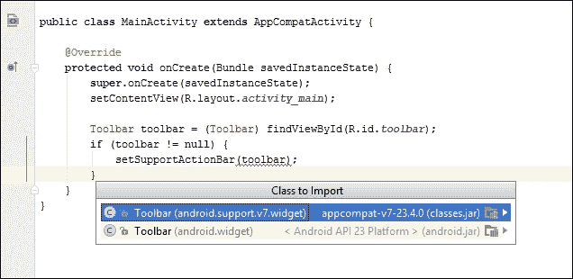

### 类型

为了节省使用 Java 的时间，请更改设置，以便在代码中包含 Java 库时自动导入。通过**编辑器** | **常规** | **自动导入**从**文件** | **设置**菜单完成。

在运行 API 20 或更低版本的模拟器上测试项目将立即证明 AppCompat 主题的不足之一；尽管为我们的状态栏`with colorPrimaryDark`声明了一种颜色，该颜色在 API 21 和更高版本上运行良好，但在这里它仍然是黑色的:

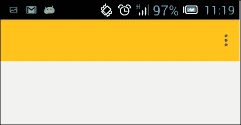

然而，考虑到我们现在能够接触到的人数，这一点以及没有看起来自然的阴影是一个很小的代价。

现在，我们已经用工具栏替换了老式的动作栏，并将其设置为应用栏(有时称为主工具栏)，我们可以更仔细地了解它是如何工作的，以及如何使用资产工作室应用符合材质的动作图标。

## 影像资产

在 app-bar 中包含文本菜单是很有可能的，但是由于空间有限，使用图标更正常。安卓工作室通过其资产工作室提供对材质图标集合的访问。以下步骤演示了如何做到这一点:

1.  从项目浏览器的可绘制文件夹菜单中，选择**新建|图像资源**。
2.  Then select **Action Bar and Tab Icons** as the **Asset Type** and then click on the **Clipart** icon and select an icon from the collection of clip art:

    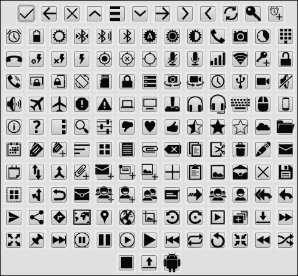

3.  必须修剪此图像，填充 0%。
4.  根据工具栏背景颜色是亮还是暗来选择主题。
5.  Provide a suitable name and click on **Next**:

    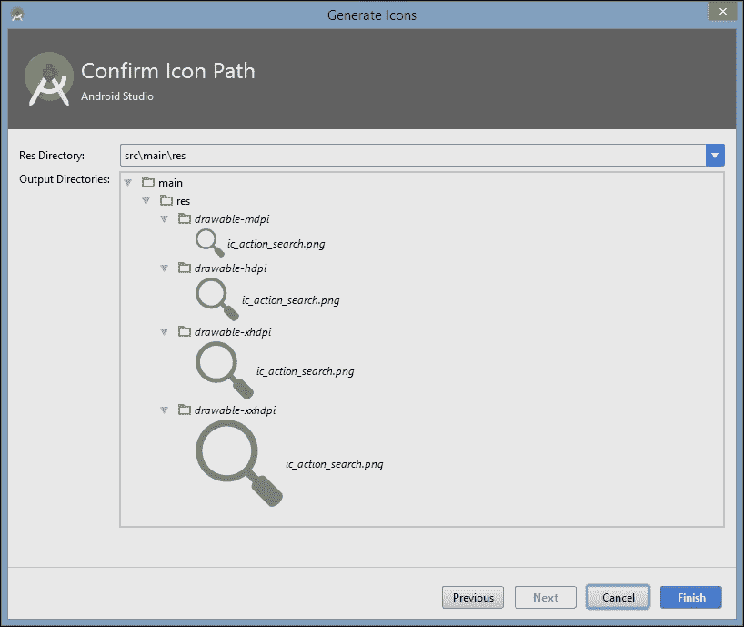

    ### 类型

    更多的素材图标可以从以下网址下载:[https://design.google.com/icons](https://design.google.com/icons)

asset studio 会自动为我们创建跨越四种屏幕密度的图标，并将它们放置在正确的文件夹中，以便将它们部署在适当的设备上。它甚至应用了材质设计用于图标所需的 54%不透明黑色。我们所要做的就是在我们的应用栏中包含这些内容，将图标属性添加到适当的菜单项中。稍后，我们将使用导航抽屉来提供顶级访问，但是要了解如何使用应用栏，我们将添加搜索功能。我们为此选择的图标称为`ic_action_search`。

## 应用动作

动作图标保存在可绘制的文件夹中，通过在菜单 XML 文件中包含`items`，可以将其包含在我们的动作栏中。根据第一次创建项目时使用的模板，您可能需要添加一个新目录`res/menu`，以及一个名为`main.xml`或 `menu_main.xml`的文件或您选择的任何文件作为**新建|菜单资源文件**。可以这样添加操作:

```java
<menu xmlns:android="http://schemas.android.com/apk/res/android" 
    xmlns:app="http://schemas.android.com/apk/res-auto" 
    xmlns:tools="http://schemas.android.com/tools" 
    tools:context="com.example.kyle.appbar.MainActivity"> 

    <item 
        android:id="@+id/action_settings" 
        android:orderInCategory="100" 
        android: 
        app:showAsAction="collapseActionView" /> 

    <item 
        android:id="@+id/action_search" 
        android:icon="@drawable/ic_action" 
        android:orderInCategory="100" 
        android: 
        app:showAsAction="ifRoom" /> 
</menu> 

```

请注意，前面的示例使用了对字符串资源的引用，因此必须在`strings.xml`文件中附带一个定义，如下所示:

```java
<string name="menu_search">Search</string> 

```

菜单项自动包含在应用栏中，标题取自字符串文件中的`string name="app_name"`定义。当以这种方式构建时，这些组件根据材质指南进行定位。

要看到这一点，请执行以下步骤:

1.  打开主 Java 活动，添加此字段:

    ```java
    private Toolbar toolbar; 

    ```

2.  然后将这些行添加到`onCreate()`方法中:

    ```java
    Toolbar toolbar = (Toolbar) findViewById(R.id.toolbar); 
        if (toolbar != null) { 
            setSupportActionBar(toolbar); 
        } 

    toolbar = (Toolbar) findViewById(R.id.toolbar); 
    toolbar.setTitle("A toolbar"); 
    toolbar.setSubtitle("with a subtitle"); 

    ```

3.  最后，将以下方法添加到活动中:

    ```java
    @Override 
    public boolean onCreateOptionsMenu(Menu menu) { 
        MenuInflater inflater = getMenuInflater(); 
        inflater.inflate(R.menu.menu_main, menu); 
        return true; 
    } 

    ```

我们现在应该能够在设备或模拟器上看到我们的新工具栏:

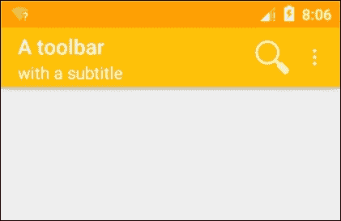

能够将我们喜欢的任何视图添加到工具栏中，这使得它比旧的操作栏更有效。我们一次可以有多个，甚至可以通过应用布局重力属性将它们放置在其他地方。工具栏甚至有自己的方法，就像我们之前看到的标题和副标题一样。我们也可以用这些方法添加图标和标识，但在此之前，根据材质设计指南探索 app bar 最佳实践是个好主意。

## App 栏结构

虽然我们在这里应用的技术符合材质准则，除了确保其高度之外，我们不需要做太多工作，但是仍然会有一些时候我们用自定义工具栏布局替换动作栏，并且我们需要知道如何分隔和定位组件。平板电脑和台式机的情况略有不同。

### 电话

说到应用栏，只有几个简单的结构规则需要记住。这些内容包括边距、填充、宽度、高度和位置，它们因平台和屏幕方向而异:

*   人像模式下应用栏的`layout_height`为`56 dp`，风景模式下为`48 dp`。
*   应用栏填充屏幕宽度或其包含列的宽度。它们不能分成两部分。他们有`match_parent`的`layout_width`。
*   应用栏的`elevation` `2 dp`大于它所控制的材质。
*   上述规则的例外是，如果一个卡片或对话框有自己的工具栏，那么两者可以共享相同的高度。
*   App bars have padding of exactly `16 dp`. This means the contained icons must have no padding or margins of their own and therefore share edges with this margin:

    

*   标题文本的颜色来自主题的主要文本颜色，图标来自次要文本。
*   The title should be positioned `72 dp` from the left of the toolbar and `20 dp` from the bottom. This applies even when the toolbar is expanded:

    

*   标题的文本大小由`android:textAppearance="?android:attr/textAppearanceLarge"`设定。

### 片剂

为平板电脑和台式机构建应用栏时，规则是相同的，但有以下例外:

*   工具栏高度始终为`64 dp`。
*   标题缩进`80 dp`，当栏展开时不会下移。
*   app 栏的填充是`24 dp`，除了顶部是`20 dp`。

我们已经成功地根据材质指南构建了一个应用栏，但是如果动作图标不执行动作，它们就没有用了。本质上，当一个应用栏承担动作栏功能时，它实际上只是一个菜单的访问点。稍后我们将返回菜单和对话框，但现在我们将快速了解如何使用 Java 代码在运行时操作工具栏。

对旧动作栏所做的更改使放置全局动作变得简单直观。然而，空间是有限的，对于更复杂和图形化的导航组件，我们可以转向滑动抽屉。

# 导航抽屉

虽然滑动抽屉可以从屏幕的任何一侧出现，但导航抽屉应该始终位于左侧，并且应该比除状态栏和导航栏之外的所有其他视图具有更高的高度。把导航抽屉想象成一个永久的固定装置，大部分时间隐藏在屏幕边缘:

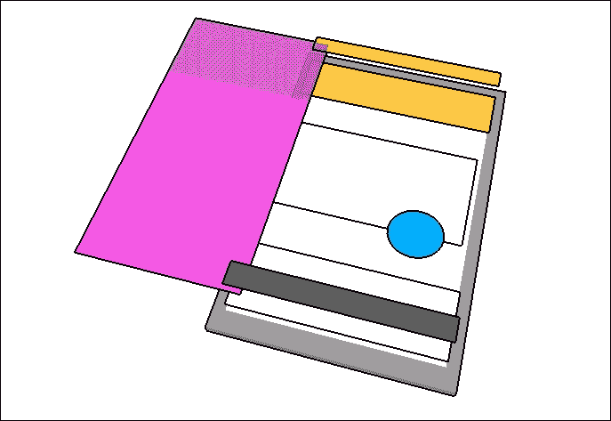

在设计库之前，导航视图等组件必须从其他视图构建，尽管库极大地简化了这一过程，并使我们不必手动实现许多材质原则，但仍有几个准则需要我们注意。欣赏这些最好的方法是从头开始建造一个导航滑动抽屉。这将包括创建布局，应用关于组件比率的材质指南，以及用代码将所有这些连接在一起。

## 抽屉构造

在设置项目时，你无疑会注意到安卓工作室提供了一个**导航抽屉活动**模板。这创建了我们可能需要的大部分结构，并节省了大量工作。一旦我们决定了我们的三明治建筑应用将有什么功能，我们将使用这个模板。然而，从头开始组装一个来看看它是如何工作的要有启发性得多，考虑到这一点，我们将创建一个抽屉布局，它需要可以通过 Asset Studio 轻松找到的图标:

1.  打开一个最低 SDK 级别为 21 或更高的安卓工作室项目，并为其提供您自己定制的颜色和主题。
2.  将以下行添加到您的`styles.xml`文件中:

    ```java
    <item name="android:statusBarColor"> 
    @android:color/transparent 
    </item> 

    ```

3.  确保您已经编译了以下依赖项:

    ```java
    compile 'com.android.support:design:23.4.0' 

    ```

4.  如果您使用的项目与我们在上一节中使用的项目不同，请设置名为`toolbar.xml`的应用栏布局。
5.  打开`activity_main`并用以下代码替换:

    ```java
    <android.support.v4.widget.DrawerLayout xmlns:android="http://schemas.android.com/apk/res/android" 
        xmlns:app="http://schemas.android.com/apk/res-auto" 
        xmlns:tools="http://schemas.android.com/tools" 
        android:id="@+id/drawer" 
        android:layout_width="match_parent" 
        android:layout_height="match_parent" 
        android:fitsSystemWindows="true" 
        tools:context=".MainActivity"> 

        <LinearLayout 
            android:layout_width="match_parent" 
            android:layout_height="match_parent" 
            android:orientation="vertical"> 

            <include 
                android:id="@+id/toolbar" 
                layout="@layout/toolbar" /> 

            <FrameLayout 
                android:id="@+id/fragment" 
                android:layout_width="match_parent" 
                android:layout_height="match_parent"> 
            </FrameLayout> 

        </LinearLayout> 

        <android.support.design.widget.NavigationView 
            android:id="@+id/navigation_view" 
            android:layout_width="wrap_content" 
            android:layout_height="match_parent" 
            android:layout_gravity="start" 
            app:headerLayout="@layout/header" 
            app:menu="@menu/menu_drawer" /> 

    </android.support.v4.widget.DrawerLayout> 

    ```

可以看到，这里的根布局是支持库提供的**draweryout**。注意`fitsSystemWindows`属性；这就是抽屉延伸到状态栏下方屏幕顶部的原因。在样式中将`statusBarColor`设置为`android:color/transparent`后，现在可以通过状态栏看到抽屉。

这种效果在运行早于 5.0 (API 21)的安卓版本的设备上是不可用的，即使使用 AppCompat 也是如此，这将改变标题的外观纵横比并剪辑任何图像。为此，创建一个不设置`fitsSystemWindows`属性的替代`styles.xml`资源。

布局的其余部分由线性布局和**导航视图**本身组成。线性布局包含我们的应用栏和一个空的**框架布局**。框架布局是最简单的布局，只包含一个项目，通常用作占位符，在这种情况下，占位符将包含基于用户从导航菜单中选择的内容。

从前面的代码中可以看出，我们需要一个标题的布局文件和一个抽屉本身的菜单文件。应该在`layout`目录中创建 `header.xml f`文件，如下所示:

```java
<?xml version="1.0" encoding="utf-8"?> 
<RelativeLayout xmlns:android="http://schemas.android.com/apk/res/android" 
    android:layout_width="match_parent" 
    android:layout_height="header_height" 
    android:background="@drawable/header_background" 
    android:orientation="vertical"> 

    <TextView 
        android:id="@+id/feature" 
        android:layout_width="wrap_content" 
        android:layout_height="wrap_content" 
        android:layout_above="@+id/details" 
        android:gravity="left" 
        android:paddingBottom="8dp" 
        android:paddingLeft="16dp" 
        android:text="@string/feature" 
        android:textColor="#FFFFFF" 
        android:textSize="14sp" 
        android:textStyle="bold" /> 

    <TextView 
        android:id="@+id/details" 
        android:layout_width="wrap_content" 
        android:layout_height="wrap_content" 
        android:layout_alignStart="@+id/feature" 
        android:layout_alignParentBottom="true" 
        android:layout_marginBottom="16dp" 
        android:gravity="left" 
        android:paddingLeft="16dp" 
        android:text="@string/details" 
        android:textColor="#FFFFFF" 
        android:textSize="14sp" /> 

</RelativeLayout> 

```

您需要将以下值添加到`dimens.xml`文件中:

```java
<dimen name="header_height">192dp</dimen> 

```

如您所见，我们需要一个标题图像。这里叫`header_background`，长宽比应该是 4:3。

如果您在具有不同屏幕密度的设备上测试这种布局，您将很快看到这种纵横比没有得到保持。这可以通过使用配置限定符，以类似于我们管理映像资源的方式轻松解决。为此，请遵循这里概述的简单步骤:

1.  为每个密度范围创建新目录，其名称如`values-ldpi`、`values-mdpi`等直到`values-xxxhdpi`。
2.  在每个文件夹中复制`dimens.xml`文件。
3.  在每个文件中设置 `header_height`的值以匹配屏幕密度。

菜单文件叫做`menu_drawer.xml`，应该放在`menu`目录下，你可能也需要创建。每个项目都有一个相关的图标，这些都可以在资产工作室中找到。代码本身应符合以下内容:

```java
<?xml version="1.0" encoding="utf-8"?> 
<menu xmlns:android="http://schemas.android.com/apk/res/android"> 

    <item 
        android:id="@+id/drama" 
        android:icon="@drawable/drama" 
        android: /> 

    <item 
        android:id="@+id/film" 
        android:icon="@drawable/film" 
        android: /> 

    <item 
        android:id="@+id/sport" 
        android:icon="@drawable/sport" 
        android: /> 

    <item 
        android:id="@+id/news" 
        android:> 
        <menu> 
            <item 
                android:id="@+id/national" 
                android:icon="@drawable/news" 
                android: /> 

            <item 
                android:id="@+id/international" 
                android:icon="@drawable/international" 
                android: /> 

        </menu> 
    </item> 
</menu> 

```

得益于设计库，滑动抽屉和导航视图的大部分指标(如页边距和文本大小)都得到了我们的关注。但是，抽屉标题上文本的大小、位置和颜色却不是。尽管有共同的背景，文本本身应该被认为是 56-dp 的高组成部分。它应该有 16-dp 的内部填充和 8-dp 的线间距。这以及正确的文本颜色、大小和重量可以从前面的代码中导出。

## 比率关键线

当滑动抽屉等元素填满整个屏幕高度，并像我们的抽屉一样在页眉和内容之间分成垂直部分时，这些划分只能发生在称为比例关键线的特定点。这些点由元素的宽度和距顶部的距离之间的比率决定。材质布局中允许有六个这样的比率，它们被定义为宽高比(`width:height`)，如下所示:

*   16:9
*   3:2
*   4:3
*   1:1
*   3:4
*   2:3

    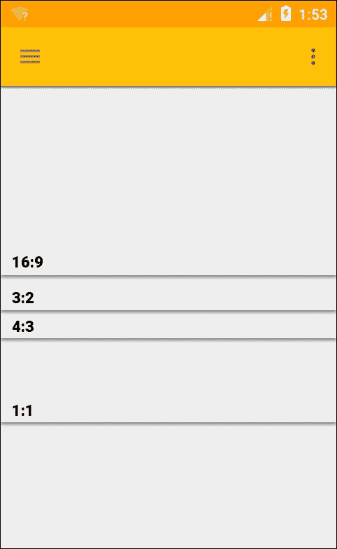

在这里的例子中，选择了 4:3 的比例，抽屉的宽度是 256 dp。我们也可以制作一个 16:9 比例的割台，并将`layout_height`设定为 144 dp。

比率关键线仅与距包含元素顶部的距离有关；你不能让一个 16:9 的视图低于另一个。但是，如果另一个视图从顶视图的底部向下延伸到另一个比率关键线，则可以在此视图下方放置另一个视图:

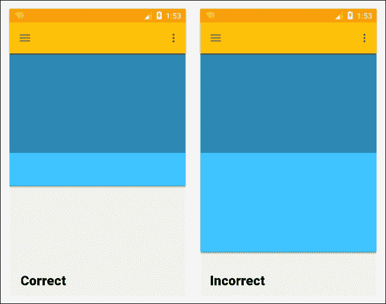

## 启动抽屉

现在剩下的就是用 Java 实现一些代码来让布局工作。这是通过当用户与抽屉交互时调用的侦听器回调方法来完成的。以下步骤演示了如何实现这一点:

1.  打开 MainActivity 文件，在`onCreate()`方法中添加以下几行，用我们的工具栏替换动作栏:

    ```java
    toolbar = (Toolbar) findViewById(R.id.toolbar); 
    setSupportActionBar(toolbar); 

    ```

2.  在这下面，添加这些行来配置抽屉:

    ```java
    drawerLayout = (DrawerLayout) findViewById(R.id.drawer); 
    ActionBarDrawerToggle toggle = new ActionBarDrawerToggle(this, drawerLayout, toolbar, R.string.openDrawer, R.string.closeDrawer) { 

    public void onDrawerOpened(View v) { 
        super.onDrawerOpened(v); 
    } 

    public void onDrawerClosed(View v) { 
         super.onDrawerClosed(v); 
    } 

    }; 

    drawerLayout.setDrawerListener(toggle); 
    toggle.syncState(); 

    ```

3.  Finally, add this code to set up the navigation view:

    ```java
    navigationView = (NavigationView) findViewById(R.id.navigation_view); 

    navigationView.setNavigationItemSelectedListener(new NavigationView.OnNavigationItemSelectedListener() { 

        @Override 
        public boolean onNavigationItemSelected(MenuItem item) { 

            drawerLayout.closeDrawers(); 

            switch (item.getItemId()) { 
                case R.id.drama: 
                    Log.d(DEBUG_TAG, "drama"); 
                    return true; 
                case R.id.film: 
                    Log.d(DEBUG_TAG, "film"); 
                    return true; 
                case R.id.news: 
                    Log.d(DEBUG_TAG, "news"); 
                    return true; 
                case R.id.sport: 
                    Log.d(DEBUG_TAG, "sport"); 
                    return true; 
                default: 
                    return true; 
                    } 
                } 
            }); 

    ```

    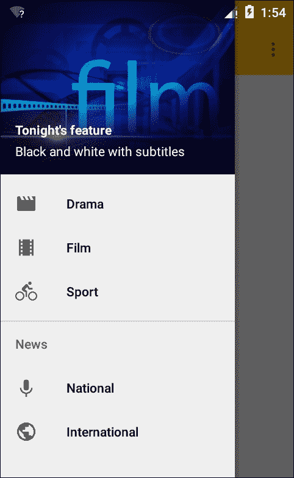

前面的 Java 代码允许我们在设备或模拟器上查看我们的抽屉，但是当选择了一个导航项时，它的作用很小。我们真正需要做的是实际上被带到应用的另一部分。这很容易实现，我们一会儿就来。首先，前面的代码中有一两点需要提及。

以`ActionBarDrawerToggle`开头的一行是导致打开抽屉的汉堡出现在应用栏上的原因，尽管您当然可以从屏幕左侧向内滑动打开它。两个字符串参数`openDrawer`和`closeDrawer`是出于可访问性的原因，为看不清屏幕的用户读出。他们应该说像导航抽屉打开和导航抽屉关闭。两个回调方法`onDrawerOpened()`和`onDrawerClosed()`在这里留空，但是演示了在哪里可以拦截这些事件。

调用`drawerLayout.closeDrawers()`是必不可少的，否则抽屉会一直开着。在这里，我们使用调试器来测试输出，但是理想情况下，我们想要的是菜单引导我们到应用的另一部分。这不是一个困难的任务，也提供了一个很好的机会来介绍 SDK 最有用和最通用的类之一，**片段**。

## 添加片段

从我们目前了解到的情况来看，可以安全地想象，独立的活动将用于具有多个功能的应用，尽管这种情况经常发生，但这可能会消耗大量资源，并且活动总是占据整个屏幕。片段像小型活动一样运行，因为它们同时具有 Java 和 XML 定义以及许多与活动相同的回调和功能。与活动不同，片段不是顶级组件，必须驻留在宿主活动中。这样做的好处是我们每个屏幕可以有不止一个片段。

要了解如何做到这一点，创建一个名为`ContentFragment`的新 Java 类，并按如下方式完成，确保您导入的是`android.support.v4.app.Fragment`而不是标准版本:

```java
public class ContentFragment extends Fragment { 

    @Override 
    public View onCreateView(LayoutInflater inflater, ViewGroup container, Bundle savedInstanceState) { 
        View v = inflater.inflate(R.layout.content,container,false); 
        return v; 
    } 
} 

```

至于 XML 元素，创建一个名为`content.xml`的布局文件，并在其中放置您选择的任何视图和小部件。现在只需要 Java 代码在选择导航项时调用它。

打开`MainActivity.Java`文件，用以下内容替换`switch`语句中的一个调试调用:

```java
ContentFragment fragment = new ContentFragment(); 
android.support.v4.app.FragmentTransaction transaction = getSupportFragmentManager().beginTransaction(); 
transaction.replace(R.id.fragment, fragment); 
transaction.addToBackStack(null); 
transaction.commit(); 

```

我们在这里构建的示例只是为了演示抽屉布局和导航视图的基本构造。显然，要添加任何真正的功能，我们需要为菜单中的每个项目添加一个片段，除非我们这样做，否则行`transaction.addToBackStack(null);`实际上是多余的。它的功能是确保用户访问每个片段的顺序被系统记录，就像它记录使用了哪些活动一样，这样当他们按下 back 键时，他们将返回到前一个片段。没有它，它们将返回到以前的应用，容器活动将被销毁。

## 右手抽屉

作为顶级导航组件，滑动抽屉应该只从左侧滑入，并且应该遵循前面概述的指标。然而，抽屉很容易从右侧滑入，对于许多辅助功能来说，这可能是理想的:

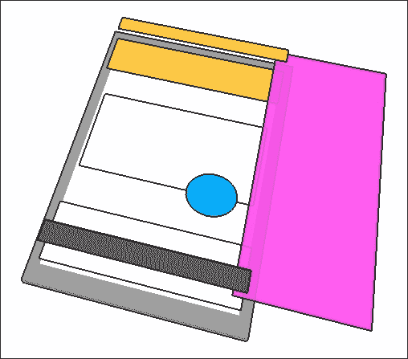

让滑动抽屉从右侧出现只是设置布局重力的问题，例如:

```java
android:layout_gravity="end" 

```

传统的导航视图不应宽于屏幕宽度减去主应用栏的高度，与此不同，右手抽屉可以延伸到整个屏幕。

这一章的全部内容都是关于 UI 设计的，我们没有遇到任何设计模式。我们本可以在这里使用模式，但选择专注于安卓用户界面的机制。我们将在本书后面看到门面模式对于简化复杂菜单或布局的编码有多么有用。

几乎在任何地方都可以引入的一种设计模式是单例。这是因为它几乎可以在任何地方使用，其目的是提供一个对象的全局实例。

# 单例模式

单一模式无疑是最简单的模式，但也是最有争议的模式之一。许多开发人员认为这是完全没有必要的，并且声明一个类为静态的可以执行相同的功能而不会太麻烦。虽然当静态类是更干净的选择时，单例确实被广泛地过度使用，但是肯定有一些时候一个比另一个更好:

*   当您想要对传递给它的变量执行函数时，请使用静态类，例如，计算价格变量的折扣值
*   当您想要一个完整的对象，但只有一个，并且您希望该对象对程序的任何部分都可用时，请使用单例模式，例如，表示当前登录到应用的单个用户的对象

正如您所想象的，单例的类图非常简单，如下图所示:

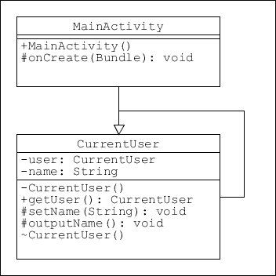

如上图所示，下面的例子将假设我们在任何时候只有一个用户登录到我们的应用，并且我们将创建一个我们可以从代码的任何部分访问的单例对象。

安卓工作室在项目浏览器的**新**菜单下提供了单例创建，所以我们可以从这里开始。这个演示只有两步；它们如下。

1.  将此类添加到您的项目中:

    ```java
    public class CurrentUser { 
        private static final String DEBUG_TAG = "tag"; 
        private String name; 

        // Create instance 
        private static CurrentUser user = new CurrentUser(); 

        // Protect class from being instantiated 
        private CurrentUser() { 
        } 

        // Return only instance of user 
        public static CurrentUser getUser() { 
            return user; 
        } 

        // Set name 
        protected void setName(String n) { 
            name = n; 
        } 

        // Output user name 
        protected void outputName() { 
            Log.d(DEBUG_TAG, name); 
        } 
    } 

    ```

2.  通过向活动添加如下代码来测试模式:

    ```java
    CurrentUser user = CurrentUser.getUser(); 
    user.setName("Singleton Pattern"); 
    user.outputName(); 

    ```

单例可能非常有用，但是很容易不必要地应用它。当任务是异步的时，比如文件系统，当我们想从代码的任何地方访问它的内容时，比如前面例子中的用户名，它非常方便。

# 总结

无论应用的目的是什么，用户都需要一种熟悉的方式来访问它的功能。app-bar 和导航抽屉不仅容易被用户理解，而且提供了极大的灵活性。

在本章中，我们已经看到了如何应用安卓设备上可用的两种最重要的输入机制，以及控制它们外观的材质模式。软件开发工具包，特别是设计库，使得编码这些结构既简单又直观。虽然不同于我们到目前为止遇到的设计模式，但材质模式具有类似的功能，并引导我们走向更好的实践。

下一章将继续探讨布局设计，并探讨我们在将整个布局组合在一起时可以使用的工具，以及我们如何为各种屏幕形状和尺寸进行开发。