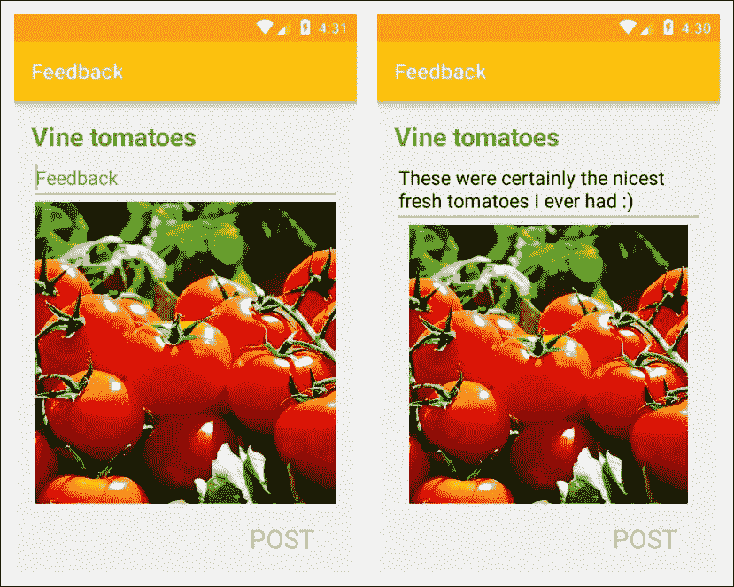
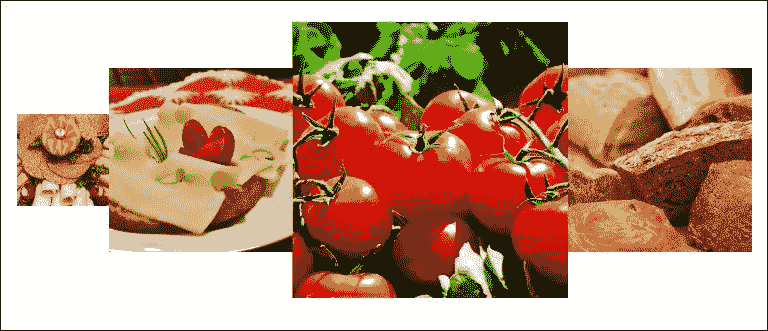
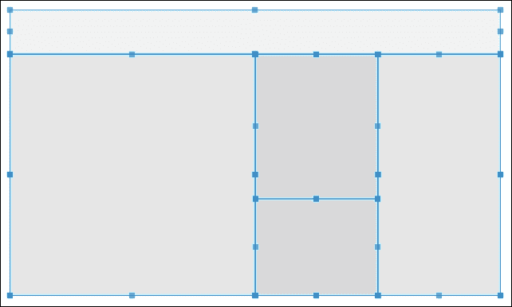
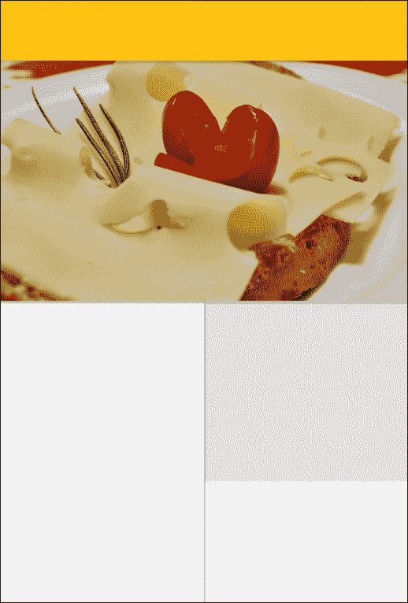
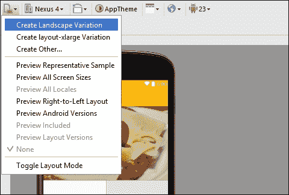
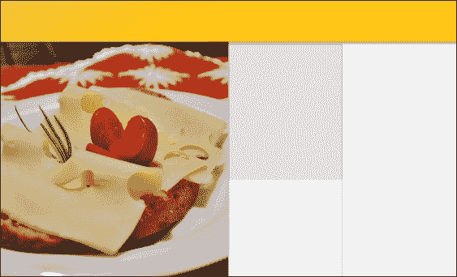
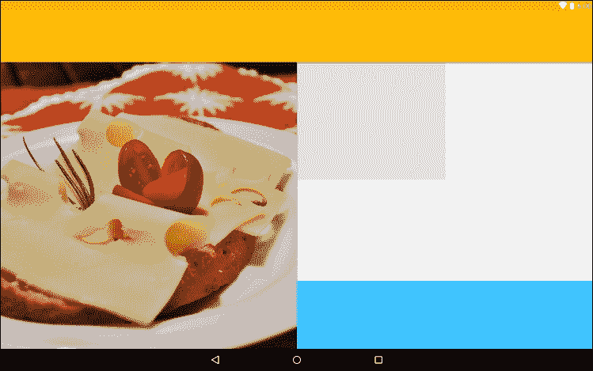
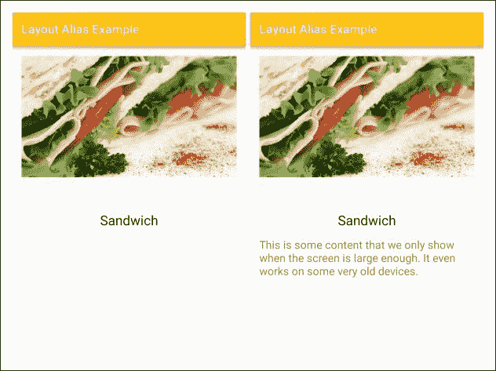
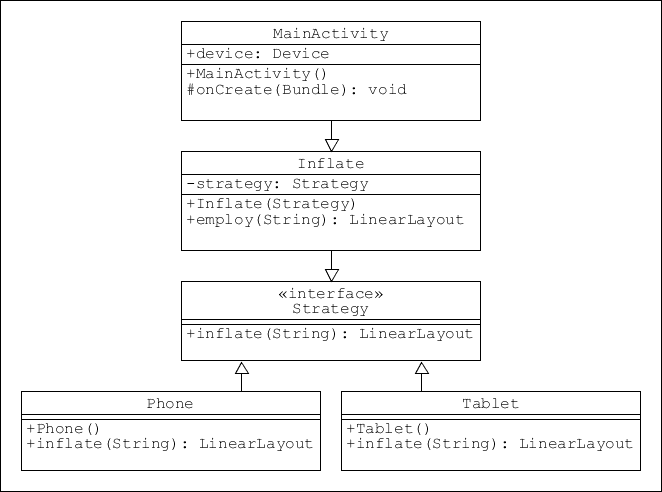
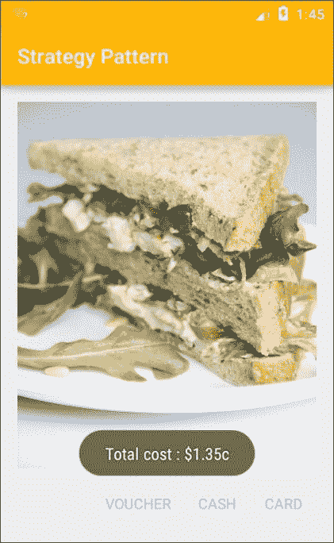

# 第四章。布局模式

在前面的章节中，我们已经了解了用于创建对象的最重要的模式和一些最常用的材料组件。为了将这些结合起来，我们需要考虑应用程序可能需要的整体布局。这使我们能够更详细地规划我们的应用程序，并引入为不同大小的屏幕和方向设计应用程序的有趣挑战。安卓使得开发各种屏幕尺寸和形状变得非常简单和直观，并且只需要最少的额外编码。然后，我们将通过探索和创建一个战略模式来结束。

在本章中，您将学习如何:

*   使用相对和线性布局
*   施加重力和重量
*   用重量总和称量重量
*   使用百分比支持库
*   开发特定屏幕尺寸的布局
*   创建战略模式

Android 平台提供了多种布局类。从非常简单的**框架布局**到支持库提供的非常复杂的布局。到目前为止，最广泛使用和最通用的是线性和相对布局。

# 线性布局

在相对布局和线性布局之间进行选择通常非常简单。如果您的组件在彼此的顶部从一边到另一边排列，那么**线性布局**是显而易见的选择。虽然嵌套视图组是很有可能的，但是对于更复杂的布局，相对版本通常是最好的选择。这很大程度上是因为嵌套布局需要大量资源，应该尽可能避免深层层次结构。**相对布局**可以用来创建大量复杂的布局，几乎不需要嵌套。

无论哪种形式最适合我们的需求，一旦我们开始在不同形状的屏幕上测试我们的布局，甚至将屏幕旋转 90 度，我们很快就会看到，我们在创建具有令人愉悦的比例的组件时投入的所有思想都消失了。通常，这些问题可以通过使用**重力**属性定位元素并用**权重**属性缩放元素来解决。

## 重量和重力

能够设置位置和比例，而不必过度担心确切的屏幕形状，可以为我们节省大量工作。通过设置组件和小部件的权重属性，我们可以确定单个组件占用的屏幕宽度或高度的相对量。当我们希望我们的大部分小部件设置为`wrap_content`时，这尤其有用，这样它们会随着用户的需要而增长，但也希望一个视图占据尽可能多的可用空间。

例如，下面布局中的图像将随着上面文本的增长而适当缩小。



图像视图是唯一应用了权重的视图，其他视图都用`wrap_content`声明了它们的`height`。如这里所示，我们必须在这里将`layout_height`设置为`0dp`，以避免在设置视图高度时出现任何内部冲突:

```java
<ImageView 
    android:id="@+id/feedback_image" 
    android:layout_width="match_parent" 
    android:layout_height="0dp" 
    android:layout_weight="1" 
    android:contentDescription="@string/content_description" 
    android:src="@drawable/tomatoes" /> 

```

### 类型

权重不仅可以应用于单个小部件和视图，还可以应用于视图组和嵌套布局。

自动填充易于更改的屏幕空间非常有用，但是权重可以应用于多个视图，以创建布局，其中每个视图消耗活动的指定相对区域。例如，以下图像用 `1`、`2`、`3`和`2`的权重进行了缩放。



尽管相互嵌套的布局通常是要避免的，但通常值得考虑一到两个层次，因为这可以产生一些非常可行的活动。例如:



这种布局只使用两个嵌套的视图组，使用权重可以使结构在各种各样的形状因素中保持良好的可操作性。当然，这种布局在纵向上看起来很糟糕，但我们会在本章后面看到这个问题是如何解决的。生成这种布局的 XML 如下所示:

```java
<FrameLayout 
    android:layout_width="match_parent" 
    android:layout_height="56dp" /> 

<LinearLayout 
    android:layout_width="match_parent" 
    android:layout_height="match_parent" 
    android:orientation="horizontal"> 

    <FrameLayout 
        android:layout_width="0dp" 
        android:layout_height="match_parent" 
        android:layout_weight="2" /> 

    <LinearLayout 
        android:layout_width="0dp" 
        android:layout_height="match_parent" 
        android:layout_weight="1" 
        android:orientation="vertical"> 

        <FrameLayout 
            android:layout_width="match_parent" 
            android:layout_height="0dp" 
            android:layout_weight="3" /> 

        <FrameLayout 
            android:layout_width="match_parent" 
            android:layout_height="0dp" 
            android:layout_weight="2" /> 

    </LinearLayout> 

    <FrameLayout 
        android:layout_width="0dp" 
        android:layout_height="match_parent" 
        android:layout_weight="1" /> 

</LinearLayout> 

```

上面的例子引出了一个有趣的问题。如果我们不想填满布局的整个宽度或高度，该怎么办？如果我们想要一些空间呢？这很容易通过**加权求和**属性来管理。

要了解权重总和的工作原理，请将以下突出显示的属性添加到前面示例中的内部线性布局定义中:

```java
<LinearLayout 
    android:layout_width="0dp" 
    android:layout_height="match_parent" 
    android:layout_weight="1" 
    android:orientation="vertical" 
    android:weightSum="10"> 

```

通过设置布局的最大权重，内部权重将与此成比例设置。在本例中，`10`的一个`weightSum`将内部权重`3`和`2`设置为布局高度的 3/10 和 2/10，如下所示:

<colgroup><col> <col></colgroup> 
|  |   |
|  |  |

### 类型

请注意，权重和`weightSum`都是浮点属性，使用像这样的线可以获得更高的精度:`android:weightSum="20.5"`。

使用重量是充分利用未知屏幕尺寸和形状的非常有用的方法。管理整个屏幕空间的另一种技术是使用重力来定位组件及其内容。

**重力**属性用于调整视图和/或其内容。在前面给出的示例中，以下标记用于将操作定位在活动的底部:

```java
<TextView 
    android:id="@+id/action_post" 
    android:layout_width="100dp" 
    android:layout_height="wrap_content" 
    android:layout_gravity="right" 
    android:clickable="true" 
    android:padding="16dp" 
    android:text="@string/action_post" 
    android:textColor="@color/colorAccent" 
    android:textSize="24sp" /> 

```

此示例演示了如何使用`layout_gravity`在其容器内调整视图(或视图组)。单个视图的内容也可以通过`gravity`属性定位在该视图中，该属性可以这样设置:

```java
android:layout_gravity="top|left" 

```

将我们的布局按行和列排序可能是考虑屏幕布局的最简单方法，但这不是唯一的方法。**相对布局**提供了一种基于位置而非比例的替代技术。相对布局还允许我们通过使用**百分比支持库**来对其内容进行比例。

# 相对布局

相对布局的最大优势可能是在构建复杂布局时可以减少嵌套视图组的数量。这是通过定义视图的位置来实现的，这些位置是根据它们如何定位以及如何通过属性(如`layout_below`和`layout_toEndOf`)相互对齐来实现的。要了解这是如何实现的，请考虑前面示例中的线性布局。我们可以将其重新创建为没有嵌套视图组的相对布局，如下所示:

```java
<?xml version="1.0" encoding="utf-8"?> 
<RelativeLayout xmlns:android="http://schemas.android.com/apk/res/android" 
    android:layout_width="match_parent" 
    android:layout_height="match_parent"> 

    <FrameLayout 
        android:id="@+id/header" 
        android:layout_width="match_parent" 
        android:layout_height="56dp" 
        android:layout_alignParentTop="true" 
        android:layout_centerHorizontal="true" /> 

    <FrameLayout 
        android:id="@+id/main_panel" 
        android:layout_width="320dp" 
        android:layout_height="match_parent" 
        android:layout_alignParentStart="true" 
        android:layout_below="@+id/header" /> 

    <FrameLayout 
        android:id="@+id/center_column_top" 
        android:layout_width="160dp" 
        android:layout_height="192dp" 
        android:layout_below="@+id/header" 
        android:layout_toEndOf="@+id/main_panel" /> 

    <FrameLayout 
        android:id="@+id/center_column_bottom" 
        android:layout_width="160dp" 
        android:layout_height="match_parent" 
        android:layout_below="@+id/center_column_top" 
        android:layout_toEndOf="@+id/main_panel" /> 

    <FrameLayout 
        android:id="@+id/right_column" 
        android:layout_width="match_parent" 
        android:layout_height="match_parent" 
        android:layout_below="@+id/header" 
        android:layout_toEndOf="@+id/center_column_top" /> 

</RelativeLayout> 

```

尽管这种方法的明显优势是不需要嵌套视图组，但我们必须显式设置单个视图的尺寸，一旦我们在不同的屏幕上预览输出，这些比例很快就会丢失，或者至少会失真。

这个问题的一个解决方案可能是为不同的屏幕配置创建单独的`dimens.xml`文件，但是如果我们想要填充精确百分比的屏幕，那么我们将永远无法在所有可能的设备上保证这一点。幸运的是，安卓提供了一个非常有用的支持库。

## 百分比支持库

在相对布局中，能够为给定的组件定义精确的比例可能是一个问题，因为我们只能真正描述事物的位置，而不是它们在组中的突出位置。幸运的是，百分比库提供了**百分比相对延迟**来解决这个问题。

与其他支持库一样，百分比库必须包含在`build.gradle`文件中:

```java
compile 'com.android.support:percent:23.4.0' 

```

要创建与之前相同的布局，我们将使用以下代码:

```java
<android.support.percent.PercentRelativeLayout xmlns:android="http://schemas.android.com/apk/res/android" 
    xmlns:app="http://schemas.android.com/apk/res-auto" 
    android:layout_width="match_parent" 
    android:layout_height="match_parent"> 

    <FrameLayout 
        android:id="@+id/header" 
        android:layout_width="match_parent" 
        android:layout_height="0dp" 
        android:layout_alignParentTop="true" 
        android:layout_centerHorizontal="true" 
        app:layout_heightPercent="20%" /> 

    <FrameLayout 
        android:id="@+id/main_panel" 
        android:layout_width="0dp" 
        android:layout_height="match_parent" 
        android:layout_alignParentStart="true" 
        android:layout_below="@+id/header" 
        app:layout_widthPercent="50%" /> 

    <FrameLayout 
        android:id="@+id/center_column_top" 
        android:layout_width="0dp" 
        android:layout_height="0dp" 
        android:layout_below="@+id/header" 
        android:layout_toEndOf="@+id/main_panel" 
        app:layout_heightPercent="48%" 
        app:layout_widthPercent="25%" /> 

    <FrameLayout 
        android:id="@+id/center_column_bottom" 
        android:layout_width="0dp" 
        android:layout_height="0dp" 
        android:layout_below="@+id/center_column_top" 
        android:layout_toEndOf="@+id/main_panel" 
        app:layout_heightPercent="32%" 
        app:layout_widthPercent="25%" /> 

    <FrameLayout 
        android:id="@+id/right_column" 
        android:layout_width="0dp" 
        android:layout_height="match_parent" 
        android:layout_below="@+id/header" 
        android:layout_toEndOf="@+id/center_column_top" 
        app:layout_widthPercent="25%" /> 

</android.support.percent.PercentRelativeLayout> 

```

百分比库提供了一种直观简单的方法来创建比例，该比例不会因显示在未经测试的外形上而容易失真。当在具有相同方向的其他设备上测试时，这些模型工作得非常好。然而，一旦我们将这些布局旋转 90 度，我们就可以看到问题。幸运的是，安卓软件开发工具包允许我们重用我们的布局模式，以最少的重新编码创建替代版本。正如我们所料，这是通过创建指定的布局配置来实现的。

# 屏幕旋转

大多数(如果不是全部的话)移动设备允许屏幕重定向。许多应用程序，比如视频播放器，比其他应用程序更适合某个方向。一般来说，我们希望我们的应用程序看起来最好，无论如何旋转。

当从纵向转换为横向或相反时，大多数布局看起来都很糟糕。显然，我们需要为这些情况创造替代方案。幸运的是，我们不必从头开始。要了解这是如何做到的，最好的方法是从像这里这样的标准人像布局开始:



这可以用以下代码重新创建:

```java

    <android.support.percent.PercentRelativeLayout xmlns:android="http://schemas.android.com/apk/res/android" 
    xmlns:app="http://schemas.android.com/apk/res-auto" 
    android:layout_width="match_parent" 
    android:layout_height="match_parent"> 

    <FrameLayout 
        android:id="@+id/header" 
        android:layout_width="match_parent" 
        android:layout_height="0dp" 
        android:layout_alignParentTop="true" 
        android:layout_centerHorizontal="true" 
        android:background="@color/colorPrimary" 
        android:elevation="6dp" 
        app:layout_heightPercent="10%" /> 

    <ImageView 
        android:id="@+id/main_panel" 
        android:layout_width="match_parent" 
        android:layout_height="0dp" 
        android:layout_alignParentStart="true" 
        android:layout_below="@+id/header" 
        android:background="@color/colorAccent" 
        android:contentDescription="@string/image_description" 
        android:elevation="4dp" 
        android:scaleType="centerCrop" 
        android:src="@drawable/cheese" 
        app:layout_heightPercent="40%" /> 

    <FrameLayout 
        android:id="@+id/panel_b" 
        android:layout_width="0dp" 
        android:layout_height="0dp" 
        android:layout_alignParentEnd="true" 
        android:layout_below="@+id/main_panel" 
        android:background="@color/material_grey_300" 
        app:layout_heightPercent="30%" 
        app:layout_widthPercent="50%" /> 

    <FrameLayout 
        android:id="@+id/panel_c" 
        android:layout_width="0dp" 
        android:layout_height="0dp" 
        android:layout_alignParentEnd="true" 
        android:layout_below="@+id/panel_b" 
        android:background="@color/material_grey_100" 
        app:layout_heightPercent="20%" 
        app:layout_widthPercent="50%" /> 

    <FrameLayout 
        android:id="@+id/panel_a" 
        android:layout_width="0dp" 
        android:layout_height="match_parent" 
        android:layout_alignParentStart="true" 
        android:layout_below="@+id/main_panel" 
        android:elevation="4dp" 
        app:layout_widthPercent="50%" /> 

</android.support.percent.PercentRelativeLayout> 

```

同样，一旦旋转，它看起来设计得很差。要创建可接受的横向版本，请在设计模式下查看您的布局，并单击设计面板左上角的配置图标，然后选择**创建横向变体**:



这将在一个文件夹中生成我们文件的副本，每当应用程序发现自己处于横向模式时，就会参考该文件夹的布局定义。该目录位于`res/layout`文件夹旁边，称为`res/layout-land`。现在只需重新排列我们的视图以适应这种新格式，事实上，我们可以使用本章前面的布局，如下所示:

```java
<android.support.percent.PercentRelativeLayout xmlns:android="http://schemas.android.com/apk/res/android" 
    xmlns:app="http://schemas.android.com/apk/res-auto" 
    android:layout_width="match_parent" 
    android:layout_height="match_parent"> 

    <FrameLayout 
        android:id="@+id/header" 
        android:layout_width="match_parent" 
        android:layout_height="0dp" 
        android:layout_alignParentTop="true" 
        android:layout_centerHorizontal="true" 
        android:background="@color/colorPrimary" 
        android:elevation="6dp" 
        app:layout_heightPercent="15%" /> 

    <ImageView 
        android:id="@+id/main_panel" 
        android:layout_width="0dp" 
        android:layout_height="match_parent" 
        android:layout_alignParentStart="true" 
        android:layout_below="@+id/header" 
        android:background="@color/colorAccent" 
        android:contentDescription="@string/image_description" 
        android:elevation="4dp" 
        android:scaleType="centerCrop" 
        android:src="@drawable/cheese" 
        app:layout_widthPercent="50%" /> 

    <FrameLayout 
        android:id="@+id/panel_a" 
        android:layout_width="0dp" 
        android:layout_height="0dp" 
        android:layout_below="@+id/header" 
        android:layout_toRightOf="@id/main_panel" 
        android:background="@color/material_grey_300" 
        app:layout_heightPercent="50%" 
        app:layout_widthPercent="25%" /> 

    <FrameLayout 
        android:id="@+id/panel_b" 
        android:layout_width="0dp" 
        android:layout_height="0dp" 
        android:layout_below="@+id/panel_a" 
        android:layout_toRightOf="@id/main_panel" 
        android:background="@color/material_grey_100" 
        app:layout_heightPercent="35%" 
        app:layout_widthPercent="25%" /> 

    <FrameLayout 
        android:id="@+id/panel_c" 
        android:layout_width="0dp" 
        android:layout_height="match_parent" 
        android:layout_alignParentEnd="true" 
        android:layout_below="@+id/header" 
        android:elevation="4dp" 
        app:layout_widthPercent="25%" /> 

</android.support.percent.PercentRelativeLayout> 

```



应用这些更改并创建景观布局只需要几秒钟，但我们在这里还可以做更多。特别是，我们可以创建专为大屏幕和平板电脑设计的布局。

# 大屏幕布局

当我们从配置菜单中创建布局的横向版本时，您无疑会注意到**创建布局-xlarge** **版本**选项，正如您所想象的，该选项用于创建适合平板电脑甚至电视大屏幕的布局。

如果您选择此选项，您将立即看到我们对百分比库的明智使用产生了一个相同的布局，并且很容易觉得这种布局是不必要的，但这将会错过要点。像 10 英寸平板电脑这样的设备提供了更多的空间，我们不应该只是扩大我们的布局，我们应该利用这个机会提供更多的内容。

在这个例子中，我们将为 xlarge 版本添加一个额外的帧。这可以通过添加以下 XML 并调整其他一些视图的高度百分比值来轻松完成:

```java
<FrameLayout 
    android:id="@+id/panel_d" 
    android:layout_width="0dp" 
    android:layout_height="0dp" 
    android:layout_alignParentEnd="true" 
    android:layout_below="@+id/panel_c" 
    android:background="@color/colorAccent" 
    android:elevation="4dp" 
    app:layout_heightPercent="30%" 
    app:layout_widthPercent="50%" /> 

```



除了充分利用大屏幕，我们还可以通过`small`限定符实现小屏幕的相反效果。这对于优化小屏幕的布局非常有用，因为它可以使元素变得更小，甚至删除不太重要的内容。

我们在这里看到的限定词非常有用，但它们仍然非常广泛。根据设备分辨率的不同，我们可以很容易地发现同样的布局适用于大型手机和小型平板电脑。幸运的是，该框架为我们在定义布局时提供了一种更精确的方法。

## 宽度限定符

作为开发人员，我们花费大量的时间和精力来寻找和创造出色的图像和其他媒体。重要的是，我们要公正地完成这项工作，并确保它得到最好的展示。想象一下，你有一个值得至少 720 像素的布局，最好的欣赏。在这种情况下，我们可以做两件事。

首先，我们可以确保我们的应用程序仅在至少具有我们期望的屏幕分辨率的设备上可用，这可以通过编辑`AndroidManifest`文件，在`manifest`元素中添加以下标签来实现:

```java
 <supports-screens android:requiresSmallestWidthDp="720" /> 

```

通常，让小屏幕用户无法使用我们的应用程序是一种耻辱，我们这样做的次数很少。为大屏幕电视或精确照片编辑设计的应用程序可能是个例外。更多的时候，我们宁愿创建布局来适应尽可能多的屏幕尺寸，这就引出了我们的第二个选择。

安卓平台允许我们根据**最小和可用宽度**等像素标准为特定屏幕尺寸设计布局。无论朝向如何，我们所说的*最小值*是指两个屏幕尺寸中最窄的一个。对于大多数设备，这意味着在纵向模式下观看时的宽度和在横向模式下观看时的高度。使用*可用的*宽度提供了另一个级别的灵活性，因为宽度是根据屏幕的方向来测量的，允许我们设计一些非常具体的布局。根据最小宽度优化布局非常简单，并且像以前一样使用限定符。所以一个名为:

```java
res/layout-sw720dp/activity_main.xml 

```

将取代

```java
res/layout/activity_main.xml 

```

在最短边为 720 dp 或更大的设备上。

当然，我们可以创建任意大小的文件夹，例如`res/layout-sw600dp`。

这种技术非常适合设计大屏幕布局，而不管方向如何。然而，根据器件在任何给定时刻的取向，根据表观宽度来设计布局可能非常有用。这是通过指定目录以类似的方式实现的。要设计可用宽度，请使用:

```java
res/layout-w720dp 

```

要优化可用高度，请使用:

```java
res/layout-h720dp 

```

这些限定符为确保我们的设计充分利用可用硬件提供了非常有用的技术，但是如果我们想为运行安卓 3.1 或更低版本的设备开发，这就有一个小小的缺点。在这些设备上，最小和可用宽度限定符不可用，我们必须使用`large`和`xlarge`限定符。这可能会导致两个相同的布局，浪费空间并增加我们的维护成本。谢天谢地，有一种方法可以解决这个问题，那就是布局别名。

## 布局别名

为了演示布局别名如何工作，我们将想象一个简单的情况，其中我们只有两个布局，我们的默认`activity_main.xml`文件只有两个视图，第二个布局我们将称为`activity_main_large.xml` ，它将有三个视图来利用更大的屏幕。要了解如何做到这一点，请遵循以下步骤:

1.  打开`activity_main`文件，提供这两个视图:

    ```java
    <ImageView 
        android:id="@+id/image_view" 
        android:layout_width="match_parent" 
        android:layout_height="256dp" 
        android:layout_alignParentLeft="true" 
        android:layout_alignParentStart="true" 
        android:layout_alignParentTop="true" 
        android:contentDescription="@string/content_description" 
        android:scaleType="fitStart" 
        android:src="@drawable/sandwich" /> 

    <TextView 
        android:id="@+id/text_view" 
        android:layout_width="wrap_content" 
        android:layout_height="wrap_content" 
        android:layout_below="@+id/image_view" 
        android:layout_centerHorizontal="true" 
        android:layout_centerVertical="true" 
        android:text="@string/text_value" 
        android:textAppearance="?android:attr/textAppearanceLarge" /> 

    ```

2.  复制这个文件，称之为`activity_main_large`，并添加以下视图:

    ```java
    <TextView 
        android:id="@+id/text_view2" 
        android:layout_width="wrap_content" 
        android:layout_height="wrap_content" 
        android:layout_alignParentEnd="true" 
        android:layout_alignParentRight="true" 
        android:layout_below="@+id/text_view" 
        android:layout_marginTop="16dp" 
        android:text="@string/extra_text" 
        android:textAppearance="?android:attr/textAppearanceMedium" /> 

    ```

    ```java
    <ImageView 
        android:id="@+id/image_view" 
        android:layout_width="match_parent" 
        android:layout_height="256dp" 
        android:layout_alignParentLeft="true" 
        android:layout_alignParentStart="true" 
        android:layout_alignParentTop="true" 
        android:contentDescription="@string/content_description" 
        android:scaleType="fitStart" 
        android:src="@drawable/sandwich" /> 

    <TextView 
        android:id="@+id/text_view" 
        android:layout_width="wrap_content" 
        android:layout_height="wrap_content" 
        android:layout_below="@+id/image_view" 
        android:layout_centerHorizontal="true" 
        android:layout_centerVertical="true" 
        android:text="@string/text_value" 
        android:textAppearance="?android:attr/textAppearanceLarge" /> 

    ```

3.  创建两个名为`res/values-large` 和`res/values-sw720dp`的**新|安卓资源目录**。
4.  在`values-large`文件夹中，创建一个名为`layout.xml`的文件，并像这样完成:

    ```java
    <resources> 
        <item name="main" type="layout">@layout/activity_main_large</item> 
    </resources> 

    ```

5.  Finally, create an identical file in the `values-sw720dp` folder:

    

以这种方式使用布局别名意味着我们只需要创建一个大布局，它将应用于更大的屏幕，而不管设备运行的是哪个安卓平台。

在这个例子中，我们选择`720dp`作为我们的阈值。在大多数情况下，这将针对 10 英寸或更大的平板电脑。如果我们想让我们的大布局在大多数 7 英寸平板电脑和大手机上运行，我们会使用`600dp`，我们当然可以选择任何适合我们目的的值。

### 类型

在一些非常罕见的情况下，我们可能希望将应用程序限制为仅支持横向或纵向。这可以通过在清单文件的活动标签中添加`android:screenOrientation="portrait"`或`android:screenOrientation="landscape"`来实现。

### 注

一般来说，我们应该为手机、7 英寸平板电脑和 10 英寸平板电脑创建横向和纵向布局。

设计吸引人和直观的布局是我们作为开发人员面临的最重要的任务之一，这里介绍的快捷方式大大减少了我们必须做的工作量，使我们能够专注于设计有吸引力的应用程序。

和上一章一样，我们集中讨论了更实际的布局结构问题，这当然是进一步发展的前提。然而，有很多模式需要我们去熟悉，我们越早熟悉它们越好，我们越有可能识别出从应用模式中受益的结构。一旦这种模式可以应用于像本章中所探讨的那些情况，策略设计模式就出现了。

# 战略格局

策略模式是另一种广泛使用且非常有用的模式。它的美在于它的多功能性，因为它可以应用于许多情况。它的目的是在运行时为给定的问题提供一系列解决方案(策略)。一个很好的例子是一个应用程序，它有一个运行不同代码的策略，这取决于该应用程序是安装在 Windows、Mac OS 还是 Linux 上。如果我们上面用来为不同设备设计用户界面的指定系统如此高效，我们可以很容易地使用策略模式来执行这项任务。它看起来像这样:



现在，我们将向前迈一步，想象一下三明治制作应用程序的用户准备付费的情况。我们将假设三种方法:信用卡、现金和优惠券。那些支付现金的人只会支付设定的价格。有点不公平的是，那些用卡支付的人会被收取少量费用，那些有优惠券的人会得到 10%的折扣。在应用这些策略之前，我们还将使用单例来表示基本价格。按照以下步骤设置策略模式:

1.  我们通常从一个界面开始:

    ```java
    public interface Strategy { 

        String processPayment(float price); 
    } 

    ```

2.  接下来，创建这个接口的具体实现，比如:

    ```java
    public class Cash implements Strategy{ 

        @Override 
        public String processPayment(float price) { 

            return String.format("%.2f", price); 
        } 
    } 

    public class Card implements Strategy{ 
       ... 
            return String.format("%.2f", price + 0.25f); 
       ... 
    } 

    public class Coupon implements Strategy{ 
        ... 
            return String.format("%.2f", price * 0.9f); 
        ... 
    } 

    ```

3.  现在添加以下类:

    ```java
    public class Payment { 
        // Provide context for strategies 

        private Strategy strategy; 

        public Payment(Strategy strategy) { 
            this.strategy = strategy; 
        } 

        public String employStrategy(float f) { 
            return strategy.processPayment(f); 
        } 
    } 

    ```

4.  最后，添加将提供我们基本价格的 singleton 类:

    ```java
    public class BasicPrice { 
        private static BasicPrice basicPrice = new BasicPrice(); 
        private float price; 

        // Prevent more than one copy 
        private BasicPrice() { 
        } 

        // Return only instance 
        public static BasicPrice getInstance() { 
            return basicPrice; 
        } 

        protected float getPrice() { 
            return price; 
        } 

        protected void setPrice(float v) { 
            price = v; 
        } 
    } 

    ```

这就是我们创建模式所需要做的一切。之所以使用单一实例，是因为当前三明治的价格只需要有一个实例，并且可以从代码中的任何地方获得。在我们构建用户界面和测试我们的模式之前，让我们快速看一下策略类图:


从图中我们可以看到活动包含一个`onClick()`回调。在我们看到这是如何工作之前，我们需要创建一个带有三个操作按钮的布局来测试我们的三个支付选项。按照以下步骤实现:

1.  创建一个以水平线性布局为根的布局文件。
2.  添加以下视图和内部布局:

    ```java
    <ImageView 
        android:id="@+id/image_view" 
        android:layout_width="match_parent" 
        android:layout_height="0dp" 
        android:layout_weight="1" 
        android:scaleType="centerCrop" 
        android:src="@drawable/logo" /> 

    <RelativeLayout 
        android:layout_width="match_parent" 
        android:layout_height="wrap_content" 
        android:orientation="horizontal" 
        android:paddingTop="@dimen/layout_paddingTop"> 

    </RelativeLayout> 

    ```

3.  现在向相对布局添加按钮。前两个看起来是这样的:

    ```java
    <Button 
        android:id="@+id/action_card" 
        style="?attr/borderlessButtonStyle" 
        android:layout_width="wrap_content" 
        android:layout_height="wrap_content" 
        android:layout_alignParentEnd="true" 
        android:layout_gravity="end" 
        android:gravity="center_horizontal" 
        android:minWidth="@dimen/action_minWidth" 
        android:padding="@dimen/padding" 
        android:text="@string/card" 
        android:textColor="@color/colorAccent" /> 

    <Button 
        android:id="@+id/action_cash" 
        style="?attr/borderlessButtonStyle" 
        android:layout_width="wrap_content" 
        android:layout_height="wrap_content" 
        android:layout_gravity="end" 
        android:layout_toStartOf="@id/action_card" 
        android:gravity="center_horizontal" 
        android:minWidth="@dimen/action_minWidth" 
        android:padding="@dimen/padding" 
        android:text="@string/cash" 
        android:textColor="@color/colorAccent" /> 

    ```

4.  第三个与第二个相同，但有以下例外:

    ```java
    <Button 
        android:id="@+id/action_coupon" 
        ... 
        android:layout_toStartOf="@id/action_cash" 
        ... 
        android:text="@string/voucher" 
        ... /> 

    ```

5.  现在打开 Java 活动文件扩展它，使它实现这个监听器:

    ```java
    public class MainActivity extends AppCompatActivity implements View.OnClickListener 

    ```

6.  接下来添加以下字段:

    ```java
    public BasicPrice basicPrice = BasicPrice.getInstance(); 

    ```

7.  在`onCreate()`方法中包含这些行:

    ```java
    // Instantiate action views 
    Button actionCash = (TextView) findViewById(R.id.action_cash); 
    Button actionCard = (TextView) findViewById(R.id.action_card); 
    Button actionCoupon = (TextView) findViewById(R.id.action_coupon); 

    // Connect to local click listener 
    actionCash.setOnClickListener(this); 
    actionCard.setOnClickListener(this); 
    actionCoupon.setOnClickListener(this); 

    // Simulate price calculation 
    basicPrice.setPrice(1.5f); 

    ```

8.  最后添加`onClick()`方法，像这样:

    ```java
        @Override 
        public void onClick(View view) { 
            Payment payment; 

            switch (view.getId()) { 

                case R.id.action_card: 
                    payment = new Payment(new Card()); 
                    break; 

                case R.id.action_coupon: 
                    payment = new Payment(new Coupon()); 
                    break; 

                default: 
                    payment = new Payment((new Cash())); 
                    break; 
            } 

            // Output price 
            String price = new StringBuilder() 
                    .append("Total cost : $") 
                    .append(payment.employStrategy(basicPrice.getPrice())) 
                    .append("c") 
                    .toString(); 

            Toast toast = Toast.makeText(this, price, Toast.LENGTH_LONG); 
            toast.show(); 
        } 

    ```

我们现在可以在设备或仿真器上测试我们的输出:



策略模式可以应用于许多情况，当你开发几乎任何软件时，你会遇到它可以一次又一次应用的情况。我们肯定会回到这里。希望现在介绍它将帮助您发现可以利用它的情况。

# 总结

在这一章中，我们已经看到了如何最大限度地利用安卓布局。这涉及到决定哪种布局类型用于哪种目的，尽管还有许多其他布局，但线性和相对布局为许多可能的布局提供了功能和灵活性。一旦选择了布局，我们就可以使用重量和重力属性来组织空间。通过使用百分比库和百分比相对布局，为各种可能的屏幕尺寸设计布局的过程得到了极大的帮助。

开发人员在为大量现实世界设备设计安卓布局时面临的最大挑战是，我们的应用程序可能会在这些设备上运行。幸运的是，资源指定的使用使这变得轻而易举。

有了一个可行的布局，我们可以继续研究如何利用这个空间来显示一些有用的信息。这将带我们了解回收视图如何管理列表及其数据，我们将在下一章中进行介绍。