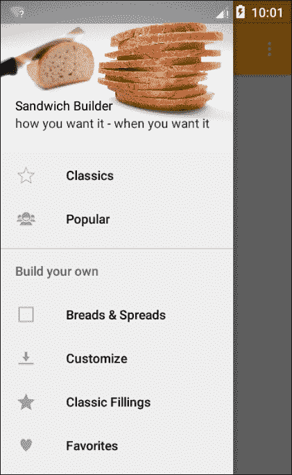
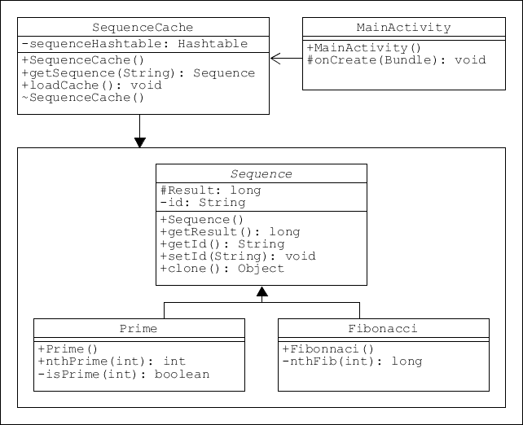
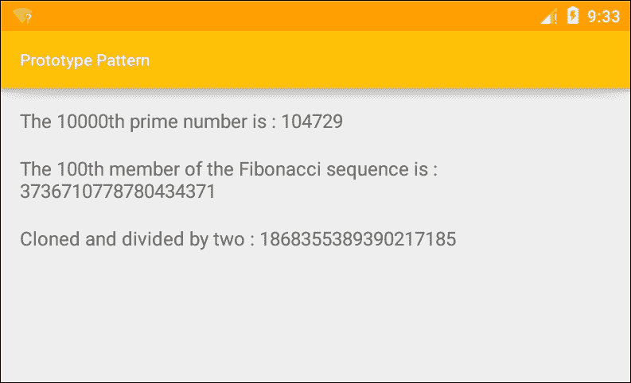
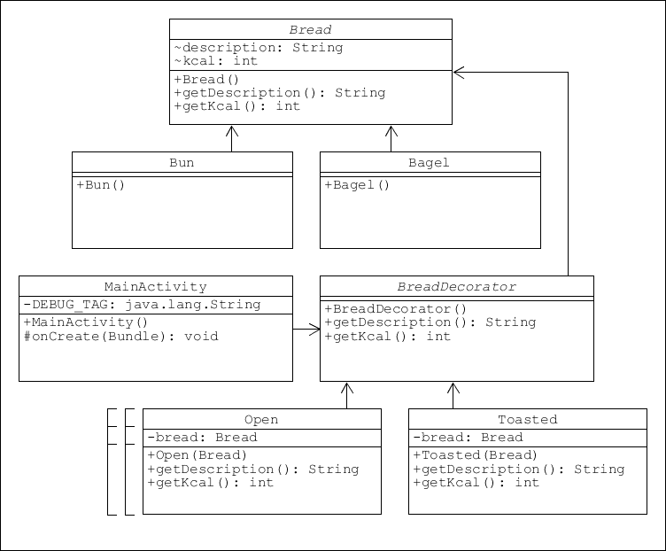
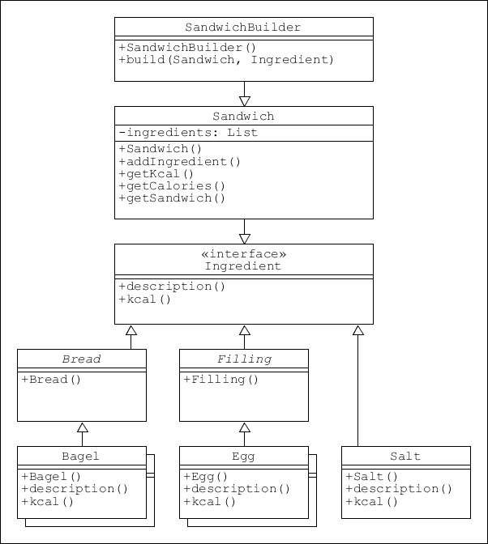
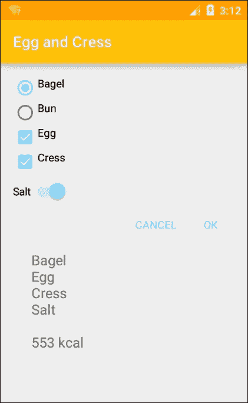
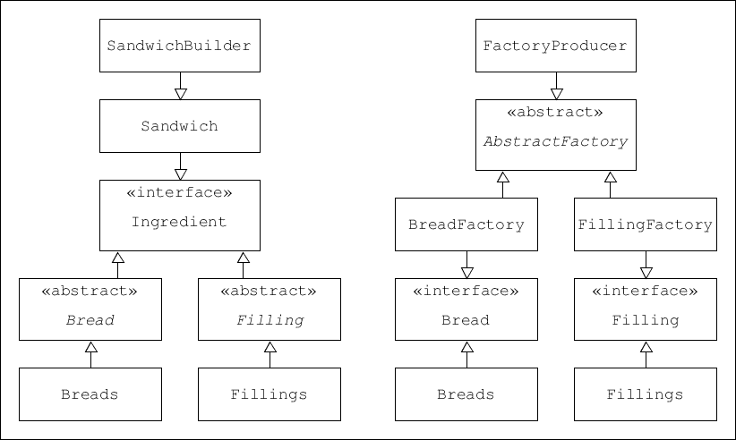
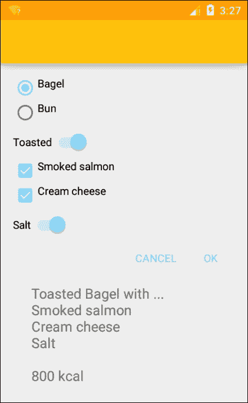
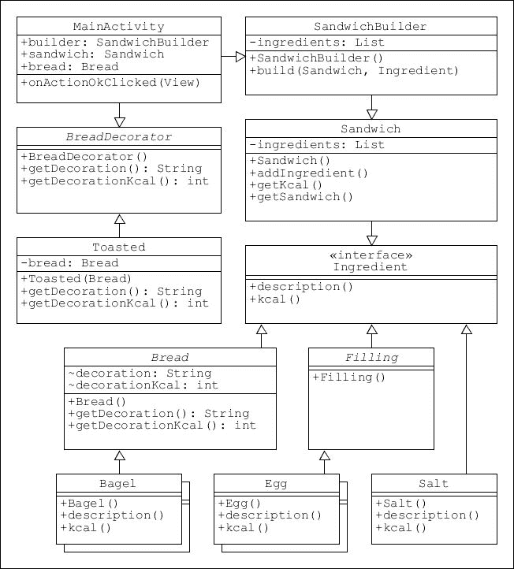
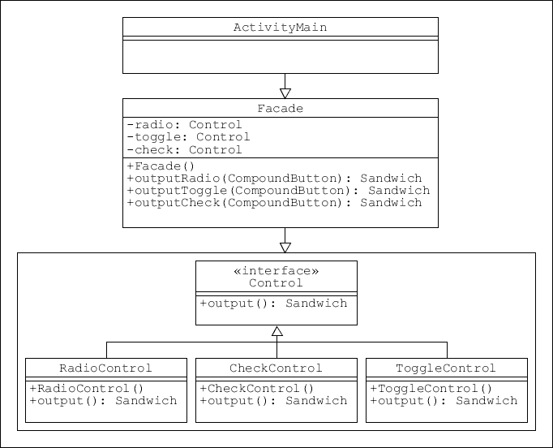

# 第七章。组合模式

我们已经看到了模式如何帮助我们组织代码，以及如何将其具体应用于安卓应用程序，但我们一次只应用了一个模式。随着我们需要执行的任务变得越来越复杂，我们将需要一次性应用几个模式，例如装饰者和构建者，甚至将它们组合成**混合模式**，这就是我们在本章中要做的。

我们将从考虑更复杂的用户界面及其背后的代码开始。这将要求我们更精确地思考我们实际上希望我们的应用程序做什么。这反过来又会让我们看到**原型模式**，它为从原始的、克隆的对象创建对象提供了一种非常有效的方法。

接下来将探索**装饰器模式**，我们将看到如何使用它来为现有的类添加额外的功能。装饰器通常被称为包装器，用于向现有代码提供附加功能。这对我们的三明治构建器应用程序特别有用，因为它允许我们包括一些选项，如点一个开放的三明治或烘烤面包。这些本身不是配料，但却是三明治小贩希望提供的东西。装饰器模式非常适合这项任务。

简单地看了一下备选方案后，我们构建了一个构建器模式来形成我们系统的基础，将它连接到一个用户界面，这样用户就可以将一个简单的三明治(有多种选项和配料可供选择)放在一起。然后，我们将装饰器连接到这个构建器，以提供进一步的选项。

在本章中，您将学习如何执行以下操作:

*   创建原型模式
*   创建装饰器模式
*   扩展装饰器
*   将生成器连接到用户界面
*   管理复合按钮
*   组合模式

我们现在可以开始更多地考虑我们的应用程序的细节，以及它可以做什么和应该做什么。我们需要考虑潜在客户，设计一些简单易用的东西。功能需要易于访问，并且本质上是显而易见的，最重要的是，它们需要能够以最少的点击次数构建所需的三明治。稍后，我们将看到用户如何存储收藏夹，以及我们如何提供部分构建的三明治供用户定制，而不是从头构建。现在，我们将看看如何对我们的三明治相关对象和类进行分类。

# 概述规格

在前一章中，我们使用工厂模式创建了一个简单的三明治配料对象列表，并将其连接到布局。然而，我们只表示了一种类型的填充。在我们可以创建一个更复杂的系统之前，我们需要规划我们的数据结构，为此，我们需要考虑我们向用户呈现的选择。

首先，我们可以向用户提供哪些选项来使流程变得简单、有趣和直观？以下是潜在用户可能希望从这类应用程序中获得的功能列表:

*   订购现成的三明治，无需定制
*   定制现成的三明治
*   从一些基本的成分开始，并在此基础上构建
*   订购或定制他们以前吃过的三明治
*   从头开始做三明治
*   随时查看和编辑他们的三明治

以前，我们为奶酪创建了一个单独的菜单，但每种食物类型的分类可能会提供一个笨拙的解决方案:想要培根、生菜和番茄三明治的用户可能必须访问三个单独的菜单。我们有许多不同的方法可以解决这个问题，这在很大程度上是个人选择的问题。在这里，我们将尝试遵循我们为自己制作三明治时可能会采取的方法，可以通过以下列表进行描述:

1.  面包
2.  黄油
3.  充填料
4.  浇头

我所说的浇头是指蛋黄酱、胡椒、芥末等等。我们将使用这些类别作为我们班级结构的基础。如果它们都属于同一个类类型就好了，但是有一两个细微的区别禁止这样做:

**面包**:没有面包没人会点三明治；它不会是三明治，我们会被原谅认为它可以像任何其他成分一样被对待。然而，我们将提供一个开放的三明治的选择，并且为我们自己使事情复杂化，让它烘烤的选择。

**黄油**:同样，很容易认为添加黄油是不言而喻的，但有些顾客会想要低脂涂抹酱，甚至根本不要。幸运的是，有一种模式非常适合这个目的:装饰器模式。

**填充和浇头**:虽然这些类可以非常容易地共享相同的属性和实例，如果两者都从同一个类扩展，我们将分别对待它们，因为这将使构建菜单更加清晰。

有了这些规范，我们可以开始考虑顶级菜单的外观。我们将使用滑动抽屉导航视图，并提供以下选项:



这让我们大致了解了我们的目标。使用模式的一个优点是，它们可以很容易地被修改，这意味着我们可以采取更直观的开发方法，因为即使是大规模的更改也往往只需要编辑最少的代码。

我们的下一步是为概述的任务选择一个合适的模式。我们熟悉工厂和建筑商，也熟悉他们如何完成我们想要的，但是还有另一种创造模式，原型，它也非常方便，虽然我们不会在这种情况下使用它，但有时我们会，当然有时你会。

# 原型图案

原型设计模式执行类似于其他创造模式的任务，比如建造者和工厂，但是它采用了非常不同的方法。顾名思义，原型并不严重依赖大量硬编码的子类，而是从原始类复制而来，大大减少了所需子类的数量和任何冗长的创建过程。

## 建立原型

当创建一个实例在某种程度上很昂贵时，原型是最有用的。这可能是一个大文件的加载，一个数据库的详细的交叉检查，或者一些其他的计算开销很大的操作。此外，它允许我们将克隆的对象从它们的原始对象中分离出来，允许我们进行修改，而不必每次都重新实例化。在下面的例子中，我们将使用第 n 个质数和第 n 个斐波那契数来演示这一点。

从图表上看，我们的原型如下所示:



我们不需要在我们的主应用程序原型模式，因为有非常少的昂贵的创作。然而，它在许多情况下至关重要，不应被忽视。按照以下步骤应用原型模式:

1.  我们将从以下抽象类开始:

    ```java
    public abstract class Sequence implements Cloneable { 
        protected long result; 
        private String id; 

        public long getResult() { 
            return result; 
        } 

        public String getId() { 
            return id; 
        } 

        public void setId(String id) { 
            this.id = id; 
        } 

        public Object clone() { 
            Object clone = null; 

            try { 
                clone = super.clone(); 

            } catch (CloneNotSupportedException e) { 
                e.printStackTrace(); 
            } 

            return clone; 
        } 
    } 

    ```

2.  接下来，添加这个可克隆的具体类:

    ```java
    // Calculates the 10,000th prime number 
    public class Prime extends Sequence { 

        public Prime() { 
            result = nthPrime(10000); 
        } 

        public static int nthPrime(int n) { 
            int i, count; 

            for (i = 2, count = 0; count < n; ++i) { 
                if (isPrime(i)) { 
                    ++count; 
                } 
            } 

            return i - 1; 
        } 

        // Test for prime number 
        private static boolean isPrime(int n) { 

            for (int i = 2; i < n; ++i) { 
                if (n % i == 0) { 
                    return false; 
                } 
            } 

            return true; 
        } 
    } 

    ```

3.  添加另一个`Sequence`类，用于斐波那契数，比如:

    ```java
    // Calculates the 100th Fibonacci number 
    public class Fibonacci extends Sequence { 

        public Fibonacci() { 
            result = nthFib(100); 
        } 

        private static long nthFib(int n) { 
            long f = 0; 
            long g = 1; 

            for (int i = 1; i <= n; i++) { 
                f = f + g; 
                g = f - g; 
            } 

            return f; 
        } 
    } 

    ```

4.  接下来，创建缓存类，如下所示:

    ```java
    public class SequenceCache { 
       private static Hashtable<String, Sequence> sequenceHashtable = new Hashtable<String, Sequence>(); 

        public static Sequence getSequence(String sequenceId) { 

            Sequence cachedSequence = sequenceHashtable.get(sequenceId); 
            return (Sequence) cachedSequence.clone(); 
        } 

            public static void loadCache() { 

            Prime prime = new Prime(); 
            prime.setId("1"); 
            sequenceHashtable.put(prime.getId(), prime); 

            Fibonacci fib = new Fibonacci(); 
            fib.setId("2"); 
            sequenceHashtable.put(fib.getId(), fib); 
        } 
    } 

    ```

5.  向布局中添加三个文本视图，然后将代码添加到 MainActivity 的`onCreate()`方法中。
6.  将这些行添加到客户端代码中:

    ```java
    // Load the cache once only 
    SequenceCache.loadCache(); 

    // Lengthy calculation and display of prime result 
    Sequence prime = (Sequence) SequenceCache.getSequence("1"); 
    primeText.setText(new StringBuilder() 
            .append(getString(R.string.prime_text)) 
            .append(prime.getResult()) 
            .toString()); 

    // Lengthy calculation and display of Fibonacci result 
    SSequence fib = (Sequence) SequenceCache.getSequence("2"); 
    fibText.setText(new StringBuilder() 
            .append(getString(R.string.fib_text)) 
            .append(fib.getResult()) 
            .toString()); 

    ```

如您所见，前面的代码创建了模式，但没有演示它。一旦加载，缓存可以创建我们以前昂贵的输出的即时副本。此外，我们可以修改副本，当我们有一个复杂的对象并且只想修改一两个属性时，使原型非常有用。

## 应用原型

考虑一个详细的用户档案，比如你可能在社交媒体网站上找到的。用户修改图像和文本等细节，但所有配置文件的整体结构都是相同的，这使它成为原型模式的理想候选。

要将这一原则付诸实践，请在客户端源代码中包含以下代码:

```java
// Create a clone of already constructed object 
Sequence clone = (Fibonacci) new Fibonacci().clone(); 

// Modify the resultlong result = clone.getResult() / 2; 

// Display the result quickly 
cloneText.setText(new StringBuilder()        .append(getString(R.string.clone_text))        .append(result)        .toString());
```



原型是一个非常有用的模式，在许多情况下，我们有昂贵的对象要创建，或者当我们面临子类的激增。然而，这不是唯一有助于减少过度子类化的模式，这将我们引向另一种设计模式:**装饰器**。

# 装饰师设计模式

不管对象创建费用如何，仍然有一些时候，我们模型的本质将需要不合理数量的子类，这就是装饰器非常方便的地方。

以我们三明治应用程序中的面包为例。我们想提供几种类型的面包，但除此之外，我们还想提供面包烘烤、三明治打开和涂抹酱的选择。通过为每种面包类型创建烘烤和开放的版本，这个项目很快就会变得难以管理。装饰器允许我们在运行时向对象添加功能和属性，而不必对原始类结构进行任何更改。

## 设置装饰师

有人可能会认为像*烘烤*和*开放*这样的属性可以作为*面包*类的一部分，但是这本身会导致代码越来越笨拙。说我们要*面包*和*馅料*从同一个阶层继承，说*配料*。这将是有意义的，因为它们有共同的属性，如价格和热值，我们希望它们都通过相同的布局结构显示。然而，烘烤和涂抹等特性在用于馅料时没有意义，这将导致冗余。

装饰者解决了这两个问题。要了解如何应用它，请执行以下步骤:

1.  首先创建这个抽象类来表示所有面包:

    ```java
    public abstract class Bread { 
        String description; 
        int kcal; 

        public String getDescription() { 
            return description; 
        } 

        public int getKcal() { 
            return kcal; 
        } 
    } 

    ```

2.  接下来，创建具体的实例，如:

    ```java
    public class Bagel extends Bread { 

        public Bagel() { 
            description = "Bagel"; 
            kcal = 250; 
        } 
    } 

    public class Bun extends Bread { 

        public Bun() { 
            description = "Bun"; 
            kcal = 150; 
        } 
    } 

    ```

3.  现在我们需要一个抽象装饰器。看起来是这样的:

    ```java
    // All bread treatments extend from this 
    public abstract class BreadDecorator extends Bread { 

        public abstract String getDescription(); 

        public abstract int getKcal(); 
    } 

    ```

4.  我们需要这个装饰器的四个扩展来代表两种类型的涂抹酱以及开放的和烘烤的三明治。首先，`Butter`装饰师:

    ```java
    public class Butter extends BreadDecorator { 
        private Bread bread; 

    public Butter(Bread bread) { 
            this.bread = bread; 
        } 

        @Override 
        public String getDescription() { 
            return bread.getDescription() + " Butter"; 
        } 

        @Override 
        public int getKcal() { 
            return bread.getKcal() + 50; 
        } 
    } 

    ```

5.  在其他三个类中，只有 getters 返回的值不同。它们如下:

    ```java
    public class LowFatSpread extends BreadDecorator { 

            return bread.getDescription() + " Low fat spread"; 

            return bread.getKcal() + 25; 
    } 

    public class Toasted extends BreadDecorator { 

            return bread.getDescription() + " Toasted"; 

            return bread.getKcal() + 0; 
    } 

    public class Open extends BreadDecorator { 

            return bread.getDescription() + " Open"; 

            return bread.getKcal() / 2; 
    } 

    ```

这就是建立我们的装饰器模式所需要的全部内容。我们现在需要做的就是把它连接到某种工作接口上。稍后，我们将使用菜单选择面包，然后使用对话框添加*装饰*。

## 应用装饰器

用户将不得不在黄油和低脂涂抹酱之间进行选择(尽管可以通过添加另一个装饰器来包含一个*无涂抹酱*选项)，但是可以选择将其三明治烘烤并打开。

现在，我们将使用调试器通过在管理活动的`onCreate()`方法中添加如下行来测试各种组合。请注意对象是如何链接的:

```java
Bread bagel = new Bagel(); 

LowFatSpread spread = new LowFatSpread(bagel); 

Toasted toast = new Toasted(spread); 

Open open = new Open(toast); 

Log.d(DEBUG_TAG, open.getDescription() + " " + open.getKcal()); 

```

这会产生如下输出:

```java
D/tag: Bagel Low fat spread 275
D/tag: Bun Butter Toasted 200
D/tag: Bagel Low fat spread Toasted Open 137

```

示意性地，我们的装饰器模式可以这样表达:



装饰器设计模式是一个非常有用的开发工具，可以应用于多种情况。除了帮助我们维护可管理数量的具体类之外，我们还可以让我们的 bread super 类继承自与 filling 类相同的接口，并且仍然有不同的行为。

## 扩展装饰器

这将是一个相当简单的任务，扩展前面的模式，以满足填料以及。我们可以创建一个名为`Fillings`的抽象类，除了名字之外，它与 Bread 相同，具体扩展如下:

```java
public class Lettuce extends Filling { 

    public Lettuce() { 
        description = "Lettuce"; 
        kcal = 1; 
    } 
} 

```

我们甚至可以创建专门针对馅料的装饰师，比如点双份的。`FillingDecorator`类将从`Filling`扩展，但在其他方面与`BreadDecorator`相同，具体示例如下:

```java
public class DoublePortion extends FillingDecorator { 
    private Filling filling; 

    public DoublePortion(Filling filling) { 
        this.filling = filling; 
    } 

    @Override 
    public String getDescription() { 
        return filling.getDescription() + " Double portion"; 
    } 

    @Override 
    public int getKcal() { 
        // Double the calories 
        return filling.getKcal() * 2; 
    } 
} 

```

我们将装饰者链接在一起以产生复合串的方式非常类似于构建者的工作方式，并且我们确实可以使用这种模式来生成整个三明治及其所有的装饰。然而，通常情况下，这项任务有不止一个候选人。正如我们在本书前面看到的，建筑商和抽象工厂都能够生产复杂的物体。在我们决定我们的模型之前，我们需要找到最合适的模式，或者更好的模式组合。

构建器模式似乎是最明显的选择，所以我们将首先看看它。

# 三明治制作图案

构建器模式是专门为组合简单的对象以形成一个复杂的对象而构建的，这形成了制作三明治的完美类比。在本书的前面，我们遇到了一个通用的构建器模式，但是现在我们需要针对特定的功能对其进行调整。此外，我们将把这个模式连接到一个工作用户界面上，这样就可以根据用户的选择来构建一个三明治，而不是像前面的构建器示例中所展示的那样。

## 应用模式

为了保持代码简短，我们将只为每种成分类型创建两个具体的类，我们将使用按钮和文本视图来显示输出，而不是回收视图。只需按照以下步骤创建我们的三明治构建器模式:

1.  从以下界面开始:

    ```java
    public interface Ingredient { 

        public String description(); 

        public int kcal(); 
    } 

    ```

2.  创建`Ingredient`的这两个抽象实现。它们现在是空的，但我们以后会需要它们:

    ```java
    public abstract class Bread implements Ingredient { 

        // Base class for all bread types 
    } 

    public abstract class Filling implements Ingredient { 

        // Base class for all possible fillings 
    } 

    ```

3.  我们只需要每种配料类型的两个具体例子。这里有一个，`Bagel`类:

    ```java
    public class Bagel extends Bread { 

        @Override 
        public String description() { 
            return "Bagel"; 
        } 

        @Override 
        public int kcal() { 
            return 250; 
        } 
    } 

    ```

4.  创建另一个名为`Bun`的`Bread`和两个名为`Egg`和`Cress`的`Filling`类。
5.  给这些类提供你喜欢的任何描述和热值。
6.  现在我们可以创建三明治类本身，就像这样:

    ```java
    public class Sandwich { 
        private List<Ingredient> ingredients = new ArrayList<Ingredient>(); 

        // Add individual ingredients 
        public void addIngredient(Ingredient i) { 
            ingredients.add(i); 
        } 

        // Calculate total calories 
        public int getKcal() { 
            int kcal = 0; 

            for (Ingredient ingredient : ingredients) { 
                kcal += ingredient.kcal(); 
            } 

            return kcal; 
        } 

        // Return all ingredients when selection is complete 
        public String getSandwich() { 
            String sandwich = ""; 

            for (Ingredient ingredient : ingredients) { 
                sandwich += ingredient.description() + "\n"; 
            } 

            return sandwich; 
        } 
    } 

    ```

7.  三明治制作类并不像前面的例子那样制作套餐，而是根据需要添加配料。具体如下:

    ```java
    public class SandwichBuilder { 

        public Sandwich build(Sandwich sandwich, Ingredient ingredient) { 
            sandwich.addIngredient(ingredient); 
            return sandwich; 
        } 
    } 

    ```

这就完成了模式本身，但是在我们继续创建 UI 之前，我们需要处理空的抽象类`Bread`和`Filling`。它们似乎完全多余，但我们这样做有两个原因。

首先，通过定义它们的方法`description()` 和`kcal()`，在一个公共接口中，我们可以通过实现接口本身更容易地创建既不是馅料也不是面包的配料。

要了解如何操作，请将以下类添加到项目中:

```java
 public class Salt implements Ingredient { 

    @Override 
    public String description() { 
        return "Salt"; 
    } 

    @Override 
    public int kcal() { 
        return 0; 
    } 
} 

```

这为我们提供了以下类结构:



包含这些抽象类的第二个原因更有趣。前面例子中的`BreadDecorator`类直接与抽象的`Bread`类一起工作，通过维护这个结构，我们可以很容易地将装饰者与我们的成分类型联系起来。我们将很快继续讨论这个问题，但首先我们要构建一个运行三明治构建器的用户界面。

## 连接到用户界面

在这个演示中，我们有两种馅料和两种面包。他们可以选择任意多或任意少的馅料，但只能选择一种面包，这使得选择成为分别使用**复选框**和**单选按钮**的良好选择。还有一个加盐选项，这是一种非常适合**开关小部件**的二进制选择。

首先，我们需要一个布局。以下是所需的步骤:

1.  从垂直线性布局开始。
2.  然后包括单选按钮组，像这样:

    ```java
    <RadioGroup xmlns:android="http://schemas.android.com/apk/res/android" 
        android:layout_width="fill_parent" 
        android:layout_height="wrap_content" 
        android:orientation="vertical"> 

        <RadioButton 
            android:id="@+id/radio_bagel" 
            android:layout_width="wrap_content" 
            android:layout_height="wrap_content" 
            android:checked="false" 
            android:paddingBottom="@dimen/padding" 
            android:text="@string/bagel" /> 

        <RadioButton 
            android:id="@+id/radio_bun" 
            android:layout_width="wrap_content" 
            android:layout_height="wrap_content" 
            android:checked="true" 
            android:paddingBottom="@dimen/padding" 
            android:text="@string/bun" /> 

    </RadioGroup> 

    ```

3.  接下来，包括复选框:

    ```java
    <CheckBox 
        android:id="@+id/check_egg" 
        android:layout_width="wrap_content" 
        android:layout_height="wrap_content" 
        android:checked="false" 
        android:paddingBottom="@dimen/padding" 
        android:text="@string/egg" /> 

    <CheckBox 
        android:id="@+id/check_cress" 
        android:layout_width="wrap_content" 
        android:layout_height="wrap_content" 
        android:checked="false" 
        android:paddingBottom="@dimen/padding" 
        android:text="@string/cress" /> 

    ```

4.  然后添加开关:

    ```java
    <Switch 
        android:id="@+id/switch_salt" 
        android:layout_width="wrap_content" 
        android:layout_height="wrap_content" 
        android:checked="false" 
        android:paddingBottom="@dimen/padding" 
        android:paddingTop="@dimen/padding" 
        android:text="@string/salt" /> 

    ```

5.  这是一个内部相对布局，包含以下操作按钮:

    ```java
    <TextView 
        android:id="@+id/action_ok" 
        android:layout_width="wrap_content" 
        android:layout_height="wrap_content" 
        android:layout_alignParentEnd="true" 
        android:layout_gravity="end" 
        android:background="?attr/selectableItemBackground" 
        android:clickable="true" 
        android:gravity="center_horizontal" 
        android:minWidth="@dimen/action_minWidth" 
        android:onClick="onActionOkClicked" 
        android:padding="@dimen/padding" 
        android:text="@android:string/ok" 
        android:textColor="@color/colorAccent" /> 

    <TextView 
        android:id="@+id/action_cancel" 
        android:layout_width="wrap_content" 
        android:layout_height="wrap_content" 
        android:layout_gravity="end" 
        android:layout_toStartOf="@id/action_ok" 
        android:background="?attr/selectableItemBackground" 
        android:clickable="true" 
        android:gravity="center_horizontal" 
        android:minWidth="@dimen/action_minWidth" 
        android:padding="@dimen/padding" 
        android:text="@string/action_cancel_text" 
        android:textColor="@color/colorAccent" /> 

    ```

注意“确定”按钮中`android:onClick="onActionOkClicked"`的使用。这可以用来代替 click listener，并标识单击视图时要调用的所属活动的方法。这是一种非常方便的技术，尽管它确实模糊了模型和视图之间的界限，并且容易出现错误。

在添加这个方法之前，我们需要声明并实例化一两个字段和视图。按照以下步骤完成练习:

1.  在类中包含以下字段声明:

    ```java
    public SandwichBuilder builder; 
    public Sandwich sandwich; 

    private  RadioButton bagel; 
    public CheckBox egg, cress; 
    public Switch salt; 
    public TextView order; 

    ```

2.  像这样实例化小部件:

    ```java
    bagel = (RadioButton) findViewById(R.id.radio_bagel); 
    egg = (CheckBox) findViewById(R.id.check_egg); 
    cress = (CheckBox) findViewById(R.id.check_cress); 
    salt = (Switch) findViewById(R.id.switch_salt); 
    order = (TextView) findViewById(R.id.text_order); 

    ```

3.  现在我们可以添加我们在 XML 布局中声明的`onActionOkClicked()`方法:

    ```java
    public void onActionOkClicked(View view) { 
        builder = new SandwichBuilder(); 
        sandwich = new Sandwich(); 

        // Radio button group 
        if (bagel.isChecked()) { 
            sandwich = builder.build(sandwich, new Bagel()); 
        } else { 
            sandwich = builder.build(sandwich, new Bun()); 
        } 

        // Check boxes 
        if (egg.isChecked()) { 
            sandwich = builder.build(sandwich, new Egg()); 
        } 

        if (cress.isChecked()) { 
            sandwich = builder.build(sandwich, new Cress()); 
        } 

        // Switch 
        if (salt.isChecked()) { 
            sandwich = builder.build(sandwich, new Salt()); 
        } 

        // Display output 
        order.setText(new StringBuilder() 
                .append(sandwich.getSandwich()) 
                .append("\n") 
                .append(sandwich.getKcal()) 
                .append(" kcal") 
                .toString()); 
    } 

    ```

我们现在可以在设备上测试这段代码，尽管配料数量很少，但应该很清楚这是如何让用户制作自己选择的三明治的:



多个小部件

我们只需要包含更多的成分和更复杂的用户界面来处理这个问题。然而，原理将保持不变，并且可以应用相同的结构和逻辑。

尽管有潜力，前面的例子缺乏我们之前看到的装饰特征，例如提供烘烤品种和低脂肪涂抹酱。幸运的是，将装饰器附加到面包和馅料类是一项简单的任务。在此之前，我们将快速了解一下为什么构建器不是唯一能够执行此任务的候选模式。

# 选择模式

查看下图，比较构建器和抽象工厂:



构建器和抽象工厂模式的比较

尽管方法不同，但是构建器和抽象工厂模式有惊人的相似之处，它们都执行相似的功能。我们可以很容易地使用抽象工厂来完成这项任务。工厂在添加或修改产品时更灵活，结构上也更简单一点，但这两种模式之间有一个重要的区别，它真正决定了我们的选择。

工厂和建筑商都生产物品，但最大的区别是工厂会根据要求返还产品。这就像一个三明治一次送一种配料。另一方面，构建者只在所有产品都被选中后才构建其输出，这更像是制作和交付三明治的行为。这就是构建器模式在这种情况下提供最佳解决方案的原因。做出这个决定后，我们可以继续前面的代码，开始添加一些额外的功能。

# 添加装饰器

正如我们所知，添加更多功能的最好方法之一是使用装饰器模式。我们已经看到了这些是如何工作的，现在我们可以在简单的三明治构建器中添加一个。单个装饰在结构上几乎是相同的，不同的只是它们返回的值，所以我们在这里只需要创建一个，作为示例。

## 附加图案

按照以下步骤添加提供烤三明治的选项:

1.  打开空的`Bread`类，像这样完成:

    ```java
    public abstract class Bread implements Ingredient { 

        String decoration; 
        int decorationKcal; 

        public String getDecoration() { 
            return decoration; 
        } 

        public int getDecorationKcal() { 
            return decorationKcal; 
        } 
    } 

    ```

2.  创建一个类似这里的`BreadDecorator`类:

    ```java
    public abstract class BreadDecorator extends Bread { 

        public abstract String getDecoration(); 

        public abstract int getDecorationKcal(); 
    } 

    ```

3.  现在添加混凝土装饰器本身:

    ```java
    public class Toasted extends BreadDecorator { 
        private Bread bread; 

        public Toasted(Bread bread) { 

            this.bread = bread; 
        } 

        @Override 
        public String getDecoration() { 

            return "Toasted"; 
        } 

        @Override 
        public int getDecorationKcal() { 

            return 0; 
        } 

        // Required but not used 
        @Override 
        public String description() { return null; } 

        @Override 
        public int kcal() { return 0; } 
    } 

    ```

装饰器的使用不仅将我们需要的子类的数量保持在最小，它还提供了一个可能更有用的功能，因为它允许我们包括烘烤和/或开放等选项，严格来说，这些选项不是成分，这有助于保持我们的类有意义。

应该清楚的是，我们现在可以添加任意多的这样的装饰，但是首先，当然，我们需要对我们的主要源代码进行一两个更改，以查看我们的装饰在起作用。

## 将模式连接到用户界面

编辑主要的 XML 布局和 Java 活动，通过以下简单步骤来实现:

1.  在单选按钮组的正下方添加以下开关:

    ```java
    <Switch 
        android:id="@+id/switch_toasted" 
        android:layout_width="wrap_content" 
        android:layout_height="wrap_content" 
        android:checked="false" 
        android:paddingBottom="@dimen/padding" 
        android:paddingTop="@dimen/padding" 
        android:text="@string/toasted" /> 

    ```

2.  打开`MainActivity`类，提供这两个字段:

    ```java
    public Switch toasted; 
    public Bread bread; 

    ```

3.  像这样实例化小部件:

    ```java
    toasted = (Switch) findViewById(R.id.switch_toasted); 

    ```

4.  将以下方法变量添加到`onActionOkClicked()`方法中:

    ```java
    String toast; 
    int extraKcal = 0; 

    ```

5.  现在在单选按钮下面添加该代码:

    ```java
    // Switch : Toasted 
    if (toasted.isChecked()) { 
        Toasted t = new Toasted(bread); 
        toast = t.getDecoration(); 
        extraKcal += t.getDecorationKcal(); 
    } else { 
        toast = ""; 
    } 

    ```

6.  最后，像这样修改文本输出代码:

    ```java
    order.setText(new StringBuilder() 
            .append(toast + " ") 
            .append(sandwich.getSandwich()) 
            .append("\n") 
            .append(sandwich.getKcal() + extraKcal) 
            .append(" kcal") 
            .append("\n") 
            .toString()); 

    ```

这就是将装饰器添加到我们现有的模式中，并将其作为用户界面的一个工作部分所需要的。



### 类型

请注意，虽然填充类在这里被重构为更好的东西，但是代码保持不变。从变量到类和包的一切都可以用 **Shift + F6** 重构。这也将重命名所有事件、调用，甚至获取器和设置器。要重命名整个项目，请重命名安卓工作室项目文件夹中的目录，然后从“文件”菜单中打开它。

作为一个 UML 类图，我们可以这样表达这个新结构:



这涵盖了使用简单设计模式连接模型和视图背后的基本过程。然而，我们的工作让我们的主要活动看起来相当混乱和复杂，这是我们想要避免的。这里没有必要实现这个，因为这仍然是一个非常简单的程序。然而，有时客户端代码会被侦听器和各种其他回调弄得非常混乱，了解如何最好地使用模式来解决问题是很有用的。

对于这种事情来说，门面是最有用的模式，而且实现起来又快又容易。我们以前遇到过这种模式，在这里实现它是留给读者的练习。类结构看起来像这样:



# 总结

在本章中，我们已经看到了如何组合设计模式来执行复杂的任务。我们创建了一个构建器，允许用户构建他们选择的三明治，并使用装饰器模式对其进行定制。我们还探索了另一个重要的模式，原型，并看到每当我们有大文件或慢进程要处理时，它是多么重要。

除了深入研究模式设计的概念之外，这一章还包括设置、阅读和响应复合按钮(如开关和复选框)的更实际的方面，这在开发更复杂的系统的道路上迈出了重要的一步。

在下一章中，我们将更仔细地研究通过使用各种安卓通知工具与用户沟通，例如小吃店，以及服务和广播如何在安卓开发中发挥作用。