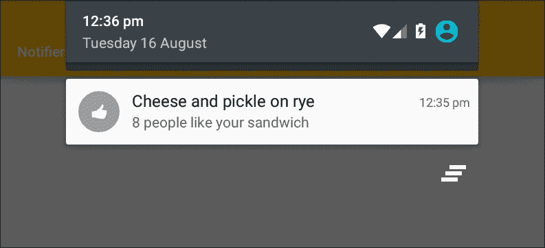
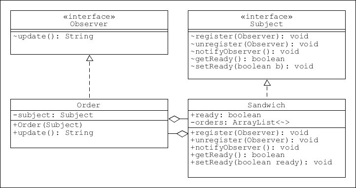
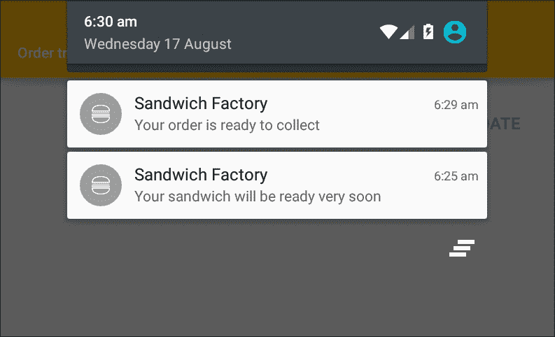
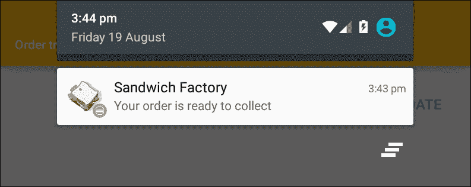
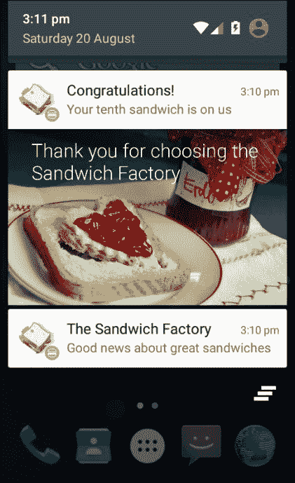
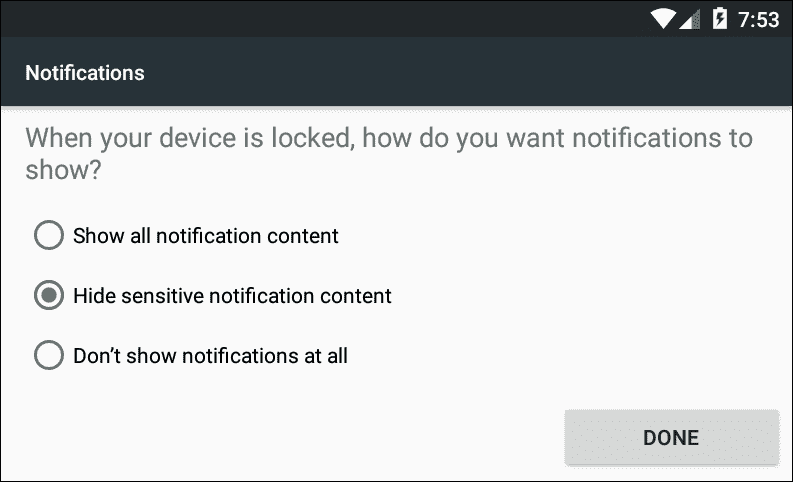
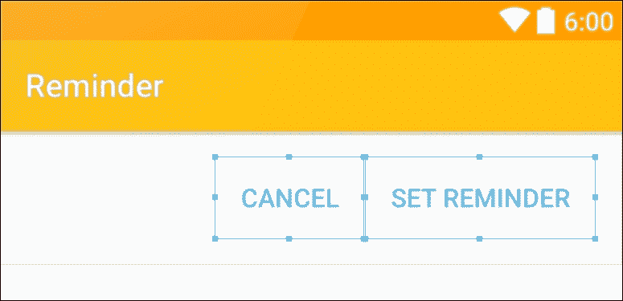

# 九、观察模式

在最后一章中，我们研究了如何通过允许用户存储经常使用的数据来简化交互，例如位置和饮食偏好。这只是让使用应用尽可能愉快的一种方式。另一个有价值的方法是为用户提供及时的通知。



所有移动设备都提供接收通知；通常这些都是使用屏幕顶部狭窄的状态栏交付的，安卓也不例外。作为开发人员，让我们对这个过程感兴趣的是，这些通知需要在我们的应用可能没有使用时发送。在一个活动中处理这样的事件显然没有回调的方法，所以我们就要看后台组件比如**服务**来触发这样的事件。

就设计模式而言，有一种模式几乎是专门为管理一对多关系而构建的，**观察者模式**。虽然观察者模式非常适合通知的发送和接收，但它在软件设计中无处不在，您无疑会遇到**观察者**和**观察者** Java 实用程序。

我们将从仔细研究观察者模式本身开始这一章，然后研究安卓通知是如何设计、构建和定制的。

在本章中，您将学习如何:

*   创建观察者模式
*   发出通知
*   使用 Java 观察器实用程序
*   应用待定意图
*   配置隐私和优先级设置
*   自定义通知
*   创建服务

本章主要关注观察者模式，以及它如何应用于管理通知。最好的开始是看一看模式本身，它的目的和它的结构。

# 观察者模式

您可能没有意识到这一点，但是您将会多次遇到观察者模式，因为每个点击收听者(以及任何其他收听者)实际上都是观察者。这同样适用于任何桌面或图形用户界面的图标和功能，这些类型的侦听器接口很好地展示了观察者模式的目的。

*   观察者就像一个哨兵，监视一个或多个主题中的特定事件或状态变化，然后将此信息报告给相关方。

如前所述，Java 有自己的观察器实用程序，虽然这些在某些情况下可能有用，但是 Java 处理继承的方式和模式的简单性使得编写我们自己的更可取。我们将看到如何使用这些内置类，但是在这里的大多数示例中，我们将构建自己的类。这也将提供对模式工作的更深入的理解。

必须谨慎使用通知，因为除了不想要的消息，很少有事情能让用户更烦恼。然而，如果谨慎使用，通知可以提供一个无价的促销工具。秘密在于允许用户选择加入和退出各种消息流，这样他们只收到他们感兴趣的通知。

## 创建模式

考虑到我们的三明治制作应用，发出通知的机会似乎很少。一个这样的用途可能是，如果我们为顾客提供选择来收集他们的三明治以及让他们送货上门，那么用户可能会喜欢在他们的三明治准备好的时候得到通知。

为了在设备之间进行有效的通信，我们需要一个带有相关应用的中央服务器。我们不能在这里讨论这个问题，但这不会阻止我们了解模式是如何工作的，以及通知是如何发布的。

我们将首先构建一个简单的观察者模式，以及一个跟踪和报告订单进度的基本通知管理器。

要了解如何做到这一点，请遵循以下步骤:

1.  观察者模式的核心是主体界面和观察者界面。
2.  主题界面如下图:

    ```java
    public interface Subject { 

        void register(Observer o); 
        void unregister(Observer o); 
        boolean getReady(); 
        void setReady(boolean b); 
    } 

    ```

3.  这是观察者界面:

    ```java
    public interface Observer { 

        String update(); 
    } 

    ```

4.  接下来，将主题实现为正在订购的三明治，如下所示:
5.  Next, implement the observer interface like this:

    ```java
    public class Sandwich implements Subject { 
        public boolean ready; 

        // Maintain a list of observers 
        private ArrayList<Observer> orders = new ArrayList<Observer>(); 

        @Override 
        // Add a new observer 
        public void register(Observer o) { 
            orders.add(o); 
        } 

        @Override 
        // Remove observer when order complete 
        public void unregister(Observer o) { 
            orders.remove(o); 
        } 

        @Override 
        // Update all observers 
        public void notifyObserver() { 
            for (Observer order : orders) { 
                order.update(); 
            } 
        } 

        @Override 
        public boolean getReady() { 
            return ready; 
        } 

        public void setReady(boolean ready) { 
            this.ready = ready; 
        } 
    } 

    ```

    ```java
    public class Order implements Observer { 
        private Subject subject = null; 

        public Order(Subject subject) { 
            this.subject = subject; 
        } 

        @Override 
        public String update() { 

            if (subject.getReady()) { 

                // Stop receiving notifications 
                subject.unregister(this); 

                return "Your order is ready to collect"; 

            } else { 
                return "Your sandwich will be ready very soon"; 
            } 
        } 
    } 

    ```

    这就完成了模式本身；从这里可以看出，它的结构非常简单:

    

这是做这里所有工作的主题。它保留了所有观察者的列表，并提供了观察者订阅和取消订阅其更新的机制。在前面的例子中，一旦订单完成，我们在`update()`期间从观察者处调用`unregister()`，因为我们的听众将不再对这个主题感兴趣。

`Observer`接口看起来太简单了，没有必要，但是它允许`Sandwich`和它的观察者之间的松散耦合，这意味着我们可以独立地修改它们中的任何一个。

虽然我们只包括了一个观察者，但是应该清楚在我们的主题中实现的方法是如何允许任意数量的单个订单并相应地做出响应的。

## 添加通知

`order.update()`方法为我们提供了合适的文本作为通知发布。要测试模式并向状态栏发送通知，请按照以下步骤操作:

1.  首先用以下嵌套布局创建一个 XML 布局:

    ```java
    <LinearLayout 
        ... 
        android:layout_alignParentBottom="true" 
        android:layout_centerHorizontal="true" 
        android:gravity="end" 
        android:orientation="horizontal"> 

        <Button 
            android:id="@+id/action_save" 
            style="?attr/borderlessButtonStyle" 
            android:layout_width="wrap_content" 
            android:layout_height="wrap_content" 
            android:minWidth="64dp" 
            android:onClick="onOrderClicked" 
            android:padding="@dimen/action_padding" 
            android:text="ORDER" 
            android:textColor="@color/colorAccent" 
            android:textSize="@dimen/action_textSize" /> 

        <Button 
            android:id="@+id/action_update" 
            ... 
            android:onClick="onUpdateClicked" 
            android:padding="@dimen/action_padding" 
            android:text="UPDATE" 
            ... 
            /> 

    </LinearLayout> 

    ```

2.  打开您的 Java 活动并添加这些字段:

    ```java
    Sandwich sandwich = new Sandwich(); 
    Observer order = new Order(sandwich); 

    int notificationId = 1; 

    ```

3.  添加监听订单按钮被点击的方法:

    ```java
    public void onOrderClicked(View view) { 

        // Subscribe to notifications 
        sandwich.register(order); 
        sendNotification(order.update()); 
    } 

    ```

4.  一个用于更新按钮:

    ```java
    public void onUpdateClicked(View view) { 

        // Mimic message from server 
        sandwich.setReady(true); 
        sendNotification(order.update()); 
    } 

    ```

5.  最后，添加`sendNotification()`方法:

```java
private void sendNotification(String message) { 

    NotificationCompat.Builder builder = 
            (NotificationCompat.Builder) 
            new NotificationCompat.Builder(this) 
                    .setSmallIcon(R.drawable.ic_stat_bun) 
                    .setContentTitle("Sandwich Factory") 
                    .setContentText(message); 

    NotificationManager manager = (NotificationManager) 
            getSystemService(NOTIFICATION_SERVICE); 
    manager.notify(notificationId, builder.build()); 

    // Update notifications if needed 
    notificationId += 1; 
} 

```

我们现在可以在设备或仿真器上运行代码:



上面负责发布通知的代码演示了发布通知的最简单方法，图标和两个文本字段是发布通知的最低要求。

### 注

由于这只是一个演示，观察者模式实际上只不过是模拟服务器，因此不要将其与本机通知 API 调用混淆，这一点很重要。

通知标识的使用值得注意。这主要用于更新通知。发送具有相同 ID 的通知将更新之前的消息，在前面的情况下，这实际上是我们应该做的，这里 ID 的递增只是为了演示如何使用它。要纠正这一点，请注释掉该行并重新运行项目，以便只生成一个消息流。

为了充分利用这一宝贵的工具，我们可以而且应该做更多的事情，例如让它执行操作，并在我们的应用不活动时交付，我们将在后面的部分中回到这些问题，但是现在值得看看 Java 如何为实现观察者模式提供自己的实用程序。

## 效用观察者和可观察物

如前所述，Java 提供了自己的观察器实用程序、`java.util.observer`接口和`java.util.observable`抽象类。它们配备了注册、取消注册和通知观察者的方法。使用它们可以很容易地实现上一节中的示例，这可以通过以下步骤看出:

1.  在这种情况下，主体是通过扩展可观察类来实现的，如这里所见:

    ```java
    import java.util.Observable; 

    public class Sandwich extends Observable { 
        private boolean ready; 

        public Sandwich(boolean ready) { 
            this.ready = ready; 
        } 

        public boolean getReady() { 
            return ready; 
        } 

        public void setReady(boolean ready) { 
            this.ready = ready; 
            setChanged(); 
            notifyObservers(); 
        } 
    } 

    ```

2.  `Order`类是一个观察者，因此实现了这个接口，就像这样:

    ```java
    import java.util.Observable; 
    import java.util.Observer; 

    public class Order implements Observer { 
        private String update; 

        public String getUpdate() { 
            return update; 
        } 

        @Override 
        public void update(Observable observable, Object o) { 
            Sandwich subject = (Sandwich) observable; 

            if (subject.getReady()) { 
                subject.deleteObserver(this); 
                update = "Your order is ready to collect"; 

            } else { 
                update = "Your sandwich will be ready very soon"; 
            } 
        } 
    } 

    ```

3.  XML 布局和`sendNotification()`方法与之前完全相同，对活动源代码的唯一更改如下所示:

    ```java
    public class MainActivity extends AppCompatActivity { 
        Sandwich sandwich = new Sandwich(false); 
        Order order = new Order(); 
        private int id; 

        @Override 
        protected void onCreate(Bundle savedInstanceState) 
            { ... } 

        public void onOrderClicked(View view) { 
            sandwich.addObserver(order); 
            sandwich.setReady(true); 
            sendNotification(order.getUpdate()); 
        } 

        public void onUpdateClicked(View view) { 
            sandwich.setReady(true); 
            sendNotification(order.getUpdate()); 
        } 

        private void sendNotification(String message) 
            { ... } 
    } 

    ```

如您所见，这段代码执行的任务与我们前面的示例相同，值得对这两个清单进行比较。观察者的`setChanged()`和`notifyObservers()`方法取代了我们在自定义版本中实现的方法。

对于未来的观察者模式，您采用哪种方法主要取决于特定的环境。一般来说，使用 Java 可观察的 utils 适合简单的情况，如果您不确定从这个方法开始是一个好主意，因为您很快就会看到是否需要更灵活的方法。

上面的例子只介绍了观察者模式和通知。这个模式展示了一个非常简单的情况，为了理解它的全部潜力，我们需要把它应用到更复杂的情况中。首先，我们将看看我们还能为通知系统做些什么。

# 通知

向用户发送一个简单的字符串消息是通知系统的主要目的，但是它还可以做更多的事情。首先，可以发出通知来执行一个或多个操作；通常其中之一是打开相关的应用。还可以创建扩展通知，它可以包含各种媒体，对于单行消息信息太多的情况非常有用，但是我们希望为用户省去打开应用的麻烦。

自 API 21 以来，已经可以向用户的锁定屏幕发送平视通知和通知。这个功能是从其他移动平台上获得的，尽管它看起来很有用，但使用时应该非常小心。只需要指出通知应该只包含相关的信息。经验法则是，只有当信息不能等到用户下次登录时才发出通知。有效通知的一个很好的例子可能是*你的三明治被推迟了，*而不是*新系列的奶酪即将到来*。

除了麻烦用户的风险，锁屏通知还包含另一个危险。锁定设备上显示的消息实际上是公开的。任何路过桌子上的手机的人都能看到内容。现在，尽管大多数人不介意老板看到他们喜欢的三明治，但毫无疑问，你会编写包含更多敏感信息的应用，幸运的是，该应用接口提供了可编程的隐私设置。

不管需要应用的注意事项是什么，所有的通知功能仍然非常值得熟悉，从让通知真正做一些事情开始。

## 设定意图

与活动或任何其他顶级应用组件的启动一样，意图提供了我们从通知到行动的途径。在大多数情况下，我们希望使用通知来开始一项活动，这就是我们在这里要做的。

移动设备的用户希望能够轻松、快速地在活动和应用之间移动。当用户在应用之间导航时，系统会跟踪它在后台存储的顺序。这通常就足够了，但是当用户被一个通知从一个应用中拉出来时，按下后退按钮不会让他们返回到他们之前使用的应用中。这可能会惹恼用户，但幸运的是，通过创建一个人工的堆栈很容易避免。

如下例所示，创建我们自己的堆栈并没有听起来那么困难。事实上，这个例子非常简单，它还详细说明了如何包含一些其他的通知特性，比如一个更复杂的图标和滚动条文本，当通知第一次发送时，它会沿着状态栏滚动。

按照以下步骤查看如何实现:

1.  打开我们之前工作过的项目，创建一个新的活动类，比如:

    ```java
    public class UserProfile extends AppCompatActivity { 

        @Override 
        protected void onCreate(Bundle savedInstanceState) { 
            super.onCreate(savedInstanceState); 
            setContentView(R.layout.activity_profile); 
        } 
    } 

    ```

2.  接下来，我们需要一个布局文件来匹配之前在`onCreate()`方法中设置的内容视图。除了根布局之外，这可以留空。
3.  现在在你的主活动中`sendNotification()`方法的顶部添加以下几行:

    ```java
    Intent profileIntent = new Intent(this, UserProfile.class); 

    TaskStackBuilder stackBuilder = TaskStackBuilder.create(this); 
    stackBuilder.addParentStack(UserProfile.class); 
    stackBuilder.addNextIntent(profileIntent); 

    PendingIntent pendingIntent = stackBuilder.getPendingIntent(0, 
            PendingIntent.FLAG_UPDATE_CURRENT); 

    ```

4.  将这些设置添加到通知生成器中:

    ```java
    .setAutoCancel(true) 
    .setTicker("the best sandwiches in town") 
    .setLargeIcon(BitmapFactory.decodeResource(getResources(), 
            R.drawable.ic_sandwich)) 
    .setContentIntent(pendingIntent); 

    ```

5.  最后，在清单文件中包含新活动:

    ```java
    <activity android:name="com.example.kyle.ordertracker.UserProfile"> 

        <intent-filter> 
            <action android:name="android.intent.action.DEFAULT" /> 
        </intent-filter> 

    </activity> 

    ```

这些变化的影响是显而易见的:



注释掉生成后台堆栈的行，并在使用另一个应用时打开通知，看看它如何保持直观的导航。`setAutoCancel()`呼叫表示在通知后状态栏图标消失。

一般来说，我们希望用户通过通知打开我们的应用，但从用户的角度来看，以尽可能少的努力完成事情是很重要的，如果他们可以在不必打开另一个应用的情况下获得相同的信息，那么这是一件好事。这就是扩展通知的作用。

## 定制和配置通知

API 16 引入了扩展通知。提供更大、更灵活的内容区域使其与其他移动平台保持一致。扩展通知有三种样式:文本、图像和列表。以下步骤演示了如何实现它们:

1.  以下项目可以从我们之前使用的项目修改，也可以从头开始。
2.  使用以下观察器方法编辑主布局文件，使其包含三个按钮:

    ```java
    android:onClick="onTextClicked" 
    android:onClick="onPictureClicked" 
    android:onClick="onInboxClicked" 

    ```

3.  对`sendNotification()`方法做如下修改:

    ```java
    private void sendNotification(NotificationCompat.Style style) { 

        ... 

        NotificationCompat.Builder builder = (NotificationCompat.Builder) new NotificationCompat.Builder(this) 

                .setStyle(style) 

                ... 

        manager.notify(id, builder.build()); 
    } 

    ```

4.  现在创建三种样式方法。首先是大文字风格:

    ```java
    public void onTextClicked(View view) { 
        NotificationCompat.BigTextStyle bigTextStyle = new NotificationCompat.BigTextStyle(); 

        bigTextStyle.setBigContentTitle("Congratulations!"); 
        bigTextStyle.setSummaryText("Your tenth sandwich is on us"); 
        bigTextStyle.bigText(getString(R.string.long_text)); 

        id = 1; 
        sendNotification(bigTextStyle); 
    } 

    ```

5.  大图风格需要这些设置:

    ```java
    public void onPictureClicked(View view) { 
        NotificationCompat.BigPictureStyle bigPictureStyle = new NotificationCompat.BigPictureStyle(); 

        bigPictureStyle.setBigContentTitle("Congratulations!"); 
        bigPictureStyle.setSummaryText("Your tenth sandwich is on us"); 
        bigPictureStyle.bigPicture(BitmapFactory.decodeResource(getResources(), R.drawable.big_picture)); 

        id = 2; 
        sendNotification(bigPictureStyle); 
    } 

    ```

6.  最后添加列表，或者收件箱，样式，像这样:

```java
public void onInboxClicked(View view) { 
    NotificationCompat.InboxStyle inboxStyle = new NotificationCompat.InboxStyle(); 

    inboxStyle.setBigContentTitle("This weeks most popular sandwiches"); 
    inboxStyle.setSummaryText("As voted by you"); 

    String[] list = { 
            "Cheese and pickle", 
            ... 
    }; 

    for (String l : list) { 
        inboxStyle.addLine(l); 
    } 

    id = 3; 
    sendNotification(inboxStyle); 
} 

```

这些通知现在可以在设备或 AVD 上进行测试:



最近的通知将始终展开，其他通知可以通过向下滑动来展开。与大多数材质列表一样，可以通过水平滑动来取消通知。

在设计通知时，这些功能为我们提供了很大的灵活性，如果我们想做得更多，我们甚至可以定制它们。这可以非常简单地通过将一个 XML 布局传递给我们的构建器来完成。为此，我们需要 RemoteViews 类，这是一种布局膨胀器。创建布局，然后在代码中包含以下行来实例化它:

```java
RemoteViews expandedView = new RemoteViews(this.getPackageName(), R.layout.notification); 

```

然后将它传递给构建者:

```java
builder.setContent(expandedView); 

```

在实现安卓通知方面，我们需要涵盖的只是如何发出平视通知和锁屏通知。这与其说是编码，不如说是设置优先级、用户权限和设置的问题。

## 能见度和优先级

一些通知出现的位置和方式通常取决于两个相关的属性:隐私和重要性。这些是使用元数据常量应用的，也可以包括诸如*警报*和*宣传片*等类别，系统可以使用这些类别来排序和过滤多个通知。

当涉及到向用户的锁定屏幕发送通知时，不仅是我们如何设置元数据，还取决于用户的安全设置。要查看这些通知，用户必须选择个人识别码或手势等安全锁，然后从**安全|通知**设置中选择以下选项之一:



如果用户有这些设置，我们的通知将发送到用户的锁定屏幕。为了保护用户的隐私，我们可以使用我们的生成器设置通知可见性。这有三个值:

*   `VISIBILITY_PUBLIC` -显示整个通知
*   `VISIBILITY_PRIVATE` -显示标题和图标，但隐藏内容
*   `VISIBILTY_SECRET` -根本不显示任何内容

要实现这些设置中的任何一个，请使用下面这样的一行:

```java
builder.setVisibility(NotificationCompat.VISIBILITY_PUBLIC) 

```

平视显示器通过在屏幕顶部以基本(折叠)通知的形式出现五秒钟，提醒用户它们的重要性，然后恢复为状态栏图标。它们应该只用于需要用户立即注意的信息。这是使用优先级元数据控制的。

默认情况下，每个通知的优先级都是 PRIORITY_DEFAULT。五个可能的值是:

*   `PRIORITY_MIN` = -2
*   `PRIORITY_LOW` = -1
*   `PRIORITY_DEFAULT` = 0
*   `PRIORITY_HIGH` = 1
*   `PRIORITY_MAX` = 2

这些也可以由构建器设置，例如:

```java
builder.setPriority(NotificationCompat.PRIORITY_MAX) 

```

如果声音或振动也被触发，任何大于 DEFAULT 的值都会触发提前通知。这也可以由我们的构建器添加，并采用以下形式:

```java
builder.setVibrate(new long[]{500, 500, 500}) 

```

振动器类获取一个长数组，并将其作为毫秒级的振动脉冲来应用，因此前面的例子将振动三次，每次半秒钟。

在应用的任何地方包含设备振动都需要用户分期付款的权限。这些元素作为根元素的直接子元素添加到清单文件中，如下所示:

```java
<manifest xmlns:android="http://schemas.android.com/apk/res/android" 
    package="com.example.yourapp"> 

    <uses-permission  
        android:name="android.permission.VIBRATE" /> 

    <application 

        ... 

    </application> 

</manifest> 

```

关于显示和配置通知，我们需要知道的不多。然而，到目前为止，我们一直在应用内部发布通知，而不是像在野外那样远程发布。

# 服务

服务是顶级应用组件，如活动。它们的目的是管理长时间运行的后台任务，例如播放音频或触发提醒或其他预定事件。服务不需要用户界面，但是在其他方面，它们类似于活动，并且具有类似的生命周期和相关的回调方法，我们可以使用这些方法来拦截关键事件。

虽然所有的服务开始都是一样的，但它们基本上分为两类，绑定和非绑定。绑定到某个活动的服务将继续运行，直到得到指示或绑定活动停止。另一方面，无论调用活动是否活动，未绑定的服务都将继续运行。在这两种情况下，一旦完成分配的任务，服务通常会负责关闭自己。

下面的示例演示如何创建设置提醒的服务。该服务将在设定的延迟后发布通知，或者被用户操作取消。要了解如何做到这一点，请遵循以下步骤:

1.  Start by creating a layout. This will need two buttons:

    

2.  在两个按钮中包含 onClick 属性:

    ```java
    android:onClick="onReminderClicked" 
    android:onClick="onCancelClicked" 

    ```

3.  创建一个新类来扩展服务:

    ```java
    public class Reminder extends Service 

    ```

4.  `onBind()`法会坚持，但我们不需要，所以可以这样留下:

    ```java
    @Override 
    public IBinder onBind(Intent intent) { 
        return null; 
    } 

    ```

5.  我们也不会使用`onCreate()`或 `onDestroy()` 方法，但是观察后台活动的行为总是有用的，所以完成类似这样的方法:

    ```java
    @Override 
    public void onCreate() { 
        Log.d(DEBUG_TAG, "Service created"); 
    } 

    @Override 
    public void onDestroy() { 
        Log.d(DEBUG_TAG, "Service destroyed"); 
    } 

    ```

6.  该类需要以下字段:

    ```java
    private static final String DEBUG_TAG = "tag"; 
    NotificationCompat.Builder builder; 
    @Override 
    public int onStartCommand(Intent intent, int flags, int startId) { 
        Log.d(DEBUG_TAG, "Service StartCommand"); 

        // Build notification 
        builder = new NotificationCompat.Builder(this) 
                .setSmallIcon(R.drawable.ic_bun) 
                .setContentTitle("Reminder") 
                .setContentText("Your sandwich is ready to collect"); 

        // Issue timed notification in separate thread 
        new Thread(new Runnable() { 

            @Override 
            public void run() { 
                Timer timer = new Timer(); 
                timer.schedule(new TimerTask() { 

                    @Override 
                    public void run() { 
                        NotificationManager manager = (NotificationManager) 
                                getSystemService(NOTIFICATION_SERVICE); 
                        manager.notify(0, builder.build()); 
                        cancel(); 
                    } 

                // Set ten minute delay 
                }, 1000 * 60 * 10); 

                // Destroy service after first use 
                stopSelf(); 
            } 

        }).start(); 

        return Service.START_STICKY; 
    } 

    ```

7.  将服务添加到您的活动旁边的清单文件中，如下所示:

    ```java
    <service 
        android:name=".Reminder" /> 

    ```

8.  最后，打开您的主要 Java 活动，完成这两个按钮监听器:

    ```java
    public void onReminderClicked(View view) { 
        Intent intent = new Intent(MainActivity.this, Reminder.class); 
        startService(intent); 
    } 

    public void onCancelClicked(View view) { 
        Intent intent = new Intent(MainActivity.this, Reminder.class); 
        stopService(intent); 
    } 

    ```

前面的代码演示了如何使用服务在后台运行代码。在许多应用中，这是许多应用中必不可少的功能。我们唯一真正需要考虑的是确保我们所有的服务在不再需要时得到正确的处理，因为服务特别容易发生内存泄漏。

# 总结

在本章中，我们已经看到了如何将观察者模式用作管理用户通知交付的工具，以及跟踪许多其他事件并做出相应的响应。我们首先看了模式本身，然后看了安卓通知应用接口，尽管使用了系统控制的状态栏和通知抽屉，但在设计适合我们应用目的和外观的通知时，它给了我们很大的自由。

在下一章中，我们将采用这种模式和其他模式，看看我们如何扩展现有的安卓组件，并让它们直接应用我们的设计模式。然后，我们将看看这如何帮助我们开发除手机和平板电脑之外的外形。