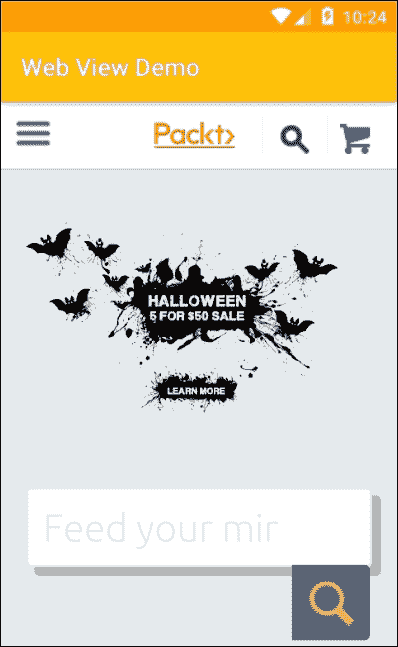
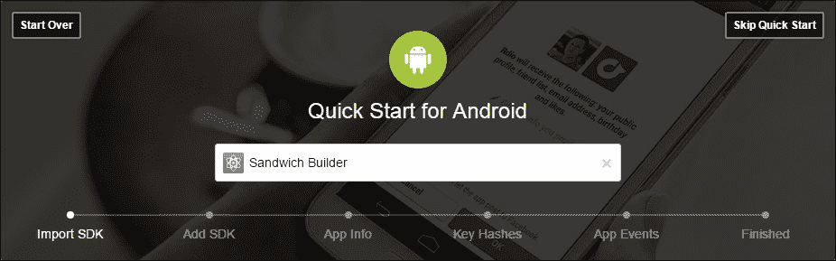
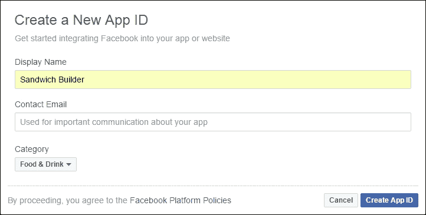
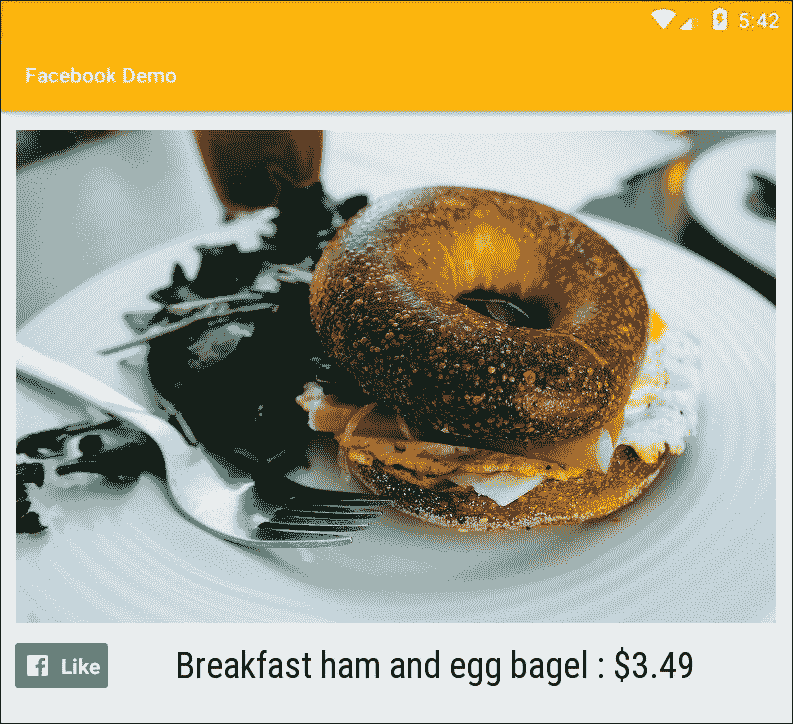
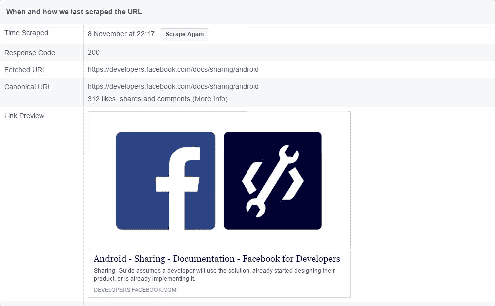
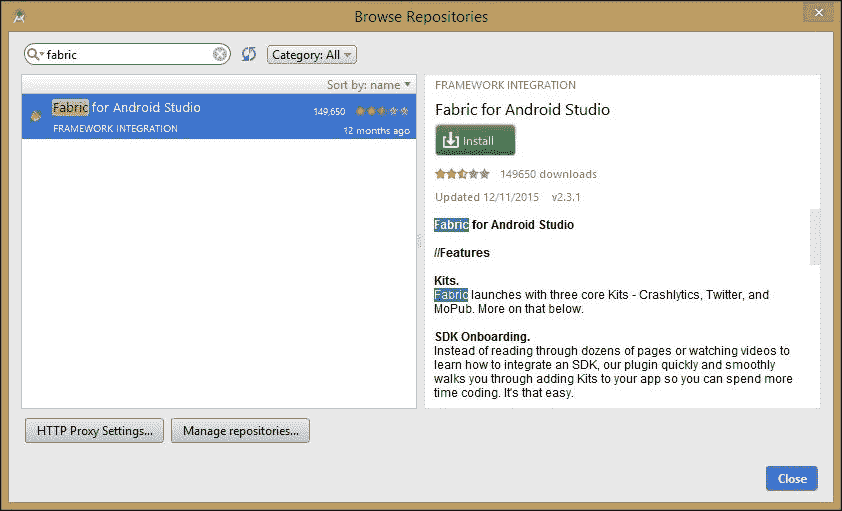

# 十二、社交模式

到目前为止，在本书中，我们已经涵盖了移动应用程序开发的许多方面。然而，即使是设计最好、最有用的应用程序也可以从使用社交媒体和其他网络内容中获得巨大的好处。

我们在前面几章中介绍的三明治构建器应用程序就是一个很好的例子，它可以通过生成脸书赞和推文来增加发行量，这些和其他社交媒体都提供了将这些功能直接整合到我们的应用程序中的技术。

除了将现有的社交媒体平台整合到我们的应用程序中，我们还可以通过**网络视图**类将我们喜欢的任何网络内容嵌入到活动中。视图类的这个扩展可以用于向应用程序添加单个网页，甚至构建一个完整的 web 应用程序。当我们有需要定期更新的产品或数据时，WebView 类非常有用，因为这无需重新编码和发布更新就可以实现。

我们将从查看 WebView 类开始这一章，看看我们如何结合 JavaScript 来赋予页面功能；然后我们将探索一些社交媒体 SDK，这些 SDK 允许我们整合它们的许多功能，例如共享、发布和喜欢。

在本章中，您将学习如何执行以下操作:

*   在网络视图中打开网页
*   在浏览器中打开网页
*   启用和使用 JavaScript
*   使用 JavaScriptInterface 将脚本与本机代码绑定
*   为网络应用编写高效的 HTML
*   创建脸书应用程序
*   添加相似视图按钮
*   创建脸书共享界面
*   整合推特
*   发送推文

# 添加网页

使用 WebView 类在活动或片段中包含单个网页几乎与添加任何其他类型的视图一样简单。有三个简单的步骤，如下所示:

1.  向清单添加以下权限:

    ```java
    <uses-permission 
        android:name="android.permission.INTERNET" /> 

    ```

2.  `WebView`本身看起来是这样的:

    ```java
    <WebView xmlns:android="http://schemas.android.com/apk/res/android" 
        android:id="@+id/web_view" 
        android:layout_width="match_parent" 
        android:layout_height="match_parent" /> 

    ```

3.  最后，用于添加页面的 Java 如下:

```java
WebView webView = (WebView) findViewById(R.id.web_view); 
webView.loadUrl("https://www.packtpub.com/"); 

```

这就是它的全部内容，尽管您可能想要删除或减少大多数页面的默认 16dp 页边距。



这个系统非常适合处理专门为我们的应用程序设计的页面。如果想要将我们的用户发送到任何其他网页，那么使用链接被认为是更好的做法，这样用户就可以用他们选择的浏览器打开它。

## 包含链接

为此，任何可点击的视图都可以充当链接，然后点击监听器可以做出如下响应:

```java
@Override 
    public void onClick(View v) { 
        Intent intent = new Intent(); 
        intent.setAction(Intent.ACTION_VIEW); 
        intent.addCategory(Intent.CATEGORY_BROWSABLE); 
        intent.setData(Uri.parse("https://www.packtpub.com/")); 
        startActivity(intent); 
    } 

```

我们可以看到，网页视图的正确使用是使用专门设计为我们应用程序不可或缺的一部分的页面。虽然用户需要知道他们是在线的(因为可能会收费)，但我们的网络视图应该看起来和行为像应用程序的其他部分。在一个屏幕上拥有多个 web 视图并将其与其他小部件和视图混合在一起是完全可能的，如果我们正在开发一个存储用户详细信息的应用程序，那么使用 web 工具而不是安卓应用程序接口通常更容易管理。

WebView 类附带了一系列全面的设置，可用于控制许多属性，如缩放功能、图像加载和显示设置。

## 配置网页设置和 JavaScript

虽然我们可以将网页视图设计得像其他应用程序组件一样，但是它们当然拥有大量特定于网页的属性，并且可以作为网页元素在浏览器中进行导航。这些和其他设置由**网络设置**类优雅地管理。

这个类主要由一长串的设置者和获取者组成。整个集合可以这样初始化:

```java
WebView webView = (WebView) findViewById(R.id.web_view); 
WebSettings webSettings = webView.getSettings(); 

```

我们现在可以使用这个对象来查询我们的网页视图的状态，并按照我们的意愿配置它们。例如，默认情况下，JavaScript 是禁用的，但可以轻松更改:

```java
webSettings.setJavaScriptEnabled(true); 

```

有大量这样的方法，所有这些方法都在文档中列出:

```java
developer.android.com/reference/android/webkit/WebSettings.html

```

这些设置不是我们控制 web 视图的唯一方法，它有一些自己非常有用的方法，这里列出了其中的大部分:

*   `getUrl()` -返回网页视图的当前网址
*   `getTitle()` -如果在 HTML 中指定，则返回页面标题
*   `getAllAsync(String)` -简单的搜索功能，突出显示给定字符串的出现
*   `clearHistory()` -清空当前历史缓存
*   `destroy()` -关闭并清空网页视图
*   `canGoForward()`和`canGoBack()` -启用本地历史堆栈

这些方法，以及 web 设置，让我们可以用 web 视图做更多的事情，而不仅仅是访问可变数据。只要稍加努力，我们就能提供网络浏览器的大部分功能。

无论我们选择将网页视图作为应用程序的无缝部分呈现，还是为用户提供更全面的基于互联网的体验，我们都很可能希望在页面中包含一些 JavaScript。我们之前看到了如何启用 JavaScript，但这仅允许我们运行独立脚本；如果我们可以从 JavaScript 中调用一个 Android 方法，那会好得多，而这正是`JavaScriptInterface`所做的。

使用这样的接口来管理两种语言之间的自然不兼容性，当然是**适配器设计模式**的经典例子。要了解如何实现这一点，请遵循以下步骤:

1.  将以下字段添加到您用于任务的任何活动中:

    ```java
        public class WebViewActivity extends Activity { 

            WebView webView; 
            JavaScriptInterface jsAdapter; 

    ```

2.  像这样编辑`onCreate()` 方法:

    ```java
        @Override 
        public void onCreate(Bundle savedInstanceState) { 
            super.onCreate(savedInstanceState); 
            setContentView(R.layout.main); 

            webView = (WebView) findViewById(R.id.web_view); 

            WebSettings settings = webView.getSettings(); 
            settings.setJavaScriptEnabled(true); 

            jsAdapter = new JavaScriptInterface(this); 
            webView.addJavascriptInterface(jsAdapter, "jsAdapter");  

            webView.loadUrl("http://someApp.com/somePage.html"); 
        } 

    ```

3.  创建适配器类(也可以是内部类)。`newActivity()`方法可以是我们选择的任何方法。这里，仅作为示例，它开始一个新的活动:

    ```java
        public class JavaScriptInterface { 
            Context context; 

            JavaScriptInterface(Context c) { 
                context = c; 
            } 

            // App targets API 16 and higher 
            @JavascriptInterface 
            public void newActivity() { 
                Intent i = new Intent(WebViewActivity.this, 
                    someActivity.class); 
                startActivity(i); 
            } 
        } 

    ```

4.  剩下的就是编写 JavaScript 来调用我们的本地方法。任何可点击的 HTML 对象都可以。在页面上创建以下按钮:

    ```java
        <input type="button"  
           value="OK"  
           onclick="callandroid()" /> 

    ```

5.  现在，只需在您的脚本中定义函数，如下所示:

    ```java
        <script type="text/javascript"> 

            function callandroid() { 
                isAdapter.newActivity(); 
            } 

        </script> 

    ```

这个过程非常容易实现，并使 web 视图成为一个非常强大的组件，从网页中调用我们的 Java 方法的能力意味着我们可以将 web 功能结合到任何应用程序中，而不必牺牲移动功能。

虽然您在构建网页时不需要任何帮助，但是关于最佳实践，有一两点需要注意。

## 为网络视图编写 HTML

人们很容易认为，移动 web 应用的设计会遵循与移动网页设计相似的惯例，而且在许多方面都是如此，但下面的列表指出了一两个细微的区别:

*   确保您使用的是正确的`DOCTYPE`，在我们的案例中是这样的:

```java
    <?xml version="1.0" encoding="UTF-8"?> 
    <!DOCTYPE html PUBLIC "-//W3C//DTD XHTML Basic 1.1//EN" 
        "http://www.w3.org/TR/xhtml-basic/xhtml-basic11.dtd"> 

```

*   创建单独的 CSS 和脚本文件会导致连接变慢。将这段代码保持在线，最好是在头部或者身体的最末端。可悲的是，这意味着我们不得不避免 CSS 和 web 框架，材质设计等功能必须手动编码。
*   尽可能避免水平滚动。如果你的应用程序绝对需要这样做，那么使用标签，或者更好的是，滑动导航抽屉。

正如我们所看到的，网络视图是一个强大的组件，使得复杂的移动/网络混合应用程序非常容易开发。这是一个很大的主题，实际上可以用整本书来讨论这个主题。不过，就目前而言，了解这个工具的范围和威力就足够了。

使用内置的网络工具只是我们利用互联网力量的一种方式。能够连接到社交媒体可能是推广产品最有效、最便宜的方法。其中最有用和最简单的设置是脸书。

# 连接脸书

脸书不仅是最大的社交网络之一，它也非常好地帮助那些希望推广他们产品的人。其工作方式各不相同，从提供自动登录、可定制的广告，到让用户能够与其他人分享他们喜欢的产品。

为了将脸书功能融入我们的安卓应用程序，我们需要用于安卓的**脸书软件开发工具包**，为了充分利用这一点，我们还需要一个脸书应用程序标识，这将需要在脸书创建一个简单的应用程序:



## 添加脸书软件开发工具包

在我们的应用程序中添加脸书功能的第一步是下载脸书软件开发工具包。这可以在这里找到:

```java
developers.facebook.com/docs/android

```

SDK 是一套强大的工具，包括安卓开发者非常熟悉的视图、类和界面。脸书软件开发工具包可以被认为是我们本地软件开发工具包的一个有用的扩展。

在脸书开发人员页面上可以找到一个方便的快速入门指南，但是在这种情况下，手动遵循该过程更有指导意义，如下步骤所示:

1.  开始一个新的安卓工作室项目，最低应用编程接口级别为 15 或更高。
2.  打开模块化`build.gradle`文件，并在此突出显示所做的更改:

    ```java
        repositories { 
            mavenCentral() 
        } 

        dependencies { 

            . . . 

            compile 
                'com.android.support:appcompat-v7:24.2.1' 
            compile 
                'com.facebook.android:facebook-android-sdk:(4,5)' 
            testCompile 'junit:junit:4.12' 
        } 

    ```

3.  向清单文件添加以下权限:

    ```java
        <uses-permission 
            android:name="android.permission.INTERNET" /> 

    ```

4.  然后将以下库导入您的主活动或应用程序类:

    ```java
        import com.facebook.FacebookSdk; 
        import com.facebook.appevents.AppEventsLogger; 

    ```

5.  最后，从你的启动活动的`onCreate()`方法初始化 SDK，像这样:

    ```java
        FacebookSdk.sdkInitialize(getApplicationContext()); 
        AppEventsLogger.activateApp(this); 

    ```

这并不是我们进步所需要的全部，但是在我们能够更进一步之前，我们将需要一个脸书应用程序标识，我们只能通过在脸书创建一个应用程序来获得它。

## 获取脸书应用标识

正如你将会看到的，脸书应用程序可能非常复杂，它们的功能只受其创造者的想象力和编码能力的限制。它们可以，而且经常，只不过是一个简单的页面，当我们把重点放在安卓应用上时，我们只需要最简单的脸书应用。

现在，请使用脸书快速启动流程，该流程可在以下位置找到:

```java
https://developers.facebook.com/quickstarts

```



一旦你点击**创建应用程序 ID** ，你将被带到你的开发者仪表盘。应用程序标识可以在窗口的左上角找到。以下两个步骤演示了如何完成我们之前开始的流程:

1.  打开`res/values/strings.xml`文件，添加以下值:

    ```java
        <string 
            name="facebook_app_id">APP ID HERE</string> 

    ```

2.  现在将以下元数据添加到清单的应用程序标签中:

    ```java
        <meta-data 
            android:name="com.facebook.sdk.ApplicationId" 
            android:value="@string/facebook_app_id" /> 

    ```

这就完成了将我们的安卓应用程序连接到脸书应用程序的过程，但是我们需要通过将我们的移动应用程序的信息提供给我们的脸书应用程序来补充这种连接。

为此，我们需要返回我们的脸书开发者仪表盘，从您的个人资料(右上角)下拉列表中选择**开发者设置**，然后选择**示例应用程序**选项卡。这将要求您输入您的包名、启动活动和**哈希键**。

如果你正在开发一个应用程序，你打算发布或使用相同的散列键为你的所有项目，你会知道它，或有它在手。否则，下面的代码会为您找到它:

```java
PackageInfo packageInfo; 

packageInfo = getPackageManager() 
        .getPackageInfo("your.package.name", 
        PackageManager.GET_SIGNATURES); 

for (Signature signature : packageInfo.signatures) { 

    MessageDigest digest; 
    digest = MessageDigest.getInstance("SHA"); 
    digest.update(signature.toByteArray()); 
    String key = new 
            String(Base64.encode(digest.digest(), 0)); 

    System.out.println("HASH KEY", key); 
} 

```

如果您直接输入此代码，Studio 将为您提供通过快速修复工具导入哪些库的选择。正确的选择如下:

```java
import android.content.pm.PackageInfo; 
import android.content.pm.PackageManager; 
import android.content.pm.Signature; 
import android.util.Base64; 

import com.facebook.FacebookSdk; 
import com.facebook.appevents.AppEventsLogger; 

import java.security.MessageDigest; 

```

这比人们想象的要多，但我们的应用程序现在已经连接到脸书，我们可以利用所有的促销机会。其中最重要的一个是“喜欢脸书”按钮。

## 添加相似视图

正如你所想象的，脸书软件开发工具包配备了像按钮一样的传统*。这是作为视图提供的，可以像任何其他视图一样添加:*

```java
<com.facebook.share.widget.LikeView 
        android:id="@+id/like_view" 
        android:layout_width="wrap_content" 
        android:layout_height="wrap_content"/> 

```



与其他视图和小部件一样，我们可以在一个 Java 活动中修改这个视图。我们可以用这个观点和其他脸书观点做很多事情，脸书彻底记录了这些。例如，LikeView 文档可以在这里找到:

```java
developers.facebook.com/docs/reference/android/current/class/LikeView

```

目前，我们可以只考虑用户喜欢什么。这是通过`setObjectId()`方法实现的，该方法接受一个字符串参数，该参数可以是您的应用程序标识或网址，如下所示:

```java
LikeView likeView = (LikeView) findViewById(R.id.like_view); 
likeView.setObjectId("Facebook ID or URL"); 

```

app 内的 Like 视图和 Web 上的视图有一两个区别。与网页点赞不同，安卓点赞视图不会通知用户有多少其他用户也点击了点赞，在没有安装脸书的设备上，我们的点赞视图根本无法工作。安卓 LikeView 的这些限制很容易通过使用一个网络视图来包含 like view 来克服，这样它就会像在网络上一样运行。

LikeView 让我们和用户有机会看到某个特定商品有多受欢迎，但要真正驾驭这个社交平台的力量，我们希望用户通过现代版的口碑来推广我们，也就是通过*与朋友分享*我们的产品。

# 内容构建器

拥有大量的喜欢是一个很好的方式来推动你的流量，但这里有一个规模经济的工作，有利于下载量非常大的应用程序。应用程序不一定要很大才能成功，尤其是当它们提供个人或本地服务时，比如提供定制的三明治。在这些情况下，一个声称只有 12 个人*喜欢*东西的标签并不算什么推荐。然而，如果这些人和他们的朋友分享他们的三明治有多棒，那么我们就有了一个非常强大的广告工具。

使脸书成为如此成功的平台的一个主要原因是，它理解人类比无名的陌生人更感兴趣，更受朋友的影响，这对中小企业来说是无价的。最简单的是，我们可以简单地添加一个共享按钮，就像我们做 like 按钮一样，这将打开共享对话框。**共享按钮**和 LikeView 一样容易添加，如下图所示:

```java
<com.facebook.share.widget.ShareButton 
    android:id="@+id/share_button" 
    android:layout_width="wrap_content" 
    android:layout_height="wrap_content"/> 

```

我们还需要在我们的清单中设置一个内容提供商。应将以下代码插入根节点:

```java
<provider 
    android:authorities="com.facebook.app.FacebookContentProvider{ 
        your App ID here 
    }" 
          android:name="com.facebook.FacebookContentProvider" 
          android:exported="true"/> 

```

与同类视图不同的是，通过共享，我们可以在共享的内容类型上有更多的选择，我们可以在共享链接、图像、视频甚至多媒体之间进行选择。

脸书软件开发工具包为每种内容类型提供了一个类，并提供了一个生成器，用于将多个项目组合成一个可共享的对象。

当共享照片或图像时，`SharePhotoContent`类使用位图对象，这是一种比我们目前使用的可绘制格式更复杂和可拼接的图像格式。虽然创建位图的方法很多，包括从代码中动态创建，但是将任何可绘制的内容转换为位图也相对简单，如这个片段所示:

```java
Context context; 
Bitmap bitmap; 
bitmap = BitmapFactory.decodeResource(context.getResources(), 
        R.drawable.some_drawable); 

```

然后可以通过这两个简单的步骤将其定义为可共享的内容:

```java
// Define photo to be used 
SharePhoto photo = new SharePhoto.Builder() 
        .setBitmap(bitmap) 
        .build(); 

// Add one or more photos to the shareable content 
SharePhotoContent content = new SharePhotoContent.Builder() 
        .addPhoto(photo) 
        .build(); 

```

`ShareVideo`和`ShareVideoContent`类以几乎相同的方式工作，并使用文件的 URI 作为其来源。如果您以前没有处理过视频文件和 URIs，那么包含它们的最简单方法将在以下几个简短步骤中介绍:

1.  如果您还没有这样做，直接在您的`res`目录中创建一个名为`raw`的文件夹。
2.  将您的视频放在此文件夹中。
3.  确保文件名不包含空格或大写字母，并且是可接受的格式，例如`mp4`、`wmv`或`3gp`。
4.  下面的代码可以用来提取视频的 URI:

    ```java
            VideoView videoView = (VideoView)context 
                    .findViewById(R.id.videoView) 
            String uri = "android.resource://" 
                    + getPackageName() 
                    + "/" 
                    + R.raw.your_video_file; 

    ```

5.  这个 URI 现在可以用来定义我们共享的视频内容，比如:

    ```java
            ShareVideo = new ShareVideo.Builder() 
                    .setLocalUrl(url) 
                    .build(); 

            ShareVideoContent content = new ShareVideoContent.Builder() 
                    .setVideo(video) 
                    .build(); 

    ```

这些技术对于共享单个项目，甚至几个同类项目来说非常方便，但是当然也有我们想要混合内容的时候，这可以通过更通用的脸书 SDK `ShareContent`类来实现。下面的代码演示了如何做到这一点:

```java
// Define photo content 
SharePhoto photo = new SharePhoto.Builder() 
    .setBitmap(bitmap) 
    .build(); 

// Define video content 
ShareVideo video = new ShareVideo.Builder() 
    .setLocalUrl(uri) 
    .build(); 

// Combine and build mixed content 
ShareContent content = new ShareMediaContent.Builder() 
    .addMedium(photo) 
    .addMedium(video) 
    .build(); 

ShareDialog dialog = new ShareDialog(...); 
dialog.show(content, Mode.AUTOMATIC); 

```

这些简单的类提供了一种灵活的方式，允许用户与其朋友共享内容。还有一个发送按钮，允许用户与个人或团体私下分享我们的内容，虽然对用户有用，但这个功能几乎没有商业用途。

脸书共享调试器在测试共享内容时提供了一个有价值的工具，可以在这里找到:

```java
 `developers.facebook.com/tools/debug/sharing/?q=https%3A%2F%2Fdevelopers.facebook.com%2Fdocs%2Fsharing%2Fandroid` 

```

这是特别有用的，因为没有其他简单的方法来查看我们的共享内容实际上是如何被其他人查看的。



脸书不仅是最受欢迎的社交网络之一；它还有一个经过深思熟虑的 SDK，可能是对开发者最友好的社交网络。当然，这不是忽视其他人的理由，其中最主要的是推特。

# 整合推特

推特为脸书提供了一个非常不同的社交平台，人们使用它的方式也非常不同。然而，它是我们武器库中另一个强大的工具，就像脸书一样，它提供了无与伦比的促销机会。

Twitter 采用了一个强大的框架集成工具 **Fabric** ，允许开发人员将 Twitter 功能集成到我们的应用程序中。Fabric 可以作为插件直接下载到安卓工作室。下载插件之前，需要向 Fabric 注册。这是免费的，可以在 fabric.io 找到。

注册后，打开安卓工作室，然后选择**浏览存储库...**来自**设置>插件**:



一旦安装，Fabric 就有了一个完整的教程系统，不需要进一步的指导。然而，如果你的应用程序只需要发布一条推文，就完全没有必要使用这个框架，因为这可以通过普通的软件开发工具包来实现。

## 发送推文

Fabric 是一个复杂的工具，由于其内置的指导，它有一个快速的学习曲线，但它仍然需要时间来掌握，并提供了许多大多数应用程序不需要的功能。如果你想做的只是让你的应用发布一条推文，它可以在没有 Fabric 的情况下完成，如下所示:

```java
String tweet 
        = "https://twitter.com/intent/tweet?text 
        =PUT TEXT HERE &url=" 
        + "https://www.google.com"; 
Uri uri = Uri.parse(tweet); 
startActivity(new Intent(Intent.ACTION_VIEW, uri)); 

```

即使我们曾经在推特上做的只是发送推文，这仍然是一个非常有用的社交功能，如果我们选择利用 Fabric，我们可以构建严重依赖推特的应用程序，发布实时流并执行复杂的流量分析。和脸书一样，思考网络视图能实现什么也总是一个好主意，在我们的移动应用中构建部分网络应用通常是最简单的解决方案。

# 总结

将社交媒体整合到我们的移动应用程序中是一个强大的工具，可以对应用程序的成功产生重要影响。在本章中，我们已经看到了脸书和推特如何提供软件工具来促进这一点，当然，其他社交媒体，如 Instagram 和 WhatsApp，也提供了类似的开发工具。

社交媒体是一个不断变化的世界，新的平台和开发工具无时无刻不在出现，没有理由相信推特甚至脸书有一天会走上我的空间。这是在可能的情况下考虑使用网络视图的另一个原因:在我们的主要应用程序中创建简单的网络应用程序允许我们有更高程度的灵活性。

这让我们几乎走到了旅程的终点，在下一章中，我们将了解开发的最终阶段，即出版。然而，这也是我们必须考虑潜在收入的一点，尤其是广告和应用内购买。