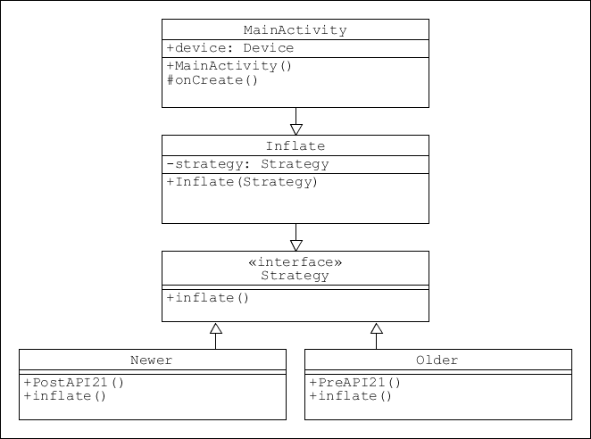
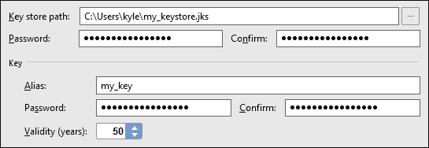
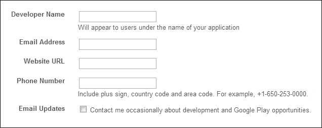
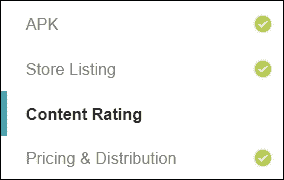
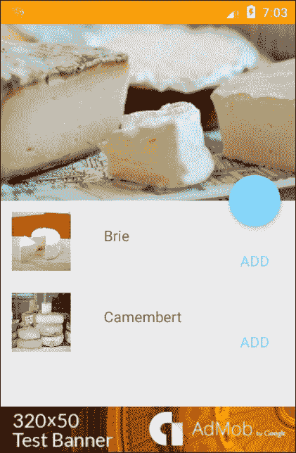

# 十三、发布模式

涵盖了安卓开发的大部分重要方面，我们只剩下部署和发布的过程。简单地让一个应用在谷歌 Play 商店发布并不是一个复杂的过程，但是我们可以应用一些技巧和诀窍来最大限度地发挥应用的潜力，当然，从我们的应用中赚钱的方法也越来越多。

在本章中，我们将了解如何在支持库提供的兼容性之外增加向后兼容性，然后继续了解注册和分发过程是如何工作的，然后我们将探索让我们的应用付费的各种方法。

在本章中，您将学习如何执行以下操作:

*   准备一个应用进行分发
*   生成数字证书
*   注册成为谷歌开发者
*   准备宣传材质
*   在GooglePlay商店发布应用
*   合并应用内计费
*   包括广告

# 扩大平台范围

我们在整本书中使用的支持库在让我们的应用在旧设备上可用方面做得非常好，但是它们并不适用于所有情况，许多新的创新根本无法在一些旧机器上实现。看看下面的设备仪表板，很明显，我们希望将我们的应用扩展回 API 级别 16:


我们已经看到了 AppCompat 库如何使我们的应用能够在比这更早的平台上运行，但是我们必须避免使用一些功能。例如，`view.setElevation()`方法(连同其他材质特性)在 API 等级 21 以下不起作用，如果被调用将导致机器崩溃。

人们很容易认为，我们可以简单地牺牲这些功能来获得更广泛的受众，但幸运的是，这不是必需的，因为可以通过以下条件子句动态检测我们的应用运行在哪个平台上:

```java
if (Build.VERSION.SDK_INT >= Build.VERSION_CODES.LOLLIPOP) { 
    someView.setElevation(someValue); 
} 

```

这总是取决于单个开发人员，但是这种质量上的轻微下降通常是值得潜在用户大量采用的。

然而，前面的例子很简单，添加这种动态向后兼容性通常需要大量额外的编码。一个很好的例子可能是 camera2 应用编程接口，它比它的前身复杂得多，但只在携带 API 21 和更高版本的设备上可用。在这种情况下，我们可以应用完全相同的原则，但需要建立一个更复杂的系统。该子句可能会导致调用不同的方法，甚至启动不同的活动。

然而，我们选择实现这个，我们当然可以使用设计模式。这里有几种方法可以使用，但最合适的可能是与这里看到的策略模式类似的策略模式:



这种方法可能经常需要相当多的额外编码，但是扩展的潜在市场通常使额外的工作非常值得。一旦我们像这样设置了应用的范围，它就可以发布了。

# 发布应用

不言而喻，你将在各种各样的手机和模拟器上彻底测试你的应用，并可能准备好你的宣传材质，查看GooglePlay政策和协议。在出版之前有很多事情要考虑，比如内容分级和国家发行。从编程的角度来看，在继续之前，我们只需要检查三件事:

*   从项目中删除所有日志记录，例如:

```java
    private static final String DEBUG_TAG = "tag"; 
    Log.d(DEBUG_TAG, "some info"); 

```

*   确保您的清单中声明了应用`label`和`icon`。这里有一个例子:

```java
    android:icon="@mipmap/my_app_icon" 
    android:label="@string/my_app_name" 

```

*   请确保您已经在清单中声明了所有必要的权限。这里有一个例子:

```java
    <uses-permission android:name="android.permission.INTERNET" /> 
    <uses-permission android:name="android.permission.ACCESS_NETWORK_STATE" /> 

```

我们现在距离在GooglePlay商店上看到我们的应用只有三步之遥。我们所需要做的就是生成一个 APK 签名版本，注册为GooglePlay开发者，最后将我们的应用上传到商店或在我们自己的网站上发布。还有一两种发布应用的方法，我们将在这一节的最后看到它们是如何完成的。首先，虽然，我们将开始生成一个 APK，准备上传到GooglePlay商店。

## 生成签名的 APK

所有发布的安卓应用都需要数字签名证书。这是用来证明一个 app 的真实性。与许多其他数字证书不同，没有授权，您持有签名的密钥，显然必须对其进行安全保护。为此，我们需要生成一个私钥，然后使用它来生成一个签名的 APK。GitHub 上有一些非常方便的工具来促进这个过程，但是在这里，为了帮助我们理解，我们将遵循传统的路线。这一切都可以在安卓工作室用生成签名 APK 向导来完成。这些步骤将带您度过难关:

1.  打开您想要发布的应用。
2.  从**构建|生成签名 APK 启动生成签名 APK 向导...**菜单。
3.  选择**新建...**在第一个屏幕上。
4.  在下一个屏幕上，提供密钥存储的路径和名称以及强密码。
5.  对别名执行同样的操作。
6.  Select a Validity of greater than 27 years, like so:

    

7.  至少填写一个证书字段。点击**确定**，你将被带回到向导。
8.  选择**释放**作为构建变量，点击**完成**。
9.  你现在有一个签名的 APK 准备出版。

密钥存储(一个`.jks`文件)可以用来存储任意数量的密钥(别名)。对所有应用使用同一个密钥是非常好的，在更新应用时，您必须使用同一个密钥。谷歌要求证书至少在 2033 年 10 月 22 日之前有效，任何超过这个日期的数字都足够了。

### 类型

**重要信息**至少保留一份密钥的安全备份。如果你失去了它们，你将无法开发这些应用的未来版本。

一旦我们有了我们的数字签名，我们就可以作为开发者注册到谷歌了。

## 注册为开发者

与签署 APK 协议一样，注册为开发者也同样简单。请注意，谷歌收取 25 美元的一次性费用和你的应用可能产生的任何收入的 30%。以下说明假设您已经拥有一个谷歌帐户:

1.  Review **Supported Locations** at the following URL:

    [support . Google . com/Google play/Android-developer/table/3541286？hl=en & rd=1](http://support.google.com/googleplay/android-developer/table/3541286?hl=en&rd=1)

2.  转到开发者游戏控制台:

    ```java
    play.google.com/apps/publish/
    ```

3.  Sign in with your Google account and enter the following information:

    

4.  阅读并接受**GooglePlay开发者分发协议**。
5.  用谷歌结账支付 25 美元，必要时创建一个账户，就这样，你现在是一个注册的谷歌开发者。

如果您打算让您的应用在全球范围内可用，那么检查“支持的位置”页面总是值得的，因为它会定期更改。剩下唯一要做的就是上传我们的 app，这是我们接下来要做的。

## 在GooglePlay商店发布应用

上传和发布我们的应用到 Play 商店是通过**开发者控制台**完成的。如您所见，在此过程中，我们可以提供大量关于我们应用的信息和宣传材质。如果您已经按照本章前面的步骤进行了操作，并且已经签署了发布就绪的`.apk` 文件，那么请完成以下说明来发布它。或者，您可能只想看一看此时涉及的内容以及促销材质将采取的形式。在这种情况下，请确保您有以下四张图片和一个签名的 APK，并在最后选择**保存草稿**，而不是**发布应用**:

1.  至少两张你的应用截图。这些不得有任何短于 320 px 或长于 3840 px 的边。
2.  如果您希望您的应用在 Play 商店中对搜索专为平板电脑设计的应用的用户可见，那么您应该准备至少一个 7 英寸和一个 10 英寸的屏幕截图。
3.  512 x 512 像素的高分辨率图标图像。
4.  1024 x 500 像素的特征图形。

准备好这些照片，并签名。`apk`，我们有了一切需要开始的东西。决定您希望对该应用收取多少费用，然后按照以下说明操作:

1.  打开开发人员控制台。
2.  提供一个**标题**，点击**上传 APK** 按钮。
3.  点击**上传你的第一个 APK 到生产**。
4.  找到您签署的`app-release.apk`文件。会在`AndroidStudioProjects\YourApp\app`里面。
5.  将此拖放到建议的空间中。
6.  完成后，您将进入申请页面。
7.  Work your way through the top four sections:

    

8.  填写所有必填字段，直到“发布”应用按钮变为可点击状态。
9.  如果你需要帮助，为什么我不能发表？按钮上方的链接将列出未完成的必填字段。
10.  完成所有必填字段后，点击页面顶部的 P **发布 app** (或**保存草稿**)按钮。
11.  恭喜你！你现在是一名已发布的安卓开发者。

我们现在知道如何在 Play 商店发布我们的应用。当然还有很多其他的应用市场，他们都有自己的上传程序。然而，GooglePlay提供了尽可能广泛的受众，是出版的明显选择。

尽管 Play 商店是理想的市场，但它仍然非常值得考虑两种可供选择的分销方法。

## 通过电子邮件和网站分发

这两种方法中的第一种听起来很简单。如果您将 APK 附加到电子邮件中，并且该邮件是在安卓设备上打开的，那么当附件打开时，用户将被邀请安装该应用。在更新的设备上，他们可以直接在电子邮件中点击安装按钮。

### 类型

对于这两种方法，您的用户必须允许在其设备的安全设置中安装未知来源。

从你的网站发布你的应用几乎和发邮件一样简单。您所需要做的就是将 APK 文件放在您网站的某个地方，并提供一个下载链接，如下所示:

```java
<a href="download_button.jpg" download="your_apk">. 

```

当从和安卓设备浏览您的网站时，点击您的链接将在他们的设备上安装您的应用。

### 类型

通过电子邮件分发并不能防止盗版，在使用时应该牢记这一点。其他方法都是我们所希望的安全方法，但是如果你想采取额外的措施，那么谷歌提供一个**授权服务**，可以在 developer.android.com/google/play/licensing.找到

无论我们发布的是付费应用还是免费应用，我们都希望能够接触到尽可能多的用户。谷歌提供了几个工具来帮助我们实现这一点，以及将我们的应用货币化的方法，我们将在下面看到。

# 推广应用并将其货币化

很少有应用在没有得到良好推广的情况下就成功了。有无数种方法可以做到这一点，毫无疑问，你将在如何推广你的产品方面走在前列。为了帮助你接触更广泛的受众，谷歌提供了一些方便的工具来帮助推广。

看完推广工具，我们将探索两种从我们的应用中赚钱的方式:应用内支付和广告。

## 推广应用

谷歌提供了两种非常简单的方法来帮助人们在 Play 商店中使用我们的产品:来自网站和我们应用的链接，以及**谷歌 Play 徽章**，它为我们的链接提供官方品牌。

我们可以向单个应用和我们的发布者页面添加链接，在这些页面上可以浏览我们所有的应用，我们可以在我们的应用和网站中包含这些链接:

*   要在 Play store 中包含指向特定应用页面的链接，请使用完整的软件包名称，如清单中所示，格式如下:

```java
        http://play.google.com/store/apps/details?id=com.full.package.name 

```

*   要将此包含在安卓应用中，请使用以下命令:

```java
        market://details?id= com.full.package.name 

```

*   如果您想要链接到您的发布者页面和您所有产品的列表，请使用以下命令:

```java
        http://play.google.com/store/search?q=pub:my publisher name 

```

*   从应用链接时，进行与以前相同的更改:

```java
        Market://search?q=pub:my publisher name 

```

*   要链接到特定的搜索结果，请使用以下命令:

```java
        search?q=my search query&c=apps. 

```

*   要使用官方谷歌徽章作为您的链接，请用此处突出显示的 HTML 替换前面的元素之一:

```java
        <a href="https://play.google.com/store/search?q=pub: publisher name"> 
         
        </a> 

```

徽章有`60.png`和`45.png`两种尺寸和两种样式，GooglePlay上的安卓应用和GooglePlay上的获取。只需更改相关代码，选择最适合您目的的徽章:


随着我们的应用的发布，以及到我们的 Play 商店页面的适当链接，现在是时候考虑我们如何从不可避免的下载中获利了，所以我们来看看如何货币化和安卓应用。

## 将应用货币化

从一款应用中赚钱的方式有很多，但最受欢迎和最有效的两种是**应用内计费**和**广告**。应用内计费可能会变得相当复杂，或许值得用整整一章来讲述。在这里，我们将看到如何构建一个有效的模板，您可以将其用作您可能开发的应用内产品的基础。它将包括所有需要的库和包，以及一些非常有用的助手类。

相比之下，在我们的应用中包含谷歌广告是我们现在非常熟悉的过程。广告实际上只是另一个视图，可以像任何其他安卓小部件一样被识别和引用。这一章的最后一个练习，实际上也是这本书的最后一个练习，将构建一个简单有效的 AdMob 演示。首先，让我们看看应用内计费。

## 应用内计费

用户可以从一个应用中购买大量产品，从升级和解锁到游戏中的对象和货币，这肯定会为我们在本书前面开发的三明治构建器应用提供一个支付选项。

无论用户购买的是什么，谷歌结账流程都会确保他们以支付其他 Play 商店产品的同样方式付款。从开发人员的角度来看，每次购买都会归结为对点击按钮的响应。我们将需要安装谷歌播放计费库，并添加一个 AIDL 文件和一些助手类到我们的项目。以下是如何:

1.  开始一个新的安卓项目，或者打开一个你想添加应用内计费的项目。
2.  打开软件开发工具包管理器。
3.  在“附加”下，确保安装了GooglePlay计费库。
4.  打开清单并应用此权限:

    ```java
            <uses-permission 
                android:name="com.android.vending.BILLING" /> 

    ```

5.  在项目窗格中，右键单击应用并选择**新建|文件夹| AIDL 文件夹**。
6.  从这个 AIDL 文件夹中，创建一个**新|包**，并称之为 com . Android . venking . billing。
7.  在`sdk\extras\google\play_billing`目录中找到并复制`IinAppBillingService.aidl`文件。
8.  将文件粘贴到`com.android.vending.billing`包中。
9.  在名为`com.` **的 Java 文件夹中创建一个**新包**，点击**完成**。**
10.  从`play_billing`目录中，找到并打开`TrivialDrive\src\com\example\android\trivialdrivesample\util`文件夹。
11.  将九个 Java 文件复制到您刚刚创建的 util 包中。

您现在有了一个工作模板，可用于任何希望在应用内购买的应用。或者，您可以在已经开发了应用内产品的项目中完成上述步骤。无论哪种方式，您无疑都将利用`IabHelper class`，它极大地简化了编码，为购买过程的每一步提供了监听器。文档可以在这里找到:

[https://developer . Android . com/Google/play/billing/index . html](https://developer.android.com/google/play/billing/index.html)

### 类型

在开始实施应用内购买之前，您需要为您的应用获取一个**许可证密钥**。这可以在开发人员控制台的应用详细信息中找到。

付费应用和应用内产品只是从应用中赚钱的两种方式，许多人选择了另一种通常利润丰厚的方式，通过广告将他们的工作货币化。**谷歌 AdMob** 允许很大的灵活性和熟悉的编程界面，我们将在下面看到。

## 包括一则广告

我们有很多方法可以从广告中赚钱，但 AdMob 提供了其中最简单的一种。该服务不仅允许您选择您希望广告的产品类型，还提供了出色的分析工具和无缝付款到您的结账帐户。

除此之外，**advview**可以用编程的方式处理，这种方式几乎与我们习惯和熟悉的方法相同，正如我们将在最后的练习中看到的，我们将开发一个带有演示横幅 AdMob ad 的简单应用。

在开始本练习之前，您需要在 google.com/admob:注册一个 AdMob 帐户

1.  打开一个你想测试广告的项目，或者开始一个新的安卓项目。
2.  确保您已经在软件开发工具包管理器中安装了谷歌存储库。
3.  在`build.gradle`文件中，添加该依赖项:

    ```java
        compile 'com.google.android.gms:play-services:7.0.+' 

    ```

4.  重建项目。
5.  在清单中，设置这两个权限:

    ```java
        <uses-permission 
            android:name="android.permission.INTERNET" /> 
        <uses-permission android:name="android.permission.ACCESS_NETWORK_STATE" /> 

    ```

6.  在应用节点内，添加此`meta-data`标签:

    ```java
    <meta-data 
        android:name="com.google.android.gms.version" 
        android:value="@integer/google_play_services_version" /> 

    ```

7.  在清单中包含第二个活动:

    ```java
    <activity 
        android:name="com.google.android.gms.ads.AdActivity" 
        android:configChanges=
        "keyboard|keyboardHidden|orientation|screenLayout|uiMode|screenSize|smallestScreenSize" 
        android:theme="@android:style/Theme.Translucent" /> 

    ```

8.  将以下字符串添加到`res/values/strings.xml`文件中:

    ```java
    <string name="ad_id">ca-app-pub-3940256099942544/6300978111</string> 

    ```

9.  打开`main_activity.xml`布局文件。
10.  将第二个命名空间添加到根布局中:

    ```java
    xmlns:ads="http://schemas.android.com/apk/res-auto" 

    ```

11.  将此`AdView`添加到`TextView`下:

    ```java
    <com.google.android.gms.ads.AdView 
        android:id="@+id/ad_view" 
        android:layout_width="match_parent" 
        android:layout_height="wrap_content" 
        android:layout_alignParentBottom="true" 
        android:layout_centerHorizontal="true" 
        ads:adSize="BANNER" 
        ads:adUnitId="@string/ad_id"></com.google.android.gms.ads.AdView> 

    ```

12.  在`MainActivity`的`onCreate()`方法中，插入以下行:

    ```java
    AdView adView = (AdView) findViewById(R.id.ad_view); 
    AdRequest adRequest = new AdRequest.Builder() 
            .addTestDevice(AdRequest.DEVICE_ID_EMULATOR) 
            .build(); 

    adView.loadAd(adRequest); 

    ```

13.  Now test the app on a device.

    

我们在这里所做的一切或多或少都类似于我们对任何其他元素进行编程的方式，只有一两个例外。使用`ACCESS_NETWORK_STATE`许可并不是绝对必要的；它在这里用于在请求广告之前检查连接。

任何显示广告的活动都需要单独的标识，并在清单中声明。此处提供的标识仅用于测试目的，因为不允许使用实时标识进行测试。`android.gms.ads`包中只有 6 个类，所有类的文档都可以在[developer . Android . com/reference/com/Google/Android/GMS/ads/package-summary](http://developer.android.com/reference/com/google/android/gms/ads/package-summary)找到。

AdMob 广告有两种风格，我们在这里看到的横幅广告和填隙式或全屏广告。我们在这里只处理横幅广告，但间隙广告的处理方式非常相似。了解了如何实施付费应用、应用内计费和 AdMob，我们现在已经准备好收获辛勤工作的回报，充分利用我们的应用。

# 总结

本章已经概述了应用开发的最后阶段，虽然这些阶段只占工作负载的一小部分，但它们本质上很重要，并且在应用的成功方面会有很大的不同。

在整本书中，我们非常依赖支持库来增加我们的应用可以运行的设备数量，但在这里，我们看到了如何通过动态确定平台并相应地运行适当的代码来进一步扩展这个范围。这个过程为设计模式如何渗透到编程的各个方面提供了一个可爱的例子。

一旦我们使用了这些工具来扩展我们的覆盖范围，我们就可以通过谨慎的推广来进一步提高我们的应用的成功机会，并希望通过直接向用户收取应用或其功能的费用，或者通过托管广告来间接使我们的工作付费。

在整本书中，我们已经研究了设计模式如何在开发的许多方面帮助我们，但是是一种思维方式使得模式如此有用，而不是任何单独的模式本身。设计模式提供了解决问题的方法和解决方案的清晰路径。这是一种旨在引导我们找到新的创造性解决方案的方法，设计模式不应被视为写在石头上，而应更多地被视为一种指南，任何模式都可以修改和改变，以更好地适应其目的。

本书中的模式和示例并不是为了剪切和粘贴到其他项目中而设计的，而是作为一种方法来帮助我们找到最优雅的解决方案来解决我们自己的原始情况。如果这本书已经完成了它的工作，那么你继续设计的模式将不是这里概述的模式，而是你自己全新的原创作品。