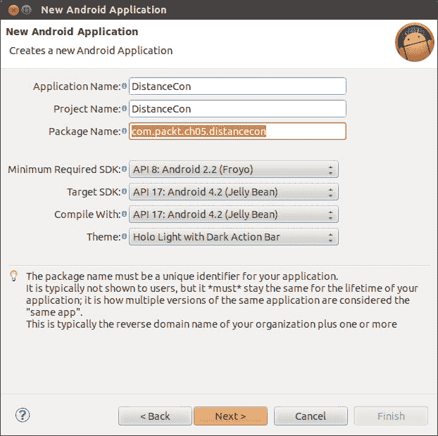
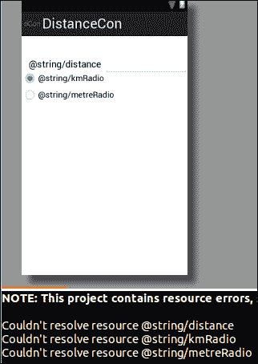
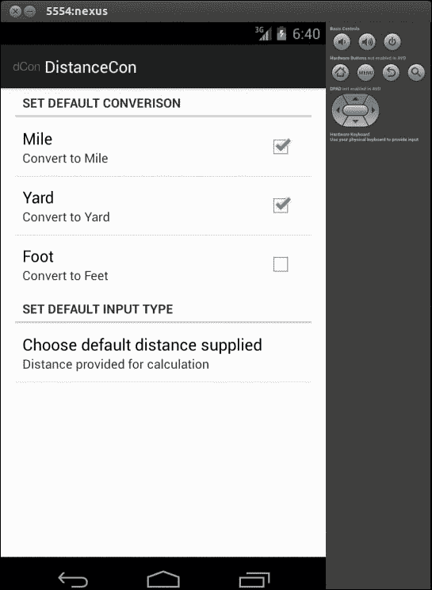

# 五、添加单选按钮、复选框、菜单和首选项

你够兴奋吗？如果不是，你应该是；我们已经进行了一半，并准备探索更多常用的小部件，这些小部件在任何应用中都有很大的意义。本章要介绍的内容是向应用添加菜单、复选框、单选按钮和首选项。我们将利用这些小部件并创建`DistanceConverter`应用。该应用的主要目标是将以千米/米为单位输入的距离转换为英里/英尺和码。以下是我们在本章中介绍的成功创建`DistanceConverter`应用的步骤:

*   创建项目:`DistanceConverter`
*   添加无线电组。单选按钮
*   添加复选框
*   添加菜单
*   定义字符串
*   定义首选项屏幕
*   勾搭
*   绑定菜单和首选项
*   从首选项获取值
*   运行应用

# 创建新项目

`DistanceConverter`应用将允许用户以千米/米为单位输入距离，并同时将其转换为英里、英尺和码。在前面的章节中，我们已经介绍了创建一个新项目，因此这里我们将保持简短。让我们通过导航到**文件** | **新建** | **其他** | **安卓应用项目**来创建一个新项目。在相应的向导中输入下表中的配件数据:

<colgroup><col style="text-align: left"> <col style="text-align: left"></colgroup> 
| 

财产

 | 

价值

 |
| --- | --- |
| 应用名称 | `DistanceCon` |
| 项目名称 | `DistanceCon` |
| 包装名称 | `com.packt.ch05.distancecon` |
| 模板 | `BlankActivity` |
| 活动 | `MainActivity` |
| 布局 | `activity_main` |

下面的屏幕显示了根据前面的表格在向导中填充的一些数据:



# 添加收音机组、收音机按钮和文本字段

安卓软件开发工具包提供了两种类型的无线电控件结合使用，在给定的时间只能选择一个控件。RadioGroup ( `android.widget.RadioGroup`)用于为此封装一组 RadioButton 控件。

在我们添加收音机组和收音机按钮控件之前，让我们添加标签`Distance`和文本字段以允许用户提供输入。打开`the activity_main.xml`文件，添加以下条目:

```java
  <TextView
        android:id="@+id/textView1"
        android:layout_width="wrap_content"
        android:layout_height="wrap_content"
        android:layout_alignParentLeft="true"
        android:layout_alignParentTop="true"
        android:layout_marginLeft="14dp"
        android:layout_marginTop="44dp"
        android:text="@string/distance "
        android:textAppearance="?android:attr/textAppearanceMedium" />
    <EditText
        android:id="@+id/distText"
        android:layout_width="wrap_content"
        android:layout_height="wrap_content"
        android:layout_alignBaseline="@+id/textView1"
        android:layout_alignBottom="@+id/textView1"
        android:layout_toRightOf="@+id/textView1"
        android:ems="10"
        android:inputType="numberDecimal|numberSigned" />
```

让我们返回并在其中添加收音机组和收音机按钮。将以下条目添加到同一文件中:

```java
<RadioGroup android:id="@+id/distanceRadioGp"
        android:layout_width="wrap_content"
        android:layout_height="wrap_content"
        android:layout_alignParentLeft="true"
        android:layout_below="@+id/distText">
        <RadioButton android:id="@+id/kmRadiobutton"
            android:layout_height="wrap_content"
            android:layout_width="wrap_content"
            android:checked="true"
            android:text="@string/kmRadio">
        </RadioButton>
        <RadioButton  android:id="@+id/metreRadioButton"
            android:layout_width="wrap_content"
            android:layout_height="wrap_content"
            android:text="@string/metreRadio">
        </RadioButton>
</RadioGroup>
```

我们已将`android:checked="true"`设为默认检查。在这一步之后，我们会看到一些错误，不要担心它们，因为我们还没有定义这些字符串。

以下截图是我们在 XML 文件中添加前面的代码后可能看到的内容:



# 添加复选框

我们将使用 CheckBox 允许用户同时拥有多种转换类型的转换工具。要添加复选框，请在`activity_main.xml`中添加以下代码。我们将为每个选项设置三个复选框:英里、英尺和码；使用以下方法可以实现同样的效果:

```java
<CheckBox
        android:id="@+id/checkBoxFoot"
        android:layout_width="wrap_content"
        android:layout_height="wrap_content"
        android:layout_alignLeft="@+id/textView1"
        android:layout_below="@+id/checkBoxMile"
        android:text="@string/toFoot">   
</CheckBox>
<CheckBox
        android:id="@+id/checkBoxYard"
        android:layout_width="wrap_content"
        android:layout_height="wrap_content"
        android:layout_alignLeft="@+id/checkBoxFoot"
        android:layout_below="@+id/checkBoxFoot"
        android:text="@string/toYard">
</CheckBox>
<CheckBox
        android:id="@+id/checkBoxMile"
        android:layout_width="wrap_content"
        android:layout_height="wrap_content"
        android:layout_alignLeft="@+id/checkBoxFoot"
        android:layout_below="@+id/distanceRadioGp"
        android:layout_marginTop="40dp"
        android:text="@string/toMile">
</CheckBox>
```

另外添加一个按钮，点击该按钮，转换开始:

```java
<Button
        android:id="@+id/calButton"
        android:layout_width="wrap_content"
        android:layout_height="wrap_content"
        android:layout_alignParentBottom="true"
        android:layout_centerHorizontal="true"
        android:layout_marginBottom="60dp"
        android:onClick="onClick"           
        android:text="@string/calc">
</Button>
```

生成的屏幕应该如下所示:


# 添加菜单

我们将从菜单中调用 `Preference`屏幕。基本上有三种不同类型的菜单可用:选项菜单、上下文菜单和弹出菜单。在这里，我们将使用选项菜单。要在`res/menu`下添加菜单，创建一个名为`prefsetting.xml`的新文件。通过添加以下代码，使用`<item></item>`元素添加菜单项:

```java
<menu xmlns:android="http://schemas.android.com/apk/res/android"
    <item android:id="@+id/menusettings"
        android:showAsAction="never"
        android:title="Preferences"
        android:orderInCategory="100">  
    </item>
</menu>
```

菜单项的名称设置为`android:title="Preferences"`。`android:showAsAction`关键字指示项目应该如何出现在动作栏中。有关更多菜单选项和属性，请参考以下网址:

*   [http://developer.android.com/guide/topics/ui/menus.html](http://developer.android.com/guide/topics/ui/menus.html)
*   [http://developer . Android . com/guide/topics/resources/menu-resource . html](http://developer.android.com/guide/topics/resources/%E2%80%A8menu-resource.html)

# 定义字符串

在**分辨率/值**选项卡下，打开`strings.xml`并添加以下条目:

```java
<string name="menu_settings">Settings</string
    <string name="distance ">Distance</string>
    <string name="kmRadio">Km</string>
    <string name="metreRadio">Metre</string>
    <string name="calc">Calculate</string>
    <string name="toMile">Mile</string>
    <string name="toFoot">Feet</string>
    <string name="toYard">Yard</string>
```

在这一步之后，所有以前的详细错误应该会消失。

# 定义首选项屏幕

偏好是安卓应用的一个重要方面。它允许用户选择修改和个性化它。首选项可以通过两种方式设置:第一种方法是在`res/xml`目录中创建`preferences.xml`文件，第二种方法是从代码中设置首选项。我们将使用前者，也是更简单的一个，通过创建`preferences.xml`文件如下:

创建`xml`目录，如果不退出，添加`preferences.xml`文件。每个首选项都需要以下属性，如下表所示:

<colgroup><col style="text-align: left"> <col style="text-align: left"></colgroup> 
| 

财产

 | 

描述

 |
| --- | --- |
| `android:key` | 用于获取首选项值 |
| `android:title` | 指定安卓标题 |
| `android:summary` | 关于首选项的摘要 |
| `android:defaultValue` | 可选，用于设置默认值 |

通常，有五种不同的首选项视图，如下表所示:

<colgroup><col style="text-align: left"> <col style="text-align: left"></colgroup> 
| 

视图

 | 

描述

 |
| --- | --- |
| `CheckBoxPreference` | 简单复选框返回真/假 |
| `ListPreference` | 显示单选按钮组，仅选择了 1 个项目 |
| `EditTextPreference` | 显示编辑文本视图对话框，返回字符串 |
| `RingTonePreference` | 显示铃声的收音机群组 |
| `PreferenceCategory` | 是一个有偏好的类别 |

我们将在我们的应用中使用`CheckBoxPreference``ListPreference`和`PreferenceCategory`。让我们在已经创建的`preferences.xml`文件中添加这些首选项视图。添加以下条目:

```java
<?xml version="1.0" encoding="utf-8"?>
<PreferenceScreen xmlns:android="http://schemas.android.com/apk/res/android" >
  <PreferenceCategory  android:title="Set Default Converison ">
      <CheckBoxPreference  android:title="@string/convertToMile"
          android:key="inputUserMile"
          android:summary="@string/summaryMile"
          android:defaultValue="false">   
      </CheckBoxPreference>
      <CheckBoxPreference  android:title="@string/convertToYard"
          android:key="inputUserYard"
          android:summary="@string/summaryYard"
          android:defaultValue="false">   
      </CheckBoxPreference>
      </PreferenceCategory>
      <CheckBoxPreference  android:title="@string/convertToFeet"
          android:key="inputUserFt"
          android:summary="@string/summaryFt"
          android:defaultValue="false">   
      </CheckBoxPreference>
      <PreferenceCategory android:title="@string/prefInputType">
      <ListPreference android:title="@string/inputTypeList"
          android:key="inputTypeKey"
          android:summary="@string/userInputSummary"
          android:entries="@array/inputEntry"
          android:entryValues="@array/inputValues">
      </ListPreference>    
      </PreferenceCategory
</PreferenceScreen>
```

这将导致许多错误，但是我们现在将通过定义字符串来解决这个问题。`ListPreference`提供一个列表，只允许选择一个项目，因此，包含`android:entries,`和`android:entryValues`取数组。现在我们将为其提供数组声明，在`res/values`下进行，如果它不存在，创建文件`arrays.xml`并添加以下条目:

```java
<?xml version="1.0" encoding="utf-8"?>
<resources>
    <string-array name="inputEntry">
        <item >Distance in Km</item>
        <item >Distance in Metre</item>
    </string-array>
    <string-array name="inputValues">
        <item >1</item>
        <item >2</item>
    </string-array>
</resources>
```

在`strings.xml`文件中定义`preferences.xml`文件中使用的以下字符串。

```java
<string name="prefInputType">Set Default Input Type</string>
    <string name="userInputSummary">Distance  provided for
      calculation</string>
    <string name="convertedSummary">Summary of Conversion</string>
    <string name="convertToMile">Mile</string>
    <string name="convertToYard">Yard</string>
    <string name="convertToFeet">Foot</string>
    <string name="summaryMile">Convert to  Mile</string>
    <string name="summaryYard">Convert to Yard</string>
    <string name="summaryFt">Convert to Feet</string>
    <string name="inputTypeList">Choose default  distance supplied
      </string>
```

既然我们已经完成了首选项屏幕的定义，让我们做一些工作来展示它。偏好框架自带活动类`android.preference`。`PreferenceActivity`需要用我们的类覆盖。在`com.packt.ch05.distnacecon`包下创建一个类`UserSettings.java`，并编写以下代码:

```java
package com.packt.ch05.distancecon;
import android.os.Bundle;
import android.preference.PreferenceActivity;

public class UserSettings extends PreferenceActivity {

@Override
  public void onCreate(Bundle savedInstanceState){
  super.onCreate(savedInstanceState);
    addPreferencesFromResource(R.xml.preferences);
}
}
```

`addPreferencesFromResources()`从`preferences.xml`文件加载首选项屏幕。

# 勾搭

在完成了定义和放置东西的所有艰苦工作之后，让我们开始做一些动作，将所有东西与主屏幕(主活动)连接起来。打开`MainActivity.java`文件，我们现在把东西绑定进去。

按照以下方式初始化小部件:

```java
  private EditText text;
  private RadioButton rBtnKm;
  private RadioButton rBtnMtr;
  private CheckBox cBoxMile;
  private CheckBox cBoxFt;
  private CheckBox cBoxYd;
```

首先调用`onCreate`方法获取小部件的实例，如下所示:

```java
protected void onCreate(Bundle savedInstanceState) {
    super.onCreate(savedInstanceState);
    setContentView(R.layout.activity_main);
    text= (EditText)findViewById(R.id.distText);

rBtnKm=(RadioButton)findViewById(R.id.kmRadiobutton);
rBtnMtr= (RadioButton )findViewById(R.id.metreRadioButton);
cBoxMile = (CheckBox) findViewById(R.id.checkBoxMile);
cBoxFt = (CheckBox) findViewById(R.id.checkBoxFoot);
cBoxYd = (CheckBox) findViewById(R.id.checkBoxYard);
}
```

## 绑定菜单和偏好

我们通过`getMenuInflater().inflate(R.menu.prefsetting, menu)`命令从资源文件`prefesetting.xml`中指定我们的早期定义的菜单如下:

```java
  public boolean onCreateOptionsMenu(Menu menu) {
    // Inflate the menu; this adds items to the action bar if
      it is present.
    getMenuInflater().inflate(R.menu.prefsetting, menu);
    return true;
    }
```

在菜单项上选择`override`方法，如下所示:

```java
public boolean onOptionsItemSelected(MenuItem item) {
        switch (item.getItemId()) {
        case R.id.menusettings:
          //Get  the intent Preference Activity
          Intent i = new Intent(this, UserSettings.class);
            //Start the intent  and return the result       
            startActivityForResult(i, 1);
            break;
        }
        return true;
    }
```

`onActivityResult`是从下面的代码中接收结果调用的，所以执行这里需要的操作:

```java
protected void onActivityResult(int requestCode, int resultCode, Intent data) {
          super.onActivityResult(requestCode, resultCode, data);

          switch (requestCode) {
          case  1:
              showPreferenceSettings();
              break;
          }
      }
```

## 从首选项获取值

现在，我们希望将偏好设置屏幕中设置的值反映到主屏幕上，以显示个性化。

我们从首选项屏幕获取值，并在`showPreferenceSettings()`中将其设置回主屏幕。我们通过`PreferenceManager`获得偏好值。

```java
private void showPreferenceSettings(){
    SharedPreferences sharedPrefs = 
      PreferenceManager.getDefaultSharedPreferences(this);

    if(sharedPrefs.getBoolean("inputUserMile", false))
        cBoxMile.setChecked(true);
    if(sharedPrefs.getBoolean("inputUserYard", false))
        cBoxYd.setChecked(true);
    if(sharedPrefs.getBoolean("inputUserFt", false))
        cBoxFt.setChecked(true);
  }
```

点击 **计算**按钮，转换应该发生，结果应该显示。为了显示结果，我们在这里使用了 ToastView 命令。

点击按钮时调用 `onClick`函数，然后我们获得单选按钮值和选中的复选框值，并调用相应的转换函数，然后通过 ToastView 显示以下代码:

```java
public void onClick(View view ){
    StringBuffer dist =new StringBuffer();
    switch (view.getId()){
    case R.id.calButton:
      if(text.getText().length()==0){
        Toast.makeText(this, "Please enter the valid number ",
          Toast.LENGTH_LONG).show();
        return ;
      }

        double distValue=Double.parseDouble
          ((text.getText().toString()));
      //Find  RadioButton is checked
      if(rBtnKm.isChecked()){
      //Find checkBox is checked
        if(cBoxMile.isChecked()){
          double km=convertKmToMile(distValue);
          dist.append(km+"Mile.");
        }
        if(cBoxYd.isChecked()){
          double yd=convertkmToYard(distValue);
          dist.append("   "+yd+"yard.");
        }
        if(cBoxFt.isChecked()){
          double ft=convertkmToFoot(distValue);
          dist.append("   "+ft+"ft.");
        }

        Toast.makeText(this,dist,Toast.LENGTH_SHORT).show();
      }
      if(rBtnMtr.isChecked()){
        if(cBoxMile.isChecked()){
          double km=convertMToMile(distValue);
          dist.append(km+"Mile.");
        }
        if(cBoxYd.isChecked()){
          double yd=convertMtoYard(distValue);
           dist.append("   "+yd+"yard.");
         }
         if(cBoxFt.isChecked()){
           double ft=convertMtoFoot(distValue);
           dist.append("   "+ft+"ft.");
         }
         Toast.makeText(this,dist,Toast.LENGTH_SHORT).show();
       }
       return;
     }

  }
```

让我们为每种类型增加转换方法如下:

```java
  private double convertKmToMile(double distance ){
    return (distance*0.62137);
  }

  private double convertkmToYard(double distance){
    return distance*1093.6;
  }
```

为其他方法添加另一种转换方法。

最后，在`AndroidManifest.xml`文件中添加以下表示活动的标签。

```java
<activity android:name=".UserSettings" />
```

完整的代码和资源可以从可下载的源代码中获得。

# 运行应用

当我们运行应用时，应出现以下屏幕，其中第一个屏幕接受输入，而输出显示为点击**计算**按钮时的视图弹出窗口:


以下截图显示了首选项屏幕:



# 总结

在本章中，我们已经了解了如何使用小部件，例如 CheckBox、RadioButton 以及 RadioButton、菜单，并创建自定义首选项视图和从中获取值。同样，使用这些概念，我们创建了`DistanceConverter`应用。

在下一章中，我们将学习如何处理该应用的各种屏幕类型和方向。