# 二、高效调试

每个开发人员都很早就熟悉了“bug”这个词，这种关系将持续他们的整个职业生涯。 **bug** 是软件系统中的一个错误或缺陷，会引发意想不到的错误结果。

关于这个词的词源有一些讨论。它最初旨在描述硬件系统中的技术故障，第一次提到它的用法来自托马斯·爱迪生。计算机先驱格蕾丝·赫柏显然在 1946 年追踪了计算机马克 2 号的故障，找到了被困在继电器里的一只飞蛾。这种物理错误最终不仅表现为困在机器内部并导致故障的物理错误，还表现为逻辑错误或软件错误。

**调试**在的上下文中，是发现软件系统中的错误或故障的过程。调试涉及许多因素，包括读取日志、内存转储和分析、分析和系统监控。在开发阶段，或者当在生产系统中检测到错误时，开发人员将调试软件应用来检测缺陷并继续修复它。

如果你是安卓开发者，谷歌提供了一大套工具，我们可以用来调试我们的应用。这本书将基于安卓工作室套件和谷歌的官方软件开发工具包——尽管其他外部工具也可以在这个过程中有所帮助。

# 安卓调试桥

**安卓调试桥**，更俗称 **ADB** ，是安卓的核心工具。它包含在安卓软件开发工具包的文件夹/平台工具中。如果您转到该文件夹并调用命令`adb`，您将在屏幕上看到可用选项的列表。

### 类型

如果你现在还没有这样做，这是一个生产力提示，可能会在与亚行合作的第一分钟得到回报。在你的`PATH`环境变量中添加你存储安卓软件开发工具包的位置。从此刻起，您将能够从系统的任何部分调用该文件夹中包含的所有工具。

借助`adb`，我们可以进行多种操作，包括显示设备、截图或连接和断开不同设备。本书的目的不是全面回顾工具的每一个操作，而是在这里，我们列出了`adb`最常见和最有用的功能:

<colgroup><col style="text-align: left"> <col style="text-align: left"> <col style="text-align: left"></colgroup> 
| 

#

 | 

命令

 | 

描述

 |
| --- | --- | --- |
| one | `adb logcat *:E&#124;D&#124;I` | 在控制台中启动`logcat`，通过错误、调试消息或信息消息进行过滤 |
| Two | `adb devices` | 列出所有连接到`adb`的设备 |
| three | `adb kill-server``adb start-server` | 杀死并重启`adb`服务器。当`adb`卡住或出现故障时的有用信息 |
| four | `adb shell` | 在目标设备或模拟器中启动远程 shell |
| five | `adb bugreport` | 将`dumpsys`、`dumpstate`和`logcat`的所有内容打印到屏幕上 |
| six | `adb help` | 打印包含所有`adb`可执行命令的列表 |

`adb`的一个有趣的事实是，作为一个命令行工具，它可以用于脚本编写，并包含在**持续集成** ( **CI** )系统中，例如 Jenkins。通过使用`adb`外壳，我们可以执行设备中的任何命令。例如，让我们考虑一个有用的脚本，它可以截取设备屏幕的截图:

```java
adb shell screencap -p /sdcard/screenshot.png
adb pull /sdcard/screenshot.png
adb shell rm /sdcard/screen.png

```

我们将在本书中探索`adb`的许多可能性。

# 达尔维克调试监控服务器

**达尔维克调试监控服务器**也是被称为 **DDMS** 。该实用程序运行在`adb`之上，并提供了一个具有大量功能的图形界面，包括线程和堆信息、日志、短信/呼叫模拟、位置数据等。这就是 DDMS 开始时的样子:

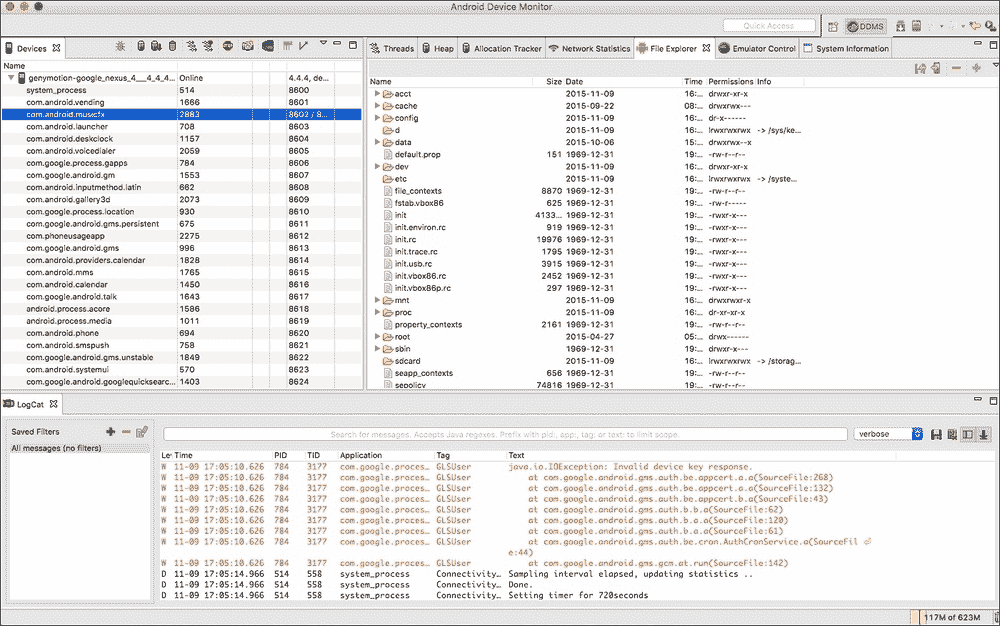

屏幕有不同的部分:

1.  左上角部分显示了活动设备和设备上运行的不同进程。
2.  右上角部分显示了各种选项，默认选项是文件资源管理器。在底部，显示**日志文件**。

在 DDMS 有更多的选择，所以让我们详细探讨一下。首先，我们在左上角看到的部分:

1.  图标开始调试所选进程。
2.  每次为所选进程触发垃圾收集时，图标将更新堆(稍后将提供更多信息)。
3.  下一个图标将 HPROF 转储到一个文件中。 **HPROF** 是一种包含应用堆快照的二进制格式。有一些工具可以可视化它们，比如 jhat。稍后，我们将展示一个如何转换该文件并将其可视化的示例。
4.  选项将在我们的应用中导致垃圾收集(对前面的条目有用)。
5.  图标更新 DDMS 的线程。当我们处理多线程应用时，这将非常方便。
6.  借助图标，我们可以开始分析线程并显示关于它们的准确信息。稍后将展示一个完整的示例。
7.  要停止进程运行，我们可以使用图标。
8.  要截图，点击图标就可以了。
9.  借助，我们可以获得视图层次的快照，并将其发送到 UI automator。
10.  选项在安卓系统的帮助下捕捉系统范围内的轨迹。
11.  图标开始捕捉 OpenGL 轨迹。

# 捕捉并分析线程信息

现在我们想看看如何处理线程调试。设置断点并等待线程被调用的传统方法在这里不会很好地工作，因为多线程应用可能有几个线程同时运行并且彼此独立。因此，我们希望独立地可视化和访问它们。

在列表左侧选择一个流程，点击图标。如果现在单击右侧的线程部分，您将看到该部分是如何更新当前进程的线程信息的:

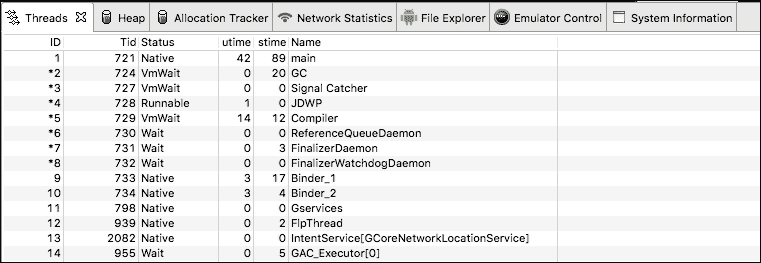

### 注

一些开发人员对什么是进程和线程感到困惑，所以以防万一:进程提供了执行程序所需的资源(虚拟地址空间、可执行代码、安全上下文等)。流程是流程执行的实例(在某些上下文中也称为任务)。几个进程可以与同一个程序相关联，当机器重新启动时，它们就会消失。线程是进程的子集。一个进程可以由多个线程组成，并且多个线程利用多处理器系统中的并行性。同一个进程中的所有线程共享一个空间地址和一个堆栈或文件描述符。

我们可以在屏幕上看到每个线程的不同信息:每个线程都有一个 ID、一个线程 ID (Tid)、一个状态、一个 utime(执行用户代码的累计时间，以“jiffies”为单位，通常为 10 ms)、stime(执行系统代码的累计时间，也以 jiffies 为单位)和一个名称。如果我们点击其中一个进程，我们将在紧接其下的部分中可视化该进程的堆栈跟踪。

我们已经提到螺纹可以成型。这通常用于调试内存泄漏。在我们开始分析之前，请记住几个注意事项:

*   应用编程接口级别 7(安卓 2.1)下的设备将需要 SD 卡，因为配置文件将保存在那里
*   API 级以上的设备不需要 SD 卡

点击图标。在 API Level 19 (Android 4.4)以上的 Android 设备上，如果您更喜欢基于跟踪的分析，系统会提示您选择采样频率。当这个被激活时，DDMS 将捕获关于所选进程的信息，所以你只需要与你的应用交互。准备就绪后，再次单击图标(现在看起来像)停止探查器并转储获得的信息。将出现如下屏幕:

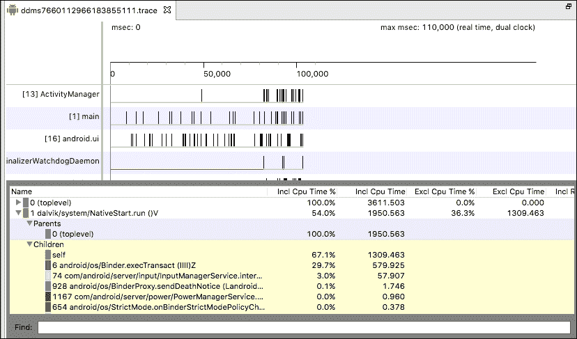

每一行代表一个单独线程的执行，随着我们移动到右侧，时间增加。每个方法的执行都以不同的颜色显示。

在这个新屏幕的底部是一个轮廓面板。此表以百分比和绝对值的形式显示了包括和不包括的 CPU 时间。独占时间是指我们在方法中花费的时间，包含时间是指我们在方法和所有被调用的函数中花费的时间。调用方法在此称为父方法，方法称为子方法。

### 注

探查器有一个众所周知的问题:虚拟机重用线程标识。如果一个线程停止，另一个线程启动，它们可能会获得相同的 ID。这可能会导致数据混乱，因此请确保在分析时正确处理线程。

# 堆分析和可视化

我们已经学习了如何使用 DDMS 调试线程。现在，我们将学习如何正确分析应用的内存堆:即分配内存所在的内存部分。这在调试内存泄漏时非常重要。

让我们使用一个堆转储来追踪问题。点击图标转储 HPROF 文件，选择要保存文件的位置。现在在文件上运行`hprof-conv`。`hprof-conv`是一个安卓实用程序，将`.hprof`文件从达尔维克格式转换为 J2SE HPROF 格式，因此可以用标准工具打开。可以在`/platform-tools`下找到。要运行它，您需要键入以下内容:

```java
hprof-conv dump.hprof converted-dump.hprof

```

现在，您将拥有一个可以被一些标准工具理解的文件。为了读取文件，我们将使用 MAT，一个可从[http://www.eclipse.org/mat/downloads.php](http://www.eclipse.org/mat/downloads.php)下载的独立版本。

MAT 是一个非常复杂和强大的工具。点击**文件**，打开**堆存**。您将会看到一个类似于下面的屏幕:

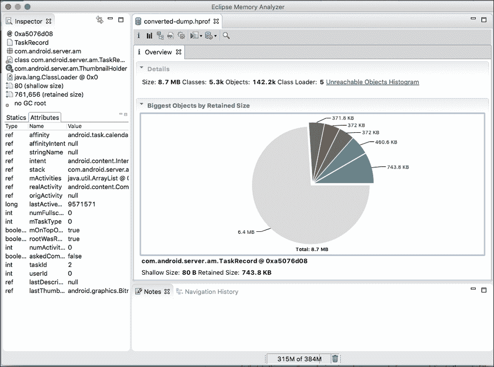

如果我们点击其中一个组，我们将显示一组选项。一个特别有趣的是**直方图**。在直方图中，可以看到按实例数量、使用的内存总量或活动内存总量过滤的类。

如果我们右击其中一个类并选择**列表对象**选项，然后使用传入的引用，将产生堆中呈现的类列表。这可以通过以后的使用来订购。通过选择一个，我们可以显示保持对象活动的引用链。我们本身无法知道这是否意味着存在内存泄漏，但是具有该领域知识的程序员可以确定其中一个值是否应该不再存在:

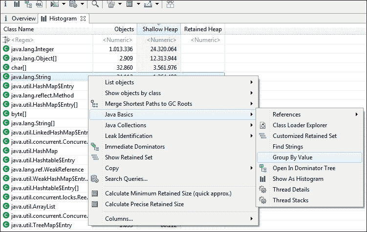

我们也可以想象 DDMS 的堆。如果我们选择一个进程并点击图标，堆部分将更新应用中当前存在的所有不同数据类型和对象的信息。也可以手动激活 GC，以便用最新信息更新 DDMS。

这里可以看到每种类型的对象数量，它们的总大小(包括最小和最大对象的值，非常有助于识别`OutOfMemoryExceptions`何时发生)，以及每个对象的中间值和平均大小:

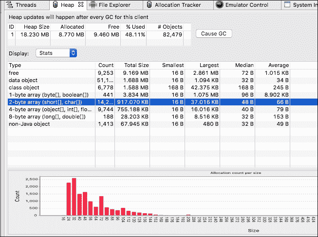

# 分配跟踪器

分配跟踪器是安卓提供的一个工具，它记录应用的内存分配，并列出分析周期中所有分配的对象及其调用堆栈、大小和分配代码。这比内存堆更进一步，允许我们识别正在创建的单个内存块。识别代码中可能低效分配内存的位置以及识别在短时间内被分配和释放的相同类型的对象是很好的。

要开始使用分配跟踪器工具，请在左侧选择您的流程，在右侧窗格中选择**分配跟踪器**部分，然后单击**停止跟踪**按钮。将会打开一个类似于下面的窗口:

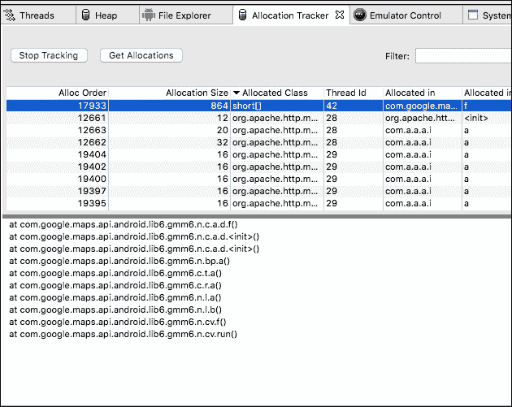

的信息量可能是压倒性的，因此，在底部有一个过滤器，您可以指定您想要获取哪些信息。如果您单击其中一行，分配对象的位置将打印在屏幕上。请注意，在我们的特殊情况下，我们显示的是关于包含在谷歌地图应用编程接口中的对象的信息，并且类是用字母命名的。这意味着代码被混淆了。

使用 ProGuard 混淆代码是一种基本的安全机制。ProGuard 不仅优化了代码并摆脱了样板文件，还使假设的攻击者很难看到我们的代码，并最终玩它。此外，每行代表一个内存分配事件。每一列表示关于分配的信息，例如对象类型、线程及其大小。

# 网络使用情况

在安卓 4.0 中，**设置**中的**数据使用**功能可以长期监控应用如何使用网络资源。从安卓 4.0.3 开始，可以实时监控使用网络资源的应用。也可以在使用前通过对网络套接字应用标签来区分流量来源。

要显示应用的网络使用情况，请从左侧选择一个进程。然后转到**网络统计**选项卡，点击**开始**按钮。您可以选择跟踪速度:每 100、250 或 500 毫秒。然后，与您的应用交互。将显示与以下屏幕类似的屏幕:

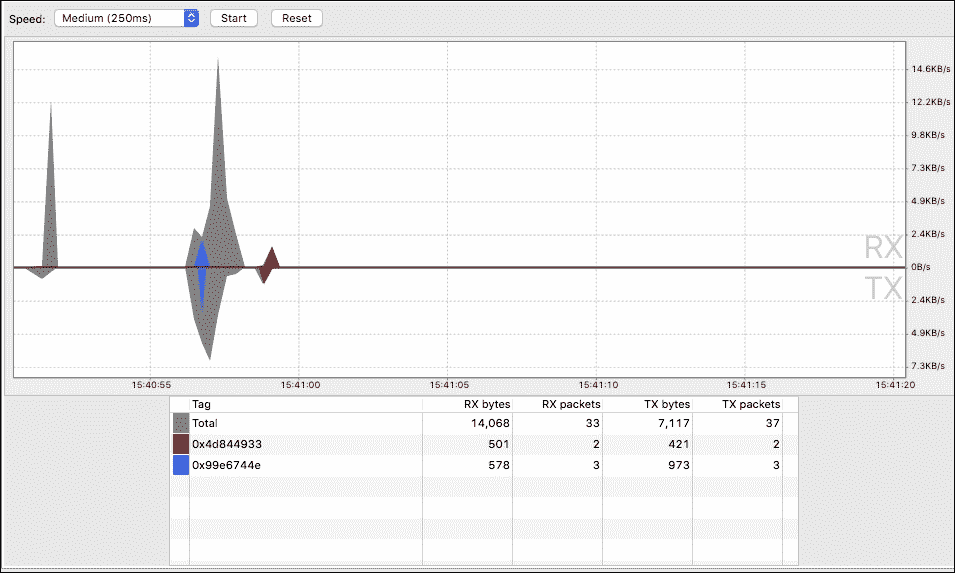

屏幕下方通过**标签**显示网络信息，通过**合计**采集。可以看到发送和接收的字节数和包总数，以及它们的图形表示。

如果你还没有这样做，在`TrafficStats`类的帮助下，在每个线程的基础上设置标签是一个好主意。`setThreadStatsTag()`功能将建立一个标签标识符。`tagSocket()`和`untagSocket()`功能将手动标记单个插座。这里有一个典型的例子:

```java
TrafficStats.setThreadStatsTag(0xF00000);
try {
  // make your network request
} finally {
  TrafficStats.clearThreadStatsTag();
}
```

# 仿真器控制

DDMS 的最后一个标签是所谓的**模拟器控制**。通过选择我们的一个 adb 设备并启动它，将显示一个包含一些附加选项的选项卡:

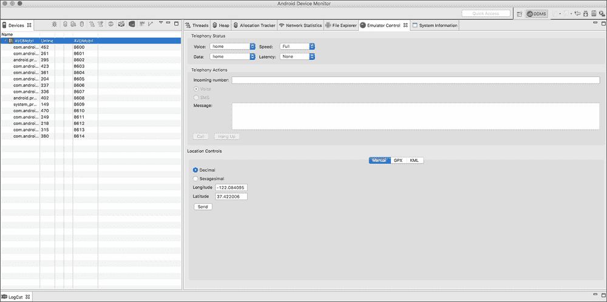

有了模拟器控件，我们可以通过几种方式修改我们的电话网络:

*   可以为数据和语音选择不同的配置(家庭网络、漫游、未找到、拒绝等)
*   可以定义互联网连接的速度和延迟
*   可以模拟来自定义的电话号码的来电或短信
*   我们可以向模拟器发送假位置。这可以通过手动或上传 GPX/KML 文件来完成

# 系统状态

DDMS 的最后一部分是系统信息标签。在这里，可以找到多达三种不同的信息类别:当前时间的 CPU 负载、内存使用情况和帧渲染时间(这一项在基准测试和调试视频游戏时尤为重要):

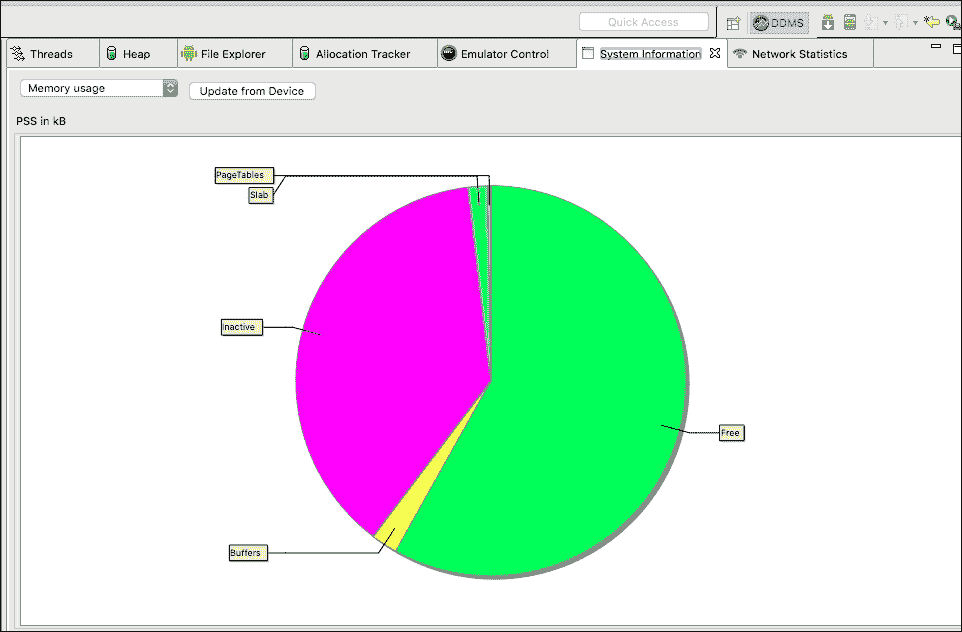

# 调试界面

到目前为止，我们一直专注于内存、线程和安卓系统方面。还有一个更直观的方面也可以显著提高我们应用的性能:**用户界面** ( **用户界面**)。安卓提供了一个名为**层次查看器**的工具来调试和优化任何为安卓设计的用户界面。**层次查看器**提供应用布局层次的可视化表示，其中包含布局上每个节点的性能信息。它为所谓的**像素完美**窗口提供了显示器的放大信息，以防需要近距离观察像素。

要运行**层次查看器**，我们需要首先连接我们的设备或仿真器。请注意，出于安全原因，只有运行开发者版本安卓系统的设备才能使用**层次查看器**。连接完成后，从`/tools`目录启动`hierarchyviewer`程序。如果你还没有建立这个目录作为你的系统的一部分`PATH`，这是一个非常好的时机去做。

您将看到一个类似于下面的屏幕。对于连接到系统的每个设备，您将看到一个附加的运行进程列表。选择其中一个流程，点击**加载视图层次结构**:

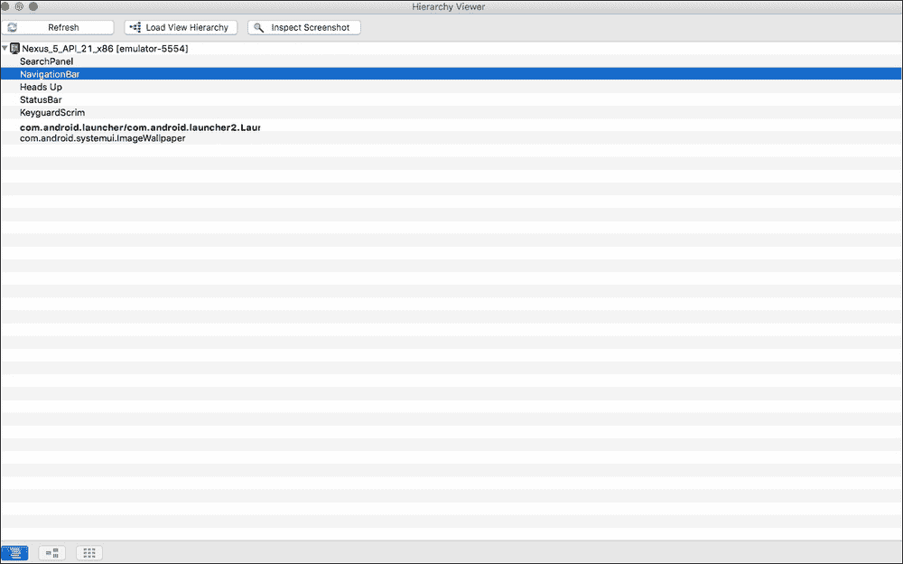

打开一个带有实际的**层次查看器**的新屏幕。**层级查看器**如下所示:

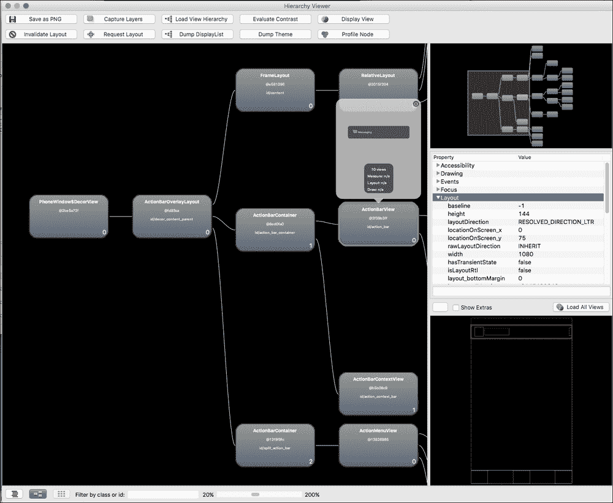

**层级查看器**包含以下元素:

*   在右上角，**树概述**提供了`ViewHierarchy`应用的鸟瞰图。
*   **树状图**可以在鼠标的帮助下进行拖拽和缩放。当我们点击一个项目时，这个项目被突出显示，我们可以访问它的属性。
*   位于**树状图**下的**属性**窗格提供了该视图所有属性的摘要。
*   **布局**视图显示了布局的线框。当前选定视图的轮廓是红色的。如果我们点击一个轮廓，它将被选中，并且属性将在**属性**窗格中可访问。

# 使用层次查看器进行分析

**层次查看器**为提供了一个强大的分析器来分析和优化应用。要继续分析，单击图标，**分析节点**。如果视图的层次结构非常大，可能需要一些时间才能初始化。

此时，层次结构中的所有视图都将得到三个点:

*   左边的点表示渲染管道的**绘制**过程
*   中间的点代表**布局**阶段
*   The right dot represents the **Execute** phase

    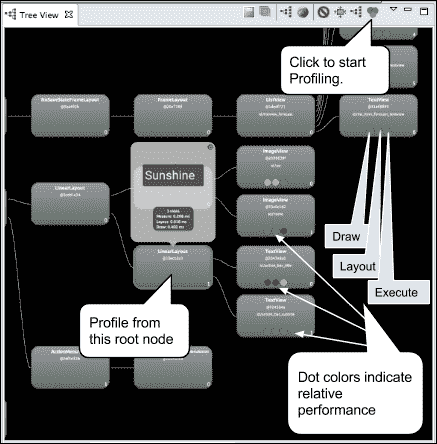

视图中的每个点颜色都有不同的含义:

*   绿点表示视图的渲染速度比至少一半的其他视图要快。通常，绿色可以被视为高性能视图。
*   黄色圆点表示视图的渲染速度快于层次结构中视图的下半部分。这只是相对的，但黄色可能需要我们看一看风景。
*   红色表示该视图属于最慢的一半视图。一般来说，我们想看一看这些值。

应用**层次查看器**分析器后，我们如何解释结果？需要注意的最重要的一点是，profiler 总是相对于我们自己的布局进行测量。这可能意味着一个节点总是红色的，但如果应用运行良好，就不一定很慢。另一个极端也适用:一个节点可能是绿色的，但是如果整个应用没有响应，性能可能是灾难。

**层次查看器**应用一种称为光栅化的过程来获取信息。光栅化，从图形编程的背景来看，比如视频游戏开发，对开发人员来说可能听起来很熟悉，是获取一个图形图元(例如，一个圆)并将其转换为屏幕上的像素的过程。这通常是由 GPU 完成的，但在这种情况下，由于我们处理的是软件光栅化，所以是由 CPU 完成的。这也有助于**层级查看器**输入的相对正确性。

为了识别**层次查看器**的问题，需要应用一些规则:

*   叶节点或视图组中只有少量子节点的红点可能指出了一个问题。
*   如果一个视图组有多个子视图，并且测量阶段有一个红点，请查看各个子视图。
*   带有红点的根视图不一定意味着有问题。这可能经常发生，因为这是所有当前视图的父视图。

# Systrace

Systrace 是谷歌软件开发工具包中的一个工具，用于分析应用的性能。它从内核级别捕获并显示应用的执行时间(捕获 CPU 调度程序、应用线程和磁盘活动等信息)。分析完成后，它会生成一个包含所有编译信息的 HTML 文件。

要使其工作，单击 DDMS 视图()中的**系统**按钮。将出现如下屏幕:

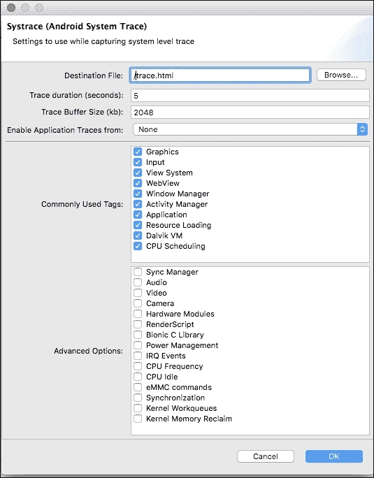

在该屏幕上，我们可以为 Systrace 输入几个参数:

*   将文件存储为 HTML 文件的目标位置。
*   跟踪持续时间:默认值为 5 秒。30 秒是处理大量信息的好时间。
*   跟踪缓冲区大小:跟踪的缓冲区应该有多大。
*   我们可以选择启用应用跟踪的进程，因此通常我们会在这里选择自己的应用。
*   我们需要从列表中选择一些我们想要与之交互的标签。

选择完所有内容后，按下**确定**按钮，并与您的应用互动一会儿。系统运行完成后，一个 HTML 文件将存储在您提供的位置。该文件如下所示:

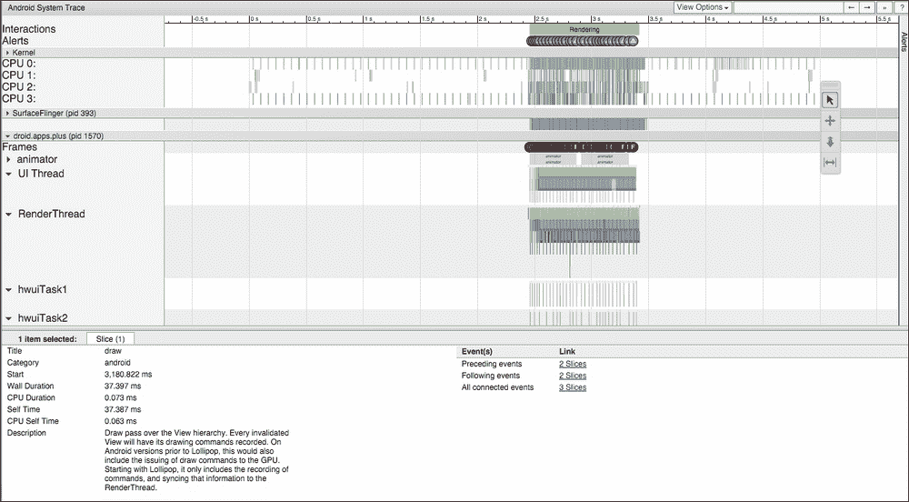

# 安卓设备调试选项

当我们在调试安卓设备时，我们需要激活开发者模式。默认情况下，该模式是隐藏的，如果我们需要将设备连接到 ADB 或使用它的一些选项，我们需要手动激活它。安卓的创造者很好地隐藏了这个选项。

让我们看看如何激活这个选项来更好地理解安卓调试，以及如何使用不同的调试配置。

如上所述，默认情况下，设备中的开发人员选项实际上是隐藏的。这样做的目的很可能是使它只对高级用户可用，而不对普通用户可用。休闲人士不需要访问本部分的功能；这样做可能会损害设备。

在标准光盘中，我们需要转到**关于**部分，向下滚动直到我们看到**构建号**条目，然后快速连续点击五次。将显示一个小对话框，说明我们现在是开发人员:

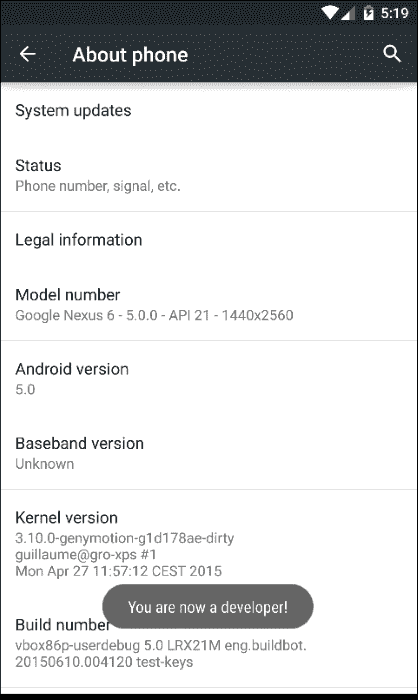

由于自定义 ROM 定制，在其他一些设备上可能会有点不同。以下是一些受欢迎的制造商以及如何激活调试选项:

*   **三星** : **设置** | **关于设备** | **构建号**
*   **LG** : **设置** | **关于电话** | **软件信息** | **内部版本号**
*   **HTC** : **设置** | **关于** | **软件信息** | **更多** | **内部版本号**

当开发人员选项被激活时，我们将在**系统**部分看到一个名为**开发人员选项**的选项(这可能因制造商而异)。如果我们点击它，选项就会显示出来。我们需要激活**开发者选项**的开关，我们将可以访问整个套件:

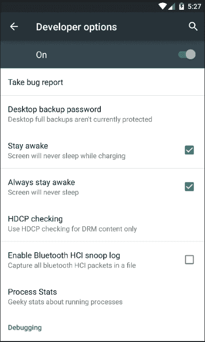

同样，选项可能因制造商而异。然而，这是安卓系统中默认选项的完整列表:

*   **进行 bug 报告**:该选项将收集设备当前状态的信息，并以电子邮件的形式发送。这可能需要一些时间，因为可能会收集到很多信息。
*   **桌面备份密码**:这为完全桌面备份设置了一个密码，默认情况下是没有密码保护的。
*   **保持清醒**:设备在充电时会持续保持清醒，调试起来非常方便。
*   **始终保持清醒**:与前一个类似，但在这种情况下，无论是否正在充电，设备都将始终保持清醒。如果开发人员忘记激活它，这可能是危险的，因为即使在开发之后，设备也会保持唤醒状态。
*   **HDCP 检查** : **HDCP** 代表**高带宽数字内容保护**。我们可以将设置为从不检查数字保护，始终检查数字保护，并且仅在数字版权管理内容的情况下这样做。
*   **启用蓝牙 HCI 监听日志**:激活此选项后，所有 HCI 蓝牙包将保存在一个文件中。
*   **Process stats**: This section contains geeky stats about the device's processes. It displays the background applications that have been running for the last two hours, as well as some particular information for them (such as average/maximum RAM usage, runtime, and running services):

    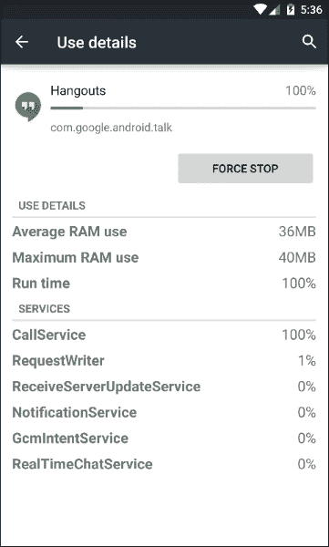

*   **USB 调试**:这使得设备在连接 USB 时可以用 ADB 调试应用。这应该是开发人员激活的第一个选项。
*   **Bug 报告快捷方式**:该选项显示电源菜单中的一个按钮，可以按下该按钮进行 Bug 报告。
*   **允许模拟位置**:该选项激活后可以模拟位置。
*   **启用查看属性检查**:通过激活这个选项，我们将能够在安卓系统管理器中查看属性检查。
*   **选择调试 app** :通过这个选项我们可以选择要调试的应用，而不需要输入很长的`adb`命令。
*   **等待调试器**:此选项将正在调试的 app(在上一选项中选择)附加到调试器。
*   **通过 USB** 验证应用:默认情况下，该选项处于禁用状态，除非 USB 调试选项处于活动状态。任何手动安装的内容都将得到验证，以避免安装恶意软件。
*   **无线显示认证**:使用此选项帮助联盟 Wi-Fi 显示规范的认证。
*   **启用 Wi-Fi 详细日志记录**:该选项为所有 Wi-Fi 操作启用更全面的日志。
*   **主动 WiFi 到蜂窝切换**:此选项人为降低 Wi-Fi **接收信号强度指示** ( **RSSI** )以鼓励 Wi-Fi 状态机决定切换连接。
*   **始终允许 Wi-Fi 漫游扫描**:默认情况下，已经连接到 Wi-Fi 网络的安卓设备在有更强的 SSID 可用时不会漫游。激活此选项后，设备将永久漫游到新的无线网络。
*   **记录器缓冲区大小**:该选项改变每个记录器缓冲区的大小(默认为 256 K)。
*   **显示触摸**:每次与屏幕有交互，如果激活该选项，会有视觉反馈。
*   **指针位置**:这个和上一个类似:指针会位于屏幕上，有两条垂直线。在屏幕顶部，会有数字信息。
*   **显示表面更新**:屏幕更新时，整个表面都会闪烁(不建议癫痫患者使用)。
*   **Show layout bounds**: This is one of the most useful options when we are debugging layouts. Once this is enabled, you should see all of the bounding areas of your views displayed in vibrant blue and purple:

    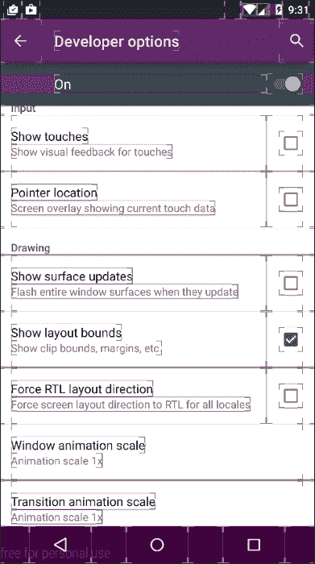

*   **强制 RTL 布局方向**:这将强制布局方向从右向左，而不是默认的从左向右。有些用户可能喜欢从右到左，但对于某些语言(如阿拉伯语或希伯来语)，这是布局将自动设置的方式。我们可以使用这种模式来测试我们的应用在这种配置下是否正常运行。
*   **窗口动画缩放**:可以选择每个窗口的动画速度(在 0.5x 到 10x 之间)或者停用。
*   **转场动画比例**:可以选择每个转场的动画速度(在 0.5x 到 10x 之间)或者停用。
*   **动画师动画缩放**:可以为每个动画师选择动画速度(0.5x 到 10x 之间)或者停用。
*   **模拟二次显示**:该设置允许开发者在二次显示中模拟不同的屏幕尺寸。
*   **强制 GPU 渲染**:使用硬件 2D 渲染。这可以让你的应用看起来很棒，也可以降低性能。仅用于调试目的。
*   **显示 GPU 视图更新**:用 GPU 硬件绘制的每个元素都将覆盖一个红色方块。
*   **显示硬件层更新**:该选项指示硬件层更新的任何时间。
*   **Debug GPU overdraw**: Visualizes overdraw with a code of colors in elements, depending on how often they are being drawn: This can be used to research where an app might be doing more rendering work than necessary. The screen will begin to display a big set of colors, but do not panic! We can easily read what they mean:
    *   **真彩**:真彩表示执行期间没有透支
    *   **蓝色**:透支确实发生过一次
    *   **绿色**:在应用的上下文中出现了两次透支
    *   **粉色**:透支了三次
    *   **红色**:透支四次以上

    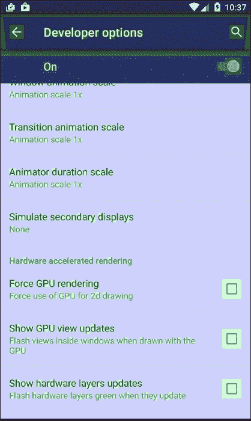

*   **强制 4x MSAA** :启用 4x **MSAA** (代表**多样本抗锯齿**)。这将使你的应用更快，也将提高图像质量。
*   **禁用硬件覆盖**:通过硬件覆盖，每个应用都可以获得自己的视频内存部分，无需检查冲突和剪辑。该选项将禁用硬件覆盖。
*   **模拟色彩空间**:有了这个选项，我们可以强制安卓只模拟某一种颜色组合的屏幕(比如单色、红绿、红黄等等)。
*   **使用 NuPlayer(实验性)** : NuPlayer 是一款支持在线视频内容的视频播放器。它有很多 bug，所以默认是禁用的。使用此选项，NuPlayer 将被激活。
*   **禁用 USB 音频路由**:该选项禁用 USB 音频路由到外设的自动重定向。
*   **严格模式启用**:严格模式是一种开发人员模式，它检测开发人员可能遇到的问题，然后通知他们，以便他们能够得到修复。StrictMode 通常会捕获错误线程中的网络访问等操作。
*   **显示 CPU 使用情况**:该选项激活后，会在屏幕顶部叠加有关 CPU 使用情况的信息。
*   **Profile GPU rendering**: This tool, when it has been activated, provides a visual representation of the speed and rhythm of rendering UI frames. This is only available from Android 4.1\. In the following screen, we see an example of the **Profile GPU rendering** tool, and here we have some instructions about how to understand it:

    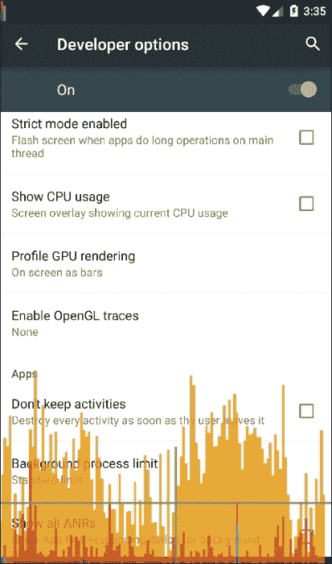

    *   横轴表示经过的时间，纵轴是每帧的时间，单位为毫秒。
    *   每个竖线对应一个渲染帧。小节越高，需要渲染的时间就越长。
    *   绿线代表 16 毫秒。每当一帧越过绿线，你的应用就会丢失一帧，这可能会导致用户认为它是口吃的图像。
    *   每条颜色线都有一个含义:条的蓝色部分表示用于创建和更新视图显示列表的时间。如果这部分栏比较高，可能会有很多自定义视图绘制或者在`onDraw`方法中有很多工作。
    *   紫色部分是将资源传输到渲染线程所花费的时间(仅来自安卓 4.1)。条形图的红色部分表示安卓 2D 渲染器向 OpenGL 发送命令以绘制和重绘显示列表所花费的时间。
    *   橙色部分表示中央处理器等待图形处理器完成的时间。如果这个条太长，GPU 执行操作的时间就太长了。
*   **启用 OpenGL 跟踪**:在您选择的日志文件中启用跟踪 OpenGL。
*   **不要保留活动**:这个设置会在你一离开主视图就关闭每个应用。没有必要说必须小心，因为这将改变每个应用的状态。
*   **后台进程限制**:通过这个选项，我们可以限制将要并行运行的后台进程的数量。
*   **显示所有 ANRs** :当应用被*应用不响应*错误阻止时，每个 ANR 都会显示，即使这是在后台发生的。

# 安卓即时运行

撰写本文时，谷歌发布了 Android Studio 2.2 预览版。这是(顾名思义)安卓工作室的第二个主要版本，它带有许多修复程序、性能改进和一个名为**安卓即时运行**的可怕工具。这个工具允许我们在代码中执行更改，并在我们的设备或模拟器中立即显示它们。这在我们调试时是一个无价的特性，因为我们不需要重新编译应用，重新启动它，并将其重新连接到`adb`。

要激活这个选项，我们需要进入**偏好设置**，然后寻找**构建、执行、部署** | **即时运行**。选中**在部署时启用即时运行以热交换代码/资源更改(默认启用)**；如果你运行的是正确版本的 Gradle 插件，你将能够激活它:

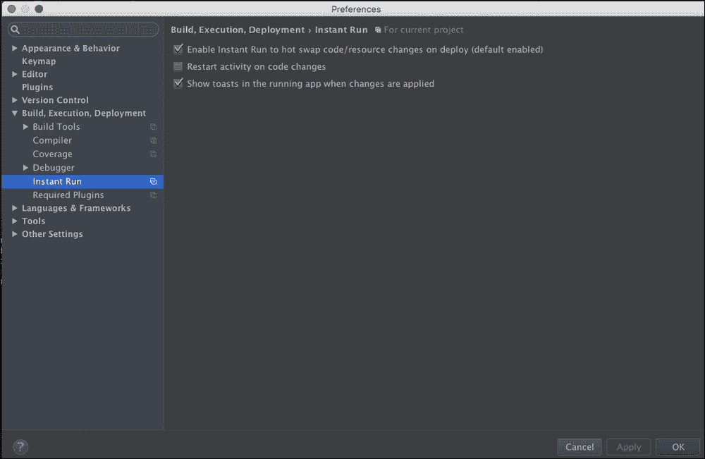

要运行一个应用，选择**运行**，安卓工作室正常运行。现在有趣的部分来了:在你对你的源代码进行编辑或修改之后，再次点击**运行**只会将更改部署到设备或模拟器上。

目前有几个操作是**即时运行**不支持的:

*   添加、移除或更改注释
*   添加、删除或更改实例字段
*   添加、删除或更改静态字段
*   添加或删除静态方法签名
*   更改静态方法签名
*   添加或删除实例方法
*   更改实例方法签名
*   更改当前类从哪个父类继承
*   更改已实现接口的列表
*   更改类的静态初始值设定项
*   添加、删除或更改字符串(允许，但需要重启托管活动)

# 显卡配置文件

GPU profiler 也是 Android Studio 2.0 中包含的实验工具。该工具旨在帮助我们了解是什么导致了渲染结果中的特定问题，并检查 GPU 的状态。

默认情况下，不安装图形处理器调试工具(包括图形处理器探查器)。为此，我们需要从软件开发工具包管理器的软件开发工具包工具部分安装它们。

为了在我们的应用中使用这个分析器，我们需要在我们的应用中加载跟踪库。我们可以在我们的 Java 代码或 C++代码中做到这一点(这是有意义的，如果我们考虑到许多用于图形的代码由于其更好的性能而在 C++中运行)。无论使用哪种方法，都需要将库复制到项目中进行加载。图书馆将位于`<sdkDir>/extras/android/gapid/android/<abi>/libgapii.so`。

我们还需要将一些其他相关的文件夹复制到`jniLibs`目录中。这可以在`<projectDir>/app/src/main/jniLibs`中找到。如果它还不存在，您应该创建它(在未来的章节中将介绍 NDK 以及如何处理本机代码)。像 SDK 管理器文件夹一样，`jniLibs`应该为您计划支持的每个 ABI 包含一个文件夹。如果你不知道你计划支持哪些 ABIs，你可以复制所有的文件夹。您最终的项目目录结构应该看起来像`<projectDir>/app/src/main/jniLibs/<abi>/libgappii.so`。

为了用本机代码加载库，我们需要创建一个类似于下面的代码片段:

```java
#include <android/log.h>
#include <dlfcn.h>

#define PACKAGE_NAME "" // Fill this in with the actual package // name
#define GAPII_SO_PATH "/data/data/" PACKAGE_NAME "/lib/libgapii.so"

struct GapiiLoader {
  GapiiLoader() {
    if (!dlopen(GAPII_SO_PATH, RTLD_LOCAL | RTLD_NOW)) {
      __android_log_print(ANDROID_LOG_ERROR, "GAPII", "Failed loading " GAPII_SO_PATH);
    }
  }
};

GapiiLoader __attribute__((used)) gGapiiLoader;
```

为了将其加载到主类中，必须使用以下代码片段:

```java
static {
  System.loadLibrary("gapii");
}
```

### 类型

**下载示例代码**

下载代码包的详细步骤在本书的*前言*中有提及。这本书的代码包也在 T2 的 GitHub 上发布。我们还有其他代码包，来自我们丰富的书籍和视频目录，可在[https://github.com/PacktPublishing/](https://github.com/PacktPublishing/)获得。看看他们！

# 运行轨迹

当我们把添加到我们的应用中时，它会在启动时阻塞，直到它可以连接到安卓工作室的跟踪接收器。这意味着当您使用完探查器时，您需要移除跟踪库，因为这将导致无用的呈现。

为了开始跟踪，只需运行并部署应用。在等待跟踪接收器连接时，首先会出现一个空白屏幕提示。要启用它，请转到 DDMS 的中央处理器/图形处理器选项卡，然后单击红色跟踪按钮，您可以在图形处理器选项卡的左侧找到该按钮()。

当跟踪开始时，应用解锁，我们可以与之交互。当我们完成跟踪时，我们需要再次单击跟踪按钮来停止跟踪过程。当文件被写入后，它将被打开。

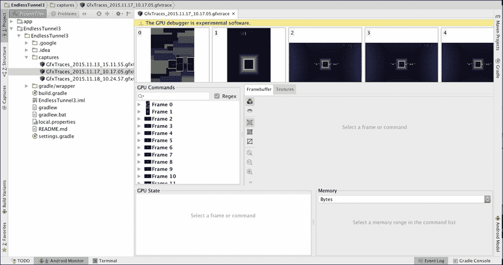

# ClassyShark

ClassyShark 是一款独立的安卓诊断工具，由谷歌的开发者倡导者鲍里斯·法伯开发。ClassyShark 充当 Android 可执行浏览器，是一个有价值的工具，可以浏览 Android 类及其内部:类接口和成员、依赖关系、dex 结构和计数等等。ClassyShark 已经在 Apache 2.0 许可下发布，可以从[https://github.com/google/android-classyshark](https://github.com/google/android-classyshark)免费下载。

ClassyShark 在分析安卓 APK 系统的内部内容时是一个非常有用的工具，它可以早期诊断由于多版本或德兴问题、添加的依赖关系和子库、循环依赖关系以及本机代码问题而可能出现的问题。

# 开始

为了上手 ClassyShark，最快的方法就是从 GitHub 网站下载最后一个`.jar`(截止到写本书的时候，6.6 版本可以从以下网址下载:[https://github.com/google/android-classyshark/releases](https://github.com/google/android-classyshark/releases))。下载最新版本，然后使用以下命令从控制台运行它:

```java
java –jar route/to/ClassyShark.jar

```

这将启动应用。您将会看到如下所示的屏幕提示:


现在是时候打开一个 APK 样本看看它的构成，并开始使用 ClassyShark 了。点击图标，将显示选择 APK 的屏幕。从你的项目中选择一个 APK(如果你一直使用安卓工作室，它们通常在`build/output/apk`文件夹中)。为此，任何 APK 文件都将有效。

### 注

如果您想自动化 ClassyShark 或者您觉得命令行更好，也可以通过运行以下命令直接打开 APK:

```java
java –jar ClassyShark.jar –open nameOfApk.jar

```

打开文件后，您将能够看到类似于以下屏幕截图的内容:

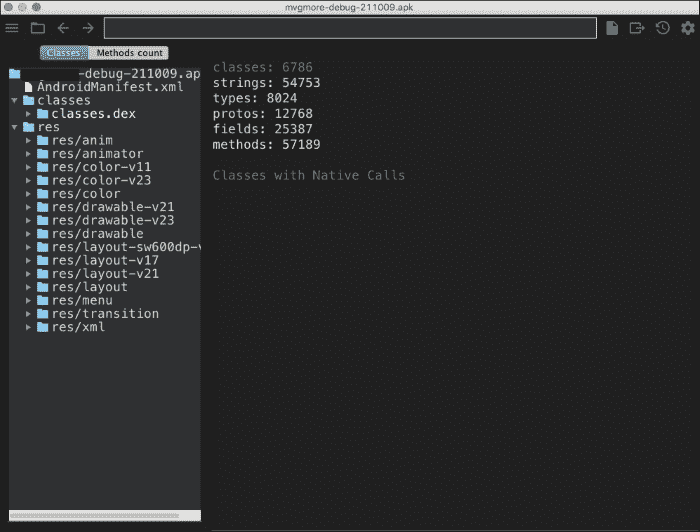

*   在的左侧，我们可以看到一个树形结构，里面有 APK 文件的文件夹和资源(包括`classes.dex`里面的所有文件)。
*   在右侧，我们可以看到 APK 源代码组成的摘要:
    *   班级数量
    *   字符串的数量
    *   APK 境内宣布了多少个油田
    *   APK 的方法数量

### 注

在开发应用时，限制数量是一个特别重要的上限。特别是，我们可以在一个 APK 上引用大量的方法，但是我们只能调用前 65，536 个。没有更多空间用于调用指令。一段时间以来，这一直是关于如何解决这个问题的争议和讨论的原因，大多数解决方案都会对应用的性能产生影响。

如果我们浏览`classes.dex`文件，会看到所有属于 APK 的源代码(请参考已经用 ProGuarded 混淆的类)，包括 Android Support、第三方库等库的源代码。所以，为了使它有趣，试着选择一个属于你自己的应用的类，然后点击它。您应该能够显示类似于下面的对话框:

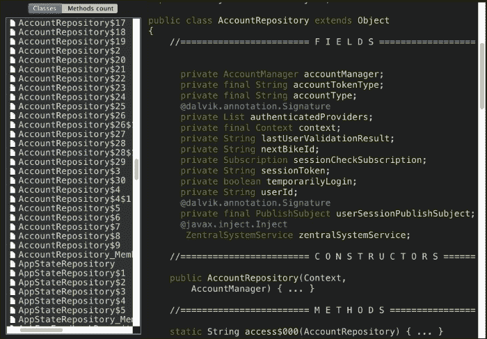

请注意，文件的所有字段、方法和构造函数都显示在这里。对于所有图形和统计爱好者来说，点击**方法计数**选项卡会显示一个交互式饼图。单击饼图的任何部分都会显示一个子部分。我们还可以展开每个组的树。通过这种方式，我们可以很容易地跟踪 ClassyShark 的许多问题，例如缺少库、对其他子库的方法的引用等等。

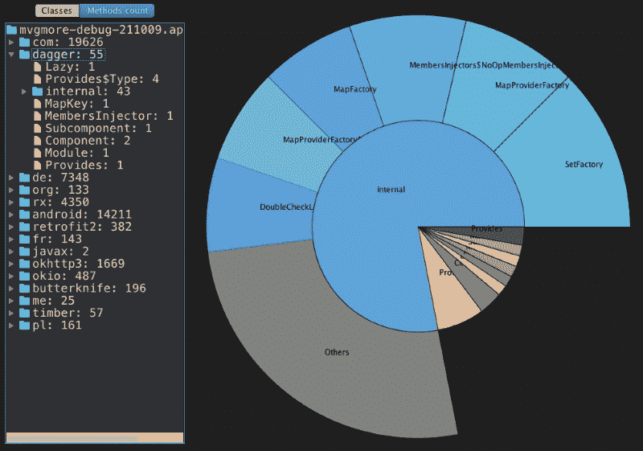

我们前面已经提到了安卓的 65 K 限制。这个问题的常见解决方案之一是多任务:这意味着包括几个`.dex`文件，因此每个文件都包含 65 K 以下的方法。虽然这解决了限制问题，但也会导致一些性能问题。

使用 ClassyShark，我们可以准确地找出在哪个`.dex`文件中包含了一个方法。当包含多个`.dex`文件时，将显示所有文件，如下图所示(来自输入/输出计划应用):

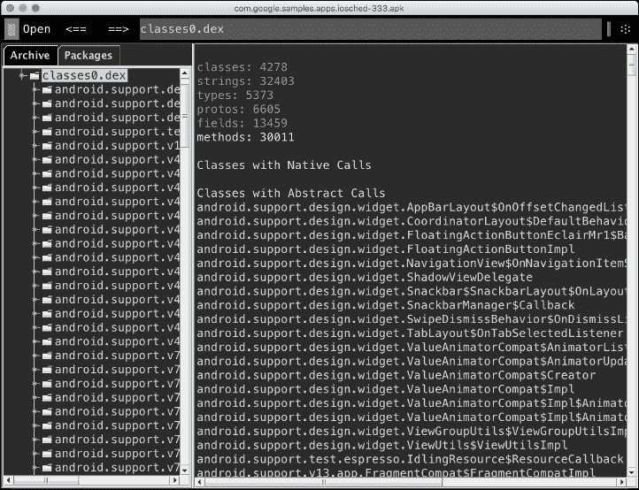

# 总结

调试安卓应用是开发者需要掌握的一门科学。大多数调试工具都有一个学习曲线，以便能够有效地使用它们，并知道在特定情况下需要使用哪个工具。Android 提供了一套需要一些时间才能了解的工具，由于 Android 作为移动平台的特殊性质，有些工具需要特定的调试知识，比如线程和内存管理。

读完这一章，用户会意识到我们在开发安卓应用时可能会出现的所有问题(ANRs、内存泄漏、线程不正确等)，以及必须使用哪个工具来分析它，然后解决它。使用高级技术，如分析，将有助于我们发现程序中的错误、内存泄漏和不正确的线程；仅仅使用应用是不容易看到这些东西的。