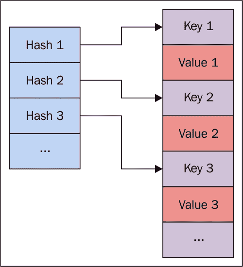
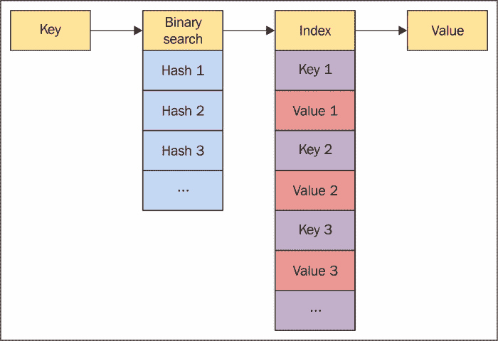
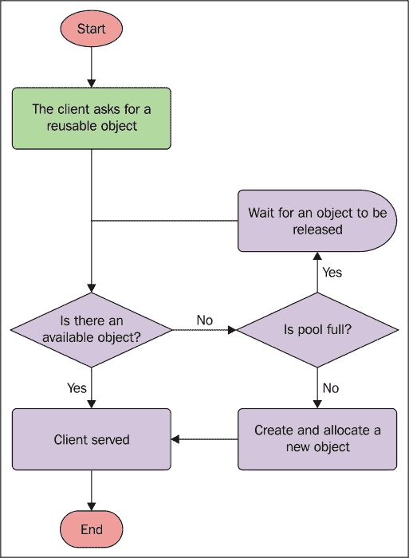
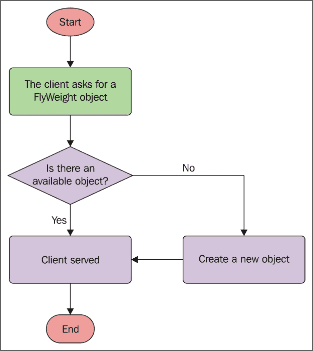
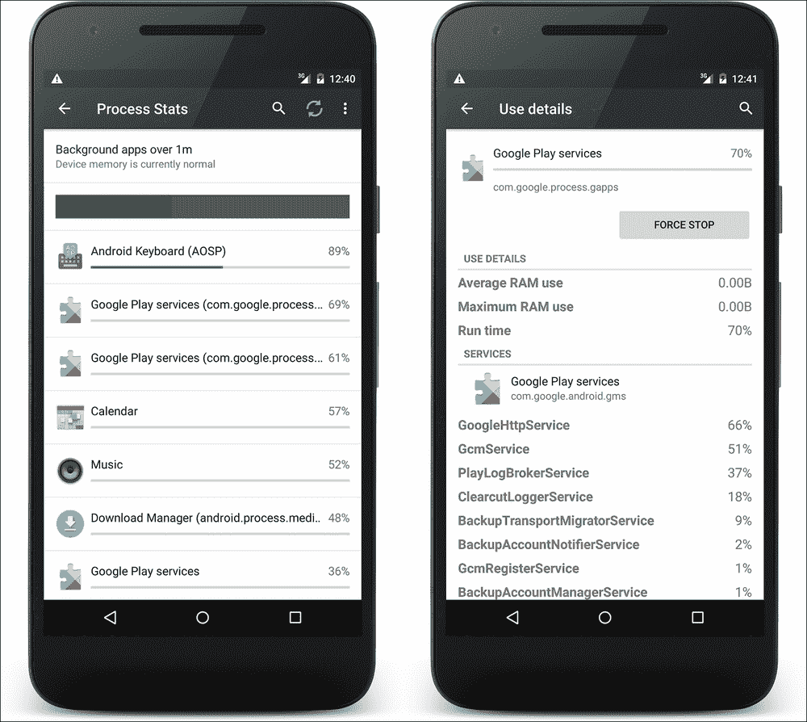

# 四、内存

当试图达到应用的性能目标时，内存是需要关注的问题:应用中管理不善的内存会影响整个系统的行为。它还会影响安装在我们设备上的其他应用，就像其他应用会影响我们的设备一样。众所周知，安卓市场上有各种各样的设备，有很多不同的配置和内存量。这取决于开发人员在处理如此多的碎片时采取什么策略，在开发时遵循什么模式，以及使用什么工具来分析代码。这是本章的目的。我们将关注堆内存，而我们将在[第 10 章](10.html "Chapter 10. Performance Tips")、*性能提示*中处理缓存。

我们将看看我们的设备如何处理内存，加深我们对什么是垃圾收集及其工作原理的了解，以便了解如何避免常见的开发错误，并澄清我们将讨论什么来定义最佳实践。我们还将进行模式定义，以大幅降低我们将识别为内存泄漏和内存混乱的风险。本章将以安卓提供的官方工具和应用编程接口的概述来结束，这些工具和应用编程接口用于分析我们的代码，并找出内存泄漏的可能原因，这些原因在[第 2 章](02.html "Chapter 2. Efficient Debugging")、*高效调试*中没有涉及。

# 穿行

在开始关于如何改进和剖析我们的代码的讨论之前，了解安卓设备如何处理内存确实很重要。然后，在接下来的几页中，我们将分析安卓使用的运行时之间的差异，我们将了解更多关于垃圾收集的知识，了解内存泄漏和内存搅动，以及 Java 如何处理对象引用。

## 内存是如何工作的

你有没有想过餐厅是如何运作的？让我们想一想:当新的顾客群体进入餐馆时，有一个服务员准备寻找一个分配他们的地方。但是餐厅空间有限。所以，有必要在可能的情况下腾出桌子:这就是为什么，当一个小组吃完饭后，另一个服务员会清理并准备桌子供其他小组使用。第一个服务员必须为每一个新组找到座位数合适的桌子。那么，第二个服务员的任务应该是快速的，不应该阻碍或阻碍其他人的任务。另一个重要的方面是这个群体占据了多少座位:餐馆老板希望有尽可能多的免费座位来安置新客户。因此，重要的是要确保每个组都填充正确数量的座位，而不占用其他新组可以使用的桌子。

这类似于安卓系统中发生的事情:每次我们在代码中创建一个新对象，它都需要保存在内存中。因此，它被分配为应用私有内存的一部分，以便在需要时访问。在应用的整个生命周期中，系统会不断为我们分配内存。然而，系统使用的内存有限，不能无限期地分配内存。那么，系统怎么可能一直有足够的内存来支持我们的应用呢？为什么安卓开发者不需要释放内存？我们来看看。

## 垃圾收集

垃圾收集是一个基于两个主要概念的旧概念:

*   查找不再被引用的对象
*   释放这些对象引用的内存

当该对象不再被引用时，它的“表”可以被清理和释放。这是为了给将来的对象分配提供内存。新对象的分配和不再被引用的对象的解除分配这些操作由设备上使用的特定运行时执行，开发者不需要做任何事情，因为它们都是自动管理的。不管在其他语言中发生什么，比如 C 和 C++，开发人员都不需要分配和释放内存。特别是，当需要时进行分配，当达到内存上限时执行垃圾收集任务。那些后台的自动操作并不能免除开发人员对其应用内存管理的意识:如果内存管理做得不好，当抛出`OutOfMemoryError`时，应用可能容易出现滞后、故障甚至崩溃。

## 共享内存

在安卓中，每个应用都有自己的进程，完全由运行时管理，目的是回收内存，以便在必要时为其他前台进程释放资源。我们应用的可用内存完全在内存中，因为安卓不使用交换内存。这样做的主要后果是，除了不引用不再使用的对象，我们的应用没有其他方法可以拥有更多内存。但是安卓使用分页和内存映射:第一种技术是在二级存储器中定义相同大小的内存块，称为页面；而第二种使用内存中的映射，将辅助存储中的相关文件用作主文件。它们在系统需要为其他进程分配内存时使用，因此系统会创建分页内存映射文件来保存 Dalvik 代码文件、应用资源或本机代码文件。这样，这些文件可以在多个进程之间共享。

事实上，安卓使用共享内存是为了更好地处理来自许多不同进程的资源。此外，每一个要创建的新流程都由一个已经存在的流程分叉，这个流程被称为 **合子**。这个特定的过程包含通用的框架类和资源，以加快应用的首次启动。这意味着合子进程在进程和应用之间共享。共享内存的大量使用使得我们很难分析应用的内存使用情况，因为在对内存使用情况进行正确分析之前，有许多方面需要考虑。

## 运行时间

内存管理的一些功能和操作取决于使用的运行时。这就是为什么我们要介绍安卓设备使用的两种主要运行时的一些特定功能。它们如下:

*   达尔维克
*   **安卓运行时** ( **ART** )

后来增加了 ART 来取代 Dalvik ，从不同的角度提高性能。它是在 Android KitKat (API Level 19)中引入的，作为开发人员启用的一个选项，从 Android 棒棒糖(API Level 21)开始，它已经成为主要的也是唯一的运行时。除了Dalvik 和 ART 在编译代码、文件格式、内部指令上的区别之外，我们目前关注的是内存管理和垃圾回收。因此，让我们了解谷歌团队如何随着时间的推移提高运行时垃圾收集的性能，以及在开发我们的应用时需要注意什么。

让我们退后一步，回到餐厅。如果所有的一切，所有的员工，比如其他的服务员和厨师，所有的服务，比如洗碗机，在等待服务员腾出一张桌子的时候停止他们的任务，会发生什么？整个餐厅的成败取决于那个单一员工的表现。所以，在这种情况下，有一个非常快的服务员真的很重要。但是如果你养不起他，你怎么办？业主希望他尽可能快地做他必须做的事情，最大限度地提高他的生产力，然后，以最好的方式分配所有的客户。这正是我们作为开发人员必须做的:我们必须优化内存分配，以便进行快速垃圾收集，即使它会停止所有其他操作。这里描述的只是运行时垃圾收集是如何工作的:当达到内存上限时，垃圾收集开始它的任务，暂停所有其他方法、任务、线程和进程的执行。并且这些对象在垃圾收集任务完成之前不会恢复。因此，真正重要的是，收集要足够快，不能妨碍我们在[第 3 章](03.html "Chapter 3. Building Layouts")、*建筑布局*中讨论的每帧 16 毫秒的规则，这将导致 UI 中的滞后和 jank:垃圾收集花费的时间越多，系统准备要在屏幕上呈现的帧的时间就越少。

### 类型

请记住，自动垃圾收集不是免费的:糟糕的内存管理会导致糟糕的用户界面性能，从而导致糟糕的 UX。没有运行时功能可以取代良好的内存管理。这就是为什么我们需要小心对象的新分配，尤其是引用。

显然，在达尔维克时代之后，ART 在这个过程中引入了很多改进，但背景概念是一样的:它减少了收集步骤，它为位图对象添加了特定的内存，它使用了新的快速算法，它还做了其他很酷的事情，这些事情在未来会变得更好，但是没有办法逃避，如果我们想让我们的应用有最好的性能，我们需要对代码和内存使用进行概要分析。

## 安卓 N JIT 编译器

ART 运行时使用提前编译，顾名思义，它在首次安装应用时执行编译。这种方法以不同的方式为整个系统带来优势，因为系统可以做到以下几点:

*   通过预编译降低电池消耗，进而提高自主性
*   执行应用比达尔维克更快
*   改进内存管理和垃圾收集

然而，这些优势有一个与安装时间相关的成本:系统需要在那个时候编译应用，然后，它比不同类型的编译器慢。

出于这个原因，谷歌在新的安卓系统中为 ART 的提前编译器添加了一个及时编译器。这个编译器在需要时起作用，所以在应用执行期间，它使用了与提前编译器不同的方法。这个编译器使用代码分析技术，它不是超前编译器的替代品，而是它的补充。这是对系统的一个很好的增强，因为它引入了性能方面的优势。

配置文件引导的编译增加了预编译的可能性，然后根据使用情况和/或设备条件缓存和重用应用的方法。这个特性可以节省编译时间，提高各种系统的性能。因此，所有设备都受益于这种新的内存管理。主要优势如下:

*   使用的内存更少
*   更少的内存访问
*   降低对电池的影响

然而，Android N 中引入的所有这些优势不应该让我们在应用中避免良好的内存管理。为此，我们需要知道在我们的代码背后隐藏着什么陷阱，更重要的是，当我们的应用处于活动状态时，如何在特定情况下改进系统的内存管理。

## 内存泄漏

从内存性能的角度来看，开发人员在开发安卓应用时可能犯的主要错误被称为**内存泄漏**，是指不再使用但被另一个仍处于活动状态的对象引用的对象。在这种情况下，垃圾收集器会跳过它，因为引用足以将该对象留在内存中。

实际上，我们正在避免垃圾收集器为将来的其他分配释放内存。因此，我们的堆内存因此变小，这导致垃圾收集被更频繁地调用，阻塞了应用的其余执行。这可能导致没有更多内存来分配新对象，然后系统抛出`OutOfMemoryError`。考虑使用的对象引用不再使用的对象的情况，引用不再使用的对象的情况，等等:它们都不能被收集，只是因为根对象仍在使用。

## 内存流失

内存管理中的另一个异常叫做**内存流失**，指的是运行时在很短的时间内无法为太多新实例化的对象提供可持续的分配量。在这种情况下，大量的垃圾收集事件被多次调用，影响了应用的整体内存和 UI 性能。

我们在[第三章](03.html "Chapter 3. Building Layouts")、*建筑布局*中讨论的关于需要避免`View.onDraw()`方法中的分配，与内存流失密切相关:我们知道，每次需要再次绘制视图并且屏幕需要每 16.6667 毫秒刷新一次时，都会调用该方法。如果我们在该方法中实例化对象，我们可能会导致内存流失，因为这些对象是在`View.onDraw()`方法中实例化的，并且不再使用，所以它们很快就会被收集。在某些情况下，这导致每次在屏幕上绘制帧时都会执行一个或多个垃圾收集事件，从而根据收集事件的持续时间，将可用的绘制时间减少到 16.6667 毫秒以下。

## 参考文献

让我们快速浏览一下 Java 为我们提供的引用对象的不同对象。这样，我们就会知道什么时候可以使用它们，以及 Java 如何定义四个强度级别:

*   **正常**:这是的主要参考类型。它对应的是一个对象的简单创建，这个对象在不再被使用和引用的时候会被收集，只是经典的对象实例化:

    ```java
    SampleObject sampleObject = new SampleObject();
    ```

*   **Soft** :这是一个引用，当垃圾收集事件被触发时，它的强度不足以将对象保存在内存中，所以在执行过程中它可以随时为空。使用这个引用，垃圾收集器根据系统的内存需求决定何时释放对象内存。要使用它，只需在构造函数中创建一个传递真实对象作为参数的`SoftReference`对象，并调用`SoftReference.get()`来获取对象:

    ```java
    SoftReference<SampleObject> sampleObjectSoftRef = new SoftReference<SampleObject>(new SampleObject());
    SampleObject sampleObject = sampleObjectSoftRef.get();
    ```

*   **弱**:这是和`SoftReferences`一样，但是更弱:

    ```java
    WeakReference<SampleObject> sampleObjectWeakRef = new WeakReference<SampleObject>(new SampleObject());
    ```

*   **幻影**:这个是最弱的参照物；该对象符合终止条件。这种引用很少使用，`PhantomReference.get()`方法总是返回 null。这是针对我们目前不感兴趣的引用队列的，但是知道也提供了这种引用是很有用的。

如果我们知道哪些对象具有较低的优先级，并且可以在不导致应用正常执行问题的情况下被收集，那么这些类在开发过程中可能会很有用。我们将在接下来的几页中看到它们如何帮助我们管理内存。

## 内存端项目

在安卓平台的开发过程中，谷歌一直试图改进平台的内存管理系统，以保持与性能越来越高的设备和低资源设备的广泛兼容性。这是谷歌与平台并行开发的两个项目的主要目的，然后，发布的每一个新的安卓版本都意味着这些项目的新改进和变化，以及它们对系统性能的影响。这些附带项目中的每一个都关注不同的问题:

*   **项目黄油**:这个在安卓果冻豆 4.1 (API 等级 16)中引入，然后在安卓果冻豆 4.2 (API 等级 17)中改进；它增加了与平台图形方面相关的功能(VSync 和缓冲是主要的新增功能)，以提高设备在使用时的响应能力。
*   **项目 Svelte** :这个是安卓 KitKat 4.4 (API 等级 19)中引入的；它涉及内存管理的改进，以支持低内存设备。
*   **伏打项目**:这是在安卓棒棒糖(API 等级 21)中推出的；它关注设备的电池寿命。然后，它添加了重要的应用编程接口来处理批量昂贵的电池消耗操作，如作业调度程序，或新工具，如电池历史记录程序。

### Svelte 和安卓 N 项目

在首次推出时，为了支持内存可用性较低的入门级设备，Project Svelte 减少了内存占用，改进了内存管理，进而为平台拓宽了支持的设备范围，优势明显。

随着安卓 N 的发布，谷歌希望提供一种优化的方式在后台运行应用。我们知道应用的进程在后台运行，即使它在屏幕上不可见，即使没有正在运行的活动，因为服务可能正在执行一些操作。这是内存管理的一个关键特性:后台进程的不良内存管理可能会影响整体系统性能。

但是新的安卓系统在应用行为和应用接口方面有什么变化呢？为了改善内存管理，减少后台进程的影响，所选择的策略是避免为以下操作发送应用广播:

*   `ConnectivityManager.CONNECTIVITY_ACTION`:从安卓 N 开始，一个新的连接动作将会从那些在前台并且已经为这个动作注册了`BroadcastReceiver`的应用中接收到。清单文件中声明了隐式意图的应用将不再接收它。因此，应用需要改变它的逻辑来做和以前一样的事情。[第 6 章](06.html "Chapter 6. Networking")、*联网*涉及到这一点，因此请参考该章以了解有关该特定主题的更多信息。
*   `Camera.ACTION_NEW_PICTURE`:此用于通知刚拍了一张照片，添加到媒体商店。这个动作将不再可用，无论是接收还是发送，它将用于任何应用，而不仅仅是针对新的安卓系统的应用
*   `Camera.ACTION_NEW_VIDEO`:这个用来通知刚拍了一个视频，添加到媒体商店。与前一个动作一样，这个动作不能再使用了，它也适用于任何应用。

在用新的安卓系统定位应用时，请记住这些变化，以避免不必要或意想不到的行为。

谷歌已经改变了所有列出的动作，以迫使开发者不要在应用中使用它们。一般来说，出于同样的原因，我们不应该使用隐式接收器。因此，我们应该总是在后台检查应用的行为，因为这可能会导致意外的内存使用和电池消耗。隐式接收器可以启动我们的应用组件，而显式接收器在活动处于前台时设置有限的时间，然后它们不能影响后台进程。

### 类型

在开发应用时，避免使用隐式广播是一个很好的做法，以减少它对后台操作的影响，这可能会导致不必要的内存浪费，进而耗尽电池。

此外，安卓 N 在 ADB 中引入了一个新的命令来测试应用忽略后台进程的行为。使用以下命令忽略后台服务和进程:

```java
adb shell cmd appops set RUN_IN_BACKGROUND ignore

```

使用以下命令恢复初始状态:

```java
adb shell cmd appops set RUN_IN_BACKGROUND allow

```

参考[第 5 章](05.html "Chapter 5. Multithreading")、*多线程*，了解进程如何在安卓设备上工作。

# 最佳实践

现在我们知道了当我们的应用处于活动状态时，内存中会发生什么，让我们检查一下我们可以做些什么来避免内存泄漏和内存混乱，并优化我们的内存管理，以达到我们的性能目标，不仅仅是在内存使用方面，而是在垃圾收集参与方面，因为正如我们所知，它会阻止任何其他操作工作。

在接下来的页中，我们将使用自下而上的策略来浏览大量提示和技巧:从 Java 代码中的低级精明开始，到最高级的 Android 实践。

## 数据类型

我们不是在开玩笑:我们真正谈论的是 Java 原语类型，因为它们是所有应用的基础，知道如何处理它们真的很重要，尽管这可能很明显。不是，我们很快就会明白为什么。

Java 提供了使用时需要保存在内存中的原语类型:系统分配与该特定类型请求的内存量相关的内存量。以下是 Java 原语类型以及分配该类型所需的相关位数:

*   `byte` : 8 位
*   `short` : 16 位
*   `int` : 32 位
*   `long` : 64 位
*   `float` : 32 位
*   `double` : 64 位
*   `boolean` : 8 位，但要看虚拟机
*   `char` : 16 位

乍一看，显而易见的是，每次使用它们时，在选择正确的基元类型时都应该小心。

### 类型

如果你真的不需要，就不要使用更大的基元类型:如果你能用整数表示数字，就不要使用`long`、`float`或`double`。每次中央处理器需要处理内存和计算时，这都是无用的浪费。请记住，要计算一个表达式，系统需要对计算中涉及的最大基元类型进行扩展基元隐式转换。

### 汽车兴

自动装箱是一个术语，用来表示一个原语类型和它对应的包装器类对象之间的自动转换。基本类型包装类如下:

*   `java.lang.Byte`
*   `java.lang.Short`
*   `java.lang.Integer`
*   `java.lang.Long`
*   `java.lang.Float`
*   `java.lang.Double`
*   `java.lang.Boolean`
*   `java.lang.Character`

对于基元类型，可以使用赋值操作符实例化它们，并且它们可以用作它们的基元类型:

```java
Integer i = 0;
```

这与以下内容完全相同:

```java
Integer i = new Integer(0);
```

但是使用自动装箱并不是提高应用性能的正确方法。与之相关的成本有很多:首先，包装器对象比对应的原语类型大得多。例如，一个`Integer`对象需要 16 字节的内存，而不是 16 位的原语类型。因此，更多的内存被用来处理它。然后，当我们使用原语包装对象声明一个变量时，对它的任何操作都意味着至少另一个对象分配。看看下面的片段:

```java
Integer integer = 0;
integer++;
```

每个 Java 开发人员都知道它是什么，但是这段简单的代码需要一步一步地解释发生了什么:

*   首先，整数值取自`Integer`值`integer` ，增加 1:

    ```java
    int temp = integer.intValue() + 1;
    ```

*   然后，将结果赋给整数，但这意味着需要执行新的自动装箱操作:

    ```java
    i = temp;
    ```

毫无疑问，这些操作比我们使用原语类型而不是包装类要慢:不需要自动包装，因此，不会有更多的坏分配。在循环中，情况会变得更糟，在循环中，前面的操作会在每个循环中重复。以下面的片段为例:

```java
Integer sum = 0;
for (int i = 0; i < 500; i++) {
    sum += i;
}
```

在这种情况下，自动装箱会导致大量不适当的分配，如果我们将其与原始类型`for`循环进行比较，我们会注意到没有分配:

```java
int sum = 0;
for (int i = 0; i < 500; i++) {
    sum += i;
}
```

### 注

应该尽可能避免自动装箱:我们越是使用原语包装类而不是原语类型，执行应用时浪费的内存就越多。当在循环中使用自动装箱时，这种浪费可能会传播开来，不仅影响内存，还会影响 CPU 计时。

### 稀疏阵族

所以，在上一段描述的所有情况下，我们可以只使用基元类型，而不用对象对应物。然而，事情并不总是那么简单。如果我们在处理泛型会发生什么？例如，让我们考虑集合:我们不能将基元类型用作实现以下接口之一的对象的泛型。我们必须像这样使用包装类:

```java
List<Integer> list;
Map<Integer, Object> map;
Set<Integer> set;
```

每次我们使用一个集合中的一个`Integer`物体时，自动装箱至少发生一次，产生前面概述的废物。我们很清楚在每天的开发时间里，我们要处理多少次这种对象。但是在这种情况下，没有办法避免自动装箱吗？安卓提供了一个有用的对象家族来替换`Map`对象并避免自动装箱，保护内存免受无谓的大分配:它们是稀疏数组。

稀疏数组列表及其可以替换的相关映射类型如下:

*   `SparseBooleanArray: HashMap<Integer, Boolean>`
*   `SparseLongArray: HashMap<Integer, Long>`
*   `SparseIntArray: HashMap<Integer, Integer>`
*   `SparseArray<E>: HashMap<Integer, E>`
*   `LongSparseArray<E>: HashMap<Long, E>`

在下面的部分，我们将具体讨论`SparseArray`对象，但是我们所说的一切对于前面提到的所有对象都是正确的。

`SparseArray`对象使用两个不同的数组来存储散列和对象。第一个收集排序后的哈希，第二个存储根据*图 1* 中的哈希数组排序排序的键值对:



图 1:稀疏数组的散列结构

当需要添加值时，必须在`SparseArray.put()`方法中指定整数键和要添加的值，就像在`HashMap`中一样。如果多个密钥散列被添加到同一个位置，这可能会产生冲突。

当需要一个值时，只需调用`SparseArray.get()`，指定相关键:在内部，键对象用于二分搜索法散列的索引，然后是相关键的值，如*图 2* :



图 2: SparseArray 的工作流程

当从二分搜索法得到的索引中找到的关键字与原始关键字不匹配时，会发生冲突，因此搜索会在两个方向上继续，以找到相同的关键字并提供值(如果它仍在数组中)。因此，如果数组包含大量对象，则查找该值所需的时间会显著增加。

相比之下，`HashMap`只包含一个数组来存储散列、键和值，它使用大数组作为避免冲突的技术。这对内存不好，因为它分配的内存比实际需要的多。所以`HashMap`很快，因为它实现了更好的避免冲突的方法，但是它没有内存效率。相反，`SparseArray`是内存高效的，因为它使用了正确数量的对象分配，执行时间有了可接受的增加。

用于这些数组的内存是连续的，因此每次您从`SparseArray`中移除键/值对时，它们都可以被压缩或调整大小:

*   **压缩**:要移除的对象被移动到最后，所有其他对象被向左移动。包含要删除的项目的最后一个块可以重新用于将来的添加，以节省分配。
*   **调整**大小:数组的所有元素被复制到其他数组，旧的被删除。另一方面，添加新元素产生的效果与将所有元素复制到新数组中的效果相同。这是最慢的方法，但它是完全内存安全的，因为没有无用的内存分配。

一般来说，`HashMap`在执行这些操作时速度更快，因为它包含的块比实际需要的多，因此会浪费内存。

### 注

`SparseArray`系列对象的使用取决于内存管理策略和使用的 CPU 性能模式，因为与内存节省相比，计算性能成本更高。所以，在某些情况下使用是正确的。考虑在以下情况下使用它:

*   您正在处理的对象数量低于 1000 个，并且您不会进行大量的添加和删除
*   您使用的是项目很少但迭代次数很多的地图集合

这些对象的另一个有用的特性是，它们让你迭代索引，而不是使用迭代器模式，这种模式速度较慢，内存效率低。下面的代码片段展示了迭代如何不涉及对象:

```java
// SparseArray
for (int i = 0; i < map.size(); i++) {
    Object value = map.get(map.keyAt(i));
}
```

反之，需要`Iterator`对象迭代`HashMaps`:

```java
// HashMap
for (Iterator iter = map.keySet().iterator(); iter.hasNext(); ) {
    Object value = iter.next();
}
```

一些开发人员认为`HashMap`对象是更好的选择，因为它可以从安卓应用导出到其他 Java 应用，而`SparseArray`系列的对象则不能。但是我们在这里分析的内存管理增益适用于任何其他情况。此外，作为开发人员，我们应该努力在每个平台上实现性能目标，而不是在不同的平台上重用相同的代码，因为从内存的角度来看，不同的平台可能会受到不同的影响。这就是为什么我们的主要建议是始终在我们工作的每个平台中对代码进行概要分析，然后根据结果对最佳和最差的方法做出我们自己的考虑。

### 阵列地图

一个 `ArrayMap`对象是一个`Map`接口的安卓实现，它比`HashMap`接口更节省内存。这个类是由安卓平台从安卓 KitKat (API Level 19)开始提供的，但是在支持包 v4 里面还有另外一个实现，因为它主要用在老的低端设备上。

它的实现和的用法类似于`SparseArray`对象，都涉及到内存使用和计算成本，但它的主要目的是让你使用`Objects`作为地图的关键点，就像`HashMap`一样。因此，它提供了两全其美。

## 语法

有时候，我们对安卓应用开发中每天使用的简单且常见的 Java 结构不够细心。但是我们确定那些基本的 Java 语法总是适合性能吗？我们来看看。

### 收藏

上一段我们讨论了集合。我们现在要面对集合上迭代的含义，以检测在集合内迭代对象的最佳选择，然后改进内存管理。让我们比较三个不同周期的计时结果:

*   `Iterator`循环
*   `while`循环
*   `for`循环

我们使用了以下代码片段来比较它们的计时:

```java
public class CyclesTest {

    public void test() {
        List list = createArray(LENGTH);
        iteratorCycle(list);
        whileCycle(list);
        forCycle(list);
    }

    private void iteratorCycle(List<String> list) {
        Iterator<String> iterator = list.iterator();
        while (iterator.hasNext()) {
            String stemp = iterator.next();
        }
    }

    private void whileCycle(List<String> list) {
        int j = 0;
        while (j < list.size()) {
            String stemp = (String) list.get(j);
            j++;
        }
    }

    private void forCycle(List<String> list) {
        for (int i = 0; i < list.size(); i++) {
            String stemp = (String) list.get(i);
        }
    }

    private List createArray(int length) {
        String sArray[] = new String[length];
        for (int i = 0; i < length; i++)
            sArray[i] = "Array " + i;
        return Arrays.asList(sArray);
    }
}
```

我们使用列表中不同数量的项目测试了十次循环的性能，并对测量值进行了平均。这些测量的结果在*图 3* 中。


图 3:循环测量的内存统计结果

结果可能因许多不同的因素而异:内存、中央处理器、设备上运行的应用等。但是我们感兴趣的是找到这些周期的平均表现。从图中可以明显看出`Iterator`周期类型是最慢的，而`for`周期在我们的测量中总是最快的。

现在，是否只有一种方法可以创造一个`for`周期？不，有不同选择。让我们看看他们:

```java
private void classicCycle(Dummy[] dummies) {
    int sum = 0;
    for (int i = 0; i < dummies.length; ++i) {
        sum += dummies[i].dummy;
    }
}

private void fasterCycle(Dummy[] dummies) {
    int sum = 0;
    int len = dummies.length;
    for (int i = 0; i < len; ++i) {
        sum += dummies[i].dummy;
    }
}

private void enhancedCycle(Dummy[] dummies) {
    int sum = 0;
    for (Dummy a : dummies) {
        sum += a.dummy;
    }
}
```

第一种情况是最慢的，因为每个周期都有数组长度计算带来的额外成本，因为即时编译每次都需要翻译它。第二种情况通过只计算一次长度来避免这种成本，而最后一种情况是 Java 5 引入的增强的`for`循环语法，这是使用`for`循环索引的最快方法。

### 注

增强的`for`循环语法是对数组进行索引的最快方法，即使设备有即时编译，所以每次处理数组迭代时都要考虑它，尽量避免用`iterator`对象迭代，因为它是最慢的。

### 枚举

枚举对于开发人员来说非常舒服:有限数量的元素，描述性的名称，因此提高了代码的可读性。它们也支持多态性。由于这些原因，它们在我们的代码中被广泛使用。但是他们的表现真的好吗？枚举的主要替代方法是声明可公开访问的静态整数。例如，让我们看一下下面的代码片段:

```java
public enum SHAPE {
    RECTANGLE, 
    TRIANGLE, 
    SQUARE, 
    CIRCLE
}
```

可以用以下内容代替:

```java
public class SHAPE {
    public static final int RECTANGLE = 0;
    public static final int TRIANGLE = 1;
    public static final int SQUARE = 2;
    public static final int CIRCLE = 3;
}
```

现在，从内存的角度来看，哪一个更贵？这个问题的答案是双重的:我们可以检查为我们的应用生成的 DEX 大小，然后用枚举或整数值影响执行期间的堆内存使用。

我们的示例枚举被转换为四个对象分配，名称为`String`，序号为`integer`，包装类为`array`。相反，该类实现很简单，因为它只分配了四个整数值，节省了大量内存。

更糟糕的是，枚举需要在应用使用的每个进程中复制，因此，在多进程应用中，它的成本会增加。

对于枚举的经典用法，需要一个`switch...case`语句，所以让我们使用我们的枚举来看看它:

```java
public void calculateSurface(SHAPE shape) {
    switch (shape) {
        case RECTANGLE:
            //calculate rectangle surface
            break;
        case TRIANGLE:
            //calculate triangle surface
            break;
        case SQUARE:
            //calculate square surface
            break;
        case CIRCLE:
            //calculate circle surface
            break;
    }
}
```

现在，让我们使用整数值更改之前的代码:

```java
public void calculateSurface(int shape) {
    switch (shape) {
        case RECTANGLE:
            //calculate rectangle surface
            break;
        case TRIANGLE:
            //calculate triangle surface
            break;
        case SQUARE:
            //calculate square surface
            break;
        case CIRCLE:
            //calculate circle surface
            break;
    }
}
```

我们代码中的这种变化非常简单。因此，由于我们之前的推理，我们应该考虑重新格式化我们的代码，以减少或移除已使用的枚举。

安卓提供了一个有用的注释来简化从枚举到整数值的转换:`@IntDef`。通过使用`flag`属性，该注释可以通过以下方式启用多个常量:

```java
@IntDef(flag = true, 
        value = {VALUE1, VALUE2, VALUE3})
public @interface MODE {
}
```

这个注释说，可能的值是在注释本身内部指定的值。例如，让我们更改整数值以使用注释，并将这些值转换为类似于枚举的值，而不会出现所有内存性能问题:

```java
public static final int RECTANGLE = 0;
public static final int TRIANGLE = 1;
public static final int SQUARE = 2;
public static final int CIRCLE = 3;

@IntDef({RECTANGLE, TRIANGLE, SQUARE, CIRCLE})
public @interface Shape {
}
```

现在，要在我们的代码中使用它，只需指定新的注释，您期望它有一个`Shape`值:

```java
public abstract void setShape(@Shape int mode);

@Shape
public abstract int getShape();
```

### 类型

枚举会影响整体内存性能，因为它们不需要分配。然后，避免使用它们，用静态最终整数值交换尽可能多的值。然后创建您自己的注释来使用这些整数值，就像它们是枚举一样，只是为了有有限数量的值。

在某些情况下，您不能移除枚举。然而，可以增强 Proguard，以减少枚举对应用内存性能的影响。请参考[第 10 章](10.html "Chapter 10. Performance Tips")、*性能提示*，了解更多关于本主题的信息。

## 常数

通常，我们需要一个与类的特定实例无关的变量，但是这个变量在整个应用中都被使用。是的，我们在谈论静态变量。它们在很多情况下都很有用。但是它们是如何被系统管理的呢？这背后有什么内存暗示？让我们后退一步，谈谈编译器如何在执行过程中处理静态变量。Java 编译器中有一个特殊的方法叫做`<clinit>`。顾名思义，它处理类初始化，但它只用于变量和静态块，并按照它们在类中的顺序初始化它们。它从类的超类和接口开始执行，一直到类本身。因此，一旦应用启动，我们的静态变量就会被初始化。

如果静态变量也是最终的，情况就不同了:在这种情况下，它们不是由`<clinit>`方法初始化的，而是存储在具有双重好处的 DEX 文件中。它们既不需要更多的内存分配，也不需要分配内存的操作。这仅适用于基元类型和字符串常量，因此没有必要对对象执行此操作。

### 类型

代码中的常量应该是静态的和最终的，以便利用内存节省并避免在 Java 编译器`<clinit>`方法中初始化它们。

## 对象管理

让我们看看更高层次的 Java 主题，涵盖对象的正确管理和避免内存陷阱的一些实践。

让我们从实际上并不那么琐碎的平庸开始:注意不要实例化不必要的对象。我们总是不厌其烦地说。内存分配很昂贵，释放也很昂贵:系统会为其分配内存，垃圾收集限制会更快达到，正如我们所知，这将降低应用从内存可用性到用户体验滞后的整体性能。

### 类型

每个开发人员都应该知道并完成清理代码中不必要对象的任务。这没有绝对的规则:只要记住几个有用的对象比很多很少使用的对象更安全。

创建更少的临时对象，因为它们经常被垃圾收集，并避免实例化不必要的对象，因为它们对于内存和计算性能来说是昂贵的。

为了尽可能地限制我们应用的内存消耗，以便它永远不会陷入滞后，下面的页面非常丰富，有一些简单的做法可以遵循。我们希望在接下来的段落中讨论对象管理的 Java 技术，同时我们将在稍后介绍与 Android 相关的方法。然而，它们与安卓开发者的常见情况有关。

### 字符串

`String`对象是不可变的。当您以这种方式实例化一个字符串时，您正在强制分配两个不同的对象:

```java
String string = new String("example");
```

这两个对象如下:

*   `String` `"example"`，本身就是一个对象，无论如何都要分配它的内存
*   新`String string`

因此，`String`对象的另一个初始化更适合内存性能:

```java
String string = "example";
```

### 字符串串联

通常，我们使用琴弦并操纵它们，而不考虑内存中的后果。有人会认为，当我们需要连接两个或多个字符串时，下面的代码片段对内存性能有好处，因为它不使用更多的对象分配:

```java
String string = "This is ";
string += "a string";
```

但是相反，对于这种操作，`StringBuffer`和`StringBuilder`比`String`类更有效，因为它们处理字符数组。然后，为了更好地执行，前面的代码片段应该更改为以下内容:

```java
StringBuffer stringBuffer = new StringBuffer("This is ");
stringBuffer.append("a string");
```

如果您经常使用字符串连接，这是更好的选择，但是它可以一直作为一个很好的实践，只是因为`StringBuffer`和`StringBuilder`比字符串连接效率更高。记住`StringBuffer`和`StringBuilder`的区别:第一个是线程安全，所以比较慢，但是可以在多线程环境下使用；而`StringBuilder`不是线程安全的，所以速度比较快，但是只能在单线程中使用。

还有一点要记住的是`StringBuilder`和`StringBuffer`的初始容量都是 16 个字符，当因为满容量需要增加的时候，会实例化分配一个双容量的新对象，旧对象等待下一次垃圾收集完成。为了避免这种不必要的内存浪费，如果您知道正在处理的字符串容量的估计值，您可以通过指定不同的初始容量来实例化`StringBuffer`或`StringBuilder`:

```java
StringBuffer stringBuffer = new StringBuffer(64);
stringBuffer.append("This is ");
stringBuffer.append("a string");
stringBuffer.append…
```

这样，如果字符串容量低于 64 个字符，就不需要重新创建对象，并且在不再引用它之前不会收集它。

### 局部变量

查看我们的代码，有时我们注意到一个方法中使用的对象在整个方法执行过程中没有被修改。这意味着它可以在方法之外导出，所以它只分配一次，从不收集，从而改善了内存管理。例如，下一个代码建议:

```java
public String format(Date date) {
    DateFormat dateFormat = new SimpleDateFormat("yyyy-MM- dd'T'HH:mm:ss.SSSZ");
    return dateFormat.format(date);
}
```

在这种情况下，`DateFormat`对象不需要在每次执行方法时都被实例化。此外，每次都会分配一个新的对象，直到达到垃圾收集器的限制时才会被收集，同时会不必要地占用内存。从方法中提取该对象并使其从外部可用会好得多，因此它只实例化一次，并且在`class`对象的整个生命周期中都可用。在需要调用`DateFormate.format()`方法的多个地方重用单个对象会带来整体性能的提升。然后，可以使用如下解决方案:

```java
private DateFormat dateFormat = new SimpleDateFormat("yyyy-MM- dd'T'HH:mm:ss.SSSZ");

public String format(Date date) {
    return dateFormat.format(date);
}
```

一般来说，有很多不同的情况需要处理可以提取的局部变量，并且有很多不同的解决方案:由您自己来找到最适合您的代码的解决方案。

### 数组与集合

收藏可以根据需要自动放大或缩小，并提供很多有用的方法来添加、移除、获取、更改和移动对象，以及其他很酷的东西。这伴随着很高的成本。如果您处理的对象数量是固定的，那么原始数组比集合更具内存效率。[http://bigocheatsheet.com](http://bigocheatsheet.com)网站报道了关于阵列和集合之间的成本比较的更深入的分析。为此，使用了大 O 符号:它描述了算法对数组/集合元素数量增长的趋势。

### 溪流

在处理 I/O 流 Java 对象时出现的一个常见错误是没有正确释放和释放它们，或者根本没有释放它们，这显然会导致内存泄漏。记住每次都要释放它们，因为这个错误会影响整体性能。让我们看看下面的示例代码:

```java
InputStream is = null;
OutputStream os = null;
try {
    is = new FileInputStream("../inputFile.txt");
    os = new FileOutputStream("../outputFile.txt");
} catch (FileNotFoundException e) {
    e.printStackTrace();
} finally {
    try {
        if (is != null)
            is.close();
        if (os != null)
            os.close();
    } catch (IOException e) {
    }
}
```

前面的发布代码不正确。许多开发人员使用它，但仍然有内存泄漏的来源。如果在关闭`InputStream`时抛出异常，`OutputStream`没有关闭，仍然被引用，导致前面提到的内存泄漏。下面的代码片段显示了如何正确处理它:

```java
InputStream is = null;
OutputStream os = null;
try {
    is = new FileInputStream("../inputFile.txt");
    os = new FileOutputStream("../outputFile.txt");
} catch (FileNotFoundException e) {
    e.printStackTrace();
} finally {
    try {
        if (is != null)
            is.close();
    } catch (IOException e) {
         e.printStackTrace();
    }
    try {
        if (os != null)
            os.close();
    } catch (IOException e) { 
         e.printStackTrace();
    }
}
```

一般来说，您应该始终在`try...catch`语句中使用`finally`关键字来释放资源和内存，并与其他对象分开关闭每个可关闭的对象。

## 内存模式

在这一节中，我们将看几个有用的设计模式，如果处理得好，可以降低内存流失的风险，或者限制用于所用对象的内存。他们的目标是在大量对象即将被使用时减少内存分配。它们还减少了垃圾收集器的调用。是否使用它们的选择取决于特定的情况、需求和开发人员的专业知识。它们可能非常有用，但是如果你使用它们，你必须小心你可能引入的可能抵消它们使用效果的内存泄漏。

### 对象池模式

在创造性设计模式中，对象池模式确实有助于重用已经分配的对象，进而达到避免内存流失及其对应用性能的所有可能副作用的目标。当我们处理昂贵的创作对象时，它特别有用，我们需要创作大量的创作对象。

这背后的想法是为了避免对一个可以为未来需求重用的对象进行垃圾收集，并节省创建它的时间。为此，一个名为`ObjectPool`的对象处理许多可重用的对象，使请求它们的人可以使用它们。这些请求对象称为 **客户端**。所以，这个模式处理三种对象:

*   `ReusableObject`:这些是可以提供给客户端并由池处理的对象
*   `Client`:这个是需要一个可复用的对象来做一些事情的对象，所以它要问池，一旦事情完成就要返回
*   `ObjectPool`:这个保存每一个可重用的对象，以便提供和重新获得它们中的每一个

`ObjectPool`应该是单例对象，以便对所有可重用对象进行集中管理，避免不同池之间的混淆交换，并为每个可重用对象的创建共享一个正确且一致的策略方法。

池中包含的对象数量可以有上限。这意味着，如果一个客户端正在请求一个可重用对象，而池已满并且没有空闲的可重用对象，则所请求的服务将被延迟，直到另一个对象从另一个客户端获得空闲。*图 4* 展示了一个流程图，解释当客户端需要一个对象时会发生什么:



图 4:对象池流程图

在图表上暂停一个时刻，我们可以看到每个客户端总是在不再需要使用对象时立即返回对象是多么重要:当达到限制时，池无法创建新的可重用对象，客户端无限期等待，阻止所有执行。为此，我们需要确保每个客户都有这种行为。从客户端的角度来看，池的使用只是通过添加这个返回已使用对象的特定操作来改变其行为。它还需要知道，有时池不能返回对象，因为它们都不可用:然后，它需要处理典型流的这个特殊异常。

需要注意的另一点是，刚刚使用的对象应该在传递给另一个请求客户端之前恢复到特定的一致状态，以便保持对对象的干净管理:客户端不知道获取的对象已经被另一个客户端使用，并且它不能以可能导致意外行为的意外状态接收对象。如果可重用对象引用了其他对象，而这些对象在被客户端释放后仍然被引用，那么这也会导致内存泄漏。因此，在大多数情况下，可重用对象应该恢复到一个状态，就像它刚刚被创建一样。

然后，如果这个模式需要在多线程环境中使用，它必须以线程安全的方式实现，以避免对池对象的并发修改。

当池第一次使用时，它是空的，每次客户端需要一个可重用的对象时，它都是从头创建的。所以，对于新创建的对象，它们的分配是滞后的。在某些情况下，如果这符合您的策略，在创建池时分配一些对象以节省将来访问的时间可能是个好主意。

让我们快速浏览一下这个模式的简单代码实现。`ObjectPool`如下:

```java
public abstract class ObjectPool<T> {
    private SparseArray<T> freePool;
    private SparseArray<T> lentPool;
    private int maxCapacity;

    public ObjectPool(int initialCapacity, int maxCapacity) {
        initialize(initialCapacity);
        this.maxCapacity = maxCapacity;
    }

    public ObjectPool(int maxCapacity) {
        this(maxCapacity / 2, maxCapacity);
    }

    public T acquire() {
        T t = null;
        synchronized (freePool) {
            int freeSize = freePool.size();
            for (int i = 0; i < freeSize; i++) {
                int key = freePool.keyAt(i);
                t = freePool.get(key);
                if (t != null) {
                    this.lentPool.put(key, t);
                    this.freePool.remove(key);
                    return t;
                }
            }
            if (t == null && lentPool.size() + freeSize < maxCapacity) {
                t = create();
                lentPool.put(lentPool.size() + freeSize, t);
            }
        }
        return t;
    }

    public void release(T t) {
        if (t == null) {
            return;
        }
        int key = lentPool.indexOfValue(t);
        restore(t);
        this.freePool.put(key, t);
        this.lentPool.remove(key);
    }

    protected abstract T create();

    protected void restore(T t) {

    }

    private void initialize(final int initialCapacity) {
        lentPool = new SparseArray<>();
        freePool = new SparseArray<>();
        for (int i = 0; i < initialCapacity; i++) {
            freePool.put(i, create());
        }
    }
}
```

我们使用了两个稀疏数组来保存对象的集合，并防止这些对象在借出时被收集。我们为池定义了一个初始容量和一个最大容量:这样，如果有太多的请求需要管理，可以创建新的对象，直到达到最大容量或满足所有请求。我们将对象的创建委托给具体的类或直接实现，以使其具有更大的灵活性。两种公开的方式分别是`ObjectPool.acquire()`和`ObjectPool.release()`:客户端可以使用它们来请求预分配的对象，并将它们还给池。

Apache Commons 内部有一个`ObjectPool`接口，有一些有用的实现。该类对客户端使用的方法使用不同的名称:它们是`ObjectPool.borrowObject()`和`ObjectPool.returnObject()`，并且它们添加了一个特殊的方法`ObjectPool.close()`，以便在完成后释放池的内存。

也许不是每个人都知道这个模式，但是它在日常开发生活中被大量使用:`AsyncTask`工作线程执行和`RecyclerView`循环视图就是使用这个模式的例子。这并不意味着我们应该在每种情况下都使用它。由于它的缺陷，应该谨慎使用，但在某些情况下它确实很有帮助。

### 注

当我们的代码需要分配大量扩展的实例化对象时，我们可以使用`ObjectPool`来限制垃圾收集并避免内存混乱。在其他情况下，经典的垃圾收集足以处理我们对象的生命周期。如果我们决定使用这种模式，我们需要小心使用它，因为我们负责从客户端释放每个对象，并恢复重用对象的启动状态，以避免内存泄漏。如果在多线程环境中，我们还需要确保以线程安全的方式进行。

### 飞行重量模式

许多开发人员将对象池模式与 FlyWeight 模式混淆，但它们有不同的作用域:虽然对象池的目的是在具有大量高成本对象的环境中减少分配和垃圾收集的影响，但 FlyWeight 模式的目的是通过保存所有对象共享的状态来减少内存负载。因此，我们将考虑客户端请求的对象的两种状态:

*   **内部状态**:该由标识对象的字段组成，不与其他对象共享
*   **外部状态**:这是所有交换对象共享的字段集

因此，FlyWeight 模式所做的是通过为所有对象只创建一个它的实例来重用它们的内部状态，从而节省复制它的成本。

该模式的流程图见*图 5* :



图 5:飞行重量模式的流程图

在这个模式中，有三个演员:

*   `FlyWeightObjects`:它们可以改变内部状态，访问内部对象。
*   `FlyWeightFactory`:这个在客户端请求的时候创建`FlyWeightObjects`，管理他们的内部状态。它也可以负责储存一批`FlyWeightObject`借给客户。
*   `Clients`:他们要求`FlyWeightObjects`，可以改变自己的内在状态。

然后，有一池`FlyWeightObjects`，但这次没有借贷。与`FlyWeight`对象相关的内存在不再被引用时通过垃圾收集来释放，就像在经典的 Java 案例中一样。

让我们看看这个模式的代码。我们需要一个接口来定义`FlyWeightObjects`的方法:

```java
public interface Courier<T> {
    void equip(T param);
}
```

然后，我们至少需要一个接口实现:

```java
public class PackCourier implements Courier<Pack> {
    private Van van;

    public PackCourier(int id) {
        super(id);
        van = new Van(id);
    }

    public void equip(Pack pack) {
        van.load(pack);
    }
}
```

客户端这个时间是一个对象，它使用接口的实现作为其状态的一部分:

```java
public class Delivery extends Id {
    private Courier<Pack> courier;

    public Delivery(int id) {
        super(id);
        courier = new Factory().getCourier(0); 
    }

    public void deliver(Pack pack, Destination destination) {
        courier.equip(pack);
    }
}
```

如您所见，`Delivery`向`Factory`请求`Courier`，它加入了对象状态。但是让我们看看`Factory`:

```java
public class Factory {
    private static SparseArray<Courier> pool;

    public Factory() {
        if (pool == null)
            pool = new SparseArray<>();
    }

    public Courier getCourier(int type) {
        Courier courier = pool.get(type);
        if (courier == null) {
            courier = create(type);
            pool.put(type, courier);
        }
        return courier;
    }

    private Courier create(int type) {
        Courier courier = null;
        switch (type) {
            case 0:
                courier = new PackCourier(0);
        }
        return courier;
    }
}
```

`Factory`拥有一个定义快递员的稀疏阵列。注意每种类型只创建一个实例。然后每次创建新的`Delivery`时，`Factory`都会给它相同的`Courier`对象。因此，它将被共享，在这种特殊情况下，每个`Delivery`将由相同的`Courier`完成，如以下片段所示:

```java
for (int i = 0; i < DEFAULT_COURIER_NUMBER; i++) {
    new Delivery(i).deliver(new Pack(i), new Destination(i));
}
```

## 安卓组件泄露

在接下来的部分，我们将关注特别令人讨厌的内存泄漏，我们通常没有意识到。在处理主要组件时，内存泄漏对我们应用的整体性能有重要影响:如果我们了解如何避免它们，并且对这些细节非常小心，我们将看到我们应用的响应能力有显著提高。

### 活动

活动是安卓应用中最常用的组件，也是唯一有用户界面的组件。活动和每个包含的视图之间有很强的关联性。这使得它们特别容易发生内存泄漏。

有许多不同的内存泄漏与活动有关，所以让我们处理所有这些泄漏，记住我们必须避免所有这些泄漏，以便为我们的应用提供一个快速的环境。

当一个活动不再被引用时，要保存在内存中是非常昂贵的。它引用了许多其他对象，如果活动本身不能被收集，这些对象就不能被收集。此外，在应用的生命周期中，一个活动可以被多次销毁和重新创建，用于配置更改或内存回收。如果活动被泄露，它的每一个实例都可能被无限期地存储在内存中，这对内存造成了非常昂贵的影响。所以，这是我们在代码中可能犯的最严重的错误:永远不要泄露活动。但是怎么可能泄露一个活动呢？你会惊讶这有多容易。请记住，当特定事件发生时，系统会为您销毁和创建活动，例如配置更改。让我们通过一些常见错误的例子来更好地了解如何避免它们，但在此之前，这里有一个简单的提示:

### 类型

查找内存泄漏比查找原因容易得多。但是大多数都在静态类的后面，既有活动依赖的静态字段，也有单例。当您搜索活动泄漏时，开始检查静态字段是否有对活动本身的引用。然后，如果这还不够，找到您在活动代码中使用关键字`this`的所有地方，因为该实例可以以不同的方式使用，可能是为了对寿命更长的对象的强引用。

作为避免活动泄漏的一般规则，有时，当我们不需要特定的活动方法时，我们可以通过调用`Context.getApplicationContext()`方法来使用应用上下文而不是活动本身:这使用了一个在应用结束之前肯定不需要收集的对象，只是因为它是应用本身。

#### 静态场

静态字段真的很危险:它们可以引用和/或被活动和/或其他导致我们大部分内存问题的对象引用。众所周知，静态对象的生存期与应用的生存期相匹配，这意味着它在结束之前无法被收集。例如，如果我们在代码中声明一个静态的`View`，只要它不为空，它就会泄漏它的活动，因为每个视图都持有对它自己的活动的引用。下面的代码显示了一个典型案例:

```java
public class MainActivity extends Activity {
private static View view;

@Override
protected void onCreate(Bundle savedInstanceState) {
    super.onCreate(savedInstanceState);
    setContentView(R.layout.main);
    view = findViewById(R.id.textView);
}
}
```

调用`Activity.setContentView()`方法时，布局 XML 文件中的每个`View`都是使用`Activity`类作为`Context`的引用来实例化的。看看它的构造函数:

```java
public View(Context context) {
    super(context);
}

public View(Context context, AttributeSet attrs) {
    super(context, attrs);
}

public View(Context context, AttributeSet attrs, int defStyleAttr) {
    super(context, attrs, defStyleAttr);
}

public View(Context context, AttributeSet attrs, int defStyleAttr, int defStyleRes) {
    super(context, attrs, defStyleAttr, defStyleRes);
}
```

如何实例化`View`并不重要:它需要引用`Activity`类，因此如果`View`被声明为`static`字段，就会出现内存泄漏。这不仅仅与视图有关，它也可能发生在所有引用`Activity`的对象上。此外，这可以扩展到视图引用的对象:背景`Drawable`强引用其`View`，后者强引用`Activity`。这意味着以下代码与前一个代码具有相同的副作用，因为活动泄漏仍在发生，即使`View`这次是非静态的:

```java
public class MainActivity extends Activity {
private static Drawable drawable;

@Override
protected void onCreate(Bundle savedInstanceState) {
    super.onCreate(savedInstanceState);
    setContentView(R.layout.main);
    View view = findViewById(R.id.textView);
    view.setBackground(drawable);
}
}
```

有人可能会认为，在活动生命周期即将结束时，将视图设置为空更容易解决这个问题，例如在`Activity.onStop()`或`Activity.onDestroy()`回调中，但是如果创建时的实例化没有得到正确处理，这可能会导致`NullPointerException`，从而将这个解决方案变成一个危险的解决方案。简单地说，避免使用静态变量来避免前面提到的内存泄漏。

#### 非静态内部类

非静态内部类在 Android 中大量使用，因为它们允许我们访问外部类字段，而无需直接传递其引用。然后，很多时候安卓开发者会添加内部类来节省时间，而不考虑对内存性能的影响。让我们创建一个内部类来解释在这种情况下会发生什么:

```java
public class MainActivity extends Activity {

    @Override
    protected void onCreate(Bundle savedInstanceState) {
        super.onCreate(savedInstanceState);
        setContentView(R.layout.main);
        new MyAsyncTask().execute();
    }

    private class MyAsyncTask extends AsyncTask {

        @Override
        protected Object doInBackground(Object[] params) {
            return doSomeStuff();
        }

        private Object doSomeStuff() {
            //do something to get result
            return new Object();
        }
    }
}
```

当`Activity`启动时，创建并执行一个简单的`AsyncTask`。但是内部类需要在它的整个生命周期内访问外部类，所以每次`Activity`被破坏时都会发生内存泄漏，但是`AsyncTask`仍然在工作。这种情况不仅发生在调用`Activity.finish()`方法时，甚至发生在`Activity`因配置更改或内存需求而被系统强制销毁，然后再次创建时。`AsyncTask`保存对每个`Activity`的引用，使其在销毁时不可用于垃圾收集。

想想如果用户在任务运行时旋转设备会发生什么:整个`Activity`实例需要一直可用，直到`AsyncTask`完成。此外，大多数时候我们希望`AsyncTask`使用`AsyncTask.onPostExecute()`方法将结果显示在屏幕上。这可能会导致崩溃，因为`Activity`在任务仍在运行时被破坏，视图引用可能为空。

那么对此的解决方案是什么呢？如果我们将内部类设置为`static`类，我们就不能访问外部类，所以我们需要提供对它的引用。为了增加两个实例之间的隔离，让垃圾收集器与`Activity`一起正常工作，让我们使用较弱的引用来实现更干净的内存管理。先前的代码更改为以下代码:

```java
public class MainActivity extends Activity {

    @Override
    protected void onCreate(Bundle savedInstanceState) {
        super.onCreate(savedInstanceState); 
        new MyAsyncTask(this).execute();
    }

    private static class MyAsyncTask extends AsyncTask {
        private WeakReference<MainActivity> mainActivity;

        public MyAsyncTask(MainActivity mainActivity) {
            this.mainActivity = new WeakReference<>(mainActivity);
        }

        @Override
        protected Object doInBackground(Object[] params) {
            return doSomeStuff();
        }

        private Object doSomeStuff() {
            //do something to get result
            return new Object();
        }

        @Override
        protected void onPostExecute(Object o) {
            super.onPostExecute(o);
            if (mainActivity.get() != null){
                //adapt contents
            }
        }
    }
}
```

这样就把类分开了，`Activity`一旦不再使用就可以被收集，`AsyncTask`对象不会在`WeakReference`对象里面找到`Activity`实例，也不会执行`AsyncTask.onPostExecute`()方法代码。

我们使用`AsyncTask`作为例子，但是我们可以在`Activity.onDestroy()`方法中取消它，但是这只是使用非静态内部类时会发生什么的一个例子。例如，下面的代码会导致同样的错误，因为内部类不是静态的，并且包含对`MainActivity`的强引用:

```java
public class MainActivity extends Activity {
    private TextView textView;

    @Override
    protected void onCreate(Bundle savedInstanceState) {
        super.onCreate(savedInstanceState); 
        new MyTask(this).run();
    }

    private class MyTask {
        private MainActivity mainActivity;

        public MyAsyncTask(MainActivity mainActivityOld) {
            this.mainActivity = mainActivityOld;
        }

        protected void run() {
            new Thread(new Runnable() {
                @Override
                public void run() {
                    try {
                        wait(2000);
                    } catch (InterruptedException e) {
                        e.printStackTrace();
                    }
                    mainActivity.runOnUiThread(new Runnable() {
                        @Override
                        public void run() {
                            textView.setText("Done!");
                        }
                    });
                }
            }).run();
        }
    }
}
```

作为一般的良好实践，在处理线程时，使用比活动弱的引用，即使线程不是内部类。

#### 单线态

我们都知道，`singleton`是一个可以在应用的整个生命周期中实例化一次的对象。这对于避免数据重复、与代码的多个对象共享数据以及对其进行全局访问非常有帮助。但是`singleton`所引用的东西，我们需要小心，因为它是有寿命的。如果我们在单例中使用`Activity`引用，并且不释放它，它将被泄露，直到应用结束。这可以适用于任何其他类型的物体，但正如我们所知，`Activity`泄漏特别可怕，我们现在想重点关注这一点。

我们来看看下面的代码，它代表了一个带有接口的`Singleton`类:

```java
public class Singleton {
    private static Singleton singleton;
    private Callback callback;

    public static Singleton getInstance() {
        if (singleton == null)
            singleton = new Singleton();
        return singleton;
    }

    public Callback getCallback() {
        return callback;
    }

    public void setCallback(Callback callback) {
        this.callback = callback;
    }

    public interface Callback {
        void callback();
    }
}
```

现在，让我们看看`Activity`代码:

```java
public class MainActivity extends Activity implements Singleton.Callback {

    @Override
    protected void onCreate(Bundle savedInstanceState) {
        super.onCreate(savedInstanceState);
        Singleton.getInstance().setCallback(this);
    }

    @Override
    public void callback() {
        //doSomething
    }
}
```

在这种情况下，`Singleton`对象将有`MainActivity`作为参考，直到它被销毁，然后，直到应用被销毁。在这种情况下，当需要释放`MainActivity`时，移除引用真的很重要。然后，之前的`MainActivity`代码可以改为如下:

```java
public class MainActivity extends Activity implements Singleton.Callback {

    @Override
    protected void onCreate(Bundle savedInstanceState) {
        super.onCreate(savedInstanceState);
        Singleton.getInstance().setCallback(this);
    }

    @Override
    protected void onDestroy() {
        super.onDestroy();
        Singleton.getInstance().setCallback(null);
    }

    @Override
    public void callback() {
        //doSomething
    }
}
```

否则，我们可以使用上一个例子中采用的相同解决方案:如果我们在`singleton`内部使用一个`WeakReference`进行回调，则在需要时可以收集`Activity`。该解决方案会将代码更改为:

```java
public class Singleton {
    private static Singleton singleton;
    private WeakReference<Callback> callback;

    public static Singleton getInstance() {
        if (singleton == null)
            singleton = new Singleton();
        return singleton;
    }

    public Callback getCallback() {
        return callback.get();
    }

    public void setCallback(Callback callback) {
        this.callback = new WeakReference<Callback>(callback);
    }

    public interface Callback {
        void callback();
    }
}
```

#### 匿名内部类

类中类或接口的特殊化遇到了与针对非静态内部类和单例描述的问题相同的问题:匿名内部类需要存储外部类，然后它们会泄漏它。让我们看看下面的片段:

```java
public class MainActivity extends Activity {

    @Override
    protected void onCreate(Bundle savedInstanceState) {
        super.onCreate(savedInstanceState);
        Singleton.getInstance().setCallback(new Singleton.Callback() {

            @Override
            public void callback() {
                //doSomething
            }
        });
    }

    @Override
    protected void onDestroy() {
        super.onDestroy();
    }
}
```

这与前面的 Singleton 示例的代码相同，但是`Activity`没有实现`Callback`接口，而是实例化为匿名内部类。提到，这仍然是一个问题，之前提到的两个解决方案仍然有效。

#### 经手人

与到目前为止讨论的所有泄漏相关的泄漏是`Handler`泄漏。这是阴险的，因为它不那么明显。幸运的是，Lint 会检查并警告我们。所以，检查你的代码找到它。一个`Handler`对象可以使用`Handler.postDelayed()`方法执行延迟代码，这就是问题所在。看看下面的片段:

```java
public class MainActivity extends Activity {
    private Handler handler = new Handler();
    private TextView textView;

    @Override
    protected void onCreate(Bundle savedInstanceState) {
        super.onCreate(savedInstanceState);
        setContentView(R.layout.main);
        textView = (TextView) findViewById(R.id.textView);
        handler.postDelayed(new Runnable() {

            @Override
            public void run() {
                textView.setText("Done!");
            }
        }, 10000);
    }
}
```

`Handler`对象将其`Runnable`接口发布到`LooperThread`直到执行。但是我们知道一个匿名的内部类引用了外部类，在我们的例子中是`Activity`，因此产生了活动泄漏。但是`LooperThread`有一个消息队列要执行`Runnable`。然后，即使我们的处理程序没有发布延迟的消息，但它的使用只是因为您需要更改 UI(并且您使用`Handler`对象在主线程上执行那些更改，因为我们知道这是唯一可以做到的线程)，如果队列很大，也会发生内存泄漏。因此，与匿名内部类一样，让我们导出该类，将其设置为`static`，并将引用传递给`TextView`，因为作为`static`，它无法再访问它:

```java
public class MainActivity extends Activity {
    private Handler handler = new Handler();
    private TextView textView;

    @Override
    protected void onCreate(Bundle savedInstanceState) {
        super.onCreate(savedInstanceState); 
        handler.postDelayed(new MyRunnable(textView), 10000);
    }

    private static class MyRunnable implements Runnable {
        private TextView textView;

        public MyRunnable(TextView textView) {
            this.textView = textView;
        }

        @Override
        public void run() {
            textView.setText("Done!");
        }
    }
}
```

我们已经摆脱泄露了吗？不幸的是，编号`TextView`仍然有对容器`Activity`的引用，因为它是一个视图，仍然被引用。因此，让我们应用我们为内部类找到的第二个解决方案，使用一个`WeakReference`来存储`TextView`:

```java
public class MainActivity extends Activity {
    private Handler handler = new Handler();
    private TextView textView;

    @Override
    protected void onCreate(Bundle savedInstanceState) {
        super.onCreate(savedInstanceState); 
        handler.postDelayed(new MyRunnable(textView), 10000);
    }

    private static class MyRunnable implements Runnable {
        private WeakReference<TextView> textViewRef;

        public MyRunnable(TextView textView) {
            this.textViewRef = new WeakReference<TextView>(textView);
        }

        @Override
        public void run() {
            if (textViewRef.get() != null)
                textViewRef.get().setText("Done!");
        }
    }
}
```

这样，当需要时活动可以被适当地收集，并且不再发生泄漏。但是这段代码还有一点需要改进:从队列中移除每条消息可能会有所帮助。这样，我们就可以确定队列被清理了，`Activity`可以被销毁，`Runnable`对象中的代码在`Activity`不再可用时不会被执行:

```java
@Override
protected void onDestroy() {
    super.onDestroy();
    handler.removeCallbacksAndMessages(null);
}
```

### 服务

服务在[第 5 章](05.html "Chapter 5. Multithreading")、*多线程*中有深入的阐述，但是我们想看看在正常的应用生命周期中，服务如何影响内存性能。系统使用具有 **【最近最少使用的】** ( **LRU** )模式的缓存来存储活动进程，这意味着它可以强制关闭以前使用的进程，保留最新的进程。然后，每次我们保持不再使用的服务处于活动状态时，我们不仅会造成服务的内存泄漏，还会阻止系统清理堆栈以插入新的进程。因此，适当关注刚刚在后台完成工作的服务的关闭和发布是非常重要的。

正如我们将在下一章中看到的，如果内部调用，服务可以用`Service.stopSelf()`停止，如果外部调用，服务可以用`Context.stopService()`停止。每次它不再工作时都必须这样做，因为`Service`对象没有完成。但是为了提高我们 app 的内存和进程管理，我们应该尽可能使用`IntentService`而不是简单的`Service`，因为这种服务在后台工作完成后会自动完成。

### 类型

每次都可以使用`IntentService`，因为自动终结，而且这样你就不会冒险用服务造成内存泄漏。这是我们能犯的最严重的内存错误之一。所以，如果你不能使用`IntentService`，确保`Service`一完成任务就结束了。

## 流程

一些应用使用一种特殊的技术通过不同的进程分离内存负载。正如我们将在[第 5 章](05.html "Chapter 5. Multithreading")、*多线程*中看到的，安卓系统中的每个组件都默认在主进程中执行，但是它们可以在单独的进程中执行，只需在清单文件中为您想要的每个组件定义进程名:

```java
<service
    android:name=".MainService"
    android:process=":MainService"></service>
```

这有利于分析代码，因为您可以分析单个进程而不影响其他进程。而且简化了安卓系统的流程管理。但是，我们必须小心地正确管理内存，否则我们可能会产生相反的效果，我们不仅不会减少内存分配，反而会增加内存分配。因此，创建多进程应用的一些简单技巧如下:

*   常见的实现在每个过程中都是重复的，所以尽量减少它们。流程之间的分离应该是干净的，共同的对象应该尽可能地减少。
*   UI 应该只由一个进程来处理，因为分配给它的内存取决于很多因素，比如位图和资源分配。无论如何，应用可以一次显示一个活动。
*   流程之间的关系非常重要，因为如果一个流程依赖于另一个流程，系统就不能删除它。这意味着我们需要意识到使用可以访问更多进程的组件，因为在这种情况下，内存性能的优势被抵消了。所以使用组件的时候要小心，就像`ContentProvider`和`Service`一样，被多个进程访问。分析您的代码以分析这种情况下的含义，从而改进解决方案的体系结构。

## 内存 API

如果我们的应用内存不足，我们该怎么办？如果我们的应用需要分配太多内存怎么办？让我们看看平台提供了什么，以及它是否真的有帮助。

不同的设备意味着分配内存的内存量不同。然后，我们的应用必须响应这一特殊要求。安卓为我们的应用提供了一种特殊的请求大堆的方式。这可以通过将属性添加到清单文件中的`application`节点来完成，如下例所示:

```java
<application
    …
    android:largeHeap="true">
    …
</application>
```

但是应用创建的每个进程都需要大量的内存。这只是对系统的一个请求，我们不确定我们的进程会比正常情况下有更大的堆。请记住，如果我们无法在应用中进行自由内存管理和/或您正面临`OutOfMemoryError`，则不打算使用此功能。如果您面临这样的错误，那么分析您的代码，尽可能捕捉任何内存异常，并减少内存泄漏。只有几个应用应该能够请求一个大堆:那些对内存有极端合理需求的应用。一般来说，它们是处理高级照片、视频和多媒体编辑的应用。那么这个技巧可能会避免`OutOfMemoryError`，但也可能会产生与垃圾收集计时相关的效果:可用堆越高，收集限制越高，收集器需要收集的时间就越多。因此，这种收集持续时间的增加可能会影响我们的 16 毫秒目标，导致用户界面滞后。

### 类型

千万不要用安卓清单文件里面的`largeHeap`属性来规避`OutOfMemoryError`:这不是解决办法，不是诡计。相反，它可能导致 UX 问题，并可能影响整体设备性能。

有一个名为`ActivityManager`的有用类，它提供了询问内存消耗和可用性信息的方法。其中一些如下:

*   `getMemoryClass`:这个返回提供给应用的兆字节。这可以用来估计我们将使用的内存量或应用中使用的图像质量。
*   `getLargeMemoryClass`:这个和`getMemoryClass()`方法一样，但是这个是针对大堆请求的情况。
*   `getMemoryInfo`:这个返回一个`MemoryInfo`对象，包含内存系统相关状态的有用信息:
    *   `availMem`:可用系统内存。
    *   `lowMemory`:显示系统内存是否不足的布尔值。
    *   `threshold`:内存阈值，超过该阈值，系统处于低内存状态，可以开始删除进程。
*   `getMyMemoryState`:这个返回`RunningAppProcessInfo`，包含关于调用过程的有用信息:
    *   `lastTrimLevel`:这是流程的最后一个微调级别。
    *   `importance`:流程的重要性。正如我们将在[第 5 章](05.html "Chapter 5. Multithreading")、*多线程*中看到的，每个进程都有自己的优先级，系统将根据其级别决定删除它。
*   `isLowRamDevice`:此返回设备是否需要考虑为低内存设备。这对于根据我们需要的内存启用或禁用功能非常有用。

例如，看下面的代码片段:

```java
ActivityManager activityManager = (ActivityManager) getSystemService(ACTIVITY_SERVICE);
int capacity = 20;
if (activityManager.isLowRamDevice()) {
    capacity = 10;
}
…
```

这个特殊的方法已经从安卓 KitKat (API Level 19)添加到平台中，但是有一个兼容性类也是这样做的:

```java
int capacity = 20;
if (ActivityManagerCompat.isLowRamDevice()) {
    capacity = 10;
}
…
```

作为最后的一个，我们来说说强制请求触发垃圾收集器的`System.gc()`方法。它可以在任何地方使用，但是不能保证垃圾收集器是否以及何时被触发。此外，我们更希望有一个一致的策略来管理应用生命周期中的内存，并分析代码以发现内存泄漏和混乱。

## 主要组件和内存管理

在安卓提供的四个主要组件中，`BroadcastReceivers`是唯一不需要特定内存管理策略的组件:它们的生命周期与唯一的`BroadcastReceiver.onReceive()`方法相关，并且在执行后就被销毁了。显然，这对于其他三个主要组件是无效的，因为它们一直存在，直到我们销毁它们，或者系统需要内存时才会销毁它们。

为此他们都实现了`ComponentCallback`接口。我们对一种方法特别感兴趣:`ComponentCallback.onLowMemory()`方法。每当系统在低内存上运行时，以及在开始终止进程之前，都会执行它的实现。所以这是一个释放我们应用内存的好机会。我们讨论的不是内存泄漏，而是其他类型的内存保持，例如堆缓存对象。然后，重写方法以释放持有的对象。

不幸的是，这个`ComponentCallback.onLowMemory()`方法是在系统已经开始杀死其他进程之后调用的。这并不好，因为从头开始重新创建应用比从后台恢复要昂贵得多。这就是为什么在安卓平台的开发过程中，通过为名为`ComponentCallback2`的`ComponentCallback`定义一个子接口，对上述回调进行了改进。除了继承`ComponentCallback.onLowMemory()`方法外，还引入了更具体的方法。从安卓冰淇淋三明治(API 等级 14)开始提供。这意味着安卓 14 的主要组件实现了这个而不是`ComponentCallback`界面，所以`ComponentCallback`方法在早期版本中不可用。

我们说的方法是`ComponentCallback2.onTrimMemory()`法。其背后的想法与`ComponentCallback.onLowMemory()`方法相同，但这里系统为我们提供了系统内存消耗的临界水平。我们的应用可以有两种不同的状态，与其可见性相关，并且每种状态都可以接收不同级别的内存。如前所述，系统中的所有进程都使用 LRU 策略进行管理，从顶部的当前进程到底部的旧进程定义了一个列表。底部的是第一个被删除以恢复内存的。

因此，让我们看看应用的可见性及其在 LRU 的地位:

*   **可见**:应用目前正在运行，它位于 LRU 的顶部
*   **不可见**:app不再可见，它开始在列表中下降，直到到达尾部后被破坏，或者当它再次可见时，它再次移动到顶部

`ComponentCallback.onTrimMemory()`方法传递一个整数值作为参数。根据这个参数，我们可以采取不同的措施来防止进程到达底部并被破坏。在这种情况下，需要再次初始化应用:这比检索数据以恢复缓存的先前状态更昂贵。

这些方法中用作参数的常数如下:

*   `TRIM_MEMORY_RUNNING_MODERATE`:应用可见，系统开始内存不足。
*   `TRIM_MEMORY_RUNNING_LOW`:可见应用，存储设备越来越低。
*   `TRIM_MEMORY_RUNNING_CRITICAL`:应用可见，内存设备关键，为了释放内存可能会破坏其他进程。
*   `TRIM_MEMORY_UI_HIDDEN`:应用不可见。这只是一个回调，通知应用不再可见，您应该释放一些内存。
*   `TRIM_MEMORY_BACKGROUND`:应用不可见，已经开始在 LRU 列表中下降，设备内存不足。
*   `TRIM_MEMORY_MODERATE`:应用不可见，已经到达 LRU 列表的中间，设备内存不足。
*   `TRIM_MEMORY_COMPLETE`:应用不可见，已经到达 LRU 列表的底部，设备内存不足，应用即将被终止。

当系统开始终止进程时，它会通过分析内存消耗来决定终止哪个进程。这意味着我们的应用消耗的内存越少，它被杀死的可能性就越小，恢复速度也就越快。

如果应用在内存方面结构良好，那么在触发此类事件时释放内存的良好做法可能如下:

```java
@Override
public void onTrimMemory(int level) {
    switch (level) {
        case TRIM_MEMORY_COMPLETE:
            //app invisible - mem low - lru bottom
        case TRIM_MEMORY_MODERATE:
            //app invisible - mem low - lru medium
        case TRIM_MEMORY_BACKGROUND:
            //app invisible - mem low - lru top
        case TRIM_MEMORY_UI_HIDDEN:
            //app invisible - lru top
        case TRIM_MEMORY_RUNNING_CRITICAL:
            //app visible - mem critical - lru top
        case TRIM_MEMORY_RUNNING_LOW:
            //app visible - mem low - lru top
        case TRIM_MEMORY_RUNNING_MODERATE:
            //app visible - mem moderate - lru top
            break;
    }
}
```

如果您从不同的缓存或级别释放对象，删除`switch`语句中的中断，每个案例都会再次执行，以在每个更关键的状态下释放内存。

除了主要组件之外，该接口还由`Application`和`Fragment`类实现。这样我们也可以使用`onTrimMemory()`方法释放单个片段中的内存。

# 调试工具

知道了什么是内存泄漏和内存流失，以及我们可以采取什么策略来避免它们，我们现在需要知道如何找到它们，以及如何从内存的角度来分析我们的代码。

正如我们在本章中多次提到的，我们必须始终关注我们的应用进程所使用的堆内存量，在检查垃圾收集器的行为时，尽量将其保持在尽可能低的水平并释放尽可能多的资源。我们的应用需要能够与内存量最大的设备上的其他应用保持在一起。因此，记住这一点，我们将关注能够分析内存使用情况的有用工具，并且我们将知道如何读取与垃圾收集相关的常见日志。

## 日志猫

最简单的工具当然是 LogCat，它用来打印消息，通知我们内存趋势和垃圾收集事件。LogCat 中与内存相关的每条消息都有相同的格式，具体取决于设备运行时。这就是为什么我们会检查安卓运行时，从达尔维克开始，然后是 ART。开发人员通常不会花足够的时间分析这些日志。如果我们想了解应用的行为是否正确，它们是非常重要的。

### 达尔维克

达尔维克内存日志打印在日志目录中具有以下格式:

```java
D/dalvikvm: <GcReason> <AmountFreed>, <HeapStats>, <ExternalMemoryStats>, <PauseTime> 
```

让我们理解日志中每个元素的含义:

*   `GcReason`:这个就是垃圾收集器被触发的原因。所有应用线程都被阻塞，等待收集结束。可能的值如下:
    *   `GC_CONCURRENT`:当堆需要被清除时，它跟随 GC 事件。
    *   `GC_FOR_MALLOC`:它跟随着分配新内存的请求，但是没有足够的空间去做。
    *   `GC_HPROF_DUMP_HEAP`:它跟随调试请求来剖析堆。我们将在接下来的几页中看到这意味着什么。
    *   `GC_EXPLICIT`:它遵循了`System.gc()`的一个强制的明确要求，正如我们提到的，应该避免。
    *   `GC_EXTERNAL_ALLOC`:它跟随对外部存储器的请求。这只能在低于或等于安卓姜饼(API Level 10)的设备上发生，因为在这些设备中，内存有不同的条目，但是对于后来的设备，内存作为一个整体在堆中处理。
*   `AmountFreed`:这个是垃圾收集器能够释放的内存量。
*   `HeapStats`:这个是指内部堆，由以下内容组成:
    *   空闲堆占总数的百分比
    *   已分配堆的大小
    *   总堆的大小
*   `ExternalMemoryStats`:这个指的是安卓姜饼(Api Level 10)或更低的设备的外部内存。它包含以下内容:
    *   分配的外部内存大小
    *   总外部内存的大小
*   `PauseTime`:这个是垃圾收集暂停的时长。

以下是达尔维克日志的一个示例，展示了它如何出现在日志目录中:

```java
D/dalvikvm(9932): GC_CONCURRENT freed 1394K, 14% free 32193K/37262K, external 18524K/24185K, paused 2ms
```

### ART

艺术内存日志有一个完全不同的格式，但它仍然是可读的。然而，ART 与 Dalvik 运行时有不同的行为:并不是每个垃圾收集器事件都被记录到 LogCat 中。ART 日志只是强制事件和垃圾收集器暂停时间超过 5 毫秒或持续时间超过 100 毫秒的事件

以下是它的格式:

```java
I/art: <GcReason> <GcName> <ObjectsFreed>(<SizeFreed>) AllocSpace Objects, <LargeObjectsFreed>(<LargeObjectSizeFreed>) <HeapStats> LOS objects, <PauseTimes>
```

这次，日志中的元素如下:

*   `GcReason`:这个就是垃圾收集器被触发的原因。可能的值如下:
    *   `Concurrent`:它跟随一个并发的 GC 事件。这种事件在与分配线程不同的线程中执行，因此这种事件不会强制其他应用线程停止，包括用户界面线程。
    *   `Alloc`:它跟随着分配新内存的请求，但是没有足够的空间去做。这一次，所有应用线程都被阻塞，直到垃圾收集结束。
    *   `Explicit`:它遵循了`System.gc()`的一个强制的明确要求，对于 ART 和达尔维克都应该避免。
    *   `NativeAlloc`:它通过本机分配来遵循内存请求。
    *   `CollectorTransition`:跟随低内存设备上的垃圾收集器开关。
    *   `HomogenousSpaceCompact`:它跟随系统减少内存使用和整理堆的需要。
    *   `DisableMovingGc`:它在调用一个特定的内部方法`GetPrimitiveArrayCritical`之后跟随收集块。
    *   `HeapTrim`:它跟随收集块，因为堆修整还没有完成。
*   `GcName` : ART 使用不同的垃圾收集器来释放内存，它们有不同的行为，但是我们对此没有选择，这些信息对我们的分析不是很有用。无论如何，该名称的可能值如下:
    *   `Concurrent mark sweep (CMS)`
    *   `Concurrent partial mark sweep`
    *   `Concurrent sticky mark sweep`
    *   `Marksweep + semispace`
*   `ObjectFreed`:被释放对象的数量。
*   `SizeFreed`:被释放对象的总大小。
*   `LargeObjectFreed`:从大空间中释放出来的个物体的数量。
*   `LargeObjectSizeFreed`:从大空间中释放出来的物体的总尺寸。
*   `HeapStats`:这个就像达尔维克那个。它包含可用堆空间的百分比、已分配堆的大小和总堆大小。
*   `PauseTimes`:这个是垃圾收集暂停的时长。

让我们看看一个艺术日志的例子:

```java
I/art : Explicit concurrent mark sweep GC freed 125742(6MB) AllocSpace objects, 34(576KB) LOS objects, 22% free, 25MB/32MB, paused 1.621ms total 73.285ms
```

## 活动管理器应用编程接口

我们之前已经讲过这个类了，但是这次我们想展示其他方法，这些方法在从内存的角度分析应用时会有所帮助。有两种方法可以帮助我们在调试时发现与内存相关的问题，并且只有在应用可调试的情况下才能使用它们。我们正在谈论以下方法:

*   `setWatchHeapLimit`
*   `clearWatchHeapLimit`

特别是第一个，它允许我们在堆内存上设置一个警报:当堆达到设定的数量时，设备会自动选择一个堆转储，我们可以分析结果来了解是否发生了内存泄漏。第二个目标是取消设定的限制。此外，这个类提供了一个由`Activity`或`BroadcastReceiver`处理的动作，以通知我们已经达到了限制并且已经选择了堆转储。该操作如下:

```java
ActivityManager.ACTION_REPORT_HEAP_LIMIT
```

不幸的是，这些方法只能从安卓棉花糖(API Level 23)获得，但是这样我们就可以在系统分析内存以供以后分析时继续测试。

## 严谨模式

平台提供的另一个真正有帮助的API 是`StrictMode`。此类用于查找内存和网络问题。这里我们只处理的内存部分，而在[第六章](06.html "Chapter 6. Networking")*联网*中，我们将处理网络对应部分。

如果启用，它会在后台运行，并根据我们选择的策略通知我们有问题以及问题发生的时间。然后，在使用它时有两件事需要定义:跟踪什么和如何跟踪。为此，我们可以这样使用`StrictMode.VmPolicy`类和`StrictMode.VmPolicy.Build`类:

```java
if (BuildConfig.DEBUG) {
    StrictMode.VmPolicy policy = new StrictMode.VmPolicy.Builder()
            .detectAll()
            .penaltyLog()
            .build();
    StrictMode.setVmPolicy(policy);
}
```

让我们看看我们能观察到什么:

*   `detectActivityLeaks`:它检测活动泄漏
*   `detectLeakedClosableObjects`:它检测一个`Closable`对象是否结束，但没有关闭
*   `detectLeakedRegistrationObjects`:它在`Context`被破坏的时候检测`ServiceConnection`或者`BroadcastReceiver`是否泄露
*   `detectSqlLiteObjects`:它检测一个 SQLite 对象是否结束，但没有关闭
*   `detectAll`:它检测每一个可疑行为

它们可以一起用于检测多个事件。现在，让我们看看它如何通知开发人员:

*   `penaltyDeath`:当发生检测时，进程终止，应用崩溃
*   `penaltyDropBox`:当检测到时，相关日志被发送到`DropBoxManager`进行收集调试
*   `penaltyLog`:当检测发生时，记录

通过指定名称和出现次数来了解哪个类不遵守限制真的很有帮助。以下是一个日志示例:

```java
E/StrictMode: class com.packtpub.androidhighperformanceprogramming.TestActivity; instances=2; limit=1 android.os.StrictMode$InstanceCountViolation: class com.packtpub.androidhighperformanceprogramming.TestActivity; instances=2; limit=1
at android.os.StrictMode.setClassInstanceLimit(StrictMode.java:1)
```

### 注

在调试和测试环境中启用`StrictMode`来检测任何内存问题，最重要的是，正如我们在本章前面所讨论的，活动泄漏。请记住在发布版本中禁用它，因为它可以在未来的安卓版本中用于不同的检测，并且因为即使它是静默的，它在后台也是活动的，消耗了我们实现性能目标可能需要的资源。

## 倾印系统

每个安卓设备中都有 Dumpsys 工具，它让我们获得了设备内每项服务的大量信息。它可以通过调用以下命令在终端中使用:

```java
adb shell dumpsys <SERVICE>

```

服务是可选的，但是如果你不指定它是你感兴趣的服务，所有服务的结果都会被打印出来，这可能会有点混乱。该服务的可用性取决于设备上安装的特定安卓版本。然后，拨打以下电话，获取设备上可用服务的完整列表:

```java
adb shell service list

```

对于它们中的每一个，您可以看到您可以添加的可能参数，只需调用与之前相同的方法，并在末尾添加`–h`参数:

```java
adb shell dumpsys <SERVICE> -h

```

在接下来的几页中，我们将展示`dumpsys`的两个服务，这两个服务对于从内存的角度来分析我们的代码特别有用。

### 内存信息

Meminfo 工具显示设备内存使用的重要信息。用于调用它的命令如下:

```java
adb shell dumpsys meminfo

```

让我们看看打印了什么:

```java
Applications Memory Usage (kB):
Uptime: 239111 Realtime: 239111

Total PSS by process:
 64798 kB: system (pid 1299)
 33811 kB: com.android.systemui (pid 1528)
 30001 kB: com.google.android.gms (pid 2006)
 29371 kB: com.android.launcher3 (pid 2388 / activities)
 25394 kB: com.google.process.gapps (pid 1923)
 21991 kB: com.google.android.gms.persistent (pid 1815)
 21069 kB: com.google.android.apps.maps (pid 2075)
 20067 kB: com.google.android.apps.messaging (pid 2245)
 17678 kB: zygote (pid 966)
 17176 kB: com.android.phone (pid 1750)
 15637 kB: com.google.android.gms.unstable (pid 2576)
 10041 kB: android.process.acore (pid 1555)
 9961 kB: com.android.inputmethod.latin (pid 1744)
 9692 kB: android.process.media (pid 1879)
 9333 kB: com.google.android.gms.wearable (pid 2112)
 8748 kB: com.android.email (pid 2054)

```

**PSS** 是 Linux 的 **比例集大小**度量。它指的是应用使用的内存总量。

我们可以更进一步，通过使用 pid 询问特定过程的详细信息:

```java
adb shell dumpsys meminfo <PID>

```

然后，我们会在屏幕上看到类似如下的内容:

```java
Applications Memory Usage (kB):
Uptime: 6489195 Realtime: 6489195

** MEMINFO in pid 2693 [com.packtpub.androidhighperformanceprogramming.chap4] **
 Pss  Private  Private  Swapped     Heap 
 Total    Dirty    Clean    Dirty     Size 
 ------   ------   ------   ------   ------
 Native Heap     3150     3060        0        0    16384 
 Dalvik Heap     2165     2088        0        0     2274 
 Dalvik Other      292      280        0        0
 Stack      128      128        0        0
 Other dev        4        0        4        0
 .so mmap      862      100        8        0
 .apk mmap      218        0       52        0
 .ttf mmap       20        0        0        0
 .dex mmap     3848        0     3844        0
 .oat mmap     1134        0       40        0
 .art mmap     1015      520        0        0
 Other mmap        7        4        0        0
 Unknown       77       76        0        0
 TOTAL    12920     6256     3948        0    18658 

 Objects
 Views:       36         ViewRootImpl:        1
 AppContexts:        3           Activities:        1
 Assets:        2        AssetManagers:        2
 Local Binders:        8        Proxy Binders:       13
 Parcel memory:        3         Parcel count:       12
 Death Recipients:        0      OpenSSL Sockets:        0

 SQL
 MEMORY_USED:        0
 PAGECACHE_OVERFLOW:        0          MALLOC_SIZE:        0

```

它包含我们的应用在前台的内存使用情况。该表的前两列指的是我们应该监控的已分配内存:意外的值可能意味着内存泄漏。

### 过程统计

安卓 KitKat (API Level 19)引入了 ProcStats 工具，能够提供关于进程及其内存的重要信息。它可以描述与应用相关的所有进程的使用情况，跟踪后台或前台进程、它们的内存使用情况和运行时间。

用于查看整个系统的一般统计信息的命令如下:

```java
adb shell dumpsys procstats –hours 3

```

其输出是按运行时间排序的进程列表。让我们看一个例子来理解它是如何被解读的:

```java
AGGREGATED OVER LAST 3 HOURS:
 * system / 1000 / v23:
 TOTAL: 100% (62MB-64MB-67MB/55MB-57MB-59MB over 16)
 Persistent: 100% (62MB-64MB-67MB/55MB-57MB-59MB over 16)
 * com.android.systemui / u0a14 / v23:
 TOTAL: 100% (35MB-36MB-36MB/29MB-30MB-31MB over 16)
 Persistent: 100% (35MB-36MB-36MB/29MB-30MB-31MB over 16)
 Service: 0.01%
 * com.android.inputmethod.latin / u0a33 / v23:
 TOTAL: 100% (11MB-11MB-11MB/8.2MB-8.2MB-8.2MB over 16)
 Imp Bg: 100% (11MB-11MB-11MB/8.2MB-8.2MB-8.2MB over 16)
 * com.google.android.gms.persistent / u0a7 / v8185470:
 TOTAL: 100% (22MB-22MB-23MB/17MB-17MB-17MB over 16)
 Imp Fg: 100% (22MB-22MB-23MB/17MB-17MB-17MB over 16)
 * com.android.phone / 1001 / v23:
 TOTAL: 100% (18MB-18MB-19MB/14MB-15MB-16MB over 16)
 Persistent: 100% (18MB-18MB-19MB/14MB-15MB-16MB over 16)
 * com.android.launcher3 / u0a8 / v23:
 TOTAL: 100% (28MB-29MB-32MB/23MB-24MB-28MB over 119)
 Top: 100% (28MB-29MB-32MB/23MB-24MB-28MB over 119)

Run time Stats:
 SOff/Norm: +1s478ms
 SOn /Norm: +4h1m17s720ms
 TOTAL: +4h1m19s198ms

Memory usage:
 Persist: 117MB (96 samples)
 Top    : 29MB (238 samples)
 ImpFg  : 23MB (198 samples)
 ImpBg  : 11MB (40 samples)
 Service: 56MB (127 samples)
 Receivr: 1.1KB (69 samples)
 CchEmty: 76MB (146 samples)
 TOTAL  : 312MB
 ServRst: 18 (11 samples)

 Start time: 2015-11-29 07:19:00
 Total elapsed time: +4h1m21s462ms (partial) libart.so 

```

列表中显示的每个进程都有过去三小时的内存状态，格式如下:

```java
percent (minPss-avgPss-maxPss / minUss-avgUss-maxUss)

```

虽然我们已经看到了 PSS 是什么，但是 **USS** 代表**单位集大小**，是私人内存。那么，让我们看看这些价值观的含义:

*   `percent:`是流程执行三小时的时间百分比
*   `minPss`:最小总内存
*   `avgPss`:平均总内存
*   `maxPss`:最大总内存
*   `minUss`:最小私有内存
*   `avgUss`:平均私有内存
*   `maxUss`:最大私有内存

当我们想要查看某个特定应用的详细信息时，可以用下面的，也就是和前面的一样，但是这次我们增加了应用的包进行分析:

```java
adb shell dumpsys procstats com.packtpub.androidhighperformanceprogramming --hours 3

```

打印结果如下所示:

```java
AGGREGATED OVER LAST 3 HOURS:
System memory usage:
 SOn /Norm: 1 samples:
 Cached: 260MB min, 260MB avg, 260MB max
 Free: 185MB min, 185MB avg, 185MB max
 ZRam: 0.00 min, 0.00 avg, 0.00 max
 Kernel: 43MB min, 43MB avg, 43MB max
 Native: 39MB min, 39MB avg, 39MB max
 Mod: 1 samples:
 Cached: 240MB min, 240MB avg, 240MB max
 Free: 18MB min, 18MB avg, 18MB max
 ZRam: 0.00 min, 0.00 avg, 0.00 max
 Kernel: 43MB min, 43MB avg, 43MB max
 Native: 39MB min, 39MB avg, 39MB max
 Low: 1 samples:
 Cached: 232MB min, 232MB avg, 232MB max
 Free: 15MB min, 15MB avg, 15MB max
 ZRam: 0.00 min, 0.00 avg, 0.00 max
 Kernel: 43MB min, 43MB avg, 43MB max
 Native: 39MB min, 39MB avg, 39MB max
 Crit: 1 samples:
 Cached: 211MB min, 211MB avg, 211MB max
 Free: 12MB min, 12MB avg, 12MB max
 ZRam: 0.00 min, 0.00 avg, 0.00 max
 Kernel: 43MB min, 43MB avg, 43MB max
 Native: 39MB min, 39MB avg, 39MB max

Summary:

Run time Stats:
 SOff/Norm: +1s478ms
 SOn /Norm: +4h25m22s212ms
 Mod:  +5m2s547ms
 Low:  +1m21s22ms
 Crit: +2m54s947ms
 TOTAL: +4h34m42s206ms

```

在这种情况下，我们可以分析不同系统内存相关状态下的内存使用情况。上述打印输出意味着设备状态从正常变为中等状态，或变为低内存，或临界。我们的应用释放了资源，因此内存总量下降。基于**运行时间统计**汇总**中的内容，我们还知道在这些特定状态下花费的时间。**

这对于了解您在系统触发`onTrimMemory()`事件时使用的策略是否正确，或者是否可以通过释放更多对象来改进策略非常有用。

ProcStats 工具也可以直接在设备内部使用:打开**开发者设置**，然后**进程统计**。您将看到类似于*图 6* 中所示的内容，其中左侧屏幕显示后台进程列表及其随时间的百分比，而右侧屏幕显示进程的详细信息:



图 6:设备上的过程统计

使用菜单，可以更改以下过程的持续时间和切换类型:

*   后台进程
*   前台流程
*   缓存的进程

**进程统计**屏幕中的进度条可以根据内存状态改变颜色:

*   绿色，如果内存状态正常
*   黄色，如果内存状态为中等
*   红色，如果内存状态低或严重

# 总结

在提高安卓应用性能的研究中，内存是核心，在用户对我们的应用的感知中起着主导作用，尽管在开发过程中内存是开发人员最忽视的方面。每个开发人员都应该花一些时间检查他们正在处理的应用的内存管理:内存泄漏的可能性很大。这就是为什么我们关注安卓垃圾收集是如何工作的，内存泄漏的主要原因是什么，以及内存流失是什么。

我们定义了许多最佳实践来帮助维护良好的内存管理，引入了有用的设计模式并分析了最佳选择，同时开发了一些被认为理所当然的东西，这些东西实际上会影响内存和性能。然后，我们研究了安卓系统中最严重漏洞的主要原因:与活动和服务等主要组件相关的漏洞。作为实践的总结，我们介绍了使用和不使用的 API，然后介绍了能够为与系统相关的和应用外部的事件定义策略的其他 API。

本章最后一部分的目的是使开发人员能够读取内存日志，并让他们识别正确的工具，以便在调试步骤中搜索内存异常，并收集数据分析来分析应用。通过这种方式，他们可以很容易地找到漏洞，然后搜索触发代码，最后应用修复，遵循定义的最佳实践，或者改进应用的内存管理。