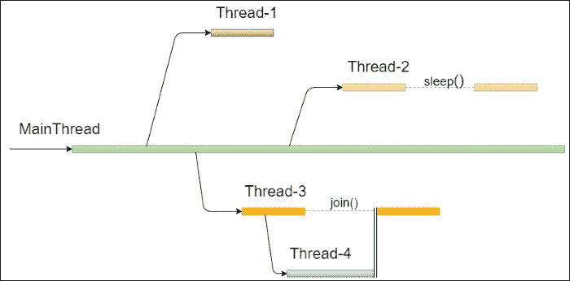
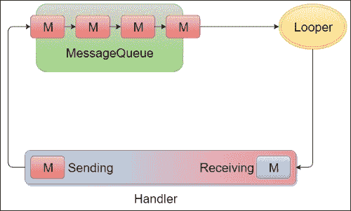
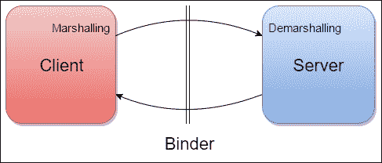
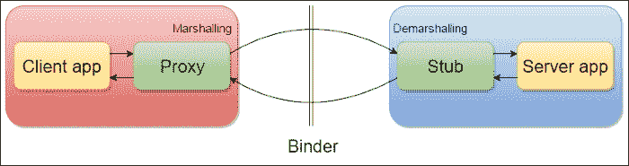

# 五、多线程操作

当手机市场开始下跌，智能手机市场蓬勃发展时，很明显用户需要移动设备上的大计算能力。不断增长的计算需求和合适硬件的可用性导致了设备上的多核 CPU，允许并行执行多个任务。安卓工程师在事情发生之前就知道了这一点。此外，这就是为什么我们有许多选项来同时执行不同的任务，具有很大的灵活性和许多不同的组件来选择应用于我们的多线程策略。然而，我们做得好吗？为了回答这个问题，我们将看到所有的线程方面，从安卓平台继承的线程化 Java 框架的基础到安卓为此目的提供的所有类。我们还将看到安卓如何处理其流程，以及我们如何在不同情况下正确选择要使用的正确组件，因为并非所有组件都可以互换。

处理多线程似乎很容易，但也有很多陷阱，尤其是在多线程之间的通信中。因此，我们将看到安卓平台如何帮助我们处理这种问题，提供一些有用的类，我们将在许多情况下使用。我们的目标是知道如何使用它们，以及如何正确处理它们来提高应用的性能。

作为开发人员，我们的目标是衡量应用的性能。因此，在本章的最后一部分，我们将介绍一种工具，用于检测某些代码是否正在主线程中执行，从而降低应用的响应速度。

# 穿行

我们将在这里定义我们需要知道的所有来处理像安卓这样的多线程环境。理解什么是线程以及在处理线程时会出现什么问题是至关重要的。这就是为什么我们会关注 Java 框架一段时间，因为每个安卓开发人员都应该知道这些概念，然后我们将关注该平台如何在安卓中定义并与更多对象集成。这提供了多种方法来分离所有级别的执行，从应用内部的多线程到不同进程之间的通信，定义一种特定的语言来到达目标。那么，让我们看看我们在谈论什么。

## 线程基础

我们可以把一个线程看作是顺序执行的指令的一部分。这些指令被翻译成由设备的硬件执行。当有多个指令部分要执行时，该环境称为 **多线程**。这种技术有助于加速任何系统，因为并行执行总是比串行执行快。此外，这通过用户界面提高了所有应用的响应能力，并且可以更好地管理资源和整个系统。

Java 为`java.lang.Thread`包提供了许多用于处理多线程并发的类。这是对开发人员不可见的实际后台执行的包装。这就是为什么在深化安卓框架之前，我们需要了解 Java 框架。

### 多核处理器

直到几年前，处理器一次只能执行一条指令。然而，线程框架已经存在。然后，来自多个线程的代码使用时间切片技术顺序执行，多线程只是一种虚构。在这种情况下，我们无法知道虚拟机从多个线程执行代码的顺序。然而，采用多核技术的处理器已经问世多年。它们可以同时执行多个代码，使多线程成为现实。

### 螺纹

要创建线程，可以使用`Thread`对象，然后调用`Thread.start()`方法，相对于当前线程并行开始执行。这样，调用线程通知虚拟机需要一个新线程，然后虚拟机创建一个新线程并执行`Thread.run()`方法内部与代码相关的字节码。但是，该方法的默认实现没有任何作用。必须指出的是，直接调用`Thread.run()`方法而不是`Thread.start()`将在不创建新线程的情况下调用该方法，因此这只是启动新线程的错误方式。有两种方法可以将代码添加到线程的执行中:

*   **扩展** `Thread` **类:**这种方式创建一个扩展`Thread`类的类，然后需要覆盖`Thread.run()`方法，以指定在调用`Thread.start()`时执行什么:

    ```java
    public class ThreadActivity extends Activity {

        @Override
        protected void onCreate(Bundle savedInstanceState) {
            super.onCreate(savedInstanceState);
            MyThread thread = new MyThread();
            thread.start();
        }

        private class MyThread extends Thread {
            @Override
            public void run() {
                //code...
            }
        }
    }
    ```

*   **实现** `Runnable` **接口**:这样当`Thread.start()`被调用时，要执行的代码就是`Runnable.run()`方法一:

    ```java
    public class ThreadActivity extends Activity implements Runnable {

        @Override
        protected void onCreate(Bundle savedInstanceState) {
            super.onCreate(savedInstanceState);
            Thread thread = new Thread(this);
            thread.start();
        }

        @Override
        public void run() {
            //code...
        }
    }
    ```

一个线程总是被另一个线程启动，所以总有一个特殊的线程叫做主线程，它是应用第一次启动和执行的线程。每次我们启动一个新线程，这个主线程的执行都会被拆分成两个独立的行，如图*图 1* :



图 1:线程操作

在*图 1* 中，显示了对螺纹的不同操作:

*   **线程-1** 刚刚创建并执行。它终止，然后被销毁，因为队列中没有更多的执行。
*   **线程-2** ，作为**线程-1** ，被创建和执行，但是在其生命周期中被暂停一段时间。这可以使用`Thread.sleep()`方法来实现，指定等待的毫秒数。在这段时间内，线程停止等待超时，然后继续运行操作。
*   **线程-3** 被创建并执行，在其生命周期内，它启动一个新线程并等待它。这意味着它无法知道它应该等待多长时间。这就是为什么，如果你不知道等待的时间，但是你在等待另一个线程完成它的工作，你可以调用`Thread.join()`方法。当创建的线程完成其任务时，**线程-3** 可以继续执行直到结束。也可以指定等待超时；到达后，无论如何**线程-3** 将恢复。

Java 为线程提供了一个优先级系统。这意味着我们可以改变线程优先级，让它相对于其他线程执行得更快或更慢。有 10 个优先级别。Java 还为最大、最小或正常优先级定义了三个常数。我们可以使用以下内容来更改线程优先级:

```java
thread.setPriority(Thread.MAX_PRIORITY);
thread.setPriority(Thread.NORM_PRIORITY);
thread.setPriority(Thread.MIN_PRIORITY);
```

### 多线程应用

使用多线程的应用和系统需要面对一些涉及开发人员的问题，这些问题迫使他们小心如何从不同的线程访问对象。

应用中多个线程的执行顺序是不可预测的。无法保证哪个线程会先执行，哪个线程会先完成。此外，我们不仅指代码块，也指单行代码。这在某些需要对单个对象进行预定义访问序列的关键情况下令人担忧。想想如果洗衣机和烘干机可以在没有预定订单的情况下处理负载，洗衣店会发生什么。如果洗衣机先启动没问题，但是如果烘干机先工作呢？或者更糟的是，如果他们可以在短时间内交替工作呢？我们希望先清洗，然后烘干。那么应该一次按正确的顺序访问一个负载。换句话说，我们需要防止一个线程在另一个线程访问对象时访问该对象。这意味着对负载的访问是同步的。

### 螺纹安全

线程安全的概念与多线程环境严格相关。它指的是不能以并发方式更改共享数据的代码的安全执行。虽然读取对象可能不是安全问题，但写入对象是安全问题。如果共享对象上没有并发操作，多线程应用就是线程安全的。

让我们看看这在 Java 框架中意味着什么。Java 使用监视器的概念:每个对象都有一个监视器，线程可以锁定和解锁它。监视器确保一次只有一个锁。任何其他锁定尝试都会排队。这些操作是在低级代码中完成的，可以使用特殊的类来调用锁，或者显式地对对象进行解锁，但是 Java 提供了一个特定的关键字来做同样的事情:`synchronized`。它可以用作语句，也可以在其签名中声明同步方法。在第一种情况下，您需要指定需要锁定的对象以及受锁定影响的代码:

```java
synchronized (object) {
    //code...
}
```

这样，在括号内的代码执行结束之前，其他线程无法访问该对象。开发人员必须意识到什么叫做死锁。这种情况发生在两个或多个线程被锁定等待对方，然后这些线程被永远阻止。使用带有交叉引用锁的`synchronized`关键字可能会发生这种情况；这种情况必须避免。

同步方法的目的是锁定该方法引用的对象:

```java
public synchronized void update() {
    //code...
}
```

## 安卓多线程环境

安卓平台从 Linux 继承进程和线程系统。系统至少为不同的应用生成一个进程，每个进程都有自己的线程。我们已经讨论过处理内存的过程。让我们分析它们是什么以及它们是如何管理的:这有助于理解如何处理应用的线程和组件。

### 流程

安卓系统中的一个**流程**是主要组件的容器，如活动、服务、广播接收器和内容提供者。因此，每个进程都会影响内存，然后，如果系统处于关键状态，它就会开始破坏内存。系统使用**最近最少使用的** ( **LRU** )策略来做到这一点:当需要时，首先销毁最近最少使用的对象以释放内存。为此设计了一个优先级系统:进程在其生命周期内可以处于以下状态之一:

*   **前台**:如果一个进程托管了一个用户正在与之交互的组件，那么这个进程就是前台进程。那么这个过程就在堆栈的顶部。
*   **可见**:一个进程如果不是前台的话就是可见，但是用户还是可以看到的。
*   **服务**:这个是一个保存刚开始的服务的流程。
*   **背景**:此包含用户不再可见的组件。
*   **清空**:这样的流程不包含任何组件。它用于缓存目的，以加速未来的应用恢复。它在堆栈的底部；那么当系统回收内存时，它首先被丢弃。

当应用第一次启动时，会创建一个默认的进程，并在那里执行其所有组件。然而，我们可以处理应用的组件，强制为每个组件创建一个新的进程，或者让它们加入同一个定制进程。这可以使用清单文件中的特定属性来完成:

```java
<service
    android:name=".MyService"
    android:process=".MyProcess">
</service>
```

只需要指定进程的名称。当名称以冒号开头时，过程对应用是私有的。当它以小写字母开头时，该过程可以与其他应用共享。

## 安卓应用线程

本章前面我们讨论的线程，在安卓系统中是一样的:当一个应用启动时，会创建一个新的主线程，它的代码会按顺序执行。从那个线程，我们可以启动新的线程来做后台操作。为应用创建的任何其他线程称为 **后台线程**或**工作线程**。另一种线程是绑定线程，用于进程间的通信。

### UI 线程

关键要明白主线程是唯一可以管理用户界面的线程。这就是为什么它也被称为 UI 线程。用户界面线程的生命周期与应用和进程的生命周期相同，因为需要有一个能够让用户随时交互的线程。然而，为什么这是一个如此严格的要求？为什么没有办法从 UI 线程之外访问视图？安卓用户界面不是线程安全的，如果一个视图可以被不同的线程访问和修改，在我们的应用执行过程中可能会出现意想不到的行为和并发错误。

做出这个选择是为了加速 UI，因为对一个对象的锁定和解锁操作非常昂贵，会影响安卓用户体验，只是为了让开发人员从多个线程访问视图。然后，平台强制只从主线程访问用户界面。这意味着不需要同步视图，因为它们只能由用户界面线程访问。所以，这只是对代码结构的无用补充。事实上，每次后台线程试图访问视图实例时，都会引发以下异常:

```java
CalledFromWrongThreadException: Only the original thread that created a view hierarchy can touch its views
```

### 工作线程

在安卓平台上看到的另一个方面是，主线程不仅仅负责 UI，它应该只负责 UI:任何不必要的 UI 操作都必须在不同的线程中完成，才能拥有流畅的 UI，然后是一个好的 UX，这是工作线程的首要目标。它们用于执行可能影响用户界面的长时间运行的操作。不仅如此，如果在用户界面线程中执行，这些操作可以冻结用户界面，直到它们结束。这可能会导致所谓的*应用不响应*对话框。当有东西阻塞用户界面时，系统会向用户显示这个对话框，说应用没有响应，并询问用户是否应该关闭它。这对用户体验来说很糟糕，对性能来说也是一场灾难。我们将看到安卓提供了什么样的结构来达到我们应用想要的响应速度。

### 活页夹线

当我们需要来自不同进程的不同线程进行通信时，我们不能使用标准代码，但是我们需要一些更先进的技术来做到这一点。安卓平台使用绑定线程让不同进程的线程进行通信。这种线程简化了进程间的通信，我们将在下面的页面中看到。无论如何，我们不需要直接处理活页夹线。有一种特殊的语言允许我们在进程之间交换数据，叫做 **安卓界面定义语言** ( **AIDL** )。

## 安卓线程消息

让我们来看看处理应用中线程间通信的框架。消息传递操作中涉及到一些对象。它们如下:

*   `Message`或`Runnable`对象:它们是跨线程通信和发送的对象。
*   `MessageQueue`:这个是一个要处理的有序消息和可运行程序的容器。
*   `Looper`:这是将`Message`和`Runnable`对象分派到右侧`Handler`对象的对象。
*   `Handler`:这个是`Message`和`Runnable`物体的来源，`Looper`的接受者。因此，它有双重责任将消息和可运行程序放入`MessageQueue`并在`Looper`发回后执行它们。魔力就在这里:发送操作在发送线程上进行，而执行操作在接收线程上进行。因此，不同线程之间的通信。

*图 2* 显示了这些对象之间的主要关系:



图 2:两个线程之间的消息传递过程

并非所有线程都有`Looper`。相反，只是主线有自己的`Looper`。这意味着，如果您想让两个线程进行通信，需要为该通信分配一个`Looper`对象，并且需要创建`MessageQueue`。这可以通过调用`Thread.run()`里面的静态`Looper.prepare()`方法来完成。现在我们有了`MessageQueue`和`Looper`，我们需要这个`Looper`开始向`Handler`发送消息和运行程序。这可以通过调用静态`Looper.loop()`方法来实现。下面是一个代码片段，展示了所说的内容:

```java
public class LooperThread extends Thread {
    public Handler mHandler;

    public void run() {
        Looper.prepare();
        mHandler = new Handler() {
            public void handleMessage(Message msg) {
                // code…
            }
        };
        Looper.loop();
    }
}
```

现在，让我们看看对象是如何工作的，可以发送消息和运行程序。`Handler`对象需要与建筑中的`Looper`相关联。然后，空的`Handler`构造函数将获得与创建它的线程的`Looper`的关联。那么只有在主线程中或者在调用后台线程的`Looper.prepare()`方法之后，处理程序的以下实例化才是可能的:

```java
Handler mHandler = new Handler();
```

这就是为什么，如果不这样做，将会抛出一个`RuntimeException`，应用将会崩溃，堆栈跟踪中会出现以下消息:

```java
java.lang.RuntimeException: Can't create handler inside thread that has not called Looper.prepare()
```

从操作角度来看，`Handler`使用以下方法向`MessageQueue`发送消息和可运行项:

*   `post(Runnable r)`
*   `sendEmptyMessage(int what)`
*   `sendMessage(Message m)`

这三者都有可能指定特定的执行时间或延迟时间，并且`Handler`可以使用以下方法将它们从`MessageQueue`中移除:

*   `removeCallbacks(Runnable r)`
*   `removeMessages(int what)`
*   `removeCallbacksAndMessages(Object token)`

当`Runnable`对象包含要执行的代码时，消息应该由`Handler`使用`Handler.handleMessage()`方法处理，该方法提供了`Message`本身。

# 最佳实践

带着的线程概念，让我们通过的代码来了解谷歌是如何改进继承自 Java 的多线程框架的，以及安卓平台为开发者提供了哪些 API 来处理 UI 线程和工作线程分离的主要问题。我们还将看到这可能会带来什么问题，以及安卓在开发过程中引入了哪些解决方案。

然后，我们将讨论管理主要组件的先进技术，以及进程间通信的 AIDL 和信使。

## 螺纹

标准的 Java 线程是我们将在接下来的页面中看到的其他框架的基础。它们包装线程或可运行程序来实现一些平台需求，比如与用户界面线程的通信。它们仍然是不需要通知用户界面线程的简单后台操作的轻量级解决方案。

### 类型

一般来说，在使用线程时，要避免循环内的同步，因为获取和释放锁是一项昂贵的操作。然后，这会导致计时增加和资源的无用消耗。

## 处理线程

在典型的应用开发中，我们处理线程和处理程序，有时我们忘记准备在后台线程上处理消息所需的东西。这就是为什么安卓提供了一个有用的`Thread`子类来包装线程本身、`Looper`和`MessageQueue`的原因。这就是自行准备`Looper`的`HandlerThread`。那么开发人员就不需要这么做了。而且，如果需要更多的初始化，我们可以在`HandlerThread.onLooperPrepared()`方法中进行:这样我们就知道`Looper.prepare()`已经被调用了，`HandlerThread.getLooper()`的结果不会为空。

让我们看一下下面的代码片段:

```java
public class HandlerThreadActivity extends Activity {

    @Override
    protected void onCreate(Bundle savedInstanceState) {
        super.onCreate(savedInstanceState);
        MyHandlerThread handlerThread = new MyHandlerThread("HandlerThread");
        handlerThread.start();
    }

    private class MyHandlerThread extends HandlerThread {
        private Handler handler;

        public MyHandlerThread(String name) {
            super(name);
        }

        @Override
        protected void onLooperPrepared() {
            handler = new Handler(getLooper()) {
                @Override
                public void handleMessage(Message msg) {
                    //code...
                }
            };
        }

        public void post(Runnable r) {
            handler.post(r);
        }
    }
}
```

与经典线程不同，`HandlerThread`可以被重用，因为它在调用`HandlerThread.quit()`方法之前保持活动状态。这个特殊的方法终止了`Looper`，它不能再处理消息和可运行程序了。那么任何进一步的`Message`或`Runnable`发送都将失败，并且`MessageQueue`被清空。该方法将强制挂起的消息和可运行程序退出，并且它们不会被分派到`Handler`。为了确保没有未决消息将被终止和分派，使用`HandlerThread.quitSafely()`方法。当这些方法中的一个被调用时，`HandlerThread`对象就不能再被使用了，因为线程已经到了执行的末尾。

### 何时使用

`HandlerThread`保持线程与`Looper`和`MessageQueue`活动。此外，它提供了受控的消息处理。因此，当我们需要一个始终可用的线程来使用时，这是很好的选择。

### 类型

当处理多个线程和它们之间的消息传递时，一个`HandlerThread`是将`Looper`管理委托给的好选择。它还可以在多个消息和可运行程序中重用。但是，请记住，当不再需要释放资源时，请退出。

## 异步任务

正如前面所讨论的，从多线程的角度来看，作为开发人员的主要目标是尽可能将用户界面线程从可以在并行线程中执行的操作中解放出来，以保持流畅的用户界面。开发人员从平台开始就可以使用的主要工具是`AsyncTask`。它不是一个线程框架，而只是一个用于让工作线程与 UI 线程进行通信的助手类。

`AsyncTask`对象只能启动一次，就像`Thread`一样。它可以从用户界面线程创建、加载和启动。`AsyncTask`子类可以覆盖以下方法:

```java
public class MyAsyncTask extends AsyncTask<Params, Progress, Result> {
    @Override
    protected void onPreExecute() {}

    @Override
    protected Result doInBackground(Params... p) {return result;}

    @Override
    protected void onProgressUpdate(Progress... values) {}

    @Override
    protected void onPostExecute(Result result) {}

    @Override
    protected void onCancelled() {}
}
```

考虑到这一点，让我们来解释一下这意味着什么。

### 方法

在前面的方法中，只有`AsyncTask.doInBackground()`一个是抽象的，在工作线程中执行。如果需要，可以覆盖其他选项，这些选项有以下用途:

*   `onPreExecute()`:这个在开始后台工作之前调用。它用于通知用户后台发生了一些事情。
*   `onProgressUpdate()`:这个是用来从工作线程进行一些更新后更新 UI 的。
*   `onPostExecute()`:这个处理来自工作线程的结果。
*   `onCancelled()`:这个用来处理 UI 线程上的`AsyncTask`取消。

### 泛型参数

需要类签名中的泛型来指定以下内容:

*   `Params`:这个是`AsyncTask.doInBackground()`期望的输入类型
*   `Progress`:这是用来通知`AsyncTask.onProgressUpdate()`更新的类型
*   `Result`:这个是`AsyncTask`、`doInBackground()`方法的结果，是`AsyncTask.onPostExecute()`的输入

### 状态管理

一个`AsyncTask`物体可以通过三个随后的`AsyncTask.Status`:

*   `PENDING`:开始前
*   `RUNNING`:执行时
*   `FINISHED`:完成`AsyncTask.onPostExecute()`后

### 执行人

每次需要执行时，必须提供一个`Executor`对象。`AsyncTask`有两种默认执行方式。它们如下:

*   `SERIAL_EXECUTOR`:这个一次一个，按顺序完成所有任务
*   `THREAD_POOL_EXECUTOR`:这个并行执行任务

开始执行`AsyncTask`有三种方法:

*   `execute(Params)`:这个将任务添加到`SERIAL_EXECUTOR`的队列中
*   `execute(Runnable)`:这个是用`SERIAL_EXECUTOR`执行`Runnable`对象的静态方法
*   `executeOnExecutor(Executor, Params)`:这个可以让你指定你想要使用的`Executor`对象

这是性能的关键部分，因为工作线程的执行取决于所使用的特定执行器；如果队列已满且任务长时间运行，串行执行可能会导致意外的延迟。另一方面，默认的并行执行是全局的:因此，线程池中的线程在多个应用之间共享。作为替代，我们可以创建我们的执行器，用于`AsyncTask.executeOnExecutor()`方法。为此，有一个创建执行器的`Factory`类。这个类叫做`Executors`，它的方法如下:

*   `newCachedThreadPool()`:这个首先检查是否有可用的线程可以使用，如果没有，它会创建一个新的线程并缓存起来以备将来请求
*   `newFixedThreadPool()`:这个和缓存的情况一样，但是线程数是固定的
*   `newScheduledThreadPool()`:这个创建了一个执行器，可以调度线程在定义的时间执行任务
*   `newSingleThreadExecutor()`:这个创建一个单线程执行器
*   `newSingleThreadScheduledExecutor()`:这个创建了一个执行器，这个执行器有一个线程，可以被安排在一个定义的时间执行

这样，我们就可以创建和重用我们的私有线程池作为一个单独的线程池，或者在`Application`类中。例如:

```java
public class ApplicationExecutor extends Application {
    private Executor executor;

    public static Executor getExecutor() {
        if (executor == null)
            executor = Executors.newCachedThreadPool();
        return executor;
    }
}
```

### 何时使用

`AsyncTask`的目的是让工作线程与 UI 线程进行通信。那么，如果我们的后台操作不需要通知用户，或者一般不需要更新 UI，那么就不需要使用`AsyncTask`:一个线程就够了，比`AsyncTask`更有性能。

### 类型

如果您使用的是带有所有无效参数的`AsyncTask`或者您只实现了`AsyncTask.doInBackground()`方法，那么您不需要`AsyncTask`。将实现更改为经典线程，因为`AsyncTask`不会更改用户界面。

除了这种情况之外，`AsyncTask`实现还面临着由于`Activity`生命周期而产生的一些问题。它多次被用作`Activity`内部的内部阶级。那么，内存泄漏，如[第四章](04.html "Chapter 4. Memory")、*内存*中所讨论的，就那么容易发生。除此之外，它在`Activity,`中使用，当`Activity`的实例由于配置更改而被破坏时，`AsyncTask`仍处于活动状态并运行，但用户界面参考不再可用。然后，当`Activity`被销毁并重新创建时，来自`AsyncTask`的结果数据需要缓存在某个地方。否则`AsyncTask`必须重新执行。

## 装载机

知道了对`AsyncTask`的限制，安卓开始提供加载器框架，以便在一些情况下拥有对`AsyncTask`的有效替代。让我们看看加载器提供了什么。

例如，它们处理从远程服务器检索数据的异步操作，然后，它们触发回调通知调用者新数据可用。呼叫者可以是活动或片段。加载器是独立于生命周期的:配置更改后`Activity`或`Fragment`是否被销毁和重新创建并不重要。它仍然在后台运行，并通知新创建的实例`Activity`或`Fragment`。此外，如果后台工作在配置更改之前完成，加载程序将缓存后台产生的数据，以通知新实例。活动生命周期独立性的这一特性意味着加载器和活动本身之间没有联系:因此，加载器使用应用上下文，降低了活动泄漏的风险。

### 加载程序管理器

每个 `Activity`或`Fragment`都有且只有一个`LoaderManager`。可以使用以下`Activity`和`Fragment`方法进行检索:

```java
getLoaderManager();
```

一个`LoaderManager`类处理装载机上的一些操作，如以下方法所述:

*   `initLoader(int id, Bundle args, LoaderCallbacks<D> cb)`:这会初始化一个加载器，给它分配一个 ID，传递额外的参数，并指定如何处理回调。如果具有相同标识的加载程序已经存在，则使用它，而不是创建另一个。
*   `restartLoader(int id, Bundle args, LoaderCallbacks<D> cb)`:这个再次启动一个加载器，或者如果没有加载器与指定的 ID 相关联，则创建一个新的加载器，传递额外的参数和回调实例来处理响应。
*   `getLoader(int id)`:本次返回指定标识的装载机。
*   `destroyLoader(int id)`:此停止指定 ID 的装载机。

### 装载机回调< D >

用于处理加载器操作结果的回调接口通过以下方法实现:

*   `onCreateLoader(int id, Bundle args)`:这将返回一个新的加载器
*   `onLoadFinished(Loader<D> loader, D data)`:通知加载器完成后台操作，然后传递结果
*   `onLoaderReset(Loader<D> loader)`:这通知加载器已经复位，然后数据不再可用

### 提供的装载机

当使用加载器时，我们需要使用`CursorLoader`或者创建加载器的子类或者像`AsyncTaskLoader`这样的一些其他加载器专门化。让我们看看这些选项和差异。

#### 异步任务加载器

这个加载器用于使用一个包装的`AsyncTask`来做后台工作，正如我们所知，它处理通过工作线程和用户界面线程传递的数据。然而，它是一个抽象类，因为我们需要覆盖`AsyncTaskLoader.loadInBackground()`方法来告诉类哪些操作必须在工作线程中执行:

```java
public class MyAsyncTaskLoader extends AsyncTaskLoader<Result>{

    @Override
    public Result loadInBackground() {
        //code...
        return result;
    }
}
```

然后，`AsyncTaskLoader`可以用于一个`Activity`或者一个`Fragment`类所需要的每一个后台操作。

#### 游标载入器

CursorLoader 是一个专门从`ContentProvider`中检索数据的工具，因此，如果你没有`ContentProvider`来存储数据，这不是使用 Loader 的正确选择。但是，它是`AsyncTaskLoader<Cursor>`的一个实现。然后，在不影响 UI 的情况下，在一个工作线程中查询`ContentProvider`是有帮助的。它是为与`CursorAdapter`或`SimpleCursorAdapter`一起使用而设计的，以简化活动的开发:例如，请看下面的片段:

```java
public class CursorLoaderActivity extends ListActivity implements LoaderManager.LoaderCallbacks<Cursor>{
    private static final int CURSOR_LOADER_ID = 0;
    private SimpleCursorAdapter simpleCursorAdapter;

    public void onCreate(Bundle savedInstanceState) {
        super.onCreate(savedInstanceState);
        simpleCursorAdapter = new SimpleCursorAdapter(this,
                android.R.layout.simple_list_item_1, null,
                new String[] { "name" },
                new int[] { android.R.id.text1}, 0);
        setListAdapter(simpleCursorAdapter);
        getLoaderManager().initLoader(CURSOR_LOADER_ID, null, this);
    }

    @Override
    public Loader<Cursor> onCreateLoader(int id, Bundle args) {
        return new CursorLoader(this, URI, null, null, null, "name ASC");
    }

    @Override
    public void onLoadFinished(Loader<Cursor> loader, Cursor c) {
        simpleCursorAdapter.swapCursor(c);
    }

    @Override
    public void onLoaderReset(Loader<Cursor> loader) {
        simpleCursorAdapter.swapCursor(null);
    }
}
```

### 何时使用

加载器框架改进了`AsyncTask`的特性，让我们不用担心活动或片段生命周期，也不用为我们缓存数据。由于这些原因，它是使用`AsyncTask`的有效替代方案。然而，多装载机管理比`AsyncTask`更容易。然后，它在游标情况下的专门化很容易使用。

### 注

当我们需要获取数据时，一个`AsyncTaskLoader`是一个正确的选择:它提供了与`AsyncTask`相同的特性，加上活动生命周期独立性和数据缓存。因此，应用的响应性和稳定性方面的性能得到了提高。

## 服务

一个服务是安卓平台提供的主要组件之一，然后你需要在清单文件中声明它。与活动相反，服务没有用户界面可处理。然后，它的主要目标是在后台执行长时间运行的操作。然而，我们需要另一种方法来创建和控制工作线程吗？

想想我们在前面几页看到的所有其他方式:它们取决于 UI 更新的活动生命周期。此外，服务来了。它是一个独立的对象，可以在后台使用，没有限制，没有用户交互，也没有用户界面。因此，不需要与用户交互的大量操作可以在服务中执行。

### 类型

处理服务时要记住的最重要的一点是，它们不是线程，相反，它们默认在 UI 线程上执行。因此，在不创建新线程的情况下，永远不要在服务中启动长时间运行的操作:这会影响应用的所有用户界面。然后，当用户在用户界面上做一些不同的事情时，可以向用户显示一个*应用不响应*对话框。

### 生命周期

作为活动，服务有两种方法来识别其创建和销毁。此外，这些方法与活动的名称相同:

```java
public class LocalService extends Service {

    @Override
    public void onCreate() {
        super.onCreate();
    }

    @Override
    public IBinder onBind(Intent intent) {
        return null;
    }

    @Override
    public int onStartCommand(Intent intent, int flags, int startId) {
        return super.onStartCommand(intent, flags, startId);
    }

    @Override
    public boolean onUnbind(Intent intent) {
        return super.onUnbind(intent);
    }

    @Override
    public void onDestroy() {
        super.onDestroy();
    }
}
```

`Service`类是抽象的，唯一被覆盖的方法是`Service.onBind()`类。然而，这是为了什么？让我们从生命周期的角度定义两种类型的服务:

*   **启动服务**:使用`Context.startService()`方法或使用`Intent`启动服务，该服务一直处于活动状态，直到调用了`Context.stopService()`或`Service.stopSelf()`方法。
*   **绑定服务**:服务在另一个组件请求与其绑定时启动，并保持活动状态，直到它绑定到至少一个外部组件。当不再与其他组件绑定时，它就会被销毁。

这两者之间没有明确的区别，因为一个启动的服务可以在其生命周期的任何时候被绑定。但是，在所有其他绑定组件都消失后，它仍将处于活动状态。

### 启动服务

当我们想要创建一个已启动的服务时，我们无论如何都必须覆盖`Service.onBind()`方法，因为它是一个抽象的方法。因此，如果我们不希望它被绑定，我们可以离开它，返回 null。接下来我们将看到如何绑定服务。相反，我们需要覆盖的是`Service.onStartCommand()`方法。这有三个参数:

*   `Intent intent`:这是在调用`Context.startService()`方法时给服务提供额外信息的方式。
*   `int flags`:这个用来确定传递的是什么样的意图。我们将在本节稍后部分看到它。
*   `int startId`:这个是来电者的 ID。它可以用来知道它是从同一个组件再次启动还是在终止后重新启动。

我们已经知道，系统可以通过基于进程优先级的策略开始销毁进程。在这种情况下，我们的服务可以被终止，并且它正在执行的后台操作将不会完成。这就是`Service.onStartCommand()`方法需要返回整数值的原因。这样，我们可以指定我们希望系统处理服务本身意外终止的方式。方法可能返回的值如下:

*   `START_STICKY`:使用这个，服务将在终止发生后再次创建。要重新创建，系统会向其发送一个空值`Intent`。然后，在使用之前，在`Service.onStartCommand()`方法中检查它是否为空。当服务在意外终止后需要重新启动以完成一些工作时，请考虑使用它。
*   `START_NOT_STICKY`:在调用正常的`Context.startService()`方法交付新的`Intent`类或者新的`Intent`与`Service IntentFilter`匹配之前，服务不会被重新创建。然后，不会对该方法触发任何空意图。当服务意外终止时，不需要再次启动服务来完成某些工作时，将使用此选项。
*   `START_REDELIVER_INTENT`:当服务由于与调用`Service.stopSelf()`方法或`Context.stopService()`方法不同的原因而终止时，则使用用于再次调用`Service.onStartCommand()`方法的最后一个意图来重新启动服务。当我们需要知道哪个操作因终止而中断时使用。

根据使用前述常数重新启动服务所采用的策略，作为`Service.onStartCommand()`参数传递的`Intent`可能有不同的含义。让我们看看可能的值:

*   `0`:这是默认值，一般只是传递意图，作为第一次。
*   `START_FLAG_REDELIVERY`:由于重新交付策略，`Intent`类已经重新交付。之前已经给过了，但是处理完之后，服务意外停止了。因此，意图再次被传递，并且这个标志对于了解这个事实是有用的。
*   `START_FLAG_RETRY`:意图本来是要交付给服务的，但是已经被终止，然后，意图用这个标志再次交付。这一次，我们可以知道服务从未处理过意图，与之前的情况相反。

让我们看一个已启动服务的实现示例。请记住，它是在用户界面线程上执行的，然后，我们需要创建必要的线程来运行长期运行的操作，而不会影响用户界面，也不会忘记从[第 4 章](04.html "Chapter 4. Memory")、*内存*中获得的关于内部类和内存含义的经验教训:

```java
public class MyService extends Service {
    private Thread thread;

    @Nullable
    @Override
    public IBinder onBind(Intent intent) {
        return null;
    }

    @Override
    public int onStartCommand(Intent intent, int flags, int startId) {
        switch (intent.getAction()) {
            case "action1":
                handleAction1();
                break;
        }
        return START_NOT_STICKY;
    }

    private void handleAction1() {
        thread = new Thread(new MyRunnable());
        thread.start();
    }

    private static class MyRunnable implements Runnable {

        @Override
        public void run() {
            //code...
        }
    }
}
```

在这个例子中，我们使用了一个经典的线程，但是对于不同线程之间的通信，我们可以使用一个`Handler`或者`HandlerThread`对象或者`Executor`框架或者一个`AsyncTask`，这取决于我们的需要。

#### 何时使用

已启动的服务有助于处理多个同时请求。您将不得不设计您的多线程策略，因为它是在 UI 线程中执行的，但是从线程的角度来看，它是更灵活的组件。

### 绑定服务

在讨论绑定服务时，我们需要定义一个客户端和一个服务器端。服务是这种客户机服务器体系结构的服务器，而一个活动或另一个服务是客户机。因此，我们需要一个接口，让他们正常沟通。平台提供`Context.bindService()`方法。

如上所述，绑定服务保存对客户端的引用，当不再引用客户端时，服务会自动终止。当我们需要在多个活动之间共享后台操作而不需要关闭服务时，这种行为是有帮助的，因为它是自动终止的。

从服务器客户端的角度来看，绑定服务生命周期仅由两种方法组成:

*   `Service.onBind()`
*   `Service.onUnbind()`

与普遍的看法相反，前面的方法并不是每次服务绑定到客户端或未绑定到客户端时都调用；仅针对第一个客户端调用`Service.onBind()`方法，当最后一个客户端未绑定时调用`Service.onUnbind()`方法。因此，这些方法用于初始化和释放`Service`对象或变量。

为了让客户机和服务器通信而创建的接口使用客户机中的一个`ServiceConnection`接口实例和服务器中的一个绑定器。让我们看看这在两者的代码中意味着什么。这是`Service`类代码:

```java
public class MyService extends Service {
    private final ServiceBinder binder = new ServiceBinder();

    public class ServiceBinder extends Binder {

        public MyService getService() {
            return MyService.this;
        }
    }

    @Nullable
    @Override
    public IBinder onBind(Intent intent) {
        return binder;
    }
}
```

返回我们的`ServiceBinder`对象，它有一个方法来获取对`Service`类本身的引用，我们允许客户端获取对它的引用，然后调用它的方法。现在让我们看看客户端代码:

```java
public class ClientActivity extends Activity {
    private MyService myService;
    private ServerServiceConnection serverServiceConnection = new ServerServiceConnection();
    private boolean isBound = false;

    private class ServerServiceConnection implements ServiceConnection {

        @Override
        public void onServiceConnected(ComponentName name, IBinder service) {
            myService = ((MyService.ServiceBinder) service).getService();
            isBound = true;
        }

        @Override
        public void onServiceDisconnected(ComponentName name) {
            myService = null;
            isBound = false;
        }
    }

    @Override
    protected void onCreate(Bundle savedInstanceState) {
        super.onCreate(savedInstanceState);
        Intent intent = new Intent(this, MyService.class);
        bindService(intent, serverServiceConnection, Service.BIND_AUTO_CREATE);
    }

    @Override
    protected void onDestroy() {
        super.onDestroy();
        if (isBound) {
            unbindService(serverServiceConnection);
        }
    }
}
```

`ServiceConnection.onServiceConnected()`方法有一个`IBinder`作为参数，那么我们可以将其转换为我们在`Service`类中定义的`ServiceBinder`，并使用它通过我们定义的`ServiceBinder.getService()`方法来检索服务本身。

这样，我们可以使用活动中的`myService`对象来调用服务的方法。当不再需要引用时，记得调用`Context.unbindService()`方法。

#### 何时使用

如果您需要组件和服务之间的直接通信，绑定服务是正确的选择，因为它将已启动服务的灵活性扩展到了另一个组件，将两个绑定组件的实现分开。

### 强度服务

平台提供的服务的特定实现是`IntentService`类。这在某些情况下是有用的，原因我们将会发现。这个类包装了一个单独的后台线程，以执行与其队列中的意图相关的不同请求。当队列变空时，`IntentService`类自动销毁。因此，它有一个不同于`Service`类的生命周期。它只有在后台线程中运行时才是活动的。了解了这一点，我们来看看`Service`和`IntentService`的区别:

*   `Service.onStartCommand()`方法的实现默认返回`Service.START_NOT_STICKY`。因此，如果服务意外终止，将不会重新传递任何意图。不管怎样，我们可以用`Service.setIntentRedelivery()`的方法来改变这种行为。
*   由于其生命周期，不可能绑定这样的服务。因此，不可能为此创建一个绑定器，并且`Service.onBind()`方法的默认实现是返回 null。
*   该类提供了`IntentService.handleIntent()`方法，而不是使用`System.onStartCommand()`方法来处理传入的意图。此方法在后台线程中执行；那么，在这种情况下就不需要创建工作线程了。这个类为我们处理线程的创建和管理。这个线程管理是使用`HandlerThread`完成的；这就是为什么有一个消息和可运行程序顺序执行的队列。
*   如上所述，`IntentService`类不能被绑定，因此，启动它的方法只是使用`Context.startService()`方法。

`IntentService`类的代码如下所示:

```java
public class MyService extends IntentService {

    public MyService() {
        super("MyService");
    }

    @Override
    protected void onHandleIntent(Intent intent) {
        switch (intent.getAction()) {
            case "action1":
                handleAction1();
                break;
        }
    }

    private void handleAction1() {
        //code...
    }
}
```

#### 何时使用

当需要在一个单独的线程中在后台执行一个顺序操作，并且不需要处理`Service`的生命周期时，`IntentService`类是正确的选择:它提供了在不影响 UI 的情况下进行异步操作所需的一切。

## 进程间通信

来自两个不同进程的两个线程之间的通信不像前面的情况那么简单，因为两个独立的进程不能共享内存，因此`Handler`对象无法在两个线程上执行。在这种情况下，我们前面讨论的绑定线程帮助我们让线程在不同的进程中进行通信。

### 远程过程调用

框架让我们定义**远程过程调用** ( **RPC** )，这允许本地进程中的客户端线程调用远程方法，就好像它们是本地的一样。*图 3* 显示了这意味着什么:



图 3:远程过程调用方案

适当的流程如下:

1.  客户端调用服务器方法。
2.  数据和方法被转换成适合传输的格式。这个操作也被称为 **编组**。
3.  通过一个绑定线程，数据和方法被传输。
4.  数据和方法通过解映射转换回原始格式。
5.  服务器用数据执行该方法，并将相同过程的结果准备回客户端。

需要通过流程传递的数据必须实现 Parcelable 接口。

### AIDL

RPC 可以使用一种叫做**安卓界面定义语言** ( **AIDL** )的特殊语言来定义。客户端和服务器之间的接口在`.aidl`文件中定义，其内容在客户端和服务器进程中都被复制。封送和解封操作被委托给两个特定的内部类，客户端称为 **代理**，服务器端称为**存根** 。在这种情况下，*图 3* 中的方案变成了*图 4* 中的方案:



图 4:安卓界面定义语言方案

要使用这种语言，需要在`.aidl`文件中用方法签名定义接口。例如，查看`.aidl`文件中的以下声明:

```java
interface IRemoteInterface {
    boolean sendResult(in Result result);
}
```

然后，将其转换为`.java`文件，并在进程之间共享。因此，`RemoteService`类可以通过这种方式拥有其存根的实例:

```java
public class RemoteService extends Service {
    private final IRemoteInterface.Stub binder = new IRemoteInterface.Stub() {
        @Override
        public boolean sendResult(Result result) throws RemoteException {
            return false;
        }
    };

    public RemoteService() {
    }

    @Override
    public IBinder onBind(Intent intent) {
        return binder;
    }
}
```

此外，最后，客户端活动可以绑定远程服务并调用接口的方法，如下所示:

```java
public class AidlActivity extends Activity implements View.OnClickListener{
    private boolean bound = false;
    private IRemoteInterface mIRemoteService;
    private ServiceConnection mConnection = new ServiceConnection() {
        public void onServiceConnected(ComponentName className, IBinder service) {
            mIRemoteService = IRemoteInterface.Stub.asInterface(service);
            bound = true;
        }

        public void onServiceDisconnected(ComponentName className)
{
            mIRemoteService = null;
            bound = false;
        }
    };

    @Override
    protected void onStart() {
        super.onStart();
        Intent intent = new Intent(AidlActivity.this, RemoteService.class);
        intent.setAction(IRemoteInterface.class.getName());
        bindService(intent, mConnection, Context.BIND_AUTO_CREATE);
    }

    @Override
    public void onClick(View v) {
        if (bound) {
            try {
                mIRemoteService.sendResult(result);
            } catch (RemoteException e) {
                e.printStackTrace();
            }
        }
    }
}
```

### 信使

另一种将方法和数据发送到 T4 远程进程的方法是使用 T0 对象。它更容易，但单线程，因此更慢。一个`Messenger`对象在一个进程中引用了一个`Handler`对象，然后另一个进程处理它。让我们从远程服务的代码开始:

```java
public class RemoteService extends Service {
    MyThread thread;
    Messenger messenger;

    @Override
    public void onCreate() {
        super.onCreate();
        thread.start();
    }

    private void onThreadPrepared() {
        messenger = new Messenger(thread.handler);
    }

    public IBinder onBind(Intent intent) {
        return messenger.getBinder();
    }

    @Override
    public void onDestroy() {
        super.onDestroy();
        thread.quit();
    }

    private class MyThread extends Thread {
        Handler handler;

        @Override
        public void run() {
            Looper.prepare();
            handler = new Handler() {

                @Override
                public void handleMessage(Message msg) {
                    // Implement message processing
                }
            };
            onThreadPrepared();
            Looper.loop();
        }

        public void quit() {
            handler.getLooper().quit();
        }
    }
}
```

然后，`Messenger`对象被客户端`Activity`用来发送消息:

```java
public class MessengerActivity extends Activity implements View.OnClickListener {
    private boolean bound = false;
    private Messenger remoteService = null;
    private ServiceConnection connection = new ServiceConnection()
{

        public void onServiceConnected(ComponentName className, IBinder service) {
            remoteService = new Messenger(service);
            bound = true;
        }

        public void onServiceDisconnected(ComponentName className)
{
            remoteService = null;
            bound = false;
        }
    };

    public void onCreate(Bundle savedInstanceState) {
        super.onCreate(savedInstanceState);
        Intent intent = new Intent(action);
        bindService(intent, connection, Context.BIND_AUTO_CREATE);
    }

    @Override
    public void onClick(View v) {
        if (bound) {
            try {
                remoteService.send(message);
            } catch (RemoteException e) {
                e.printStackTrace();
            }
        }
    }
}
```

## 先进技术

我们在这里看到了安卓应用中处理多线程的主要技术的概述。我们现在希望了解有助于提高性能的高级技术，特别是在开发人员不总是知道多线程策略如何工作的情况下，将昂贵的操作从用户界面线程转移到工作线程。

### 广播接收器异步技术

一个 `BroadcastReceiver`类是另一个安卓平台的主要组件。由于寿命周期短，它与其他主要部件不同。`BroadcastReceiver`类是活动的，只是为了执行`BroadcastReceiver.onReceive()`方法。它的主要用途是接收信息。因此，它的寿命很短。然后，创建这个组件不是为了执行长时间运行的操作。但是，它是用于启动后台任务启动的最佳候选，例如`IntentService`:

```java
public class MyReceiver extends BroadcastReceiver {

    @Override
    public void onReceive(Context context, Intent intent) {
        Intent sericeIntent = new Intent();
        sericeIntent.setClass(context, MyService.class);
        sericeIntent.setAction(MyService.ACTION);
        context.startService(sericeIntent);
    }
}
```

从安卓蜂巢(API Level 11)开始，平台提供了一种特殊的方式来延长`BroadcastReceiver`类的生命周期，等到一个后台线程结束:调用`BroadcastReceiver.goAsync()`方法，返回一个`PendingResult`对象。该对象用于处理后台线程的状态。接收器的寿命持续到调用`PendingResult.finish()`方法。记住这一点很重要:如果你打算在线程完成任务后使用这种特殊的技术，调用`PendingResult.finish()`方法来释放`BroadcastReceiver`类。否则，接收器将不会关闭，导致内存泄漏，并在下一次接收广播事件中出现意外结果。让我们看看使用这种技术的代码:

```java
public class AsyncReceiver extends BroadcastReceiver {

    @Override
    public void onReceive(Context context, Intent intent) {
        switch (intent.getAction()) {
            case "myAction":
                final PendingResult pendingResult = goAsync();
                new Thread() {

                    public void run() {
                        // Do background work
                        pendingResult.finish();
                    }
                }.start();
                break;
        }
    }
}
```

### ContentProvider 异步技术

一个 `ContentProvider`类是另一个主要组件，用于在其他主要组件、进程和应用之间共享数据。它的主要目的是保存一个共享信息的数据库。很多时候，提供者是不同流程中的远程对象。然后，不直接访问提供者，而是使用`ContentResolver`对象来查询、插入、删除和更新提供者。这样处理进程间的通信。

一个`ContentProvider`类不能知道同时发生了多少个并发修改。然后，需要线程安全，因为需要查询数据的一致性。幸运的是，SQLite 数据库被锁定，并且是线程安全的。此外，SQLiteDatabase 类有一个名为`SQLiteDatabase.setLockingEnabled()`的方法来改变数据库的线程安全行为。它的默认值是`true`，它甚至已经被弃用，而且从安卓杰利宾(API Level 16)开始被禁用，因此您不能从数据库访问中移除锁和线程安全。您可以使用`SQLiteDatabase.enableWriteAheadLogging()`方法在 SQLiteDatabase 中并行写入数据。这样，写操作完成时，读操作在不同的日志文件中执行，以实现并行读/写执行。因此，读者将读取写入操作开始前的值。从内存的角度来看，这种在多线程的同时获取访问权限的方式成本很高，因为在写入时会在后台复制数据。然后，仅当您严格需要多个线程来访问数据库时，才使用它。在所有其他用例中，数据库访问锁的默认实现就足够了。

当需要在`ContentProvider`上做操作时，要避免在 UI 线程上做；它们可能很长，会阻塞用户界面。当我们处理`CursorLoader`时，我们已经在后台讨论了数据库查询:`CursorLoader`对象仅用于从数据库中读取。然而，现在我们正在处理`ContentProvider`，我们无法直接访问它们。此外，我们想给他们写信，也想从他们那里阅读。安卓为此提供了一个特殊的应用编程接口:我们正在谈论`AsyncQueryHandler`类。它包裹`ContentResolver`在`ContentProvider`上开始异步操作。

`AsyncQueryHandler`是`Handler`的抽象子类。它没有抽象方法，但是我们可以定义如何处理不同的写和/或读操作完成。以下是`AsyncQueryHandler`的回调:

```java
public class MyAsyncQueryHandler extends AsyncQueryHandler {

    public MyAsyncQueryHandler(ContentResolver cr) {
        super(cr);
    }

    @Override
    protected void onQueryComplete(int token, Object cookie, Cursor cursor) {
    }

    @Override
    protected void onInsertComplete(int token, Object cookie, Uri uri) {
    }

    @Override
    protected void onUpdateComplete(int token, Object cookie, int result) {
    }

    @Override
    protected void onDeleteComplete(int token, Object cookie, int result) {
    }
}
```

下面的代码片段显示了方法开始执行对`ContentResolver`对象的特定请求。当操作完成时，调用上述相应的回调方法:

*   `startQuery(int token, Object cookie, Uri uri, String[]projection, String selection, String[] selectionArgs, String orderBy)`
*   `startInsert(int token, Object cookie, Uri uri, ContentValues initialValues)`
*   `startUpdate(int token, Object cookie, Uri uri, ContentValues values, String selection, String[] selectionArgs)`
*   `startDelete(int token, Object cookie, Uri uri, String selection, String[] selectionArgs)`

要传递给前面的方法的标记与在相关回调方法中作为参数传递的标记相同。这样我们可以知道谁是打电话的人，然后做一些特定的动作，而不是另一个。如果我们想取消某个特定的操作，这很有用:我们可以通过调用`AsyncQueryHandler.cancelOperation()`方法来完成。现在我们来看看如何在`Activity`中使用它:

```java
public class MyAsyncQueryHandler extends Activity {

    @Override
    protected void onCreate(Bundle savedInstanceState) {
        super.onCreate(savedInstanceState);
        AsyncQueryHandler asyncQueryHandler = new AsyncQueryHandler(getContentResolver()) {
            @Override
            protected void onDeleteComplete(int token, Object cookie, int result) {
                //code to handle the delete operation...
            }

            @Override
            protected void onUpdateComplete(int token, Object cookie, int result) {
                //code to handle the update operation...
            }

            @Override
            protected void onInsertComplete(int token, Object cookie, Uri uri) {
                //code to handle the insert operation...
            }

            @Override
            protected void onQueryComplete(int token, Object cookie, Cursor cursor) {
                //code to handle the query operation...
            }
        };
        asyncQueryHandler.startQuery(1, null,
                contentUri,
                projection,
                selectionClause,
                selectionArgs,
                sortOrder);
    }
}
```

`AsyncQueryHandler`类只是一个处理程序，它的回调方法从创建`AsyncQueryHandler`对象的线程调用，而操作是在一个工作线程中完成的。

### 类型

每次处理`ContentProvider`时，`AsyncQueryHandler`的选择是正确的，将 UI 线程从不必要的操作中解放出来，委托一个工作线程处理`ContentResolver`。这样，您可以提高应用的用户界面性能。此外，它易于使用，让我们可以自由处理`Looper`和`MessageQueue`。

### 重复任务

在我们的开发经验中，很多时候我们需要开始一个重复的任务。然而，采用的策略是正确的方法吗？从性能的角度来看能不能提高？让我们检查哪些选项，我们必须创建一个循环计时器来启动后台操作，而不影响用户界面线程。

#### 小时

`Timer`类是创建重复任务最常用的方法:

```java
Timer timer = new Timer();
timer.scheduleAtFixedRate(new TimerTask() {

    @Override
    public void run() {
        //code...
    }
}, delay, period);
```

`Timer`对象创建一个用于执行周期性任务代码的线程。因此，`TimerTask`不会在主线程上执行。

完成后，必须使用`Timer.cancel()`方法取消`Timer`，以释放原本可以无限期保留的资源。该应用编程接口可用于短期重复任务。

#### 调度执行服务

这个`Executor`框架的特殊实现允许我们定期安排一个重复的任务。可以通过以下方式完成:

```java
ScheduledExecutorService executorService = Executors.newSingleThreadScheduledExecutor();
executorService.scheduleAtFixedRate(new Runnable() {

    @Override
    public void run() {
        //code...
    }
}, delay, period, TimeUnit.SECONDS);
```

当不再需要执行时，调用`ScheduledExecutorService.shutdown()`或`ScheduledExecutorService.shutdownNow()`。

这个比`Timer` API 更灵活更有能力。因此，它应该比短期重复任务更受欢迎。

#### 报警管理器

一个 `AlarmManager`对象可以通过在特定时间启动一个新组件来启动循环操作:

```java
AlarmManager alarmManager = (AlarmManager) getSystemService(Activity.ALARM_SERVICE);
Intent intent = new Intent();
//intent preparation...
PendingIntent pendingIntent = PendingIntent.getBroadcast(this, 0, intent, 0);
alarmManager.setInexactRepeating(AlarmManager.ELAPSED_REALTIME, intervalMillis, pendingIntent);
```

我们可以使用两种方法来启动新的重复报警:

*   `setRepeating()`
*   `setInexactRepeating()`

`AlarmManager`类由于对系统状态进行内部检查，效率比其他类高很多，但不适合短周期任务。因此，考虑到其局限性，尽可能使用它来代替`Timer`和`Executor`框架。记得在重启完成后恢复警报:您可以使用`BroadcastReceiver`与`Intent.ACTION_BOOT_COMPLETED`一起使用来获得关于此事件的通知。

# 调试工具

我们已经看到了创建多线程应用以及何时使用它们的不同技术。使用正确的结构取决于许多不同的因素；开发人员应该珍惜我们所说的内容，并在每个案例中应用适当的框架。然而，我们的主要目标是为用户提供流畅的用户界面，避免*应用不响应*对话框、滞后以及用户界面线程正确执行的任何障碍。为此，安卓提供了一些工具，我们将在下面的页面中看到。

## 严谨模式

我们已经在[第四章](04.html "Chapter 4. Memory")、*内存*中处理过这个工具了，同时谈到内存泄漏。然而，这个工具也可以帮助我们发现和通知线程问题。

要使用 it，我们需要知道我们正在搜索什么，以及如何被告知线程问题正在发生。为此，我们需要使用`ThreadPolicy.Builder`类将`ThreadPolicy`设置为`StrictMode`类。通过这种方式，可以通知我们以下发生的问题:

*   `detectCustomSlowCalls()`
*   `detectDiskReads()`
*   `detectDiskWrites()`
*   `detectNetwork()`
*   `detectResourceMismatches()`
*   `detectAll()`

通知我们的方式取决于我们调用的方法。我们可以从以下选项中进行选择:

*   `penaltyDeath()`
*   `penaltyDeathOnNetwork()`
*   `penaltyDialog()`
*   `penaltyDropBox()`
*   `penaltyFlashScreen()`
*   `penaltyLog()`

因此，下面的代码片段是一个很好的例子，说明我们应该如何检查任何线程问题:

```java
if (BuildConfig.DEBUG) {
    StrictMode.VmPolicy policy = new StrictMode.VmPolicy.Builder()
            .detectAll()
            .penaltyLog()
            .build();
    StrictMode.setVmPolicy(policy);
}
```

# 总结

从线程的基本定义开始，通过 Java 线程框架，我们开始讨论 Android 进程管理、线程类型和消息传递框架。我们分析了多线程环境中的陷阱，定义了线程安全。我们从多线程性能的角度描述了安卓开发人员的主要目标，指出了我们可以在应用中使用多线程做什么。用户界面线程应该只处理用户界面，任何其他操作都应该使用工作线程在后台执行。正因为如此，我们评估了平台为各种情况提供的许多不同的解决方案，定义了何时可以使用或不应该使用它们。无论如何，选择正确的框架取决于开发人员正在处理的特定情况，但是，知道所有的可能性，他有更多的机会来提高应用的性能。在这一章的最后，我们看到了我们有哪些工具来检测线程异常，以保持应用的响应。