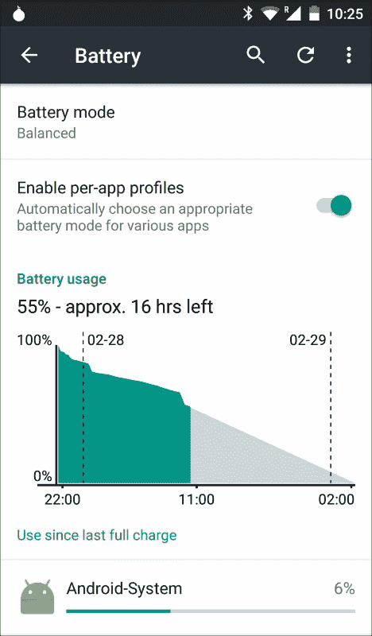
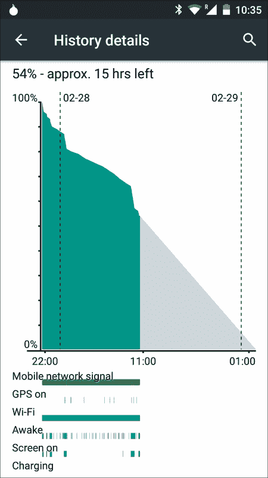
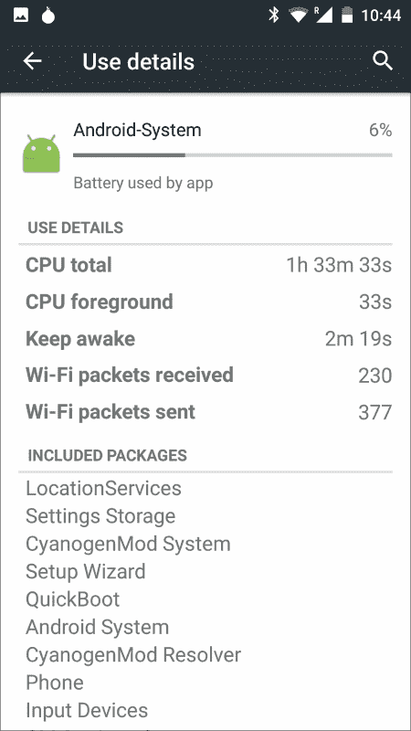
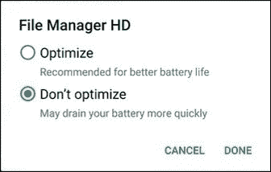

# 八、优化电池消耗

电池消耗和使用是在移动平台中开发高性能应用的关键部分。在台式机中，我们不需要特别在意所使用的能量，因为与能源有永久的联系，而在移动设备中，情况就不同了，我们需要密切关注这一点。

一个电池在移动设备上平均可以使用 36 个小时，这个时间跨度会随着手机的老化而缩短。这是一个特别减少的时间，这使得我们的设备依赖于靠近电源。尽管摩尔定律几乎仍在实现，处理能力/单位成本关系大约每 18 个月翻一番，但电池技术的改进速度每年总是以 5%的数量级前进。超级电容器正在进行一些研究，这是近期最有希望的希望，但我们正在接近电化学的理论极限。不管是哪种方式，电池限制似乎一直存在，学会处理和操作它们似乎是最明智的做法。

电池耗尽是用户不满的一个常见原因，通常会导致对我们在谷歌 Play 商店的应用的负面评价。据说“好事写在沙子上，坏事写在石头上。”如果您的应用程序不断消耗设备资源，它最终将被卸载并导致不良的在线指纹。我们不知道用户是否会通过负责任地使用电池和能源为您留下良好的指纹，但我们知道用户会更高兴，您将通过遵循本章中提供的电池使用说明为更健康的应用生态系统做出贡献。

# 分析

在我们开始寻找问题的解决方案之前，我们需要执行一个分析步骤。在你的安卓设备上点击**设置**，然后点击**电池**。将会打开类似以下的屏幕:



这是一个有用的分析工具，可以确定哪些应用程序对电池的使用不正确或过度。第一部分**电池模式**，包含三种不同的电池使用模式:

*   **电源安全**:这个模式理解你的设备没有迫切需要节约电池使用。因此，它的使用不会减少。
*   **平衡**:一个中级，默认激活。
*   **性能**:这个等级激活你设备中的稀缺模式。电池的续航时间会更短，这是以能源性能为代价的。

下一节“电池使用情况”可以帮助我们确定设备在过去 24 小时内的状态。让我们点击它以显示下一个屏幕:



这个画面已经包含了非常有用的信息。在其中，我们可以看到一个图表，显示了前 24 小时内电池电量的变化，并根据之前的表现对未来几小时进行了预测。更有趣的是图表底部的彩色条:它们以图形方式表示设备的哪些组件在那一刻处于活动状态:移动网络信号、全球定位系统、无线网络、设备是否唤醒、屏幕是否打开以及设备是否正在充电。当我们无法访问源代码时，这对于调试第三方应用程序特别有用，并且可以分析它们是否经常启动我们不需要的组件。

最后一部分显示了设备上安装的应用程序的完整列表。如果我们点击一个具体的应用程序，将显示一个包含详细信息的新屏幕:



该屏幕包括应用程序的所有详细用法，再次为我们提供有用的信息进行分析。应用程序消耗了大量数据吗？是不是让设备长时间保持清醒？正在执行多少个 CPU 计算？基于这些信息，我们可以继续确定行动点。

## 监控电池电量和充电状态

我们的设备执行消耗电池的连续后台操作:网络更新、全球定位系统请求或计算密集型数据操作。根据电池状态，当电池快耗尽时，我们可能希望避免昂贵的操作。检查当前的电池状态总是一个很好的开始。

为了检查电池的当前状态，我们需要捕获`BatteryManager`类定期发送的`Intent`:

```java
IntentFilter ifilter = new IntentFilter(Intent.ACTION_BATTERY_CHANGED);
Intent intentBatteryStatus = context.registerReceiver(null, ifilter);
```

检索到该意图后，我们可以查询设备是否正在充电:

```java
int status = intentBatteryStatus.getIntExtra(BatteryManager.EXTRA_STATUS, -1);
boolean isCharging = status == BatteryManager.BATTERY_STATUS_CHARGING ||
                     status == BatteryManager.BATTERY_STATUS_FULL;
```

如果设备正在充电，也可以确定充电是通过 USB 还是通过交流充电器进行的:

```java
int chargePlug = batteryStatus.getIntExtra(BatteryManager.EXTRA_PLUGGED, -1);
boolean isUSBCharging = chargePlug == BatteryManager.BATTERY_PLUGGED_USB;
boolean isACCharging = chargePlug == BatteryManager.BATTERY_PLUGGED_AC;
```

根据的经验:如果设备正在充电，我们应该最大化所有要执行的操作，因为它不会对用户体验产生显著的负面影响。如果设备电池电量低且没有充电，我们应该考虑停用计算成本高的操作。

## 如何识别充电状态的变化

我们已经看到如何分析当前的充电状态，但是如何应对变化？上述类别`BatteryManager`在每次设备插入或拔出充电电源时都在广播。为了识别它，我们需要在我们的货单中注册一个`BroadcastReceiver`:

```java
<receiver android:name=".PowerConnectionBroadcastReceiver">
  <intent-filter>
    <action android:name="android.intent.action. ACTION_POWER_CONNECTED"/>
    <action android:name="android.intent.action. ACTION_POWER_DISCONNECTED"/>
  </intent-filter>
</receiver>
```

使用我们之前创建的方法，现在可以轻松识别充电状态的任何变化并做出反应:

```java
public class PowerConnectionReceiver extends BroadcastReceiver {
    @Override
    public void onReceive(Context context, Intent intent) {
        int status = intentBatteryStatus.getIntExtra (BatteryManager.EXTRA_STATUS, -1);
        boolean isCharging = status == BatteryManager.BATTERY_STATUS_CHARGING ||
                     status == BatteryManager.BATTERY_STATUS_FULL;

        int chargePlug = batteryStatus.getIntExtra (BatteryManager.EXTRA_PLUGGED, -1);
          boolean isUSBCharging = chargePlug == BatteryManager.BATTERY_PLUGGED_USB;
          boolean isACCharging = chargePlug == BatteryManager.BATTERY_PLUGGED_AC;
    }
}
```

## 确定电池电量的变化并做出反应

类似于先前对充电状态的确定，在特定时刻访问设备的电池电量将有助于确定对我们的设备采取的措施。

访问我们之前收集的元素`intentBatteryStatus`，我们可以通过以下几行查询我们的电池电量:

```java
int level = intentBatteryStatus.getIntExtra(BatteryManager.EXTRA_LEVEL, -1);
int scale = intentBatteryStatus.getIntExtra(BatteryManager.EXTRA_SCALE, -1);

float batteryPercentage = level / (float)scale;
```

变量`batteryPercentage`包含设备上剩余的电池百分比，尽可能精确。请注意，与真实值的偏差总是很小。

与前面的情况类似，我们可以在设备电池耗尽时通知应用程序。为此，我们需要在我们的安卓清单中注册以下`BroadcastReceiver`:

```java
<receiver android:name=".BatteryLevelBroadcastReceiver">
<intent-filter>
  <action android:name="android.intent.action.ACTION_BATTERY_LOW"/>
  <action android:name="android.intent.action.ACTION_BATTERY_OKAY"/>
  </intent-filter>
</receiver>
```

该`BroadcastReceiver`将在设备每次进入低电量模式(或因为正在充电而退出)时触发。

当电池很关键时，读者可以采取特定的策略。一般来说，这本书的作者建议在电池很关键的时候停止不必要的操作。

# 打盹功能和应用待机

安卓 6.0 棉花糖(API Version 23)首次引入了两个非常棒的功能来节省我们设备上的电池电量:瞌睡和应用待机。第一种方法在设备长时间未使用时减少电池消耗，最后一种方法在特定应用长时间未使用时对网络请求也有同样的效果。

## 理解打瞌睡

在应用编程接口大于 23 级的设备中，默认激活打盹模式。当设备被拔掉插头并且一段时间没有活动时，它将进入打盹模式。进入瞌睡模式对您的设备有一些重大影响:

*   除了接收到来自 **谷歌云消息** ( **GCM** 的高优先级消息外，您的设备不会进行任何网络操作
*   唤醒锁定将被忽略
*   等级为`AlarmManager`的报警时间表将被忽略
*   您的应用程序不会执行无线扫描
*   不允许运行同步适配器或作业调度程序

读完第一点后，你可能会想“那么没有什么能阻止我持续使用 GCM 消息，如果其他人都遵循这种模式，那么就能实现高优先级的应用程序？”坏消息是:谷歌已经想到了这一点。Dianne Hackborne 已经在她的官方 Google Plus 个人资料中表示，所有高优先级的消息都是通过 Google GCM 服务器发送的，它们可能会受到监控。如果谷歌意识到一个特定的平台正在滥用该系统，GCM 高优先级消息可能会被阻止，而不需要修改设备上的任何软件。我们的建议是:如果您正在实现一个具有高优先级 GCM 消息的系统，请按照谷歌的建议保留该功能；仅 ping 并通知重要的相关信息。

对于某个应用程序，可以停用打盹模式。为此，您需要转到**设置**菜单、**电池**，然后转到屏幕右上角的**电池优化**。选择是否要优化应用程序:



我们之前提到过，在打盹模式下不会触发警报。为了帮助我们调整应用程序，安卓 6.0 为我们提供了一些额外的功能:功能`setAndAllowWhileIdle()`和`setExactAndAllowWhileIdle()`。通过这些方法，我们可以决定是否在打盹模式下也必须触发特定的警报。但是，我们鼓励您很少使用这些方法，主要用于调试目的。Doze 试图建立一个低电池消耗的模式，它应该是我们遵循它的主要指南。也请注意，即使使用这种方法和警报，它也不能每 15 分钟触发一次以上。

# 避免无用的网络请求

开发者勉强查看现实世界中的网络状态。我们执行的许多警报、广播和重复性任务都需要处理互联网连接。但是如果没有活跃的互联网连接，执行所有这些操作的目的是什么？在互联网连接恢复正常之前，忽略所有这些操作会更有效。

使用以下代码片段可以轻松确定当前的互联网连接:

```java
ConnectivityManager connectivityManager =
        (ConnectivityManager)context.getSystemService (Context.CONNECTIVITY_SERVICE);

NetworkInfo activeNetwork = connectivityManager.getActiveNetworkInfo();
boolean isConnected = activeNetwork != null &&
                      activeNetwork.isConnectedOrConnecting();
```

在执行任何请求之前，我们应该让我们的应用程序检查互联网连接是否活跃。这不仅是一个有助于低电池消耗应用程序的措施，而且也有助于我们的应用程序的良好架构和错误处理:更容易防止执行 HTTP 请求，而不是触发它，以及处理由于缺乏活动的互联网连接而导致的超时或任何异常。当设备出现这种情况时，默认情况下应停用任何网络请求。

另一个有用的技术是避免在互联网连接不使用无线网络时下载大数据块。下面的代码片段将让我们知道当前的连接类型:

```java
boolean isWiFi = activeNetwork.getType() == ConnectivityManager.TYPE_WIFI;
```

我们通常可以假设无线网络总是比 3G/4G 连接更快。这不是一个绝对的真理，我们可以发现相反的情况是真实的。但根据经验，它在大多数情况下都会起作用。此外，大多数国家的大多数网络运营商确实将他们的网络连接限制在每月一定数量的数据，如果超过这个限制，就会产生额外的费用或降低速度。如果昂贵的网络操作只在无线网络下进行，你将会非常安全。

此外，可以轻松检查当前的无线网络速度，以确定速度是否足以执行大数据块的下载:

```java
WifiInfo wifiInfo = wifiManager.getConnectionInfo();
int speedMbps = wifiInfo.getLinkSpeed();
```

不幸的是，没有直接的方法来检查安卓原生提供的 3G/4G 速度。从互联网上下载一些数据，然后建立时间和下载数据量之间的关系，可以给你一个近似值。然而，这是一种间接的方法，也需要使用一些带宽。

与我们在本章前面部分的解释类似，如果我们的设备连接突然发生变化，我们也可以通过注册`BroadcastReceiver`来通知我们的应用程序。接收器看起来如下:

```java
  <receiver android:name=".NetworkChangeReceiver" >
            <intent-filter>
                <action android:name="android.net.conn. CONNECTIVITY_CHANGE" />
</intent-filter>
        </receiver>
```

我们的客户`BroadcastReceiver`将按如下方式操作:

```java
public class NetworkChangeReceiver extends BroadcastReceiver {

    @Override
    public void onReceive(final Context context, final Intent intent) {
        final ConnectivityManager connectionManager = (ConnectivityManager) context
                .getSystemService(Context.CONNECTIVITY_SERVICE);

        final NetworkInfo wifi = connectionManager
                .getNetworkInfo(ConnectivityManager.TYPE_WIFI);

        final NetworkInfo mobile = connectionManager
                .getNetworkInfo(ConnectivityManager.TYPE_MOBILE);

        if (wifi.isAvailable() || mobile.isAvailable()) {
            //perform operation

        }
    }
}
```

# 按需处理广播接收器

使用广播接收器的一个副作用是，每当其中一个事件实际发生时，设备就会醒来。这意味着，如果我们考虑长远，少量的能量是不可轻视的。

我们可以在这里使用一种辅助技术来提高应用程序的效率:根据手机的当前状态，按需激活或停用广播接收器。这意味着:例如，如果互联网连接丢失，我们可能只想等到互联网连接激活，然后关闭其他广播接收器，因为它们将不再有用。

以下代码片段显示了如何以编程方式激活或停用已经在`PackageManager`类中定义的组件:

```java
ComponentName myReceiver = new ComponentName(context, Receiver.class);

PackageManager packageManager = getPackageManager();

packageManager.setComponentEnabledSetting(myReceiver,
        PackageManager.COMPONENT_ENABLED_STATE_ENABLED,
        PackageManager.DONT_KILL_APP)
```

# 联网

在[第 2 章](02.html "Chapter 2. Efficient Debugging")、*高效调试*中，介绍了网络工具，我们可以使用该工具对来自我们设备的网络流量进行分析。我们解释了如何标记网络连接。这确保了分析可以很容易地完成。

如何在网络工具中执行数据解释的问题没有单一的答案，因为这种解释取决于应用程序基于其功能和目的的不同需求。然而，有几条黄金法则，如果执行得当，通常会给我们自己的应用程序带来价值:

*   **预取数据**:我们倾向于倾向于预取信息，并且只在需要时才这样做。这可能是一个更简单的解决方案，但从长远来看，预取信息可能是有益的。执行网络分析，如果您发现在以前的情况下可以获取数据，同时对应用程序有益(例如，在无线网络上下载一些与用户相关的信息，或者当应用程序空闲时)，请尝试一下。这也会对用户体验产生影响，因为信息加载速度会更快，而不会影响用户体验。
*   **减少连接次数**:与其执行多次连接下载小数据，一般来说执行单次连接下载大块数据更为优化。正在建立的每个连接都需要支付额外的流量，在池中处理不同的连接会成倍增加应用程序的复杂性。这并不是每次都可以执行的，尤其是当您无法访问应用程序正在使用的 web 服务时。但如果有机会，值得一试，前后进行网络测试。
*   **Batch and schedule**: as mentioned, processing individual requests will drain your battery faster. Instead, and using as few connections as possible, you could make use of one of the batching/scheduling APIs available for Android. These APIs create a schedule with your available requests and perform them all at once, saving precious time and energy.

    ### 注

    有三个可用的应用编程接口可以进行批处理和调度，形式上是:GCM 网络管理器、作业调度器和同步适配器。有几个需求，每个需求的实现都很复杂。然而，谷歌和本书的作者主张使用前两个而不是同步适配器。Sync Adapter 从安卓 2.0 开始就有了，它的实现属于不同的时代；此外，实现起来也很复杂。

*   **使用 GCM** :这是一个众所周知的道理，但并不经常发生:一定要为你的应用程序使用 GCM 这样的推送系统，而不是轮询系统。从服务器提取数据是一种完美的电池消耗方式，对您的应用程序没有任何好处。实现推送解决方案而不是提取数据的复杂性将立即得到回报。
*   **使用一种缓存机制**:安卓系统中有几种机制和库来缓存 HTTP 请求。Spice 提供了一个好的、全面的库，本书作者可以明确推荐。然而，新的图书馆和方法每年都有起伏。关注最新的信息缓存机制，尽可能地应用它们。
*   **压缩信息**:信息发送前可以进行压缩，节省了重要的带宽和能量。对象`HttpUrlConnection`，从安卓姜饼开始，自动给与`HttpUrlConnection`对象一起发送的 JSONs 添加压缩。请始终记住，压缩客户端上的信息，将其发送到服务器，然后在那里解压缩以处理它，通常会比简单地发送信息(没有任何压缩)更有效。

# 总结

电池性能是一个令人兴奋的领域，可以为我们的应用提供许多改进。它被广泛地使用不足，甚至最有经验的开发人员也不把它放在眼里。本书的作者非常鼓励任何开发人员尽可能多地采取本书中描述的行动，并不断检查应用程序在性能和用户体验方面的改进。我们不能经常大声地说:这是有回报的。

谷歌承诺将全力以赴为开发者提供更好的电池和能源体验以及扩展的应用编程接口。如果即将到来的安卓版本开始提供新技术来延长电池寿命和提高能耗，这并不令人惊讶。我们建议读者关注未来的安卓版本(在撰写本文时，2016 年第一季度，安卓 N 还没有固定的发布日期)。

读完这一章，读者应该会对安卓开发中的主要电池和能源漏洞感到舒服。如果这里提供的任何建议正在被应用，我们建议跟踪改进随时间的演变。对于其他开发人员来说，这最终可以作为一个很好的令人信服的理由，说明为什么这些措施很重要。