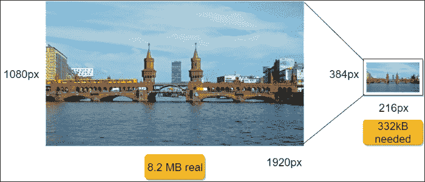
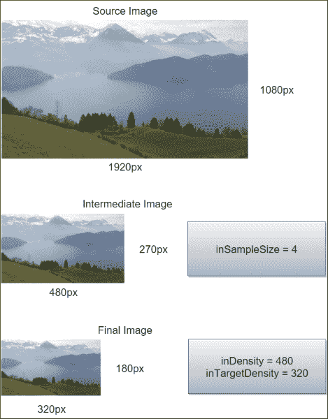
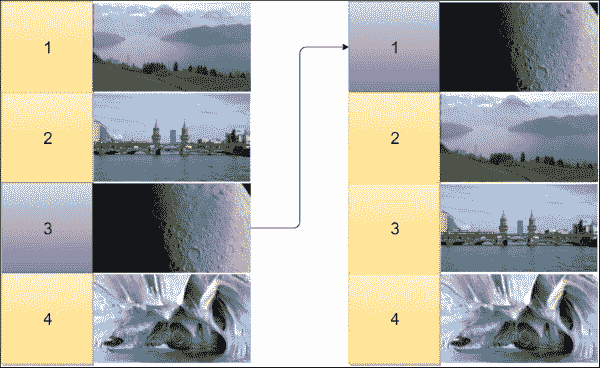
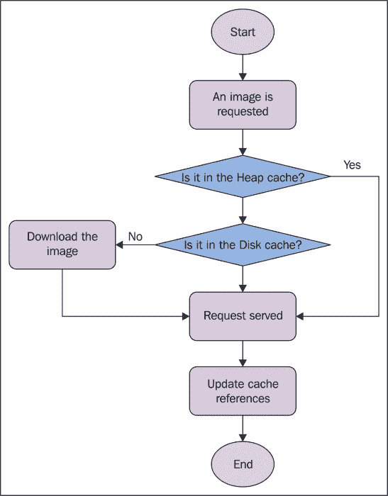
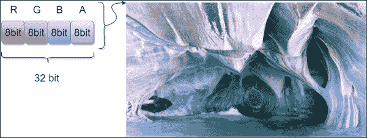
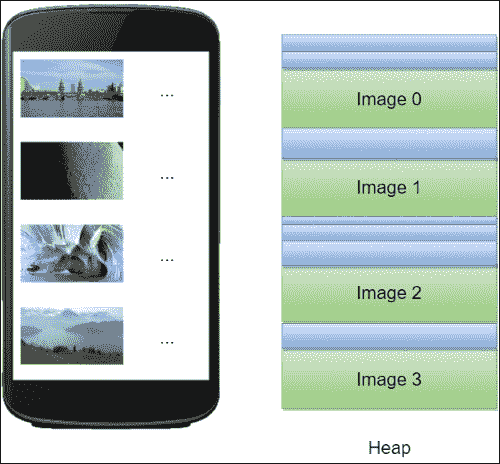
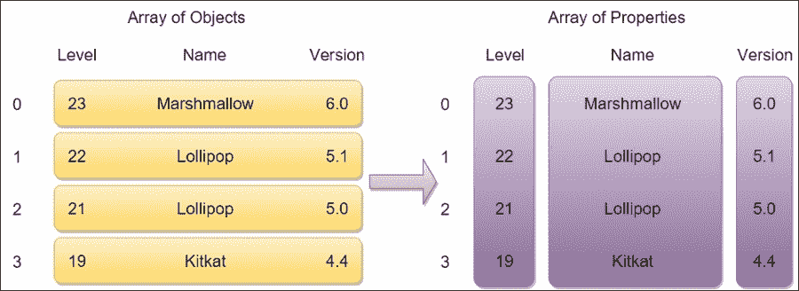
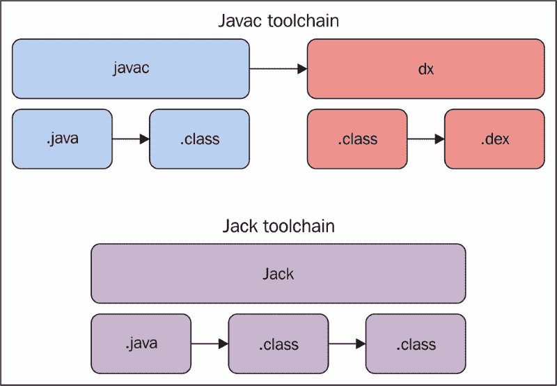

# 第十章。性能提示

这一章是关于在前几章中没有涉及的主题的技巧和提示。

因此，我们想在这里定义图像处理的最佳实践:图像在商店的许多应用程序中被广泛使用。为此，我们想知道如何在安卓应用程序中管理图像，以提高整体性能。对于这个主题，需要前面几章中的概念。

除了位图管理之外，我们将研究大量使用但性能不高的序列化格式(如 XML 和 JSON)的替代方案，以便找到更好的方法来加快客户端/服务器通信，并限制编码/解码时间和资源消耗。

最后，本章的最后一部分将讨论在构建过程之前改进应用程序的几项措施。其中包括减少资源以及如何清理 APK，以便在商店中分发更小的 APK 文件，从而符合商店的限制和用户的期望。

# 位图

我们的应用程序面临的最大挑战之一是以高效的方式处理图像，因为有许多不同的视角会影响最终的应用程序。这是一个特殊的主题，几乎涵盖了我们在前面章节中讨论的所有内容:

*   位图需要在布局中才能正确显示。因此，我们在[第二章](02.html "Chapter 2. Efficient Debugging")、*高效调试*中讨论的内容在这里尤为重要。
*   糟糕的位图处理可能会导致内存问题，这是因为位图被错误地用作变量，而不是在需要时被读取。因此，[第 4 章](04.html "Chapter 4. Memory")、*记忆*在保存和阅读大图片时，有助于记住关键概念。
*   很多时候，我们试图在主线程上处理来自图像的大量数据；我们将使用[第 5 章](05.html "Chapter 5. Multithreading")、*多线程*中讨论的主题，来了解如何在不影响用户体验的情况下高效处理位图。
*   大多数情况下，图像来自远程资源。我们将讨论如何从服务器检索图像，以及如何缓存它们以备将来重复使用，从而限制网络请求并节省电池，如[第 6 章](06.html "Chapter 6. Networking")、*网络*所述。

位图在很多应用中都有处理。我们将更详细地讨论这个问题的各个方面，试图通过使用前面提到的章节中介绍的最佳实践来定义如何处理它们。

## 装载

一个显示的图像是整体读取的，无论屏幕分辨率是多少或者是隐藏还是不可见；它的重量是它记忆中最大的。正如我们接下来将看到的，默认情况下，图像的每个像素都会占用 32 位内存。因此，将图像的分辨率乘以 32，我们可以得到图像在内存中使用的位数。当然，这种方法的主要问题是，由于应用程序可用的内存饱和，导致`OutOfMemoryException`的概率很高。

通常，我们按原样使用图像，而不考虑可能出现的性能问题。但是，例如，如果我们在一个 **384x216** 像素占位符中显示 **1920x1080** 像素，我们将向内存中添加 8.2 MB，而 332 KB 就足够了。参见*图 1* 了解未缩放图像与所需图像相比的开销:



图 1:较小占位符中未缩放图像的开销示例

如果我们处理列表或图库或其他一次显示更多图像的小部件，情况会变得更糟。此外，安卓在屏幕分辨率和内存可用性方面存在高度碎片化。因此，没有办法回避这个问题:位图需要在读取时进行预缩放。那么，我们如何有效地预缩放它们呢？让我们在下面的段落中找到答案。

位图类就没那么有帮助了；`Bitmap.createScaledBitmap()`方法需要一个`Bitmap`对象作为输入进行缩放。因此，它会迫使我们在创建新的小图像之前阅读整个图像，这显然会给整个源图像带来不必要的大内存分配问题。但是，有一种方法可以在读取图像时减轻图像的内存重量。这是`BitmapFactory`原料药的目的。一旦我们知道要缩放的图像的合适分辨率，我们就可以使用`BitmapFactory.Options`类来设置正确的参数，并从内存的角度有效地缩放图像。让我们看看我们可以用来达到正确结果的参数。`BitmapFactory`类根据来源提供不同的方法来加载图像:

*   `decodeByteArray()`
*   `decodeFile()`
*   `decodeFileDescriptor()`
*   `decodeResource()`
*   `decodeStream()`

每一个都重载了相应的方法，除了需要的对象之外，还接受一个`BitmapFactory.Options`对象。这样，我们可以使用这个类来定义图像读取时的缩放策略。如果我们正在处理非常大的图像，我们可以使用一个特殊的应用编程接口来解码图像的一小部分:这是`BitmapRegionDecoder`。`BitmapRegionDecoder.decodeRegion()`方法接受一个`Rect`和一个`BitmapFactory.Options`对象作为参数来解码在`BitmapRegionDecoder.newInstance()`方法中传递的图像的`Rect`区域。

首先，我们需要知道图像的分辨率。为了找出答案，我们希望在不读取整个源位图的情况下获得图像尺寸。这将导致不必要地增加内存分配。该应用编程接口提供了一种通过设置名为`BitmapFactory.Options.inJustDecodeBounds`的`BitmapFactory.Options`对象的特定属性来获取源图像大小的方法。设置`BitmapFactory.Options.inJustDecodeBounds`属性来定义解码方法是否应该返回`Bitmap`对象。因此，我们可以将其设置为`true`以在读取图像分辨率时禁用位图处理，然后将其设置回`false`以启用图像的完整读取并获得所需的图像。这确保了没有不必要的位图内存分配。

当我们知道我们想要什么分辨率的图像时，我们需要在处理之前将新的设置应用到选项中。为此，`BitmapFactory.Options.inSampleSize`是我们需要用到的。它是一个整数，指定要将图像的每个维度分开多少次才能达到要求的大小。它也被迫是二的幂。因此，如果我们设置了一个不同的值，它将在处理步骤之前缩小到最接近的 2 的幂。然后，如果我们将`BitmapFactory.Options.inSampleSize`设置为`4`，最终的宽度和高度将是原来的 1/4。因此，生成的图像将由源位图中 1/16 的像素组成。

让我们看看，在下面的代码片段中，如何应用这些有用的属性:

```java
public Bitmap scale(){
  //Options creation
  BitmapFactory.Options bmpFactoryOptions = new BitmapFactory.Options();

  //Reading source resolution
  bmpFactoryOptions.inJustDecodeBounds = true;
  BitmapFactory.decodeFile(url, bmpFactoryOptions);

  int heightRatio = (int) Math.ceil(bmpFactoryOptions.outHeight / (float) desiredHeight);
  int widthRatio = (int) Math.ceil(bmpFactoryOptions.outWidth / (float) desiredWidth);

  //Setting properties to obtain the desired result
  if (heightRatio > 1 || widthRatio > 1) {
      if (heightRatio > widthRatio) {
          bmpFactoryOptions.inSampleSize = heightRatio;
      } else {
          bmpFactoryOptions.inSampleSize = widthRatio;
      }
}

//Restoring the Options
bmpFactoryOptions.inJustDecodeBounds = false;

//Loading Bitmap
return BitmapFactory.decodeFile(url, bmpFactoryOptions);
}
```

为什么采样性质对 2 的幂有这么强的限制？因为这样，处理后的图像将由例如源中四个像素中的一个组成。此外，这完成得相当快。优点是计算速度快，缺点是我们无法将图像精确地缩放到所需的大小。

使用不同的方法缩放图像还有其他属性。代替`BitmapFactory.Options.inJustDecodeBounds`属性，我们可以使用以下内容:

*   `inScaled`:这使得密度检查能够基于该列表中的其他值缩放图像。
*   `inDensity`:这是位图使用的密度。如果与下面的`inTargetSize`不同，那么图像将被处理成比例并到达`inTargetDensity`。
*   `inTargetDensity`:如果与`inDensity`属性不同，这是生成图像所需的密度。

标度比率将使用公式*标度=目标密度/密度*来计算。

然后，我们可以使用图像像素中实际尺寸和期望尺寸之间的比率来计算比例值。因此，前面的代码片段如下:

```java
public Bitmap scale(){
  //Options creation
  BitmapFactory.Options bmpFactoryOptions = new BitmapFactory.Options();

  //Reading source resolution
  bmpFactoryOptions.inJustDecodeBounds = true;
  BitmapFactory.decodeFile(url, bmpFactoryOptions);

  //Setting properties to obtain the desired result
  bmpFactoryOptions.inScaled = true;
  bmpFactoryOptions.inDensity = desiredWidth;
  bmpFactoryOptions.inTargetDensity =  bmpFactoryOptions.outWidth;

  //Restoring the Options
  bmpFactoryOptions.inJustDecodeBounds = false;

  //Loading Bitmap
  return BitmapFactory.decodeFile(url, bmpFactoryOptions);
}
```

这是使用不同的计算方法将图像缩放到特定的大小。就速度而言，精度是有代价的。因此，该解决方案将前一个解决方案的速度与创建具有所需分辨率的图像的精度进行了交换。因此，正如谷歌所建议的，最好的结果是通过混合使用前面的两种解决方案来实现的。第一步是确定最精确的 2 的幂，用作`BitmapFactory.Options.inSampleSize`以在需要时加速总缩放。然后，图像从该中间图像转换成精确的期望缩放图像。如果我们的源图像是 **1920x1080** 像素，而我们需要最后一个是 **320x180** 像素，就会有一个中间图像，例如 **480x270** 像素，如图*图 2* :



图 2:缩放步骤

已经讨论过的内容可以用前面介绍的所有属性来实现，如下面的代码示例所示:

```java
public Bitmap scale(){
  //Options creation
  BitmapFactory.Options bmpFactoryOption = new BitmapFactory.Options();

  //Reading source resolution
  bmpFactoryOption.inJustDecodeBounds = true;
  BitmapFactory.decodeFile(url, bmpFactoryOption);

  int heightRatio = (int) Math.ceil(bmpFactoryOption.outHeight / (float) desiredHeight);
  int widthRatio = (int) Math.ceil(bmpFactoryOption.outWidth / (float) desiredWidth);

  //Setting properties to obtain the desired result
  if (heightRatio > 1 || widthRatio > 1) {
      if (heightRatio > widthRatio) {
          bmpFactoryOption.inSampleSize = heightRatio;
      } else {
          bmpFactoryOption.inSampleSize = widthRatio;
      }
  }
  bmpFactoryOption.inScaled = true;
  bmpFactoryOption.inDensity = desiredWidth;
  bmpFactoryOption.inTargetDensity =  desiredWidth * bmpFactoryOption.inSampleSize;

  //Restoring the Options
  bmpFactoryOption.inJustDecodeBounds = false;

  //Loading Bitmap
  return BitmapFactory.decodeFile(url, bmpFactoryOption);
}
```

这个解结合了第一个解的速度和第二个解的精度。

## 加工

上一节描述的操作从时序角度来看是不可预测的，但它们肯定会影响到 CPU。无论图像大小如何，或者操作是否快速，都没有关系。所有操作都必须在工作线程中执行，如第 5 章、*多线程*中所述，以免因缺乏响应而阻塞用户界面并降低感知的应用程序性能。

缩放要完成的主要操作是将位图设置为`ImageView`以创建布局。因此，我们需要一个引用视图的`AsyncTask`子类。我们在[第 4 章](04.html "Chapter 4. Memory")、*内存*中讨论了对象的这种组合，我们发现这导致了活动泄漏。因此，记得在`Activity`被摧毁后，用`WeakReference`来持有`ImageView`以待领取。然后，不要忘记验证`ImageView`在`WeakReference`中是否还有引用，否则会出现`NullPoionterException`。

这样的一个`AsyncTask`子类可以像下面的代码片段一样:

```java
public class BitmapTask extends AsyncTask<String, Void, Bitmap> {
    private WeakReference<ImageView> imageView;
    private int desiredWidth;
    private int desiredHeight;

    public BitmapTask(ImageView imageView, int desiredWidth, int desiredHeight) {
        this.imageView = new WeakReference<>(imageView);
        this.desiredHeight = desiredHeight;
        this.desiredWidth = desiredWidth;
    }

    @Override
    protected Bitmap doInBackground(String... params) {
        return new BitmapScaler().scaleUsingCombinedTechniques(params[0], desiredWidth, desiredHeight);
    }

    @Override
    protected void onPostExecute(Bitmap bitmap) {
        super.onPostExecute(bitmap);
        if (imageView != null && imageView.get() != null && bitmap != null)
            imageView.get().setImageBitmap(bitmap);
    }
}
```

## 缓存

让我们谈谈这些位图在哪里，以及如何在本地处理它们。大多数情况下，位图存储在远程资源中，这迫使我们在屏幕上显示它们之前创建相应的代码来下载它们。然而，我们不希望再次下载它们，因为它们需要在屏幕上显示很多次。因此，我们需要一种简单快捷的方法来存储图像，并根据请求提供图像。

然而，我们必须小心，以确保在某个时候图像被删除。否则，设备的内部存储器将饱和，因为应用程序中的图像可能不受限制。因此，我们需要有限的空间来存储图像。这个空间叫做 **缓存**。

接下来的问题是:哪个算法去除图像才是正确的？安卓使用的主要算法是 LRU 算法。这使用一堆对象来识别哪些对象具有更高的优先级，将它们放在顶部，将优先级较低的对象放在底部。然后，当一个对象被使用时，它被上移以获得更高的优先级，而所有其他对象被下移。因此，在这种情况下，优先级是对单个对象的请求数量；然后，堆栈将对对象进行排序，从顶部使用最多的到底部使用最少的，如图 3 所示，其中位置 3 的图像被再次使用，并移动到堆栈的顶部:



图 3:LRU 堆栈示例

通过这种推理，当一个新的对象需要被添加到一个完整的堆栈中时，选择非常简单:它将代替最少使用的对象，因为它再次被请求的机会最小。

所有这些逻辑都是由安卓在`LRUCache`对象中实现和提供的。此实现在内存中工作，而不是在磁盘上，以提供更快、更可靠的缓存供查询。这意味着堆栈底部的任何对象，当因为新的添加而被逐出时，都有资格进行垃圾收集。此外，这个类允许定义要使用的键和值类型，因为它使用泛型。正因为如此，它可以用于我们需要的各种对象，而不仅仅是位图。`LRUCache`对象甚至是线程安全的。

选择键和值类型后要做的事情是定义缓存的大小。这是没有规则的，但是请记住，太小的缓存会导致堆栈内部有太多的变化，使得缓存的使用变得无关紧要，而太大的缓存会导致我们的应用程序在使用过程中出现`OutOfMemoryErrors`。在这种情况下，正确的做法是向缓存提供应用程序的一部分可用内存。在下面的代码中，`LRUCache`对象是使用字符串作为键创建的，可用内存除以 8:

```java
public class BitmapCache {
    private LruCache<String, Bitmap> lruCache;

    public BitmapCache() {
        final int maxMemory = (int) (Runtime.getRuntime().maxMemory() / 1024);
        final int cacheSize = maxMemory / 8;
        lruCache = new LruCache<String, Bitmap>(cacheSize);
    }

    public void add(String key, Bitmap bitmap) {
        if (get(key) == null) {
            lruCache.put(key, bitmap);
        }
    }

    public Bitmap get(String key) {
        return lruCache.get(key);
    }
}
```

然后我们需要定义缓存中单个条目的大小。这可以通过覆盖`LRUCache.sizeOf()`方法并在实例化过程中以下列方式返回位图的正确字节数来实现:

```java
lruCache = new LruCache<String, Bitmap>(cacheSize){
    @Override
    protected int sizeOf(String key, Bitmap value) {
        return value.getByteCount();
    }
};
```

最后，当需要在`ImageView`中显示图像时，我们可以使用这个缓存对象，如下面的代码所述:

```java
public void loadBitmap(int resId, final ImageView imageView, String url) {
    String imageKey = String.valueOf(resId);
    Bitmap bitmap = bitmapCache.get(imageKey);
    if (bitmap != null) {
        imageView.setImageBitmap(bitmap);
    } else {
        imageView.setImageResource(R.drawable.placeholder);
        BitmapDownloaderTask task = new BitmapDownloaderTask(bitmapCache, new BitmapDownloaderTask.OnImageReady() {
            @Override
            public void onImageReady(Bitmap bitmap) {
                imageView.setImageBitmap(bitmap);
            }
        });
        task.execute(url);
    }
}
```

正如之前提到的，这种缓存驻留在堆内存中；当用户更改活动然后回来时，必须下载、缩放每个项目，并再次将其添加到缓存中。然后，我们需要一种可以在多次访问尝试中保持并重新启动的缓存类型。要做到这一点，在官方存储库中有一个来自官方安卓样本的有用类，叫做`DiskLRUCache`。这不是线程安全的，所以我们在访问它时需要一个锁。此外，它的初始化可能是一个长时间运行的初始化，为了不阻塞主线程，我们必须在工作线程中执行它。让我们使用一个`AsyncTask`类来实现，如下面的代码所示:

```java
class InitDiskCacheTask extends AsyncTask<File, Void, Void> {
    @Override
    protected Void doInBackground(File... params) {
        synchronized (mDiskCacheLock) {
            File cacheDir = params[0];
            mDiskLruCache = DiskLruCache.open(cacheDir, DISK_CACHE_SIZE);
            mDiskCacheStarting = false;
            mDiskCacheLock.notifyAll();
        }
        return null;
    }
}
```

通过添加这个类，我们可以使用两级缓存:

*   **堆级缓存**:更快但不是持久的缓存，如前所述。它的目的是在需要图像时首先被检查。
*   **磁盘级缓存**:较慢但持久的缓存，如果另一个缓存不包含请求的映像，则第二次检查。

因此，图像请求背后的逻辑应该类似于*图 4* 所示:



图 4:使用两个缓存级别的图像请求的流程图

当我们想要将一个图像放入缓存中时，我们需要将它添加到这两个缓存中，如下面的代码片段所示:

```java
public void addBitmapToCache(String key, Bitmap bitmap) throws IOException {
    if (bitmapCache.get(key) == null) {
        bitmapCache.add(key, bitmap);
    }
    synchronized (mDiskCacheLock) {
        if (mDiskLruCache != null && mDiskLruCache.get(key) == null) {
            mDiskLruCache.put(key, bitmap);
        }
    }
}
```

## 显示

如前所述，当一个图像显示在屏幕上时，它是由一个 32 位像素来描述的，图像的每种颜色有 8 位，如图*图 5* :



图 5:位图像素压缩

不幸的是，没有办法使用 24 位而不忽略透明部分；相反，当图像不包含像素的 alpha 字节时，安卓无论如何都会添加它，将 24 位图像转换为 32 位图像。显然，这在应用程序的日常使用中有许多副作用。

首先，在堆中存储位图所需的内存量更大，导致更多的垃圾收集事件，因为分配更大的连续内存部分比分配更小的内存部分更困难。此外，分配和收集如此大的内存块需要更长的时间。此外，分配的内存没有压缩。解码和显示它们的时间会更长，对 CPU 和 GPU 都有影响。对此有什么解决办法？

安卓提供了四种不同的像素格式，用于处理图像。这意味着图像的每个像素可以用更少的比特来描述，因此在内存、垃圾收集、中央处理器和图形处理器方面可以更轻。这是有代价的:质量不会一样。因此，应该通过设计来使用它，因为它不能适用于我们应用程序中的每个图像。然而，我们可以想出一个更聪明的方法；例如，我们可以根据设备的能力选择不同的像素格式。

### 类型

如果您正在处理处理图像的应用程序，根据需求检查是否有可能使用不同的像素格式来减少大内存块(位图)的影响，并从不同的角度(内存、速度和电池充电持续时间)提高性能，这一点非常重要。

安卓平台目前对`Bitmap`对象处理的像素格式如下:

*   `ARGB_8888`:这是默认的讨论值，像素使用 32 位，因为所有通道都使用 8 位。
*   `ARGB_4444`:这保持了四个通道，和前一个一样，但是对于 16 位像素，每个通道只使用 4 位。虽然它节省了一半的图像内存，但它在屏幕上的糟糕质量导致谷歌贬低了这个值，推荐默认的，尽管它在内存管理方面有优势。
*   `RGB_565`:这个特殊的值只保留颜色通道，去掉阿尔法通道。红色和蓝色通道用 5 位描述，绿色通道用 6 位描述。每个像素使用 16 位，与之前的格式一样，但忽略了 alpha 透明度并提高了颜色质量。因此，当处理没有透明度的图像时，这是很好的选择。
*   `ALPHA_8`:这是用来只存储 alpha 透明度信息，没有颜色通道。

然而，我们如何使用它们呢？这也是一个解码选项。`BitmapFactory.Options.inPreferredConfig`用于定义图像即将解码时使用的像素格式。因此，让我们检查以下片段:

```java
public Bitmap decode(String url) {
    //Options creation
    BitmapFactory.Options bmpFactoryOptions = new BitmapFactory.Options();

    bmpFactoryOptions.inPreferredConfig = Bitmap.Config.RGB_565;

    //Loading Bitmap
    return BitmapFactory.decodeFile(url, bmpFactoryOptions);
}
```

这显然是昂贵的，因为它会导致更多的计算时间和 CPU 使用。然而，它的成本低于内存中的整个位图，如果我们意识到重用图像，我们不仅可以节省时间，还可以节省关键的系统资源。因此，让我们看看如何重用图像来进一步提高我们的应用程序的内存使用，如下几页所述。

## 管理内存

到目前为止讨论的从堆和磁盘的角度都与内存管理有关。然而，在处理位图时，我们可以使用更高级别的抽象来改进堆内存管理。在[第 4 章](04.html "Chapter 4. Memory")、*内存*中，我们引入了一种特殊的设计模式，以避免我们所说的内存流失；这就是对象池模式。使用这种模式，当对象不再被引用时，可以重用内存分配来避免垃圾收集。

当大量位图对象即将被处理时，如在列表或网格中，许多新的实例化和删除将被执行，同时会发生许多垃圾收集事件。这降低了应用程序的整体内存性能，因为我们知道，除了这类对象的大内存之外，收集事件还会阻塞任何其他线程。因此，如果我们可以将对象池模式用于位图，我们就可以限制垃圾收集器的操作，而不会损害甚至加快我们之前讨论的缓存技术。

实际上，我们希望重用已经分配的内存来处理要显示的新图像。如*图 6* 所示，如果屏幕上显示四幅图像，用户滚动后，内存分配应保持不变:



图 6:使用对象池进行堆内存管理

为了实现这样一个有用的机制，我们需要引入一个名为`BitmapFactory.Options.inBitmap`的特殊`BitmapFactory.Options`属性。如果我们使用这个属性，我们必须提供一个现有的`Bitmap`对象，让解码器重用它的内存分配。这样就不会破坏之前的对象，也不会创建新的对象，也不需要垃圾回收。

然而，这种有用的特性有其局限性，正如官方文件中所报告的:

*   在安卓果冻豆(API Level 18)之前，提供的对象和新的对象必须具有完全相同的大小。从安卓 KitKat (API Level 19)开始，提供的位图可以比新位图大或相等，但不能小。
*   第一点意味着不同像素格式的图像不应用于这种操作。

记住这一点，让我们快速浏览一下创建这种逻辑的一些代码。首先，让我们创建满足这些要求的控件:

```java
private boolean canBitmapBeReused(
        Bitmap bitmap, BitmapFactory.Options options) {
    if (Build.VERSION.SDK_INT >= Build.VERSION_CODES.KITKAT) {
        int width = options.outWidth / options.inSampleSize;
        int height = options.outHeight / options.inSampleSize;
        int byteCount = width * height * getBytesPerPixel(bitmap.getConfig());
        return byteCount <= bitmap.getAllocationByteCount();
    }
    return bitmap.getWidth() == options.outWidth
            && bitmap.getHeight() == options.outHeight
            && options.inSampleSize == 1;
}

private int getBytesPerPixel(Bitmap.Config config) {
    switch (config) {
        case ARGB_8888:
            return 4;
        case RGB_565:
        case ARGB_4444:
            return 2;
        default:
        case ALPHA_8:
            return 1;
    }
}
```

然后，让我们编写代码来从池中检索可重用的`Bitmap`对象(如果有):

```java
private Bitmap getBitmapFromPool(BitmapFactory.Options options, Set<SoftReference<Bitmap>> bitmapsPool) {
    Bitmap bitmap = null;
    if (bitmapsPool != null && !bitmapsPool.isEmpty()) {
        synchronized (bitmapsPool) {
            final Iterator<SoftReference<Bitmap>> iterator
                    = bitmapsPool.iterator();
            Bitmap item;
            while (iterator.hasNext()) {
                item = iterator.next().get();
                if (null != item && item.isMutable()) {
                    if (canBitmapBeReused(item, options)) {
                        bitmap = item;
                        iterator.remove();
                        break;
                    }
                } else {
                    iterator.remove();
                }
            }
        }
    }
    return bitmap;
}
```

最后，让我们创建一个方法，在解码过程之前添加这些`BitmapFactory.Options`，使用一个可重用的对象，而不是创建一个新的对象:

```java
public Bitmap decodeBitmap(String filename, int reqWidth, int reqHeight) {
    BitmapFactory.Options options = new BitmapFactory.Options();
    addOptions(options);
    return BitmapFactory.decodeFile(filename, options);
}

private void addOptions(BitmapFactory.Options options) {
    options.inMutable = true;
    Bitmap inBitmap = getBitmapFromPool(options);
    if (inBitmap != null) {
        options.inBitmap = inBitmap;
    }
}
```

不要忘记创建一组可重复使用的位图，以便在需要时搜索。因此，让我们将位图池定义为一组`SoftReference`对象来存储我们的图像。我们的`BitmapCache`类应该如下所示:

```java
public class BitmapCache {
    private Set<SoftReference<Bitmap>> bitmapsPool;
    private LruCache<String, Bitmap> lruCache;

    public BitmapCache() {
        final int maxMemory = (int) (Runtime.getRuntime().maxMemory() / 1024);
        final int cacheSize = maxMemory / 8;
        lruCache = new LruCache<String, Bitmap>(cacheSize) {
            @Override
            protected int sizeOf(String key, Bitmap value) {
                return value.getByteCount();
            }

            @Override
            protected void entryRemoved(boolean evicted, String key,
              Bitmap oldValue, Bitmap newValue) {
                bitmapsPool.add(new SoftReference<>(oldValue));
            }
        };
        bitmapsPool = Collections.synchronizedSet(new HashSet<SoftReference<Bitmap>>());
    }

    public void add(String key, Bitmap bitmap) {
        if (get(key) == null) {
            lruCache.put(key, bitmap);
        }
    }

    public Bitmap get(String key) {
        return lruCache.get(key);
    }
}
```

# 图像优化

在本章前面的页中，我们讨论了当图像准备好被加载和显示时如何处理它们。我们现在想讨论他们进入设备的方式以及如何改进这个过程。现在很明显，图像是大内存块，如果我们不注意正确处理它们，它们非但不能改善我们应用程序的用户体验，反而会破坏它。因此，我们可以设计从远程服务器下载图像的最佳框架，但是如果图像太大，或者压缩不够高，我们的应用程序将被认为速度慢且昂贵。下载图像需要时间和带宽。因此，我们的目标是找到合适的方法来尽可能地缩小它们的尺寸，而不影响它们的质量。

### 类型

显示图像的应用程序总是需要良好的设计，以确保下载过程快速。为此，就使用的字节而言，图像必须尽可能小，以便于将它们从远程服务器传输到可能使用不良连接的设备。

正如[第 6 章](06.html "Chapter 6. Networking")、*联网*所分析的，设备访问服务器有很多不同的条件。而且，这是不可预测的。然而，无论哪个连接使用用户的设备，我们都希望为用户提供最佳的用户体验。那么我们能做些什么来减小图像尺寸呢？这主要考虑两个方面:**分辨率**和**压缩**。让我们更详细地讨论它们。

## 分辨率

当我们开发一个显示图像的应用程序时，分辨率方面被低估了。不过，我们先考虑一下:如果我们确定图像最多会以 480x270 像素显示，为什么还要下载更大的图像呢？此外，知道安卓平台受到屏幕分辨率和密度的巨大碎片的困扰，我们为什么要在一个 480x800 像素的设备上下载相同分辨率的图像，而在另一个 1920x1080 像素的设备上下载呢？

最好的方法是提供一个与将要显示的特定设备的占位符具有相同分辨率的图像。那么，如果占位符是 480x270 像素，我们应该下载一个 270 像素或者最多 480 像素的图像大小，或者和占位符一样的分辨率；开销无论如何都会损失。不幸的是，只有当我们能够访问服务器实现时，这种方法才能付诸实践。

如果我们无法更改服务器设置，有大量实时图像处理服务可以做到这一点。我们可以决定在特定的条件或连接中使用它们，或者仅用于特定类型的图像或应用程序的一部分。反正会有好处的。

当具有相同内容的图像应该在我们的应用程序的多个部分中显示时，可能使用不同的分辨率，技巧是下载具有最高分辨率的图像，然后使用前面讨论的技术将其缩小以用于不同的占位符。这样我们就节省了时间、电池电量和带宽。这不是每次都适用的规则；根据应用程序的要求，您应该始终设计最佳方法来减小要传输到设备的图像的大小。

## 压缩

说到压缩，事情变得有趣了:最常用的图像格式是 PNG。这是一种无损压缩，可以得到高质量的图像。不幸的是，它的压缩能力会导致更大的文件，然后糟糕的传输结果和前面讨论的所有其他副作用。

较轻的格式是 JPEG 格式；它使用有损压缩来减小图像大小并获得良好的结果，而用户感知到的差异很小。对于来自远程资源的图像，这是更好的格式选择。不幸的是，它不处理透明度。还有一种更轻的格式，谷歌建议称之为**WebP**；它可以使用损失或无损压缩，有或没有透明度和动画。这种格式分析像素并预测附近的像素，从而减少图像所需的数据量(以位为单位)。这也是从安卓果冻豆(API Level 17)开始完全支持的。

无论如何，如果我们出于任何原因需要使用 PNG 文件，有很多工具可以应用有损图像压缩并大幅减小其大小。这些工具允许我们更改颜色配置文件、应用滤镜和其他有用的操作来减小图像大小。我们有责任为我们的图像找到合适的损失。图形编辑器程序刚导出的图像比需要的大；我们应该总是清理它，搜索其中未使用的数据，然后应用我们需要的任何压缩改进来减少图像传输的开销。

# 系列化

与降低图像尺寸以加快传输速度相关的相同考虑也可以用于文本文件。因此，让我们快速了解一下通过客户机/服务器体系结构传输数据的典型格式。直到几年前，使用最多的还是 XML 格式。然后开发人员将其改为 JSON 格式。两者都是人类可读的，但是由于其语法，JSON 更容易编写。它不需要标签和属性。由于这些原因，JSON 比 XML 更轻，更受欢迎和使用。

## JSON 的改进

谷歌提供了一个易于使用的库来处理 JSON 的序列化和反序列化，称为 GSON。原则上，它使用反射来找到 Java bean 的获取者和设置者；然后，如果所有内容都在 bean 内部的正确位置，则可以通过只提供想要的类来反序列化它，从而创建一个新的对象，其中填充了 JSON 文件内部的所有数据。

为了提高序列化/反序列化性能和传输时间，我们需要改进 JSON 文件设计；我们的目标是减少 JSON 文件的大小。这里最主要也是最明显的提示是避免 JSON 结构中不必要的数据。所以，不要序列化客户端不使用的数据。

使用 JSON 进行数据序列化的典型方法是创建一个要传输的对象数组。但是，JSON 格式需要每个属性都有一个名称，以便在反序列化过程中正确识别。这样，会添加许多重复字符串的字符，导致文件大小的开销。以下 JSON 文件示例显示了具有相关重复键字符的对象列表:

```java
[
{
    "level": 23,
    "name": "Marshmallow",
    "version": "6.0"
}, {
    "level": 22,
    "name": "Lollipop",
    "version": "5.1"
}, {
    "level": 21,
    "name": "Lollipop",
    "version": "5.0"
}, {
    "level": 19,
    "name": "KitKat",
    "version": "4.4"
}
]
```

该文件的内容可以在一个定义属性数组而不是对象数组的较小文件中序列化。*图 7* 展示了的概念和结构的变化在这里的应用:



图 7:从对象数组到应用于 JSON 文件的属性数组的结构变化

应用这种重构，下面的文件将是新的格式，包含与第一个 JSON 文件相同的内容:

```java
{
  "level": [23, 22, 21, 19],
  "name": ["Marshmallow", "Lollipop", "Lollipop", "Kitkat"],
  "version": ["6.0", "5.1", "5.0", "4.4"]
}
```

第一个文件的实际大小约为 250 字节，而第二个文件为 140 字节。但是单个文件中的对象越多，应用于整个 JSON 文件的节省就越多。

## JSON 替代品

但是，无论是 XML 还是 JSON 格式都太贵了；就可读性而言，它们是冗长的，由服务器编码的速度较慢，并且一旦客户端接收到它们，解码速度会比其他较轻的格式慢。通常，出于调试目的，开发人员更喜欢人类可读的格式而不是性能。

事实上，还有其他格式可以让客户端和服务器以更快的方式进行通信。这些都是谷歌做的；让我们对这些进行概述。

### 协议缓冲区

开发的第一个序列化方法叫做**协议缓冲区**。与 XML 类似，它提供了一种定义数据结构的方法，但它更快、更小。它使用扩展名为`.proto`的文件来设置以后创建和传输的不可读二进制文件的语法。它类似于以下内容:

```java
message Person {
    required string name = 1;
    required int32 id = 2;
    optional string email = 3;

    enum PhoneType {
        MOBILE = 0;
        HOME = 1;
        WORK = 2;
    }

    message PhoneNumber {
        required string number = 1;
        optional PhoneType type = 2 [default = HOME];
    }

    repeated PhoneNumber phone = 4;
}
```

每条消息都是一个键/值对序列。然后，一旦定义，我们要传输的数据看起来就像一个二进制流。这是这种方法的主要优点:它比具有相同数据的 XML 文件小 10 倍，快 100 倍。

这种方法与平台无关，可以跨多个环境使用。然而，并不是每种开发中的语言都受到支持；目前，当前版本包括 Java、C++和 Python 编译器。

不幸的是，协议缓冲实现需要使用大量内存和代码。正如我们所知，这不适用于需要尽可能节省内存以实现性能目标的移动设备。为此，创建了一个特殊版本的协议缓冲区，以最大限度地减少代码和内存使用。

### 平面缓冲器

平面缓冲区是谷歌创建的一种高级序列化方法。平面缓冲区是由平面二进制缓冲区构成的，不需要解析它。这里的内存分配极低，同时在定义字段时提供了很高的灵活性。代码开销很小。此外，可以比其他解析器更快、更有效地解析 JSON 文本。

这种方法是开源的，对于每一种支持的语言，都有不同的实现和不同的特性，因为它们依赖于社区的贡献。

平面缓冲区不需要解析中间表示数据；因此，它们比协议缓冲器更快地提供数据。让我们快速了解一下它们在安卓应用程序中的集成，以了解它们的优势以及集成时间是否值得。

要做的第一件事是定义一个模式文件，用于描述数据结构，或者如果我们从这种序列化方法迁移，则转换 JSON 原始文件。那么，让我们来看看下面要转换的 JSON 文件:

```java
{
  "user": {
      "username": "username",
      "name": "Name",
      "height": 185,
      "enabled": true,
      "purchases": [
{
              "id": "purchaseId1",
              "name": "purchaseName1",
              "quantity": 2,
              "price": 120
          }, {
              "id": "purchaseId2",
              "name": "purchaseName2",
              "quantity": 1,
              "price": 10
          }
]
  }
}
```

架构声明文件应该包含文件中每个对象的表，指定每个属性的类型。以下是相应的模式文件内容:

```java
namespace com.flatbuffer.example;

table User {
    username: string;
    name: string;
    height: int;
    enabled: bool;
    purchases: [Purchase];
}

table Purchase {
    id: string;
    name: string;
    quantity: int;
    price: int;
}

root_type User;
```

一旦完成，我们需要创建带有类的 Java 模型，以便在我们的应用程序中使用。为此，提供了平面编译器，我们可以通过调用下面的命令行来使用它生成所有的 Java 类文件:

```java
flatc --java

```

有关正确使用所提供来源的更多信息，请参考官方文档。为前面示例的模型创建的`User`类的最终文件如下:

```java
public final class User extends Table {
    public static User getRootAsUser(ByteBuffer _bb) {
        return getRootAsUser(_bb, new User());
    }

    public static User getRootAsUser(ByteBuffer _bb, User obj) {
        _bb.order(ByteOrder.LITTLE_ENDIAN);
        return (obj.__init(_bb.getInt(_bb.position()) + _bb.position(), _bb));
    }

    public User __init(int _i, ByteBuffer _bb) {
        bb_pos = _i;
        bb = _bb;
        return this;
    }

    public String username() {
        int o = __offset(4);
        return o != 0 ? __string(o + bb_pos) : null;
    }

    public ByteBuffer usernameAsByteBuffer() {
        return __vector_as_bytebuffer(4, 1);
    }

    public String name() {
        int o = __offset(6);
        return o != 0 ? __string(o + bb_pos) : null;
    }

    public ByteBuffer nameAsByteBuffer() {
        return __vector_as_bytebuffer(6, 1);
    }

    public int height() {
        int o = __offset(8);
        return o != 0 ? bb.getInt(o + bb_pos) : 0;
    }

    public boolean enabled() {
        int o = __offset(10);
        return o != 0 ? 0 != bb.get(o + bb_pos) : false;
    }

    public Purchase purchases(int j) {
        return purchases(new Purchase(), j);
    }

    public Purchase purchases(Purchase obj, int j) {
        int o = __offset(12);
        return o != 0 ? obj.__init(__indirect (__vector(o) + j * 4), bb) : null;
    }

    public int purchasesLength() {
        int o = __offset(12);
        return o != 0 ? __vector_len(o) : 0;
    }

    public static int createUser(FlatBufferBuilder builder,
                                 int usernameOffset,
                                 int nameOffset,
                                 int height,
                                 boolean enabled,
                                 int purchasesOffset) {
        builder.startObject(5);
        User.addPurchases(builder, purchasesOffset);
        User.addHeight(builder, height);
        User.addName(builder, nameOffset);
        User.addUsername(builder, usernameOffset);
        User.addEnabled(builder, enabled);
        return User.endUser(builder);
    }

    public static void startUser(FlatBufferBuilder builder) {
        builder.startObject(5);
    }

    public static void addUsername(FlatBufferBuilder builder, int usernameOffset) {
        builder.addOffset(0, usernameOffset, 0);
    }

    public static void addName(FlatBufferBuilder builder, int nameOffset) {
        builder.addOffset(1, nameOffset, 0);
    }

    public static void addHeight(FlatBufferBuilder builder, int height) {
        builder.addInt(2, height, 0);
    }

    public static void addEnabled(FlatBufferBuilder builder, boolean enabled) {
        builder.addBoolean(3, enabled, false);
    }

    public static void addPurchases(FlatBufferBuilder builder, int purchasesOffset) {
        builder.addOffset(4, purchasesOffset, 0);
    }

    public static int createPurchasesVector(FlatBufferBuilder builder, int[] data) {
        builder.startVector(4, data.length, 4);
        for (int i = data.length - 1; i >= 0; i--) builder.addOffset(data[i]);
        return builder.endVector();
    }

    public static void startPurchasesVector(FlatBufferBuilder builder, int numElems) {
        builder.startVector(4, numElems, 4);
    }

    public static int endUser(FlatBufferBuilder builder) {
        int o = builder.endObject();
        return o;
    }

    public static void finishUserBuffer(FlatBufferBuilder builder, int offset) {
        builder.finish(offset);
    }
}
```

只需调用`User.getRootAsUser()`方法即可使用该类；就在源之后，它被转换成一个字节数组，然后是一个`ByteBuffer`对象，如下面的代码片段所示:

```java
private User loadFlatBuffer(byte[] bytes) {
    ByteBuffer bb = ByteBuffer.wrap(bytes);
    return User.getRootAsUser(bb);
}
```

对于安卓实现，该解决方案显著减少了传输大小，序列化和反序列化的时间比 JSON 情况下要短得多。这意味着平面缓冲区要高效得多，我们应该考虑用基于平面缓冲区的策略来代替我们的 JSON 策略。

## 本地序列化

序列化对于通信目的是值得的，因为它的主要目的是提供一种在不同环境中传输结构化对象的轻松方式。然而，序列化和反序列化过程需要额外的时间来执行。因此，虽然它有利于网络传输，但是客户端不应该在本地使用它，这样可以节省序列化和反序列化操作所需的时间，例如存储数据。

一个典型的例子是在高速缓冲存储器中存储一个 JSON 文件。每次访问其数据之前，都必须对其进行反序列化。此外，如果需要更改文件内部的某些内容，JSON 文件在保存到缓存内存之前，必须用新内容进行序列化。这比使用带有结构化数据的本地数据库要昂贵得多，即使这是在安卓应用程序中开发这样一个数据管理系统的最快方法。

### 类型

当需要保存数据时，在处理本地数据时避免序列化。选择 SQLite 数据库来保存数据，而不是序列化方法，因为数据库访问比序列化和反序列化操作快得多。

# 代码改进

我们希望在接下来的几页中讨论一些与特定编码情况和常见模式相关的优化。这些提示是日常开发工作中常见习惯如何导致性能故障的例子。

## 吸气剂和沉降剂

面向对象编程中使用的核心概念之一是**封装**；如您所知，这意味着一个对象的字段不应该被其他对象直接访问。因此，您可以通过使用私有修饰符和创建 getter 和 setter 方法来让其他对象访问它们，从而在 Java 中封装对象的字段。这保证了类本身对自己的字段有完全的控制权，其他人不能使用它。然后，您可以自由地创建只读或只写字段，只需定义相关的方法，避免定义另一个方法。

封装的好处没有争议，但它们是有成本的。如果没有 JIT，直接访问字段比使用 getter 快三倍，如果有 JIT，则快七倍。这意味着我们应该继续封装我们的字段，但是我们应该避免在不必要的地方调用 getters 和 setters。例如，不要在类内部调用 getter 和 setter，因为它更昂贵，并且您不需要这样做，因为该类可以直接访问自己的字段。举个例子吧；下面的代码在实例化过程中调用内部方法:

```java
public class ExampleObject {
    private int id;

    public ExampleObject(int id) {
        this.setId(id);
    }

    public void setId(int id) {
        this.id = id;
    }

    public int getId() {
        return id;
    }
}
```

虽然没有错，但是通过删除对 setter 的内部调用，这个代码在执行过程中可以变得更快:

```java
public class ExampleObject {
    private int id;

    public ExampleObject(int id) {
        this.id = id;
    }

    public void setId(int id) {
        this.id = id;
    }

    public int getId() {
        return id;
    }
}
```

这只是一个例子，但是这里的主要提示是避免在任何情况下都在内部调用 setters 和 getters。

## 内班

我们已经在[第四章](04.html "Chapter 4. Memory")*内存*中谈到了内部类，同时讨论了与内存泄漏相关的问题。在安卓中嵌套类是一种非常常见的做法，因为很多时候我们需要在内部类中有一个包装类的引用。然而，这种优势有一个隐藏的成本。让我们举个例子来阐明我们正在谈论的内容:

```java
public class OuterClass {
    private int id;

    public OuterClass() {
    }

    private void doSomeStuff() {
        InnerClass innerObject = new InnerClass();
        innerObject.doSomeOtherStuff();
    }

    private class InnerClass {
        private InnerClass() {
        }

        private void doSomeOtherStuff() {
            OuterClass.this.doSomeStuff();
        }
    }
}
```

我们正在处理的两个班级无论如何都会分开。这意味着编译器将在外部类中创建方法，让内部类访问被引用包装类的变量和方法。让我们看看上述类的字节码:

```java
class OuterClass {
    private int id;

    private void doSomeStuff() {
        OuterClass$InnerClass innerObject = new OuterClass$InnerClass();
        innerObject.doSomeStuff();
    }

    int access$0() {
        return id;
    }
}
```

`OuterClass`类为每个变量创建一个方法，让`InnerClass`类在包保护级环境中访问它:

```java
class InnerClass {
OuterClass this$0;

    void doSomeOtherStuff() {
        InnerClass.access$100(this$0);
    }

 static void access$100(OuterClass outerClass) {
        outerClass.doSomeStuff(); 
    }

    static int access$0(OuterClass outerClass) {
        return outerClass.id;
    }
}
```

创建的静态方法需要让`InnerClass`访问`OuterClass`的相关方法。如前一段所述，这会导致访问速度变慢，从而导致代码执行速度变慢。这可以通过声明受包保护的变量和方法来避免，以允许`InnerClass`访问它们，而不需要在字节码中产生静态方法。这将允许同一包中的任何其他类进行访问，但它可以加快代码的速度。所以，是否能做到，就看我们自己了。如果是这样的话，`OuterClass`应该变成如下:

```java
public class OuterClass {
    int id;

    void doSomeStuff() {
        InnerClass innerObject = new InnerClass();
        innerObject.doSomeOtherStuff();
    }

    private class InnerClass {

        private void doSomeOtherStuff() {
            OuterClass.this.doSomeStuff();
        }
    }
}
```

# 安卓 N 中的 Java 8

新的 Android N SDK 为其发布时引入的 Java 8 新功能提供支持。在接下来的几页中，我们将仔细阅读它们，了解它们在开发我们的应用程序时如何有所帮助，并浏览在构建 APK 文件时为改进计时而引入的新工具链。

## 设置

为了使用新的 Java 8 特性，我们需要针对新的 Android N，使用支持 Android N 的新的 Android Studio 2.1，否则这些特性将无法使用。在撰写本书时，新的 Android Studio 2.1 处于预览版。然而，我们可以使用它来更好地理解在我们的项目中使用 Java 8 及其新特性的步骤。这是因为在 Android Marshallow(API Level 23)中引入的新杰克工具链(我们将在下面的页面中更详细地讨论)与新的 Gradle 插件一起，是通过 Java 8 编译并使用我们将在下一节中介绍的功能的唯一方法。

目前，我们需要通过以下方式更改`build.gradle`文件:

```java
android {
    ...
    defaultConfig {
        ...
        jackOptions {
            enabled true
        }
    }
    compileOptions {
        sourceCompatibility JavaVersion.VERSION_1_8
        targetCompatibility JavaVersion.VERSION_1_8
    }
}
```

这样，我们就为我们的项目启用了杰克工具链和 Java 8 兼容性。

## 特征

如果使用安卓系统，我们可以在项目中使用的 Java 8 的主要新功能如下:

*   接口内部的默认和静态方法
*   λ表达式
*   重复注释
*   改进的反射 API

让我们在接下来的几页中浏览它们。

### 默认界面方式

假设你正在为其他项目开发一个库。您希望为实现该接口的所有类的行为定义编写一个接口。例如，让我们看看下面的界面里面有什么:

```java
public interface OnNewsSelected {
    void onNewsClick(News news);
}
```

以下是`Activity`对接口的实现:

```java
public class MainActivity extends Activity implements OnNewsSelected
{

    @Override
    protected void onCreate(Bundle savedInstanceState) {
        super.onCreate(savedInstanceState);
        setContentView(R.layout.activity_main);
    }

    @Override
    public void onNewsClick(News news) {
        // code to handle the click on a news
    }
}
```

如果现在我们想在接口中添加一个特性来改进它，我们需要改变所有实现该接口的类。假设我们想处理新闻上的长时间点击和正常点击。界面将变成如下形式:

```java
public interface OnNewsSelected {
    void onNewsClick(News news);

    void onNewsLongClick(News news);
}
```

然后，安卓工作室会通知我们`MainActivity`类中的编译错误，以及实现`OnNewsSelected`接口的任何其他类中的编译错误。魔力来了:使用 Java 8 及其新特性，我们可以直接在接口本身内部定义一个新方法的默认实现。下面的代码片段展示了如何为我们的界面做到这一点:

```java
public interface OnNewsSelected {
    void onNewsClick(News news);

    default void onNewsLongClick(Context context, News news) {
        Intent intent = new Intent(context, NewsDetailActivity.class);
        intent.putExtra(NEWS_KEY, news);
        context.startActivity(intent);
    }
}
```

使用这个特性，不需要在每个实现接口的类中实现新的方法，但是只需要在我们需要不同于我们在接口内部定义的默认实现的地方实现。

### 静态接口方法

静态方法类似于默认方法，但是它们不能被子类覆盖。它们可以通过使用类的静态引用来调用，也可以通过使用对象调用来调用。然后，我们的`OnNewsSelected`界面示例将变成如下所示:

```java
public interface OnNewsSelected {
    void onNewsClick(News news);

    static void onNewsLongClick(Context context, News news) {
        Intent intent = new Intent(context, NewsDetailActivity.class);
        intent.putExtra(NEWS_KEY, news);
        context.startActivity(intent);
    }
}
```

这样，我们只为长时间点击新闻定义了一种可能的行为，没有子类能够定义它自己的方法实现。

### λ表达式

当我们正在开发只定义一种方法的接口时，我们正在创建所谓的 **功能接口**。当我们在使用这些函数接口的同时创建匿名内部类时，代码的可读性就不那么清晰了。然后，从 Java 8 中，我们可以使用 Lambda 表达式来传递简单的代码作为参数，而不是匿名的内部类。

例如，让我们创建以下`Adder`功能界面:

```java
public interface Adder {
    int add(int a, int b);
}
```

λ表达式由以下内容组成:

*   用逗号分隔的参数列表:`(int a, int b)`
*   箭头标记:`->`
*   带有语句块的主体:`a + b`

然后，当我们需要实现我们定义的功能接口时，我们可以使用以下代码:

```java
Adder adder = (int a, int b) -> a + b;
```

然后，我们可以使用对象`adder`作为`Adder`接口的实现。我们可以对匿名类做同样的事情:

```java
setAdder((a, b) -> a + b);
```

前面的代码片段将替换下面的代码片段，可读性明显提高:

```java
setAdder(new Adder() {

    @Override
    public int add(int a, int b) {
        return a + b;
    }
});
```

### 重复注释

当用 Java 8 编译时，我们可以设置一个特定的注释特性，允许我们在一个类或变量上多次添加相同的注释。这是要在注释声明上设置的`@Repeatable`注释。让我们看看下面的例子，我们希望为一个设备定义多个制造商。然后，让我们在定义的顶部添加`@Repeatable`注释，如下代码片段:

```java
@Retention( RetentionPolicy.RUNTIME )
public @interface Devices {
    Manufacturer[] value() default{};
}

@Repeatable( value = Device.class )
public @interface Manufacturer {
    String value();
}
```

然后，我们可以使用以下内容为同一设备设置多个制造商:

```java
@Manufacturer("Samsung")
@Manufacturer("LG")
@Manufacturer("HTC")
@Manufacturer("Motorola")
public interface Device {

}
```

## 千斤顶工具链

一个工具链是一个特定的步骤序列来编译我们的代码，并创建 APK 文件作为包含`.dex`字节码的输出。*图 8* 显示了旧的 Javac 工具链和新的杰克工具链之间的主要区别:



图 Javac 和 Jack 工具链之间的区别

千斤顶工具链为建造过程带来了新的改进:

*   编译时间更快
*   代码和资源在缩减
*   代码混淆
*   重新包装
*   多维编译

除了我们在*设置*部分中处理的`build.gradle`文件的配置之外，没有必要为了使用新的工具链而更改我们的代码或配置中的任何内容。

在撰写本书时，新的 Jack 工具链与 Android Studio 2.0 新的 **Instant Run** 功能不兼容。这意味着使用千斤顶工具链时**即时运行**将被禁用。

# APK 优化

当一切都完成后，代码被开发和测试，用户正在等待我们应用程序的更新，我们用它来构建一个 APK 文件，通过谷歌 Play 商店或其他任何地方分发。然而，由于多种因素，最终的 APK 文件永远变得越来越大:新的功能实现、新的、要支持的不同配置、新的安卓版本、应用程序中使用的更多库等等。这样，我们就迫使我们的用户使用更多的带宽来更新它，使用更多的存储来保存它。此外，可以通过商店上传和分发的 APK 大小也有限制。那么，我们确定我们做得很好吗？我们可以做些什么来减小文件大小？让我们试着从不同的角度在接下来的几页中给出这些问题的答案。

## 删除未使用的代码

高级语言考虑代码的可重用性，以提高开发时间，减少调试。这也有助于最小化 APK 文件的大小，以及保持我们的代码更干净和更好的组织。保持代码尽可能干净应该是一项日常活动。然而，即使我们每天都这样做，我们仍然可以通过使用我们已经在[第 7 章](07.html "Chapter 7. Security")、*安全*中出于安全目的讨论过的工具来提高最终构建中代码的整洁度。我们正在谈论 ProGuard。这不仅模糊了代码以提高安全级别，还可以设置为在启用时搜索和删除应用程序中未使用的代码:

```java
buildTypes {
    debug {
        debuggable true
    }
    release {
        minifyEnabled true 
        proguardFiles getDefaultProguardFile('proguard-android.txt'), 'proguard-rules.pro'
    }
}
```

## 移除未使用的资源

我们已经讨论了图像及其大小对通信的影响，但是在这里可以使用相同的考虑来减少 APK 文件的大小。因此，如前一节所述，检查是否可以使用在线工具来更改压缩和/或分辨率，从而减小图像尺寸，这可能是一个好主意。

作为更一般的规则，我们应该总是检查项目中是否有未使用的资源，并删除它们，无论它们是图像还是任何其他类型的资源。这也有助于保持项目的整洁。在这个操作中，Lint 非常有用，它可以搜索项目中任何未使用的资源。

如果这些操作不足以从最终的 APK 文件中移除项目中所有未使用的资源，Gradle 会在最终构建之前通过分析项目的所有资源来帮助我们。我们只需要在`build.gradle`文件中启用它，如下例所示:

```java
buildTypes {
    debug {
        debuggable true
    }
    release {
        minifyEnabled true
        shrinkResources true
        proguardFiles getDefaultProguardFile('proguard-android.txt'), 'proguard-rules.pro'
    }
}
```

记得启用 minify。否则，资源萎缩将不起作用。这在我们使用外部库的地方非常有用，但是并不是所有的资源都被使用了。例如，如果我们已经将谷歌游戏服务库添加到我们的项目中，但是我们没有使用谷歌+登录，或者谷歌 Cast 应用编程接口，那么 Gradle 将从结果文件中删除相关的未使用的资源。

对于我们在应用程序中支持的不同配置，应该涵盖相同的场景；例如，如果我们的应用程序只支持英语和法语语言，但链接库支持的语言比我们的应用程序多，那么如果我们不告诉 Gradle 我们想要哪些配置，所有其他语言仍将处于最终构建中。为此，我们可以将`resConfig`属性添加到`build.gradle`文件内部的构建配置中，如以下代码所示:

```java
defaultConfig {
    applicationId "applicationId"
    minSdkVersion 18
    targetSdkVersion 23
    versionCode 1
    versionName "1.0"
    resConfigs "en", "fr"
}
```

`resConfig`属性接受我们想要支持的每种配置类型，从应用程序和链接库中过滤所有其他类型。因此，这可以用于安卓提供的所有配置，如密度、方向、语言、安卓版本等。

# 总结

本章一开始，我们从不同的角度讨论了良好的图像管理的重要性，因为它对于处理图像的每个应用程序都至关重要:

*   **加载**:图像是内存上最大的砝码。很多时候，我们按原样使用它们，而没有适当地处理它们来减轻它们对整体系统性能的压力。因此，在安卓设备这样一个支离破碎的市场中，总是需要扩展操作。因此，我们讨论了通过使用通常提供的安卓应用编程接口来提高性能的适当方法。
*   **处理**:对图像的操作是很昂贵的，需要在一个工作线程中执行，以便将主线程从不必要的计算中解放出来。我们从响应角度研究了一种安全制作图像的方法。
*   **缓存**:保存外部通信最好的方法就是保存数据，以备将来重用。这就是为什么我们改进了缓存图像的方法和算法，最大限度地提高了图像的重用性，引入了针对堆和磁盘缓存内存级别的 LRU 缓存架构，以提高持久性并避免在应用程序使用过程中出现`OutOfMemoryErrors`。
*   **显示**:我们引入了待显示图像的像素格式配置，以加快应用的响应速度，提高压缩。
*   **管理内存**:当许多图像即将被处理时，例如在一个`ListView`或其他类似的带有`Adapter`类的`ViewGroup`中，可能会发生内存流失，导致随着时间的推移垃圾收集过多。为此，我们讨论了在多个映像进程中重用内存分配的方法，从而节省了垃圾收集器的干预。

除了代码，我们还讨论了哪些压缩和分辨率最适合在越来越大、密度越来越高的屏幕上显示图像。

继续进行数据的网络交换，我们考虑并分析了通过网络传输文本的方式，定义了类似 JSON 的结构化文件的最佳实践，并引入了多种序列化技术，如谷歌提供的协议缓冲区和平面缓冲区，以减少本地序列化/反序列化操作的开销并加快数据传输。

然后，我们从纯 Java 的角度找到了开发人员在处理 Java beans 和内部类时要采用的几个习惯；即使我们遵循使用共同语言的指导，也能取得很大的成绩。

最后，在这一章的最后，我们浏览了减少 APK 文件大小的技巧，以便在商店中分发。这对于遵守商店限制和为将来的新实现维护一个更干净的项目是很重要的。