# 第二章。Java 原生接口

在本章中，我们将介绍以下食谱:

*   加载本机库和注册本机方法
*   以基元类型传递参数和接收返回
*   在 JNI 操纵琴弦
*   管理 JNI 的参考资料
*   在 JNI 操纵课堂
*   在 JNI 操纵物体
*   在 JNI 操纵数组
*   在本机代码中访问 Java 静态和实例字段
*   从本机代码调用静态和实例方法
*   缓存 jfieldID、jmethodID 和引用数据以提高性能
*   在 JNI 检查错误和处理异常
*   在 JNI 集成汇编代码

# 简介

用安卓 NDK 系统编程本质上是用 Java 和本地语言(如 C、C++和汇编)编写代码。Java 代码在 Dalvik **虚拟机**(**VM**)上运行，而本机代码被编译成直接在操作系统上运行的二进制文件。 **Java 原生接口** ( **JNI** ) 就像是连接两个世界的桥梁。Java 代码、Dalvik VM、本机代码和安卓系统之间的这种关系可以用下图来说明:

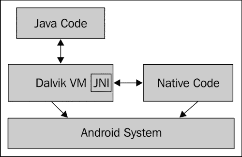

图中的箭头表示哪一方发起了交互。**达尔维克虚拟机**和**原生代码** 都运行在**安卓系统**之上(安卓是基于 Linux 的操作系统)。它们要求系统提供执行环境。 **JNI** 是**达尔维克虚拟机**的一部分，它允许**本机代码**在 Java 代码中访问字段和调用方法。 **JNI** 还允许 **Java 代码**调用在**本机代码**中实现的本机方法。因此， **JNI** 方便了**原生代码**和 **Java 代码**之间的双向通信。

如果你熟悉 Java 编程和 C，或者 C++，或者汇编编程，那么用安卓 NDK 学习编程多半是在学习 JNI。JNI 既有原始数据类型，也有引用数据类型。在 Java 中，这些数据类型有其对应的映射数据类型。操作原语类型通常可以直接完成，因为数据类型通常等同于本机 C/C++数据类型。然而，参考数据操作通常需要预定义的 JNI 函数的帮助。

在本章中，我们将首先介绍 JNI 的各种数据类型，并演示如何从 Java 中调用本机方法。然后，我们描述访问 Java 字段和从本机代码调用 Java 方法。最后，我们将讨论如何缓存数据以获得更好的性能，如何处理错误和异常，以及如何在本机方法实现中使用程序集。

本章中的每个食谱都附带了一个示例安卓项目，说明了这个主题和相关的 JNI 函数。由于篇幅限制，我们无法列出书中所有的源代码。代码是本章非常重要的一部分，强烈建议您下载源代码，并在浏览食谱时参考它。

### 类型

JNI 是一个复杂的话题，我们试图在安卓 NDK 编程的背景下涵盖它的最基本的部分。然而，一章不足以提供所有细节。读者可能想参考位于[http://docs.oracle.com/javase/6/docs/technotes/guides/jni/](http://docs.oracle.com/javase/6/docs/technotes/guides/jni/)的《Java JNI 规范》或位于[http://java.sun.com/docs/books/jni/](http://java.sun.com/docs/books/jni/)的《Java 原生接口:程序员指南》和《规范书》。关于安卓的具体信息，可以参考[https://developer.android.com/guide/practices/jni.html](https://developer.android.com/guide/practices/jni.html)的 JNI 提示。

# 加载本机库并注册本机方法

本机代码通常是编译到共享库 中，并在调用本机方法之前加载。本食谱介绍了如何加载本机库和注册本机方法。

## 做好准备

如果你还没有设置安卓 NDK 开发环境，请阅读[第 1 章](01.html "Chapter 1. Hello NDK")、*你好 NDK* 中的食谱。

## 怎么做…

以下步骤将向您展示如何构建一个演示加载本机库和注册本机方法的 Android 应用程序:

1.  启动 Eclipse，选择**文件** | **新建** | **安卓项目**。将**项目名称**的值输入为`NativeMethodsRegister`。选择**在工作区**创建新项目。然后，点击**下一步**。
2.  在下一个窗口，选择最新版本的安卓 SDK，然后点击**下一步**进入下一个窗口。
3.  将包名指定为`cookbook.chapter2`。选择**创建活动**复选框，并将名称指定为`NativeMethodsRegisterActivity`。将**最小软件开发工具包**的值设置为 **5(安卓 2.0)** 。然后，点击**完成**。
4.  在 **Eclipse 包浏览器**中，右键单击`NativeMethodsRegister`项目，然后选择**新建** | **文件夹**。在弹出窗口中输入名称`jni`，然后点击**完成**。
5.  右键单击`NativeMethodsRegister`项目下新创建的`jni`文件夹，然后选择**新建** | **文件**。输入`nativetest.c`作为**文件名**、 的值，然后点击**完成**。
6.  将以下代码添加到`nativetest.c` :

    ```cpp
    #include <android/log.h>
    #include <stdio.h>

    jint NativeAddition(JNIEnv *pEnv, jobject pObj, jint pa, jint pb) {
      return pa+pb;
    }

    jint NativeMultiplication(JNIEnv *pEnv, jobject pObj, jint pa, jint pb) {
      return pa*pb;
    }

    JNIEXPORT jint JNICALL JNI_OnLoad(JavaVM* pVm, void* reserved)
    {
        JNIEnv* env;
        if ((*pVm)->GetEnv(pVm, (void **)&env, JNI_VERSION_1_6)) {
         return -1;
      }
        JNINativeMethod nm[2];
        nm[0].name = "NativeAddition";
        nm[0].signature = "(II)I";
        nm[0].fnPtr = NativeAddition;
        nm[1].name = "NativeMultiplication";
        nm[1].signature = "(II)I";
        nm[1].fnPtr = NativeMultiplication;
        jclass cls = (*env)->FindClass(env, "cookbook/chapter2/NativeMethodRegisterActivity");
        // Register methods with env->RegisterNatives.
        (*env)->RegisterNatives(env, cls, nm, 2);
        return JNI_VERSION_1_6;
    }
    ```

7.  添加以下代码加载 原生共享库并定义原生方法到`NativeMethodRegisterActivity.java` :

    ```cpp
    public class NativeMethodRegisterActivity extends Activity {
        … …
          private void callNativeMethods() {
            int a = 10, b = 100;
              int c = NativeAddition(a, b);
              tv.setText(a + "+" + b + "=" + c);
              c = NativeMultiplication(a, b);
              tv.append("\n" + a + "x" + b + "=" + c);
          }
          private native int NativeAddition(int a, int b);
          private native int NativeMultiplication(int a, int b);
          static {
            //use either of the two methods below
    //System.loadLibrary("NativeRegister");
              System.load("/data/data/cookbook.chapter2/lib/libNativeRegister.so");
          }
    }
    ```

8.  将`res/layout/activity_native_method_register.xml`文件中的`TextView` 修改为:

    ```cpp
    <TextView
            android:id="@+id/display_res"
            android:layout_width="wrap_content"
            android:layout_height="wrap_content"
            android:layout_centerHorizontal="true"
            android:padding="@dimen/padding_medium"
            android:text="@string/hello_world"
            tools:context=".NativeMethodRegisterActivity" />
    ```

9.  在`jni`文件夹下创建一个名为`Android.mk`的文件，内容如下:

    ```cpp
    LOCAL_PATH := $(call my-dir)
    include $(CLEAR_VARS)
    LOCAL_MODULE    := NativeRegister
    LOCAL_SRC_FILES := nativetest.c
    LOCAL_LDLIBS := -llog
    include $(BUILD_SHARED_LIBRARY)
    ```

10.  启动一个终端，转到我们项目下的`jni`文件夹，键入`ndk-build`构建原生库。
11.  Run the project on an Android device or emulator. You should see something similar to the following screenshot:

    

## 它是如何工作的…

该方法描述了如何加载本机库和注册本机方法:

*   **Loading Native Library**: The `java.lang.System` class provides two methods to load native libraries, namely `loadLibrary` and `load`. `loadLibrary` accepts a library name without the prefix and file extension. For example, if we want to load the Android native library compiled as `libNativeRegister.so` in our sample project, we use `System.loadLibrary("NativeRegister")`. The `System.load` method is different. It requires the full path of the native library. In our sample project, we can use `System.load("/data/data/cookbook.chapter2/lib/libNativeRegister.so")` to load the native library. The `System.load` method can be handy when we want to switch between different versions of a native library, since it allows us to specify the full library path.

    我们在 `NativeMethodRegisterActivity.java`类的静态初始化器中演示了这两种方法的用法。请注意，当我们构建和运行示例应用程序时，应该只启用一种方法。

*   **JNIEnv Interface Pointer**: Every native method defined in native code at JNI must accept two input parameters, the first one being a pointer to `JNIEnv`. The `JNIEnv` interface pointer is pointing to thread-local data, which in turn points to a JNI function table shared by all threads. This can be illustrated using the following diagram:

    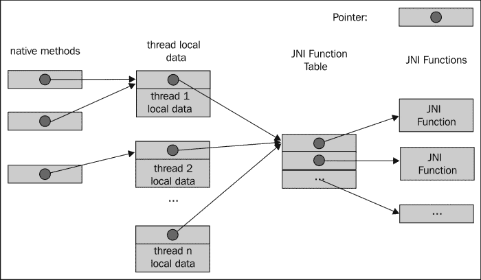

    `JNIEnv`接口指针是访问所有预定义的 JNI 函数的网关，包括使本机代码能够处理 Java 对象、访问 Java 字段、调用 Java 方法等的函数。我们接下来要讨论的`RegisterNatives`原生函数也是其中之一。

    ### 类型

    `JNIEnv`接口指针指向线程本地数据，因此不能在线程间共享。此外，`JNIEnv`只能由一个 Java 线程访问。一个本地线程必须调用 JNI 函数 `AttachCurrentThread`将其自身附加到虚拟机，以获取`JNIEnv`接口指针。我们将在本章的 JNI*操作类*食谱中看到一个这样的例子。

*   **Registering Native Methods**: JNI can automatically discover the native method implementation if its function name follows a specific naming convention as mentioned in [Chapter 1](01.html "Chapter 1. Hello NDK"), *Hello NDK*. This is not the only way. In our sample project, we explicitly called the `RegisterNatives` JNI function to register the native methods. The `RegisterNatives` function has the following prototype:

    ```cpp
    jint RegisterNatives(JNIEnv *env, jclass clazz, const JNINativeMethod *methods, jint nMethods);
    ```

    `clazz`参数是对将要注册本地方法的类的引用。`methods`参数是`JNINativeMethod` 数据结构的数组。`JNINativeMethod`定义如下:

    ```cpp
    typedef struct {
      char *name;
      char *signature;
      void *fnPtr;
    } JNINativeMethod;
    ```

    `name`表示原生方法名称，`signature`是方法的输入参数数据类型和返回值数据类型的描述符，`fnPtr` 是指向原生方法的函数指针。`RegisterNatives`的最后一个参数`nMethods`表示要注册的方法数量。该函数返回零表示成功，否则返回负值。

    `RegisterNatives`便于为不同的类注册本机方法实现。此外，它可以简化本机方法名称，以避免粗心的错误。

    使用`RegisterNatives`的典型方式是如下模板所示的 `JNI_OnLoad`方法。`JNI_OnLoad`在加载本机库时被调用，因此我们可以保证在调用本机方法之前注册它们:

    ```cpp
    JNIEXPORT jint JNICALL JNI_OnLoad(JavaVM* pVm, void* reserved)
    {
        JNIEnv* env;
        if ((*pVm)->GetEnv(pVm, (void **)&env, JNI_VERSION_1_6)) {
        return -1;
      }

      // Get jclass with env->FindClass.
      // Register methods with env->RegisterNatives.

      return JNI_VERSION_1_6;
    }
    ```

我们在示例代码的 `JNI_OnLoad`方法中演示了前面模板的用法，其中我们注册了两个本机方法来分别对两个输入整数进行加法和乘法。前面显示的执行结果证明了 Java 代码可以成功调用这两个注册的本机方法。

请注意，这个例子使用了一些我们将在后面的食谱中介绍的 JNI 特性，包括`FindClass` 函数和字段描述符。如果在这个阶段没有完全理解代码，也没关系。你可以在更多地了解这些话题后再回头看。

# 传递参数并接收原语类型的返回

Java 代码可以将参数传递给本机方法，接收返回的处理结果。这个方法介绍了如何在原语类型中传递参数和接收返回。

## 做好准备

在阅读本食谱之前，您应该已经用本机代码构建了至少一个安卓应用程序。如果您还没有这样做，请先阅读[第一章](01.html "Chapter 1. Hello NDK")、*你好 NDK* 中的*写你好 NDK 节目*食谱。

## 怎么做…

以下步骤创建了一个示例 Android 应用程序，该应用程序具有从 Java 代码接收输入参数并返回处理结果的本机方法:

1.  创建一个名为`PassingPrimitive`的项目。将包名设置为`cookbook.chapter2`。创建一个名为`PassingPrimitiveActivity`的活动。在这个项目下，创建一个名为`jni`的文件夹。如果您需要更详细的说明，请参考本章中的*加载本机库和注册本机方法*配方。
2.  在`jni`文件夹下添加一个名为`primitive.c`的文件，实现原生方法。在我们的示例项目中，我们为八种原始数据类型中的每一种实现了一个本机方法。以下是`jboolean`、`jint`和`jdouble`的代码。完整的方法列表请参考下载的代码:

    ```cpp
    #include <jni.h>
    #include <android/log.h>

    JNIEXPORT jboolean JNICALL Java_cookbook_chapter2_PassingPrimitiveActivity_passBooleanReturnBoolean(JNIEnv *pEnv, jobject pObj, jboolean pBooleanP){
      __android_log_print(ANDROID_LOG_INFO, "native", "%d in %d bytes", pBooleanP, sizeof(jboolean));
      return (!pBooleanP);
    }

    JNIEXPORT jint JNICALL Java_cookbook_chapter2_PassingPrimitiveActivity_passIntReturnInt(JNIEnv *pEnv, jobject pObj, jint pIntP) {
      __android_log_print(ANDROID_LOG_INFO, "native", "%d in %d bytes", pIntP, sizeof(jint));
      return pIntP + 1;
    }

    JNIEXPORT jdouble JNICALL Java_cookbook_chapter2_PassingPrimitiveActivity_passDoubleReturnDouble(JNIEnv *pEnv, jobject pObj, jdouble pDoubleP) {
      __android_log_print(ANDROID_LOG_INFO, "native", "%f in %d bytes", pDoubleP, sizeof(jdouble));
      return pDoubleP + 0.5;
    }
    ```

3.  在`PassingPrimitiveActivity.java` Java 代码中，我们添加代码加载原生库，声明原生方法，调用原生方法。下面是这部分代码。“`…`”表示未显示的部分。完整代码请参考网站下载的源文件:

    ```cpp
    @Override
        public void onCreate(Bundle savedInstanceState) {
            super.onCreate(savedInstanceState);
            setContentView(R.layout.activity_passing_primitive);
            StringBuilder strBuilder = new StringBuilder();
            strBuilder.append("boolean: ").append(passBooleanReturnBoolean(false)).append(System.getProperty("line.separator"))
             ......

              .append("double: ").append(passDoubleReturnDouble(11.11)).append(System.getProperty("line.separator"));
            TextView tv = (TextView) findViewById(R.id.display_res);
            tv.setText(strBuilder.toString());
        }
        private native boolean passBooleanReturnBoolean(boolean p);
        private native byte passByteReturnByte(byte p);
        private native char passCharReturnChar(char p);
        private native short passShortReturnShort(short p);
        ......
        static {
            System.loadLibrary("PassingPrimitive");
        }
    ```

4.  根据本章*加载原生库和注册原生方法*配方的第 8 步或下载的项目代码修改`res/layout/activity_passing_primitive.xml`文件。
5.  在`jni`文件夹下创建一个名为`Android.mk`的文件，并添加以下内容:

    ```cpp
    LOCAL_PATH := $(call my-dir)
    include $(CLEAR_VARS)
    LOCAL_MODULE    := PassingPrimitive
    LOCAL_SRC_FILES := primitive.c
    LOCAL_LDLIBS := -llog
    include $(BUILD_SHARED_LIBRARY)
    ```

6.  启动一个终端，进入`jni`文件夹，输入`ndk-build`构建原生库`PassingPrimitive`。
7.  在 Eclipse 中，选择**窗口** | **显示视图** | **日志猫**显示日志猫控制台。或者，启动一个终端，在终端中输入以下命令，在上面显示`logcat`输出:

    ```cpp
    $adb logcat -v time
    ```

8.  Run the project on an Android device or emulator. You should see something similar to the following screenshot:

    

    logcat 输出如下:

    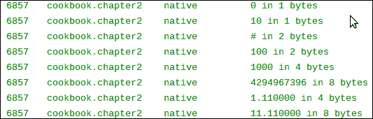

## 它是如何工作的…

代码演示了如何从本机方法传递参数和接收基元类型的返回。我们为每个基本类型创建了一个方法。在本机代码中，我们将接收到的值打印到`logcat`，修改该值，并将其返回。

*   **JNI primitive type and Java primitive** **type mapping**: The primitive types in JNI and Java have the following mapping:

    <colgroup><col style="text-align: left"> <col style="text-align: left"> <col style="text-align: left"> <col style="text-align: left"></colgroup> 
    | 

    Java 类型

     | 

    JNI 类型

     | 

    字节数

     | 

    符号

     |
    | --- | --- | --- | --- |
    | `boolean` | `jboolean` | one | 无符号的 |
    | `byte` | `jbyte` | one | 签名 |
    | `char` | `jchar` | Two | 无符号的 |
    | `short` | `jshort` | Two | 签名 |
    | `int` | `jint` | four | 签名 |
    | `long` | `jlong` | eight | 签名 |
    | `float` | `jfloat` | four | - |
    | `double` | `jdouble` | eight | - |

    注意 Java `char`和 JNI `jchar`都是两个字节，而 C/C++ `char`类型只有一个字节长。其实在 JNI 编程中，C/C++ `char`是可以和`jbyte`互换的，而不是`jchar`互换的。

*   **Android log library**: We output the received values to the Android logging system at a native method, by using the following code:

    ```cpp
    __android_log_print(ANDROID_LOG_INFO, LOG_TAG, __VA_ARGS__);
    ```

    `ANDROID_LOG_INFO`是在`android/log.h`中定义的`enum`值，表示我们正在使用信息级日志记录。`LOG_TAG`可以是任意字符串，`__VA_ARGS__`由传递给 API 的参数代替，格式类似于 C 中的 `printf`方法。

    我们必须在本机代码中包含`android/log.h`头才能使用日志函数:

    ```cpp
    #include <android/log.h>
    ```

    除此之外，我们还需要在`Android.mk`文件中包含 NDK 日志库，以便使用该应用编程接口:

    ```cpp
    LOCAL_LDLIBS := -llog
    ```

我们将在[第 3 章](03.html "Chapter 3. Build and Debug NDK Applications")、*构建和调试 NDK 应用程序*中详细介绍安卓日志 API，同时利用日志 API 进行调试。

# 在 JNI 操纵琴弦

在 JNI，字符串有些复杂，主要是因为 Java 字符串和 C 字符串在内部是不同的。这个食谱将涵盖最常用的 JNI 字符串特征。

## 做好准备

理解编码的基础知识对于理解 Java 字符串和 C 字符串之间的区别至关重要。我们将简要介绍 Unicode。

根据统一码联盟，统一码标准定义如下:

> *Unicode 标准是一种字符编码系统，旨在支持现代世界各种语言和技术学科的书面文本的全球交换、处理和显示。此外，它支持许多书面语言的经典和历史文本。*

Unicode 为它定义的每个字符分配一个唯一的数字，称为 **码位**。主要有两类编码方法支持整个 Unicode 字符集或其子集。

第一种是 **Unicode 转换格式** ( **UTF** )，它将一个 Unicode 码点编码成可变数量的码值。UTF-8、UTF-16、UTF-32 和其他一些都属于这一类。数字 8、16 和 32 指的是一个代码值中的位数。第二类是 **通用字符集** ( **UCS** )编码，将一个 Unicode 码点编码成单个代码值。UCS2 和 UCS4 属于这一类。数字 2 和 4 指的是一个代码值中的字节数。

### 注

Unicode 定义的字符比两个字节可能代表的字符还要多。因此，UCS2 只能表示 Unicode 字符的子集。因为 Unicode 定义的字符比四个字节所能表示的字符少，所以从不需要 UTF-32 的多个代码值。因此，UTF-32 和 UCS4 在功能上是相同的。

Java 编程语言使用 UTF-16 来表示字符串。如果一个字符不适合 16 位代码值，则使用一对名为 **的代码值替代对**。c 字符串只是一个以空字符结束的字节数组。实际的编码/解码基本上是留给开发人员和底层系统的。JNI 使用 UTF-8 的修改版本来表示字符串，包括本机代码中的类、字段和方法名。改装的 UTF-8 和标准的 UTF-8 有两个不同之处。首先，使用两个字节对空字符进行编码。其次，JNI 只支持标准 UTF-8 的一字节、二字节和三字节格式，而较长的格式无法正确识别。JNI 使用自己的格式来表示无法容纳三个字节的 Unicode。

## 怎么做

以下步骤向您展示了如何在 JNI 创建一个演示字符串操作的示例安卓项目 :

1.  创建一个名为`StringManipulation`的项目。将包名设置为`cookbook.chapter2`。创建一个名为`StringManipulationActivity`的活动。在项目下，创建一个名为`jni`的文件夹。如果您需要更详细的说明，请参考本章中的*加载本机库和注册本机方法*配方。
2.  在`jni`文件夹下创建一个名为`stringtest.c`的文件，然后执行`passStringReturnString` 方法如下:

    ```cpp
    JNIEXPORT jstring JNICALL Java_cookbook_chapter2_StringManipulationActivity_passStringReturnString(JNIEnv *pEnv, jobject pObj, jstring pStringP){

        __android_log_print(ANDROID_LOG_INFO, "native", "print jstring: %s", pStringP);
      const jbyte *str;
      jboolean *isCopy;
      str = (*pEnv)->GetStringUTFChars(pEnv, pStringP, isCopy);
      __android_log_print(ANDROID_LOG_INFO, "native", "print UTF-8 string: %s, %d", str, isCopy);

        jsize length = (*pEnv)->GetStringUTFLength(pEnv, pStringP);
      __android_log_print(ANDROID_LOG_INFO, "native", "UTF-8 string length (number of bytes): %d == %d", length, strlen(str));
      __android_log_print(ANDROID_LOG_INFO, "native", "UTF-8 string ends with: %d %d", str[length], str[length+1]);
      (*pEnv)->ReleaseStringUTFChars(pEnv, pStringP, str);

      char nativeStr[100];
      (*pEnv)->GetStringUTFRegion(pEnv, pStringP, 0, length, nativeStr);
      __android_log_print(ANDROID_LOG_INFO, "native", "jstring converted to UTF-8 string and copied to native buffer: %s", nativeStr);

      const char* newStr = "hello 安卓";
      jstring ret = (*pEnv)->NewStringUTF(pEnv, newStr);
      jsize newStrLen = (*pEnv)->GetStringUTFLength(pEnv, ret);
      __android_log_print(ANDROID_LOG_INFO, "native", "UTF-8 string with Chinese characters: %s, string length (number of bytes) %d=%d", newStr, newStrLen, strlen(newStr));
      return ret;
    }
    ```

3.  在`StringManipulationActivity.java` Java 代码中，添加加载本机库的代码，声明本机方法， 调用本机方法。有关源代码的详细信息，请参考下载的代码。
4.  根据本章*加载原生库和注册原生方法*方法的第 8 步或下载的项目代码修改`res/layout/activity_passing_primitive.xml`文件。
5.  在`jni`文件夹下创建一个名为`Android.mk`的文件。有关详细信息，请参考本章中*加载本机库和注册本机方法*方法的第 9 步或下载的代码。
6.  启动一个终端，转到`jni`文件夹，键入`ndk-build`构建原生库。
7.  Run the project on an Android device or emulator. We should see something similar to the following screenshot:

    

    在 logcat 输出中应该可以看到以下内容:

    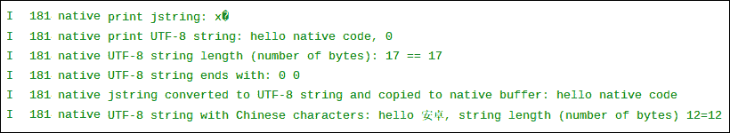

## 它是如何工作的…

这个食谱讨论了在 JNI 的字符串操作。

*   **Character encoding**: Android uses UTF-8 as its default charset, which is shown in our program by executing the `Charset.defaultCharset().name()` method. This means that the default encoding in the native code is UTF-8\. As mentioned before, Java uses the UTF-16 charset. This infers that an encoding conversion is needed when we pass a string from Java to the native code and vice versa. Failing to do so will cause unwanted results. In our example, we tried printing `jstring` directly in the native code, but the result was some unrecognizable characters.

    幸运的是，JNI 附带了一些预定义的函数来进行转换。

*   **Java string to native string**: When a native method is called with an input parameter of string type, the string received needs to be converted to the native string first. Two JNI functions can be used for different cases.

    第一个功能是`GetStringUTFChars`，，其原型如下:

    ```cpp
    const jbyte * GetStringUTFChars(JNIEnv *env, jstring string, jboolean *isCopy);
    ```

    这个函数将 Java 字符串转换成一个 UTF-8 字符的数组。如果制作了 Java 字符串内容的新副本，当函数返回时，`isCopy`设置为`true`；否则`isCopy`被设置为 false，返回的指针指向与原始 Java 字符串相同的字符。

    ### 类型

    虚拟机是否会返回 Java 字符串的新副本是不可预测的。因此，我们在转换大字符串时必须小心，因为可能的内存分配和复制可能会影响性能，甚至导致“内存不足”问题。还要注意，如果`isCopy`设置为`false`，我们就不能修改返回的 UTF-8 原生字符串，因为它会修改 Java 字符串内容，破坏 Java 字符串的不变性属性。

    一旦我们用转换后的原生字符串完成了所有操作，我们应该调用`ReleaseStringUTFChars`来通知虚拟机我们不再需要访问 UTF-8 原生字符串。该函数具有以下原型，第二个参数是 Java 字符串，第三个参数是 UTF-8 本机字符串:

    ```cpp
    void ReleaseStringUTFChars(JNIEnv *env, jstring string, const char *utf);
    ```

    转换的第二个函数是 `GetStringUTFRegion`，原型如下:

    ```cpp
    void GetStringUTFRegion(JNIEnv *env, jstring str, jsize start, jsize len, char *buf);
    ```

    `start`和`len`参数 表示 Java UTF-16 字符串的开始位置和要转换的 UTF-16 字符数。`buf`参数指向存储转换后的原生 UTF-8 字符数组的位置。

    让我们比较一下这两种方法。第一种方法可能需要也可能不需要为转换后的 UTF-8 字符串分配新的内存，这取决于虚拟机是否决定制作新的副本，而第二种方法使用预先分配的缓冲区来存储转换后的内容。此外，第二种方法允许我们指定转换源的位置和长度。因此，可以遵循以下规则:

    *   要修改转换后的 UTF-8 原生字符串，应使用 JNI 方法`GetStringUTFRegion`
    *   如果我们只需要原始 Java 字符串的一个子字符串， 并且子字符串不大，那么应该使用`GetStringUTFRegion`
    *   If we're dealing with a large string, and we're not going to modify the converted UTF-8 native string, `GetStringUTFChars` should be used

        ### 类型

        在我们的例子中，我们在调用`GetStringUTFRegion`函数时使用了固定长度的缓冲区。我们应该确保它足以容纳字符串，否则我们应该使用动态分配的数组。

*   **弦长**:JNI 函数`GetStringUTFLength`可以用来得到一个 UTF-8 `jstring`的弦长。注意它返回的是字节数而不是 UTF-8 字符数，如我们的例子所示。
*   **原生字符串到 Java 字符串**:我们还需要 将字符串数据从原生代码返回到 Java 代码。返回的字符串应该是 UTF-16 编码的。JNI 函数`NewStringUTF`从 UTF-8 原生字符串构造一个`jstring`。它有以下原型:

    ```cpp
    jstring NewStringUTF(JNIEnv *env, const char *bytes);
    ```

*   **转换失败** : `GetStringUTFChars`和`NewStringUTF`需要分配内存空间来存储转换后的字符串。如果内存不足，这些方法会抛出`OutOfMemoryError`异常并返回`NULL`。我们将在*检查错误和在 JNI* 处理异常食谱中介绍更多关于异常处理的内容。

## 还有更多…

**更多关于 JNI 的字符编码** : JNI 的字符编码是 比我们这里介绍的要复杂的多。除了 UTF-8，它还支持 UTF-16 转换功能。还可以在本机代码中调用 Java 字符串方法来编码/解码其他格式的字符。由于 Android 使用 UTF-8 作为其平台字符集，这里我们只介绍如何处理 Java UTF-16 和 UTF-8 原生字符串之间的转换。

# 管理 JNI 的参考资料

JNI 将字符串、类、实例对象和数组公开为引用类型。前面的方法引入了字符串类型。本食谱将涵盖参考 管理，后续三个食谱将分别讨论类、对象和数组。

## 怎么做…

以下步骤创建了一个示例安卓项目，展示了 JNI 的参考管理:

1.  创建一个名为`ManagingReference`的项目。将包名设置为`cookbook.chapter2`。创建一个名为`ManagingReferenceActivity`的活动。在项目下，创建一个名为`jni`的文件夹。如果您需要更详细的说明，请参考本章中的*加载本机库和注册本机方法*配方。
2.  在`jni`文件夹下创建一个名为`referencetest.c`的文件，然后实现`localReference``globalReference``weakReference`和 `referenceAssignmentAndNew`方法。这在下面的代码片段中显示:

    ```cpp
    JNIEXPORT void JNICALL Java_cookbook_chapter2_ManagingReferenceActivity_localReference(JNIEnv *pEnv, jobject pObj, jstring pStringP, jboolean pDelete){
        jstring stStr;
      int i;
      for (i = 0; i < 10000; ++i) {
        stStr = (*pEnv)->NewLocalRef(pEnv, pStringP);
        if (pDelete) {
          (*pEnv)->DeleteLocalRef(pEnv, stStr);
        }
      }
    }

    JNIEXPORT void JNICALL Java_cookbook_chapter2_ManagingReferenceActivity_globalReference(JNIEnv *pEnv, jobject pObj, jstring pStringP, jboolean pDelete){
      static jstring stStr;
      const jbyte *str;
      jboolean *isCopy;
      if (NULL == stStr) {
        stStr = (*pEnv)->NewGlobalRef(pEnv, pStringP);
      }
      str = (*pEnv)->GetStringUTFChars(pEnv, stStr, isCopy);
      if (pDelete) {
        (*pEnv)->DeleteGlobalRef(pEnv, stStr);
        stStr = NULL;
      }
    }

    JNIEXPORT void JNICALL Java_cookbook_chapter2_ManagingReferenceActivity_weakReference(JNIEnv *pEnv, jobject pObj, jstring pStringP, jboolean pDelete){
      static jstring stStr;
      const jbyte *str;
      jboolean *isCopy;
      if (NULL == stStr) {
        stStr = (*pEnv)->NewWeakGlobalRef(pEnv, pStringP);
      }
      str = (*pEnv)->GetStringUTFChars(pEnv, stStr, isCopy);
      if (pDelete) {
        (*pEnv)->DeleteWeakGlobalRef(pEnv, stStr);
        stStr = NULL;
      }
    }
    ```

3.  通过添加代码来修改`ManagingReferenceActivity.java`文件，加载本机库，然后声明并调用本机方法。
4.  根据本章*加载原生库和注册原生方法*的第 8 步修改`res/layout/activity_managing_reference.xml`文件，或者下载项目代码。
5.  在`jni`文件夹下创建一个名为`Android.mk`的文件。详见本章*加载原生库和注册原生方法*食谱第 9 步，或下载的代码。
6.  启动一个终端，转到`jni`文件夹，键入`ndk-build`构建原生库。
7.  在安卓设备或仿真器 上运行该项目，并在您的终端中使用 eclipse 或`adb logcat -v time`命令监控 logcat 输出。我们将在下一节详细介绍时显示每个本机方法的示例结果。

## 它是如何工作的…

本食谱涵盖了 JNI 的参考管理:

*   **JNI reference**: JNI exposes strings, classes, instance objects, and arrays as references. The basic idea of a reference can be illustrated using the following diagram:

    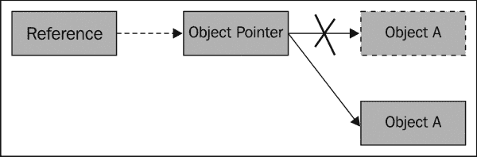

    引用为对象(对象可以是类、实例对象、字符串或数组)访问增加了一层间接性。对象由对象指针指向，引用用于定位对象指针。尽管这种间接方式会给对象操作带来开销，但它允许虚拟机向开发人员隐藏对象指针。因此，虚拟机可以在运行时内存管理时移动底层对象，并相应地更新对象指针值，而不会影响引用。

    请注意，虚拟机上的垃圾收集器会四处移动 对象，以实现廉价的内存分配、批量取消分配、减少堆碎片、提高局部性等。

    ### 类型

    引用不一定是指针。如何使用引用来定位对象指针的细节对开发人员是隐藏的。

*   **局部引用对比全局引用对比弱引用**:可以创建三种不同类型的引用来引用同一数据，分别是局部引用、全局引用和 弱引用。除非我们明确创建全局或弱引用，否则 JNI 使用本地引用进行操作。下表总结了三种不同类型引用之间的差异:

<colgroup><col style="text-align: left"> <col style="text-align: left"> <col style="text-align: left"> <col style="text-align: left"> <col style="text-align: left"> <col style="text-align: left"></colgroup> 
|   | 

创造

 | 

寿命

 | 

能见度

 | 

被引用对象的垃圾收集器行为

 | 

自由的

 |
| --- | --- | --- | --- | --- | --- |
| **本地参考**T2】 | `Default`或`NewLocalRef` | 本机方法的一次调用。本机方法返回后无效。 | 在创建它的线程中。 | GC 不会垃圾收集被引用的对象。 | 自动释放或调用`DeleteLocalRef` |
| **全球参考**T2】 | `NewGlobalRef` | 在显式释放之前有效。 | 跨多个线程。 | GC 不会垃圾收集被引用的对象。 | `DeleteGlobalRef` |
| **弱引用** | `NewGlobalWeakRef` | 在显式释放之前有效。 | 跨多个线程。 | GC 可以垃圾收集被引用的对象。 | `DeleteWeakGlobalRef` |

现在，我们将在参考示例源代码的同时，逐一查看引用类型:

*   **Local reference**: The native method `localReference` shows the two basic JNI functions, namely `NewLocalRef` and `DeleteLocalRef`. The first function creates a local reference, while the second frees it. Note that normally we don't have to free a local reference explicitly, as it will be automatically freed after the native method returns. However, there are two exceptions. First, if we're creating lots of local references within a native method invocation, we can cause overflow. This is illustrated in our sample method when we pass `false` to the `pDelete` input parameter. The following screenshot represents an example of such a scenario:

    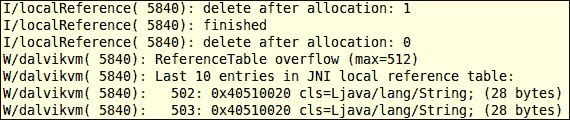

    第一次执行在使用完本地引用后就删除了，所以完成的很好，而第二次执行没有删除本地引用，最终导致 `ReferenceTable`溢出。

    其次，当我们实现一个由其他本机函数调用的实用函数时，除了返回值之外，我们不应该泄漏任何引用。否则，如果本机方法多次调用实用程序函数，也会导致溢出问题。

    ### 类型

    在安卓 4.0 之前，本地引用是使用指向对象的直接指针实现的。此外，即使在调用`DeleteLocalRef`之后，这些直接指针也从未失效。因此，程序员可以使用本地引用作为直接指针，即使引用被声明为已删除。由于这种设计，很多没有正确编码的 JNI 代码都可以正常工作。然而，从安卓 4.0 开始，本地引用已经被更改为使用间接机制。因此，使用本地引用作为直接指针的有问题的代码将在安卓 4.0 中被打破。强烈建议您始终遵循 JNI 规范。

*   **Global reference**: The native method, `globalReference`, demonstrates a typical usage of a global reference. The global reference is retained when passing `false` to the `pDelete` input parameter, since it is a static variable. Next time the method is called, the static global reference will still reference to the same object. Therefore, we don't need to call `NewGlobalRef` again. This technique can save us from carrying out the same operation at every invocation of global reference.

    我们在 Java 代码中调用`globalReference`三次，如下所示:

    ```cpp
    globalReference("hello global ref", false); 
    globalReference("hello global ref 2", true);
    globalReference("hello global ref 3", true);
    ```

    结果应该如下所示:

    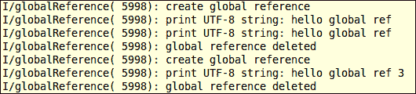

    与第一个方法调用一起传递的字符串被保留，因此前两次调用显示相同的字符串。当我们在第二次调用结束时删除了全局引用后，第三次调用会显示与之一起传递的字符串。

    注意虽然`DeleteGlobalRef`释放了全局引用，但是并没有设置为`NULL`。删除后，我们已明确将全局引用设置为`NULL`。

*   **Weak reference**: Weak reference is similar to global reference, except that it doesn't prevent the **Garbage Collector** (**GC**) from garbage collecting the underlying object referenced by it. Weak reference is not used as often as local and global reference. A typical use case is when we are referencing to lots of non-critical objects, and we don't want to prevent the GC from garbage collecting some of those objects when the GC thinks it's necessary.

    ### 类型

    Android 中对弱引用的支持是依赖于版本的。在 Android 2.2 之前，弱引用根本没有实现。安卓 4.0 之前只能传到`NewLocalRef`、`NewGlobalRef`、`DeleteWeakGlobalRef`。从安卓 4.0 开始，安卓完全支持弱引用。

*   **Assignment versus New<ReferenceType>Ref**: In the `referencetest.c` source code, we implemented the native `ReferenceAssignmentAndNew` method. This method illustrates the difference between assignment and allocating a new reference.

    我们将输入 jstring `pStringP`传递给 JNI 函数`NewGlobalRef`两次，以创建两个全局引用(`globalRefNew`和`globalRefNew2`，并将其中一个全局引用分配给变量`globalRefAssignment`。然后我们测试它们是否都引用了同一个对象。

    由于`jobject``jstring`实际上是指向 void 数据类型的指针，所以我们可以将它们的值打印为整数。最后，我们三次引用 `DeleteGlobalRef`。以下是安卓 logcat 输出的截图:

    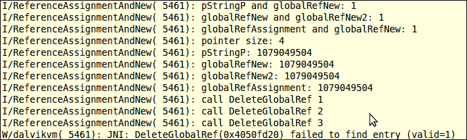

    前三行表示输入的 jstring `pStringP`、两个全局引用`globalRefNew`和`globalRefNew2`，以及分配的 jstring `globalRefAssignment` 都引用同一个对象。输出的第五行到第八行显示相同的值，这意味着所有引用本身都是等效的。最后，`DeleteGlobalRef`前两次通话成功，最后 一次通话失败。

    `New<ReferenceType>Ref JNI`函数实际上定位底层对象，然后添加对该对象的引用。它允许为同一个对象添加多个引用。请注意，虽然我们的示例执行显示`New<ReferenceType>Ref`创建的引用的值是相同的，但这并不保证。指向同一对象的两个对象指针和引用同一对象的引用可能与两个不同的指针相关联。

    建议您永远不要依赖引用的值；你应该用 JNI 函数来代替。一个例子是使用`IsSameObject`并且从不使用“`==`”来测试两个引用是否指向同一个底层对象，除非我们针对`NULL`进行测试。

    `Delete<ReferenceType>Ref`调用的次数必须与`New<ReferenceType>Ref`调用的次数相匹配。较少的调用可能会导致内存泄漏，而较多的调用将会失败，如前面的结果所示。

    分配操作不经过虚拟机，因此不会导致虚拟机添加新的引用。

    请注意，虽然我们使用了全局参考来说明，但这些原则也适用于局部和弱参考。

## 还有更多…

还有另一种方法可以使用 JNI 函数`PushLocalFrame`和`PopLocalFrame`管理本地引用。感兴趣的读者可以参考 JNI 规范了解更多信息。

在用 `AttachCurrentThread`附加一个本机线程后，在线程中运行的代码将不会释放本地引用，直到线程被分离。应该显式释放本地引用。总的来说，我们显式地释放本地引用是一个很好的做法，只要我们不再需要它。

# 操纵 JNI 的阶级

前面的配方讨论了安卓 JNI 支持三种不同的引用。引用用于访问引用数据类型，包括字符串、类、实例对象和数组。这份食谱专注于安卓 JNI 系统中的类操作。

## 做好准备

在阅读本食谱之前，应先阅读 NDK 食谱中的*管理参考资料。*

## 怎么做…

以下步骤描述了如何构建一个示例 Android 应用程序，该应用程序演示了 JNI 的类操作:

1.  创建一个名为`ClassManipulation`的项目。将包名设置为`cookbook.chapter2`。创建一个名为`ClassManipulationActivity`的活动。在项目下，创建一个名为`jni`的文件夹。如果您需要更详细的说明，请参考本章的*加载本机库和注册本机方法*配方。
2.  在`jni`文件夹下创建一个名为`classtest.c`的文件，然后实现`findClassDemo`、`findClassDemo2`、`GetSuperclassDemo`和`IsAssignableFromDemo`方法。我们可以参考下载的`ClassManipulation`项目源代码。
3.  通过添加代码加载本机库、声明本机方法和调用本机方法来修改`ClassManipulationActivity.java`。
4.  创建一个`Dummy`类和一个扩展`Dummy`类的`DummySubClass`子类。创建一个 `DummyInterface`接口和一个`DummySubInterface`子接口，扩展`DummyInterface`。
5.  修改`layout` XML 文件，添加`Android.mk`构建文件，构建原生库。有关详细信息，请参考本章的*加载本机库和注册本机方法*方法的步骤 8 至 10。
6.  我们现在准备运行这个项目。我们将在下一节讨论每种本机方法时展示输出。

## 它是如何工作的…

这个食谱展示了 JNI 的课堂操作。 我们重点强调几点如下:

*   **类描述符** : A 类描述符是指一个类或者一个接口的名称。可以通过在 JNI 编程中将 Java 中的“`.`”字符替换为“`/`”来导出。例如，类`java.lang.String`的描述符是`java/lang/String`。
*   **FindClass and class loader**: The JNI function `FindClass` has the following prototype:

    ```cpp
    jclass FindClass(JNIEnv *env, const char *name);
    ```

    它接受一个 `JNIEnv`指针和一个类描述符，然后定位一个类加载器来加载相应的类。它返回一个初始化类的局部引用，或者在失败的情况下返回`NULL`。`FindClass`使用与调用堆栈最顶层方法相关联的类加载器。如果找不到，它将使用“系统”类加载器。一个典型的例子是，在我们创建一个线程并将其附加到虚拟机之后，调用堆栈的最顶层方法如下:

    ```cpp
    dalvik.system.NativeStart.run(Native method)
    ```

    这个方法不是我们应用程序代码的一部分。因此使用了“系统”类加载器。

    ### 类型

    可以在 Java(称为托管线程或 Java 线程)或本机代码(称为本机线程或非虚拟机线程)上创建线程。通过调用 JNI 函数`AttachCurrentThread`，可以将本机线程附加到虚拟机。一旦附加，本机线程就像 Java 线程一样工作，在本机方法中运行。它保持连接，直到调用 JNI 函数`DetachCurrentThread`。

    在我们的`ClassManipulation` 项目中，我们用`findClassDemo`和`findClassDemo2`原生方法来说明`FindClass`。 `findClassDemo`方法在虚拟机创建的线程中运行。 `FindClass`调用将正确定位类加载器。`findClassDemo2`方法创建一个非虚拟机线程，并将该线程附加到 虚拟机。它说明了我们在前一节中描述的情况。调用两个本机方法的 logcat 输出如下:

    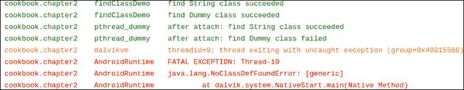

    如输出所示，非 VM 线程成功加载了`String`类，但没有加载我们定义的 `Dummy`类。解决这个问题的方法是在 `JNI_OnLoad`方法中缓存对`Dummy`类的引用。我们将在*中提供一个 的详细示例:缓存 jfieldID、jmethodID，并引用数据来提高性能*配方。

*   `GetSuperclass`: The JNI function `GetSuperclass` has the following prototype:

    ```cpp
    jclass GetSuperclass(JNIEnv *env, jclass clazz);
    ```

    它帮助我们找到给定类的超类。如果`clazz`为`java.lang.Object`，则该功能返回`NULL`；如果是接口，则返回`java.lang.Object`的本地引用；如果它是任何其他类，它会返回对其超类的本地引用。

    在我们的`ClassManipulation` 项目中，我们用`GetSuperclassDemo` 土法来说明`GetSuperclass`。我们用 Java 代码创建了一个`Dummy`类和一个`DummyInterface`接口，其中`DummySubClass`扩展了`Dummy`，而`DummySubInterface`扩展了`DummyInterface`。在原生方法中，我们分别调用`GetSuperclass`到`java.lang.Object`、`DummySubClass`和`DummySubInterface`。以下是 logcat 输出的屏幕截图:

    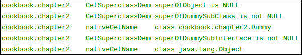

    如截图所示，`GetSuperclass`可以成功找到`DummySubClass`的超类。在这个原生方法中，我们使用了一个效用函数`nativeGetClassName`，我们称之为 `toString`方法。我们将在*调用实例和 JNI* 配方的静态方法中介绍如何进行这样的方法调用。

*   `IsAssignableFrom`: The JNI function `IsAssignableFrom` has the following prototype:

    ```cpp
    jboolean IsAssignableFrom(JNIEnv *env, jclass cls1, jclass cls2);
    ```

    如果`cls1`可以安全铸造到`cls2`，则该功能返回`JNI_TRUE`，否则返回`JNI_FALSE`。我们用原生方法`IsAssignableFromDemo`演示了它的用法。我们获得了对`DummySubClass`的局部引用，并调用`GetSuperclass`来获得对`Dummy`的局部引用。然后，我们调用 `IsAssignableFrom`到测试是否可以将`DummySubClass`铸造到`Dummy`，反之亦然。以下是 logcat 输出的屏幕截图:

    

    正如预期的那样，子类可以安全地转换到它的超类，但不能反过来。

### 类型

安卓不支持 JNI 功能`DefineClass` 。这是因为函数需要原始的类数据作为输入，安卓上的 Dalvik VM 不使用 Java 字节码或类文件。

# 在 JNI 操纵物体

前面的食谱展示了我们如何在安卓 JNI 系统中操作类。这个食谱描述了如何在安卓 NDK 编程中操作实例对象。

## 做好准备

在阅读本食谱之前，应先阅读以下食谱:

*   *管理 JNI 的推荐人*
*   *在 JNI 操纵班级*

## 怎么做…

现在，我们将创建一个带有本地方法的安卓项目，演示与实例对象相关的 JNI 函数的用法。请执行以下步骤:

1.  创建一个名为`ObjectManipulation`的项目。将包名设置为`cookbook.chapter2`。创建一个名为`ObjectManipulationActivity`的活动。在项目下，创建一个名为`jni`的文件夹。如果您需要更详细的说明，请参考本章中的*加载本机库和注册本机方法*配方。
2.  在`jni`文件夹下创建一个名为`objecttest.c`的文件，然后实现`AllocObjectDemo`、`NewObjectDemo`、`NewObjectADemo`、`NewObjectVDemo`、`GetObjectClassDemo`和`IsInstanceOfDemo`方法。可以参考下载的`ObjectManipulation`项目源代码。
3.  通过添加代码来修改`ObjectManipulationActivity.java`加载本机库，声明本机方法，并调用它们。
4.  创建一个`Dummy`类和一个扩展`Dummy`的类。创建一个带有两个字段`name`和`age`的`Contact`类，一个构造函数和一个 `getContactStr`方法。
5.  修改`layout` XML 文件，添加`Android.mk`构建文件，构建原生库。有关更多详细信息，请参考本章的*加载本机库和注册本机方法*方法的步骤 8 至 10。
6.  我们现在准备运行这个项目。我们将在下一节讨论每种原生方法时呈现 输出。

## 它是如何工作的…

这个食谱介绍了在 JNI 操纵物体的各种方法:

*   **Create instance objects in the native code**: Four JNI functions can be used to create instance objects of a Java class in the native code, namely `AllocObject`, `NewObject`, `NewObjectA`, and `NewObjectV`. The `AllocObject` function creates an uninitialized object, while the other three methods take a constructor as an input parameter to create the object. The prototypes for the four functions are as follows:

    ```cpp
    jobject AllocObject(JNIEnv *env, jclass clazz);

    jobject NewObject(JNIEnv *env, jclass clazz,jmethodID methodID, ...);

    jobject NewObjectA(JNIEnv *env, jclass clazz,jmethodID methodID, jvalue *args);
    jobject NewObjectV(JNIEnv *env, jclass clazz,jmethodID methodID, va_list args);
    ```

    `clazz`参数是对我们想要为其创建实例对象的 Java 类的引用。它不能是一个数组类，它有自己的一组 JNI 函数。`methodID`是构造函数方法 ID，可以使用`GetMethodID` JNI 函数获得。

    对于`NewObject`，可以在`methodID`之后传递可变数量的参数，函数将它们传递给构造函数来创建实例对象。`NewObjectA`接受类型为`jvalue`的数组，并将其传递给构造函数。`jvalue`是一种联合类型，定义如下:

    ```cpp
    typedef union jvalue {
       jboolean z;
       jbyte    b;
       jchar    c;
       jshort   s;
       jint     i;
       jlong    j;
       jfloat   f;
       jdouble  d;
       jobject  l;
    } jvalue;
    ```

    `NewObjectV`将存储在`va_list`中的参数传递给构造函数。`va_list`以及`va_start`、`va_end`和`va_arg`使我们能够访问一个函数的可变数量的输入参数。细节超出了这本书的范围。但是，您可以从提供的示例代码中了解它的基本工作原理。

    在 Java 代码中，我们调用了所有四个本机方法，每个方法使用不同的 JNI 函数来创建我们定义的`Contact`类的实例对象。然后，我们将显示所有四个`Contact`对象的名称和年龄字段的值 。以下是示例运行的屏幕截图:

    

    如图所示，`AllocObject`创建的实例对象没有初始化，因此所有字段都包含了 Java 赋予的默认值，而其他三种方法创建的对象都是我们传递的初始值。

*   `GetObjectClass`: This JNI function has the following prototype:

    ```cpp
    jclass GetObjectClass(JNIEnv *env, jobject obj);
    ```

    它返回实例对象`obj`的类的局部引用。`obj`参数不能是`NULL`，否则会导致虚拟机崩溃。

    在我们的`GetObjectClassDemo` 原生方法实现中，我们获得了对`Contact`类和 的引用，然后调用`AllocObject`来创建一个未初始化的对象实例。在 Java 代码中，我们将创建的对象实例的字段显示如下:

    

    不出所料，未初始化实例`Contact`对象的字段值是由 Java 分配的默认值。

*   `IsInstanceOf`: This JNI function call has the following prototype:

    ```cpp
    jboolean IsInstanceOf(JNIEnv *env, jobject obj, jclass clazz);
    ```

    它确定实例对象`obj`是否是类`clazz`的实例。我们在`IsInstanceOfDemo`原生方法中说明了这个函数的用法。该方法创建对`Dummy`类的局部引用和对`DummySub`类的局部引用，后者是`Dummy`的子类。然后它创建两个对象，每个类一个。然后，代码调用`IsInstanceOf`，每个对象引用对应每个类引用，总共进行四次检查。我们将输出发送到 logcat。此方法的示例执行给出了以下结果:

    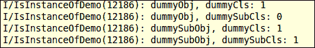

    如结果所示，`Dummy`实例对象是`Dummy`类的实例，但不是`DummySub`类， 而`DummySub`实例对象是`Dummy`类和`DummySub`类的实例。

# 在 JNI 操纵阵列

JNI 将字符串、类、实例对象和数组公开为 引用类型。这个食谱将讨论 JNI 的阵列。

## 做好准备

在看这个食谱之前，你应该确定你已经阅读了下面的食谱:

*   *管理 JNI 的推荐人*
*   *在 JNI 操纵班级*

## 怎么做…

在本节中，我们将创建一个示例安卓项目，演示如何在 JNI 操作数组。

1.  创建一个名为`ArrayManipulation`的项目。将包名设置为`cookbook.chapter2`。创建一个名为`ArrayManipulationActivity`的活动。在项目下，创建一个名为`jni`的文件夹。有关更多详细说明，请参考本章的*加载本机库和注册本机方法*配方。
2.  在`jni`文件夹下创建一个名为`arraytest.c`的文件，然后实现`GetArrayLengthDemo`、`NewObjectArrayDemo`、`NewIntArrayDemo`、`GetSetObjectArrayDemo`、`GetReleaseIntArrayDemo`、`GetSetIntArrayRegionDemo`和`GetReleasePrimitiveArrayCriticalDemo` 原生方法。
3.  通过添加代码来修改`ArrayManipulationActivity.java`加载本机库，声明本机方法，并调用它们。
4.  用一个名为`value`的整数字段创建一个`Dummy`类。
5.  修改布局 XML 文件，添加`Android.mk`构建文件，构建原生库。有关更多详细信息，请参考本章*加载本机库和注册本机方法*配方的步骤 8 至 10。
6.  我们现在准备运行这个项目。我们将在下一节讨论每种本机方法时展示输出。

## 它是如何工作的…

数组由`jarray`或其子类型如`jobjectArray`和`jbooleanArray`表示。与`jstring`类似，它们不能像 C 数组那样被本机代码直接访问。JNI 提供了各种访问阵列的功能:

*   **Create new arrays**: JNI provides `NewObjectArray` and `New<Type>Array` functions to create arrays for objects and primitive types. Their function prototypes are as follows:

    ```cpp
    jarray NewObjectArray(JNIEnv *env, jsize length, jclass elementType, jobject initialElement);
    <ArrayType> New<Type>Array(JNIEnv *env, jsize length);
    ```

    我们演示了 NewObjectArray 在原生方法`NewObjectArrayDemo`中的用法，其中我们创建了`Dummy`类的 10 个 实例。函数的`length` 参数表示要创建的对象数量，`elementType`是对类的引用，`initialElement` 是将为数组中所有创建的对象实例设置的初始值。在 Java 代码中，我们实现了 `callNewObjectArrayDemo`方法，该方法调用`NewObjectArrayDemo` 原生方法来创建 10 个`Dummy`对象的数组，所有对象的值字段都设置为`5`。执行结果应该类似于下面的截图:

    

    不出所料，`NewObjectArray`创建的所有对象的`value`字段都是`5`。

    `New<Type>Array`的用法显示在原生方法`NewIntArrayDemo`中，我们使用 JNI 函数`NewIntArray`创建一个 10 个整数的数组，然后为每个整数赋值。JNI 的所有八种原始类型(`jboolean`、`jbyte`、`jchar`、`jshort`、`jint`、`jlong`、`jfloat`和`jdouble`)都有相应的`New<Type>Array`函数来创建其类型的数组。注意`NewIntArrayDemo`调用`GetIntArrayElements`和`ReleaseIntArrayElements` JNI 函数，我们将在本食谱后面讨论。在 Java 代码中，我们实现了一个`callNewIntArrayDemo`方法来调用`NewIntArrayDemo`和 在屏幕上显示整数数组元素。执行`callNewIntArrayDemo`得到如下结果:

    

    如截图所示，整数数组赋值从`0`到`9`。

*   `GetArrayLength`: This native function has the following prototype:

    ```cpp
    jsize GetArrayLength(JNIEnv *env, jarray array);
    ```

    它接受对`jarray`的引用并返回其长度。我们在原生方法`GetArrayLengthDemo`中演示了它的用法。在 Java 代码中，我们实现了 `callGetArrayLengthDemo`方法，该方法创建了三个数组，包括一个`double`数组、 `Dummy`对象数组和一个二维整数数组。该方法调用`GetArrayLengthDemo` 本地方法来查找三个数组的长度。我们在本机方法中将数组 长度输出到 logcat。示例执行输出应该类似于下面的截图:

    

*   **Access object arrays**: JNI provides two functions to access object arrays, namely `GetObjectArrayElement` and `SetObjectArrayElement`. As its name suggests, the first one retrieves a reference to an object element of an array, while the second one sets the element of an object array. The two functions have the following prototype:

    ```cpp
    jobject GetObjectArrayElement(JNIEnv *env,jobjectArray array, jsize index);
    void SetObjectArrayElement(JNIEnv *env, jobjectArray array, jsize index, jobject value);
    ```

    在这两个函数中，参数`array`指的是对象数组，`index`是元素的位置。`get`函数返回对对象元素的引用，`set`函数根据`value`参数设置元素。

    我们说明了两个函数在本机方法`GetSetObjectArrayDemo`中的用法。方法接受一个对象数组和一个对象。它用接收到的对象替换索引一处的对象，然后返回索引一处的原始对象。在 Java 代码中，我们调用`callGetSetObjectArrayDemo` 方法将一个由三个`Dummy`对象组成的数组传递给本机方法，这三个对象的值分别为`0`、`1`、`2`，以及另一个`Dummy`对象的值为`100`。执行 的结果应该类似于下面的截图:

    

    如图所示，索引`1`处的对象被值为`100`的对象替换，并返回值为`1`的原始对象。

*   **Access arrays of primitive types**: JNI provides three sets of functions to access arrays of primitive types. We demonstrate them separately using three different native methods, all using `jintarray` as an example. Arrays of other primitive types are similar to integers.

    首先，如果我们想在本机缓冲区中创建单独的`jintarray`副本，或者只访问大数组的一小部分，`GetIntArrayRegion` / `SetIntArrayRegion` 函数是正确的选择。这两个函数具有以下原型:

    ```cpp
    void GetIntArrayRegion(JNIEnv *env, jintArray array, jsize start, jsize len, jint* buf);
    void SetIntArrayRegion(JNIEnv *env, jintArray array, jsize start, jsize len, jint* buf);
    ```

    这两个函数接受相同的输入参数集。参数`array`是指我们操作的`jintArray`，`start`是起始元素位置，`len`表示要获取或设置的元素个数，`buf`是原生整数缓冲区。我们在名为`GetSetIntArrayRegionDemo`的本地方法中展示了这两个函数的用法。该方法接受输入`jintArray`，将数组索引 1 到 3 的三个元素复制到本机缓冲区，在本机缓冲区将它们的值乘以`2`，并将该值复制回索引`0`到`2`。

    在 Java 代码中，我们实现了 `callGetSetIntArrayRegionDemo`方法来初始化一个整数数组，将数组传递给一个原生方法`GetSetIntArrayRegionDemo`，并显示所有元素的前后值。您应该 看到类似以下截图的输出:

    

    五行的初始值为`0`、`1`、`2`、`3`和`4`。我们将三个元素从索引一(`1`、`2`、`3`)复制到本地缓冲区`buf`。然后我们将原生缓冲区的值乘以`2`，这使得前三个元素位于原生缓冲区`2`、`4`和`6`。我们从索引`0`开始，将这三个值从本机缓冲区复制回整数数组。因此，三个元素的最终值为`2`、`4`和`6`，最后两个元素保持不变，为`3`和`4`。

    其次，如果我们想访问一个大数组，那么`GetIntArrayElements`和`ReleaseIntArrayElements`就是我们的 JNI 函数。它们有以下原型:

    ```cpp
    jint *GetIntArrayElements(JNIEnv *env, jintArray array, jboolean *isCopy);
    void ReleaseIntArrayElements(JNIEnv *env, jintArray array, jint *elems, jint mode);
    ```

    `GetIntArrayElements` 返回指向数组元素的指针，如果失败则返回`NULL`。数组输入参数是指我们要访问的数组，如果函数调用结束后创建了新的副本，`isCopy`设置为`true`。返回的指针在调用`ReleaseIntArrayElements`之前有效。

    `ReleaseIntArrayElements` 通知虚拟机我们不再需要访问数组元素。输入参数`array`是指我们操作的数组，`elems`是`GetIntArrayElements`返回的指针，`mode`表示释放模式。当`GetIntArrayElements`处的`isCopy`设置为`JNI_TRUE`时，我们通过返回的指针所做的更改将反映在`jintArray`上，因为我们在同一副本上操作。当`isCopy`设置为`JNI_FALSE`时，`mode`参数决定了 如何进行数据发布。根据我们是否要将值从本机缓冲区复制回原始数组，以及是否要释放`elems` 本机缓冲区，`mode`参数可以是`0`、`JNI_COMMIT`或`JNI_ABORT`，如下所示:

    <colgroup><col style="text-align: left"> <col style="text-align: left"> <col style="text-align: left"></colgroup> 
    | 

    将值复制回来

     | 

    是

     | 

    不

     |
    | --- | --- | --- |
    | 

    空闲本机缓冲区

     |
    | --- |
    | 是 | `0` | `JNI` _ABORT |
    | 不 | JNI_ `COMMIT` | - |

    我们用原生方法`GetReleaseIntArrayDemo`来说明两个 JNI 函数。该方法接受输入整数数组，通过`GetIntArrayElements`获得本机指针，将每个元素乘以`2`，最后将`mode`设置为`0`将更改提交回`ReleaseIntArrayElements`。在 Java 代码中，我们实现了`callGetReleaseIntArrayDemo` 方法来初始化输入数组并调用`GetReleaseIntArrayDemo`原生方法。以下是执行`callGetReleaseIntArrayDemo` 方法后手机显示的截图:

    

    不出所料，原始数组中的所有整数元素都要乘以`2`。

    第三组 JNI 函数是`GetPrimitiveArrayCritical`和`ReleasePrimitiveArrayCritical`。这两个函数的用法类似于`Get<Type>ArrayElements`和`Release<Type>ArrayElements`的用法，除了一个重要的区别——在`Get`和`Release`方法之间的代码块是一个关键区域。不应执行导致当前线程在同一 虚拟机中等待另一个线程的其他 JNI 函数或函数调用。这两种方法本质上增加了获得原始基元数组的未拷贝版本的可能性，因此提高了性能。我们在本地方法`GetReleasePrimitiveArrayCriticalDemo`和 Java 方法`callGetReleasePrimitiveArrayCriticalDemo`中演示了这些函数的用法。实现类似于第二组函数调用，显示结果也是一样的。

# 访问本机代码中的 Java 静态和实例字段

我们已经演示了如何将不同 类型的参数传递给本机方法，并将数据返回给 Java。这不是本机代码和 Java 代码之间共享数据的唯一方式。这个方法涵盖了另一种方法——从本机代码访问 Java 字段。

## 做好准备

我们将介绍如何访问不同类型的 Java 字段，包括基元类型、字符串、实例对象和数组。阅读本食谱前，应先阅读以下食谱:

*   *传递参数并接收原语类型的返回*
*   *在 JNI 操纵琴弦*
*   *在 JNI 操纵班级*
*   *在 JNI 操纵物体*
*   *操纵 JNI 的阵列*

读者也应该熟悉 Java 反射 API。

## 怎么做…

按照以下步骤创建一个示例 Android 项目，演示如何从本机代码访问 Java 静态和实例字段:

1.  创建一个名为`AccessingFields`的项目。将包名设置为`cookbook.chapter2`。创建一个名为`AccessingFieldsActivity`的活动。在项目下，创建一个名为`jni`的文件夹。有关更多详细说明，请参考本章的*加载本机库和注册本机方法*配方。
2.  在`jni`文件夹下创建一个名为`accessfield.c`的文件，然后实现`AccessStaticFieldDemo`、`AccessInstanceFieldDemo`和`FieldReflectionDemo`原生方法。
3.  通过添加代码来修改`AccessingFieldsActivity.java`加载本机库，声明本机方法，并调用它们。此外，添加四个实例字段和四个静态字段。
4.  创建一个名为`value`的整数实例字段和名为`value2`的整数静态字段的`Dummy`类。
5.  修改布局 XML 文件，添加`Android.mk`构建文件，构建原生库。有关更多详细信息，请参考本章*加载本机库和注册本机方法*配方的步骤 8 至 10。
6.  我们现在准备运行这个项目。在下一节中，我们将在讨论每个本机方法的同时展示输出。

## 它是如何工作的…

这个方法讨论了从本机代码访问 Java 中的字段(静态和实例字段):

*   **jfieldID 数据类型** : `jfieldID`是一个常规 C 指针，指向一个对开发人员隐藏细节的数据结构。我们不应将其与`jobject`或其亚型混淆。`jobject`是 Java 中对应`Object`的引用类型，而`jfieldID`在 Java 中没有这样的对应类型。但是，JNI 提供了将`java.lang.reflect.Field`实例转换为`jfieldID`的功能，反之亦然。
*   **Field descriptor**: It refers to the modified UTF-8 string used to represent the field data type. The following table summarizes the Java field types and its corresponding field descriptors:

    <colgroup><col style="text-align: left"> <col style="text-align: left"></colgroup> 
    | 

    Java 字段类型

     | 

    字段描述符

     |
    | --- | --- |
    | `boolean` | `Z` |
    | `byte` | `B` |
    | `char` | `C` |
    | `short` | `S` |
    | `int` | `I` |
    | `long` | `J` |
    | `float` | `F` |
    | `double` | `D` |
    | `String` | `Ljava/lang/String;` |
    | `Object` | `Ljava/lang/Object;` |
    | `int[]` | `[I` |
    | `Dummy[]` | `[Lcookbook/chapter2/Dummy;` |
    | `Dummy[][]` | `[[Lcookbook/chapter2/Dummy;` |

    如表中所示，八种基本类型中的每一种都有一个字符串作为其字段描述符。对于对象，字段描述符以`"L"`开头，然后是类描述符(详细信息请参考 JNI 配方中的*操纵类)，最后是“`;`”。对于数组，字段描述符以“`[`”开头，后跟元素类型的描述符。*

*   **Accessing static fields**: JNI provides three functions to access static fields of a Java class. They have the following prototypes:

    ```cpp
    jfieldID GetStaticFieldID(JNIEnv *env, jclass clazz, const char *name, const char *sig);
    <NativeType> GetStatic<Type>Field(JNIEnv *env,jclass clazz, jfieldID fieldID);
    void SetStatic<Type>Field(JNIEnv *env, jclass clazz, jfieldID fieldID,<NativeType> value);
    ```

    要访问静态字段，第一步是获取字段标识，这是通过这里列出的第一个函数来完成的。在方法原型中，`clazz`参数指的是定义静态字段的 处的 Java 类， `name`表示字段名称，`sig`是字段描述符。

    一旦我们有了方法标识，我们就可以通过调用函数二或三来获取或设置字段值。在函数原型中，`<Type>`可以引用八个 Java 原语类型中的任意一个或者`Object`，`fieldID`是调用第一个方法返回的`jfieldID`。对于`set`功能，`value`是我们要分配给字段的新值。

    前面三个 JNI 函数的用法在原生方法`AccessStaticFieldDemo`中进行了演示，其中我们设置并获取了一个整数字段、一个字符串字段、一个数组字段和一个`Dummy`对象字段的值。这四个字段在 Java 类`AccessingFieldsActivity`中定义。在本机代码中，我们将 get 值输出到 Android logcat，而在 Java 代码中，我们将本机代码设置的值显示到手机屏幕上。 下面的截图显示了 logcat 的输出:

    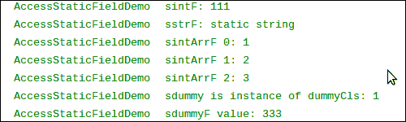

    手机显示将类似于下面的截图:

    

    如图所示，我们在 Java 代码中为字段设置的值可以通过本机代码获得；本机方法设置的值反映在 Java 代码中。

*   **Accessing instance field**: Accessing instance fields is similar to accessing static fields. JNI also provides the following three functions for us:

    ```cpp
    jfieldID GetFieldID(JNIEnv *env, jclass clazz, const char *name, const char *sig);
    <NativeType> Get<Type>Field(JNIEnv *env,jobject obj, jfieldID fieldID);
    void Set<Type>Field(JNIEnv *env, jobject obj, jfieldID fieldID, <NativeType> value);
    ```

    同样，我们需要先获取字段标识，然后才能获取和设置字段的值。我们应该传递对象引用，而不是将类引用传递给`get`和`set`函数。

    用法见原生法 `AccessInstanceFieldDemo`。同样，我们将本机代码中的`get`值打印到 logcat，并在电话 屏幕上显示修改后的字段值。以下屏幕截图显示了 logcat 输出:

    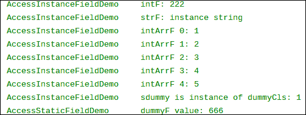

    手机显示将类似于下面的截图:

    

    可以对结果进行类似于访问静态字段的解释。

*   **Reflection support for field**: JNI provides two functions to support the interoperation with the Java Reflection API for `Field`. They have the following prototypes:

    ```cpp
    jfieldID FromReflectedField(JNIEnv *env, jobject field);
    jobject ToReflectedField(JNIEnv *env, jclass cls, jfieldID fieldID, jboolean isStatic);
    ```

    第一个函数将`java.lang.reflect.Field`转换为`jfieldID`，然后我们可以使用前面介绍的`set`和 `get` JNI 函数。参数字段是`java.lang.reflect.Field`的一个实例。

    第二个函数则相反。它接受一个类引用、`jfieldID`和一个`jboolean` 变量，指示它是静态字段还是实例字段。该函数返回对`java.lang.reflect.Field`对象的引用。

    这两个函数的用法在本机方法`FieldReflectionDemo`中演示。我们使用调用者传递的`Field`实例来访问字段值，然后为另一个字段返回一个`Field`实例。在 Java 方法`callFieldReflectionDemo`中，我们将`Field`实例传递给本机代码，并使用返回的`Field`实例到 获取`field`值。本机代码将字段值输出到 logcat，如下所示:

    

    Java 代码在电话屏幕上显示另一个字段的值，如下所示:

    

# 从本机代码调用静态和实例方法

前面的食谱介绍了如何在 NDK 访问 Java 字段。除了字段，Java 类也有方法。本食谱侧重于从 JNI 调用静态 实例方法。

## 做好准备

代码示例要求对 JNI 基元类型、字符串、类和实例对象有基本的了解。在阅读本食谱之前，最好确保您已经阅读了以下食谱:

*   *传递参数并接收原语类型的返回*
*   *在 JNI 操纵琴弦*
*   *在 JNI 操纵班级*
*   *在 JNI 操纵物体*
*   *访问本机代码中的 Java 静态和实例字段*

读者也应该熟悉 Java 反射 API。

## 怎么做…

可以遵循以下步骤来创建一个示例 Android 项目，该项目说明了如何从本机代码调用静态和实例方法:

1.  创建一个名为`CallingMethods`的项目。将包名设置为`cookbook.chapter2`。创建一个名为`CallingMethodsActivity`的活动。在项目下，创建一个名为`jni`的文件夹。有关更多详细说明，请参考本章的*加载本机库和注册本机方法*配方。
2.  在`jni`文件夹下创建一个名为`callmethod.c`的文件，然后实现原生方法`AccessStaticMethodDemo`、`AccessInstanceMethodDemo`和`MethodReflectionDemo`。
3.  通过添加代码来修改`CallingMethodsActivity.java`加载本机库，声明本机方法，并调用它们。
4.  创建一个名为`value`的整数实例字段和名为`value2`的整数静态字段的`Dummy`类。此外，创建一个`DummySub`类，用一个名为`name`的附加字符串字段扩展`Dummy`。
5.  修改布局 XML 文件，添加`Android.mk`构建文件，构建原生库。有关更多详细信息，请参考本章*加载本机库和注册本机方法*配方的步骤 8 至 10。
6.  我们现在准备运行这个项目。我们将 在下一节讨论每种原生方法时呈现输出。

## 它是如何工作的…

这个方法说明了如何从本机代码调用 Java 静态和实例方法:

*   **jmethoded 数据类型**:类似于`jfieldID`，`jmethodID`是指向数据结构的常规 C 指针，细节对开发者隐藏。JNI 提供了将`java.lang.reflect.Method`实例转换为`jmethodID`的功能，反之亦然。
*   **方法描述符**:这是一个修改后的 UTF-8 字符串，用于表示方法的输入(输入参数)数据类型和输出(返回类型)数据类型。方法描述符是通过将其输入参数的所有字段描述符分组在“`()`”、中并附加返回类型的字段描述符而形成的。如果返回类型是`void`，我们应该使用“`V`”。如果没有输入参数，我们应该简单地使用“`()`”，后跟返回类型的字段描述符。对于构造函数，应该使用“`V`”来表示返回类型。下表列出了几个 Java 方法及其对应的方法描述符:

    <colgroup><col style="text-align: left"><col style="text-align: left"></colgroup>
    | 

    Java 方法

     | 

    方法描述符

     |
    | --- | --- |
    |  |  | `(I)V` |
    |  | `(Ljava/lang/String;)V` |

*   **Calling static methods**: JNI provides four sets of functions for native code to call Java methods. Their prototypes are as follows:

    ```cpp
    jmethodID GetStaticMethodID(JNIEnv *env, jclass clazz, const char *name, const char *sig);

    <NativeType> CallStatic<Type>Method(JNIEnv *env, jclass clazz, jmethodID methodID, ...);

    <NativeType> CallStatic<Type>MethodA(JNIEnv *env, jclass clazz, jmethodID methodID, jvalue *args);

    <NativeType> CallStatic<Type>MethodV(JNIEnv *env, jclass clazz,jmethodID methodID, va_list args);
    ```

    第一个函数获取方法标识。它接受对 Java 类的引用`clazz`、修改后的 UTF-8 字符串格式的方法名和方法描述符`sig`。另外三组函数用于调用静态方法。`<Type>`可以是八种原始类型中的任何一种，`Void`或`Object`。表示被调用方法的 返回类型。 `methodID`参数是 `GetStaticMethodID`函数返回的`jmethodID`。Java 方法的参数在`CallStatic<Type>Method`中逐个传递，或者放入`jvalue`的数组中作为`CallStatic<Type>MethodA`，或者放入`va_list`的结构中作为`CallStatic<Type>MethodV`。

    我们用一个原生方法 `AccessStaticMethodDemo`来说明所有四组 JNI 函数的用法。这个方法获取`Dummy`类的`getValue2`和`setValue2`静态方法的方法标识，并使用三种不同的方式调用这两个方法，将参数传递给被调用的 Java 方法。在`CallingMethodsActivity.java`中，我们实现`callAccessStaticMethodDemo`，将`value2`静态字段初始化为`100`，调用原生方法`AccessStaticMethodDemo`，在手机屏幕上打印最终的`value2`值。以下屏幕截图显示了 logcat 输出:

    

    屏幕输出类似于下面截图中的 :

    

    如图所示，原生方法首先将`value2`设为`100`，然后使用三个不同的 JNI 函数调用`set`方法来修改该值。最后，手机显示屏显示最终修改值反映在 Java 代码中。

*   *Calling instance methods*: Calling instance methods from the native code is similar to calling static methods. JNI also provides four sets of functions as follows:

    ```cpp
    jmethodID GetMethodID(JNIEnv *env, jclass clazz, const char *name, const char *sig);

    <NativeType> Call<Type>Method(JNIEnv *env, jobject obj, jmethodID methodID, ...);

    <NativeType> Call<Type>MethodA(JNIEnv *env,jobject obj, jmethodID methodID, jvalue *args);

    <NativeType> Call<Type>MethodV(JNIEnv *env, jobject obj, jmethodID methodID, va_list args);
    ```

    这四组函数的用法类似于 JNI 函数调用静态方法的用法，只是我们需要传递对实例对象的引用，而不是类。此外，JNI 还提供了另外三组调用实例方法的函数，如下所示:

    ```cpp
    <NativeType> CallNonvirtual<Type>Method(JNIEnv *env, jobject obj, jclass clazz, jmethodID methodID, ...);

    <NativeType> CallNonvirtual<Type>MethodA(JNIEnv *env, jobject obj, jclass clazz, jmethodID methodID, jvalue *args);

    <NativeType> CallNonvirtual<Type>MethodV(JNIEnv *env, jobject obj, jclass clazz, jmethodID methodID, va_list args);
    ```

    与前面的三组函数相比，这三组方法接受了一个额外的参数`clazz`。 `clazz`参数可以引用`obj`实例化的类，或者`obj`的超类。一个典型的用例是调用类上的`GetMethodID`来获得一个`jmethodID`。我们有一个对类的子类的对象的引用，然后我们可以使用前面的函数来调用由`jmethodID`与 对象引用相关联的 Java 方法。

    所有七组函数的用法在一个本地方法`AccessInstanceMethodDemo`中说明。我们使用前四组函数来调用带有对象的`DummySub`类的 `getName`和 `setName`方法。然后我们使用`CallNonvirtual<Type>Method`调用`getValue` 和 `setValue`方法，这些方法在`Dummy`超类中定义。在`CallingMethodsActivity.java`中，我们实现了`callAccessInstanceMethodDemo` 方法来调用`AccessInstanceMethodDemo`原生方法。以下屏幕截图显示了 logcat 输出:

    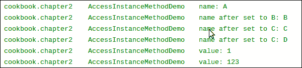

    结果显示，`getName`、`setName`、`getValue`和`setValue`方法执行成功。

*   **Reflection support for method**: Similar to fields, JNI also provides the following two functions to support reflection:

    ```cpp
    jmethodID FromReflectedMethod(JNIEnv *env, jobject method);

    jobject ToReflectedMethod(JNIEnv *env, jclass cls, jmethodID methodID, jboolean isStatic);
    ```

    第一个函数接受对`java.lang.reflect.Method`实例的引用，并返回其对应的`jmethodID`。返回的`jmethodID` 值可以用来调用相关的 Java 方法。第二个函数则相反。它接受对 Java 类、`jmethodID`和`jboolean`的引用，指示它是否是静态方法，并返回对`java.lang.reflect.Method`的引用。返回值可以在 Java 代码中用来访问相应的方法。

    我们用原生方法`MethodReflectionDemo`来说明这两个 JNI 函数。在`CallingMethodsActivity.java`中，我们实现`callMethodReflectionDemo` 方法，将`getValue` 的`java.lang.reflect.Method`对象传递给原生代码，得到返回的`setValue java.lang.reflect.Method`对象，用返回的对象调用`setValue`方法。

    本机方法将`getValue`方法的返回值输出到 logcat，如下所示:

    

    Java 代码在手机屏幕上显示调用`setValue`前后的`getValue` 方法返回值如下:

    

    不出所料，本机代码可以用从 Java 代码传来的`Method`对象访问`getValue`方法，Java 代码可以用本机方法返回的`Method`对象 调用`setValue` 方法。

# 缓存 jfieldID、jmethodID 和引用数据以提高性能

这个配方涵盖了安卓 JNI 系统中的缓存，可以提高我们的原生代码的性能。

## 做好准备

在看这个食谱之前，你应该确定你已经阅读了下面的食谱:

*   *访问本机代码中的 Java 静态和实例字段*
*   *从本机代码调用静态和实例方法*

## 怎么做…

以下步骤详细介绍了如何在 JNI 构建一个演示缓存的示例安卓应用程序:

1.  创建一个名为`Caching`的项目。将包名设置为`cookbook.chapter2`。创建一个名为`CachingActivity`的活动。在项目下，创建一个名为`jni`的文件夹。有关更多详细说明，请参考本章的*加载本机库和注册本机方法*配方。
2.  在`jni`文件夹下创建一个名为`cachingtest.c`的文件，然后实现`InitIDs`、`CachingFieldMethodIDDemo1`、`CachingFieldMethodIDDemo2`和`CachingReferencesDemo`方法。
3.  通过添加代码来修改`CachingActivity.java`文件，加载本机库，然后声明并调用本机方法。
4.  修改布局 XML 文件，添加`Android.mk`构建文件，构建原生库。有关详细信息，请参考本章*加载本机库和注册本机方法*配方的步骤 8 至 10。
5.  在安卓设备或模拟器上运行该项目，并使用 eclipse 或终端中的`adb logcat -v time`命令监控 logcat 输出。
6.  At the `onCreate` method of `CachingActivity.java`, enable the `callCachingFieldMethodIDDemo1` method and disable the other demo methods. Start the Android application, and you should be able to see the following at logcat:

    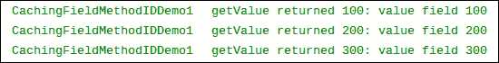

7.  Enable `callCachingFieldMethodIDDemo2` at `CachingActivity.java` while disabling the other demo methods and `InitIDs` method (at the static initializer). Start the Android application, and you should be able to see the following at logcat:

    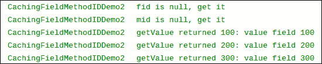

8.  Enable `callCachingReferencesDemo` at `CachingActivity.java` while commenting out other demo methods. Start the Android application, and you should be able to see the following at logcat:

    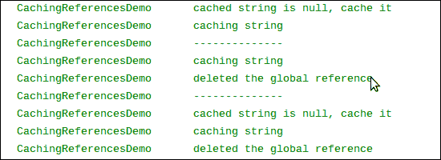

## 它是如何工作的…

本食谱讨论了在 JNI 缓存的使用:

*   **Caching field and method IDs**: Field and method IDs are internal pointers. They're required to access a Java field or making native to Java method calls. Obtaining the field or method ID requires calling pre-defined JNI functions, which do symbolic lookups according to the name and descriptor. The lookup process typically requires several string comparisons and is relatively expensive.

    一旦获得了字段或方法标识，访问字段或进行本机 Java 调用就相对较快了。因此，一个好的做法是只执行一次查找并缓存字段或方法标识。

    有两种方法可以缓存字段和方法标识。第一种方法缓存在类初始化器中。在 Java 中，我们可以有类似于下面的东西:

    ```cpp
    private native static void InitIDs();
    static {
        System.loadLibrary(<native lib>);
        InitIDs();
    }
    ```

    静态初始值设定项保证在类的任何方法之前执行。因此，我们可以确保本机方法所需的标识在被调用时有效。这种方法的用法在`InitIDs`和`CachingFieldMethodIDDemo1`本地方法和`CachingActivity.java`中有所说明。

    第二种方法在使用时缓存标识。我们将字段或方法标识存储在静态变量中，以便下次调用本机方法时该标识有效。这种方法的用法在原生方法`CachingFieldMethodIDDemo2`和`CachingActivity.java`中进行了演示。

    比较这两种方法，首选第一种。首先，它不需要在使用之前对标识进行有效性检查，因为静态初始化器总是首先被调用，因此标识在调用本机方法之前总是有效的。其次，如果类被卸载，缓存的 id 将无效。如果使用第二种方法，我们将需要确保该类不会再次被卸载和加载。如果使用第一种方法，当类再次加载时，会自动调用静态初始化器，所以我们永远不用担心类 再次被卸载和加载。

*   **Caching references**: JNI exposes classes, instance objects, strings, and arrays as references. We covered how to manage references in the *Managing references at JNI* recipe. Sometimes, caching references can also improve performance. Unlike field and method IDs, which are direct pointers, references are implemented using an indirect mechanism that is hidden from developers. Therefore, we need to rely on JNI functions to cache them.

    为了缓存引用数据，我们需要使其成为全局引用或弱全局引用。一个 **全局引用**保证引用在被明确删除之前是有效的。而**弱全局**引用允许底层对象被垃圾收集。因此，我们需要在使用它之前进行有效性检查。

    本机方法`CachingReferencesDemo`演示了如何缓存字符串引用。请注意，虽然`DeleteGlobalRef`使全局引用无效，但它不会将`NULL`分配给引用。我们需要手动操作。

# 在 JNI 检查错误和处理异常

JNI 函数可能会因为系统约束(例如， 内存不足)或无效参数(例如，当函数需要一个 UTF-16 字符串时，传递一个本机 UTF-8 字符串)而失败。这个食谱讨论了如何处理 JNI 编程中的错误和异常。

## 做好准备

在继续本食谱之前，应先阅读以下食谱:

*   *在 JNI 操纵琴弦*
*   *管理 JNI 的推荐人*
*   *访问本机代码中的 Java 静态和实例字段*
*   *从本机代码调用静态和实例方法*

## 怎么做…

按照以下步骤创建一个示例安卓项目，说明 JNI 的错误和异常处理:

1.  创建一个名为`ExceptionHandling`的项目。将包名设置为`cookbook.chapter2`。创建一个名为`ExceptionHandlingActivity`的活动。在项目下，创建一个名为`jni`的文件夹。有关更多详细说明，请参考本章的*加载本机库和注册本机方法*配方。
2.  在 j `n` i 文件夹下创建一个名为`exceptiontest.c`的文件，然后实现`ExceptionDemo`和`FatalErrorDemo`方法。
3.  通过添加代码来修改`ExceptionHandlingActivity.java`文件，加载本机库，然后声明并调用本机方法。
4.  修改布局 XML 文件，添加`Android.mk`构建文件，构建原生库。有关更多详细信息，请参考本章的*加载本机库和注册本机方法*方法的步骤 8 至 10。
5.  我们现在准备运行这个项目。在下一节中，我们将在讨论每个本机方法的同时展示输出。

## 它是如何工作的…

本食谱讨论了 JNI 的错误检查和 异常处理:

*   **Check for errors and exceptions**: Many JNI functions return a special value to indicate failure. For example, the `FindClass` function returns `NULL` to indicate it failed to load the class. Many other functions do not use the return value to signal failure; instead an exception is thrown.

    ### 类型

    除了 JNI 函数，本机代码调用的 Java 代码也可能引发异常。为了编写健壮的本机代码，我们应该确保检查这种情况。

    对于第一组函数，我们可以简单地检查返回值，看看是否发生了错误。对于第二组函数，JNI 定义了两个函数来检查异常，如下所示:

    ```cpp
    jboolean ExceptionCheck(JNIEnv *env);
    jthrowable ExceptionOccurred(JNIEnv *env);
    ```

    第一个函数返回`JNI_TRUE`表示发生异常，否则返回`JNI_FALSE`。第二个函数返回对异常的局部引用。当使用第二个函数时，可以调用一个附加的 JNI 函数来检查异常的细节:

    ```cpp
    void ExceptionDescribe(JNIEnv *env);
    ```

    该函数将异常和堆栈的回溯打印到 logcat。

    在原生方法 `ExceptionDemo`中，我们使用了两种方法来检查异常的发生和 `ExceptionDescribe`来打印出异常细节。

*   **Handle errors and exceptions**: Exceptions at JNI are different from Java exceptions. At Java, when an error occurs, an exception object is created and handed to the runtime. The runtime then searches the call stack for an exception handler that can handle the exception. The search starts at the method where the exception occurred and proceeds in the reverse order in which the methods are called. When such a code block is found, the runtime handles the control to the exception handler. The normal control flow is therefore interrupted. In contrast, JNI exception doesn't change the control flow, and we'll need to explicitly check for exception and handle it properly.

    通常有两种方法来处理异常。第一种方法是释放在 JNI 分配的资源并返回。这将把处理异常的责任留给本机方法的调用方。

    第二种做法是清除异常并 继续执行。这是通过以下 JNI 函数调用完成的:

    ```cpp
    void ExceptionClear(JNIEnv *env);
    ```

    在原生方法`ExceptionDemo`中，我们使用第二种方法清除`java.lang.NullPointerException`，第一种方法将`java.lang.RuntimeException`返回给调用者，这就是位于`ExceptionHandlingActivity.java`的 Java 方法`callExceptionDemo`。

    当异常挂起时，并非所有的 JNI 函数都可以安全调用。存在待定异常时，允许使用以下功能:

    *   `DeleteGlobalRef`
    *   `DeleteLocalRef`
    *   `DeleteWeakGlobalRef`
    *   `ExceptionCheck`
    *   `ExceptionClear`
    *   `ExceptionDescribe`
    *   `ExceptionOccurred`
    *   `MonitorExit`
    *   `PopLocalFrame`
    *   `PushLocalFrame`
    *   `Release<PrimitiveType>ArrayElements`
    *   `ReleasePrimitiveArrayCritical`
    *   `ReleaseStringChars`
    *   `ReleaseStringCritical`
    *   `ReleaseStringUTFChars`

    它们基本上是异常检查和处理函数，或者清除本机代码中分配的资源的函数。

    ### 注

    当异常挂起时，调用此处列出的函数之外的 JNI 函数可能会导致意外的结果。我们应该正确处理待定的异常，然后继续。

*   **Throw exceptions in the native code**: JNI provides two functions to throw an exception from native code. They have the following prototypes:

    ```cpp
    jint Throw(JNIEnv *env, jthrowable obj);
    jint ThrowNew(JNIEnv *env, jclass clazz, const char *message);
    ```

    第一个函数接受对 `jthrowable`对象的引用并抛出异常，而第二个函数接受对异常类的引用。它将创建一个带有消息参数的`clazz`类的异常对象 ，并将其抛出。

    在`ExceptionDemo`原生方法中，我们用 `ThrowNew`函数抛出`java.lang.NullPointerException`，用一个`Throw`函数抛出`java.lang.RuntimeException`。

    以下 logcat 输出指示如何检查、清除和抛出异常:

    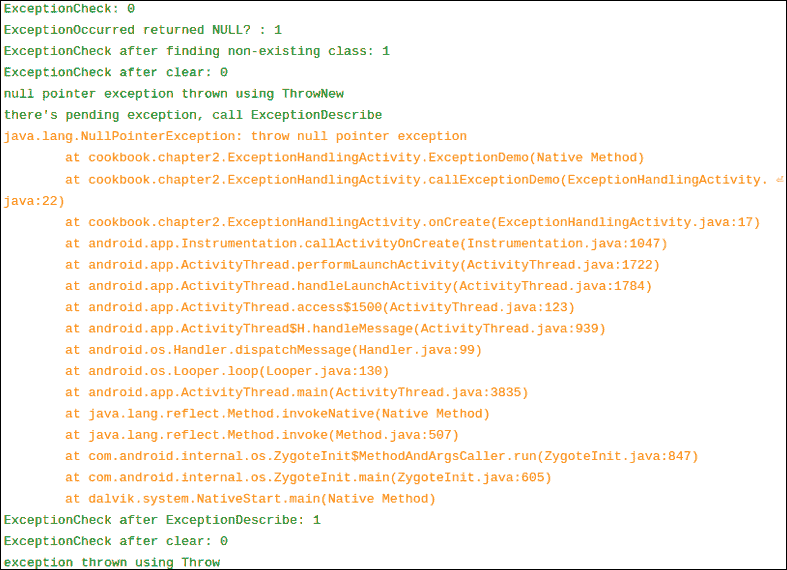

    最后一个异常不会在本机方法中清除。在 Java 代码中，我们捕捉到异常，并在手机屏幕上显示消息 :

    

*   **Fatal error**: A special type of error is the fatal error, which is not recoverable. JNI defines a function `FatalError`, as follows, to raise a fatal error:

    ```cpp
    void FatalError(JNIEnv *env, const char *msg);
    ```

    该函数接受一条消息并将其打印到 logcat。此后，应用程序的虚拟机实例终止。我们在原生方法`FatalErrorDemo`和 Java 方法`callFatalErrorDemo`中演示了这个函数的用法。以下输出在 logcat 上捕获:

    

    请注意，`FatalError`函数之后的代码永远不会执行，无论是本机代码还是 Java 代码都不会，因为 `FatalError`永远不会返回，并且 VM 实例被终止。在我的安卓设备上，这并没有导致安卓应用崩溃，而是 导致应用冻结。

## 还有更多...

安卓 JNI 编程目前不支持 C++异常。换句话说，本机 C++异常不会通过 JNI 传播到 Java 世界。因此，我们应该在 C++代码中处理 C++异常。或者，我们可以编写一个 C 包装器来抛出一个异常或向 Java 返回一个错误代码。

# 在 JNI 集成汇编代码

安卓 NDK 允许你在 JNI 编程时编写汇编代码。汇编代码有时用于优化代码的关键部分，以达到 的最佳性能。本食谱不打算讨论如何在汇编中编程。它描述了如何在 JNI 编程中集成汇编代码。

## 做好准备

继续之前，阅读*传递参数和接收原始类型*配方的返回。

## 怎么做…

以下步骤创建了一个集成了汇编代码的示例安卓项目:

1.  创建一个名为`AssemblyInJNI`的项目。将包名设置为`cookbook.chapter2`。创建一个名为`AssemblyInJNIActivity`的活动。在项目下，创建一个名为`jni`的文件夹。有关更多详细说明，请参考本章的*加载本机库和注册本机方法*配方。
2.  在`jni`文件夹下创建一个名为`assemblyinjni.c`的文件，然后执行`InlineAssemblyAddDemo` 方法。
3.  在`jni`文件夹下创建一个名为`tmp.c`的文件，实现原生方法`AssemblyMultiplyDemo`。使用以下命令将`tmp.c`代码编译到名为`AssemblyMultiplyDemo.s`的汇编源文件中:

    ```cpp
    $ $ANDROID_NDK/toolchains/arm-linux-androideabi-4.4.3/prebuilt/linux-x86/bin/arm-linux-androideabi-gcc -S tmp.c -o AssemblyMultiplyDemo.s --sysroot=$ANDROID_NDK/platforms/android-14/arch-arm/
    ```

4.  通过添加代码来修改`AssemblyInJNIActivity.java`文件，加载本机库，然后声明并调用本机方法。
5.  修改布局 XML 文件，添加`Android.mk`构建文件，构建原生库。有关详细信息，请参考本章*加载本机库和注册本机方法*配方的步骤 8 至 10。
6.  At `AssemblyInJNIActivity.java`, enable the `callInlineAssemblyAddDemo` native method and disable the `callAssemblyMultiplyDemo` method. Run the project on an Android device or emulator. The phone display should look similar to the following screenshot:

    

7.  At `AssemblyInJNIActivity.java`, enable the `callAssemblyMultiplyDemo` native method and disable the `callInlineAssemblyAddDemo` method. Run the project on an Android device or emulator. The phone display should look similar to the following screenshot:

    

## 它是如何工作的…

这个方法演示了如何使用汇编代码来实现一个本机方法:

*   **C 代码处的内联汇编**:我们可以为安卓 NDK 开发编写内联汇编代码。这在原生方法`InlineAssemblyAddDemo`中有说明。
*   **Generating a separate assembly code**: One approach to write assembly code is to write the code in C or C++, and use a compiler to compile the code into assembly code. Then, we optimize based on the auto-generated assembly code. Since this recipe is not about writing code in an assembly language, we use the Android NDK cross compiler to generate a native method `AssemblyMultiplyDemo` and call it from the Java method `callAssemblyMultiplyDemo`.

    我们首先在`AssemblyMultiplyDemo.c`中编写原生方法`AssemblyMultiplyDemo`，然后使用编译器和安卓 NDK 交叉编译代码，使用如下:

    ```cpp
    $ $ANDROID_NDK/toolchains/arm-linux-androideabi-4.4.3/prebuilt/linux-x86/bin/arm-linux-androideabi-gcc -S <c_file_name>.c -o <output_file_name>.s --sysroot=$ANDROID_NDK/platforms/android-<level>/arch-<arch>/
    ```

    在前面的命令中，`$ANDROID_NDK`是一个指向安卓 NDK 位置的环境变量。如果你遵循了[第 1 章](01.html "Chapter 1. Hello NDK")、*你好 NDK* 中的食谱，那么这个应该配置正确。否则，您可以将其替换为您的安卓 NDK 位置的完整路径(例如，在我的电脑中，路径为`/home/roman10/Desktop/android/android-ndk-r8`)。`<level>`表示目标安卓版本。在中，我们使用了`14`。`<arch>`表示建筑；我们使用了`arm`。如果我们为 x86 等其他架构构建一个应用，那么这个应该是`x86`。`-S`选项告诉交叉编译器将`<c_file_name>.c`文件编译成汇编代码，但不要汇编或链接。`-o`选项告诉编译器 将汇编代码输出到文件`<output_file_name>.s`中。如果没有出现这样的选项，编译器输出到名为`<c_file_name>.s`的文件。

*   **编译汇编代码**:编译汇编代码就像编译 C/C++源代码一样。如`Android.mk`文件所示，我们简单的将装配文件列为源文件如下:

    ```cpp
    LOCAL_SRC_FILES := AssemblyMultiplyDemo.s assemblyinjni.c
    ```