# 四、安卓 NDK

在这一章中，我们将涵盖以下食谱:

*   用 OpenGL ES 1.x API 绘制 2D 图形并应用变换
*   用 OpenGL ES 1.x API 绘制三维图形并点亮场景
*   使用 OpenGL ES 1.x 应用编程接口将纹理映射到三维对象
*   用 OpenGL ES 2.0 应用编程接口绘制三维图形
*   用 EGL 显示图形

# 简介

**开放图形库** ( **OpenGL** )是一个跨平台的行业标准 API，用于制作 2D 和 3D 图形。它为图形硬件或软件图形引擎指定了独立于语言的软件接口。 **OpenGL ES** 是嵌入式设备 OpenGL 的一种味道。它由 OpenGL 规范的子集和一些特定于 OpenGL ES 的附加扩展组成。

OpenGL ES 不需要专用的图形硬件就能工作。不同的设备可以配备具有不同处理能力的图形硬件。OpenGL ES 调用的工作负载在中央处理器和图形硬件之间分配。完全从 CPU 支持 OpenGL ES 是可能的。但是，图形硬件可以根据其处理能力在不同级别上提高性能。

在我们深入安卓 NDK OpenGL ES 之前，先简单介绍一下中**图形渲染管道** ( **GRP** )的 OpenGL 上下文是必要的。GRP 是指图形硬件产生图形所需的一系列处理阶段。它接受以图元顶点表示的对象描述(**图元是指简单的几何形状，如点、线和三角形)，并输出显示器上像素的颜色值。大致可以分为以下四个主要阶段:**

 **1.  **顶点处理**:接受图形模型描述，对单个顶点进行处理和变换，然后将 投影到屏幕上，并结合它们的信息对**图元**进行进一步处理。
2.  **栅格化**:将图元转换为 碎片。一个 **片段**包含在帧缓冲器中生成像素数据所必需的数据。请注意，只有受一个或多个图元影响的像素才会有碎片。片段包含栅格位置、深度、插值颜色和纹理坐标等信息。
3.  **碎片处理**:处理每个 碎片。对每个片段应用一系列操作，包括 alpha 测试、纹理映射等。
4.  **输出合并**:结合所有片段 生成 2D 显示的颜色值(包括 alpha)。

在现代计算机图形硬件中，顶点处理和碎片处理是可编程的。我们可以编写程序来执行自定义变换以及顶点和片段的处理。相反，光栅化和输出合并是可配置的，但不是可编程的。

前面的每个阶段可以由一个或多个步骤组成。 OpenGL ES 1.x 和 OpenGL ES 2.0 提供不同的 grp。具体来说，OpenGL ES 1.x 提供了一个固定的函数管道，我们在这里输入图元和纹理数据，设置光照，剩下的由 OpenGL ES 来处理。相比之下，OpenGL ES 2.0 提供了一个可编程的管道，允许我们用 **OpenGL ES 着色语言** ( **GLSL** ) 编写顶点和片段着色器来处理细节。

下图显示了 OpenGL ES 1.x 的固定 功能管道:

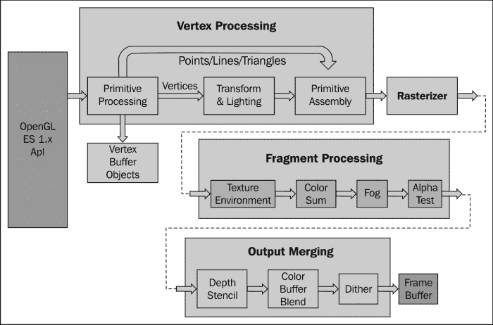

下图是 OpenGL ES 2.0 的 可编程流水线的另一个示意图:

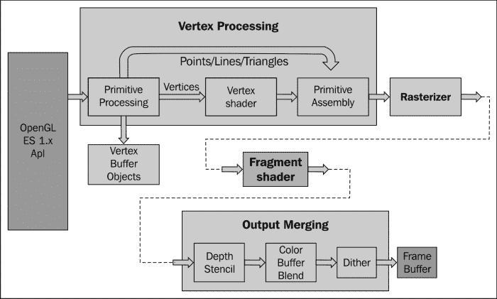

如上图所示，OpenGL ES 1.x 中的固定管道已经被 OpenGL ES 2.0 中的可编程着色器所取代。

随着计算机图形学的引入，我们现在准备开始我们的安卓 NDK OpenGL ES 编程之旅。安卓 NDK 同时提供了 OpenGL ES 1 . x(1.0 版和 1.1 版)和 OpenGL ES 2.0 库，两者差别很大。下表总结了在考虑在我们的安卓应用中使用 OpenGL ES 版本时需要考虑的因素:

<colgroup><col style="text-align: left"> <col style="text-align: left"> <col style="text-align: left"></colgroup> 
|   | 

OpenGL 1.x

 | 

OpenGL 2.0

 |
| --- | --- | --- |
| **表演**T2】 | 快速 2D 和 3D 图形。 | 这取决于安卓设备，但总的来说，它提供了更快的 2D 和 3D 图形。 |
| **设备兼容性** | 几乎所有安卓设备。 | 大多数安卓设备，而且还在增加。 |
| **编码便利性** | 功能方便的固定管道。简单的 3D 应用易于使用。 | 简单的三维应用可能不需要内置的基本功能和更多的努力。 |
| **图形控制** | 固定管道。难以或不可能创建一些效果(例如，卡通阴影)。 | 可编程流水线。更直接的控制图形处理流水线来创造一定的效果。 |

### 类型

所有安卓设备都支持 OpenGL ES 1.0，因为安卓自带支持 1.0 的软件图形引擎，可以在没有相应图形硬件的设备上使用。OpenGL ES 1.1 和 OpenGL ES 2.0 仅在具有相应 **图形处理单元** ( **GPU** )的设备上支持。

本章将涵盖安卓 NDK 系统中的 OpenGL 1.x 和 OpenGL ES 2.0 应用编程接口。我们首先演示了如何使用 OpenGL 1.x 应用编程接口绘制 2D 和 3D 图形。变换，照明和纹理映射也包括在内。然后我们在 NDK 介绍了 OpenGL 2.0 API。最后，我们描述如何用 EGL 显示图形。本章介绍了计算机图形学的一些基础知识和 OpenGL 的原理。已经熟悉 OpenGL ES 的读者可以跳过这些部分，专注于如何从 Android NDK 调用 OpenGL ES API。

我们将为本章中涉及的每个食谱提供一个示例安卓应用。由于篇幅限制，我们无法展示书中所有的源代码。强烈建议读者下载代码，并在阅读本章时参考它。

# 用 OpenGL ES 1.x API 绘制 2D 图形并应用变换

本食谱通过实例介绍了 OpenGL ES 1.x 中的 2D 绘图。 为了绘制 2D 对象，我们还将通过`GLSurfaceView`描述 OpenGL 渲染显示，给它们添加颜色，并进行变换。

## 做好准备

建议读者阅读本章的介绍，这对理解本食谱中的一些内容至关重要。

## 怎么做...

以下步骤创建了我们的示例安卓 NDK 项目:

1.  创建一个名为`TwoDG1`的安卓应用。将包名设置为`cookbook.chapter4.gl1x`。如需更多详细说明，请参考[第二章](02.html "Chapter 2. Java Native Interface")、 *Java 原生接口*中的*加载原生库和注册原生方法*食谱。
2.  在 Eclipse 中右键点击`TwoDG1`项目，选择**安卓工具** | **添加原生支持**。
3.  在`cookbook.chapter4.gl1x`包下添加以下三个 Java 文件:
    *   `MyActivity.java`:创建本项目的活动:

        ```cpp
        import android.opengl.GLSurfaceView;
        ……
        public class MyActivity extends Activity {
          private GLSurfaceView mGLView;
          @Override
          public void onCreate(Bundle savedInstanceState) {
            super.onCreate(savedInstanceState);
            mGLView = new MySurfaceView(this);
                   setContentView(mGLView);
          }
        }
        ```

    *   `MySurfaceView.java`:扩展了`GLSurfaceView`，为显示 OpenGL 渲染提供了专用的曲面:

        ```cpp
        public class MySurfaceView extends GLSurfaceView {
          private MyRenderer mRenderer;
          public MySurfaceView(Context context) {
            super(context);
            mRenderer = new MyRenderer();
            this.setRenderer(mRenderer);
            this.setRenderMode(GLSurfaceView.RENDERMODE_WHEN_DIRTY);
          }
        }
        ```

    *   `MyRenderer.java`:它 实现`Renderer`，调用原生方法:

        ```cpp
        public class MyRenderer implements GLSurfaceView.Renderer{
          @Override
          public void onSurfaceCreated(GL10 gl, EGLConfig config) {
            naInitGL1x();
          }
          @Override
          public void onDrawFrame(GL10 gl) {
            naDrawGraphics();
          }
          @Override
          public void onSurfaceChanged(GL10 gl, int width, int height) {
            naSurfaceChanged(width, height);
          }
          ......
        }
        ```

4.  Add the `TwoDG1.cpp`, `Triangle.cpp`, `Square.cpp`, `Triangle.h`, and `Square.h` files under the `jni` folder. Please refer to the downloaded project for the complete content. Here, we only list some important parts of the code:

    `TwoDG1.cpp`:由设置 OpenGL ES 1.x 环境并执行转换的代码组成:

    ```cpp
    void naInitGL1x(JNIEnv* env, jclass clazz) {
      glDisable(GL_DITHER);  
      glHint(GL_PERSPECTIVE_CORRECTION_HINT, GL_FASTEST);
      glClearColor(0.0f, 0.0f, 0.0f, 1.0f);    glShadeModel(GL_SMOOTH);    }

    void naSurfaceChanged(JNIEnv* env, jclass clazz, int width, int height) {
      glViewport(0, 0, width, height);
      float ratio = (float) width / (float)height;
      glMatrixMode(GL_PROJECTION);
      glLoadIdentity();
      glOrthof(-ratio, ratio, -1, 1, 0, 1);  }

    void naDrawGraphics(JNIEnv* env, jclass clazz) {
      glClear(GL_COLOR_BUFFER_BIT);
      glMatrixMode(GL_MODELVIEW);
      glLoadIdentity();
      glTranslatef(0.3f, 0.0f, 0.0f);    //move to the right
      glScalef(0.2f, 0.2f, 0.2f);        // Scale down
      mTriangle.draw();
      glLoadIdentity();
      glTranslatef(-0.3f, 0.0f, 0.0f);    //move to the left
      glScalef(0.2f, 0.2f, 0.2f);      // Scale down
    glRotatef(45.0, 0.0, 0.0, 1.0);  //rotate
      mSquare.draw();
    }
    ```

    `Triangle.cpp`:画了一个 2D 三角:

    ```cpp
    void Triangle::draw() {
      glEnableClientState(GL_VERTEX_ARRAY);
      glVertexPointer(3, GL_FLOAT, 0, vertices);
      glColor4f(0.5f, 0.5f, 0.5f, 0.5f);      //set the current color
      glDrawArrays(GL_TRIANGLES, 0, 9/3);
      glDisableClientState(GL_VERTEX_ARRAY);
    }
    ```

    `Square.cpp`:画了一个 2D 广场:

    ```cpp
    void Square::draw() {
      glEnableClientState(GL_VERTEX_ARRAY);
      glEnableClientState(GL_COLOR_ARRAY);
      glVertexPointer(3, GL_FLOAT, 0, vertices);
      glColorPointer(4, GL_FLOAT, 0, colors);
      glDrawElements(GL_TRIANGLES, 6, GL_UNSIGNED_BYTE, indices);
      glDisableClientState(GL_VERTEX_ARRAY);
      glDisableClientState(GL_COLOR_ARRAY);
    }
    ```

5.  在`jni` 文件夹下添加`Android.mk`文件，内容如下:

    ```cpp
    LOCAL_PATH := $(call my-dir)
    include $(CLEAR_VARS)
    LOCAL_MODULE    := TwoDG1
    LOCAL_SRC_FILES := Triangle.cpp Square.cpp TwoDG1.cpp
    LOCAL_LDLIBS := -lGLESv1_CM -llog
    include $(BUILD_SHARED_LIBRARY)
    ```

6.  Build the Android NDK application and run it on an Android device. The following is a screenshot of the display:

    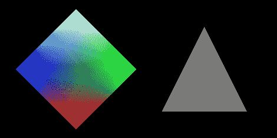

## 它是如何工作的...

这个食谱展示了用 OpenGL ES 绘制的基本 2D 图。

### 通过 GLSurfaceView 进行 OpenGL ES 渲染显示

`GLSurfaceView`和`GLSurfaceView.Renderer`是安卓 SDK 提供的两个显示 OpenGL ES 图形的基础类。

`GLSurfaceView`接受用户定义的`Renderer`对象，由 进行实际渲染。它经常被扩展到处理触摸事件，这将在下一个食谱中说明。它支持按需和连续渲染。在我们的示例代码中，我们只需设置`Renderer`对象并将渲染模式配置为按需。

`GLSurfaceView.Renderer`是渲染器的接口。需要用它实现三种方法:

*   `onSurfaceCreated`:设置 OpenGL ES 环境时调用一次。
*   `onSurfaceChanged`:如果视图的几何形状发生变化，就叫它；最常见的例子是设备屏幕方向的改变。
*   `onDrawFrame`:每次重绘视图时调用。

在我们的示例项目中，`MyRenderer.java`是一个简单的包装器，而实际工作是用本机 C++代码完成的。

### 在 OpenGL ES 中绘制对象

在 OpenGL ES 中绘制对象常用两种方法，包括`glDrawArrays`和`glDrawElements`。我们分别在`Triangle.cpp`和`Square.cpp`演示了这两种方法的用法。请注意，这两种方法都需要启用`GL_VERTEX_ARRAY`。

第一个参数是绘制模式，它指示要使用的图元。在我们的示例代码中，我们使用了`GL_TRIANGLES`，这意味着我们实际上绘制了两个三角形来形成正方形。安卓 NDK OpenGL ES 中的其他有效值包括`GL_POINTS`、`GL_LINES`、`GL_LINE_LOOP`、`GL_LINE_STRIP`、`GL_TRIANGLE_STRIP`和`GL_TRIANGLE_FAN`。

### OpenGL ES 中的颜色

我们还演示了两种为对象添加颜色的方法。 在`Triangle.cpp`中，我们通过`glColor4f` API 调用设置当前颜色。在`Square.cpp`中，我们启用`GL_COLOR_ARRAY`，并使用`glColorPointer`定义一组颜色。颜色数组将由`glDrawElements`(使用`glDrawArrays`也可以)API 调用使用。

### OpenGL ES 变换

下图说明了 OpenGL ES 1.0 中不同的变换阶段:

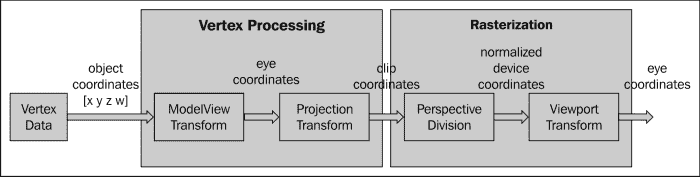

如图所示，顶点数据在栅格化之前被转换。这些变换类似于用相机拍照:

*   **ModelView 变换**:布置场景 放置摄像头
*   **投影变换**:选择一个相机镜头，T3】调整变焦因子
*   **视点变换**:确定 最终照片有多大

**模型视图变换**实际上是指两种不同的变换，即模型变换和视图变换。**模型变换** 是指将所有对象从其对象空间(也称为局部空间或模型空间)转换为世界空间的过程，世界空间由所有对象共享。这个变换是通过一系列缩放(`glScalef`)、旋转(`glRotatef`)和平移(`glTranslatef`)来完成的。

*   `glScalef`:拉伸、收缩或反射物体。x 轴、y 轴和 z 轴的值乘以相应的 x、y 和 z 比例因子。在我们的示例代码中，我们调用了`glScalef(0.2f, 0.2f, 0.2f)`来缩小三角形和正方形，以便它们能够适合屏幕。
*   `glRotatef`:从原点到指定点(x，y，z)的方向，逆时针 旋转物体。旋转角度以度为单位。在我们的示例代码中，我们将`glRotatef(45.0, 0.0, 0.0, 1.0)`称为 将正方形围绕 z 轴旋转 45 度。
*   `glTranslatef`:它沿着每个轴按照给定的 值移动一个对象。在我们的示例代码中，我们调用`glTranslatef(0.3f, 0.0f, 0.0f)`将三角形向右移动，`glTranslatef(-0.3f, 0.0f, 0.0f)`将正方形向左移动，这样它们就不会重叠。

模型变换在场景中排列对象，而视图变换更改查看相机的位置。为了产生特定的图像，我们可以移动物体或者改变我们的相机位置。因此，OpenGL ES 在内部使用一个矩阵来执行这两个转换——即+ `GL_MODELVIEW`矩阵。

### 类型

OpenGL ES 定义相机默认在眼睛坐标空间的原点(0，0，0)，瞄准负 z 轴。在安卓软件开发工具包可以通过`GLU.gluLookAt`改变位置。然而，安卓 NDK 没有相应的应用编程接口。

**投影变换**确定可以看到什么(类似于选择相机镜头和变焦因子)以及顶点数据如何投影到屏幕上。OpenGL ES 支持两种投影模式，分别是透视投影(`glFrustum`)和正投影(`glOrtho`)。 **透视投影**让更远的物体变小，与普通相机匹配。另一方面， **正投影**类似于望远镜，在不影响物体大小的情况下直接映射物体。OpenGL ES 通过`GL_PROJECTION`矩阵操纵变换。项目变换后，剪切体积之外的对象将被剪切掉，并且不会在最终场景中绘制。在我们的示例项目中，我们调用 `glOrthof(-ratio, ratio, -1, 1, 0, 10)`来指定观看体积，其中`ratio`是指屏幕的宽高比。

投影变换后，通过将剪辑坐标除以输入顶点的变换后的`w`值来进行透视分割。x 轴、y 轴和 z 轴的值将被标准化为介于`-1.0`和`1.0`之间的范围。

OpenGL ES 变换管道的最后阶段是视口变换，它将规范化的设备坐标映射到窗口坐标(以像素为单位，原点在左上角)。请注意，一个视点还包含一个 z 组件，这是一些情况所需要的，比如两个重叠的 OpenGL 场景的排序，可以通过`glDepthRange` API 调用进行设置。应用通常需要通过 `glViewport` API 调用在显示大小发生变化时设置视口。在我们的例子中，我们通过调用`glViewport(0, 0, width, height)`将视口设置为整个屏幕。该设置与`glOrthof`调用一起，将在投影变换后保持对象的比例，如下图所示:

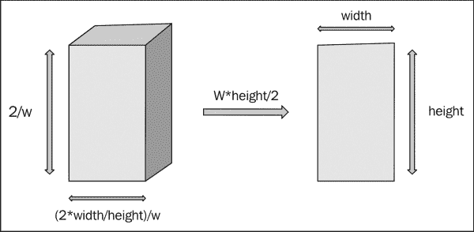

如图所示，裁剪体积设置为(-宽度/高度，宽度/高度，-1，1，0，1)。透视分割时，顶点被`w`分割。在视点变换时，x 和 y 坐标范围都按`w*height/2`放大。因此，对象将按比例显示在*怎么做...*本食谱的一节。下面截图的左侧显示了输出，如果我们通过调用`glOrthof(-1, 1, -1, 1, 0, 1)`来设置裁剪体积，右侧显示了如果通过调用`glViewport(0, 0, width/2, height/5)`来设置视口，图形是什么样子的:

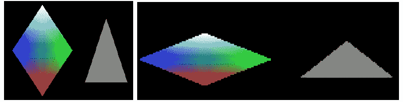

# 用 OpenGL ES 1.x API 绘制三维图形，点亮场景

本食谱涵盖了如何在 OpenGL ES 中绘制 3D 对象、处理触摸事件、 和点亮对象。

## 做好准备

建议读者在阅读本书之前，先阅读介绍和下面的*用 OpenGL ES 1.x API 绘制 2D 图形和应用变换*循环。

## 怎么做...

以下步骤展示了如何开发我们的示例安卓项目:

1.  创建一个名为`CubeG1`的安卓应用。将包名设置为`cookbook.chapter4.gl1x`。如需更多详细说明，请参考[第二章](02.html "Chapter 2. Java Native Interface")、 *Java 原生接口*中的*加载原生库和注册原生方法*食谱。
2.  右键单击项目立方体 1，选择**安卓工具** | **添加原生支持**。
3.  Add three Java files, namely `MyActivity.java`, `MySurfaceView`, and `MyRenderer.java`, under the `cookbook.chapter4.gl1x` package. `MyActivity.java` is the same as used in the previous recipe.

    `MySurfaceView.java`用代码扩展`GLSurfaceView`来处理触摸事件:

    ```cpp
    public class MySurfaceView extends GLSurfaceView {
      private MyRenderer mRenderer;
      private float mPreviousX;
       private float mPreviousY;
       private final float TOUCH_SCALE_FACTOR = 180.0f / 320;
      public MySurfaceView(Context context) {
        super(context);
        mRenderer = new MyRenderer();
        this.setRenderer(mRenderer);
        //control whether continuously drawing or on-demand
        this.setRenderMode(GLSurfaceView.RENDERMODE_WHEN_DIRTY);
      }

      public boolean onTouchEvent(final MotionEvent event) {
        float x = event.getX();
           float y = event.getY();
           switch (event.getAction()) {
           case MotionEvent.ACTION_MOVE:
               float dx = x - mPreviousX;
               float dy = y - mPreviousY;
               mRenderer.mAngleX += dx * TOUCH_SCALE_FACTOR;
               mRenderer.mAngleY += dy * TOUCH_SCALE_FACTOR;
               requestRender();
           }
           mPreviousX = x;
           mPreviousY = y;
           return true;
       }
    }
    ```

    `MyRenderer.java`实现渲染到 调用原生方法渲染图形:

    ```cpp
    public class MyRenderer implements GLSurfaceView.Renderer{
       public float mAngleX;
       public float mAngleY;
      @Override
      public void onSurfaceCreated(GL10 gl, EGLConfig config) {
        naInitGL1x();
      }
      @Override
      public void onDrawFrame(GL10 gl) {
        naDrawGraphics(mAngleX, mAngleY);
      }
      @Override
      public void onSurfaceChanged(GL10 gl, int width, int height) {
        naSurfaceChanged(width, height);
      }
    }
    ```

4.  Add the `CubeG1.cpp`, `Cube.cpp`, and `Cube.h` files under the `jni` folder. Please refer to downloaded project for the complete content. Let's list out the code for the `naInitGL1x`, `naSurfaceChanged`, and `naDrawGraphics` native methods in `CubeG1.cpp`, and draw and lighting methods in `Cube.cpp`:

    `CubeG1.cpp`设置 OpenGL ES 环境和灯光:

    ```cpp
    void naInitGL1x(JNIEnv* env, jclass clazz) {
      glDisable(GL_DITHER);
      glHint(GL_PERSPECTIVE_CORRECTION_HINT, GL_NICEST);
      glClearColor(0.0f, 0.0f, 0.0f, 1.0f);    glEnable(GL_CULL_FACE);    
      glClearDepthf(1.0f);  glEnable(GL_DEPTH_TEST);  
      glDepthFunc(GL_LEQUAL);    //type of depth test
      glShadeModel(GL_SMOOTH);    
      glLightModelx(GL_LIGHT_MODEL_TWO_SIDE, 0);
      float globalAmbientLight[4] = {0.5, 0.5, 0.5, 1.0};
      glLightModelfv(GL_LIGHT_MODEL_AMBIENT, globalAmbientLight);
      GLfloat lightOneDiffuseLight[4] = {1.0, 1.0, 1.0, 1.0};
      GLfloat lightOneSpecularLight[4] = {1.0, 1.0, 1.0, 1.0};
      glLightfv(GL_LIGHT0, GL_DIFFUSE, lightOneDiffuseLight);
      glLightfv(GL_LIGHT0, GL_SPECULAR, lightOneSpecularLight);
      glEnable(GL_LIGHTING);
      glEnable(GL_LIGHT0);
    }
    void naSurfaceChanged(JNIEnv* env, jclass clazz, int width, int height) {
      glViewport(0, 0, width, height);
       float ratio = (float) width / height;
       glMatrixMode(GL_PROJECTION);
       glLoadIdentity();
       glOrthof(-ratio, ratio, -1, 1, -10, 10);
    }
    void naDrawGraphics(JNIEnv* env, jclass clazz, float pAngleX, float pAngleY) {
      glClear(GL_COLOR_BUFFER_BIT | GL_DEPTH_BUFFER_BIT);
       glMatrixMode(GL_MODELVIEW);
       glLoadIdentity();
       glRotatef(pAngleX, 0, 1, 0);  //rotate around y-axis
       glRotatef(pAngleY, 1, 0, 0);  //rotate around x-axis
      glScalef(0.3f, 0.3f, 0.3f);      // Scale down
    mCube.lighting();
      mCube.draw();
      float lightOnePosition[4] = {0.0, 0.0, 1.0, 0.0};  
      glLightfv(GL_LIGHT0, GL_POSITION, lightOnePosition);
    }
    ```

    `Cube.cpp`绘制一个三维立方体，并将其点亮:

    ```cpp
    void Cube::draw() {
      glEnableClientState(GL_VERTEX_ARRAY);
      glVertexPointer(3, GL_FLOAT, 0, vertices);
      glDrawElements(GL_TRIANGLES, 36, GL_UNSIGNED_BYTE, indices);
      glDisableClientState(GL_VERTEX_ARRAY);
    }
    void Cube::lighting() {
      GLfloat cubeOneAmbientFraction[4] = {0.0, 0.5, 0.5, 1.0};
      GLfloat cubeOneDiffuseFraction[4] = {0.8, 0.0, 0.0, 1.0};
      GLfloat cubeSpecularFraction[4] = {0.0, 0.0, 0.0, 1.0};
      GLfloat cubeEmissionFraction[4] = {0.0, 0.0, 0.0, 1.0};
      glMaterialfv(GL_FRONT_AND_BACK, GL_AMBIENT, cubeOneAmbientFraction);
      glMaterialfv(GL_FRONT_AND_BACK, GL_DIFFUSE, cubeOneDiffuseFraction);
      glMaterialfv(GL_FRONT_AND_BACK, GL_SPECULAR, cubeSpecularFraction);
      glMaterialfv(GL_FRONT_AND_BACK, GL_EMISSION, cubeEmissionFraction);
      glMaterialf(GL_FRONT_AND_BACK, GL_SHININESS, 60.0);
    }
    ```

5.  在`jni`文件夹 下添加`Android.mk`文件，内容如下:

    ```cpp
    LOCAL_PATH := $(call my-dir)
    include $(CLEAR_VARS)
    LOCAL_MODULE    := CubeG1
    LOCAL_SRC_FILES := Cube.cpp CubeG1.cpp
    LOCAL_LDLIBS := -lGLESv1_CM -llog
    include $(BUILD_SHARED_LIBRARY)
    ```

6.  Build the Android NDK application and run it on an Android device. The app will display a cube, which we can touch to rotate:

    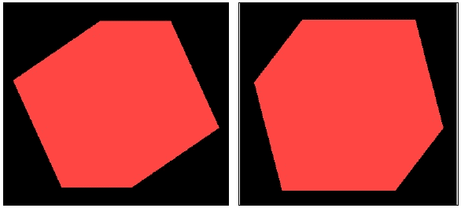

## 它是如何工作的...

本食谱讨论如何使用 OpenGL ES 1.x API 绘制 三维图形。请注意，我们需要在`Andorid.mk`文件中加载 OpenGL ES 库`GLESv1_CM`，并在本机源代码中包含头文件`GLES/gl.h`。

*   **在 OpenGL ES 中绘制 3D 对象**:绘制 3D 对象类似于绘制 2D 对象。在`Cube::draw`方法中，我们首先设置顶点缓冲区，然后调用`glDrawElements`绘制立方体的六个面。我们把`GL_TRIANGLES`当作原始人。因为每个面包含两个三角形，所以有 12 个三角形和 36 个顶点。
*   **触摸事件处理**:在`MySurfaceView.java`中，我们覆盖`onTouchEvent`方法检测屏幕上的人物移动，改变`MyRenderer`的旋转角度属性。我们调用`requestRender`方法，请求渲染器重绘图形。
*   **OpenGL ES**中的光照和材质:光照模型有类，分别是局部光照和全局光照。 **局部照明**只考虑直接照明，因此可以对单个物体进行照明计算。与此相反， **全局照明**采用从其他物体和环境反射的间接照明，因此计算成本更高。局部光照在 OpenGL ES 1.x 中使用，而全局光照可以使用 OpenGL ES 2.0 中的 **OpenGL 着色语言** ( **GLSL** )进行编程。这里，我们只讨论 OpenGL ES 1.x 中的光照。

当考虑照明时，OpenGL ES 涉及三方，包括摄像机位置、光源和对象的材质。相机位置始终处于默认位置`(0, 0, 0)`，并瞄准负 z 轴，如前一个配方中所述。光源可以提供单独的环境光、漫射光和镜面光。材质可以反射不同数量的环境光、漫射光和镜面光。此外，材质也可以发光。每种光都由 RGB 分量组成:

*   **环境光**:它近似于场景中各处存在的恒定光量。
*   **漫射光**:近似于来自远距离定向光源的光(如太阳光)。当反射光照射到一个表面上时，它会向各个方向均匀散射。
*   **镜面光**:近似于光滑表面反射的光。它的强度取决于观察者和从表面反射的光线方向之间的角度。
*   **发光**:有些材质可以发光。

请注意，光源中的 RGB 值表示颜色分量的强度，而它们指的是这些颜色在材质中的反射比例。为了理解光源和材质如何影响观看者对物体的感知，想象一束白光照射在一个表面上，它只反射光的蓝色成分，那么对于观看者来说，该表面将呈现为蓝色。如果光是纯红色，对于观察者来说，表面将是黑色的。

可以执行以下步骤在 OpenGL ES 中设置简单照明:

1.  设置照明模型参数。这是通过`glLightModelfv`完成的。安卓 NDK OpenGL ES 支持两个参数，包括`GL_LIGHT_MODEL_AMBIENT`和`GL_LIGHT_MODEL_TWO_SIDE`。第一个允许我们指定全局环境光，第二个允许我们指定是否要计算表面背面的照明。
2.  Enable, configure, and place one or more light sources. This is done through the `glLightfv` method. We can configure ambient, diffuse, and specular light separately. The light source position is also configured through `glLightfv` with `GL_POSITION`. In `CubeG1.cpp`, we used the following code:

    ```cpp
    float lightOnePosition[4] = {0.0, 0.0, 1.0, 0.0};  
    glLightfv(GL_LIGHT0, GL_POSITION, lightOnePosition);
    ```

    位置的第四个值指示光源是位置的还是方向的。当该值设置为`0`时，光线是定向的，这模拟了远处的光源(阳光)。光线照射到表面时是平行的，位置的(x，y，z)值是指光线的方向。如果第四个值设置为`1`，则灯光是定位的，类似于灯泡。(x，y，z)值指的是 光源的位置，光线从不同的角度照射到表面。注意，光源向所有方向发射等强度的光。下图说明了两种光源:

    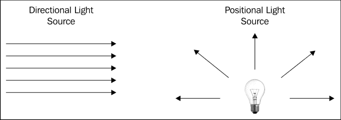

除了位置和方向光源，还有聚光灯:

1.  We shall enable lighting and the light sources also by calling

    ```cpp
    glEnable(GL_LIGHTING);
    ```

    和

    ```cpp
    glEnable(GL_LIGHTx);
    ```

2.  为所有对象的每个顶点定义法向量。对象相对于光源的方向由这些法线决定。在我们的代码中，我们依赖于 OpenGL ES 的默认法线。
3.  定义材质。这是通过`glMaterialf`或`glMaterialfv`方法完成的。在我们的示例代码中，我们指定漫射光的红色分量为`0.8`，同时保持绿色和蓝色分量为 0。因此，最终的立方体看起来是红色的。

# 使用 OpenGL ES 1.x API 将纹理映射到 3D 对象

**纹理贴图**是一种将图像 叠加到物体表面以创建更真实场景的技术。这个食谱涵盖了如何在 OpenGL ES 1.x 中添加纹理。

## 做好准备

建议读者先阅读*绘制三维图形，用 OpenGL ES 1.x API* 配方点亮场景，再来看这一篇。

## 怎么做...

以下步骤创建了一个演示将纹理映射到 3D 对象的安卓项目:

1.  创建一个名为`DiceG1`的安卓应用。设置 包名为`cookbook.chapter4.gl1x`。如需更详细的说明，请参考[第二章](02.html "Chapter 2. Java Native Interface")、 *Java 原生接口*中的*加载原生库和注册原生方法*食谱。
2.  右键点击项目`CubeG1`，选择**安卓工具** | **添加原生支持**。
3.  在`cookbook.chapter4.diceg1`包下增加三个 Java 文件，分别是`MyActivity.java`、`MySurfaceView.java`、`MyRenderer.java`。`MyActivity.java`和`MySurfaceView.java`与之前的食谱相似。
4.  `MyRenderer.java`如下所示:

    ```cpp
    public class MyRenderer implements GLSurfaceView.Renderer{
       public float mAngleX;
       public float mAngleY;
       private Context mContext;
       public MyRenderer(Context pContext) {
         super();
         mContext = pContext;
       }
      @Override
      public void onSurfaceCreated(GL10 gl, EGLConfig config) {
        //call native methods to load the textures
        LoadTexture(R.drawable.dice41, mContext, 0);
        LoadTexture(R.drawable.dice42, mContext, 1);
        LoadTexture(R.drawable.dice43, mContext, 2);
        LoadTexture(R.drawable.dice44, mContext, 3);
        LoadTexture(R.drawable.dice45, mContext, 4);
        LoadTexture(R.drawable.dice46, mContext, 5);
        naInitGL1x();
      }
    … …
      private void LoadTexture(int resId, Context context, int texIdx) {
        //Get the texture from the Android resource directory
        InputStream is = context.getResources().openRawResource(resId);
        Bitmap bitmap = null;
        try {
          BitmapFactory.Options options = new BitmapFactory.Options();
          options.inPreferredConfig = Bitmap.Config.ARGB_8888;
          bitmap = BitmapFactory.decodeStream(is, null, options);
          naLoadTexture(bitmap, bitmap.getWidth(), bitmap.getHeight(), texIdx);
        } finally {
          try {
            is.close();
            is = null;
          } catch (IOException e) {
          }
        }
        if (null != bitmap) {
          bitmap.recycle();
        }
      }
    }
    ```

5.  在`jni`文件夹下添加`DiceG1.cpp`、`Cube.cpp`、`Cube.h`和`mylog.h`文件。 完整内容请参考下载项目。在这里，我们列出了`DiceG1.cpp`中的`fornaLoadTexture`和`naInitGL1x`原生方法以及`Cube.cpp`中的`draw`方法的代码:

    ```cpp
    void naLoadTexture(JNIEnv* env, jclass clazz, jobject pBitmap, int pWidth, int pHeight, int pId) {
      int lRet;
      AndroidBitmapInfo lInfo;
      void* l_Bitmap;
      GLint format;
      GLenum type;
      if ((lRet = AndroidBitmap_getInfo(env, pBitmap, &lInfo)) < 0) {
        return;
      }
      if (lInfo.format == ANDROID_BITMAP_FORMAT_RGB_565) {
        format = GL_RGB;
        type = GL_UNSIGNED_SHORT_5_6_5;
      } else if (lInfo.format == ANDROID_BITMAP_FORMAT_RGBA_8888) {
        format = GL_RGBA;
        type = GL_UNSIGNED_BYTE;
      } else {
        return;
      }
      if ((lRet = AndroidBitmap_lockPixels(env, pBitmap, &l_Bitmap)) < 0) {
        return;
      }
      glGenTextures(1, &texIds[pId]);
      glBindTexture(GL_TEXTURE_2D, texIds[pId]);
      glTexParameteri(GL_TEXTURE_2D, GL_TEXTURE_MIN_FILTER, GL_NEAREST);
      glTexParameteri(GL_TEXTURE_2D, GL_TEXTURE_MAG_FILTER, GL_NEAREST);
      glTexParameteri(GL_TEXTURE_2D, GL_TEXTURE_WRAP_S, GL_REPEAT);
      glTexParameteri(GL_TEXTURE_2D, GL_TEXTURE_WRAP_T, GL_REPEAT);
      glTexImage2D(GL_TEXTURE_2D, 0, format, pWidth, pHeight, 0, format, type, l_Bitmap);
      AndroidBitmap_unlockPixels(env, pBitmap);
    }
    void naInitGL1x(JNIEnv* env, jclass clazz) {
      glDisable(GL_DITHER);  
      glHint(GL_PERSPECTIVE_CORRECTION_HINT, GL_NICEST);
      glClearColor(0.0f, 0.0f, 0.0f, 1.0f);  
      glEnable(GL_CULL_FACE);    
      glClearDepthf(1.0f);  
      glEnable(GL_DEPTH_TEST);  
      glDepthFunc(GL_LEQUAL);    
      glShadeModel(GL_SMOOTH);   
      mCube.setTexCoords(texIds);
      glTexEnvx(GL_TEXTURE_ENV, GL_TEXTURE_ENV_MODE, GL_REPLACE);
      glEnable(GL_TEXTURE_2D);
    }
    Cube.cpp: drawing the cube and mapping texture
    void Cube::draw() {
      glEnableClientState(GL_VERTEX_ARRAY);
      glEnableClientState(GL_TEXTURE_COORD_ARRAY);  // Enable texture-coords-array
      glFrontFace(GL_CW);

      glBindTexture(GL_TEXTURE_2D, texIds[0]);
      glTexCoordPointer(2, GL_FLOAT, 0, texCoords);
      glVertexPointer(3, GL_FLOAT, 0, vertices);
      glDrawElements(GL_TRIANGLES, 18, GL_UNSIGNED_BYTE, indices);

    ….
      glDisableClientState(GL_VERTEX_ARRAY);
      glDisableClientState(GL_TEXTURE_COORD_ARRAY);
    }
    ```

6.  在`jni`文件夹 下添加`Android.mk`文件，内容如下:

    ```cpp
    LOCAL_PATH := $(call my-dir)
    include $(CLEAR_VARS)
    LOCAL_MODULE    := DiceG1
    LOCAL_SRC_FILES := Cube.cpp DiceG1.cpp
    LOCAL_LDLIBS := -lGLESv1_CM -llog -ljnigraphics
    include $(BUILD_SHARED_LIBRARY)
    ```

7.  Build the Android NDK application and run it on an Android device. The app will display a cube textured as a dice:

    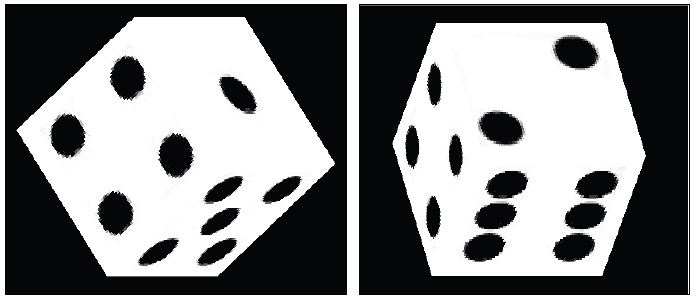

## 它是如何工作的...

这个食谱给三维立方体添加了一个纹理，使它看起来像一个骰子。

*   **Texture coordinates**: A texture is typically a 2D image. Texture coordinates `(s, t)` are usually normalized to `[0.0, 1.0]` as shown in the following diagram. Texture image is mapped to `[0, 1]` in both the `s` and `t` axes:

    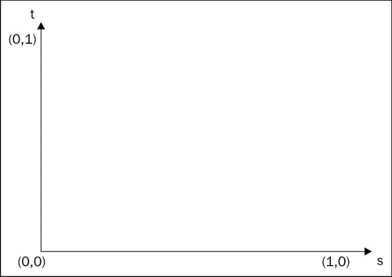

*   **加载纹理**:在 OpenGL ES 中贴图纹理的第一步就是加载。在我们的例子中，我们使用安卓 SDK 从可绘制资源中读取图像文件，并将位图传递给本机代码。原生方法`naLoadTexture`锁定位图图像并执行以下 OpenGL 操作。
    *   **创建灰度纹理**:这将生成纹理标识。
    *   绑定纹理:glBindTexture。这告诉 OpenGL 我们正在使用哪个纹理 id。
    *   **用`GL_TEXTURE_MIN_FILTER`或`GL_TEXTURE_MAG_FILTER`设置纹理过滤** : `glTexParameter` (这将在后面讨论)。
    *   **设置纹理包裹**:用`GL_TEXTURE_WRAP_S`或`GL_TEXTURE_WRAP_T` ( 这个稍后讨论)。
    *   **将图像数据加载到 OpenGL** : ( `glTexImage2D`)我们需要指定图像数据，宽度，高度，颜色格式等等。
*   **纹理环绕**:纹理在 s 轴和 t 轴上都映射到`[0, 1]`。但是，我们可以指定超出范围的纹理坐标。一旦发生这种情况，将应用包装。纹理环绕的典型设置如下:
    *   `GL_CLAMP`:将纹理坐标夹紧到`[0.0, 1.0]`。
    *   `GL_REPEAT`:重复纹理。这将创建一个重复的模式。
*   **纹理过滤**:纹理图像和物体的分辨率不同是很常见的。如果纹理较小，则进行放大；如果纹理较大，则执行缩小。通常使用以下两种方法:
    *   `GL_NEAREST`:使用离被纹理化的像素中心最近的纹理元素。
    *   `GL_LINEAR`:基于最接近被纹理化像素的四个纹理元素，应用插值计算颜色值。
*   **设置纹理环境**:在我们将纹理映射到对象之前，我们可以调用`glTexEnvf`来控制片段被纹理化时纹理值如何被解释。我们可以配置`GL_TEXTURE_ENV_COLOR`和`GL_TEXTURE_ENV_MODE`。在我们的示例项目中，我们使用了`GL_TEXTURE_ENV_MODE`的`GL_REPLACE`，它简单地用纹理值替换了立方体碎片。
*   **贴图纹理**:我们绘制三维立方体的每个面，通过`glDrawElement`贴图纹理。`GL_TEXTURE_COORD_ARRAY` 必须通过调用`glEnableClientState`来启用。在绘制每个界面之前，我们通过调用`glBindTexture`绑定到相应的纹理。

## 还有更多...

在我们的原生代码中，我们使用了 Android 原生位图 API 从 Java 代码中接收纹理位图对象。该 API 的更多细节将在[第 7 章](07.html "Chapter 7. Other Android NDK API")、*其他安卓 NDK API* 中介绍。

# 用 OpenGL ES 2.0 API 绘制三维图形

之前的菜谱描述了 安卓 NDK 上的 OpenGL ES 1.x。这个食谱涵盖了如何在安卓 NDK 系统中使用 OpenGL ES 2.0。

## 做好准备

建议读者在阅读本食谱之前先阅读本章的介绍。下面的食谱涵盖了很多图形基础知识；建议我们先浏览一下:

*   *用 OpenGL ES 1.x API 绘制 2D 图形并应用变换*
*   *用 OpenGL ES 1.x API 绘制三维图形，点亮场景*

## 怎么做...

以下步骤创建了一个安卓项目，该项目使用 NDK 安卓系统中的 OpenGL ES 2.0 应用编程接口渲染三维立方体:

1.  创建一个名为`CubeG2`的安卓应用。将包名设置为`cookbook.chapter4.cubeg2`。如需更多详细说明，请参考[第二章](02.html "Chapter 2. Java Native Interface")、 *Java 原生接口*的*加载原生库和注册原生方法*食谱。
2.  右键点击项目`CubeG2`，选择**安卓工具** | **添加原生支持**。
3.  添加三个 Java 文件，分别是`MyActivity.java`、`MyRenderer.java`、`MySurfaceView.java`。我们在这里只列出`MyRenderer.java`的一部分，因为另外两个文件— `MyActivity.java`和`MySurfaceView.java`—类似于上一个食谱中的文件:

    ```cpp
    @Override
    public void onSurfaceCreated(GL10 gl, EGLConfig config) {
        String vertexShaderStr = LoadShaderStr(mContext, R.raw.vshader);
        String fragmentShaderStr = LoadShaderStr(mContext, R.raw.fshader);
        naInitGL20(vertexShaderStr, fragmentShaderStr);
    }
    @Override
    public void onDrawFrame(GL10 gl) {
      naDrawGraphics(mAngleX, mAngleY);
    }
    @Override
    public void onSurfaceChanged(GL10 gl, int width, int height) {
      naSurfaceChanged(width, height);
    }
    ```

4.  Add the `Cube.cpp`, `matrix.cpp`, `CubeG2.cpp`, `Cube.h`, `matrix.h`, and `mylog.h` files under the `jni` folder. The content of the files are summarized as follows:
    *   **Cube.cpp 和 Cube.h** :他们定义了一个`Cube` 的对象和方法来绘制一个 3D 立方体。
    *   **matrix.cpp 和 matrix.h** :这些矩阵运算，包括创建平移，缩放和旋转矩阵，以及矩阵乘法。
    *   **立方体 G2.cpp** :它们创建并加载着色器。他们还创建、链接和使用程序，并对三维立方体应用变换。
    *   **mylog.h** :他们为 安卓 NDK 日志定义宏。

    在这里，我们列出`Cube.cpp`和`CubeG2.cpp`的一部分。

    `Cube.cpp`:

    ```cpp
    …
    void Cube::draw(GLuint pvPositionHandle) {
      glVertexAttribPointer(pvPositionHandle, 3, GL_FLOAT, GL_FALSE, 0, vertices);
      glEnableVertexAttribArray(pvPositionHandle);
      glDrawArrays(GL_TRIANGLES, 0, 36);
    }
    ...
    ```

    `CubeG2.cpp`:包括`loadShader`、`createProgram`、`naInitGL20`、`naDrawGraphics`方法，解释如下:

    *   `loadShader`:此方法创建一个着色器，附加一个源，并编译着色器:

        ```cpp
        GLuint loadShader(GLenum shaderType, const char* pSource) {
           GLuint shader = glCreateShader(shaderType);
           if (shader) {
               glShaderSource(shader, 1, &pSource, NULL);
               glCompileShader(shader);
               GLint compiled = 0;
               glGetShaderiv(shader, GL_COMPILE_STATUS, &compiled);
               if (!compiled) {
                   GLint infoLen = 0;
                   glGetShaderiv(shader, GL_INFO_LOG_LENGTH, &infoLen);
                   if (infoLen) {
                       char* buf = (char*) malloc(infoLen);
                       if (buf) {
                           glGetShaderInfoLog(shader, infoLen, NULL, buf);
                           free(buf);
                       }
                       glDeleteShader(shader);
                       shader = 0;
                   }
               }
           }
           return shader;
        }
        ```

    *   `createProgram`:这个方法创建一个 程序对象，附着着色器，链接程序:

        ```cpp
        GLuint createProgram(const char* pVertexSource, const char* pFragmentSource) {
           GLuint vertexShader = loadShader(GL_VERTEX_SHADER, pVertexSource);
           GLuint pixelShader = loadShader(GL_FRAGMENT_SHADER, pFragmentSource);
           GLuint program = glCreateProgram();
           if (program) {
               glAttachShader(program, vertexShader);
               glAttachShader(program, pixelShader);
               glLinkProgram(program);
           }
           return program;
        }
        ```

    *   `naInitGL20`:该方法设置 OpenGL ES 2.0 环境，获取着色器源字符串，获取着色器属性和统一位置:

        ```cpp
        void naInitGL20(JNIEnv* env, jclass clazz, jstring vertexShaderStr, jstring fragmentShaderStr) {
          glDisable(GL_DITHER);  
          glClearColor(0.0f, 0.0f, 0.0f, 1.0f);  
        glClearDepthf(1.0f);  
          glEnable(GL_DEPTH_TEST);  
          glDepthFunc(GL_LEQUAL);    
            const char *vertexStr, *fragmentStr;
          vertexStr = env->GetStringUTFChars(vertexShaderStr, NULL);
          fragmentStr = env->GetStringUTFChars(fragmentShaderStr, NULL);
          setupShaders(vertexStr, fragmentStr);
          env->ReleaseStringUTFChars(vertexShaderStr, vertexStr);
          env->ReleaseStringUTFChars(fragmentShaderStr, fragmentStr);
          gvPositionHandle = glGetAttribLocation(gProgram, "vPosition");
          gmvP = glGetUniformLocation(gProgram, "mvp");

        }
        ```

    *   `naDrawGraphics`:此方法应用模型变换(旋转、缩放和平移)和 投影变换:

        ```cpp
        void naDrawGraphics(JNIEnv* env, jclass clazz, float pAngleX, float pAngleY) {
          glClear(GL_COLOR_BUFFER_BIT | GL_DEPTH_BUFFER_BIT);
          glClearColor(0.0, 0.0, 0.0, 1.0f);
          glUseProgram(gProgram);
        //  GL1x: glRotatef(pAngleX, 0, 1, 0);  //rotate around y-axis
        //  GL1x: glRotatef(pAngleY, 1, 0, 0);  //rotate around x-axis
          //rotate
          rotate_matrix(pAngleX, 0.0, 1.0, 0.0, aRotate);
          rotate_matrix(pAngleY, 1.0, 0.0, 0.0, aModelView);
          multiply_matrix(aRotate, aModelView, aModelView);
        //  GL1x: glScalef(0.3f, 0.3f, 0.3f);      // Scale down
          scale_matrix(0.5, 0.5, 0.5, aScale);
          multiply_matrix(aScale, aModelView, aModelView);
        // GL1x: glTranslate(0.0f, 0.0f, -3.5f);
          translate_matrix(0.0f, 0.0f, -3.5f, aTranslate);
          multiply_matrix(aTranslate, aModelView, aModelView);
        //  gluPerspective(45, aspect, 0.1, 100);
          perspective_matrix(45.0, (float)gWidth/(float)gHeight, 0.1, 100.0, aPerspective);
          multiply_matrix(aPerspective, aModelView, aMVP);
          glUniformMatrix4fv(gmvP, 1, GL_FALSE, aMVP);
          mCube.draw(gvPositionHandle);
        }
        ```

5.  在`res`文件夹下创建一个名为`raw`的文件夹，并添加以下两个文件:
    *   `vshader`:这是顶点着色器来源:

        ```cpp
        attribute vec4 vPosition;
        uniform mat4 mvp;
        void main() 
        {
           gl_Position = mvp * vPosition;
        }
        ```

    *   `fshader`:这是片段着色器来源:

        ```cpp
        void main()
        {
           gl_FragColor = vec4(0.0,0.5,0.0,1.0);
        }
        ```

6.  在`jni`文件夹下添加`Android.mk`文件，如下所示 。注意，我们必须通过`LOCAL_LDLIBS := -lGLESv2` :

    ```cpp
    LOCAL_PATH := $(call my-dir)
    include $(CLEAR_VARS)
    LOCAL_MODULE    := CubeG2
    LOCAL_SRC_FILES := matrix.cpp Cube.cpp CubeG2.cpp
    LOCAL_LDLIBS := -lGLESv2 -llog
    include $(BUILD_SHARED_LIBRARY)
    ```

    链接到 OpenGL ES 2.0
7.  在`AndroidManifest.xml`文件的`<application>...</application>`前增加以下一行，表示安卓应用使用了 OpenGL ES 2.0 功能:

    ```cpp
    <uses-feature android:glEsVersion="0x00020000" android:required="true" />
    ```

8.  Build the Android NDK application and run it on an Android device. The app will display a cube and we can touch to rotate the cube:

    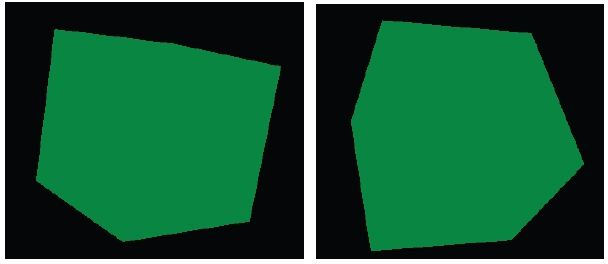

## 它是如何工作的...

示例项目使用 OpenGL ES 2.0 渲染三维立方体。OpenGL ES 2.0 提供了一个可编程的流水线，其中可以提供顶点着色器和片段着色器来控制如何处理顶点和片段:

*   **顶点着色器**:对每个顶点执行。 变换、照明、纹理映射等通常都是使用它来执行的。
*   **片段着色器**:对光栅化器产生的每个片段执行。典型的处理是给每个片段添加颜色。

着色器是使用 OpenGL 着色语言编程的，这将在下面讨论。

### OpenGL 着色语言(GLSL)

在这里，我们简单介绍一下 GLSL。

*   **数据类型**:主要有四种类型，包括`bool``int``float``sampler`。前三种类型也有向量类型— `bvec2`、`bvec3`、`bvec4`分别指 2D、3D 和 4D 布尔向量。`ivec2`、`ivec3`和`ivec4`表示整数向量。`vec2`、`vec3`和`vec4`指浮点向量。**采样器**用于纹理采样，必须均匀。
*   **属性、制服和变化**:一个着色器包括三种类型的输入和输出，包括制服、属性和变化。所有三种类型都必须是全局的:
    *   **制服**:只读类型，渲染时不需要改动。比如灯位。
    *   **属性**:只读类型，只能作为顶点着色器的输入。每一个顶点都会改变。例如，顶点位置。
    *   **变化**:用于将数据从顶点着色器传递到片段着色器。它在顶点着色器中可读可写，但仅在片段着色器中可读。
*   **内置类型** : GLSL 有各种内置的属性、制服和着色器变量。我们强调其中几个如下:
    *   `gl_Vertex`:是一个属性——一个代表顶点位置的 4D 向量。
    *   `gl_Color`:是一个属性——一个代表顶点颜色的 4D 向量 。
    *   `gl_ModelViewMatrix`:是统一的——4x 4 模型视图矩阵。
    *   `gl_ModelViewProjectionMatrix`:是 是制服。4x4 模型视图投影矩阵。
    *   `gl_Position`:仅作为顶点 着色器输出可用。这是一个 4D 向量，表示最终处理的顶点位置。
    *   `gl_FragColor`:仅作为 片段着色器输出提供。这是一个 4D 向量，表示要写入帧缓冲区的最终颜色。

### 如何使用着色器:

在我们的示例项目中，顶点着色器程序简单地将每个立方体顶点乘以模型-视图-投影矩阵，片段着色器为每个片段设置绿色。使用着色器源代码应遵循以下步骤:

1.  **创建着色器**:调用以下 OpenGL ES 2.0 方法:
    *   `glCreateShader`:它创建一个`GL_VERTEX_SHADER`或`GL_FRAGMENT_SHADER`着色器。它返回一个非零的值，可以通过该值引用着色器。
    *   `glShaderSource`:将源代码放在着色器对象中。先前存储的源代码将被完全替换。
    *   `glCompileShader`:编译着色器对象的源代码。
2.  **创建一个程序并附加着色器**:调用以下方法:
    *   `glCreateProgram`:它创建一个空的程序对象，着色器可以附加到该对象上。程序对象本质上提供了一种将所有需要执行的东西联系在一起的机制。
    *   `glAttachShader`:它将着色器附加到程序对象上。
    *   `glLinkProgram`:链接一个程序对象。如果任何`GL_VERTEX_SHADER`对象被附加到程序对象，它们将被用来创建在顶点处理器上运行的可执行文件。如果附加了任何`GL_FRAGMENT_SHADER`着色器，它们将用于创建在片段处理器上运行的可执行文件。
3.  **使用程序**:我们使用以下调用将数据传递给着色器并执行 OpenGL 操作:
    *   `glUseProgram`:安装了作为当前渲染状态一部分的程序对象
    *   `glGetAttribLocation`:返回属性变量的位置
    *   `glVertexAttribPointer`:指定渲染时使用的通用顶点属性数组的位置和数据格式
    *   `glEnableVertexAttribArray`:启用顶点属性数组
    *   `glGetUniformLocation`:返回一个统一变量的位置
    *   `glUniform`:指定一个统一变量的值
    *   `glDrawArrays`:渲染数组数据中的图元。

## 还有更多...

样本项目通过**矩阵运算**进行模型视图变换和投影变换。这些变换的细节很繁琐，不在本书的讨论范围之内，因此我们不在此赘述。但是，代码中提供了详细的注释。感兴趣的读者也可以很容易地找到关于这些操作的在线资源。

# 用 EGL 显示图形

除了我们在之前的食谱中描述的`GLSurfaceView`显示机制 之外，还可以使用 EGL 来显示 OpenGL 图形。

## 做好准备

建议读者在阅读本书之前，先阅读*用 OpenGL ES 1.x API 绘制三维图形并点亮场景*食谱。

## 怎么做...

以下步骤描述了如何创建一个展示 EGL 用法的安卓项目:

1.  创建一个名为`EGLDemo`的安卓应用。将包名设置为`cookbook.chapter4.egl`。如需更多详细说明，请参考[第二章](02.html "Chapter 2. Java Native Interface")、 *Java 原生接口*中的*加载原生库和注册原生方法*食谱。
2.  右键点击项目`EGLDemo`，选择**安卓工具** | **添加原生支持**。
3.  添加两个 Java 文件，即`EGLDemoActivity.java`和`MySurfaceView.java`。`EGLDemoActivity.java`将`ContentView`设置为`MySurfaceView`的实例，并在安卓活动回调函数

    ```cpp
    … …
    public void onCreate(Bundle savedInstanceState) {
    super.onCreate(savedInstanceState);
    myView = new MySurfaceView(this);
    this.setContentView(myView);
    }
    protected void onResume() {
    super.onResume();
    myView.startRenderer();
    }
    … …
    protected void onStop() {
    super.onStop();
    myView.destroyRender();
    }
    … …
    ```

    开始和停止渲染
4.  `MySurfaceView.java`执行类似于`GLSurfaceView`的角色。它与本地渲染器交互，以管理显示表面和处理触摸事件:

    ```cpp
    public class MySurfaceView extends SurfaceView implements SurfaceHolder.Callback {
    … …
    public MySurfaceView(Context context) {
    super(context);
    this.getHolder().addCallback(this);
    }
    … …
    public boolean onTouchEvent(final MotionEvent event) {
    float x = event.getX();
    float y = event.getY();
    switch (event.getAction()) {
    case MotionEvent.ACTION_MOVE:
        float dx = x - mPreviousX;
        float dy = y - mPreviousY;
        mAngleX += dx * TOUCH_SCALE_FACTOR;
        mAngleY += dy * TOUCH_SCALE_FACTOR;
        naRequestRenderer(mAngleX, mAngleY);
    }
    mPreviousX = x;
    mPreviousY = y;
    return true;
    }
    @Override
    public void surfaceChanged(SurfaceHolder holder, int format, int width,int height) {
    naSurfaceChanged(holder.getSurface());
    }
    @Override
    public void surfaceCreated(SurfaceHolder holder) {}
    @Override
    public void surfaceDestroyed(SurfaceHolder holder) {
    naSurfaceDestroyed();
    }
    }
    ```

5.  以下代码应被 添加到`jni`文件夹中:
    *   **Cube.cpp 和 Cube.h** :使用 OpenGL 1.x API 绘制一个 3D 立方体。
    *   **OldRenderMethods.cpp 和 OldRenderMethods.h** :初始化 OpenGL 1.x，执行变换，绘制图形，等等。这类似于*在 OpenGL 1.x* 配方中绘制三维图形的相应方法。
    *   **渲染器. cpp 和渲染器. h** :模拟`android.opengl.GLSurfaceView.Renderer`。它设置 EGL 上下文，管理显示，等等。
    *   `renderAFrame`:设置事件类型，然后给渲染线程发信号处理事件:

        ```cpp
        void Renderer::renderAFrame(float pAngleX, float pAngleY) {
        pthread_mutex_lock(&mMutex);
        mAngleX = pAngleX; mAngleY = pAngleY;
        mRendererEvent = RTE_DRAW_FRAME;
        pthread_mutex_unlock(&mMutex);
        pthread_cond_signal(&mCondVar); 
        }
        ```

    *   `renderThreadRun`:运行在单独的线程中处理各种事件，包括表面变化、画框等等:

        ```cpp
        void Renderer::renderThreadRun() {
            bool ifRendering = true;
            while (ifRendering) {
                pthread_mutex_lock(&mMutex);
                pthread_cond_wait(&mCondVar, &mMutex);
                switch (mRendererEvent) {
                … …
                    case RTE_DRAW_FRAME:
                        mRendererEvent = RTE_NONE;
                        pthread_mutex_unlock(&mMutex);
                        if (EGL_NO_DISPLAY!=mDisplay) {
                    naDrawGraphics(mAngleX, mAngleY);
                    eglSwapBuffers(mDisplay, mSurface);
                    }
                        }
                        break;
                    ……
                }
        }
        }
        ```

    *   `initDisplay`:设置了 EGL 的上下文:

        ```cpp
        bool Renderer::initDisplay() {
        const EGLint attribs[] = {
            EGL_SURFACE_TYPE, EGL_WINDOW_BIT,
            EGL_BLUE_SIZE, 8,
            EGL_GREEN_SIZE, 8,
            EGL_RED_SIZE, 8,
            EGL_NONE};
        EGLint width, height, format;
        EGLint numConfigs;
        EGLConfig config;
        EGLSurface surface;
        EGLContext context;
        EGLDisplay display = eglGetDisplay(EGL_DEFAULT_DISPLAY);
        eglInitialize(display, 0, 0);
        eglChooseConfig(display, attribs, &config, 1, &numConfigs);
        eglGetConfigAttrib(display, config, EGL_NATIVE_VISUAL_ID, &format);
        ANativeWindow_setBuffersGeometry(mWindow, 0, 0, format);
        surface = eglCreateWindowSurface(display, config, mWindow, NULL);
        context = eglCreateContext(display, config, NULL, NULL);
        if (eglMakeCurrent(display, surface, surface, context) == EGL_FALSE) {
            return -1;
        }
        eglQuerySurface(display, surface, EGL_WIDTH, &width);
        eglQuerySurface(display, surface, EGL_HEIGHT, &height);
          … ...
        }
        ```

    *   `EGLDemo.cpp`: It registers the native methods and wraps the native code. The following two methods are used:

        `naSurfaceChanged`:获取一个 Java `Surface`对象关联的原生窗口 ，初始化 EGL 和 OpenGL:

        ```cpp
        void naSurfaceChanged(JNIEnv* env, jclass clazz, jobject pSurface) {
        gWindow = ANativeWindow_fromSurface(env, pSurface);
        gRenderer->initEGLAndOpenGL1x(gWindow);
        }
        ```

        `naRequestRenderer`:渲染一帧，`MySurfaceView`中`touch`事件处理程序调用的 :

        ```cpp
        void naRequestRenderer(JNIEnv* env, jclass clazz, float pAngleX, float pAngleY) {
        gRenderer->renderAFrame(pAngleX, pAngleY);
        }
        ```

6.  在`jni`文件夹下添加`Android.mk`文件，内容如下:

    ```cpp
    LOCAL_PATH := $(call my-dir)
    include $(CLEAR_VARS)
    LOCAL_MODULE := EGLDemo
    LOCAL_SRC_FILES := Cube.cpp OldRenderMethods.cpp Renderer.cpp EGLDemo.cpp
    LOCAL_LDLIBS := -llog -landroid -lEGL -lGLESv1_CM
    include $(BUILD_SHARED_LIBRARY)
    ```

7.  Build the Android NDK application and run it on an Android device. The app will display a cube, which we can touch to rotate it:

    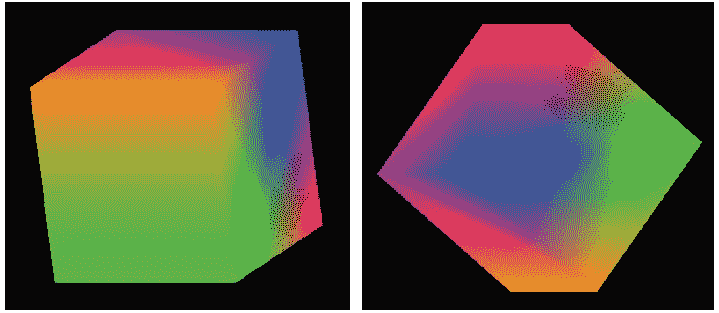

## 它是如何工作的...

EGL 是 OpenGL ES 和底层原生窗口系统之间的接口。根据 Khronos EGL 网页([http://www.khronos.org/egl](http://www.khronos.org/egl))来看，图形上下文管理、表面绑定以及用于与其他 Khronos 2D 和 3D APIs(包括 OpenGL ES)进行渲染的渲染同步都是由其处理的。

### 类型

**EGL** 是一个广泛应用于嵌入式系统的跨平台 API，包括安卓和 iPhone(苹果的 EGL 实现叫做 **EAGL** )。许多桌面平台也支持 EGL。不同的 实现可能不是 100%兼容的，但是移植工作对于 EGL 代码来说通常不是实质性的。

以下步骤描述了如何设置和操作 EGL 及其与 OpenGL 的集成:

1.  **获取并初始化显示连接** : EGL 需要知道内容应该显示在哪里，所以我们需要获取一个显示连接并初始化。这是使用以下两种方法完成的:
    *   `eglGetDisplay`:获取本机显示器的 EGL 显示连接。如果输入参数为`EGL_DEFAULT_DISPLAY`，则返回默认显示连接。
    *   `eglInitialize`:初始化`eglGetDisplay`获得的 EGL 显示连接。
2.  **Configure EGL**: This is done through `eglChooseConfig`.

    `eglChooseConfig`返回符合`attrib_list`参数指定的要求 的 EGL 帧缓冲区配置列表。属性是一个带有属性对和相应期望值的数组，以`EGL_NONE`结束。在我们的代码中，我们简单地将`EGL_SURFACE_TYPE`指定为`EGL_WINDOW_BIT`，颜色分量大小为 8 位。

3.  **Create a render surface where the display content will be placed**: This is done through `eglCreateWindowSurface`.

    `eglCreateWindowSurface`，给定 EGL 显示连接，EGL 帧缓冲区配置和原生窗口返回一个新的 EGL 窗口表面。

    在我们的代码中，我们从`SurfaceView`开始，并将其关联的`android.view.Surface`值传递给本机代码。在原生代码中，我们获取它的原生窗口，最后为 OpenGL 绘图创建 EGL 窗口曲面。

4.  **创建 EGL 渲染上下文并使其成为当前的** : 这是通过`eglCreateContext`和`eglMakeCurrent`完成的。
    *   `eglCreateContext`:它 创建了一个新的 EGL 渲染上下文，用于渲染到 EGL 绘制表面。
    *   `eglMakeCurrent`:它将 EGL 的上下文附加到 EGL 的绘制和读取表面。在我们的代码中，创建的窗口表面被用作读取和绘制表面。
5.  **OpenGL 绘图**:这在之前的食谱中有介绍。
6.  **Swap the EGL surface internal buffers to display the content**: This is done by the `eglSwapBuffers` call.

    `eglSwapBuffers`将 EGL 表面颜色缓冲区发布到原生窗口。这有效地在屏幕上显示绘图内容。

    EGL 内部维持两个缓冲区。显示前缓冲区的内容，而绘图可以在后缓冲区完成。当我们决定显示新的 绘图时，我们交换了两个缓冲区。

7.  有时我们想停止渲染。释放 EGL 上下文，破坏 EGL 表面，并终止 EGL 显示连接:
    *   `eglMakeCurrent`用`EGL_NO_SURFACE`和`EGL_NO_CONTEXT`发布当前上下文
    *   `eglDestroySurface`摧毁 EGL 表面
    *   `eglTerminate`终止 EGL 显示连接

### 窗口管理

我们的代码使用 Android 原生窗口管理 API 调用获取一个原生窗口并进行配置。调用以下方法:

*   `ANativeWindow_fromSurface`:返回一个与 Java surface 对象关联的 原生窗口。返回的参考应传递给`ANativeWindow_release`以确保无泄漏。
*   `ANativeWindow_setBuffersGeometry`:设置窗口缓冲区的大小和格式。在我们的代码中，我们将宽度和 高度指定为`0`，在这种情况下，将使用窗口的基础值。

请注意，我们需要在`Android.mk`文件(`LOCAL_LDLIBS := -landroid`)中链接到安卓库，因为它是安卓原生应用接口的一部分，我们将在下一章中详细介绍。

## 还有更多...

渲染器在单独的线程中运行事件循环。我们使用 **POSIX 线程** ( `pthreads`)调用来创建一个本地线程，将其与主线程同步，等等。我们将在[第 6 章](06.html "Chapter 6. Android NDK Multithreading")、*安卓 NDK 多线程*中详细介绍`pthread`。**