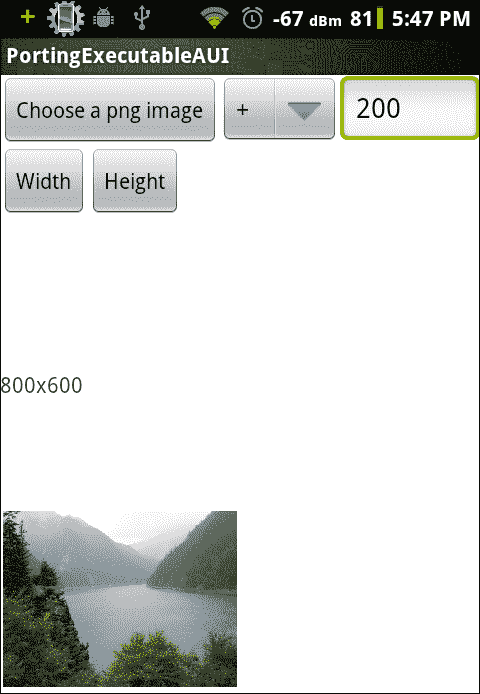
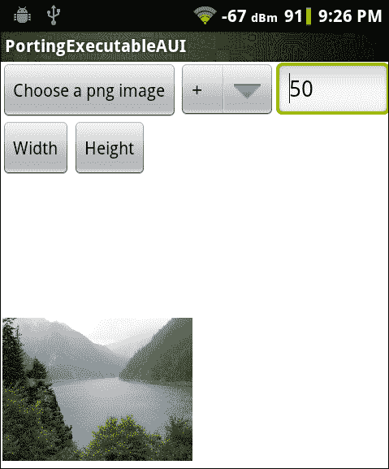
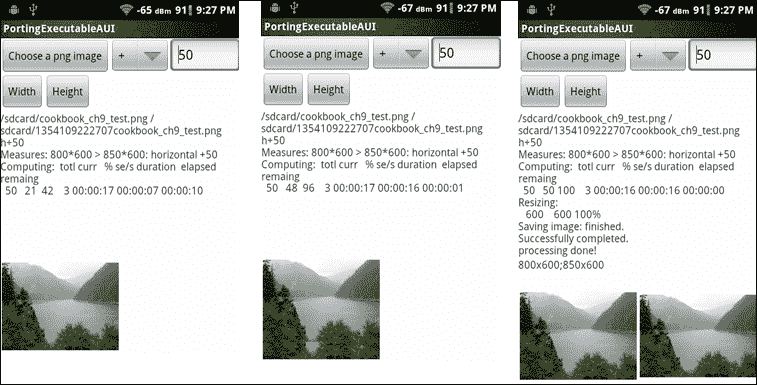
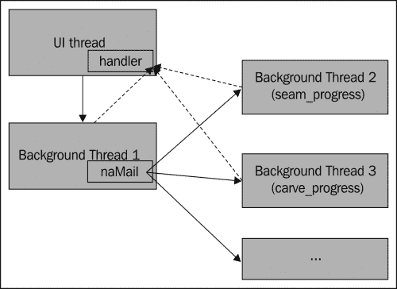

# 九、利用 NDK 将现有应用移植到安卓系统

在本章中，我们将介绍以下食谱:

*   使用 NDK 构建系统将命令行可执行文件移植到安卓系统
*   使用 NDK 独立编译器将命令行可执行文件移植到安卓系统
*   向移植的安卓应用添加图形用户界面
*   移植时使用后台线程

# 简介

前一章介绍了用 NDK 将原生库移植到安卓系统的各种技术。本章讨论本机应用的移植。

我们将首先介绍如何使用安卓 NDK 构建系统和 NDK 提供的独立编译器为安卓构建本机命令行应用。然后我们将为移植的应用添加一个图形用户界面。最后，我们展示了使用后台线程进行繁重的处理，并将进度更新消息从本机代码发送到 Java UI 线程进行 GUI 更新。

在本章中，我们将使用开源的 Fugenschnitzer 程序。这是一个基于 **接缝雕刻**算法的内容感知图像尺寸调整程序。该算法的基本思想是通过搜索和操作原始图像的接缝(接缝**是从上到下或从左到右连接像素的路径)来改变图像的大小。该算法能够在保留重要信息的同时调整图像的大小。对程序和算法感兴趣的读者，可参考项目主页[http://fugenschnitzer.sourceforge.net/main_en.html](http://fugenschnitzer.sourceforge.net/main_en.html)了解更多详情。否则，我们可以忽略算法，专注于是如何移植完成的。**

 **# 用 NDK 构建系统将命令行可执行程序移植到安卓系统

这个食谱讨论了如何通过 NDK 构建系统将命令行可执行文件移植到安卓系统。我们将以开源的 Fugenschnitzer 程序 ( `fusch`)作为 的例子。

## 做好准备

你应该先阅读[第八章](08.html "Chapter 8. Porting and Using the Existing Libraries with Android NDK")、*用安卓 NDK* 移植和使用现有库中的*用安卓 NDK 构建系统将库移植为静态库*食谱，然后再看这一篇。

## 怎么做...

以下步骤描述了如何使用 NDK 构建系统将`fusch`程序移植到安卓系统:

1.  创建一个名为 **PortingExecutable** 的支持原生的安卓应用。将包名设置为`cookbook.chapter9.portingexecutable`。如果您需要更详细的说明，请参考[第 2 章](02.html "Chapter 2. Java Native Interface")、 *Java 本机接口*中的*加载本机库和注册本机方法*配方。
2.  移除项目`jni`文件夹下的现有内容。
3.  从[http://fugenschnitzer.sourceforge.net/main_en.html](http://fugenschnitzer.sourceforge.net/main_en.html)下载`fusch`库和命令行应用的源代码。提取档案文件，分别放入`jni/fusch`和`jni/fusch_lib`文件夹。
4.  从[http://SourceForge . net/projects/libpng/files/libpng 12/1 . 2 . 50/](http://sourceforge.net/projects/libpng/files/libpng12/1.2.50/)下载`libpng 1.2.50` ，将文件解压到`jni/libpng-1.2.50`文件夹。最新版本的`libpng`不行，因为界面不一样。
5.  在`jni/libpng-1.2.50`文件夹下添加`Android.mk`文件，构建`libpng`作为静态库模块。文件内容如下:

    ```cpp
    LOCAL_PATH := $(call my-dir)
    include $(CLEAR_VARS)
    LOCAL_CFLAGS := 
    LOCAL_MODULE    := libpng
    LOCAL_SRC_FILES :=\
      png.c \
      pngerror.c \
      pngget.c \
      pngmem.c \
      pngpread.c \
      pngread.c \
      pngrio.c \
      pngrtran.c \
      pngrutil.c \
      pngset.c \
      pngtrans.c \
      pngwio.c \
      pngwrite.c \
      pngwtran.c \
      pngwutil.c 
    LOCAL_LDLIBS := -lz
    LOCAL_EXPORT_LDLIBS := -lz
    LOCAL_EXPORT_C_INCLUDES := $(LOCAL_PATH)
    include $(BUILD_STATIC_LIBRARY)
    ```

6.  在`jni/fusch_lib`文件夹下添加`Android.mk`文件，将`libseamcarv`构建为 静态库模块。文件内容如下:

    ```cpp
    LOCAL_PATH := $(call my-dir)
    include $(CLEAR_VARS)
    LOCAL_MODULE    := libseamcarv
    LOCAL_SRC_FILES :=\
      sc_core.c  \
      sc_carve.c  \
      sc_color.c  \
      sc_shift.c \
      sc_mgmnt.c \
      seamcarv.c
    LOCAL_CFLAGS := -std=c99 
    LOCAL_EXPORT_C_INCLUDES := $(LOCAL_PATH)
    include $(BUILD_STATIC_LIBRARY)
    ```

7.  在`jni/fusch`文件夹下添加第三个`Android.mk`文件来构建`fusch`可执行文件，该文件使用两个文件夹`libpng-1.2.50`和`fusch_lib`中构建的两个静态库。

    ```cpp
    LOCAL_PATH := $(call my-dir)
    include $(CLEAR_VARS)
    LOCAL_MODULE    := fusch
    LOCAL_SRC_FILES := fusch.c
    LOCAL_CFLAGS := -std=c99
    LOCAL_STATIC_LIBRARIES := libpng libseamcarv
    include $(BUILD_EXECUTABLE)
    ```

8.  在`jni`文件夹下添加第四个`Android.mk`文件，以包括其子文件夹下的`Android.mk`文件。

    ```cpp
    LOCAL_PATH := $(call my-dir)
    include $(call all-subdir-makefiles)
    ```

9.  构建应用，你会在`libs/armeabi`文件夹下看到一个二进制文件`fusch`。我们可以用下面的命令将这个二进制文件放入一个根安卓设备或模拟器中:

    ```cpp
    $ adb push fusch /data/data/
    ```

10.  请注意，我们将无法在非根安卓设备上复制和执行 二进制文件，因为我们无法获得执行权限。
11.  Start the first command line on the console. We can grant the execution permission to the binary and execute it with the following command:

    ```cpp
    $ adb shell
    # cd /data/data
    # chmod 755 fusch
    # ./fusch
    ```

    这将打印出程序的帮助信息。

12.  启动第二个命令行 shell。使用以下命令将测试 PNG 文件`cookbook_ch9_test.png`(在示例项目源代码的`assets`文件夹下可用)推送到测试设备或仿真器:

    ```cpp
    $ adb push cookbook_ch9_test.png /data/data/
    ```

13.  回到第一个命令行 shell，使用以下命令再次执行`fusch`程序:

    ```cpp
    # ./fusch cookbook_ch9_test.png 1.png h-200
    ```

14.  该程序需要一段时间来将输入图像的大小从 800 x 600 调整到 600 x 600。一旦完成，我们可以在第二个命令行 shell 中使用以下命令获得处理后的图像:

    ```cpp
    $ adb pull /data/data/1.png .
    ```

15.  The following screenshot shows the original image on the left and the processed image on the right:

    

## 它是如何工作的...

示例项目演示了如何将`fusch`程序作为命令行可执行程序移植到安卓系统。我们在`Android.mk`文件中描述了安卓 NDK 构建系统的来源，其余的由 NDK 构建系统处理。

移植命令行可执行文件的步骤如下:

1.  找出库的依赖关系。在我们的示例程序中，`fusch`依赖于`libseamcarv`(在`fusch_lib`文件夹中)和`libpng`，而`libpng`随后依赖于`zlib`。
2.  如果安卓系统上没有库，将其作为静态库模块移植。在我们的示例应用中`libseamcarv`和`libpng`就是这种情况。但是由于`zlib`可以在安卓上使用，我们只需要链接到它。
3.  将可执行文件作为一个单独的模块移植，并将其链接到库模块。

### 了解安卓. mk 文件

我们已经介绍了[第 8 章](08.html "Chapter 8. Porting and Using the Existing Libraries with Android NDK")、*中的大部分`Android.mk`变量和宏，以及移植和使用安卓 NDK 的现有库*。我们将在这里引入另外两个预定义的变量。你也可以参考安卓 NDK 文件`docs/ANDROID-MK.html`了解更多宏和变量的信息。

*   `LOCAL_CFLAGS`: A module description variable. This allows us to specify additional compiler options or macro definitions for building C and C++ source files. Another variable that serves a similar purpose is `LOCAL_CPPFLAGS`, but for C++ source files only. In our sample project, we passed `-std=c99` to the compiler when building `libseamcarv` and `fusch`. This asks the compiler to accept ISO C99 C language standard syntax. Failing to specify the flag will result in compilation errors at the time of building.

    ### 注

    也可以用`LOCAL_CFLAGS += I<include path>`指定包含路径。但是，建议我们使用`LOCAL_C_INCLUDES`，因为`LOCAL_C_INCLUDES`路径也将用于`ndk-gdb`本地调试。

*   `BUILD_EXECUTABLE`:一个 GNU make 变量。它指向一个构建脚本，该脚本收集关于我们想要构建的可执行文件的所有信息，并确定如何构建它。它类似于`BUILD_SHARED_LIBRARY`和`BUILD_STATIC_LIBRARY`，只是它是针对可执行文件的。在我们的示例项目中构建`fusch`时使用。

    ```cpp
    include $(BUILD_EXECUTABLE)
    ```

有了这个解释和我们在[第 8 章](08.html "Chapter 8. Porting and Using the Existing Libraries with Android NDK")、*中获得的知识，移植和使用带有安卓 NDK 的现有库*，现在很容易理解我们的示例应用中使用的四个`Android.mk`文件。我们将`libpng`和`libseamcarv`移植为两个静态库模块。我们 导出依赖库(带`LOCAL_EXPORT_LDLIBS`)和头文件(带`LOCAL_EXPORT_C_INCLUDES`，所以在使用模块时会自动包含它们。移植`libpng`时，我们也链接到安卓系统上可用的`zlib`库(带`LOCAL_LDLIBS`)。最后，我们参照两个库模块(带`LOCAL_STATIC_LIBRARIES`)移植`fusch`程序。

# 用 NDK 独立编译器将命令行可执行文件移植到安卓系统

上一个食谱讲述了如何用 NDK 构建系统将 命令行可执行文件移植到安卓系统上。这个食谱描述了如何使用安卓 NDK 工具链作为独立的编译器。

## 做好准备

在继续之前，建议您阅读[第 8 章](08.html "Chapter 8. Porting and Using the Existing Libraries with Android NDK")*中的*用现有构建系统*移植库，以及用安卓 NDK* 移植和使用现有库。

## 怎么做...

以下步骤描述了如何直接使用 NDK 工具链将`fusch`程序移植到安卓系统:

1.  创建一个名为**的支持原生的安卓应用。将包名设置为`cookbook.chapter9.portingexecutablebuildsystem`。如果需要更详细的说明，请参考[第 2 章](02.html "Chapter 2. Java Native Interface")、 *Java 原生接口*的*加载原生库和注册原生方法*食谱。**
2.  移除项目`jni`文件夹下的现有内容。
3.  从[http://fugenschnitzer.sourceforge.net/main_en.html](http://fugenschnitzer.sourceforge.net/main_en.html)下载`fusch`库的源代码和命令行应用。提取档案文件，分别放入`jni/fusch`和`jni/fusch_lib`文件夹。
4.  从[http://SourceForge . net/projects/libpng/files/libpng 12/1 . 2 . 50/](http://sourceforge.net/projects/libpng/files/libpng12/1.2.50/)下载`libpng 1.2.50`，将文件解压到`jni/libpng-1.2.50`文件夹。最新版本的`libpng`不能用了，因为界面变了。将`libpng-1.2.50`下的`config.guess`脚本替换为[http://gcc.gnu.org/svn/gcc/branches/cilkplus/config.guess](http://gcc.gnu.org/svn/gcc/branches/cilkplus/config.guess)的脚本，将`config.sub`替换为[http://gcc.gnu.org/svn/gcc/branches/cilkplus/config.sub](http://gcc.gnu.org/svn/gcc/branches/cilkplus/config.sub)的脚本。
5.  在`jni/libpng-1.2.50`文件夹下添加`build_android.sh`文件，构建`libpng`。该文件有以下 内容:

    ```cpp
    #!/bin/bash
    NDK=~/Desktop/android/android-ndk-r8b
    SYSROOT=$NDK/platforms/android-8/arch-arm/
    export CFLAGS="-fpic \
       -ffunction-sections \
       -funwind-tables \
       -D__ARM_ARCH_5__ -D__ARM_ARCH_5T__ \
       -D__ARM_ARCH_5E__ -D__ARM_ARCH_5TE__ \
      -Wno-psabi \
      -march=armv5te \
       -mtune=xscale \
       -msoft-float \
      -mthumb \
       -Os \
      -DANDROID \
       -fomit-frame-pointer \
       -fno-strict-aliasing \
       -finline-limit=64"
    export LDFLAGS="-lz"
    export CC="$NDK/toolchains/arm-linux-androideabi-4.4.3/prebuilt/linux-x86/bin/arm-linux-androideabi-gcc --sysroot=$SYSROOT"
    ./configure \
       --host=arm-linux-androideabi \
       --prefix=$(pwd) \
       --exec-prefix=$(pwd) \
      --enable-shared=false \
      --enable-static=true
    make clean
    make 
    make install
    ```

6.  在`jni/fusch_lib`文件夹下添加`build_android.sh`文件，建立`libseamcarv`库。文件内容如下:

    ```cpp
    #!/bin/bash
    NDK=~/Desktop/android/android-ndk-r8b
    SYSROOT=$NDK/platforms/android-8/arch-arm/
    export CFLAGS="-fpic \
       -ffunction-sections \
       -funwind-tables \
       -D__ARM_ARCH_5__ -D__ARM_ARCH_5T__ \
       -D__ARM_ARCH_5E__ -D__ARM_ARCH_5TE__ \
      -Wno-psabi \
      -march=armv5te \
       -mtune=xscale \
       -msoft-float \
      -mthumb \
       -Os \
       -fomit-frame-pointer \
       -fno-strict-aliasing \
       -finline-limit=64 \
      -std=c99 \
      -DANDROID "
    export CC="$NDK/toolchains/arm-linux-androideabi-4.4.3/prebuilt/linux-x86/bin/arm-linux-androideabi-gcc --sysroot=$SYSROOT"
    AR="$NDK/toolchains/arm-linux-androideabi-4.4.3/prebuilt/linux-x86/bin/arm-linux-androideabi-ar"
    SRC_FILES="\
      sc_core.c  \
      sc_carve.c  \
      sc_color.c  \
      sc_shift.c \
      sc_mgmnt.c \
      seamcarv.c"
    $CC $SRC_FILES $CFLAGS -c
    $AR cr libseamcarv.a *.o 
    ```

7.  在`jni/fusch`文件夹下添加第三个`build_android.sh`文件来构建`fusch`可执行文件，其中 使用在两个文件夹`libpng-1.2.50`和`fusch_lib`构建的两个静态库。

    ```cpp
    #!/bin/bash
    NDK=~/Desktop/android/android-ndk-r8b
    SYSROOT=$NDK/platforms/android-8/arch-arm
    CUR_D=$(pwd)
    export CFLAGS="-fpic \
       -ffunction-sections \
       -funwind-tables \
       -D__ARM_ARCH_5__ -D__ARM_ARCH_5T__ \
       -D__ARM_ARCH_5E__ -D__ARM_ARCH_5TE__ \
      -Wno-psabi \
      -march=armv5te \
       -mtune=xscale \
       -msoft-float \
      -mthumb \
       -Os \
       -fomit-frame-pointer \
       -fno-strict-aliasing \
       -finline-limit=64 \
      -std=c99 \
      -DANDROID \
      -I$CUR_D/../fusch_lib \
      -I$CUR_D/../libpng-1.2.50/include"
    export LDFLAGS="-Wl,--no-undefined -Wl,-z,noexecstack -Wl,-z,relro -Wl,-z,now -lz -lc -lm -lpng -lseamcarv -L$CUR_D/../fusch_lib -L$CUR_D/../libpng-1.2.50/lib"
    export CC="$NDK/toolchains/arm-linux-androideabi-4.4.3/prebuilt/linux-x86/bin/arm-linux-androideabi-gcc --sysroot=$SYSROOT"
    SRC_FILES="fusch.c"
    $CC $SRC_FILES $CFLAGS $LDFLAGS -o fusch
    ```

8.  通过在三个子文件夹`libpng-1.2.50`、`fusch_lib`和`fusch`中执行`build_android.sh`脚本，构建两个库`libpng`和`libseamcarv`以及`fusch`可执行文件。我们会在`libpng-1.2.50/lib`文件夹下找到`libpng.a`，在`fusch_lib`文件夹下找到`libseamcarv.a`，在`fusch`文件夹下找到`fusch` 可执行文件。
9.  我们可以使用以下命令将二进制文件`fusch`放入根安卓设备或模拟器:

    ```cpp
    $ cd <path to project folder>/PortingExecutableBuildSystem/jni/fusch
    $ adb push fusch /data/data/
    ```

10.  请注意，我们将无法在非根安卓设备上复制和执行二进制文件，因为我们无法获得权限。
11.  启动第一个命令行 shell。我们可以授予二进制文件执行权限，并使用以下命令执行它:

    ```cpp
    $ adb shell
    # cd /data/data
    # chmod 755 fusch
    # ./fusch
    ```

12.  这将打印出程序的帮助信息。
13.  启动第二个命令行 shell。使用以下命令将测试 PNG 文件`cookbook_ch9_test.png`(在示例项目源代码的`assets`文件夹下可用)推送到测试设备或仿真器:

    ```cpp
    $ adb push cookbook_ch9_test.png /data/data/
    ```

14.  回到第一个命令行 shell，使用以下命令再次执行`fusch`程序:

    ```cpp
    # ./fusch cookbook_ch9_test.png 1.png v-200
    ```

15.  该程序需要一段时间才能将输入图像的大小从 800 x 600 调整到 800 x 400。完成后，我们可以在第二个命令行外壳中使用以下命令获得 处理后的图像:

    ```cpp
    $ adb pull /data/data/1.png .
    ```

16.  The following figure shows the original image on the left and the processed image on the right:

    

## 它是如何工作的...

该示例项目展示了如何使用 NDK 工具链作为独立的编译器将命令行可执行文件移植到安卓系统。

移植可执行文件的步骤与我们之前使用安卓 NDK 构建系统的 中的步骤相似。这里的关键是将适当的选项传递给独立编译器。

### 移植 libpng

`libpng`自带构建脚本。我们可以通过以下命令获得配置构建过程的选项列表:

```cpp
$ ./configure –help
```

编译器命令、编译器标志和链接器标志可以分别用环境变量`CC`、`CFLAGS`和`LDFLAGS`进行配置。在`libpng-1.2.50`文件夹下的`build_android.sh`脚本中，我们将这些变量设置为使用 NDK 编译器为 ARM 架构构建。有关如何移植库的详细说明，我们可以参考[第 8 章](08.html "Chapter 8. Porting and Using the Existing Libraries with Android NDK")、*中的*使用安卓 NDK 工具链*将库移植到其现有构建系统*。

我们现在将介绍几个编译选项。由于安卓 NDK 工具链是基于 GCC 的，每个选项的详细说明可以参考[http://gcc.gnu.org/onlinedocs/gcc/Option-Summary.html](http://gcc.gnu.org/onlinedocs/gcc/Option-Summary.html)。

*   `-fpic`:生成适合构建共享库的位置无关代码。
*   `-ffunction-sections`:该选项要求链接器执行优化，以提高代码中引用的局部性。
*   `-funwind-tables`:为展开调用栈生成静态数据。
*   `-D__ARM_ARCH_5__``, -D__ARM_ARCH_5T``, -D__ARM_ARCH_5E__``, -D__ARM_ARCH_5TE`、 `-DANDROID`定义 `__ARM_ARCH_5__`、 `__ARM_ARCH_5T`、`__ARM_ARCH_5E__` 、 `__ARM_ARCH_5TE`、`ANDROID`为宏观，定义等于`1`。例如`-DANDROID`相当于`-D ANDROID=1`。
*   `-Wno-psabi`:抑制关于`va_list`等的警告信息。
*   `-march=armv5te`:指定目标 ARM 架构为`ARMv5te`。
*   `-mtune=xscale`:它调整代码的性能，因为它将在 xscale 处理器上运行。请注意，xscale 是处理器名称。
*   `-msoft-float`:使用软件浮点功能。
*   `-mthumb`:使用 Thumb 指令集生成代码。
*   `-Os`:为尺寸提供优化。
*   `-fomit-frame-pointer`:如果可能的话，它有助于避免在寄存器中保存帧指针。
*   `-fno-strict-aliasing`:不能应用严格的混叠规则。这可以防止编译器进行不必要的优化。
*   `-finline-limit=64`:设置函数的极限大小，可以内联为 `64`伪指令。
*   `-std=c99`:接受`c99`标准 语法。

当构建成功执行时，我们可以在`libpng-1.2.50/lib`文件夹下找到`libpng.a`静态库，在`libpng-1.2.50/include`文件夹下找到头文件。

### 注

安卓 NDK 构建系统基本上为我们找到了合适的编译选项，并为我们调用了交叉编译器。因此，我们可以从 NDK 构建系统输出中了解传递给编译器的选项。例如，我们可以调用上一个配方中的命令`ndk-build -B V=1`或`ndk-build -B -n`，查看 NDK 构建系统如何处理`libpng`、`libseamcarv`和`fusch`的构建，并在这个配方中应用类似的选项。

### 携带 libseamcarv

`libseamcarv`自带 Makefile，但没有配置文件。我们可以修改 Makefile 或者从头开始编写构建脚本。由于库只有包含几个文件，我们将直接编写构建脚本。需要遵循两个步骤:

1.  将所有源文件编译成目标文件。这是通过在编译时传递`"-c`选项来完成的。
2.  将目标文件归档到静态库中。这一步是通过 NDK 工具链中的归档器`arm-linux-androideabi-ar`完成的。

### 类型

正如我们在[第 8 章](08.html "Chapter 8. Porting and Using the Existing Libraries with Android NDK")、*将现有库移植和使用安卓 NDK* 中所解释的，静态库只是一个目标文件的档案，可以由`archiver`程序创建。

### 移植 fusch

我们需要链接到我们构建的两个库，即`libpng`和`libseamcarv`。这是通过将以下选项传递给链接器来完成的:

```cpp
-lpng -lseamcarv -L$CUR_D/../fusch_lib -L$CUR_D/../libpng-1.2.50/lib
```

该“`-L`”选项将`fusch_lib`和`libpng-1.2.50/lib`添加到库的搜索路径中，并且“`-l`”告诉链接器链接到`libpng`和`libseamcarv`库。构建脚本将在`fusch`文件夹下输出一个名为`fusch`的二进制文件。

`fusch`程序相当简单。因此，我们可以使用安卓 NDK 构建系统或独立的编译器来移植它。如果一个应用有更多的依赖关系，可能很难描述`Android.mk`文件中的所有内容。因此，我们可以使用 NDK 工具链作为独立的编译器，并利用库现有的构建脚本，这是很有帮助的。

# 为移植的安卓应用添加图形用户界面

前面两个方法演示了如何将命令行可执行文件移植到安卓系统。不用说，这样的方法最大的缺点就是无法在非根安卓设备上执行。本食谱 讨论了在将应用移植到安卓系统时，如何通过添加图形用户界面来解决这个问题。

## 怎么做...

以下步骤描述了如何向移植的应用添加简单的用户界面:

1.  创建一个名为`PortingExecutableAUI`的支持原生的安卓应用。将包名设置为`cookbook.chapter9.portingexecutableaui`。如需更多详细说明，请参考[第二章](02.html "Chapter 2. Java Native Interface")、 *Java 原生接口*的*加载原生库和注册原生方法*食谱。
2.  按照本章的*用 NDK 构建系统*将命令行可执行文件移植到安卓系统的步骤 2 到 8。
3.  在`jni/fusch`文件夹下添加一个`mylog.h`文件。在主方法开头的`jni/fusch/fusch.c`文件中添加以下几行，然后删除原来的主方法签名行。`naMain`方法接受来自 Java 代码的命令，而不是命令行外壳。参数应该用空格隔开:

    ```cpp
    #ifdef ANDROID_BUILD
    #include <jni.h>
    #include "mylog.h"
    int naMain(JNIEnv* env, jclass clazz, jstring pCmdStr);

    jint JNI_OnLoad(JavaVM* pVm, void* reserved) {
      JNIEnv* env;
      if ((*pVm)->GetEnv(pVm, (void **)&env, JNI_VERSION_1_6) != JNI_OK) {
        return -1;
      }
      JNINativeMethod nm[1];
      nm[0].name = "naMain";
      nm[0].signature = "(Ljava/lang/String;)I";
      nm[0].fnPtr = (void*)naMain;
      jclass cls = (*env)->FindClass(env, "cookbook/chapter9/portingexecutableaui/MainActivity");
      // Register methods with env->RegisterNatives.
      (*env)->RegisterNatives(env, cls, nm, 1);
      return JNI_VERSION_1_6;
    }

     int naMain(JNIEnv* env, jclass clazz, jstring pCmdStr) {
      int argc = 0;
      char** argv = (char**) malloc (sizeof(char*)*4);
      *argv = "fusch";
      char** targv = argv + 1;
      argc++;
      jboolean isCopy;
       char *cmdstr = (*env)->GetStringUTFChars(env, pCmdStr, &isCopy);
       if (NULL == cmdstr) {
         LOGI(2, "get string failed");
       }
       LOGI(2, "naMain assign parse string %s", cmdstr);
       char* pch;
       pch = strtok(cmdstr, " ");
       while (NULL != pch) {
         *targv = pch;
         argc++;
         targv++;
         pch = strtok(NULL, " ");
       }
       LOGI(1, "No. of arguments: %d", argc);
       LOGI(1, "%s %s %s %s", argv[0], argv[1], argv[2], argv[3]);
    #else
     int main(int argc, char *argv[]) {
    #endif
    ```

4.  在释放原生字符串的主方法 `return`语句 前添加以下行:

    ```cpp
    #ifdef ANDROID_BUILD
       (*env)->ReleaseStringUTFChars(env, pCmdStr, cmdstr);
    #endif
    ```

5.  如下更新`jni/fusch`下的`Android.mk`文件。更新部分突出显示:

    ```cpp
    LOCAL_PATH := $(call my-dir)
    include $(CLEAR_VARS)
    LOCAL_MODULE    := fusch
    LOCAL_SRC_FILES := fusch.c
    LOCAL_CFLAGS := -std=c99 -DANDROID_BUILD
    LOCAL_STATIC_LIBRARIES := libpng libseamcarv
    LOCAL_LDLIBS := -llog
    include $(BUILD_SHARED_LIBRARY)

    ```

6.  在`cookbook.chapter9.portingexecutableaui`包下添加`MainActivity.java`文件。Java 代码设置图形用户界面，加载共享库`libfusch.so`，并调用本机方法`naMain`。
7.  在`res/layout`文件夹下添加一个`activity_main.xml`文件来描述 GUI。
8.  在`AndroidManifest.xml`文件中，在`<application>...</application>`前增加以下一行:

    ```cpp
    <uses-permission android:name="android.permission.WRITE_EXTERNAL_STORAGE"/>
    ```

9.  Build and run the Android app. You should be able to see a GUI similar to the following screenshot:

    

10.  我们可以按下**宽度**或**高度**按钮来处理默认图像。或者，我们可以加载另一个`.png`图像并对其进行处理。一旦我们点击**宽度**或**高度**，图形用户界面将变得无响应，我们将不得不等待处理完成。如果弹出著名的**应用不响应** ( **ANR** ) 对话框，只需点击**等待**。
11.  When the processing finishes, the processed image will load and its dimensions will be displayed. The screenshot on the left shows the result for hitting the **Width** button, while the right one indicates the result for **Height** processing. Note that the images are scaled to fit into the display:

    

## 它是如何工作的...

这个例子演示了如何为我们移植到安卓系统的`fusch`程序添加一个图形用户界面。`fusch`源代码被修改为与图形用户界面接口的本机代码。

一般来说，可以按照以下步骤将图形用户界面添加到移植到安卓的命令行可执行文件中。

1.  用本机方法替换主方法。在我们的示例应用中，我们将 main 替换为`naMain`。
2.  解析命令选项的本机方法的输入参数，而不是从命令行读取它们。在我们的示例应用中，我们解析了第三个输入参数`pCmdStr`作为`fusch`命令选项。这允许在 Java 代码中构造命令，并轻松地将其传递给本机代码。
3.  向 Java 类注册本机方法。
4.  在 Java 代码中，GUI 可以获取用户指定的各种参数值，构造命令，并将其传递给本机方法进行处理。

请注意，在我们修改的本机代码中，我们没有删除原始代码。我们使用 C 预处理器宏`ANDROID_BUILD`来控制构建安卓共享库应该包含哪部分源代码。我们将`Android.mk`文件(在`fusch`文件夹下) 中的`-DANDROID_BUILD`传递给编译器，以便启用安卓专用的代码。这种方法可以让我们轻松添加对安卓的支持，而不会破坏其他平台的代码。

在这个配方中，样本应用有两个严重的限制。首先，主 UI 线程处理繁重的图像处理，导致应用无响应。其次，在进行图像处理时，没有进度更新。图形用户界面仅在图像处理完成时更新。我们将在下一个食谱中解决这些问题。

# 移植时使用后台线程

之前的方法给移植的`fusch`程序增加了一个图形用户界面，留下了两个问题——图形用户界面的不响应和处理过程中没有进度更新。本食谱讨论了如何使用一个后台线程来处理 处理，并向主用户界面线程报告进度。

## 做好准备

本食谱中的示例程序基于我们在本章之前的食谱中开发的程序。你应该先检查一下。另外，推荐读者阅读[第二章](02.html "Chapter 2. Java Native Interface")、 *Java 原生接口*中的以下菜谱:

*   *从本机代码中调用静态和实例方法*
*   *缓存 jfieldID、jmethodID 和参考数据以提高性能*

## 怎么做...

以下步骤描述了如何使用后台线程进行繁重的处理，并向 Java UI 线程报告进度更新:

1.  将我们在之前的配方中开发的`PortingExecutableAUI`项目复制到名为`PortingExecutableAUIAsync`的文件夹中。在 Eclipse 集成开发环境的文件夹中打开项目。
2.  Add the following code to `MainActivity.java`:

    `handler`:类的一个实例处理后台线程发送的消息。它会用消息的内容更新图形用户界面。

    ```cpp
    public static final int MSG_TYPE_PROG = 1;
    public static final int MSG_TYPE_SUCCESS = 2;
    public static final int MSG_TYPE_FAILURE = 3;
    Handler handler = new Handler() {
      @Override
      public void handleMessage(Message msg) {
        switch(msg.what) {
          case MSG_TYPE_PROG:
            String updateMsg = (String)msg.obj;
            if (1 == msg.arg1) {
              String curText = text1.getText().toString();
              String newText = curText.substring(0, curText.lastIndexOf("\n")) + "\n" + updateMsg;
              text1.setText(newText);
            } else if (2 == msg.arg1) {
              text1.append(updateMsg);
            } else {
              text1.append("\n" + updateMsg);
            }
            break;
          case MSG_TYPE_SUCCESS:
            Uri uri = Uri.fromFile(new File(outputImageDir + outputImgFileName));
            img2.setImageURI(uri);
            text1.append("\nprocessing done!");
            text2.setText(getImageDimension(inputImagePath) + ";" + 
            getImageDimension(outputImageDir + outputImgFileName));
            break;
          case MSG_TYPE_FAILURE:
            text1.append("\nerror processing the image");
            break;
        }
      }
    };
    ```

    `ImageProcRunnable`:一个`MainActivity`的私有类实现`Runnable`接口，接受命令字符串，调用原生方法`naMain,`，将结果消息发送给 Java UI 线程处的处理程序。 将从后台线程调用该类的一个实例:

    ```cpp
    private class ImageProcRunnable implements Runnable {
      String procCmd;
      public ImageProcRunnable(String cmd) {
        procCmd = cmd;
      }
      @Override
      public void run() {
        int res = naMain(procCmd, MainActivity.this);
        if (0 == res) {
          //success, send message to handler
          Message msg = new Message();
          msg.what = MSG_TYPE_SUCCESS;
          handler.sendMessage(msg);
        } else {
          //failure, send message to handler
          Message msg = new Message();
          msg.what = MSG_TYPE_FAILURE;
          handler.sendMessage(msg);
        }
      }
    }
    ```

    `updateProgress`:这是一个通过 JNI 从本机代码调用的方法。它向 Java UI 线程上的处理程序发送一条消息:

    ```cpp
    public void updateProgress(String pContent, int pInPlaceUpdate) {
      Message msg = new Message();
      msg.what = MSG_TYPE_PROG;
      msg.arg1 = pInPlaceUpdate;
      msg.obj = pContent;
      handler.sendMessage(msg);
    }
    ```

3.  更新`fusch.c`源代码。
4.  我们在`naMain`方法中缓存`JavaVM`引用，得到`MainAcitvity`对象引用`pMainActObj`的全局引用。`fusch`程序使用多个背景线程。我们需要这些引用来从那些后台线程中调用 Java 方法:

    ```cpp
    #ifdef ANDROID_BUILD
    int naMain(JNIEnv* env, jobject pObj, jstring pCmdStr, jobject pMainActObj);
    jint JNI_OnLoad(JavaVM* pVm, void* reserved) {
      JNIEnv* env;
      if ((*pVm)->GetEnv(pVm, (void **)&env, JNI_VERSION_1_6) != JNI_OK) {
        return -1;
      }
      cachedJvm = pVm;
      JNINativeMethod nm[1];
      nm[0].name = "naMain";
      nm[0].signature = "(Ljava/lang/String;Lcookbook/chapter9/portingexecutableaui/MainActivity;)I";
      nm[0].fnPtr = (void*)naMain;
      jclass cls = (*env)->FindClass(env, "cookbook/chapter9/portingexecutableaui/MainActivity");
      (*env)->RegisterNatives(env, cls, nm, 1);
      return JNI_VERSION_1_6;
    }
    int naMain(JNIEnv* env, jobject pObj, jstring pCmdStr, jobject pMainActObj) {
      char progBuf[500];
      jmethodID updateProgMID, toStringMID;
      jstring progStr;
      jclass mainActivityClass = (*env)->GetObjectClass(env, pMainActObj);
      cachedMainActObj = (*env)->NewGlobalRef(env, pMainActObj);
      updateProgMID = (*env)->GetMethodID(env, mainActivityClass, "updateProgress", "(Ljava/lang/String;I)V");
      if (NULL == updateProgMID) {
        LOGE(1, "error finding method updateProgress");
        return EXIT_FAILURE;
      }
      int argc = 0;
      char** argv = (char**) malloc (sizeof(char*)*4);
      *argv = "fusch";
      char** targv = argv + 1;
      argc++;
      jboolean isCopy = JNI_TRUE;
        char *cmdstr = (*env)->GetStringUTFChars(env, pCmdStr, &isCopy);
        if (NULL == cmdstr) {
           LOGI(2, "get string failed");
           return EXIT_FAILURE;
         }
         char* pch;
        pch = strtok(cmdstr, " ");
        while (NULL != pch) {
           *targv = pch;
           argc++;
           targv++;
           pch = strtok(NULL, " ");
       }
        LOGI(1, "No. of arguments: %d", argc);
         LOGI(1, "%s %s %s %s", argv[0], argv[1], argv[2], argv[3]);
    #else
     int main(int argc, char *argv[]) {
    #endif
    ```

5.  在`main`方法的 `return`语句前添加以下几行，释放本机字符串和缓存的 JavaVM 引用，以避免内存泄漏:

    ```cpp
    #ifdef ANDROID_BUILD
       (*env)->ReleaseStringUTFChars(env, pCmdStr, cmdstr);
       (*env)->DeleteGlobalRef(env, cachedMainActObj);
       cachedMainActObj = NULL;
    #endif
    ```

6.  为了更新图形用户界面，我们向 Java 代码发出一条消息。我们需要更新用于在源文件的各个部分产生输出消息的代码。下面是一个例子:

    ```cpp
    #ifdef ANDROID_BUILD
      progStr = (*env)->NewStringUTF(env, MSG[I_NOTHINGTODO]);
      (*env)->CallVoidMethod(env, pMainActObj, updateProgMID, progStr, 0);
    #else
      puts(MSG[I_NOTHINGTODO]);
    #endif
    ```

7.  `seam_progress` 和`carve_progress`功能由在`naMain`启动的本机线程执行。我们使用缓存的`JavaVM`引用`cachedJvm`和`MainActivity`对象引用`cachedMainActObj`来获取在`MainActivity.java` :

    ```cpp
    #ifdef ANDROID_BUILD
      char progBuf[500];
      JNIEnv *env;
      jmethodID updateProgMID;
      (*cachedJvm)->AttachCurrentThread(cachedJvm, &env, NULL);
      jstring progStr;
      jclass mainActivityClass = (*env)->GetObjectClass(env, cachedMainActObj);
      updateProgMID = (*env)->GetMethodID(env, mainActivityClass, "updateProgress", "(Ljava/lang/String;I)V");
      if (NULL == updateProgMID) {
        LOGE(1, "error finding method updateProgress at seam_progress");
        (*cachedJvm)->DetachCurrentThread(cachedJvm);
        pthread_exit((void*)NULL);
      }
    #endif
    ```

    定义的`updateProgress`方法的`jmethodID`
8.  然后我们可以从`seam_progress`和`carve_progress`中调用 `updateProgress`方法。 这显示在从`carve_progress` 功能中提取的代码部分，如下所示:

    ```cpp
    #ifdef ANDROID_BUILD
      sprintf(progBuf, "%6d %6d %3d%%", max, pro, lrintf((float)(pro * 100) / max));
      progStr = (*env)->NewStringUTF(env, progBuf);
      (*env)->CallVoidMethod(env, cachedMainActObj, updateProgMID, progStr, 1);
    #else
      printf("%6d %3d%% ", pro, lrintf((float)(pro * 100) / max));
    #endif
    ```

9.  Build and run the Android app. You should be able to see a GUI similar to the following screenshot:

    

10.  We can hit the **Width** or **Height** button to start the processing. The left and middle screenshots show the processing in progress, while the right screenshot shows the results:

    

## 它是如何工作的...

前面的例子展示了如何使用后台线程来处理繁重的处理，这样图形用户界面就可以保持对用户输入的响应。当后台线程处理图像时，它也向用户界面线程发送进度更新。

`fusch`程序的细节实际上比描述的核心思想要复杂一点，因为它使用了大量的并发处理。下图说明了这一点:



一旦我们点击`MainActivity.java`中的**宽度**或**高度**按钮，一个新的 Java 线程(**背景线程 1** )将被创建，带有一个`ImageProcRunnable`的实例。该线程将调用`naMain`本地方法。

使用`naMain`方法中的`pthread_create`函数创建多个本机线程。其中两个，标示为**背景线程 2** 和**背景线程 3** ，将分别运行 `seam_progress`和 `carve_progress`。

我们将`MSG_TYPE_PROG`类型的消息发送给绑定到所有三个后台线程中的用户界面线程的处理程序。处理程序将处理消息并更新图形用户界面。

### 从本机代码发送消息

用 Java 向处理程序发送消息很简单；我们简单地称之为`handler.sendMessage()` 法。但是原生代码中的T3 就有点麻烦了。

我们在`MainActivity.java`中定义了一个`updateProgress` 方法，它接受一个字符串和一个整数，构造一个消息，并将其发送给处理程序。本机代码通过 JNI 调用这个 Java 方法来发送消息。有两种情况:

*   **Java 线程**处的本机代码:上图中**后台线程 1** 就是这种情况。线程是在 Java 代码中创建的，它调用`naMain`原生方法。在`naMain`处，我们检索`updateProgress`的`jmethodID`，并通过 JNI 功能`CallVoidMethod`调用`updateProgress`方法。更多信息可以参考[第二章](02.html "Chapter 2. Java Native Interface")、 *Java 原生接口*中的*从原生代码*调用静态和实例方法。
*   **本机线程**的本机代码:这是在**后台线程 2** 和**后台线程 3** 发生的情况。这些线程由 `pthread_create`功能在`naMain`创建。我们必须调用`AttachCurrentThread`将本机线程附加到 Java 虚拟机，然后才能进行任何 JNI 调用。注意，我们使用缓存的`MainActivity` 对象引用`cachedMainActObj`来调用 `updateProgress`方法。有关在 JNI 缓存的更多详细信息，我们可以参考[第 2 章](02.html "Chapter 2. Java Native Interface")、 *Java 原生接口*中的*缓存 jfieldID、jmethodID 以及提高性能的参考数据*配方。

我们创建的图形用户界面看起来并不那么好，但是它很简单，足以说明如何使用后台线程进行繁重的处理，并从本机代码中发出 图形用户界面更新消息。**