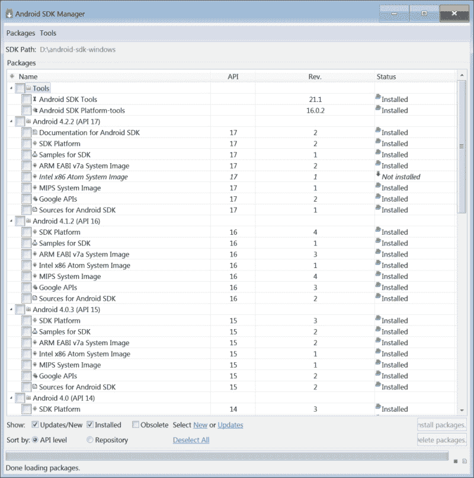
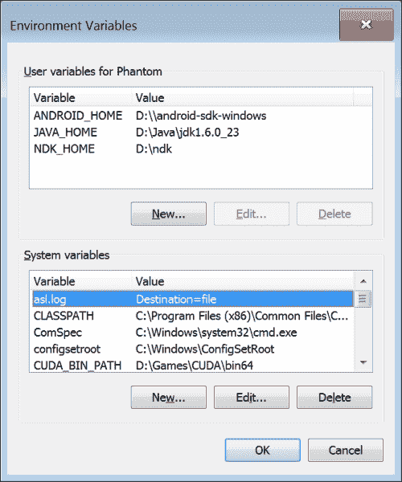
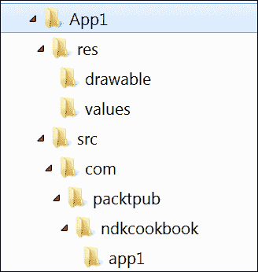
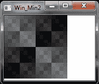
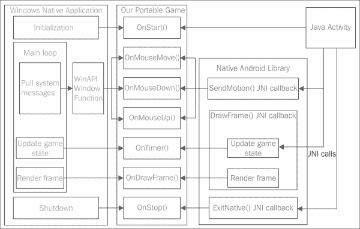

# 一、构建环境

|   | *一些 LinkedIn 个人资料说，用特定的 IDE 开发是一种技能。**不！没有任何 IDE 的开发才是技能！* |   |
|   | - *谢尔盖·科萨雷夫斯基* |

在本章中，我们将介绍以下食谱:

*   在 Windows 上安装安卓开发工具
*   在 Linux 上安装安卓开发工具
*   手动创建应用模板
*   向应用添加本机 C++代码
*   切换 NDK 工具链
*   支持多种中央处理器架构
*   使用 OpenGL ES 进行基本渲染
*   穿过站台
*   统一跨平台代码
*   链接和源代码组织
*   安卓应用签约发布

# 简介

本章介绍如何在微软视窗或 Ubuntu/Debian Linux 上安装和配置 Android NDK，以及如何在基于 Android 的设备上构建和运行您的第一个应用。我们将学习如何设置安卓 NDK 附带的不同编译器和工具链。此外，我们还展示了如何为 Windows 设置 GCC 工具链来构建您的项目。本章的其余部分致力于使用 C++进行跨平台开发。

# 在 Windows 上安装安卓开发工具

要开始为安卓系统开发游戏，你需要在你的系统上安装一些必要的工具。

## 做好准备

以下是开始为安卓开发游戏所需的所有先决条件:

*   Android SDK at [http://developer.android.com/sdk/index.html](http://developer.android.com/sdk/index.html).

    ### 注

    本书基于 Android SDK 22.3 版，用 Android API Level 19 测试。

*   安卓 NDK 在[http://developer.android.com/tools/sdk/ndk/index.html](http://developer.android.com/tools/sdk/ndk/index.html)(我们用的是安卓 NDK r9b)。
*   阿帕奇蚂蚁在[http://ant.apache.org](http://ant.apache.org)。这是一个 Java 命令行工具，C++开发人员可能不熟悉。它的目的是构建 Java 应用，由于每个安卓应用都有一个 Java 包装器，这个工具将帮助我们将它们打包成档案准备部署(这些被称为`.apk`包，代表**安卓包**)。
*   位于[的 Java SE 开发工具包](http://www.oracle.com/technetwork/java/javase/downloads/index.html)。

以前版本的视窗软件开发工具包/NDK 需要安装一个类似于 Linux 的视窗环境。这些工具的最新版本可以在没有任何中间层的情况下在 Windows 上本地运行。我们将专注于无 Cygwin 的环境，并将在没有 IDE 的情况下完成所有开发。你没听错，我们只使用命令行。这本书里的所有例子都是在 Windows 电脑上编写和调试的。

要编译本书中介绍的本机 Windows 应用，您将需要一个像样的 C++编译器，例如带有 GCC 工具链的 MinGW 包。使用微软的 Visual Studio 也是可以的。

### 注

**Windows 的极简 GNU**(**MinGW**)是 Windows 应用的极简开发环境，使用 **GNU 编译器集合** ( **GCC** )的一个端口。

## 怎么做...

1.  Android SDK and NDK should be installed into folders that do not contain any whitespaces in their names.

    ### 注

    这个要求来自于 Android SDK 中脚本的限制。关于 StackOverflow 有一个很好的讨论，它解释了在[http://stackoverflow.com/q/6603194/1065190](http://stackoverflow.com/q/6603194/1065190)这些限制背后的一些原因。

2.  其他工具可以安装到它们的默认位置。我们在 Windows 7 系统中使用了以下路径:

<colgroup><col style="text-align: left"> <col style="text-align: left"></colgroup> 
| 

工具

 | 

小路

 |
| --- | --- |
| 安卓 SDK | `D:\android-sdk-windows` |
| 安卓 NDK | `D:\ndk` |
| 阿帕奇人 Ant | `D:\ant` |
| Java 开发工具包 | `C:\Program Files\Java\jdk1.6.0_33` |

所有工具都有相当不错的图形用户界面安装程序(见下图，显示了来自 SDK R21 的安卓 SDK 管理器)，因此您不必使用命令行。



对于 Windows 环境，你需要 MinGW GCC 工具链。在[http://www.equation.com](http://www.equation.com)的**编程工具**部分， **Fortran，C，C++** 小节中可以找到易于安装的一体机包。或者，您可以从[http://www.mingw.org](http://www.mingw.org)下载官方安装程序。我们将使用来自[www.equation.com](http://www.equation.com)的

## 还有更多...

您需要设置一些环境变量，让工具知道文件的位置。`JAVA_HOME`变量应该指向 Java 开发工具包文件夹。`NDK_HOME`变量应该指向安卓 NDK 安装文件夹，`ANDROID_HOME`应该指向安卓 SDK 文件夹(注意双反斜杠)。我们使用了以下环境变量值:

`JAVA_HOME=D:\Java\jdk1.6.0_23`

`NDK_HOME=D:\ndk`

`ANDROID_HOME=D:\\android-sdk-windows`

最终配置看起来类似于下面截图中显示的配置，显示了 Windows **环境变量**对话框:



在 MinGW 已经成功安装之后，您还应该将`bin`文件夹从其安装文件夹添加到`PATH`环境变量中。例如，如果 MinGW 安装到`C:\MinGW`，那么`PATH`应该包含`C:\MinGW\bin`文件夹。

# 在 Linux 上安装安卓开发工具

在 Linux 上安装基本工具就像在 Windows 上一样简单。在这个食谱中，我们将看到如何在*nix 系统上安装基本的安卓开发工具。

## 做好准备

我们假设你已经有了一个带有`apt`包管理器的 Ubuntu/Debian 系统。详见[http://wiki.debian.org/Apt](http://wiki.debian.org/Apt)。

## 怎么做...

执行以下步骤安装所需的基本工具:

1.  通过运行以下命令，确保您正在为您的操作系统使用最新版本的软件包:

    ```cpp
    >sudo apt-get update

    ```

2.  安装 open JDK 6+:# t0]
3.  安装 Apache Ant 构建自动化工具:

    ```cpp
    >sudo apt-get install ant

    ```

4.  从[http://developer.android.com](http://developer.android.com)下载官方安卓 SDK。旁边还有一个更大的包，带有 Eclipse 集成开发环境的 ADT 插件。然而，由于我们所有的开发都是从命令行进行的，所以我们不需要它。运行以下命令:

    ```cpp
    >wget http://dl.google.com/android/android-sdk_r22.2.1-linux.tgz

    ```

5.  打开下载的。`tgz`文件(实际版本可能有所不同，22.2.1 是截至 2013 年 10 月的最新版本):

    ```cpp
    >tar -xvf android-sdk_r22.2.1-linux.tgz

    ```

6.  Use `~/<sdk>/tools/android` to install the latest Platform Tools and all of the SDKs—just like in the Windows case.

    如果不这样做，在为安卓构建任何应用时，尝试使用蚂蚁工具时将会出错。

7.  从[http://developer.android.com](http://developer.android.com)获取官方安卓 NDK:

    ```cpp
    >wget http://dl.google.com/android/ndk/android-ndk-r9b-linux-x86_64.tar.bz2

    ```

8.  打开下载的 NDK `.tgz`文件:

    ```cpp
    >tar -xvf android-ndk-r9b-linux-x86_64.tar.bz2

    ```

9.  Set the `NDK_ROOT` environment variable to your Android NDK directory (for example, `~/android-ndk-r9b` in our case):

    ```cpp
    >NDK_ROOT=/path/to/ndk

    ```

    如果这些设置适用于系统的所有用户，将该行和`JAVA_HOME`定义放在`/etc/profile`或`/etc/environment`中是有用的。

10.  如果您运行的是 64 位系统，您必须确保您也安装了 32 位 Java 运行时。
11.  运行以下命令安装库。否则可能会导致`adb`和`aapt`工具出错:

    ```cpp
    >sudo apt-get install ia32-libs

    ```

## 还有更多...

有一个很好的单行脚本可以帮助您自动检测 OpenJDK 主目录。它本质上将链接`/usr/bin/javac`解析为完整路径，并返回路径的目录部分。

```cpp
 JAVA_HOME=$(readlink -f /usr/bin/javac | sed "s:bin/javac::")

```

# 手动创建应用模板

首先，我们将为我们的应用创建一个基本模板。每个通过安卓软件开发工具包构建的安卓应用都应该包含一个预定义的目录结构和配置`.xml`文件。这可以使用 Android SDK 工具和 IDEs 来完成。在这个食谱中，我们将学习如何手工制作。稍后，我们将使用这些文件作为所有示例的起点。

## 做好准备

让我们设置我们项目的目录结构(见下面的截图):



这是任何安卓项目的典型结构。我们将手动创建所有需要的文件，而不是使用安卓工具。

## 怎么做...

将 Java`Activity`代码放入`App1\src\com\packtpub\ndkcookbook\app1\App1Activity.java file`中，应该如下所示:

```cpp
package com.packtpub.ndkcookbook.app1;
import android.app.Activity;
public class App1Activity extends Activity
{
};
```

可本地化的应用名称应转到`App1\res\values\strings.xml`。字符串参数`app_name`在`AndroidManifest.xml`文件中用于指定用户可读的应用名称，如以下代码所示:

```cpp
<?xml version="1.0" encoding="utf-8"?>
<resources>
    <string name="app_name">App1</string>
</resources>
```

现在我们需要为 Apache Ant 和 Android SDK 构建系统编写更多的脚本。它们是构建应用的`.apk`包所必需的。

1.  以下是`App1/project.properties`文件:

    ```cpp
    target=android-15
    sdk.dir=d:/android-sdk-windows
    ```

2.  We need two more files for Ant. The following is `App1/AndroidManifest.xml`:

    ```cpp
    <?xml version="1.0" encoding="utf-8"?>
    <manifest xmlns:android="http://schemas.android.com/apk/res/android"
      package="com.packtpub.ndkcookbook.app1"
      android:versionCode="1"
      android:versionName="1.0.0">
      <supports-screens
         android:smallScreens="false"
         android:normalScreens="true"
         android:largeScreens="true"
         android:xlargeScreens="true"
         android:anyDensity="true" />
      <uses-sdk android:minSdkVersion="8" />
      <uses-sdk android:targetSdkVersion="18" />
    ```

    我们的例子至少需要 OpenGL ES 2。让安卓知道这件事:

    ```cpp
      <uses-feature android:glEsVersion="0x00020000"/>
      <application android:label="@string/app_name"
                   android:icon="@drawable/icon"
                   android:installLocation="preferExternal"
                   android:largeHeap="true"
                   android:debuggable="false">
      <activity android:name="com.packtpub.ndkcookbook.app1.App1Activity"
    android:launchMode="singleTask"
    ```

    以横向屏幕方向创建全屏应用:

    ```cpp
                      android:theme="@android:style/Theme.NoTitleBar.Fullscreen"
                      android:screenOrientation="landscape"
                      android:configChanges="orientation|keyboardHidden"
                      android:label="@string/app_name">
        <intent-filter>
          <action android:name="android.intent.action.MAIN" />
          <category android:name="android.intent.category.LAUNCHER" />
         </intent-filter>
       </activity>
     </application>
    </manifest>
    ```

    第二档是`App1/build.xml`:

    ```cpp
    <?xml version="1.0" encoding="UTF-8"?>
    <project name="App1" default="help">
        <property file="ant.properties" />
        <loadproperties srcFile="project.properties" />
        <import file="${sdk.dir}/tools/ant/build.xml" />
    </project>
    ```

## 它是如何工作的...

有了所有列出的文件，我们现在可以通过执行以下步骤来构建项目并将其安装在安卓设备上:

1.  从`App1`文件夹运行:

    ```cpp
    >ant debug

    ```

2.  前一个命令的输出尾部应该看起来像:

    ```cpp
    BUILD SUCCESSFUL
    Total time: 12 seconds

    ```

3.  而搭建的调试`.apk`包就在`bin/App1-debug.apk`里。
4.  To install the app, run:

    ```cpp
    >adb install App1-debug.apk

    ```

    ### 注

    运行此命令前，不要忘记通过 USB 连接设备，并在安卓设置中打开 USB 调试。

5.  您应该会看到`adb`的输出，类似于以下命令:

    ```cpp
    * daemon not running. starting it now on port 5037 *
    * daemon started successfully *
    1256 KB/s (8795 bytes in 0.006s)
     pkg: /data/local/tmp/App1-debug.apk
    Success

    ```

应用现在可以从你的安卓启动器(名为`App1`)启动。你会看到一个黑屏。您可以使用**后退**按钮退出应用。

## 还有更多...

别忘了把应用图标放入`App1\res\drawable\icon.png`。如果你想快速构建应用，或者把你自己的图标放在那里，请参考这本书的代码包。72 x 72 32 位就可以了。你可以在[http://developer.android.com/design/style/iconography.html](http://developer.android.com/design/style/iconography.html)找到官方安卓图标指南。

`AndroidManifest.xml`文件的官方文档可在[http://developer . Android . com/guide/topics/manifest/manifest-intro . html](http://developer.android.com/guide/topics/manifest/manifest-intro.html)上找到。

此外，您可以通过以下方式使用`adb -r`命令行开关更新您的应用，而无需卸载以前的版本:

```cpp
>adb install -r App1-debug.apk

```

否则，在安装应用的新版本之前，您必须使用以下命令卸载现有版本:

```cpp
>adb uninstall <package-name>

```

## 另请参见…

*   *签约发布安卓应用*

# 向应用添加本机 C++代码

让我们扩展我们的极简 Java 模板，在前面的食谱中已经讨论过了，所以我们可以为我们的原生 C++代码创建一个占位符。

## 做好准备

我们需要从我们的`App1`项目中复制所有文件，以便在创建初始项目文件时节省时间。该配方将关注对`App1`项目进行的更改，以便向其中添加 C++代码。

## 怎么做...

执行以下步骤为我们的 C++代码创建一个占位符:

1.  用以下代码添加`jni/Wrappers.cpp`文件:

    ```cpp
    #include <stdlib.h>
    #include <jni.h>
    #include <android/log.h>
    #define LOGI(...) ((void)__android_log_print(ANDROID_LOG_INFO, "App2", __VA_ARGS__))

    extern "C"
    {
      JNIEXPORT void JNICALL
    Java_com_packtpub_ndkcookbook_app2_App2Activity_onCreateNative( JNIEnv* env, jobject obj )
        {
          LOGI( "Hello World!" );
        }
    }
    ```

2.  We need to change our `Activity` class from the previous recipe to make use of the native code we just added in the preceding section, through the following code:

    ```cpp
    package com.packtpub.ndkcookbook.app2;

    import android.app.Activity;
    import android.os.Bundle;

    public class App2Activity extends Activity
    {
        static
        {
    ```

    这里我们加载名为`libApp2.so`的原生库。注意省略的`lib`前缀和`.so`扩展名:

    ```cpp
          System.loadLibrary( "App2" );
        }
        @Override protected void onCreate( Bundle icicle )
        {
          super.onCreate( icicle );
          onCreateNative();
        }
        public static native void onCreateNative();
    };
    ```

3.  Tell the NDK build system how to treat the `.cpp` file. Create the `jni/Android.mk` file. The `Android.mk` file is used by the Android NDK build system to find out how to treat the source code of your project:

    ```cpp
    TARGET_PLATFORM := android-7
    LOCAL_PATH := $(call my-dir)
    include $(CLEAR_VARS)
    LOCAL_ARM_MODE := arm
    LOCAL_MODULE     := App2
    LOCAL_SRC_FILES += Wrappers.cpp
    LOCAL_ARM_MODE := arm
    COMMON_CFLAGS := -Werror -DANDROID -DDISABLE_IMPORTGL \
    -isystem $(SYSROOT)/usr/include/
    ifeq ($(TARGET_ARCH),x86)
    	LOCAL_CFLAGS   := $(COMMON_CFLAGS)
      else
    	LOCAL_CFLAGS   := -mfpu=vfp -mfloat-abi=softfp \
      -fno-short-enums $(COMMON_CFLAGS)
    endif
    LOCAL_LDLIBS     := -llog -lGLESv2 -Wl,-s
    LOCAL_CPPFLAGS += -std=gnu++0x
    include $(BUILD_SHARED_LIBRARY)
    ```

    注意`ifeq ($(TARGET_ARCH),x86)`部分。在这里，我们为 ARMv7 上的浮点支持指定了特定于架构的编译器标志。这将为您提供 ARM 架构上的硬件浮点支持，以及 x86 Android 目标架构上的无警告日志..

4.  将以下代码粘贴到`jni/Application.mk`文件中:

    ```cpp
    APP_OPTIM := release
    APP_PLATFORM := android-7
    APP_STL := gnustl_static
    APP_CPPFLAGS += -frtti 
    APP_CPPFLAGS += -fexceptions
    APP_CPPFLAGS += -DANDROID
    APP_ABI := armeabi-v7a
    APP_MODULES := App2
    NDK_TOOLCHAIN_VERSION := clang
    ```

## 它是如何工作的...

1.  首先，我们需要编译本机代码。从`App2`项目的根，运行以下命令:

    ```cpp
    >ndk-build

    ```

2.  您应该会看到以下输出:

    ```cpp
    Compile++ arm: App2 <= Wrappers.cpp
    SharedLibrary: libApp2.so
    Install      : libApp2.so => libs/armeabi-v7a/libApp2.so

    ```

3.  现在，通过运行以下命令，按照上一个配方继续进行`.apk`创建:

    ```cpp
    >ant debug

    ```

4.  您的`libApp2.so`原生共享库将被打包到`App2-debug.apk`包中。安装并运行它。它将输出一个`Hello World!`字符串到设备日志中。

## 还有更多...

您可以使用`adb`命令查看设备日志。可以使用以下命令创建一个带有时间戳的干净的格式化日志:

```cpp
>adb logcat -v time > 1.txt

```

设备的实际输出将类似于以下命令:

```cpp
05-22 13:00:13.861 I/App2    ( 2310): Hello World!

```

# 切换 NDK 工具链

工具链是用来构建项目的一组工具。工具链通常由编译器、汇编器和链接器组成。安卓 NDK 有不同版本的不同工具链——GCC 和 Clang。它有一个方便简单的方法在它们之间切换。

## 做好准备

继续之前，请查看可用工具链的列表。您可以在`$(NDK_ROOT)/toolchains/`文件夹中找到所有可用的工具链。

## 怎么做...

`Application.mk`中的参数`NDK_TOOLCHAIN_VERSION`对应于一个可用的刀具链。在 NDK r9b 中，您可以在三个 GCC 版本(4.6 和 4.7，它们被标记为不推荐使用，并将从下一个 NDK 版本和 4.8 中删除)之间切换。还有两个 Clang 版本——也标记为弃用的 Clang3.2 和 Clang 3.3。NDK r9b 中的默认工具链仍然是 GCC 4.6。

从 NDK r8e 开始，只需将`clang`指定为`NDK_TOOLCHAIN_VERSION`的值。该选项将选择最新版本的可用工具链。

## 还有更多...

工具链是由`$(NDK_ROOT)/build/core/init.mk`脚本发现的，因此您可以在名为`<ABI>-<ToolchainName>`的文件夹中定义自己的工具链，并在`Application.mk`中使用它。

# 支持多 CPU 架构

安卓 NDK 支持不同的 CPU 架构，比如基于 ARMv5TE 和 ARMv7 的设备、x86 和 MIPS(大端架构)。我们可以创建可以在任何支持的平台上运行的**胖**二进制文件。

## 做好准备

找出你的安卓设备的架构。您可以使用`adb`命令进行操作，如下所示:

```cpp
>adb shell cat /proc/cpuinfo

```

## 怎么做...

以下是选择一组合适的 CPU 架构的两种方法:

1.  默认情况下，NDK 将为基于 ARMv5TE 的 CPU 生成代码。使用`Application.mk`中的参数`APP_ABI`选择不同的架构，例如(仅使用以下列表中的一行):

    ```cpp
    APP_ABI := armeabi-v7a
    APP_ABI := x86
    APP_ABI := mips
    ```

2.  我们可以指定多个体系结构来创建一个胖二进制文件，该文件将通过以下命令在其中的任何一个上运行:

    ```cpp
    APP_ABI := armeabi armeabi-v7a x86 mips
    ```

## 还有更多...

胖二进制文件的主要缺陷是最终的`.apk`大小，因为为每个指定的架构编译了单独的本机代码版本。如果您的应用大量使用第三方库，包的大小可能会成为一个问题。明智地规划你的可交付成果。

# 用 OpenGL ES 进行基本渲染

让我们在我们的示例安卓应用`App2`中添加一些图形。在这里，我们展示如何创建一个屏幕外位图，然后使用你的安卓设备上的 OpenGL ES Version 2 或 3 将其复制到屏幕上。

### 注

有关完整的源代码，请参考本书可下载代码包中的`App3`示例。

## 做好准备

我们假设读者对 OpenGL 和 **GL 着色语言** ( **GLSL** )有些熟悉。桌面 OpenGL 参见[http://www.opengl.org/documentation](http://www.opengl.org/documentation)，手机 OpenGL ES 文档参见[http://www.khronos.org/opengles](http://www.khronos.org/opengles)。

## 怎么做…

1.  我们需要写一个简单的顶点和片段 GLSL 着色器，它将使用 OpenGL ES 在屏幕上渲染我们的帧缓冲区。让我们将它们作为字符串直接放入`jni/Wrappers.cpp`中。以下代码显示了顶点着色器:

    ```cpp
    static const char g_vShaderStr[] =
       "#version 100\n"
       "precision highp float;\n"
       "attribute vec3 vPosition;\n"
       "attribute vec3 vCoords;\n"
       "varying vec2 Coords;\n"
       "void main()\n"
       "{\n"
       "   Coords = vCoords.xy;\n"
       "   gl_Position = vec4( vPosition, 1.0 );\n"
       "}\n";
    ```

2.  片段着色器是，如下所示:

    ```cpp
    static const char g_fShaderStr[] =
       "#version 100\n"
       "precision highp float;\n"
       "varying vec2 Coords;\n"
       "uniform sampler2D Texture0;\n"
       "void main()\n"
       "{\n"
       "   gl_FragColor = texture2D( Texture0, Coords );\n"
       "}\n";
    ```

3.  我们还需要以下助手函数来将我们的着色器加载到 OpenGL ES 中:

    ```cpp
    static GLuint LoadShader( GLenum type, const char* shaderSrc )
    {
       GLuint shader = glCreateShader( type );
       glShaderSource ( shader, 1, &shaderSrc, NULL );
       glCompileShader ( shader );
       GLint compiled;
       glGetShaderiv ( shader, GL_COMPILE_STATUS, &compiled );
       GLsizei MaxLength = 0;
       glGetShaderiv( shader, GL_INFO_LOG_LENGTH, &MaxLength );
       char* InfoLog = new char[MaxLength];
       glGetShaderInfoLog( shader, MaxLength, &MaxLength, InfoLog );
       LOGI( "Shader info log: %s\n", InfoLog );
       return shader;
    }
    ```

## 它是如何工作的…

我们在这里不讨论关于 OpenGL ES 编程的所有细节，而是将重点放在一个应该在 Java 中初始化`GLView`的最小应用(`App3`)上；创建片段和顶点程序，创建并填充由两个三角形组成的顶点阵列，形成单个四边形，然后用纹理渲染它们，纹理是从`g_FrameBuffer`内容更新的。就是这样——画出屏幕外的帧缓冲区。以下是使用屏幕外缓冲区内容绘制全屏四边形纹理的代码:

```cpp
  const GLfloat vVertices[] = { -1.0f, -1.0f, 0.0f,
                                -1.0f,  1.0f, 0.0f,
                                 1.0f, -1.0f, 0.0f,
                                -1.0f,  1.0f, 0.0f,
                                1.0f, -1.0f, 0.0f,
                                1.0f,  1.0f, 0.0f
                              };

  const GLfloat vCoords[]   = {  0.0f,  0.0f, 0.0f,
                                 0.0f,  1.0f, 0.0f,
                                 1.0f,  0.0f, 0.0f,
                                 0.0f,  1.0f, 0.0f,
                                 1.0f,  0.0f, 0.0f,
                                 1.0f,  1.0f, 0.0f
                              };
  glUseProgram ( g_ProgramObject );
```

这些属性变量在顶点着色器中声明。参见前面代码中`g_vShaderStr[]`的值。

```cpp
  GLint Loc1 = glGetAttribLocation(g_ProgramObject,"vPosition");
  GLint Loc2 = glGetAttribLocation(g_ProgramObject,"vCoords");

  glBindBuffer( GL_ARRAY_BUFFER, 0 );
  glBindBuffer( GL_ELEMENT_ARRAY_BUFFER, 0 );
  glVertexAttribPointer(
    Loc1, 3, GL_FLOAT, GL_FALSE, 0, vVertices );
  glVertexAttribPointer(
    Loc2, 3, GL_FLOAT, GL_FALSE, 0, vCoords   );
  glEnableVertexAttribArray( Loc1 );
  glEnableVertexAttribArray( Loc2 );

  glDisable( GL_DEPTH_TEST );
  glDrawArrays( GL_TRIANGLES, 0, 6 );
  glUseProgram( 0 );
  glDisableVertexAttribArray( Loc1 );
  glDisableVertexAttribArray( Loc2 );
```

我们还需要一些 JNI 的回调。第一个处理曲面尺寸的变化，如下面的代码所示:

```cpp
  JNIEXPORT void JNICALLJava_com_packtpub_ndkcookbook_app3_App3Activity_SetSurfaceSize(JNIEnv* env, jclass clazz, int Width, int Height )
  {
    LOGI( "SurfaceSize: %i x %i", Width, Height );
    g_Width  = Width;
    g_Height = Height;
    GLDebug_LoadStaticProgramObject();
    glGenTextures( 1, &g_Texture );
    glBindTexture( GL_TEXTURE_2D, g_Texture );
```

通过以下代码禁用 mip 映射:

```cpp
    glTexParameteri( GL_TEXTURE_2D,GL_TEXTURE_MIN_FILTER, GL_NEAREST );
    glTexImage2D( GL_TEXTURE_2D, 0, GL_RGBA,ImageWidth, ImageHeight, 0, GL_RGBA,GL_UNSIGNED_BYTE, g_FrameBuffer );
  }
```

第二次回调做实际的帧渲染:

```cpp
  JNIEXPORT void JNICALL Java_com_packtpub_ndkcookbook_app3_App3Activity_DrawFrame( JNIEnv* env, jobject obj )
  {
```

通过以下代码调用我们的框架渲染回调:

```cpp
    OnDrawFrame();

    glActiveTexture( GL_TEXTURE0 );
    glBindTexture( GL_TEXTURE_2D, g_Texture );
    glTexSubImage2D( GL_TEXTURE_2D, 0, 0, 0,ImageWidth, ImageHeight, GL_RGBA,GL_UNSIGNED_BYTE, g_FrameBuffer );
    GLDebug_RenderTriangle();
  }
```

# 走跨站台

主要思想是“所见即所得”(在 PC 上)中跨平台开发的可能性，此时大部分应用逻辑都可以在 Windows 这样熟悉的桌面环境中开发，必要时可以使用 NDK 为 Android 构建。

## 做好准备

为了执行我们刚才讨论的内容，我们必须在 NDK、POSIX 和 Windows API 之上实现某种抽象。这样的抽象至少应该具有以下特征:

*   **在屏幕上呈现缓冲区内容的能力**:我们的框架应该提供将屏幕外帧缓冲区(2D 像素阵列)的内容构建到屏幕上的功能(对于 Windows，我们将窗口称为“屏幕”)。
*   **事件处理**:框架必须能够处理多点触控输入和虚拟/物理按键(一些安卓设备，如东芝 AC 100，或 Ouya 控制台，以及其他游戏设备，具有物理按钮)、定时事件和异步操作完成。
*   **文件系统、网络和音频回放**:这些实体的抽象层需要您做大量的工作，因此实现在[第 3 章](03.html "Chapter 3. Networking")、*网络*、[第 4 章](04.html "Chapter 4. Organizing a Virtual Filesystem")、*组织虚拟文件系统*和[第 5 章](05.html "Chapter 5. Cross-platform Audio Streaming")、*跨平台音频流*中介绍。

## 怎么做...

1.  让我们继续为 Windows 环境编写一个最小的应用，因为我们已经有了用于 Android 的应用(例如，`App1`)。一个极简的视窗图形用户界面应用是创建一个单一的窗口，并开始事件循环(见下面的例子在`Win_Min1/main.c` ):

    ```cpp
    #include <windows.h>

    LRESULT CALLBACK MyFunc(HWND h, UINT msg, WPARAM w, LPARAM p)
    {
      if(msg == WM_DESTROY) { PostQuitMessage(0); }
      return DefWindowProc(h, msg, w, p);
    }

    char WinName[] = "MyWin";
    ```

2.  切入点和安卓不一样。然而，它的目的保持不变——初始化表面渲染并调用回调:

    ```cpp
    int main()
    {
      OnStart();

      const char WinName[] = "MyWin";

      WNDCLASS wcl;
      memset( &wcl, 0, sizeof( WNDCLASS ) );
      wcl.lpszClassName = WinName;
      wcl.lpfnWndProc = MyFunc;
      wcl.hCursor = LoadCursor( NULL, IDC_ARROW );

      if ( !RegisterClass( &wcl ) ) { return 0; }

      RECT Rect;

      Rect.left = 0;
      Rect.top = 0;
    ```

3.  窗口工作区的大小被预定义为`ImageWidth`和`ImageHeight`常量。但是，WinAPI 函数`CreateWindowA()` 接受的不是客户端区域的大小，而是窗口的大小，包括标题、边框和其他装饰。我们需要通过以下代码调整窗口矩形，将客户区域设置为所需的大小:

    ```cpp
      Rect.right  = ImageWidth;
      Rect.bottom = ImageHeight;

      DWORD dwStyle = WS_OVERLAPPEDWINDOW;

      AdjustWindowRect( &Rect, dwStyle, false );

      int WinWidth  = Rect.right  - Rect.left;
      int WinHeight = Rect.bottom - Rect.top;

      HWND hWnd = CreateWindowA( WinName, "App3", dwStyle,100, 100, WinWidth, WinHeight,0, NULL, NULL, NULL );
      ShowWindow( hWnd, SW_SHOW );

      HDC dc = GetDC( hWnd );
    ```

4.  创建屏幕外设备上下文和位图，通过以下代码保存屏幕外帧缓冲区:

    ```cpp
      hMemDC = CreateCompatibleDC( dc );
      hTmpBmp = CreateCompatibleBitmap( dc,ImageWidth, ImageHeight );
      memset( &BitmapInfo.bmiHeader, 0,sizeof( BITMAPINFOHEADER ) );
      BitmapInfo.bmiHeader.biSize = sizeof( BITMAPINFOHEADER );
      BitmapInfo.bmiHeader.biWidth = ImageWidth;
      BitmapInfo.bmiHeader.biHeight = ImageHeight;
      BitmapInfo.bmiHeader.biPlanes = 1;
      BitmapInfo.bmiHeader.biBitCount = 32;
      BitmapInfo.bmiHeader.biSizeImage = ImageWidth*ImageHeight*4;
      UpdateWindow( hWnd );
    ```

5.  创建应用窗口后，我们必须运行一个典型的消息循环:

    ```cpp
      MSG msg;
      while ( GetMessage( &msg, NULL, 0, 0 ) )
      {
        TranslateMessage( &msg );
        DispatchMessage( &msg );
      }
      …
    }
    ```

6.  这个程序只处理窗口破坏事件，不渲染任何东西。该程序的编译通过如下单个命令完成:

    ```cpp
    >gcc -o main.exe main.c -lgdi32
    ```

## 它是如何工作的…

为了在屏幕上呈现一个帧缓冲区，我们需要创建一个所谓的带有相关位图的设备上下文，并将`WM_PAINT`事件处理程序添加到窗口函数中。

为了处理键盘和鼠标事件，我们在前一个程序中的`switch`语句中添加了`WM_KEYUP`和`WM_MOUSEMOVE`两种情况。实际事件处理在外部提供的例程`OnKeyUp()`和`OnMouseMove()`中执行，它们包含我们的游戏逻辑。

以下是程序的完整源代码(省略了一些与上例类似的省略部分)。函数`OnMouseMove()`、`OnMouseDown()`、`OnMouseUp()`、接受两个存储鼠标指针当前坐标的整数参数。功能`OnKeyUp()`和`OnKeyDown()`接受单个参数——按下(或释放)的按键代码:

```cpp
#include <windows.h>

HDC hMemDC;
HBITMAP hTmpBmp;
BITMAPINFO BmpInfo;
```

在以下代码中，我们存储了我们的全局 RGBA 帧缓冲区:

```cpp
unsigned char* g_FrameBuffer;
```

我们在这个回调中进行所有与操作系统无关的帧渲染。我们在帧缓冲区中绘制一个简单的异或模式([http://lodev.org/cgtutor/xortexture.html](http://lodev.org/cgtutor/xortexture.html))如下:

```cpp
void DrawFrame()
{
  int x, y;
  for (y = 0 ; y < ImageHeight ; y++)
  {
    for (x = 0 ; x < ImageWidth ; x++)
    {
      int Ofs = y * ImageWidth + x;
      int c = (x ^ y) & 0xFF;
      int RGB = (c<<16) | (c<<8) | (c<<0) | 0xFF000000;
      ( ( unsigned int* )g_FrameBuffer )[ Ofs ] =	RGB;
    }
  }
}
```

以下代码显示了`WinAPI`窗口功能:

```cpp
LRESULT CALLBACK MyFunc(HWND h, UINT msg, WPARAM w, LPARAM p)
{
  PAINTSTRUCT ps;
  switch(msg)
  {
  case WM_DESTROY:
    PostQuitMessage(0);
break;
  case WM_KEYUP:
    OnKeyUp(w);
break;
  case WM_KEYDOWN:
    OnKeyDown(w);
break;
  case WM_LBUTTONDOWN:
    SetCapture(h);
    OnMouseDown(x, y);
break;
  case WM_MOUSEMOVE:
    OnMouseMove(x, y);
break;
  case WM_LBUTTONUP:
    OnMouseUp(x, y);
    ReleaseCapture();
break;
  case WM_PAINT:
    dc = BeginPaint(h, &ps);
    DrawFrame();         
```

通过以下代码将`g_FrameBuffer`转换为位图:

```cpp
    SetDIBits(hMemDC, hTmpBmp, 0, Height,g_FrameBuffer, &BmpInfo, DIB_RGB_COLORS);
    SelectObject(hMemDC, hTmpBmp);
```

并通过以下代码将其复制到窗口表面:

```cpp
    BitBlt(dc, 0, 0, Width, Height, hMemDC, 0, 0, SRCCOPY);
    EndPaint(h, &ps);
break;
  }
  return DefWindowProc(h, msg, w, p);
}
```

因为我们的项目包含一个 make 文件，所以编译可以通过一个命令来完成:

```cpp
>make all

```

运行这个程序应该会产生如下截图所示的结果，显示了在 Windows 上运行的 **Win_Min2** 示例:



## 还有更多…

安卓和 Windows 实现主循环的主要区别可以总结如下。在 Windows 中，我们控制着主循环。我们实际上声明了一个循环，它从系统中提取消息，处理输入，更新游戏状态，并渲染帧(下图中标记为绿色)。每个阶段从我们的便携式游戏中调用一个适当的回调(在下图中用蓝色表示)。相反，安卓部分的工作方式完全不同。主循环远离本机代码，位于 **Java Activity** 和 **GLSurfaceView** 类中。它调用我们在包装器原生库中实现的 JNI 回调(红色显示)。本机包装调用我们的便携式游戏回调。让我们用下面的方式总结一下:



本书的其余部分集中在这种架构上，游戏功能将在这些便携式 **On 中实现...()**回调。

还有一个重要的注意事项。通过`SetTimer()`调用和`WM_TIMER`消息处理程序，可以在 Windows 上响应定时器事件来创建动画。我们在[第 2 章](02.html "Chapter 2. Porting Common Libraries")、*移植公共库、*中谈到刚体物理模拟时谈到了这一点。但是，组织一个固定的时间步长主循环要好得多，这将在本书后面解释。

## 另见

*   [第六章](06.html "Chapter 6. Unifying OpenGL ES 3 and OpenGL 3")、*统一 OpenGL ES 3 和 OpenGL 3*
*   食谱*在[第八章](08.html "Chapter 8. Writing a Match-3 Game")*中实现主循环*，编写一个 Match-3 游戏*

# 统一跨平台代码

现在，我们有两个不同版本的简单程序(`Win_Min2`和`App3`)。让我们看看如何统一代码的公共部分。

## 做好准备

在 Android 中，应用初始化阶段是不同的，由于我们使用的是混合 Java 加 C++的方法，所以入口点会有所不同。在 C++中，我们被绑定到，`int main()`或 `DWORD WinMain()`函数；而在安卓系统中，我们可以选择从 Java 启动代码中调用哪个 JNI 函数。事件处理和呈现初始化代码也大不相同。为此，我们用预处理器定义标记代码部分，并将不同的操作系统代码放入不同的文件中— `Wrappers_Android.h`和`Wrappers_Windows.h`。

## 怎么做...

我们使用标准宏来检测正在为其编译程序的操作系统:面向 Windows 的编译器提供`_WIN32`符号定义，`__linux__`宏在任何基于 Linux 的操作系统上定义，包括安卓。然而，`__linux__`的定义是不够的，因为一些应用编程接口在安卓系统中缺失了。宏`ANDROID`是非标准宏，我们将`-DANDROID`开关传递给我们的编译器，以在我们的 C++代码中识别安卓目标。为了使每个源文件都这样，我们修改了`Android.mk`文件中的`CFLAGS`变量。

最后，当我们编写低级代码时，检测看起来像下面的代码:

```cpp
#if defined(_WIN32)
// windows-specific code
#elif defined(ANDROID)
// android-specific code
#endif
```

例如，为了使安卓和 Windows 版本的入口点看起来相同，我们编写了以下代码:

```cpp
#if defined(_WIN32)
#  define APP_ENTRY_POINT()  int main()
#elif defined(ANDROID)
#  define APP_ENTRY_POINT() int App_Init()
#endif
```

稍后我们将用`APP_ENTRY_POINT()`宏替换`int main()`定义。

## 还有更多...

要检测更多的操作系统、编译器和中央处理器架构，查看 http://predef.sourceforge.net T2 的预定义宏列表是很有用的。

# 链接和源代码组织

在前面的食谱中，我们学习了如何创建允许我们在安卓和窗口上运行应用的基本包装器。然而，我们使用了一种特别的方法，因为源代码的数量很少，并且适合一个文件。我们必须以一种适合在 Windows 和 Android 中为更大的项目构建代码的方式来组织我们的项目源文件。

## 做好准备

回忆一下`App3`项目的文件夹结构。我们的`App2`文件夹中有`src`和`jni`文件夹。`jni/Android.mk`、`jni/Application.mk`和`build.xml`文件指定了安卓构建过程。为了能够创建 Windows 可执行文件，我们添加了一个名为`Makefile`的文件，它引用了`main.cpp`文件。

## 怎么做...

以下是`Makefile`的内容:

```cpp
CC = gcc
all:
  $(CC) -o main.exe main.cpp -lgdi32 -lstdc++
```

其思想是，当我们添加越来越多与操作系统无关的逻辑时，代码驻留在`.cpp`文件中，这些文件不引用任何特定于操作系统的头或库。对于前几章，这个简单的框架将帧渲染和事件处理委托给与操作系统无关的可移植函数(`OnDrawFrame()`、`OnKeyUp()`等)就足够了。

## 它是如何工作的...

我们后面章节中的所有例子都可以通过命令行使用单个`make all`命令来构建。安卓原生代码可以通过一个`ndk-build`命令构建。我们将在本书的其余部分使用这个惯例。

# 签约发布安卓应用

现在我们可以创建一个跨平台的应用，在 PC 上调试，部署到安卓设备上。但是，我们不能在 GooglePlay 上上传它，因为它还没有用发布密钥正确签名。

## 做好准备

开发者手册[http://developer . Android . com/tools/publishing/app-signing . html](http://developer.android.com/tools/publishing/app-signing.html)给出了安卓上的签名程序的详细说明。我们将着重于从命令行签名，并通过批处理文件自动化整个过程。

## 怎么做...

首先，我们需要重建项目，创建`.apk`包的发布版本。让我们用我们的`App2`项目来做吧:

```cpp
>ndk-build -B
>ant release

```

您应该会从`Ant`中看到很多文本输出，其结尾类似于以下命令:

```cpp
-release-nosign:
[echo] No key.store and key.alias properties found in build.properties.
[echo] Please sign App2\bin\App2-release-unsigned.apk manually
[echo] and run zipalign from the Android SDK tools.

```

让我们使用来自 JDK 的`keytool`通过以下命令生成自签名释放密钥:

```cpp
>keytool -genkey -v -keystore my-release-key.keystore -alias alias_name -keyalg RSA -keysize 2048 -validity 10000

```

填写密钥所需的所有字段，如以下命令所示:

```cpp
Enter keystore password:
Re-enter new password:
What is your first and last name?
 [Unknown]:  Sergey Kosarevsky
What is the name of your organizational unit?
 [Unknown]:  SD
What is the name of your organization?
 [Unknown]:  Linderdaum
What is the name of your City or Locality?
 [Unknown]:  St.Petersburg
What is the name of your State or Province?
 [Unknown]:  Kolpino
What is the two-letter country code for this unit?
 [Unknown]:  RU
Is CN=Sergey Kosarevsky, OU=SD, O=Linderdaum, L=St.Petersburg, ST=Kolpino, C=RU correct?
 [no]:  yes

Generating 2048 bit RSA key pair and self-signed certificate (SHA1withRSA) with a validity of 10000 days
 for: CN=Sergey Kosarevsky, OU=SD, O=Linderdaum, L=St.Petersburg, ST=Kolpino, C=RU
Enter key password for <alias_name>
 (RETURN if same as keystore password):
[Storing my-release-key.keystore]

```

现在我们准备进行实际应用的签署。通过以下代码使用 JDK 的`jarsigner`工具:

```cpp
>jarsigner -verbose -sigalg MD5withRSA -digestalg SHA1 -keystore my-release-key.keystore bin\App2-release-unsigned.apk alias_name

```

该命令是交互式的，需要用户输入密钥库密码和密钥密码。但是，我们可以通过以下方式在批处理文件中提供密码:

```cpp
>jarsigner -verbose -sigalg MD5withRSA -digestalg SHA1 -keystore my-release-key.keystore -storepass 123456 –keypass 123456 bin\App2-release-unsigned.apk alias_name

```

密码应该与您在创建发布密钥和密钥库时输入的匹配。

在我们可以安全地在 GooglePlay 上发布我们的`.apk`包之前，还有一步。安卓应用可以使用`mmap()`调用在`.apk`内访问未压缩的内容。然而，`mmap()`可能意味着对底层数据的一些对齐限制。我们需要在 4 字节的边界上对齐`.apk`内的所有未压缩数据。Android SDK 有`zipalign`工具可以做到，如下命令所示:

```cpp
>zipalign -v 4 bin\App2-release-unsigned.apk App2-release.apk

```

现在我们的`.apk`准备出版了。

## 另见

*   [第二章](02.html "Chapter 2. Porting Common Libraries")*移植公共库*