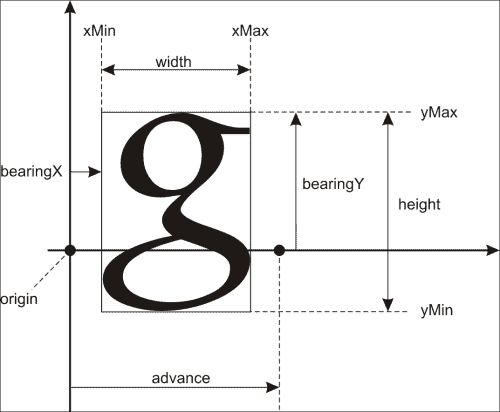
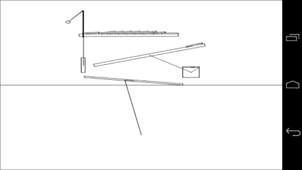

# 第二章。移植公共库

在本章中，我们将介绍:

*   为 Windows 编译本机静态库
*   为安卓编译本地静态库
*   编译 libcurl 网络库
*   编译开放库
*   编译 libvorbis、libmodplug 和 libtheora
*   使用 FreeImage 图形库
*   使用 FreeType 库进行文本呈现
*   在物理中实现计时
*   在 2D 渲染图形
*   设置 Box2D 模拟
*   构建 ODE 物理库

# 简介

本章介绍如何使用**安卓 NDK** 将现有的流行 C/C++库移植到安卓系统。这些库被广泛用于实现功能丰富的应用程序，包括完全用 C++实现的图形、声音和物理模拟。简单地编译库没有什么乐趣。因此，与 FreeImage、FreeType 和 Box2D 相关的部分提供了最少的示例来演示每个库的功能。音频和网络库将在后续章节中详细讨论。我们将向您展示如何编译库，当然，给出一些简短的示例和如何开始使用它们的提示。

跨不同处理器和操作系统移植库的典型警告是内存访问(结构对齐/填充)、字节顺序(字符顺序)、调用约定和浮点问题。下面描述的所有库都很好地解决了这些问题，即使它们中的一些没有正式支持安卓 NDK，修复这个问题也只是几个编译器开关的问题。

要构建上述任何一个库，我们需要为 Windows 版本创建 makefile，为 Android NDK 创建一对`Android.mk`和`Application.mk`文件。库的源文件被编译成目标文件。目标文件的集合被组合成一个归档文件，也称为静态库。稍后，这个静态库可以作为输入传递给链接器。我们从 Windows 版本开始，因为`Android.mk`和`Application.mk`文件是建立在标准 makefiles 之上的。

# 为 Windows 编译本机静态库

为了构建视窗版本的库，我们需要一个 C++编译器。我们使用 MinGW 和在[第 1 章](01.html "Chapter 1. Establishing a Build Environment")、*建立构建环境*中描述的 GCC 工具链。对于每个库，我们都有一个源代码文件的集合，我们需要得到静态库，一个扩展名为`.a`的文件。

## 做好准备

让我们假设`src`目录包含我们需要为安卓构建的库的源代码。

## 怎么做...

1.  Let us start with writing a makefile:

    ```cpp
    CFLAGS = -I src
    ```

    这一行定义了一个带有编译器命令行参数列表的变量。在我们的例子中，我们指示编译器在`src`目录中搜索头文件。如果库源代码跨越许多目录，我们需要为每个目录添加`–I`开关。

2.  Next, we add the following lines for each source file:

    ```cpp
    <SourceFile>.o:
      gcc $(CFLAGS) –c <SourceFile>.cpp –o <SourceFile>.o
    ```

    `<SourceFile>`应替换为`.cpp`源文件的实际名称，这些行应为每个源文件编写。

3.  现在，我们添加目标文件列表:

    ```cpp
    ObjectFiles = <SourceFile1>.o <SourceFile2>.o ...
    ```

4.  Finally, we write the target for our library:

    ```cpp
    <LibraryName>:
      ar –rvs <LibraryName>.a $(ObjectList)
    ```

    ### 注

    makefile 中的每一行，除了空行和目标的名称，都应该以列表字符开始。

5.  To build the library, invoke the following command:

    ```cpp
    >make <LibraryName>.a
    ```

    在我们的程序中使用库时，我们将`LibraryName.a`文件作为参数传递给`gcc`。

## 它是如何工作的...

Makefiles 由类似于编程语言中子程序的目标组成，通常每个目标都会生成一个目标文件。例如，我们已经看到库的每个源文件被编译成相应的目标文件。

目标名称可能包括文件名模式，以避免复制和粘贴，但在最简单的情况下，我们只是列出所有源文件，并复制那些用适当的文件名替换`SourceFile`的行。`gcc`命令后的`–c`开关是编译源文件的选项，`–o`指定输出目标文件的名称。`$(CFLAGS)`符号表示将`CFLAGS`变量的值替换为命令行。

视窗的 GCC 工具链包括`AR`工具，这是归档器的缩写。我们的库的 Makefiles 调用这个工具来创建库的静态版本。这是在 makefile 的最后几行完成的。

## 还有更多...

以下是编写 makefiles 的一些技巧:

1.  When a line, with a list of object files becomes too long, it can be split using the backslash symbol like the following:

    ```cpp
    ObjectFileList = File1.o \
       ... \
       FileN.o
    ```

    ### 注

    反斜杠后不应有空格。这是`make`工具的一个限制。

2.  有时候，评论是必需的。这可以通过写一行来完成，该行以一个尖锐的字符开始:

    ```cpp
    # This line is a comment
    ```

如果库的头文件与源文件不在同一个目录中，我们必须将这些目录添加到`CFLAGS`列表中。

# 编译安卓原生静态库

安卓 NDK 包括许多 GCC 和 Clang 工具链，适用于每种受支持的处理器。

## 做好准备

当从源代码构建静态库时，我们遵循类似于 Windows 版本的步骤。

## 怎么做...

1.  创建一个名为`jni`的文件夹，用适当的编译器开关创建`Application.mk`文件，并相应地设置库的名称。例如，自由图像库应该如下所示:

    ```cpp
    APP_OPTIM := release
    APP_PLATFORM := android-8
    APP_STL := gnustl_static
    APP_CPPFLAGS += -frtti 
    APP_CPPFLAGS += -fexceptions
    APP_CPPFLAGS += -DANDROID
    APP_ABI := armeabi-v7a x86
    APP_MODULES := FreeImage
    ```

2.  `Android.mk`文件类似于我们在前一章中为示例应用程序编写的文件，但有一些例外。在文件的顶部，必须定义一些必需的变量。让我们看看自由图像库的`Android.mk`文件是什么样子的:

    ```cpp
    # Android API level
    TARGET_PLATFORM := android-8
    # local directory
    LOCAL_PATH := $(call my-dir)
    # the command to reset the compiler flags to the empty state
    include $(CLEAR_VARS)
    # use the complete ARM instruction set
    LOCAL_ARM_MODE := arm
    # define the library name and the name of the .a file
    LOCAL_MODULE     := FreeImage
    # add the include directories
    LOCAL_C_INCLUDES += src \
    # add the list of source files
    LOCAL_SRC_FILES += <ListOfSourceFiles>
    ```

3.  定义一些常见的编译器选项:将所有警告作为错误处理(`-Werror`)，定义`ANDROID`预处理符号，设置`system`包含目录:

    ```cpp
    COMMON_CFLAGS := -Werror -DANDROID -isystem $(SYSROOT)/usr/include/
    ```

4.  编译标志是固定的，根据选择的 CPU 架构:

    ```cpp
    ifeq ($(TARGET_ARCH),x86)
      LOCAL_CFLAGS   := $(COMMON_CFLAGS)
    else
      LOCAL_CFLAGS   := -mfpu=vfp -mfloat-abi=softfp -fno-short-enums $(COMMON_CFLAGS)
    endif
    ```

5.  因为我们正在构建一个静态库，所以我们需要在 makefile 的末尾有下面一行:

    ```cpp
    include $(BUILD_STATIC_LIBRARY)
    ```

## 它是如何工作的...

安卓 NDK 开发者提供了他们自己的一套规则来构建应用程序和库。在前一章我们看到了如何构建一个扩展名为`.so`的共享对象文件。这里我们只需将`BUILD_SHARED_LIBRARY`符号替换为`BUILD_STATIC_LIBRARY`，并明确列出构建每个对象文件所需的源文件。

### 注

当然，您可以构建一个共享库，并根据它动态链接您的应用程序。但是，当库位于系统中并且在几个应用程序之间共享时，这通常是一个很好的选择。在我们的例子中，由于我们的应用程序是库的唯一用户，静态链接将使链接和调试项目变得更加容易。

# 编译 libcurl 网络库

libcurl 库是本地应用程序的事实标准，处理大量网络协议。在 Windows 主机上为 Android 进行 libcurl 编译需要一些额外的步骤。我们在这个食谱中解释它们。

## 做好准备

从图书馆主页下载libcurl 源代码:[http://curl.haxx.se/libcurl/](http://curl.haxx.se/libcurl/)。

## 怎么做...

1.  由于 libcurl 库的构建过程是基于`Autoconf`的，我们需要在实际构建库之前生成一个`curl_config.h`文件。从包含未打包的 libcurl 分发包的文件夹中运行`configure`脚本。交叉编译命令行标志应设置为:

    ```cpp
    --host=arm-linux CC=arm-eabi-gcc
    ```

2.  `CPPFLAGS`变量的`-I`参数应该指向你的 NDK 文件夹的`/system/core/include`子文件夹，在我们的例子中:

    ```cpp
    CPPFLAGS=”-I D:/NDK/system/core/include”
    ```

3.  libcurl 库可以通过多种方式进行定制。我们使用这组参数(禁用除 HTTP 之外的所有协议):

    ```cpp
    >configure CC=arm-eabi-gcc --host=arm-linux --disable-tftp --disable-sspi --disable-ipv6 --disable-ldaps --disable-ldap --disable-telnet --disable-pop3 --disable-ftp --without-ssl --disable-imap --disable-smtp --disable-pop3 --disable-rtsp --disable-ares --without-ca-bundle --disable-warnings --disable-manual --without-nss --enable-shared --without-zlib --without-random --enable-threaded-resolver
    ```

4.  `configure`脚本将生成一个有效的`curl_config.h`头文件。你可以在附带的材质中找到它。
5.  进一步的编译需要一套常用的`Android.mk/Application.mk`文件，也可以在附带的资料中找到。

## 它是如何工作的…

一个简单的用法示例如下所示:

```cpp
CURL* Curl = curl_easy_init();
curl_easy_setopt( Curl, CURLOPT_URL, “http://www.google.com” );
curl_easy_setopt( Curl, CURLOPT_FOLLOWLOCATION, 1 );
curl_easy_setopt( Curl, CURLOPT_FAILONERROR, true );
curl_easy_setopt( Curl, CURLOPT_WRITEFUNCTION, &MemoryCallback );
curl_easy_setopt( Curl, CURLOPT_WRITEDATA, 0 );
curl_easy_perform( Curl );
curl_easy_cleanup( Curl );
```

这里`MemoryCallback()` 是处理接收数据的功能。向终端转储网络响应的最小不安全实现可以如下:

```cpp
size_t MemoryCallback( void* P, size_t Size, size_t Num, void* )
{
  printf( (unsigned char*)P) );
}
```

检索到的数据将打印在窗口应用程序的屏幕上。同样的代码在安卓系统中会像假人一样工作，不会产生任何可见的副作用。

## 还有更多…

为了使用 SSL 加密的连接，我们需要告诉 libcurl 我们的系统证书位于何处。这可以通过`curl_config.h`文件开头定义的`CURL_CA_BUNDLE`来完成:

```cpp
#define CURL_CA_BUNDLE “/etc/ssl/certs/ca-certificates.crt”
```

## 另见

*   [第三章](03.html "Chapter 3. Networking")*联网*

# 编译开放库

OpenAL 是一个在很多游戏引擎中使用的跨平台音频库。这里有一些关于如何为安卓构建它的注意事项。

## 做好准备

从他的页面下载马丁斯莫泽子端口的源代码:[http://pielot.org/2010/12/14/openal-on-android/](http://pielot.org/2010/12/14/openal-on-android/)。

图书馆主页如下:[http://github.com/AerialX/openal-soft-android](http://github.com/AerialX/openal-soft-android)。

## 怎么做...

1.  为了渲染生成或保存的音频流，我们使用 OpenAL 库，它是使用随附材质中包含的标准`Android.mk`和`Application.mk`配置文件编译的。
2.  该库的安卓端口实际上是马丁斯·莫齐科使用 JNI 为安卓 Java 类`android.media.AudioTrack`制作的包装器。该代码根据 GNU 图书馆通用公共许可证获得许可，并包含在本书的补充材质中。

## 它是如何工作的…

初始化和去初始化 OpenAL 的极简源代码如下:

```cpp
ALCdevice* Device = alcOpenDevice( NULL );
ALCcontext* Context = alcCreateContext( Device, NULL );
alcMakeContextCurrent( Context );
…
alcDestroyContext( Context );
alcCloseDevice( Device );
```

## 另见

*   [第五章](05.html "Chapter 5. Cross-platform Audio Streaming")*跨平台音频流*

# 编译 libvorbis、libmodplug 和 libtheora

对于音频流的加载，我们使用 **libogg** 、 **libvorbis** 和 **libmodplug** 。视频流的处理方式与 **libtheora** 库相似。在这里，我们只给出如何从它们的来源构建库的一般提示，因为一旦你有了我们典型的`Android.mk`和`Application.mk`文件，实际的构建过程就很简单了。

## 做好准备

从【http://www.xiph.org/downloads】和[【http://modplug-xmms.sourceforge.net】](http://modplug-xmms.sourceforge.net)的 libmodplug 库下载libvorbis 和 libtheora 编解码器的来源。

## 怎么做...

1.  libvorbis and libtheora both depend on libogg. The compilation of these libraries is straightforward with the provided makefiles and a standard `Android.mk` file with the list of source files.

    ### 注

    libvorbis 和 libtheora 库的 Makefiles 必须引用 libogg 的 include 目录。

2.  libmodplug 是 Olivier Lapicque 开发的开源追踪器音乐解码器。我们提供了他的库的一个缩短版本，为最流行的跟踪器文件格式提供了加载器。它只由三个文件组成，并且对安卓和 Linux 有很好的支持。该库对大端 CPU 没有任何问题。

# 使用自由图像图形库

FreeImage 是一个可移植的图形库，它统一了流行图像格式的加载和保存，如 JPEG、TIFF、PNG、TGA、高动态范围 EXR 图像等。

## 做好准备

从图书馆主页下载最新的 FreeImage 源代码:[http://freeimage.sourceforge.net](http://freeimage.sourceforge.net)。我们使用了 2012 年 10 月发布的 3.15.4 版本。

## 怎么做...

1.  `Android.mk`和`Application.mk`文件都很标准。前者应该包含`GLOBAL_CFLAGS` :

    ```cpp
    GLOBAL_CFLAGS   := -O3 -DHAVE_CONFIG_H=1 -DFREEIMAGE_LIB-isystem $(SYSROOT)/usr/include/ 
    ```

    的这个定义
2.  不幸的是，安卓 NDK 运行时库缺少了在自由图像中使用的`lfind()`函数(在自由图像中使用的 LibTIFF4 库中)。下面是它的实现:

    ```cpp
    void* lfind( const void * key, const void * base, size_t num, size_t width, int (*fncomparison)(const void *, const void * ) )
    {
      char* Ptr = (char*)base;
      for ( size_t i = 0; i != num; i++, Ptr+=width )
      {
        if ( fncomparison( key, Ptr ) == 0 ) return Ptr;
      }
      return NULL;
    }
    ```

3.  现在，一个命令就可以完成工作:

    ```cpp
    >ndk-build 
    ```

## 它是如何工作的...

图像是一个 2D 阵列，表示为原始像素数据的集合，但是有太多的方法来存储这个阵列:可能会应用一些压缩，可能会涉及一些非 RGB 颜色空间，或者非平凡的像素布局。为了避免处理所有这些复杂性，我们建议使用 Herve Drolon 的 FreeImage 库。

我们需要能够作为内存块处理图像文件数据，FreeImage 支持这种输入。假设我们有一个名为`1.jpg`的文件，我们用`fread()`或`ifstream::read()`调用数组`char Buffer[]`来读取它。数组的大小存储在`Size`变量中。然后，我们可以创建`FIBITMAP`结构，并使用`FreeImage_OpenMemory()` API 调用将缓冲区加载到这个`FIBITMAP`结构中。`FIBITMAP`结构几乎是我们正在寻找的 2D 阵列，带有一些关于像素布局和图像大小的额外信息。为了将其转换为 2D 数组，FreeImage 提供了函数`FreeImage_GetRowPtr()`，该函数返回指向第 *i* 个像素行的原始 RGB 数据的指针。反之亦然，我们的帧缓冲区或任何其他 2D RGB 图像可以用`FreeImage_SaveMemory()` 编码到内存块中，并使用单个`fwrite()`或`ofstream::write()`调用保存到文件中。

下面是加载 FreeImage 支持的任何图片格式(例如，JPEG、TIFF 或 PNG)并将其转换为 24 位 RGB 图像的代码。任何其他支持的像素格式，如 RGBA 或浮点 EXR，将自动转换为 24 位颜色格式。为了简洁起见，我们不处理这段代码中的错误。

让我们声明一个保存图像尺寸和像素数据的结构:

```cpp
struct sBitmap
{
  int Width;
  int Height;
  void* RGBPixels;
};
```

将图像从存储块解码到`sBitmap`结构是这样完成的:

```cpp
void FreeImage_LoadImageFromMemory( unsigned char* Data, unsigned 
  int Size, sBitmap* OutBitmap )
{
  FIMEMORY* Mem = FreeImage_OpenMemory( Data, Size );

  FREE_IMAGE_FORMAT FIF=FreeImage_GetFileTypeFromMemory(Mem, 0);

  FIBITMAP* Bitmap = FreeImage_LoadFromMemory( FIF, Mem, 0 );
  FIBITMAP* ConvBitmap;

  FreeImage_CloseMemory( Mem );

  ConvBitmap = FreeImage_ConvertTo24Bits( Bitmap );

  FreeImage_Unload( Bitmap );

  Bitmap = ConvBitmap;

  OutBitmap->Width  = FreeImage_GetWidth( Bitmap );
  OutBitmap->Height = FreeImage_GetHeight( Bitmap );

  OutBitmap->RGBPixels = malloc( OutBitmap->Width * OutBitmap->Height * 3 );

	FreeImage_ConvertToRawBits( OutBitmap->RGBPixels, Bitmap, OutBitmap->Width * 3, 24, 0, 1, 2, false );

  FreeImage_Unload( Bitmap );
}
```

拯救形象就更简单了。保存代表图像的数组`img`，宽度`W`，高度`H`，每像素包含`BitsPP`位:

```cpp
void FreeImage_Save( const char* fname, unsigned char* img, int W, int H, int BitsPP )
{
  // Create the FIBITMAP structure
  // using the source image data
  FIBITMAP* Bitmap = FI_ConvertFromRawBits(img,
    W, H, W * BitsPP / 8,
    BitsPP, 0, 1, 2, false);
  // save PNG file using the default parameters

  FI_Save( FIF_PNG, Bitmap, fname, PNG_DEFAULT );
  FI_Unload( Bitmap );
}
```

将`FIF_PNG`更改为任何一种`FIF_BMP`、`FIF_TIFF`或`FIF_JPEG`形式会将输出文件格式分别更改为 BMP、TIFF 或 JPEG。

## 还有更多…

为了理解从内存块中读取图像的重要性，我们应该记住两件事。网络服务，如 **Picasa** 和 **Flickr** ，提供图像的网址，然后使用[第三章](03.html "Chapter 3. Networking")、*联网*中的技术将其下载到内存中。为了避免浪费时间，我们没有将这个内存块保存到磁盘，而是使用 FreeImage 库从内存中解码它。这同样适用于从压缩归档文件中读取图像文件。

## 另见

*   [第 4 章](04.html "Chapter 4. Organizing a Virtual Filesystem")、*组织虚拟文件系统*

# 使用 FreeType 库进行文本渲染

FreeType 已经成为高质量文本渲染的事实标准。库本身很容易使用，静态版本的编译依赖于 makefile，类似于本章中的其他库。

## 做好准备

从图书馆主页下载最新的源代码:[http://www.freetype.org](http://www.freetype.org)。

主要的 FreeType 概念是:字体、字形和位图。字体是给定编码的字体中所有字符的集合。这正是`.ttf`文件中存储的内容(除了版权和类似的元信息)。每个字符被称为字形，并使用几何图元(如样条曲线)来表示。这些字形不是我们可以逐像素复制到屏幕或帧缓冲区的东西。我们必须使用 FreeType 光栅化函数来光栅化字形的位图。

让我们看一个单一的字形:



FreeType 字形度量

`xMin`、`xMax`、`yMin`和`yMax`值定义了逻辑坐标中字形的尺寸，如果我们假设没有字距调整，则前进值显示下一个字形的开始位置。一旦我们想要在屏幕上渲染，我们需要将 FreeType 使用的逻辑坐标转换成屏幕坐标。FreeType 避免使用浮点计算，并以 26.6 定点格式存储所有内容([http://www.freetype.org/freetype2/docs/glyphs/glyphs-6.html](http://www.freetype.org/freetype2/docs/glyphs/glyphs-6.html))。为了转换从 FreeType 获取的这些花哨的值，我们将这些值右移六位(相当于整数除以 64)，得到我们可以轻松使用的值。

渲染每个角色的单独图像是不够的。有时，当字符被渲染得更靠近彼此时，它们看起来更好，一些字母组合甚至可能产生新的字形。屏幕上字符间距离的变化称为**字距调整** ，FreeType 提供计算字形间偏移量的功能。将几个字形连为一个字形称为一个**连字**，不在本书范围内(详见[http://en.wikipedia.org/wiki/Typographic_ligature](http://en.wikipedia.org/wiki/Typographic_ligature))。在[第 7 章](07.html "Chapter 7. Cross-platform UI and Input Systems")、*跨平台 UI 和输入系统*中，我们只使用了简单的字距调整，对于我们的交互应用来说已经足够好了。

为了展示FreeType 的基本用法，我们将编写这个食谱中的代码，实现:

*   使用**等宽字体**的 ASCII 字符串渲染器。
*   基于 FreeType 的等宽字体纹理生成器。

稍后，我们将回到涉及比例字体、UTF-8 编码和字距调整的高级 FreeType 用法。

## 怎么做...

1.  对于等宽字体和 8 位 ASCII 字符集，我们可以使用一个包含所有 256 个字符的预渲染位图来简化渲染代码。为了制作这个位图，我们编写了一个小工具，它读取一个 TrueType 字体，输出一个 512 x 512 像素的方形位图，其中包含一个 16 × 16 字符的网格:

    ```cpp
    #include <stdio.h>
    #include <string.h>
    ```

2.  包括自由类型标题:

    ```cpp
    #include <ft2build.h>
    #include FT_FREETYPE_H
    ```

3.  声明每边的字符数，每个字符的大小:

    ```cpp
    #define CHAR_SIZE 16
    #define SLOT_SIZE 32
    ```

4.  声明一个数组来存储 RGBA 格式的输出位图:

    ```cpp
    #define WIDTH CHAR_SIZE*SLOT_SIZE
    #define HEIGHT CHAR_SIZE*SLOT_SIZE
    unsigned char image[HEIGHT][WIDTH][4];
    ```

5.  声明一个外部定义的例程来保存一个`.bmp`文件可以使用自由图像库来完成:

    ```cpp
    void write_bmp(const char *fname, int w, int h, int bits_pp, unsigned char *img);
    ```

6.  在位置`(x, y)`处声明`FT_Bitmap`的渲染器如下:

    ```cpp
    void draw_bitmap( FT_Bitmap* bitmap, FT_Int x, FT_Int y)
    {
      FT_Int i, j, p, q;
      FT_Int x_max = x + bitmap->width, y_max = y + bitmap->rows;
    ```

7.  迭代源位图的像素:

    ```cpp
    for ( i = x, p = 0; i < x_max; i++, p++ )
    for ( j = y, q = 0; j < y_max; j++, q++ )
    {
      if (i < 0 || j < 0 ||
          i >= WIDTH || j >= HEIGHT ) continue;
    ```

8.  从位图中读取值`v`，并将四个 RGBA 分量分别复制到输出中:

    ```cpp
      unsigned char v = bitmap->buffer[q * bitmap->width + p];
      for(int k = 0 ; k < 4 ; k++) image[j][i][k] = v;
        }
      }
    ```

9.  应用的`main()`功能如下:

    ```cpp
    int main()
    {
    ```

10.  将位图清除为黑色:

    ```cpp
      memset( &image[0][0][0], 0, sizeof(image) );
    ```

11.  初始化 FreeType 库:

    ```cpp
      FT_Library   library;
      FT_Init_FreeType( &library );              
    ```

12.  创建面部对象:

    ```cpp
      FT_Face      face;
      FT_New_Face( library, “font.ttf”, 0, &face ); 
    ```

13.  设置字符大小。我们声明`CHAR_SIZE`来表示位图中单个字符的像素数。使用乘数`64`，因为 FreeType 单位等于一个点的 1/64。数值`100`对应每英寸 100 点的水平分辨率:

    ```cpp
      FT_Set_Char_Size( face, CHAR_SIZE * 64, 0, 100, 0 );
      FT_GlyphSlot slot = face->glyph;
    ```

14.  渲染 ASCII 表的每个字符:

    ```cpp
      for ( int n = 0; n < 256; n++ )
      {
    ```

15.  将下一个字形图像加载到槽中，覆盖前一个，忽略错误:

    ```cpp
        if( FT_Load_Char( face, n, FT_LOAD_RENDER ) )
          { continue; }
    ```

16.  计算结果位图中字形的非变换原点:

    ```cpp
      FT_Vector pen;
          pen.x = (n % 16) * SLOT_SIZE * 64;
          pen.y = ( HEIGHT - (n / 16) * SLOT_SIZE) * 64;
    ```

17.  现在，绘制到我们的目标位图，转换位置:

    ```cpp
        draw_bitmap( &slot->bitmap,
          (pen.x/64)+slot->bitmap_left,
          EIGHT-(pen.y / 64) - slot->bitmap_top );
      }
    ```

18.  将生成的字体纹理保存为矩形`.bmp`图像文件:

    ```cpp
      write_bmp( “font.bmp”, WIDTH, HEIGHT, 32,
        (unsigned char*)image );
    ```

19.  清除字体，释放库分配的资源:

    ```cpp
      FT_Done_Face(face);
      FT_Done_FreeType(library);

      return 0;
    }
    ```

20.  现在，我们有一个用从左到右的语言编写的 ASCII 字符串，我们希望构建这个字符串的图形表示。我们迭代字符串来逐个呈现它们。在每次迭代结束时，我们将当前字符的位图复制到帧缓冲区，然后使用固定的字体宽度(即`SLOT_SIZE`值)增加当前位置。
21.  下面是使用预渲染位图字体渲染文本字符串的完整代码。我们使用字体数组来存储我们字体的 RGB 位图:

    ```cpp
    unsigned char* font;
    ```

22.  输出帧缓冲器的宽度和高度定义如下:

    ```cpp
    int w = 1000;
    int h = 1000;
    int fw, fh;
    int char_w, char_h;
    ```

23.  将单个字符渲染到位图缓冲区中:

    ```cpp
    void render_char(unsigned char* buf, char ch,
     int x, int y, int col)
    {
      int u = (ch % 16) * char_w;
      int v = char_h / 2 + ((((int)ch) >> 4) - 1) * char_h;
    ```

24.  遍历当前字符的像素:

    ```cpp
      for (int y1 = v ; y1 < v + char_h ; y1++ )
        for (int x1 = u ; x1 <= u + char_w ; x1++ )
        {
          int m_col = get_pixel(font, fw, fh, x1, y1);
    ```

25.  仅绘制非零像素。这将保留帧缓冲区的现有内容:

    ```cpp
         if(m_col != 0)
           put_pixel(buf, w, h, x+x1-u, y+y1-v, col);
        }
    }
    ```

26.  将一整行 ASCII 文本渲染到缓冲区中:

    ```cpp
    void render_text(unsigned char* buf, const char* str,
     int x, int y, int col)
    {
      const char* c = str;
      while (*c)
      {
        render_char(buf, *c, x, y, col);
        c++;
    ```

27.  前进固定的像素数:

    ```cpp
        x += char_w;
      }
    }
    ```

## 它是如何工作的…

让我们阅读 FreeType 字体生成器的输出。我们使用以下代码来测试它:

```cpp
font = read_bmp( “font.bmp”, &fw, &fh );
char_w = fw / CHAR_SIZE;
char_h = fh / CHAR_SIZE;
```

分配并清除输出的 3 通道 RGB 位图:

```cpp
unsigned char* bmp = (unsigned char* )malloc( w * h * 3 );
memset( bmp, 0, w * h * 3 );
```

在`(10,10)`位置渲染白色文本行:

```cpp
render_text( bmp, “Test string”, 10, 10, 0xFFFFFF );
```

将生成的位图保存到文件中:

```cpp
write_bmp( “test.bmp”, w, h, bmp );
free( bmp );
```

## 还有更多...

我们鼓励读者在[http://www.1001freefonts.com](http://www.1001freefonts.com)找到一些免费字体，使用描述的免费字体生成器为这些字体创建`.bmp`文件，并使用预渲染的字符渲染字符串。

# 在物理中实现计时

本章的其余部分专门介绍两个物理仿真库，Box2D (2D 仿真)和 Open Dynamics Engine (3D 仿真)。构建这些并不难，所以我们将专注于真正利用它们。Box2D 和 ODE 的应用编程接口仅提供在模拟中计算刚体当前位置的功能。首先，我们要调用计算例程。然后，我们必须将身体的物理坐标转换成与屏幕相关的坐标系。将物理模拟与渲染和计时联系起来是本食谱中处理的主要问题。

## 做好准备

实际上，每个刚体物理库都提供了世界、对象(或身体)、约束(或关节)和形状的抽象。这里的世界只是身体和附着在身体上的关节的集合。形状定义了物体碰撞的方式。

为了创建基于物理模拟的动态应用程序，我们必须能够随时渲染物理场景。我们还需要将离散的计时器事件转换为计算身体位置的看似连续的过程。

在这里，我们给出了关于定时和渲染的解释，然后我们使用 Box2D 库`App4`提供了一个完整的示例。

## 怎么做...

1.  为了使屏幕上的一切都有动画效果，我们需要设置一个计时器。在安卓中，我们尽可能快地执行时间步进，在渲染循环的每次迭代中，我们只需调用`GetSeconds()`函数并计算前一个时间和当前时间之间的差异。`Wrappers_Android.h`文件中`GetSeconds()`的代码使用标准的 **POSIX** `gettimeofday()`功能:

    ```cpp
    double GetSeconds()
    {
    ```

2.  将时间从微秒转换为秒的系数:

    ```cpp
      const unsigned usec_per_sec = 1000000;
    ```

3.  获取当前时间:

    ```cpp
      struct timeval Time;
      gettimeofday( &Time, NULL );
    ```

4.  计算微秒数:

    ```cpp
    int64_t T1 = Time.tv_usec + Time.tv_sec * usec_per_sec;
    ```

5.  以秒为单位返回当前时间。这里`double`精度是必须的，因为计时器从系统启动的那一刻开始计时，32 位`float`精度不够:

    ```cpp
      return (double)( T1 ) / (double)usec_per_sec;
    }
    ```

6.  我们使用三个变量，分别是当前时间、先前时间和总时间。首先，我们初始化`g_OldTime`和`g_NewTime`时间计数器:

    ```cpp
    g_OldTime = GetSeconds();
    g_NewTime = g_OldTime;
    ```

7.  在我们开始之前，总时间计数器应该设置为零:

    ```cpp
    g_ExecutionTime = 0;
    ```

8.  每一帧我们都调用`GenerateTicks()`方法来设置动画:

    ```cpp
    void GenerateTicks()
    {
      g_NewTime = GetSeconds();
    ```

9.  计算距离上次更新已经过去了多少时间:

    ```cpp
      float DeltaSeconds = static_cast<float>(g_NewTime-g_OldTime);
      g_OldTime = g_NewTime;
    ```

10.  用非零秒数调用`OnTimer()`例程:

    ```cpp
      if (DeltaSeconds > 0) { OnTimer(DeltaSeconds); }
    }
    ```

11.  对于 Windows 版本，时间步进是使用`SetTimer()`功能完成的，该功能每 10 毫秒启用一次系统定时器事件:

    ```cpp
    SetTimer( hWnd, 1, 10, NULL);
    ```

12.  每当经过这些毫秒时，`WM_TIMER`事件被发送到我们的窗口功能。我们在`switch`建筑中增加了另一个`case`，我们称之为`OnTimer()`方法:

    ```cpp
    LRESULT CALLBACK MyFunc( HWND h, UINT msg, WPARAM w, LPARAM p )
      ...
      case WM_TIMER:
    ```

13.  重新绘制所有东西，因为我们将要改变状态:

    ```cpp
        InvalidateRect(h, NULL, 1);
    ```

14.  使用 0.01 秒的时间片重新计算一切:

    ```cpp
        OnTimer(0.01);
        break;
    ```

正如[第 2 章](02.html "Chapter 2. Porting Common Libraries")、*移植公共库*一样，新的`OnTimer()`回调函数独立于视窗或安卓的具体情况。

## 它是如何工作的...

现在，当我们有为我们生成的计时器事件时，我们可以继续计算刚体的位置。这是一个有点复杂的求解运动方程的过程。简单来说，给定当前位置和方向，我们希望计算场景中所有物体的新位置和方向:

```cpp
positions_new = SomeFunction(positions_old, time_step);
```

在这个伪代码中，`positions_new`和`positions_old`是新的和旧的刚体位置和方向的数组，`time_step`是以秒为单位的值，我们应该通过它来推进我们的时间计数器。通常，我们需要使用一秒或更短的`0.05`时间步长来更新所有内容，以确保我们以足够高的精度计算位置和方向。对于每个逻辑计时器事件，我们可能需要执行一个或多个计算步骤。为此，我们引入`TimeCounter`变量并实现所谓的**时间切片**:

```cpp
const float TIME_STEP = 1.0f / 60.0f;
float TimeCounter = 0;

void OnTimer (float Delta)
{
  g_ExecutionTime += Delta;

  while (g_ExecutionTime > TIME_STEP)
  {
```

调用 Box2D 的方法`Step()`重新计算刚体的位置，将时间计数器递减一步:

```cpp
    g_World->Step(Delta);
    g_ExecutionTime -= TIME_STEP;
  }
}
```

给出的代码保证时间值`t`调用`Step()`方法`t / TIME_STEP`次，物理时间和逻辑时间之差不超过`TIME_STEP`秒。

## 另请参见…

*   [第八章](08.html "Chapter 8. Writing a Match-3 Game")*写一场三场比赛*

# 渲染 2D 的图形

为了渲染 2D 场景，我们使用线框模式。这要求仅使用以下原型实施`Line2D()`程序:

```cpp
Line2D(int x1, int y1, int x2, int y2, int color);
```

## 做好准备

这可以是布雷森汉姆算法([http://en.wikipedia.org/wiki/Bresenham's_line_algorithm](http://en.wikipedia.org/wiki/Bresenham’s_line_algorithm))的简单实现，为了节省空间，我们在书中没有给出代码。参见随附的`App4`的`Rendering.h`和`Rendering.cpp`文件。本书补充资料可从[www.packtpub.com/support](http://www.packtpub.com/support)下载。

## 怎么做…

1.  要在 Box2D 库的 2D 环境中将对象从模拟的物理世界转换到屏幕，我们必须设置坐标转换:

    ```cpp
    [x, y]  [X_screen, Y_screen]
    ```

2.  为此，我们引入了几个系数:`XScale`、`YScale`、`XOfs`、`YOfs`以及两个公式:

    ```cpp
    X_screen = x * XScale + XOfs
    Y_screen = y * YScale + YOfs
    ```

3.  它们的工作原理如下:

    ```cpp
    int XToScreen(float x)
    {
      return Width / 2 + x * XScale + XOfs;
    }
    int YToScreen(float y)
    {
      return Height / 2 - y * YScale + YOfs;
    }
    float ScreenToX(int x)
    {
      return ((float)(x - Width / 2)  - XOfs) / XScale;
    }
    float ScreenToY(int y)
    {
      return -((float)(y - Height / 2) - YOfs) / YScale;
    }
    ```

4.  我们还引入了一个带有向量值参数的`Line2D()`例程的快捷方式，直接使用 Box2D 库的`Vec2`类型:

    ```cpp
    void LineW(float x1, float y1, float x2, float y2, int col)
    {
      Line( XToScreen(x1),YToScreen(y1),
      XToScreen(x2),YToScreen(y2),col );
    }
    void Line2DLogical(const Vec2& p1, const Vec2& p2)
    {
      LineW(p1.x, p1.y, p2.x, p2.y);
    }
    ```

## 它是如何工作的…

要渲染一个盒子，我们只需要画四条线，连接角点。如果一个物体的角度为`Alpha`，质心坐标为`x`和`y,`，尺寸由宽度`w`和高度`h`指定，那么角点的坐标计算如下:

```cpp
Vec2 pt[4];
pt[0] = x + w * cos(Alpha) + h * sin(Alpha)
pt[1] = x - w * cos(Alpha) + h * sin(Alpha)
pt[2] = x - w * cos(Alpha) - h * sin(Alpha)
pt[3] = x + w * cos(Alpha) - h * sin(Alpha)
```

最后，框渲染为四行:

```cpp
for(int i = 0 ; i < 4 ; i++)
{
  Line2DLogical(pt[i], pt[(i+1)%4]);
}
```

## 另请参见…

*   [第六章](06.html "Chapter 6. Unifying OpenGL ES 3 and OpenGL 3")、*统一 OpenGL ES 3 和 OpenGL 3*

# 设置 Box2D 模拟

Box2D是一个纯 C++库，不依赖于 CPU 架构，所以一个简单的`makefile`和`Android.mk`脚本，类似于前面章节中的脚本，就足以构建这个库。使用上一节描述的技术，我们建立了一个模拟。我们也有前一章的帧缓冲区，我们只使用 2D 线渲染盒子。

## 做好准备

作为奖励，图书馆作者艾琳·卡托提供了 Box2D 的简化版本。一旦你对可用的盒子感到满意，你可以限制自己使用 **BoxLite** 版本。

从图书馆主页下载最新的源代码:[http://box2d.org](http://box2d.org)。

## 怎么做...

1.  从 Box2D 开始，我们将标准示例改编为稍加修改的 BoxLite 版本，该版本包含在本书的材质中。首先，我们声明全局`World`对象:

    ```cpp
    World* g_World = NULL;
    ```

2.  在`OnStartup()`程序结束时初始化:

    ```cpp
    g_World = new World(Vec2(0,0), 10);
    Setup(g_World);
    ```

3.  `OnTimer()`回调(在之前的配方中使用的那些)通过调用`Step()`方法，使用`TIME_STEP`常量更新`g_World`对象。
4.  `OnDrawFrame()`回调将每个身体的参数传递给`DrawBody()`功能，该功能渲染身体包围盒:

    ```cpp
    void OnDrawFrame()
    {
      Clear(0xFFFFFF);
      for (auto b = g_World->bodies.begin();
      b !=g_World->bodies.end(); b++ )
      {
        DrawBody(*b);
      }
    ```

5.  渲染每个关节:

    ```cpp
    for ( auto j = g_World->joints.begin() ;
      j != g_World->joints.end() ; j++ )
    {
      DrawJoint(*j);
    }
    ```

6.  尽快更新状态:

    ```cpp
        GenerateTicks();
      }
    ```

对`GenerateTicks()`函数的调用决定了安卓版本的实际更新时间。它是利用本章物理配方中的实现时序的思想来实现的。

## 它是如何工作的...

`Setup()`功能是对 Box2D 原始样本代码的修改，用于设置物理场景。修改包括定义许多快捷方式来简化场景装配。

功能`CreateBody()`和`CreateBodyPos()`创建具有指定位置、方向、尺寸和质量的刚体。功能`AddGround()`为`g_World`增加了一个静止不动的物体，功能`CreateJoint()`使一个物体与另一个物体产生新的物理连接。

在这个示例场景中，也有一些连接身体的关节。

应用程序`App4`在安卓和 Windows 上产生相同的结果，如下图，这是模拟步骤之一:



## 还有更多...

作为一个练习，我们建议您尝试设置，并在`App4`样本中添加更多您自己的 2D 场景。

## 另见

*   在物理中实现计时

# 建立 ODE 物理库

本食谱致力于构建开源**ODE**(**Open Dynamics Engine**)物理仿真库，这是最古老的用于交互应用的刚体模拟器之一。

## 做好准备

从图书馆主页下载最新的源代码:[http://www.ode.org/download.html](http://www.ode.org/download.html)。

## 怎么做...

1.  编译 ODE 与其他库没有什么不同。一个微妙的点，是在`single`和`double`之间选择浮点精度。标准编制涉及`autoconf`和`automake`工具，但这里我们只是照常准备`Android.mk`、`makefile`和`odeconfig.h`。我们需要在那里定义`dDOUBLE`或`dSINGLE`符号，以启用`single`或`double`精度计算。`odeconfig.h`文件开头有这一行:

    ```cpp
    #define dSINGLE
    ```

2.  它支持单精度、32 位浮点计算，这对于简单的交互式应用来说已经足够了。将该值更改为`dDOUBLE`将启用双精度 64 位浮点计算:

    ```cpp
    #define dDOUBLE
    ```

3.  ODE 是一个相当复杂的软件，它包括 **Ice** 碰撞检测库，不幸的是，当使用最严格的 Clang 编译器设置时，它会有编译问题。但是，通过注释掉`OPCODE/Ice/IceUtils.h`文件中`_prefetch`函数的内容，可以很容易地修复它。

## 它是如何工作的...

由于 ODE 计算三维空间中刚体的位置和方向，我们必须在本章中所做的简单 2D 渲染的基础上建立一个微小的三维渲染管道。为了演示 ODE 库，我们不能避免一些 3D 数学。场景(世界)中的所有对象都将其坐标和方向指定为一对由三维向量和四元数组成的值。我们把它们转换成一个 4 x 4 仿射变换矩阵。然后，我们遵循坐标变换链:我们将**对象空间**转换为**世界空间**，世界空间转换为**相机空间**，相机空间转换为**后透视空间**，并乘以投影矩阵。

最后，第一个透视后坐标`x`和`y`被转换为归一化的设备坐标，以适合我们的 2D 帧缓冲区，就像在 Box2D 的示例中一样。相机固定在一个固定的点上，在我们简单的应用中，它的观察方向是不能改变的。投影矩阵也是固定的，但没有其他限制。

## 还有更多...

三维物理仿真是一个非常复杂的课题，需要阅读很多书籍。我们希望鼓励读者查看位于[http://ode-wiki.org/wiki](http://ode-wiki.org/wiki)的 ODE 社区维基页面，找到官方文档和开源示例。游戏物理的开门红可以从 Packt Publishing:[http://www . packtpub . com/Learning-Game-Physics-with Bullet-Physics-OpenGL/book](http://www.packtpub.com/learning-game-physics-with-bullet-physics-and-opengl/book)的*用子弹物理和 OpenGL 学习游戏物理一书开始。*

## 另见

*   设置 Box2D 模拟