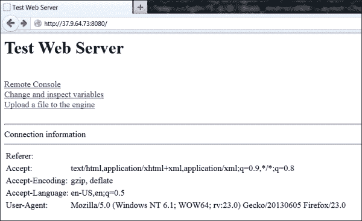

# 第三章。建立工作关系网

在本章中，我们将介绍:

*   从 Flickr 和 Picasa 获取照片列表
*   从 Flickr 和 Picasa 下载图像
*   执行跨平台多线程
*   同步本机跨平台线程
*   使用引用计数管理内存
*   实现异步任务队列
*   处理异步回调调用
*   异步使用网络
*   检测网络地址
*   正在写入 HTTP 服务器

# 简介

就时间而言，网络本来就是一个异步且不可预测的领域。人们可能不确定连接的可靠性。即使我们使用 **TCP** 协议，也不能保证交付时间，没有什么能阻止应用程序在等待套接字中的数据时冻结。为了开发一个响应迅速且安全的应用程序，必须解决许多问题:我们需要完全控制下载过程，我们必须限制下载的数据大小，并优雅地处理出现的错误。我们没有深入研究 HTTP 协议实现的细节，而是使用 libcurl 库，专注于与游戏开发相关的高级任务。

首先，我们看一下 Picasa 和 Flickr REST APIs 来下载图片列表并形成照片的直接 URL。然后，我们进入线程安全异步编程，最后我们使用纯伯克利套接字接口实现一个简单的 HTTP 服务器用于调试目的。

本章中与多线程编程相关的示例仅适用于 Windows，但是在本章的最后，我们将结合所有内容来创建内置 web 服务器的 Android `App5`示例。

# 从 Flickr 和 Picasa 获取照片列表

在前一章中，我们构建了 libcurl 库。作为如何下载网页的复习，请参考本章随附材料中的`1_CurlDownloader`示例。

在 C++中使用 Picasa 和 Flickr 的信息有些有限，但是调用这些网站的 **REST** ( **表征状态转移**)API 和下载网页没什么区别。我们所要做的就是为图像列表形成一个正确的网址，从这个网址下载一个 XML 文件，然后解析这个文件来构建一个单独的图像网址列表。通常，REST APIs 需要使用 **oAuth** 进行某种形式的认证，但对于只读访问，只使用应用密钥就足够了，通过简单的在线注册即可获得。

### 注

本食谱中的示例代码仅形成网址，由读者自行下载实际的图像列表。我们在这里也不提供应用程序密钥，我们鼓励读者获取密钥并测试代码。

## 做好准备

每个应用程序都必须使用通过简单注册过程获得的唯一密钥向 Flickr 服务器签署其请求。应用程序密钥和密钥是长的十六进制数字，类似于:`14fc6b12345678901234567890d69c8d`。创建您自己的雅虎帐号，并在以下网站获取应用程序密钥:[http://www.flickr.com/services/api/misc.api_keys.html](http://www.flickr.com/services/api/misc.api_keys.html)。如果你已经有了一个雅虎账号，直接进入[http://www.flickr.com/services/apps/create](http://www.flickr.com/services/apps/create)。

Picasa 照片托管提供对 RSS 源的免费访问，并且不需要客户端应用程序使用任何身份验证密钥。

## 怎么做…

1.  We would like to keep up with the latest photo trends, so we want to fetch a list of the most upvoted images, or a list of the most recently added images. To access such lists, Flickr provides the `flickr.interestingness.getList` and `flickr.photos.getRecent` methods, and Picasa provides two RSS feeds: `featured` and `all`. The example screenshot of the recent photos in the Flickr RSS feed is as follows:

    

2.  为了形成 Flickr 和 Picasa 所需的网址，我们实现了两个功能。一个用于 Flickr:

    ```cpp
    std::string Flickr_GetListURL( const std::string& BaseURL,
    int MaxResults,
    int PageIndex,
    const std::string& SearchQuery )
    {
      std::string Result = BaseURL + std::string( "&api_key=" );
      Result += AppKey;
      if ( !SearchQuery.empty() )
      {
      Result += std::string( "&q=\"" ) + 
      SearchQuery + std::string( "\"" );
      }
      Result += std::string( "&per_page=" );
      Result += IntToStr( MaxResults );
    ```

3.  列表可能很大，包含许多页面。我们可以通过一个索引选择一个页面:

    ```cpp
      if ( PageIndex > -1 )
      {
      Result += std::string( "&page=" ) + 
      IntToStr( PageIndex + 1 );
      }
      return Result;
    }
    ```

4.  而其他功能则是针对皮卡萨:

    ```cpp
    std::string Picasa_GetListURL( const std::string& BaseURL,
    int MaxResults,
    int PageIndex,
    const std::string& SearchQuery )
    {
      std::string Result = BaseURL;

      Result +=  std::string( "kind=photo&imgmax=1600" );

      if ( !SearchQuery.empty() )
      {
      Result += std::string( "&q=\"" ) + 
      SearchQuery + std::string( "\"" );
      }

      Result += std::string( "&max-results=" );
      Result += IntToStr( MaxResults );

      if ( PageIndex > 0 )
      {
      Result += std::string( "&start-index=" ) + 
      IntToStr( ( int )( 1 + PageIndex * MaxResults ) );
      }

      return Result;
    }
    ```

5.  根据我们想要的列表，我们传递`FlickrFavoritesURL`或`FlickrRecentURL`常量作为`Flickr_GetListURL()`函数的`BaseURL`参数，传递`PicasaFavoritesURL`或`PicasaRecentURL`常量作为`Picasa_GetListURL()` 函数的`BaseURL`参数。
6.  以下是所需字符串常量的完整列表:

    ```cpp
    const std::string AppKey = "YourAppKeyHere";
    const std::string FlickrAPIBase = "http://api.flickr.com/services/rest/?method=";

    const std::string FlickrFavoritesURL = FlickrAPIBase + "flickr.interestingness.getList";
    const std::string FlickrRecentURL    = FlickrAPIBase + "flickr.photos.getRecent";

    const std::string PicasaAPIBase = "http://picasaweb.google.com/data/feed/api/";

    const std::string PicasaFavoritesURL = PicasaAPIBase + "featured/?";
    const std::string PicasaRecentURL    = PicasaAPIBase + "all/?";
    ```

7.  `MaxResults`参数限制列表中图像的数量。`PageIndex`参数指定要跳过多少结果页面，而`SearchQuery`字符串可用于仅获取描述中带有给定文本的图像。
8.  Flickr 版本使用`AppKey`全局字符串常量，该常量应该包含获得的应用程序密钥。

## 它是如何工作的…

我们形成这个网址；在这种情况下，它是来自 Flickr 的用户投出的图片的第一页:

```cpp
string URL = Flickr_GetListURL(FlickrFavoritesURL, 15, 0, "");
```

然后，我们可能会将这个网址传递给我们的 HTTP 下载器，并接收到一个带有图像列表的 XML 文件。皮卡萨也可以这样做；请注意基于一个页面的索引:

```cpp
string URL = Picasa_GetListURL(PicasaFavoritesURL, 15, 1, "");
```

这些功能的完整源代码可以在`2_FlickrAndPicasa`文件夹的`PhotoAPI.cpp`文件中找到。

## 还有更多…

所提供的示例不包含 Flickr 的有效应用程序键。另外请记住，根据 Flickr 的许可协议，您的应用程序在一个屏幕上显示的图像不得超过 15 张。

有大量的位于 T2 http://www.flickr.com/services/api/的 Flickr 应用编程接口文档。

## 另见

*   *从 Flickr 和 Picasa 下载图片*

# 从 Flickr 和 Picasa 下载图片

我们有一个 XML 格式的图片列表，我们在 Flickr 和 Picasa 食谱的照片获取列表中下载了这个列表。让我们从照片托管下载实际的照片。

## 做好准备

在这里，我们需要从 Flickr 或 Picasa 的图像列表开始。使用之前的配方下载该列表。

## 怎么做…

1.  检索到列表后，我们会从中提取单个图像标识。有了这些标识，我们就可以形成单个图片的网址。Flickr 使用复杂的图像网址形成过程，Picasa 直接存储网址。这两种服务都可以生成 XML 和 JSON 格式的响应。我们将向您展示如何使用我们的小型即席解析器解析 XML 响应。但是，如果您已经在项目中使用了某种类型的 XML 或 JSON 解析库，我们也鼓励您在此任务中使用它。
2.  要解析 Flickr XML 列表，我们使用以下函数:

    ```cpp
    void Flickr_ParseXMLResponse( const std::string& Response,
      std::vector<std::string>& URLs )
    {
      using std::string::npos;
      size_t begin = Response.find( "<photos" );
      if ( begin == npos ) { return; }
      begin = Response.find_first_of( '>', begin );
      if ( begin == npos ) { return; }
      size_t end = Response.find( "/photos>" );
      if ( end == npos ) { return; }
      size_t cur = begin;
      size_t ResLen = Response.length();
    ```

3.  以特定的方式解析字符串。你可以用你喜欢的 XML 库代替这个循环:

    ```cpp
      while ( cur < ResLen )
      {
        using std::string::npos;
        size_t s_begin = Response.find( "<photo", cur );
        if ( s_begin == npos ) { break; }
        size_t s_end = Response.find( "/>", s_begin );
        if ( s_end == npos ) { break; }
        std::string Part = Response.substr( s_begin,s_end - s_begin + 2 );
        URLs.push_back( Part );
        cur = s_end + 2;
      }
    }
    ```

4.  用于 Picasa RSS 源的功能，以 XML 格式，如下所示:

    ```cpp
    void Picasa_ParseXMLResponse( const std::string& Response, 
    std::vector<std::string>& URLs )
    {
      using std::string::npos;
      size_t cur = 0;
      size_t ResLen = Response.length();
    ```

5.  我们使用类似的特殊代码解析提供的字符串:

    ```cpp
      while ( cur < ResLen )
      {
        size_t s_begin = Response.find( "<media:content ",cur );
        if ( s_begin == npos ) { break; }
        size_t s_end = Response.find( "/>", s_begin );
        if ( s_end == npos ) { break; }
        std::string new_s = Response.substr( s_begin,s_end - s_begin + 2 );
        URLs.push_back( ExtractURLAttribute( new_s,"url=\'", '\'' ) );
        cur = s_end + 2;
      }
    }
    ```

6.  辅助功能`ExtractURLAttribute()`用于从 XML 标签中提取单个属性的值:

    ```cpp
    std::string ExtractURLAttribute( const std::string& InStr,
      const std::string& AttrName,
      char Delim )
    {
      size_t AttrLen = AttrName.length();
      size_t pos = InStr.find( AttrName );
    ```

7.  扫描弦直到结束:

    ```cpp
      if ( pos != std::string::npos )
      {
        for ( size_t j = pos+AttrLen ; j < InStr.size() ; j++ )
        {
          if ( InStr[j] == Delim ) { break; }
        }
        return InStr.substr( pos + AttrLen, j - pos - AttrLen );
      }
      return "";
    }
    ```

8.  最后，为了以选定的分辨率为图像形成一个 Flickr 网址，我们使用了这个函数:

    ```cpp
    std::string Flickr_GetDirectImageURL( const std::string& InURL,
      int ImgSizeType )
    {
    ```

9.  首先，我们需要使用来自`InURL` :

    ```cpp
    string id     = ExtractURLAttribute(InURL, "id=\"", '"');
    string secret = ExtractURLAttribute(InURL, "secret=\"", '"');
    string server = ExtractURLAttribute(InURL, "server=\"", '"');
    string farm   = ExtractURLAttribute(InURL, "farm=\"", '"');
    ```

    的地址来准备参数
10.  将所有内容合并到结果字符串中:

    ```cpp
    std::string Res = std::string( "http://farm" ) + farm +
    std::string( ".staticflickr.com/" ) + server +
    std::string( "/" ) + id + std::string( "_" ) + secret;
    std::string Fmt = "";
    ```

11.  将后缀添加到结果字符串中，该字符串决定请求照片的大小，并添加一个`.jpg`扩展名:

    ```cpp
    if ( ImgSizeType == PHOTO_SIZE_128       ) { Fmt = "t"; }
    else if ( ImgSizeType == PHOTO_SIZE_256  ) { Fmt = "m"; }
    else if ( ImgSizeType == PHOTO_SIZE_512  ) { Fmt = "-"; }
    else if ( ImgSizeType == PHOTO_SIZE_1024 ) { Fmt = "b"; }
    else if ( ImgSizeType == PHOTO_SIZE_ORIGINAL ) { Fmt = "b"; };
    return Res + std::string( "_" ) + Fmt + std::string( ".jpg" );
    }
    ```

12.  对于 Picasa，我们通过插入不同的代码路径来修改列表中的图像 URL:

    ```cpp
    std::string Picasa_GetDirectImageURL( const std::string& InURL,
      int ImgSizeType )
    {
      std::string Fmt = "";

      if ( ImgSizeType == PHOTO_SIZE_128       ) 
        { Fmt = "/s128/"; }
        else if ( ImgSizeType == PHOTO_SIZE_256  )
        { Fmt = "/s256/"; }
        else if ( ImgSizeType == PHOTO_SIZE_512  )
        { Fmt = "/s512/"; }
        else if ( ImgSizeType == PHOTO_SIZE_1024 )
        { Fmt = "/s1024/"; }
        else if ( ImgSizeType == PHOTO_SIZE_ORIGINAL )
        { Fmt = "/s1600/"; };

      size_t spos = InURL.find( "/s1600/" );

      if ( spos == std::string::npos ) { return ""; }
      const size_t Len = strlen("/s1600/");
      return InURL.substr( 0, spos ) + Fmt +
      InURL.substr( spos+Len, InURL.length()-spos-Len );
    }
    ```

13.  当我们需要不同分辨率的相同图像时，我们提供类型为`PhotoSize`的`ImgSizeType`参数，可以取以下值:

    ```cpp
    enum PhotoSize
    {
       PHOTO_SIZE_128     = 0,
       PHOTO_SIZE_256     = 1,
       PHOTO_SIZE_512     = 2,
       PHOTO_SIZE_1024    = 3,
       PHOTO_SIZE_ORIGINAL = 4
    };
    ```

14.  这些值与 Flickr 或 Picasa 命名约定无关，在内部使用是为了我们的方便(和 API 独立性)。

## 它是如何工作的…

我们有上一份食谱中的图片列表:

```cpp
std::vector<std::string> Images;
void Picasa_ParseXMLResponse( Response, Images);

```

然后，对于第一个图像的网址:

```cpp
ImageURL = Picasa_GetDirectImageURL(Images[0],
PHOTO_SIZE_128);
```

最后，使用下载器获取位于`ImageURL`的图像。

## 还有更多…

Flickr 和 Picasa 网站都有一套规则，不鼓励大规模自动下载全尺寸图像(每秒不超过一张)，我们开发的任何应用程序都应该严格遵守这些规则。

这个食谱的代码有一点很好，那就是它可以修改，以支持知名的`Yandex.Fotki`照片网站或其他类似的提供 RSS 订阅源的照片托管服务。我们把它留给读者自己做。

# 执行跨平台多线程

为了继续改善用户体验，我们应该让长时间运行的任务异步，对它们的执行进行细粒度控制。为此，我们在操作系统的线程之上实现了一个抽象层。

## 做好准备

安卓 NDK 线程基于 POSIX 线程。看看你的 NDK 文件夹里的头文件`platforms\android-14\arch-arm\usr\include\pthread.h`。

## 怎么做...

1.  让我们从线程句柄类型的声明开始:

    ```cpp
    #ifndef _WIN32
    #include <pthread.h>
    typedef pthread_t thread_handle_t;
    typedef pthread_t native_thread_handle_t;
    #else
    #include <windows.h>
    typedef uintptr_t thread_handle_t;
    typedef uintptr_t native_thread_handle_t;
    #endif
    ```

2.  然后，我们声明线程接口:

    ```cpp
    class iThread
    {
    public:
      iThread::iThread():FThreadHandle( 0 ), FPendingExit(false) {}
      virtual ~iThread() {}
      void Start();
      void Exit( bool Wait );
      bool IsPendingExit() const { return FPendingExit; };
    protected:
      virtual void Run() = 0;
    ```

3.  Windows 和 Android 的入口点原型不同，只是返回类型不同:

    ```cpp
    #ifdef _WIN32
      static unsigned int __stdcall EntryPoint( void* Ptr );
    #else
      static void* EntryPoint( void* Ptr );
    #endif
      native_thread_handle_t GetCurrentThread();
    private:
      volatile bool FPendingExit;
      thread_handle_t FThreadHandle;
    };
    ```

4.  `iThread::Start()`方法的便携实现是通过以下方式完成的:

    ```cpp
    void iThread::Start()
    {
      void* ThreadParam = reinterpret_cast<void*>( this );

    #ifdef _WIN32
      unsigned int ThreadID = 0;
      FThreadHandle = ( uintptr_t )_beginthreadex( NULL, 0, &ThreadStaticEntryPoint, ThreadParam, 0, &ThreadID );

    #else
      pthread_create( &FThreadHandle, NULL, ThreadStaticEntryPoint, ThreadParam );
      pthread_detach( FThreadHandle );
    #endif
    }
    ```

## 它是如何工作的...

为了演示实现的线程类的用法，我们定义了一个新线程，它每秒打印一条消息:

```cpp
class TestThread: public iThread
{
public:
  virtual void Run()
  {
    printf("Test\n");
    Sleep(1000);
  }
};

void Test()
{
  TestThread* Thread = new TestThread();
  Thread->Start();
  while (true) {}
}
```

现在，用 C++实现一个简单的多线程应用程序并不比用 Java 难多少。

# 同步本机跨平台线程

需要同步来防止不同线程同时访问共享资源。一段访问共享资源的代码——不能被多个线程同时访问——被称为临界区([http://en.wikipedia.org/wiki/Critical_section](http://en.wikipedia.org/wiki/Critical_section))。为了避免竞争条件，在关键部分的入口和出口处需要一种机制。在 Windows 应用程序中，关键部分是 WinAPI 的一部分，在 Android 中，我们使用`pthread`库中的互斥体，它们服务于相同的目的。

## 做好准备

安卓原生同步原语是基于 POSIX 的。它们包括线程的管理函数、互斥体、条件变量和障碍。看看你的 NDK 文件夹里的头文件`platforms\android-14\arch-arm\usr\include\pthread.h`。

## 怎么做...

1.  让我们创建一个独立于 API 的抽象来同步线程:

    ```cpp
    class Mutex
    {
    public:
      Mutex()
      {
    #if defined( _WIN32 )
        InitializeCriticalSection( &TheCS );
    #else
        pthread_mutex_init( &TheMutex, NULL );
    #endif
      }
      ~Mutex()
      {
    #if defined( _WIN32)
        DeleteCriticalSection( &TheCS );
    #else
        pthread_mutex_destroy( &TheMutex );
    #endif
      }
    ```

2.  锁定和解锁互斥在 Windows 和 Android 中也是不同的:

    ```cpp
      void Lock() const
      {
    #if defined( _WIN32 )
        EnterCriticalSection( (CRITICAL_SECTION*)&TheCS );
    #else
        pthread_mutex_lock( &TheMutex );
    #endif
      }

      void Unlock() const
      {
    #if defined( _WIN32 )
        LeaveCriticalSection( (CRITICAL_SECTION*)&TheCS );
    #else
        pthread_mutex_unlock( &TheMutex );
    #endif
      }

    #if defined( _WIN32 )
      CRITICAL_SECTION TheCS;
    #else
      mutable pthread_mutex_t TheMutex;
    #endif
    };
    ```

## 它是如何工作的...

使用**资源获取是初始化** ( **RAII** ) C++习惯用法，我们可以定义`Lock`类:

```cpp
class Lock
{
public:
  explicit Lock( const clMutex* Mutex ) : FMutex( Mutex )
{ FMutex->Lock(); };
  ~Lock() { FMutex->Unlock(); };
private:
  const Mutex* FMutex;
};
```

然后，使用互斥体很简单:

```cpp
Lock( &SomeMutex );
```

在本书的后续章节中，我们几乎在任何地方都广泛使用互斥体。

## 另见

*   *实现异步任务队列*

# 使用引用计数管理内存

当在本机代码环境中工作时，每个内存分配事件都由开发人员处理。众所周知，跟踪多线程环境中的所有分配变得非常困难。C++语言提供了一种避免使用智能指针手动释放对象的方法。因为我们正在开发移动应用程序，所以我们不能为了包含智能指针而使用整个 **Boost** 库。

### 注

你可以在安卓 NDK 上使用 Boost 库。我们在我们的小例子中避免它的两个主要原因如下:编译时间的急剧增加和展示如何自己实现基本东西的愿望。如果您的项目已经包含 Boost，建议您使用该库中的智能指针。编译很简单，不需要特殊的移植步骤。

## 做好准备

我们需要一个简单的介入式计数器嵌入到所有引用计数器类中。这里，我们提供了这样一个计数器的轻量级实现:

```cpp
class iObject
{
public:
  iObject(): FRefCounter(0) {}
  virtual ~iObject() {}
  void    IncRefCount()
  {
#ifdef _WIN32
    return InterlockedIncrement( &FRefCounter );
#else
    return __sync_fetch_and_add( &FRefCounter, 1 );
#endif
  }
  void    DecRefCount()
  {
#ifdef _WIN32
    if ( InterlockedDecrement( &FRefCounter ) == 0 )
#else
    if ( __sync_sub_and_fetch( Value, 1 ) == 0 )
#endif
    { delete this; }
  }
private:
  volatile long    FRefCounter;
};
```

这个代码可以在 Windows、Android 和其他带有`gcc`或`clang`工具链的系统之间移植。

## 怎么做...

1.  我们的侵入式智能指针类的实现如下:

    ```cpp
    template <class T> class clPtr
    {
    public:
      clPtr(): FObject( 0 ) {}
      clPtr( const clPtr& Ptr ): FObject( Ptr.FObject )
      {
    ```

2.  在这里，我们调用一个助手来完成介入式计数器的原子增量。这允许我们在不完整的类型中使用这个智能指针:

    ```cpp
        LPtr::IncRef( FObject );
      }
      template <typename U>
      clPtr( const clPtr<U>& Ptr ): FObject( Ptr.GetInternalPtr() )
      {
        LPtr::IncRef( FObject );
      }
      ~clPtr()
      {
    ```

3.  同样的技巧也适用于原子减量操作:

    ```cpp
        LPtr::DecRef( FObject );
      }
    ```

4.  我们需要一个从`T*` :

    ```cpp
      clPtr( T* const Object ): FObject( Object )
      {
        LPtr::IncRef( FObject );
      }
    ```

    进行隐式类型转换的构造函数
5.  我们还需要一个赋值操作符:

    ```cpp
      clPtr& operator = ( const clPtr& Ptr )
      {
        T* Temp = FObject;
        FObject = Ptr.FObject;

        LPtr::IncRef( Ptr.FObject );
        LPtr::DecRef( Temp );

        return *this;
      }
    ```

6.  取消引用操作符(`->`)是任何智能指针的关键特性之一:

    ```cpp
      inline T* operator -> () const
      {
        return FObject;
      }
    ```

7.  模仿`dynamic_cast`行为:

    ```cpp
      template <typename U>
      inline clPtr<U> DynamicCast() const
      {
        return clPtr<U>( dynamic_cast<U*>( FObject ) );
      }
    ```

8.  还实现了比较运算符:

    ```cpp
      template <typename U>
      inline bool operator == ( const clPtr<U>& Ptr1 ) const
      {
        return FObject == Ptr1.GetInternalPtr();
      }
    ```

9.  有时，我们需要将智能指针的值传递给第三方 C API。我们需要检索一个内部指针来做到这一点:

    ```cpp
      inline T* GetInternalPtr() const
      {
        return FObject;
      }
    private:
      T*    FObject;
    };
    ```

完整的源代码参考本书补充资料中的示例`4_ReferenceCounting_ptr`。

## 它是如何工作的...

演示智能指针用法的极简示例如下:

```cpp
class SomeClass: public iObject {};
void Test()
{
  clPtr<SomeClass> Ptr = new SomeClass();
}
```

`SomeClass`的一个分配对象被分配给智能指针`Ptr`。`Test()`结束时，智能指针自动销毁，分配对象的引用数为零。因此，通过`delete()`调用隐式销毁分配的对象，从而避免内存泄漏。

## 还有更多...

我们广泛检查我们的智能指针是否为非空，我们希望使用如下传统语法:

```cpp
if ( SomeSmartPointer ) ...
```

这可以在不将转换运算符添加到另一个可用类型的情况下实现。下面是如何使用私有内部类完成的:

```cpp
private:
   class clProtector
  {
  private:
    void operator delete( void* );
  };
public:
  inline operator clProtector* () const
  {
    if ( !FObject ) return NULL;
    static clProtector Protector;
    return &Protector;
  }
```

基本上，条件`if ( SomeSmartPointer )`会将智能指针投射到指向`clProtector`类的指针上。但是，C++编译器会防止您误用它。应该声明`clProtector`的`operator delete( void* )`操作符，但不要定义，以免用户创建`clProtector`的实例。

智能指针的一个常见问题是循环引用问题。当一个对象`A`持有对一个对象`B`的引用，同时该对象`B`持有对该对象`A`的引用时，两个对象的引用计数器不能为零。这种情况在容器类中很常见，可以通过使用指向包含对象的原始指针而不是智能指针来避免。以下面的代码为例:

```cpp
class SomeContainer;
class SomeElement: public iObject
{
```

指向父对象的原始指针:

```cpp
  SomeContainer* Parent;
};

class SomeContainer: public iObject
{
```

垃圾收集元素列表:

```cpp
  std::vector< clPtr<SomeElement> > Elements;
};
```

## 另见

*   *实现异步任务队列*

# 实现异步任务队列

我们希望从主线程异步执行一系列任务，但保持它们相对于彼此的顺序。让我们为这样的任务实现一个队列。

## 做好准备

我们需要前面食谱中的互斥体和智能指针来做到这一点，因为队列需要同步原语来保持其内部数据结构一致，并且它需要智能指针来防止任务泄漏。

## 怎么做...

1.  我们要放入工作线程的任务界面如下:

    ```cpp
    class iTask: public iObject
    {
    public:
      iTask()
      : FIsPendingExit(false)
      , FTaskID(0)
      , FPriority(0) {};
    ```

2.  `Run()`方法包含了我们任务的有效载荷。所有有用的工作都在这里完成:

    ```cpp
      virtual void Run() = 0;
    ```

3.  任务不能从外部安全地终止，因为外部代码不知道任务的当前状态和它现在正在做什么样的工作。所以`Exit()`方法只是设置一个合适的标志，表示我们要退出:

    ```cpp
      virtual void Exit() { FIsPendingExit = true; }
    ```

4.  我们可以通过调用`IsPendingExit()` :

    ```cpp
      virtual bool IsPendingExit() const volatile
        { 
        return FIsPendingExit; }
    ```

    在`Run()`方法中检查该标志
5.  任务应该相互区分。这就是身份证的作用:

    ```cpp
      virtual void   SetTaskID( size_t ID ) { FTaskID = ID; };
      virtual size_t GetTaskID() const { return FTaskID; };
    private:
      volatile bool           FIsPendingExit;
      size_t                  FTaskID;
    };
    ```

6.  而这里，是工作线程的接口(完整的实现可以在本书的下载包中找到):

    ```cpp
    class WorkerThread: public iThread
    {
    public:
    ```

7.  我们可以随意排队和取消任务:

    ```cpp
      virtual void   AddTask( const clPtr<iTask>& Task );
      virtual bool   CancelTask( size_t ID );
      virtual void   CancelAll();
      …
    ```

8.  `ExtractTask()`私有方法用于原子访问任务列表:

    ```cpp
    private:
      clPtr<iTask> ExtractTask();
      clPtr<iTask> FCurrentTask;
    private:
      std::list< clPtr<iTask> >   FPendingTasks;
      tthread::mutex              FTasksMutex;
      tthread::condition_variable FCondition;
    };
    ```

## 它是如何工作的...

我们启动一个单一工作线程并运行一个简单的任务。运行三个独立线程的关键区别在于，所有任务都是按顺序执行的，并且一个公共资源(在我们的例子中是输出窗口)也是按顺序使用的，而不需要处理并发访问:

```cpp
class TestTask: public iTask
{
public:
  virtual void Run()
  {
    printf("Test\n");
  }
};

int main()
{
  WorkerThread* wt = new WorkerThread();
  wt->Start( iThread::Priority_Normal );
```

逐一添加三项任务:

```cpp
  wt->AddTask( new TestTask() );
  wt->AddTask( new TestTask() );
  wt->AddTask( new TestTask() );
```

任务从不并行执行，只按顺序执行。使用简单的旋转锁等待所有任务的完成:

```cpp
  while (wt->GetQueueSize() > 0) {}

  return 0;
}
```

# 处理异步回调调用

多线程编程中我们可能会遇到的一个简单情况是，我们需要在另一个线程上运行一个方法。例如，当工作线程上的下载任务完成时，主线程可能希望得到任务完成的通知，以解析下载的数据。在这个食谱中，我们将实现一个这样的通知机制。

## 做好准备

在我们着手实现细节之前，理解**异步事件**的概念很重要。当我们说异步时，我们指的是某些事情不可预测地发生，并且没有确定的时间。例如，我们无法预测我们的任务下载一个网址需要多长时间——就是这样；任务异步完成，应该异步调用**回调**。

## 怎么做…

1.  给我们的信息应该是一个方法调用。我们将在这个接口后面隐藏一个方法调用:

    ```cpp
    class iAsyncCapsule: public iObject
    {
    public:
      virtual void Invoke() = 0;
    };
    ```

2.  指向这种类型的实例的指针表示准备好的方法调用。我们定义了一个队列`iAsyncCapsule`，实现如下:

    ```cpp
    class AsyncQueue
    {
    public:
      AsyncQueue(): FDemultiplexerMutex()
      , FCurrentQueue( 0 )
      , FAsyncQueues( 2 )
      , FAsyncQueue( &FAsyncQueues[0] )
      { }
    ```

3.  将事件排队:

    ```cpp
      void EnqueueCapsule( const clPtr<iAsyncCapsule>& Capsule )
      {
        LMutex Mutex( &FDemultiplexerMutex );
        FAsyncQueue->push_back( Capsule );
      }
    ```

4.  事件解复用器，如`Reactor`模式中所述([http://en.wikipedia.org/wiki/Reactor_pattern](http://en.wikipedia.org/wiki/Reactor_pattern)):

    ```cpp
      void DemultiplexEvents()
      {
        CallQueue* LocalQueue = &FAsyncQueues[ FCurrentQueue ];

        {
          LMutex Lock( &FDemultiplexerMutex );
    ```

5.  这是一个防止复制整个队列的奇偶技巧。我们保持两个队列并在它们之间切换:

    ```cpp
          FCurrentQueue = ( FCurrentQueue + 1 ) % 2;
          FAsyncQueue = &FAsyncQueues[ FCurrentQueue ];
        }
    ```

6.  注意上面互斥的范围。当互斥锁被锁定时，我们不应该调用回调:

    ```cpp
        for ( CallQueue::iterator i = LocalQueue->begin();
         i != LocalQueue->end(); ++i )
         (*i)->Invoke();
         LocalQueue->clear();
      }
    private:
      size_t FCurrentQueue;

      typedef std::vector< clPtr<iAsyncCapsule> > CallQueue;
      std::vector<CallQueue> FAsyncQueues;

      CallQueue* FAsyncQueue;
      Mutex FDemultiplexerMutex;
    };
    ```

## 它是如何工作的…

我们从两条线索开始。人们通过在一个无限循环中调用`DemultiplexEvents()`函数来处理传入事件:

```cpp
class ResponseThread: public iThread, public AsyncQueue
{
public:
  virtual void Run() { while (true) { DemultiplexEvents(); } }
};
ResponseThread* Responder;
```

而另一个线程产生异步事件:

```cpp
class RequestThread: public iThread
{
public:
  virtual void Run()
  {
    while ( true )
    {
      Responder->EnqueueCapsule( new TestCall() );
      Sleep(1000);
    }
  }
};
```

我们对事件的响应在`TestCall`类中实现:

```cpp
class TestCall: public iAsyncCapsule
{
public:
  virtual void Invoke() { printf("Test\n"); }
};
```

`main()`功能启动两个线程，无限等待(可以按 *Ctrl* + *Break* 停止):

```cpp
int main()
{
   (Responder = new ResponseThread())->Start();
   (new RequestThread())->Start();
    while (true) {}
    return 0;
}
```

您应该会看到以下输出:

```cpp
Test
Test
Test
…
```

`printf()`函数可能不是线程安全的，但是我们的队列确保对它的调用不会相互干扰。

# 与网络异步工作

联网本质上是一组不可预测的异步操作。让我们在一个单独的线程中异步执行，以防止用户界面线程停滞，这可能会导致安卓系统上的 ANR 行为。

## 做好准备

在这里，我们需要本章前面的食谱中已经实现的所有东西:智能指针、工作线程、libcurl 下载器和异步事件队列。

## 怎么做…

1.  我们从`iTask`中派生出`DownloadTask`类，它使用 libcurl 库执行一个 HTTP 请求。在这里，我们实现它的方法`Run()`，它建立 libcurl 库并执行一个网络操作:

    ```cpp
    void DownloadTask::Run()
    {
      clPtr<DownloadTask> Guard( this );
      CURL* C = curl_easy_init();
    ```

2.  libcurl 的设置参数:

    ```cpp
      curl_easy_setopt( C, CURLOPT_URL, FURL.c_str() );
      curl_easy_setopt( C, CURLOPT_FOLLOWLOCATION, 1 );
      curl_easy_setopt( C, CURLOPT_NOPROGRESS, false );
      curl_easy_setopt( C, CURLOPT_FAILONERROR, true );
      curl_easy_setopt( C, CURLOPT_MAXCONNECTS, 10 );
      curl_easy_setopt( C, CURLOPT_MAXFILESIZE, DownloadSizeLimit );
      curl_easy_setopt( C, CURLOPT_WRITEFUNCTION, &MemoryCallback );
      curl_easy_setopt( C, CURLOPT_WRITEDATA, this );
      curl_easy_setopt( C, CURLOPT_PROGRESSFUNCTION,
        &ProgressCallback );
      curl_easy_setopt( C, CURLOPT_PROGRESSDATA, this );
      curl_easy_setopt( C, CURLOPT_CONNECTTIMEOUT, 30 );
      curl_easy_setopt( C, CURLOPT_TIMEOUT, 60 );
    ```

3.  禁用 SSL 密钥验证:

    ```cpp
      curl_easy_setopt( C, CURLOPT_SSL_VERIFYPEER, 0 );
      curl_easy_setopt( C, CURLOPT_SSL_VERIFYHOST, 0 );
    ```

4.  同步执行网络操作。调用`curl_easy_perform()`阻塞当前线程，直到从网络获得结果，或者出现错误:

    ```cpp
      FCurlCode = curl_easy_perform( Curl );
    ```

5.  阅读结果并清理库:

    ```cpp
      curl_easy_getinfo( Curl, CURLINFO_RESPONSE_CODE, &FRespCode );
      curl_easy_cleanup( Curl );
    ```

6.  告诉下载器为此任务调用完成回调:

    ```cpp
      if ( FDownloader ) { FDownloader->CompleteTask( this ); }
    }
    ```

## 它是如何工作的…

我们提供了一个片段，它从 Flickr echo 服务下载响应，并在主线程上处理任务完成:

```cpp
volatile bool g_ShouldExit = false;

class TestCallback: public DownloadCompleteCallback
{
public:
  TestCallback() {}
```

将结果打印到控制台窗口:

```cpp
  virtual void Invoke()
  {
    printf("Download complete\n");
    printf("%s\n", (unsigned char*)FResult->GetData());
    g_ShouldExit = true;
  }
};

int main()
{
  Curl_Load();
  iAsyncQueue* Events = new iAsyncQueue();
  Downloader* d = new Downloader();
  d->FEventQueue = Events;
  …
  d->DownloadURL(
  "http://api.flickr.com/services/rest/?method=flickr.test.echo&name=value", 1, new TestCallback()
);
```

等待到来的事件:

```cpp
  while (!g_ShouldExit)
  {
    Events->DemultiplexEvents();
  }
  …
}
```

## 另见

*   *从 Flickr 和 Picasa 下载图片*

# 检测网络地址

要与网络服务器通信，我们需要指定其 IP 地址。在有限的移动环境中，向用户询问 IP 地址并不方便，我们必须自己检测地址(并且不涉及任何不可移植的代码)。在接下来的`App5`示例中，我们使用了 Windows API 中的`GetAdaptersAddresses()`函数和 POSIX 中的`getifaddrs()`函数。安卓运行时库提供了自己的`getifaddrs()`实现，包含在`DetectAdapters.cpp`文件的`App5`源中。

## 做好准备

让我们声明一个结构来保存描述网络适配器的信息:

```cpp
struct sAdapterInfo
{
```

这是网络适配器的内部系统名称:

```cpp
  char FName[256];
```

适配器的 IP 地址如下:

```cpp
  char FIP[128];
```

适配器的唯一标识号:

```cpp
  char FID[256];
};
```

## 怎么做...

1.  我们在下面的代码中提供了安卓版`Net_EnumerateAdapters()`功能的详细代码。它列举了系统中所有可用的网络适配器:

    ```cpp
    bool Net_EnumerateAdapters( std::vector<sAdapterInfo>& Adapters )
    {
      struct ifaddrs* MyAddrs, *ifa;
      void* in_addr;
      char buf[64];
    ```

2.  `getifaddrs()`功能创建描述本地系统网络接口的结构链表:

    ```cpp
      if ( getifaddrs( &MyAddrs ) != 0 ) { return false; }
      …
    ```

3.  遍历链表:

    ```cpp
      for ( ifa = MyAddrs; ifa != NULL; ifa = ifa->ifa_next )
      {
        if ( ( ifa->ifa_addr == NULL ) ||
        !( ifa->ifa_flags & IFF_UP ) ) { continue; }
    ```

4.  区别对待 IPv4 和 IPv6:

    ```cpp
        switch ( ifa->ifa_addr->sa_family )
        {
          case AF_INET:
          { in_addr = &( ( struct sockaddr_in* )
          ifa->ifa_addr )->sin_addr;   break; }

          case AF_INET6:
          { in_addr = &( ( struct sockaddr_in6* )
          ifa->ifa_addr )->sin6_addr; break; }

          default:
            continue;
        }
    ```

5.  将网络地址结构转换成 C 字符串，保存在`Adapters`向量中:

    ```cpp
        if ( inet_ntop( ifa->ifa_addr->sa_family,in_addr, buf, sizeof( buf ) ) )
        {
          sAdapterInfo Info;
          strcpy( Info.FName, ifa->ifa_name );
          strcpy( Info.FIP, buf );
          sprintf( Info.FID, "%d", Idx );
          Adapters.push_back( Info );
          Idx++;
        }
      }
    ```

6.  发布链表:

    ```cpp
      freeifaddrs( MyAddrs );
    ```

## 它是如何工作的...

为了枚举控制台窗口中的所有适配器，我们使用一个简单的循环:

```cpp
  int main()
  {
    std::vector<sAdapterInfo> a;
    Net_EnumerateAdapters( a );

    for(size_t i = 0 ; i < a.size() ; i++)
    {
      printf("[%d] %s\n", i + 1, a[i].FIP);
    }
    return 0;
  }
```

这段代码的安卓实现在`App5`项目中。

## 还有更多...

幸运的是，上面的代码适用于任何 POSIX 系统，`App5`示例也提供了一个 Windows 版本的`Net_EnumerateAdapters()`。在安卓系统上，我们必须为我们的应用程序启用`ACCESS_NETWORK_STATE`和`INTERNET`权限；否则，系统将不允许我们访问互联网。这是在`App5`示例的`AndroidManifest.xml`文件中完成的，使用以下行:

```cpp
<uses-permission
android:name="android.permission.INTERNET"/>
<uses-permission
android:name="android.permission.ACCESS_NETWORK_STATE"/>
```

不要忘记将这些行放入您的应用程序清单中，该应用程序打算与网络一起工作。

# 写 HTTP 服务器

当处理移动开发时，我们最终将在真正的设备上运行我们的游戏。在此之前，我们必须使用一些调试工具。当然，我们可能会使用`gdb`设置远程调试，但是一旦与访问冲突相关的大多数关键错误被消除，逻辑错误或与竞争条件相关的错误就会出现，这些错误很难找到，并且需要对应用程序进行多次重新部署，对其进行一些微不足道的更改。为了能够直接在安卓设备上快速更改应用程序的运行时行为，我们可以实现一个嵌入式网络服务器，该服务器带有一个接口来微调应用程序的一些内部参数。这个食谱包含了`App5`的概要，它实现了这样一个网络服务器。

## 做好准备

从头开始编写一个 HTTP 服务器并不容易，所以我们使用了一个由 René Nyffenegger 从以下网页免费提供的简单服务器:[http://www.adp-gmbh.ch/win/misc/webserver.html](http://www.adp-gmbh.ch/win/misc/webserver.html)。

我们直接使用这些来源中的大部分，我们或多或少支持安卓的精炼版本包含在`App5`示例中。与原版最重要的区别是使用了一个建立在 **WinSock** 和**安卓 BSD** 套接字之上的抽象套接字 API。我们建议您仔细查看`App5`来源中的`Sockets.h`和`Sockets.cpp`文件。

## 怎么做…

1.  HTTP 服务器在单独的线程上启动，该线程是`iThread`类的后代。服务器的主循环很简单:

    ```cpp
      while ( !IsPendingExit() )
      {
        LTCPSocket* NewSocket = in->Accept();
        if ( NewSocket != 0 )
        {
          // Add new thread
          HTTPRequestThread* T = new HTTPRequestThread();
          T->FServer = this;
          T->FSocket = NewSocket;
          T->Start();
        }
      }
    ```

2.  我们等待一个传入的连接，当`Accept()`方法成功时，一个新的`HTTPRequestThread`开始。该线程从新创建的套接字中读取数据，并填充`sHTTPServerRequest`结构。最后，这个请求在`HandleRequest()`方法中通过用 HTML 页面的内容填充`sHTTPServerRequest::FData`字段来处理。最后，这些数据被发送到客户端。代码是线性的，但是在这里呈现有点长。详情请读者参考`HTTP.cpp`文件。

## 它是如何工作的…

为了利用服务器，我们创建了`HTTPServerThread`实例，并在`HTTP.cpp`文件中提供了`SetVariableValue()` 和`GetVariableValue()`函数的实现，这两个函数默认为空。服务器启动代码位于`OnStart()`功能中。

我们创建服务器实例:

```cpp
g_Server = new HTTPServerThread();
```

然后，我们使用检测到的适配器地址:

```cpp
if ( !Adapters.empty() )
{
  g_Server->FBindAddress = Adapters[0].FIP;
}
```

最后，我们启动 web 服务器线程:

```cpp
g_Server->Start();
```

默认情况下，服务器从 IP 地址`127.0.0.1`开始，端口为`8080`。

在安卓设备上启动`App5`后，我们可以通过任何网络浏览器从台式电脑连接到它:只需输入它的 IP 地址和端口。网络服务器在启动时会检测到该 IP 地址，并显示在设备屏幕的顶部。

下面是一个浏览器截图，输出来自我们的小型网络服务器:



从桌面网络浏览器访问我们的安卓网络服务器。

## 还有更多…

`App5`在上工作，Windows 和安卓都可以，但是有一些细微之处与网络配置有关。

如果我们使用的是 3G 或类似的蜂窝网络，很可能我们没有外部 IP 地址，所以为了让我们的网络服务器在浏览器中可见，我们应该坚持使用无线网络连接。

## 另见

*   *从 Flickr 和 Picasa 下载图片*