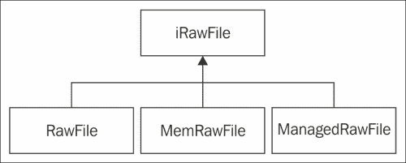

# 第四章。组织虚拟文件系统

> ***文件**:一个可以读写的对象。文件具有某些属性，包括类型。常见的文件类型包括常规文件和目录。实现可能支持其他类型的文件，如符号链接。*
> 
> ***文件系统**:文件及其某些属性的集合。*
> 
> *(助推文档，[http://www.boost.org](http://www.boost.org))*

在本章中，我们将介绍:

*   抽象文件流
*   实现可移植的内存映射文件
*   实现文件编写器
*   使用内存文件
*   实现挂载点
*   枚举中的文件。zip 存档
*   从中解压缩文件。zip 存档
*   异步加载资源
*   存储应用数据

# 简介

文件是任何计算机系统的组成部分。本章讨论只读应用资源的可移植处理，并提供存储应用数据的方法。我们还使用来自[第 3 章](03.html "Chapter 3. Networking")、*网络、*的代码来组织来自`.zip`档案的资源的异步加载。

让我们简要地考虑一下本章所涉及的问题。第一个是对应用数据文件的访问。桌面操作系统的应用数据通常与可执行文件位于同一文件夹中。有了安卓，事情变得有点复杂。应用文件打包在`.apk`文件中，我们根本无法使用标准的 `fopen()`类函数，或者`std::ifstream`和`std::ofstream`类。

第二个问题源于文件名和路径的不同规则。基于 Windows 和 Linux 的系统使用不同的路径分隔符，并提供不同的低级文件访问 API。

第三个问题来自于文件 I/O 操作很容易成为整个应用中最慢的部分。如果涉及交互滞后，用户体验可能会出现问题。为了避免延迟，我们应该在一个单独的线程上执行输入/输出，并在另一个线程上处理`Read()`操作的结果。为了实现这一点，我们拥有所有需要的工具，如第 3 章、*网络*中所讨论的——工作线程、任务、互斥体和异步事件队列。

我们从抽象的 I/O 接口开始，实现一个可移植的`.zip`档案处理方法，然后进行异步资源加载。

# 提取文件流

文件 I/O API在 Windows 和 Android (POSIX)操作系统之间略有不同，我们必须将这些差异隐藏在一组一致的 C++接口后面。我们在[第 2 章](02.html "Chapter 2. Porting Common Libraries")、*移植公共库*中编译的所有库都使用自己的回调和接口。为了统一它们，我们将在本章和后续章节中编写适配器。

## 做好准备

请确保您熟悉文件和内存映射的 UNIX 概念。维基百科可能是一个好的开始(http://en.wikipedia.org/wiki/Memory-mapped_file)。

## 怎么做...

1.  From now on, our programs will read input data using the following simple interface. The base class `iObject` is used to add an intrusive reference counter to instances of this class:

    ```cpp
    class iIStream: public iObject
    {
    public:
      virtual void    Seek( const uint64 Position ) = 0;
      virtual uint64  Read( void* Buf, const uint64 Size ) = 0;
      virtual bool    Eof() const = 0;
      virtual uint64  GetSize() const = 0;
      virtual uint64  GetPos() const = 0;
    ```

    以下是一些利用内存映射文件的方法:

    ```cpp
      virtual const ubyte*  MapStream() const = 0;
      virtual const ubyte*  MapStreamFromCurrentPos() const = 0;
    };
    ```

    该接口既支持使用`MapStream()`和`MapStreamFromCurrentPos()`成员函数的内存映射访问，也支持使用`BlockRead()`和 `Seek()`方法的顺序访问。

2.  为了将一些数据写入存储器，我们使用了一个输出流接口，如下所示(同样，基类`iObject`用于添加一个引用计数器):

    ```cpp
    class iOStream: public iObject
    {
    public:
      virtual void   Seek( const uint64 Position ) = 0;
      virtual uint64 GetFilePos() const = 0;
      virtual uint64 Write( const void* B, const uint64 Size ) = 0;
    };
    ```

3.  `iIStream`接口的`Seek()`、`GetFileSize()`、`GetFilePos()`和与文件名相关的方法可以在一个名为`FileMapper` :

    ```cpp
    class FileMapper: public iIStream
    {
    public:
      explicit FileMapper( clPtr<iRawFile> File );
      virtual ~FileMapper();
      virtual std::string GetVirtualFileName() const{ return FFile->GetVirtualFileName(); }
      virtual std::string  GetFileName() const{ return FFile->GetFileName(); }
    ```

    的类中实现
4.  从此流中读取连续的数据块，并返回实际读取的字节数:

    ```cpp
      virtual uint64 BlockRead( void* Buf, const uint64 Size )
      {
        uint64 RealSize =( Size > GetBytesLeft() ) ? GetBytesLeft() : Size;
    ```

5.  如果我们已经阅读了所有内容，返回零:

    ```cpp
        if ( RealSize < 0 ) { return 0; }
        memcpy( Buf, ( FFile->GetFileData() + FPosition ),static_cast<size_t>( RealSize ) );
    ```

6.  前进当前位置，返回复制字节数:

    ```cpp
        FPosition += RealSize;
        return RealSize;
      }

      virtual void Seek( const uint64 Position )     
      { FPosition  = Position; }
      virtual uint64 GetFileSize() const
      { return FFile->GetFileSize(); }
      virtual uint64 GetFilePos()  const
      { return FPosition; }
      virtual bool         Eof() const        
      { return ( FPosition >= GetFileSize() ); }

      virtual const ubyte* MapStream() const
      { return FFile->GetFileData(); }
      virtual const ubyte* MapStreamFromCurrentPos() const 
      { return ( FFile->GetFileData() + FPosition ); }
    private:
      clPtr<iRawFile> FFile;
      uint64          FPosition;
    };
    ```

7.  `FileMapper`使用以下`iRawFile`界面抽象数据访问:

    ```cpp
    class iRawFile: public iObject
    {
    public:
      iRawFile() {};
      virtual ~iRawFile() {};
      void        SetVirtualFileName( const std::string& VFName );void        SetFileName( const std::string& FName );std::string GetVirtualFileName() const;
      std::string GetFileName();
      virtual const ubyte* GetFileData() const = 0;
      virtual uint64       GetFileSize() const = 0;
    protected:
      std::string    FFileName;
      std::string    FVirtualFileName;
    };
    ```

除了这里实现的琐碎的`GetFileName()`和`SetFileName()`方法，在下面的食谱中，我们实现了`GetFileData()`和`GetFileSize()`方法。

## 它是如何工作的...

`iIStream::BlockRead()`方法在处理不可搜索的流时很有用。为了实现最快的访问，我们使用了以下方法中实现的内存映射文件。这里有`MapStream()`和`MapStreamFromCurrentPos()`方法，以方便的方式提供对内存映射文件的访问。这些方法返回一个指向内存的指针，你的文件或者它的一部分被映射到这个内存。`iOStream::Write()`方法的工作原理类似于标准的`ofstream::write()`功能。参考项目`1_AbstractStreams`获取该配方和以下配方的完整源代码。

## 还有更多...

在为多个平台编程时，重要的问题是文件名的转换，在我们的例子中是基于 Windows 和 Linux 的 Android。

我们使用特定于操作系统的宏定义以下`PATH_SEPARATOR`常量，以如下方式确定路径分隔符:

```cpp
#if defined( _WIN32 )
const char PATH_SEPARATOR = '\\';
#else
const char PATH_SEPARATOR = '/';
#endif
```

以下简单的函数帮助我们确保操作系统使用有效的文件名:

```cpp
inline std::string Arch_FixFileName(const std::string& VName)
{
  std::string s( VName );
  std::replace( s.begin(), s.end(), '\\', PATH_SEPARATOR );
  std::replace( s.begin(), s.end(), '/', PATH_SEPARATOR );
  return s;
}
```

## 另见

*   *实现可移植的内存映射文件*
*   *处理内存文件*

# 实现可移植的内存映射文件

现代操作系统提供了一种强大的机制，称为内存映射文件。简而言之，它允许我们将文件的内容映射到应用地址空间。实际上，这意味着我们可以将文件视为普通数组，并使用 C 指针访问它们。

## 做好准备

为了理解前面配方中接口的实现，我们建议阅读内存映射。这个机制在 Windows 中实现的概述可以在[http://msdn.microsoft.com/en-us/library/ms810613.aspx](http://msdn.microsoft.com/en-us/library/ms810613.aspx)的 MSDN 页面找到。

要了解更多关于内存映射的信息，读者可以参考`mmap()`功能文档。

## 怎么做...

1.  In Windows, memory-mapped files are created using the `CreateFileMapping()` and `MapViewOfFile()` API calls. Android uses the `mmap()` function, which works pretty much the same way. Here we declare the `RawFile` class implementing the `iRawFile` interface.

    `RawFile`保存内存映射文件的指针及其大小:

    ```cpp
      ubyte*    FFileData;
      uint64    FSize;
    ```

2.  对于 Windows 版本，我们对文件和内存映射对象使用两个句柄，对于 Android，我们只使用文件句柄:

    ```cpp
    #ifdef _WIN32
      HANDLE     FMapFile;
      HANDLE     FMapHandle;
    #else
      int        FFileHandle;
    #endif
    ```

3.  我们使用以下函数打开文件并创建内存映射:

    ```cpp
    bool RawFile::Open( const string& FileName,const string& VirtualFileName )
    {
    ```

4.  首先，我们需要获取一个与文件相关联的有效文件描述符:

    ```cpp
    #ifdef OS_WINDOWS
      FMapFile = (void*)CreateFileA( FFileName.c_str(),GENERIC_READ, FILE_SHARE_READ,NULL, OPEN_EXISTING,FILE_ATTRIBUTE_NORMAL | FILE_FLAG_RANDOM_ACCESS,NULL );
    #else
      FFileHandle = open( FileName.c_str(), O_RDONLY );
      if ( FFileHandle == -1 )
      {
        FFileData = NULL;
        FSize = 0;
      }
    #endif
    ```

5.  使用文件描述符，我们可以创建一个文件映射。为了清楚起见，这里我们省略了错误检查。但是补充材质中的例子包含了更多的错误检查:

    ```cpp
    #ifdef OS_WINDOWS
      FMapHandle = (void*)CreateFileMapping( ( HANDLE )FMapFile,NULL, PAGE_READONLY, 0, 0, NULL );
      FFileData = (Lubyte*)MapViewOfFile((HANDLE)FMapHandle,FILE_MAP_READ, 0, 0, 0 );
      DWORD dwSizeLow = 0, dwSizeHigh = 0;
      dwSizeLow = ::GetFileSize( FMapFile, &dwSizeHigh );
      FSize = ((uint64)dwSizeHigh << 32) | (uint64)dwSizeLow;
    #else
      struct stat FileInfo;
     fstat( FFileHandle, &FileInfo );
      FSize = static_cast<uint64>( FileInfo.st_size );
      FFileData = (Lubyte*) mmap(NULL, FSize, PROT_READ,MAP_PRIVATE, FFileHandle, 0 );
      close( FFileHandle );
    #endif
      return true;
    }
    ```

6.  正确的去初始化功能关闭所有手柄:

    ```cpp
    bool RawFile::Close()
    {
    #ifdef OS_WINDOWS
      if ( FFileData  ) UnmapViewOfFile( FFileData );
      if ( FMapHandle ) CloseHandle( (HANDLE)FMapHandle );
      CloseHandle( (HANDLE)FMapFile );
    #else
      if ( FFileData ) munmap( (void*)FFileData, FSize );
    #endif
      return true;
    }
    ```

7.  `iRawFile`界面、`GetFileData`和`GetFileSize`的主要功能在这里有琐碎的实现:

    ```cpp
      virtual const ubyte* GetFileData() { return FFileData; }
      virtual uint64       GetFileSize() { return FSize;     }
    ```

## 它是如何工作的...

为了使用`RawFile`类，我们创建一个实例，并将其包装成一个`FileMapper`类实例:

```cpp
  clPtr<RawFile> F = new RawFile();
  F->Open("SomeFileName");
  clPtr<FileMapper> FM = new FileMapper(F);
```

`FM`对象可以与支持`iIStream`界面的任何功能一起使用。我们所有`iRawFile`实现的层次结构如下图所示:



# 实现文件编写器

相当频繁地，我们的应用可能想要在磁盘上存储一些数据。我们已经遇到的另一个典型用例是从网络下载一些文件到内存缓冲区。在这里，我们为普通文件和内存文件实现了`iOStream`接口的两种变体。

## 怎么做...

1.  让我们从`iOStream`接口导出`FileWriter`类。我们在`iOStream`界面上增加了`Open()`和`Close()`成员功能，并精心实现了`Write()`操作。我们的输出流实现不使用内存映射文件，而是使用普通的文件描述符，如下面的代码所示:

    ```cpp
    class FileWriter: public iOStream
    {
    public:
      FileWriter(): FPosition( 0 ) {}
      virtual ~FileWriter() { Close(); }

      bool Open( const std::string& FileName )
      {
        FFileName = FileName;
    ```

2.  我们使用定义来划分安卓和视窗特定的代码路径:

    ```cpp
    #ifdef _WIN32
        FMapFile = CreateFile( FFileName.c_str(),GENERIC_WRITE, FILE_SHARE_READ, NULL, CREATE_ALWAYS,FILE_ATTRIBUTE_NORMAL, NULL );
        return !( FMapFile == ( void* )INVALID_HANDLE_VALUE );
    #else
        FMapFile = open( FFileName.c_str(), O_WRONLY|O_CREAT );
        FPosition = 0;
        return !( FMapFile == -1 );
    #endif
      }
    ```

3.  The same technique is used in the other methods. The difference between both OS systems is is trivial, so we decided to keep everything inside a single class and separate the code using defines:

    ```cpp
      void Close()
      {
    #ifdef _WIN32
        CloseHandle( FMapFile );
    #else
        if ( FMapFile != -1 ) { close( FMapFile ); }
    #endif
      }
      virtual std::string GetFileName() const { return FFileName; }
      virtual uint64      GetFilePos() const { return FPosition; }
      virtual void        Seek( const uint64 Position )
      {
    #ifdef _WIN32
        SetFilePointerEx( FMapFile,*reinterpret_cast<const LARGE_INTEGER*>( &Position ),NULL, FILE_BEGIN );
    #else
        if ( FMapFile != -1 )
        { lseek( FMapFile, Position, SEEK_SET ); }
    #endif
        FPosition = Position;
      }
    ```

    ### 注

    然而，如果你决定支持更多的操作系统，事情可能会变得更加复杂。这可能是一个很好的重构练习。

    ```cpp
      virtual uint64 Write( const void* Buf, const uint64 Size )
      {
    #ifdef _WIN32
        DWORD written;
        WriteFile( FMapFile, Buf, DWORD( Size ),&written, NULL );
    #else
        if ( FMapFile != -1 ) { write( FMapFile, Buf, Size ); }
    #endif
        FPosition += Size;
        return Size;
      }
    private:
      std::string FFileName;
    #ifdef _WIN32
      HANDLE FMapFile;
    #else
      int    FMapFile;
    #endif
      uint64    FPosition;
    };
    ```

## 它是如何工作的…

现在我们还可以展示一个将所有内容存储在内存块中的`iOStream`的实现。为了在内存块中存储任意数据，我们声明了`Blob`类，如下面的代码所示:

```cpp
class Blob: public iObject
{
public:
  Blob();
  virtual ~Blob();
```

将 blob 数据指针设置为某个外部内存块:

```cpp
  void SetExternalData( void* Ptr, size_t Sz );
```

直接访问此 blob 中的数据:

```cpp
  void* GetData();
  …
```

获取斑点的当前大小:

```cpp
  size_t GetSize() const;
```

检查这个 blob 是否负责管理它使用的动态内存:

```cpp
  bool OwnsData() const;
  …
```

增加 blob 的大小，并向其中添加更多数据。这种方法在网络下载器中非常有用:

```cpp
  bool AppendBytes( void* Data, size_t Size );
…
};
```

这门课还有很多其他的方法。你可以在`Blob.h`文件中找到完整的源代码。我们使用这个`Blob`类，并声明`MemFileWriter`类，它实现了我们的`iOStream`接口，如下所示:

```cpp
class MemFileWriter: public iOStream
{
public:
  MemFileWriter(clPtr<Blob> Container);
```

更改文件内新数据将写入的绝对位置:

```cpp
  virtual void    Seek( const uint64 Position )
  {
    if ( Position > FContainer->GetSize() )
    {
```

检查是否允许我们调整 blob 的大小:

```cpp
      if ( Position > FMaxSize - 1 ) { return; }
```

并尝试调整其大小:

```cpp
      if ( !FContainer->SafeResize(static_cast<size_t>( Position ) + 1 ))
     { return; }
    }
    FPosition = Position;
  }
```

将数据写入该文件的当前位置:

```cpp
  virtual uint64    Write( const void* Buf, const uint64 Size )
  {
    uint64 ThisPos = FPosition;
```

确保有足够的空间:

```cpp
    Seek( ThisPos + Size );
    if ( FPosition + Size > FMaxSize ) { return 0; }
    void* DestPtr = ( void* )( &( ( ( ubyte* )(FContainer->GetData() ) )[ThisPos] ) );
```

写下实际数据:

```cpp
    memcpy( DestPtr, Buf, static_cast<size_t>( Size ) );
    return Size;
  }
}
private:
  …
};
```

我们省略了`GetFileName()`、`GetFilePos()`、`GetMaxSize()`、`SetContainer()`、`GetContainer()`、`GetMaxSize()`和`SetMaxSize()`成员函数的琐碎实现，以及字段声明。你会在这本书的代码包中找到它们的完整源代码。

## 另见

*   *处理内存文件*

# 处理内存文件

有时能够将一些任意的内存中运行时生成的数据当作文件来处理是非常方便的。例如，让我们考虑使用从照片宿主下载的 JPEG 图像作为 OpenGL 纹理。我们不需要将其保存到内部存储器中，因为这是对 CPU 时间的浪费。我们也不想为从内存加载图像编写单独的代码。由于我们有抽象的`iIStream`和`iRawFile`接口，我们只是实现后者来支持内存块作为数据源。

## 做好准备

在前面的食谱中，我们已经使用了`Blob`类，这是一个围绕`void*`缓冲区的简单包装器。

## 怎么做...

1.  我们的`iRawFile`界面由两种方法组成:`GetFileData()`和`GetFileSize()`。我们只是将这些调用委托给`Blob` :

    ```cpp
    class ManagedMemRawFile: public iRawFile
    {
    public:
      ManagedMemRawFile(): FBlob( NULL ) {}
      virtual const ubyte* GetFileData() const
      { return ( const ubyte* )FBlob->GetData(); }
      virtual uint64       GetFileSize() const
      { return FBlob->GetSize(); }
      void SetBlob( const clPtr<Blob>& Ptr )
      { FBlob = Ptr; }
    private:
      clPtr<Blob> FBlob;
    };
    ```

    的一个实例
2.  有时避免使用`Blob`对象的开销是很有用的，对于这种情况，我们提供了另一个类`MemRawFile`，它持有一个指向内存块的原始指针，并可选地负责内存分配:

    ```cpp
    class MemRawFile: public iRawFile
    {
    public:
      virtual const ubyte* GetFileData() const

      { return (const ubyte*) FBuffer; }
      virtual uint64 GetFileSize() const
      { return FBufferSize; }

      void CreateFromString( const std::string& InString );
      void CreateFromBuffer( const void* Buf, uint64 Size );
      void CreateFromManagedBuffer( const void* Buf, uint64 Size );
    private:
      bool        FOwnsBuffer;
      const void* FBuffer;
      uint64      FBufferSize;
    };
    ```

## 它是如何工作的...

我们使用作为从`.zip`文件中提取的内存块的适配器，使用`ManagedMemRawFile`作为从照片网站下载的数据的容器。

## 另见

*   [第三章](03.html "Chapter 3. Networking")*联网*
*   [第六章](06.html "Chapter 6. Unifying OpenGL ES 3 and OpenGL 3")、*统一 OpenGL ES 3 和 OpenGL3*

# 实现挂载点

访问应用的所有资源很方便，就像它们都在同一个文件夹树中一样，不管它们实际来自哪里——来自实际文件、磁盘上的`.zip`档案或通过网络下载的内存中档案。让我们为这种访问实现一个抽象层。

## 做好准备

我们假设读者熟悉 NTFS 重解析点([http://en.wikipedia.org/wiki/NTFS_reparse_point](http://en.wikipedia.org/wiki/NTFS_reparse_point))、UNIX 符号链接([http://en.wikipedia.org/wiki/Symbolic_link](http://en.wikipedia.org/wiki/Symbolic_link))和目录挂载程序([http://en . Wikipedia . org/wiki/Mount _(UNIX)](http://en.wikipedia.org/wiki/Mount_(Unix)))的概念。

## 怎么做...

1.  Our folders tree will consist of abstract mount points. A single mount point can correspond to a path to an existing OS folder, a `.zip` archive on disk, a path inside a `.zip` archive, or it can even represent a removed network path.

    ### 注

    尝试用网络路径挂载点扩展建议的框架。

    ```cpp
    class iMountPoint: public iObject
    {
    public:
    ```

2.  检查文件是否存在于该挂载点:

    ```cpp
      virtual bool FileExists( const string& VName ) const = 0;
    ```

3.  将虚拟文件名转换为挂载点后面的完整文件名，虚拟文件名是文件夹树中该文件的名称:

    ```cpp
      virtual string MapName( const string& VName ) const = 0;
    ```

4.  我们需要为这个挂载点内的指定虚拟文件创建一个可以与`FileMapper`类一起使用的文件读取器:

    ```cpp
      virtual clPtr<iRawFile> CreateReader(const string& Name ) const = 0;
    };
    ```

5.  对于物理文件夹，我们提供了一个简单的实现，通过引用`iRawFile` :

    ```cpp
    class PhysicalMountPoint: public iMountPoint
    {
    public:
      explicit PhysicalMountPoint(const std::string& PhysicalName);
      virtual bool FileExists(const std::string& VirtualName ) const
      { return FS_FileExistsPhys( MapName( VirtualName ) ); }
      virtual std::string  MapName(const std::string& VirtualName ) const
      {
        return ( FS_IsFullPath( VirtualName ) ) ?VirtualName : ( FPhysicalName + VirtualName );
      }
    ```

    来创建`FileMapper`类的实例
6.  创建读取器以访问该挂载点内的数据:

    ```cpp
      virtual clPtr<iRawFile> CreateReader(const std::string& VirtualName ) const
      {
        std::string PhysName = FS_IsFullPath( VirtualName ) ?VirtualName : MapName( VirtualName );
        clPtr<RawFile> File = new RawFile();
        return !File->Open( FS_ValidatePath( PhysName ),VirtualName ) ? NULL : File;
      }
    private:
      std::string FPhysicalName;
    };
    ```

7.  挂载点的集合将被称为`FileSystem`，如下代码所示:

    ```cpp
    class FileSystem: public iObject
    {
    public:
     void Mount( const std::string& PhysicalPath );
      void AddAlias(const std::string& Src,const std::string& Prefix );
      std::string VirtualNameToPhysical(const std::string& Path ) const;
      bool FileExists( const std::string& Name ) const;
    private:
      std::vector< clPtr<iMountPoint> > FMountPoints;
    };
    ```

## 它是如何工作的...

`MapName()` 成员函数将一个给定的虚拟文件名转换成一个可以传递给`CreateReader()`方法的形式。

`FS_IsFullPath()`功能检查路径是以安卓上的`/`字符开始，还是包含 Windows 上的`:\`子字符串。`Str_AddTrailingChar()`功能确保我们在给定路径的末端有一个路径分隔符。

`FileSystem`对象充当挂载点的容器，并将文件读取器的创建重定向到适当的点。`Mount`方法确定挂载点的类型。如果`PhysicalPath`以`.zip` 或`.apk`子串结束，则创建`ArchiveMountPoint`类的实例，否则`PhysicalMountPoint`类被实例化。`FileExists()`方法迭代活动挂载点并调用`iMountPoint::FileExists()`方法。`VirtualNameToPhysical()`函数找到合适的挂载点，并为文件名调用`iMountPoint::MapName()`方法，使其可用于底层操作系统输入/输出功能。这里我们省略了`FMountPoints`向量管理的琐碎细节。

## 还有更多...

使用我们的`FileSystem::AddAlias`方法，我们可以创建一个特殊挂载点来装饰文件名:

```cpp
class AliasMountPoint: public iMountPoint
{
public:
  AliasMountPoint( const clPtr<iMountPoint>& Src );
  virtual ~AliasMountPoint();
```

设置别名路径:

```cpp
  void    SetAlias( const std::string& Alias )
  {
    FAlias = Alias;
    Str_AddTrailingChar( &FAlias, PATH_SEPARATOR );
  }
…
  virtual clPtr<iRawFile> CreateReader(const std::string& VirtualName ) const
{ return FMP->CreateReader( FAlias + VirtualName ); }
private:
```

设置要附加到此装载点中每个文件的前缀:

```cpp
  std::string FAlias;
```

将指针设置为隐藏在别名后面的另一个装载点:

```cpp
  clPtr<iMountPoint> FMP;
};
```

这个装饰器类将在任何文件名之前添加`FAlias`字符串。这个简单的挂载点在为安卓和视窗开发时都很有用，因为在安卓`.apk`中，文件在文件夹层次结构中的位置比在视窗开发文件夹中的位置低。稍后，我们确定我们的安卓应用所在的文件夹，并使用`AliasMountPoint`类挂载它。

提醒一下，下面是我们的`iMountPoint`接口的类图及其实现:


## 另见

*   *从解压缩文件。zip 存档*

# 枚举中的文件。zip 存档

为了将`.zip`文件的内容无缝地合并到我们的文件系统中，我们需要读取归档内容并能够单独访问每个文件。因为我们正在开发自己的文件输入输出库，所以我们使用`iIStream`接口来访问`.zip`文件。NDK 提供了一种从 C++应用中读取`.apk`资产的方法(参见 NDK 文件夹中的`usr/include/android/asset_manager.h`)。然而，它只在安卓 2.3 上可用，并且会使在没有模拟器的桌面计算机上调试游戏中的文件访问变得更加复杂。为了让我们的原生代码可以移植到以前的安卓版本和其他移动操作系统，我们将制作自己的资产阅读器。

### 注

安卓应用作为`.apk`包分发，基本上只是改名为`.zip`档案，里面包含一个特殊的文件夹结构和元数据。

## 做好准备

我们使用`zlib`库和`MiniZIP`项目来访问`.zip`档案的内容。最新的版本可以从[http://www.winimage.com/zLibDll/minizip.html](http://www.winimage.com/zLibDll/minizip.html)下载。

## 怎么做...

1.  `zlib`库的设计是可扩展的。它并不假设每个开发人员只使用`fopen()`调用或`std::ifstream`接口。为了使用`iIStream`接口从我们自己的容器中读取数据，我们将`iIStream`实例转换为`void*`指针，并编写一组传递给`zlib`的例程。这些例程类似于标准的类似`fopen()`的接口，本质上只是将`zlib`重定向到我们的`iIStream`类:

    ```cpp
    static voidpf ZCALLBACK zip_fopen( voidpf opaque,const void* filename, int mode )
    {
      ( ( iIStream* )opaque )->Seek( 0 );
      return opaque;
    }
    ```

2.  从`.zip`文件中读取压缩数据。这种间接方式实际上允许访问其他档案中的档案:

    ```cpp
    static uLong ZCALLBACK zip_fread( voidpf opaque, voidpf stream,void* buf, uLong size )
    {
      iIStream* S = ( iIStream* )stream;
      int64_t CanRead = ( int64 )size;
      int64_t Sz = S->GetFileSize();
      int64_t Ps = S->GetFilePos();
      if ( CanRead + Ps >= Sz ) { CanRead = Sz - Ps; }
      if ( CanRead > 0 )
      { S->BlockRead( buf, (uint64_t)CanRead ); }
      else
      { CanRead = 0; }
      return ( uLong )CanRead;
    }
    ```

3.  返回`.zip`文件内的当前位置:

    ```cpp
    static ZPOS64_T ZCALLBACK zip_ftell( voidpf opaque, voidpf stream )
    {
      return ( ZPOS64_T )( ( iIStream* )stream )->GetFilePos();
    }
    ```

4.  前进到指定位置。偏移值相对于当前位置(`SEEK_CUR`)、文件开始(`SEEK_SET`)或文件结束(`SEEK_END` ):

    ```cpp
    static long ZCALLBACK zip_fseek ( voidpf  opaque, voidpf stream,ZPOS64_T offset, int origin )
    {
      iIStream* S = ( iIStream* )stream;
      int64 NewPos = ( int64 )offset;
      int64 Sz = ( int64 )S->GetFileSize();
      switch ( origin )
      {
        case ZLIB_FILEFUNC_SEEK_CUR:
          NewPos += ( int64 )S->GetFilePos();
          break;
        case ZLIB_FILEFUNC_SEEK_END:
          NewPos = Sz - 1 - NewPos;
          break;
        case ZLIB_FILEFUNC_SEEK_SET:
          break;
        default:
          return -1;
      }
      if ( NewPos >= 0 && ( NewPos < Sz ) )
      { S->Seek( ( uint64 )NewPos ); }
      else
      { return -1; }
      return 0;
    }
    ```

5.  我们不关闭或处理错误，所以的`fclose()`和`ferror()`回调是空的:

    ```cpp
    static int ZCALLBACK zip_fclose(voidpf op, voidpf s) { return 0; }
    static int ZCALLBACK zip_ferror(voidpf op, voidpf s) { return 0; }
    ```

6.  最后，指向所有函数的指针存储在`zlib_filefunc64_def`结构中，该结构被传递给`MiniZIP`的所有函数，而不是通常的`FILE*`。我们编写一个简单的例程来填充这个结构，如下面的代码所示:

    ```cpp
    void fill_functions( iIStream* Stream, zlib_filefunc64_def* f )
    {
      f->zopen64_file = zip_fopen;
      f->zread_file = zip_fread;
      f->zwrite_file = NULL;
      f->ztell64_file = zip_ftell;
      f->zseek64_file = zip_fseek;
      f->zclose_file = zip_fclose;
      f->zerror_file = zip_ferror;
      f->opaque = Stream;
    }
    ```

7.  一旦我们实现了`fopen()`接口，我们就可以提供代码片段来枚举由`iIStream`对象表示的档案中的文件。这个是`ArchiveReader`类中两个必不可少的功能之一:

    ```cpp
    bool ArchiveReader::Enumerate_ZIP()
    {
      iIStream* TheSource = FSourceFile;

      zlib_filefunc64_def ffunc;
      fill_functions( TheSource, &ffunc );
      unzFile uf = unzOpen2_64( "", &ffunc );
      unz_global_info64 gi;
      int err = unzGetGlobalInfo64( uf, &gi );
    ```

8.  遍历该档案中的所有文件:

    ```cpp
      for ( uLong i = 0; i < gi.number_entry; i++ )
      {
        char filename_inzip[256];
        unz_file_info64 file_info;
        err = unzGetCurrentFileInfo64( uf, &file_info,filename_inzip, sizeof( filename_inzip ),NULL, 0, NULL, 0 );
        if ( err != UNZ_OK ) { break; }
        if ( ( i + 1 ) < gi.number_entry )
        {
          err = unzGoToNextFile( uf );
        }
    ```

9.  将遇到的文件名存储在我们自己的结构向量中:

    ```cpp
        sFileInfo Info;
        std::string TheName = Arch_FixFileName(filename_inzip);
        Info.FCompressedSize = file_info.compressed_size;
        Info.FSize = file_info.uncompressed_size;
        FFileInfos.push_back( Info );
        FFileNames.push_back( TheName );
      }
      unzClose( uf );
      return true;
    }
    ```

10.  `sFileInfo`结构的数组存储在`ArchiveReader`实例中:

    ```cpp
    class ArchiveReader: public iObject
    {
    public:
      ArchiveReader();
      virtual ~ArchiveReader();
    ```

11.  分配源码流，枚举文件:

    ```cpp
      bool    OpenArchive( const clPtr<iIStream>& Source );
    ```

12.  从档案中提取一个文件到`FOut`流中。这意味着我们可以将压缩文件直接提取到内存中:

    ```cpp
      bool    ExtractSingleFile( const std::string& FName,const std::string& Password,const clPtr<iOStream>& FOut );
    ```

13.  释放所有内容，并选择性关闭源流:

    ```cpp
      bool    CloseArchive();
    ```

14.  检查档案中是否存在这样的文件:

    ```cpp
      bool    FileExists( const std::string& FileName ) const
      { return ( GetFileIdx( FileName ) > -1 ); }
    …
    ```

15.  下面的代码是前面提到的`sFileInfo`结构，它定义了文件在`.zip`档案中的位置:

    ```cpp
      struct sFileInfo
      {
    ```

16.  首先，我们需要档案中文件数据的偏移量:

    ```cpp
        uint64 FOffset;
    ```

17.  然后我们需要一个未压缩文件的大小:

    ```cpp
        uint64 FSize;
    ```

18.  以及压缩文件的大小，以让`zlib`库知道何时停止解码:

    ```cpp
        uint64 FCompressedSize;
    ```

19.  不要忘记指向压缩数据本身的指针:

    ```cpp
        void* FSourceData;
      };
      …
    };
    ```

我们不提供`ArchiveReader`类的完整源代码，但是，我们鼓励您查看附带的源代码。第二个基本功能`ExtractSingleFile()`出现在下面的配方中。

## 它是如何工作的...

我们使用`ArchiveReader`类来编写`ArchiveMountPoint`，它提供了对`.zip`文件内容的无缝访问:

```cpp
class ArchiveMountPoint: public iMountPoint
{
public:
  ArchiveMountPoint( const clPtr<ArchiveReader>& R );
```

创建阅读器界面以访问档案的内容:

```cpp
  virtual clPtr<iRawFile> CreateReader(
    const std::string&  VirtualName ) const
  {
    std::string FName = Arch_FixFileName( VirtualName );
    MemRawFile* File = new MemRawFile();
    File->SetFileName( VirtualName );
    File->SetVirtualFileName( VirtualName );
    const void* DataPtr = FReader->GetFileData( FName );
    uint64 FileSize = FReader->GetFileSize( FName );
    File->CreateFromManagedBuffer( DataPtr, FileSize );
    return File;
  }
```

检查此归档装载点中是否存在指定的文件:

```cpp
  virtual bool FileExists(const std::string& VirtualName ) const
  {
  return
  FReader->FileExists(Arch_FixFileName(VirtualName));
  }
  virtual std::string      MapName(const std::string& VirtualName ) const
  { return VirtualName; }
private:
  clPtr<ArchiveReader> FReader;
};
```

`ArchiveReader`类负责内存管理，并返回一个现成的`MemRawFile`的实例。

## 另见

*   *从解压缩文件。zip 存档*
*   [第五章](05.html "Chapter 5. Cross-platform Audio Streaming")*跨平台音频流*

# 从解压缩文件。zip 存档

我们有`Enumerate_ZIP()`功能来迭代一个`.zip`档案中的单个文件，现在是时候提取它的内容了。

## 做好准备

该代码使用与上一个配方相同的一组类似`fopen()`的功能。

## 怎么做...

1.  下面的助手函数完成文件提取的工作，用于`ArchiveReader::ExtractSingleFile()`方法:

    ```cpp
    int ExtractCurrentFile_ZIP( unzFile uf,const char* password, const clPtr<iOStream>& fout )
    {
      char filename_inzip[256];
      int err = UNZ_OK;
      void* buf;
      uInt size_buf;
      unz_file_info64 file_info;
      err = unzGetCurrentFileInfo64( uf, &file_info,filename_inzip, sizeof( filename_inzip ),NULL, 0, NULL, 0 );
      if ( err != UNZ_OK ) { return err; }
      uint64_t file_size = ( uint64_t )file_info.uncompressed_size;
      uint64_t total_bytes = 0;
      unsigned char _buf[WRITEBUFFERSIZE];
      size_buf = WRITEBUFFERSIZE;
      buf = ( void* )_buf;
      if ( buf == NULL ) { return UNZ_INTERNALERROR; }
    ```

2.  将提供的密码传递给`zlib`库:

    ```cpp
      err = unzOpenCurrentFilePassword( uf, password );
    ```

3.  下面是实际的解压循环:

    ```cpp
      do
      {
        err = unzReadCurrentFile( uf, buf, size_buf );
        if ( err < 0 )
      { break; }
        if ( err > 0 )
      { total_bytes += err; fout->Write( buf, err ); }
      }
      while ( err > 0 );
      int close_err = unzCloseCurrentFile ( uf );
      …
    }
    ```

4.  `ExtractSingleFile()`功能将单个文件从档案中提取到输出流中:

    ```cpp
    bool ArchiveReader::ExtractSingleFile( const string& FName,const string& Password, const clPtr<iOStream>& FOut )
    {
      int err = UNZ_OK;
      LString ZipName = FName;
      std::replace ( ZipName.begin(), ZipName.end(), '\\', '/' );
      clPtr<iIStream> TheSource = FSourceFile;
      TheSource->Seek(0);
    ```

5.  通过以下代码解压数据:

    ```cpp
      zlib_filefunc64_def ffunc;
      fill_functions( FSourceFile.GetInternalPtr(), &ffunc );
      unzFile uf = unzOpen2_64( "", &ffunc );
      if ( unzLocateFile( uf, ZipName.c_str(), 0) != UNZ_OK )
      {
        return false;
      }
      err = ExtractCurrentFile_ZIP( uf,Password.empty() ? NULL : Password.c_str(), FOut );
      unzClose( uf );
      return ( err == UNZ_OK );
    }
    ```

## 它是如何工作的...

`ExtractSingleFile()`方法使用`zlib`和`MiniZIP`库。在随附的材质中，我们包括了`libcompress.c`和`libcompress.h`文件，其中包含合并的`zlib`、`MiniZIP,`和`libbzip2`来源。

`2_MountPoints`示例包含`test.cpp`文件，该文件包含迭代存档文件的代码:

```cpp
  clPtr<RawFile> File = new RawFile();
  File->Open( "test.zip", "" );
  clPtr<ArchiveReader> a = new ArchiveReader();
  a->OpenArchive( new FileMapper(File) );
```

`ArchiveReader`实例包含关于`test.zip`文件内容的所有信息。

# 异步加载资源

这本书的前言告诉我们，我们将在本章中开发一个异步资源加载系统。我们已经完成了所有的准备工作。我们现在配备了安全内存管理、任务队列，最后是支持归档文件的`FileSystem`抽象。

我们现在要做的是结合所有这些代码来实现一个看似简单的事情:创建一个应用来渲染一个纹理四元体并动态更新它的纹理。应用启动时，屏幕上会出现一个白色四边形，然后，一旦从磁盘加载了纹理文件，四边形的纹理就会改变。这相对容易做到——我们只运行我们在这里实现的`LoadImage`任务，一旦这个任务完成，我们就在主线程上获得完成事件，主线程也拥有一个事件队列。我们不能用一个互斥体来更新纹理数据，因为当我们在[第 6 章](06.html "Chapter 6. Unifying OpenGL ES 3 and OpenGL 3")、*中使用 OpenGL 纹理对象统一 OpenGL ES 3 和 OpenGL 3 时，*所有的渲染状态必须只在创建纹理的同一个线程中改变——在我们的主线程中。

## 做好准备

我们强烈建议您复习[第 3 章](03.html "Chapter 3. Networking")、*网络*中的所有多线程技术。我们在这里使用的简单渲染技术涵盖在[第 3 章](03.html "Chapter 3. Networking")、*建立构建环境*中的`App3`示例以及[第 2 章](02.html "Chapter 2. Porting Common Libraries")、*移植公共库*中的`App4`示例中。

## 怎么做...

1.  在这里，我们为资源管理奠定了基础。我们需要存储在内存中的位图概念。在`Bitmap`类中实现，如下代码所示:

    ```cpp
    class Bitmap: public iObject
    {
    public:
      Bitmap( const int W, const int H)
      {
        size_t Size = W * H * 3;
        if ( !Size ) { return; }

        FWidth  = W;
        FHeight = H;

        FBitmapData = (ubyte*)malloc( Size );
        memset(FBitmapData, 0xFF, Size);
      }
      virtual ~Bitmap() { free(FBitmapData); }
      void Load2DImage( clPtr<iIStream> Stream )
      {
        free( FBitmapData );
        FBitmapData = read_bmp_mem(Stream->MapStream(), &FWidth, &FHeight );
      }
    …
    ```

2.  图像尺寸和原始像素数据设置如下:

    ```cpp
      int FWidth;
      int FHeight;
    ```

3.  Here we use a C-style array:

    ```cpp
      ubyte* FBitmapData;
    };
    ```

    第二章、*移植公共库、*中的`read_bmp_mem()`功能再次使用，但这次内存缓冲区来自一个`iIStream`对象。在[第 6 章](06.html "Chapter 6. Unifying OpenGL ES 3 and OpenGL 3")、*统一 OpenGL ES 3 和 OpenGL 3* 中，我们添加了`Texture`类来处理 OpenGL 的所有复杂性，但是现在我们只是渲染一个`Bitmap`类的实例。

4.  接下来，我们实现异步加载操作:

    ```cpp
    class LoadOp_Image: public iTask
    {
    public:
      LoadOp_Image( clPtr<Bitmap> Bmp, clPtr<iIStream> IStream ):FBmp( Bmp ), FStream( IStream ) {}

      virtual void Run()
      {
        FBmp->Load2DImage( FStream );
        g_Events->EnqueueCapsule(new LoadCompleteCapsule(FBmp) );
      }
    private:
      clPtr<Bitmap>  FBmp;
      clPtr<iIStream> FStream;
    };
    ```

5.  `LoadCompleteCapsule`类是一个`iAsyncCapsule`衍生类，具有重写`Run()`方法:

    ```cpp
    class LoadCompleteCapsule: public iAsyncCapsule
    {
    public:
      LoadCompleteCapsule(clPtr<Bitmap> Bmp): FBmp(Bmp) {}
      virtual void Invoke()
      {
        // … copy FBmp to g_FrameBuffer … 
      }
    private:
      clPtr<Bitmap> FBmp;
    };
    ```

6.  为了加载一个`Bitmap`对象，我们实现了以下功能:

    ```cpp
    clPtr<Bitmap> LoadImg( const std::string& FileName )
    {
      clPtr<iIStream> IStream = g_FS->CreateReader(FileName);
      clPtr<Bitmap> Bmp = new Bitmap(1, 1);
      g_Loader->AddTask( new LoadOp_Image( Bmp, IStream ) );
      return Bmp;
    }
    ```

7.  我们使用三个全局对象:文件系统`g_FS`、事件队列`g_Events`和加载器线程`g_Loader`。我们在程序开始时初始化它们。首先，我们启动`FileSystem`:T4
8.  创建`iAsyncQueue`和`WorkerThread`对象，就像在[第 3 章](03.html "Chapter 3. Networking")、*联网* :

    ```cpp
      g_Events = new iAsyncQueue();
      g_Loader = new WorkerThread();
      g_Loader->Start( iThread::Priority_Normal );
    ```

    中一样
9.  最后，我们可以加载位图:

    ```cpp
      clPtr<Bitmap> Bmp = LoadImg("test.bmp");
    ```

此时点`Bmp`是一个随时可用的对象，将在另一个线程上自动更新。当然，使用`Bmp->FBitmapData`并不是线程安全的，因为它可能会在我们阅读时被破坏，或者只是部分更新。为了克服这些困难，我们必须引入所谓的**代理对象**，我们在[第 6 章](06.html "Chapter 6. Unifying OpenGL ES 3 and OpenGL 3")、*中使用它来统一 OpenGL ES 3 和 OpenGL 3* 。

## 还有更多

完整的例子可以在`3_AsyncTextures`中找到。它实现了本食谱中描述的异步图像加载技术。

## 另见

*   [第五章](05.html "Chapter 5. Cross-platform Audio Streaming")*跨平台音频流*
*   [第三章](03.html "Chapter 3. Networking")*联网*

# 存储应用数据

应用应该能够保存其临时和持久数据。有时，数据应该写入外部存储上的文件夹，供其他应用访问。让我们来看看如何在安卓和视窗上获取这个文件夹的路径，并以一种可移植的方式来实现。

## 做好准备

如果您的安卓智能手机在连接到台式电脑时卸载其外部存储，请确保断开连接并等待存储重新装载。

## 怎么做...

1.  We need to write some Java code to accomplish this task. First, we will ask the `Environment` for the external storage directory and its suffix, so we can distinguish our data from other applications:

    ```cpp
    protected String GetDefaultExternalStoragePrefix()
    {
      String Suffix = "/external_sd/Android/data/";
      return Environment.getExternalStorageDirectory().getPath() +Suffix + getApplication().getPackageName();
    }
    ```

    ### 注

    `Suffix`值可以随意选择。你可以使用任何你想要的价值。

2.  这个挺简单的；然而，我们必须执行一些额外的检查，以确保这条路径确实存在。例如，在某些没有外部存储的设备上，它将不可用。

    ```cpp
    String ExternalStoragePrefix = GetDefaultExternalStoragePrefix();
    String state = Environment.getExternalStorageState();
    ```

3.  检查存储器是否已挂载，是否可以写入:

    ```cpp
    if ( !Environment.MEDIA_MOUNTED.equals( state ) ||Environment.MEDIA_MOUNTED_READ_ONLY.equals( state ) )
    {
    ExternalStoragePrefix = this.getDir(getApplication().getPackageName(), MODE_PRIVATE).getPath();
    }
    ```

4.  检查存储器是否可写:

    ```cpp
    try
    {
      new File( ExternalStoragePrefix ).mkdirs();
      File F = new File(ExternalStoragePrefix + "/engine.log" );
      F.createNewFile();
      F.delete();
    }
    catch (IOException e)
    {
      Log.e( "App6", "Falling back to internal storage" );
      ExternalStoragePrefix = this.getDir(getApplication().getPackageName(), MODE_PRIVATE).getPath();
    }
    ```

5.  将路径传递给我们的 C++代码:

    ```cpp
    OnCreateNative( ExternalStoragePrefix );
    public static native void OnCreateNative(StringExternalStorage);
    ```

## 它是如何工作的...

原生代码这样实现了 JNI 调用`OnCreateNative()`:

```cpp
extern std::string g_ExternalStorage;
extern "C"
{
  JNIEXPORT void JNICALLJava_com_packtpub_ndkcookbook_app6_App6Activity_OnCreateNative(JNIEnv* env, jobject obj, jstring Path )
  {
    g_ExternalStorage = ConvertJString( env, Path );
    OnStart();
  }
}
```

还有一个将 Java 字符串转换为`std::string`的小助手函数，我们会经常用到:

```cpp
std::string ConvertJString(JNIEnv* env, jstring str)
{
  if ( !str ) std::string();
  const jsize len = env->GetStringUTFLength(str);
  const char* strChars = env->GetStringUTFChars(str,(jboolean *)0);
  std::string Result(strChars, len);
  env->ReleaseStringUTFChars(str, strChars);
  return Result;
}
```

从书的代码包中查看应用`6_StoringApplicationData`。在安卓系统上，它会在系统日志中输出一行类似下面的内容:

```cpp
I/App6    (27043): External storage path:/storage/emulated/0/external_sd/Android/data/com.packtpub.ndkcookbook.app6
```

在 Windows 上，它会将以下内容打印到应用控制台中:

```cpp
External storage path: C:\Users\Author\Documents\ndkcookbook\App6
```

## 还有更多...

不要忘记将`WRITE_EXTERNAL_STORAGE`权限添加到您的`AndroidManifest.xml`中，以便您的应用能够写入外部存储:

```cpp
<uses-permissionandroid:name="android.permission.WRITE_EXTERNAL_STORAGE"/>
```

否则，以前的代码将总是退回到内部存储。

## 另见

*   [第八章](08.html "Chapter 8. Writing a Match-3 Game")*写一场三场比赛*