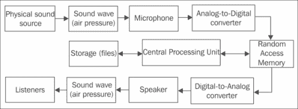

# 第五章。跨平台音频流

|   | *试着在你喜欢的游戏中关闭声音。* |   |
|   | - *维克多·拉特波夫* |

在这一章中，我们将涵盖以下食谱:

*   初始化 OpenAL 并播放。wav 文件
*   抽象基本音频成分
*   流式声音
*   解码 Ogg Vorbis 文件
*   使用 ModPlug 解码追踪器音乐

# 简介

我们正在寻找一个真正便携式的桌面电脑和移动设备的声音播放实现。我们建议使用 OpenAL 库，因为它在桌面上是一个很好的库，使用它将使现有游戏更容易移植到安卓系统。在本章中，我们将组织一个小型多线程声音流库。

音频播放本质上是一个异步过程，因此声音硬件的解码和控制应该在一个单独的线程上完成，并由其他专用线程控制。例如，当玩家按下一个按钮，或者街机游戏中的角色落地时，我们可能会要求系统开始播放音频文件。游戏中这种操作的延迟通常没那么重要。

从数字角度来看，单声道或单声道声音(简称单声道)只不过是代表连续信号的一维长数组。立体声或多声道声音由几个声道表示，并存储为交错阵列，其中一个声道的样本后面是另一个声道的样本，依此类推。OpenAL 期望我们将这些数据作为一系列缓冲提交。OpenAL 库的主要概念是设备、上下文、监听器、音频源和声音缓冲区:



虚拟环境中产生的声音经过一系列滤波器处理后，通过扬声器播放。本章涵盖的材料将允许你为你的游戏创建一个便携式音频子系统。

# 初始化 OpenAL 并播放。wav 文件

在这个食谱中，我们给出了最简单的例子来播放 **PCM** 格式的未压缩音频文件(**脉冲编码调制**、[http://en.wikipedia.org/wiki/Pulse-code_modulation](http://en.wikipedia.org/wiki/Pulse-code_modulation))。本例只是无限循环播放单个文件。我们将创建单个设备、单个设备上下文和音频源。所有这些都是在一个专用线程中完成的，但是我们不应该担心多线程问题，因为 OpenAL 函数保证是线程安全的。

## 做好准备

OpenAL 库的源代码和构建脚本可以在`0_OpenAL`文件夹中找到，本章的每个示例都包含了预编译的静态库。对于 Windows，我们使用动态链接和 OpenAL。关于如何从安卓`.apk`包加载文件的说明可以在[第 4 章](04.html "Chapter 4. Organizing a Virtual Filesystem")、*组织虚拟文件系统*中找到。本食谱示例的完整来源可以在`0_AL_On_Android`文件夹中找到。

## 怎么做…

1.  我们实现实际回放的类`SoundThread`如下:

    ```cpp
    class SoundThread: public iThread
    {
    ```

2.  首先我们声明 OpenAL 音频设备的句柄和设备上下文:

    ```cpp
      ALCdevice*  FDevice;
      ALCcontext* FContext;
    ```

3.  然后，我们声明 OpenAL 音频源和缓冲区的句柄:

    ```cpp
      ALuint FSourceID;
      ALuint FBufferID;
    ```

4.  `Run()`成员功能完成所有工作，包括初始化、去初始化和将音频数据提交到 OpenAL:

    ```cpp
      virtual void Run()
      {
    ```

5.  我们初始化指向 OpenAL 函数的指针:

    ```cpp
        LoadAL();
    ```

6.  然后我们创建设备和设备上下文:

    ```cpp
        FDevice = alcOpenDevice( NULL );
        FContext = alcCreateContext( FDevice, NULL );
    ```

7.  最后，我们选择新创建的设备上下文作为当前上下文:

    ```cpp
        alcMakeContextCurrent( FContext );
    ```

8.  现在，我们开始创建音频源:

    ```cpp
        alGenSources( 1, &FSourceID );
    ```

9.  我们设置`1.0`恒定的最大播放音量，在 OpenAL 中称为**增益【T3:

    ```cpp
        alSourcef( FSourceID, AL_GAIN, 1.0f );
    ```** 
10.  要听到什么，我们必须加载包含声音数据的文件:

    ```cpp
        clPtr<iIStream> Sound = g_FS->CreateReader("test.wav");
    ```

11.  我们使用内存映射文件，并询问我们的 iStream 对象文件大小:

    ```cpp
        int DataSize = (int)Sound->GetSize();
        const ubyte* Data = Sound->MapStream();
    ```

12.  为了避免处理完整的 **RIFF WAVE** 文件格式，我们准备了一个包含单个未压缩音频数据块的特定文件；该数据的格式是 22 千赫单声道 16 位声音。我们通过`Data+sizeof(sWAVHeader)`作为音频数据，音频数据的大小显然是`DataSize-sizeof(sWAVHeader)` :

    ```cpp
        PlayBuffer( Data + sizeof( sWAVHeader ),
        DataSize - sizeof( sWAVHeader ));
    ```

13.  然后我们在旋转循环中调用`IsPlaying()`函数来检测 OpenAL 何时停止播放声音:

    ```cpp
        while ( IsPlaying() ) {}
    ```

14.  一旦声音回放完成，我们删除所有我们创建的对象:

    ```cpp
        alSourceStop( FSourceID );
        alDeleteSources( 1, &FSourceID );
        alDeleteBuffers( 1, &FBufferID );
        alcDestroyContext( FContext );
        alcCloseDevice( FDevice );
    ```

15.  最后，我们在 Windows 上卸载 OpenAL 库:

    ```cpp
        UnloadAL();
    ```

16.  在安卓系统上，释放分配的资源，释放音频设备是非常重要的。否则，音频将继续在后台播放。为了避免在这个小例子中编写 Java 代码，我们只需使用`exit()`调用来终止我们的本机活动:

    ```cpp
        exit( 0 );
      }
    ```

17.  上面的代码使用功能`IsPlaying()`检查音源是否繁忙:

    ```cpp
      bool IsPlaying()
      {
        int State;
        alGetSourcei( FSourceID, AL_SOURCE_STATE, &State );
        return State == AL_PLAYING;
      }
    ```

18.  功能`PlayBuffer()`将音频数据馈送到音频源:

    ```cpp
      void PlayBuffer(const unsigned char* Data, int DataSize)
      {
        alGenBuffers( 1, &FBufferID );
        alBufferData( FBufferID, AL_FORMAT_MONO16,
        Data, DataSize, 22050 );
        alSourcei( FSourceID, AL_BUFFER, FBufferID );
        alSourcePlay( FSourceID );
      }
    };
    ```

19.  The code above uses the size of the `sWAVHeader` structure to determine the offset of the audio data:

    ### 注

    对于`sWAVHeader`，结构字段的对齐应设置为`1`。我们的声明与来自安卓 NDK 和 MinGW 的 Clang 和 GCC 编译器兼容。对 VisualStudio 使用#pragma 包。

    ```cpp
    struct __attribute__((packed,aligned(1))) sWAVHeader
    {
      unsigned char    RIFF[4];
      unsigned int     Size;
      unsigned char    WAVE[4];
      unsigned char    FMT[4];
      unsigned int     SizeFmt;
      unsigned short   FormatTag;
      unsigned short   Channels;
      unsigned int     SampleRate;
      unsigned int     AvgBytesPerSec;
      unsigned short   nBlockAlign;
      unsigned short   nBitsperSample;
      unsigned char    Reserved[4];
      unsigned int     DataSize;
    };
    ```

后来我们重用这个结构来加载`.wav`文件。

## 它是如何工作的...

首先，我们声明保存虚拟文件系统和`SoundThread`对象的全局变量:

```cpp
clPtr<FileSystem> g_FS;
SoundThread g_Sound;
```

我们创建我们通常的应用程序模板，在`OnStart()`回调函数中，我们启动一个初始化 OpenAL 库的线程:

```cpp
void OnStart( const std::string& RootPath )
{
  …
  g_FS = new FileSystem();
  g_FS->Mount( "." );
#if defined(ANDROID)
  g_FS->Mount( RootPath );
  g_FS->AddAliasMountPoint( RootPath, "assets" );
#endif
  g_Sound.Start( iThread::Priority_Normal );
}
```

## 另见

*   [第二章](02.html "Chapter 2. Porting Common Libraries")*移植公共库*
*   [第 4 章](04.html "Chapter 4. Organizing a Virtual Filesystem")、*中的*实现可移植内存映射文件*方法组织虚拟文件系统*

# 提取基本音频成分

在之前的食谱中，我们学习了如何初始化 OpenAL 以及如何播放未压缩的`.wav`文件。在这里，我们展示了帮助我们管理初始化过程的`AudioSource`和`AudioThread`类。

## 做好准备

查看补充资料中的示例`0_AL_On_Android`了解 OpenAL 的基本概念。

## 怎么做…

1.  让我们小心翼翼地将 OpenAL 的初始化移到另一个名为`AudioThread` :

    ```cpp
    class AudioThread: public iThread
    {
    public:
      AudioThread():
        FDevice( NULL ),
        FContext( NULL ),
        FInitialized( false ) {}
      virtual ~AudioThread() {}

      virtual void Run()
      {
    ```

    的线程中
2.  方法开头的代码执行默认 OpenAL 设备的初始化，并创建音频上下文:

    ```cpp
        if ( !LoadAL() ) { return; }

        FDevice = alcOpenDevice( NULL );
        FContext = alcCreateContext( FDevice, NULL );
        alcMakeContextCurrent( FContext );
    ```

3.  我们设置标志，告诉其他线程是否可以使用我们的音频子系统:

    ```cpp
        FInitialized = true;
    ```

4.  Then we enter an infinite loop where we call the `Env_Sleep()` function, whose source code is explained as follows, to avoid using 100 percent utilization of CPU:

    ```cpp
        FPendingExit = false;
        while ( !IsPendingExit() ) { Env_Sleep( 100 ); }
    ```

    ### 注

    在这个例子中，我们使用 100 毫秒的固定值将线程置于睡眠模式。处理音频时，根据缓冲区大小和采样率计算睡眠延迟非常有用。例如，一个包含 16 位单声道样本的`65535`字节缓冲器，采样速率为`44100`赫兹，给我们大约 *65535 / (44100 × 16 / 8) ≈ 0.7* 秒的音频播放。立体声播放会将这次的时间减半。

5.  最后，我们释放 OpenAL 对象:

    ```cpp
        alcDestroyContext( FContext );
        alcCloseDevice( FDevice );
        UnloadAL();
      }
    ```

6.  声明的其余部分只包含所有必需的字段和初始化标志:

    ```cpp
      bool FInitialized;
    private:
      ALCdevice*     FDevice;
      ALCcontext*    FContext;
    };
    ```

7.  代码中使用的`Env_Sleep()`函数只是使线程在给定的毫秒数内不活动。使用 Windows 中的`Sleep()`系统调用和安卓中的`usleep()`功能

    ```cpp
    void Env_Sleep( int Milliseconds )
    {
    #if defined _WIN32
      Sleep( Milliseconds );
    #else
      usleep( static_cast<useconds_t>( Milliseconds ) * 1000 );
    #endif
    }
    ```

    实现
8.  播放`.wav`文件对我们来说是不够的，因为我们想要支持不同的音频格式。因此，我们必须将音频播放和文件格式的实际解码分成两个独立的实体。我们准备引入`iWaveDataProvider`类，它的子类作为我们音频回放类的数据源:

    ```cpp
    class iWaveDataProvider: public iObject
    {
    public:
      iWaveDataProvider(): FChannels( 0 ),
        FSamplesPerSec( 0 ),
        FBitsPerSample( 0 ) {}
    ```

9.  这个类的主要例程允许访问解码的音频数据:

    ```cpp
      virtual ubyte* GetWaveData() = 0;
      virtual size_t GetWaveDataSize() const = 0;
    ```

10.  以下是我们如何从该提供商处获取数据的内部 OpenAL 音频格式标识符:

    ```cpp
      ALuint GetALFormat() const
      {
        if ( FBitsPerSample == 8 )
           {
          return (FChannels == 2) ?
            AL_FORMAT_STEREO8  : AL_FORMAT_MONO8;
           }
        else if ( FBitsPerSample == 16)
           {
          return (FChannels == 2) ?
            AL_FORMAT_STEREO16 : AL_FORMAT_MONO16;
           }
        return AL_FORMAT_MONO8;
      }
    ```

11.  另外，我们在这里存储关于音频格式的信息:

    ```cpp
      int FChannels;
      int FSamplesPerSec;
      int FBitsPerSample;
    };
    ```

12.  正如我们已经知道的，必须创建一个音频源来产生声音。该功能在`AudioSource`类中实现，该类包装了来自先前配方的 OpenAL 函数调用。这个类使用`iWaveDataProvider`实例作为音频数据源:

    ```cpp
    class AudioSource: public iObject
    {
    public:
    ```

13.  构造器只是创建一个 OpenAL 源代码句柄，并设置默认参数:

    ```cpp
      AudioSource(): FWaveDataProvider( NULL )
      {
        alGenSources( 1, &FSourceID );
        alSourcef( FSourceID, AL_GAIN,    1.0 );
        alSourcei( FSourceID, AL_LOOPING, 0   );
      }
    ```

14.  析构函数停止回放并执行清理:

    ```cpp
      virtual ~AudioSource()
      {
        Stop();
        FWaveDataProvider = NULL;
        alDeleteSources( 1, &FSourceID );
        alDeleteBuffers( 1, &FBufferID );
      }
    ```

15.  `Play()`方法将 OpenAL 源切换到播放状态:

    ```cpp
      void Play()
      {
        if ( IsPlaying() ) { return; }
        alSourcePlay( FSourceID );
      }
    ```

16.  `Stop()`方法将开放源切换到停止状态。只有从声音缓冲区开始停止 ping 后，才能恢复播放:

    ```cpp
      void Stop()
      {
        alSourceStop( FSourceID );
      }
    ```

17.  `IsPlaying()`方法检查信号源是否正在播放音频。实现来自之前的食谱:

    ```cpp
      bool IsPlaying() const
      {
        int State;
        alGetSourcei( FSourceID, AL_SOURCE_STATE, &State );
        return State == AL_PLAYING;
      }
    ```

18.  一个小`SetVolume()`方法改变源的播放音量。接受的浮点值在`0.0…1.0` :

    ```cpp
      void SetVolume( float Volume )
      {
        alSourcef( FSourceID, AL_GAIN, Volume );
      }
    ```

    范围内
19.  将数据输入音频源的主程序是`BindWaveform()`。该函数存储指向数据提供者的智能指针，并生成一个 OpenAL 缓冲区对象:

    ```cpp
      void BindWaveform( clPtr<iWaveDataProvider> Wave )
      {
        FWaveDataProvider = Wave;
        if ( !Wave ) return;

        alGenBuffers( 1, &FBufferID );
        alBufferData( FBufferID,
          Wave->GetALFormat(),
          Wave->GetWaveData(),
          (int)Wave->GetWaveDataSize(),
          Wave->FSamplesPerSec );
        alSourcei( FSourceID, AL_BUFFER, FBufferID );
      }
    ```

20.  `AudioSource`类的私有部分包含对音频数据提供者和内部 OpenAL 源和缓冲区句柄的引用:

    ```cpp
    private:
      clPtr<iWaveDataProvider> FWaveDataProvider;
      ALuint FSourceID;
      ALuint FBufferID;
    };
    ```

21.  为了能够从文件中读取声音，我们在`WavProvider`类中实现了`iWaveDataProvider`接口:

    ```cpp
    class WavProvider: public iWaveDataProvider
    ```

22.  这个类唯一包含的字段是一个指向`Blob`对象的智能指针，该对象包含文件数据:

    ```cpp
      clPtr<Blob> FRawData;
    ```

23.  一个简单的脉码调制`.wav`文件由开头的`sWAVHeader`结构和音频数据组成，可以直接馈入 OpenAL 音频源。`WavProvider`类的构造器提取关于音频数据的信息:

    ```cpp
      WavProvider( const clPtr<clBlob>& blob )
      {
        FRawData = blob;
        sWAVHeader H = *(sWAVHeader*)FRawData->GetData();

        const unsigned short FORMAT_PCM = 1;
        FChannels      = H.Channels;
        FSamplesPerSec = H.SampleRate;
        FBitsPerSample = H.nBitsperSample;
      }
    ```

24.  析构函数是空的，因为我们的`Blob`对象被包装成一个智能指针:

    ```cpp
      virtual ~WavProvider() {}
    ```

25.  `iWaveDataProvider`界面简单，这里我们只实现了两个成员函数。`GetWaveData()`返回音频数据的指针:

    ```cpp
      virtual ubyte* GetWaveData()
      {
        return (ubyte*)FRawData->GetDataConst() +
          sizeof( sWAVHeader );
      }
    ```

26.  `GetWaveDataSize()`方法从总文件大小中减去文件头大小:

    ```cpp
      virtual size_t GetWaveDataSize() const
      {
        return FRawData->GetSize() - sizeof( sWAVHeader );
      };
    ```

现在我们已经完成了音频播放和解码。

## 它是如何工作的…

现在我们可以演示如何一起使用所有的音频类。像往常一样，我们创建一个空的应用程序模板，可以在`1_AL_Abstraction`文件夹中找到。

为了能够使用 OpenAL，我们必须声明一个全局`AudioThread`实例:

```cpp
AudioThread g_Audio;
```

我们在`OnStart()`回调函数中启动这个线程:

```cpp
g_Audio.Start( iThread::Priority_Normal );
```

在这个例子中，我们实现了`SoundThread`类，它的`Run()`方法完成了所有的回放。在这个线程上，我们必须等待`g_Audio`初始化:

```cpp
while ( !g_Audio.FInitialized ) {}
```

现在我们可以创建音频源:

```cpp
clPtr<AudioSource> Src = new AudioSource();
```

最后，我们需要创建一个`WavProvider`对象，该对象解码音频文件，将其附加到`Src`源，开始回放并等待其完成:

```cpp
clPtr<Blob> Data = LoadFileAsBlob("test.wav");
Src->BindWaveform( new WavProvider( Data ) );
Src->Play();
while ( Src->IsPlaying() ) {}
```

声音播放结束后，我们将`Src`指针重置为`NULL`，并向`g_Audio`线程发送终止信号:

```cpp
Src = NULL;
g_Audio.Exit(true);
```

要获得`Data`对象，我们必须实现以下功能，将文件内容读入内存块:

```cpp
clPtr<Blob> LoadFileAsBlob( const std::string& FName )
{
  clPtr<iIStream> input = g_FS->CreateReader( FName );
  clPtr<Blob> Res = new Blob();
  Res->CopyMemoryBlock( input->MapStream(), input->GetSize() );
  return Res;
}
```

我们使用`g_FS`对象`FileSystem`的全局初始化实例。请注意，在安卓操作系统上，我们不能使用标准路径，因此求助于我们的虚拟文件系统实现。

## 还有更多…

我们可以实现一些助手例程来简化`AudioSource`类的使用。第一个有用的例程是源暂停。OpenAL 提供了`alSourcePause()`功能，这还不够，因为我们必须控制所有正在播放的未引用缓冲区。这一点并不重要，因为我们只有一个缓冲区，但是当我们开始流式传输声音时，我们必须处理缓冲区队列。以下代码应该添加到`AudioSource`类中以实现暂停:

```cpp
void Pause()
{
  alSourcePause( FSourceID );
  UnqueueAll();
}
void UnqueueAll()
{
  int Queued;
  alGetSourcei( FSourceID, AL_BUFFERS_QUEUED, &Queued );

  if ( Queued > 0 )
  alSourceUnqueueBuffers(FSourceID, Queued, &FBufferID);
}
```

对于无限声音循环，我们可以在`AudioSource`类中实现`LoopSound()`方法:

```cpp
void LoopSound( bool Loop )
{
  alSourcei( FSourceID, AL_LOOPING, Loop ? 1 : 0);
}
```

安卓操作系统运行在多种硬件架构上，这可能会在读取`.wav`文件时造成一些额外的困难。如果我们运行的中央处理器是大端架构，我们必须交换`sWAVHeader`结构字段中的字节。`WavProvider`类的修改后的构造函数如下所示:

```cpp
WavProvider(clPtr<Blob> source)
{
  FRawData = source;
  sWAVHeader H = *(sWAVHeader*)(FRawData->GetData());
#if __BIG_ENDIAN__
  Header.FormatTag = SwapBytes16(Header.FormatTag);
  Header.Channels  = SwapBytes16(Header.Channels);
  Header.SampleRate = SwapBytes32(Header.SampleRate);
  Header.DataSize   = SwapBytes32(Header.DataSize);
  Header.nBlockAlign = SwapBytes16(Header.nBlockAlign);
  Header.nBitsperSample = SwapBytes16(Header.nBitsperSample);
```

大端内存字节顺序要求交换 16 位值的较低字节和较高字节:

```cpp
  if ( (Header.nBitsperSample == 16) )
  {
    clPtr<Blob> NewBlob = new clBlob();
    NewBlob->CopyBlob( FRawData.GetInternalPtr() );
    FRawData = NewBlob;
    unsigned short* Ptr =
      (unsigned short*)FRawData->GetData();
    for ( size_t i = 0 ; i != Header.DataSize / 2; i++ )
    {
      *Ptr = SwapBytes16(*Ptr);
      Ptr++;
     }
  }
#endif
  FChannels      = H.Channels;
  FSamplesPerSec = H.SampleRate;
  FBitsPerSample = H.nBitsperSample;
}
```

这里我们使用 GCC 编译器提供的`__BIG_ENDIAN__`预处理器符号来检测大端 CPU。两个`SwapBytes()`功能改变无符号字和双字中字节的顺序:

```cpp
unsigned short SwapBytes16( unsigned short Val )
{
  return (Val >> 8) | ((Val & 0xFF) << 8);
}
unsigned int SwapBytes32( unsigned int Val )
{
  return	(( Val & 0xFF ) << 24 ) |
    (( Val & 0xFF00   ) <<  8 ) |
    (( Val & 0xFF0000 ) >>  8 ) |
    (  Val >> 24);
}
```

## 另见

*   *解码 Ogg Vorbis 文件*

# 流动的声音

我们已经学习了如何播放短音频样本，现在我们准备组织声音流。这个方法解释了如何组织一个缓冲队列来允许动态声音生成和流式传输。

## 做好准备

我们假设读者已经熟悉了前面食谱中描述的`AudioSource`和`iWaveDataProvider`类。

## 怎么做…

1.  首先，我们用额外的方法`IsStreaming()`来丰富`iWaveDataProvider`，这表明来自该提供程序的数据应该以小块读取，而`StreamWaveData()`，它实际上读取单个块:

    ```cpp
    class iWaveDataProvider: public iObject
      …
      virtual bool IsStreaming() const { return false; }
      virtual int  StreamWaveData( int Size ) { return 0; }
      …
    };
    ```

2.  接下来，我们编写一个派生类，它包含一个用于解码或生成声音数据的中间缓冲区。不执行`StreamWaveData()`，但执行`GetWaveData()`和`GetWaveDataSize()`方法:

    ```cpp
    class StreamingWaveDataProvider: public iWaveDataProvider
    {
    public:
      virtual bool IsStreaming() const { return true; }

      virtual ubyte* GetWaveData() { return (ubyte*)&FBuffer[0]; }
      virtual size_t GetWaveDataSize() const { return FBufferUsed; }

      std::vector<char> FBuffer;
      int               FBufferUsed;
    };
    ```

3.  `FBufferUsed`字段保存`FBuffer`向量中使用的字节数。现在我们修改`AudioSource`类来支持我们新的流媒体数据提供商。我们不希望在回放过程中出现裂缝或中断，因此我们使用了一个缓冲队列，而不是我们在单块声音回放中使用的单个缓冲。为此，我们首先声明一个缓冲计数器和一个缓冲标识数组:

    ```cpp
    class AudioSource: public iObject
    {
    private:
      unsigned int FSourceID;
      int          FBuffersCount;
      unsigned int FBufferID[2];
    ```

4.  我们保留`LoopSound()`、`Stop()`、`Pause()`、`IsPlaying()`和`SetVolume()`成员函数、构造函数和析构函数的实现不变。如果相关的波形数据提供者支持流式传输，`BindWaveform()`方法现在生成缓冲区:

    ```cpp
      void BindWaveform( clPtr<iWaveDataProvider> Wave )
      {
        FWaveDataProvider = Wave;
        if ( !Wave ) return;

        if ( Wave->IsStreaming() )
        {
          FBuffersCount = 2;
          alGenBuffers( FBuffersCount, &FBufferID[0] );
        }
        else
        {
          FBuffersCount = 1;
          alGenBuffers( FBuffersCount, &FBufferID[0] );
          alBufferData( FBufferID[0],
            Wave->GetALFormat(),
            Wave->GetWaveData(),
            (int)Wave->GetWaveDataSize(),
            Wave->FSamplesPerSec );
          alSourcei( FSourceID, AL_BUFFER, FBufferID[0] );
        }
      }
    ```

5.  `Play()`方法调用`alSourcePlay()`功能并在流模式下向队列添加缓冲区:

    ```cpp
      void Play()
      {
        if ( IsPlaying() ) { return; }
        if ( !FWaveDataProvider ) { return; }

        int State;
        alGetSourcei( FSourceID, AL_SOURCE_STATE, &State );

        if (  State != AL_PAUSED &&
          FWaveDataProvider->IsStreaming() )
        {
          UnqueueAll();
    ```

6.  填充两个音频缓冲区，并将它们提交到 OpenAL API:

    ```cpp
          StreamBuffer( FBufferID[0], BUFFER_SIZE );
          StreamBuffer( FBufferID[1], BUFFER_SIZE );
          alSourceQueueBuffers(FSourceID, 2, &FBufferID[0]);
        }
        alSourcePlay( FSourceID );
      }
    ```

7.  现在我们使用了多个缓冲区，我们在`UnqueueAll()`方法中把`FBufferID`改为`FBufferID[0]`:

    ```cpp
      void   UnqueueAll()
      {
        int Queued;
        alGetSourcei(FSourceID, AL_BUFFERS_QUEUED, &Queued);
        if ( Queued > 0 )
          alSourceUnqueueBuffers(FSourceID,
            Queued, &FBufferID[0]);
      }
    ```

8.  最后，由于流式传输是一个连续的过程，而不是一劳永逸的操作，因此我们提供了`Update()`方法，该方法从`iWaveDataProvider` :

    ```cpp
      void Update( float DeltaSeconds )
      {
        if ( !FWaveDataProvider ) { return; }
        if ( !IsPlaying() ) { return; }

        if ( FWaveDataProvider->IsStreaming() )
        {
          int Processed;
          alGetSourcei( FSourceID,
          AL_BUFFERS_PROCESSED, &Processed );

          while ( Processed-- )
          {
            unsigned int BufID;
            alSourceUnqueueBuffers(FSourceID,1,&BufID);
            StreamBuffer( BufID, BUFFER_SIZE );
            alSourceQueueBuffers(FSourceID, 1, &BufID);
          }
        }
      }
    ```

    提取适量的数据
9.  在`Update()`方法中，我们使用`StreamBuffer()`成员函数，该函数用来自提供者:

    ```cpp
      int StreamBuffer( unsigned int BufferID, int Size )
      {
        int ActualSize = 
          FWaveDataProvider->StreamWaveData(Size);

        ubyte* Data = FWaveDataProvider->GetWaveData();
        int Sz = (int)FWaveDataProvider->GetWaveDataSize();

        alBufferData( BufferID,
          FWaveDataProvider->GetALFormat(),
          Data, Sz,
          FWaveDataProvider->FSamplesPerSec );

        return ActualSize;
      }
    ```

    的解码数据或生成的数据填充缓冲区
10.  The `BUFFER_SIZE` constant is set to be big enough to hold the data for a couple of seconds of streamed data:

    ```cpp
    const int BUFFER_SIZE = 352800;
    ```

    ### 注

    数值`352800`推导如下:

    *2 通道×每秒 44100 个采样×每个采样 2 字节× 2 秒= 352800 字节*。

## 它是如何工作的…

本食谱中的代码不执行`StreamWaveData()`方法。为了从扬声器中听到一些东西，我们编写了`ToneGenerator`类，它生成一个纯正弦波作为输出数据。这个类来源于`StreamingWaveDataProvider`:

```cpp
class ToneGenerator : public StreamingWaveDataProvider
{
```

首先声明信号和内部采样计数器的参数:

```cpp
  int   FSignalFreq;
  float FFrequency;
  float FAmplitude;
private:
  int LastOffset;
```

构造函数设置声音数据参数并预分配缓冲空间:

```cpp
public:
  ToneGenerator()
  {
    FBufferUsed = 100000;
    FBuffer.resize( 100000 );

    FChannels = 2;
    FSamplesPerSec = 4100;
    FBitsPerSample = 16;

    FAmplitude = 350.0f;
    FFrequency = 440.0f;
  }
  virtual ~ToneGenerator() {}
```

这个类的主例程计算正弦函数，跟踪当前样本索引，使声音缓冲队列包含所有值:

```cpp
  virtual int StreamWaveData( int Size )
  {
    if ( Size > static_cast<int>( FBuffer.size() ) )
    {
      FBuffer.resize( Size );
      LastOffset = 0;
    }

    for ( int i = 0 ; i < Size / 4 ; i++ )
    {
```

正弦函数的参数`t`由局部指数`i`和名为`LastOffset`的相位值计算得出:

```cpp
      float t = ( 2.0f * 3.141592654f *
        FFrequency * ( i + LastOffset ) ) / 
         (float) FSamplesPerSec;
        float val = FAmplitude * std::sin( t );
```

以下几行将单个浮点值转换为带符号的单词。这种转换是必要的，因为数字音频硬件只处理整数数据:

```cpp
      short V = static_cast<short>( val );
      FBuffer[i * 4 + 0] = V & 0xFF;
      FBuffer[i * 4 + 1] = V >> 8;
      FBuffer[i * 4 + 2] = V & 0xFF;
      FBuffer[i * 4 + 3] = V >> 8;
    }
```

接下来我们增加生成的样本计数器，同时将其保持在`0…FSignalFreq-1`范围内:

```cpp
    LastOffset += Size / 2;
    LastOffset %= FSamplesPerSec;
```

最后，返回生成的字节数:

```cpp
    FBufferUsed = Size;
    return FBufferUsed;
  }
};
```

我们现在可以使用`AudioSource`类来流式传输声音。创建音频源后，我们会附加一个新的流提供商，该提供商会生成一个 440 Hz 正弦波形:

```cpp
class SoundThread: public iThread
{
  virtual void Run()
  {
    while ( !g_Audio.Finitialized ) {}

    clPtr<AudioSource> Src = new AudioSource();
    Src->BindWaveform( new ToneGenerator() );
    Src->Play();

    FPendingExit = false;
    double Seconds = Env_GetSeconds();
```

在无限循环中，我们不断更新声源，迫使其产生声音数据:

```cpp
    While ( !IsPendingExit() )
    {
      float DeltaSeconds =
         (float)( Env_GetSeconds() - Seconds );
      Src->Update( DeltaSeconds );
      Seconds = Env_GetSeconds();
    }
  }
}
```

## 还有更多…

很容易注意到在`ToneGenerator::StreamWaveData()`成员函数中，我们可以使用任何公式，而不仅仅是正弦函数。我们鼓励读者尝试并创造某种软件合成器。

# 解码 Ogg Vorbis 文件

Ogg Vorbis 是一种广泛使用的、免费的、开放的、无专利的音频压缩格式。它可以与其他用于存储和播放数字音乐的格式相媲美，例如 MP3、VQF 和 AAC。

## 做好准备

读者应该熟悉前面食谱中的声音流技术。关于`.ogg`容器文件格式和 Vorbis 音频压缩算法的细节可以在[http://xiph.org](http://xiph.org)找到。

## 怎么做...

1.  我们将`IsEOF()`方法添加到`iWaveDataProvider`界面。这是用来通知`AudioSource`声音结束时:

    ```cpp
      virtual bool    IsEOF() const { return true; }
    ```

2.  我们添加的另一个方法是`Seek()`，它会倒带音频流:

    ```cpp
      virtual void    Seek( float Time ) {}
    ```

3.  在`DecodingProvider`类中，我们实现了`StreamWaveData()`成员函数，该函数使用`ReadFromFile()`方法从源存储块中读取解码的声音数据:

    ```cpp
    class DecodingProvider: public StreamingWaveDataProvider
    {
      clPtr<Blob> FRawData;
    public:
      bool FEof;
      virtual bool IsEOF() const { return FEof; }
    ```

4.  `FLoop`标志告诉解码器，如果遇到流结束，则倒回，并从头开始回放:

    ```cpp
      bool FLoop;
    public:
      DecodingProvider( const clPtr<Blob>& blob )
      {
        FRawData = blob;
        FEof = false;
      }
    ```

5.  主流例程试图从源内存块读取更多数据:

    ```cpp
      virtual int StreamWaveData( int Size )
      {
    ```

6.  我们用零填充缓冲区中未使用的部分，以避免噪声:

    ```cpp
        int OldSize = (int)FBuffer.size();
        if ( Size > OldSize )
        {
          FBuffer.resize( Size );
          for ( int i = 0 ; i < OldSize - Size ; i++ )
            FBuffer[OldSize + i] = 0;
        }
    ```

7.  在文件末尾，我们返回零作为解码数据大小:

    ```cpp
        if ( FEof ) { return 0; }
    ```

8.  接下来，我们尝试从源读取，直到收集到`Size`字节:

    ```cpp
        int BytesRead = 0;
        while ( BytesRead < Size )
        {
          int Ret = ReadFromFile(Size);
    ```

9.  如果我们有数据，递增计数器:

    ```cpp
          if ( Ret > 0 )
          {
            BytesRead += Ret;
          }
    ```

10.  如果字节数为零，我们已经到达文件的末尾:

    ```cpp
          else if (Ret == 0)
            {
            FEof = true;
    ```

11.  `FLoop`标志告诉我们将流倒回到开头:

    ```cpp
            if ( FLoop )
            {
              Seek(0);
              FEof = false;
              continue;
            }
            break;
          } else
    ```

12.  否则，我们在流中有一个错误:

    ```cpp
          {
            Seek( 0 );
            FEof = true;
            break;
          }
        }
    ```

13.  缓冲的字节数现在是从文件中读取的字节数:

    ```cpp
        return ( FBufferUsed = BytesRead );
      }
    ```

14.  `ReadFromFile()`函数在这里是纯虚函数，实现在派生类中:

    ```cpp
    protected:
      virtual int ReadFromFile(int Size) = 0;
    };
    ```

15.  在[第二章](02.html "Chapter 2. Porting Common Libraries")、*移植公共库*中，我们编译了 Ogg 和 Vorbis 静态库。我们现在在`OggProvider`类中使用它们，它实现了实际的声音数据解码:

    ```cpp
    class OggProvider: public DecodingProvider
    {
    ```

16.  解码器的状态存在于三个变量中:

    ```cpp
      OggVorbis_File         FVorbisFile;
      ogg_int64_t            FOGGRawPosition;
      int                    FOGGCurrentSection;
    ```

17.  构造函数初始化 Ogg 和 Vorbis 库。`Callbacks`结构包含指向函数的指针，这允许 Ogg 库使用我们的虚拟文件系统流从我们的内存块中读取数据:

    ```cpp
    public:
      OggProvider( const clPtr<Blob>& Blob ): DecodingProvider(Blob)
      {
        FOGGRawPosition = 0;
    ```

18.  填写`Callbacks`结构，初始化文件阅读器:

    ```cpp
        ov_callbacks Callbacks;
        Callbacks.read_func  = OGG_ReadFunc;
        Callbacks.seek_func  = OGG_SeekFunc;
        Callbacks.close_func = OGG_CloseFunc;
        Callbacks.tell_func  = OGG_TellFunc;
        OGG_ov_open_callbacks( this, &FVorbisFile,
        NULL, -1, Callbacks );
    ```

19.  声明`vorbis_info`结构来读取音频流的持续时间。存储关于该流的信息:

    ```cpp
        vorbis_info* VorbisInfo;
        VorbisInfo     = OGG_ov_info ( &FVorbisFile, -1 );
        FChannels      = VorbisInfo->channels;
        FSamplesPerSec = VorbisInfo->rate;
    ```

20.  `FBitsPerSample`结构设置为 16 位，稍后我们告诉解码器将声音数据作为 16 位信号输出:

    ```cpp
        FBitsPerSample = 16;
      }
    ```

21.  在析构器中，`FVorbisFile`被清除:

    ```cpp
      virtual ~OggProvider() { OGG_ov_clear( &FVorbisFile ); }
    ```

22.  `ReadFromFile()`函数使用 OGG 库进行流解码:

    ```cpp
      virtual int ReadFromFile(int Size, int BytesRead)
      {
        return (int)OGG_ov_read( &FVorbisFile,
          &FBuffer[0] + BytesRead,
          Size - BytesRead,
    ```

23.  在这里，我们假设我们运行在小端 CPU 上，例如英特尔凌动、英特尔酷睿或移动安卓设备中常见的其他 ARM 处理器([http://en.wikipedia.org/wiki/Endianness](http://en.wikipedia.org/wiki/Endianness))。如果不是这样，例如，处理器是大端模式的 PowerPC 或 MIPS，您应该提供`1`作为`OGG_ov_read()`函数的参数:

    ```cpp
          0, // 0 for LITTLE_ENDIAN, 1 for BIG_ENDIAN
          FBitsPerSample >> 3,
          1,
          &FOGGCurrentSection );
      }
    ```

24.  `Seek()`成员函数将流倒回指定时间:

    ```cpp
      virtual void Seek( float Time )
      {
        FEof = false;
        OGG_ov_time_seek( &FVorbisFile, Time );
      }
    ```

25.  在类定义的末尾，包含了`OGG_Callbacks.h`文件，其中实现了静态回调函数:

    ```cpp
    private:
      #include "OGG_Callbacks.h"
    };
    ```

26.  `OGG_Callbacks.h`文件中的函数实现了一个类似`FILE*`的接口，OGG 图书馆的用它来读取我们的内存块。我们通过一个`OggProvider`的例子作为所有这些函数中的`void* DataSource`参数。
27.  `OGG_ReadFunc()`函数读取指定的字节数，并检查数据的结尾:

    ```cpp
    size_t OGG_ReadFunc( void* Ptr, size_t Size, size_t NMemB,
      void* DataSource )
      {
        OggProvider* OGG = (OggProvider*)DataSource;

        size_t DataSize = OGG->FRawData->GetSize();

        ogg_int64_t BytesRead = DataSize - OGG- >FOGGRawPosition;
        ogg_int64_t BytesSize = Size * NMemB;

        if ( BytesSize < BytesRead ) { BytesRead = BytesSize; }

        memcpy( Ptr,
          (ubyte*)OGG->FRawData->GetDataConst() +
            OGG->FOGGRawPosition, (size_t)BytesRead );

        OGG->FOGGRawPosition += BytesRead;
        return (size_t)BytesRead;
      }
    ```

28.  `OGG_SeekFunc()`功能将当前读取位置设置为等于`Offset` :

    ```cpp
      int OGG_SeekFunc( void* DataSource, ogg_int64_t Offset,
      int Whence )
      {
        OggProvider* OGG = (OggProvider*)DataSource;
        size_t DataSize = OGG->FRawData->GetSize();
        if ( Whence == SEEK_SET )
        {
          OGG->FOGGRawPosition = Offset;
        }
        else if ( Whence == SEEK_CUR )
        {
          OGG->FOGGRawPosition += Offset;
        }
        else if ( Whence == SEEK_END )
        {
          OGG->FOGGRawPosition = DataSize + Offset;
        }
    ```

    的值
29.  防止位置超出流尾:

    ```cpp
        if ( OGG->FOGGRawPosition > (ogg_int64_t)DataSize )
        {
          OGG->FOGGRawPosition = (ogg_int64_t)DataSize;
        }
        return static_cast<int>( OGG->FOGGRawPosition );
      }
    ```

30.  由于我们使用内存块作为数据源，`OGG_CloseFunc()`函数立即返回零，因为我们不需要关闭任何句柄:

    ```cpp
      int OGG_CloseFunc( void* DataSource ) { return 0; }
    ```

31.  `OGG_TellFunc()`功能返回当前读取位置:

    ```cpp
      long OGG_TellFunc( void* DataSource )
      {
        return (int)
          (((OggProvider*)DataSource)->FOGGRawPosition);
      }
    ```

## 它是如何工作的…

我们像前面的方法一样初始化 OpenAL，并将`OggProvider`绑定为`AudioSource`实例的数据源:

```cpp
  clPtr<AudioSource> Src = new AudioSource();
  clPtr<Data> = LoadFileAsBlob( "test.ogg" );
  Src->BindWaveform( new OggProvider(Data) );
  Src->Play();
  FPendingExit = false;
  double Seconds = Env_GetSeconds();
```

循环更新音源，就像我们用`ToneGenerator`一样:

```cpp
  While ( !IsPendingExit() )
  {
    float DeltaSeconds =
       (float)(Env_GetSeconds() - Seconds );
    Src->Update(DeltaSeconds);
    Seconds = Env_GetSeconds();
  }
```

`LoadFileAsBlob()`功能与我们用来加载`.wav`文件的功能相同。

# 使用 ModPlug 解码追踪器音乐

与台式机相比，移动设备的资源总是有限的。这些限制既包括计算能力，也包括可用存储量。高质量的 MPEG-1 第 3 层或 Ogg Vorbis 音频文件占据了大量空间，即使是中等比特率。例如，在一个 20 Mb 的游戏中，两个大小各为 5 Mb 的轨道是不可接受的。然而，在质量和压缩之间有一个很好的平衡。一种起源于 80 年代的技术被称为跟踪器音乐 —有时被称为 chiptune 或 8 位音乐([http://en.wikipedia.org/wiki/Music_tracker](http://en.wikipedia.org/wiki/Music_tracker))。跟踪器音乐格式不使用脉冲编码调制来存储整个音轨。相反，他们使用`notes`和效果，应用到`samples`并在几个通道中播放。`Samples`是小型 PCM 编码的乐器声音。`Notes`对应一个样本的回放速度。我们使用 **libmodplug** 库来解码最流行的追踪器音乐文件格式，如`.it`、`.xm`和`.mod`。

## 做好准备

在 http://modplug-xmms.sourceforge.net 查看最新版本的 libmodplug。

## 怎么做...

1.  ModPlug 库允许我们实现另一个从`DecodingProvider`派生的类，叫做`ModPlugProvider`。该库支持内存块的直接解码，因此我们不必实现任何类型的输入/输出回调:

    ```cpp
    class ModPlugProvider: public DecodingProvider
    {
    ```

2.  作为一种状态，这个类包含`ModPlugFile`结构:

    ```cpp
    private:
      ModPlugFile* FModFile;
    ```

3.  唯一的构造函数初始化`ModPlugFile`字段:

    ```cpp
    public:
      explicit ModPlugProvider( const clPtr<Blob>& Blob )
      : DecodingProvider(Blob)
      {
        FChannels = 2;
        FSamplesPerSec = 44100;
        FBitsPerSample = 16;

        FModFile = ModPlug_Load_P(
          ( const void* )FRawData->GetDataConst(),
          ( int )FRawData->GetSize() );
      }
    ```

4.  析构函数卸载文件:

    ```cpp
      virtual ~ModPlugProvider() { ModPlug_Unload_P( FModFile ); }
    ```

5.  `ReadFromFile()`方法调用 ModPlug 的读取功能:

    ```cpp
      virtual int ReadFromFile(int Size, int BytesRead)
      {
        return ModPlug_Read_P( FModFile,
          &FBuffer[0] + BytesRead,
          Size - BytesRead );
      }
    ```

6.  要倒回源流，我们使用`ModPlug_Seek()`成员函数:

    ```cpp
      virtual void Seek( float Time )
      {
        FEof = false;
        ModPlug_Seek_P( FModFile, ( int )( Time * 1000.0f ) );
      }
    };
    ```

## 它是如何工作的...

没有专门用于模块文件解码的示例。为了更好的理解，我们建议修改`3_AL_PlayingOGG`源代码。唯一需要的修改是用`ModPlugProvider`替换`OggProvider`。为了测试，您在`3_AL_PlayingOGG`文件夹中有`test.it`文件。

## 另见

*   *解码 Ogg Vorbis 文件*