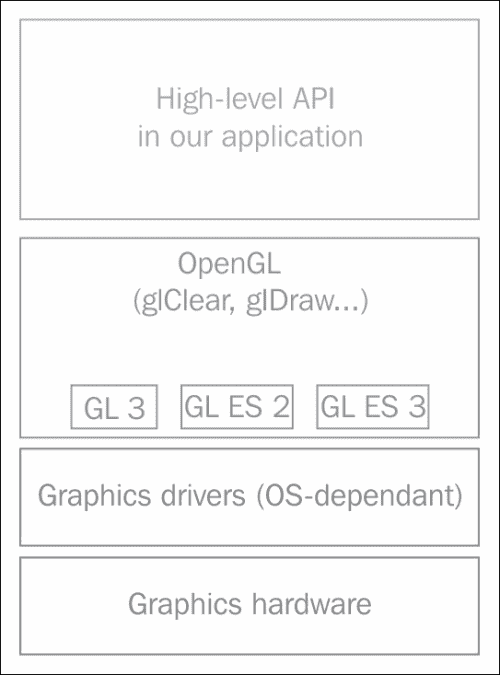
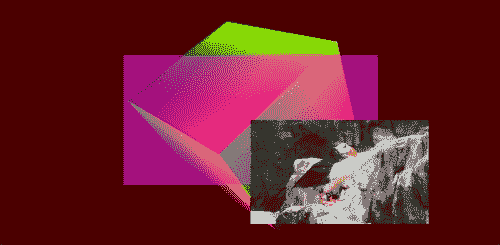

# 第六章。统一 OpenGL ES 3 和 OpenGL 3

在本章中，我们将介绍:

*   统一 OpenGL 3 核心概要文件和 OpenGL ES 2
*   在 Windows 上初始化 OpenGL 3 核心配置文件
*   在安卓系统上初始化 OpenGL ES 2
*   统一 GLSL 3 和 GLSL ES 2 着色器
*   操纵几何
*   统一顶点数组
*   创建纹理包装
*   创建用于即时渲染的画布

# 简介

毫无疑问，任何游戏都需要渲染一些图形。在本章中，我们将学习如何为您的游戏创建一个便携式图形渲染子系统。章节标题为*统一 OpenGL ES 3 和 OpenGL 3*；然而，在本书中，我们处理的是可移植开发，所以我们从 OpenGL 3 桌面 API 开始我们的食谱。这有两个目的。首先，OpenGL 3 几乎是 OpenGL ES 3 的超集。这将允许我们轻松地在两个版本的 OpenGL API 之间移植应用程序。其次，我们可以创建一个简单但非常有效的包装器，从游戏代码中抽象出两个应用编程接口，这样我们就可以在台式电脑上开发我们的游戏。

### 注

安卓 4.3 和安卓 NDK r9 引入了 OpenGL ES 3 支持。然而，本书中的所有例子都与这个移动应用编程接口的前一个版本 OpenGL ES 2 向后兼容。

OpenGL 本身是一个巨大的主题，值得一本专门的书。我们建议从*《OpenGL 编程指南》*、*皮尔森出版物*(红皮书)开始。

# 统一 OpenGL 3 核心概要文件和 OpenGL ES 2

让我们在 OpenGL 3 和 OpenGL ES 2 之上实现一个薄的抽象层，使我们的高级代码不知道我们的应用程序运行的特定 GL 版本。这意味着我们的游戏代码可以完全不知道它是运行在手机版还是桌面版的 OpenGL 上。请看下图:



本章我们要实现的部分在**高级 API** 矩形内。

## 做好准备

在[第 4 章](04.html "Chapter 4. Organizing a Virtual Filesystem")、*组织虚拟文件系统*中，我们创建了一个示例`3_AsyncTexture`，在这里我们学习了如何使用 Java 在 Android 上初始化 OpenGL ES 2。现在我们使用该示例中的`GLView.java`来初始化安卓上的渲染上下文。没有来自安卓 NDK 的 EGL 参与，所以我们的例子将在安卓 2.1 和更高版本上运行。

## 怎么做…

1.  在上一个配方中，我们提到了`sLGLAPI`结构。它包含指向我们在启动时动态加载的 OpenGL 函数的指针。声明可以在`LGLAPI.h`中找到，的开头类似于下面的代码:

    ```cpp
    struct sLGLAPI
    {
      sLGLAPI() { memset( this, 0, sizeof( *this ) ); };
    …Win32 defines skipped here…
      PFNGLACTIVETEXTUREPROC       glActiveTexture;
      PFNGLATTACHSHADERPROC        glAttachShader;
      PFNGLBINDATTRIBLOCATIONPROC  glBindAttribLocation;
    …
    ```

2.  定义了一个变量来保存指向该结构的指针:

    ```cpp
    sLGLAPI* LGL3;
    ```

3.  This means we have to call all OpenGL functions through pointers contained in `LGL3`. For example, following is the code for `OnDrawFrame()` from the `2_OpenGLES2` example:

    ```cpp
    void OnDrawFrame()
    {
      LGL3->glClearColor( 1.0, 0.0, 0.0, 0.0 );
      LGL3->glClear( GL_COLOR_BUFFER_BIT );
    }
    ```

    比简单的`glClear(GL_COLOR_BUFFER_BIT)`调用要复杂一点，那么我们为什么需要它呢？根据您的应用程序如何链接到不同平台上的 OpenGL，类似`glClear`的实体可以用两种方式表示。如果您的应用程序动态链接到 OpenGL，全局符号(如`glClear`)由保存从.`DLL/.so`库中检索的函数指针的全局变量表示。你的应用程序也可以静态地链接到一些 OpenGL 包装库，就像在安卓系统上使用`LOCAL_LDLIBS`中的`-lGLESv2`和`-lGLESv3`开关一样。在这种情况下，`glClear()`将是一个函数，而不是一个变量，您将无法更改它包含的代码。再者，如果我们看某些 OpenGL 3 函数，比如`glClearDepth(double Depth)`，却发现 OpenGL ES 2 对它们没有直接的等价物，事情就变得更加复杂了。这就是为什么我们需要一个指向我们可以随意改变的 OpenGL 函数的指针集合。

4.  在安卓上，我们定义了一个 thunk 函数:

    ```cpp
    void Emulate_glClearDepth( double Depth )
    {
      glClearDepthf( static_cast<float>( Depth ) );
    }
    ```

5.  该函数使用 OpenGL ES 3 的`glClearDepthf()`调用模拟 OpenGL 3 的`glClearDepth()`调用。现在事情又简单了。有一些 GL3 功能不能在 GLES3 上简单地模拟。我们现在可以很容易地为它们实现空存根，例如:

    ```cpp
    void Emulate_glPolygonMode( GLenum, GLenum )
    {
      // not supported
    }
    ```

这种情况下未实现的功能将禁用一些渲染功能；但是应用程序将运行良好，同时在 GLES2 上优雅地降级。一些更复杂的方面，比如使用`glBindFragDataLocation()`的多个渲染目标，仍然需要我们为 OpenGL 3 和 OpenGL ES 2 选择不同的着色器程序和代码路径。然而，这现在是可行的。

## 它是如何工作的…

`sLGLAPI`绑定代码在`GetAPI()`功能中实现。在以前的食谱中描述的 Windows 版本很简单`.DLL`加载代码。安卓版本更简单。由于我们的应用程序与 OpenGL ES 2 库是静态链接的，我们只是将函数指针分配给`sLGLAPI`的字段，除了在 OpenGL ES 2 中不存在的调用:

```cpp
void GetAPI( sLGLAPI* API ) const
{
  API->glActiveTexture = &glActiveTexture;
  API->glAttachShader = &glAttachShader;
  API->glBindAttribLocation = &glBindAttribLocation;
…
```

相反，我们为它们使用存根，如前所述:

```cpp
  API->glClearDepth = &Emulate_glClearDepth;
  API->glBindFragDataLocation = &Emulate_glBindFragDataLocation;
…
```

现在 OpenGL 的使用是完全透明的，我们的应用程序完全不知道 OpenGL 实际使用的是什么味道。看`OpenGL3.cpp`文件:

```cpp
#include <stdlib.h>
#include "LGL.h"
sLGLAPI* LGL3 = NULL;
void OnDrawFrame()
{
  LGL3->glClearColor( 1.0, 0.0, 0.0, 0.0 );
  LGL3->glClear( GL_COLOR_BUFFER_BIT );
}
```

这段代码在 Windows 和 Android 上运行完全相同。

## 还有更多…

`2_OpenGLES2`示例的安卓版本可以通过以下命令构建:

```cpp
>ndk-build
>ant copy-common-media debug

```

运行该应用程序会将整个屏幕涂成红色，并将表面尺寸输出到系统日志中:

```cpp
W/GLView  ( 3581): creating OpenGL ES 2.0 context
I/App13   ( 3581): SurfaceSize: 1196 x 720
```

OpenGL 3 Core Profile、OpenGL ES 2 和 OpenGL ES 3 还有其他一些区别，这些区别不能通过模仿所有的 API 函数调用来抽象出来。这包括 GLSL 着色器的不同语法，以及在 OpenGL 3.2 核心配置文件中强制使用顶点数组对象(VAO)，这些在 OpenGL ES 2 中是不存在的。

## 另见

*   统一 GLSL 3 和 GLSL ES 2 着色器
*   操纵几何
*   统一顶点数组
*   创建纹理包装

# 在 Windows 上初始化 OpenGL 3 内核配置文件

OpenGL 3.0 引入了功能弃用的想法。某些功能可能会被标记为不推荐使用，并且可能会在以后的版本中从规范中删除。例如，通过`glBegin` `()/glEnd` `()`的即时模式渲染在 OpenGL 标准 3.0 版本中被标记为不推荐使用，在 3.1 版本中被删除。然而，许多 OpenGL 实现保留了不推荐使用的功能。例如，他们希望能够为现代 OpenGL 版本的用户提供一种从旧 API 访问功能的方式。

从 OpenGL 版本开始，引入了一种新的机制，允许用户创建特定版本的渲染上下文。每个版本都允许**向后兼容**或**核心配置文件**上下文。向后兼容的上下文允许使用所有标记为不推荐使用的功能。核心概要文件上下文删除了不推荐使用的功能，使应用编程接口更加清晰。此外，OpenGL 3 核心配置文件比以前的 OpenGL 版本更接近移动 OpenGL ES 2。因为这本书的目标是提供一种在桌面上开发移动应用程序的方法，所以特征集的这种相似性将会派上用场。让我们来看看如何在 Windows 上手动创建核心配置文件上下文。

### 注

对于使用 Unix 或 Mac 桌面计算机的读者，我们建议使用 GLFW 库来创建 OpenGL 上下文，可在[http://www.glfw.org](http://www.glfw.org)获得。

## 做好准备

关于核心和兼容性上下文的更多信息，可以在[http://www . OpenGL . org/wiki/Core _ And _ Compatibility _ in _ Contexts](http://www.opengl.org/wiki/Core_And_Compatibility_in_Contexts)的 OpenGL 官方页面找到。

## 怎么做…

有一个名为`WGL_ARB_create_context`的 OpenGL 扩展，可以在 Windows 上创建特定版本的 OpenGL 上下文，可在[http://www . OpenGL . org/registry/specs/ARB/wgl _ create _ context . txt](http://www.opengl.org/registry/specs/ARB/wgl_create_context.txt)上找到。

的诀窍是，我们可以从现有的有效 OpenGL 上下文中获得一个指向`wglCreateContextAttribsARB()`函数的指针，该函数可以创建一个核心配置文件上下文。这意味着我们必须初始化 OpenGL 两次。首先，我们使用`glCreateContext()`创建一个临时兼容性上下文，并检索一个指向`wglCreateContextAttribsARB()`扩展函数的指针。然后，我们继续使用扩展函数创建指定版本的 OpenGL 上下文，并带有所需的标志。以下是我们用来创建 OpenGL 渲染上下文的代码:

### 注

`sLGLAPI`结构包含指向我们使用的所有 OpenGL 函数的指针。阅读之前的配方*统一 OpenGL 3 核心概要文件和 OpenGL ES 2* 了解实现细节。

```cpp
HGLRC CreateContext( sLGLAPI* LGL3, HDC DeviceContext,int VersionMajor, int VersionMinor )
{
  HGLRC RenderContext = 0;
```

第一次调用该函数时，它会到达`else`块，并创建一个 OpenGL 向后兼容的上下文。当您检索到指向`wglCreateContextAttribsARB()`功能的有效指针时，将其保存在`sLGLAPI`结构中，并再次调用`CreateContext()`。这一次第一个`if`街区接管了控制权:

```cpp
  if ( LGL3->wglCreateContextAttribsARB )
  {
    const int Attribs[] =
    {
      WGL_CONTEXT_MAJOR_VERSION_ARB, VersionMajor,
      WGL_CONTEXT_MINOR_VERSION_ARB, VersionMinor,
      WGL_CONTEXT_LAYER_PLANE_ARB, 0,
      WGL_CONTEXT_FLAGS_ARB,
      WGL_CONTEXT_FORWARD_COMPATIBLE_BIT_ARB,
      WGL_CONTEXT_PROFILE_MASK_ARB,
      WGL_CONTEXT_CORE_PROFILE_BIT_ARB,
      0 // zero marks the end of values
    };
    RenderContext = LGL3->wglCreateContextAttribsARB(DeviceContext, 0, Attribs );
  }
  else
  {
```

1.  `lglCreateContext()`调用只是特定于操作系统的应用编程接口调用的包装，在本例中为`wglCreateContext()`:

    ```cpp
        RenderContext = LGL3->lglCreateContext(DeviceContext );
      }
      return RenderContext;
    }
    ```

2.  This function is wrapped into the `CreateContextFull()` function, which selects an appropriate pixel format and makes the context current:

    ```cpp
    HGLRC CreateContextFull( sLGLAPI* LGL3, HDC DeviceContext,int BitsPerPixel, int ZBufferBits, int StencilBits,int Multisample, int VersionMajor, int VersionMinor )
    {
      bool FormatSet = ChooseAndSetPixelFormat( LGL3,DeviceContext,BitsPerPixel, ZBufferBits, StencilBits, Multisample );
      if ( !FormatSet ) return 0;
      HGLRC RenderContext = CreateContext( LGL3,DeviceContext, VersionMajor, VersionMinor );
      if ( !RenderContext ) return 0;
      if ( !MakeCurrent( LGL3, DeviceContext, RenderContext ) )
      { return 0; }
      Reload( LGL3 );
      return RenderContext;
    }
    ```

    它在 Windows 上返回创建的 OpenGL 渲染上下文`HGLRC`，并更新`LGL3`结构中的指针以对应创建的上下文。

    ### 注

    前面描述的函数有很多副作用，一些函数程序员声称它是不一致的。另一种方法是将一个新的`HGLRC`与新的`LGL3`一起返回(或者作为新的`LGL3`的一部分)，这样你可以在以后根据自己的意愿使其成为当前的，并且仍然可以访问旧的上下文。我们将把这个想法留给读者作为练习。

    前面提到的函数`Reload()`在`sLGLAPI`结构中重新加载指向 OpenGL 函数的指针。这种间接性很重要，因为我们需要在 OpenGL ES 2 上模拟一些 OpenGL 3 函数的行为。

    像素格式选择也使用另一个 OpenGL 扩展:`WGL_ARB_pixel_format`可在[http://www . OpenGL . org/registry/specs/ARB/wGL _ Pixel _ format . txt](http://www.opengl.org/registry/specs/ARB/wgl_pixel_format.txt)获得。

3.  这意味着我们必须选择和设置像素格式两次。代码如下:

    ```cpp
    bool ChooseAndSetPixelFormat( sLGLAPI* LGL3, HDCDeviceContext,int BitsPerPixel, int ZBufferBits, int StencilBits,int Multisample )
    {
      PIXELFORMATDESCRIPTOR PFD;
      memset( &PFD, 0, sizeof( PFD ) );
      PFD.nSize        = sizeof( PIXELFORMATDESCRIPTOR );
      PFD.nVersion     = 1;
      PFD.dwFlags = PFD_DRAW_TO_WINDOW |
                    PFD_SUPPORT_OPENGL | PFD_DOUBLEBUFFER;
      PFD.iPixelType = PFD_TYPE_RGBA;
      PFD.cColorBits = static_cast<BYTE>(BitsPerPixel & 0xFF);
      PFD.cDepthBits = static_cast<BYTE>(ZBufferBits & 0xFF);
      PFD.cStencilBits = static_cast<BYTE>(StencilBits & 0xFF);
      PFD.iLayerType = PFD_MAIN_PLANE;
      GLint PixelFormat = 0;
    ```

4.  如果有效指针可用，尝试使用扩展:

    ```cpp
      if ( LGL3->wglChoosePixelFormatARB )
      {
        const int Attribs[] =
        {
          WGL_DRAW_TO_WINDOW_ARB, GL_TRUE,WGL_SUPPORT_OPENGL_ARB, GL_TRUE,WGL_ACCELERATION_ARB, WGL_FULL_ACCELERATION_ARB,WGL_DOUBLE_BUFFER_ARB , GL_TRUE,WGL_PIXEL_TYPE_ARB    , WGL_TYPE_RGBA_ARB,WGL_COLOR_BITS_ARB    , BitsPerPixel,WGL_DEPTH_BITS_ARB    , ZBufferBits,WGL_STENCIL_BITS_ARB  , StencilBits,WGL_SAMPLE_BUFFERS_ARB, GL_TRUE,WGL_SAMPLES_ARB       , Multisample,0 // zero marks the end of values
        };
        GLuint Count = 0;
        LGL3->wglChoosePixelFormatARB( DeviceContext,Attribs, NULL, 1, &PixelFormat, &Count );
        if ( !PixelFormat )
        {
          PixelFormat = ::ChoosePixelFormat(
            DeviceContext, &PFD );
        }
        return ::SetPixelFormat( DeviceContext,PixelFormat, NULL );
      }
    ```

5.  或者，退回到 WinAPI 提供的像素格式选择功能:

    ```cpp
      if ( !PixelFormat )
      {
        PixelFormat = ::ChoosePixelFormat(DeviceContext, &PFD);
      }
      return ::SetPixelFormat( DeviceContext,
        PixelFormat, &PFD );
    }
    ```

## 它是如何工作的…

`Reload()`函数加载`opengl32.dll`并获取指向某些 WGL ( [函数的指针:](http://en.wikipedia.org/wiki/WGL_(API))

```cpp
void LGL::clGLExtRetriever::Reload( sLGLAPI* LGL3 )
{
  if ( !FLibHandle ) FLibHandle =
    (void*)::LoadLibrary( "opengl32.dll" );
  LGL3->lglGetProcAddress = ( PFNwglGetProcAddress )
    ::GetProcAddress( (HMODULE)FLibHandle, "wglGetProcAddress" );
  LGL3->lglCreateContext = ( PFNwglCreateContext )
    ::GetProcAddress( (HMODULE)FLibHandle, "wglCreateContext" );
  LGL3->lglGetCurrentContext = ( PFNwglGetCurrentContext )
    ::GetProcAddress( (HMODULE)FLibHandle,"wglGetCurrentContext");
  LGL3->lglMakeCurrent = ( PFNwglMakeCurrent )
    ::GetProcAddress( (HMODULE)FLibHandle, "wglMakeCurrent" );
  LGL3->lglDeleteContext = ( PFNwglDeleteContext )
    ::GetProcAddress( (HMODULE)FLibHandle, "wglDeleteContext" );
  GetAPI( LGL3 );
}
```

`GetAPI()`功能大了很多但是还是微不足道。以下只是给你提供想法的几行:

```cpp
void LGL::clGLExtRetriever::GetAPI( sLGLAPI* API ) const
{
  API->glActiveTexture = ( PFNGLACTIVETEXTUREPROC )GetGLProc( API, "glActiveTexture" );
  API->glAttachShader = ( PFNGLATTACHSHADERPROC )GetGLProc( API, "glAttachShader" );
…
```

完整的源代码在`1_OpenGL3`文件夹中。您可以用`make`来构建它:

```cpp
>make all

```

本示例打开一个红色背景的窗口，并打印类似以下内容的行:

```cpp
Using glCreateContext()
Using wglCreateContextAttribsARB()
OpenGL version: 3.2.0
OpenGL renderer: GeForce GTX 560/PCIe/SSE2
OpenGL vendor: NVIDIA Corporation
```

OpenGL 上下文版本与调用`glCreateContextAttribsARB()`中指定的版本相匹配。

## 还有更多…

WinAPI 中不允许多次设置窗口的像素格式。因此，我们使用一个临时的不可见窗口来创建第一个渲染上下文并检索扩展。查看`1_OpenGL3`示例中的文件`OpenGL3.cpp`，了解进一步的实施细节。

## 另见

*   *统一 OpenGL 3 核心轮廓和 OpenGL ES 3*

# 在安卓上初始化 OpenGL ES 2

与视窗系统相比，在安卓系统上初始化 OpenGL 非常简单。在安卓 NDK 中创建 OpenGL 渲染上下文有两种可能:直接使用来自 NDK 的 EGL API([http://en . Wikipedia . org/wiki/EGL _(API)](http://en.wikipedia.org/wiki/EGL_(API)))或者基于`android.opengl.GLSurfaceView`创建包装器 Java 类。我们将选择第二种选择。

## 做好准备

让自己熟悉[的`GLSurfaceView`类界面。](http://developer.android.com/reference/android/opengl/GLSurfaceView.html)

## 怎么做…

1.  我们通过以下方式扩展`GLSurfaceView`类:

    ```cpp
    public class GLView extends GLSurfaceView
    {
      …
    ```

2.  `init()`方法为帧缓冲区选择`RGB_888`像素格式:

    ```cpp
      private void init( int depth, int stencil )
      {
        this.getHolder().setFormat( PixelFormat.RGB_888 );
        setEGLContextFactory( new ContextFactory() );
        setEGLConfigChooser(new ConfigChooser( 8, 8, 8, 0, depth, stencil ) );
        setRenderer( new Renderer() );
      }
    ```

3.  这个内部类执行 EGL 调用来创建一个 OpenGL 渲染上下文:

    ```cpp
      private static class ContextFactory implementsGLSurfaceView.EGLContextFactory
      {
        private static int EGL_CONTEXT_CLIENT_VERSION = 0x3098;
        public EGLContext createContext( EGL10 egl,EGLDisplay display, EGLConfig eglConfig )
        {
          int[] attrib_list = { EGL_CONTEXT_CLIENT_VERSION 2,EGL10.EGL_NONE };
          EGLContext context = egl.eglCreateContext(display, eglConfig, EGL10.EGL_NO_CONTEXT,attrib_list );
          return context;
        }
        public void destroyContext( EGL10 egl,EGLDisplay display, EGLContext context )
        {
          egl.eglDestroyContext( display, context );
        }
      }
    ```

4.  `ConfigChooser`类处理像素格式。我们在书中省略了所有的错误检查；然而，在`2_OpenGLES2`示例的`GLView.java`文件中可以找到更健壮的实现:

    ```cpp
      private static class ConfigChooser implementsGLSurfaceView.EGLConfigChooser
      {
        public ConfigChooser( int r, int g, int b, int a,int depth, int stencil )
    …
        private static int EGL_OPENGL_ES2_BIT = 4;
    ```

5.  像素格式选择器的默认值为:

    ```cpp
        private static int[] s_configAttribs2 =
        {
          EGL10.EGL_RED_SIZE, 5,EGL10.EGL_GREEN_SIZE, 6,EGL10.EGL_BLUE_SIZE, 5,EGL10.EGL_ALPHA_SIZE, 0,EGL10.EGL_DEPTH_SIZE, 16,EGL10.EGL_STENCIL_SIZE, 0,EGL10.EGL_SAMPLE_BUFFERS, 0,EGL10.EGL_SAMPLES, 0,EGL10.EGL_RENDERABLE_TYPE, EGL_OPENGL_ES2_BIT,EGL10.EGL_NONE, EGL10.EGL_NONE
        };
        public EGLConfig chooseConfig( EGL10 egl,EGLDisplay display )
        {
          int[] num_config = new int[1];
          egl.eglChooseConfig( display, s_configAttribs2,null, 0, num_config );
          int numConfigs = num_config[0];
          …
    ```

6.  分配并读取最低匹配 EGL 配置的数组:

    ```cpp
          EGLConfig[] configs = new EGLConfig[numConfigs];
          egl.eglChooseConfig( display, s_configAttribs2,configs, numConfigs, num_config );
    ```

7.  选择最佳匹配的:

    ```cpp
          return chooseConfig( egl, display, configs );
        }

        public EGLConfig chooseConfig( EGL10 egl,EGLDisplay display, EGLConfig[] configs )
        {
          for ( EGLConfig config : configs )
          {
    ```

8.  选择具有指定深度缓冲和模板缓冲位值的配置:

    ```cpp
            int d = findConfigAttrib( egl, display,config, EGL10.EGL_DEPTH_SIZE,   0 );
            int s = findConfigAttrib( egl, display,config, EGL10.EGL_STENCIL_SIZE, 0 );
    ```

9.  我们至少需要`mDepthSize`和`mStencilSize`位用于深度和模板:

    ```cpp
            if ( d < mDepthSize || s < mStencilSize )
            {
              continue;
            }
    ```

10.  我们想要一个红色/绿色/蓝色/阿尔法位的精确匹配:

    ```cpp
            int r = findConfigAttrib( egl, display,config, EGL10.EGL_RED_SIZE,   0 );
            int g = findConfigAttrib( egl, display,config, EGL10.EGL_GREEN_SIZE, 0 );
            int b = findConfigAttrib( egl, display,config, EGL10.EGL_BLUE_SIZE,  0 );
            int a = findConfigAttrib( egl, display,config, EGL10.EGL_ALPHA_SIZE, 0 );
            if ( r == mRedSize && g == mGreenSize &&b == mBlueSize && a == mAlphaSize )
            {
              return config;
            }
          }
          return null;
        }
    ```

11.  使用助手方法查找匹配的配置:

    ```cpp
        private int findConfigAttrib( EGL10 egl,EGLDisplay display, EGLConfig config,int attribute, int defaultValue )
        {
          if ( egl.eglGetConfigAttrib( display,config, attribute, mValue ) )
          {
            return mValue[0];
          }
          return defaultValue;
        }
    …
      }
    ```

12.  `Renderer`类将帧渲染回调委托给我们的 NDK 代码:

    ```cpp
      private static class Rendererimplements GLSurfaceView.Renderer
      {
        public void onDrawFrame( GL10 gl )
        {
          App13Activity.DrawFrame();
        }
        public void onSurfaceChanged( GL10 gl,int width, int height )
        {
          App13Activity.SetSurfaceSize( width, height );
        }
        public void onSurfaceCreated( GL10 gl,EGLConfig config )
        {
         App13Activity.SetSurface(App13Activity.m_View.getHolder().getSurface() );
        }
      }
    }
    ```

## 它是如何工作的…

帧渲染回调在`App13Activity.java`中声明:

```cpp
public static native void SetSurface( Surface surface );
public static native void SetSurfaceSize(
 int width, int height );
public static native void DrawFrame();
```

它们是在`Wrappers.cpp`文件中实现的 JNI 调用:

```cpp
JNIEXPORT void JNICALL
Java_com_packtpub_ndkcookbook_app13_App13Activity_SetSurface(
JNIEnv* env, jclass clazz, jobject javaSurface )
{
  if ( LGL3 ) { delete( LGL3 ); }
```

分配一个新的`sLGLAPI`结构，并重新加载指向 OpenGL 函数的指针:

```cpp
  LGL3 = new sLGLAPI;
  LGL::clGLExtRetriever* OpenGL;
  OpenGL = new LGL::clGLExtRetriever;
  OpenGL->Reload( LGL3 );
  delete( OpenGL );
}
JNIEXPORT void JNICALLJava_com_packtpub_ndkcookbook_app13_App13Activity_SetSurfaceSize(JNIEnv* env, jclass clazz, int Width, int Height )
{
```

更新表面尺寸。我们在这里不需要做任何其他事情，因为`SetSurface()`将在它之后被调用:

```cpp
  g_Width  = Width;
  g_Height = Height;
}
JNIEXPORT void JNICALLJava_com_packtpub_ndkcookbook_app13_App13Activity_DrawFrame(JNIEnv* env, jobject obj )
{
```

调用我们独立于平台的帧渲染回调:

```cpp
  OnDrawFrame();
}
```

现在我们可以把渲染代码放到`OnDrawFrame()`回调中，在安卓上使用。

## 还有更多…

要使用前面讨论的代码，您必须将这一行添加到`AndroidManifest.xml`文件中:

```cpp
<uses-feature android:glEsVersion="0x00020000"/>
```

此外，您必须将您的本机应用程序与 OpenGL ES 2 或 OpenGL ES 3 库链接起来。将`-lGLESv2`或`-lGLESv3`开关放入您的`Android.mk`文件，如下所示:

```cpp
LOCAL_LDLIBS += -lGLESv2
```

### 注

还有第三种可能。您可以省略静态链接，通过`dlopen()`调用打开`libGLESv2.so`共享库，并使用`dlsym()`函数检索指向 OpenGL 函数的指针。如果您正在为 OpenGL ES 2 和 OpenGL ES 3 开发一个通用的渲染器，并且想要在运行时调整一切，这将非常有用。

## 另见

*   *统一 OpenGL 3 核心概要文件和 OpenGL ES 2*

# 统一 GLSL 3 和 GLSL ES 2 着色器

OpenGL 3 提供对 OpenGL 着色语言的支持。特别是，OpenGL 3.2 核心配置文件支持 GLSL 1.50 核心配置文件。另一方面OpenGL ES 2 提供对 GLSL ES 1.0 版本的支持，OpenGL ES 3 支持 GLSL ES 3.0。这三个 GLSL 版本之间有细微的语法差异，为了编写可移植的着色器，我们必须对其进行抽象。在本食谱中，我们将创建一个工具来降级桌面 OpenGL 着色器，使其成为与 OpenGL ES 着色语言 1.0 兼容的着色器。

### 注

OpenGL ES 3 对 OpenGL ES 着色语言 1.0 有向后兼容的支持。为此，我们将`#version 100`放在着色器的开头。但是，如果你的应用程序只针对最近的 OpenGL ES 3，你可以使用标记`#version 300 es`并避免一些转换。详见[的 OpenGL ES 着色语言 3.0 规范。](http://www.khronos.org/registry/gles/specs/3.0/GLSL_ES_Specification_3.00.4.pdf)

## 做好准备

不同 GLSL 语言版本的规格可从官方 OpenGL 网站[http://www.opengl.org](http://www.opengl.org)下载。GLSL 1.50 规格在[http://www.opengl.org/registry/doc/GLSLangSpec.1.50.09.pdf](http://www.opengl.org/registry/doc/GLSLangSpec.1.50.09.pdf)找到。

GLSL ES 的规格可从 http://www.khronos.org 的 Khronos 网站下载。GLSL ES 1.0 规范见[http://www . khronos . org/registry/gles/specs/2.0/GLSL _ ES _ Specification _ 1 . 0 . 17 . pdf](http://www.khronos.org/registry/gles/specs/2.0/GLSL_ES_Specification_1.0.17.pdf)。

## 怎么做…

1.  让我们看看两组简单的顶点和片段着色器。GLSL 1.50 的是:

    ```cpp
    // vertex shader
    #version 150 core
    uniform mat4 in_ModelViewProjectionMatrix;
    in vec4 in_Vertex;
    in vec2 in_TexCoord;
    out vec2 Coords;
    void main()
    {
      Coords = in_TexCoord;
      gl_Position = in_ModelViewProjectionMatrix * in_Vertex;
    }

    // fragment shader
    #version 150 core
    in vec2 Coords;
    uniform sampler2D Texture0;
    out vec4 out_FragColor;
    void main()
    {
      out_FragColor = texture( Sampler0, Coords );
    }
    ```

2.  And the other pair of shaders is for GLSL ES 1.0:

    ```cpp
    // vertex shader
    #version 100
    precision highp float;
    uniform mat4 in_ModelViewProjectionMatrix;
    attribute vec4 in_Vertex;
    attribute vec2 in_TexCoord;
    varying vec2 Coords;
    void main()
    {
      Coords = in_TexCoord;
      gl_Position = in_ModelViewProjectionMatrix * in_Vertex;
    }

    // fragment shader
    #version 100
    precision highp float;
    uniform sampler2D Texture0;
    varying vec2 Coords;
    void main()
    {
      gl_FragColor = texture2D( Texture0, Coords );
    }
    ```

    下表总结了三个版本的 OpenGL API 之间的一些差异，需要进行抽象:

    <colgroup><col style="text-align: left"> <col style="text-align: left"> <col style="text-align: left"> <col style="text-align: left"></colgroup> 
    |   | 

    OpenGL 3

     | 

    OpenGL 是 2

     | 

    OpenGL 是 3

     |
    | --- | --- | --- | --- |
    | 版本定义 | # 150 版核心 | #版本 100 | #版本 300 es |
    | 显式浮点精度 | 不需要 | 需要 | 不需要 |
    | 变量和属性的关键字 | 进进出出 | 变化和属性 | 进进出出 |
    | 固定功能片段数据位置 | 不，可定制 | gl_FragColor | 不，可定制 |
    | 2D 纹理提取 | 纹理()，过载 | 二维纹理() | 纹理()，过载 |

3.  Let's implement conversion rules in the following code to downgrade GLSL 1.50 shaders to GLSL 1.0:

    ```cpp
    #if defined( USE_OPENGL_3 )
    std::string ShaderStr = "#version 150 core\n";
    #else
    std::string ShaderStr = "#version 100\n";
    ShaderStr += "precision highp float;\n";
    ShaderStr += "#define USE_OPENGL_ES_2\n";
    ShaderCodeUsed = Str_ReplaceAllSubStr( ShaderCodeUsed,
      "texture(", "texture2D(" );
    if ( Target == GL_VERTEX_SHADER )
    {
        ShaderCodeUsed = Str_ReplaceAllSubStr( ShaderCodeUsed,"in ", "attribute " );
        ShaderCodeUsed = Str_ReplaceAllSubStr( ShaderCodeUsed,"out ", "varying " );
    }
    if ( Target == GL_FRAGMENT_SHADER )
    {
        ShaderCodeUsed = Str_ReplaceAllSubStr( ShaderCodeUsed,"out vec4 out_FragColor;", "" );
        ShaderCodeUsed = Str_ReplaceAllSubStr( ShaderCodeUsed,"out_FragColor", "gl_FragColor" );
        ShaderCodeUsed = Str_ReplaceAllSubStr( ShaderCodeUsed,"in ", "varying " );
    }
    #endif
    ```

    ### 注

    这种搜索和替换意味着对着色器源代码的一些限制。例如，它将使包含标识符的着色器无效，如`grayin`和`sprout`。然而，上面的代码非常简单，并在几个已发布的商业项目中成功使用。

我们将着色器存储在 GLSL 1.5 源代码中，只需进行简单的搜索和替换，就可以在安卓系统上使用它们。它非常简单透明。

## 它是如何工作的…

的完整实现在`3_ShadersAndVertexArrays`示例的`clGLSLShaderProgram`类中介绍。代码降级后，如有需要，上传到 OpenGL:

```cpp
GLuint Shader = LGL3->glCreateShader( Target );
const char* Code = ShaderStr.c_str();
LGL3->glShaderSource( Shader, 1, &Code, NULL );
LOGI( "Compiling shader for stage: %X\n", Target );
LGL3->glCompileShader( Shader );
```

`CheckStatus()`功能执行错误检查，并在失败时记录指定的错误信息:

```cpp
if ( !CheckStatus( Shader, GL_COMPILE_STATUS,"Failed to compile shader:" ) )
{
  LGL3->glDeleteShader( Shader );
  return OldShaderID;
}
if ( OldShaderID ) LGL3->glDeleteShader( OldShaderID );
return Shader;
```

`OldShaderID`保留之前编译的着色器。它用于允许在电脑上动态编辑着色器，并防止加载无效的着色器。顶点和片段着色器编译完成后，应链接一个着色器程序:

```cpp
bool clGLSLShaderProgram::RelinkShaderProgram()
{
  GLuint ProgramID = LGL3->glCreateProgram();
  FVertexShaderID = AttachShaderID( GL_VERTEX_SHADER,FVertexShader, FVertexShaderID );
  if ( FVertexShaderID ) LGL3->glAttachShader( ProgramID,FVertexShaderID );
  FFragmentShaderID = AttachShaderID( GL_FRAGMENT_SHADER,FFragmentShader, FFragmentShaderID );
  if ( FFragmentShaderID ) LGL3->glAttachShader( ProgramID,FFragmentShaderID );
  BindDefaultLocations( ProgramID );
  LGL3->glLinkProgram( ProgramID );
```

同样也应该对着色器程序进行。仅当程序链接成功时，替换旧程序:

```cpp
  if ( !CheckStatus( ProgramID, GL_LINK_STATUS,"Failed to link program\n" ) )
  {
    LOGI( "Error during shader program relinking\n" );
    return false;
  }
  LGL3->glDeleteProgram( FProgramID );
  FProgramID = ProgramID;
  RebindAllUniforms();
  return true;
}
```

我们必须绑定我们将在整个渲染器中使用的不同属性的默认位置:

```cpp
void clGLSLShaderProgram::BindDefaultLocations( GLuint ID )
{
```

配方*操纵几何图形*中解释了`L_VS_`标识符的含义:

```cpp
LGL3->glBindAttribLocation( ID, L_VS_VERTEX, "in_Vertex" );
LGL3->glBindAttribLocation( ID, L_VS_TEXCOORD,"in_TexCoord" );
LGL3->glBindAttribLocation( ID, L_VS_NORMAL, "in_Normal" );
LGL3->glBindAttribLocation( ID, L_VS_COLORS,  "in_Color" ); 
LGL3->glBindFragDataLocation( ID, 0, "out_FragColor" );
LGL3->glUniform1i(LGL3->glGetUniformLocation( ID, "Texture0" ), 0 );
}
```

着色器程序现在可以用于渲染。

## 还有更多…

在渲染过程中，我们可以通过名称指定额外制服的位置，并要求底层的 OpenGL API 通过名称绑定制服。然而，在我们自己的代码中这样做更方便，因为我们可以省略多余的 OpenGL 状态更改调用。以下是`RebindAllUniforms()`方法的列表，该方法将获取着色器程序的所有活动制服的位置，并保存它们以供进一步使用:

```cpp
void clGLSLShaderProgram::RebindAllUniforms()
{
  Bind();
  FUniforms.clear();
  GLint ActiveUniforms;
  char Buff[256];
  LGL3->glGetProgramiv( FProgramID,GL_ACTIVE_UNIFORMS, &ActiveUniforms );
  for ( int i = 0; i != ActiveUniforms; ++i )
  {
    GLsizei Length;
    GLint   Size;
    GLenum  Type;
    LGL3->glGetActiveUniform( FProgramID, i,sizeof( Buff ), &Length, &Size, &Type, Buff );
    std::string Name( Buff, Length );
    sUniform Uniform( Name );
    Uniform.FLocation = LGL3->glGetUniformLocation(FProgramID, Name.c_str() );
    FUniforms.push_back( Uniform );
  }
}
```

`sUniform`是一个`struct`手持单个主动制服:

```cpp
struct sUniform
{
public:
  explicit sUniform( const std::string& Name )
  : FName( Name ), FLocation( -1 ) {}
  sUniform( int Location, const std::string& Name )
  : FName( Name ), FLocation( Location ) {}
  std::string FName;
  int         FLocation;
};
```

在众多`SetUniformName()`函数中使用的是在运行时通过名称设置制服的值，而不需要接触 OpenGL API 来解析名称。

## 另见

*   *操纵几何图形*
*   *统一顶点数组*
*   *创建画布进行即时渲染*

# 操纵几何图形

在[第 4 章](04.html "Chapter 4. Organizing a Virtual Filesystem")、*组织虚拟文件系统*中，我们创建了`Bitmap`类，以独立于应用编程接口的方式加载和存储位图。现在，我们将为几何数据表示创建一个类似的抽象，稍后我们将使用它向 OpenGL 提交顶点及其属性。

## 做好准备

在我们继续抽象之前，让我们来看看 OpenGL 中的顶点规范是如何工作的。向 OpenGL 提交顶点数据需要创建不同的**顶点流**，并指定它们的解释方式。如果您不熟悉[http://www.opengl.org/wiki/Vertex_Specification](http://www.opengl.org/wiki/Vertex_Specification)的这个概念，请参考教程。

## 怎么做…

我们必须决定将哪些**顶点属性**或顶点流存储在我们的**网格**中。让我们假设对于一个给定的顶点，我们需要一个位置、纹理坐标、一个法线和一个颜色。

以下是这些流的名称和索引:

```cpp
const int L_VS_VERTEX   = 0;
const int L_VS_TEXCOORD = 1;
const int L_VS_NORMAL   = 2;
const int L_VS_COLORS   = 3; 
const int L_VS_TOTAL_ATTRIBS = L_VS_COLORS + 1;
```

### 注

例如，对于多纹理算法，可能需要额外的纹理坐标，或者对于硬件加速的图形处理器蒙皮，可能需要额外的属性，例如切线、副法线或骨骼和权重。使用这些语义可以很容易地引入它们。我们把它留给读者做练习。

1.  Let's define the number of float components for each attribute:

    ```cpp
    const int VEC_COMPONENTS[ L_VS_TOTAL_ATTRIBS ] = { 3, 2, 3, 4 };
    ```

    这意味着位置和法线表示为`vec3`，纹理坐标表示为`vec2`，颜色表示为`vec4`。我们需要这些信息来正确定义 OpenGL 着色器程序中的类型，并提交顶点数据。以下是我们用于顶点属性的渲染 API 独立容器的源代码:

    ```cpp
    class clVertexAttribs: public iObject
    {
    public:
      clVertexAttribs();
      clVertexAttribs( size_t Vertices );
      void   SetActiveVertexCount( size_t Count ){ FActiveVertexCount = Count; }
      size_t GetActiveVertexCount() const{ return FActiveVertexCount; }
    ```

2.  我们需要一种将顶点属性映射到枚举流的方法:

    ```cpp
      const std::vector<const void*>& EnumerateVertexStreams();
    ```

3.  我们还需要一些辅助方法来构建几何:

    ```cpp
      void Restart( size_t ReserveVertices );
      void EmitVertexV( const LVector3& Vec );
      void EmitVertex( float X, float Y, float Z ){ EmitVertexV( LVector3(X,Y,Z) ); };
      void SetTexCoord( float U, float V, float W ){ SetTexCoordV( LVector2(U,V) ); };
      void SetTexCoordV( const LVector2& V );
      void SetNormalV( const LVector3& Vec );
      void SetColorV( const LVector4& Vec );
    ```

4.  为方便起见，实际数据持有者为`public`:

    ```cpp
    public:
      // position X, Y, Z
      std::vector<LVector3> FVertices;
      // texture coordinate U, V
      std::vector<LVector2> FTexCoords;
      // normal in object space
      std::vector<LVector3> FNormals;
      // RGBA color
      std::vector<LVector4> FColors;
    …
    };
    ```

## 它是如何工作的…

为了使用`clVertexAttribs`并用有用的数据填充它，我们声明了几个助手函数:

```cpp
clPtr<clVertexAttribs> CreateTriangle2D( float vX, float vY,float dX, float dY, float Z );
clPtr<clVertexAttribs> CreateRect2D( float X1, float Y1, float X2,float Y2, float Z, bool FlipTexCoordsVertical,int Subdivide );
clPtr<clVertexAttribs> CreateAxisAlignedBox( const LVector3& Min,const LVector3& Max );
clPtr<clVertexAttribs> CreatePlane( float SizeX, float SizeY,int SegmentsX, int SegmentsY, float Z );
```

以下是其中一个的示例定义:

```cpp
clPtr<clVertexAttribs> clGeomServ::CreateTriangle2D( float vX,
 float vY, float dX, float dY, float Z )
{
 clPtr<clVertexAttribs> VA = new clVertexAttribs();
```

重启再生并为`3`顶点分配空间:

```cpp
 VA->Restart( 3 );
 VA->SetNormalV( LVector3( 0, 0, 1 ) );
 VA->SetTexCoord( 1, 1, 0 );
 VA->EmitVertexV( LVector3( vX   , vY   , Z ) );
 VA->SetTexCoord( 1, 0, 0 );
 VA->EmitVertexV( LVector3( vX   , vY - dY, Z ) );
 VA->SetTexCoord( 0, 1, 0 );
 VA->EmitVertexV( LVector3( vX + dX, vY   , Z ) );
 return VA;
}
```

这些函数的完整源代码可以在`3_ShadersAndVertexArrays`项目的`GeomServ.cpp`文件中找到。现在，我们有一组方便的函数来创建简单的 2D 和三维几何图元，如单个三角形、矩形和盒子。

## 还有更多…

如果你想学习如何创建更复杂的三维图元，下载 Linderdaum Engine 的源代码([http://www.linderdaum.com](http://www.linderdaum.com))。在`Geometry/GeomServ.h`中，您将了解如何生成球体、管道、多面体、齿轮和其他三维对象。

## 另见

*   *统一顶点数组*

# 统一顶点数组

几何数据使用顶点缓冲对象( **VBO** )和顶点数组对象( **VAO** )提交到 OpenGL 中。vbo 是两个 OpenGL 版本的一部分；但是，VAOs 不是 OpenGL ES 2 的一部分，而是在 OpenGL 3.2 Core Profile 中是强制的。这意味着我们必须做另一个抽象来隐藏它背后的两个 API 之间的区别。

> *一个**顶点缓冲对象** ( **VBO** )是一个 OpenGL 特性，提供了将顶点数据(位置、法向量、颜色等)上传到视频设备进行非即时模式渲染的方法。与即时模式渲染相比，vbo 提供了显著的性能提升，主要是因为数据驻留在视频设备内存中，而不是系统内存中，因此可以由视频设备直接渲染。*

礼遇:[http://en.wikipedia.org/wiki/Vertex_Buffer_Object](http://en.wikipedia.org/wiki/Vertex_Buffer_Object)

> *一个**顶点数组对象** ( **VAO** )是一个 OpenGL 对象，封装了指定顶点数据所需的状态。它们定义顶点数据的格式以及顶点数组的来源。vao 不包含数组本身；数组存储在缓冲对象中。VAOs 只是引用已经存在的缓冲区对象。*

礼遇:[http://www.opengl.org/wiki/Vertex_Specification](http://www.opengl.org/wiki/Vertex_Specification)

## 做好准备

在继续处理顶点数组之前，请确保您熟悉上一个配方中几何图形的平台无关存储。这个配方的源代码可以在`4_Canvas`例子中找到。看看`GLVertexArray.cpp`和`GLVertexArray.h`文件。

## 怎么做…

1.  我们的顶点数组隐藏在`clGLVertexArray`类的接口后面:

    ```cpp
    class clGLVertexArray: public iObject
    {
    public:
      clGLVertexArray();
      virtual ~clGLVertexArray();
      void Draw( bool Wireframe ) const;
      void SetVertexAttribs(const clPtr<clVertexAttribs>&Attribs);
    private:
      void Bind() const;
      GLuint FVBOID;
      GLuint FVAOID;
    ```

2.  VBO 的偏移量通过以下代码存储:

    ```cpp
      std::vector<const void*> FAttribVBOOffset;
    ```

3.  以下是所附`clVertexAttribs`实际数据的指针:

    ```cpp
      std::vector<const void*> FEnumeratedStreams;
      clPtr<clVertexAttribs> FAttribs;
    };
    ```

4.  `clVertexAttribs`应该使用`SetVertexAttribs()`方法附着到我们的顶点数组:

    ```cpp
    void clGLVertexArray::SetVertexAttribs( constclPtr<clVertexAttribs>& Attribs )
    {
      FAttribs = Attribs;
      FEnumeratedStreams = FAttribs->EnumerateVertexStreams();
    ```

5.  我们有在再次使用`FVBOID`之前移除任何旧的顶点缓冲对象，以便允许重复使用`clGLVertexArray` :

    ```cpp
      LGL3->glDeleteBuffers( 1, &FVBOID );
      size_t VertexCount = FAttribs->FVertices.size();
      size_t DataSize = 0;
      for ( int i = 0; i != L_VS_TOTAL_ATTRIBS; i++ )
      {
        FAttribVBOOffset[ i ] = ( void* )DataSize;
    ```

6.  计算顶点缓冲区对象的大小并分配:

    ```cpp
        DataSize += FEnumeratedStreams[i] ?sizeof( float ) * L_VS_VEC_COMPONENTS[ i ] *
          VertexCount : 0;
      }
      LGL3->glGenBuffers( 1, &FVBOID );
      LGL3->glBindBuffer( GL_ARRAY_BUFFER, FVBOID );
      LGL3->glBufferData( GL_ARRAY_BUFFER, DataSize,NULL, GL_STREAM_DRAW );
    ```

7.  提交每个顶点属性的数据:

    ```cpp
      for ( int i = 0; i != L_VS_TOTAL_ATTRIBS; i++ )
      {
        LGL3->glBufferSubData( GL_ARRAY_BUFFER,(GLintptrARB)FAttribVBOOffset[ i ],FAttribs->GetActiveVertexCount() *sizeof( float ) * L_VS_VEC_COMPONENTS[ i ],FEnumeratedStreams[ i ] );
      }
    ```

8.  Here we create VAO if we are not on Android:

    ```cpp
    #if !defined( ANDROID )
      LGL3->glBindVertexArray( FVAOID );
      Bind();
      LGL3->glBindVertexArray( 0 );
    #endif
    }
    ```

    ### 注

    VAOs 可以和 OpenGL ES 3 一起使用。我们把它们的实现作为一个简单的练习留给读者。这可以通过使用 OpenGL ES 3 的 OpenGL 3 代码路径来完成。

## 它是如何工作的…

`Bind()`方法执行绑定顶点缓冲区对象和准备属性指针的实际工作:

```cpp
void clGLVertexArray::Bind() const
{
  LGL3->glBindBuffer( GL_ARRAY_BUFFER, FVBOID );
  LGL3->glVertexAttribPointer( L_VS_VERTEX,L_VS_VEC_COMPONENTS[ 0 ], GL_FLOAT, GL_FALSE, 0,FAttribVBOOffset[ 0 ] );
  LGL3->glEnableVertexAttribArray( L_VS_VERTEX );

  for ( int i = 1; i < L_VS_TOTAL_ATTRIBS; i++ )
  {
    LGL3->glVertexAttribPointer( i,L_VS_VEC_COMPONENTS[ i ],GL_FLOAT, GL_FALSE, 0,FAttribVBOOffset[ i ] );

    FAttribVBOOffset[ i ] ?LGL3->glEnableVertexAttribArray( i ) :LGL3->glDisableVertexAttribArray( i );
  }
}
```

现在我们可以通过`Draw()`方法渲染几何图形:

```cpp
void clGLVertexArray::Draw( bool Wireframe ) const
{
#if !defined( ANDROID )
  LGL3->glBindVertexArray( FVAOID );
#else
  Bind();
#endif
  LGL3->glDrawArrays( Wireframe ? GL_LINE_LOOP : GL_TRIANGLES,0, static_cast<GLsizei>(FAttribs->GetActiveVertexCount() ) );
}
```

同样，还有`#define`在安卓上禁用 VAO。以下是`3_ShadersAndVertexArrays`示例的屏幕截图，该示例使用本章前面所有食谱中的技术渲染动画旋转立方体:


## 还有更多…

在我们所有的例子中，我们总是假设每个顶点属性(位置、纹理坐标、法线和颜色)都存在于几何数据中。的确，对于我们`clVertexAttribs`的实现来说，总是如此。但是，在更复杂的情况下，您可能需要更多的顶点属性，例如，副法线、切线、骨骼权重等，明智的做法是不要为未使用的属性分配内存。这可以通过修改`clVertexAttribs::EnumerateVertexStreams()`成员函数并在`Bind()`和`SetVertexAttribs()`中添加空值检查来实现。

## 另见

*   *操纵几何图形*

# 为纹理创建包装

在之前的章节中，我们已经使用了 OpenGL 纹理在屏幕上渲染了一个屏幕外的帧缓冲区。但是，该代码路径只能在 Android 上工作，不能在桌面上使用。在这个食谱中，我们将为纹理创建一个包装器，使它们便于携带。

## 做好准备

看看`4_Canvas`的`GLTexture.cpp`和`GLTexture.h`文件。

## 怎么做…

1.  让我们声明一个类来保存一个 OpenGL 纹理。我们只需要两个公共操作:从位图加载像素数据，并将纹理绑定到指定的 OpenGL 纹理单元:

    ```cpp
    class clGLTexture
    {
    public:
      clGLTexture();
      virtual ~clGLTexture();
      void    Bind( int TextureUnit ) const;
      void    LoadFromBitmap( const clPtr<clBitmap>& B );
    private:
      GLuint         FTexID;
      GLenum         FInternalFormat;
      GLenum         FFormat;
    }
    ```

2.  该类的界面非常简单，因为纹理管理在 OpenGL ES 2 和 OpenGL 3 中几乎相同。所有的区别都在于实现。下面的代码展示了我们如何绑定纹理:

    ```cpp
    void clGLTexture::Bind( int TextureUnit ) const
    {	
      LGL3->glActiveTexture( GL_TEXTURE0 + TextureUnit );
      LGL3->glBindTexture( GL_TEXTURE_2D, FTexID );
    }
    ```

3.  我们通过以下代码从位图加载纹理:

    ```cpp
    void clGLTexture::LoadFromBitmap( const clPtr<clBitmap>& B )
    {
      if ( !FTexID ) LGL3->glGenTextures( 1, &FTexID );
      ChooseInternalFormat( B->FBitmapParams, &FFormat,&FInternalFormat );
      Bind( 0 );
      LGL3->glTexParameteri( GL_TEXTURE_2D,GL_TEXTURE_MIN_FILTER, GL_LINEAR );
      LGL3->glTexParameteri( GL_TEXTURE_2D,GL_TEXTURE_MAG_FILTER, GL_LINEAR );
    ```

4.  并非所有的纹理环绕模式都在 OpenGL ES 2 中被支持。特别是`GL_CLAMP_TO_BORDER`不受支持:

    ```cpp
    #if defined( ANDROID )
    LGL3->glTexParameteri( GL_TEXTURE_2D, GL_TEXTURE_WRAP_S,GL_CLAMP_TO_EDGE );
      LGL3->glTexParameteri( GL_TEXTURE_2D, GL_TEXTURE_WRAP_T,GL_CLAMP_TO_EDGE );
    #else
    LGL3->glTexParameteri( GL_TEXTURE_2D, GL_TEXTURE_WRAP_S,GL_CLAMP_TO_BORDER );
    LGL3->glTexParameteri( GL_TEXTURE_2D, GL_TEXTURE_WRAP_T,GL_CLAMP_TO_BORDER );
    #endif
      LGL3->glTexImage2D( GL_TEXTURE_2D, 0, FInternalFormat,B->GetWidth(), B->GetHeight(), 0, FFormat,GL_UNSIGNED_BYTE, B->FBitmapData );
    }
    ```

5.  这里有一个辅助函数`ChooseInternalFormat()`，我们用它来为我们的位图选择合适的 OpenGL 图像格式，或者是 RGB 或者是 RGBA。实现如下代码所示:

    ```cpp
    bool ChooseInternalFormat( const sBitmapParams& BMPRec,
    GLenum* Format, GLenum* InternalFormat )
    {
      if ( BMPRec.FBitmapFormat == L_BITMAP_BGR8 )
      {
    #if defined( ANDROID )
        *InternalFormat = GL_RGB;
        *Format = GL_RGB;
    #else
        *InternalFormat = GL_RGB8;
        *Format = GL_BGR;
    #endif
      }
    ```

6.  这种情况也发生在包含阿尔法通道的 RGBA 位图上:

    ```cpp
      if ( BMPRec.FBitmapFormat == L_BITMAP_BGRA8 )
      {
    #if defined( ANDROID )
        *InternalFormat = GL_RGBA;
        *Format = GL_RGBA;
    #else
        *InternalFormat = GL_RGBA8;
        *Format = GL_BGRA;
    #endif
      }
      return false;
    }
    ```

该功能可以轻松扩展到灰度、浮点和压缩格式。

## 它是如何工作的…

使用我们的纹理包装非常简单:

```cpp
  clPtr<clBitmap> Bmp = clBitmap::LoadImg(g_FS->CreateReader("test.bmp") );
  Texture = new clGLTexture();
  Texture->LoadFromBitmap( Bmp );
```

这里，`g_FS`是我们在[第五章](05.html "Chapter 5. Cross-platform Audio Streaming")、*跨平台音频流*中创建的`FileSystem`对象。

## 还有更多…

到目前为止，我们处理的纹理加载是同步的，并且是在主渲染线程上执行的。如果我们只有几个位图要加载，这是可以接受的。现实世界的方法是在另一个线程上异步加载和解码图像，然后只在渲染线程上调用`glTexImage2D()`和其他相关的 OpenGL 命令。我们将在[第 9 章](09.html "Chapter 9. Writing a Picture Puzzle Game")、*编写图片益智游戏*中学习如何做到这一点。

## 另见

*   [第 4 章](04.html "Chapter 4. Organizing a Virtual Filesystem")、*组织虚拟文件系统*
*   [第九章](09.html "Chapter 9. Writing a Picture Puzzle Game")*写图益智游戏*

# 创建画布以进行即时渲染

在之前的食谱中，我们学习了如何为主要的 OpenGL 实体进行抽象:顶点缓冲区、着色器程序和纹理。这个基础足以使用 OpenGL 渲染很多复杂的效果。然而，有很多微小的渲染任务，你需要只渲染一个三角形或一个带有单一纹理的矩形，或者用特定的着色器渲染一个全屏四边形来应用一些图像空间效果。在这种情况下，管理缓冲区、着色器和纹理的代码可能会成为严重的负担。让我们为这样的助手代码组织一个地方，也就是说，一个画布，它将帮助我们在一行代码中呈现简单的东西。

## 做好准备

这个食谱使用前面食谱中描述的`clGLSLShaderProgram`、`clGLTexture`和`clGLVertexArray`类来隐藏 OpenGL ES 2 和 OpenGL 3 之间的区别。继续之前，请仔细阅读它们。

## 怎么做…

1.  我们首先定义一个`clCanvas`类如下:

    ```cpp
    class clCanvas
    {
    public:
      clCanvas();
      virtual ~clCanvas() {};
      void Rect2D( float X1, float Y1,float X2, float Y2, const LVector4& Color );
      void TexturedRect2D( float X1, float Y1,float X2, float Y2,const LVector4& Color,const clPtr<clGLTexture>& Texture );
      clPtr<clGLVertexArray> GetFullscreenRect() const
      { return FRectVA; }
    ```

2.  我们在这里存储了一些与 OpenGL 相关的实体:

    ```cpp
    private:
      clPtr<clVertexAttribs> FRect;
      clPtr<clGLVertexArray> FRectVA;
      clPtr<clGLSLShaderProgram> FRectSP;
      clPtr<clGLSLShaderProgram> FTexRectSP;
    };
    ```

3.  在使用画布之前，我们必须先构建它。注意`FRect`被创建为全屏四元体:

    ```cpp
    clCanvas::clCanvas()
    {
      FRect = clGeomServ::CreateRect2D( 0.0f, 0.0f,1.0f, 1.0f, 0.0f, false, 1 );
      FRectVA = new clGLVertexArray();
      FRectVA->SetVertexAttribs( FRect );
      FRectSP = new clGLSLShaderProgram( RectvShaderStr,RectfShaderStr );
      FTexRectSP = new clGLSLShaderProgram( RectvShaderStr,
        TexRectfShaderStr );
    }
    ```

4.  我们在以下的顶点着色器中重新映射`FRect`的坐标，以便它们匹配用户指定的尺寸:

    ```cpp
       uniform vec4 u_RectSize;
       in vec4 in_Vertex;
       in vec2 in_TexCoord;
       out vec2 Coords;
       void main()
       {
          Coords = in_TexCoord;
          float X1 = u_RectSize.x;
          float Y1 = u_RectSize.y;
          float X2 = u_RectSize.z;
          float Y2 = u_RectSize.w;
          float Width  = X2 - X1;
          float Height = Y2 - Y1;
          vec4 VertexPos = vec4( X1 + in_Vertex.x * Width,Y1 + in_Vertex.y * Height,in_Vertex.z, in_Vertex.w ) *vec4( 2.0, -2.0, 1.0, 1.0 ) +vec4( -1.0, 1.0, 0.0, 0.0 );
          gl_Position = VertexPos;
       }
    ```

5.  指定为矩形左上角和右下角的实际尺寸作为`u_RectSize`制服的`xyzw`组件传递。一个简单的算术就可以完成剩下的工作。片段着色器非常简单。事实上，我们只需要在制服上涂上一种纯色:

    ```cpp
    uniform vec4 u_Color;
    out vec4 out_FragColor;
    in vec2 Coords;
    void main()
    {
      out_FragColor = u_Color;
    }
    ```

6.  或者，应用纹理的附加颜色:

    ```cpp
    uniform vec4 u_Color;
    out vec4 out_FragColor;
    in vec2 Coords;
    uniform sampler2D Texture0;
    void main()
    {
      out_FragColor = u_Color * texture( Texture0, Coords );
    }
    ```

我们使用来自的类来设置着色器程序。它隐藏了 OpenGL ES 2 和 OpenGL 3 之间的语法差异，所以我们只能存储每个着色器的一个版本。

### 注

作为练习，您可能希望为 OpenGL ES 3 实现一个类似的包装器。

## 它是如何工作的…

1.  画布内的实际渲染代码非常简单。绑定纹理和着色器程序，设置制服值，绘制顶点数组:

    ```cpp
    void clCanvas::TexturedRect2D(
     float X1, float Y1,
     float X2, float Y2,
     const LVector4& Color,
     const clPtr<clGLTexture>& Texture )
    {
      LGL3->glDisable( GL_DEPTH_TEST );
      Texture->Bind(0);
      FTexRectSP->Bind();
      FTexRectSP->SetUniformNameVec4Array(
        "u_Color", 1, Color );
      FTexRectSP->SetUniformNameVec4Array(
        "u_RectSize", 1, LVector4( X1, Y1, X2, Y2 ) );
      LGL3->glBlendFunc(
        GL_SRC_ALPHA, GL_ONE_MINUS_SRC_ALPHA );
      LGL3->glEnable( GL_BLEND );
      FRectVA->Draw( false );
      LGL3->glDisable( GL_BLEND );
    }
    ```

### 注

这里我们总是启用和禁用混合。这导致冗余状态改变。更好的方法是保存先前设置的混合模式的值，并仅在必要时切换它。

完整的源代码在`4_Canvas`项目的`Canvas.cpp`和`Canvas.h`文件中。画布的使用是微不足道的。例如，使用这个单行调用来呈现半透明洋红色矩形:

```cpp
Canvas->Rect2D( 0.1f, 0.1f, 0.5f, 0.5f, vec4( 1, 0, 1, 0.5f ) );
```

示例`4_Canvas`向您展示了如何使用画布，并生成了类似下图的图像，该图显示了使用`Canvas`的叠加渲染:



## 还有更多…

画布是不同即时渲染功能的占位符。在接下来的两章中，我们将使用其他方法来增强它，以呈现我们游戏的用户界面。

## 另见

*   *统一 OpenGL 3 核心概要文件和 OpenGL ES 2*
*   *统一 GLSL 3 和 GLSL ES 2 着色器*
*   *统一顶点数组*
*   *为纹理创建包装*