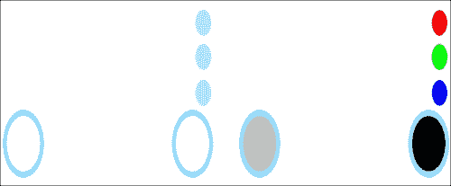
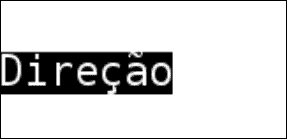

# 第七章。跨平台用户界面和输入系统

在本章中，我们将介绍:

*   在 Android 上处理多点触控事件
*   在 Windows 上设置多点触控仿真
*   在 Windows 上处理多点触控事件
*   识别手势
*   实现屏幕上的游戏手柄
*   使用 FreeType 进行文本呈现
*   游戏内字符串的本地化

# 简介

移动用户界面基于(除了图形渲染之外)多点触摸输入。本章向您展示了如何在安卓操作系统上处理触摸事件，以及如何在窗口上调试它们。还包括一个使用多个鼠标在 Windows 上模拟多点触控功能的专用配方。本章的其余部分致力于高质量的文本呈现和支持多种语言。

# 在安卓上处理多点触控事件

直到现在，我们除了安卓上的 **BACK** 按钮外，没有处理过任何用户交互。在这个食谱中，我们展示了如何在安卓系统上处理多点触控事件。

## 做好准备

您应该熟悉多点触控输入处理的概念。在 Java 中，Android 多点触控事件在`MotionEvent`类中传递，其实例是作为参数传递给你的`Activity`类的`onTouchEvent()`方法的。`MotionEvent`类包含当前激活和释放的触摸的所有信息。为了将这些信息传递给我们的本机代码，我们将携带多个触摸的单个事件转换为一系列保存单个触摸数据的事件。这使得 JNI 互操作变得简单，并使我们的代码易于移植。

## 怎么做...

每个安卓活动都支持多点触控事件处理。我们所要做的就是覆盖`Activity`类的`onTouchEvent()`方法:

1.  首先，我们为与单个触摸点相关的事件声明一些内部常数:

    ```cpp
    private static final int MOTION_MOVE = 0;
    private static final int MOTION_UP   = 1;
    private static final int MOTION_DOWN = 2;
    private static final int MOTION_START = -1;
    private static final int MOTION_END   = -2;
    ```

2.  事件处理程序使用`MotionEvent`结构并提取关于单个触摸的信息。`SendMotion()`函数在本机代码中声明，并包含我们从`onTouchEvent()` :

    ```cpp
    @Override public boolean onTouchEvent( MotionEvent event )
    {
    ```

    通过 JNI 调用的手势解码
3.  告诉我们的本机代码，我们将发送一系列事件:

    ```cpp
      SendMotion( MOTION_START, 0, 0, false, MOTION_MOVE );
    ```

4.  确定事件代码和第一次触摸的`ID`:

    ```cpp
      int E = event.getAction() & MotionEvent.ACTION_MASK;
      int nPointerID = event.getPointerId((event.getAction() &MotionEvent.ACTION_POINTER_INDEX_MASK) >>MotionEvent.ACTION_POINTER_INDEX_SHIFT );
      try
      {
    ```

5.  获取主触摸点的坐标:

    ```cpp
        int x = (int)event.getX(), y = (int)event.getY();
        int cnt = event.getPointerCount();
    ```

6.  处理触摸开始:

    ```cpp
        if ( E == MotionEvent.ACTION_DOWN )
        {
          for ( int i = 0; i != cnt; i++ )
            SendMotion( event.getPointerId(i),(int)event.getX(i),(int)event.getY(i),true, MOTION_DOWN );
        }
    ```

7.  处理所有触摸释放时整个手势的结束:

    ```cpp
        if ( E == MotionEvent.ACTION_UP ||E == MotionEvent.ACTION_CANCEL )
        {
          SendMotion( MOTION_END, 0, 0, false, MOTION_UP );
          return E <= MotionEvent.ACTION_MOVE;
        }
    ```

8.  处理二次触摸点:

    ```cpp
        int maskedEvent = event.getActionMasked();
        if ( maskedEvent== MotionEvent.ACTION_POINTER_DOWN )
        {
          for ( int i = 0; i != cnt; i++ )
            SendMotion( event.getPointerId(i),(int)event.getX(i),(int)event.getY(i),true, MOTION_DOWN );
        }
        if ( maskedEvent == MotionEvent.ACTION_POINTER_UP )
        {
          for ( int i = 0; i != cnt ; i++ )
            SendMotion( event.getPointerId(i),(int)event.getX(i),(int)event.getY(i),i != nPointerID, MOTION_UP );
          SendMotion( nPointerID,(int)event.getX(nPointerID),(int)event.getY(nPointerID),false, MOTION_MOVE );
        }
    ```

9.  最后，我们更新每个触摸点的坐标:

    ```cpp
        if ( E == MotionEvent.ACTION_MOVE )
        {
          for ( int i = 0; i != cnt; i++ )
            SendMotion(event.getPointerId(i),(int)event.getX(i),(int)event.getY(i),true, MOTION_MOVE );
        }
      }
    ```

10.  当一切完成后，我们通知我们的本地手势解码器事件序列的结束:

    ```cpp
      SendMotion( MOTION_END, 0, 0, false, MOTION_MOVE );
      return E <= MotionEvent.ACTION_MOVE;
    }
    ```

11.  原生`SendMotion()`功能接受触摸点`ID`、屏幕像素坐标、运动标志和指示触摸点是否激活的`boolean`参数【T7:

    ```cpp
    public native static void SendMotion( int PointerID, int x, int y,
      boolean Pressed, int Flag );
    ```

## 它是如何工作的...

安卓操作系统向我们的应用程序发送关于触摸点的通知，并且`onTouchEvent()`功能将驻留在`MotionEvent`对象中的触摸事件集合转换成一系列 JNI `SendMotion()`调用。

## 另见

*   *处理 Windows 上的多点触控事件*
*   *识别手势*

# 在 Windows 上设置多点触控仿真

测试基于触摸的界面在没有硬件的情况下是很困难的，但是即使有安卓硬件可用，我们也没有逐步调试器的奢侈。好在 Windows 支持触摸屏硬件，可以为我们的应用提供`WM_TOUCH`事件。这个食谱展示了一个技巧，利用多个鼠标来模拟触摸事件。

## 做好准备

这个方法依赖于第三方视窗驱动程序 MultiTouchVista，一个处理来自各种设备的输入的用户输入管理层。可以从[http://multitouchvista.codeplex.com/](http://multitouchvista.codeplex.com/)下载。

## 怎么做...

1.  首先，我们需要安装系统驱动。我们提取`MultiTouchVista_-_second_release_-_refresh_2.zip`文件，编写时的最新版本，然后以管理员权限打开命令行。如果控制台在没有管理员权限的情况下运行，驱动程序安装失败。提取的文件夹包含`Driver`子文件夹，根据操作系统的类型，您应该在其中选择`x64`或`x32`文件夹。在该文件夹中，我们执行以下命令:

    ```cpp
    >Install driver.cmd
    ```

2.  出现一个对话框，询问您是否要安装该设备软件；你应该点击**安装**按钮。安装完成后，您将在命令行上看到一条消息。
3.  接下来我们要做的，就是激活**设备管理器**中的驱动。我们打开**控制面板**，然后打开**设备管理器**窗口。在那里，我们找到了列表中的**人机界面设备**项。我们右击**通用软件 HID 设备**，我们刚刚为它安装了驱动程序。我们从上下文菜单中选择**禁用**来禁用设备。在禁用设备前的确认中，我们只需回复**是**。之后，我们通过右键点击该节点并选择**启用**来重新启用该设备。
4.  现在，既然我们用鼠标模拟多点触摸，我们就应该以某种方式在屏幕上显示触摸点，因为否则就不可能知道鼠标指针在哪里。在**控制面板** | **硬件和声音**中，我们打开**笔触摸**窗口。**触摸**标签包含**当我与屏幕上的项目交互时显示触摸指针**复选框，该复选框应被启用。
5.  当所有的鼠标都连接好了，我们就可以启动驱动程序了。我们打开两条命令行，在第一条中，我们从`MultiTouchVista`包运行`Multitouch.Service.Console.exe`。在第二个控制台窗口中，我们运行`Multitouch.Driver.Console.exe`而不关闭**多点触摸。服务器.控制台**窗口。退出这两个应用程序，返回到正常的非多点触控窗口环境。

## 它是如何工作的...

要检查驱动和服务是否按预期工作，我们可以尝试标准的微软 Paint 应用程序，同时使用两个或多个鼠标来绘制一些东西。

## 另见

*   *处理 Windows 上的多点触控事件*

# 处理 Windows 上的多点触控事件

一旦安装了`MultiTouchVista` 驱动程序，或者如果我们碰巧有一个多点触控屏幕，我们可以在应用程序中初始化一个事件循环并处理`WM_TOUCH`消息。

## 做好准备

第一个食谱包含了多点触控操作的所有相关信息。在这个食谱中，我们只扩展了微软视窗的代码。

### 注

这本书没有讨论 Mac 的多点触控输入仿真。

## 怎么做...

1.  `MinGW`工具链不包括最新的 Windows SDK 头，所以应该定义一些常量来使用`WM_TOUCH`消息:

    ```cpp
    #if !defined(_MSC_VER)
    #define SM_DIGITIZER            94
    #define SM_MAXIMUMTOUCHES       95
    #define TOUCHEVENTF_DOWN        0x0001
    #define TOUCHEVENTF_MOVE        0x0002
    #define TOUCHEVENTF_UP          0x0004
    #define TOUCHEVENTF_PRIMARY     0x0010
    #define WM_TOUCH                0x0240
    ```

2.  `TOUCHINPUT`结构使用`WinAPI`数据类型封装了单次触摸，也应该为`MinGW` :

    ```cpp
    typedef struct _TOUCHINPUT {
      LONG x, y;
      HANDLE hSource;
      DWORD dwID, dwFlags, wMask, dwTime;
      ULONG_PTR dwExtraInfo;
      DWORD cxContact, cyContact;
    } TOUCHINPUT,*PTOUCHINPUT;
    #endif
    ```

    手动声明
3.  接下来的四个功能为我们的应用程序提供了触摸界面处理。我们声明函数原型和静态函数指针来从`user32.dll` :

    ```cpp
    typedef BOOL (WINAPI *CloseTouchInputHandle_func)(HANDLE);
    typedef BOOL (WINAPI *Get_func)(HANDLE, UINT, PTOUCHINPUT, int);
    typedef BOOL (WINAPI *RegisterTouch_func)(HWND, ULONG);
    typedef BOOL (WINAPI *UnregisterTouch_func)(HWND);
    static CloseTouch_func CloseTouchInputHandle_Ptr = NULL;
    static Get_func GetTouchInputInfo_Ptr = NULL;
    static RegisterTouch_func RegisterTouchWindow_Ptr = NULL;
    static UnregisterTouch_func UnregisterTouchWindow_Ptr =NULL;
    ```

    加载它们
4.  由于`MinGW`不支持`WM_TOUCH`相关例程的自动导出，我们必须使用`GetProcAddress()`从`user32.dll`手动加载。这是在`LoadTouchFuncs()`功能中完成的，该功能在文件`Wrapper_Windows.cpp`中从`1_MultitouchInput` :

    ```cpp
    static bool LoadTouchFuncs()
    {
      if ( !CloseTouchInputHandle_Ptr )
      {
        HMODULE hUser = LoadLibraryA( "user32.dll" );
        CloseTouchInputHandle_Ptr =(CloseTouchInputHandle_func)GetProcAddress( hUser, "CloseTouchInputHandle" );
        GetTouchInputInfo_Ptr = ( GetTouchInputInfo_func )GetProcAddress( hUser, "GetTouchInputInfo" );
        RegisterTouchWindow_Ptr = (RegisterTouchWindow_func)GetProcAddress( hUser, "RegisterTouchWindow" );
        UnregisterTouchWindow_Ptr =(UnregisterTouchWindow_func)GetProcAddress( hUser, "UnregisterTouchWindow" );
      }
      return ( RegisterTouchWindow_Ptr != NULL );
    }
    ```

    定义
5.  最后，我们需要声明`GetTouchPoint()`例程，该例程将`TOUCHPOINT`坐标转换为屏幕像素，为了简单起见，使用了 100 x 100 像素的硬编码窗口大小:

    ```cpp
    static POINT GetTouchPoint(HWND hWnd, const TOUCHINPUT& ti)
    {
      POINT pt;
      pt.x = ti.x / 100;
      pt.y = ti.y / 100;
      ScreenToClient( hWnd, &pt );
      return pt;
    }
    ```

6.  现在我们准备在 Windows 上实现多点触控消息处理。在我们的窗口函数中，我们为`WM_TOUCH`消息添加了一个新的消息处理程序，它包含打包在一起的几个不同触摸点的数据。我们将参数解包到一个数组中，其中每一项代表一次触摸的信息:

    ```cpp
    case WM_TOUCH:
    {
      unsigned int NumInputs = (unsigned int)wParam;
      if ( NumInputs < 1 ) { break; }
      TOUCHINPUT* ti = new TOUCHINPUT[NumInputs];
      DWORD Res = GetTouchInputInfo_Ptr((HANDLE)lParam, NumInputs, ti, sizeof(TOUCHINPUT));
      double EventTime = Env_GetSeconds();
      if ( !Res ) { break; }
    ```

7.  对于每个触摸点，我们在全局数组`g_TouchPoints`中更新其状态。这是与安卓代码的主要区别，因为我们在那里解码了 Java 代码中的`MotionEvent`结构，并将一系列点传递给本机代码:

    ```cpp
      for (unsigned int i = 0; i < NumInputs ; ++i)
      {
        POINT touch_pt = GetTouchPoint(Window, ti[i]);
        vec2 Coord(touch_pt.x / ImageWidth,touch_pt.y / ImageHeight);
        sTouchPoint pt(ti[i].dwID, Coord,MOTION_MOVE, EventTime);
        if (ti[i].dwFlags & TOUCHEVENTF_DOWN)pt.FFlag = MOTION_DOWN;
        if (ti[i].dwFlags & TOUCHEVENTF_UP)
          pt.FFlag = MOTION_UP;
        Viewport_UpdateTouchPoint(pt);
      }
    ```

8.  然后，我们清理临时数组:

    ```cpp
      CloseTouchInputHandle_Ptr((HANDLE)lParam);
      delete[] ti;
    ```

9.  我们移除所有释放的点:

    ```cpp
      Viewport_ClearReleasedPoints();
    ```

10.  最后，我们处理所有活动的触摸点:

    ```cpp
      Viewport_UpdateCurrentGesture();
      break;
    }
    ```

11.  事件处理程序使用触摸点的全局列表:

    ```cpp
    std::list<sTouchPoint> g_TouchPoints;
    ```

12.  `sTouchPoint`结构点封装了坐标、触摸点`ID`、一个运动标志以及单个触摸点的关联事件时间戳:

    ```cpp
    struct sTouchPoint
    {
      int FID;
      vec2 FPoint;
      int FFlag;
      double FTimeStamp;
      sTouchPoint(int ID, const vec2& C, int flag, doubletstamp):
        FID(ID), FPoint(c), FFlag(flag), FTimeStamp(tstamp) {}
    ```

13.  检查该触摸点是否激活:

    ```cpp
      inline bool IsPressed() const
      {
        return (FFlag == MOTION_MOVE) || (FFlag ==MOTION_DOWN);
      }
    };
    ```

14.  `Viewport_UpdateTouchPoint()`功能要么将点添加到列表中，要么根据运动标志更新状态:

    ```cpp
    void Viewport_UpdateTouchPoint(const sTouchPoint& pt)
    {
      std::list<sTouchPoint>::iterator foundIt =FTouchPoints.end();
      for ( auto it = FTouchPoints.begin(); it != foundIt;++it )
      {
        if ( it->FID == pt.FID )
        {
          foundIt = it;
          break;
        }
      }
      switch ( pt.FFlag )
      {
        case MOTION_DOWN:
          if ( foundIt == FTouchPoints.end() )
            FTouchPoints.push_back( pt );
        case MOTION_UP:
        case MOTION_MOVE:
          if ( foundIt != FTouchPoints.end() )
            *foundIt = pt;
          break;
      }
    }
    ```

15.  `Viewport_ClearReleasedPoints()`功能删除运动标志设置为`MOTION_UP` :

    ```cpp
    void Viewport_ClearReleasedPoints()
    {
      auto first = FTouchPoints.begin();
      auto result = first;
      for ( ; first != FTouchPoints.end() ; ++first )
        if ( first->FFlag != MOTION_UP ) *result++ = *first;
      FTouchPoints.erase( result, FTouchPoints.end() );
    }
    ```

    的所有点
16.  最后一个功能`Viewport_UpdateCurrentGesture()`，将点列表发送给手势处理器:

    ```cpp
    void Viewport_UpdateCurrentGesture()
    {
      Viewport_ProcessMotion( MOTION_START,vec2(), false, MOTION_MOVE );
      auto j = FTouchPoints.begin();
      for ( ; j != FTouchPoints.end(); ++j )
        Viewport_ProcessMotion( j->FID, j->FPoint,j->IsPressed(), j->FFlag );
      Viewport_ProcessMotion( MOTION_END, vec2(), false,MOTION_MOVE );
    }
    ```

## 它是如何工作的...

在`WM_CREATE`事件处理程序中，我们将窗口注册为触摸事件响应者:

```cpp
case WM_CREATE:
...
g_TouchEnabled = false;
BYTE DigitizerStatus = (BYTE)GetSystemMetrics( SM_DIGITIZER );
if ( (DigitizerStatus & (0x80 + 0x40)) != 0 )
{
  BYTE nInputs = (BYTE)GetSystemMetrics( SM_MAXIMUMTOUCHES );
  if ( LoadTouchFuncs() )
  {
    if ( !RegisterTouchWindow_Ptr(h, 0) )
    {
      LOGI( "Enabled, num points: %d\n", (int)nInputs );
      g_TouchEnabled = true;
      break;
    }
  }
}
```

然后我们在`Viewport_ProcessMotion()`功能中得到一系列触摸事件。

## 还有更多...

Windows 8 引入了`WM_POINTER`信息，这确保了更干净的代码，类似于安卓和其他基于触摸的环境。感兴趣的读者可以阅读相关的 MSDN 文章。aspx )并在窗口函数中编写类似的处理程序。

## 另见

`WM_TOUCH`消息处理的代码包含在`1_MultitouchInput`示例中。下一个食谱展示了如何解码一系列多点触摸事件并识别一些基本手势。

# 识别手势

在这个配方中，我们实现了一个检测捏-缩放-旋转和投掷/滑动手势的功能。它可以作为识别您自己的自定义手势的起点。

## 做好准备

本食谱依靠本章中的食谱*处理安卓*上的多点触控事件来处理多点触控输入。

## 怎么做...

1.  我们将运动解码的任务分成单独的层。低级代码处理操作系统生成的触摸事件。收集的触摸点数据使用中级代码中的一组例程进行处理，我们在本食谱中介绍了这些例程。最后，使用简单的`iGestureResponder`界面将所有解码的手势报告给用户的高级代码:

    ```cpp
    class iGestureResponder
    {
    public:
    ```

2.  `Event_UpdateGesture()`方法用于直接访问接触点的当前状态。`sMotionData`结构是在`iGestureResponder`讨论之后呈现的。`1_MultitouchInput`示例覆盖此方法来渲染触摸点:

    ```cpp
      virtual void Event_UpdateGesture( const sMotionData& Data ) {}
    ```

3.  `Event_PointerChanged()`和`Event_PointerMoved()`方法被称为来指示个人接触的变化:

    ```cpp
      virtual void Event_PointerChanged(int PtrID,const vec2& Pnt, bool Pressed) {}
      virtual void Event_PointerMoved(int PtrID, const vec2&const vec2& Pnt){}
    ```

4.  关于解码手势的信息被发送到`iGestureResponder`实例。当投掷/滑动事件结束时，`Event_Fling()`方法被调用:

    ```cpp
      virtual void Event_Fling( const sTouchPoint& Down,const sTouchPoint& Up ) {}
    ```

5.  使用`Up`和`Down`点中的时间戳，响应者可以估计手指移动的速度，并决定手势是否成功。手指拖过屏幕时调用`Event_Drag()`方法:

    ```cpp
      virtual void Event_Drag( const sTouchPoint& Down,const sTouchPoint& Current ) {}
    ```

6.  缩放事件使用三种方法处理。`Event_PinchStart()`方法在手势开始时调用，`Event_PinchStop()`在手势结束时调用，`Event_Pinch()`方法在两个触摸点的每次更新时调用:

    ```cpp
      virtual void Event_PinchStart( const sTouchPoint& Initial1,const sTouchPoint& Initial2 ) {}
      virtual void Event_Pinch( const sTouchPoint& Initial1,const sTouchPoint& Initial2,const sTouchPoint& Current1,const sTouchPoint& Current2 ) {}
      virtual void Event_PinchStop( const sTouchPoint& Initial1,const sTouchPoint& Initial2,const sTouchPoint& Current1,const sTouchPoint& Current2 ) {};
    };
    ```

7.  让我们进入中级程序来解码手势。首先，声明一个稍后使用的`iGestureResponder`的实例:

    ```cpp
      iGestureResponder* g_Responder;
    ```

8.  我们引入`sMotionData`结构，描述当前的手势状态。使用`Get*`功能访问单个触摸点特征。`AddTouchPoint()`功能确保不会添加重复身份证的积分:

    ```cpp
    struct sMotionData
    {
      sMotionData(): FTouchPoints() {};
      void Clear() { FTouchPoints.clear(); };
      size_t GetNumTouchPoints() const { returnFTouchPoints.size(); }
      const sTouchPoint& GetTouchPoint( size_t Idx )    const {return FTouchPoints[Idx]; }
      vec2 GetTouchPointPos(size_t i) const { returnFTouchPoints[i].FPoint; }
      int GetTouchPointID(size_t i)  const { returnFTouchPoints[i].FID; }
      void AddTouchPoint( const sTouchPoint& TouchPoint )
      {
        for ( size_t i = 0; i != FTouchPoints.size(); i++ )
          if ( FTouchPoints[i].FID == TouchPoint.FID )
          {
            FTouchPoints[i] = TouchPoint;
            return;
          }
        FTouchPoints.push_back( TouchPoint );
      }
    private:
      std::vector<sTouchPoint> FTouchPoints;
    };
    ```

9.  手势由其触摸点的当前状态和先前触摸点状态的环形缓冲区来描述。为了检测一个手势，我们创建了一个特别的状态机。两个布尔变量指示我们是否真的有手势，以及手势是否正在进行。还为每种手势存储有效性标志:

    ```cpp
    sMotionData                 FMotionData;
    RingBuffer<sMotionData>     FPrevMotionData(5);
    bool FMotionDataValid = false;
    bool FMoving = false;
    bool FFlingWasValid = false;
    bool FPinchZoomValid = false;
    bool FPinchZoomWasValid = false;
    ```

10.  单指手势，如投掷、拖动或点击，由当前和初始触摸点描述。捏-缩放是两个手指的手势，其状态由两个初始点和两个当前点决定。中心计算为初始和当前点坐标的平均值:

    ```cpp
    sTouchPoint FInitialPoint( 0, LVector2(), MOTION_MOVE, 0.0 );
    sTouchPoint FCurrentPoint( 0, LVector2(), MOTION_MOVE, 0.0 );
    sTouchPoint FInitialPoint1, FInitialPoint2;
    sTouchPoint FCurrentPoint1, FCurrentPoint2;
    float FZoomFactor = 1.0f;
    float FInitialDistance = 1.0f;
    LVector2 FInitialCenter, FCurrentCenter;
    ```

11.  为了忽略意外的屏幕触摸，我们引入了一个灵敏度阈值，这是手指必须移动的屏幕空间的最小百分比，以便检测到投掷手势:

    ```cpp
      float FlingStartSensitivity = 0.2f;
    ```

12.  如果手指的最终位置从初始位置移动小于以下值，则投掷手势被完全忽略:

    ```cpp
      float FlingThresholdSensitivity = 0.1f;
    ```

13.  `RingBuffer`数据结构使用简单的动态数组实现。完整的源代码在`RingBuffer.h`文件中:

    ```cpp
    template <typename T> class RingBuffer
    {
    public:
      explicit RingBuffer(size_t Num): FBuffer(Num) { clear(); }
      inline void clear() { FCount = FHead  = 0; }
      inline void push_back( const T& Value )
      {
        if ( FCount < FBuffer.size() ) FCount++;
        FBuffer[ FHead++ ] = Value;
        if ( FHead == FBuffer.size() ) FHead = 0;
      }
    ```

14.  唯一的特殊方法是访问先前状态，相对于`FHead` :

    ```cpp
      inline T* prev(size_t i)
      { return (i >= FCount) ? NULL: &FBuffer[AdjustIndex(i)]; }
    private:
      std::vector<T> FBuffer;
    ```

15.  当前元素和项目总数:

    ```cpp
      size_t FHead;
      size_t FCount;
    ```

16.  对负值进行环绕的除法余数:

    ```cpp
      inline int ModInt( int a, int b )
      { int r = a % b; return ( r < 0 ) ? r+b : r; }
    ```

17.  最后一个例程计算前一个元素索引:

    ```cpp
      inline size_t AdjustIndex( size_t i ) const
      {
        return (size_t)ModInt( (int)FHead - (int)i - 1,(int)FBuffer.size() );
      }
    };
    ```

18.  为了解码一个手势，我们小心地处理每个触摸事件。开始时，我们重置触摸点集合，在触摸结束时，我们检查手势完成情况:

    ```cpp
    void GestureHandler_SendMotion( int ContactID, eMotionFlagFlag,LVector2 Pos, bool Pressed )
    {
      if ( ContactID == MOTION_START )
      {
        FMotionDataValid = false;
        FMotionData.Clear();
        return;
      }
      if ( ContactID == MOTION_END )
      {
        FMotionDataValid = true;
        UpdateGesture();
        g_Responder->Event_UpdateGesture( FMotionData );
        if ( sMotionData* P = FPrevMotionData.prev(0) )
        {
          if ( P->GetNumTouchPoints() !=FMotionData.GetNumTouchPoints() )FPrevMotionData.push_back( FMotionData );
        }
        else
        {
          FPrevMotionData.push_back( FMotionData );
        }
        return;
      }
    ```

19.  如果我们还在移动，那么修改当前点的信息:

    ```cpp
      if ( Pressed )
        FMotionData.AddTouchPoint( sTouchPoint( ContactID, Pos,MOTION_DOWN, Env_GetSeconds() ) );
    ```

20.  根据运动标志，我们通知应答者个别触摸:

    ```cpp
      switch ( Flag )
      {
        case MOTION_MOVE:
          g_Responder->Event_PointerMoved( ContactID, Pos );
          break;
        case MOTION_UP:
        case MOTION_DOWN:
          g_Responder->Event_PointerChanged( ContactID, Pos,Flag == MOTION_DOWN );
          break;
      }
    }
    ```

21.  `UpdateGesture()`功能完成所有检测工作。它检查手势的当前状态，如果有任何手势正在进行，则调用`g_Responder`对象的方法:

    ```cpp
    void UpdateGesture()
    {
      const sTouchPoint& Pt1 = FInitialPoint;
      const sTouchPoint& Pt2 = FCurrentPoint;
      g_Responder->Event_UpdateGesture( FMotionData );
    ```

22.  拖拽手势在`IsDraggingValid()`和`IsPinchZoomValid()`方法中检查，稍后会介绍。如果手指移动的距离超过指定距离，我们会对单点阻力做出反应:

    ```cpp
      if ( IsDraggingValid() )
      {
        if ( GetPositionDelta().Length() >FlingThresholdSensitivity )
        {
          g_Responder->Event_Drag( Pt1, Pt2 );
          FFlingWasValid = true;
        }
      }
    else if ( FFlingWasValid )
      {
        if ( GetPositionDelta().Length() >FlingStartSensitivity )
          g_Responder->Event_Fling( Pt1, Pt2 );
        else
          g_Responder->Event_Drag( Pt1, Pt2 );
        FFlingWasValid = false;
      }
      if ( IsPinchZoomValid() )
      {
        if ( FPinchZoomWasValid )
          g_Responder->Event_Pinch( FInitialPoint1,FInitialPoint2, FCurrentPoint1,FCurrentPoint2 );
        else
          g_Responder->Event_PinchStart( FInitialPoint1,FInitialPoint2 );
        FPinchZoomWasValid = true;
      }
      else if ( FPinchZoomWasValid )
      {
        FPinchZoomWasValid = false;
        g_Responder->Event_PinchStop( FInitialPoint1,FInitialPoint2, FCurrentPoint1, FCurrentPoint2 );
      }
    }
    ```

23.  先前描述的`UpdateGesture()`功能使用以下辅助功能:

    ```cpp
    static vec2 GetPositionDelta()
    { return FCurrentPoint.FPoint - FInitialPoint.FPoint; }
    ```

24.  拖动或投掷动作应使用单指进行。为了区分拖拽和投掷，我们使用`IsDraggingValid()`功能:

    ```cpp
    static bool IsDraggingValid()
    {
      if ( FMotionDataValid && FMotionData.GetNumTouchPoints() == 1&& FMotionData.GetTouchPointID( 0 ) == 0 )
      {
        if ( !FMoving )
        {
          FMoving       = true;
          FInitialPoint = FMotionData.GetTouchPoint( 0 );
          return false;
        }
        FCurrentPoint = FMotionData.GetTouchPoint( 0 );
      }
      else
      {
      FMoving = false;
      }
      return FMoving;
    }
    ```

25.  为了检查用户是否正在执行缩放手势，我们调用`IsPinchZoomValid()`功能。我们得到接触点并计算它们之间的距离。如果我们已经在执行缩放手势，我们将更新当前点。否则，我们存储初始点并计算中心:

    ```cpp
    static bool IsPinchZoomValid()
    {
      if (FMotionDataValid && FMotionData.GetNumTouchPoints() == 2 )
      {
        const sTouchPoint& Pt1 = FMotionData.GetTouchPoint(0);
        const sTouchPoint& Pt2 = FMotionData.GetTouchPoint(1);
        const LVector2& Pos1(FMotionData.GetTouchPointPos(0));
        const LVector2& Pos2(FMotionData.GetTouchPointPos(1));
        float NewDistance = (Pos1 - Pos2).Length();
        if ( FPinchZoomValid )
        {
          FZoomFactor    = NewDistance / FInitialDistance;
          FCurrentPoint1 = Pt1;
          FCurrentPoint2 = Pt2;
          FCurrentCenter = ( Pos1 + Pos2 ) * 0.5f;
        }
        else
        {
          FInitialDistance = NewDistance;
          FPinchZoomValid  = true;
          FZoomFactor      = 1.0f;
          FInitialPoint1   = Pt1;
          FInitialPoint2   = Pt2;
          FInitialCenter = ( Pos1 + Pos2 ) * 0.5f;
          return false;
        }
      }
      else
      {
        FPinchZoomValid = false;
        FZoomFactor     = 1.0f;
      }
      return FPinchZoomValid;
    }
    ```

## 它是如何工作的...

`g_Responder`实例接收所有关于解码手势的数据。

# 实现屏幕操作面板

是时候利用多点触控设施，在安卓设备触摸屏上模拟类似游戏控制台的界面了。

## 做好准备

学习如何处理菜谱中的多点触控输入*在安卓系统上处理多点触控事件*和*在 Windows 系统上处理多点触控事件*之后再继续这个菜谱。

## 怎么做...

我们实现了一个自定义的多点触摸事件处理程序，它可以跟踪所有的触摸点。操纵杆呈现为全屏位图，显示在左侧。当用户触摸屏幕时，我们使用触摸坐标从图形右侧的遮罩中获取像素颜色。然后，我们找到颜色对应的内部按钮，改变其`Pressed`状态。下图显示了游戏手柄的视觉表示和颜色遮罩:



1.  我们的虚拟操纵杆的单个按钮由它在遮罩中的颜色和按钮表中的索引决定:

    ```cpp
    struct sBitmapButton
    {
      vec4 FColour;
      int FIndex;
    };
    ```

2.  虚拟模拟棒支持两个方向，由半径、遮罩颜色和位置决定:

    ```cpp
    struct sBitmapAxis
    {
      float FRadius;
      vec2 FPosition;
      int FAxis1, FAxis2;
      vec4 Fcolour;
    };
    ```

3.  `ScreenJoystick`类包含所有按钮和轴的描述:

    ```cpp
    class ScreenJoystick
    {
      std::vector<sBitmapButton> FButtonDesc;
      std::vector<sBitmapAxis> FAxisDesc;
    ```

4.  每个轴的值和每个按钮的`Pressed`标志存储在两个数组中:

    ```cpp
      std::vector<float> FAxisValue;
      std::vector<bool> FKeyValue;
    ```

5.  掩码位图数据指针对于该类也是必需的:

    ```cpp
      unsigned char* FMaskBitmap;
    ```

6.  `FPushed*`数组告诉我们当前激活了哪些按钮和轴:

    ```cpp
      sBitmapButton* FPushedButtons[MAX_TOUCH_CONTACTS];
      sBitmapAxis*   FPushedAxis[MAX_TOUCH_CONTACTS];
    ```

7.  构造函数和析构函数本质上是空的:

    ```cpp
      ScreenJoystick(): FMaskBitmap( NULL ) {}
      virtual ~ScreenJoystick() {}
    ```

8.  `InitKeys()`方法在操纵杆构造完成时分配状态数组:

    ```cpp
      void InitKeys()
      {
        FKeyValue.resize( FButtonDesc.size() );
        if ( FKeyValue.size() > 0 )
        {
          for (size_t j = 0 ; j < FKeyValue.size() ; j++ )
            FKeyValue[j] = false;
    }
        FAxisValue.resize( FAxisDesc.size() * 2 );
        if ( FAxisValue.size() > 0 )
        {
          memset( &FAxisValue[0], 0, FAxisValue.size() *sizeof( float ) );
        }
        Restart();
      }
    ```

9.  `Restart()`方法清除按钮状态:

    ```cpp
      void Restart()
      {
        memset( &FPushedAxis[0], 0, sizeof(sBitmapAxis*) *MAX_TOUCH_CONTACTS );
        memset( &FPushedButtons[0], 0, sizeof(sBitmapButton*) *MAX_TOUCH_CONTACTS );
      }
    ```

10.  内部状态由私`SetAxisValue()`和`SetKeyState()`方法改变:

    ```cpp
      void SetKeyState( int KeyIdx, bool Pressed )
      {
        if ( KeyIdx < 0 || KeyIdx >= ( int )FKeyValue.size() )
      { return; }
        FKeyValue[KeyIdx] = Pressed;
      }
      void SetAxisValue( int AxisIdx, float Val )
      {
        if ( ( AxisIdx < 0 ) ||AxisIdx >= (int)FAxisValue.size() )
      { return; }
        FAxisValue[AxisIdx] = Val;
      }
    ```

11.  `IsPressed()`和`GetAxisValue()`方法可以读取键或轴的状态:

    ```cpp
      bool IsPressed( int KeyIdx ) const
      {
        return ( KeyIdx < 0 ||KeyIdx >= ( int )FKeyValue.size() ) ?false : FKeyValue[KeyIdx];
      }
      float GetAxisValue( int AxisIdx ) const
      {
        return ( ( AxisIdx < 0 ) ||AxisIdx >= ( int )FAxisValue.size() ) ?0.0f : FAxisValue[AxisIdx];
      }
    ```

12.  以下内部方法查找给定颜色的按钮和轴:

    ```cpp
      sBitmapButton* GetButtonForColour( const vec4& Colour )const
      {
        for ( size_t k = 0 ; k < FButtonDesc.size(); k++ )
        {
          float Distance = (FButtonDesc[k]->FColour –Colour).Length();
          if ( Distance < 0.1f ) return FButtonDesc[k];
        }
        return NULL;
      }

      sBitmapAxis* GetAxisForColour( const vec4& Colour ) const
      {
        for ( size_t k = 0 ; k < FAxisDesc.size(); k++ )
        {
          float Distance = (FButtonDesc[k]->FColour –Colour).Length();
          if ( Distance < 0.1f ) return FAxisDesc[k];
        }
        return NULL;
      }
    ```

13.  每个轴的两个值被读取为从中心的位移:

    ```cpp
      void ReadAxis( sBitmapAxis* Axis, const vec2& Pos )
      {
        if ( !Axis ) { return; }
    ```

14.  基于中心点和触摸点读取轴值:

    ```cpp
        float v1 = ( (Axis->FPosition - Pos).x/Axis->FRadius);
        float v2 = (-(Axis->FPosition - Pos).y/Axis->FRadius);
        this->SetAxisValue( Axis->FAxis1, v1 );
        this->SetAxisValue( Axis->FAxis2, v2 );
      }
      vec4 GetColourAtPoint( const vec2& Pt ) const
      {
        if ( !FMaskBitmap ) { return vec4( -1 ); }
        int x = (int)(Pt.x * 512.0f);
        int y = (int)(Pt.y * 512.0f);
        int Ofs = (y * 512 + x) * 3;
        float r = (float)FMaskBitmap[Ofs + 0] / 255.0f;
        float g = (float)FMaskBitmap[Ofs + 1] / 255.0f;
        float b = (float)FMaskBitmap[Ofs + 2] / 255.0f;
        return vec4( b, g, r, 0.0f );
      }
    ```

15.  主要套路是`HandleTouch()`法:

    ```cpp
    void HandleTouch( int ContactID, const vec2& Pos, bool Pressed,
      eMotionFlag Flag )
    {
    ```

16.  如果触摸刚刚开始，我们重置每个按钮和轴的值:

    ```cpp
      if ( ContactID == MOTION_START )
      {
        for ( size_t i = 0; i != MAX_TOUCH_CONTACTS; i++ )
        {
          if ( FPushedButtons[i] )
          {
            this->SetKeyState(
              FPushedButtons[i]->FIndex, false );
            FPushedButtons[i] = NULL;
          }
          if ( FPushedAxis[i] )
          {
            this->SetAxisValue(
              FPushedAxis[i]->FAxis1, 0.0f );
            this->SetAxisValue(
              FPushedAxis[i]->FAxis2, 0.0f );
            FPushedAxis[i] = NULL;
          }
        }
        return;
      }
      if ( ContactID == MOTION_END ) { return; }
      if ( ContactID < 0 || ContactID >= MAX_TOUCH_CONTACTS )
      { return; }
    ```

17.  如果指针在移动，我们会查找相应的按钮或轴:

    ```cpp
      if ( Flag == MOTION_DOWN || Flag == MOTION_MOVE )
      {
        vec4 Colour = GetColourAtPoint( Pos );
        sBitmapButton* Button = GetButtonForColour( Colour );
        sBitmapAxis*     Axis = GetAxisForColour( Colour );
    ```

18.  对于我们找到的每个按钮，将按下状态设置为真:

    ```cpp
        if ( Button && Pressed )
        {
          int Idx = Button->FIndex;
          this->SetKeyState( Idx, true );
          FPushedButtons[ContactID] = Button;
        }
    ```

19.  对于每个找到的轴，我们读取值:

    ```cpp
        if ( Axis && Pressed )
        {
          this->ReadAxis( Axis,  Pos );
          FPushedAxis[ContactID] = Axis;
        }
      }
    }
    ```

## 它是如何工作的...

我们声明是一个全局变量，它保存了我们操纵杆的状态:

```cpp
ScreenJoystick g_Joystick;
```

在`OnStart()`方法中，我们添加了两个轴和一个按钮:

```cpp
  float A_Y = 414.0f / 512.0f;

  sBitmapAxis B_Left;
  B_Left.FAxis1 = 0;
  B_Left.FAxis2 = 1;
  B_Left.FPosition = vec2( 55.0f / 512.f, A_Y );
  B_Left.FRadius = 40.0f / 512.0f;
  B_Left.FColor = vec4( 0.75f, 0.75f, 0.75f, 0.0f );

  sBitmapButton B_Fire;
  B_Fire.FIndex = ID_BUTTON_THRUST;
  B_Fire.FColor = vec4( 0 );
  g_Joystick.FAxisDesc.push_back( B_Left );
  g_Joystick.FButtonDesc.push_back( B_Fire );
```

然后，我们初始化操纵杆并重置其状态:

```cpp
  g_Joystick.InitKeys();
  g_Joystick.Restart();
```

在后面的代码中，我们可以使用`g_Joystick.GetAxisValue`的结果来找出当前的轴值，使用`g_Joystick.IsPressed`来查看键是否被按下。

# 使用 FreeType 进行文本渲染

有可能界面避免渲染文本信息。然而，大多数应用程序必须在屏幕上显示一些文本。是时候考虑一下带有字距调整和字形缓存的 **FreeType** 文本渲染的所有细节了。这是本书最长的食谱，但我们真的希望不要错过 FreeType 用法的细节和微妙之处。

## 做好准备

从[第二章](02.html "Chapter 2. Porting Common Libraries")、*移植公共库*开始，是时候真正利用 FreeType 编译上的食谱了。我们从[第 1 章](01.html "Chapter 1. Establishing a Build Environment")、*建立构建环境*中描述的空应用程序模板开始。下面的代码支持多种字体、自动字距调整和字形缓存。

> *在印刷术中，字距调整(不太常见的是榫眼)是以比例字体调整字符间距的过程，通常是为了达到视觉上令人愉悦的效果。*

礼遇:[http://en.wikipedia.org/wiki/Kerning](http://en.wikipedia.org/wiki/Kerning)

字形缓存是 FreeType 库的一个特性，它使用字形图像和字符映射来减少内存使用。你可以在[上看到。](http://www.freetype.org/freetype2/docs/reference/ft2-cache_subsystem.html)

## 怎么做...

这里我们开发了`TextRenderer`类，它保存了 FreeType 库的所有状态。我们将文本呈现包装在一个类中，以支持这个类的多个实例，并确保线程安全。

1.  所需的 FreeType 库初始化包括库实例、字形缓存、字符映射缓存和图像缓存。我们首先声明内部 FreeType 对象:

    ```cpp
    class TextRenderer
    {
      // Local instance of the library (for thread-safeexecution)
      FT_Library FLibrary;
      // Cache manager
      FTC_Manager FManager;
      // Glyph cache
      FTC_ImageCache FImageCache;
      // Character map cache
      FTC_CMapCache FCMapCache;
    ```

2.  然后声明加载的字体列表:

    ```cpp
      // List of available font faces
      std::vector<std::string> FFontFaces;
      // Handle for the current font face
      FT_Face FFace;
      // List of loaded font files to prevent multiple filereads
      std::map<std::string, void*> FAllocatedFonts;
      // List of initialized font face handles
      std::map<std::string, FT_Face> FFontFaceHandles;
    ```

3.  `FMaskMode`开关用于在不透明渲染和 alpha 蒙版创建之间进行选择。后面在字形渲染代码中提到:

    ```cpp
      bool FMaskMode;
    ```

4.  The initialization routine creates the FreeType library instance and initializes the glyph and image caches:

    ```cpp
    void InitFreeType()
    {
      LoadFT();
      FT_Init_FreeTypePTR( &FLibrary );
      FTC_Manager_NewPTR(FLibrary,0,0,0,
        FreeType_Face_Requester, this, &FManager);
      FTC_ImageCache_NewPTR( FManager, &FImageCache );
      FTC_CMapCache_NewPTR( FManager, &FCMapCache );
    }
    ```

    像往常一样，我们提供尽可能短的代码。完整的代码应检查来自`FTC_*`功能的非零返回代码。`LoadFT()`函数初始化自由类型库的函数指针。我们在这个食谱的代码中为所有的 FreeType 函数使用`PTR`后缀，以允许在 Windows 上动态加载库。如果只关心安卓开发，`PTR`后缀可以省略。

5.  去初始化例程清除所有内部数据并销毁 FreeType 对象:

    ```cpp
    void StopFreeType()
    {
      FreeString();
      auto p = FAllocatedFonts.begin();
      for ( ; p!= FAllocatedFonts.end() ; p++ )
        delete[] ( char* )( p->second );
      FFontFaces.clear();
      FTC_Manager_DonePTR( FManager );
      FT_Done_FreeTypePTR( FLibrary );
    }
    ```

6.  `FreeString()`例程清除内部 FreeType 字形缓存:

    ```cpp
    void FreeString()
    {
      for ( size_t i = 0 ; i < FString.size() ; i++ )
        if ( FString[i].FCacheNode != NULL )
          FTC_Node_UnrefPTR(FString[i].FCacheNode,FManager);
      FString.clear();
    }
    ```

7.  `FString`包含正在渲染的字符串中的所有字符。初始化和去初始化函数分别在构造函数和析构函数中调用:

    ```cpp
    TextRenderer(): FLibrary( NULL ), FManager( NULL ),FImageCache( NULL ), FCMapCache( NULL )
    {
      InitFreeType();
      FMaskMode = false;
    }
    virtual ~clTextRenderer() { StopFreeType(); }
    ```

8.  为了利用 **TrueType** 字体并渲染字形，我们需要创建一组简单的管理例程来加载字体文件。第一个是`LoadFontFile()`功能，加载字体文件，将其内容存储在列表中，返回错误代码:

    ```cpp
    FT_ErrorLoadFontFile( const std::string& File )
    {
      if ( FAllocatedFonts.count( File ) > 0 ) { return 0; }
      char* Data = NULL;
      int DataSize;
      ReadFileData( File.c_str(), &Data, DataSize );
      FT_Face TheFace;
    ```

9.  我们总是使用第 0 个面，也就是加载文件中的第一个面:

    ```cpp
      FT_Error Result = FT_New_Memory_FacePTR(FLibrary,(FT_Byte*)Data, (FT_Long)DataSize, 0, &TheFace );
    ```

10.  Check for success and store the font in the array of loaded font faces:

    ```cpp
      if ( Result == 0 )
      {
        FFontFaceHandles[File] = TheFace;
        FAllocatedFonts[File] = ( void* )Data;
        FFontFaces.push_back( File );
      }
      return Result;
    }
    ```

    `ReadFileData()`功能加载`File`的内容。我们鼓励您实现这个功能或查看附带的源代码，在这里它是通过我们的虚拟文件系统来实现的。

11.  The static function `FreeType_Face_Requester()` caches the access to the font face and allows us to reuse loaded fonts. It is defined in the FreeType library headers:

    ```cpp
    FT_Error FreeType_Face_Requester( FTC_FaceID FaceID,FT_Library Library, FT_Pointer RequestData, FT_Face* Face )
    {
    #ifdef _WIN64
      long long int Idx = (long long int)FaceID;
      int FaceIdx = (int)(Idx & 0xFF);
    #else
      int FaceIdx = reinterpret_cast< int >(FaceID);
    #endif
      if ( FaceIdx < 0 ) { return 1; }
      TextRenderer* Renderer = ( TextRenderer* )RequestData;
      std::string File = Renderer ->FFontFaces[FaceIdx];
      FT_Error Result = Renderer ->LoadFontFile( File );
      *Face = (Result == 0) ?
      Renderer->FFontFaceHandles[File] : NULL;
      return Result;
    }
    ```

    自由类型库允许`RequestData`参数，我们通过指针传递`TextRenderer`的一个实例。`FreeType_Face_Requester()`代码中的`#ifdef`是在 64 位版本的 Windows 上运行所必需的。安卓操作系统只有 32 位，隐式允许`void*`到`int`的转换。

12.  `GetSizedFace`功能设置加载面的字体大小:

    ```cpp
    FT_Face GetSizedFace( int FontID, int Height )
    {
      FTC_ScalerRec Scaler;
      Scaler.face_id = IntToID(FontID);
      Scaler.height = Height;
      Scaler.width = 0;
      Scaler.pixel = 1;
      FT_Size SizedFont;
      if ( !FTC_Manager_LookupSizePTR(FManager, &Scaler,&SizedFont) ) return NULL;
      if ( FT_Activate_SizePTR( SizedFont ) != 0 ) { returnNULL; }
      return SizedFont->face;
    }
    ```

13.  然后，我们定义内部`sFTChar`结构，它保存关于单个字符的信息:

    ```cpp
    struct sFTChar
    {
      // UCS2 character, suitable for FreeType
      FT_UInt FChar;
      // Internal character index
      FT_UInt FIndex;
      // Handle for the rendered glyph
      FT_Glyph FGlyph;
      // Fixed-point character advance and character size
      FT_F26Dot6 FAdvance, FWidth;
      // Cache node for this glyph
      FTC_Node FCacheNode;
      // Default parameters
      sFTChar(): FChar(0), FIndex((FT_UInt)(-1)), FGlyph(NULL),FAdvance(0), FWidth(0), FCacheNode( NULL ) { }
    };
    ```

14.  我们渲染的文本是 UTF-8 编码，必须转换为 UCS-2 多字节表示。最简单的 UTF-8 解码器读取输入字符串，并将其字符输出到`FString`向量中:

    ```cpp
    bool DecodeUTF8( const char* InStr )
    {
      FIndex = 0;
      FBuffer = InStr;
      FLength = ( int )strlen( InStr );
      FString.clear();
      int R = DecodeNextUTF8Char();
      while ( ( R != UTF8_LINE_END ) && ( R != UTF8_DECODE_ERROR ) )
      {
        sFTChar Ch;
        Ch.FChar    = R;
        FString.push_back( Ch );
        R = DecodeNextUTF8Char();
      }
      return ( R != UTF8_DECODE_ERROR );
    }
    ```

15.  The decoder uses the following function to read individual character codes:

    ```cpp
    int DecodeNextUTF8Char()
    {
      // the first byte of the character and the result
      int c, r;
      if ( FIndex >= FLength )
        return FIndex == FLength ?UTF8_LINE_END : UTF8_DECODE_ERROR;
      c = NextUTF8();
      if ( ( c & 0x80 ) == 0 ) { return c; }
      if ( ( c & 0xE0 ) == 0xC0 )
      {
        int c1 = ContUTF8();
        if ( c1 < 0 ) { return UTF8_DECODE_ERROR; }
        r = ( ( c & 0x1F ) << 6 ) | c1;
        return r >= 128 ? r : UTF8_DECODE_ERROR;
      }
      if ( ( c & 0xF0 ) == 0xE0 )
      {
        int c1 = ContUTF8(), c2 = ContUTF8();
        if ( c1 < 0 || c2 < 0 ) { return UTF8_DECODE_ERROR; }
        r = ( ( c & 0x0F ) << 12 ) | ( c1 << 6 ) | c2;
        return r>=2048&&(r<55296||r>57343)?r:UTF8_DECODE_ERROR;
      }
      if ( ( c & 0xF8 ) == 0xF0 )
      {
        int c1 = ContUTF8(), c2 = ContUTF8(), c3 = ContUTF8();
        if (c1 < 0||c2 < 0||c3< 0) { return UTF8_DECODE_ERROR; }
        r = (( c & 0x0F ) << 18) | (c1 << 12) | (c2 << 6) | c3;
        return r>=65536 && r<=1114111 ? r: UTF8_DECODE_ERROR;
      }
      return UTF8_DECODE_ERROR;
    }
    ```

    ### 注

    `DecodeNextUTF8Char()`的源代码取自[http://www.linderdaum.com](http://www.linderdaum.com)的林道引擎。

16.  `NextUTF8()`和`ContUTF8()`内联函数在解码缓冲区旁边声明:

    ```cpp
      static const int UTF8_LINE_END = 0;
      static const int UTF8_DECODE_ERROR = -1;
    ```

17.  带有当前字符串的缓冲区:

    ```cpp
      std::vector<sFTChar> FString;
    ```

18.  当前字符索引和源缓冲区长度:

    ```cpp
      int FIndex, FLength;
    ```

19.  指向源缓冲区和当前字节的原始指针:

    ```cpp
      const char* FBuffer;
      int  FByte;
    ```

20.  获取下一个字节，如果没有剩余字节，则获取`UTF8_LINE_END`:

    ```cpp
      inline int NextUTF8()
      {
        return ( FIndex >= FLength ) ?
          UTF8_LINE_END : ( FBuffer[FIndex++] & 0xFF );
      }
    ```

21.  获取下一个延续字节的低 6 位，如果不是延续字节则返回【T0:

    ```cpp
      inline int ContUTF8()
      {
        int c = NextUTF8();
        return ( ( c & 0xC0 ) == 0x80 ) ?
          ( c & 0x3F ) : UTF8_DECODE_ERROR;
      }
    ```

22.  到目前为止，我们已经有了字体加载功能和 UTF 8 解码器。现在是处理实际渲染的时候了。我们要做的第一件事是计算字符串的屏幕像素大小，这是在`CalculateLineParameters`函数中执行的:

    ```cpp
    void CalculateLineParameters(int* Width, int* MinY, int* MaxY, int* BaseLine ) const
    {
    ```

23.  我们使用两个变量来寻找最小和最大垂直位置:

    ```cpp
      int StrMinY = -1000, StrMaxY = -1000;
      if ( FString.empty() )
        StrMinY = StrMaxY = 0;
    ```

24.  另一个变量存储字符串的水平大小:

    ```cpp
      int SizeX = 0;
    ```

25.  我们遍历`FString`数组并使用`sFTChar::FGlyph`字段检索垂直字符大小。我们还将`FAdvance`字段添加到`SizeX`中，以说明字距和横向字符大小:

    ```cpp
      for ( size_t i = 0 ; i != FString.size(); i++ )
      {
        if ( FString[i].FGlyph == NULL ) { continue; }
        auto Glyph = ( FT_BitmapGlyph )FString[i].FGlyph;
        SizeX += FString[i].FAdvance;
        int Y = Glyph->top;
        int H = Glyph->bitmap.rows;
        if ( Y     > StrMinY ) { StrMinY = Y; }
        if ( H - Y > StrMaxY ) { StrMaxY = H - Y; }
      }
      if ( Width    ) { *Width = ( SizeX >> 6 ); }
      if ( BaseLine ) { *BaseLine = StrMaxY; }
      if ( MinY     ) { *MinY = StrMinY; }
      if ( MaxY     ) { *MaxY = StrMaxY; }
    }
    ```

26.  我们使用前面的代码将 UTF-8 字符串渲染到新分配的位图中:

    ```cpp
    clPtr<Bitmap> RenderTextWithFont( const std::string& Str,
    	int FontID, int FontHeight,
    	unsigned int Color, bool LeftToRight )
    {
    ```

27.  解码 UTF-8 输入字符串并计算单个字符位置:

    ```cpp
      if ( !LoadTextStringWithFont(Str, FontID, FontHeight) )
      { return NULL; }
    ```

28.  计算水平和垂直字符串尺寸，分配输出位图:

    ```cpp
      int W, Y, MinY, MaxY;
      CalculateLineParameters( &W, &MinY, &MaxY, &Y );
      clPtr<Bitmap> Result = new Bitmap( W, MaxY + MinY);
    ```

29.  将所有字形渲染到位图。从位图的另一侧开始，如果文本是从右向左的:

    ```cpp
      RenderLineOnBitmap( TextString, FontID, FontHeight,
        LeftToRight ? 0 : W - 1, 	MinY, Color, LeftToRight,Result );
      return Result;
    }
    ```

30.  例程`LoadStringWithFont()`对字符串`S` :

    ```cpp
    bool LoadStringWithFont(const std::string& S, int ID, intHeight )
    {
      if ( ID < 0 ) { return false; }
    ```

    的每个字符进行水平位置计算
31.  获取所需字体:

    ```cpp
      FFace = GetSizedFace( ID, Height );
      if ( FFace == NULL ) { return false; }
      bool UseKerning = FT_HAS_KERNING( Face );
    ```

32.  解码输入的 UTF-8 字符串并计算字符大小，检查`FString` :

    ```cpp
      DecodeUTF8( S.c_str() );
      for ( size_t i = 0, count = FString.size(); i != count;i++ )
      {
        sFTChar& Char = FString[i];
        FT_UInt ch = Char.FChar;
        Char.FIndex = ( ch != '\r' && ch != '\n' ) ?GetCharIndex(ID, ch) : -1;
    ```

    中的每个元素
33.  加载字符对应的字形:

    ```cpp
        Char.FGlyph = ( Char.FIndex != -1 ) ?GetGlyph( ID, Height, ch,FT_LOAD_RENDER, &Char.FCacheNode ) : NULL;
        if ( !Char.FGlyph || Char.FIndex == -1 ) continue;
    ```

34.  计算此字形的水平偏移量:

    ```cpp
        SetAdvance( Char );
    ```

35.  计算每个字符的字距，除了第一个:

    ```cpp
        if (i > 0 && UseKerning) Kern(FString[i - 1], Char);
      }
      return true;
    }
    ```

36.  `LoadStringWithFont()`功能使用辅助程序`Kern()`和`SetAdvance()`来计算两个连续字符之间的偏移量:

    ```cpp
    void SetAdvance( sFTChar& Char )
    {
      Char.FAdvance = Char.FWidth = 0;
      if ( !Char.FGlyph ) { return; }
    ```

37.  将值从 26.6 定点格式转换为:

    ```cpp
      Char.FAdvance = Char.FGlyph->advance.x >> 10;
      FT_BBox bbox;
      FT_Glyph_Get_CBoxPTR( Char.FGlyph,FT_GLYPH_BBOX_GRIDFIT, &bbox );
      Char.FWidth = bbox.xMax;
      if ( Char.FWidth == 0 && Char.FAdvance != 0 )
        { Char.FWidth = Char.FAdvance; }
      }
    void Kern( sFTChar& Left, const sFTChar& Right )
    {
      if ( Left.FIndex == -1 || Right.FIndex == -1 )
        { return; }
      FT_Vector Delta;
      FT_Get_KerningPTR( FFace, Left.FIndex, Right.FIndex,FT_KERNING_DEFAULT, &Delta );
      Left.FAdvance += Delta.x;
    }
    ```

38.  Finally, once we have the positions of each character, we render the individual glyphs to the bitmap:

    ```cpp
    void RenderLineOnBitmap( const std::string& S,int FontID, int FontHeight, int StartX, int Y,unsigned int C, bool LeftToRight, const clPtr<Bitmap>&Out )
    {
      LoadStringWithFont( S, FontID, FontHeight );
      int x = StartX << 6;
      for ( size_t j = 0 ; j != FString.size(); j++ )
      {
        if ( FString[j].FGlyph != 0 )
        {
          auto Glyph = (FT_BitmapGlyph) FString[j].FGlyph;
          int in_x = (x>>6);
          in_x  += (LeftToRight ? 1 : -1) * BmpGlyph->left;
          if ( !LeftToRight )
          {
            in_x += BmpGlyph->bitmap.width;
            in_x = StartX + ( StartX - in_x );
          }
          DrawGlyph( Out, &BmpGlyph->bitmap, in_x, Y -BmpGlyph->top, Color );
        }
        x += FString[j].FAdvance;
      }
    }
    ```

    `RenderLineOnBitmap()`中的代码相当简单。唯一微妙的点是逐位移位操作，将内部 FreeType 26.6 位定点格式转换为标准整数。首先，我们向左移动`StartX`获得自由类型的坐标，对于每个像素，我们向右移动`x`获得屏幕位置。

    ### 注

    FreeType 内部使用 26.6 定点格式来定义分数像素坐标。

39.  `DrawGlyph()`例程从字形中复制原始像素，或将源乘以字形的像素，具体取决于渲染模式:

    ```cpp
    void DrawGlyph (const clPtr<Bitmap>& Out, FT_Bitmap* Bmp,int X0, int Y0, unsigned int Color )
    {
      unsigned char* Data = Out->FBitmapData;
      int W = Out->FWidth;
      int Width = W - X0;
      if ( Width > Bmp->width ) { Width = Bmp->width; }
      for ( int Y = Y0 ; Y < Y0 + Bmp->rows ; ++Y )
      {
        unsigned char* Src = Bmp->buffer + (Y-Y0)*Bmp->pitch;
        if ( FMaskMode )
        {
          for ( int X = X0 + 0 ; X < X0 + Width ; X++ )
          {
            int Int = *Src++;
            unsigned char Col = (Int & 0xFF);
            for(int j = 0 ; j < 4 ; j++)
              Data[(Y * W + X) * 4 + j]=  Col;
          }
        }
        else
        {
          for ( int X = X0 + 0 ; X < X0 + Width ; X++ )
          {
            unsigned int Col = MultColor(Color, *Src++);
            if ( Int > 0 )
              { ((unsigned int*)Data)[Y * W + X] = Col; }
          }
        }
      }
    }
    ```

40.  辅助`MultColor()`功能将整数编码颜色的每个分量乘以`Mult`因子:

    ```cpp
    unsigned int MultColor( unsigned int C, unsigned int Mult )
    { return (Mult << 24) | C; }
    ```

## 它是如何工作的...

渲染 UTF-8 字符串的最小代码涵盖了`TextRenderer`实例的创建、字体加载以及使用加载字体的实际文本渲染:

```cpp
TextRenderer txt;
int fnt = txt.GetFontHandle("some_font.ttf");
```

渲染葡萄牙语单词*direo*，意思是*方向*，例如:

```cpp
char text[] = { 'D','i','r','e',0xC3,0xA7,0xC3,0xA3,'o',0 };
auto bmp = 
  txt.RenderTextWithFont(text, fnt, 24, 0xFFFFFFFF, true);
```

结果是`bmp`变量，它包含渲染的文本，如下图所示:



## 还有更多…

这是有史以来最长的食谱，仍然有一些重要的细节被遗漏了。如果您为每一帧渲染的文本量足够大，则预先渲染一些字符串并避免重新生成图像是有意义的。

# 游戏内字符串的本地化

移动应用程序在各种设备上使用，并且通常这些设备被配置为使用英语以外的语言。这个方法展示了如何国际化应用程序用户界面中显示的文本消息。

## 做好准备

查看[第 4 章](04.html "Chapter 4. Organizing a Virtual Filesystem")、*组织虚拟文件系统*，使用我们的虚拟文件系统抽象实现进行只读文件访问。

## 怎么做...

1.  对于我们想要支持的每种语言，我们需要准备一组翻译后的字符串。我们将这些字符串存储在一个文件中。英语-俄语语言对的一个例子是`Localizer-ru.txt`文件:

    ```cpp
    Hello~Привет
    Good Bye~Пока
    ```

2.  `~`字符用作原始短语及其翻译之间的分隔符。原始短语可用作密钥，并将其翻译存储在全局`std::map`容器中:

    ```cpp
    std::map<std::string, std::string> g_Translations;
    …
    g_Translations["Original phrase"] = "Translation"
    ```

3.  假设我们在一个全局变量中有一个区域名称:

    ```cpp
    std::string g_LocaleName;
    ```

4.  我们只需要实现`LocalizeString()`功能，使用`g_Translations`地图:

    ```cpp
    std::string LocalizeString( const std::string& Str ) const
    {
      auto i = g_Translations.find( Str );
      return (i != g_Translations.end()) ? i->second : Str;
    }
    ```

5.  `LoadLocale()`例程使用全局`g_LocaleName`变量并加载所需的翻译表，跳过没有`~`字符的行:

    ```cpp
    void LoadLocale()
    {
      g_Translations.clear();
      const std::string FileName( g_LocalePath + "/Localizer-"+ g_LocaleName + ".txt" );
      if ( !g_FS->FileExists( FileName ) ) { return; }
      auto Stream = g_FS->CreateReader( FileName );
      while ( !Stream->Eof() )
      {
        std::string L = Stream->ReadLine();
        size_t Pos = L.find( "~" );
        if ( Pos == std::string::npos ) { continue; }g_Translations[ L.substr(0, Pos) ] = L.substr(Pos + 1);
      }
    }
    ```

6.  为了简单起见，我们存储本地化字符串文件的目录被定义在另一个全局变量中:

    ```cpp
    const std::string g_LocalePath = "Localizer";
    ```

## 它是如何工作的...

`LocalizeString()`函数接受基本语言的字符串并返回其翻译。每当我们想要渲染一些文本时，我们不会直接使用字符串，因为这将严重降低我们本地化游戏的能力。相反，我们将这些文字包装到`LocalizeString()`调用中:

```cpp
  PrintString( LocalizeString( "Some text") );
```

## 还有更多...

要以适当的语言呈现文本，我们可以使用操作系统功能来检测其当前的区域设置。在安卓系统上，我们在`Activity`中使用了以下 Java 代码。`SetLocale()`由`Activity`建造师调用:

```cpp
import java.util.Locale;
…
private static void SetLocale()
{
```

检测区域名称并将其传递给我们的本机代码:

```cpp
  String Lang    = Locale.getDefault().getLanguage();
  SetLocaleName( Lang );
}
```

在本机代码中，我们只捕获区域名称:

```cpp
JNIEXPORT void JNICALL
Java_ com_packtpub_ndkcookbook_app14_App14Activity_SetLocaleName(
  JNIEnv* env, jobject obj, jstring LocaleName )
{
g_LocaleName = ConvertJString( env, LocaleName );
}
```

在 Windows 上，事情就更简单了。我们调用`GetLocaleInfo() WinAPI`函数，以 ISO639 格式提取当前语言名称([http://en.wikipedia.org/wiki/ISO_639](http://en.wikipedia.org/wiki/ISO_639)):

```cpp
  char Buf[9];
  GetLocaleInfo( LOCALE_USER_DEFAULT, LOCALE_SISO639LANGNAME,Buf, sizeof(Buf) );
  g_LocaleName = std::string( Buf );
```