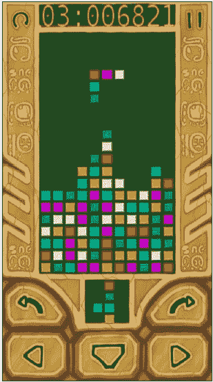
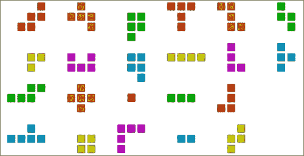
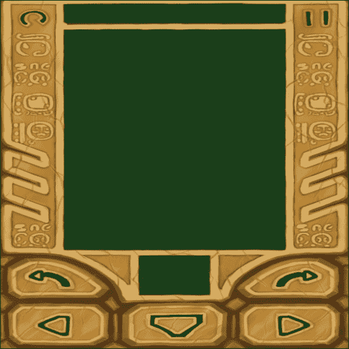
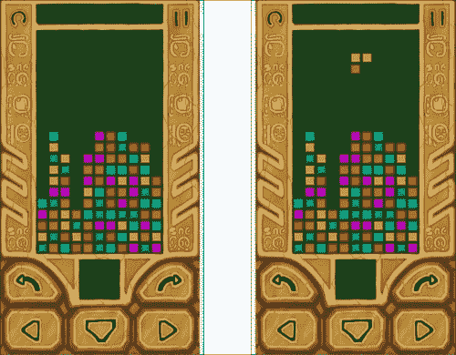
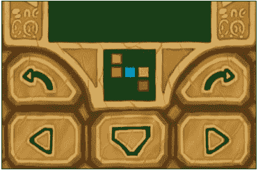
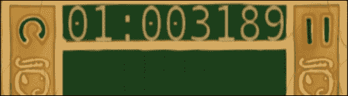
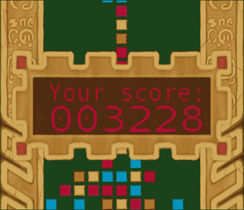

# 第八章。写一个第三场比赛

在本章中，我们将介绍:

*   处理异步多点触摸输入
*   改进音频播放机制
*   关闭应用程序
*   实现主循环
*   创建多平台游戏引擎
*   编写 match-3 游戏
*   管理形状
*   管理游戏场逻辑
*   在游戏循环中实现用户交互

# 简介

在这一章中，我们开始整理前几章的食谱。以下大部分方法旨在改进和整合前几章中分散的材质。

### 注

本章的示例项目实际上是该书作者在 Google Play 上发布的 MultiBricks 游戏的简化版本:[http://play.google.com/store/apps/details?id = com . linder daum . engine . multi brick](http://play.google.com/store/apps/details?id=com.linderdaum.engine.multibricks)。

# 处理异步多点触摸输入

在上一章我们学习了如何在安卓系统上处理多点触控事件。然而，我们简单的例子有一个严重的问题。安卓触控事件异步发送，会干扰游戏逻辑。因此，我们需要创建一个队列，以可控的方式处理事件。

## 做好准备

在继续之前，请查看[第 7 章](07.html "Chapter 7. Cross-platform UI and Input Systems")、*跨平台用户界面和输入系统、*中的安卓食谱上的处理多点触控事件。

## 怎么做…

1.  在前一章中，我们直接从异步 JNI 回调中调用了触摸处理程序:

    ```cpp
    Java_com_packtpub_ndkcookbook_game1_Game1Activity_SendMotion(
      JNIEnv * env, jobject obj, int PointerID, int x, int y,
      bool Pressed, int Flag)
      {                        
      LVector2 Pos = LVector2( (float)x / (float)g_Width,
      (float)y / (float)g_Height );
      GestureHandler_SendMotion( PointerID, (eMotionFlag)Flag,
        Pos,Pressed );
    }
    ```

2.  这一次，我们必须将所有事件存储在一个队列中，而不是立即处理它们。该队列将保存结构中`GestureHandler_SendMotion()`的参数:

    ```cpp
    struct sSendMotionData
    {
      int ContactID;
      eMotionFlag Flag;
      LVector2 Pos;
      bool Pressed;
    };
    ```

3.  队列实现依赖于`std::vector`，保存触摸事件和`Mutex`，提供队列访问同步:

    ```cpp
    Mutex g_MotionEventsQueueMutex;
    std::vector<sSendMotionData> g_MotionEventsQueue;
    ```

4.  我们新的`SendMotion()` JNI 回调所要做的所有工作就是将触摸事件参数打包到队列中:

    ```cpp
    Java_com_packtpub_ndkcookbook_game1_Game1Activity_SendMotion(
      JNIEnv * env, jobject obj, int PointerID, int x, int y,
      bool Pressed, int Flag)
    {                        
      sSendMotionData M;
      M.ContactID = PointerID;
      M.Flag = (eMotionFlag)Flag;
      M.Pos = LVector2( (float)x / (float)g_Width,
        (float)y / (float)g_Height );
      M.Pressed = Pressed;
      LMutex Lock( &g_MotionEventsQueueMutex );
      g_MotionEventsQueue.push_back( M );
    }
    ```

我们现在可以随时处理触摸事件。

## 它是如何工作的…

为了处理队列中的触摸事件，我们扩展了`DrawFrame()` JNI 回调的实现:

```cpp
Java_com_packtpub_ndkcookbook_game1_Game1Activity_DrawFrame(
  JNIEnv* env, jobject obj )
{
```

注意附加`{}`中`Lock`变量的范围。我们需要它，因为在继续游戏逻辑之前，互斥变量必须解锁以防止死锁:

```cpp
  {
    LMutex Lock(&g_MotionEventsQueueMutex );
    for( auto m : g_MotionEventsQueue )
    {
      GestureHandler_SendMotion( m.ContactID, m.Flag,
        m.Pos, m.Pressed );
    }
    g_MotionEventsQueue.clear();
  }
  GenerateTicks();
}
```

### 注

完整实现参见示例`1_Game`中的`jni/Wrappers.cpp`文件，可从[www.packtpub.com/support](http://www.packtpub.com/support)中检索。

## 还有更多…

我们的新方法更加稳健。但是`GestureHandler_SendMotion()`内部生成的触摸事件时间戳稍显健壮，不再对应触摸的实际时间。这引入了大约等于单帧渲染时间的延迟，并可能成为多人游戏中的一个问题。我们将添加真实时间戳的练习留给读者。这可以通过用时间戳字段扩展`sSendMotionData`结构来实现，该字段在 JNI 回调`SendMotion()`中分配。

## 另见

*   [第七章](07.html "Chapter 7. Cross-platform UI and Input Systems")、*跨平台用户界面和输入系统*中的*在安卓*上处理多点触控事件的方法

# 完善音频播放机制

在前几章中，我们学习了如何在安卓系统上使用 OpenAL 播放音频。我们在[第 5 章](05.html "Chapter 5. Cross-platform Audio Streaming")、*跨平台音频流、*中的基础音频子系统实现缺乏音频源的自动化管理；我们必须在单独的线程上手动控制它们。现在，我们将把所有的代码放入一个新的音频子系统，可以在一个真实的游戏中使用。

## 做好准备

该配方的完整源代码集成在示例`1_Game`中，可以在文件`sound/Audio.h`和`sound/Audio.cpp`中找到。`sound`文件夹中的其他文件为不同的音频格式提供解码功能，请查看。

## 怎么做…

1.  我们需要我们的`clAudioThread`类来处理活跃的音频源。让我们用负责它们注册的方法来扩展它:

    ```cpp
    class clAudioThread: public iThread
    {
    public:
    …
      void RegisterSource( clAudioSource* Src );
      void UnRegisterSource( clAudioSource* Src );
    ```

2.  我们还需要一个用于活动源和互斥体的容器来控制对它的访问:

    ```cpp
    private:
    …
      std::vector< clAudioSource* > FActiveSources;
      Mutex FMutex;
    };
    ```

3.  方法`clAudioThread::Run()`变得更加复杂。除了 OpenAL 的初始化之外，它还必须更新活动的音频源，以便它们可以从它们的提供商那里获取音频数据:

    ```cpp
    void clAudioThread::Run()
    {
      if ( !LoadAL() ) { return; }
      FDevice = alcOpenDevice( NULL );
      FContext = alcCreateContext( FDevice, NULL );
      alcMakeContextCurrent( FContext );
      FInitialized = true;
      FPendingExit = false;
      double Seconds = GetSeconds();
    ```

4.  内环根据经过的时间更新活动的音频源:

    ```cpp
      while ( !IsPendingExit() )
      {
        float DeltaSeconds = static_cast<float>(
        GetSeconds() - Seconds );
    ```

5.  注意互斥体的以下范围:

    ```cpp
        {
          LMutex Lock(&FMutex );
          for( auto i = FActiveSources.begin();
          i != FActiveSources.end(); i++ )
          {
            ( *i )->Update( DeltaSeconds );
          }
        }
        Seconds = GetSeconds();
    ```

6.  音频源每 100 毫秒更新一次。这个值纯粹是经验值，适合非实时音频播放，作为音频子系统延迟和安卓设备功耗之间的权衡:

    ```cpp
        Env_Sleep( 100 );
      }
      alcDestroyContext( FContext );
      alcCloseDevice( FDevice );
      UnloadAL();
    }
    ```

7.  需要注册方法来维护`FActiveSources`容器。它们的实现可以在下面的代码中找到:

    ```cpp
    void clAudioThread::RegisterSource( clAudioSource* Src )
    {
      LMutex Lock(&FMutex );
    ```

8.  不要多次添加同一个音源:

    ```cpp
      auto i = std::find( FActiveSources.begin(),
      FActiveSources.end(), Src );
      if ( i != FActiveSources.end() ) return;
      FActiveSources.push_back( Src );
    }
    void clAudioThread::UnRegisterSource( clAudioSource* Src )
    {
      LMutex Lock(&FMutex );
    ```

9.  只需找到来源并删除:

    ```cpp
      auto i = std::find( FActiveSources.begin(),
    FActiveSources.end(), Src );
      if ( i != FActiveSources.end() ) FActiveSources.erase( i );
    }
    ```

这个新的`clAudioThread`类的完整实现可以在示例`1_Game`中的`sound/Audio.cpp`和`sound/Audio.h`文件中找到。

## 它是如何工作的…

为了利用新的`AudioThread`类，音频源必须自己注册。我们扩展`clAudioSource`类的构造函数和析构函数来执行 RAII 注册([http://en . Wikipedia . org/wiki/Resource _ Acquisition _ Is _ Initialization](http://en.wikipedia.org/wiki/Resource_Acquisition_Is_Initialization)):

```cpp
clAudioSource::clAudioSource()
{
…
  g_Audio.RegisterSource( this );
}

clAudioSource::~clAudioSource()
{
…
  g_Audio.UnRegisterSource( this );
}
```

现在音频播放非常简单。声明一个全局音频线程:

```cpp
clAudioThread g_Audio;
```

从主线程开始，等待初始化完成:

```cpp
g_Audio.Start( iThread::Priority_Normal );
g_Audio.Wait();
```

### 注

我们可以在`g_Audio.Start()`和`g_Audio.Wait()`调用之间调用其他有用的初始化例程，以利用异步初始化。

创建和配置新的音频源并播放它:

```cpp
Music = new clAudioSource();
Music->BindWaveform(new
clModPlugProvider( LoadFileAsBlob("test.xm")) );
Music->LoopSound( true );
Music->Play();
```

所有音频管理现在都在另一个线程上完成。

## 还有更多…

我们的音频线程能够播放不同类型的音频文件，如`.ogg`、`.xm`、`.it,`和`.s3m`文件。您可以通过向`AudioSource`添加另一种方法来隐藏适当的波形数据提供程序的创建。根据文件扩展名切换选择即可创建`ModPlugProvider`或`OggProvider`实例。我们把这个留给你作为练习。

## 另见

*   *初始化 OpenAL 并播放。wav 文件、* *解码 Ogg Vorbis 文件*、*使用 ModPlug* 解码追踪器音乐、*流音[第 5 章](05.html "Chapter 5. Cross-platform Audio Streaming")、*跨平台音频流*中的*菜谱

# 关闭应用程序

智能手机的电池非常有限，使得移动设备对其运行的任何后台活动都非常敏感。我们之前的应用程序示例在用户切换到另一个活动后仍然有效。这意味着没有尊重安卓活动生命周期([http://developer . Android . com/training/basic/activity-life cycle](http://developer.android.com/training/basics/activity-lifecycle))并暂停我们的应用程序，而是继续在后台浪费宝贵的系统资源。是时候学习如何用我们的原生代码处理`onPause()`安卓回调了。

## 做好准备

如果不熟悉安卓活动生命周期，可以参考开发者手册:[http://developer . Android . com/training/basic/Activity-life cycle/index . html](http://developer.android.com/training/basics/activity-lifecycle/index.html)。

## 怎么做…

1.  安卓应用程序不必实现所有的生命周期方法。我们的生命周期管理战略将非常简单；一旦调用`onPause()`方法，保存游戏状态并终止应用程序。我们需要写一些 Java 代码才能让它工作。将此代码添加到您的`Activity`类中，在我们的案例中，它是`Game1Activity.java`文件中的`Game1Activity`:

    ```cpp
      @Override protected void onPause()
      {
        super.onPause();
        ExitNative();
      }
      public static native void ExitNative();
    ```

2.  按照以下方式实施`ExitNative()` JNI 法:

    ```cpp
    JNIEXPORT void JNICALL Java_com_packtpub_ndkcookbook_game1_Game1Activity_ExitNative(
      JNIEnv* env, jobject obj )
    {
    OnStop();
      exit( 0 );
    }
    ```

3.  现在我们可以在游戏中实现原生`OnStop()`回调。

## 它是如何工作的…

典型的`OnStop()`回调的实现会保存游戏状态，所以可以在后面游戏恢复时恢复。由于我们的第一个游戏不需要任何保存，我们将只提供一个空的实现:

```cpp
void OnStop()
{
}
```

您可能希望稍后将游戏保存作为一项练习来实现。

## 还有更多…

要使`OnStop()`方法在 Windows 上工作，只需在`Wrapper_Windows.cpp`中退出主循环后调用它:

```cpp
while ( !PendingExit )
{
  …
}
OnStop();
```

解决方案现在是可移植的，所有的逻辑都可以在 Windows 上调试。

## 另见

*   *执行主循环*

# 实现主循环

在前面的章节中，我们的代码示例使用带有粗略固定时间步长的`OnTimer()`回调来更新状态，使用`OnDrawFrame()`回调来渲染图形。这不适合实时游戏，在实时游戏中，我们应该根据自上一帧以来经过的真实时间来更新状态。然而，在调用`OnTimer()`时使用一个小的固定时间步长仍然是可取的。我们可以通过以一种巧妙的方式交错调用`OnTimer()`和`OnDrawFrame()`来解决这个问题，并将这个逻辑放入游戏主循环中。

## 做好准备

有一篇非常有趣的文章叫做**修正你的时间步长！**可在[http://gafferongames.com/game-physics/fix-your-timestep](http://gafferongames.com/game-physics/fix-your-timestep)获得，它非常详细地解释了实现游戏主循环的不同方法，以及为什么固定时间步长很重要。

## 怎么做…

1.  游戏主循环的逻辑是平台无关的，可以放入一个方法:

    ```cpp
    void GenerateTicks()
    {
    ```

2.  `GetSeconds()`返回系统启动后的单调时间，单位为秒。然而，只有帧增量才重要:

    ```cpp
      NewTime = GetSeconds();
      float DeltaSeconds = static_cast<float>( NewTime - OldTime );
      OldTime = NewTime;
    ```

3.  我们将用固定的时间步长更新游戏逻辑，该时间步长对应于以每秒 60 帧的速度运行的游戏:

    ```cpp
      const float TIME_QUANTUM = 1.0f / 60.0f;
    ```

4.  此外，我们需要一个故障保护机制来防止游戏由于渲染速度慢而过度减速:

    ```cpp
      const float MAX_EXECUTION_TIME = 10.0f * TIME_QUANTUM;
    ```

5.  现在我们累计经过的时间:

    ```cpp
      ExecutionTime += DeltaSeconds;
      if ( ExecutionTime > MAX_EXECUTION_TIME )
      { ExecutionTime = MAX_EXECUTION_TIME; }
    ```

6.  并相应地调用一系列`OnTimer()`回调。所有`OnTimer()`回调接收相同的固定时间步长值:

    ```cpp
      while ( ExecutionTime > TIME_QUANTUM )
      {
        ExecutionTime -= TIME_QUANTUM;
        OnTimer( TIME_QUANTUM );
      }
    ```

7.  游戏更新后，渲染下一帧:

    ```cpp
      OnDrawFrame();
    }
    ```

## 它是如何工作的…

更新后应调用`OnDrawFrame()`回调。如果设备足够快，每次`OnTimer()`呼叫后都会调用`OnDrawFrame()`。否则，将跳过一些帧，以保持游戏逻辑的实时速度。如果设备运行速度太慢，甚至连游戏逻辑都无法运行，我们的安全代码就会启动:

```cpp
if ( ExecutionTime > MAX_EXECUTION_TIME )
  { ExecutionTime = MAX_EXECUTION_TIME; }
```

整件事将以慢动作进行，但游戏仍然可以玩。

### 注

您可以尝试缩放传递给`OnTimer()`的值，例如`OnTimer( k * TIME_QUANTUM )`。如果`k`小于`1.0`，游戏逻辑就会变成慢动作。可以用来产生类似子弹时间的效果([http://en.wikipedia.org/wiki/Bullet_time](http://en.wikipedia.org/wiki/Bullet_time))。

## 还有更多…

如果应用程序被挂起，但您希望它继续在后台运行，明智的做法是完全省略渲染阶段或更改更新量的持续时间。您可以通过在游戏中添加`Paused`状态并在主循环中检查它来实现，例如:

```cpp
if ( !IsPaused() ) OnDrawFrame();
```

这将有助于节省宝贵的 CPU 周期，同时仍然在后台运行游戏逻辑模拟。

## 另见

*   [第二章](02.html "Chapter 2. Porting Common Libraries")、*移植公共库*中*在物理*配方中实现计时

# 创建多平台游戏引擎

在之前的章节和食谱中，我们为一些多平台游戏开发任务手工制作了许多特别的解决方案。现在，我们将把所有相关代码组合成一个新生的便携式游戏引擎，并学习如何为 Windows 和 Android 准备 makefiles 来构建它。

## 做好准备

为了理解这个食谱是怎么回事，建议你从头开始通读第一章到第七章。

## 怎么做…

1.  我们将所有代码分成几个逻辑子系统，并将它们放入以下文件夹:
    *   `core`:这里有低级设施，比如侵入式智能指针和数学库
    *   `fs`:包含文件系统相关的类
    *   `GL`:这包含了官方的 OpenGL 头文件
    *   `include`:包含一些第三方库的包含文件
    *   `graphics`:包含高级图形相关代码，如字体、画布和图像
    *   `LGL`:这包含了我们的 OpenGL 包装器和函数加载代码，以及在[第 7 章](07.html "Chapter 7. Cross-platform UI and Input Systems")、*跨平台 UI 和输入系统*中实现的抽象层
    *   `Sound`:包含音频相关的类和解码库
    *   `threading`:这包含多线程相关的类，包括互斥体、事件、队列和我们的多平台线程包装器

## 它是如何工作的…

每个文件夹中的大部分代码被拆分成类。在我们的极简游戏引擎中，我们将类的数量保持在合理的最小值。

`graphics`文件夹包含以下结构和类的实现:

*   结构`sBitmapParams`保存位图的参数，如宽度、高度和像素格式。
*   类`clBitmap`是独立于应用编程接口的位图表示，它与`sBitmapParams`一起保存实际的像素数据。它可以被加载到一个 clGLTexture 中。
*   类`clCanvas`提供了一种即时渲染的机制。
*   类`clVertexAttribs`是 3D 几何图形的独立于应用编程接口的表示。可以加载到`clGLVertexArray`中。
*   类`clGeomServ`提供返回`clVertexAttribs`的三维几何创建方法。
*   类`iGestureResponder`是一个要实现的接口，如果你想响应触摸或者手势。
*   结构`sMotionData`保存当前的一组活动触摸点。
*   类`clTextRenderer`提供基于 FreeType 的文本渲染工具。它可以将指定字体的文本字符串渲染成`clBitmap`。
*   结构`sTouchPoint`用标识符表示单个触摸点，2D 归一化浮动坐标、标志和时间戳。

`LGL`文件夹保存特定于 OpenGL 的类:

*   结构`sUniform`表示着色器程序中的单个制服。它只是一个名字和一个位置索引。
*   类`clGLSLShaderProgram`代表一个在 GLSL 编写的着色器程序，并提供桌面 GLSL 和移动 GLSL ES 之间的自动转换功能。
*   类`clGLTexture`提供对 OpenGL 纹理的访问，可以读取`clBitmap`像素数据。
*   类`clGLVertexArray`提供对 OpenGL 顶点数组对象和顶点缓冲区对象的抽象。它使用来自`clVertexAttribs`的数据。

低级类，如 smarpointers、入侵计数器和数学相关代码被放入`core`文件夹中的:

*   类`clPtr`是引用计数的侵入式智能指针的实现。
*   类`iObject`保存一个侵入式引用计数器。
*   类`LRingBuffer`是一个环绕环形缓冲区的实现。
*   基础数学库由向量类组成，包括`LVector2`、`LVector3`、`LVector4`、`LVector2i`，矩阵类包括`LMatrix3`和`LMatrix4`。数学库还包含用于投影设置的最小代码。

文件系统相关的代码位于`fs`文件夹中:

*   类`clArchiveReader`使用 **libcompress** 库实现了一个`.zip`档案解包算法。用于访问安卓`.apk`文件中的资源。
*   类`clBlob`代表内存中可以读取或写入文件的字节数组。
*   类`iRawFile`是表示一个文件的所有类的基类。
*   类`clRawFile`代表物理文件系统上的一个文件。
*   类`clMemRawFile`将内存块表示为文件，适用于访问下载的数据(例如图像)。
*   类`clManagedMemRawFile`类似于`MemRawFile`，但是内存是由里面的`Blob`对象管理的。
*   类`clFileMapper`是只读内存映射文件的抽象。
*   类`clFileWriter`是写入文件的抽象。
*   类`clFileSystem`是溪流和斑点的工厂。它提供了在我们的应用程序中管理虚拟路径的工具。
*   类`iMountPoint`、`clPhysicalMountPoint`、`clAliasMountPoint`和`clArchiveMountPoint`用于以可移植的多平台方式路由对操作系统原生文件系统和安卓`.apk`档案的访问。

`sound`文件夹包含我们音频子系统的抽象:

*   类`clAudioSource`代表虚拟环境中的音频源。可以播放、暂停或停止。
*   类`clAudioThread`更新活动源，并将数据提交给底层 OpenAL API。
*   类`iWaveDataProvider`抽象音频文件的解码。
*   类`clStreamingWaveDataProvider`将音频文件中的数据流式传输到内存中，这些文件太大，无法立即解码。
*   类`clDecodingProvider`为流媒体音频提供商提供通用的倒带逻辑。它是实际解码器的基类。
*   类`clOggProvider`和`clModPlugProvider`用 **libogg** / **libvorbis** 处理`.ogg`文件的解码，用 **libmodplug** 处理追踪器音乐。

`threading`文件夹包含不同多线程原语的可移植实现:

*   类`clMutex`、`LMutex`和`iThread`以可移植的方式实现基本的低级多线程原语
*   类`clWorkerThread`和`iTask`是基于`iThread`的更高级抽象
*   Classes `iAsyncQueue` and `iAsyncCapsule` are used to implement asynchronous callbacks

    ### 注

    迷你引擎的源代码位于上一章示例中的“引擎”文件夹中。

## 另见

*   *写比赛-3 游戏*
*   [第九章](09.html "Chapter 9. Writing a Picture Puzzle Game")*写图益智游戏*

# 写比赛-3 游戏

现在是时间开始开发一款已经结束的 **match-3** 游戏。match-3 是一种拼图游戏，玩家需要对齐瓷砖才能让相邻的瓷砖消失。这里，`3`代表放入相邻位置时会消失的同色瓷砖数量。以下是游戏最终版本的截图:



我们在游戏中使用了一组 22 个 monomino、domino、tromino、tetromino 和 pentomino 形状:



由于大部分印象来自屏幕上可视化的结果，让我们继续讨论游戏屏幕如何渲染的要点。

## 做好准备

完整的现成源代码位于补充资料的`1_Game`文件夹中。

这款游戏于 2011 年由该书的作者在谷歌 Play 上以某种扩展的形式发布。如果你想立即在你的安卓设备上尝试，你可以在以下网站上找到这个游戏:[http://play.google.com/store/apps/details?http://play.google.com/store/apps/details?id = com . linder daum . engine . multi brick _ free](http://play.google.com/store/apps/details?id=com.linderdaum.engine.multibricks)。

作者不介意你在自己的项目中使用这个游戏中的图形作品。它是学习工具，不是商品。

对一般 match-3 游戏机制感兴趣的可以参考以下维基百科文章:[http://en.wikipedia.org/wiki/Match_3](http://en.wikipedia.org/wiki/Match_3)。

## 怎么做…

整个游戏画面在`OnDrawFrame()`回调中的几个步骤中每一帧都被重新渲染。让我们浏览一下它的源代码，看看如何做到这一点:

1.  The fullscreen background image is rendered clearing the graphics from the previous frame. The image is stored as a square 512 x 512 `.png` file and is rescaled to the full screen restoring its proportions, as shown in the following screenshot:

    

    ### 注

    二次方图像被用来使游戏与旧的安卓硬件兼容。如果你把 OpenGL ES 3 作为你的最低要求，你可以使用任意大小的纹理。

2.  以下是渲染背景的 C++代码:

    ```cpp
    LGL3->glDisable( GL_DEPTH_TEST );
    ```

3.  首先，绑定 3 个纹理和着色器:

    ```cpp
    BackTexture_Bottom->Bind(2);
    BackTexture_Top->Bind(1);
    BackTexture->Bind(0);
    BackShader->Bind();
    ```

4.  更新控制按钮的按下标志:

    ```cpp
    BackShader->SetUniformNameFloatArray( "b_MoveLeft",  1, 
      b_Flags[b_MoveLeft] );
    BackShader->SetUniformNameFloatArray( "b_Down",      1, 
      b_Flags[b_Down] );
    BackShader->SetUniformNameFloatArray( "b_MoveRight", 1, 
      b_Flags[b_MoveRight] );
    BackShader->SetUniformNameFloatArray( "b_TurnLeft",  1, 
      b_Flags[b_TurnLeft] );
    BackShader->SetUniformNameFloatArray( "b_TurnRight", 1, 
      b_Flags[b_TurnRight] );
    BackShader->SetUniformNameFloatArray( "b_Reset",     1, 
      b_Flags[b_Reset] );
    BackShader->SetUniformNameFloatArray( "b_Paused",    1, 
      b_Flags[b_Paused] );
    ```

5.  最后，渲染一个全屏矩形:

    ```cpp
    Canvas->GetFullscreenRect()->Draw(false);
    ```

6.  `float b_Flags[]`数组对应控制按钮的状态；`1.0f`的值表示按钮被按下，`0.0f`表示按钮被释放。这些值被传递给着色器以相应地高亮显示按钮。
7.  Cells of the game field are rendered on top of the background followed by the current shape above them:

    

    ```cpp
    for ( int i = 0; i < g_Field.FWidth; i++ )
    {
      for ( int j = FIELD_INVISIBLE_RAWS;j < g_Field.FHeight; j++ )
      {
        int c = g_Field.FField[i][j];
        if ( c >= 0 && c < NUM_COLORS )
        {
          int Img = c % NUM_BRICK_IMAGES;
          int P = ( j - FIELD_INVISIBLE_RAWS );
    ```

8.  场的每个单元都只是一个带有纹理的小矩形:

    ```cpp
          DrawTexQuad( i * 20.0f + 2.0f,
          P * 20.0f + 2.0f,16.0f, 16.0f,
          Field_X1, Field_Y1,
          g_Colors[c], Img );
        }
      }
    }
    ```

9.  当前形状渲染为一行:

    ```cpp
    DrawFigure(&g_CurrentFigure, g_GS.FCurX,
          g_GS.FCurY - FIELD_INVISIBLE_RAWS,Field_X1, Field_Y1,
          BLOCK_SIZE );
    ```

10.  The next figure is rendered near the control buttons, as shown in the following screenshot:

    

11.  代码更复杂，因为我们需要评估形状的边界框来正确渲染它:

    ```cpp
      int Cx1, Cy1, Cx2, Cy2;
      g_NextFigure.GetTopLeftCorner(&Cx1, &Cy1 );
      g_NextFigure.GetBottomRightCorner(&Cx2, &Cy2 );
      LRect FigureSize = g_NextFigure.GetSize();
      float dX = ( float )Cx1 * BLOCK_SIZE_SMALL / 800.0f;
      float dY = ( float )Cy1 * BLOCK_SIZE_SMALL / 600.0f;
      float dX2 = 0.5f * (float)Cx2 * BLOCK_SIZE_SMALL/800.0f;
      float dY2 = 0.5f * (float)Cy2 * BLOCK_SIZE_SMALL/600.0f;
      DrawFigure( &g_NextFigure, 0, 0, 0.415f - dX - dX2,
        0.77f - dY - dY2, BLOCK_SIZE_SMALL );
    ```

12.  Render the current score text, as shown in the following screenshot:

    

13.  一旦文本发生变化，就会渲染成位图，纹理也随之更新:

    ```cpp
    std::string ScoreString( Str_GetFormatted( "%02i:%06i",
    g_GS.FLevel, g_GS.FScore ) );
    if ( g_ScoreText != ScoreString )
    {
      g_ScoreText = ScoreString;
      g_ScoreBitmap = g_TextRenderer->RenderTextWithFont(
        ScoreString.c_str(), g_Font,32, 0xFFFFFFFF, true );
      g_ScoreTexture->LoadFromBitmap( g_ScoreBitmap );
    }
    ```

14.  我们只需要在每一帧中渲染一个纹理矩形:

    ```cpp
      LVector4 Color( 0.741f, 0.616f, 0.384f, 1.0f );
      Canvas->TexturedRect2D( 0.19f, 0.012f, 0.82f, 0.07f,Color,
      g_ScoreTexture );
    ```

15.  Render the game-over message if needed, as shown in the following screenshot:

    

16.  这类似于文本渲染，但是，我们可以在这里避免缓存，因为这个消息框很少显示:

    ```cpp
      if ( g_GS.FGameOver )
      {
        DrawBorder( 0.05f, 0.25f, 0.95f, 0.51f, 0.19f );
        std::string ScoreStr = Str_GetPadLeft(
        Str_ToStr( g_GS.FScore ), 6, '0' );
        Canvas->TextStr( 0.20f, 0.33f, 0.84f, 0.37f,
        LocalizeString("Your score:"), 32,
        LVector4( 0.796f, 0.086f,0.086f, 1.0f ),
        g_TextRenderer, g_Font );
        Canvas->TextStr( 0.20f, 0.38f, 0.84f, 0.44f,ScoreStr,
        32, LVector4( 0.8f, 0.0f, 0.0f,1.0f ),
        g_TextRenderer, g_Font );
      }
    ```

17.  画布完成渲染文本和更新纹理所需的一切。然而，对于任何更频繁的事情来说，它都有点慢。查看`img/Canvas.cpp`文件中的完整实现。

## 它是如何工作的…

在前面的代码中，我们使用了一些可能需要一些解释的助手函数。`DrawQuad()``DrawTexQuad()`功能绘制游戏场的单个单元格。它们由一些硬编码值组成，用于相对于背景图像定位单元格。以下是一个函数的源代码:

```cpp
void DrawTexQuad( float x, float y, float w, float h,
float OfsX, float OfsY,
const LVector4& Color, int ImageID )
{
```

`800.0f`和`600.0f`的神奇常数出现在这里，从用户界面的坐标系转换到浮点归一化坐标，用户界面是为纵向的`600×800`屏幕设计的:

```cpp
  float X1 = x / 800.0f;
  float Y1 = y / 600.0f;
  float X2 = ( x + w ) / 800.0f;
  float Y2 = ( y + h ) / 600.0f;
```

其他魔术常数也是设计的一部分，是根据经验选择的。尝试调整它们:

```cpp
  X1 *= Field_Width / 0.35f;
  X2 *= Field_Width / 0.35f;
  Y1 *= Field_Height / 0.75f;
  Y2 *= Field_Height / 0.75f;
  Canvas->TexturedRect2D( X1 + OfsX, Y1 + OfsY,
  X2 + OfsX, Y2 + OfsY,
  Color, BricksImage[ImageID] );
  }
```

`DrawFigure()`法是用来在游戏场的任何地方画一个单一的形状:

```cpp
void DrawFigure( clBricksShape* Figure, int X, int Y,
float OfsX, float OfsY, float BlockSize )
{
  for ( int i = 0 ; i < Figure->FWidth ; i++ )
  {
    for ( int j = 0 ; j < Figure->FHeight ; j++ )
    {
```

跳过游戏栏顶部不可见的行:

```cpp
      if ( Y + j < 0 ) { continue; }
      intc = Figure->GetMask( i, j );
      if ( c >= 0 && c < NUM_COLORS )
      {
        DrawTexQuad(
          (X + i) *(BlockSize + 4.0f) + 2.0f,
          (Y + j) * (BlockSize + 4.0f) + 2.0f,
          BlockSize, BlockSize, OfsX, OfsY,
          g_Colors[c], c % NUM_BRICK_IMAGES );
        }
    }
  }
}
```

`DrawBorder()`功能只是`Canvas`的捷径:

```cpp
void DrawBorder( float X1, float Y1, float X2, float Y2,
 float Border )
{
  Canvas->TexturedRect2D( X1, Y1, X1+Border, Y2,
    LVector4( 1.0f ), MsgFrameLeft  );
  Canvas->TexturedRect2D( X2-Border, Y1, X2, Y2,
    LVector4( 1.0f ), MsgFrameRight );
  Canvas->TexturedRect2DTiled( X1+Border, Y1, X2-Border, Y2,
    3, 1, LVector4( 1.0f ), MsgFrameCenter );
}
```

## 还有更多…

我们提到控制按钮在片段着色器中高亮显示。这是如何做到的。

将按钮的状态作为制服传递给:

```cpp
uniform float b_MoveLeft;
uniform float b_Down;
uniform float b_MoveRight;
uniform float b_TurnLeft;
uniform float b_TurnRight;
uniform float b_Reset;
uniform float b_Paused;
```

检查矩形是否包含指定点的函数，如下所示:

```cpp
bool ContainsPoint( vec2 Point, vec4 Rect )
{
  return Point.x >= Rect.x && Point.y >= Rect.y &&
  Point.x <= Rect.z && Point.y <= Rect.w;
}
```

存储一些对应于控制按钮所在矩形的硬编码值:

```cpp
void main()
{
  const vec4 MoveLeft  = vec4( 0.0,  0.863, 0.32, 1.0 );
  const vec4 Down      = vec4( 0.32, 0.863, 0.67, 1.0 );
  const vec4 MoveRight = vec4( 0.67, 0.863, 1.0,  1.0 );
  const vec4 TurnLeft  = vec4( 0.0,  0.7,  0.4,  0.863);
  const vec4 TurnRight = vec4( 0.6,  0.7,  1.0,  0.863);
  const vec4 Reset     = vec4( 0.0,  0.0,  0.2,  0.1 );
  const vec4 Paused    = vec4( 0.8,  0.0,  1.0,  0.1 );
```

阅读背景纹理和高亮部分。从伴随项目中查看文件`back.png`、`back_high_bottom.png`、`back_high_top.png`:

```cpp
  vec4 Color      = texture( Texture0,TexCoord );
  vec4 ColorHighT = texture( Texture1,TexCoord*vec2(4.0,8.0) );
  vec4 ColorHighB = texture( Texture2,TexCoord*vec2(1.0,2.0) );
```

检查按钮是否被按下，并相应地选择正确的纹理:

```cpp
  if ( b_MoveLeft>0.5 &&ContainsPoint(TexCoord.xy, MoveLeft))
    Color = ColorHighB;
  if ( b_Down> 0.5 && ContainsPoint( TexCoord.xy, Down ) )
    Color = ColorHighB;
  if ( b_MoveRight>0.5 && ContainsPoint(TexCoord.xy,MoveRight) )
    Color = ColorHighB;
  if ( b_TurnLeft>0.5 && ContainsPoint(TexCoord.xy, TurnLeft) )
    Color = ColorHighB;
  if ( b_TurnRight>0.5 && ContainsPoint(TexCoord.xy,TurnRight) )
    Color = ColorHighB;
  if ( b_Reset> 0.5 && ContainsPoint( TexCoord.xy, Reset) )
    Color = ColorHighT;
  if ( b_Paused> 0.5 && ContainsPoint( TexCoord.xy, Paused ) )
    Color = ColorHighT;
```

瞧！我们用所有按钮一次完成背景纹理化:

```cpp
   out_FragColor = Color;
}
```

## 另见

*   *创建多平台游戏引擎*

# 管理形状

在之前的食谱中，我们学习了如何渲染游戏画面。一些类仍然没有实现。在这个食谱中，我们将实现`clBricksShape`类，负责游戏中出现的每个形状的存储和操作。

## 做好准备

来看看可以存在多少种不同的 pentomino 形状。维基百科提供了一个全面的概述:[http://en.wikipedia.org/wiki/Pentomino](http://en.wikipedia.org/wiki/Pentomino)。

## 怎么做…

1.  我们`clBricksShape`类的界面如下:

    ```cpp
    class clBricksShape
    {
    public:
    ```

2.  我们游戏中使用的形状大小。我们使用`5x5`形状。

    ```cpp
      static const int FWidth  = SHAPES_X;
      static const int FHeight = SHAPES_Y;
    ```

3.  存储该形状包含的单元格的颜色。颜色存储为索引:

    ```cpp
    private:
      int FColor[NUM_COLORS];
    ```

4.  图形索引定义形状类型:

    ```cpp
      int FFigureIndex;
    ```

5.  旋转指数对应图中旋转角度:`0`、`1`、`2`、`3` 代表`0`、`90`、`180`、`270`度:

    ```cpp
      int FRotationIndex;
    ```

6.  方法非常简单明了，如下所示:

    ```cpp
    public:
      int GetMask( int i, int j ) const
      {
        if ( i < 0 || j < 0 ) return -1;
        if ( i >= FWidth || j >= FHeight ) return -1;
        int ColorIdx =
        Shapes[FFigureIndex][FRotationIndex][i][j];
        return ColorIdx ? FColor[ColorIdx] : -1;
      }
    ```

7.  方法`Rotate()`不旋转单个单元格。除了调整旋转角度外，它什么也不做:

    ```cpp
      void Rotate( bool CW )
      {
        FRotationIndex = CW ?
             ( FRotationIndex ? FRotationIndex - 1 : ROTATIONS - 1 ) :
             ( FRotationIndex + 1 ) % ROTATIONS;
      }
    ```

8.  图生成也很简单。它只是从预定义图形表中选择的:

    ```cpp
      void GenFigure( int FigIdx, int Col )
      {
        for ( int i = 0; i != NUM_COLORS; i++ )
          FColor[i] = Random( NUM_COLORS );
        FFigureIndex = FigIdx;
        FRotationIndex = 0;
      }
    ```

9.  这些方法用于计算形状的边界框。参考`game/Shape.h`文件获取它们的源代码:

    ```cpp
    void GetTopLeftCorner( int* x, int* y ) const;
      void GetBottomRightCorner( int* x, int* y ) const;
      LRect GetSize() const;
    };
    ```

## 它是如何工作的…

前一节代码背后的主要技巧是预定义形状的表格。其声明位于`Pentomino.h`文件中:

```cpp
static const int NUM_SHAPES = 22;
static const int SHAPES_X = 5;
static const int SHAPES_Y = 5;
static const int ROTATIONS = 4;
extern char
  Shapes[ NUM_SHAPES ][ ROTATIONS ][ SHAPES_X ][ SHAPES_Y ];
```

就这样。我们在这个 4D 数组中存储每个形状。数组的内容在`Pentomino.cpp`文件中定义。以下代码是定义单个形状所有 4 次旋转的摘录:

```cpp
char Shapes [ NUM_SHAPES ][ ROTATIONS ][ SHAPES_X ][ SHAPES_Y ] =
{
  {
    {
      {0, 0, 0, 0, 0},
      {0, 0, 0, 1, 0},
      {0, 0, 3, 2, 0},
      {0, 5, 4, 0, 0},
      {0, 0, 0, 0, 0}
    },
    {
      {0, 0, 0, 0, 0},
      {0, 5, 0, 0, 0},
      {0, 4, 3, 0, 0},
      {0, 0, 2, 1, 0},
      {0, 0, 0, 0, 0}
    },
    {
      {0, 0, 0, 0, 0},
      {0, 0, 4, 5, 0},
      {0, 2, 3, 0, 0},
      {0, 1, 0, 0, 0},
      {0, 0, 0, 0, 0}
    },
    {
      {0, 0, 0, 0, 0},
      {0, 1, 2, 0, 0},
      {0, 0, 3, 4, 0},
      {0, 0, 0, 5, 0},
      {0, 0, 0, 0, 0}
    }
  },
```

数组中的非零值定义了哪些单元格属于该形状。值的大小定义了单元格的颜色。

## 另见

*   *写比赛-3 游戏*

# 管理游戏场逻辑

现在我们知道如何存储不同的形状并渲染它们。让我们实现一些游戏逻辑，让这些形状在游戏场上相互作用。

## 做好准备

参考*编写 match-3 游戏*配方，查看游戏场是如何渲染的。

## 怎么做…

1.  `clBricksField`界面如下图:

    ```cpp
    class clBricksField
    {
    public:
    ```

2.  我们游戏场的大小是`11×22`:T1
3.  检查图形是否适合某个位置的方法如下:

    ```cpp
      bool figureFits( int x, int y, const clBricksShape& fig )
      bool figureWillHitNextTurn( int x, int y,
        const clBricksShape& fig )
    ```

4.  此方法将形状压印到游戏区域的指定位置:

    ```cpp
      void addFigure( int x, int y, const clBricksShape& fig )
    ```

5.  下面的代码是主要的游戏逻辑。计算和删除同色细胞区域的方法:

    ```cpp
      int deleteLines();
      int CalcNeighbours( int i, int j, int Col );
      void FillNeighbours( int i, int j, int Col );
    ```

6.  由于我们正在进行一场 3 比 1 的比赛，我们将`3`的值传递给这个方法。然而，逻辑是一般的；你可以用自己的价值观来调整游戏玩法:

    ```cpp
      int deleteRegions( int NumRegionsToDelete );
      void collapseField();
    ```

7.  游戏场的细胞储存在这里。这些值对应于单元格的颜色:

    ```cpp
    public:
        int FField[ FWidth ][ FHeight ];
    };
    ```

## 它是如何工作的…

形状拟合使用简单的遮罩检查，并且很简单。我们将更加关注相邻小区的计算。它基于递归洪水填充算法([http://en.wikipedia.org/wiki/Flood_fill](http://en.wikipedia.org/wiki/Flood_fill)):

```cpp
int clBricksField::deleteRegions( int NumRegionsToDelete )
{
  int NumRegions = 0;
  for ( int j = 0; j != FHeight; j++ )
  {
    for ( int i = 0 ; i != FWidth ; i++ )
    {
      if ( FField[i][j] != -1 )
      {
```

递归计算每个单元格的邻居数量:

```cpp
        int Neighbors = CalcNeighbours( i, j,
        FField[i][j] );
```

如果邻居数量足够多，请标记单元格:

```cpp
        if ( Neighbors >= NumRegionsToDelete )
        {
          FillNeighbours( i, j, FField[i][j] );
          NumRegions += Neighbours;
        }
      }
    }
  }
```

从字段中删除标记的单元格:

```cpp
  CollapseField(); 
```

返回已删除片段的数量。这用于评估当前分数:

```cpp
  return NumRegions;
}
```

递归填充很简单。下面的代码计算相邻单元格的数量:

```cpp
intclBricksField::CalcNeighbours( int i, int j, int Col )
{
  if ( i < 0 || j < 0 || i >= FWidth ||
  j >= FHeight || FField[i][j] != Col ) return 0;
  FField[i][j] = -1;
  int Result =  1 + CalcNeighbours( i + 1, j + 0, Col ) +
  CalcNeighbours( i - 1, j + 0, Col ) +
  CalcNeighbours( i + 0, j + 1, Col ) +
  CalcNeighbours( i + 0, j - 1, Col );
  FField[i][j] = Col;
  return Result;
}
```

以下代码标记了相邻的单元格:

```cpp
void clBricksField::FillNeighbours( int i, int j, int Col )
{
  if ( i < 0 || j < 0 || i >= FWidth ||
    j >= FHeight || FField[i][j] != Col ) { return; }
  FField[i][j] = -1;
  FillNeighbours( i + 1, j + 0, Col );
  FillNeighbours( i - 1, j + 0, Col );
  FillNeighbours( i + 0, j + 1, Col );
  FillNeighbours( i + 0, j - 1, Col );
}
```

## 还有更多…

还有也是这个项目实现的游戏逻辑的另一个变体。查看文件`game/Field.h`中的方法`deleteLines()`，了解如何实现。

# 在游戏循环中实现用户交互

在前面的菜谱中我们学习了如何渲染游戏环境，实现游戏逻辑。开发中更重要的一个方面需要我们关注:用户交互。

## 做好准备

查看项目`1_Game`中的文件`main.cpp`进行全面实施。

## 怎么做…

我们需要实现一些功能来移动当前下落的形状:

1.  向左或向右移动人物时，强制执行游戏区域限制:

    ```cpp
    bool MoveFigureLeft()
    {
      if ( g_Field.FigureFits( g_GS.FCurX - 1, g_GS.FCurY,
      g_CurrentFigure ) )
      {
        g_GS.FCurX--;
        return true;
      }
      return false;
    }
    ```

2.  `MoveFigureRight()`的源代码类似于`MoveFigureLeft()`。`MoveFigureDown()`的代码需要在形状落地后更新分数:

    ```cpp
    bool MoveFigureDown()
    {
      if ( g_Field.FigureFits( g_GS.FCurX, g_GS.FCurY + 1,
      g_CurrentFigure ) )
      {
        g_GS.FScore += 1 + g_GS.FLevel / 2;
        g_GS.FCurY++;
        return true;
      }
      return false;
    }
    ```

3.  旋转代码需要检查旋转是否真的可能:

    ```cpp
    bool RotateFigure( bool CW )
    {
      clBricksShape TempFigure( g_CurrentFigure );
      TempFigure.Rotate( CW );
      if ( g_Field.FigureFits(g_GS.FCurX, g_GS.FCurY, TempFigure))
      {
        g_CurrentFigure = TempFigure;
        return false;
      }
      return true;
    }
    ```

4.  我们需要调用这些方法来响应按键或触摸。

## 它是如何工作的…

`ProcessClick()`功能处理一次点击。为了代码简单起见，我们将点击的位置存储在`g_Pos`全局变量中:

```cpp
void ProcessClick( bool Pressed )
{
```

重置按钮的状态:

```cpp
  b_Flags[b_MoveLeft] = 0.0f;
  b_Flags[b_MoveRight] = 0.0f;
  b_Flags[b_Down] = 0.0f;
  b_Flags[b_TurnLeft] = 0.0f;
  b_Flags[b_TurnRight] = 0.0f;
  b_Flags[b_Paused] = 0.0f;
  b_Flags[b_Reset] = 0.0f;
  bool MousePressed = Pressed;
  if ( Reset.ContainsPoint( g_Pos ) )
  {
    if ( MousePressed ) { ResetGame(); }
    b_Flags[b_Reset] = MousePressed ? 1.0f : 0.0f;
  }
```

游戏结束后不允许按任何按钮:

```cpp
  if ( g_GS.FGameOver ) { if ( !Pressed ) ResetGame(); return; }
```

运行操作并更新按钮的高亮状态:

```cpp
  if ( Pressed )
  {
    if ( MoveLeft.ContainsPoint( g_Pos ) )
    { MoveFigureLeft(); b_Flags[b_MoveLeft] = 1.0f; }
    if ( MoveRight.ContainsPoint( g_Pos ) )
    { MoveFigureRight(); b_Flags[b_MoveRight] = 1.0f; }

    if ( Down.ContainsPoint( g_Pos ) )
{
if ( !MoveFigureDown() ) { NextFigure(); } b_Flags[b_Down] = 1.0f;
}
    if ( TurnLeft.ContainsPoint( g_Pos ) )
    { rotateFigure( false ); b_Flags[b_TurnLeft] = 1.0f; }
    if ( TurnRight.ContainsPoint( g_Pos ) )
    { rotateFigure( true ); b_Flags[b_TurnRight] = 1.0f; }
    if ( Paused.ContainsPoint( g_Pos ) )
    {
      b_Flags[b_Paused] = 1.0f;
```

这用于在触摸屏上实现自动重复:

```cpp
      g_KeyPressTime = 0.0f;
    }
  }
}
```

## 还有更多…

我们游戏的主循环是在`OnTimer()`回调中实现的:

```cpp
void OnTimer( float DeltaTime )
{
  if ( g_GS.FGameOver ) { return; }
  g_GS.FGameTimeCount += DeltaTime;
  g_GS.FGameTime += DeltaTime;
  g_KeyPressTime += DeltaTime;
```

这里，我们检查标志的值，以便在触摸屏上实现方便的自动重复:

```cpp
  if ( (b_Flags[b_MoveLeft] > 0 || 
      b_Flags[b_MoveRight] > 0 || 
      b_Flags[b_Down] > 0 || 
      b_Flags[b_TurnLeft] > 0 || 
      b_Flags[b_TurnRight] > 0 ) &&
  g_KeyPressTime > g_KeyTypematicDelay )
  {
    g_KeyPressTime -= g_KeyTypematicRate;
    ProcessClick( true );
  }
  while ( g_GS.FGameTimeCount > g_GS.FUpdateSpeed )
  {
    if ( !MoveFigureDown() )
    {
      NextFigure();
    }
```

检查是否有行删除:

```cpp
    int Count = g_Field.deleteRegions( BlocksToDisappear );

    …Update the game score here…
  }
}
```

选择自动重复值是为了遵循现代操作系统中开发人员通常使用的值:

```cpp
const float g_KeyTypematicDelay = 0.2f;  // 200 ms delay
const float g_KeyTypematicRate  = 0.03f; // 33 Hz repeat rate
```

我们最初的多人力车游戏包含一个暂停按钮。您可以使用[第 9 章](09.html "Chapter 9. Writing a Picture Puzzle Game")、*编写图片益智游戏*中描述的基于页面的用户界面将其实现为练习。

## 另请参见…

*   *写比赛-3 游戏*
*   [第九章](09.html "Chapter 9. Writing a Picture Puzzle Game") *中基于页面的用户界面*配方，编写图片益智游戏