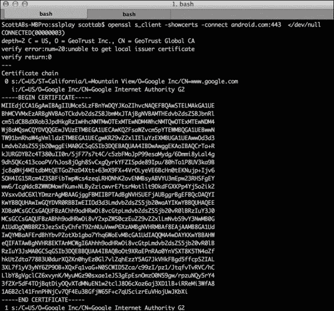

# 七、保护网络

在本章中，我们将介绍以下食谱:

*   正在验证自签名的 SSL 证书
*   使用 OnionKit 库中的 strong 信任管理器
*   SSL 锁定

# 简介

**安全套接字层** ( **SSL** )是客户端和服务器之间加密通信的核心部分之一。它在 T4 的主要部署是让网络浏览器对信息进行加密，并在网上交易中确定对第三方服务的信任程度，如购买 DVD 或网上银行。与网络浏览器不同，安卓应用的左上角没有挂锁图标，这提供了连接安全的视觉指示。不幸的是，应用开发人员跳过了这种验证。这一点在论文*Eve 和 Mallory 为什么爱安卓:安卓 SSL (In)安全分析*(http://www2 . dcsec . uni-hannover . de/files/Android/p50-fahl . pdf)中得到了强调。

在本章中，我们将了解在安卓系统上使用 SSL 的一些常见陷阱，特别是与自签名认证相关的陷阱。主要重点是如何使 SSL 变得更强，以帮助防范前一章中提到的一些漏洞。毕竟，安卓应用实际上是胖客户端。因此，与 web 浏览器相比，为什么不通过执行额外的验证和对我们信任的证书和证书根施加限制来利用额外的功能。

尽管超出了本书的范围，但 web 服务器的配置是有效网络安全的一大因素。应用几乎无能为力的常见载体包括 SSL 条带、会话劫持和跨站点请求伪造。但是，这些问题可以通过强大的服务器配置来缓解。为此，SSL 实验室最近发布了一份最佳实践文档，可在[https://www . ssllabs . com/downloads/SSL _ TLS _ Deployment _ Best _ Practices _ 1.3 . pdf](https://www.ssllabs.com/downloads/SSL_TLS_Deployment_Best_Practices_1.3.pdf)上获得。

# 验证自签名 SSL 证书

安卓支持使用带有标准安卓 API 组件的 SSL，如`HTTPClient`、`URLConnection`。然而，如果你试图连接到一个安全的 HTTPS 服务器网址，你可能会遇到一个`SSLHandshakeException`。常见的问题有:

*   颁发服务器 SSL 证书的证书颁发机构(CA)不包含在作为 Android 系统一部分的~130 个 CA 中，因此被视为未知
*   服务器 SSL 证书是自签名的
*   服务器没有配置中间 SSL 证书

如果服务器没有配置中间证书，只需安装它们就可以让连接代码验证信任根。但是，如果服务器使用的是自签名证书或 CA 颁发的证书，但是 CA 不被 Android 信任，那么我们需要定制 SSL 验证。

一种常见的做法是使用具有自签名 SSL 证书的服务器进行开发和测试，并且在实时环境中只使用付费的 CA 签名证书。因此，该方法特别侧重于鲁棒地验证自签名 SSL 证书。

## 做好准备

对于这个食谱，我们将将自签名 SSL 证书导入到应用中，为此，我们将运行一些终端命令。本节将介绍在您的计算机上下载 SSL 证书文件的工具和命令。

本食谱稍后需要最新版本的蹦跳城堡库来创建证书并将证书导入信任库。我们使用 Bouncy Castle，因为它是一个健壮的开源密码学库，安卓内置了对它的支持。你可以在[http://www.bouncycastle.org/latest_releases.html](http://www.bouncycastle.org/latest_releases.html)找到`bcprov.jar`文件。下载并保存到当前工作目录。对于这个食谱，我们已经将其保存到名为`libs`的本地目录中，因此引用`.jar`文件的路径是`/libs/bcprov-jdk15on-149.jar`(这是撰写本书时的最新版本)。

我们需要一个来自服务器的自签名 SSL 证书文件；如果您手动创建了您的配方或者已经有了它，您可以跳过这一部分的其余部分，转到配方。

要创建或下载 SSL 证书，我们需要利用名为 **OpenSSL** 的开源 SSL 工具包:

*   **Mac**–幸运的是，OpenSSL】从 10.2 版本开始就包含在 Mac OS X 上了。
*   **Linux**–许多 Linux 发行版都安装了预编译的 OpenSSL 包。如果没有，从[https://www.openssl.org/source/](https://www.openssl.org/source/)下载并构建源代码，或者如果你在 Ubuntu 上，应该是`apt-get install openssl`的情况。
*   **窗口**–从源代码构建或使用来自闪灯制作公司([http://slproweb.com/products/Win32OpenSSL.html](http://slproweb.com/products/Win32OpenSSL.html))的第三方提供的 Win32 安装程序。

要从终端窗口中的服务器获取证书，请键入以下命令，其中`server.domain`是 IP 地址或服务器名称:

```java
Openssl s_client -showcerts -connect server.domain:443 </dev/null.
```

证书详细信息将显示在控制台输出中。将定义好的证书复制粘贴到一个新文件中，从`-----BEGIN CERTIFICATE-----`开始，到`-----END CERTIFICATE-----`结束，保存为`mycert.crt`。重要的是不要包含任何额外的空格或尾随空格。

以下截图显示了`android.com`的 `Openssl –showcerts`命令示例:



如果您还没有服务器，并且想要创建一个新的自签名证书来使用，我们首先需要使用 OpenSSL 工具包生成一个 RSA 私钥。在终端窗口中键入以下内容:

```java
openssl genrsa –out my_private_key.pem 2048

```

这将创建私钥文件`my_private_key.pem`。下一步是使用上一步生成的私钥生成证书文件。在终端中，键入:

```java
openssl req -new -x509 -key my_private_key.pem -out mycert.crt -days 365

```

按照屏幕提示填写证书详细信息。请注意，常用名称通常是您的服务器 IP 地址或域名。

准备工作到此为止！下一部分我们应该有一个证书文件。

## 怎么做...

我们开始吧！

1.  You should have an SSL certificate in CRT/PEM encoded format, which when opened in, text editor, looks something like this:

    ```java
    -----BEGIN CERTIFICATE-----
    WgAwIBAgIDA1MHMA0GCSqGSIb3DQEBBQUAMDwxCzAJBgNVBAYTAlVTMRcwFQYDVQQK
    …
    -----END CERTIFICATE-----
    ```

    对于这个食谱，我们将使用名为`mycert.crt`的例子。

2.  为了将证书打包到应用中，我们创建证书并将其导入`.keystore`文件，我们将该文件称为我们应用的信任库。
3.  In a terminal window, set the `CLASSPATH` variable so that the following command can access the `bcprov.jar` file:

    ```java
    $export CLASSPATH=libs/bcprov-jdk15on-149.jar

    ```

    `bcprov-jdk15on-149.jar`文件前面的命令路径应该与`-providerpath`参数匹配。

4.  现在，使用以下`keytool`命令 :

    ```java
    $ keytool -import -v -trustcacerts -alias 0 /
    -file <(openssl x509 -in mycert.crt) /
    -keystore customtruststore.bks /
    -storetype BKS /
    -providerclass org.bouncycastle.jce.provider.BouncyCastleProvider /
    -providerpath libs/bcprov-jdk15on-149.jar 
    -storepass androidcookbook 

    ```

    创建并导入证书
5.  You should be prompted to trust the certificate, type `yes`:

    ```java
    Trust this certificate? [no]: yes

    ```

    输出文件为`customtruststore.bks`，添加了公共证书。信任库由密码`androidcookbook`保护，我们将在应用中加载信任库时在代码中引用该密码。我们将`–storetype`参数设置为`BKS`，这表示弹性城堡密钥库类型，也解释了`.bks`扩展。可以将多个证书导入您的信任库；例如，开发和测试服务器。

    ### 类型

    **密钥库和信任库的区别**

    虽然它们是同类型的文件(`.keystore`)，并且实际上可以是同一个文件，但是我们倾向于有单独的文件。我们使用术语**信任库** 来定义一组您期望与之通信的第三方公共证书。而密钥库是用于私钥的，应该存储在受保护的位置(也就是说，不在应用中)。

6.  Copy the truststore file into the `raw` folder of your Android app; if the folder doesn't exist, create it:

    `/res/raw/customtruststore.bks`

7.  Load the local truststore from the `raw` directory into a `KeyStore` object:

    ```java
    private static final String STORE_PASSWORD = "androidcookbook";

    private KeyStore loadKeyStore() throws Exception {
        final KeyStore keyStore = KeyStore.getInstance("BKS");
        final InputStream inputStream = context.getResources().openRawResource(
            R.raw.customtruststore);
        try {
          keyStore.load(inputStream, STORE_PASSWORD.toCharArray());
          return keyStore;
        } finally {
          inputStream.close();
        }
      }
    ```

    这里，我们创建一个类型为`BKS`(蹦跳城堡密钥库)的`KeyStore`类的实例，它与我们创建的类型相匹配。方便的是有一个`.load()`方法，取加载的`.bks`文件的输入流(`InputStream`)。您会注意到，我们使用与创建信任库时相同的密码来打开、验证和读取内容。密码的主要用途是验证信任库的完整性，而不是加强安全性。特别是因为信任库包含服务器的公共证书，所以硬编码并不是一个安全问题，因为证书很容易从网址访问。然而，让攻击者更难的是，它可能是 DexGuard 字符串加密的一个很好的候选，如[第 5 章](5.html#page "Chapter 5. Protecting Applications")、*保护应用*中所述。

8.  Extend `DefaultHttpClient` to use the local truststore:

    ```java
    public class LocalTrustStoreMyHttpClient extends DefaultHttpClient {

        @Override
        protected ClientConnectionManager createClientConnectionManager() {
          SchemeRegistry registry = new SchemeRegistry();
          registry.register(new Scheme("http", PlainSocketFactory
              .getSocketFactory(), 80));
          try {
            registry.register(new Scheme("https", new SSLSocketFactory(
                loadKeyStore()), 443));
          } catch (Exception e) {
            e.printStackTrace();
          }
          return new SingleClientConnManager(getParams(), registry);
        }
      }
    ```

    我们覆盖了`createClientConnectionManager`方法，这样我们就可以向本地信任库注册一个新的`SSLSocketFactory`接口。为了代码示例的简洁，这里我们捕获了异常，并将错误打印到系统日志中；但是，建议在实时代码中使用时实施适当的错误处理并减少记录的信息量。

9.  Write a sample HTTP `GET` request using `HttpClient`:

    ```java
      public HttpResponse httpClientRequestUsingLocalKeystore(Stringurl)
          throws ClientProtocolException, IOException {
        HttpClient httpClient = new MyHttpClient();
        HttpGet httpGet = new HttpGet(url);
        HttpResponse response = httpClient.execute(httpGet);
        return response;
      }
    ```

    这向我们展示了如何构造一个简单的 HTTP `GET`请求并使用`LocalTrustStoreMyHttpClient`类，它不会抛出`SSLHandshakeException`，因为来自服务器的自签名证书可以被成功验证。

### 类型

**明白了**

我们已经为所有 HTTPS 请求定义了明确的信任库。请记住，如果后端服务器证书被更改，应用将停止信任连接并抛出`SecurityException`。

这个食谱到此结束；我们可以与受 SSL 保护并使用我们自签名的 SSL 证书签名的互联网资源进行通信。

## 还有更多...

一般来说，在处理 SSL 时，一个常见的错误是捕捉和隐藏证书和安全异常。这正是攻击者用来欺骗不知情的应用用户的手段。您选择如何处理 SSL 错误是主观的，取决于应用。但是，阻止网络通信通常是确保数据不会通过潜在的受损信道传输的好方法。

### 在实时环境中使用自签名 SSL 证书

安卓应用开发者在编译/构建时知道他们交换的服务器是很常见的。他们甚至可以控制它们。如果您遵循这里提到的验证步骤，在实时环境中使用自签名证书就不会有安全问题。这样做的好处是，您可以使自己免受证书颁发机构的损害，并节省 SSL 证书续订费。

### http surlconnect

没有额外的安全优势，但你可能更喜欢使用`HttpsURLConnection`应用编程接口。为此，我们采用了一种稍微不同的方法，创建了一个定制的`TrustManager`类，它验证了我们的本地信任库文件:

1.  Create a custom `TrustManager` class:

    ```java
    public class LocalTrustStoreTrustManager implements X509TrustManager {

      private X509TrustManager mTrustManager;

      public LocalTrustStoreTrustManager(KeyStore localTrustStore) {
        try {
          TrustManagerFactory factory = TrustManagerFactory
              .getInstance(TrustManagerFactory.getDefaultAlgorithm());
          factory.init(localTrustStore);

          mTrustManager = findX509TrustManager(factory);
          if (mTrustManager == null) {
            throw new IllegalStateException(
                "Couldn't find X509TrustManager");
          }
        } catch (GeneralSecurityException e) {
          throw new RuntimeException(e);
        }
      }

      @Override
      public void checkClientTrusted(X509Certificate[] chain, String authType)
          throws CertificateException {
        mTrustManager.checkClientTrusted(chain, authType);
      }

      @Override
      public void checkServerTrusted(X509Certificate[] chain, String authType)
          throws CertificateException {
        mTrustManager.checkServerTrusted(chain, authType);
      }

      @Override
      public X509Certificate[] getAcceptedIssuers() {
        return mTrustManager.getAcceptedIssuers();
      }

      private X509TrustManager findX509TrustManager(TrustManagerFactory tmf) {
        TrustManager trustManagers[] = tmf.getTrustManagers();
        for (int i = 0; i < trustManagers.length; i++) {
          if (trustManagers[i] instanceof X509TrustManager) {
            return (X509TrustManager) trustManagers[i];
          }
        }
        return null;
      }

    }
    ```

    我们实现了`X509TrustManager`接口，并且我们的`LocalTrustStoreTrustManager`类的构造函数采用了一个`KeyStore`对象，我们在配方前面定义的上一步中加载了这个对象。如前所述，这个`KeyStore`对象被称为我们的信任库，因为它包含我们信任的证书。我们用信任库初始化`TrustManagerFactory`类，然后使用`findX509TrustManager()`方法，我们得到了`X509TrustManager`接口的系统特定实现。然后我们保留对这个`TrustManager`的引用，它使用我们的信任库来验证来自连接的证书是否可信，而不是使用系统信任库。

2.  Here is an example of an HTTP `GET` request using `HttpsURLConnection` and the custom `TrustManager` class created in the previous step:

    ```java
      public InputStream uRLConnectionRequestLocalTruststore(String targetUrl)
          throws Exception {
        URL url = new URL(targetUrl);

        SSLContext sc = SSLContext.getInstance("TLS");
        sc.init(null, new TrustManager[] { new LocalTrustStoreTrustManager(
            loadKeyStore()) }, new SecureRandom());
        HttpsURLConnection.setDefaultSSLSocketFactory(sc.getSocketFactory());

        HttpsURLConnection urlHttpsConnection = (HttpsURLConnection) url.openConnection();
        urlHttpsConnection.setRequestMethod("GET");
        urlHttpsConnection.connect();
        return urlHttpsConnection.getInputStream();
      }
    ```

    我们用`LocalTrustStoreTrustManager`类初始化`SSLContext`，这样当我们调用`sc.getSocketFactory()`时，它将使用我们的`TrustManager`实现。这是通过使用`setDefaultSSLSocketFactory()`覆盖默认设置在`HttpsURLConnection`上设置的。这就是您使用`URLConnection`成功连接到我们的自签名 SSL 资源所需的全部内容。

### 反模式——什么不该做！

这是一个反模式，不幸的是，当开发人员试图使用由不受信任的证书颁发机构签署的自签名证书或 SSL 证书时，它会发布在各种论坛和留言板上。

这里，我们看到了`X509TrustManager`接口的一个不安全的实现:

```java
public class TrustAllX509TrustManager implements X509TrustManager {

  @Override
  public void checkClientTrusted(X509Certificate[] chain, String authType)
      throws CertificateException {
    // do nothing, trust all :(
  }

  @Override
  public void checkServerTrusted(X509Certificate[] chain, String authType)
      throws CertificateException {
    // do nothing, trust all :( 
  }

  @Override
  public X509Certificate[] getAcceptedIssuers() {
    return null;
  }
}
```

从代码中可以看出，`checkServerTrusted`方法没有实现验证，所有服务器都是可信的。这使得 HTTPS 通信公司面临中间人(MITM)攻击，这就违背了使用证书的全部意义。

## 另见

*   本章后面的 *SSL 锁定*方法显示了一种类似的方法来增强 SSL 连接的验证
*   [安卓培训文档中的*安全与 HTTPS 和 SSL* 页面](https://developer.android.com/training/articles/security-ssl.html)
*   http://www.bouncycastle.org/latest_releases.html 的弹性城堡 Java 加密应用编程接口
*   [安卓开发者参考指南中的*https://developer . Android . com/reference/javax/net/SSL/https rlconnection . html*](https://developer.android.com/reference/javax/net/ssl/HttpsURLConnection.html)页面
*   [安卓开发者参考指南中的 *SSLSocketFactory* 页面](https://developer.android.com/reference/javax/net/ssl/SSLSocketFactory.html)

# 使用 OnionKit 库中的 strong 信任管理器

在这个食谱中，我们将利用守护者项目的人们的伟大工作来增强我们的应用所做的 SSL 连接的验证。具体来说，我们要利用`StrongTrustManager`。

## 做好准备

OnionKit 是作为安卓库项目分发的。在我们开始这个食谱之前，从 GitHub 页面([https://github.com/guardianproject/OnionKit](https://github.com/guardianproject/OnionKit))下载 OnionKit 库。

然后，像添加任何其他安卓库项目一样，提取并添加到您的项目中。

## 怎么做...

我们开始吧！

1.  Integrating the `StrongTustManager` class couldn't be simpler. It is just a case of swapping out your `HttpClient` implementation. Hence, change the following code:

    ```java
    public HttpResponse sampleRequest() throws Exception {
        HttpClient httpclient = new DefaultHttpClient();
        HttpGet httpget = new HttpGet("https://server.com/path?apikey=123");
        HttpResponse response = httpclient.execute(httpget);
        return response;
    }
    ```

    对此:

    ```java
    public HttpResponse strongSampleRequest() throws Exception {
        StrongHttpsClient httpclient = new StrongHttpsClient(context);
        ch.boye.httpclientandroidlib.client.methods.HttpGet httpget = new HttpGet(
            "https://server.com/path?apikey=123");
        HttpResponse response = httpclient.execute();
        return response;
      }
    ```

    在您的代码中，将的导入从`org.apache.http.*`更改为`ch.boye.httpclientandroidlib.*`。OnionKit 使用的`HttpGet`和`HttpResponse`对象来自另一个名为`httpclientandroidlib`的库(也包含在 OnionKit 中)。`httpclientandroidlib`是针对 Android 的`HttpClient` 4.2.3 的重新打包，包括对 Android SDK 中包含的标准`HttpClient`库的更新和 bug 修复。

2.  Enable the notifications:

    ```java
    httpclient.getStrongTrustManager().setNotifyVerificationFail(true)
    ```

    这是一个有用的功能，用于通知用户验证有问题，以及他们当前连接的互联网资源不安全。

3.  Enable the full verification of the certificate chain:

    ```java
    httpclient.getStrongTrustManager().setVerifyChain(true);
    ```

    启用`verifyChain`可确保在建立 HTTPS 连接时调用`TrustManager.checkServerTrusted server(…)`方法时，整个证书链都得到验证。默认情况下，此设置处于启用状态。

4.  Enable checking for weak cryptographic algorithms:

    ```java
    httpclient.getStrongTrustManager().setCheckChainCrypto(true);
    ```

    这将检查证书链中颁发者使用 MD5 算法的情况，MD5 算法被认为是弱的，应该避免。默认情况下，此设置处于启用状态。

## 还有更多...

在本章中，我们使用了`HttpClient`API；你可能会想，为什么自从`HttpClient` API 在 Android 中被弃用之后。澄清一下，由于存在一些缺陷，谷歌不赞成使用安卓软件开发工具包中包含的`HttpClient`版本。谷歌目前建议改用`URLConnection`。然而，如前所述，OnionKit 使用了单独的、更新的和固定版本的`HttpClient` API 库，因此不应该被认为是不推荐使用的。

### 奥波特和托尔网络

Tor 项目是洋葱路由的免费实现，它提供了互联网匿名性和对流量监控的抵抗力。 Orbot 是一款免费的安卓应用，专门为其他安卓应用提供代理使用。

OnionKit 的另一个关键特性是允许你的应用通过 Orbot 代理连接到互联网，从而匿名化它的互联网流量。

`OrbotHelper`类帮助确定是否安装并运行了 Orbot 应用，并提供了启动和使用它的方便方法。

### 锁定和取消锁定

当与另一个名为 **的守护项目库一起使用时，`StrongTrustManager`类通过限制可信根证书颁发机构来提供一些有限的证书锁定。**

我们将在下一章中更详细地讨论 SSL 锁定，并创建我们自己的`TrustManager`类来专门锁定我们的 SSL 证书链，该证书链适用于 CA 和自签名证书。

## 另见

*   [https://guardianproject.info/code/onionkit/](https://guardianproject.info/code/onionkit/)的安卓文章
*   https://play.google.com/store/apps/details?[的*欧宝:Tor* 安卓应用代理 id=org.torproject.android](https://play.google.com/store/apps/details?id=org.torproject.android)
*   OnionKit 项目([https://code.google.com/p/httpclientandroidlib/](https://code.google.com/p/httpclientandroidlib/))使用的安卓 HttpClient 4.2.3 的重新打包
*   CACert 项目，用于在[https://github.com/guardianproject/cacert](https://github.com/guardianproject/cacert)限制可信根 ca

# SSL 钉扎

需要一个证书颁发机构来解决常规网络客户端(如网络浏览器、即时消息和电子邮件客户端)中的密钥分发问题。他们需要与许多服务器通信，而应用开发人员事先并不知道这些服务器。正如我们在前面的食谱中所讨论的，知道应用正在与之通信的后端服务器或服务是很常见的，因此限制其他 CA 根是明智的。

安卓目前信任大约 130 个 ca，不同制造商和版本之间略有不同。它还限制了其他 CA 根，增强了连接的安全性。如果其中一个 CA 被泄露，攻击者可以使用泄露的 CA 的根证书来为我们服务器的域签名和颁发新证书。在这种情况下，攻击者可以在我们的应用上完成**【MITM】**攻击。这是因为标准的 HTTPS 客户端验证会将新证书识别为可信的。

SSL 锁定是限制信任谁的一种方式，通常有以下两种方式:

*   证书锁定
*   公钥锁定

很像我们在本章的*验证自签名 SSL 证书*方法中所实现的，证书锁定将可信证书的数量限制在本地信任库中。使用证书颁发机构时，您可以将服务器的 SSL 证书加上证书的根签名和任何中间证书包含到您的本地信任库中。这允许整个证书链的完全验证；因此，当受损的 CA 签署新证书时，这些证书将无法通过本地信任库的验证。

公钥锁定遵循相同的思想，但是实现起来稍微困难一些。还有一个额外的步骤是从 SSL 证书中提取公钥，而不仅仅是将证书捆绑在应用中。然而，额外的努力是值得的，因为公钥在证书续订之间保持一致。这意味着当 SSL 证书被续订时，没有必要强制用户升级应用。

在这个配方中，我们将使用[Android.com](http://Android.com)作为例子来锁定几个证书公钥。食谱由两个不同的部分组成；第一个是一个独立的 Java 实用程序，用于处理和获取链中所有 SSL 证书的公钥，并将它们转换为 SHA1 哈希，以嵌入/pin 到您的应用中。我们嵌入公钥的 SHA1 散列，因为它更安全。

第二部分涉及应用代码以及如何在运行时验证 pin，并决定特定的 SSL 连接是否可信。

## 怎么做...

我们开始吧！

1.  我们将创建一个名为`CalcPins.java`的独立 Java 文件，我们将在命令行上运行该文件来连接和打印证书公钥的 SHA1 哈希。由于我们处理的是由 CA 签署的证书，因此链中会有两个或多个证书。这第一步主要是初始化和编码，以将参数传递给`fetchAndPrintPinHashs`方法 :

    ```java
    public class CalcPins {

      private MessageDigest digest;

      public CalcPins() throws Exception {
        digest = MessageDigest.getInstance("SHA1");
      }

      public static void main(String[] args) {
        if ((args.length == 1) || (args.length == 2)) {
          String[] hostAndPort = args[0].split(":");
          String host = hostAndPort[0];
          // if port blank assume 443
          int port = (hostAndPort.length == 1) ? 443 : Integer
              .parseInt(hostAndPort[1]);

          try {
            CalcPins calc = new CalcPins();
            calc.fetchAndPrintPinHashs(host, port);
          } catch (Exception e) {
            e.printStackTrace();
          }
        } else {
          System.out.println("Usage: java CalcPins <host>[:port]");
          return;
        }
      }
    ```

2.  接下来，我们定义`PublicKeyExtractingTrustManager`类，它实际上是提取公钥。`checkServerTrusted`方法将用`X509Certificates`的全链调用，当插座连接时，这将在后面的步骤中显示。我们取链(即`X509Certificate[]`数组)并调用`cert.getPublicKey().getEncoded();`为每个公钥获取一个字节数组。然后，我们使用`MessageDigest`类来计算密钥的 SHA1 散列。由于这是一个简单的控制台应用，我们将 SHA1 散列打印到`System.out` :

    ```java
    public class PublicKeyExtractingTrustManager implements X509TrustManager {

        public X509Certificate[] getAcceptedIssuers() {
          throw new UnsupportedOperationException();
        }

        public void checkClientTrusted(X509Certificate[] chain, String authType)
            throws CertificateException {
          throw new UnsupportedOperationException();
        }

        public void checkServerTrusted(X509Certificate[] chain, String authType)
            throws CertificateException {
          for (X509Certificate cert : chain) {
            byte[] pubKey = cert.getPublicKey().getEncoded();
            final byte[] hash = digest.digest(pubKey);
            System.out.println(bytesToHex(hash));
          }
        }
      }
    ```

3.  Then, we write the `bytesToHex()` utility method as follows:

    ```java
    public static String bytesToHex(byte[] bytes) {
        final char[] hexArray = { '0', '1', '2', '3', '4', '5', '6', '7', '8','9', 'A', 'B', 'C', 'D', 'E', 'F' };
        char[] hexChars = new char[bytes.length * 2];
        int v;
        for (int j = 0; j < bytes.length; j++) {
          v = bytes[j] & 0xFF;
          hexChars[j * 2] = hexArray[v >>> 4];
          hexChars[j * 2 + 1] = hexArray[v & 0x0F];
        }
        return new String(hexChars);
      }
    ```

    在打印到`System.out`之前，我们使用一个实用方法将字节数组转换成大写的十六进制字符串，以便它们可以嵌入到我们的安卓应用中。

4.  Finally, we use the host and port that was passed from the `main` method to open a `SSLSocket` connection to the host:

    ```java
    private void fetchAndPrintPinHashs(String host, int port) throws Exception {
        SSLContext context = SSLContext.getInstance("TLS");
        PublicKeyExtractingTrustManager tm = new PublicKeyExtractingTrustManager();
        context.init(null, new TrustManager[] { tm }, null);
        SSLSocketFactory factory = context.getSocketFactory();
        SSLSocket socket = (SSLSocket) factory.createSocket(host, port);
        socket.setSoTimeout(10000);
        socket.startHandshake();
        socket.close();
      }
    ```

    我们用自定义的`PublicKeyExtractingTrustManager`类初始化`SSLContext`对象，然后将每个证书的公钥散列打印到控制台，准备嵌入安卓应用。

5.  From the terminal window, compile `CalcPins.java` with the `javac` and `run` commands using `java` with `hostname:port` as a command-line argument. The sample uses `Android.com` as an example host:

    ```java
    $ javac CalcPins.java 
    $ java -cp . CalcPins Android.com:443

    ```

    但是，您可能会发现在 IDE 中将`CalcPins.java`创建为简单的 Java 项目，然后将其导出为可运行的`.jar`文件更容易。

    可运行`.jar`的示例终端命令如下:

    ```java
    $ java -jar calcpins.jar android.com:443

    ```

    如果公共密钥提取工作，您将看到哈希的输出。此示例输出显示了`Android.com`主机的三个 SSL 证书公钥的引脚:

    ```java
    B3A3B5195E7C0D39B8FA68D41A64780F79FD4EE9
    43DAD630EE53F8A980CA6EFD85F46AA37990E0EA
    C07A98688D89FBAB05640C117DAA7D65B8CACC4E

    ```

    现在，我们进入配方的第二部分，在我们的安卓应用项目中验证 SSL 连接。

6.  现在我们有了引脚，我们从终端复制它们，并将其嵌入到一个`String`数组中:

    ```java
    private static String[] pins = new String[] {
          "B3A3B5195E7C0D39B8FA68D41A64780F79FD4EE9",
          "43DAD630EE53F8A980CA6EFD85F46AA37990E0EA",
          "C07A98688D89FBAB05640C117DAA7D65B8CACC4E" };
    ```

7.  Implement a custom `TrustManager` class that validates the pins:

    ```java
    public class PubKeyPinningTrustManager implements X509TrustManager {

      private final String[] mPins;
      private final MessageDigest mDigest;

      public PubKeyPinningTrustManager(String[] pins)
          throws GeneralSecurityException {
        this.mPins = pins;
        mDigest = MessageDigest.getInstance("SHA1");
      }

      @Override
      public void checkServerTrusted(X509Certificate[] chain, String authType)
          throws CertificateException {
        // validate all the pins
        for (X509Certificate cert : chain) {
          final boolean expected = validateCertificatePin(cert);
          if (!expected) {
            throw new CertificateException("could not find a validpin");
          }
        }
      }

      @Override
      public void checkClientTrusted(X509Certificate[] chain, String authType)
          throws CertificateException {
        // we are validated the server and so this is not implemented.
        throw new CertificateException("Cilent valdation not implemented");
      }

      @Override
      public X509Certificate[] getAcceptedIssuers() {
        return null;
      }
    ```

    `PubKeyPinningTrustManager`构造器是用引脚数组构造的，用于内部验证。还创建了一个`MessageDigest`实例来生成传入 SSL 证书公钥的 SHA1 哈希。注意，对于这个例子，我们没有执行 `checkClientTrusted()`或`getAcceptedIssuers()`方法；参见*增强功能*部分。

8.  Validate the certificate:

    ```java
    private boolean validateCertificatePin(X509Certificate certificate)
          throws CertificateException {
        final byte[] pubKeyInfo = certificate.getPublicKey().getEncoded();
        final byte[] pin = mDigest.digest(pubKeyInfo);
        final String pinAsHex = bytesToHex(pin);
        for (String validPin : mPins) {
          if (validPin.equalsIgnoreCase(pinAsHex)) {
            return true;
          }
        }
        return false;
      }
    ```

    我们提取公钥并计算 SHA1 哈希，然后使用前面提到的 `bytesToHex()`方法转换成十六进制字符串。然后，验证可以归结为一个简单的`String.isEquals`操作(实际上，我们使用`equalsIgnoreCase`以防出现案例不匹配)。如果证书中的引脚与其中一个嵌入引脚不匹配，则会抛出`CertificateException`并不允许连接。

9.  我们可以像本章前面讨论的`LocalTrustStoreTrustManager`类一样整合`PubKeyPinningTrustManager`。这是一个与`HttpsURLConnection` :

    ```java
    TrustManager[] trustManagers = new TrustManager[] { new PubKeyPinningTrustManager(pins) };
        SSLContext sslContext = SSLContext.getInstance("TLS");
        sslContext.init(null, trustManagers, null);
        HttpsURLConnection urlConnection = (HttpsURLConnection)url.openConnection();
        urlConnection.setSSLSocketFactory(sslContext.getSocketFactory());
        urlConnection.connect();
    ```

    一起使用的例子

总之，我们提取了证书公钥，并生成了 SHA1 哈希嵌入到我们的应用中。在运行时使用这些来验证 SSL 连接的 SSL 证书的公钥。这不仅可以防止其他核证机关遭到破坏，也让 MITM 袭击者的处境更加艰难。最棒的是，我们使用的是行业标准的 SSL 基础设施，只是方式严格。

## 还有更多...

重要的是要了解这个配方可以改进的地方和局限性在哪里。

### 增强功能

为了获得最大的安全性，每次进行服务器连接时，都应该验证 SSL pins。但是，每个连接的性能有一个折衷；因此，您可以修改之前的代码来检查每个会话的前几个连接。虽然，这显然包括安全。此外，包括安卓的默认信任管理器验证将进一步提高安全性。由*莫邪·马林斯派克*开发的名为 **和**的开源库已经实现了这些增强功能。您还可以将哈希算法更改为更强版本的 SHA。

如[第 5 章](5.html#page "Chapter 5. Protecting Applications")、*保护应用*所述，`validateCertificatePin`方法是 DexGuard 的 API 隐藏的理想选择。

### 限制

虽然 SSL 锁定使 MITM 攻击者更加困难，但它不是 100%的解决方案(不是说任何安全解决方案都是 100%)。iSECPartners 有一个有趣的库，它旨在绕过牵制([https://github.com/iSECPartners/android-ssl-bypass](https://github.com/iSECPartners/android-ssl-bypass))。

然而，在[第 5 章](5.html#page "Chapter 5. Protecting Applications")、*保护应用*中提到的抗脾气食谱可以用来减轻`.apk`修改和在仿真器上运行的能力。

## 另见

*   了解更多关于 https://www.owasp.org/index.php/Man-in-the-middle_attack MITM 袭击的信息
*   *OpenSSL 命令行操作指南可在[http://www.madboa.com/geek/openssl/](http://www.madboa.com/geek/openssl/)获得*
*   *OWASP 证书和公钥锁定*指南可在[网站获得](https://www.owasp.org/index.php/Certificate_and_Public_Key_Pinning)
*   安卓钉住项目是一个由莫邪马林斯派克开发的开源钉住库，可在 https://github.com/moxie0/AndroidPinning 的 T2 获得
*   谷歌 Chrome 使用图钉，这在[https://www.imperialviolet.org/2011/05/04/pinning.html](https://www.imperialviolet.org/2011/05/04/pinning.html)有解释