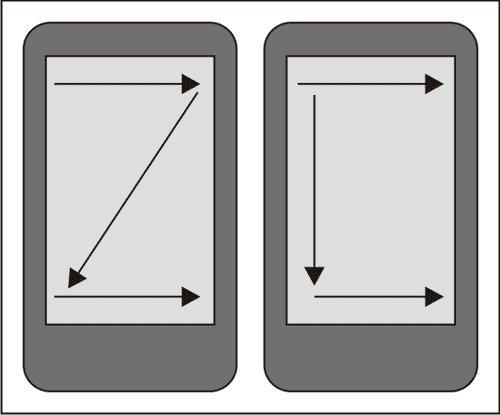
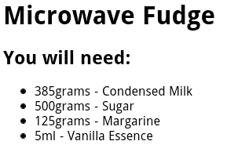
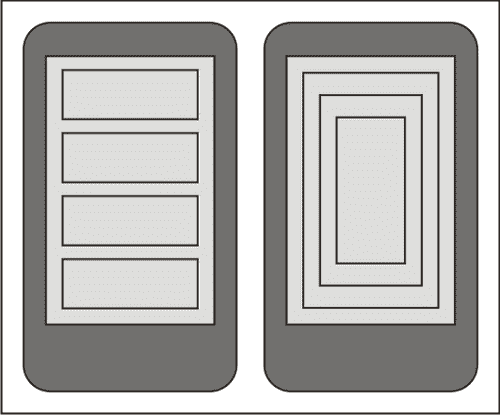
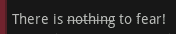
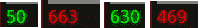

# 八、设计以内容为中心的活动

*当你有很多数据要显示给用户，你需要一个内容展示`Activity`。通常，这种类型的活动是以内容为中心的。以内容为中心的`Activity`的主要目的是给用户尽可能多的信息，同时又不会让他们不堪重负。这是执行某种搜索或呈现任何类型的专门信息的应用的常见要求。*

购物和相关的电子商务应用是以内容为中心的应用的理想示例。设计中的大部分工作都致力于展示销售产品的信息。如果用户找不到他们正在寻找的产品的信息，他们会去别的地方寻找。因此，产品展示不仅要有吸引力和易用性，而且要提供尽可能多的信息，不要含糊或杂乱。

以内容为中心的布局的另一个例子是社交网络应用中的用户简档页面。人们通常对自己有很多话要说，如果他们不说，别人也会经常说他们很多。这些应用不仅有大量信息要呈现给用户，而且这些信息在质量和相关性方面差异很大。仅仅因为一个用户认为某件事很重要，并不意味着下一个人会。在这种情况下，拥有一个可以根据用户偏好定制的界面也非常重要(通常只是通过重新组织信息显示的顺序)，并且还能够将用户的注意力吸引到他们可能感兴趣的新信息或领域。

吸引用户注意力的好方法的一个很好的例子是在聊天应用中。如果用户已经向上滚动，他/她可能正在阅读几分钟前所说的内容。如果有新的信息到达，直接滚动到新的信息是非常不礼貌的，因为他们很可能还在阅读。通知他们新消息的音频音是一个常见的选项，但也会将其他人的注意力吸引到用户身上(毕竟这是一个移动设备)。最好的选择是在屏幕底部有一个小的动画图标，可能是彩色编码的，告诉用户信息的相关性(如果有的话)。这样的图标也可以是一个交互元素，允许用户触摸它，以便自动滚动到最近发布的消息。这种思维在设计任何应用时都很重要，但在构建以内容为中心的应用时，在设计中加入一些额外的想法更为关键。

在本章中，我们将探讨向用户显示内容时要考虑的不同方面，以及开发内容屏幕的不同方式。具体来说，我们将探索:

*   在安卓系统上设计内容显示时的思维过程
*   用户如何使用和查看内容屏幕
*   使用`WebView`类显示内容
*   构建用于显示内容的本机布局
*   安卓系统中的文本格式和样式
*   将注意力吸引到屏幕的特定区域

# 在安卓设备上显示内容时考虑设计选项

以内容为中心的`Activity`与网页有很大的相似之处，但是有一些人们在创建网页时没有考虑到的关键设计因素。例如，触摸屏设备通常没有软件指针，因此没有任何“翻转”的概念。然而，许多网页是使用光标滚动来驱动从链接突出显示到菜单的一切。

当设计一个以内容为中心的`Activity`时，你会想要仔细考虑你的设计的美学。屏幕应该避免混乱，因为许多元素可能是交互式的，当用户被触摸时，会向用户呈现附加信息。同时，您应该尽量减少滚动的需要，尤其是水平滚动。保持信息简洁的需要通常是促使更多元素互动的动力。如前几章所述，最好考虑在可能的情况下使用图标而不是文本，并按照对用户的重要性来组织信息。

还要记住屏幕尺寸是会变化的。一些设备具有大量像素(例如各种安卓平板电脑)，而另一些设备具有微小的 3.5 英寸屏幕。出于这个原因，重要的是要考虑到，虽然有些人能够在一个屏幕上看到所有呈现的信息，但其他人将获得三个或四个屏幕的内容，以获得相同数量的信息。

在使用安卓应用时，网页是快速、轻松地组合以内容为中心的布局的好方法。它的优势是拥有来自 WebKit 的强大的 HTML 和 CSS 支持，并且易于与应用的其他部分集成。它也可以由一个现有的网页设计者来处理，或者如果你的应用连接到一个基于网络的系统，甚至只显示一个网页。

然而，网页(在某种程度上)受限于 HTML 和 CSS 中规定的布局结构。虽然这些在某种程度上非常灵活，但是如果您不习惯构建基于网络的系统，即使只针对单个渲染引擎(在安卓的情况下:WebKit)，HTML 和 CSS 布局开发也可能是一个乏味且令人沮丧的过程。当涉及到动画和类似的结构时，您会进一步受到 HTML 呈现引擎性能的限制，无论是使用 JavaScript 还是 CSS3 动画。

## 考虑用户行为

与任何类型的用户界面一样，了解您的用户行为以及他们将如何与您提供给他们的屏幕交互非常重要。在大量内容信息的背景下，理解什么信息是重要的，以及用户将如何阅读和吸收这些信息是很重要的。

虽然您可能希望将注意力吸引到选定的信息(如价格)，但运行循环动画来更改该元素的颜色会分散用户对屏幕上其他信息的注意力。但是，简单地更改字体、将数据放入框中或更改文本颜色也可以达到预期的效果。考虑用户将如何与屏幕交互也很重要。在触摸屏设备上，用户可以并且将触摸屏幕的几乎每个部分。他们还会拖动看起来可移动的项目，如果内容似乎超过了屏幕长度，还会使用滚动手势。

大多数人用同样的方式扫描信息。当用户第一次看到一个屏幕，或者屏幕上有很多信息时，他们的大脑或多或少会以同样的方式阅读这些信息。以下是用户在屏幕上扫描重要信息时眼睛将遵循的各种运动模式的图示。



你通常希望确保重要的信息在一个箭头与另一个箭头相交的区域。最重要的区域是用户通常开始阅读的角落。对于大多数西方用户来说，这是屏幕的左上角，而亚洲和阿拉伯用户通常会从右上角开始。

### 注

设计内容屏幕时，考虑让这些区域的信息比正常情况下突出一点。这将产生一个“逗留”时间，用户的眼睛通常会比正常情况下更长一点地聚焦在该区域。这就是为什么我们通常在网页的左上角放一个标志。

### 吸引用户注意力

几乎总是有些信息比其他信息更重要。你希望你的用户能够尽快挑选出重要的信息，并继续他们正在做的事情。一旦一个人熟悉了你的申请，他们很可能会完全停止阅读细则。这是一件好事，你让用户继续他们的生活，从而帮助他们更好地利用你的应用。

当你需要引起对特定信息的注意时，比如产品的名称或价格，利用 `TextView`类提供的广泛选项是个好主意。简单地改变一件物品的颜色就能让它在用户面前脱颖而出。如果需要更进一步，可以考虑添加阴影，或者将内容放在“高亮框”中。正如我们已经在[第 7 章](07.html "Chapter 7. Animating Widgets and Layouts")、*中讨论的，动画小部件和布局*也可以用来吸引用户界面特定区域的注意力。一个简单的“眨眼”动画(由淡出和淡入动画组成)可以用来吸引用户对变化的注意。

### 类型

**更具体的例子:钱**

如果你向你的用户出售一些东西，并允许他们在不同的运输方式和包装选择之间进行选择，总价格将根据他们的选择而变化。用粗体显示总量，确保总量突出。当价格更新时，在一系列“中间”价格之间循环，这样总价格就会以图形方式“向上计数”或“向下计数”到其新值。

仔细考虑您想要在用户界面中使用的小部件。代替使用普通的`TextView`，你可能想要在`TextSwitcher`中放置一块通常是单个字段的东西(或类似的东西)，以允许你激活单个单词或值。

# 用网络视图类显示内容

`WebView`类(在 `android.webkit`包中)通常是以内容为中心的设计的合理选择，并且相对于构建用户界面和普通的安卓 XML 布局资源，它有一些非常重要的优势。`WebView`类为您提供了一个单一的点，您可以将所有内容放在一个屏幕上，它处理自己的所有历史和滚动，使您的代码非常容易编写。

当显示需要复杂布局和/或大量文本内容(可能需要标记)的内容时，`WebView`类是一个非常有利的选项。内置了对 HTML 和 CSS 标记的支持，它减少了您在屏幕上需要的小部件的数量。考虑到安卓使用网络工具包作为渲染引擎，你也有许多可用的 CSS3 结构(比如 CSS 动画)。虽然`WebView`通常用于类似网络应用的浏览器，其中超链接非常重要，但您也可以轻松地为其提供不包含链接的本地内容。您还可以拦截链接请求，以允许导航到应用的其他部分。

一般来说，当使用`WebView`结构时，你需要一些方法来生成你将要显示的内容。与在布局资源中构建用户界面相反，在布局资源中，您可以简单地标识需要向其中注入动态内容的各种`View`对象。也就是说，一个完整的模板引擎通常比 XML 布局和 Java 代码的混合更容易使用，尽管实现的容易程度很大程度上取决于您可用的技能和您需要在屏幕上显示的信息类型。

## 使用网络视图对象

为了使用`WebView`并给出如何使用它来呈现大量内容的更具体的例子，我们将构建一个`Activity`来在屏幕上显示食物配方。对于这个例子，我们将对实际的配方和布局代码进行硬编码，以生成 HTML。实际上，您可能希望使用模板引擎，如速度/自由标记或 XSLT 来生成 HTML 代码。

# 行动时间–创建配方查看器应用

您会注意到下面的例子没有使用 XML 布局资源，而是用 Java 创建了整个`Activity`。在这个例子中，我们使用一个`Recipe`对象将 HTML 代码生成一个`StringBuilder`进行显示。这是一个简单但有效的实现。但是，如果需要改变配方的外观和感觉，就需要修改 Java 代码。

1.  创建一个包含配方阅读器应用的新项目:

    ```java
    android create project -n RecipeViewer -p RecipeViewer -k com.packtpub.viewrecipe -a ViewRecipeActivity -t 3
    ```

2.  在新应用的根包中创建一个新的`Ingredient.java`源文件来保存单个所需成分的信息，并在编辑器或 IDE 中打开这个新文件。
3.  声明配方所需的`name`、`amount`和`unit`字段:

    ```java
    private final String name;
    private final double amount;
    private final String unit;
    ```

4.  创建一个构造函数来获取参数并将其分配给字段:

    ```java
    public Ingredient(
            String name,
            double amount,
            String unit) {
        this.name = name;
        this.amount = amount;
        this.unit = unit;
    }
    ```

5.  为每个字段创建一个 getter 方法:

    ```java
    public double getAmount() {
        return amount;
    }

    // . . .
    ```

6.  在项目的根包中，创建一个名为`Recipe.java`的新源文件来包含单个配方，并在您的编辑器或 IDE 中打开它。
7.  为`Recipe`对象的名称声明一个字段:

    ```java
    private final String name;
    ```

8.  声明另一个字段包含此`Recipe`所需的成分列表。我们将这些存储为一组`Ingredient`对象:

    ```java
    private final Ingredient[] ingredients;
    ```

9.  然后声明一个`String`对象数组，该数组将包含`Recipe`需要遵循的指令列表:

    ```java
    private final String[] instructions;
    ```

10.  创建一个构造函数来接受字段数据并将其分配存储:

    ```java
    public Recipe(
            String name,
            Ingredient[] ingredients,
            String[] instructions) {
        this.name = name;
        this.ingredients = ingredients;
        this.instructions = instructions;
    }
    ```

11.  为三个字段创建一个 getter 方法:

    ```java
    public Ingredient[] getIngredients() {
        return ingredients;
    }

    // . . .
    ```

12.  在这个例子中，`Recipe`类负责生成 HTML。申报名为`toHtml`的新方法:

    ```java
    public String toHtml() {
    ```

13.  创建一个`DecimalFormat`对象来处理卷的格式:

    ```java
    DecimalFormat format = new DecimalFormat("0.##");
    ```

14.  创建一个新的`StringBuilder`对象，将 HTML 构建到:

    ```java
    StringBuilder s = new StringBuilder();
    ```

15.  追加 HTML 标题:

    ```java
    s.append("<html>").append("<body>");
    ```

16.  添加一个一级标题元素，其配方名称为:

    ```java
    s.append("<h1>").append(getName()).append("</h1>");
    ```

17.  追加二级表头元素，打开`ingredients`部分:

    ```java
    s.append("<h2>You will need:</h2>");
    ```

18.  打开一个无序列表，列出食谱所需的成分:

    ```java
    s.append("<ul class=\"ingredients\">");
    ```

19.  对于每个`Ingredient`对象，打开新配料的列表项:

    ```java
    for(Ingredient i : getIngredients()) {
        s.append("<li>");
    ```

20.  在格式化后将配料的数量添加到`StringBuilder`中，并声明`DecimalFormat`:

    ```java
    s.append(format.format(i.getAmount()));
    ```

21.  然后添加成分的测量单位:

    ```java
    s.append(i.getUnit());
    ```

22.  现在在`StringBuilder`后面加上配料的名称，关闭`ingredient`列表项:

    ```java
    s.append(" - ").append(i.getName());
    s.append("</li>");
    ```

23.  关闭 for 循环后，关闭无序列表:

    ```java
    s.append("</ul>");
    ```

24.  创建第二个杠杆头，打开配方的`Instructions`部分:

    ```java
    s.append("<h2>Instructions:</h2>");
    ```

25.  打开另一个无序列表，将配方说明渲染到:

    ```java
    s.append("<ul class=\"instructions\">");
    ```

26.  在指令数组上使用 for-each 循环，将它们呈现到`StringBuilder` :

    ```java
    for(String i : getInstructions()) {
        s.append("<li>").append(i).append("</li>");
    }
    ```

    中的无序列表结构中
27.  关闭无序列表和 HTML 标题，返回`StringBuilder`对象的`String`内容:

    ```java
    s.append("</ul>");
    s.append("</body>").append("</html>");
    return s.toString();
    ```

28.  在编辑器或 IDE 中打开`ViewRecipeActivity` Java 源代码。
29.  在`onCreate`方法中，直接调用`super.onCreate`后，创建一个新的`WebView`对象，传递`this`给它作为它的`Context` :

    ```java
    WebView view = new WebView(this);
    ```

30.  将`WebView LayoutParams`设置为占用所有可用的屏幕空间，因为`WebView`(很像`ListView`)具有内置的滚动功能:

    ```java
    view.setLayoutParams(new LayoutParams(
            LayoutParams.FILL_PARENT,
            LayoutParams.FILL_PARENT));
    ```

31.  创建一个`Recipe`对象显示在`WebView`中，完整的配方在这个示例部分的末尾:

    ```java
    Recipe recipe = new Recipe(
            "Microwave Fudge",
            // . . .
    ```

32.  将`Recipe`对象生成的 HTML 内容加载到`WebView` :

    ```java
    view.loadData(recipe.toHtml(), "text/html", "UTF-8");
    ```

33.  将`Activity`的内容视图设置为我们创建的`WebView`对象:

    ```java
    setContentView(view);
    ```

## *刚刚发生了什么？*

配方查看器示例显示了一个简单的结构，可以通过多种不同的方式进行扩展，以易于使用的格式向用户呈现大量信息。由于`WebView`与 HTML 一起工作的事实，它使得呈现非交互的信息列表比使用`ListView`或类似的结构更有吸引力。

以前使用的`loadData`方法受到限制，因为它不允许您的页面轻松引用外部结构，如样式表或图像。您可以通过使用 `loadDataWithBaseURL`方法来解决这一限制，该方法的工作方式大致相同，但相对于指定的网址呈现页面，该网址可以是在线的，也可以是设备上的本地网址。

`Recipe`对象被认为负责呈现它的 HTML，这在纯 Java 的情况下工作得很好。您也可以将`Recipe`传递给模板引擎，或者使用类似访问者模式的东西将`Recipe`对象呈现为 HTML 代码。上例中`Recipe`对象的完整代码如下:

```java
Recipe recipe = new Recipe(
    "Microwave Fudge",
    new Ingredient[]{
        new Ingredient("Condensed Milk", 385, "grams"),
        new Ingredient("Sugar", 500, "grams"),
        new Ingredient("Margarine", 125, "grams"),
        new Ingredient("Vanilla Essence", 5, "ml")
    },
    new String[]{
        "Combine the condensed milk, sugar and margarine "
        + "in a large microwave-proof bowl",
        "Microwave for 2 minutes on full power",
        "Remove from microwave and stir well",
        "Microwave for additional 5 minutes on full power",
        "Add the Vanilla essence and stir",
        "Pour into a greased dish",
        "Allow to cool",
        "Cut into small squares"
    });
```

使用`WebView`对象的一个不幸的副作用是它不符合其他小部件的外观和感觉。正是因为这个原因，当你把它和其他小部件放在同一个屏幕上时，它不能很好地工作。前面示例的最终效果实际上是一个非交互式网页，如下所示:



## 有一个围棋英雄——改善食谱浏览器的外观

前面的例子生成了一个非常简单的 HTML 页面，并且不包含任何样式。包含内联 CSS 是一个非常简单的操作，甚至可以通过从应用资源中读取样式内容来完成。创建一个 CSS，将其内嵌到 HTML 页面中，规则如下:

*   为一级标题和二级标题元素的背景着色
*   将第一级和第二级标题的字体颜色更改为白色
*   将标题元素的角圆化五个像素
*   将列表项目符号改为正方形而不是圆形

## 进一步发展网络视图

`WebView`类具有重要的功能，在处理内容屏幕时非常有用，例如，使用超链接为不太重要的内容提供**显示** / **隐藏**披露部分。这需要在 HTML 页面中使用 JavaScript，此时，强烈建议您的应用使用模板引擎来生成 HTML 页面，而不是用 Java 代码生成它们(因为 Java 代码将很快变得难以维护)。

`WebView`类还允许您的应用使用一种非常简单的机制与页面上的 JavaScript 代码进行交互，通过这种机制，您可以将 Java 对象暴露给 JavaScript 代码。这是用 `addJavascriptInterface`方法完成的。这允许 HTML 页面调用您提供的 Java 对象上的操作，有效地允许页面控制应用的一部分。如果您的内容屏幕需要采取业务操作，如**购买**或**取消**，所需的功能可以在 JavaScript 界面对象中公开。当用户选择 **Book** HTML 元素时，页面中的 JavaScript 可以调用您定义的 `appInterface.buy();`方法。

`WebView`类需要考虑的另一个重要特性是“缩放”控件。当向用户呈现大量信息时，用户能够放大或缩小以使某些元素更容易阅读可能是有用的。要启用`WebView`的内置缩放控制，您需要访问`WebSettings`对象:

```java
webView.getWebSettings().setBuiltInZoomControls(true);
```

`WebSettings`对象可用于启用和禁用 WebKit 浏览器组件中提供的大量其他功能，值得通读可用的文档。

`WebView`类的主要问题是它的外观和感觉。默认主题为浅灰色的安卓应用在黑色背景上，`WebView`类在白色背景上是黑色的，这使得由`WebView`驱动的屏幕对用户来说非常突出，就好像它们是一个独立的应用一样。

解决样式问题的最简单方法似乎是将 HTML 页面的样式设置为与应用的其余部分一样。问题是一些设备制造商有他们自己的安卓应用样式，所以你不能真正确定你的应用的其余部分会是什么样子。将 HTML 页面的背景和前景更改为符合标准的安卓主题，当在制造商主题的设备上运行时，很可能会使其与应用的其他部分相区别。

## 突击测验

1.  在`WebView`中，将大型对象图形渲染成 HTML 进行渲染的最佳方式是什么？
    1.  将它们转换成 XML，并通过 XSLT 运行它们
    2.  将它们发送到外部 web 服务进行呈现
    3.  对 HTML 生成进行硬编码
    4.  使用简单的模板引擎
2.  如何用`WebView`访问外部 CSS 和图片？
    1.  使用`loadDataWithBaseURL`方法
    2.  在网页中指定完整的网址路径
    3.  生成包含行内数据的 HTML 代码
3.  安卓对`WebView`使用什么渲染引擎？
    1.  壁虎
    2.  MSIE/三叉戟
    3.  KHTML 元素
    4.  WebKit

# 为内容显示创建相对布局

`WebView`提供了一种简单的方式，通过这种方式，大量内容可以以易于阅读的格式显示给用户。它还具有许多专为查看内容而设计的内置功能。然而，它并不总是提供简单的解决方法，并且通常不允许其他小部件提供现成的功能。类提供了与`WebView`类相同的布局功能。

正如我们刚刚讨论的那样，`WebView`非常突出，就好像它是一个单独的应用。使用`RelativeLayout`，您将使用标准的安卓小部件填充您的屏幕，这反过来意味着从一个屏幕到下一个屏幕的外观和感觉不会有任何变化。虽然`WebView`需要某种形式的模板引擎(无论它是在一个应用编程接口中，还是像例子中那样只是一个`StringBuilder`，但是一个`RelativeLayout`可以在一个应用资源中声明为一个 XML 文件。使用布局文件也意味着屏幕布局将通过资源选择过程进行选择，允许使用`WebView`类和 HTML 代码难以实现的复杂定制。

在某种程度上使用`RelativeLayout`提供了模板引擎的形式。通过只给需要用数据填充的`View`对象赋予标识，您可以通过将相关内容注入这些暴露的对象来填充屏幕。当我们构建基于 HTML 的视图时，我们需要为成分列表和说明列表创建标题元素，使用编码的布局结构，这些标题将从布局文件或字符串包资源中加载。

处理信息列表时，这是内容布局的常见要求，您可以用几种不同的方式提供数据。你可以使用一个`ListView`对象，或者你可以使用一个嵌入的`LinearLayout`作为一个列表。当使用它们中的任何一个时，最好有一个可以为列表中的每个项目重用的布局资源。使用一个`ListView`意味着你有一个`Adapter`，通过它你可以将你的数据对象转换成可以在屏幕上显示的`View`对象。然而，`ListView`对象具有各种其他约束(例如包含的项目的大小)，并且当它们显示的项目以某种方式交互时，使用效果最佳。如果你需要一个非交互式的项目列表(或网格)，遵循`Adapter`机制是个好主意，创建一个单独的类，负责根据你的数据对象创建`View` 对象。

## 充分利用相对优势

`RelativeLayout`结构的主要优势在于它们提供了与应用其余部分的直接集成。它们也比 HTML 页面更容易本地化。由直接`ViewGroup`结构提供的事件结构比由`WebView`对象通过其专门的事件侦听器和 JavaScript 提供的事件结构更加通用。

XML 布局结构也提供了与模板引擎几乎相同的效果，避免了导入外部应用编程接口(如 XSLT 引擎、Java 模板引擎)或对 HTML 生成进行硬编码的需要。标准的安卓`Activity`类也有内置的安卓动画结构可以使用。虽然`WebView`类允许 CSS 动画或者可以运行 JavaScript 动画，但是这需要为动画中的每一帧重新布局 HTML 结构。

一个实现整个内容屏幕的安卓`Activity`类还有一个好处，就是可以从应用资源结构加载自己的外部资源。这不仅让你可以更容易地本地化你的图像，还意味着所有的资源都是通过资源编译器运行的，因此可以通过安卓工具链进行优化。有了`WebView`你将需要一个基本的网址来加载这样的资源，或者能够在 HTML 页面中内嵌编码它们。

## 考虑安卓布局约束

将整个内容视图开发为安卓布局有一些缺点。从技能的角度来看，只有开发人员可以构建和维护用户界面。这也意味着对单个小部件所做的任何样式设计都必须由开发人员来管理。有了基于`WebView`的布局，大部分关于布局的创作工作可以由网络开发者和平面设计师来处理。

### 注

在屏幕上添加更多小部件会带来另一个问题——性能。更大、更复杂的布局不仅会导致非常慢的用户体验，还会导致你的`Activity`完全崩溃。

在屏幕上保留更少的小部件意味着界面将有更少的信息供用户在一次点击中吸收，并且将更容易使用。

过长或过深的布局都会导致应用崩溃。如果你需要在一个句子的中间设置一个单词的动画，你必须定义两个额外的`TextView`部件，在动画单词的两边显示非动画文本。这将增加布局的长度。如果你也需要一个水平的`LinearLayout`来放置这三个`TextView`对象，你将增加你的布局结构的深度。通过考虑这两个约束，您可以想象当涉及到布局渲染时，内存或处理能力耗尽的速度有多快。在渲染之前，必须对每个小部件的布局进行测量。每个度量、布局步骤或渲染步骤都使用语言堆栈(通过递归调用方法)，以确保所有小部件都在屏幕上的正确点被正确渲染(或者如果它们不在屏幕上，则不被渲染)。Android 中的软件堆栈大小是有限的，每个方法调用都需要将其每个参数推送到堆栈上进行调用。除此之外，所有的测量信息都需要存储在堆空间中，这是安卓平台上另一个严重受限的资源(默认情况下，Dalvik VM 一开始只分配 8 MB 的堆空间)。

下图说明了布局结构的长度和深度之间的差异。左侧屏幕显示了长布局，而右侧屏幕显示了深布局:



## 设置文本视图对象的样式

在这一点上，考虑一下如何让一个句子中的一个单词变得醒目，或者给它一个阴影，是相当令人担忧的。在`WebView`中，添加一个带有一些特殊样式的 `<span>`元素很简单，但是在原生布局中，您不需要为文本的每个部分添加单独的`TextView`对象吗？如果是这样的话，您可以向用户显示的文本量将会受到极大的限制，因为您将会创建成千上万个几乎无用的对象。

幸运的是，安卓使得在所有默认小部件中标记文本变得非常容易。从`TextView`开始扩展的任何类都可以处理带有样式信息甚至图像的文本。一般来说， `android.text.style`包中可用的类可以用来设置您想要显示的文本字符串的子段的样式。

为了使用这些不同的造型结构，您需要使用一个`SpannableString`对象。一个 `SpannableString`是一个专门的安卓字符串类型，它记录了与需要显示的普通`CharSequence`文本相关的样式信息。还有其他几个类似的类(如`SpannableStringBuilder`)处理文本的简单修改，因此适用于将要编辑的文本。就我们目前的目的而言，一个`SpannableString`是完美的，而且更容易使用。A `SpannableString`有一个需要实现的方法，基于`Spannable`接口— `setSpan`。 `setSpan`方法允许您向 `SpannableString`添加标记结构，这将影响文本特定部分的呈现方式。

如果我们只是想写文字**没什么好害怕的！**在屏幕上，您通常只使用带有指定字符串的`TextView`对象。如果我们想从那根弦上去掉**而不是**呢？现在的方法是为角色 9 到 16 使用一个`StrikethroughSpan` 对象。在这种情况下，字符串不能仅仅在布局文件中定义，需要在 Java 代码中创建一个`SpannableString`。以下是如何做到这一点的简单示例，以及最终的`TextView`是什么样子:

```java
TextView fear = new TextView(this);
SpannableString string = new SpannableString(
        "There is nothing to fear!");
string.setSpan(new StrikethroughSpan(), 9, 16, 0);
fear.setText(string);
```

这段 Java 代码的结果是一个显示样式化内容的`TextView`小部件，而不是一个普通的`String`，如下图所示:



如您所见，使用这种类型的标记非常有效，并且非常容易使用。与`WebView`渲染相比，这个示例执行起来也非常快，因为它不包括任何形式的解析。

但是这个机制有一些问题。最重要的是索引处理。为了知道何时开始或停止标记渲染的`Span`，需要指定需要用给定的`Span`渲染的第一个和最后一个字符。除非你计划改变你的文本，或者更糟糕的是——国际化，否则这不是问题。

幸运的是，安卓再次拥有了内置的解决方案，尽管这是以牺牲性能为代价的。您可以将几乎任何 HTML 文本转换为`Spannable`对象，该对象又可以直接传递给任何`TextView`对象进行渲染。要使用的类是`android.text.Html`类，它包括将 HTML 代码解析成`Spannable`对象以及将`Spannable`对象转换成 HTML 代码的实用方法。

如果您需要使用附加样式属性来国际化您计划渲染的字符串，那么`Html`类可能是唯一明智的方法。它还有一个额外的优点，即图像的加载可以由您的应用处理(通过使用`Html.ImageGetter`界面)。此外，`TextView`的外观和感觉仍然像一个普通的安卓小部件，这增强了用户的体验。

大多数 HTML 标签由`Html`类处理，但不是全部。首先——CSS 样式被忽略了，所以颜色和边框是不可能的。然而，很好的样式仍然是可能的，并且至少您不需要在应用资源的某个地方记录字符索引值，以便所有的样式都排成一行。

如果你想将`Button`标签中的一些文本格式化为粗体，那么使用`Html`类确实很容易。直接将`fromHtml`方法的结果传递给`TextView`对象要快得多。例如，下面的代码片段会产生一个斜体的带有单词 **Hello** 的`Button`对象，而单词 **World** 会有一个粗体的权重:

```java
Button button = new Button(this);
button.setText(Html.fromHtml("<i>Hello</i> <b>World!</b>"));
```

您也可以在布局资源 XML 文件中指定 HTML 内容，它将在传递到`TextView`对象的`setText`方法之前用`Html`类进行解析。

上面的 Java 片段创建了一个`Button`小部件，如下所示:


HTML 标签也可以用来将迷你文档渲染成`TextView`对象，虽然它们有自己的样式，但它们也遵循`TextView`对象的样式。这意味着如果你正在寻找一个比 T2 更快的解决方案来承载一些静态文本(并且没有超链接)，那么 T3 实际上可以作为一个很好的选择。例如，考虑以下代码片段:

```java
TextView text = new TextView(this);
text.setTextColor(0xff000000);
text.setBackgroundColor(0xffffffff);
text.setText(Html.fromHtml(
        "<h1>Cows Love to Eat Grass</h1>"
        + "<p>Do not fear the Cow</p>"));
```

这将使用一级标题和单行段落元素渲染`TextView`。两者都将包括一些填充，以便将它们与屏幕上的其他元素隔开。生成的图像看起来应该很熟悉:


正如你所看到的，一个正确样式的`TextView`是`WebView`的一个很好的替代，特别是如果你把它和一系列原生小部件放在一起的话。然而，黑白样式确实会带来不一致的问题。因此，除非您的整个应用都遵循这个模型，否则最好将样式保留为默认值。

如果您计划使用`TextView`获取更长的内容，那么考虑一些额外的因素是很重要的:

*   确保如果文本的长度超过了屏幕的大小，用户能够滚动。这很容易通过将`TextView`放置在`ScrollView`对象中来实现。
*   如果你的文本很长，可以考虑设置内容的样式，要么让文本变得更亮更白，要么在白色背景上使用黑色。虽然它与其他安卓应用以及您自己应用中的其他屏幕非常不一致，但在视觉上要容易得多，您的用户会为此感谢您。
*   考虑允许用户通过长触摸或菜单来改变字体大小。如果他们的屏幕密度低，或者他们没有完美的视觉，你可能会让他们的生活变得更容易一点。

## 突击测验

1.  如果您需要显示非交互式项目符号列表，以下哪一项更好？
    1.  一个带有无序列表的`WebView`
    2.  特别设计的物体
    3.  一个带有 HTML 内容的`TextView`对象
2.  关于超链接，您可以使用`WebView`而不是`TextView` ，因为:
    1.  `TextView`无法处理超链接
    2.  他们穿着更好看
    3.  一`WebView`内置历史管理
3.  本机界面更适合动画密集型应用，因为:
    1.  可以使用安卓动画资源文件
    2.  `WebView`类不处理动画
    3.  运行 HTML 动画的成本更高

# 行动时间-开发专门的内容视图

在许多情况下，您将需要一种特定类型的交互逻辑，希望在应用的许多部分中重用。在内容屏幕上，显示器的某些部分需要更新，这是由对显示器的其他部分所做的更改驱动的。这通常是因为当屏幕的某个区域向用户提供信息时，其他部分正在从中获取新数据。接下来，我们将构建一个简单的小部件，负责向用户显示金额。它存在的主要原因是，它不仅在变化之间产生动画，而且通过改变颜色来反馈给用户数量是上升还是下降。

1.  为新类新建一个名为`AmountBox.java`的 Java 源文件，并在编辑器或 IDE 中打开新文件。
2.  新类应该扩展`TextSwitcher`类，实现`ViewSwitcher.ViewFactory`接口:

    ```java
    public class AmountBox extends TextSwitcher
            implements ViewSwitcher.ViewFactory {
    ```

3.  Declare a field for the `DecimalFormat` to be used to render the amount:

    ```java
    private DecimalFormat format = new DecimalFormat("0.##");
    private double amount;
    ```

    还要声明一个字段来存储当前显示的数值:

4.  声明从`TextSwitcher`类获得的两个构造函数的副本，以便允许`LayoutInflator`类从资源文件

    ```java
    public AmountBox(Context context, AttributeSet attrs) {
        super(context, attrs);
        init();
    }
    public AmountBox(Context context) {
        super(context);
        init();
    }
    ```

    实例化`AmountBox`类
5.  声明`init()`方法来照顾“公共构造器”需求:

    ```java
    private void init() {
    ```

6.  将“入”和“出”动画设置为安卓提供的淡入淡出动画:

    ```java
    setOutAnimation(getContext(), android.R.anim.fade_out);
    setInAnimation(getContext(), android.R.anim.fade_in);
    ```

7.  接下来，将`ViewFactory`设置为`AmountBox` :

    ```java
    setFactory(this);
    ```

8.  最后，调用`setAmount(0)`确保指定显示金额:

    ```java
    setAmount(0);
    ```

9.  声明一个 setter 方法，允许覆盖默认的`DecimalFormat` :

    ```java
    public void setFormat(DecimalFormat format) {
        this.format = format;
    }
    ```

10.  声明一个 getter 方法，以便于访问当前数值:

    ```java
    public double getAmount() {
        return amount;
    }
    ```

11.  从`ViewFactory` :

    ```java
    public View makeView() {
    ```

    覆盖`makeView()`方法
12.  用给定的上下文创建一个新的`TextView`对象`AmountBox` :

    ```java
    TextView view = new TextView(getContext());
    ```

13.  指定一个大的文本大小，因为金额代表金钱，然后返回`TextView`对象显示:

    ```java
    view.setTextSize(18);
    return view;
    ```

14.  现在声明一个 setter 方法，允许金额值改变:

    ```java
    public void setAmount(double value) {
    ```

15.  这个方法会改变文本的颜色，所以为将要显示的新文本`color`声明一个变量:

    ```java
    int color;
    ```

16.  首先查看一下`color`我们应该将文本改为:

    ```java
    if(value < amount) {
        color = 0xff00ff00;
    } else if(value > amount) {
        color = 0xffff0000;
    } else {
        return;
    }
    ```

17.  获取屏幕外`TextView`对象:

    ```java
    TextView offscreen = (TextView)getNextView();
    ```

18.  根据数值变化设置字体颜色:

    ```java
    offscreen.setTextColor(color);
    ```

19.  渲染文本周围的阴影，以创建“光晕”效果:

    ```java
    offscreen.setShadowLayer(3, 0, 0, color);
    ```

20.  将`TextView`的文本设置为新值:

    ```java
    offscreen.setText(format.format(value));
    ```

21.  显示关闭画面`TextView`并记住新值:

    ```java
    showNext();
    amount = value;
    ```

## *刚刚发生了什么？*

`AmountBox`类是需要更新的小单元内容的一个很好的例子。这个类向用户提供信息，但也提供一种形式的反馈。当用户做了一些影响显示量的事情时，`AmountBox`通过更新字体颜色来反映变化的方向，绿色表示显示量下降，红色表示显示量上升。

该示例使用了标准的安卓渐变动画，如[第 7 章](07.html "Chapter 7. Animating Widgets and Layouts")、A *nim* 对*小部件和布局*所述。动画的速度在两个数量之间提供了很好的交叉淡入效果。注意在`setAmount`方法中，文本内容的更新和`View`对象的切换是手动处理的。

您可以用对`setText`的调用来替换`offscreen.setText`和`showNext`方法调用，但是很高兴看到它在幕后是如何工作的。该方法也不受将来可能发生的实现更改的影响。



# 开发在线音乐商店

以内容为中心的布局的一个很好的例子是内置在媒体播放器应用中的音乐商店。直接从媒体播放器购买音乐的能力是一个非常用户友好的功能，也非常适合安卓应用作为“连接”应用而不是纯离线系统的行为方式。安卓系统也使得真正将商店作为应用的一部分变得非常容易，而不是简单地提供一个到合适网站的链接。一般来说，如果用户点击**购买音乐**按钮，而不是突然被带到他们的网络浏览器，他们更倾向于感受到信任感。将应用的在线和离线部分适当地集成在一起，对销售统计也有很大帮助。

在网上购买音乐和在商店购买音乐是非常不同的。关于用户正在观看的歌曲、艺术家或专辑的附加信息的可用性是吸引力的一部分。出于这个原因，移动设备的在线音乐商店必须仔细设计，以提供尽可能多的信息，而不会弄乱屏幕，或者减损用户在那里购买音乐的事实。与应用集成的感觉也有助于与用户建立信任，因此外观和感觉非常重要。网上购买音乐的另一个好处是你只为你想购买的东西付费。为此，用户界面需要允许用户从专辑中选择用户想要购买的曲目，以及他们不想要或计划稍后购买的曲目。还有，他们怎么知道自己喜欢哪个？他们还需要能够播放每首曲目的样本(无论是有时间限制的，还是质量较低的)。

## 设计音乐商店

为了真正说明以内容为中心的设计是如何结合在一起的，您需要构建一个这样的设计。在这个例子中，我们将完成设计过程，然后是设计的实现。因为设计及其实现是这里的重要部分，所以我们不打算构建一个功能示例。它真的只是一个漂亮的屏幕。

首先，我们需要有一个基本的用户界面设计。我发现最好从白板或一张纸和一支笔开始。虽然有很多工具可以用来绘制模拟屏幕，但没有一个真正接近纸和笔的用户界面。首先，我们绘制一个整体屏幕设计的高级线框。这只是一系列的方框，告诉我们在屏幕的哪个部分显示什么类型的信息。


在图中，我们将用户界面分为三个部分:

*   专辑和艺术家信息区域:该区域显示用户想要购买的专辑的名称和封面艺术
*   曲目列表区域:在该区域，用户可以收听样本并选择他们想要购买的曲目
*   购买区域:该区域显示用户将要支付的总金额，以及购买他们所选曲目的按钮

在前面的图表中，我坚持屏幕的大小，但根据屏幕大小和可用轨道的数量，用户界面可能需要滚动条才能完全访问。

下一步工作是查看我们已经定义的用户界面的每个部分，并决定每个部分将包含哪些小部件。首先，我们需要看看专辑和艺术家的信息。专辑信息将显示为专辑封面插图和专辑名称。我们将包括一个艺术家标志的图像区域，还包括一个带有录音标签名称的文本块。


像这样一个简单的框图可以让您直观地考虑各种元素。它还允许您开始考虑字体大小、边框和间距等问题。在上图中，我们希望右边的三个元素与左边的封面艺术大致相同。不幸的是，安卓`RelativeLayout`类目前不允许我们将此直接规定为合同。我们需要考虑的下一个设计元素是曲目列表框。为此，我们将重点关注一条线的外观和包含的信息，而不是画出框中的所有内容。


前面的结构是一个非常简单的单线结构，用于显示单个轨道的细节。左边的`CheckBox`可以用来选择用户想要购买的曲目，而右边的按钮可以用来播放给定曲目的样本。两侧的两个按钮状元素为行中间的纯文本元素创建了一种框架。

最后，我们需要考虑我们计划如何要求用户汇款。这是用户界面非常重要的一部分，它需要显而易见——他们将被期望支付的金额。我们还需要让用户真正轻松地进行交易，因此需要单个**购买**或**购买精选曲目**按钮。


用户界面的最后一部分有两个小部件，左边一个用于购买，右边是用户期望支付的总额。对于左侧按钮，我们将使用一个简单的安卓`Button`小部件，而在右侧，我们将使用本章前一部分中编写的新`AmountBox`。

## 开发音乐商店

我们将通过构建一系列新的模型类来开始新的示例，但是首先您需要为我们的概念媒体播放器创建一个新项目。为此，请在命令行或控制台上运行以下命令:

```java
android create project -n PacktTunes -p PacktTunes -k com.packtpub.packttunes -a ShopActivity -t 3
```

创建新项目后，将`AmountBox`源代码复制到新项目的根包中。然后，您需要创建一个类来包含单个轨道的数据。这只需要将轨道的名称和持续时间存储为秒数。我们还将包括计算分:秒值的实用方法，我们可以使用这些值来显示持续时间数据。

```java
public class Track {
    private final String name;
    private final int length;

    public Track(final String name, final int length) {
        this.name = name;
        this.length = length;
    }

    public String getName() {
        return name;
    }

    public int getLength() {
        return length;
    }

    public int getMinutes() {
        return length / 60;
    }

    public int getSeconds() {
        return length % 60;
    }
}
```

`Track`类是一个非常简单的结构，可以很容易地从 XML 解析或者从二进制流反序列化。我们还需要另一个类来保存单个艺术家的信息。虽然下面的类实际上只不过是一种数据存储形式，但如果需要，它可以很容易地扩展到存储传记信息等内容:

```java
public class Artist {
    private final Drawable logo;
    private final String description;

    public Artist(
            final Drawable logo,
            final String description) {

        this.logo = logo;
        this.description = description;
    }

    public String getDescription() {
        return description;
    }

    public Drawable getLogo() {
        return logo;
    }
}
```

最后，在数据类方面，我们需要一个类来将前面的两个类链接到一个相册。本课将作为一个单点，可以交给一个`Activity`。将以下代码复制到您的 项目的根包中名为`Album.java`的新文件中:

```java
public class Album {
    private final Drawable cover;
    private final String name;
    private final Artist artist;
    private final String label;
    private final Track[] tracks;

    public Album(
            final Drawable cover,
            final String name,
            final Artist artist,
            final String label,
            final Track... tracks) {

        this.cover = cover;
        this.name = name;
        this.artist = artist;
        this.label = label;
        this.tracks = tracks;
    }

    public Drawable getCover() {
        return cover;
    }

    public Artist getArtist() {
        return artist;
    }

    public String getLabel() {
        return label;
    }

    public String getName() {
        return name;
    }

    public Track[] getTracks() {
        return tracks;
    }
}
```

# 行动时间-构建跟踪项目

要开始使用新的用户界面，您需要一些图片。在下一部分中，您需要播放按钮的图像。播放图像应该是一个简单的“播放”箭头，我们放置它的按钮将提供背景和边框。列表结构中的行将被放入`TableLayout`中，以便对齐所有的子结构。

1.  在项目的`res/layouts`目录中创建新的布局资源文件，并将新文件命名为`track.xml`。
2.  将新文件的根元素声明为消耗所有可用宽度和所需高度的`TableRow`元素:

    ```java
    <TableRowxmlns:android="http://schemas.android.com/apk/res/android"android:layout_width="fill_parent"android:layout_height="wrap_content">
    ```

3.  作为`TableRow`的第一个元素，创建一个`CheckBox`，用户可以使用它来选择和取消选择他们想要购买的曲目:

    ```java
    <CheckBox android:id="@+id/selected"
              android:checked="true"
              android:layout_width="wrap_content"
              android:layout_height="wrap_content"/>
    ```

4.  声明一个`TextView`元素，用比平常大的字体和纯白的字体颜色显示曲目名称:

    ```java
    <TextView android:id="@+id/track_name"
              android:textSize="16sp"
              android:textColor="#ffffff"
              android:layout_width="wrap_content"
              android:layout_height="wrap_content"/>
    ```

5.  用另一个右对齐的`TextView`对象跟随轨道名称`TextView`，用于显示轨道的持续时间:

    ```java
    <TextView android:id="@+id/track_time"
              android:gravity="right"
              android:layout_width="wrap_content"
              android:layout_height="wrap_content"/>
    ```

6.  用`ImageButton`元素结束`TableRow`元素，用户可以在购买前使用

    ```java
    <ImageButton android:id="@+id/play"
                 android:src="@drawable/play"
                 android:layout_width="wrap_content"
                 android:layout_height="wrap_content"/>
    ```

    元素对曲目进行采样

## *刚刚发生的事情*

上面的布局资源文件将处理用户界面第二部分的曲目列表项的布局。我们需要能够创建几个这样的结构来处理专辑中所有可用的曲目。我们将它们包装在一个`TableRow`元素中，当放置在一个 `TableLayout`对象中时，它会自动将其每个子元素与其他行中的子元素对齐。

稍后，在 Java 代码中，我们将使用`LayoutInflator`加载该资源，用轨道的名称和持续时间填充它，然后将其添加到`TableLayout`对象中，我们将声明该对象是主用户界面的一部分。一旦这个新项目已经填充了一些数据，它将看起来像下面的截图:


# 行动时间-开发主用户界面布局

构建了布局资源文件之后，它将成为列表中的跟踪项目，现在我们需要定义这个用户界面的剩余元素。虽然这种结构相对简单，但它也很容易扩展，并有一些小细节，使它看起来非常好。它还需要一些 Java 代码才能被正确填充，但是我们将在完成资源文件后进入这一部分。


1.  在新项目中创建或打开`res/layout/main.xml`文件。
2.  主布局的根元素需要是`ScrollView`，以处理界面运行时间超过可用屏幕空间的可能性。`ScrollView`应该会占用所有可用的屏幕空间:

    ```java
    <ScrollView
        xmlns:android="http://schemas.android.com/apk/res/android"
        android:layout_width="fill_parent"
        android:layout_height="fill_parent">
    ```

3.  作为`ScrollView`的唯一元素，声明一个消耗可用宽度但仅消耗所需高度的`RelativeLayout`。`RelativeLayout`应该在顶部和底部包括一些衬垫，以提供一点“呼吸空间”，这样它的内容不会看起来拥挤:

    ```java
    <RelativeLayout android:layout_width="fill_parent"
                    android:layout_height="wrap_content"
                    android:paddingTop="10dip"
                    android:paddingBottom="10dip">
    ```

4.  `RelativeLayout`的第一个元素是相册艺术，一个固定大小的`ImageView`对象，它将适合可用空间中的相册封面艺术:

    ```java
    <ImageView android:id="@+id/artwork"
               android:scaleType="fitCenter"
               android:gravity="left"
               android:layout_alignParentTop="true"
               android:layout_alignParentLeft="true"
               android:layout_width="84dip"
               android:layout_height="84dip"/>
    ```

5.  专辑艺术之后的第二个元素是艺术家的标志形象，也是一个`ImageView`。该元素需要将徽标置于可用空间的中心:

    ```java
    <ImageView android:id="@+id/artist_logo"
               android:adjustViewBounds="true"
               android:scaleType="center"
               android:layout_alignParentTop="true"
               android:layout_toRightOf="@id/artwork"
               android:layout_width="fill_parent"
               android:layout_height="wrap_content"/>
    ```

6.  在艺术家的标志之后，我们需要一个带有某种字体样式的普通`TextView`对象来保存我们试图出售的专辑的名称。我们将把它放在用户界面中艺术家的标志下面，就像我们之前看到的图片一样:

    ```java
    <TextView android:id="@+id/album_label"
              android:gravity="center"
              android:textSize="22dip"
              android:textColor="#ffffff"
              android:textStyle="bold"
              android:layout_below="@id/artist_logo"
              android:layout_toRightOf="@id/artwork"
              android:layout_width="fill_parent"
              android:layout_height="wrap_content"/>
    ```

7.  在`TextView`下面有专辑名称，我们有一个小的非风格的`TextView`来保存专辑发行的唱片公司名称:

    ```java
    <TextView android:id="@+id/record_label"
              android:gravity="center"
              android:layout_below="@id/album_label"
              android:layout_toRightOf="@id/artwork"
              android:layout_width="fill_parent"
              android:layout_height="wrap_content"/>
    ```

8.  正如所承诺的，我们用`TableLayout`跟随这些元素，它将保存可用的轨迹信息。我们根据专辑艺术而不是唱片公司`TextView` :

    ```java
    <TableLayout android:id="@+id/track_listing"
                 android:stretchColumns="1"
                 android:layout_below="@id/artwork"
                 android:layout_width="fill_parent"
                 android:layout_height="wrap_content"/>
    ```

    来设计`TableLayout`元素
9.  在曲目列表下方，我们首先在屏幕左侧放置**购买选定曲目**按钮元素:

    ```java
    <Button android:id="@+id/purchase"
            android:text="Buy Selected Tracks"
            android:layout_below="@id/track_listing"
            android:layout_alignParentLeft="true"
            android:layout_width="wrap_content"
            android:layout_height="wrap_content"/>
    ```

10.  最后，在屏幕的右侧，我们添加了我们的自定义`AmountBox`小部件，我们将告诉用户他们将支付多少钱:

    ```java
    <com.packtpub.packttunes.AmountBox
        android:id="@+id/purchase_amount"
        android:layout_alignBaseline="@id/purchase"
        android:layout_alignParentRight="true"
        android:layout_width="wrap_content"
        android:layout_height="wrap_content
    ```

## *刚刚发生了什么？*

在前面的布局中，通过向用户提供信息或者从他们那里收集新信息，每个指定的小部件都有重要的作用。我们尽可能只给用户重要的信息。封面艺术和艺术家的标志通常是人们识别特定专辑的第一种方式，而名字很可能是第二种识别方式。专辑封面艺术中的颜色和形状通常比指示专辑名称的文本更快被人的大脑识别。

所有的顶级元素:封面艺术、艺术家标志、专辑名称和唱片标签，都可以被制作成互动元素，将用户带到有更多关于所选元素信息的屏幕上。链接的信息可以包括评论、论坛和评级小部件。另一个很好的补充是链接到所选专辑或艺术家的音乐视频(如果有的话)。

也请注意我们采购区的底部。`AmountBox`已经与`purchase Button`小部件的“基线”对齐。在这种情况下，它会对齐这两个小部件中文本的基线，使它们看起来相对于彼此居中，尽管这是一种美学上的居中，而不是精确的计算。

# 行动时间——开发主用户界面 Java 代码

为了将这个例子完整地放在一起，并有一个以内容为中心的工作屏幕(尽管只是在示例意义上)，我们需要一些 Java 代码。这段代码将处理用`Album`对象填充用户界面布局。对于下一段代码，您需要封面艺术和艺术家标志的图像。

1.  在编辑器或 IDE 中打开`ShopActivity` Java 源文件。
2.  在`onCreate`方法中，确保`main.xml`布局资源被设置为`ShopActivity`的内容视图:

    ```java
    setContentView(R.layout.main);
    ```

3.  获取应用资源，用你喜欢的音乐专辑的内容调用一个新的`setAlbum`方法:

    ```java
    Resources resources = getResources();
    setAlbum(new Album(
            resources.getDrawable(R.drawable.album_art),
            "The Android Quartet",
            new Artist(resources.getDrawable(R.drawable.sherlock),
            "Sherlock Peterson"),
            "Green Records",
            new Track("I was a robot", 208),
            new Track("Long is not enough time", 243),
            new Track("The rocket robot reel", 143),
            new Track("I love by bits", 188)));
    ```

4.  声明`setAlbum`方法接受一个`Album`对象:

    ```java
    private void setAlbum(Album album) {
    ```

5.  获取用户界面的`track_listing`部分，并使用新的`addTrackView`方法将每个轨道添加到显示中:

    ```java
    ViewGroup tracks = (ViewGroup)findViewById(R.id.track_listing);
    for(Track t : album.getTracks()) {
        addTrackView(tracks, t);
    }
    ```

6.  获取专辑封面艺术小部件并设置其内容:

    ```java
    ImageView albumArt = (ImageView)findViewById(R.id.artwork);
    albumArt.setImageDrawable(album.getCover());
    ```

7.  获取艺术家的徽标小部件并设置其内容:

    ```java
    ImageView artistLogo = (ImageView)findViewById(R.id.artist_logo);
    artistLogo.setImageDrawable(album.getArtist().getLogo());
    ```

8.  获取相册名称小部件并设置其内容:

    ```java
    TextView albumLabel = (TextView)findViewById(R.id.album_label);
    albumLabel.setText(album.getName());
    ```

9.  获取记录标签小部件并设置其内容:

    ```java
    TextView recordLabel =
            (TextView)findViewById(R.id.record_label);
    recordLabel.setText(album.getLabel());
    ```

10.  获取`AmountBox`小部件，将其格式设置为货币格式，然后将其值设置为`1.99`乘以曲目数量:

    ```java
    AmountBox amount =
            (AmountBox)findViewById(R.id.purchase_amount);
    amount.setFormat(new DecimalFormat("$ 0.##"));
    ```

11.  声明`addTrackView`方法并像以前一样使用:

    ```java
    private void addTrackView(ViewGroup tracks, Track track) {
    ```

12.  使用`LayoutInflator`来膨胀`track`布局资源:

    ```java
    LayoutInflater inflater = getLayoutInflater();
    ViewGroup line = (ViewGroup)inflater.inflate(
            R.layout.track,
            tracks,
            false);
    ```

13.  从新的`ViewGroup`获取曲目名称小部件，并设置其内容:

    ```java
    TextView trackName =
            (TextView)line.findViewById(R.id.track_name);
    trackName.setText(track.getName());
    ```

14.  从新的`ViewGroup`中获取轨道持续时间小部件，并创建一个`StringBuilder`来显示轨道持续时间:

    ```java
    TextView trackTime =
            (TextView)line.findViewById(R.id.track_time);
    StringBuilder builder = new StringBuilder();
    ```

15.  在`StringBuilder` :

    ```java
    builder.append(track.getMinutes());
    builder.append(':');
    ```

    后添加分钟和分隔符
16.  如果秒数小于`10`，我们需要一个前缀`'0'`字符:

    ```java
    if(track.getSeconds() < 10) {
        builder.append('0');
    }
    ```

17.  追加持续时间的秒数:

    ```java
    builder.append(track.getSeconds());
    ```

18.  设置持续时间小部件的文本，并将新行添加到“轨道”列表中:

    ```java
    trackTime.setText(builder.toString());
    tracks.addView(line);
    ```

## *刚刚发生了什么？*

前面的 Java 代码足以将`Album`对象中给出的数据复制到用户界面中。一旦出现在屏幕上，它看起来像一个简单的音乐商店页面，但主题是安卓应用。这在布局结构和易于维护方面提供了网页的大部分好处，这是 XML 布局带来的，同时与终端用户设备上可能存在的任何品牌和样式完全集成。一旦显示在屏幕上，前面的示例将向您呈现类似于以下屏幕截图的内容:


## 有一个围棋英雄——更新总价

为了真正让前面的例子感觉更真实，它需要在用户从专辑列表中选择或取消选择曲目时更新屏幕底部的总量。如果没有选择曲目，还应禁用**购买选择曲目**按钮。

尝试为轨道布局中的每个`CheckBox`元素添加一个事件监听器，并记录选择了哪些元素。要显示总量，将`1.99`乘以所选曲目的数量。

# 总结

在这一章中，我们已经深入研究了向用户呈现大量信息或内容时使用的许多重要领域和技术。在开始构建接口之前，仔细考虑接口是很重要的，但是在将手指放在键盘上并开始编码之前，也尽量不要占用太多时间。有时候，拥有一个简单的用户界面并运行可以告诉你比你的图表和模型更多的关于用户如何使用屏幕的信息。

我们已经完成了一个用`WebView`类向用户显示食谱的例子，演示了在安卓平台上使用 HTML 是多么容易。我们还通过使用`RelativeLayout`来显示内容，建立了一个在线音乐商店，来研究 HTML 视图的本地替代方案。通过这两个例子，我们比较了这两种机制之间的差异，从而深入了解了每种机制的最佳应用领域。

在决定如何显示内容时，请始终考虑您的性能和用户体验。虽然`WebView`在某些方面可能更灵活，允许您根据显示的内容更改内容视图，但它也可能导致不一致和激怒用户。A `RelativeLayout`提供了更加刚性的结构，也将保证更加一致的代码基础。

在下一章中，我们将更详细地了解如何为您的安卓应用添加更多风格。我们还将研究如何最好地处理对设备和配置的更改(如更改语言或从纵向模式更改为横向模式)。