# 入门指南

您可能想知道什么是自定义视图；没关系，我们会在这本书里详细介绍。如果你已经开发了一段时间的**安卓**应用程序，你很可能已经使用了大量的标准安卓视图或小部件。例如:**文本视图**、**图像视图**、**按钮**、**列表视图**等等。自定义视图略有不同。简单总结一下，自定义视图是一个视图或者**小部件**，我们自己已经实现了它的行为。在本章中，我们将介绍开始构建安卓定制视图所需的基本步骤，并了解我们应该在哪里使用它们，以及我们应该在哪里简单地依赖安卓标准小部件。更具体地说，我们将讨论以下主题:

*   什么是自定义视图，我们为什么需要它们？
*   如何设置和配置我们的环境来开发自定义视图
*   创建我们自己的第一个自定义视图

# 什么是自定义视图

正如我们刚刚提到的，自定义视图是我们自己实现其行为的视图。这太简单了，但这是一个很好的开始。我们真的不需要自己实现它的完整行为。有时，它可能只是一个简单的细节，或者是一个更复杂的特性，甚至是整个功能和行为，比如交互、绘图、调整大小等等。例如，调整按钮的背景颜色作为自定义视图实现，这是一个简单的更改，但是创建一个基于位图的三维旋转菜单在开发时间和复杂性上是完全不同的。我们将在本书中展示如何构建它们，但是在这一章中，我们将只关注非常简单的例子，并且我们将在后面的章节中添加更多的特性。

在整本书中，我们将同时提到自定义视图和自定义布局。自定义视图的相同定义也可以应用于布局，但主要区别在于，自定义布局将帮助我们用我们创建的逻辑来布局它包含的项目，并以我们希望的精确方式定位它们。敬请关注，因为稍后我们也将学习如何做到这一点！

布局通常被称为**视图组**。最典型的例子和您可能听说过的例子以及您的应用程序中最可能出现的例子是:**线性布局**、**相对布局**和**约束布局**。

要了解更多关于安卓视图和安卓布局的信息，我们可以参考安卓开发者官方文档:
[https://developer.android.com/develop/index.html](https://developer.android.com/develop/index.html)。

# 对自定义视图的需求

谷歌 Play 和其他市场都有可爱的安卓应用程序:*亚马逊*，仅使用标准的**安卓用户界面小部件**和布局构建。还有许多其他的应用程序也有这种小的附加功能，使我们与它们的交互更容易或更令人愉快。没有神奇的公式，但也许只是通过添加一些不同的东西，一些用户感觉像“嘿，这不仅仅是另一个应用程序……”可能会增加我们的用户保留率。它可能不是交易的破坏者，但有时它肯定会有所作为。

一些自定义视图会造成很大的影响，导致其他应用程序想要模仿它或构建类似的东西。这种效果产生了应用程序的病毒式营销，它也让开发人员社区参与进来，因为许多类似的组件可能会以教程或开源库的形式出现。显然，这种效果只会持续有限的一段时间，但如果发生这种情况，对您的应用程序来说绝对是值得的，因为它将在开发人员之间变得更加流行和知名，因为它将是一些特殊的东西，而不仅仅是另一个安卓应用程序。

准确地说，为我们的移动应用程序创建自定义视图的主要原因之一是有一些特殊的东西。它可能是一个菜单，一个组件，一个屏幕，一些真正需要的东西，甚至是我们应用程序的主要功能，或者只是一个附加功能。

此外，通过创建自定义视图，我们实际上可以优化应用程序的性能。我们可以通过使用标准的安卓布局或简化渲染或用户交互的自定义视图来创建一种布局小部件的特定方式，否则这些小部件将需要许多层次结构层。

另一方面，我们很容易陷入尝试定制构建一切的错误。安卓提供了一个令人敬畏的小部件和布局组件列表，为我们自己管理了很多东西。如果我们忽略基本的安卓框架，试图自己构建一切，那将是一项艰巨的工作。我们可能会与安卓操作系统开发人员已经面临的许多问题和错误做斗争，或者至少是非常相似的问题和错误，用一句话来说，我们将重新发明轮子。

# 市场上的例子

我们可能都使用仅使用标准安卓用户界面小部件和布局构建的优秀应用程序，但也有许多其他应用程序有一些我们不知道或没有真正注意到的自定义视图。自定义视图或布局有时可能非常微妙，难以发现。

我们不会是第一个在应用程序中拥有自定义视图或布局的人。事实上，许多流行的应用程序中都有一些定制元素。让我们展示一些例子:

第一个例子是 *Etsy* 应用程序。 *Etsy* 应用程序有一个名为 **StaggeredGridView** 的自定义布局。它甚至在 GitHub 中作为开源发布。它从 2015 年开始就被弃用，取而代之的是谷歌自己的`StaggeredGridLayoutManager`和**recycle view**一起使用。

你可以自己从谷歌 Play 下载 *Etsy* 应用程序来查看，但为了快速预览，下面的截图实际上是来自 *Etsy* 应用程序，显示了 StaggeredGrid 布局:

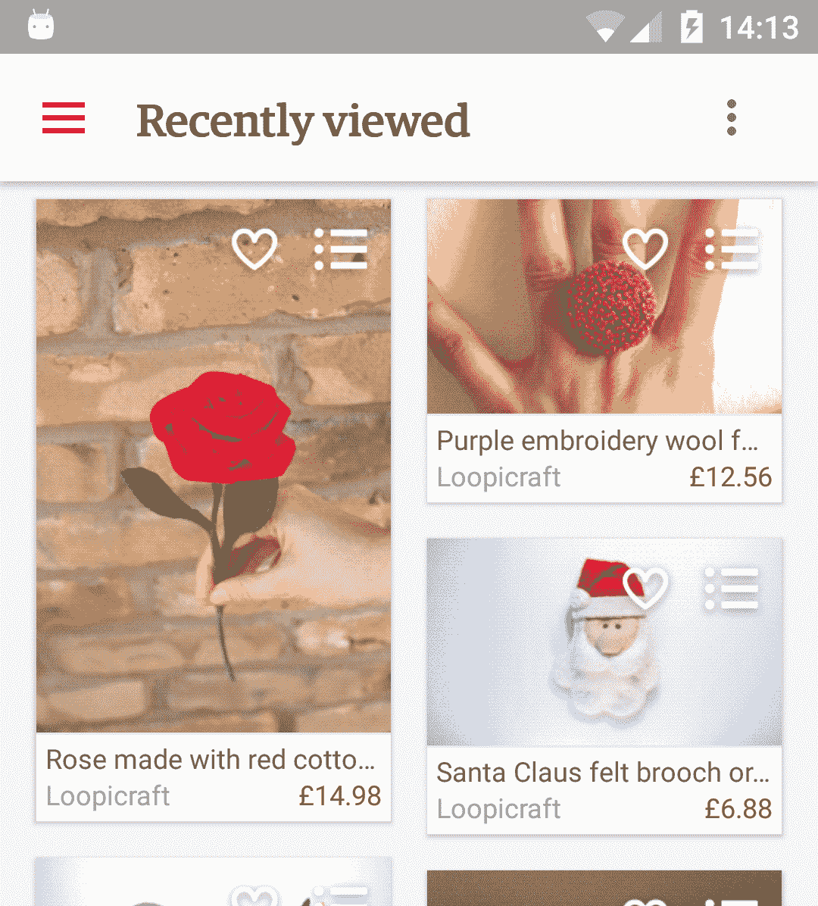

还有许多其他潜在的例子，但第二个好例子可能是荷兰最大的有线电视运营商之一 *Ziggo* 的电子节目指南。电子节目指南是一个自定义视图，为电视节目呈现不同的方框，并为当前时间前后的内容改变颜色。

只能从荷兰 Google Play 下载，但无论如何，下面的截图显示了应用程序是如何呈现电子节目指南的:

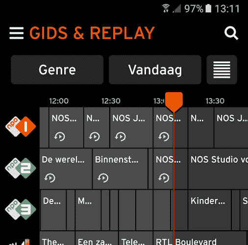

最后，第三个例子和最近发布的应用程序是来自 Airbnb 的*洛蒂*。*洛蒂*是一个实时渲染 **Adobe After Effects** 动画的示例应用程序。

*洛蒂*可以直接从 Google Play 下载，但下面的截图显示了应用的快速预览:

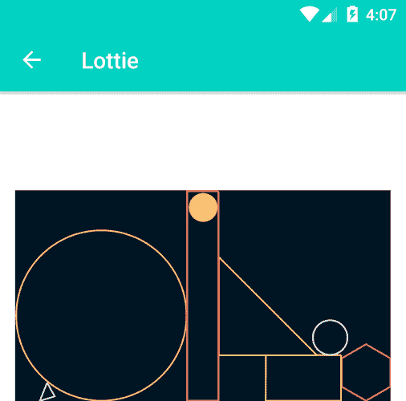

呈现视图和自定义字体是自定义呈现的示例。关于*洛蒂*的更多信息，请参考:
[http://airbnb.design/introducing-lottie/](http://airbnb.design/introducing-lottie/)。

我们刚刚看到了一些例子，但是还有很多。一个很好的发现它们或查看可用内容的网站是安卓阿森纳:
[https://android-arsenal.com/](https://android-arsenal.com/)。

# 设置环境

既然我们已经简单介绍了自定义视图，为什么需要它们，以及市场上的一些例子，让我们开始构建自己的视图。如果我们还没有这样做，我们的第一个自然步骤是安装安卓开发工具。如果你已经安装了安卓工作室，你可以跳过这一部分，直接进入行动。本书中的大多数示例将与安卓工作室 2.3.3 完美配合，但后面的章节将需要安卓工作室 3.0。在撰写本文时，Android Studio 3.0 仍处于测试阶段，但强烈建议对提供的所有示例进行测试。

# 安装开发工具

为了开始创建您自己的自定义视图，您只需要开发安卓移动应用程序通常需要的东西。在这本书里，我们将使用安卓工作室，因为它是谷歌推荐的工具。

我们可以从安卓工作室的官方网站获得最新版本:
[【https://developer.android.com/studio/index.html】](https://developer.android.com/studio/index.html)。

一旦我们为计算机下载了软件包，我们就可以继续安装了:

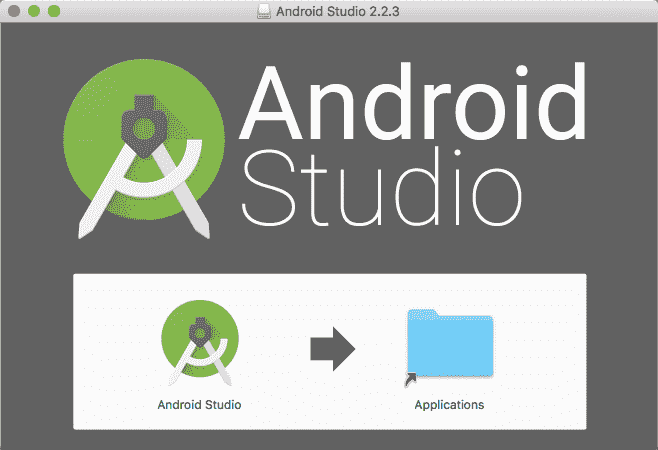

现在，我们可以创建一个新项目，用于在自定义视图上迈出第一步。

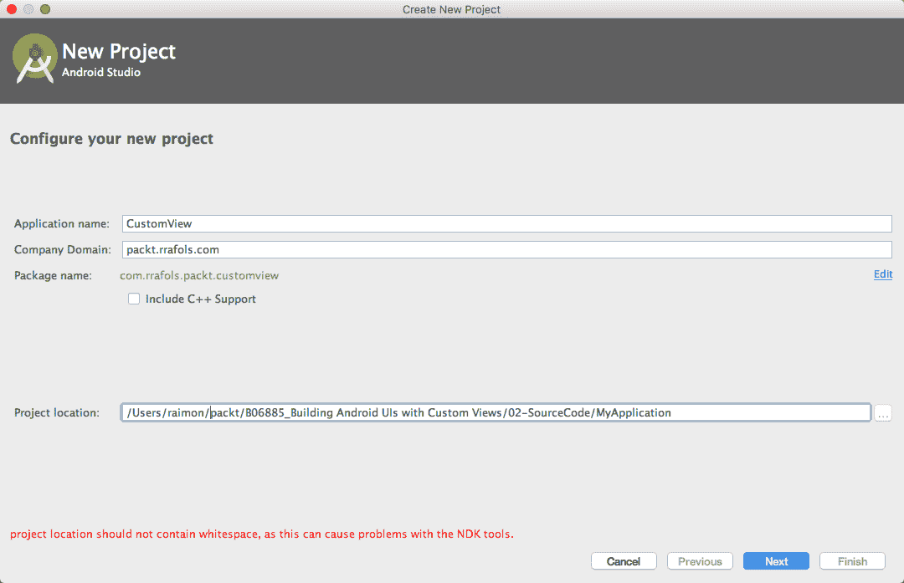

选择应用程序名称、公司域(将反转为应用程序包名称和项目位置)后，安卓工作室会询问我们想要创建什么类型的项目:

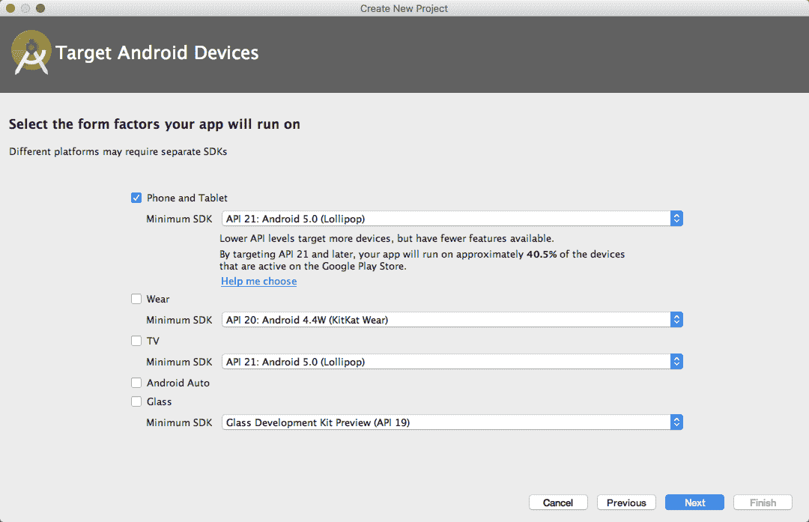

对于这个例子，我们不需要什么太花哨的东西，只需要手机和平板以及 API 21 的支持就足够了。完成后，我们可以添加一个空活动:

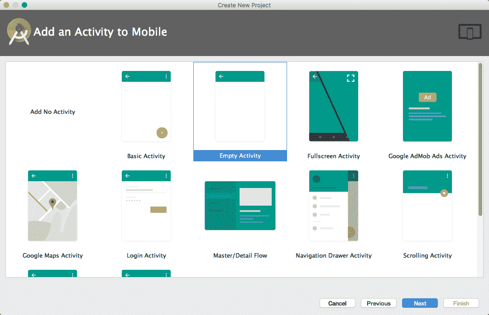

如果你需要安装安卓工作室的帮助，在*学习安卓应用开发*、*打包发布*上有一个循序渐进的指南，或者在安卓开发者文档网站上总是有大量的信息。更多信息请参考:
[https://www . packtpub . com/application-development/learning-Android-application-development](https://www.packtpub.com/application-development/learning-android-application-development) 

现在，我们准备在设备模拟器或真实设备上运行这个应用程序。

# 如何设置仿真器

要设置一个模拟器，我们需要运行**安卓虚拟设备管理器** ( **AVD 管理器**)。我们可以在顶部栏找到它的图标，就在播放/停止应用程序图标旁边。

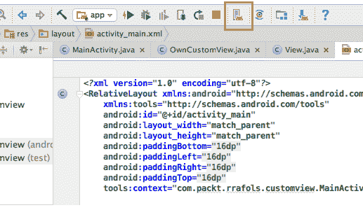

一旦我们执行了**安卓设备管理器**，我们就可以从那里添加或管理我们的虚拟设备，如下图所示:

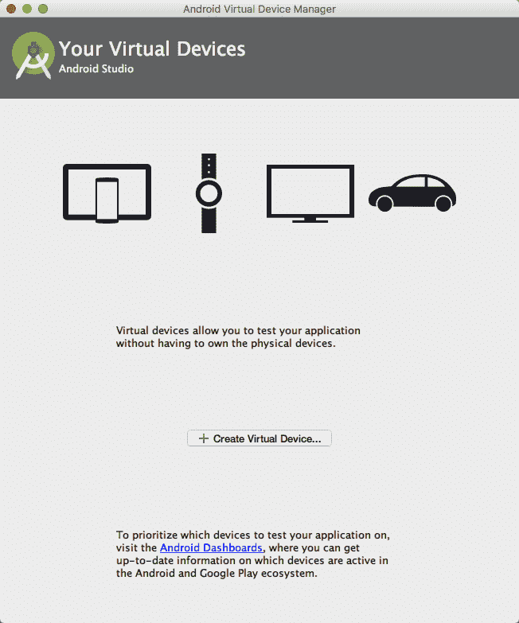

点击创建虚拟设备，我们将有机会使用其中一个安卓设备定义，甚至创建我们自己的硬件配置文件，如下图所示:

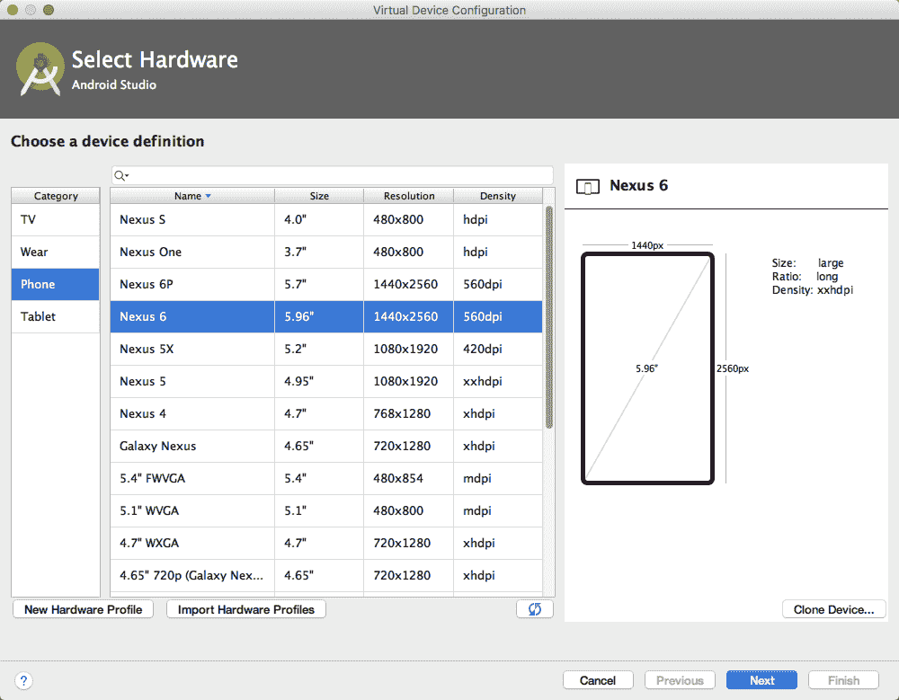

一旦我们选择了硬件，我们就必须选择软件，或者系统映像，它将在上面运行。稍后，我们可以添加测试所需的所有组合:多个不同的设备，或者同一台设备具有不同的安卓版本图像，甚至两者的组合。

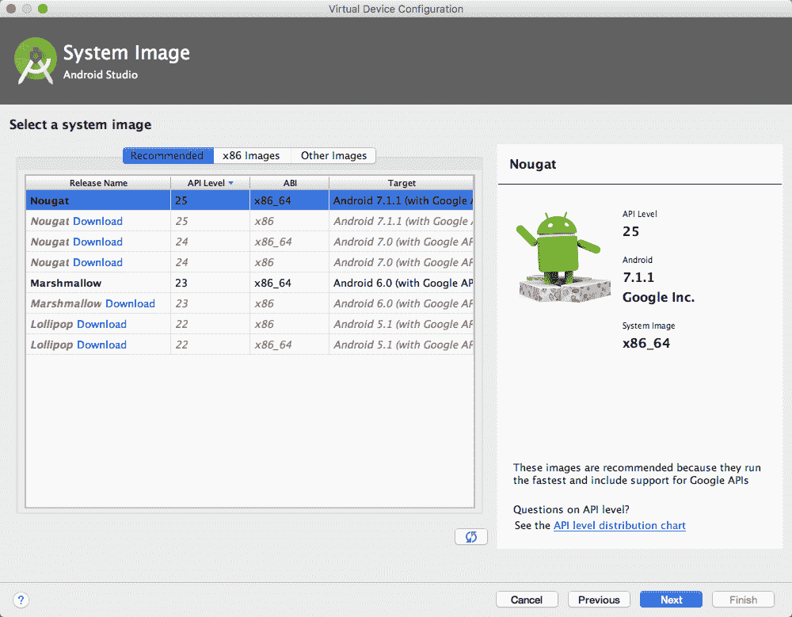

最后一步是命名我们的 AVD，查看我们的硬件和软件选择，我们就准备好了！

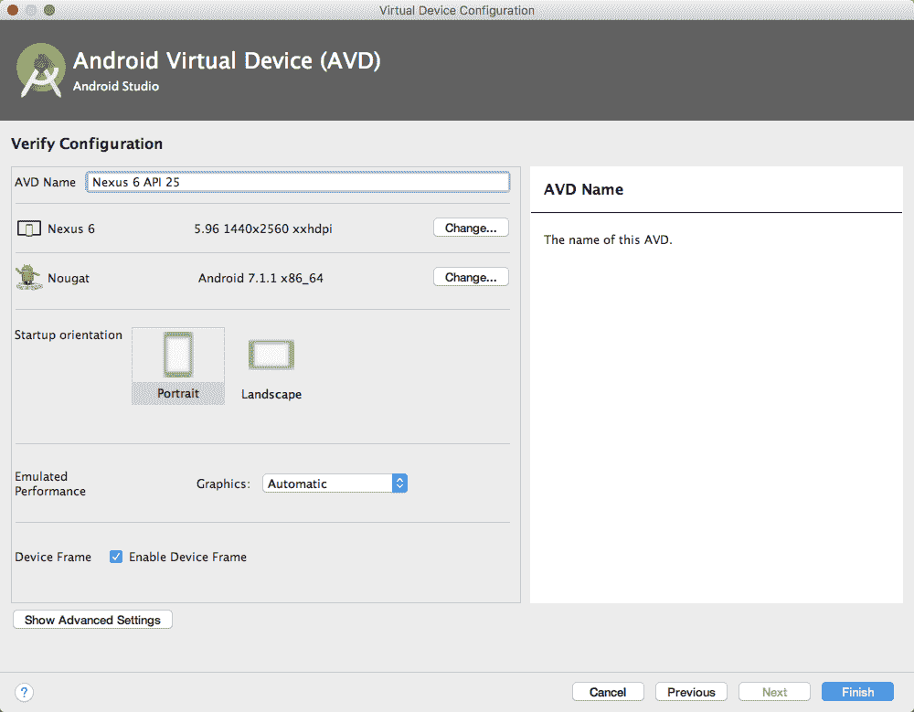

# 如何设置一个真正的开发设备

使用仿真器进行测试和调试是没问题的，但有时我们真的想测试应用程序或将应用程序放在真实的设备上。为了能够在我们的设备上进行开发，我们必须采取一些步骤。首先，我们需要使我们的设备能够发展。自安卓 4.2 以来，我们只需在设置->关于菜单->内部版本号上点击七次，就可以轻松做到这一点。一旦我们这样做了，将会有一个新的菜单选项叫做开发者选项。我们有多个选项可以探索，但我们现在需要的是启用 USB 调试。

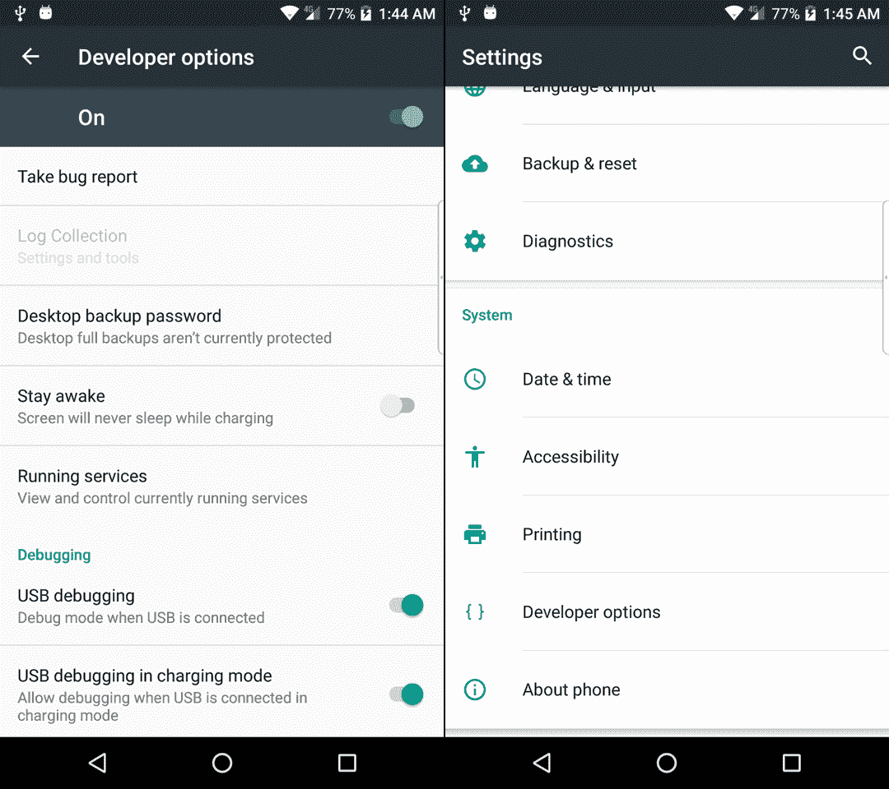

如果启用了 USB 调试，我们将在设备选择上看到我们的设备和正在运行的仿真器:

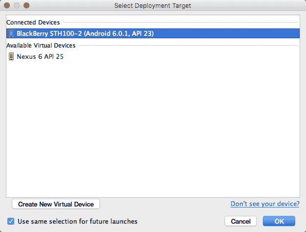

# 创建我们自己的第一个自定义视图

现在我们已经设置好了环境，可以在模拟器和真实设备上运行和调试安卓应用程序，我们可以开始创建自己的第一个自定义视图了。为了简单起见，我们将首先轻松修改现有视图，然后从头开始创建自己的视图。

# 扩展视图

使用上一节中的示例，或者如果您跳过了空活动，只创建一个新项目，我们将使用自己的实现来更改`TextView`。

如果我们看一下默认布局 XML 文件，通常称为`activity_main.xml`，如果您在项目创建期间没有更改它，我们可以看到在一个`RelativeLayout`中有`TextView`:

```java
<?xml version="1.0" encoding="utf-8"?> 
<RelativeLayout xmlns:android="http://schemas.android.com/apk/res/android" 
    xmlns:tools="http://schemas.android.com/tools" 
    android:id="@+id/activity_main" 
    android:layout_width="match_parent" 
    android:layout_height="match_parent" 
    android:paddingBottom="@dimen/activity_vertical_margin" 
    android:paddingLeft="@dimen/activity_horizontal_margin" 
    android:paddingRight="@dimen/activity_horizontal_margin" 
    android:paddingTop="@dimen/activity_vertical_margin" 
    tools:context="com.packt.rrafols.customview.MainActivity"> 

    <TextView 
        android:layout_width="wrap_content" 
        android:layout_height="wrap_content" 
        android:text="Hello World!" /> 
</RelativeLayout> 
```

让我们将`TextView`更改为一个自定义类，我们将在此之后实现:

```java
<com.packt.rrafols.customview.OwnTextView 
        android:layout_width="wrap_content" 
        android:layout_height="wrap_content" 
        android:text="Hello World!" /> 
```

我们已经使用了`com.packt.rrafols.customview`包，但是请将其相应地更改为您的应用程序的包名。

为了实现这个类，我们将首先创建扩展`TextView`的类:

```java
package com.packt.rrafols.customview; 

import android.content.Context; 
import android.util.AttributeSet; 
import android.widget.TextView; 

public class OwnTextView extends TextView { 

    public OwnTextView(Context context, AttributeSet attributeSet) { 
        super(context, attributeSet); 
    } 
} 
```

这个类或自定义视图将表现得像一个标准的`TextView`。考虑我们使用的构造函数。还有其他的构造函数，但是我们暂时只关注这个。创建它很重要，因为它将接收我们在 XML 布局文件中定义的上下文和参数。

在这一点上，我们只是传递参数，并没有对它们做任何花哨的操作，但是让我们准备我们的定制视图，通过覆盖`onDraw()`方法来处理新的功能:

```java
@Override 
protected void onDraw(Canvas canvas) { 
    super.onDraw(canvas); 
} 
```

通过覆盖`onDraw()`方法，我们现在控制了自定义视图的绘制周期。如果我们运行应用程序，我们将不会注意到与原始示例有任何不同，因为我们还没有添加任何新的行为或功能。为了解决这个问题，让我们做一个非常简单的改变，向我们证明它确实有效。

在`onDraw()`方法中，我们将绘制一个红色矩形，覆盖视图的整个区域，如下所示:

```java
@Override 
    protected void onDraw(Canvas canvas) { 
        canvas.drawRect(0, 0, getWidth(), getHeight(), backgroundPaint); 
        super.onDraw(canvas); 
    } 
```

我们可以使用`getWidth()`和`getHeight()`方法分别获得视图的宽度和高度。为了定义颜色和样式，我们将初始化一个新的`Paint`对象，但是我们将在构造器上进行，因为在`onDraw()`方法中这样做是一个不好的做法。我们将在本书后面介绍更多关于性能的内容:

```java
private Paint backgroundPaint; 

    public OwnTextView(Context context, AttributeSet attributeSet) { 
        super(context, attributeSet); 

        backgroundPaint= new Paint(); 
        backgroundPaint.setColor(0xffff0000); 
        backgroundPaint.setStyle(Paint.Style.FILL); 
    } 
```

这里，我们已经使用整数十六进制编码将`Paint`对象初始化为红色，并将样式设置为`Style.FILL`，这样它将填充整个区域。默认情况下，`Paint`风格设置为`FILL`，但为了更加清晰而专门设置也无妨。

如果我们现在运行应用程序，我们会看到`TextView`，它现在是我们自己的类，红色背景如下:

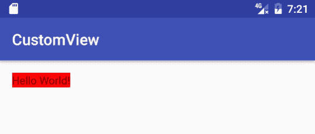

下面的代码片段是`OwnTextView`类的整个实现。有关更多详细信息，请查看 GitHub 存储库中的`Example01`文件夹，了解完整项目:

```java
package com.packt.rrafols.customview; 

import android.content.Context; 
import android.graphics.Canvas; 
import android.graphics.Paint; 
import android.util.AttributeSet; 
import android.widget.TextView; 

public class OwnTextView extends TextView { 

    private Paint backgroundPaint; 

    public OwnTextView(Context context, AttributeSet attributeSet) { 
        super(context, attributeSet); 

        backgroundPaint = new Paint(); 
        backgroundPaint.setColor(0xffff0000); 
        backgroundPaint.setStyle(Paint.Style.FILL); 
    } 

    @Override 
    protected void onDraw(Canvas canvas) { 
        canvas.drawRect(0, 0, getWidth(), getHeight(),
        backgroundPaint); 
        super.onDraw(canvas); 
    } 
} 
```

这个例子只是为了展示我们如何扩展一个标准视图并实现我们自己的行为；在 Android 中，还有多种其他方法可以设置背景颜色或为小部件绘制背景颜色。

# 从头开始创建简单视图

现在我们已经看到了如何修改一个已经存在的`View,`我们将看到一个更复杂的例子:如何从头开始创建我们自己的自定义视图！

让我们从创建一个从`View`开始扩展的空类开始:

```java
package com.packt.rrafols.customview; 

import android.content.Context; 
import android.util.AttributeSet; 
import android.view.View; 

public class OwnCustomView extends View { 

    public OwnCustomView(Context context, AttributeSet attributeSet) { 
        super(context, attributeSet); 
    } 

} 
```

我们现在将添加与前面示例相同的代码来绘制红色背景:

```java
package com.packt.rrafols.customview; 

import android.content.Context; 
import android.graphics.Canvas; 
import android.graphics.Paint; 
import android.util.AttributeSet; 
import android.view.View; 

public class OwnCustomView extends View { 

    private Paint backgroundPaint; 

    public OwnCustomView(Context context, AttributeSet attributeSet) { 
        super(context, attributeSet); 

        backgroundPaint= new Paint(); 
        backgroundPaint.setColor(0xffff0000); 
        backgroundPaint.setStyle(Paint.Style.FILL); 

    } 

    @Override 
    protected void onDraw(Canvas canvas) { 
        canvas.drawRect(0, 0, getWidth(), getHeight(),
        backgroundPaint); 
        super.onDraw(canvas); 
    } 
} 
```

如果我们运行该应用程序，正如我们在下面的截图中看到的，我们将得到与前面示例略有不同的结果。这是因为在我们前面的例子中`TextView`小部件被调整到文本的大小。如果我们没记错的话，我们的布局 XML 文件中有`android:layout_width="wrap_content"`和`android:layout_height="wrap_content"`。我们刚刚创建的这个新的自定义视图不知道如何计算它的大小。

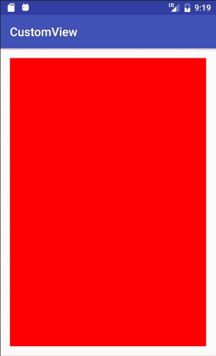

查看 GitHub 存储库中的`Example02`文件夹，了解这个简单示例的完整实现。

# 摘要

在这一章中，我们已经看到了为什么我们可能想要构建自定义视图和布局背后的原因，而且我们必须应用常识。安卓为创建用户界面提供了一个很好的基础框架，不使用它将是一个错误。不是每个组件、按钮或小部件都必须完全定制开发，但是通过在正确的地方这样做，我们可以添加一个额外的功能，这可能会让我们的应用程序被记住。此外，我们还展示了一些已经上市的应用程序示例，它们使用自定义视图，因此我们知道我们并不孤单！最后，我们已经看到了如何设置环境来让我们自己开始，我们开始在自定义视图上迈出自己的第一步。

在下一章中，我们将继续添加特性；我们将了解如何计算自定义视图的正确大小，并了解有关自定义渲染的更多信息。