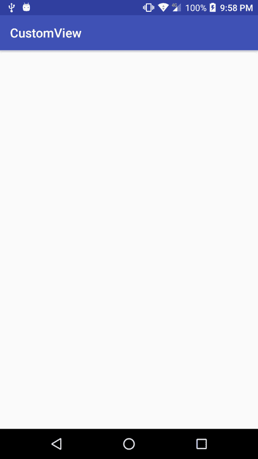
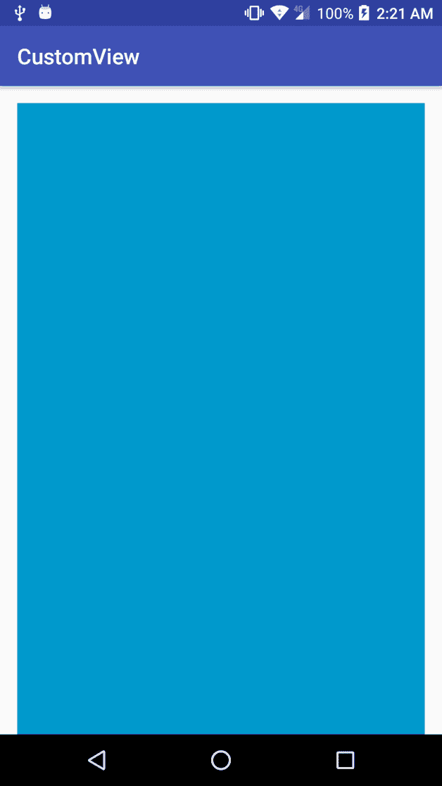
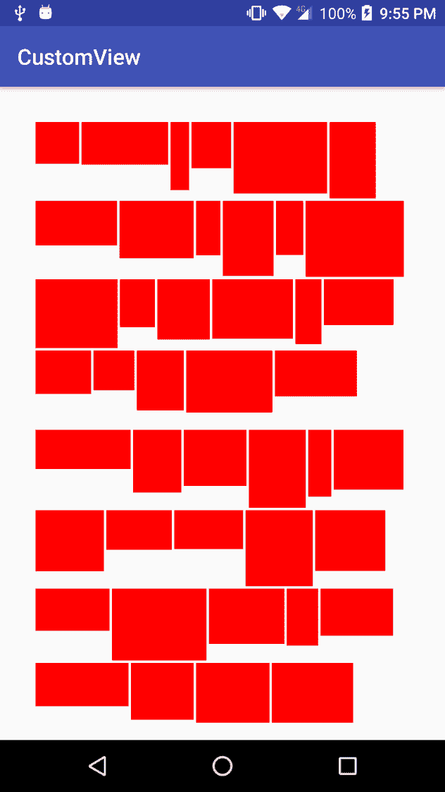
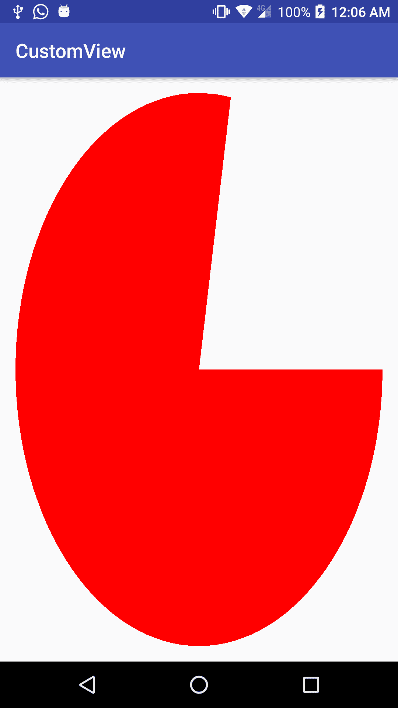
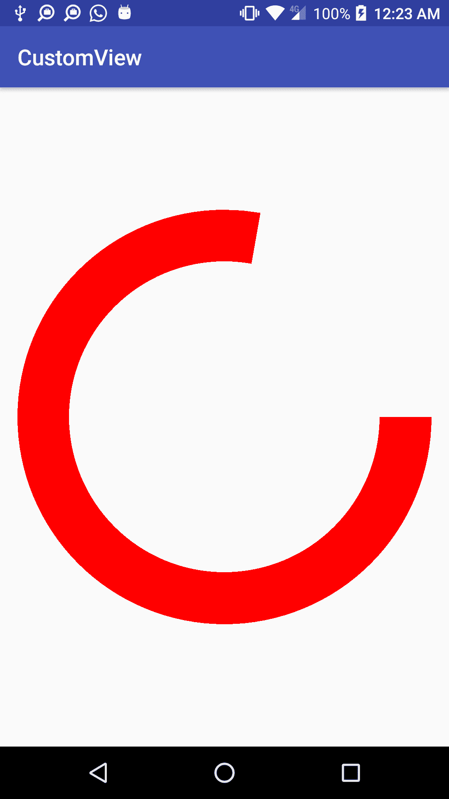
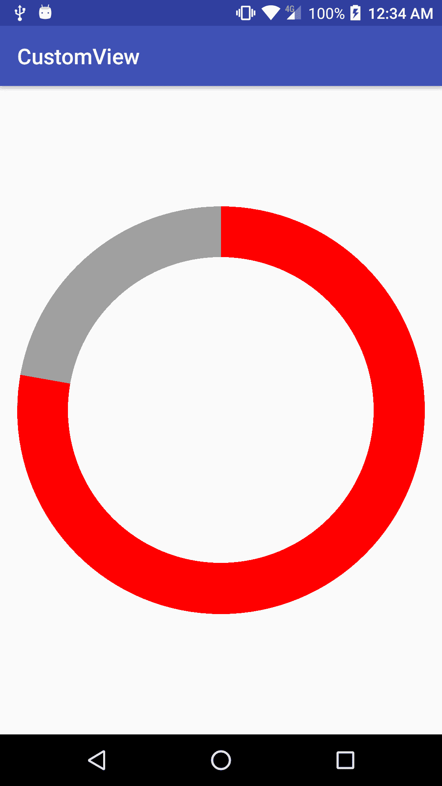

# 二、实现您的第一个自定义视图

在前一章中，我们已经看到了如何创建自定义视图的基础，但是除非我们添加更多的特性和自定义，否则它将非常无用。在本章中，我们将在这些基础上继续构建，看看我们如何参数化我们的定制视图，以允许我们自己或任何其他开发人员定制它们，最后，介绍一些渲染，这将使我们能够构建稍微复杂一点的定制视图。

此外，正如我们在上一章中提到的，我们也可以创建自定义布局。在本章中，我们将看到如何创建一个简单的自定义布局。

更详细地说，我们将涵盖以下主题:

*   测量和参数化我们的定制视图
*   实例化自定义视图
*   创建自定义布局
*   基本渲染

# 测量和参数化我们的定制视图

为了拥有良好的可重用定制视图，它需要能够适应不同的大小和设备分辨率，并且为了增加它的可重用性，它应该支持参数化。

# 测量我们的定制视图

在前一章构建的快速示例中，我们将所有大小和度量委托给父视图本身。说实话，我们连委托都没委托；我们只是没有做任何具体的事情来解决这个问题。能够控制自定义视图的大小和尺寸是我们肯定需要注意的事情。首先，我们将从如下视图中**覆盖**`onMeasure()`方法:

```java
@Override 
protected void onMeasure(int widthMeasureSpec, int heightMeasureSpec) { 
    super.onMeasure(widthMeasureSpec, heightMeasureSpec); 
} 
```

阅读关于`onMeasure()`方法的安卓文档，我们应该看到我们必须**调用**或者`setMeasuredDimension(int, int)`或者超类‘`onMeasure(int, int)`。如果我们忘记这样做，我们会得到一个`IllegalStateException`:

```java
com.packt.rrafols.customview E/AndroidRuntime: FATAL EXCEPTION: main Process: com.packt.rrafols.customview, PID: 13601 java.lang.IllegalStateException: View with id -1: com.packt.rrafols.customview.OwnCustomView#onMeasure() did not set the measured dimension by calling setMeasuredDimension() at android.view.View.measure(View.java:18871)
```

有三种不同的**模式**，在这三种模式中，我们视图的父视图可以向我们的视图指示它应该如何计算其大小。我们可以使用`MeasureSpec.getMode(int)`方法获得每个尺寸规格`widthMeasureSpec`和`heightMeasureSpec`的模式。

这些模式如下:

*   `MeasureSpec.EXACTLY`
*   `MeasureSpec.AT_MOST`
*   `MeasureSpec.UNSPECIFIED`

当父母计算或决定尺寸后，我们会得到`MeasureSpec.EXACTLY`。我们的视图将具有该大小，即使它需要或返回不同的大小。如果我们得到`MeasureSpec.AT_MOST`我们就有了更多的灵活性:我们可以有我们需要的那么大，但也可以达到我们同样拥有的尺寸。最后，如果我们收到了`MeasureSpec.UNSPECIFIED`，我们可以根据我们想要的或者视图需要的尺寸来调整我们的视图。

使用`MeasureSpec.getSize(int)`，我们还可以从尺寸规格中获得一个尺寸值。

既然我们已经有了所有这些，我们如何知道哪些值映射到我们的 XML 布局文件上的宽度和高度参数？容易看，让我们检查一下。例如，如果我们在 GitHub 存储库中指定精确的值，如`activity_main.xml`文件所示，我们将获得以下代码:

```java
<com.packt.rrafols.customview.OwnCustomView 
   android:layout_width="150dp" 
   android:layout_height="150dp"/> 
```

在我们的自定义视图上进行编码，使用`MeasureSpec.toString(int)`获取度量规格和大小的字符串描述，如下所示:

```java
@Override 
protected void onMeasure(int widthMeasureSpec, int heightMeasureSpec) { 
    Log.d(TAG, "width spec: " +
    MeasureSpec.toString(widthMeasureSpec)); 
    Log.d(TAG, "height spec: " +
    MeasureSpec.toString(heightMeasureSpec)); 
    super.onMeasure(widthMeasureSpec, heightMeasureSpec); 
} 
```

安卓日志上的结果如下:

```java
D/com.packt.rrafols.customview.OwnCustomView: width : MeasureSpec: EXACTLY 394 D/com.packt.rrafols.customview.OwnCustomView: height: MeasureSpec: EXACTLY 394
```

我们的视图将精确到`394`像素。`394`像素来自于将`150dp`转换为我用于测试的移动设备上的像素。

As there are many Android devices with different resolutions and screen densities, we should always use **density-independent pixel** (**dp**) or (**dip**) instead of pixels.

有关 dp 的更多详细信息，请参考 YouTube 上的谷歌视频:设计字节:密度无关像素。

如果您想在特定设备上将 dp 转换为真实像素，可以使用以下方法:

```java
public final int dpToPixels(int dp) { 
    return (int) (dp * getResources().getDisplayMetrics().density +
    0.5); 
} 
```

我们可以看到转换是如何使用屏幕密度完成的，因此在不同的设备上，转换可能会有所不同。前面代码中的`+ 0.5`只是将浮点数转换为`int`时的值取整。

要从像素转换为与密度无关的点，我们必须执行相反的操作，如以下代码所示:

```java
public final int pixelsToDp(int dp) { 
    return (int) (dp / getResources().getDisplayMetrics().density +
    0.5); 
} 
```

现在让我们看看如果我们使用不同的测量参数，比如`match_parent`或`wrap_content`，我们会收到什么，如 GitHub 存储库中的`activity_main.xml`文件所示:

```java
<com.packt.rrafols.customview.OwnCustomView 
   android:layout_width="match_parent" 
   android:layout_height="match_parent"/> 
```

运行与之前相同的代码，我们在安卓日志中得到以下内容:

```java
D/com.packt.rrafols.customview.OwnCustomView: width : MeasureSpec: EXACTLY 996 D/com.packt.rrafols.customview.OwnCustomView: height: MeasureSpec: EXACTLY 1500
```

所以我们还是得到了一个`MeasureSpec.EXACTLY`，不过这次有了父`RelativeLayout`的大小；让我们试着把其中一个`match_parents`换成一个`activity_main.xml`的`wrap_content`:

```java
<com.packt.rrafols.customview.OwnCustomView 
    android:layout_width="match_parent" 
    android:layout_height="wrap_content"/> 
```

结果如下:

```java
D/com.packt.rrafols.customview.OwnCustomView: width : MeasureSpec: EXACTLY 996 D/com.packt.rrafols.customview.OwnCustomView: height: MeasureSpec: AT_MOST 1500
```

我们可以用`MeasureSpec.EXACTLY`和`MeasureSpec.AT_MOST`找到一个容易遵循的模式，但是`MeasureSpec.UNSPECIFIED`呢？

如果我们的父母没有界限，我们会得到一个`MeasureSpec.UNSPECIFIED`；例如，如果我们在一个`ScrollView`中有一个垂直的`LinearLayout`，如 GitHub 存储库中的`scrollview_layout.xml`文件所示:

```java
<?xml version="1.0" encoding="utf-8"?> 
<ScrollView xmlns:android="http://schemas.android.com/apk/res/android" 
    android:orientation="vertical" 
    android:layout_width="match_parent" 
    android:layout_height="match_parent"> 

    <LinearLayout 
        android:layout_width="match_parent" 
        android:layout_height="wrap_content" 
        android:orientation="vertical" 
        android:padding="@dimen/activity_vertical_margin"> 
        <com.packt.rrafols.customview.OwnCustomView
        android:layout_width="match_parent"
        android:layout_height="wrap_content"/>
    </LinearLayout> 
</ScrollView> 
```

然后我们会在安卓日志中看到以下内容:

```java
D/com.packt.rrafols.customview.OwnCustomView: width : MeasureSpec: EXACTLY 996 D/com.packt.rrafols.customview.OwnCustomView: height: MeasureSpec: UNSPECIFIED 1500
```

这看起来不错，但是如果我们现在运行这段代码会发生什么呢？我们会得到一个空屏幕；我们之前实现的红色背景消失了:



这是因为我们没有管理自定义视图的大小。让我们解决这个问题，如下面的代码所示:

```java
private static int getMeasurementSize(int measureSpec, int defaultSize) { 
        int mode = MeasureSpec.getMode(measureSpec); 
        int size = MeasureSpec.getSize(measureSpec); 
        switch(mode) { 
            case MeasureSpec.EXACTLY: 
                return size; 

            case MeasureSpec.AT_MOST: 
                return Math.min(defaultSize, size); 

            case MeasureSpec.UNSPECIFIED: 
            default: 
                return defaultSize; 
        } 
    } 

    @Override 
    protected void onMeasure(int widthMeasureSpec, int
        heightMeasureSpec) { 
        int width = getMeasurementSize(widthMeasureSpec, DEFAULT_SIZE); 
        int height = getMeasurementSize(heightMeasureSpec,
        DEFAULT_SIZE); 
        setMeasuredDimension(width, height); 
    } 
```

现在，根据测量规格，我们将通过调用`setMeasuredDimension(int, int)`方法来设置视图的大小。

对于完整的示例，请检查 GitHub 存储库中`Example03-Measurement`文件夹中的源代码。

# 参数化我们的自定义视图

我们现在有了适应多种尺寸的定制视图；这很好，但是如果我们需要另一个将背景涂成蓝色而不是红色的自定义视图，会发生什么呢？黄色呢？我们不应该为每个定制复制定制视图类。幸运的是，我们可以在 XML 布局上设置参数，并从自定义视图中读取它们:

1.  首先，我们需要定义我们将在自定义视图中使用的参数类型。我们必须在`res`文件夹中创建一个名为`attrs.xml`的文件:

```java
<?xml version="1.0" encoding="utf-8"?> 
<resources> 
    <declare-styleable name="OwnCustomView"> 
        <attr name="fillColor" format="color"/> 
    </declare-styleable> 
</resources> 
```

2.  然后，我们在布局文件中添加一个不同的名称空间，我们希望在其中使用我们刚刚创建的这个新参数:

```java
<?xml version="1.0" encoding="utf-8"?> 
<ScrollView xmlns:android="http://schemas.android.com/apk/res/android" 
    xmlns:app="http://schemas.android.com/apk/res-auto" 
    android:orientation="vertical" 
    android:layout_width="match_parent" 
    android:layout_height="match_parent"> 

    <LinearLayout 
        android:layout_width="match_parent" 
        android:layout_height="wrap_content" 
        android:orientation="vertical" 
        android:padding="@dimen/activity_vertical_margin"> 

        <com.packt.rrafols.customview.OwnCustomView 
            android:layout_width="match_parent" 
            android:layout_height="wrap_content"
            app:fillColor="@android:color/holo_blue_dark"/>          
    </LinearLayout> 
</ScrollView> 
```

3.  现在我们已经定义了这个，让我们看看如何从自定义视图类中读取它:

```java
int fillColor;
TypedArray ta =
    context.getTheme().obtainStyledAttributes(attributeSet,
        R.styleable.OwnCustomView, 0, 0);
try {
    fillColor =
        ta.getColor(R.styleable.OwnCustomView_ocv_fillColor,
            DEFAULT_FILL_COLOR);
} finally {
    ta.recycle();
}
```

通过使用保存`attrs.xml`文件后为我们创建的样式化属性标识安卓工具获取`TypedArray`，我们将能够查询在 XML 布局文件上设置的那些参数的值。

在这个例子中，我们创建了一个名为`fillColor`的属性，它将被格式化为一种颜色。这种格式，或者基本上是属性的类型，对于限制我们可以设置的值的种类，以及之后如何从我们的自定义视图中检索这些值非常重要。

同样，对于我们定义的每个参数，我们将在`TypedArray`中得到一个`R.styleable.<name>_<parameter_name> index`。在前面的代码中，我们使用`R.styleable.OwnCustomView_fillColor index`查询`fillColor`。

We shouldn't forget to recycle the `TypedArray` after using it so it can be reused later on, but once recycled, we can't use it again.

让我们看看这个小定制的结果:



我们在这个特定的例子中使用了颜色，但是我们可以使用许多其他类型的参数；例如:

*   布尔代数学体系的
*   （同 Internationalorganizations）国际组织
*   浮动
*   颜色
*   尺寸
*   可拉的
*   线
*   资源

每个都有自己的吸气剂方法:`getBoolean(int index, boolean defValue)`或`getFloat(int index, float defValue)`。

此外，为了知道是否设置了参数，我们可以在查询之前使用`hasValue(int)`方法，或者我们可以简单地使用 getters 的默认值。如果属性没有在该索引处设置，getter 将返回默认值。

完整示例，请查看 GitHub 存储库中的`Example04-Parameters`文件夹。

# 实例化自定义视图

既然我们已经看到了如何在 XML 布局上设置参数，并在自定义视图类上解析它们，那么我们也将看到如何从代码中实例化自定义视图，然后尽可能地从两种实例化机制中重用它们。

# 从代码实例化自定义视图

在我们的自定义视图中，我们创建了一个带有两个参数的构造函数，一个`Context`和一个`AttributeSet`。现在，如果我们以编程方式创建用户界面，或者由于任何其他原因我们需要通过代码实例化我们的自定义视图，我们需要创建一个额外的构造函数。

当我们想在 XML 布局中继续使用自定义视图时，我们必须保留这两个构造函数。为了避免代码重复，我们将创建一些助手方法来初始化它，并从两个构造函数中使用它们:

```java
   public OwnCustomView(Context context) { 
        super(context); 

        init(DEFAULT_FILL_COLOR); 
    } 

    public OwnCustomView(Context context, AttributeSet attributeSet) { 
        super(context, attributeSet); 

        int fillColor; 

        TypedArray ta =
        context.getTheme().obtainStyledAttributes(attributeSet,
        R.styleable.OwnCustomView, 0, 0); 
        try { 
           fillColor = ta.getColor(R.styleable.OwnCustomView_fillColor,
           DEFAULT_FILL_COLOR); 
        } finally { 
            ta.recycle(); 
        } 

        init(fillColor); 
    } 

    private void init(int fillColor) { 
        backgroundPaint = new Paint(); 
        backgroundPaint.setStyle(Paint.Style.FILL); 

        setFillColor(fillColor); 
    } 

    public void setFillColor(int fillColor) { 
        backgroundPaint.setColor(fillColor); 
    } 
```

我们还创建了一个公共方法`setFillColor(int)`，所以我们也可以通过代码来设置填充颜色。例如，让我们修改我们的`Activity`以编程方式创建视图层次结构，而不是从一个 XML 布局文件膨胀它:

```java
public class MainActivity extends AppCompatActivity { 
    private static final int BRIGHT_GREEN = 0xff00ff00; 

    @Override 
    protected void onCreate(Bundle savedInstanceState) { 
        super.onCreate(savedInstanceState); 

        LinearLayout linearLayout = new LinearLayout(this); 
        linearLayout.setLayoutParams( 
                new LinearLayout.LayoutParams(ViewGroup.
                    LayoutParams.MATCH_PARENT,
                    ViewGroup.LayoutParams.MATCH_PARENT)); 

        OwnCustomView customView = new OwnCustomView(this); 
        customView.setFillColor(BRIGHT_GREEN); 
        linearLayout.addView(customView); 

        setContentView(linearLayout); 
    } 
} 
```

这里，我们只是创建一个垂直方向的`LinearLayout`，并添加一个自定义视图作为子视图。然后我们将`LinearLayout`设置为`Activity`的内容视图。另外，我们直接使用了十六进制颜色。如果我们不习惯以十六进制格式指定颜色，我们可以使用`Color.argb()`或`Color.rgb()`将颜色分量转换为整数值。

完整的源代码可以在 GitHub 存储库中的`Example05-Code`文件夹中找到。

# 构建器模式

在前面的例子中，我们使用`setFillColor()`方法来设置自定义视图的填充颜色，但是假设我们将有许多其他参数，代码可能会因为所有的设置器而变得有点混乱。

让我们创建一个简单的例子:我们将有四种不同的颜色，并在视图上绘制一个渐变，而不是只有一种背景颜色:

让我们从定义四种不同的颜色及其设置器开始，如下所示:

```java
private int topLeftColor = DEFAULT_FILL_COLOR; 
private int bottomLeftColor = DEFAULT_FILL_COLOR; 
private int topRightColor = DEFAULT_FILL_COLOR; 
private int bottomRightColor = DEFAULT_FILL_COLOR; 
private boolean needsUpdate = false;

public void setTopLeftColor(int topLeftColor) { 
    this.topLeftColor = topLeftColor; 
    needsUpdate = true; 
} 

public void setBottomLeftColor(int bottomLeftColor) { 
    this.bottomLeftColor = bottomLeftColor; 
    needsUpdate = true; 
} 

public void setTopRightColor(int topRightColor) { 
    this.topRightColor = topRightColor; 
    needsUpdate = true; 
} 

public void setBottomRightColor(int bottomRightColor) { 
    this.bottomRightColor = bottomRightColor; 
    needsUpdate = true; 
} 
```

我们还添加了一个布尔值来检查我们是否必须更新渐变。让我们在这里忽略线程同步，因为这不是这个例子的主要目的。

然后，我们在`onDraw()`方法上为这个`boolean`添加了一个检查，如果需要，它将重新生成梯度:

```java
@Override
protected void onDraw(Canvas canvas) {
    if (needsUpdate) {
        int[] colors = new int[] {topLeftColor, topRightColor,
        bottomRightColor, bottomLeftColor};

        LinearGradient lg = new LinearGradient(0, 0, getWidth(),
            getHeight(), colors, null, Shader.TileMode.CLAMP);

        backgroundPaint.setShader(lg);
        needsUpdate = false;
    }

    canvas.drawRect(0, 0, getWidth(), getHeight(), backgroundPaint);
    super.onDraw(canvas);
}
```

在`onDraw()`方法上创建新的对象实例是一种不好的做法。这里只做一次，或者每次我们改变颜色。如果我们不断改变颜色，这将是一个不好的例子，因为它会不断创建新的对象，污染内存，并触发**垃圾收集器** ( **GC** )。[第七章](07.html)、*性能考虑*会有更多关于性能和内存的内容。

我们必须更新`Activity`的代码来设置这些新颜色:

```java
public class MainActivity extends AppCompatActivity { 
    private static final int BRIGHT_GREEN = 0xff00ff00; 
    private static final int BRIGHT_RED = 0xffff0000; 
    private static final int BRIGHT_YELLOW = 0xffffff00; 
    private static final int BRIGHT_BLUE = 0xff0000ff; 

    @Override 
    protected void onCreate(Bundle savedInstanceState) { 
        super.onCreate(savedInstanceState); 

        LinearLayout linearLayout = new LinearLayout(this); 
        linearLayout.setLayoutParams( 
                new LinearLayout.LayoutParams(ViewGroup.
                LayoutParams.MATCH_PARENT,
                ViewGroup.LayoutParams.MATCH_PARENT)); 

        OwnCustomView customView = new OwnCustomView(this); 
        customView.setTopLeftColor(BRIGHT_RED); 
        customView.setTopRightColor(BRIGHT_GREEN); 
        customView.setBottomLeftColor(BRIGHT_YELLOW); 
        customView.setBottomRightColor(BRIGHT_BLUE); 
        linearLayout.addView(customView); 
        setContentView(linearLayout); 
    } 
} 
```

如我们所见，我们使用了四个设置器来设置颜色。如果我们有更多的参数，我们可以使用更多的设置器，但是这种方法的一个问题是，我们必须处理线程同步，并且在所有调用完成之前，对象可能处于不稳定状态。

另一种选择是将所有参数添加到构造函数中，但这也不是一个好的解决方案。这将使我们的工作更加复杂，因为很难记住参数的顺序，或者在我们有可选的情况下，创建许多不同的构造函数或传递空引用，这使得我们的代码更难阅读和维护。

在 GitHub 存储库的`Example06-BuilderPattern-NoBuilder`文件夹中查看这个例子的完整源代码。

现在我们已经介绍了这个问题，让我们通过在自定义视图上实现`Builder`模式来解决它。我们首先在自定义视图中创建一个`public static class`，如下所示:

```java
public static class Builder { 
    private Context context; 
    private int topLeftColor = DEFAULT_FILL_COLOR; 
    private int topRightColor = DEFAULT_FILL_COLOR; 
    private int bottomLeftColor = DEFAULT_FILL_COLOR; 
    private int bottomRightColor = DEFAULT_FILL_COLOR; 

    public Builder(Context context) { 
        this.context = context; 
    } 

    public Builder topLeftColor(int topLeftColor) { 
        this.topLeftColor = topLeftColor; 
        return this; 
    } 

    public Builder topRightColor(int topRightColor) { 
        this.topRightColor = topRightColor; 
        return this; 
    } 

    public Builder bottomLeftColor(int bottomLeftColor) { 
        this.bottomLeftColor = bottomLeftColor; 
        return this; 
    } 

    public Builder bottomRightColor(int bottomRightColor) { 
        this.bottomRightColor = bottomRightColor; 
        return this; 
    } 

    public OwnCustomView build() { 
        return new OwnCustomView(this); 
    } 
} 
```

我们还创建了一个新的私有构造函数，它只接受一个`OwnCustomView.Builder`对象:

```java
private OwnCustomView(Builder builder) { 
    super(builder.context); 

    backgroundPaint = new Paint(); 
    backgroundPaint.setStyle(Paint.Style.FILL); 

    colorArray = new int[] { 
            builder.topLeftColor, 
            builder.topRightColor, 
            builder.bottomRightColor, 
            builder.bottomLeftColor 
    }; 

    firstDraw = true; 
 } 
```

为了清楚起见，我们删除了其他构造函数。同样在这一点上，我们根据`builder`对象的颜色和`boolean`来创建颜色数组，以了解这是否是第一次绘制。

这将有助于只实例化`LinearGradient`对象一次，并避免创建许多实例:

```java
@Override 
    protected void onDraw(Canvas canvas) { 
        if (firstDraw) { 
            LinearGradient lg = new LinearGradient(0, 0, getWidth(),
            getHeight(), 
                    colorArray, null, Shader.TileMode.CLAMP); 

            backgroundPaint.setShader(lg); 
            firstDraw = false; 
        } 

        canvas.drawRect(0, 0, getWidth(), getHeight(),
        backgroundPaint); 
        super.onDraw(canvas); 
    } 
```

现在，一旦对象被创建，我们就不能改变它的颜色，但是我们不必担心线程同步和对象的状态。

为了让它工作，让我们也更新我们的`Activity`上的代码:

```java
public class MainActivity extends AppCompatActivity { 
    private static final int BRIGHT_GREEN = 0xff00ff00; 
    private static final int BRIGHT_RED = 0xffff0000; 
    private static final int BRIGHT_YELLOW = 0xffffff00; 
    private static final int BRIGHT_BLUE = 0xff0000ff; 

    @Override 
    protected void onCreate(Bundle savedInstanceState) { 
        super.onCreate(savedInstanceState); 

        LinearLayout linearLayout = new LinearLayout(this); 
        linearLayout.setLayoutParams( 
                new LinearLayout.LayoutParams(ViewGroup.
                LayoutParams.MATCH_PARENT,
                ViewGroup.LayoutParams.MATCH_PARENT)); 

        OwnCustomView customView = new OwnCustomView.Builder(this) 
                .topLeftColor(BRIGHT_RED) 
                .topRightColor(BRIGHT_GREEN) 
                .bottomLeftColor(BRIGHT_YELLOW) 
                .bottomRightColor(BRIGHT_BLUE) 
                .build(); 

        linearLayout.addView(customView); 

        setContentView(linearLayout); 
    } 
} 
```

使用`Builder`模式，我们的代码更简洁，当我们设置了所有属性时，对象被构造或构建，如果自定义视图有更多的参数，这将变得更加容易。

完整的示例源代码可以在 GitHub 存储库中的`Example07-BuilderPattern`文件夹中找到。

# 创建自定义布局

安卓提供了几种布局来以多种不同的方式定位我们的视图，但是如果这些标准布局对我们的特定用例没有用，我们可以创建自己的布局。

# 扩展视图组

创建自定义布局的过程与创建自定义视图非常相似。我们必须创建一个从`ViewGroup`而不是视图扩展的类，创建适当的构造函数，实现`onMeasure()`方法，并覆盖`onLayout()`方法而不是`onDraw()`方法。

让我们创建一个非常简单的自定义布局；它将在前一个元素的右侧添加元素，直到它不适合屏幕，然后它将开始一个新的行，使用较高的元素来计算这个新行的开始位置，并避免视图之间的任何重叠。

添加随机大小的视图，其中每个视图都有一个红色背景，如下所示:



首先，让我们创建一个从`ViewGroup`开始扩展的类:

```java
public class CustomLayout extends ViewGroup { 

    public CustomLayout(Context context, AttributeSet attrs) { 
        super(context, attrs); 
    } 

    @Override 
   protected void onLayout(boolean changed, int l, int t, int r, int b) { 

   } 
} 
```

我们创建了构造函数并实现了`onLayout()`方法，因为它是一个抽象方法，我们必须实现它。让我们添加一些逻辑:

```java
@Override 
   protected void onLayout(boolean changed, int l, int t, int r, int b){ 
        int count = getChildCount(); 
        int left = l + getPaddingLeft(); 
        int top = t + getPaddingTop(); 

        // keeps track of maximum row height 
        int rowHeight = 0; 

        for (int i = 0; i < count; i++) { 
            View child = getChildAt(i); 

            int childWidth = child.getMeasuredWidth(); 
            int childHeight = child.getMeasuredHeight(); 

            // if child fits in this row put it there 
            if (left + childWidth < r - getPaddingRight()) { 
                child.layout(left, top, left + childWidth, top +
                childHeight); 
                left += childWidth; 
        } else { 
            // otherwise put it on next row 
                left = l + getPaddingLeft(); 
                top += rowHeight; 
                rowHeight = 0; 
            } 

            // update maximum row height 
            if (childHeight > rowHeight) rowHeight = childHeight; 
        } 
    } 
```

这个逻辑实现了我们之前描述的东西；它试图在前一个孩子的右边添加一个孩子，如果它不适合布局宽度，检查当前`left`位置加上测量的孩子宽度，它开始一个新的行。`rowHeight`变量测量该行的更高视图。

我们也来实施`onMeasure()`法:

```java
@Override 
protected void onMeasure(int widthMeasureSpec, int heightMeasureSpec) { 

    int count = getChildCount(); 

    int rowHeight = 0; 
    int maxWidth = 0; 
    int maxHeight = 0; 
    int left = 0; 
    int top = 0; 

    for (int i = 0; i < count; i++) { 
        View child = getChildAt(i); 
        measureChild(child, widthMeasureSpec, heightMeasureSpec); 

        int childWidth = child.getMeasuredWidth(); 
        int childHeight = child.getMeasuredHeight(); 

        // if child fits in this row put it there 
        if (left + childWidth < getWidth()) { 
            left += childWidth; 
        } else { 
            // otherwise put it on next row 
            if(left > maxWidth) maxWidth = left; 
            left = 0; 
            top += rowHeight; 
            rowHeight = 0; 
        } 

        // update maximum row height 
        if (childHeight > rowHeight) rowHeight = childHeight; 
    } 

    if(left > maxWidth) maxWidth = left; 
    maxHeight = top + rowHeight; 

    setMeasuredDimension(getMeasure(widthMeasureSpec, maxWidth),
    getMeasure(heightMeasureSpec, maxHeight)); 

} 
```

逻辑和以前一样，但它没有布局它的孩子。它计算所需的最大宽度和高度，然后在助手方法的帮助下，根据宽度和高度测量规格设置此自定义布局的尺寸:

```java
private int getMeasure(int spec, int desired) { 
        switch(MeasureSpec.getMode(spec)) { 
            case MeasureSpec.EXACTLY: 
                return MeasureSpec.getSize(spec); 

            case MeasureSpec.AT_MOST: 
                return Math.min(MeasureSpec.getSize(spec), desired); 

            case MeasureSpec.UNSPECIFIED: 
            default: 
                return desired; 
        } 
    } 
```

现在我们已经有了自定义布局，让我们将其添加到我们的`activity_main`布局中:

```java
<?xml version="1.0" encoding="utf-8"?> 
<RelativeLayout xmlns:android="http://schemas.android.com/apk/res/android" 
    xmlns:tools="http://schemas.android.com/tools" 
    android:id="@+id/activity_main" 
    android:layout_width="match_parent" 
    android:layout_height="match_parent" 
    android:padding="@dimen/activity_vertical_margin" 
    tools:context="com.packt.rrafols.customview.MainActivity"> 

    <com.packt.rrafols.customview.CustomLayout 
        android:id="@+id/custom_layout" 
        android:layout_width="match_parent" 
        android:layout_height="match_parent"> 

    </com.packt.rrafols.customview.CustomLayout> 
</RelativeLayout> 
```

最后一步，让我们添加一些随机大小的视图:

```java
public class MainActivity extends AppCompatActivity { 
    @Override 
    protected void onCreate(Bundle savedInstanceState) { 
        super.onCreate(savedInstanceState); 
        setContentView(R.layout.activity_main); 

        CustomLayout customLayout = (CustomLayout)
        findViewById(R.id.custom_layout); 

        Random rnd = new Random(); 
        for(int i = 0; i < 50; i++) { 
            OwnCustomView view = new OwnCustomView(this); 

            int width = rnd.nextInt(200) + 50; 
            int height = rnd.nextInt(100) + 100; 
            view.setLayoutParams(new ViewGroup.LayoutParams(width,
            height)); 
            view.setPadding(2, 2, 2, 2); 

            customLayout.addView(view); 
        } 
    } 
} 
```

查看 GitHub 上的`Example08-CustomLayout`文件夹，获取这个例子的完整源代码。

在这个页面上，我们还可以找到一个相当复杂的全功能定制布局的例子。

# 基本渲染

到目前为止，我们只画了一个实心背景或线性渐变。那既不令人兴奋，也不真正有用。让我们看看如何绘制更有趣的形状和图元。我们将通过创建一个循环活动指示器的示例来实现这一点，在接下来的章节中，我们将向该指示器添加越来越多的功能。

# 创建基本循环活动指示器

`Canvas`类为我们提供了很多绘图功能；例如:

*   `drawArc()`
*   `drawBitmap()`
*   `drawOval()`
*   `drawPath()`

画一个圆形的活动指标，我们可以用`drawArc()`的方法。让我们创建基本类并绘制一条弧线:

```java
public class CircularActivityIndicator extends View { 
    private static final int DEFAULT_FG_COLOR = 0xffff0000; 
    private static final int DEFAULT_BG_COLOR = 0xffa0a0a0; 
    private Paint foregroundPaint; 
    private int selectedAngle; 

    public CircularActivityIndicator(Context context, AttributeSet
    attributeSet) { 
        super(context, attributeSet); 

        foregroundPaint = new Paint(); 
        foregroundPaint.setColor(DEFAULT_FG_COLOR); 
        foregroundPaint.setStyle(Paint.Style.FILL); 

        selectedAngle = 280; 
    } 

    @Override 
    protected void onDraw(Canvas canvas) { 
        canvas.drawArc( 
                0, 
                0, 
                getWidth(), 
                getHeight(), 
                0, selectedAngle, true, foregroundPaint); 
    } 
} 
```

结果如下图所示:



让我们固定比率，这样弧的宽度将与高度相同:

```java
@Override 
protected void onDraw(Canvas canvas) { 
    int circleSize = getWidth(); 
    if (getHeight() < circleSize) circleSize = getHeight(); 

    int horMargin = (getWidth() - circleSize) / 2; 
    int verMargin = (getHeight() - circleSize) / 2; 

    canvas.drawArc( 
            horMargin, 
            verMargin, 
            horMargin + circleSize, 
            verMargin + circleSize, 
            0, selectedAngle, true, foregroundPaint); 
} 
```

我们将使用较小的尺寸，宽度或高度，并以正方形比例为中心绘制圆弧:宽度和高度相同。

这看起来不像是活动指标；让我们改变它，只画一条薄的弧线。我们可以通过使用`canvas`给我们的裁剪能力来实现这一点。比如我们可以用`canvas.clipRect`或者`canvas.clipPath`。当使用裁剪方法时，我们也可以指定一个裁剪操作。默认情况下，如果我们不指定它，它将与当前剪辑相交。

为了只画一条细带，我们将在一条路径上创建一个更小的弧线，大约是我们想要画的弧线大小的 *75%* 。然后，我们将从整个视图的裁剪矩形中减去它:

```java
private Path clipPath; 

@Override 
protected void onDraw(Canvas canvas) { 
    int circleSize = getWidth(); 
    if (getHeight() < circleSize) circleSize = getHeight(); 

    int horMargin = (getWidth() - circleSize) / 2; 
    int verMargin = (getHeight() - circleSize) / 2; 

    // create a clipPath the first time 
    if(clipPath == null) { 
        int clipWidth = (int) (circleSize * 0.75); 

        int clipX = (getWidth() - clipWidth) / 2; 
        int clipY = (getHeight() - clipWidth) / 2; 
        clipPath = new Path(); 
        clipPath.addArc( 
                clipX, 
                clipY, 
                clipX + clipWidth, 
                clipY + clipWidth, 
                0, 360); 
    } 

    canvas.clipRect(0, 0, getWidth(), getHeight()); 
    canvas.clipPath(clipPath, Region.Op.DIFFERENCE); 

    canvas.drawArc( 
            horMargin, 
            verMargin, 
            horMargin + circleSize, 
            verMargin + circleSize, 
            0, selectedAngle, true, foregroundPaint); 
} 
```

在下面的截图中，我们可以看到区别:



作为最后的润色，让我们为弧添加一个背景色，并将起始位置更改为视图的顶部。

为了绘制背景，我们将添加以下代码来为我们的构造函数创建背景`Paint`:

```java
backgroundPaint = new Paint(); 
backgroundPaint.setColor(DEFAULT_BG_COLOR); 
backgroundPaint.setStyle(Paint.Style.FILL); 
```

然后修改`onDraw()`方法实际画出来，就在画另一条弧之前:

```java
canvas.drawArc( 
        horMargin, 
        verMargin, 
        horMargin + circleSize, 
        verMargin + circleSize, 
        0, 360, true, backgroundPaint); 
```

作为一个小的区别，我们绘制了整个`360`度，这样它将覆盖整个圆。

为了改变弧的起始位置，我们将旋转我们的绘制操作。`Canvas`也支持旋转、平移和矩阵变换。在这种情况下，我们只需要逆时针旋转`90`度就可以得到我们在弧顶的起点:

```java
@Override 
protected void onDraw(Canvas canvas) { 
    int circleSize = getWidth(); 
    if (getHeight() < circleSize) circleSize = getHeight(); 

    int horMargin = (getWidth() - circleSize) / 2; 
    int verMargin = (getHeight() - circleSize) / 2; 

    // create a clipPath the first time 
    if(clipPath == null) { 
        int clipWidth = (int) (circleSize * 0.75); 

        int clipX = (getWidth() - clipWidth) / 2; 
        int clipY = (getHeight() - clipWidth) / 2; 
        clipPath = new Path(); 
        clipPath.addArc( 
                clipX, 
                clipY, 
                clipX + clipWidth, 
                clipY + clipWidth, 
                0, 360); 
    } 

    canvas.clipRect(0, 0, getWidth(), getHeight()); 
    canvas.clipPath(clipPath, Region.Op.DIFFERENCE); 

    canvas.save(); 
    canvas.rotate(-90, getWidth() / 2, getHeight() / 2); 

    canvas.drawArc( 
            horMargin, 
            verMargin, 
            horMargin + circleSize, 
            verMargin + circleSize, 
            0, 360, true, backgroundPaint); 

    canvas.drawArc( 
            horMargin, 
            verMargin, 
            horMargin + circleSize, 
            verMargin + circleSize, 
            0, selectedAngle, true, foregroundPaint); 

    canvas.restore(); 
} 
```

我们也用`canvas.save()`和`canvas.restore()`来保存我们`canvas`的状态；否则，每次绘制时都会旋转`-90`度。在调用`canvas.rotate()`方法时，我们还指定了旋转的中心点，与屏幕的中心点和圆弧的中心点相匹配。

例如，当我们使用`canvas`函数作为`rotate`、`scale`或`translate`时，我们实际上是在对所有连续的`canvas`绘制操作应用变换。

最终结果如下图所示:



我们需要注意的是，并非所有的`canvas`操作在所有的安卓版本上都有硬件支持。请检查您必须执行的操作是否得到支持，或者为它们提供运行时解决方法。更多关于什么操作是硬件加速的信息，请访问:
[。](https://developer.android.com/guide/topics/img/hardware-accel.html)

下面是该类的最终实现:

```java
public class CircularActivityIndicator extends View { 
    private static final int DEFAULT_FG_COLOR = 0xffff0000; 
    private static final int DEFAULT_BG_COLOR = 0xffa0a0a0; 
    private Paint backgroundPaint; 
    private Paint foregroundPaint; 
    private int selectedAngle; 
    private Path clipPath; 

    public CircularActivityIndicator(Context context, AttributeSet
        attributeSet) { 
        super(context, attributeSet); 

        backgroundPaint = new Paint(); 
        backgroundPaint.setColor(DEFAULT_BG_COLOR); 
        backgroundPaint.setStyle(Paint.Style.FILL); 

        foregroundPaint = new Paint(); 
        foregroundPaint.setColor(DEFAULT_FG_COLOR); 
        foregroundPaint.setStyle(Paint.Style.FILL); 

        selectedAngle = 280; 
    } 

    @Override 
    protected void onDraw(Canvas canvas) { 
        int circleSize = getWidth(); 
        if (getHeight() < circleSize) circleSize = getHeight(); 

        int horMargin = (getWidth() - circleSize) / 2; 
        int verMargin = (getHeight() - circleSize) / 2; 

        // create a clipPath the first time 
        if(clipPath == null) { 
            int clipWidth = (int) (circleSize * 0.75); 

            int clipX = (getWidth() - clipWidth) / 2; 
            int clipY = (getHeight() - clipWidth) / 2; 
            clipPath = new Path(); 
            clipPath.addArc( 
                    clipX, 
                    clipY, 
                    clipX + clipWidth, 
                    clipY + clipWidth, 
                    0, 360); 
        } 

        canvas.clipPath(clipPath, Region.Op.DIFFERENCE); 

        canvas.save(); 
        canvas.rotate(-90, getWidth() / 2, getHeight() / 2); 

        canvas.drawArc( 
                horMargin, 
                verMargin, 
                horMargin + circleSize, 
                verMargin + circleSize, 
                0, 360, true, backgroundPaint); 

        canvas.drawArc( 
                horMargin, 
                verMargin, 
                horMargin + circleSize, 
                verMargin + circleSize, 
                0, selectedAngle, true, foregroundPaint); 

        canvas.restore(); 
    } 
} 
```

整个示例源代码可以在 GitHub 存储库中的`Example09-BasicRendering`文件夹中找到。

此外，我于 2015 年 1 月在克拉科夫的安卓开发者后台对此进行了演讲；以下是演示文稿的链接:

[https://www . slide share . net/RaimonRls/Android-custom-view-72600098](https://www.slideshare.net/RaimonRls/android-custom-views-72600098)。

# 摘要

在本章中，我们已经看到了如何测量以及如何向自定义视图添加参数。我们还看到了如何从代码中实例化一个自定义视图，并使用`Builder`模式来简化所有参数并保持我们的代码更干净。此外，我们快速浏览了自定义布局的示例，并开始构建循环活动指示器。在下一章中，我们将看到如何处理事件，并向我们刚刚开始构建的循环活动指示器添加一些交互。