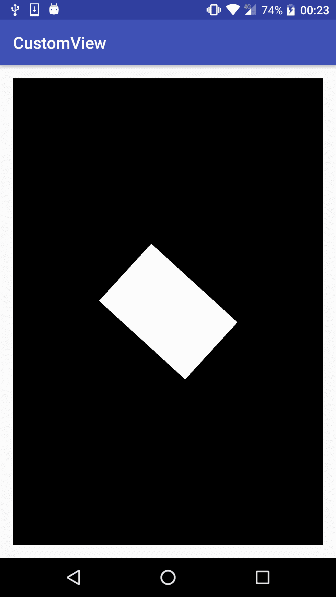
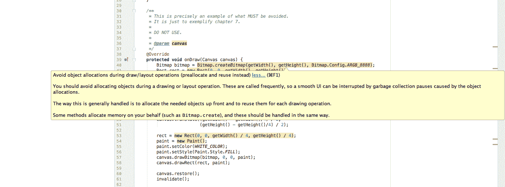
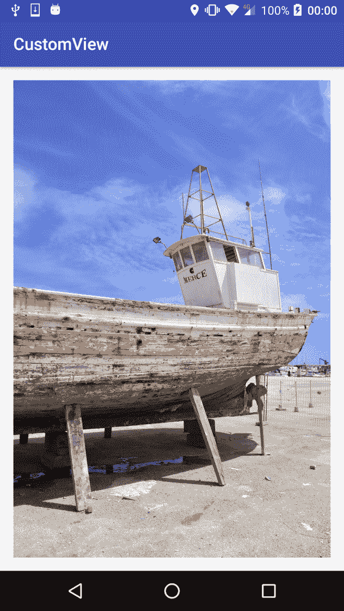
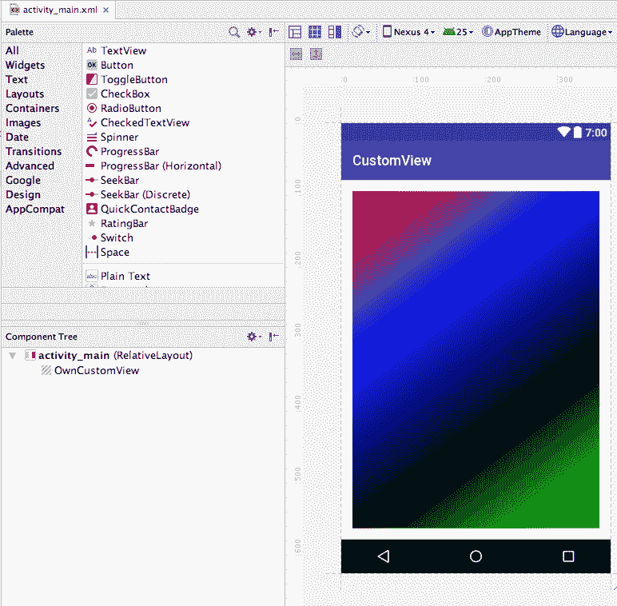

# 性能考虑

在前面的章节中，我们已经简单讨论了性能，例如，避免使用`onDraw()`方法进行一些操作。但是我们还没有详细介绍为什么您应该遵循这些建议，以及不遵循这些最佳实践对自定义视图和使用它的应用的真正影响。我们将在这里解释的许多事情可能看起来是常识，实际上它们应该是常识，但有时我们可能不会考虑它们，或者我们可能不知道或意识到它可能对应用产生的真正影响，无论是从性能角度还是从电池消耗角度。

在本章中，我们将讨论这些问题，并将更详细地研究以下主题:

*   建议和最佳做法
*   不考虑性能时对应用的影响
*   代码优化

# 业绩影响和建议

正如我们刚才所说的，除非我们遭受了损失，或者我们支持低端或非常旧的设备，否则我们可能甚至不知道不遵循性能建议或最佳实践会有什么影响。如果我们使用高端设备来测试我们当前正在开发的产品，我们可能看不到它在低端设备上的表现，并且很可能会有更多的下载或更多的用户在中低端设备上使用它。这几乎和我们开发一个网络连接的软件一样，有一个漂亮可靠的无线网络连接，或者有一个无限的 4G 网络。对于那些连接有限或计量连接的用户，尤其是那些仍在 2G 网络上的用户，体验可能会有所不同。

在这两种情况下，重要的是考虑到我们所有的目标用户，并在不同的设备和硬件下进行测试。

# 不遵循最佳实践的影响

我们在最后几章给出的建议之一是避免在`onDraw()`方法中分配对象。但是如果我们开始分配对象会发生什么呢？

让我们创建一个简单的自定义视图，并故意分配一个对象，这样我们就可以在运行应用时评估结果:

```java
package com.packt.rrafols.draw; 

import android.content.Context; 
import android.graphics.Bitmap; 
import android.graphics.BitmapFactory; 
import android.graphics.Canvas; 
import android.graphics.Paint; 
import android.graphics.Path; 
import android.graphics.Rect; 
import android.graphics.Region; 
import android.util.AttributeSet; 
import android.view.GestureDetector; 
import android.view.MotionEvent; 
import android.view.View; 
import android.widget.Scroller; 

public class PerformanceExample extends View { 
    private static final String TAG =PerformanceExample.class.
                                     getName(); 

    private static final int BLACK_COLOR = 0xff000000; 
    private static final int WHITE_COLOR = 0xffffffff; 
    private float angle; 

    public PerformanceExample(Context context, AttributeSet attributeSet)
    { 
        super(context, attributeSet); 

        angle = 0.f; 
    } 

    /** 
     * This is precisely an example of what MUST be avoided. 
     * It is just to exemplify chapter 7\. 
     * 
     * DO NOT USE. 
     * 
     * @param canvas 
     */ 
    @Override 
    protected void onDraw(Canvas canvas) { 
        Bitmap bitmap = Bitmap.createBitmap(getWidth(), getHeight(), 
                        Bitmap.Config.ARGB_8888); 
           Rect rect = new Rect(0, 0, getWidth(), getHeight()); 
           Paint paint = new Paint(); 
           paint.setColor(BLACK_COLOR); 
           paint.setStyle(Paint.Style.FILL); 
           canvas.drawRect(rect, paint); 
           canvas.save(); 

           canvas.rotate(angle, getWidth() / 2, getHeight() / 2); 
           canvas.translate((getWidth() - getWidth()/4) / 2, 
                 (getHeight() - getHeight()/4) / 2); 

           rect = new Rect(0, 0, getWidth() / 4, getHeight() / 4); 
           paint = new Paint(); 
           paint.setColor(WHITE_COLOR); 
           paint.setStyle(Paint.Style.FILL); 
           canvas.drawBitmap(bitmap, 0, 0, paint); 
           canvas.drawRect(rect, paint); 
           canvas.restore(); 
           invalidate(); 
           bitmap.recycle(); 
           angle += 0.1f; 
       } 
    } 
```

在这个快速的例子中，我们在`onDraw()`方法中分配了几个东西，从`Paint`对象到`Rect`对象，再到创建一个新的`bitmap`，分配内部内存。

如果我们运行这段代码，我们将在屏幕中间得到一个旋转的白色矩形，如下图所示:



此外，我们不仅会得到类似的观点。如果我们在应用运行时检查 logcat 日志，我们可能会得到类似如下的行:

```java
I art : Starting a blocking GC Explicit
I art : Explicit concurrent mark sweep GC freed 198893(13MB) AllocSpace objects, 30(656KB) LOS objects, 26% free, 43MB/59MB, paused 2.835ms total 313.353ms
I art : Background partial concurrent mark sweep GC freed 26718(2MB) AllocSpace objects, 1(20KB) LOS objects, 27% free, 43MB/59MB, paused 3.434ms total 291.430ms
```

我们甚至可能在应用执行过程中多次得到它们。这是安卓运行时的垃圾收集器，用来清理未使用的对象以释放一些内存。当我们不断创建新对象时，虚拟机会触发垃圾收集器来释放一些内存。

关于垃圾收集的更多信息可以在以下网址找到:
。

幸运的是，安卓工作室已经非常清楚地向我们表明，我们在我们的`onDraw()`方法中做错了什么:



它也向我们展示了如果我们不遵循这个建议可能会导致什么。在这种情况下，如果垃圾收集器在滚动或绘图的过程中启动，我们可能会遇到一些口吃，或者简单地说，一个平滑的动画可能会被视为跳动或不像它应该的那样平滑。

在 GitHub 存储库中的`Example30-Performance`文件夹中检查这个例子的完整源代码，这是不应该遵循的。请用它作为一个应该避免的例子。

# 代码优化

在自定义视图中考虑性能时，分配对象并不是我们唯一应该考虑的事情。计算的数量，计算的类型，我们画的图元的数量，透支的数量，以及我们应该检查的东西的列表，都是相当大的。最后，大多数事情都是常识:只是不要重新计算我们已经拥有的值，如果不需要更改，就最大限度地增加代码中可以跳过的部分，或者，基本上，尽量重复使用在以前的帧上计算过的值。

让我们比较两种将 YUV 像素数据转换为 RGB 的方法。这不是您在自定义视图中必须做的最典型的事情，但是它完美地展示了如何通过尽可能多的重用以及不重新计算不需要重新计算的内容来影响性能。

在安卓系统中从相机取景器获取帧时，通常是 YUV 格式，而不是 RGB 格式。更多关于 YUV 的信息可以在以下网址找到:
[【https://en.wikipedia.org/wiki/YUV】](https://en.wikipedia.org/wiki/YUV)。

我们将从一个简单的代码开始，并逐步优化它，以评估所有优化的影响:

```java
private static void yuv2rgb(int width, int height, byte[] yuvData,
    int[] rgbData) { 
    int uvOffset = width * height; 
    for (int i = 0; i < height; i++) { 
         int u = 0; 
         int v = 0; 
         for (int j = 0; j < width; j++) { 
           int y = yuvData[i * width + j]; 
           if (y < 0) y += 256; 

           if (j % 2 == 0) { 
               u = yuvData[uvOffset++]; 
               v = yuvData[uvOffset++]; 
            } 

            if (u < 0) u += 256; 
            if (v < 0) v += 256; 

            int nY = y - 16; 
            int nU = u - 128; 
            int nV = v - 128; 

            if (nY< 0) nY = 0; 

            int nR = (int) (1.164 * nY + 2.018 * nU); 
            int nG = (int) (1.164 * nY - 0.813 * nV - 0.391 * nU); 
            int nB = (int) (1.164 * nY + 1.596 * nV); 

            nR = min(255, max(0, nR)); 
            nG = min(255, max(0, nG)); 
            nB = min(255, max(0, nB)); 

            nR&= 0xff; 
            nG&= 0xff; 
            nB&= 0xff; 

            int color = 0xff000000 | (nR<< 16) | (nG<< 8) | nB; 
            rgbData[i * width + j] = color; 
        } 
    } 
} 
```

此版本基于 YUV 转 RGB 转换器，可在以下网址找到:
[【https://searchcode.com/codesearch/view/2393/】](https://searchcode.com/codesearch/view/2393/)
[【http://sourceforge.jp/projects/nyartoolkit-and/】](http://sourceforge.jp/projects/nyartoolkit-and/)。

我们在这里使用了浮点版本，这样我们可以在以后看到与定点版本的差异。

现在，让我们创建一个小的自定义视图，在每一帧中，将一个 YUV 图像转换为 RGB，将其设置为`Bitmap`，并在屏幕上绘制:

```java
@Override 
protected void onDraw(Canvas canvas) { 
    yuv2rgb(imageWidth, imageHeight, yuvData, rgbData); 
    bitmap.setPixels(rgbData, 0, imageWidth, 0, 0, imageWidth,
    imageHeight); 

    canvas.drawBitmap(bitmap, 0.f, 0.f, null); 

    frames++; 
    invalidate(); 
} 
```

让我们也添加一个代码来检查我们的小代码每秒能够绘制的帧数。我们将使用这一测量来检查我们将要进行的优化的性能改进:

```java
if (timeStart == -1) { 
    timeStart = SystemClock.elapsedRealtime(); 
} else { 
    long tdiff = SystemClock.elapsedRealtime() - timeStart; 
    if (tdiff != 0) { 
        float fps = ((float) frames * 1000.f) / tdiff; 
        Log.d(TAG, "FPS: " + fps); 
    } 
} 
```

如果我们按原样运行这段代码，在我的设备上，它的测量值为每秒 1.20 帧。使用的演示图像是*1000 x1500*图像。让我们看看我们能做些什么来改进它。

首先，我们可以删除一些不必要的计算:

```java
private static void yuv2rgb(int width, int height, byte[] yuvData,
    int[] rgbData) { 
    int uvOffset = width * height; 
    int offset = 0; 
    for (int i = 0; i < height; i++) { 
        int u = 0; 
        int v = 0; 
        for (int j = 0; j < width; j++) { 
            int y = yuvData[offset]; 
            ... 
            rgbData[offset] = color; 

            offset++; 
        } 
    } 
} 
```

这里，我们去掉了像素位置的两个计算，我们在每个像素上只增加一个增量。在前一种情况下，它正在进行计算`i * width + j`以读取`yuvData`和写入`rgbData`。如果我们检查这个变化后的每秒帧数，我们会注意到它已经稍微增加到 1.22。不是很大的进步，但这是一个开始。

现在，我们可以在最初的实现中看到，安卓软件开发工具包中使用的实现，浮点操作被注释掉了，取而代之的是定点操作。浮点运算通常比普通整数运算更昂贵。在过去的几年里，浮点运算的性能随着所有新硬件的出现而有了很大的提高，但是整数运算仍然更快。我们将无法获得与浮点运算相同的精度，但通过使用定点运算，我们可以获得相当好的近似值。

更多关于定点运算的信息可以在以下网址找到:
[【https://en.wikipedia.org/wiki/Fixed-point_arithmetic】](https://en.wikipedia.org/wiki/Fixed-point_arithmetic)。

当使用定点算法时，我们必须定义一个整数值的位数，该位数将被用作定点精度。剩余的位将用于实际存储整数值。很明显，当我们使用更多的位来存储它时，我们会有更高的精度，但是，另一方面，我们将有更少的位来存储整数值。这个想法是将所有的常数和运算都乘以 2 的幂，在做了所有的运算之后，将结果除以同一个数。由于它是 2 的幂，我们可以轻松地执行快速按位右移操作，而不是代价高昂的除法。

例如，如果我们使用 10 位的定点精度，我们必须将所有值乘以 *1，024* 或将它们左移 10 位，并且在所有计算结束时，执行 10 位的右移。

让我们将此应用于这些操作:

```java
int nR = (int) (1.164 * nY + 2.018 * nU); 
int nG = (int) (1.164 * nY - 0.813 * nV - 0.391 * nU); 
int nB = (int) (1.164 * nY + 1.596 * nV); 
```

我们正在将它们转化为以下内容:

```java
int nR = (int) (1192 * nY + 2066 * nU); 
int nG = (int) (1192 * nY - 833 * nV - 400 * nU); 
int nB = (int) (1192 * nY + 1634 * nV); 
```

我们可以检查 *1.164 * 1，024* 是`1192`向上舍入的，这同样适用于所有其他常数-我们舍入数字以获得最有效的近似值。

出于同样的原因，我们必须更改以下检查:

```java
nR = min(255, max(0, nR)); 
nG = min(255, max(0, nG)); 
nB = min(255, max(0, nB)); 
```

我们必须用 *255*255* 乘以*1024*来改变向左移动`10`位置的支票:

```java
nR = min(255 << 10, max(0, nR)); 
nG = min(255 << 10, max(0, nG)); 
nB = min(255 << 10, max(0, nB)); 
```

在使用这些值输出颜色之前，用 *1，024* 或`10`右移相加除法:

```java
nR>>= 10; 
nG>>= 10; 
nB>>= 10; 
```

实现这些变化，即使我们比浮点版本增加了一些操作，也会将我们的每秒帧数计数器提高到 *1.55* 。

我们可以做的另一个小优化是避免计算每个组件的`luminance`因子，因为它在每种情况下都是相同的。让我们替换这段代码:

```java
int nR = (int) (1192 * nY + 2066 * nU); 
int nG = (int) (1192 * nY - 833 * nV - 400 * nU); 
int nB = (int) (1192 * nY + 1634 * nV); 
```

有了这个，只计算`luminance`一次:

```java
int luminance = 1192 * nY; 
int nR = (int)(luminance + 2066 * nU); 
int nG = (int)(luminance - 833 * nV - 400 * nU); 
int nB = (int)(luminance + 1634 * nV); 
```

大多数编译器都应该对此进行优化；我不确定新的编译器 D8 和 R8 会做什么，但是使用当前的 Java/Android 工具，它没有被优化。通过做这个小改动，我们将每秒帧数计数器增加到 *1.59* 。

这种 YUV 文件格式的工作方式是两个`luminance`值共享一对`U`和`V`色度值，因此让我们尽量利用这一点来同时计算两个像素，避免额外的检查和代码开销:

```java
for(int j = 0; j < width; j += 2) {
   int y0 = yuvData[offset]; 
   if (y0 < 0) y0 += 256; 

   int y1 = yuvData[offset + 1]; 
   if (y1 < 0) y1 += 256; 

   u = yuvData[uvOffset++]; 
   v = yuvData[uvOffset++]; 
   if (u < 0) u += 256; 
   if (v < 0) v += 256; 

   int nY0 = y0 - 16; 
   int nY1 = y1 - 16; 
   int nU = u - 128; 
   int nV = v - 128; 

   if (nY0 < 0) nY0 = 0; 
   if (nY1 < 0) nY1 = 0; 

   int chromaR = 2066 * nU; 
   int chromaG = -833 * nV - 400 * nU; 
   int chromaB = 1634 * nV; 

   int luminance = 1192 * nY0; 
   int nR = (int) (luminance + chromaR); 
   int nG = (int) (luminance + chromaG); 
   int nB = (int) (luminance + chromaB); 

   nR = min(255 << 10, max(0, nR)); 
   nG = min(255 << 10, max(0, nG)); 
   nB = min(255 << 10, max(0, nB)); 

   nR>>= 10; 
   nG>>= 10; 
   nB>>= 10; 

   nR&= 0xff; 
   nG&= 0xff; 
   nB&= 0xff; 

   rgbData[offset] = 0xff000000 | (nR<< 16) | (nG<< 8) | nB; 

   luminance = 1192 * nY1; 
   nR = (int) (luminance + chromaR); 
   nG = (int) (luminance + chromaG); 
   nB = (int) (luminance + chromaB); 

   nR = min(255 << 10, max(0, nR)); 
   nG = min(255 << 10, max(0, nG)); 
   nB = min(255 << 10, max(0, nB)); 

   nR>>= 10; 
   nG>>= 10; 
   nB>>= 10; 

   nR&= 0xff; 
   nG&= 0xff; 
   nB&= 0xff; 

   rgbData[offset + 1] = 0xff000000 | (nR<< 16) | (nG<< 8) | nB; 

   offset += 2; 
} 
```

我们现在只是计算一次色度分量，并且我们已经移除了检查，以仅每两个像素获得新的`U`和`V`分量。做这些改变将我们的每秒帧数提高到了 *1.77* 。

由于 Java 字节的范围从-128 到 127，我们添加了一些负数检查，但是我们可以执行快速按位“与”运算(`&`)来代替这些检查:

```java
for (int i = 0; i < height; i++) { 
    for (int j = 0; j < width; j += 2) { 
      int y0 = yuvData[offset    ] & 0xff; 
      int y1 = yuvData[offset + 1] & 0xff; 

      int u = yuvData[uvOffset++] & 0xff; 
      int v = yuvData[uvOffset++] & 0xff; 

        ... 
   } 
} 
```

这个微小的变化略微增加了我们的每秒帧数，与 *1.83* 相反。但是我们还是可以多优化一点。我们已经使用了`10`位的定点算术精度，但是，在这种特殊情况下，我们可能已经使用了足够的`8`位精度。从`10`位精度变为仅`8`将为我们节省一次操作:

```java
for (int i = 0; i < height; i++) { 
  for (int j = 0; j < width; j += 2) { 
        ... 
    int chromaR = 517 * nU; 
    int chromaG = -208 * nV - 100 * nU; 
    int chromaB = 409 * nV; 

    int lum = 298 * nY0; 

    nR = min(65280, max(0, nR)); 
    nG = min(65280, max(0, nG)); 
    nB = min(65280, max(0, nB)); 

    nR<<= 8; 
    nB>>= 8; 

    nR&= 0x00ff0000; 
    nG&= 0x0000ff00; 
    nB&= 0x000000ff; 

    rgbData[offset] = 0xff000000 | nR | nG | nB; 

        ... 

    offset += 2; 
   } 
} 
```

我们已经更新了所有要乘以`256`的常数，而不是 *1，024* ，并且我们已经更新了检查。出现在代码上的常数`65280`是`255`乘以`256`。在代码中，为了得到实际的颜色分量，我们需要向右移动`8`的红色分量，向左移动`16`的红色分量，将其调整到颜色分量中的 ARGB 位置，这样我们只需向左移动`8`位即可。在绿色坐标上就更好了——我们要向右移动`8`，向左移动`8`，这样就可以保持原样，完全不移动。我们仍然需要将蓝色部分向右移动`8`位置。

我们还必须更新掩码，以检查每个组件是否保持在 0-255 的范围内，但是现在掩码被向右移动了位位置`s0x00ff0000`、`0x0000ff00`和`0x000000ff`。

这一变化略微提高了我们的每秒帧数，达到了 *1.85* ，但是我们还可以更进一步。让我们试着摆脱所有的轮班、检查和面具。我们可以通过使用一些预先计算好的表来做到这一点，我们将在创建自定义视图时计算一次这些表。让我们创建这个函数来预先计算我们需要的一切:

```java
private static int[] luminance; 
private static int[] chromaR; 
private static int[] chromaGU; 
private static int[] chromaGV; 
private static int[] chromaB; 

private static int[] clipValuesR; 
private static int[] clipValuesG; 
private static int[] clipValuesB; 

private static void precalcTables() {
    luminance = new int[256];
    for (int i = 0; i <luminance.length; i++) {
        luminance[i] = ((298 * (i - 16)) >> 8) + 300;
    }
    chromaR = new int[256]; 
    chromaGU = new int[256]; 
    chromaGV = new int[256]; 
    chromaB = new int[256]; 
    for (int i = 0; i < 256; i++) {
       chromaR[i] = (517 * (i - 128)) >> 8;
       chromaGU[i] = (-100 * (i - 128)) >> 8;
       chromaGV[i] = (-208 * (i - 128)) >> 8;
       chromaB[i] = (409 * (i - 128)) >> 8;
    }

    clipValuesR = new int[1024]; 
    clipValuesG = new int[1024]; 
    clipValuesB = new int[1024]; 
    for (int i = 0; i < 1024; i++) { 
       clipValuesR[i] = 0xFF000000 | (min(max(i - 300, 0), 255) << 16); 
       clipValuesG[i] = min(max(i - 300, 0), 255) << 8; 
       clipValuesB[i] = min(max(i - 300, 0), 255); 
    } 
} 
```

我们正在计算`luminance`的值，所有色度分量，最后是所有内容的剪切、移位和屏蔽值。由于`luminance`和一些色度可能为负，我们在`luminance`值中添加了一个 *+* `300`值，因为它将被添加到所有值中，然后调整`clipValues`表以考虑到`300`偏移。否则，我们可能会尝试用负索引来索引数组，这将使我们的应用崩溃。在访问数组之前检查索引是否为负将会终止所有的性能优化，因为我们正在尽可能地摆脱所有的操作和检查。

使用这些表，我们的 YUV 到 RGB 转换器代码简化为以下内容:

```java
private static void yuv2rgb(int width, int height, byte[] yuvData,
    int[] rgbData) { 
    int uvOffset = width * height; 
    int offset = 0; 

    for (int i = 0; i < height; i++) { 
        for (int j = 0; j < width; j += 2) { 
        int y0 = yuvData[offset ] & 0xff; 
        int y1 = yuvData[offset + 1] & 0xff; 

        int u = yuvData[uvOffset++] & 0xff; 
        int v = yuvData[uvOffset++] & 0xff; 

        int chR = chromaR[u]; 
        int chG = chromaGV[v] + chromaGU[u]; 
        int chB = chromaB[v]; 

        int lum = luminance[y0]; 
        int nR = clipValuesR[lum + chR]; 
        int nG = clipValuesG[lum + chG]; 
        int nB = clipValuesB[lum + chB]; 

        rgbData[offset] = nR | nG | nB; 

        lum = luminance[y1]; 
        nR = clipValuesR[lum + chR]; 
        nG = clipValuesG[lum + chG]; 
        nB = clipValuesB[lum + chB]; 

        rgbData[offset + 1] = nR | nG | nB; 

        offset += 2; 
       } 
    } 
} 
```

有了这些变化，与原始方法相比，我们获得了每秒 2.04 帧的计数器，或者说性能提高了 70%的 T2。无论如何，这只是代码如何优化的一个例子；如果你真的想实时地将一个 YUV 图像转换成 RGB，我建议你要么检查一个原生的 C 或 C++实现，要么选择 GPU 或渲染脚本方法。

最后，如果我们运行这个应用，我们将得到一个类似于下面截图的屏幕。我们没有对图像进行缩放或应用任何额外的转换，因为我们只是想测量从 YUV 图像转换为 RGB 图像所需的时间。您的屏幕图像可能会因屏幕大小和设备而异:



检查 GitHub 存储库中`Example31-Performance`文件夹中的整个示例源代码。

在谈论性能时，还有许多其他事情需要考虑。如果你想知道更多关于 Java 代码如何被翻译成 dexbyte 代码并在 Android VM 中执行的细节，请看下面的演示:
[https://www . slide share . net/RaimonRls/the-byte code-mumbo](https://www.slideshare.net/RaimonRls/the-bytecode-mumbojumbo)。

# 嘲弄预览窗口

在安卓工作室上预览我们的自定义视图时，有些情况下计算可能会非常复杂，或者，例如，我们需要初始化一些数据，但是在安卓工作室的预览窗口中显示我们的自定义视图时，我们不能这样做。我们可以通过检查 is `InEditMode()`方法来解决这个问题。

如果我们在 ide 或开发工具中，这个方法将返回真。了解了这些信息，我们可以很容易地模拟一些数据，或者简化渲染，只显示我们想要绘制的预览。

例如，在 GitHub 存储库中的`Example07-BuilderPattern`文件夹中，我们在自定义视图创建时调用此方法来更改渐变中使用的颜色值，尽管我们实际上也可以在`onDraw()`方法中调用它来更改视图的渲染:



# 摘要

在本章中，我们已经看到了不遵循性能建议的影响，以及为什么在实现我们自己的定制视图时有一组最佳实践和我们应该避免的事情。我们还看到了如何提高或优化代码的性能，以及如何调整或定制视图以在安卓工作室的集成开发环境预览窗口中呈现预览。

正如我们将在下一章中看到的，我们的自定义视图是被其他人使用还是被我们自己使用，应该不会有什么不同。它不应该让使用它的应用因此崩溃或行为不检。就像包含第三方库一样，它永远不会使我们的应用崩溃，否则，我们很可能会停止使用它，用另一个库替换它。

因此，在下一章中，我们不仅将看到如何应用这些建议，还将看到如何使我们的自定义视图可在许多应用中重用，以及如何共享或开源它，以便它可以在安卓社区中广泛使用。