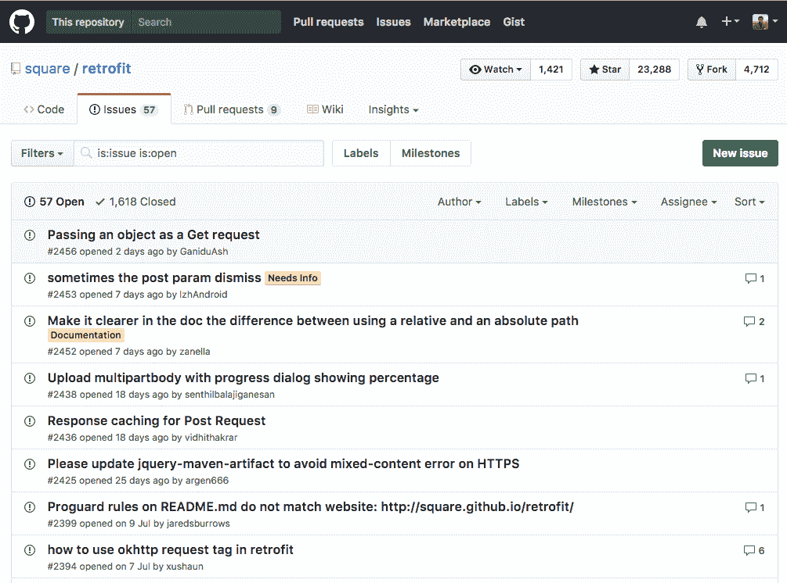
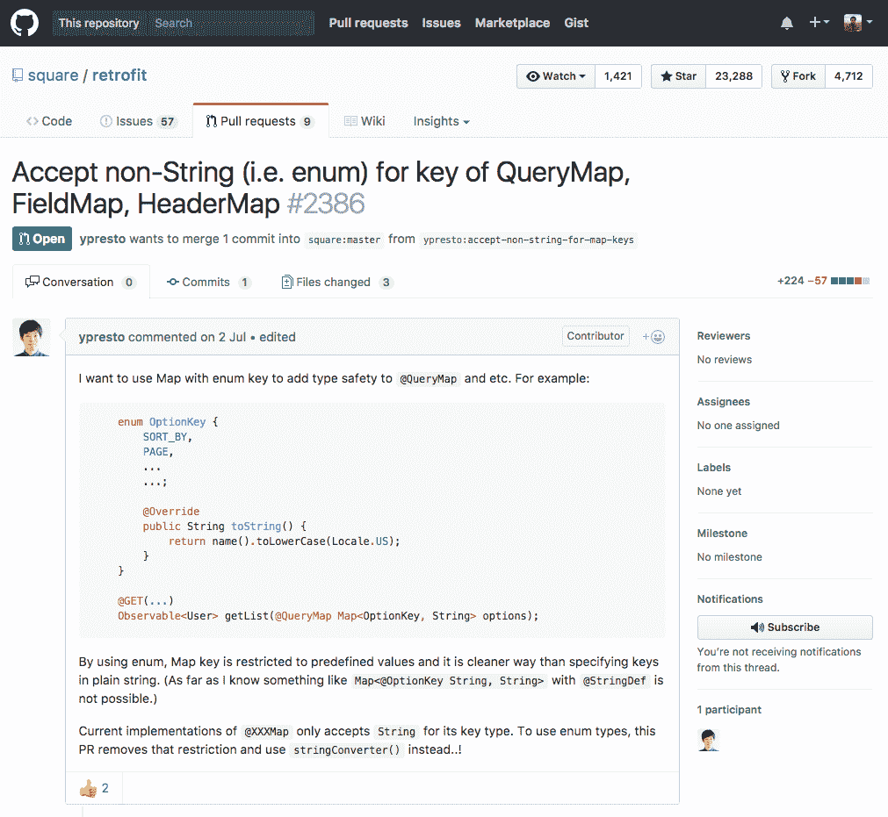
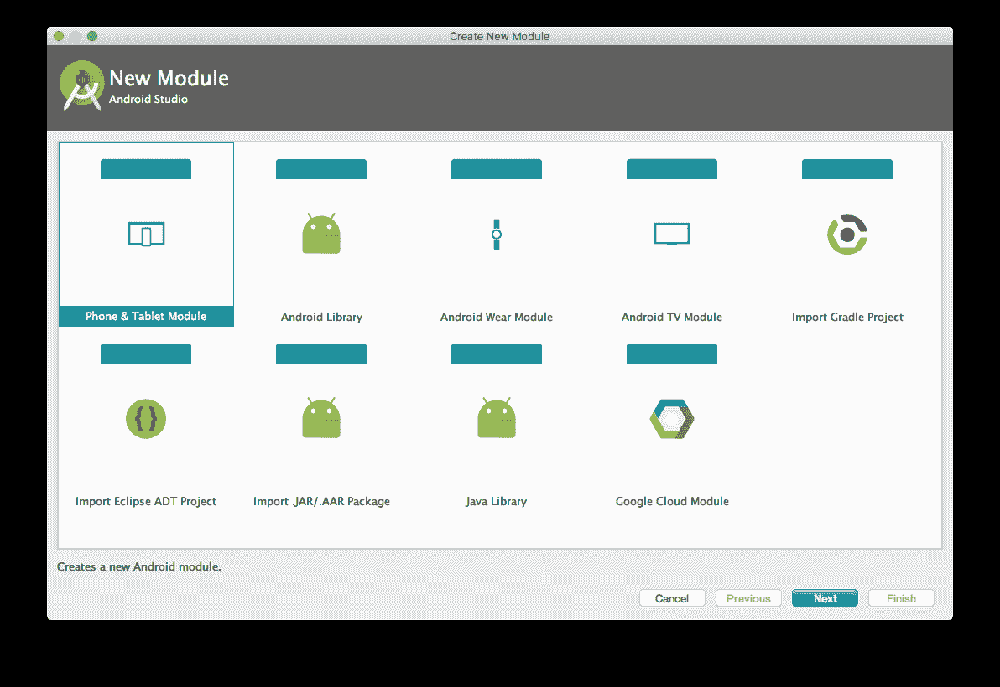
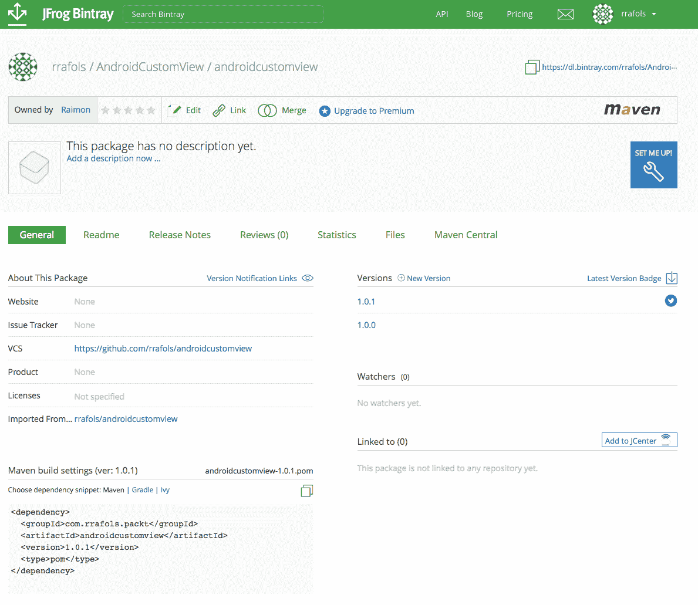
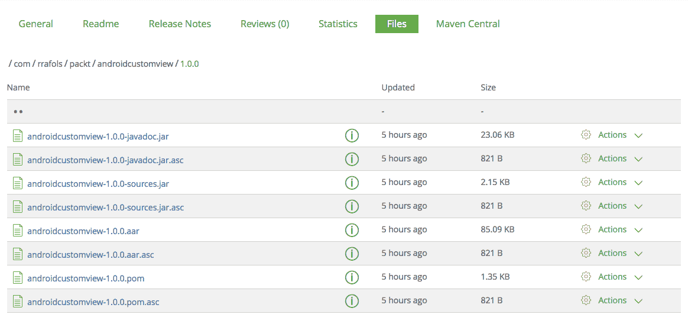

# 八、分享我们的定制视图

在最后几章中，我们已经构建了我们的定制视图，或者其中的许多视图。我们已经看到了如何与他们互动，如何绘制 2D 和三维图元，我们希望其他人能够使用它。这是个好主意！它可能是为我们自己，我们可能在未来的项目中重用它，或者它可能是我们的一个同事的项目。如果我们的目标更高，这可能是安卓社区的一个项目。

安卓社区令人敬畏的一点是有很多开源库。开发人员的所有这些贡献帮助了许多其他开发人员开始安卓开发，学习更深入地理解一些概念，或者能够在第一时间构建他们的应用。

首先，发布你的定制视图，或者，例如，一个安卓库，是促成这个惊人社区的方法之一。其次，通过这样做，这是一个很好的方式来宣传自己，展示你的雇主的开放性，也吸引人才到你的公司。

在这一章中，我们将看到如果我们想要分享我们的定制视图以及如何做到这一点，我们应该考虑什么。我们还将实践我们在前面几章中给出的一些重要建议。更重要的是，我们希望其他开发人员使用我们的自定义视图。

更详细地说，我们将涵盖以下主题:

*   建议和最佳做法
*   发布您的自定义视图

几乎所有给定的建议不仅可以应用于自定义视图，还可以应用于我们想要共享或想要为同事或其他项目重用的任何安卓库。

# 分享我们定制视图的最佳实践

我们应该始终以尽可能高的质量为目标，即使我们只是为自己或一个小应用构建定制视图或组件。然而，如果我们想要共享我们的定制视图，以便其他人可以使用它，我们必须考虑一些额外的检查和最佳实践。如果这是我们的目标，并且我们希望让尽可能多的开发人员在他们的应用中使用或贡献它，那么如果我们忽略这些基本建议，让他们参与进来将是非常具有挑战性的。

# 考虑和建议

我们应该考虑的是，一旦我们共享了我们的定制视图，它可能会用于许多安卓应用。如果我们的自定义视图有错误和崩溃，它将崩溃使用它的应用。应用的用户不会认为自定义视图有问题，而是认为应用本身有问题。应用开发人员可能会尝试打开一个问题，甚至提交一个请求来修复它，但是如果自定义视图给他们带来太多麻烦，他们只会替换它。

这也适用于您自己的应用；您不想使用不稳定的组件或自定义视图，因为您可能会重写或修补它。正如我们刚刚提到的，我们应该始终以最高质量为目标。如果我们的自定义视图仅在一个应用中使用，那么一旦关键问题出现在生产阶段，或者应用发布到商店，发现该问题的影响只影响一个应用。但是，如果它被多个应用使用，维护的影响和成本就会增加。您可以想象检测到开源组件的一个非常关键的问题，并不得不对使用它的所有应用进行新的发布，会产生什么样的影响。

此外，您应该尝试保持您的代码干净、组织良好、经过适当测试并有合理的文档记录。如果您在公司共享自定义视图，您和您的同事将更容易维护自定义视图，如果它是开源的，它将鼓励贡献，并且实际上不会吓到外部贡献者。和许多其他事情一样，常识也适用。不要过度记录你的自定义视图，因为基本上没有人会阅读它；尽可能简单，直奔主题。

在下面的截图中，我们可以看到`retrofit`库的开放问题，这是一个在很多应用中广泛使用的开源安卓库:



此外，我们可以看到有许多由几个开发人员提交的请求，要么修复问题，要么添加功能或特性。下面的截图是一个提交到`retrofit`库的拉取请求的例子:



我们之前已经介绍过了，但是自定义视图的行为是否正确也很重要。它不仅必须无崩溃，而且还必须在几个设备和分辨率上正常工作，并具有良好的性能。

我们可以用以下几点来总结建议清单:

*   稳定的
*   跨设备和分辨率工作
*   性能
*   应用最佳代码实践和标准风格开发
*   正确记录并易于使用

# 可配置的

我们已经在[第 2 章](02.html)*中解释了如何实现您的第一个自定义视图*，如何参数化自定义视图。我们创建它是因为它可能服务于一个非常特定的目的，但是一般来说，它越是可配置，就越有可能在其他地方使用。

假设我们正在构建一个进度条。如果我们的自定义视图总是画一个水平的红色条，它会有它的用途，但不会很多，因为它太具体了。如果我们允许应用的开发人员使用这个定制视图来定制栏的颜色，我们将为它添加几个其他用例。此外，如果我们还允许开发人员配置背景颜色或我们绘制的图元类型，而不是水平条，我们将使用自定义视图覆盖更多不同的场景。

我们也需要小心；添加这么多选项也会增加代码和组件本身的复杂性。配置颜色很简单，不会有太大的影响，但是能够改变绘图原语，例如，可能有点棘手。增加复杂性可能会影响性能、稳定性，以及我们在发布或制作新版本时测试和验证所有场景是否正常工作的能力。

# 发布我们的自定义视图

一旦我们对自己的定制视图及其方式感到满意，我们就准备好分享它了。如果我们也遵循了最佳实践和建议，我们可能会更有信心。即使你没有，最好的学习方法是尽快从社区获得反馈。不要害怕犯错；你会在路上学到的。

发布自定义视图的方式有很多种:例如，我们可以将其开源，或者我们可以将编译后的二进制文件发布为 SDK 或 Android 库。上面给出的大多数建议都是针对开源方法或内部重用的，无论是针对您自己还是您的同事，但是如果您的目标是发布一个封闭的 SDK，或者只是将编译后的二进制文件作为一个库，那么它们中的许多(不是全部)也适用。

# 开放采购我们的定制视图

开放源码定制视图，或者安卓库，非常简单明了。您需要确保执行一些额外的步骤，但是过程本身非常简单。

我们一直在用 GitHub 分享这本书例子的源代码。这不是巧合。GitHub 是共享源代码和开源库和项目最广泛使用的工具之一。这也是我们将推荐的工具，并将在本章中用来解释如何发布我们的自定义视图。

先有事情；如果我们没有 GitHub 帐户，我们必须自己注册并创建它。只要我们只想托管公共存储库或公共可访问的代码，创建帐户就是免费的。如果我们想用它来存储私有代码库，我们有付费选项。就本书的范围而言，免费选项已经足够了。

我们可以直接从首页:[https://www.github.com](https://www.github.com)或者从:
[https://github.com/join](https://github.com/join)[注册。](https://github.com/join)

一旦我们创建了帐户，我们就创建一个代码存储库来存储代码。我们可以在:
[【https://github.com/new.】](https://github.com/new) 进行，如下图截图所示:


我们必须选择一个存储库名称。强烈建议添加描述，以便其他人更容易理解我们的组件或库在做什么。我们还有添加`.gitignore`文件和添加许可证的选项。

`.gitignore`是一个相当有用的文件。这里提到的所有文件都不会上传到 GitHub。例如，没有必要上传所有的临时文件，构建，中间构建文件，或从安卓工作室的配置文件，这些文件保存了项目的信息，具体到我们的本地计算机。例如，知道我们将项目存储在`\Users\raimon\development\AndroidCustomView`中对任何人都没有用。

添加许可证对于确定我们授予那些使用我们源代码的人什么权利非常重要。开源项目最常见的一些许可证是 Apache 2.0、麻省理工学院和 GPLv3 许可证:

*   麻省理工学院是限制和许可较少的执照。它允许其他方以他们想要的任何方式使用源代码，只要他们包括许可证和版权声明。
*   Apache 2.0 也相当宽松。像麻省理工学院的许可证一样，它允许其他方以他们想要的任何方式使用源代码，只要他们包括许可证和版权声明，并说明对原始文件所做的更改。
*   GPLv3 的限制稍微更严格，因为它强制任何使用您的源代码的人在相同的许可下分发使用它的应用的源代码。这对于一些公司来说可能是一种限制，因为他们希望保留其源代码的知识产权。

这三个许可证都限制了原始开发者的责任，并且不提供任何担保。他们都按原样提供软件或源代码。

许多安卓库使用麻省理工学院或 Apache 2.0 许可证，我们建议您在自定义视图中使用这两种许可证。

一旦创建并初始化了存储库，我们就可以上传我们的代码了。我们可以使用任何我们喜欢的 Git 客户端，或者简单地使用命令行界面。

首先，我们克隆刚刚创建的存储库——只是作为参考，而不是真正的存储库:

```java
raimon$ git clone https://github.com/rrafols/androidcustomview.git 
Cloning into 'androidcustomview'... 
remote: Counting objects: 5, done. 
remote: Compressing objects: 100% (4/4), done. 
remote: Total 5 (delta 0), reused 0 (delta 0), pack-reused 0 
Unpacking objects: 100% (5/5), done. 
```

检查连通性。完成了。

如果我们已经创建了包含源代码的目录，Git 会抱怨它无法创建目录:

```java
raimon$ git clone https://github.com/rrafols/androidcustomview.git 
```

致命:目标路径`androidcustomview`已经存在，不是空目录。

在这种情况下，我们必须使用不同的方法。首先，我们必须初始化本地存储库:

```java
androidcustomview raimon$ gitinit 
Initialized empty Git repository in /Users/raimon/dev/androidcustomview/.git/ 
```

然后添加远程存储库:

```java
androidcustomview raimon$ git remote add origin https://github.com/rrafols/androidcustomview.git 
```

最后，从主分支中提取内容:

```java
androidcustomview raimon$ git pull origin master 
remote: Counting objects: 5, done. 
remote: Compressing objects: 100% (4/4), done. 
remote: Total 5 (delta 0), reused 0 (delta 0), pack-reused 0 
Unpacking objects: 100% (5/5), done. 
From https://github.com/rrafols/androidcustomview 
 * branch            master     -> FETCH_HEAD 
 * [new branch]      master     -> origin/master 
```

现在我们可以将所有想要添加的文件添加到 GitHub 存储库中。在这种情况下，我们将添加所有内容，Git 将自动忽略那些与`.gitignore`文件上的模式匹配的文件:

```java
androidcustomview raimon$ git add *
```

我们现在可以提交到本地存储库。始终使用有意义的提交消息或描述，因为这将有助于以后了解更改的内容:

```java
androidcustomview raimon$ git commit -m "Adding initial files" 
[master bc690c7] Adding initial files 
 6 files changed, 741 insertions(+) 
```

完成后，我们准备将这些提交推送到远程存储库，在本例中位于[https://github.com/](https://github.com/):

```java
androidcustomview raimon$ git push origin master 
Username for 'https://github.com': rrafols 
Password for 'https://rrafols@github.com':  
Counting objects: 9, done. 
Delta compression using up to 4 threads. 
Compressing objects: 100% (8/8), done. 
Writing objects: 100% (8/8), 6.06 KiB | 0 bytes/s, done. 
Total 8 (delta 3), reused 0 (delta 0) 
remote: Resolving deltas: 100% (3/3), done. 
To https://github.com/rrafols/androidcustomview.git 
343509f..bc690c7 master -> master
```

有关 Git 的更多信息，请访问:
[https://en.wikipedia.org/wiki/Git](https://en.wikipedia.org/wiki/Git)。

创建存储库时，GitHub 还会询问我们是否要创建一个`README.md`文件。这个`README.md`文件将作为文档显示在存储库页面上。它是使用 markdown 格式化的，这就是为什么扩展是`.md`，重要的是保持它与关于项目的信息，如何使用它，一个快速的例子，以及许可证和作者的提及是最新的。这里最重要的部分是，任何想要使用您的自定义视图的人都可以非常快速地检查如何使用，许可证是否合适，以及如何联系您寻求支持和帮助。最后一部分是可选的，因为他们总是可以在 GitHub 上打开一个问题，但这很好。我们甚至可以直接从:
[【https://github.com/】](https://github.com/)编辑和预览更改。

保持文档的更新不仅很重要，保持库的维护和更新也很重要。有需要解决的 bug，需要添加的新功能，打破、贬低、改进或添加新方法的安卓新版本，以及其他开发人员打开问题或提出问题。当寻找自定义视图或安卓库时，如果没有最近的更新，或者至少在最近几个月没有更新，它看起来会被放弃，这大大减少了其他人使用它的机会。

# 创建二进制工件

我们一直在谈论共享定制视图和安卓库，好像它们是一样的。共享自定义视图最合适的方式是作为安卓库。安卓应用和安卓库的主要区别在于，后者不能在设备或仿真器上单独运行，只会产生一个`.aar`文件。这个`.aar`文件稍后可以作为一个依赖项添加到安卓应用项目或其他库中。我们也可以在同一个项目中有子模块，并且它们之间有依赖关系。为了了解这是如何工作的，我们将把一个自定义视图项目转换成一个安卓库，并添加一个测试应用项目来快速测试它。

首先，一旦我们有了一个安卓应用，我们只需执行两个简单的步骤就可以将其转换为库:

1.  删除应用模块`build.gradle`文件中提到`applicationId`的那一行。

2.  将应用的插件从`com.android.application`更改为`com.android.library`。

基本上改变了以下内容:

```java
apply plugin: 'com.android.application'

android {
   compileSdkVersion 25
   buildToolsVersion"25.0.2"

   defaultConfig {
       applicationId"com.rrafols.packt.customview"
       minSdkVersion 21
       targetSdkVersion 25
       versionCode 1
       versionName"1.0"
```

更改为以下内容:

```java
apply plugin: 'com.android.library'

android {
   compileSdkVersion 25
   buildToolsVersion"25.0.2"

    defaultConfig {
       minSdkVersion 21
       targetSdkVersion 25
       versionCode 1
       versionName"1.0"
```

在我们的示例中，我们还将应用模块名重构为 lib。

有关如何将安卓应用转换为安卓库的更多信息，请访问开发者安卓文档页面:

[https://developer . Android . com/studio/project/Android-library . html](https://developer.android.com/studio/projects/android-library.html)。

如果我们正在开发或扩展这个库，我们建议在项目中添加一个新模块作为测试应用。这将大大加快定制视图的开发和测试。

我们可以使用安卓工作室文件菜单添加一个新模块:文件|新建|新模块:



一旦我们添加了一个测试应用模块，我们就向库中添加了一个依赖项。在新模块的`build.gradle`文件中，给本地 lib 模块添加一个依赖项:

```java

dependencies {
    compile project(":lib")
    compile fileTree(dir: 'libs', include: ['*.jar'])
    androidTestCompile('com.android.support.test.espresso:espresso-core:2.2.2',
    {
        exclude group: 'com.android.support', module: 'support-annotations'
    })

    compile 'com.android.support:appcompat-v7:25.3.1'
    compile 'com.android.support.constraint:constraint-layout:1.0.2'
    testCompile'junit:junit:4.12'
}
```

现在，您可以将自定义视图添加到这个新的测试应用布局中，并对其进行测试。此外，我们还可以生成一个库二进制文件来分发。它将只包括库或库模块。我们可以通过在 gradle 上执行`lib:assembleRelease`任务来做到这一点:

```java
Example32-Library raimon$ ./gradlew lib:assembleRelease 
```

我们将在`lib/build/outputs/aar/lib-release.aar`获取项目文件夹中的`.aar`文件。使用`lib:assembleDebug`任务，我们将生成调试库，或者简单地使用`lib:assembleDebug`我们将获得调试和发布版本。

您可以以任何您喜欢的方式分发二进制文件，但是一个建议是上传到工件平台。一般来说，许多公司都在使用内部工件或软件库作为他们的企业库和工件，但是如果你想让它对更广泛的公众可用，你可以把它上传到【例如 T0】。如果我们从任何安卓项目中检查我们最上面的`build.gradle`文件，我们会看到依赖于`JCenter`来寻找库:

```java
... 
repositories {
    jcenter()
}
```

例如，我们可以很容易地从宾特瑞:[https://bintray.com](https://bintray.com)做到这一点。一旦我们注册了，我们就可以创建项目，从 GitHub 导入它们，创建发布和版本，如果我们的项目被接受，甚至可以发布到`JCenter`。

有关 Bintray gradle 插件的更多信息，请访问:
[【https://github.com/bintray/gradle-bintray-plugin#readme】](https://github.com/bintray/gradle-bintray-plugin#readme)。

为了简化我们的生活，有一些开源的例子和代码可以让这个过程变得更简单。但是首先，让我们在 Bintray 上创建一个存储库。

我们将其命名为`AndroidCustomView`，将其设置为 Maven 存储库，并添加默认的 Apache 2.0 许可证:


一旦我们有了它，我们就可以创建版本或者直接从我们的 gradle 构建脚本中添加它们。为了做到这一点，我们必须给我们最顶层的`build.gradle`添加一些依赖项:

```java
buildscript {
    repositories {
        jcenter()
    }

    dependencies {
        classpath'com.android.tools.build:gradle:2.3.0'
        classpath'com.jfrog.bintray.gradle:gradle-bintrayplugin:1.4'classpath'com.github.dcendents:android-maven-gradleplugin:1.4.1'
    }
}
```

现在我们可以利用已经创建的一些开源 gradle 构建脚本。我们可以直接从 GitHub 应用它，而不是复制粘贴或向构建脚本中添加更多的代码。让我们将这两行添加到我们的库`build.gradle`文件的末尾:

```java
... 
apply from: 'https://raw.githubusercontent.com/nuuneoi/JCenter/master/installv1.gra
 dle' 
apply from: 'https://raw.githubusercontent.com/nuuneoi/JCenter/master/bintrayv1.gra
 dle' 

```

在应用了这两个梯度构建脚本之后，我们有了一个额外的任务:`bintrayUpload`。我们需要先添加工件配置，所以让我们在文件的最开始添加它，就在库模块`build.gradle`文件上的应用库行之后:

```java
apply plugin: 'com.android.library'

ext {
    bintrayRepo = 'AndroidCustomView'
    bintrayName = 'androidcustomview'
    publishedGroupId = 'com.rrafols.packt'
    libraryName = 'AndroidCustomView'
    artifact = 'androidcustomview'
    libraryDescription = 'Uploading libraries example.'
    siteUrl = 'https://github.com/rrafols/AndroidCustomView'
    gitUrl = 'https://github.com/rrafols/androidcustomview.git'
    libraryVersion = '1.0.0'
    developerId = 'rrafols'
    developerName = 'Raimon Ràfols'
    developerEmail = ''
    licenseName = 'The Apache Software License, Version 2.0'
    licenseUrl = 'http://www.apache.org/licenses/LICENSE-2.0.txt'
    allLicenses = ["Apache-2.0"]
}
```

我们需要将 Bintray 用户和 API 密钥信息添加到我们的`local.properties`文件中:

```java
bintray.user=rrafols 
bintray.apikey=<key - can be retrieved from the edit profile option on bintray.com> 
```

`bintrayRepo`变量必须与我们想要存储二进制文件的存储库相匹配，否则构建脚本将会失败。

现在我们已经完成了所有的配置，我们可以使用`./gradlew`安装构建一个新版本的库，并使用`./gradlew bintrayUpload`将其上传到 Bintray。

请记住，版本在上传后是只读的，因此我们无法覆盖它们，并且在执行 gradle 脚本时会出错，除非我们更新版本号并上传不同的版本。

一旦我们上传了一个版本，我们将看到类似于以下屏幕的内容:



我们也可以检查上传版本的文件，看看已经上传了什么。如果我们转到一个版本并进入文件菜单，我们会看到`.aar`安卓库和脚本为我们上传的所有其他文件:



正如我们所看到的，它还打包并上传了源代码`Javadoc`，并创建了一个`.pom`文件，因为它是作为 Maven 存储库托管的。

完成所有这些步骤后，我们可以通过按下添加到 JCenter 键，直接从工件库页面上传到`JCenter`。一旦获得批准，任何想要使用我们库的人都可以简单地定义对`com.rrafols.packt.androidcustomview`的依赖，并直接从`JCenter`获得它。

有关此过程和这些 gradle 构建脚本作者的更多信息，请访问:
[https://in techeesefactory . com/blog/how-upload-library-to-jcenter-maven-central-as-dependency/en](https://inthecheesefactory.com/blog/how-to-upload-library-to-jcenter-maven-central-as-dependency/en)。

一些我们没有提到但也很重要的事情是如何版本化我们的库。每当我们创建新版本时，我们都会创建一个版本号。在对我们的自定义视图进行版本控制时，强烈建议使用语义版本控制，`MAJOR.MINOR.PATCH`。这样，我们可以很容易地指出一个版本中的变化是否引入了不兼容性。例如，使用语义版本控制，如果我们改变主要数字，我们表明我们引入了与以前版本的不兼容性，或者通过改变次要数字，我们表明我们增加了新的功能，而没有引入任何不兼容性。这对使用我们库的第三方或其他开发人员很重要，这样他们就知道从一个版本到下一个版本会发生什么。

有关语义版本控制的更多信息，请访问:
[【http://semver.org/】](http://semver.org/)。

也可以在 GitHub 存储库的`Example32-Library`文件夹中查看这个例子的完整源代码。

# 摘要

在这一章中，我们已经看到了分享自定义视图的建议，以及我们实际上如何做到这一点。例如，从我们的定制视图中开源或者在我们公司内部共享这些视图有很多好处。我们不仅会更加注重质量和细节，还会促进合作，丰富安卓开发者社区。

在接下来的几章中，我们将看到如何将我们在最后几章中介绍的所有信息放在一起，并构建一些更复杂的自定义视图，我们可以使用这些视图并将其直接包含在我们的应用中。