# 四、安装在 UDOO 上

为了继续我们的探索，我们将需要一个有形的系统来工作。在本章中，我们将:

*   从源代码为 UDOO 构建安卓 4.3
*   用我们的引导映像闪存 SD 卡
*   获取日志的同时运行 UDOO
*   建立与 UDOO 的`adb`连接
*   使用 SELinux 支持重建内核
*   验证我们的 SELinux UDOO 映像是否按预期工作

我们将从公开的 UDOO 安卓 4.3 果冻豆源代码开始，可以从[http://www.udoo.org/downloads/](http://www.udoo.org/downloads/)下载。假设您有一个 UDOO，并且已经验证了它的功能。建议您按照 UDOO 网站上的说明开始使用 Android 4.3 预建映像作为初始测试(更多信息，请参考[http://www.udoo.org/getting-started/](http://www.udoo.org/getting-started/))。

您还需要一个合适的开发系统来使用安卓和一个 UDOO，但是这方面的细节超出了本章的范围。提供了一个附录，详细说明了标准 Ubuntu Linux 12.04 系统的设置，以确保您有最大的概率成功复制本书中的工作。

# 检索来源

让我们从上一节给出的下载链接下载安卓 4.3 软糖源代码开始这个练习，并使用以下命令将下载内容提取到一个工作区中:

```cpp
$ mkdir ~/udoo && cd ~/udoo
$ tar -xavf ~/Downloads/UDOO_Android_4.3_Source_v2.0.tar.gz

```

完成后，您应该在以下网址查看 UDOO 文档和 Android 源代码构建说明:

*   [http://www . elinux . org/UDOO _ compile _ Android _ 4-2-2 _ from _ sources](http://www.elinux.org/UDOO_compile_android_4-2-2_from_sources)
*   [http://source.android.com/source/initializing.html](http://source.android.com/source/initializing.html)

前一个网址提供的说明讨论了如何用开放 JDK 7 构建安卓系统。但是，这些说明是针对当前版本的 Android (L 预览版)的，并不是 100%相关。对于安卓 4.3，你必须用 Oracle Java 6 来构建，它是由 Oracle 存档的，可以在[http://www . Oracle . com/technetwork/Java/javasebook/downloads/Java-archive-downloads-javase 6-419409 . html](http://www.oracle.com/technetwork/java/javasebusiness/downloads/java-archive-downloads-javase6-419409.html)找到。

假设您有一个在[附录](14.html "Appendix A. The Development Environment")、*开发环境*中详细描述的系统副本。除了其他内容之外，该附录将引导您完成 Oracle Java 6 作为您唯一的 Java 实例的设置。但是，对于那些更喜欢在现有系统上工作的人，尤其是那些有多个 Java SDKs 的人，请记住，在阅读本书的其余部分时，您需要确保您的系统正在使用 Oracle Java 6 工具。

通过切换到 UDOO 源树的根目录，完成环境设置，并执行以下命令:

```cpp
$ . setup udoo-eng

```

一旦配置好环境，我们需要构建`bootloader`:

```cpp
$ cd bootable/bootloader/uboot-imx
$ ./compile.sh -c

```

将出现一个图形菜单。确保设置如下:

*   **DDR 大小**:选择 1ga，总线大小 64，活动 CS \ 1 (256Mx4)
*   **板卡类型**:选择 UDOO
*   **CPU 类型**:根据你拥有的系统选择四核或者双核选项。我们碰巧使用了四核系统。
*   **操作系统类型**:选择**安卓**
*   **环境装置**:必须选择 **SD/MMC**
*   **应选择额外选项** : **清洁**
*   **编译器选项**:这里可以选择刀具链的路径；接受默认值

下面的屏幕截图显示了前面命令显示的图形菜单:

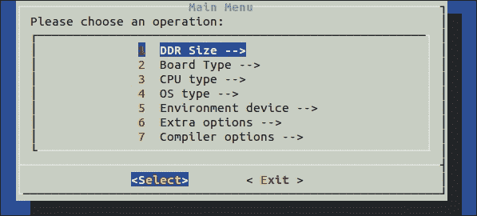

当退出时，一定要保存。然后开始编译:

```cpp
$ ./compile.sh 
Board type selected: UDOO
CPU Type: QUAD/DUAL
OS type: Android
...
/home/bookuser/udoo/prebuilts/gcc/linux-x86/arm/arm-eabi-4.6/bin/arm-eabi-objcopy -O srec u-boot u-boot.srec
/home/bookuser/udoo/prebuilts/gcc/linux-x86/arm/arm-eabi-4.6/bin/arm-eabi-objcopy --gap-fill=0xff -O binary u-boot u-boot.bin

```

为了安全起见，使用`ls u-boot.bin`验证您的构建是否成功，以确保`bootloader`图像现在存在。现在，使用以下命令构建安卓系统:

```cpp
$ croot
$ make –j4 2>&1 | tee logz

```

第一个命令来源于 Android 的安装脚本，它将我们带回项目树的根。第二个命令`make`构建系统。在大多数情况下，您应该将`j`选项设置为您的 CPU/内核数量的两倍。因为你们中的许多人可能有一台双核机器，我们将使用`–j4`。这本书的作者之一使用了 8 个 CPU 核心，例如，使用了标志`-j16`。文件重定向和`tee`命令将构建输出捕获到文件中。这对帮助和调试任何构建问题都很重要。根据您的系统，这种构建可能需要很长很长的时间。在前面提到的具有 16GB 内存的 8 核系统上，这需要 35 分钟多一点。在其他系统上，我们经历了超过 3 小时的构建时间。

在这种情况下，捕获日志证明非常有用。构建因错误而终止，通过在日志中搜索`error`，我们发现了以下内容:

```cpp
$ grep error logz 
...
external/mtd-utils/mkfs.ubifs/mkfs.ubifs.h:48:23: fatal error: uuid/uuid.h: No such file or directory
external/mtd-utils/mkfs.ubifs/mkfs.ubifs.h:48:23: fatal error: uuid/uuid.h: No such file or directory
external/mtd-utils/mkfs.ubifs/mkfs.ubifs.h:48:23: fatal error: uuid/uuid.h: No such file or directory
...

```

通过评估那些错误，我们发现我们丢失了`uuid`和`lzo1x`的标题。我们也可以打开安卓 makefile，`external/mtd-utils/mkfs.ubifs/Android.mk`，从`LOCAL_LDLIBS:= -lz -llzo2 -lm -luuid -m64`行确定可能涉及的库。搜索揭示了我们缺少的特定的 Ubuntu 包；我们将安装它们并重新构建。搜索字符串末尾的`$`字符确保我们只得到以`uuid/uuid.h`结尾的结果。没有它，我们可能会匹配以`.html`或`.hpp`结尾的文件:

$ sudo apt search-x 文件" uuid/uuid.h$ "

```cpp
uuid-dev: /usr/include/uuid/uuid.h
$ sudo apt-get install uuid-dev
$ make –j4 2>&1 | tee logz

```

一个成功的构建应该会产生一些类似于下面的最终输出:

```cpp
...
Running: mkuserimg.sh out/target/product/udoo/system out/target/product/udoo/obj/PACKAGING/systemimage_intermediates/system.img ext4 system 293601280 out/target/product/udoo/root/file_contexts
Install system fs image: out/target/product/udoo/system.img
out/target/product/udoo/system.img+out/target/product/udoo/obj/PACKAGING/recovery_patch_intermediates/recovery_from_boot.p maxsize=299747712 blocksize=4224 total=294120167 reserve=3028608

```

# sd 卡上闪烁的图像

随着`bootloader`、安卓用户空间和 Linux 内核的构建，是时候插入 SD 卡和闪存图像了。将 SD 卡插入您的主机，并确保其已卸载。在 Ubuntu 中，可移动媒体是自动挂载的，所以你需要找到你的闪存驱动器`/dev/sd*`设备，并`umount`它。对于本文的其余部分，我们将使用`/dev/sdd`作为闪存驱动器，但是为您的系统使用正确的设备非常重要。如果你之前用这张 SD 卡安装过 UDOO，卡上会包含多个分区，所以你可能会看到`/dev/sdd<num>`多次挂载:

```cpp
$ mount | grep sdd
/dev/sdd7 on /media/vender type ext4 (rw,nosuid,nodev,uhelper=udisks)
/dev/sdd4 on /media/data type ext4 (rw,nosuid,nodev,uhelper=udisks)
/dev/sdd5 on /media/57f8f4bc-abf4-655f-bf67-946fc0f9f25b type ext4 (rw,nosuid,nodev,uhelper=udisks)
/dev/sdd6 on /media/cache type ext4 (rw,nosuid,nodev,uhelper=udisks)
$ sudo bash -c "umount /dev/sdd4 && umount /dev/sdd5 && umount /dev/sdd6 && umount /dev/sdd7"

```

一旦 SD 卡被正确卸载，我们可以闪存我们的图像:

```cpp
$ sudo -E ./make_sd.sh /dev/sdd

```

### 类型

您必须使用`sudo`上的`-E`参数来保留安卓构建中的所有导出变量。你必须在你内置安卓的同一个终端会话中。否则你会看到错误`No OUT export variable found! Setup not called in advance…`。

完成后(需要一段时间)，使用命令`sudo sync`将块设备缓存刷新回磁盘非常重要。然后，就可以把 SD 卡拆下来，插入 UDOO，开机了！

# UDOO 串口和安卓调试桥

现在 UDOO 正在引导进入安卓系统，我们想确保可以使用串口和**安卓调试桥** ( **adb** )访问它。您将需要适合您的系统的 UDOO 串行驱动程序。有关苹果电脑、Linux 和视窗系统的详细信息，请访问

[http://www . udoo . org/PROJECt AnD tutorials/通过串行电缆连接/](http://www.udoo.org/ProjectsAndTutorials/connecting-via-serial-cable/) 。

串口是来自系统的第一种通信形式，由`bootloader`初始化。这是调试以后遇到的任何内核或系统问题的关键环节。为了配置通用串行总线端口以允许通过 CN3(UDoo 上的通用串行总线 OTG 端口)的`adb`连接，这也是必需的。要配置端口，我们需要配置并使用 minicom 将外壳连接到设备。首先从 CN6(最靠近电源按钮的微型 USB 端口)到主机插入一根微型 USB 电缆。接下来，让我们通过查看`dmesg`找到 USB 上 TTY 的连接消息来找到串行连接。

```cpp
$ sudo dmesg | tail -n 5
[ 9019.090058] usb 4-1: Manufacturer: Silicon Labs
[ 9019.090061] usb 4-1: SerialNumber: 0078AEDB
[ 9019.096089] cp210x 4-1:1.0: cp210x converter detected
[ 9019.208023] usb 4-1: reset full-speed USB device number 4 using uhci_hcd
[ 9019.359172] usb 4-1: cp210x converter now attached to ttyUSB0

```

我们的 TTY 终点站在最后一条线上。让我们通过把它和`minicom`联系起来:

```cpp
$ sudo minicom -sw

```

选择**串口设置**，输入`a`，将**串口设备**改为`/dev/ttyUSB0`，输入`f`关闭硬件流量控制:

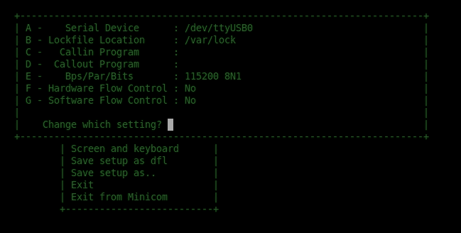

要退出，点击*进入*，选择**保存设置和 DFL** ，然后选择**退出 Minicom** ，按*进入*。现在运行`minicom`连接到你的 UDOO，看它启动:

```cpp
$ sudo minicom -w

```

如果设备启动并运行，您将获得一个友好的根外壳:

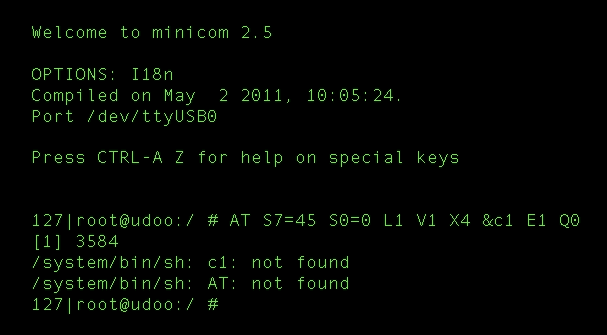

如果是引导，你会看到日志。只需等待根外壳提示:

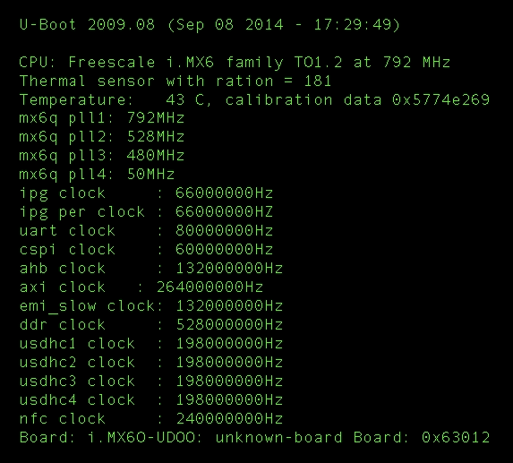

现在我们需要翻转一些 GPIO 引脚，将 CN3 微 USB 移动到调试模式:

```cpp
root@udoo:/ # echo 0 > /sys/class/gpio/gpio203/value 
root@udoo:/ # echo 0 > /sys/class/gpio/gpio128/value 

```

然后，通过移除和更换 J16 跳线，重置使用该总线的 SAM3X8E 处理器。现在从主机插入一根微型 USB 电缆到 CN3。您现在应该看到一个 USB 设备以及`adb`:

```cpp
$ lsusb
Bus 001 Device 009: ID 18d1:4e42 Google Inc.
$ adb devices
List of devices attached 
0123456789ABCDEF  offline

```

在 UDOO 安卓端出现提示时，需要选择**允许 USB 调试**。当您这样做时，设备应该从离线变为在线；这样就可以使用`adb`。

现在测试连接并抓取`adb`上的截图:

```cpp
$ adb shell
root@udoo:/ # 
$ adb shell screencap -p | perl -pe 's/\x0D\x0A/\x0A/g' > screen.png

```

这是截图:

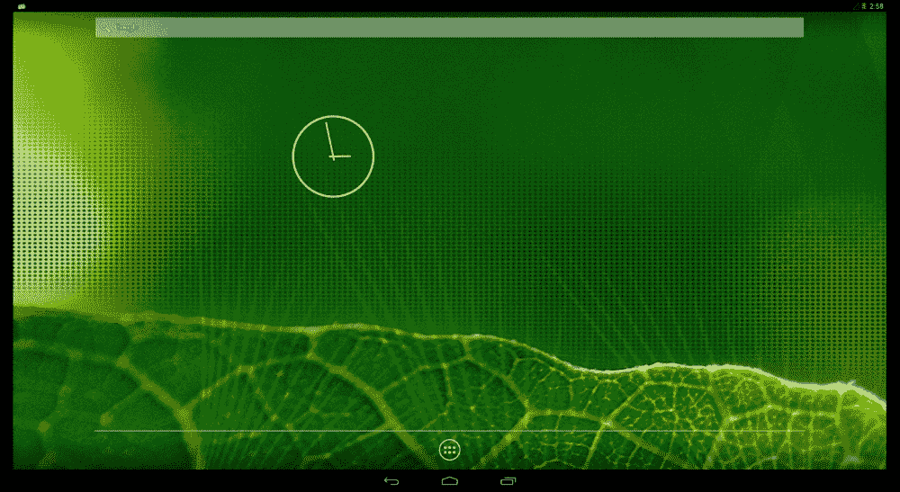

在这个点，我们有了一个工作开发系统。我们有早期启动日志和通过串行控制台的救援外壳。我们还有一个`adb`桥，可以用标准的安卓调试工具！除了用 SELinux 保护这个系统，别无选择！

# 扳动开关

现在我们在 UDOO 上启用了 SELinux，我们需要验证它没有打开。方法是检查`/proc`文件系统中已知的`filesystem`类型。SELinux 有自己的 psuedo 文件系统，因此如果启用了它，我们应该会在列表中看到它:

```cpp
$ adb shell cat /proc/filesystems
nodev  sysfs
nodev  rootfs
nodev  bdev
nodev  proc
nodev  cgroup
nodev  cpuset
nodev  tmpfs
nodev  debugfs
nodev  sockfs
nodev  pipefs
nodev  anon_inodefs
nodev  rpc_pipefs
nodev  devpts
 ext3
 ext2
 ext4
 cramfs
nodev  ramfs
 vfat
 msdos
nodev  nfs
nodev  jffs2
nodev  fuse
 fuseblk
nodev  fusectl
nodev  mtd_inodefs
nodev  ubifs

```

还有这里没有 SELinux 的证据，那就找内核配置打开吧。从`~/udoo/kernel_imx`目录执行此命令，最终会出现一个图形编辑屏幕:

```cpp
$ make menuconfig

```

首先，您需要启用**审核支持**，因为这是 SELinux 的一个依赖项。在**通用设置** | **审计支持**下，启用**审计支持**和**启用系统调用审计**。使用向上和向下箭头键突出显示一个条目，然后按空格键启用它。当某个项目被启用时，您会在它旁边看到一个星号( ***** ):

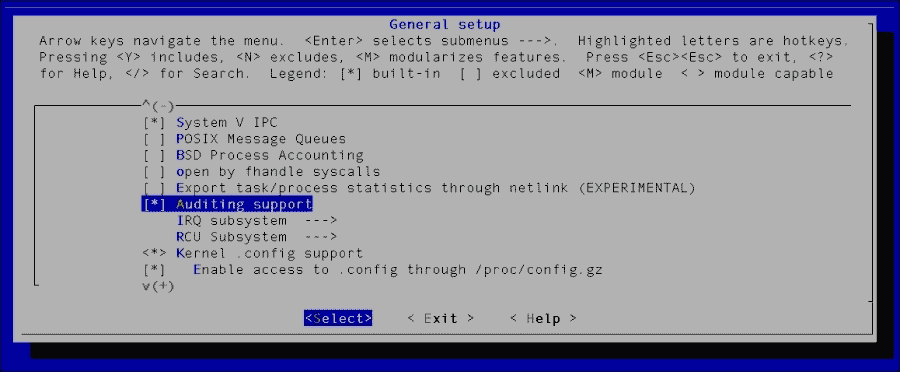

选择**退出**，返回主菜单...不是很直观。进入**文件系统**菜单，对于三个文件系统中的每一个， **Ext2** 、 **Ext3** 和 **Ext4** ，确保**扩展属性**和**安全标签**已启用。然后，选择**退出**返回主菜单:

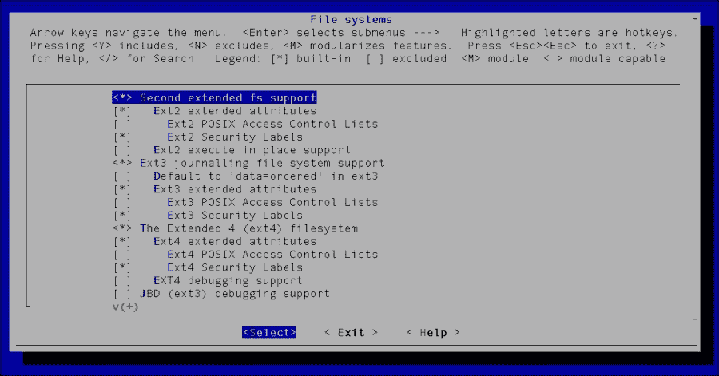

从该屏幕，退出回到主菜单，并转到**安全选项**。进入**安全选项**子菜单后，启用**启用不同的安全型号**和**插座和网络安全挂钩**选项:

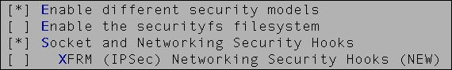

一旦这些被启用，更多的选项将出现。启用 **NSA SELinux 支持**，并确保复制以下屏幕截图中的其他选择和值:

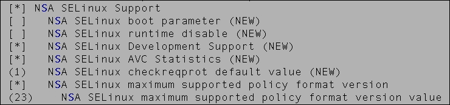

最后，将**默认安全模块**设置为 SELinux:


一旦选择**默认安全模块**，将出现一个新窗口，您可以从中选择 **SELinux** 。选择**退出**退出配置菜单，直到要求您保存新配置:

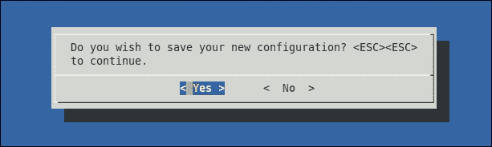

保存新配置，并将这些更改写入原始内核配置文件。否则，它将在后续版本中被覆盖。为此，我们需要发现默认构建中使用了哪个配置文件，这是我们在使用`make menuconfig`进行自己的配置之前构建的:

```cpp
$ grep defconfig logz make -C kernel_imx imx6_udoo_android_defconfig ARCH=arm CROSS_COMPILE=`pwd`/prebuilts/gcc/linux-x86/arm/arm-eabi-4.6/bin/arm-eabi-

```

可以看到`imx6_udoo_android_defconfig`被用作默认配置。复制您的自定义配置并重新构建:

```cpp
$ cp .config arch/arm/configs/imx6_udoo_android_defconfig
$ croot
$ make –j4 bootimage 2>&1 | tee logz

```

对日志文件进行快速健全性检查始终是验证 SELinux 是否真正内置于内核的好方法:

```cpp
$ grep -i selinux logz 
HOSTCC scripts/selinux/mdp/mdp
HOSTCC scripts/selinux/genheaders/genheaders
GEN security/selinux/flask.h security/selinux/av_permissions.h
CC security/selinux/avc.o
...

```

现在，有了支持 SELinux 的内置内核，将 SD 卡插入主机并运行以下命令:

```cpp
$ sudo -E ./make_sd.sh /dev/sdd
$ sudo sync

```

### 类型

不要忘记像以前一样从 SD 卡上卸载任何自动装载的分区。

将 SD 卡插入 UDOO，并启动。您应该像以前一样通过串行控制台查看日志:

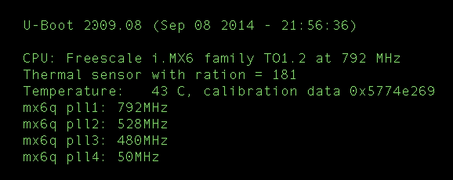

最终，串行连接会将我们带到一个根外壳。

# 它还活着

我们如何知道我们已经在内核中成功启用了 SELinux ？在本章的前面，您运行了命令`adb shell cat /proc/filesystems`。我们将做同样的事情，并寻找一个名为`selinuxfs`的新文件系统。如果存在，则表明我们已经成功启用了 SELinux。在串行终端中运行以下命令:

```cpp
# cat /proc/filesystems | grep selinux 
nodev selinuxfs

```

我们可以看到`selinuxfs`在场！另一个常见的做法是检查`dmesg`是否有任何 SELinux 输出。为此，通过串行终端执行以下命令:

```cpp
# dmesg | grep -i selinux
<6>SELinux: Initializing.
<7>SELinux: Starting in permissive mode
<7>SELinux: Registering netfilter hooks
<3>SELinux: policydb version 26 does not match my version range 15-23
<4>SELinux: Could not load policy: Invalid argument

```

# 总结

这是非常激动人心的一章。您学习了如何在内核配置中启用 SELinux，引导“安全”系统，以及如何验证它的存在。我们还学习了如何为 UDOO 闪存和构建映像，以及如何通过串行和`adb`连接进行连接。在接下来的章节中，我们将重点关注如何使 UDOO 与 SE 一起用于安卓功能。