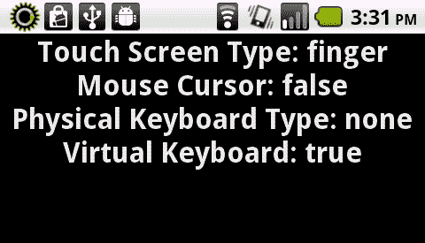
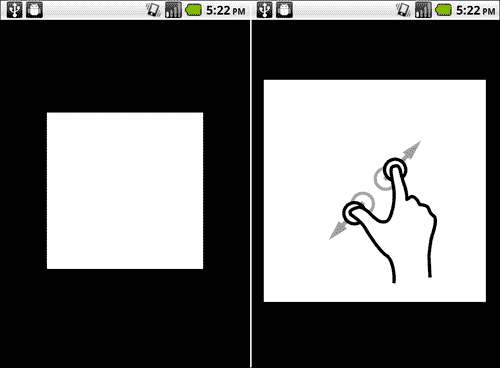
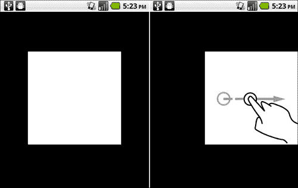
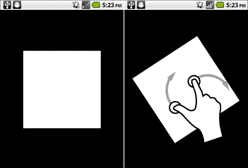
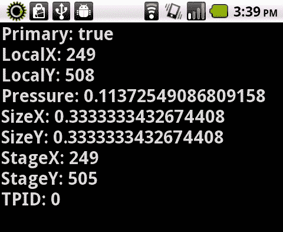
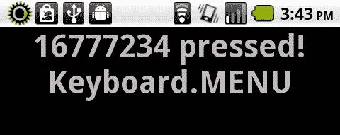

# 二、交互体验：多点触摸、手势和其他输入

本章将涵盖以下食谱:

*   检测支持的设备输入类型
*   检测设备是否支持多点触控
*   验证对常见交互的特定手势支持
*   使用手势缩放显示对象
*   使用手势平移显示对象
*   使用手势滑动显示对象
*   使用手势旋转显示对象
*   访问原始接触点数据
*   基于触摸点数据创建自定义手势
*   模仿安卓长按交互
*   以编程方式调用虚拟键盘
*   回应安卓软键交互
*   响应轨迹球和数字键盘事件

# 简介

通过触摸和手势与设备交互的能力是移动计算的突出特点之一，闪存平台完全支持安卓系统上的多点触摸和手势。本章将涵盖拦截和响应用户交互的不同方式，无论是通过简单的触摸点还是复杂的手势，以及更传统的物理和虚拟键盘输入。充分利用这一点对于移动安卓设备上的流畅体验至关重要。

本章中的所有方法都表示为纯 ActionScript 3 类，不依赖于外部库或 Flex 框架。因此，我们将能够在任何我们希望的 IDE 中使用这些示例。

# 检测支持的设备输入类型

安卓设备上有多种输入类型，根据我们正在进行的项目，我们可能需要验证任何特定设备是否支持预期的用户交互模式。幸运的是，有许多 ActionScript 类可以帮助我们发现与用户输入相关的设备功能。

## 怎么做...

我们需要使用内部类来检测是否支持多点触控:

1.  首先，将以下类导入到您的项目中，以便跨设备检查各种输入类型:

    ```java
    import flash.display.Sprite;
    import flash.display.Stage;
    import flash.display.StageAlign;
    import flash.display.StageScaleMode;
    import flash.system.Capabilities;
    import flash.system.TouchscreenType;
    import flash.text.TextField;
    import flash.text.TextFormat;
    import flash.ui.Keyboard;
    import flash.ui.KeyboardType;
    import flash.ui.Mouse;

    ```

2.  声明一个`TextField`和`TextFormat`对象，允许在设备上显示输出:

    ```java
    private var traceField:TextField;
    private var traceFormat:TextFormat;

    ```

3.  我们现在将设置我们的`TextField`，应用一个`TextFormat`，并将其添加到`DisplayList`。这里，我们创建一个方法来为我们执行所有这些操作:

    ```java
    protected function setupTextField():void {
    traceFormat = new TextFormat();
    traceFormat.bold = true;
    traceFormat.font = "_sans";
    traceFormat.size = 32;
    traceFormat.align = "center";
    traceFormat.color = 0x333333;
    traceField = new TextField();
    traceField.defaultTextFormat = traceFormat;
    traceField.selectable = false;
    traceField.mouseEnabled = false;
    traceField.width = stage.stageWidth;
    traceField.height = stage.stageHeight;
    addChild(traceField);
    }

    ```

4.  现在，我们将简单地检查从调用这些类的许多属性返回的数据。在下面的例子中，我们在下面的方法中执行这个操作:

    ```java
    protected function checkInputTypes():void {
    traceField.appendText("Touch Screen Type: " + flash.system.Capabilities.touchscreenType + "\n");
    traceField.appendText("Mouse Cursor: " + flash.ui.Mouse. supportsCursor + "\n");
    traceField.appendText("Physical Keyboard Type: " + flash. ui.Keyboard.physicalKeyboardType + "\n");
    traceField.appendText("Virtual Keyboard: " + flash.ui.Keyboard. hasVirtualKeyboard + "\n");
    }

    ```

5.  The result will appear similar to the following:

    

## 它是如何工作的...

闪存平台运行时能够在被调用时报告某些设备功能。报告的数据将允许我们根据运行时检测到的输入类型来定制用户体验。

以下是可以报告的四种输入类型的基本概要:

`flash.system.Capabilities.touchscreenType`

调用此方法将返回一个`FINGER, STYLUS`或`NONE`的`String`常数。它告诉我们设备上是否有某种直接的屏幕交互，如果有，是哪种。在安卓设备的情况下，这将始终返回`FINGER`。

`flash.ui.Mouse.supportsCursor`

调用此方法将返回`true`或`false`的`Boolean`。它只是通知我们设备上是否有持续的鼠标光标。在安卓设备的情况下，这很可能总是会返回`false`。

`flash.ui.Keyboard.physicalKeyboardType`

调用此方法将返回一个`ALPHANUMERIC, KEYPAD`或`NONE`的`String`常数。它通知我们设备上是否有某种专用的物理键盘，如果有，是什么类型。就安卓设备而言，这很可能会一直返回`NONE`，尽管某些安卓机型确实有物理键盘。

`flash.ui.Keyboard.hasVirtualKeyboard`

调用此方法将返回`true`或`false`的`Boolean`。它只是通知我们设备上是否有虚拟(软件)键盘。在安卓设备的情况下，这很可能总是会返回`true`。

# 检测设备是否支持多点触控

当开发针对安卓操作系统的项目时，确保设备上实际支持多点触控总是一个好主意。在安卓手机的情况下，这可能会一直是这样，但是谷歌电视或电视设备的 AIR 呢？其中许多也是基于安卓系统的，但大多数电视没有任何触控功能。永远不要假设任何设备的能力。

## 怎么做...

我们需要使用内部类来检测是否支持多点触控:

1.  首先，将以下类导入到您的项目中:

    ```java
    import flash.display.StageScaleMode;
    import flash.display.StageAlign;
    import flash.display.Stage;
    import flash.display.Sprite;
    import flash.text.TextField;
    import flash.text.TextFormat;
    import flash.ui.Multitouch;

    ```

2.  声明一个`TextField`和`TextFormat`对象，允许在设备上显示输出:

    ```java
    private var traceField:TextField;
    private var traceFormat:TextFormat;

    ```

3.  我们现在将设置我们的`TextField`，应用一个`TextFormat`，并将其添加到`DisplayList`。这里，我们创建一个方法来为我们执行所有这些操作:

    ```java
    protected function setupTextField():void {
    traceFormat = new TextFormat();
    traceFormat.bold = true;
    traceFormat.font = "_sans";
    traceFormat.size = 44;
    traceFormat.align = "center";
    traceFormat.color = 0x333333;
    traceField = new TextField();
    traceField.defaultTextFormat = traceFormat;
    traceField.selectable = false;
    traceField.mouseEnabled = false;
    traceField.width = stage.stageWidth;
    traceField.height = stage.stageHeight;
    addChild(traceField);
    }

    ```

4.  然后，只需调用`Multitouch.supportsGestureEvents`和`Multitouch.supportsTouchEvents`来检查这些功能，如以下方法所示:

    ```java
    protected function checkMultitouch():void {
    traceField.appendText(String("Gestures: " + Multitouch.supportsGestureEvents) + "\n");
    traceField.appendText(String("Touch: " + Multitouch.supportsTouchEvents));
    }

    ```

5.  Each of these properties will return a `Boolean` value of `true` or `false`, indicating device support as shown here:

    

## 它是如何工作的...

检测设备是否支持触摸或手势事件将决定您作为开发人员在改善用户体验方面的自由度。如果这两项中的任何一项返回 false，则由您提供(如果可能的话)用户与应用交互的替代方式。这通常通过`Mouse`事件完成:

*   **触摸事件:**基本交互，如单指轻击。
*   **手势事件:**更复杂的用户交互解释，如捏、缩放、刷、平移等。

## 还有更多...

需要注意的是，虽然特定设备可能支持手势事件或触摸事件，但在使用 Flash Platform 工具时，我们必须将`Multitouch.inputMode`设置为其中一个。

# 验证对常见交互的特定手势支持

在处理安卓设备时，触摸和手势是用户与设备交互的主要机制。如果我们想在 Flash Player 和 AIR 中使用一些预定义的手势，我们可以通过以下方式来实现。

## 怎么做...

要发现设备支持哪些特定手势，请执行以下操作:

1.  首先，将以下类导入到您的项目中:

    ```java
    import flash.display.StageScaleMode;
    import flash.display.StageAlign;
    import flash.display.Stage;
    import flash.display.Sprite;
    import flash.text.TextField;
    import flash.text.TextFormat;
    import flash.ui.Multitouch;
    import flash.ui.MultitouchInputMode;

    ```

2.  声明一个`TextField`和`TextFormat`对象，允许在设备上显示输出:

    ```java
    private var traceField:TextField;
    private var traceFormat:TextFormat;

    ```

3.  我们现在将设置我们的`TextField`，应用一个`TextFormat`，并将其添加到`DisplayList`。这里，我们创建一个方法来为我们执行所有这些操作:

    ```java
    protected function setupTextField():void {
    traceFormat = new TextFormat();
    traceFormat.bold = true;
    traceFormat.font = "_sans";
    traceFormat.size = 44;
    traceFormat.align = "center";
    traceFormat.color = 0x333333;
    traceField = new TextField();
    traceField.defaultTextFormat = traceFormat;
    traceField.selectable = false;
    traceField.mouseEnabled = false;
    traceField.width = stage.stageWidth;
    traceField.height = stage.stageHeight;
    addChild(traceField);
    }

    ```

4.  使用以下命令设置多点触控 API 的特定输入模式以支持手势:

    ```java
    Multitouch.inputMode = MultitouchInputMode.GESTURE;

    ```

5.  调用`Multitouch.supportedGestures`将返回一组`String`对象，命名设备上暴露给 Flash 的所有支持的姿势:

    ```java
    var supportedGestures:Vector.<String> = Multitouch.supportedGestures;

    ```

6.  然后，我们可以寻找一个特定的手势或一组手势来倾听，或者在必要时返回到其他交互事件。

    ```java
    for(var i:int=0; i < supportedGestures.length; ++i) {
    trace(supportedGestures[i]);
    }

    ```

7.  我们可以在一个方法中执行所有这些必要的功能:

    ```java
    protected function checkGestures():void {
    Multitouch.inputMode = MultitouchInputMode.GESTURE;
    if(Multitouch.supportedGestures){
    var supportedGestures:Vector.<String> = Multitouch.supportedGestures;
    for(var i:int=0; i <supportedGestures.length; ++i) {
    traceField.appendText(supportedGestures[i] + "\n");
    }
    }else{
    traceField.appendText("no gesture support!");
    }
    }

    ```

8.  The result will appear similar to the following:

    

## 它是如何工作的...

对于一个安卓开发者来说，Flash player 和 AIR 在提取信息到基本细节方面做得非常出色。知道设备上支持哪些特定手势将允许我们在应用上定制事件交互，并在必要时提供回退交互。

## 还有更多...

在我们的示例类中，我们还提供了一个检查，以确保至少有一些手势通过`Multitouch.supportedGestures`得到支持。很有可能，如果设备确实提供手势支持，我们将希望向用户提供警告，解释由于硬件限制，应用不会以最佳方式运行。

除了包含在`flash.events.TransformGestureEvent`包中的更常见的手势(如缩放、滑动、旋转和平移)之外，在`flash.events.GestureEvent`和`flash.events.PressAndTapGestureEvent`类中还可以找到额外的但不太常见的手势(如两指轻击)。如果设备上有，这些都将由`Multitouch.supportedGestures`引用。

# 使用手势缩放显示对象

捏和拉是支持多点触摸输入的触摸屏上经常使用的手势。将两个手指靠得更近会使物体收缩，而将两个手指分开会使物体在设备上变大。

## 怎么做...

本示例使用`Graphics`应用编程接口在`Shape`对象内绘制一个正方形，将其添加到`Stage`，然后设置缩放手势事件的监听器，以便适当缩放`Shape`:

1.  首先，将以下类导入到您的项目中:

    ```java
    import flash.display.StageScaleMode;
    import flash.display.StageAlign;
    import flash.display.Stage;
    import flash.display.Sprite;
    import flash.display.Shape;
    import flash.events.TransformGestureEvent;
    import flash.ui.Multitouch;
    import flash.ui.MultitouchInputMode;

    ```

2.  声明一个`Shape`对象，我们将在其上执行手势:

    ```java
    private var box:Shape;

    ```

3.  接下来，构造一个方法来处理我们的`Sprite`的创建，并将其添加到`DisplayList:`

    ```java
    protected function setupBox():void {
    box = new Shape();
    box.graphics.beginFill(0xFFFFFF, 1);
    box.x = stage.stageWidth/2;
    box.y = stage.stageHeight/2;
    box.graphics.drawRect(-150,-150,300,300);
    box.graphics.endFill();
    addChild(box);
    }

    ```

4.  通过将`Multitouch.inputMode`设置为`MultitouchInputMode.TOUCH_POINT`常量`MultitouchInputMode.TOUCH_POINT`常量并为`GESTURE_ZOOM`事件注册事件监听器，设置多点触控应用编程接口支持触摸输入的具体输入模式。在这种情况下，`onZoom`方法将在应用检测到缩放手势时触发:

    ```java
    protected function setupTouchEvents():void {
    Multitouch.inputMode = MultitouchInputMode.GESTURE;
    stage.addEventListener(TransformGestureEvent. GESTURE_ZOOM, onZoom);
    }

    ```

5.  为了使用可接受的收缩和缩放行为，我们可以根据事件侦听器返回的比例因子来调整舞台上对象的比例。

    ```java
    protected function onZoom(e:TransformGestureEvent):void {
    box.scaleX *= e.scaleX;
    box.scaleY *= e.scaleY;
    }

    ```

6.  The resulting gesture will affect our visual object in the following way:

    

### 注

Gestureworks(www . Gestureworks . com)提供的插图。

## 它是如何工作的...

当我们通过`MultitouchInputMode.GESTURE`将`Multitouch.inputMode`设置为手势时，我们能够听到并对大量预定义的手势做出反应。在本例中，我们正在收听`TransformGestureEvent.GESTURE_ZOOM`事件，以便设置我们的`Shape`对象的比例。通过将当前的比例属性乘以通过我们的事件报告的比例值，我们可以根据这个手势调整对象的比例。

## 还有更多...

请注意，我们绘制正方形的方式是`Shape`注册点位于可见`Shape`的中心。我们这样做很重要，因为`DisplayObject`将根据注册点和变换点上下缩放。

使用 Flash Professional 中的绘图工具时，请确保将您的`MovieClip`符号的注册点设置为居中，以便正确工作。

## 另见...

`TransformGestureEvent.GESTURE_ZOOM`只是我们在使用 Flash Platform 运行时和安卓设备时可用的四种主要转换手势之一。有关这些手势的完整概述，请参考以下食谱:

*   *使用手势平移显示对象*
*   *使用手势滑动显示对象*
*   *使用手势旋转显示对象*

# 使用手势平移显示对象

平移 a `DisplayObject`是通过用两个手指同时触摸屏幕，然后用两个手指在屏幕上向我们想要平移对象的方向移动来完成的。这通常用于占据比屏幕更多空间的对象，或者放大到在任何给定时间屏幕上只能看到其一部分的对象。

## 怎么做...

本示例使用`Graphics`应用编程接口在`Shape`对象内绘制一个正方形，将其添加到`Stage`，然后为平移手势事件设置监听器，以便适当缩放`Shape`。

1.  首先，将以下类导入到您的项目中:

    ```java
    import flash.display.StageScaleMode;
    import flash.display.StageAlign;
    import flash.display.Stage;
    import flash.display.Sprite;
    import flash.display.Shape;
    import flash.events.TransformGestureEvent;
    import flash.ui.Multitouch;
    import flash.ui.MultitouchInputMode;

    ```

2.  声明一个`Shape`对象，我们将对其执行手势:

    ```java
    private var box:Shape;

    ```

3.  接下来，构造一个方法来处理我们的`Shape`的创建，并将其添加到`DisplayList`中。我们已经做了额外的努力来确保我们的`Shape`比屏幕大得多，以便可以有效地平移:

    ```java
    protected function setupBox():void {
    box = new Shape();
    box.graphics.beginFill(0xFFFFFF, 1);
    box.x = stage.stageWidth/2;
    box.y = stage.stageHeight/2;
    box.graphics.drawRect(-150,-150,300,300);
    box.graphics.endFill();
    box.graphics.lineStyle(10, 0x440000, 1);
    box.graphics.moveTo(0, -800);
    box.graphics.lineTo(0, 800);
    box.graphics.moveTo(-800, 0);
    box.graphics.lineTo(800, 0);
    addChild(box);
    }

    ```

4.  通过将`Multitouch.inputMode`设置为`MultitouchInputMode.TOUCH_POINT`常量并为`GESTURE_PAN`事件注册一个事件监听器，为多点触摸应用编程接口设置特定的输入模式以支持触摸输入。在这种情况下，`onPan`方法将在应用检测到缩放手势时触发:

    ```java
    protected function setupTouchEvents():void {
    Multitouch.inputMode = MultitouchInputMode.GESTURE;
    stage.addEventListener(TransformGestureEvent. GESTURE_PAN, onPan);
    }

    ```

5.  我们现在可以响应 pan 事件返回的数据。在这种情况下，我们只是根据平移偏移数据

    ```java
    protected function onPan(e:TransformGestureEvent):void {
    box.x += e.offsetX;
    box.y += e.offsetY;
    }

    ```

    移动`Shape`的 x 和 y 位置
6.  The resulting gesture will affect our visual object in the following way:

    

### 注

Gestureworks(www . Gestureworks . com)提供的插图。

## 它是如何工作的...

当我们通过`MultitouchInputMode.GESTURE`将`Multitouch.inputMode`设置为手势时，我们能够听到并对大量预定义的手势做出反应。在这个例子中，我们正在监听`TransformGestureEvent.GESTURE_PAN`事件，以便移动我们的`Shape`对象的 x 和 y 位置。通过报告的偏移数据调整我们的`Shape`坐标，我们可以按照用户期望的方式调整我们对象的位置。

## 还有更多...

请注意，这在某些设备上通常是一个很难执行的手势(因为您必须同时用两个手指触摸屏幕)，其他设备可能甚至不支持它。作为后备，我们总是可以使用`startDrag()`和`stopDrag()`方法来模拟平移。

## 另见...

`TransformGestureEvent.GESTURE_PAN`只是我们在使用 Flash Platform 运行时和安卓设备时可用的四种主要转换手势之一。有关这些手势的完整概述，请参考以下食谱:

*   *使用手势缩放显示对象*
*   *使用手势滑动显示对象*
*   *使用手势旋转显示对象*

# 使用手势滑动显示对象

滑动是安卓设备上最常见的手势之一，这是有充分理由的。无论是浏览一系列照片，还是在应用中简单地在不同状态之间移动，用户都会期待滑动手势。滑动手势是通过简单地触摸屏幕，然后以相反的方向快速在屏幕上上下左右滑动来实现的。

## 怎么做...

本示例使用`Graphics`应用编程接口在`Shape`对象内绘制一个正方形，将其添加到`Stage`，然后为滑动手势事件设置一个监听器，以便根据滑动方向将`Shape`实例移向我们的屏幕边界:

1.  首先，将以下类导入到您的项目中:

    ```java
    import flash.display.StageScaleMode;
    import flash.display.StageAlign;
    import flash.display.Stage;
    import flash.display.Sprite;
    import flash.display.Shape;
    import flash.events.TransformGestureEvent;
    import flash.ui.Multitouch;
    import flash.ui.MultitouchInputMode;

    ```

2.  声明一个`Shape`对象，我们将对其执行手势:

    ```java
    private var box:Shape;

    ```

3.  接下来，构造一个方法来处理我们的`Shape`的创建，并将其添加到`DisplayList:`

    ```java
    protected function setupBox():void {
    box = new Shape();
    box.graphics.beginFill(0xFFFFFF, 1);
    box.x = stage.stageWidth/2;
    box.y = stage.stageHeight/2;
    box.graphics.drawRect(-150,-150,300,300);
    box.graphics.endFill();
    addChild(box);
    }

    ```

4.  通过将`Multitouch.inputMode`设置为`MultitouchInputMode.TOUCH_POINT`常量来设置多点触控 API 支持触摸输入的具体输入模式，并为`TransformGestureEvent.GESTURE_SWIPE`事件注册一个事件监听器:

    ```java
    protected function setupTouchEvents():void {
    Multitouch.inputMode = MultitouchInputMode.GESTURE;
    stage.addEventListener(TransformGestureEvent. GESTURE_SWIPE, onSwipe);
    }

    ```

5.  我们现在可以对刷卡事件返回的数据做出响应。在这种情况下，我们只是根据滑动偏移数据

    ```java
    protected function onSwipe(e:TransformGestureEvent):void {
    switch(e.offsetX){
    case 1:{
    box.x = stage.stageWidth - (box.width/2);
    break;
    }
    case -1:{
    box.x = box.width/2;
    break;
    }
    }
    switch(e.offsetY){
    case 1:{
    box.y = stage.stageHeight - (box.height/2);
    break;
    }
    case -1:{
    box.y = box.height/2;
    break;
    }
    }
    }

    ```

    移动`Shape`的 x 和 y 位置
6.  The resulting gesture will affect our visual object in the following way:

    

### 注

Gestureworks(www . Gestureworks . com)提供的插图。

## 它是如何工作的...

当我们通过`MultitouchInputMode.GESTURE`将`Multitouch.inputMode`设置为手势时，我们能够听到并对大量预定义的手势做出反应。在这个例子中，我们正在监听`TransformGestureEvent.GESTURE_SWIPE`事件，以便移动我们的`Shape`对象的 x 和 y 位置。通过报告的偏移数据调整我们的`Shape`坐标，我们可以按照用户期望的方式调整我们对象的位置。

通过这个例子我们可以看到，事件监听器返回的`offsetX`和`offsetY`值将分别为 1 或-1。这使得我们可以非常简单地确定刷卡记录的方向:

*   **向上滑动:**偏移= -1
*   **向下滑动:**偏移= 1
*   **向左滑动:**偏移= 1
*   **向右滑动:**偏移= 1

## 还有更多...

当对滑动事件做出反应时，通过使用内置补间机制或外部补间引擎来提供一点过渡动画可能是个好主意。有许多伟大的动作脚本补间引擎可以作为开源软件免费获得。使用这些引擎以及某些手势可以为应用的用户提供更愉快的体验。

我们可以考虑在我们的应用中使用以下流行的补间引擎:

**Twenliet:**T2http://www.greensock.com/tweenlite/

**GTween:**T2http://www.gskinner.com/libraries/gtween/

## 另见...

`TransformGestureEvent.GESTURE_SWIPE`只是我们在使用 Flash Platform 运行时和安卓设备时可用的四种主要转换手势之一。有关这些手势的完整概述，请参考以下食谱:

*   *使用手势缩放显示对象*
*   *使用手势平移显示对象*
*   *使用手势旋转显示对象*

# 使用手势旋转显示对象

旋转是通过将两个手指放在对象的不同点上，然后顺时针或逆时针移动一个手指来实现的。这将导致对象在屏幕上旋转。旋转可以与平移和缩放手势一起使用，为用户提供对图像或其他`DisplayObject`的完全控制。

## 怎么做...

本示例使用`Graphics`应用编程接口在`Shape`对象内绘制一个正方形，将其添加到`Stage`，然后为`Rotate`手势事件设置一个监听器，以便围绕其注册点适当旋转`Shape`实例

1.  首先，将以下类导入到您的项目中:

    ```java
    import flash.display.StageScaleMode;
    import flash.display.StageAlign;
    import flash.display.Stage;
    import flash.display.Sprite;
    import flash.display.Shape;
    import flash.events.TransformGestureEvent;
    import flash.ui.Multitouch;
    import flash.ui.MultitouchInputMode;

    ```

2.  声明一个`Shape`对象，我们将对其执行手势:

    ```java
    private var box:Shape;

    ```

3.  接下来，构造一个方法来处理我们的`Shape`的创建，并将其添加到`DisplayList`中。

    ```java
    protected function setupBox():void {
    box = new Shape();
    box.graphics.beginFill(0xFFFFFF, 1);
    box.x = stage.stageWidth/2;
    box.y = stage.stageHeight/2;
    box.graphics.drawRect(-150,-150,300,300);
    box.graphics.endFill();
    addChild(box);
    }

    ```

4.  通过将`Multitouch.inputMode`设置为`MultitouchInputMode.TOUCH_POINT`常量并为`GESTURE_ROTATE`事件注册一个事件监听器，为多点触摸应用编程接口设置特定的输入模式以支持触摸输入。在这种情况下，`onRotate`方法将在应用检测到旋转手势时触发:

    ```java
    protected function setupTouchEvents():void {
    Multitouch.inputMode = MultitouchInputMode.GESTURE; stage.addEventListener(TransformGestureEvent.GESTURE_ROTATE, onRotate);
    }

    ```

5.  我们现在可以响应我们的 rotate 事件返回的数据。在这种情况下，我们只需将事件监听器返回的`rotation`值分配给`Shape`的`rotation`参数，以便执行适当的旋转:

    ```java
    protected function onRotate(e:TransformGestureEvent):void {
    box.rotation += e.rotation;
    }

    ```

6.  The resulting gesture will affect our visual object in the following way:

    

### 注

Gestureworks(www . Gestureworks . com)提供的插图。

## 它是如何工作的...

当我们通过`MultitouchInputMode.GESTURE`将`Multitouch.inputMode`设置为手势时，我们能够听到并对大量预定义的手势做出反应。在本例中，我们正在监听`TransformGestureEvent.GESTURE_ROTATE`事件，以便将返回的`rotation`值分配给我们的`Shape`对象。

在大多数情况下，对这些数据确实没有进一步的计算，但是我们可以通过允许(例如)一个`DisplayObject`的旋转来影响另一个`DisplayObject`的旋转，或者甚至是`Stage`上多个`DisplayObjects`的旋转，来执行更高级的旋转交互。

## 还有更多...

请注意，我们绘制正方形的方式是`Shape`注册点位于可见`Shape`的中心。我们这样做很重要，因为`DisplayObject`将基于注册点和变换点旋转。

使用 Flash Professional 中的绘图工具时，请确保将您的`MovieClip`符号的注册点设置为居中，以便正确工作。

## 另见...

`TransformGestureEvent.GESTURE_ROTATE`只是我们在使用 Flash Platform 运行时和安卓设备时可用的四种主要转换手势之一。有关这些手势的完整概述，请参考以下食谱:

*   *使用手势缩放显示对象*
*   *使用手势平移显示对象*
*   *使用手势滑动显示对象*

# 访问原始接触点数据

有时，预定义的手势被烘焙到 Flash Player 和 AIR 中，对于某些应用交互来说是不够的。本食谱将演示如何通过 Flash Player 或 AIR APIs 访问操作系统报告的原始触摸数据。

## 怎么做...

要读取项目中的原始触摸数据，请执行以下步骤:

1.  首先，将以下类导入到您的项目中:

    ```java
    import flash.display.StageScaleMode;
    import flash.display.StageAlign;
    import flash.display.Stage;
    import flash.display.Sprite;
    import flash.events.TouchEvent;
    import flash.text.TextField;
    import flash.text.TextFormat;
    import flash.ui.Multitouch;
    import flash.ui.MultitouchInputMode;

    ```

2.  声明一个`TextField`和`TextFormat`对象，允许在设备上显示输出:

    ```java
    private var traceField:TextField;
    private var traceFormat:TextFormat;

    ```

3.  我们现在将设置我们的`TextField`，应用一个`TextFormat`，并将其添加到`DisplayList`。这里，我们创建一个方法来为我们执行所有这些操作:

    ```java
    protected function setupTextField():void {
    traceFormat = new TextFormat();
    traceFormat.bold = true;
    traceFormat.font = "_sans";
    traceFormat.size = 44;
    traceFormat.align = "left";
    traceFormat.color = 0x333333;
    traceField = new TextField();
    traceField.defaultTextFormat = traceFormat;
    traceField.selectable = false;
    traceField.mouseEnabled = false;
    traceField.width = stage.stageWidth;
    traceField.height = stage.stageHeight;
    addChild(traceField);
    }

    ```

4.  通过将`Multitouch.inputMode`设置为`MultitouchInputMode.TOUCH_POINT`常数，设置多点触摸应用编程接口支持触摸输入的具体输入模式。我们还将通过以下方法为`TouchEvent`数据注册一组监听器:

    ```java
    protected function setupTouchEvents():void {
    Multitouch.inputMode = MultitouchInputMode.TOUCH_POINT;
    stage.addEventListener(TouchEvent.TOUCH_MOVE, touchMove);
    stage.addEventListener(TouchEvent.TOUCH_END, touchEnd);
    }

    ```

5.  为了在每次触摸交互结束后清除我们的`TextField`，我们将构建以下功能:

    ```java
    protected function touchEnd(e:TouchEvent):void {
    traceField.text = "";
    }

    ```

6.  然后，我们可以从触摸事件中读取各种属性，以某种方式进行解释。压力、坐标、大小等事件可以从返回的事件对象中导出:

    ```java
    protected function touchMove(e:TouchEvent):void {
    traceField.text = "";
    traceField.appendText("Primary: " + e.isPrimaryTouchPoint + "\n");
    traceField.appendText("LocalX: " + e.localX + "\n");
    traceField.appendText("LocalY: " + e.localY + "\n");
    traceField.appendText("Pressure: " + e.pressure + "\n");
    traceField.appendText("SizeX: " + e.sizeX + "\n");
    traceField.appendText("SizeY: " + e.sizeY + "\n");
    traceField.appendText("StageX: " + e.stageX + "\n");
    traceField.appendText("StageY: " + e.stageY + "\n");
    traceField.appendText("TPID: " + e.touchPointID + "\n");
    }

    ```

7.  The result will appear similar to the following:

    

## 它是如何工作的...

设备中注册的每个触摸点都有许多与之相关的特定属性。通过注册一组侦听器来检测这些交互，我们可以读取这些数据，应用可以做出适当的反应。在我们的例子中，我们只是通过`TextField`展示这些值，但这将是我们构建压力敏感游戏机制或一些其他自定义手势所需的确切数据。

请注意，在允许多个接触点的设备上，我们将能够使用同一个监听器从两个接触点读取数据。多个接触点通过舞台上的位置和`touchPointID`来区分。当设计复杂的手势时，或者当我们需要精确跟踪每个触摸点时，我们会使用这些标识来区分触摸点。

## 还有更多...

需要注意的是，当`Multitouch.inputMode`设置为`MultitouchInputMode.TOUCH_POINT`时，我们将无法利用 Flash Player 和 AIR 通过简化手势 API 提供的预定义手势。将`Multitouch.inputMode`设置为`MultitouchInputMode.GESTURE`将允许我们利用应用中常见的预定义手势事件。

# 基于触摸点数据创建自定义手势

使用原始触摸数据，我们可以定义自定义手势来开发应用中使用的独特交互。我们通过基于通过原始触摸事件传递的数据进行计算来做到这一点。

## 怎么做...

在本例中，我们将创建一个对角滑动手势，它可以返回四个独立的值，让我们知道对角滑动的方向。

1.  首先，将以下类导入到您的项目中:

    ```java
    import flash.display.Shape;
    import flash.display.Sprite;
    import flash.display.Stage;
    import flash.display.StageAlign;
    import flash.display.StageScaleMode;
    import flash.events.TouchEvent;
    import flash.text.TextField;
    import flash.text.TextFormat;
    import flash.ui.Multitouch;
    import flash.ui.MultitouchInputMode;

    ```

2.  声明一个`TextField`和`TextFormat`对象，允许在设备上输出可见文本:

    ```java
    private var traceField:TextField;
    private var traceFormat:TextFormat;

    ```

3.  我们将设置两个额外的对象来帮助跟踪我们的手势，一个名为`drawArea`的`Shape`通过图形应用编程接口绘制手势，另一个是`trackBeginObject`，这是一个简单的对象，我们可以使用它来保存我们的开始触摸坐标，并与我们的触摸结束坐标进行比较:

    ```java
    private var drawArea:Shape;
    private var trackBeginObject:Object;

    ```

4.  我们现在将设置我们的`TextField`，应用`TextFormat,`并将其添加到`DisplayList`。这里，我们创建一个方法来为我们执行所有这些操作:

    ```java
    protected function setupTextField():void {
    traceFormat = new TextFormat();
    traceFormat.bold = true;
    traceFormat.font = "_sans";
    traceFormat.size = 32;
    traceFormat.align = "center";
    traceFormat.color = 0x333333;
    traceField = new TextField();
    traceField.defaultTextFormat = traceFormat;
    traceField.selectable = false;
    traceField.mouseEnabled = false;
    traceField.width = stage.stageWidth;
    traceField.height = stage.stageHeight;
    addChild(traceField);
    }

    ```

5.  接下来，我们将设置我们的`Shape`，在其中我们将使用`Graphics` API:

    ```java
    protected function setupDrawArea():void {
    drawArea = new Shape();
    addChild(drawArea);
    }

    ```

    绘制手势
6.  通过将`Multitouch.inputMode`设置为`MultitouchInputMode.TOUCH_POINT`常量，设置多点触摸应用编程接口支持触摸输入的具体输入模式。在本例中，我们将注册一组监听器来检测`Stage`上的触摸移动。这将为我们的手势跟踪提供视觉反馈，并保留我们的开始触摸坐标，以便与我们的触摸结束坐标进行比较。
7.  我们也将通过同样的方法初始化出跟踪【T0:

    ```java
    protected function setupTouchEvents():void {
    Multitouch.inputMode = MultitouchInputMode.TOUCH_POINT;
    trackBeginObject = new Object();
    stage.addEventListener(TouchEvent.TOUCH_BEGIN, touchBegin);
    stage.addEventListener(TouchEvent.TOUCH_MOVE, touchMove);
    stage.addEventListener(TouchEvent.TOUCH_END, touchEnd);
    }

    ```

8.  构造一个名为`touchBegin`的方法来初始化我们手势的开始，并保留坐标数据以供以后比较。通过测试`TouchEvent.isPrimaryTouchPoint`布尔属性，我们将确保被注册的接触点是多个接触点中的第一个。

    ```java
    protected function touchBegin(e:TouchEvent):void {
    if(e.isPrimaryTouchPoint){
    drawArea.graphics.clear();
    drawArea.graphics.lineStyle(20, 0xFFFFFF, 0.8);
    trackBeginObject.x = e.stageX;
    trackBeginObject.y = e.stageY;
    drawArea.graphics.moveTo(e.stageX, e.stageY);
    }
    }

    ```

9.  构造另一个名为`touchMove`的方法来接受触摸运动数据，并绘制出我们的视觉反馈:

    ```java
    protected function touchMove(e:TouchEvent):void {
    if(e.isPrimaryTouchPoint){
    drawArea.graphics.lineTo(e.stageX, e.stageY);
    }
    }

    ```

10.  构建一个名为`touchEnd`的最终方法，通过我们的`trackBeginObject`将末端触摸数据坐标与我们在开始时保留的坐标进行比较，然后确定它是什么样的手势。在这种情况下，我们将结果输出为一个`String`到一个`TextField`，之前创建的:

    ```java
    protected function touchEnd(e:TouchEvent):void {
    if(e.isPrimaryTouchPoint){
    if(e.stageX > trackBeginObject.x && e.stageY > trackBeginObject.y){
    traceField.text = "Diagonal Gesture: TL -> BR";
    }elseif(e.stageX < trackBeginObject.x && e.stageY > trackBeginObject.y){
    traceField.text = "Diagonal Gesture: TR -> BL";
    }elseif(e.stageX < trackBeginObject.x && e.stageY < trackBeginObject.y){
    traceField.text = "Diagonal Gesture: BR -> TL";
    }elseif(e.stageX > trackBeginObject.x && e.stageY < trackBeginObject.y){
    traceField.text = "Diagonal Gesture: BL -> TR";
    }
    }
    }

    ```

11.  The result will appear similar to the following:

    

### 注

Gestureworks(www . Gestureworks . com)提供的插图。

## 它是如何工作的...

由于我们可以访问所有的原始触摸点数据，我们可以借助常规的 ActionScript 元素(如`Object, Vector`或`Array`实例)从头到尾跟踪触摸交互的生命周期。基于跟踪的数据，例如坐标位置、触摸压力等，我们可以进行计算，并确定交互是否符合我们要跟踪的手势。

在我们前面的例子中，我们对限定手势的确定相当宽松。更严格地说，我们还可以计算不同触摸点的距离，甚至跟踪从触摸开始到触摸结束的时间，以确保手势正是我们所寻找的，因此是用户有意的。

## 还有更多...

实际上有相当多的手势库，我们可以用来替代 Flash Player 和 AIR 运行时内置的手势库。执行快速的网络搜索应该允许我们访问这些库，其中许多是免费的开源软件。最受欢迎的第三方手势库是`Gesture Works`，可以从[http://gestureworks.com/](http://gestureworks.com/)下载。

# 模仿安卓长按交互

安卓操作系统中最有用的交互之一就是长时间的压力。这是在用户轻敲特定区域并保持几秒钟而不释放时实现的。虽然 Flash Player 和用于安卓的 AIR 都没有长按交互作为多点触摸手势事件库的一部分，但是通过任何一个运行时来模拟这种交互都相当简单。

## 怎么做...

我们将通过使用动作脚本`Timer`对象和`TouchPoint`事件来模拟安卓长按交互。

1.  首先，将以下类导入到您的项目中:

    ```java
    import flash.display.StageScaleMode;
    import flash.display.StageAlign;
    import flash.display.Stage;
    import flash.display.Sprite;
    import flash.events.TimerEvent;
    import flash.events.TouchEvent;
    import flash.geom.Rectangle;
    import flash.ui.Multitouch;
    import flash.ui.MultitouchInputMode;
    import flash.utils.Timer;

    ```

2.  声明一个我们将对其执行长按的`Sprite`对象，以及一个`Timer`对象:

    ```java
    private var box:Sprite;
    private var lpTimer:Timer;

    ```

3.  设置`Timer`对象，测量记录长按所需的时间；在这种情况下，是 1000 毫秒。此外，我们现在将注册一个监听器来检测`Timer`周期何时结束:

    ```java
    protected function setupTimer():void {
    lpTimer = new Timer(1000,1);
    lpTimer.addEventListener(TimerEvent.TIMER_COMPLETE, timerEnd);
    }

    ```

4.  接下来，构造一个方法来处理我们的`Sprite`的创建，并将其添加到`DisplayList:`

    ```java
    protected function setupBox():void {
    box = new Sprite();
    box.graphics.beginFill(0xFFFFFF, 1);
    box.x = stage.stageWidth/2;
    box.y = stage.stageHeight/2;
    box.graphics.drawRect(-100,-100,200,200);
    box.graphics.endFill();
    addChild(box);
    }

    ```

5.  通过将`Multitouch.inputMode`设置为`MultitouchInputMode.TOUCH_POINT`常数，设置多点触摸应用编程接口支持触摸输入的具体输入模式。为了模拟长按，我们必须通过`TouchEvent.TOUCH_BEGIN`在每次触摸交互时启动计时器。每当触发`TouchEvent.TOUCH_END`或其他触摸取消事件时，`Timer`将停止，重置我们的“长按”。

    ```java
    protected function setupTouchEvents():void {
    Multitouch.inputMode = MultitouchInputMode.TOUCH_POINT;
    box.addEventListener(TouchEvent.TOUCH_BEGIN, touchBegin);
    box.addEventListener(TouchEvent.TOUCH_END, touchEnd);
    box.addEventListener(TouchEvent.TOUCH_OUT, touchEnd);
    box.addEventListener(TouchEvent.TOUCH_ROLL_OUT, touchEnd);
    }

    ```

6.  构建一个方法，在我们的触摸交互开始时修改我们的`Sprite`。我们将稍微缩放`Sprite`并改变阿尔法属性，以指示某个东西已经激活。此时，我们开始通过我们的`Timer:`

    ```java
    protected function touchBegin(e:TouchEvent):void {
    box.scaleX += 0.1;
    box.scaleY += 0.1;
    box.alpha = 0.8;
    lpTimer.start();
    }

    ```

    测量长按时间
7.  `Timer`设置为 1000 毫秒后完成，一旦触发。有了这个触发器，我们就可以在应用中执行任何必要的操作。在这种情况下，我们正在使我们的`Sprite`可拖动:

    ```java
    protected function timerEnd(e:TimerEvent):void {
    var dragBounds:Rectangle = new Rectangle(box.width/2, box.height/2, stage.stageWidth-box.width, stage.stageHeight-box.height);
    box.startDrag(true, dragBounds);
    }

    ```

8.  触摸结束的方法应该停止我们的`Timer`并取消我们的`Sprite`发生的任何拖动事件。在这里，我们也让我们的`Sprite`的`scale`和`alpha`休息，使其回到休息状态:

    ```java
    protected function touchEnd(e:TouchEvent):void {
    lpTimer.stop();
    box.stopDrag();
    box.scaleX = 1;
    box.scaleY = 1;
    box.alpha = 1;
    }

    ```

9.  The resulting gesture will affect our visual object in the following way:

    

### 注

Gestureworks(www . Gestureworks . com)提供的插图。

## 它是如何工作的...

我们的示例需要按住一秒钟来触发函数调用，这将导致一个`Shape`对象变得可以拖动通过`Stage`。这是通过监听一个`TOUCH_BEGIN`事件，然后监控一个`Timer`来决定这是否是一个有意的长按交互来完成的。如果一秒钟内没有发生`TOUCH_END`事件，那么我们就让`Shape`变得可拖动。我们已经修改了`Shape`的比例和不透明度，一旦`Timer`被触发，表明它现在是一个可拖动的对象。松开`Shape`将完成交互。

## 还有更多...

长按最常见的用途是对某些视觉元素进行重新定位，就像我们在这里所做的那样，或者调用菜单操作，因为安卓用户非常习惯在他们的设备上使用这种交互。

# 以编程方式调用虚拟键盘

在大多数情况下，简单地将焦点放在文本输入字段将调用虚拟键盘。失去焦点会使虚拟键盘消失。也许我们需要我们的应用在没有用户交互的情况下这样做，或者为了方便起见，在进入某个应用状态时立即这样做。

## 怎么做...

我们配置一个`Shape`通过分配给它的`Tap`触摸事件来切换安卓虚拟键盘的开和关。

1.  首先，将以下类导入到您的项目中:

    ```java
    import flash.display.Sprite;
    import flash.display.Stage;
    import flash.display.StageAlign;
    import flash.display.StageScaleMode;
    import flash.events.SoftKeyboardEvent;
    import flash.events.TouchEvent;
    import flash.text.TextField;
    import flash.text.TextFormat;
    import flash.ui.Multitouch;
    import flash.ui.MultitouchInputMode;

    ```

2.  在`TextField`和`TextFormat`对象旁边声明一个`Shape`。这些将用于互动和视觉反馈。

    ```java
    private var tapBox:Sprite;
    private var tapBoxField:TextField;
    private var tapBoxFormat:TextFormat;

    ```

3.  接下来，构造一个方法来处理我们的`Sprite`的创建，并将其添加到`DisplayList`中。点击此`Sprite`将允许我们调用或隐藏虚拟键盘。我们还将在`Sprite`中构建一个`TextField`和相关的`TextFormat`对象，以允许我们向用户提供有状态的消息。

    ```java
    protected function setupBox():void {
    tapBox = new Sprite();
    tapBox.graphics.beginFill(0xFFFFFF, 1);
    tapBox.x = stage.stageWidth/2;
    tapBox.y = stage.stageHeight/2 - 200;
    tapBox.graphics.drawRect(-200,-100,400,160);
    tapBox.graphics.endFill();
    tapBoxFormat = new TextFormat();
    tapBoxFormat.bold = true;
    tapBoxFormat.font = "_sans";
    tapBoxFormat.size = 42;
    tapBoxFormat.align = "center";
    tapBoxFormat.color = 0x333333;
    tapBoxField = new TextField();
    tapBoxField.defaultTextFormat = tapBoxFormat;
    tapBoxField.selectable = false;
    tapBoxField.mouseEnabled = false;
    tapBoxField.multiline = true;
    tapBoxField.wordWrap = true;
    tapBoxField.width = tapBox.width;
    tapBoxField.height = tapBox.height;
    tapBoxField.x = -200;
    tapBoxField.y = -80;
    tapBoxField.text = "Tap to Toggle Virtual Keyboard";
    tapBox.addChild(tapBoxField);
    addChild(tapBox);
    }

    ```

4.  通过将`Multitouch.inputMode`设置为`MultitouchInputMode.TOUCH_POINT`常量，设置多点触控 API 支持触控输入的具体输入模式，并在`DisplayObject`上注册一个事件监听器，用于触发安卓虚拟键盘的激活和去激活。在这种情况下，出现了`TouchEvent.TOUCH_TAP`事件。轻触相当于鼠标点击事件。我们还可以为一组虚拟键盘事件注册许多监听器。为了使`DisplayObject`能够调用虚拟键盘，我们需要将其`needsSoftKeyboard`属性设置为`true`。我们在这里注册的`SoftKeyboardEvent`监听器是可选的。

    ```java
    protected function setupTouchEvents():void {
    Multitouch.inputMode = MultitouchInputMode.TOUCH_POINT;
    tapBox.needsSoftKeyboard = true;
    tapBox.addEventListener(TouchEvent.TOUCH_TAP, touchTap);
    tapBox.addEventListener (SoftKeyboardEvent. SOFT_KEYBOARD_ACTIVATING, vkActivating);
    tapBox.addEventListener(SoftKeyboardEvent. SOFT_KEYBOARD_ACTIVATE, vkActivate);
    tapBox.addEventListener(SoftKeyboardEvent. SOFT_KEYBOARD_DEACTIVATE, vkDeactivate);
    }

    ```

5.  为了利用前面定义的`SoftKeyboardEvent`监听器，我们必须创建各种方法，一旦检测到每个活动就执行。这样，我们可以通过在激活过程中拦截虚拟键盘，或者检测虚拟键盘何时完全完成激活或停用，来监控、交互甚至阻止某些事件的触发。T1】
6.  要调用虚拟键盘，我们只需调用`requestSoftKeyboard()on``DisplayObject`，其`needsSoftKeyboard`属性已设置为`true`。这里，我们正在检查`needsSoftKeyboard`是否设置为真，并基于此切换该属性。

    ```java
    protected function touchTap(e:TouchEvent):void {
    if(tapBox.needsSoftKeyboard == true){
    tapBox.requestSoftKeyboard();
    tapBoxField.text = "Virtual Keyboard is Up";
    tapBox.needsSoftKeyboard = false;
    }else{
    tapBox.needsSoftKeyboard = true;
    tapBoxField.text = "Virtual Keyboard is Down";
    }
    }

    ```

7.  要关闭虚拟键盘，用户需要点击`DisplayObject`，其`needsSoftKeyboard`属性已设置为`false`。
8.  The result will appear similar to the following:

    

## 它是如何工作的...

为了通过 ActionScript 调用安卓虚拟键盘，我们必须将一个交互`DisplayObjects.needsSoftKeyboard`属性设置为`true`。这将允许我们注册一个点击触摸监听器，并在点击触摸事件触发时调用`requestSoftKeyboard()`，在屏幕上显示虚拟键盘。

触摸任何其`needsSoftKeyboard`属性设置为`false`(默认状态)的`DisplayObject`，将会关闭虚拟键盘。在前面的例子中，我们将此属性从`true`切换到`false`，以便使`DisplayObject`作为切换控件。

## 还有更多...

虽然没有必要使用`SoftKeyboardEvent`类通过 ActionScript 激活或关闭安卓虚拟键盘，但它包含在示例类中，因为它允许我们使用一组额外的侦听器函数来响应此类事件。

# 响应安卓软键交互

安卓 AIR 不支持调用经常出现在屏幕底部的原生操作系统选项菜单。但是，有一些方法可以模拟本地行为，我们将在本节中探讨。

安卓系统上`back`按钮的正常行为是在应用状态中后退，直到我们回到家中。进一步按下`back`按钮将退出应用。默认情况下，安卓应用的 AIR 也是如此。如果我们想要覆盖这种默认行为，我们必须建立一种机制来拦截这种交互，然后阻止它。

## 怎么做...

我们可以通过标准的 ActionScript 事件侦听器来响应软键事件。

1.  首先，将以下类导入到您的项目中:

    ```java
    import flash.display.Sprite;
    import flash.display.Stage;
    import flash.display.StageAlign;
    import flash.display.StageScaleMode;
    import flash.events.KeyboardEvent;
    import flash.text.TextField;
    import flash.text.TextFormat;
    import flash.ui.Keyboard;

    ```

2.  声明一个`TextField`和`TextFormat`对象，允许在设备上显示输出:

    ```java
    private var traceField:TextField;
    private var traceFormat:TextFormat;

    ```

3.  然后我们将设置我们的`TextField`，应用一个`TextFormat`，并将其添加到`DisplayList`。这里，我们创建一个方法来为我们执行所有这些操作:

    ```java
    protected function setupTextField():void {
    traceFormat = new TextFormat();
    traceFormat.bold = true;
    traceFormat.font = "_sans";
    traceFormat.size = 32;
    traceFormat.align = "center";
    traceFormat.color = 0x333333;
    traceField = new TextField();
    traceField.defaultTextFormat = traceFormat;
    traceField.selectable = false;
    traceField.mouseEnabled = false;
    traceField.width = stage.stageWidth;
    traceField.height = stage.stageHeight;
    addChild(traceField);
    }

    ```

4.  现在我们需要在`Stage`上设置一个事件监听器来响应键盘按压:

    ```java
    protected function registerListeners():void {
    stage.addEventListener(KeyboardEvent.KEY_DOWN, keyDown);
    }

    ```

5.  然后，我们将在我们的`keyDown`方法中编写一个开关/案例语句，该语句将针对特定的软键事件执行不同的操作。在这种情况下，我们将特定菜单项的名称输出到我们的`TextField:`

    ```java
    protected function keyDown(e:KeyboardEvent):void {
    var key:uint = e.keyCode;
    traceField.text = key + " pressed!\n";
    switch(key){
    case Keyboard.BACK:{
    e.preventDefault();
    traceField.appendText("Keyboard.BACK");
    break;
    }
    case Keyboard.MENU:{
    traceField.appendText("Keyboard.MENU");
    break;
    }
    case Keyboard.SEARCH:{
    traceField.appendText("Keyboard.SEARCH");
    break;
    }
    }
    }

    ```

6.  The result will appear similar to the following:

    

## 它是如何工作的...

我们为这些安卓设备软键注册监听器，就像我们在 ActionScript 中注册物理或虚拟键盘一样。如果使用针对安卓的 AIR 开发安卓应用，我们还可以通过`Keyboard`类访问`BACK, MENU`和`SEARCH`常量。

注册一个键盘`keyDown`监听器，然后通过 switch/case 语句响应特定的键值，这样我们就可以适当地响应交互。例如，如果检测到`MENU`软键交互，我们可以显示一个选项菜单。

## 还有更多...

安卓设备上还有一个`HOME`软键。这个按键不能通过 ActionScript 捕捉，因为它的存在只是为了让用户从任何打开的应用返回安卓主屏幕。

### 注

当我们想要取消`BACK`键的默认安卓行为时，我们必须使用`keyDown`事件，因为`keyUp`事件会发射得太晚，根本不会被捕获。

# 响应轨迹球和数字键盘事件

一些安卓设备有额外的物理输入，我们可以利用。例如，摩托罗拉机器人有一个滑动键盘，其中包括一个定向键盘，HTC Nexus One 有一个内置轨迹球控件。

## 怎么做...

我们可以通过标准的 ActionScript 事件侦听器来响应轨迹球和 D-pad 事件。

1.  首先，将以下类导入到您的项目中:

    ```java
    import flash.display.Shape;
    import flash.display.Sprite;
    import flash.display.Stage;
    import flash.display.StageAlign;
    import flash.display.StageScaleMode;
    import flash.events.KeyboardEvent;
    import flash.text.TextField;
    import flash.text.TextFormat;
    import flash.ui.Keyboard;

    ```

2.  在`TextField`和`TextFormat`对象旁边声明一个`Shape`。这些将用于互动和视觉反馈。T3】
3.  然后我们将设置我们的`TextField`，应用一个`TextFormat`，并将其添加到`DisplayList`。这里，我们创建一个方法来为我们执行所有这些操作:

    ```java
    protected function setupTextField():void {
    traceFormat = new TextFormat();
    traceFormat.bold = true;
    traceFormat.font = "_sans";
    traceFormat.size = 32;
    traceFormat.align = "center";
    traceFormat.color = 0x333333;
    traceField = new TextField();
    traceField.defaultTextFormat = traceFormat;
    traceField.selectable = false;
    traceField.mouseEnabled = false;
    traceField.width = stage.stageWidth;
    traceField.height = stage.stageHeight;
    addChild(traceField);
    }

    ```

4.  接下来，构造一个方法来处理我们的`Shape`的创建，并将其添加到`DisplayList`中。

    ```java
    protected function setupBox():void {
    box = new Shape();
    box.graphics.beginFill(0xFFFFFF, 1);
    box.x = stage.stageWidth/2;
    box.y = stage.stageHeight/2;
    box.graphics.drawRect(-100,-100,200,200);
    box.graphics.endFill();
    addChild(box);
    }

    ```

5.  在`Stage`上设置一个事件监听器来响应键盘按压:

    ```java
    protected function registerListeners():void {
    stage.addEventListener(KeyboardEvent.KEY_DOWN, keyDown);
    }

    ```

6.  现在，我们只需要编写一个 switch/case 语句，它将执行不同的动作来响应 D-pad/轨迹球事件。在这种情况下，我们改变`Shape`的位置并将`keyCode`输出到`TextField:`

    ```java
    protected function keyDown(e:KeyboardEvent):void {
    var key:uint = e.keyCode;
    traceField.text = key + " pressed!";
    switch(key){
    case Keyboard.UP:{
    box.y -= 20;
    break;
    }
    case Keyboard.DOWN:{
    box.y += 20;
    break;
    }
    case Keyboard.LEFT:{
    box.x -= 20;
    break;
    }
    case Keyboard.RIGHT:{
    box.x += 20;
    break;
    }
    case Keyboard.ENTER:{
    box.x = stage.stageWidth/2;
    box.y = stage.stageHeight/2;
    break;
    }
    }
    }

    ```

7.  The result will appear similar to the following:

    

## 它是如何工作的...

我们为这些特殊控件注册监听器，就像我们为任何物理键盘注册`Keyboard.UP, Keyboard.DOWN, Keyboard.LEFT, Keyboard.RIGHT`和`Keyboard.ENTER`键一样。在这个例子中，我们在每个方向上移动目标`Shape`，并根据按下的数字键盘/轨迹球来放置位置。我们还将`keyCode`值输出到文本字段。

## 还有更多...

需要注意的是，大多数安卓设备都没有这种专门的输入机制。如果我们注册映射到这些键的事件，我们应该总是提供和替代。