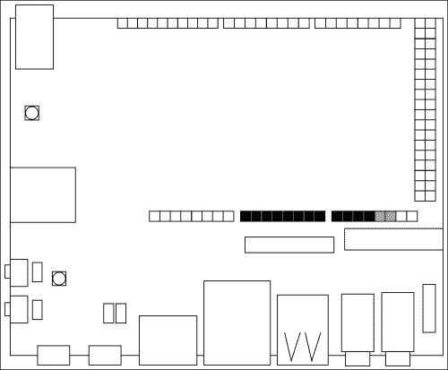
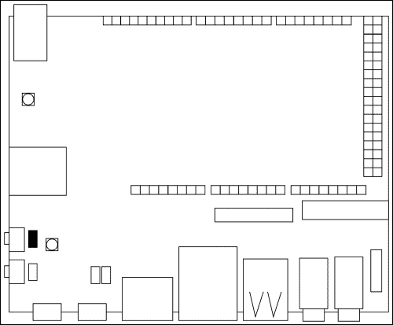
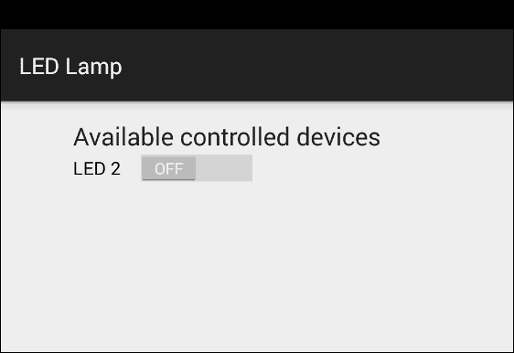
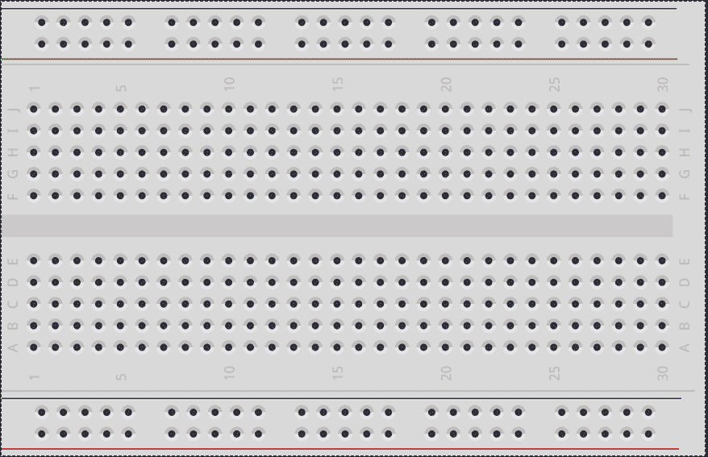

# 二、了解你的工具

正如上一章所讨论的，现实世界的应用不仅仅是软件。它们由简单或复杂的电路组成，在物理世界中执行动作。在我们开始构建我们的第一个交互式项目之前，我们需要知道这些物理组件是如何工作的，这样我们就知道工具箱里有什么。

在本章中，我们将涵盖以下主题:

*   上传第一个 Arduino 程序
*   启用与 Arduino 的连接
*   编写能够充当控制器的安卓应用
*   构建一个由安卓控制的简单电路

# 引入 Arduino 到期功能

物质世界是由我们以光、热、声音或运动的形式感知的多种形式的能量组成的。开车时，当我们靠近红绿灯时，看到前方亮起红灯，我们开始减速并停车。我们只是感觉到一种光形式的能量，这导致我们改变了我们的活动，因为有人教我们每个红绿灯的相位意味着什么。

这种自然的行为与我们想要带给我们的交互式物理应用的行为是一样的。我们使用被称为**传感器的硬件设备，这些设备监听环境并与其他被称为 **执行器**的硬件组件合作，这些硬件组件在现实世界中执行动作。然而，根据上传的程序，我们需要第三个被称为**微控制器** 的元件，它使用连接的传感器和执行器来感测和改变周围的环境。**

 **板载的 Arduino Due 搭载了最新的部件，提供了连接外部电子元件的通用方式。它有 54 个数字输入/输出引脚，我们可以用来发送或接收数字信号。当我们想要从开关或按钮等外部设备收集输入时，这尤其有用，而我们可以发送数字信号来打开或关闭简单的组件。在下图中，您可以看到所有数字引脚都是黑色的:


我们有 12 路模拟输入可供使用，12 位分辨率可读取 4096 个不同的值。当我们需要从传感器收集数据并将返回值用作程序改变物理设备行为的条件时，它们非常有用。读取值的好例子与温度、光线或接近传感器有关。该板还提供 2 个**数模转换器** ( **数模转换器**)，分辨率为 12 位，当我们必须使用数字信号驱动模拟设备时，可以用作模拟输出。当您必须使用数模转换器输入/输出引脚时，一个很好的例子是当您必须用设备创建音频输出时。在下图中，您会发现所有模拟引脚都用黑色标记，而 2 个数模转换器引脚用灰色标记:



有了这些功能，我们就有了从安卓应用控制小设备所需的所有工具。另一方面，我们也可以从反面利用优势，让连接的设备改变我们安卓界面的行为。

然而，当使用 UDOO 来引导一个可能需要硬件驱动程序与之交互的复杂电路时，它会变得非常强大。当我们打算回收我们已经拥有的设备(如旧玩具)时，或者当我们购买新的东西(如小型机动机器人或漫游车)时，这可能会成为常见的方法。

构建硬件驱动程序是一项昂贵的任务，需要大量的软件和电子经验。UDOO，通过机载 Arduino，使这项任务变得容易，因为它重用了制造商社区构建的所有组件。我们可以结合 UDOO 和*屏蔽*来添加其他功能，它是一个可插拔的板，实现了具有所有所需硬件逻辑的复杂电路。很好的例子是液晶 Arduino 兼容屏幕、蓝牙控制器和电机屏蔽来控制连接的电机，只需几行代码，不需要构建外部电路。

## 上传第一个程序

现在我们知道了我们的 UDOO 板的主要组件和功能是什么，我们就可以开始编写和上传我们的第一个程序了。我们必须记住，即使 SAM3X 是一个独立的处理器，我们也需要一个具有有效 UDOO 映像的工作 microSD 卡，否则 Arduino 程序员将无法工作。

正如我们之前对安卓所做的那样，我们将编写一个简单的应用来打印 Hello World！在我们的屏幕上，目前没有任何安卓交互。在打开 Arduino IDE 之前，我们需要通过 microUSB 端口将板卡连接到我们的电脑上，可从板卡左侧的获得，如下图所示:


然而，这种连接不足以允许 Arduino SAM3X 和我们的计算机之间的正确通信，因为两个处理器都使用这个微 USB 端口通过串行端口与连接的设备通信。一个内部物理交换机在运行安卓的 i.MX6 和 Arduino SAM3X 之间选择连接的处理器。

### 注

这是一种不同的连接，与前一章中使用的连接不同。它指的是串行端口，不得与用于部署安卓应用的 OTG 微 USB 端口混淆。

要启用我们的计算机和 SAM3X 之间的连接，我们必须拔掉物理**跳线 J18** 如所示，如下图所示:



现在我们准备启动 Arduino IDE，开始编写和上传我们的第一个程序。当 IDE 出现时，它会打开一个空程序。为阿尔杜伊诺编写的每个程序和代码都被称为 **草图**。Arduino 草图是用一套简化的 C/C++编写的，如果你感兴趣，可以在[http://arduino.cc/en/Reference/HomePage](http://arduino.cc/en/Reference/HomePage)找到完整的参考资料。

初始草图包含以下两个功能:

*   `setup()`:这是在初始执行的时候调用一次，我们把所有的初始配置放在那里
*   `loop()`:这是一遍又一遍的调用，直到有人关掉设备，它代表了我们草图的核心

我们所有的草图必须包含这两个功能，否则我们的程序将无法工作。我们可能会添加自己的函数，使代码更具可读性和可重用性，所以我们可以接受编程原则**不要重复自己** ( **DRY** )。

### 注

我们必须记住，我们将为一个最多有 512 KB 可用内存来存储代码的微控制器编写软件。此外，我们有 96 KB 的静态随机存取存储器限制，其中草图在运行时创建和操作变量。对于复杂的项目，我们应该总是优化我们的代码来减少使用的内存，但是为了本书的目的，我们编写代码是为了使它更易读和易于实现。

去打印你好世界！在我们的屏幕上，我们需要编写一个草图，将一个 String 写入内置的串口。该草图可以通过以下简单步骤实现:

1.  In the `setup()` function, initialize the serial port with the specified data rate expressed in **bits per second** (**baud**), as follows:

    ```java
    void setup() {
     Serial.begin(115200);
    }
    ```

    我们选择每秒`115200`波特，因为机载 Arduino Due 支持这个数据速率。

    ### 类型

    **下载示例代码**

    您可以从您在[http://www.packtpub.com](http://www.packtpub.com)的账户中下载您购买的所有 Packt 书籍的示例代码文件。如果您在其他地方购买了这本书，您可以访问[http://www.packtpub.com/support](http://www.packtpub.com/support)并注册，以便将文件直接通过电子邮件发送给您。

2.  Write into the serial port using the `println()`function within the main `loop()` function:

    ```java
    void loop() {
     Serial.println("Hello World!");
    }
    ```

    即使我们很想上传我们的项目，我们也必须记住`loop()`函数被一遍又一遍地调用，这意味着我们可能会收到太多的 Hello World！实例。一件好事是添加一个`delay()`函数，这样 Arduino 在再次开始使用`loop()`函数之前会等待给定的毫秒。

3.  要每秒打印一句话，添加突出显示的代码如下:

    ```java
    void loop() {
     Serial.println("Hello World!");
     delay(1000);
    }
    ```

现在我们准备开始上传过程。它包括两个阶段，首先编译我们的代码，然后上传到 SAM3X 处理器。如果我们上传两个不同的草图，最新的一个会覆盖第一个，因为我们一次只能加载和执行一个草图。

在这种情况下，我们需要配置集成开发环境，以便它可以对连接到正确串行端口的正确板进行编程。点击**工具**，悬停在**板**上，选择 **Arduino Due(编程端口)**。现在点击**工具**，悬停在**端口**上，选择您配置的端口。正确的端口取决于您的操作系统，通常它们具有以下值:

*   在 Windows 中:编号最高的`COM`端口
*   在麦克 OS X: `/dev/tty.SLAB_USBtoUART`
*   在 Linux 中:`/dev/ttyUSB0`

要上传程序，点击**文件**，然后点击**上传**或使用工具栏中的快捷方式。如果上传过程顺利，您将在窗口底部看到日志记录程序，并显示以下输出:


为了确保我们的第一个草图按预期工作，我们需要使用一个串行端口读取器，并且 Arduino IDE 提供了一个内置的串行监视器。点击**工具**，然后点击**串行监视器**，或者使用工具栏中的快捷方式。我们可能会看到一些奇怪的字符，这是因为串行监视器默认配置为以 9600 波特读取串行。在右下角的下拉列表中，选择 **115200 波特**查看以下输出:


### 注

使用`Serial.println()`功能可以通过串口发送数据。这不是用来与 i.MX6 处理器通信的，但它是调试变量或计算机中的草图流的好方法。

当我们完成草图上传后，我们可以插入 **J18 跳线**。现在我们已经知道如何部署安卓应用和 Arduino 草图，是时候从头开始构建我们的第一个项目了。

# 与现实世界互动

我们的第一个真实原型应该是一个安卓应用，我们可以用它来控制一个简单的电子元件。我们必须选择一些不太琐碎的东西，这样我们就可以实验它，但也不要太复杂，这样我们就可以深入所有主要概念，而无需太多的实现细节。一个很好的起点是创建一个控制器，我们可以用它来打开和关闭一个真正的**发光二极管** ( **发光二极管**)组件。

然而，在我们继续之前，我们必须了解如何在安卓应用和草图之间创建通信。在部署过程中，我们使用外部 OTG 端口从我们的计算机与 i.MX6 处理器通信。如果我们禁用此选项，内部开关会激活 i.MX6 和 SAM3X 处理器之间的双向通信。这是可能的，因为 Arduino Due 完全支持 USB OTG 连接，我们正在使用这个连接让 Android 和 Arduino 相互通信。

不幸的是，如果我们没有通信协议，上面的软件开关就不是很有用。这里是**配件开发套件** ( **ADK** )发挥重要作用的地方。这是谷歌开发的一个参考实现，用于构建安卓配件，它提供了一套软件库。UDOO 董事会得到了 ADK 的全力支持。通过将内部的 Android APIs 与外部的 Arduino 库相结合，我们可以轻松地使用这个功能来发送命令和接收数据。这样，我们的安卓系统将我们的 Arduino 设备视为一个*安卓配件*，因此我们的应用和整个系统都支持这种连接。我们可以在[http://developer.android.com/tools/adk/index.html](http://developer.android.com/tools/adk/index.html)找到更多关于 ADK 的细节。

## 与阿尔杜伊诺沟通

这个原型的第一步是开始一个新的草图，并从 Arduino 一侧建立初始连接。在空草图的顶部，我们应该添加以下代码:

```java
#include <adk.h>
#define BUFFSIZE 128
#define LED 2
```

`adk.h`头文件包含了我们可以使用的许多实用程序和函数的所有必需声明，例如，初始化 ADK 连接，向安卓系统发送硬件信息，以及在两个处理器之间读写缓冲数据。在前面的代码中，我们还定义了两个*宏对象*，它们分别提供了读写缓冲区的最大尺寸以及用来打开和关闭发光二极管的引脚排列。我们必须记住这个数字，因为我们将在以后连接第一个电子元件时重复使用它。

通过 ADK 使用的协议，Arduino 像外部配件一样被安卓识别。为了区分我们的配件，安卓系统需要一个**配件描述符**，我们可以为提供以下代码:

```java
char accessoryName[] = "LED lamp";
char manufacturer[] = "Example, Inc.";
char model[] = "LedLamp";
char versionNumber[] = "0.1.0";
char serialNumber[] = "1";
char url[] = "http://www.example.com";
```

在这里，我们提供了有关配件名称、硬件制造商名称和型号唯一标识符的信息。除了这些原型描述符，我们必须定义硬件版本和序列号，因为当我们将设备连接到安卓应用时，它们是非常必要的。事实上，`versionNumber`、`model`和`manufacturer`参数将与我们稍后提供给安卓应用的值相匹配，如果不匹配，我们的草图将不会被安卓应用识别。这样，我们还可以保持应用版本和硬件版本之间的强绑定，以避免旧的安卓应用错误地控制新的硬件版本。

### 注

需要前面的描述符来从安卓应用中识别草图和硬件。但是，请记住，这是良好的*编程礼仪*的一部分，对于每个应用和原型，您应该始终提供版本编号以及更改日志。在本书中，我们将使用**语义版本**，您可以在[http://semver.org](http://semver.org)找到更多关于它的信息。

最新的参数是`url`，安卓使用它将用户重定向到一个网站，在那里他们可以找到关于连接的附件的更多信息。每当安卓没有找到能够管理与 Arduino 附件交互的已安装应用时，它都会显示该消息。

### 类型

在大多数情况下，设置`url`参数是一个好主意，它带有一个链接，可以下载并安装打包的安卓应用。这样，如果安卓应用丢失了，我们就提供了一种快速检索和安装它的方法，当我们向其他开发人员分发原型的示意图和草图时，这尤其有用。您可以在[上找到更多关于如何使用](https://developer.android.com/tools/building/building-studio.html)安卓工作室创建打包应用的信息。

为了完成 ADK 配置，我们必须在前面的声明下面添加以下代码:

```java
uint8_t buffer[BUFFSIZE];
uint32_t bytesRead = 0;
USBHost Usb;
ADK adk(&Usb, manufacturer, model, accessoryName, versionNumber, url, serialNumber);
```

我们正在声明读写操作期间使用的`buffer`参数和一个`USBHost`对象。我们使用它来初始化主`loop()`功能中的连接，以便安卓在发现过程中接收所有需要的信息。在最后一行，我们用定义的值初始化 ADK 配件描述符。

要开始连接，我们应该将以下代码放入`loop()`功能:

```java
void loop(){
 Usb.Task();
 if (adk.isReady()) {
 // Do something
 }
}
```

`Usb.Task()`功能调用轮询连接的 USB 设备以获得其状态的更新，并等待 5 秒钟以查看是否有任何设备响应更新请求。当安卓响应轮询时，我们使用条件语句来评估`adk.isReady()`函数调用。当设备连接并准备好与安卓系统通信时，它会返回`True`，因此我们可以准确地知道安卓系统何时读取原型描述符，以及何时通知已安装的应用连接了新的附件。

我们的初始配置已经完成，我们可以将草图上传到板上。当草图上传并且我们禁用 OTG 外部端口时，安卓将发现正在运行的附件，然后显示一条消息通知用户没有任何可用的应用可以与连接的 USB 附件一起工作。它还为用户提供了跟踪所选网址的机会，如下图所示:


## 编写安卓应用控制器

我们的第一个构建模块已经准备好了，但是目前它没有任何我们可以使用的物理执行器，也没有用户界面来控制它。为此，我们的下一步是通过安卓工作室创建我们的第二个安卓项目，名为**led 灯**。就像我们在第一个应用中所做的那样，记得选择 **API 等级 19** 和一个**空白活动**，我们可以称之为**光开关**。

当活动编辑器出现时，最好更改用户界面的视觉预览，因为我们将使用监视器视图，而不是普通的智能手机视图。我们可以通过应用屏幕右侧的**预览**选项卡进行更改，在那里我们可以从上下文菜单中选择**安卓电视(720p)** 。

因为我们需要一个非常简单的活动，所以我们必须使用以下步骤更改默认布局:

1.  在`res/layout/activity_light_switch.xml`文件中，在垂直的`LinearLayout`参数中更改`RelativeLayout`参数，如您在突出显示的以下代码中所见:

    ```java
    <LinearLayout
    xmlns:android="http://schemas.android.com/apk/res/android"
     xmlns:tools="http://schemas.android.com/tools"
     android:orientation="vertical"
     android:layout_width="match_parent"
     android:layout_height="match_parent"
     android:paddingLeft="@dimen/activity_horizontal_margin"
     android:paddingRight="@dimen/activity_horizontal_margin"
     android:paddingTop="@dimen/activity_vertical_margin"
     android:paddingBottom="@dimen/activity_vertical_margin"
     tools:context=".LightSwitch">
    </LinearLayout>

    ```

2.  Within the preceding `LinearLayout` change the default `TextView` parameter with the following code:

    ```java
    <TextView
     android:layout_width="wrap_content"
     android:layout_height="wrap_content"
     android:textAppearance="@android:style/TextAppearance.Large"
     android:text="Available controlled devices"/>
    ```

    我们创建一个标题，放在布局的顶部。在这个视图下面，我们将放置所有可用的受控设备，就像我们的第一个 led 一样。

3.  Below the previous `TextView` add the following `Switch` view:

    ```java
    <Switch
     android:layout_width="wrap_content"
     android:layout_height="wrap_content"
     android:text="LED 2"
     android:id="@+id/firstLed"/>
    ```

    为了使用户界面保持简单，我们需要一个按钮，我们可以使用它来打开和关闭发光二极管。为此，我们将使用一个开关按钮，这样我们就可以将动作发送到微控制器，同时给出实际发光二极管状态的视觉反馈。

    ### 类型

    在我们的安卓应用中，有一个关于微控制器正在做什么的视觉反馈总是一个好主意。这样，我们可以很容易地知道草图的状态，这可能有助于我们发现异常。这变得很重要，尤其是当现实世界的设备没有给用户任何即时反馈的时候。

没有任何进一步的定制，下面的截图是预期的用户界面:



为了在我们的板上进行尝试，我们可以像在上一章中所做的那样继续进行应用部署，然后我们可以继续编写 ADK 通信逻辑。

## 安卓配件开发套件

为了在我们的应用中启用安卓 ADK ，我们需要在我们的`AndroidManifest.xml`文件中添加一些配置。因为我们使用的是安卓系统的一个*特殊功能*，它依赖于可用的硬件，我们需要在我们的`manifest`文件顶部添加以下声明:

```java
<manifest
 xmlns:android="http://schemas.android.com/apk/res/android"
  package="me.palazzetti.ledlamp">

<uses-feature
android:name="android.hardware.usb.accessory"
android:required="true"/>

<!-- other declarations -->
</manifest>
```

当应用将自己注册到系统中时，它应该声明能够响应当连接了 USB 附件时引发的事件。为此，我们需要在我们的`LightSwitch`活动声明中添加一个*意图过滤器*，突出显示的代码如下:

```java
<activity
 android:name=".LightSwitch"
 android:label="@string/app_name">
 <!-- other declarations -->

 <intent-filter>
 <action android:name=
 "android.hardware.usb.action.USB_ACCESSORY_ATTACHED"/>
 </intent-filter>
</activity>
```

安卓系统需要与我们之前在 Arduino 草图中填写的相同的附件信息。事实上，我们必须提供制造商、型号和配件版本，为了保持有序，我们可以创建文件夹`res/xml/`并放入名为`usb_accessory_filter.xml`的 XML 文件。在这个文件中，我们可以添加以下代码:

```java
<resources>
   <usb-accessory
    version="0.1.0"
    model="LampLed"
    manufacturer="Example, Inc."/>
</resources>
```

要将前面的文件包含到安卓清单中，只需在 USB 意图过滤器下面添加以下代码:

```java
<activity
 android:name=".LightSwitch"
 android:label="@string/app_name">
 <!-- other declarations -->

 <meta-data
 android:name=
 "android.hardware.usb.action.USB_ACCESSORY_ATTACHED"
 android:resource="@xml/usb_accessory_filter"/>
 </activity>
```

现在我们的应用已经为发现过程做好了准备，我们需要包含一些逻辑来建立链接，并开始通过 ADK 发送数据。

### 注

在这个原型中，我们将通过安卓内部应用编程接口使用 ADK。从[第 4 章](4.html "Chapter 4. Using Sensors to Listen to the Environment")、*使用传感器倾听环境*开始，我们将通过外部库使用高级抽象，这将帮助我们更容易地实现我们的项目，而无需任何样板代码。

下一步是在一个新的 Java 包中隔离一些 ADK 功能，以便更好地组织我们的工作。我们需要创建一个名为`adk`的新包，我们应该在其中添加一个名为`Manager`的新类。在这个类中，我们需要使用从安卓`Context`参数中获得的`UsbManager`类、文件描述符和输出流来将数据写入 OTG 端口。在`Manager`类中添加以下代码:

```java
public class Manager {
 private UsbManagermUsbManager;
  private ParcelFileDescriptormParcelFileDescriptor;
  private FileOutputStreammFileOutputStream;

  public Manager(UsbManagerusbManager) {
  this.mUsbManager = usbManager;
  }
}
```

### 类型

Java 片段需要在文件的顶部进行许多导入，为了更好的代码可读性，这些导入被有意地忽略了。然而，为了让一切按预期运行，我们需要编写它们并使用安卓工作室中可用的自动完成功能。当您找到一个丢失的导入时，只需将光标放在红色语句上方，然后按下 *Ctrl* + *Space* 键。我们现在可以从建议框中选择正确的导入。

我们期望`UsbManager`方法作为参数，因为我们没有访问安卓`Context`的权限，稍后我们将从主活动中获得它。为了简化我们在 ADK 交流期间的工作，以下助手应该包含在我们的包装器中:

*   `openAccessory()`:当发现一个设备时，应该打开与它的连接
*   `closeAccessory()`:如果连接了任何设备，应该关闭并释放所有使用的资源
*   `writeSerial()`:连接了设备，应该通过打开的流发送数据

打开与附件的连接并初始化相关输出流的第一个助手可以用下面的方法来实现，我们应该在`Manager`类的底部添加该方法:

```java
public void openAccessory() {
 UsbAccessory[] accessoryList = mUsbManager.getAccessoryList();
  if (accessoryList != null &&accessoryList.length> 0) {
    try {
     mDescriptor = mUsbManager.openAccessory(accessoryList[0]);
     FileDescriptor file = mDescriptor.getFileDescriptor();
     mOutput = new FileOutputStream(file);
    }
   catch (Exception e) {
      // noop
    }
  }
}
```

我们正在使用存储的`UsbManager`对象获取所有可用的配件。如果我们至少有一个附件，我们打开它来初始化一个描述符和一个输出流，我们稍后将使用它向附件发送数据。为了关闭上述连接，我们可以添加第二个助手，如下所示:

```java
public void closeAccessory() {
  if (mDescriptor != null) {
    try {
     mDescriptor.close();
    }
   catch (IOException e) {
      // noop
    }
  }
 mDescriptor = null;
}
```

如果我们已经打开了一个附件，我们使用创建的描述符来关闭激活的流，然后从实例变量中释放引用。现在我们可以添加最新的 write helper，它包含以下代码:

```java
public void writeSerial(int value) {
  try {
   mOutput.write(value);
  }
 catch (IOException e) {
    // noop
  }
}
```

前面的方法将给定的`value`写入启用的输出流。这样，如果连接了附件，我们使用输出流引用写入 OTG 端口。

最后，我们需要在我们的活动中创建一个`Manager`类实例，这样我们就可以用它来打开与 Arduino 的通信。在`LightSwitch`活动的`onCreate`方法中，添加以下高亮显示的代码:

```java
public class LightSwitch extends ActionBarActivity{
 private Manager mManager;

  @Override
  protected void onCreate(Bundle savedInstanceState) {
   super.onCreate(savedInstanceState);
   setContentView(R.layout.activity_light_switch);
 mManager = new Manager(
 (UsbManager) getSystemService(Context.USB_SERVICE));
  }
}
```

我们正在向系统查询 USB 服务，因此可以在我们的`Manager`类中使用它来访问 USB 附件的状态和功能。我们将`Manager`类引用存储在类中，以便将来可以访问我们的助手。

一旦`Manager`类被初始化，我们应该根据活动的开始和结束来打开和关闭我们的附件。事实上，通常在活动`onResume()`和`onPause()`回调中调用`openAccessory()`和`closeAccessory()`函数是个好主意。这样，当我们开始在我们的活动方法中使用 ADK 通信时，我们确信它已经被初始化了。要实现实现 ADK 通信的最后一个构建模块，请在`onCreate()`成员函数下面添加以下方法:

```java
@Override
protected void onResume() {
 super.onResume();
 mManager.openAccessory();
}

@Override
protected void onPause() {
 super.onPause();
 mManager.closeAccessory();
}
```

现在安卓应用已经准备好了，我们可以继续部署，当我们禁用外部 OTG 端口时，会出现以下消息:


安卓系统已经发现了这个物理附件，并请求允许使用发光二极管灯应用与它一起工作。如果我们点击**确定**，应用将被打开。我们甚至可以将我们的应用设置为*默认*；所以，每当配件开始与安卓系统通信时，我们的应用就会立即启动。

# 快速制作电路原型

我们在安卓和 Arduino 之间有一个功能齐全的通信，现在是时候建立一个真正的电路了。我们的目标是使用安卓系统打开和关闭一个发光二极管，这个问题很少，而且自成一体。然而，在开始的时候，我们可以更有野心一点，我们可能不想打开发光二极管，而是想打开卧室的灯泡。那么为什么在我们可以让事情变得有趣一点的同时，还要创建这么简单的项目呢？因为我们是**快速原型**我们的项目。

快速原型是一组我们可以用来尽快创建工作项目的技术。这真的很有帮助，因为我们删除了许多实现细节，比如产品设计，只关注项目的核心。在我们的例子中，我们正在消除所有与打开灯泡相关的问题，比如使用晶体管、继电器和外部电池，我们正在专注于创建一个由安卓系统供电的灯开关。当第一个原型工作时，我们可以逐步增加需求，直到我们实现最终的项目。

## 使用面包板

为了继续我们的项目，我们应该创建一个电路原型。我们可以使用许多工具来实现这个目标，但最重要的一个，在开始时，是 **试验板**。无需焊接，可用于连接我们的电路板和其他电子元件。这让我们可以在试验电路设计的同时，将试验板重新用于其他项目。

以下是典型的试验板:



一个面包板由两个相同的部分组成，这两个部分被一个中间的水平行分隔开，该行断开了两侧之间的任何连接。每侧包含一个红色和一个蓝色的行，在侧边的顶部或底部，它们代表*电源总线*。它们是为整个水平线连接的，我们将使用它来连接 UDOO 板的电源和接地。这些颜色通常用红色代表力量，用蓝色代表地面，但请记住，这只是一个惯例，你的面包板的颜色可能会有所不同。

剩下的五条水平线是*原型区域*，这是我们连接设备的地方。尽管有电源总线，但这些线是垂直连接的，而水平线之间没有连接。例如，如果我们在孔 A1 内插入一根**跳线** ，一根金属条将与从 B1 到 E1 的孔建立电连接。另一方面，A2–E2 和 F1–J1 范围内的孔与我们的 A1–E1 色谱柱没有连接。

作为我们的第一个原型，我们将使用试验板连接将我们的 LED 连接到我们的 UDOO。然而，我们需要另一个被称为*电阻*的电子元件。它创造了一个反对电流通过电线，这是必要的；否则，过大的电流会损坏元件。另一方面，如果我们制造太多的电阻，没有足够的电流流过元件，它将不起作用。这个组件的电阻是用*欧姆*来测量的，在我们的例子中，我们需要一个 *220 欧姆*电阻来正确地给 LED 供电。

现在，我们需要将元件连接到试验板，如下图所示:


我们需要将引脚 2 连接到电源总线的正极线，而接地应连接到负极线。然后我们将发光二极管连接到原型区域，并将电阻器放在*正极引线*之前。我们看 LED **的腿就能分辨出 LED【】的极性** *:腿长的是正极引线，腿小的是负极引线。记住这一点，我们可以将长腿连接到电阻。为了闭合电路，我们只需将电阻连接到电源总线的正极线，将发光二极管的负极引脚连接到地线。我们已经完成了第一次巡回演出。*

### 注

发光二极管应该关闭，但可能有少量电流流过。这可能是因为我们的 Arduino 草图默认情况下没有禁用引脚。这种行为是安全的，我们将在下一节对此进行管理。

## 与外部电路交互

在这一点上，我们有一个工作通信和原型电路。我们要实现的最后一步是从安卓应用发送开关机信号，并在草图中解析执行这个命令。我们可以从草图开始，其中我们需要将引脚排列配置为输出引脚。这几种配置在`setup()`功能中完成；在其中，我们应该添加以下代码:

```java
void setup(){
 pinMode(LED, OUTPUT);
 digitalWrite(LED, LOW);
}
```

使用`pinMode()`功能，我们声明所选引脚将作为`OUTPUT`工作，因此我们可以控制流经它的电流。因为我们之前已经定义了`LED`宏对象，它指的是 pin 2。`digitalWrite()`函数是 Arduino 语言的另一个抽象，我们用它来让电流流入或不流入所选引脚。在这种情况下，我们说没有电流应该流过引脚，因为在初始化步骤中，我们希望关闭发光二极管。

因为安卓应用会给我们发送一个只能有`0`和`1`值的命令，所以我们需要一个函数来解析这个命令，让 Arduino 知道相关的动作是什么。为此，我们可以简单地在草图底部添加一个`executor()`函数，如下所示:

```java
void executor(uint8_t command){
  switch(command) {
    case 0:
   digitalWrite(LED, LOW);
      break;
    case 1:
   digitalWrite(LED, HIGH);
      break;

    default:
      // noop
      break;
  }
}
```

我们正在创建一个解析`command`参数的开关。如果数值为`0`，Arduino 使用`digitalWrite()`功能关闭 LED 但是，如果值为`1`，则使用相同的功能打开 LED。在任何其他情况下，我们只是丢弃收到的命令。

此时，我们需要在主`loop()`函数中的`adk.isReady`条件内将东西放在一起，如下所示:

```java
if (adk.isReady()) {
 adk.read(&bytesRead, BUFFSIZE, buffer);
 if (bytesRead> 0){
 executor(buffer[0]);
 }
}
```

在主`loop()`函数中，如果我们找到一个 ADK 连接，我们从通信通道读取任何消息，并通过`adk.read()`函数调用将结果写入我们的`buffer`变量。如果我们读取至少 1 个字节，我们将字节数组的第一个值传递给`executor()`函数。这一步之后，我们可以将草图上传到 UDOO 板中。

## 从安卓发送命令

现在 UDOO 已经准备好采取物理动作，我们必须完成 Android 应用，在`LightSwitch`类内实现命令发送。作为第一步，我们需要在我们的活动中添加一个变量来存储发光二极管的状态。在我们班级的顶部，添加`mSwitchLed`声明:

```java
private Manager mManager;
private booleanmSwitchLed = false;

```

最后要做的是创建一个使用 ADK 书写包装器向 Arduino 发送命令的方法。在`onCreate()`方法下面，添加以下代码:

```java
public void switchLight(View v) {
 mSwitchLed = !mSwitchLed;
 int command = mSwitchLed ? 1 : 0;
 mManager.writeSerial(command);
}
```

我们正在改变发光二极管的状态，并从中创建结果`command`参数，该参数可以是`0`或`1`值。然后我们使用`mManager`将命令写入 OTG 端口。要完成应用，我们只需要将`switchLight`方法绑定到我们的视图。进入`activity_light_switch.xml`文件，将`onClick()`属性添加到我们的开关按钮，如下所示:

```java
<Switch
 android:layout_width="wrap_content"
 android:layout_height="wrap_content"
 android:text="LED 2"
 android:id="@+id/firstLed"
 android:onClick="switchLight"/>

```

这是我们的最后一步，现在我们有了第一个真实世界的原型。我们现在可以把安卓应用上传到 UDOO 板上，用它来打开和关闭 LED。

# 总结

在本章中，您已经学习了与可用输入和输出引脚相关的一些 UDOO 特性，以及两个处理器如何通过内部串行总线连接在一起。此外，在第一部分中，我们编写了第一个草图并将其部署到板中。

然后，我们深入研究了通过 ADK 实现的通信机制，并编写了一个新的 Arduino 草图，能够使用内部的 OTG 端口与 Android 建立通信。对安卓也是如此，我们创建了一个简单的用户界面，在设备使用过程中提供视觉反馈。我们还在我们的安卓应用中编写了一些包装器，以轻松地公开常用的 ADK 方法来打开和关闭连接，并写入通信通道。

在这一章的最后，你学习了如何使用试验板来快速制作电路原型，并使用发光二极管和电阻制作了第一个电路。然后，我们添加了从我们的安卓应用发送打开和关闭信号以及从草图接收和执行该命令所需的所有代码。这是一个更复杂的 Hello World 应用，它确实有助于构建我们的第一个真实世界的设备。

在下一章中，我们将通过调试功能扩展上述电路，以便测试我们的硬件，并查看我们的设备是否有任何损坏的电子组件。**