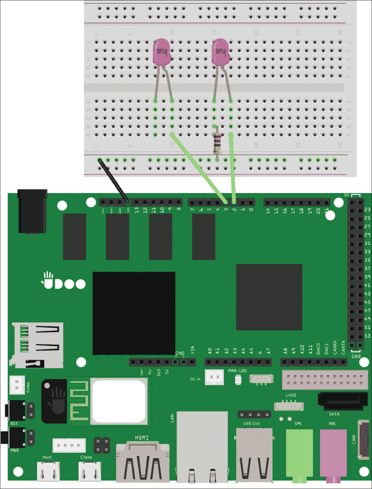
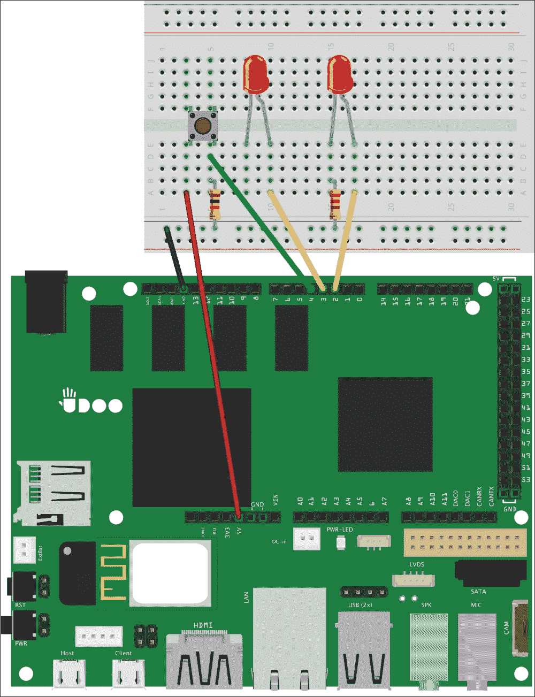

# 三、测试您的物理应用

软件开发过程中最重要的步骤之一就是**测试**。当我们测试软件组件时，我们使用一个测试框架来编写单元测试，可能还有集成测试，这些测试对于重现错误和检查应用的预期行为是有用的。在物理应用中，这个过程并不容易，因为我们必须测试草图如何与硬件电路交互。

我们将为 LedLamp 应用添加所有必需的功能，以实现一种发现电路异常的简单方法，这样我们就可以避免复杂的调试过程。

在本章中，我们将涵盖以下主题:

*   关于电子元件和电路的更多细节
*   将元件添加到电路中，以便可以通过草图进行测试
*   编写电路调试的第一个测试
*   从原型运行电路测试

# 构建可测试电路

在安卓应用编写过程中，我们可能会使用内部测试框架来编写插装测试。有了它们，我们可以在安卓堆栈的所有级别检查应用的行为，包括用户界面压力测试。然而，在我们的 UDOO 项目中，我们利用 Android 与板载微控制器进行交互，以控制和收集物理设备的数据。当我们在我们的安卓应用中通过测试获得良好的功能覆盖率，并且它符合我们的所有要求时，我们的第一个问题更有可能与硬件故障和异常有关。

### 注

在这本书里，我们不会涉及安卓单元测试框架，因为它不是你制作硬件原型的第一步。但是，请记住，您应该学习如何编写安卓测试，因为这是提高软件质量的必要条件。您可以在官方文档中找到更多信息，网址为。

在前一章中，我们使用许多电子组件构建了我们的第一个原型，例如一个发光二极管和一个电阻，我们编写了一个安卓应用来充当设备控制器。这是一个很好的起点，因为我们已经有了一个可以添加另一个功能的工作设备。为了使电路简单，我们将在第一个发光二极管的基础上增加一个独立的发光二极管，使我们的设备能够打开和关闭两个不同的设备。我们需要对 LED 灯电路进行一些更改，以将第二个 LED 连接到 UDOO 板。看看下面的模式:


要实现上述模式，请执行以下步骤:

1.  从电源总线的正极线移除连接，因为我们需要从不同的引脚控制不同的组件。
2.  保持接地连接到电源总线的负极线，因为我们将所有接地连接在一起。
3.  放置两个 *220 欧姆电阻*将负脚连接到负电源总线。
4.  将正极引脚连接到 UDOO 引脚 2 和 3。

在前一章中，我们将电阻连接到正支线，而现在我们将连接到负支线。这两种配置都是正确的，因为当发光二极管和电阻器串联时，电流将以相同的强度流过它们。我们可以发现电路类似于高速公路，而汽车就像电荷。如果汽车遇到一个或多个路障，它们会在高速公路的每个点开始减速，无论它们离路障是近还是远都没有关系。所以，即使电阻在电路的末端，也会有适量的电流流过 LED。

现在电路包括了一个新的发光二极管，我们必须改变我们的草图，以便它可以通过以下步骤满足我们的需求:

1.  在草图的顶部，添加以下类似对象的宏:

    ```java
    #define LED 2
    #define LED_TWO3

    ```

2.  在`setup()`功能中初始化新的 LED，如高亮显示的代码所示:

    ```java
    void setup(){
     pinMode(LED, OUTPUT);
     pinMode(LED_TWO, OUTPUT);
     digitalWrite(LED, LOW);
     digitalWrite(LED_TWO, LOW);
    }
    ```

3.  将以下代码添加到`executor()`功能中，使新的发光二极管像我们已经编程的第一个一样工作:

    ```java
    switch(command) {
     case 0:
       digitalWrite(LED, LOW);
       break;
     case 1:
       digitalWrite(LED, HIGH);
       break;
     case 2:
     digitalWrite(LED_TWO, LOW);
     break;
     case 3:
     digitalWrite(LED_TWO, HIGH);
     break;
     default:
      // noop
       break;
    }
    ```

4.  更改文件顶部的附件描述符，更新草图版本:

    ```java
    char versionNumber[] = "0.2.0";
    ```

更改版本号始终是一个好的做法，你应该注意。在我们的例子中，这也是一个要求，因为我们必须通知安卓硬件行为已经改变。正如您在[第 2 章](2.html "Chapter 2. Know Your Tools")、*了解您的工具*中看到的，当安卓和 Arduino 中定义的版本不匹配时，安卓应用将不会与微控制器通信，这可以防止意外行为，尤其是在硬件发生变化时。事实上，如果我们再次部署新草图，我们可以看到安卓将找不到任何可用的应用来管理附件。

原型将再次工作的最后一步是从其用户界面和逻辑开始更新安卓应用，以便它能够管理新设备。为了实现这一目标，我们应该采取以下步骤:

1.  在`firstLed`申报下方的`res/layout/activity_light_switch.xml`文件中增加一个新的开关按钮:

    ```java
    <Switch
     android:layout_width="wrap_content"
     android:layout_height="wrap_content"
     android:text="LED 3"
     android:id="@+id/secondLed"
     android:onClick="switchLightTwo"/>
    ```

2.  在类顶部的`LightSwitch`活动中，添加以下声明来存储第二个 LED 的状态:

    ```java
    private boolean mSwitchLed = false;
    private boolean mSwitchLedTwo = false;

    ```

3.  在`switchLight()`方法下添加以下代码，根据草图开关情况引导第二个 LED:

    ```java
    public void switchLightTwo(View v) {
     mSwitchLedTwo = !mSwitchLedTwo;
     int command = mSwitchLedTwo ? 3 : 2;
     mManager.writeSerial(command);
    }
    ```

4.  用新的硬件版本更新`res/xml/`下的`usb_accessory_filter.xml`描述符文件:

    ```java
    <resources>
     <usb-accessory
     version="0.2.0"
     model="LedLamp"
     manufacturer="Example, Inc."/>
    </resources>
    ```

我们正在匹配草图的版本，以便安卓知道这个应用可以再次管理连接的附件。部署新应用后，我们可以使用原型来打开和关闭两个连接的指示灯。

# 开发诊断模式

有了一个工作的原型，是时候添加一个功能，我们可以用来测试我们的电路。即使我们受到的诱惑，想要将手放在代码上，我们也需要首先模拟一个导致原型出现故障的物理损伤。因为我们不想真正损坏我们的一个发光二极管，我们总是可以改变电路组件来重现异常。

事实上，我们可以模拟连接到引脚 3 的电阻的一条腿断了。如果出现这种情况，电路就会中断，从而阻止电流流过发光二极管。为了在我们的试验板中重现这个问题，我们可以简单地移除第一个电阻，正如我们在下面的模式中看到的:



现在我们已经模拟了第一次硬件故障。如果我们打开安卓应用，使用开/关开关，我们可以看到第二个发光二极管按预期工作，而第一个发光二极管停止工作。然而，没有一个软件组件注意到任何事情，因为它们不知道幕后发生了什么。如果出现这样的问题，我们就迷失了方向，因为我们开始软硬件调试，却不知道应该把注意力放在哪个部分来查找故障。

当软件不工作时，我们通常使用调试器。不幸的是，当我们处理电路时，我们没有那么多工具，我们可能需要自己实现一些东西。一个很好的起点是给原型添加一个功能，这样它就可以通过**诊断**模式进行自我调试。该模式应该*模拟和模仿我们的电路*的真实行为，但是是以受控的方式。当问题与软件错误无关时，诊断模式确实有助于识别原型中异常的原因。

### 类型

诊断模式是我们发现异常的第一步。但是，当我们发现硬件故障时，我们应该开始使用其他工具，如*万用表*，它具有测量电压、电流和电阻的能力。

在我们开始在草图中实现该模式之前，我们需要连接一个*按钮*，我们将使用来启用诊断模式。我们需要将这个组件添加到我们的试验板中，正如您可以在以下模式的左侧部分看到的:



向试验板添加组件的过程如下图所示:

1.  将按钮添加到我们的试验板中间，这样同一条垂直线中的腿就不会连接起来。
2.  将按钮的左腿连接到针脚+5V。
3.  将按钮的右腿连接到针脚 4。
4.  将 *10 千欧*电阻的一侧连接到按钮的右腿，另一侧连接到电源总线的负极线。

通过这些连接，当我们按下按钮时，我们从引脚 4 读取一个数字信号，因为*电流选择电阻较小的路径*，就像水一样。在我们的例子中，机械开关将在+5V 和 4 个引脚之间建立连接，因为该路径的电阻大大低于接地路径中存在的 *10 千欧*，UDOO 将读取该电压差并将其转换为数字信号。当开关断开时，唯一可用的路径是引脚 4 和地，因此 UDOO 读取时没有电压差。这让我们知道开关是否被按下。

## 写初试

现在我们有了物理硬件开关，需要在用户按下按钮时激活诊断模式。要检测按钮按下，我们应该按照以下步骤更改草图:

1.  Add the highlighted declarations, just after the ADK initialization:

    ```java
    ADKadk(&Usb, manufacturer, model, accessoryName, versionNumber, url, serialNumber);
    int reading = LOW;
    int previous = LOW;
    long lastPress = 0;

    ```

    我们需要每个读取阶段的按钮状态，这样我们就可以保存当前和上一次读取期间的状态。`lastPress`变量将包含上次按下按钮时的时间戳。我们将按钮状态设置为`LOW`，因为我们声明没有电流流过按钮，这意味着它没有被按下。

2.  At the top of the sketch, define the following object-like macros:

    ```java
    #define LED_TWO3
    #define BUTTON 4
    #define DEBOUNCE 200

    ```

    我们设置 BUTTON 引脚 4 和一个 DEBOUNCE 值，该值是指代码开始再次评估按钮按下之前应该经过的毫秒数。需要使用该阈值，因为它可以防止读取假阳性。如果我们省略这一部分，当按下按钮时，草图将检测到数千个读数，因为 UDOO 读取阶段比我们释放按钮的反应要快。该值称为**去抖阈值**。

3.  在`setup()`功能中配置按钮引脚模式如下:

    ```java
    pinMode(LED_TWO, OUTPUT);
    pinMode(BUTTON, INPUT);

    ```

4.  将`loop()`函数的内容移动到一个名为`readCommand()`函数的新函数中，使其与以下内容匹配:

    ```java
    void readCommand() {
     Usb.Task();
     if (adk.isReady()) {
       adk.read(&bytesRead, BUFFSIZE, buffer);
       if (bytesRead> 0) {
         executor(buffer[0]);
      }
     }
    }
    ```

5.  With an empty `loop()` function, we should add in it the reading phase with the following code:

    ```java
    void loop(){
      // Reads the digital signal from the circuit
     reading = digitalRead(BUTTON);
      // Checks the button press if it's outside a
      // debounce threshold
     if (reading == HIGH && previous == LOW &&millis() - lastPress>DEBOUNCE) {
       lastPress = millis();
        // Visual effect prior to diagnostic activation
       digitalWrite(LED, HIGH);
       digitalWrite(LED_TWO, HIGH);
       delay(500);
       digitalWrite(LED, LOW);
       digitalWrite(LED_TWO, LOW);
       delay(500);
       startDiagnostic();
     }
     previous = reading;
     readCommand();
    }
    ```

    我们正在使用内置的`digitalRead()`功能存储按钮的值，该功能抽象了从所选引脚读取电压差的复杂性。然后，我们正在检查当前状态是否与之前的状态不同，因此我们确定按钮在这一刻被准确按下。

    但是，我们还需要检查按下按钮后的时间是否超过去抖阈值。我们使用内置的`millis()`函数，返回 UDOO 板启动当前程序以来的毫秒数。

    如果捕捉到按钮事件，我们设置`lastPress`值，并显示视觉反馈，通知用户诊断模式即将开始。无论如何，我们正在保存之前的按钮状态，继续标准执行。

    ### 类型

    有时诊断模式需要激活和去激活阶段。在我们的例子中，我们保持过程简单，所以诊断模式在按钮被按下后只运行一次。在其他项目中，我们可能需要一个更复杂的激活机制，我们可以将其隔离在一个独立的函数中。

6.  As a last step, implement the `startDiagnostic()` function as follows:

    ```java
    void startDiagnostic() {
     // Turn on the first LED
     executor(1);
     delay(1000);
     executor(0);
     // Turn on the second LED
     executor(3);
     delay(1000);
     executor(2);
     // Turn on both
     executor(1);
     executor(3);
     delay(1000);
     executor(0);
     executor(2);
    }
    ```

    诊断功能应该模拟我们电路的所有或几乎所有可能的行为。在这种情况下，我们打开和关闭第一个和第二个发光二极管，作为最后一个测试，我们一起打开它们的电源。在诊断模式下，使用内部功能重现电路动作非常重要。这有助于我们测试`executor()`函数的输入，以便我们确定已经映射了安卓应用发送的所有预期输入。

现在我们有了诊断功能，我们必须再次部署我们的 led 灯草图，按钮开始诊断。不出所料，只有一个发光二极管应该打开，因为实际上是断开的电阻。现在我们可以再次连接电阻器，并启动诊断模式来测试发光二极管连接是否已经固定。

# 总结

在这一章中，我们深入研究了硬件测试，以提高我们项目的质量。我们发现这个过程是多么有价值，因为通过这种方法，我们可以将硬件故障与软件错误隔离开来。

我们在之前的原型中添加了另一个 LED，这样我们就可以从 Android 应用中控制多个设备。然后，我们模拟了一个电子元件中的硬件故障，从电路中移除一个电阻以产生受控异常。这导致我们编写自己的诊断模式来快速发现这类故障。

第一步是在我们的原型中添加一个按钮，我们可以使用它来启动诊断模式，然后我们使用该功能来模拟所有可能的电路行为，以便轻松找到损坏的电阻。

在下一章中，我们将从头开始一个新的原型，它能够通过一组新的电子元件从环境中收集数据。我们还将编写一个安卓应用，能够读取从草图发送的这些值，并可视化处理后的数据。