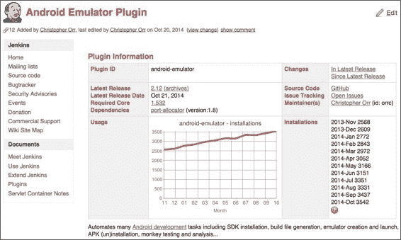
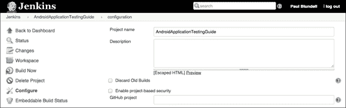
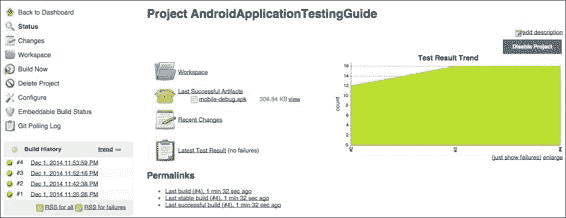
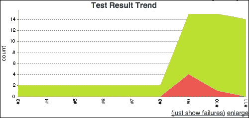
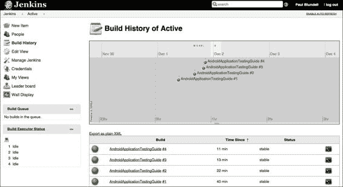

# 五、探索持续集成

**持续** **集成**是软件工程的一种敏捷技术，旨在通过持续频繁地应用集成和测试来提高软件质量并减少集成变更所花费的时间，这与在开发周期结束时进行集成和测试的更传统的方法相反。

持续集成已被广泛采用，商业工具和开源项目的激增清楚地表明了它的成功。这并不难理解，因为任何在职业生涯中使用传统方法参与过软件开发项目的人都很可能经历过所谓的*集成地狱*，在这里集成变更所需的时间超过了进行变更所需的时间。这让你想起什么了吗？相反，持续集成是频繁地、小步地集成变化的实践。这些步骤可以忽略不计，如果注意到错误，它非常小，可以立即修复。最常见的做法是在每次提交到源代码存储库后触发构建过程。

除了版本控制系统(VCS)维护的源代码之外，这种做法还意味着其他要求:

*   构建应该通过运行一个命令来实现自动化。这个特性已经被`make`和`ant`等工具支持了很长时间，最近又被`maven`和`gradle`支持。
*   构建应该是自我测试，以确认新构建的软件符合开发人员的期望。
*   构建工件和测试结果应该很容易找到和查看。

当我们为我们的安卓项目编写测试时，我们希望利用持续集成。为了实现这一点，我们希望创建一个与传统的 IDE 环境和 Android 构建工具共存的模型，这样我们就可以运行和安装我们的应用，无论是 CI 盒子、IDE 等环境还是手动。

在本章中，我们将讨论:

*   自动化构建过程
*   将版本控制系统引入流程
*   与詹金斯的持续整合
*   自动化测试

在这一章之后，你将能够将持续集成应用到你自己的项目中，无论它的规模有多大，无论它是一个雇佣了几十名开发人员的中型或大型软件项目，还是它只是你一个人编程。

### 注

关于持续集成的原创文章是 Martin Fowler 早在 2000 年写的([http://www . Martin Fowler . com/articles/continuousintegration . html](http://www.martinfowler.com/articles/continuousIntegration.html)，描述了在一个大型软件项目上把持续集成放在一起的经验。

# 使用 Gradle 手动构建安卓应用

如果我们的目标是将**持续** **集成**纳入我们的开发流程，那么第一步将是手动构建安卓应用，因为我们可以将集成机器与手动构建技术相结合，以自动化该过程。

在这样做的时候，我们打算让我们的项目与 IDE 和命令行构建过程兼容，这就是我们要做的。自动化构建是一个很大的优势，它通过构建并最终立即显示项目中可能存在的错误来加快开发过程。当编辑生成中间类的资源或其他文件时，配置项是一个无价的工具；否则，一些简单的错误会在构建过程中被发现得太晚。遵循经常失败的口头禅，快速失败是推荐的做法。

幸运的是，安卓支持使用现有工具手动构建，在同一个项目中合并手动 IDE 构建和自动 CI 构建不需要太多努力。在这种情况下，支持在集成开发环境中使用 Gradle 手动构建。但是，也存在其他选项，如默认情况下不再支持的 Ant，以及不支持的 Maven 或 Make。

### 注

Gradle 是构建自动化进化而来的。Gradle 将 Ant 的强大和灵活性与 Maven 的依赖管理和约定结合到中，成为一种更有效的构建方式。

更多信息可以在它的主页[http://gradle.org/](http://gradle.org/)找到。

在撰写本文时，基于 Android Gradle 的项目至少需要 Gradle 2.2 或更新版本。

这里值得注意的是整个安卓开源项目并不是由 Gradle 构建的，而是由一个极其复杂的 make 文件结构构建的，这种方法甚至被用来构建平台包含的应用，比如 Calculator、Contacts、Settings 等等。

当用安卓工作室创建一个新项目时，模板项目已经在用 Gradle 构建了。这意味着您已经可以从命令行手动构建项目。从项目基础执行`./gradlew tasks`会给你一个完整的可以运行的任务列表。下表显示了最常用的任务:

<colgroup class="calibre15"><col class="calibre16"> <col class="calibre16"></colgroup> 
| 

目标

 | 

描述

 |
| --- | --- |
| `build` | 组装和测试此项目 |
| `clean` | 删除生成目录 |
| `tasks` | 显示可从根项目 x 运行的任务(某些显示的任务可能属于子项目) |
| `installDebug` | 安装调试版本 |
| `installDebugTest` | 为调试版本安装测试版本 |
| `connectedAndroidTest` | 在连接的设备上安装并运行构建调试测试 |
| `uninstallDebug` | 卸载调试版本 |

前缀为`./gradlew`的命令使用的是 Gradle 的安装，它实际上是在您的项目源代码中提供的。这就是众所周知的*渐变包装*。因此，您不需要在本地计算机上安装 Gradle！但是，如果您在本地安装了 Gradle，那么所有使用包装器的命令都可以用`./gradle`替换。如果有几个设备或仿真器连接到构建计算机，这些命令将在它们上面运行/安装。这对我们的配置项设置非常好，这意味着我们可以在所有提供的设备上运行测试，这样我们就可以处理许多配置和安卓版本。如果你因为其他原因想在其中一个上安装，这可以通过设备提供者应用编程接口来实现，但是不在本书的讨论范围内。我鼓励你在[http://tools.android.com](http://tools.android.com)阅读更多内容，并查看大量可用的 Gradle 插件来帮助你。

现在，我们可以运行以下命令来安装我们的应用:

```java
$ ./gradlew installDebug

```

这是生成的输出的开始和结束:

```java
Configuring > 3/3 projects
…
:app:assembleDebug 
:app:installDebug
Installing APK 'app'-debug.'apk' on 'emulator-5554'Installing APK 'app'-debug.'apk'on 'Samsung'Galaxy 'S4'
Installed on 2 devices.

BUILD SUCCESSFUL
Total time: 11.011 secs

```

运行前面提到的命令，执行以下步骤:

*   源代码的编译，包括资源、AIDL 和 Java 文件
*   将编译后的文件转换为本机安卓格式
*   包创建和签名
*   安装到给定的设备或仿真器上

一旦我们安装了 APK，因为我们现在从命令行做所有的事情，我们甚至可以启动一个活动，比如`EspressoActivity`。使用`am` `start`命令和使用`MAIN`动作和我们感兴趣的活动作为组件启动的意图，我们可以创建如下命令行:

```java
adb -s emulator-5554 shell am start -a android.intent.action.MAIN -n com.blundell.tut/.EspressoActivity

```

当您可以在模拟器中验证时，活动开始。现在要做的下一件事是为我们的应用安装测试项目，然后使用命令行运行这些测试(如前几章所述)。最后，当它们完成时，我们应该卸载应用。如果你仔细阅读命令列表，你可能已经注意到幸运的是，这已经通过`connectedAndroidTest` Gradle 任务为我们完成了。

运行命令后，我们将获得测试结果。如果它们通过，输出简单如下:

```java
:app:connectedAndroidTest
BUILD SUCCESSFUL
Total time: 9.812 secs

```

然而如果它们失败了，输出是更详细，并且提供了到文件的链接，在那里您可以看到完整的堆栈跟踪和每个测试失败的原因:

```java
:app:connectedAndroidTest
com.blundell.tut.ExampleEspressoTest > testClickingButtonShowsImage[emulator-5554]FAILED 
android.view.ViewRootImpl$CalledFromWrongThreadException: Only the original thread that created a view hierarchy can touch its views.
 at android.view.ViewRootImpl.checkThread(ViewRootImpl.java:6024)
FAILURE: Build failed with an exception.
* What went wrong:
Execution failed for task ':app:connectedAndroidTest.
> There were failing tests. See the report at: file:///AndroidApplicationTestingGuide/app/build/outputs/reports/androidTests/connected/index.html
…
BUILD FAILED
Total time: 15.532 secs.

```

我们已经通过调用一些简单的命令完成了从命令行开始的所有工作，这正是我们所寻找的，以便将这些输入到一个持续的集成过程中。

# Git——快速版本控制系统

**Git** 是一个免费的和开源的分布式版本控制系统，旨在以速度和效率处理从小型到超大型的所有项目。它的设置非常简单，所以我强烈推荐它用于个人项目。没有一个项目足够简单，可以从这个工具的应用中获益。你可以在找到信息和下载。

版本控制系统或 **VCS** (也称为源代码管理或 **SCM** )对于涉及多个开发人员的开发项目来说是不可避免的元素，即使单独编码也是最佳实践。此外，即使可以在没有 VCS 的情况下实行持续一体化(因为 VCS 不是竞争情报的必要条件)，避免这种情况也不是合理或建议的做法。

其他和可能更传统(见遗产)，选项存在于 VCS 竞技场，如 Subversion 或 CVS，如果你觉得更舒服，你可以自由使用。否则，Git 被安卓项目广泛用于托管谷歌自己的代码和示例，因此值得投入一些时间来至少了解基础知识。

说到这里，记住这是一个非常广泛的主题来证明一本书本身是正确的(当然也有一些关于它的好书)，我们在这里讨论最基本的主题，并提供一些例子来帮助你开始，如果你还没有接受这个实践的话。

## 创建本地 Git 存储库

这些是创建本地存储库并用我们项目的初始源代码填充它的最简单的命令。在这种情况下，我们再次使用前几章中创建和使用的`AndroidApplicationTestingGuide`项目。我们复制了上一节中使用的代码，其中我们手动构建了:

```java
$ mkdir AndroidApplicationTestingGuide
$ cd AndroidApplicationTestingGuide
$ git init
$ cp -a <path/to/original>/AndroidApplicationTestingGuide/
$ gradlew clean
$ rm local.properties
$ git add .
$ git commit -m "Initial commit"

```

我们创建新的项目目录，初始化 Git 存储库，复制初始内容，清理并删除我们之前自动生成的文件，删除`local.properties`文件，将所有内容添加到存储库中，并提交。

### 类型

`local.properties`文件绝对不能在版本控制系统中检查，因为它包含您本地配置的特定信息。您可能还想创建一个`.gitignore`文件。此文件允许您定义哪些文件没有签入(如自动生成的文件)。`.gitignore`文件的一个例子可以在[https://github.com/github/gitignore](https://github.com/github/gitignore)找到。

此时点，我们有了包含应用及其所有测试的初始源代码的项目存储库。我们没有改变结构，所以当我们继续开发、本地构建和持续集成时，项目仍然与我们的集成开发环境和 Gradle 兼容。

下一步是让我们的项目在我们每次提交对源代码的更改时自动构建和测试。

# 与詹金斯持续整合

**Jenkins** 是一个开源的、可扩展的连续集成服务器，能够构建和测试软件项目或者监控外部作业的执行。Jenkins 易于安装和配置，因此被广泛使用。这使得它成为学习持续集成的理想范例。

## 安装和配置詹金斯

我们提到容易安装是詹金斯的优势之一，安装再容易不过了。从[http://jenkins-ci.org/](http://jenkins-ci.org/)下载您选择的操作系统的原生包。所有主要的服务器和桌面操作系统都有本机软件包。在下面的例子中，我们将使用 1.592 版本。我们将在下载后运行`.war`文件，因为它不需要管理权限。

完成后，将 war 复制到选定的目录中，`~/jenkins`，然后运行以下命令:

```java
$ java -jar ~/jenkins/jenkins-1.592.war

```

这扩展并启动了詹金斯。

默认配置使用端口`8080`作为 HTTP 侦听器端口，因此将您选择的浏览器指向`http://localhost:8080`应该会向您显示詹金斯主页。如果需要，您可以通过访问**管理** **詹金斯**屏幕来验证和更改詹金斯的操作参数。我们应该在这个配置中添加 Git 集成所需的插件，用 Gradle 构建，检查测试结果，以及在构建过程中对 Android 模拟器的支持。这些插件分别为命名为 **Git 插件****Gradle 插件****JUnit 插件****安卓模拟器插件**。

在屏幕截图之后的显示了您可以通过詹金斯插件管理页面上的链接获得的插件信息:



安装并重新启动詹金斯后，这些插件将可供使用。我们的下一步是创造必要的就业机会来建设这些项目。

## 创造就业机会

让我们从詹金斯主页上的**新项目**开始创建安卓应用测试指南作业。以项目命名。可以创造不同种类的工作；在这种情况下，我们选择**自由式项目**，允许您将任何配置管理与任何构建系统相连接。

点击**确定**按钮后，会出现具体的工作选项，如下表所示。这位于作业属性页面的顶部，如下所示:



**新增**T3】项目屏幕中的所有选项都有关联的帮助文本，因此这里我们只解释我们输入的选项:

<colgroup class="calibre15"><col class="calibre16"> <col class="calibre16"></colgroup> 
| 

[计]选项

 | 

描述

 |
| --- | --- |
| 项目名 | 项目的名称。 |
| 描述 | 可选描述。 |
| 放弃旧版本 | 这有助于通过管理构建记录(如控制台输出、构建工件等)的保留时间来节省磁盘消耗。 |
| 此构建是参数化的 | 这允许您配置传递给构建过程的参数，以创建参数化的构建，例如，使用`$ANDROID_HOME`而不是硬编码路径。 |
| 源代码管理也被称为 VCS，项目的源代码在哪里？在这种情况下，我们使用 Git 和一个存储库，其中 URL 是我们之前创建的存储库的绝对路径。比如`/git-repo/AndroidApplicationTestingGuide`。 |   |
| 构建触发器 | 这个项目是如何自动构建的。在这种情况下，我们希望源代码中的每一个变化都触发自动构建，所以我们选择 **Poll SCM** 。另一种选择是定期使用**构建**。这个特性主要是用 Jenkins 作为`cron`的替代品，持续构建软件项目并不理想。当人们第一次开始连续集成时，他们经常习惯于定期计划构建的想法，例如每晚/每周，以至于他们使用这个特性。然而，持续的集成的要点是一旦做出变更就开始构建，以便对变更提供快速的反馈。此选项可用于运行时间较长的构建，例如测试套件，它可能在构建运行 1 小时时测试性能(将其配置为在午夜运行)。它也可以用来发布新版本，每晚或每周。 |
| 日程安排 | 该字段遵循`Cron`的语法(略有不同)。具体来说，每行由五个由制表符或空格分隔的字段组成:`MINUTE HOUR DOM MONTH DOW`。例如，如果我们希望在一小时后的 30 分钟内连续轮询，请指定:`30 * * * *`有关所有选项的完整说明，请查看文档。 |
| 构建环境 | 此选项允许您为构建环境和可能在构建过程中运行的安卓模拟器指定不同的选项。 |
| 建设 | 此选项描述了构建步骤。我们选择**调用 Gradle 脚本**来重现我们之前手动构建和测试项目的步骤。我们将选择**使用 Gradle 包装器**，这样我们的项目就不会依赖 Gradle 版本中构建的 CI 框。然后，在**任务**框中，我们要写`clean connectedAndroidTest`。 |
| 后期生成操作 | 这些是我们在构建完成后可以做的一系列操作。我们对保存 APKs 感兴趣，所以我们启用**存档工件**，然后将它们的路径定义为**文件来存档**；在这种精确的情况下，就是`**/*-debug.apk`。 |
| 救援 | 保存我们刚才所做的更改，并完成构建作业的创建。 |

现在，我们的配置项构建已经建立，有以下两个选项:

*   你可以使用**建造** **现在**强制建造
*   或者对源代码进行一些修改，用 Git 推送，然后等待它们被我们的轮询策略检测到

无论哪种方式，我们都将构建我们的项目，并且我们的工件准备好用于其他目的，例如依赖项目或质量保证。不幸的是，如果你真的运行了配置项构建，它会非常失败，因为没有附加设备。你的选择是，附加一个真实的设备或者使用我们刚刚安装的安卓模拟器插件。让我们使用插件。从詹金斯，转到我们刚刚创建的工作，点击**配置**。

<colgroup class="calibre15"><col class="calibre16"> <col class="calibre16"></colgroup> 
| 

[计]选项

 | 

描述

 |
| --- | --- |
| 构建环境 | 我们的目的是在模拟器上安装和运行测试。所以对于我们的构建环境，我们使用**安卓模拟器插件**提供的工具。如果您希望在构建步骤执行之前自动启动您选择的安卓模拟器，并且模拟器在构建完成后停止，这将非常有用。您可以选择启动预定义的现有安卓模拟器实例(AVD)。或者，插件可以用您在这里指定的属性在构建从机上自动创建一个新的模拟器。在任何情况下，`logcat`输出都会被自动捕获并存档。选择**使用属性**运行模拟器。然后选择**安卓操作系统版本**的 **4.4** 、 **320** DPI 的**屏幕密度**和 **WQVGA** 的**屏幕分辨率**。请随意尝试并选择更适合您需求的选项。 |
| 通用仿真器选项 | 我们希望**在启动时重置仿真器状态**以擦除用户数据，并禁用**显示仿真器窗口**，因此仿真器窗口不显示。 |

在配置和构建这个项目之后，我们已经在目标模拟器上安装了 APK，并且测试正在运行。

## 获取安卓测试结果

一旦测试运行，结果将在`/AndroidApplicationTestingGuides/app/build/outputs/androidTest-results/connected/`保存为项目构建文件夹中的 XML 文件。

他们在那里对我们没有好处。如果我们能在 Jenkins 中读取我们的测试结果，并以一种很好的 HTML 格式显示出来，那就太好了；另一个詹金斯插件来拯救。JUnit Plugin 启用了一个后期构建操作，询问您的 JUnit 报告存储在哪里，然后将检索它们，以便在 Jenkins 的项目屏幕中作为测试结果轻松查看。在这个场景中，我们还在作业配置的页面中使用构建后操作。

<colgroup class="calibre15"><col class="calibre16"> <col class="calibre16"></colgroup> 
| 

完成前面描述的所有步骤后，只剩下强制构建来查看结果。[计]选项

 | 

描述

 |
| --- | --- |
| 发布 JUnit 测试结果报告 | 配置此选项后，Jenkins 上的 JUnit 插件可以提供关于测试结果的有用信息，例如历史测试结果趋势、查看测试报告的 web UI、跟踪失败等。它需要一个正则表达式来查找 JUnit 结果文件。我推荐`**/TEST*.xml`。这个正则表达式应该匹配所有的 JUnit 测试结果，包括 Android 连接测试的结果；亚当·布朗在这方面的研究受到了赞扬。如果您更改了正则表达式，请确保不要将任何非报告文件包含在这个模式中。一旦运行了一些带有测试结果的构建，您应该开始看到一些显示测试开发的趋势图。 |

点击**建立** **现在**，过一会儿，您将看到您的测试结果和统计数据以类似于下面截图描述的方式显示:



从这里，我们可以很容易地了解我们的项目状态。点击**最新测试结果**显示有多少测试失败，为什么失败。您可以搜索失败的测试，也可以找到广泛的**错误信息**和**堆栈跟踪**选项。

通过对不同趋势的评估来了解一个项目的演变也确实很有帮助，Jenkins 能够提供这样的信息。每个项目都使用类似天气的图标来呈现当前的趋势，从阳光充足时项目的健康状况增加了 80%，到雷雨时健康状况低于 20%。此外，对于每一个项目，测试成功与失败比率的趋势的演变都显示在图表中。这里复制了一个失败的测试图表:



在本例中，我们可以看到在构建 9 中，四个测试在哪里被破坏，三个在构建 10 中被修复，最后一个在构建 11 中。

为了了解项目状态如何通过强制失败而改变，让我们添加一个失败的测试，如下所示。不要忘记按如下方式推送您的提交以触发配置项构建:

```java
  public final void testForceFailure() {
    fail("fail test is fail");
  }
```

还有一个非常有趣的特性值得一提，那就是 Jenkins 能够保持和显示时间线并构建时间趋势，如下图所示:



这个页面展示了构建历史，其中包含每个特定构建的链接，您可以跟随查看详细信息。现在我们不用那么担心了，每次开发团队中有人向存储库提交变更时，我们都知道这些变更将被立即集成，整个项目将被构建和测试。如果我们进一步配置 Jenkins，我们甚至可以通过电子邮件接收状态。为此，在作业配置页面中启用**电子邮件通知**，并输入所需的**收件人**。

# 总结

本章介绍了实践中的持续集成，提供了有价值的信息，以便很快将其应用到您的项目中，无论项目规模如何，无论您是独自开发还是作为大公司团队的一员。

展示的技术侧重于维护和支持广泛使用的开发工具(如安卓工作室和安卓 Gradle 插件)的安卓项目的特殊性。

我们引入了真实世界的例子，其中包含了大量开源工具。我们采用 Gradle 来自动化构建过程，Git 来创建一个简单的版本控制系统存储库来存储我们的源代码并管理更改，最后，安装并配置 Jenkins 作为持续集成的选择。

在 Jenkins 内部，我们详细介绍了创建作业以自动创建我们的 Android 应用及其测试，我们还强调了持续集成盒及其设备/仿真器之间的关系。

最后，我们了解了与安卓相连的测试结果，并实施了一项策略，以获得一个有吸引力的界面来监控测试的运行、结果和现有趋势。

下一章带我们走过测试驱动开发的道路；你将最终开始理解为什么我一直用一个真实世界的项目来谈论到目前为止所有例子中的温度。因此，拥有一个持续的集成设置是完美的，它使我们能够编写优秀的代码，并且相信我们的 CI 构建 apk 已经准备好发布了。