# 六、实践测试驱动开发

本章介绍**测试驱动开发** ( **TDD** )规程。我们将从一般意义上的 TDD 实践开始，稍后将讨论与安卓平台更密切相关的概念和技术。

这是一个代码密集型的章节，所以在阅读时要做好打字的准备，这将有助于您充分利用所提供的示例。

在本章中，我们将学习以下主题:

*   介绍和解释测试驱动开发
*   分析其优势
*   介绍一个真实的例子
*   通过编写测试来理解项目需求
*   通过应用 TDD 在项目中不断开发
*   获得完全符合要求的应用

# TDD 入门

简单来说，测试驱动开发是与开发过程并行编写测试的策略。这些测试用例是在应该满足它们的代码之前编写的。

编写一个单独的测试，然后编写满足这个测试的编译所需的代码，然后编写测试法令应该存在的行为。我们继续编写测试和实现，直到测试检查了所有期望的行为。

这与开发过程的其他方法形成对比，在开发过程中，当所有的编码都完成时，测试就写在最后。

在满足测试的代码的之前编写测试有以下优点:

*   测试以这样或那样的方式被编写，而如果测试被留到最后，它们极有可能永远不会被编写
*   当开发人员在编写代码时不得不考虑测试时，他们对自己的工作质量承担了更多的责任

设计决策是在较小的步骤中做出的，然后通过重构来改进满足测试的代码。记住，这是在运行测试的时候，这样在预期的行为中就没有回归。

测试驱动开发通常用如下图来解释，以帮助我们理解这个过程:

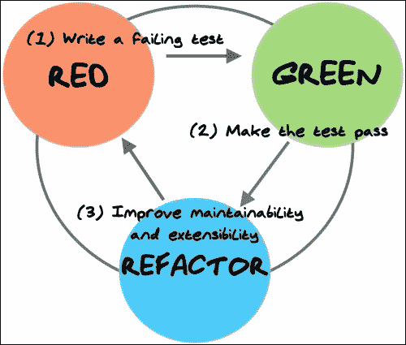

以下各节详细介绍了与 TDD、红色、绿色重构周期相关的各个操作。

## 编写测试用例

我们从编写测试用例开始我们的开发过程。这显然是一个简单的过程，会让一些机器在我们的头脑中运作。毕竟，如果我们没有对问题域及其细节有一个清晰的了解，就不可能编写一些代码，测试它或不测试它。通常这一步会让你直面你不理解的问题方面，想要建模写代码就需要把握这些。

## 运行所有测试

一旦测试完成下一步就是运行它，以及到目前为止我们已经编写的所有其他测试。这里，内置测试环境支持的集成开发环境的重要性可能比其他情况更明显，将开发时间缩短了一大部分。预计，首先，我们新编写的测试失败了，因为我们还没有编写任何代码。

为了能够完成我们的测试，我们编写额外的代码并做出设计决策。编写的额外代码是让我们的测试编译的最小可能。考虑一下，不编译就是失败。

当我们让测试编译并运行时，如果测试失败了，那么我们尝试编写使测试成功所需的最小代码量。在这一点上，这听起来可能有些尴尬，但是本章中的以下代码示例将帮助您理解这个过程。

或者，您可以不再次运行所有测试，而是先运行新添加的测试，这样可以节省一些时间，因为有时在模拟器上运行测试可能会相当慢。然后运行整个测试套件，以验证一切仍然正常工作。我们不想通过破坏代码中已经存在的任何特性来添加新特性。

## 重构代码

当测试成功时，我们重构添加的代码，使其保持整洁，干净，并保持可维护和可扩展应用所需的最低限度。

我们再次运行所有的测试，以验证我们的重构没有破坏任何东西，如果测试再次得到满足，不再需要重构，我们就完成了任务。

在重构之后运行测试是一个不可思议的安全网，它已经被这种方法所建立。如果我们在重构算法、提取变量、引入参数、更改签名或任何重构机制方面犯了错误，这个测试基础设施将检测到问题。此外，如果一些重构或优化不能对所有可能的情况都有效，我们可以对应用使用的所有情况进行验证，将它表示为测试案例。

## TDD 的优势

就我个人而言，目前为止我看到的主要优势是它可以快速地让你专注于你的编程目标，并且更难分心或急于求成，在你的软件中实现永远不会使用的选项(有时也称为镀金)。这种不需要的特性的实现是对您宝贵的开发时间的浪费，正如您可能已经知道的，明智地管理这些资源可能是成功到达项目结束与否的区别。

另一个好处是，你总是有一个安全网为你的变化。每次您更改一段代码时，您可以绝对确定系统的其他部分没有受到影响，只要有测试验证条件没有改变。

别忘了，TDD 不能无差别地应用于任何项目。我认为，以及任何其他技术；你应该用你的判断力和专业知识来识别哪些地方可以应用，哪些地方不可以。永远记住:*没有银子弹*。

## 了解需求

为了能够写关于任何主题的测试，我们应该首先理解被测试的主题，这意味着分解你试图实现的需求。

我们提到了一个优点，那就是你可以快速地专注于一个目标，而不是把需求作为一个大的、不可征服的整体。

将需求转化为测试并交叉引用它们可能是理解需求的最好方式，并且确保所有需求都有实现和验证。此外，当需求改变时(这在软件开发项目中非常常见)，我们可以改变验证这些需求的测试，然后改变实现，以确保一切都被正确理解并映射到代码。

# 创建一个样本项目——温度转换器

从目前为止的一些代码片段中，您可能已经猜到，我们的 TDD 示例将围绕一个极其简单的安卓示例项目展开。它没有试图展示所有花哨的安卓功能，而是专注于测试，并从测试中逐渐构建应用，应用之前学习的概念。

让我们假设我们已经收到了开发安卓温度转换器应用的需求列表。尽管过于简单，我们将按照您通常会遵循的步骤来开发这样一个应用。然而，在这种情况下，我们将在过程中引入测试驱动的开发技术。

## 需求列表

通常(实话实说)需求清单非常模糊，有大量细节没有完全覆盖。

举个例子，假设我们收到了这个列表:

*   该应用将温度从摄氏转换为华氏，反之亦然
*   用户界面显示两个字段来输入温度；一个代表摄氏，另一个代表华氏
*   当在一个字段中输入温度时，另一个字段会随着转换自动更新
*   如果有错误，应该向用户显示，可能使用相同的字段
*   用户界面中应该为屏幕键盘保留一些空间，以便在输入几个转换时简化应用操作
*   输入字段应该从空开始
*   输入的值是小数点后两位数的十进制值
*   数字右对齐
*   即使在应用暂停后，也应保留上次输入的值

## 用户界面概念设计

让我们假设我们从用户界面设计团队收到了这个概念性的用户界面设计(我现在为我缺乏想象力和技能向所有设计师道歉):

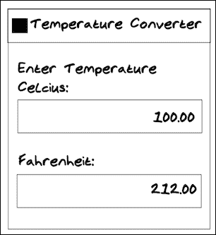

### 创建项目

我们的第一步是创建项目。现在，由于我们已经完成了五章，我不认为我需要给你一个逐步的指导。只需运行安卓工作室新项目向导，选择一个带有您的包名的安卓移动项目，加上其他样板，没有活动模板。安卓工作室会自动给你创建一个例子`AndroidApplicationTestCase`。请记住，如果你卡住了，你可以参考这本书的代码伴奏。创建时，它应该如下所示:

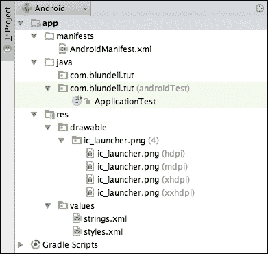

现在让我们快速创建一个名为`TemperatureConverterActivity`的新活动(我们没有使用模板生成器，因为它添加了大量现在不需要的代码)，不要忘记将活动添加到您的`AndroidManifest`文件中。狂热的 TDD 爱好者现在可能正在挥舞他们的拳头，因为实际上你应该只在你的测试需要的时候才进行这项活动，但我同时试图用一些熟悉度来引导你。

# 创建一个 Java 模块

在这个模板项目的上面，我们想要添加另一个模块的代码。这将是一个只支持 Java 的模块，如果你愿意的话，它将作为我们主要安卓模块的依赖项或库。

这里的想法是双重的。首先，它允许你分离只属于 Java 的代码，并且不依赖 Android，在一个大项目中这可以是你的核心领域；运行应用的业务逻辑，将它模块化很重要，这样你就可以在不考虑安卓的情况下处理它。

其次，如我们之前所说，拥有一个只包含 Java 的模块，可以让您在测试时回顾 Java 作为一种成熟编程语言的悠久历史。Java 模块的测试快速、简单且容易。您可以为 JVM 编写 JUnit 测试，并让它们在几毫秒内运行(我们将这样做！).

从安卓工作室，导航到**文件** | **新模块，**这给你提供了**创建新模块**对话框。在**更多模块**下，选择 **Java 库，**点击**下一步**。命名你的库`core`，确保包名和你的安卓应用一样，按**完成**。最后一屏应该是这样的:

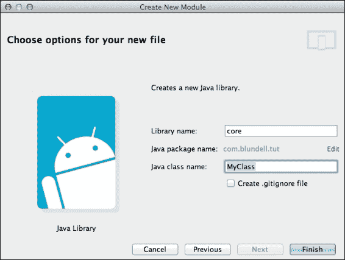

一旦创建，您需要将您的安卓`:app`模块的单向依赖关系添加到`:core`模块。内，`/app/build.gradle,`增加了对核心的依赖:

```java
dependencies {
    compile fileTree(dir: 'libs', include: ['*.jar'])
    compile 'com.android.support:appcompat-v7:21.0.2'

    compile project(':core')
}
```

这允许我们从安卓应用的核心模块中引用文件。

# 创建温度转换温度测试类

通过选择主测试包名称`com.blundell.tut.`继续创建第一个测试，这是在安卓工作室项目视图中的`src/androidTest/Java`下，或者在安卓工作室安卓视图中的`app/java/(androidTest)`下。然后右击这里，选择**新建** | **Java 类**，称之为，`TemperatureConverterActivityTests`。

一旦创建了这个类，我们就需要把它变成一个测试类。我们应该根据将要测试的内容和方式来选择超类。在[第 2 章](2.html#page "Chapter 2. Understanding Testing with the Android SDK")*了解安卓SDK*的测试中，我们回顾了可用的替代方案。当您试图决定使用什么超类时，请将其用作参考。

在这种特殊情况下，我们测试单个活动并使用系统基础设施，因此，我们应该使用`ActivityInstrumentationTestCase2`。还要注意的是`ActivityInstrumentationTestCase2`是一个泛型类，我们也需要模板参数。这是正在测试的活动，在我们的例子中是`TemperatureConverterActivity`。

我们现在注意到，我们的类有一些错误需要在运行之前修复。否则，错误将阻止测试运行。

我们需要解决的问题已经在[第 2 章](2.html#page "Chapter 2. Understanding Testing with the Android SDK")、*安卓SDK*的*无参数构造器*部分描述过了。按照这种模式，我们需要实现:

```java
  public TemperatureConverterActivityTests() {
    this("TemperatureConverterActivityTests");
  }

  public TemperatureConverterActivityTests(String name) {
    super(TemperatureConverterActivity.class);
    setName(name);
  }
```

到目前为止，我们已经执行了以下步骤:

*   我们添加了无参数构造函数`TemperatureConverterActivityTests()`。从这个构造函数中，我们调用以名称作为参数的构造函数。
*   最后，在这个给定名称的构造函数中，我们调用超级构造函数并设置名称。

要验证一切都已设置好并就位，您可以通过右键单击类并选择**运行** | **测试类的名称**来运行测试。目前还没有要运行的测试，但至少我们可以验证支持我们测试的基础设施已经到位。如果未通过**测试**发现警告。以下是如何运行测试类，以防您错过:

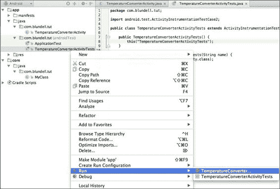

## 创建夹具

我们可以通过用测试中需要的元素填充`setup()`方法来开始创建我们的测试夹具。在这种情况下，几乎不可避免的是使用测试中的活动，所以让我们为这种情况做好准备，并将其添加到夹具中:

```java
@Override  
public void setUp() throws Exception {
    super.setUp();
    activity = getActivity();
}
```

介绍完前面的代码后，使用 AndroidStudio 的重构工具创建`activity`字段，以节省您的时间。( *F2* 为下一个错误， *Alt* + *进入*快速修复，*再次进入*创建字段，*再次进入*确认字段类型，完成！)

`ActivityInstrumentationTestCase2.getActivity()`法有副作用。如果测试中的活动没有运行，它将被启动。如果我们在测试中多次使用`getActivity()`作为简单的访问器，并且由于某种原因，活动在测试完成前结束或崩溃，这可能会改变测试的意图。我们将无意中重启活动，这就是为什么在我们的测试中，我们不鼓励使用`getActivity()`，而是将其放在夹具中，这样我们就隐式地重启了每个测试的活动。

## 创建用户界面

回到我们的测试驱动开发轨道，我们从需求的简洁列表中看到有两个条目分别代表摄氏度和华氏温度。让我们将它们添加到我们的测试设备中。

它们还不存在，我们甚至还没有开始设计用户界面布局，但是我们知道肯定会有两个这样的条目。

这是您应该添加到`setUp()`方法中的代码:

```java
celsiusInput = (EditText)
  activity.findViewById(R.id.converter_celsius_input);
fahrenheitInput = (EditText)
  activity.findViewById(R.id.converter_fahrenheit_input);
```

有一些重要的事情需要注意:

*   我们选择名称`converter_celsius_input`是因为，converter_ 是该字段的位置(在`TemperatorConverter`活动中)`celsius_`是该字段所代表的内容，最后输入的是这些字段的行为
*   我们使用`EditText`为我们的夹具定义字段
*   我们使用之前创建的活动按标识查找视图
*   我们将`R`类用于主项目，即使这些标识并不存在

## 测试用户界面组件的存在

一旦我们将它们添加到`setUp()`方法中，如前一节所示，我们就可以编写第一个测试并检查视图的存在性:

```java
  public final void testHasInputFields() {
    assertNotNull(celsiusInput);
    assertNotNull(fahrenheitInput);
  }
```

我们还不能运行测试，因为我们必须先修复一些编译问题。我们应该修复`R`类中缺失的 id。

创建了引用用户界面中我们还没有的元素和标识的测试夹具后，测试驱动开发范式要求我们添加所需的代码来满足我们的测试。我们应该做的第一件事是编译测试，所以如果我们有一些测试测试未实现的特性，它们将会失败。

## 获取定义的标识

我们的第一站将是在`R`类中定义用户界面元素的标识，因此引用未定义的常量`R.id.converter_celsius_input`和`R.id.converter_fahrenheit_input`产生的错误将消失。

你作为一个有经验的安卓开发者，会知道怎么做。反正我会给你复习的。在布局编辑器中创建`activity_temperature_converter.xml`布局，并添加所需的用户界面组件，以获得类似于之前在*用户界面概念设计*部分中介绍的设计，如以下代码所示:

```java
<?xml version="1.0" encoding="utf-8"?>
<LinearLayout xmlns:android="http://schemas.android.com/apk/res/android"
  android:layout_width="match_parent"
  android:layout_height="match_parent"
  android:orientation="vertical">

  <TextView
    android:layout_width="match_parent"
    android:layout_height="wrap_content"
    android:layout_marginBottom="@dimen/margin"
    android:text="@string/message" />

  <<TextView
    android:id="@+id/converter_celsius_label"
    android:layout_width="wrap_content"
    android:layout_height="wrap_content"
    android:layout_marginStart="@dimen/margin"
    android:text="@string/celsius" />

  <EditText
    android:id="@+id/converter_celsius_input"
    android:layout_width="wrap_content"
    android:layout_height="wrap_content"
    android:layout_margin="@dimen/margin"  />

  <TextView
    android:id="@+id/converter_fahrenheit_label"
    android:layout_width="wrap_content"
    android:layout_height="wrap_content"
    android:layout_marginStart="@dimen/margin"
    android:text="@string/fahrenheit"  />

  <EditText
    android:id="@+id/converter_fahrenheit_input"
    android:layout_width="wrap_content"
    android:layout_height="wrap_content"
    android:layout_margin="@dimen/margin"  />
</LinearLayout>
```

这样做，我们得到我们要编译的测试(别忘了添加字符串和维度)，运行测试，它们通过了吗？他们不应该！你需要连接你的新活动布局(我打赌你比我先到):

```java
public class TemperatureConverterActivity extends Activity {
    @Override
    protected void onCreate(Bundle savedInstanceState) {
        super.onCreate(savedInstanceState);
        setContentView(R.layout.activity_temperature_converter);
    }
}
```

再次运行测试，您应该会得到以下结果:

*   `testHasInputFields`测试成功
*   现在一切都是绿色的

测试的输出如下所示:

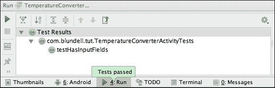

这显然意味着我们正在应用 TDD。

您可能还注意到，我们在用户界面中添加了一些我们没有测试的装饰性和非功能性项目(比如填充)，主要是为了让我们的示例尽可能简单。在实际场景中，您可能也想为这些元素添加测试。

## 将需求转化为测试

测试具有双重特征。它们验证了我们代码的正确性，但是，有时，更重要的是，在 TDD 中，它们帮助我们理解设计并消化我们正在实现的东西。为了能够创建测试，我们需要理解我们正在处理的问题，如果我们不理解，我们至少应该有一个问题的大致轮廓，以允许我们开始处理它。

很多时候，用户界面背后的需求没有表达清楚，但是你应该能够从线框化的 UI 设计中理解它们。如果我们假装是这样，那么我们可以通过先编写测试来掌握设计。

### 空旷的田野

从我们的一个要求中，我们得到:输入字段应该从空开始。

为了在测试中表达这一点，我们可以编写以下内容:

```java
    public void testFieldsShouldStartEmpty() {
        assertEquals("", celsiusInput.getText().toString());
        assertEquals("", fahrenheitInput.getText().toString());
    }
```

这里，我们简单地将字段的初始内容与空字符串进行比较。

这个测试直接通过了，太好了！虽然 TDD 的租户总是以红色测试开始，但是您可能想做一个快速的健全性检查，并为`EditText`向 XML 中添加一些文本并运行测试，当您移除添加的文本时，它再次变成红色和绿色时，您知道您的测试正在验证您期望的行为(并且它不是绿色的，因为的副作用是您没有期望的)。我们成功地将一个需求转换为一个测试，并通过获得测试结果来验证它。

### 查看属性

同样，我们可以验证构成布局的视图的其他属性。其中，我们可以验证:

*   字段(如预期出现在屏幕上)
*   字体大小
*   利润
*   屏幕对齐

让我们开始验证这些字段是否在屏幕上:

```java
    public void testFieldsOnScreen() {
        View origin = activity.getWindow().getDecorView();

        assertOnScreen(origin, celsiusInput);
        assertOnScreen(origin, fahrenheitInput);
    }
```

如前所述，我们从这里使用一个断言:`ViewAsserts` : `assertOnScreen`。

### 注

[第 2 章](2.html#page "Chapter 2. Understanding Testing with the Android SDK")、*用安卓SDK*理解测试中解释了静态导入以及如何充分利用它们。如果你以前没有做过，现在是时候了。

`assertOnScreen()`方法需要一个原点来开始寻找其他视图。在这种情况下，因为我们想从最顶层开始，所以我们使用`getDecorView()`，它检索包含标准窗框和装饰的顶层窗口视图，其中包含客户端的内容。

通过运行这个测试，我们可以确保输入字段在屏幕上，就像用户界面设计要求的那样。在某种程度上，我们已经知道，具有这些特定标识的视图是存在的。也就是说，我们通过将视图添加到主布局来编译夹具，但是我们根本不确定它们是否出现在屏幕上。因此，不需要其他任何东西，只需要这个测试的存在，以确保条件在未来不会改变。如果我们出于某种原因删除了其中一个字段，这个测试会告诉我们它丢失了，并且不符合用户界面设计。

按照我们的需求列表，我们应该测试视图是否如我们预期的那样在布局中对齐:

```java
    public void testAlignment() {
        assertLeftAligned(celsiusLabel, celsiusInput);
        assertLeftAligned(fahrenheitLabel, fahrenheitInput);
        assertLeftAligned(celsiusInput, fahrenheitInput);
        assertRightAligned(celsiusInput, fahrenheitInput);
    }
```

我们继续使用来自`ViewAssert`的断言——在本例中，是`assertLeftAligned`和 `assertRightAligned`。这些方法验证指定视图的对齐。为了运行这个测试，我们必须在`setUp()`方法中为标签文本视图添加两个查找:

```java
celsiusLabel = (TextView)
  activity.findViewById(R.id.converter_celsius_label);
fahrenheitLabel = (TextView)
  activity.findViewById(R.id.converter_fahrenheit_label);
```

默认情况下，我们使用的`LinearLayout`类按照我们期望的方式排列字段。同样，虽然我们不需要向布局中添加任何东西，但为了满足测试，这将作为一个保护条件。

一旦我们确认它们正确对齐，我们就应该确认它们覆盖了整个屏幕宽度，如示意图所示。在本例中，验证`LayoutParams`具有正确的值就足够了:

```java
    public void testCelciusInputFieldCoversEntireScreen() {
     LayoutParams lp;
     int expected = LayoutParams.MATCH_PARENT;
     lp = celsiusInput.getLayoutParams();  
     assertEquals("celsiusInput layout width is not MATCH_PARENT", expected, lp.width);
    }

    public void testFahrenheitInputFieldCoversEntireScreen() {
     LayoutParams lp;
     int expected = LayoutParams.MATCH_PARENT;
     lp = fahrenheitInput.getLayoutParams();
     assertEquals("fahrenheitInput layout width is not MATCH_PARENT", expected, lp.width);
    }
```

如果测试失败，我们使用自定义消息来轻松识别问题。

通过运行该测试，我们获得了以下消息，表明测试失败:**assertionfailedererror:celsiusInput 布局宽度不是 MATCH_PARENT 期望的:< -1 >而是:< -2 >** 。

这就引出了的布局定义。我们必须将摄氏和华氏的`layout_width`改为`match_parent`:

```java
<EditText
    android:id="@+id/converter_celsius_input"
    android:layout_width="match_parent"
    android:layout_height="wrap_content"
    android:layout_margin="@dimen/margin"
    android:gravity="end|center_vertical" /> 
```

飞轮海也是如此——改变完成后，我们重复这个循环，通过再次运行测试，我们可以验证它现在是成功的。

我们的方法开始出现了。我们创建测试来验证需求中描述的条件。如果不满足，我们就更改问题的原因，并再次运行测试，我们验证最新的更改解决了问题，也许更重要的是更改没有破坏现有的代码。

接下来，让我们验证字体大小是否符合我们的要求:

```java
    public void testFontSizes() {
        float pixelSize = 24f;
        assertEquals(pixelSize, celsiusLabel.getTextSize());
        assertEquals(pixelSize, fahrenheitLabel.getTextSize());
    }
```

在这种情况下，检索字段使用的字体大小就足够了。

默认的字体大小不是`24px`，所以我们需要把这个添加到我们的布局中。将相应的维度添加到资源文件中，然后在布局中需要的地方使用它，这是一个很好的做法。因此，让我们将`label_text_size`添加到`res/values/dimens.xml,`中，值为`24sp`。然后在标签的`Text` `size`属性中引用，`celsius_label`和`fahrenheit_label`。

现在，测试可能通过，也可能不通过，这取决于您使用的设备或仿真器的分辨率。这是因为我们在测试中断言了像素大小，但是我们已经在`dimens.xml,`中声明使用`sp`(与比例无关的像素)。让我们强化这个测试。为了解决这个问题，我们可以在测试类中将我们的`px`转换为`sp`，或者在测试中使用`sp`值。我选择了在测试中使用`sp`，尽管你可以为其中任何一个辩护:

```java
    public void testFontSizes() {
        float pixelSize = getFloatPixelSize(R.dimen.label_text_size);

        assertEquals(pixelSize, celsiusLabel.getTextSize());
        assertEquals(pixelSize, fahrenheitLabel.getTextSize());
    }

    private float getFloatPixelSize(int dimensionResourceId) {
        return getActivity().getResources()
                 .getDimensionPixelSize(dimensionResourceId);
    }
```

最后，让我们验证页边距是否按照用户界面设计中的描述进行解释:

```java
    public void testCelsiusInputMargins() {
        LinearLayout.LayoutParams lp =
(LinearLayout.LayoutParams) celsiusInput.getLayoutParams();

        assertEquals(getIntPixelSize(R.dimen.margin), lp.leftMargin);
        assertEquals(getIntPixelSize(R.dimen.margin), lp.rightMargin);
    }

    public void testFahrenheitInputMargins() {
        LinearLayout.LayoutParams lp =
(LinearLayout.LayoutParams) fahrenheitInput.getLayoutParams();

        assertEquals(getIntPixelSize(R.dimen.margin), lp.leftMargin);
        assertEquals(getIntPixelSize(R.dimen.margin), lp.rightMargin);
    }
```

这是一个和以前类似的情况(我跳过了测试原始像素值的步骤)。我们需要在我们的版面上增加页边空白。让我们将边距维度添加到资源文件中，然后在布局中需要的地方使用它。将`res/values/dimens.xml`中的`margin`尺寸设置为`8dp`值。然后，在两个字段的`layout_margin_start`属性、`celsius`和`fahrenheit`中引用它，也在标签的`start` `margin`中引用它。

从资源中获取整数像素大小的`helper`方法只是包装了已经讨论过的`float`方法:

```java
    private int getIntPixelSize(int dimensionResourceId) {
        return (int) getFloatPixelSize(dimensionResourceId);
    }
```

剩下的一件事是验证输入值的对齐(对齐)。我们将很快验证输入，只允许允许的值，但是现在让我们只关注理由。目的是使值小于整个字段，向右对齐并垂直居中:

```java
public void testCelsiusInputJustification() {
  int expectedGravity = Gravity.END | Gravity.CENTER_VERTICAL;
  int actual = celsiusInput.getGravity();
  String errorMessage = String.format(
"Expected 0x%02x but was 0x%02x", expectedGravity, actual);
  assertEquals(errorMessage, expectedGravity, actual);
}

public void testFahrenheitInputJustification() {
  int expectedGravity = Gravity.END | Gravity.CENTER_VERTICAL;
  int actual = fahrenheitInput.getGravity();
  String errorMessage = String.format(
"Expected 0x%02x but was 0x%02x", expectedGravity, actual);
  assertEquals(errorMessage, expectedGravity, actual);
}
```

这里，我们照常验证`gravity`值。然而，我们正在使用一个定制的信息来帮助我们识别可能是错误的价值观。由于`Gravity`类定义了几个常量，如果用十六进制表示，这些常量的值更容易识别，因此我们在消息中将这些值转换成这个基数。

如果这个测试因为默认的重力而失败，那么剩下的就是改变它。转到布局定义并更改这些`gravity`值，以便测试成功。

这正是我们需要补充的:

```java
android:gravity="end|center_vertical"
```

## 屏幕布局

我们现在要验证指定应该保留足够的屏幕空间来显示键盘的要求是否得到了实际满足。

我们可以这样写一个测试:

```java
   public void testVirtualKeyboardSpaceReserved() {
        int expected = getIntPixelSize(R.dimen.keyboard_space);
        int actual = fahrenheitInput.getBottom();
String errorMessage = 
  "Space not reserved, expected " + expected + " actual " + actual;
        assertTrue(errorMessage, actual <= expected);
    }
```

这验证了屏幕中最后一个字段`fahrenheitInput`的实际位置不低于建议值。

我们可以再次运行测试，验证一切都是绿色的。运行您的应用，您应该有一个由测试支持的完整用户界面，如下图所示:

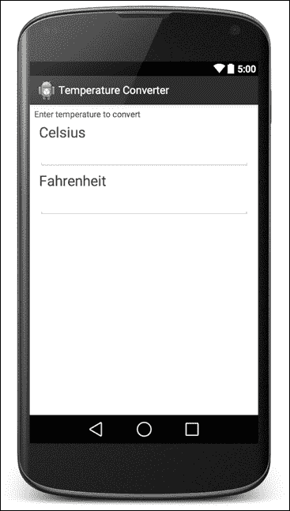

# 添加功能

用户界面到位。现在，我们可以开始添加一些基本功能。该功能将包括处理实际温度转换的代码。

## 温度转换

从需求列表中，我们可以得到这样的说法:当一个字段输入一个温度时，另一个会随着转换自动更新。

按照我们的计划，我们必须将此作为测试来实现，以验证是否有正确的功能。我们的测试如下所示:

```java
@UiThreadTest
public void testFahrenheitToCelsiusConversion() {
  celsiusInput.clear();
  fahrenheitInput.clear();
  fahrenheitInput.requestFocus();
  fahrenheitInput.setText("32.5");
  celsiusInput.requestFocus();
  double f = 32.5;
  double expectedC = TemperatureConverter.fahrenheitToCelsius(f);
  double actualC = celsiusInput.getNumber();
  double delta = Math.abs(expectedC - actualC);
  String msg = "" + f + "F -> " + expectedC + "C but was " 
    + actualC + "C (delta " + delta + ")";
  assertTrue(msg, delta < 0.005);
}
```

让我们一步步来看看:

1.  首先，正如我们已经知道的，为了与改变其值的用户界面交互，我们应该在用户界面线程上运行测试，因此因为我们使用`EditText.setText`，测试被注释为`@UiThreadTest`。
2.  其次，我们用一个专门的类来代替`EditText`，提供一些方便的方法，比如`clear()`、`setNumber()`。这将改进我们的应用设计。
3.  接下来，我们调用一个名为`TemperatureConverter`的转换器，这是一个实用程序类，提供了在不同温度单位之间转换的不同方法，并使用不同类型的温度值。
4.  最后，由于我们将截断结果，以用户界面中呈现的适当格式提供它们，我们应该与增量进行比较，以断言转换的值。

创建这样的测试将迫使我们遵循计划的路径。我们的第一个目标是添加所需的方法和代码来编译测试，然后满足测试的需求。

## 编辑编号类

在我们的主包中，而不是在测试包中(它不是`/androidTest/`下的那个包)，我们应该创建扩展`EditText,`的`EditNumber`类，因为我们需要扩展它的功能。创建类后，我们需要更改测试类成员类型中的字段类型:

```java
public class TemperatureConverterActivityTests extends ActivityInstrumentationTestCase2<TemperatureConverterActivity> {

  private TemperatureConverterActivity activity;  
  private EditNumber celsiusInput;
  private EditNumber fahrenheitInput;
  private TextView celsiusLabel;
  private TextView fahrenheitLabel;
```

然后，更改测试中出现的任何强制转换。您的 IDE 将突出显示这些内容；按 *F2* 在班级中找到他们。

在能够编译测试之前，我们还需要解决两个问题:

*   我们在`EditNumber`还是没有`clear()`和`setNumber()`的方法
*   我们没有实用程序类

从我们的测试类内部，我们可以使用 ide 来帮助我们创建方法。再次按下 *F2* ，您应该会看到**无法解决方法清除()**的错误。现在按下 *Alt* + *进入*在类型`EditNumber`中创建`clear()`方法。`getNumber()`也一样。

最后，我们必须创建`TemperatureConverter`类。这个类将保存摄氏和华氏的数学转换，没有安卓代码。因此，我们可以在`/core/`模块内部创建这个包。如前所述，它将在相同的包结构下，只有这个模块不知道安卓，因此，我们可以编写运行速度更快的 JVM 测试。

### 类型

请确保在与您的主代码相同的包下的核心模块中创建它，而不是在测试包中。

下面是如何在核心模块中创建这个类，以及我们应用的当前状态:

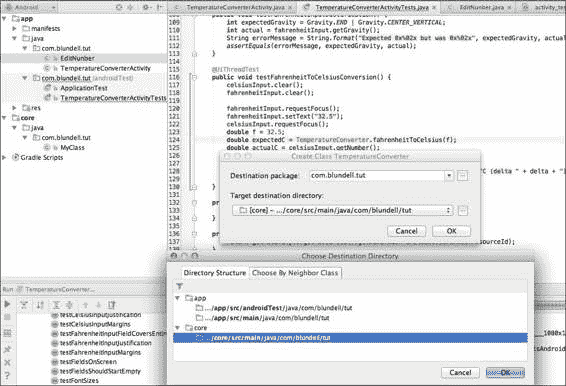

完成后，在我们的测试中，它创建了`fahrenheitToCelsius`方法。

这解决了我们最后一个问题，并引导我们进行一个现在可以编译和运行的测试。是的，您会有红色的 Lint 错误，但这些不是“编译”错误，因此测试仍然可以运行。(AndroidStudio 的聪明程度太高了。)

令人惊讶的是，或者不是，当我们运行测试时，它们将会失败，只有一个例外:

```java
java.lang.ClassCastException:
android.widget.EditText cannot be cast to com.blundell.tut.EditNumber
at com.blundell.tut.TemperatureConverterActivityTests.setUp(
TemperatureConverterActivityTests.java:36)
at android.test.AndroidTestRunner.runTest(
AndroidTestRunner.java:191)

```

这是因为我们更新了所有的 Java 文件，以包含我们新创建的`EditNumber`类，但是忘记了更改布局 XML。

让我们继续更新我们的用户界面定义:

```java
<com.blundell.tut.EditNumber
    android:id="@+id/converter_celsius_input"
    android:layout_width="match_parent"
    android:layout_height="wrap_content"
    android:layout_margin="@dimen/margin"
    android:gravity="end|center_vertical" />
```

也就是说，我们将原来的`EditText`类替换为`com.blundell.tut.EditNumber,`，这是对原来的`EditText`类的扩展。

现在，我们再次运行测试，发现所有测试都通过了。

但是等一下；我们没有在新的`EditNumber`类中实现任何转换或任何值的处理，所有测试都毫无问题地通过了。是的，他们通过了，因为我们的系统中没有足够的限制，那些已经到位的限制，简单地取消他们自己。

在进一步之前，让我们分析一下刚刚发生的事情。我们的测试调用了`fahrenheitInput.setText ("32.5")`方法来设置在**华氏**字段中输入的温度，但是我们的`EditNumber`类在输入文本时没有做任何事情，并且功能没有实现。因此，**摄氏度**字段仍然为空。

`expectedC`的值——以摄氏度为单位的预期温度，是调用`TemperatureConverter.fahrenheitToCelsius(f)`计算的，但这是一个空方法。在这种情况下，因为我们知道方法的返回类型，所以我们使它返回一个常量`0`。于是，`expectedC`就变成了`0`。

然后，从用户界面获得转换的实际值。在这种情况下，从`EditNumber`调用`getNumber()`。但是这个方法是自动生成的，为了满足其签名所施加的限制，它必须返回一个值，即`0`。

δ值再次为`0`，由`Math.abs(expectedC` `–` `actualC)`计算。

最后我们断言`assertTrue(msg,` `delta` `<` `0.005)`是`true,`因为`delta=0`满足条件，测试通过。

那么，我们的方法是否有缺陷，因为它无法检测到这样一个简单的情况？

不，一点也不，这里的问题是我们没有足够的限制，它们由自动生成的方法使用的默认值来满足。一种替代方法是向所有自动生成的方法抛出异常，类似于`RuntimeException("not` `yet` `implemented")`这样的东西，以检测其在未实现时的使用。我们将在我们的系统中添加足够多的限制，以轻松捕获这种*双零*情况。

## 温度转换器单元测试

从我们之前的经验来看，似乎实现的默认转换总是返回`0`，所以我们需要一些更健壮的东西。否则，当参数取值为 32F (32F == 0C)时，我们的转换器将只返回有效的结果。

`TemperatureConverter`类是一个与安卓基础设施无关的实用程序类，所以一个标准的单元测试就足以测试它。

由于这是我们将要编写的第一个核心测试，我们需要做一些设置。首先，从项目角度；在您的项目结构中，通过选择**新建** | **目录**并使用名称`test`，在`/core/src`下创建一个`test`文件夹。在其中，通过选择**新建** | **目录、**并使用名称`java`来创建`java`文件夹。随着 Gradle 变得神奇，它现在将明白这是您想要添加测试的地方，并且文件夹应该变成绿色(绿色意味着文件夹是测试类路径的一部分)。现在添加一个新的包，技术上来说不是新的，因为我们要再次使用`com.blundell.tut`，通过选择**新的** | **包** |并使用名称`com/blundell/tut`。

现在。我们在新的文件夹和包中创建测试。我们通过选择**新的** | **Java 类**，并将其称为`TemperatureConverterTests`来创建我们的测试。您的项目现在应该如下所示:

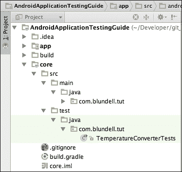

让我们进行第一个测试，在`TemperatureConverterTests,`里面按 *Ctrl* + *进入*调出**生成**菜单，如下图截图所示:

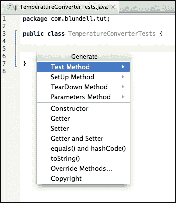

选择**测试方法**测试，那么 **JUnit4** 会为我们生成一个我们想要的测试模板方法，命名为`testFahrenheitToCelsius()`。请记住这个快捷方式，因为每当创建新测试时，它都很方便。一旦您生成了这个测试，您会注意到我们在 JUnit 4 导入的代码行上有编译错误。哎呀！我们忘记将 JUnit 库添加到核心模块的测试类路径中。在`/core/build.gradle,`中打开构建文件，添加 JUnit 依赖项。你的核心`build.gradle`现在会是这样的:

```java
apply plugin: 'java''java'

dependencies {
    compile fileTree(dir: 'libs''libs', include: [''''*.jar'])

    testCompile 'junit'junit:junit:4.+''''
}
```

### 注

注意，这里我们已经从 JUnit3 跳到了 JUnit4，主要区别是我们现在可以使用注释来告诉我们的测试运行人员，类中的哪些方法是测试。因此，从技术上来说，我们不再需要像在`testFooBar()`中那样以`test`开始方法，但是当我们在这两者之间切换时，我们会为了自己的理智而这样做(Android JUnit4 支持即将到来！).

选择**项目同步、**进行项目同步，我们正在编译并准备编码。让我们开始写测试:

```java
@Test
public void testFahrenheitToCelsius() {
    for (double knownCelsius : conversionTable.keySet()) {
        double knownFahrenheit = conversionTable.get(knownCelsius);

        double resultCelsius =
TemperatureConverter.fahrenheitToCelsius(knownFahrenheit);

        double delta = Math.abs(resultCelsius - knownCelsius);
        String msg = knownFahrenheit + "F -> " + knownCelsius + "C"+ "but is " + resultCelsius;
        assertTrue(msg, delta < 0.0001);
     }
}
```

我们从其他来源了解到，创建一个包含不同温度转换值的转换表是推动该测试的好方法:

```java
Map<Double, Double> conversionTable = new HashMap<Double, Double>() {
  // initialize (celsius, fahrenheit) pairs
  put(0.0, 32.0);
  put(100.0, 212.0);
  put(-1.0, 30.20);
  put(-100.0, -148.0);
  put(32.0, 89.60);
  put(-40.0, -40.0);
  put(-273.0, -459.40);
}};
```

要在核心模块中运行测试，我们可以在项目视图中右击文件，选择**运行**。截图也显示了，可以使用快捷键*Cmd*+*Shift*+*F10*:


当这个测试运行时，我们验证它失败，给我们这个跟踪:

```java
java.lang.AssertionError: -40.0F -> -40.0C but is 0.0
 at org.junit.Assert.fail(Assert.java:88)
 at org.junit.Assert.assertTrue(Assert.java:41)
 at com.blundell.tut.TemperatureConverterTests.testFahrenheitToCelsius(TemperatureConverterTests.java:31).

```

### 注

看看那些核心测试跑得多快！目标是将尽可能多的应用逻辑转移到核心模块中，这样在进行测试驱动开发时就可以利用这种速度。

嗯，这是我们所期待的，因为我们的转换总是返回`0`。实现我们的转换，我们发现我们需要一些`ABSOLUTE_ZERO_F`常数:

```java
    private static final double ABSOLUTE_ZERO_F = -459.67d;

    private static final String ERROR_MESSAGE_BELOW_ZERO_FMT =       "Invalid temperature: %.2f%c below absolute zero";

    private TemperatureConverter() {
        // non-instantiable helper class
    }

    public static double fahrenheitToCelsius(double fahrenheit) {
        if (fahrenheit < ABSOLUTE_ZERO_F) {
            String msg = String.format(ERROR_MESSAGE_BELOW_ZERO_FMT,               fahrenheit, 'F''F');
            throw new InvalidTemperatureException(msg);
        }
        return ((fahrenheit - 32) / 1.8d);
    }
```

绝对零度，是熵达到最小值的理论温度。为了能够达到这个绝对零度的状态，根据热力学定律，系统应该与宇宙的其他部分隔离开来。因此，它是一种不可到达的状态。然而，根据国际协议，绝对零度在开尔文标度上定义为 0K，在摄氏标度上定义为-273.15°C，在华氏标度上定义为-459.67°F。

我们正在创建一个自定义异常，`InvalidTemperatureException`，以指示向转换方法提供有效温度的失败。这个例外对安卓一无所知，所以也可以坐在我们的核心模块。通过扩展`RuntimeException`来创建:

```java
public class InvalidTemperatureException extends RuntimeException {

  public InvalidTemperatureException(String msg) {
    super(msg);
  }

}
```

再次运行核心测试，我们发现`testFahrenheitToCelsius`成功。因此，我们回到我们的安卓测试，运行这些测试显示`testFahrenheitToCelsiusConversion`测试失败。这告诉我们，现在转换器类正确地处理了转换，但是处理这个转换的用户界面仍然存在一些问题。

### 注

不要对运行两个独立的测试类感到绝望。对你来说，选择运行什么测试是很常见的；这部分是做 TDD 时学到的技能。但是，如果您愿意，您可以编写定制的测试运行程序来运行您的所有测试。此外，使用 Gradle 运行`build connectedAndroidTest`将一次运行您所有的测试，每当您认为您已经完成了一个特性，或者想要提交到您的上游版本控制时，都建议这样做。

仔细查看`testFahrenheitToCelsiusConversion`故障痕迹，会发现有些东西在不应该返回`0,`的时候还在返回。

这提醒我们仍然缺少一个合适的`EditNumber`实现。在继续实现上述方法之前，让我们创建相应的测试来验证我们正在实现的是正确的。

## 编辑号测试

从上一章中，我们现在可以确定定制视图测试的最佳基类是`AndroidTestCase`，因为我们需要一个模拟`Context`类来创建定制视图，但是我们不需要系统基础设施。

为`EditNumber`创建测试，我们称之为`EditNumberTests,`并扩展`AndroidTestCase`。提醒，这在`androidTest`路径的 app 模块下。

我们需要添加构造函数来反映我们之前用给定名称模式识别的模式:

```java
public EditNumberTests() {
 this("EditNumberTests");
 }

 public EditNumberTests(String name) {
 setName(name);
    }
```

下一步是创建夹具。在这种情况下，这是我们将要测试的一个简单的`EditNumber`类:

```java
    @Override
    protected void setUp() throws Exception {
        super.setUp();

        editNumber = new EditNumber(mContext);
        editNumber.setFocusable(true);
    }
```

模拟上下文从受保护字段`mContext`([http://developer . Android . com/reference/Android/test/AnDroidTestCase . html # McContext](http://developer.android.com/reference/android/test/AndroidTestCase.html#mContext))中获取，可在`AndroidTestCase`类中获得。

在`setUp`方法的最后，我们将`editNumber`设置为可聚焦视图，这意味着它将能够获得聚焦，因为它将参与一系列模拟用户界面的测试，这些测试可能需要明确请求它的聚焦。

接下来，我们测试所需的`clear()`功能是否在`testClear()`方法中正确实现:

```java
@UiThreadTest
public void testClear() {
String value = "123.45";
          editNumber.setText(value);

          editNumber.clear();

          assertEquals("", editNumber.getText().toString());
} 
```

运行测试时，我们验证它失败了:

```java
junit.framework.ComparisonFailure: expected:<[]> but was:<[123.45]>
at com.blundell.tut.EditNumberTests.testClear(EditNumberTests.java:31)
at java.lang.reflect.Method.invokeNative(Native Method)
at android.test.AndroidTestRunner.runTest(AndroidTestRunner.java:191)

```

我们需要正确实施`EditNumber.clear()`。

这是一个简单的情况，所以仅仅通过将这个实现添加到`EditNumber,`中，我们就满足了测试:

```java
  public void clear() {
    setText("");
  }
```

运行测试并继续。我们要给`EditNumber.`添加一个新的方法，这里已经有`getNumber(), and`了，我们正在添加`setNumber()`，以便以后使用。现在让我们完成`testSetNumber()`的实现:

```java
           public void testSetNumber() {

        editNumber.setNumber(123.45);

        assertEquals("123.45", editNumber.getText().toString());
    }
```

除非我们实现`EditNumber.setNumber()`，否则它将失败，类似于这个实现:

```java
    private static final String DEFAULT_FORMAT = "%."%.2f";";

    public void setNumber(double number) {
        super.setText(String.format(DEFAULT_FORMAT, number));
    }
```

我们使用一个常量`DEFAULT_FORMAT`来保存转换数字所需的格式。这个可以在以后转换成一个属性，该属性也可以在字段的 XML 布局定义中指定。

`testGetNumber()`和`getNumber()`对也是如此:

```java
      public void testGetNumber() {

        editNumber.setNumber(123.45);

        assertEquals(123.45, editNumber.getNumber());
    }
```

`getNumber()`方法如下:

```java
    public double getNumber() {
        String number = getText().toString();
        if (TextUtils.isEmpty(number)) {
            return 0D;
        }
        return Double.valueOf(number);
    }
```

这些测试成功了，所以运行你的其他测试，看看我们在做什么；我是在运行`gradlew build cAT`命令的命令行上完成的。这运行了我们到目前为止编写的所有测试；但是`testFahrenheitToCelsiusConversion()`正在失败。我们有很多经过良好测试的代码，退一步，反思一下。

以下是我们的安卓测试结果:

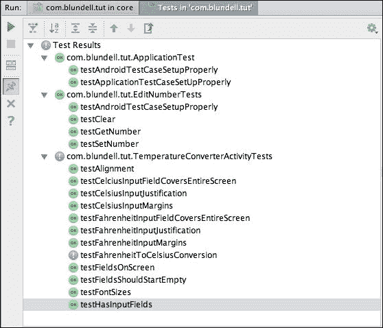

以下是我们的核心 Java 测试结果:

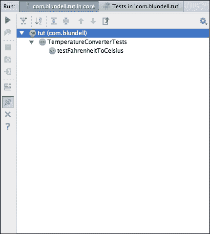

有了`testFahrenheitToCelsiusConversion()`如果你仔细分析测试用例，你能发现问题在哪里吗。

明白了吗？

我们的测试方法是期望当焦点改变时转换自动发生，正如我们的需求列表中所指定的:“当一个字段中输入一个温度时，另一个会随着转换自动更新”。

请记住，我们没有按钮或其他任何东西来转换温度值，因此一旦输入值，转换将自动完成。

这将我们带回到我们的`TemperatureConverterActivity`类，以及它处理转换的方式。

## 温度机制监视器类

实现不断更新另一个温度值所需行为的一种方式是，一旦原始温度发生变化，则通过一个`TextWatcher`。从文档中，我们可以理解`TextWatcher`是一个附着在`Editable`上的类型的对象；其方法将被调用，当文本发生变化时([http://developer . Android . com/reference/Android/text/text watcher . html](http://developer.android.com/reference/android/text/TextWatcher.html))。

这似乎是我们所需要的。

我们将这个类实现为`TemperatureConverterActivity`的内部类。这背后的想法是，因为我们直接对活动的视图采取行动，将它作为一个内部类来显示这种关系，并保持这种关系明显，如果有人想改变这个活动的布局。如果您实现了最低的`TextWatcher,`，您的活动将如下所示:

```java
public class TemperatureConverterActivity extends Activity {

    @Override
    protected void onCreate(Bundle savedInstanceState) {
        super.onCreate(savedInstanceState);
        setContentView(R.layout.activity_temperature_converter);
    }

    /**
     * Changes fields values when the text changes; applying the correlated conversion method.
     */
    static class TemperatureChangedWatcher implements TextWatcher {

        @Override
        public void beforeTextChanged(CharSequence s, int start, int count, int after) {

        }

        @Override
        public void onTextChanged(CharSequence s, int start, int before, int count) {

        }

        @Override
        public void afterTextChanged(Editable s) {
        }
    }
}
```

现在这是我们的代码，在最近创建的类的一些增加之后:

```java
/**
 * Changes fields values when the text changes;
 * applying the correlated conversion method.
 */
static class TemperatureChangedWatcher implements TextWatcher {

private final EditNumber sourceEditNumber;
private final EditNumber destinationEditNumber;
private final Option option;

private TemperatureChangedWatcher(Option option,
EditNumber source,
EditNumber destination) {
this.option = option;
   this.sourceEditNumber = source;
   this.destinationEditNumber = destination;
}

static TemperatureChangedWatcher newCelciusToFehrenheitWatcher(EditNumber source, EditNumber destination) {
return new TemperatureChangedWatcher(Option.C2F, source, destination);
}

static TemperatureChangedWatcher newFehrenheitToCelciusWatcher(EditNumber source, EditNumber destination) {
return new TemperatureChangedWatcher(Option.F2C, source, destination);
}

@Override
public void onTextChanged(CharSequence input, int start, int before, int count) {
if (!destinationEditNumber.hasWindowFocus()
|| destinationEditNumber.hasFocus()
|| input == null) {
       return;
}

   String str = input.toString();
   if ("".equals(str)) {
       destinationEditNumber.setText("");
          return;
}

   try {
      double temp = Double.parseDouble(str);
      double result = (option == Option.C2F)
? TemperatureConverter.celsiusToFahrenheit(temp)
: TemperatureConverter.fahrenheitToCelsius(temp);
    String resultString = String.format("%.2f", result);
    destinationEditNumber.setNumber(result);
    destinationEditNumber.setSelection(resultString.length());
   } catch (NumberFormatException ignore) {
      // WARNING this is generated whilst 
 // numbers are being entered,
 // for example just a '-' 
 // so we don''t want to show the error just yet
   } catch (Exception e) {
     sourceEditNumber.setError("ERROR: " + e.getLocalizedMessage());
   }
}

@Override
public void afterTextChanged(Editable editable) {
// not used
}

@Override
public void beforeTextChanged(CharSequence s, int start, int count, int after) {
// not used
}
}
```

我们将对两个字段使用相同的`TemperatureChangeWatcher`实现，摄氏和华氏；因此，我们保留对用作源和目的地的字段的引用，以及更新其值所需的操作。为了说明这个操作，我们引入了`enum,`，它是纯 Java，因此可以进入核心模块:

```java
/**
 * C2F: celsiusToFahrenheit
 * F2C: fahrenheitToCelsius
 */
public enum Option {
    C2F, F2C
}
```

该操作在创建工厂方法中指定，并相应地选择目标和源`EditNumber`。这样，我们可以对不同的转换使用同一个观察器。

我们感兴趣的`TextWatcher`界面的方法是`onTextChanged`。这将在文本发生变化时调用。开始时，我们避免潜在的循环，检查谁拥有焦点，如果条件不满足，则返回。

如果源为空，我们还将目标字段设置为空字符串。

最后，我们尝试设置调用相应的转换方法来设置目标字段的结果值。当使用部分输入的数字调用转换时，我们根据需要标记错误，避免显示过早的错误。

我们需要在`TemperatureConverterActivity.onCreate()`中的输入字段上设置监听器:

```java
@Override
protected void onCreate(Bundle savedInstanceState) {
  super.onCreate(savedInstanceState);
  setContentView(R.layout.activity_temperature_converter);
  EditNumber celsiusEditNumber =
  (EditNumber) findViewById(R.id.converter_celsius_input); 
  EditNumber fahrenheitEditNumber =
  (EditNumber) findViewById(R.id.converter_fahrenheit_input);
  celsiusEditNumber
  .addTextChangedListener(
newCelciusToFehrenheitWatcher(celsiusEditNumber, fahrenheitEditNumber));

fahrenheitEditNumber
 .addTextChangedListener(
 newFehrenheitToCelciusWatcher(fahrenheitEditNumber, 
 celsiusEditNumber));
}
```

为了能够运行测试，我们应该编译它们。要编译，我们至少需要定义`celsiusToFahrenheit()`方法，目前还没有定义。

## 更多温度转换器测试

我们需要实施`celsiusToFahrenheit,`和往常一样，我们从测试开始。

这相当于另一种转换方法`fahrenheitToCelsius,`，我们可以在创建这个测试时使用我们设计的基础设施:

```java
@Test
    public void testCelsiusToFahrenheit() {
        for (double knownCelsius : conversionTable.keySet()) {
            double knownFahrenheit = conversionTable.get(knownCelsius);

            double resultFahrenheit = 
TemperatureConverter.celsiusToFahrenheit(knownCelsius);

            double delta = Math.abs(resultFahrenheit - knownFahrenheit);
            String msg = knownCelsius + "C -> " + knownFahrenheit + "F"
+ " but is " + resultFahrenheit;
            assertTrue(msg, delta < 0.0001);
        }
    }
```

我们使用转换表通过不同的转换来练习该方法，并且我们验证误差小于预定义的增量。

那么`TemperatureConverter`类中对应的转换实现如下:

```java
    static final double ABSOLUTE_ZERO_C = -273.15d;

    public static double celsiusToFahrenheit(double celsius) {
        if (celsius < ABSOLUTE_ZERO_C) {
            String msg = String.format(
ERROR_MESSAGE_BELOW_ZERO_FMT, celsius, 'C');
            throw new InvalidTemperatureException(msg);
        }
        return (celsius * 1.8d + 32);
    }
```

现在，所有的测试都通过了，但我们仍然没有测试所有的常见条件。我的意思是，到目前为止，我们一直在检查幸福的道路。除了我们到目前为止创建的所有正常情况之外，您应该检查错误和异常是否正确生成。

当在转换中使用低于绝对零度的温度时，创建此测试以检查异常的正确生成:

```java
    @Test(expected = InvalidTemperatureException.class)
    public void testExceptionForLessThanAbsoluteZeroF() {
        TemperatureConverter.fahrenheitToCelsius(ABSOLUTE_ZERO_F - 1);
    }
```

在这个测试中，我们降低绝对零温度，以获得更小的值，然后尝试转换。我们在核心模块中编写了这个测试，因此使用了 JUnit4，它允许我们使用注释来断言我们期望抛出异常。如果您想在 JUnit3 中做同样的事情，您必须使用 try catch 块，如果代码没有进入 catch 块，测试就会失败:

```java
    @Test(expected = InvalidTemperatureException.class)
    public void testExceptionForLessThanAbsoluteZeroC() {
        TemperatureConverter.celsiusToFahrenheit(ABSOLUTE_ZERO_C - 1);
    }
```

以类似的方式，当尝试的转换涉及低于绝对零度的摄氏温度时，我们测试抛出的异常。

## 输入过滤器测试

另一个错误要求可能是:我们想要过滤转换实用程序接收的输入，因此没有垃圾到达这个点。

`EditNumber`类已经过滤了有效的输入，否则会产生异常。我们可以通过在`TemperatureConverterActivityTests`中创建一个新的测试来验证这个条件。我们选择这个类是因为我们向输入字段发送密钥，就像一个真正的用户会做的那样:

```java
public void testInputFilter() throws Throwable {
        runTestOnUiThread(new Runnable() {
            @Override
            public void run() {
                celsiusInput.requestFocus();
            }
        });
        getInstrumentation().waitForIdleSync();

        sendKeys("MINUS 1 PERIOD 2 PERIOD 3 PERIOD 4");
        double number = celsiusInput.getNumber();

        String msg = "-1.2.3.4 should be filtered to -1.234 " 
          + "but is " + number;
        assertEquals(msg, -1.234d, number);
    }
```

该测试要求使用之前回顾的模式将焦点聚焦到摄氏场。这允许我们在 UI 线程中运行部分测试，并向视图发送关键输入。发送的密钥是一个包含多个句点的无效序列，格式良好的十进制数字不接受该序列。预计当过滤器就位时，该序列将被过滤，并且只有有效字符到达该字段。断言`celsiusInput.getNumber(),`返回的值是我们过滤后期望的值。

为了实现这个过滤器，我们需要将`InputFilter`添加到`EditNumber`中。因为这应该被添加到所有的构造函数中，我们创建了一个额外的`init()`方法，我们从每个构造函数中调用它。为了实现我们的目标，我们使用`DigitsKeyListener,`接受数字、符号和小数点的实例，如下所示:

```java
   public EditNumber(Context context) {
        super(context);
        init();
   }
   public EditNumber(Context context, AttributeSet attrs) {
        super(context, attrs);
        init();
   }

   public EditNumber(Context context, AttributeSet attrs, int defStyle) {
        super(context, attrs, defStyle);
        init();
   }

   private void init() {
    // DigistKeyListener.getInstance(true, true)
    // returns an instance that accepts digits, sign and decimal point
    InputFilter[] filters =
      new InputFilter[]{DigitsKeyListener.getInstance(true, true)};
       setFilters(filters);
   }
```

这个`init`方法是从每个构造函数中调用的，所以如果这个视图是通过编程或者从 XML 中使用的，我们仍然有我们的过滤器。

再次运行测试，可以验证全部通过，现在一切又变绿了。

# 查看我们的最终申请

干得好！我们现在有了满足所有要求的最终应用。

在下面的截图中，我们显示了其中一个要求，即检测到有人试图将温度转换为低于绝对零度的温度，单位为摄氏度(-1000.00℃):

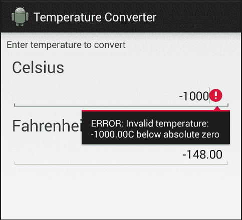

用户界面尊重所提供的指导方针；可以通过在相应的单位字段中输入温度来转换温度。

概括地说，这是我们已经实现的需求列表:

*   该应用将温度从摄氏转换为华氏，反之亦然
*   用户界面显示两个字段来输入温度，一个是摄氏度，另一个是华氏度
*   当在一个字段中输入一个温度时，另一个温度会随着转换自动更新
*   如果有错误，应该向用户显示，可能使用相同的字段
*   用户界面中应该为屏幕键盘保留一些空间，以便在输入几个转换时简化应用操作
*   输入字段应该从空开始
*   输入的值是小数点后两位的小数值
*   数字右对齐

更重要的是，我们现在可以确定应用不仅满足需求，而且没有明显的问题或错误。我们采取的每一步都是通过分析测试结果，并在问题首次出现时解决它们。这将确保任何单独的 bug，一旦被发现、测试和修复，就不会再次出现。

# 总结

我们介绍了测试驱动开发，介绍了它的概念，并在一个潜在的现实问题中逐步应用它们。

我们从一个简明的需求列表开始，描述了温度转换器的应用。

我们实现了每个测试，然后是满足它的代码。以这种方式，我们实现了应用行为及其表示，进行测试以验证我们设计的用户界面符合规范。

测试到位后，引导我们分析运行测试的不同可能性。从上一章开发而来，现在我们的持续集成机器可以运行测试，以保证团队的任何更改仍然会产生一个测试良好的应用。

下一章将介绍行为驱动开发，并继续我们的目标，即无 bug 且经过良好测试的代码，这次将重点放在行为和一致性上，以及需求在整个团队中的意义。