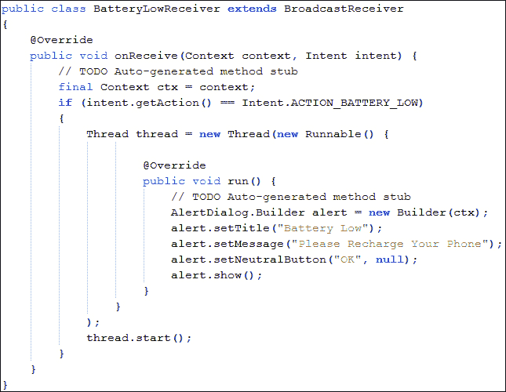
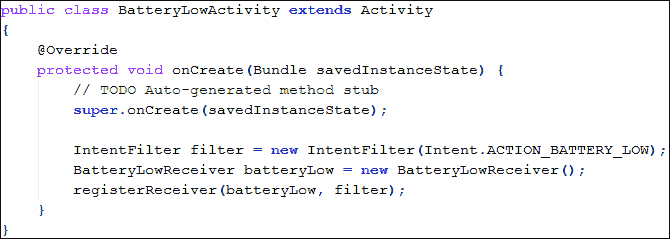
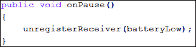
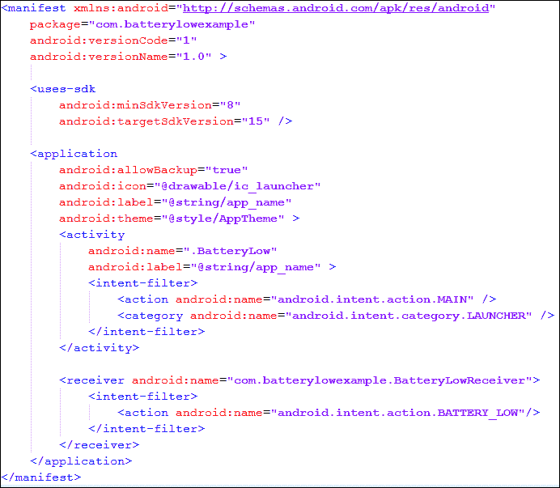
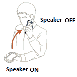
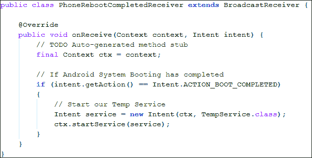
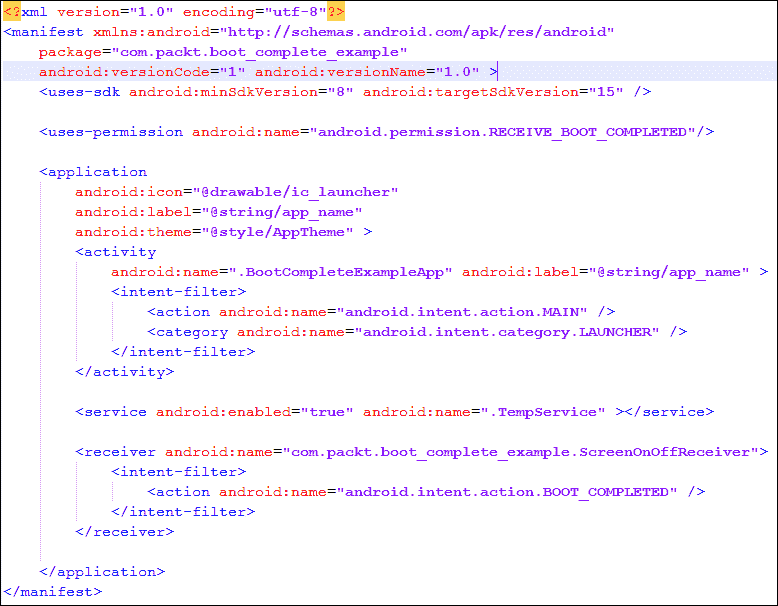
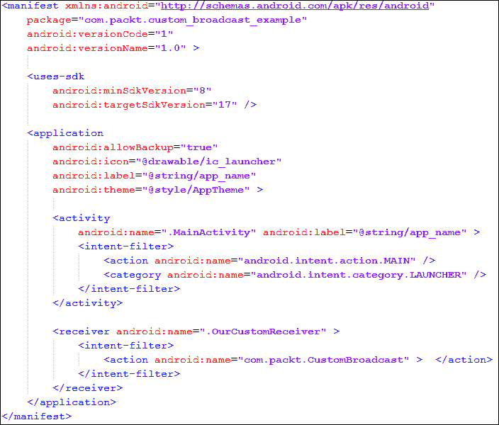
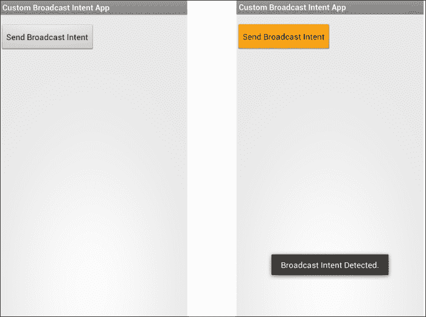

# 八、广播意图

在前一章中，我们了解了意图过滤器，以及这些过滤器如何向安卓操作系统提供不同活动、服务等信息。我们还讨论了意图过滤器如何工作，以及它们如何将即将到来的意图对象与属性相匹配。本章还提供了有关操作、数据和类别测试的信息。

意图是安卓操作系统不同组件之间发送消息的异步方式。到目前为止，我们只学会了发送和接收那些消息，也就是从一个组件到另一个组件的意图。但是在我们讨论的每个例子中，我们都有关于意图接收者的信息，例如哪个活动或服务将接收意图并将使用嵌入在意图中的数据。

在这一章，我们将扩展我们的知识发送意图到多个广播接收器。我们将了解安卓操作系统如何广播意图，以及如何接收这些广播意图。

本章包括以下主题:

*   安卓操作系统中的广播
*   安卓操作系统中的广播意图
*   安卓操作系统中的系统广播
*   使用安卓操作系统的不同系统广播
*   检测电池电量不足广播
*   检测屏幕`On` / `Off`广播
*   检测到手机重启完成广播
*   发送/接收定制广播意图

### 类型

意图的概念和意图的结构，如[第 2 章](02.html "Chapter 2. Introduction to Android Intents")、*安卓意图介绍*和[第 3 章](03.html "Chapter 3. Intent and Its Categorization")、*意图及其分类*中所讨论的，是理解本章和后续章节的前提。如果您没有这些东西的基本概念，我们建议您阅读[第 3 章](03.html "Chapter 3. Intent and Its Categorization")、*意图及其分类*和[第 4 章](04.html "Chapter 4. Intents for Mobile Components")、*移动组件意图*，以便前进。

# 安卓操作系统中的广播

任何运行安卓操作系统的智能手机都有很多服务和动作在特定时间执行。这些服务和动作可以在前台或后台。所以我们想到的问题是这些服务和行动实际上在做什么。答案很简单。这些服务和动作都是在寻找或者监听一些事件发生，或者在后台执行一些长时间的操作，或者与 Android OS 的其他组件进行通信等等。您可能想知道这些组件如何监听任何事件的发生，或者它们如何与其他组件通信，尤其是在用户无法直接与应用交互的背景下。在安卓操作系统中，这些类型的任务是通过广播来实现的。安卓操作系统持续广播不同动作的信息，例如是否接通电源和是否打开了无线网络。我们开发人员在我们的应用中使用这些广播信息，使我们的应用更具交互性和智能性。在下一节中，我们将看到安卓操作系统如何广播不同的信息。

## 广播意图

广播意图是通过对任何`Activity`类的`sendBroadcast()`、`sendStickyBroadcast()`或`sendOrderedBroadcast()`方法的方法调用广播的`Intent`对象。这些广播意图在不同的应用组件之间提供消息和事件系统。此外，安卓操作系统使用这些意图来通知感兴趣的应用系统事件，例如电池电量不足或耳机是否已插入。要创建广播意图的实例，我们必须在其中包含一个操作字符串。一个动作串用来识别广播意图，是唯一的。该操作字符串通常使用 Java 包名格式。

在下面的代码片段中，我们将创建一个广播意图的实例并广播它:


在前面的代码中可以看到，没有名为`BroadcastIntent`的特殊类。是一个普通的`Intent`对象。我们在方法中使用了这些`Intent`物体，如`startActivity()`或`startService()`。这次我们通过了`Activity`类的`sendBroadcast()`方法中的这些`Intent`对象。我们通过调用`setAction()`方法设置了它的动作串。如前所述，我们在`setAction()`方法中使用了包名格式。为了传播任何意图，我们使用了`sendBroadcast()`方法。此方法广播任何给定的意图。请记住，此方法调用是异步的，并将立即返回。您不能从任何接收器获得任何结果，并且接收器也不能中止任何广播意图。感兴趣的接收者将意图的动作串与他们的动作串进行匹配，如果匹配，则执行这些接收者。

### 注

从现在开始，我们将使用关键词**广播**或**广播**代替整个章节中的**广播意图**。

# 安卓系统内置广播

安卓操作系统包含不同类型的广播。安卓操作系统不断广播这些意图，以通知其他应用系统中的各种变化。例如，当设备的电池电量不足时，安卓操作系统会广播包含低电量信息的意图；对这些信息感兴趣的应用和服务接收这些信息并相应地执行操作。这些广播是在安卓操作系统中预先定义的，我们可以在应用中监听这些意图，使我们的应用更具交互性和响应性。

### 类型

您可以在名为`broadcast_actions.txt`的文本文件中找到所有可能广播的列表。该文件存储在`Android`文件夹下的`SDK`文件夹中。

```java
<ANDROID_SDK_HOME>/platforms/android-<PLATFORM_VERSION>/data/broadcast_actions.txt
```

下表列出了一些安卓操作系统广播及其操作描述:

<colgroup><col style="text-align: left"> <col style="text-align: left"></colgroup> 
| 

广播意图动作

 | 

描述

 |
| --- | --- |
| `android.intent.action.ACTION_POWER_CONNECTED` | 当移动电话连接到电源时，该意图被广播。 |
| `android.intent.action.ACTION_POWER_DISCONNECTED` | 当移动电话从任何电源断开时，该意图被广播。 |
| `android.intent.action.BATTERY_LOW` | 当手机电池电量不足时，就会广播这一意图。 |
| `android.intent.action.BOOT_COMPLETED` | 当移动电话的引导完成时，该意图被广播。 |
| `android.intent.action.DEVICE_STORAGE_LOW` | 当移动电话的设备存储变低时，会广播这一意图。 |
| `android.intent.action.NEW_OUTGOING_CALL` | 当新的呼出呼叫开始时，该意图被广播。 |
| `android.intent.action.SCREEN_OFF` | 当手机屏幕打开时，会广播这一意图。 |
| `android.intent.action.SCREEN_ON` | 当手机屏幕关闭时，会广播这一意图。 |
| `android.net.wifi.WIFI_STATE_CHANGED` | 当移动电话的 WIFI 状态改变时，该意图被广播。 |
| `android.media.VIBRATE_SETTING_CHANGED` | 当移动电话的振动设置改变时，该意图被广播。 |
| `android.provider.Telephony.SMS_RECEIVED` | 当移动电话接收到短信时，该意图被广播。 |

正如我们在上表中看到的，安卓操作系统通过发送广播不断通知不同的应用设备状态的各种变化。我们可以监听这些变化或广播，可以执行我们的自定义操作，使我们的应用做出响应。

### 注

您可能已经注意到前面的一些意图，例如`android.provider.Telephony.SMS_RECEIVED`，没有包含在`SDK`文件夹的列表中。安卓系统不支持此类意图，并且在未来任何其他平台版本中可能会有所变化。开发人员在应用中使用这些不受支持的隐藏功能时应该谨慎。

到目前为止，我们只谈论了广播，但我们仍然没有在实际例子中使用它们。在下一节中，我们将开发一些示例，在这些示例中，我们将监听一些安卓操作系统的预定义广播，并相应地执行操作。

# 检测设备的低电量状态

在本节中，我们将实现一个小应用，当手机电池电量不足时，它将显示一条警告消息。现在，让我们开始第一个例子的开发。但是，为了开始这个例子，你需要构建一个安卓项目。您可以使用安卓工作室或 Eclipse 集成开发环境(根据您的方便)，但请确保在 Eclipse 的情况下，您已经正确安装了 JDK、ADT 和安卓软件开发工具包及其兼容性。如果不知道这些 IDEs 的区别，可以参考本书[第一章](01.html "Chapter 1. Understanding Android")、*了解安卓*。遵循这些步骤将帮助您创建一个完整的安卓项目，其中包含一些预定义的文件和文件夹。

创建一个空的 Android 项目后，我们必须修改两个文件:一个主活动文件和一个清单文件。此外，我们还添加了一个接收文件。现在让我们详细看看这些文件。

## BatteryLowReceiver.java 文件

在我们开发电池电量低警报应用时，首先要做的是检测电池电量低。为此，我们必须创建一个`BroadcastLowReceiver`类，它将收听电池电量低广播。下面的代码显示了接收器文件的实现:



正如在前面的代码中看到的，我们已经从`BroadcastReceiver`类扩展了我们的类，并覆盖了`onReceive()`方法。当收到任何广播时，将调用此方法。我们要做的第一件事是检查这个意图是电池低意图还是其他一些广播。为此，我们用标准的安卓动作`Intent.ACTION_BATTERY_LOW`检查意图的动作字符串。如果的结果是`true`，这意味着设备的电池电量不足，我们必须执行我们的自定义操作。

接下来，我们创建一个线程，在其中传递一个匿名的`Runnable`对象。我们覆盖`run()`方法，在这个方法中，我们使用`AlertDialog.Builder`界面创建一个`AlertDialog`的实例。我们设置细节，例如警报的标题和消息，然后显示它。

你可能想知道为什么我们创建了一个线程来显示警报。我们本可以在没有任何线索的情况下表现出警惕。必须注意的是，广播接收器运行的时间非常短。大约是 4 毫秒。开发人员在接收器中执行操作时应非常小心。从广播接收器执行诸如创建警报以及在线程中启动活动和服务之类的操作是一种很好的做法。

现在，我们的`BatteryLowReceiver`课准备好了。但是，这个接收器是如何触发的，这个类如何接收安卓操作系统的电池电量低广播？下一节将解释这些问题的答案。现在让我们详细看看我们的活动文件。

## BatteryLowActivity.java 班

这个类代表了我们应用的主要活动，这意味着每当一个应用被启动时，这个活动将首先被启动。下面的代码显示了我们的活动文件的实现:



和往常一样，我们从`Activity` 班延长了我们的课时。然后，我们已经覆盖了我们活动的`onCreate()`方法。我们创建了一个`IntentFilter`的实例，并在其构造函数中传递了`Intent.ACTION_BATTERY_LOW`动作字符串。您可以在[第 7 章](07.html "Chapter 7. Intent Filters")、*意图过滤器*中了解更多意图过滤器。之后，我们创建了我们的`BatteryLowReceiver` 类的实例。最后，我们调用我们的`registerReceiver()`方法，并在其中传递我们的接收器和过滤器对象。这个方法告诉安卓操作系统，我们的应用对电池电量低广播感兴趣。这就是我们如何收听电池电量低广播。这里需要注意的一点是，当你调用`registerReceiver()`方法时，开发者也有责任调用`unregisterReceiver()`方法，当一个应用对收听 Battery Low 广播不感兴趣时。如果开发人员没有注销它，这个应用，无论它是打开还是关闭，都会监听电池电量低广播，并采取相应的行动。

这可能会对内存和应用的优化不利。我们可以在我们的`Activity`类的`onDestroy()`、`onPause()`或`onStop()`回调中调用`unregisterReceiver()`方法，如以下代码片段所示:



## AnDroidManifest . XML 文件

开发者也可以在`AndroidManifest.xml`文件中注册一个接收者。在清单文件中注册接收者的好处是开发人员不必通过调用`unregisterReceiver()`方法手动取消注册。安卓操作系统自己搞定这些接收器，开发者再也不用担心了。以下是我们的`AndroidManifest.xml`文件的代码实现，它在其中注册了我们的低电量接收器:



您可以在前面的代码中看到，我们使用了`<application>`标签中的`<receiver>`标签来注册我们的广播接收器。我们在`<receiver>`标签的`android:name`属性中插入了`BatteryLowReceiver`的全包名称作为收货人名称。当我们通过创建`IntentFilter`类的实例在活动文件中设置意图过滤器动作时，我们嵌入了`<intent-filter>`标签，动作名称设置为`android.intent.action.BATTERY_LOW`。这个意图过滤器将告诉安卓操作系统，接收器对设备的低电量状态信息感兴趣。

### 注

必须注意的是，开发者应该只通过一种方法注册接收者；要么通过调用`registerReceiver()`方法从他们的活动中获取，要么从他们的`AndroidManifest.xml`文件中获取。使用`AndroidManifest.xml`文件注册应用的`BroadcastReceiver`是一个很好的做法。

当我们运行我们的应用时，我们将看到一个空白屏幕，因为我们还没有为我们的活动设置任何布局。但是当手机电量不足时，我们的手机会显示一个警告框。下面的截图显示了我们`BatteryLowReceiver`课的一个警告框:


# 检测手机的屏幕开/关状态

几乎在所有的安卓手机中，我们在参加电话通话时都看到了一个非常有趣的功能；我们可以看到屏幕打开或关闭。除此之外，你可能还观察到，当你将手机靠近耳朵时，屏幕会关闭，当你将手机从耳朵上拿走拿在手里时，屏幕会自动打开。这是智能手机的一个有趣行为。假设我们想开发一个应用，在该应用中，每当屏幕打开时，我们都想打开扬声器模式，以便与我们在一起的其他人可以听到并参与电话对话。当我们再次把它戴在耳朵上，屏幕关闭时，我们想关闭扬声器模式。下图显示了该应用的概念:



现在，让我们在下面的示例中开发这样一个应用。让我们从在您最喜欢的 IDE 中创建一个 Android 项目开始。然后，我们必须首先检测屏幕是打开还是关闭。为了检测这一点，我们将实现我们的自定义`BroadcastReceiver`类。让我们在下一节中实现我们的广播接收器类。

## ScreenOnOffReceiver.java 文件

ScreenOnOffReceiver.java 文件代表我们定制的广播接收器，用于检测手机的屏幕开/关状态。以下代码实现显示了我们的屏幕开/关检测接收器:


和前面的例子一样，我们正在从`BroadcastReceiver`类扩展我们的`ScreenOnOffReceiver`类，并覆盖`onReceive()`方法。当我们的应用接收到任何广播意图时，将调用此方法。我们的应用首先通过将意图动作与`Intent.ACTION_SCREEN_ON`或`Intent.ACTION_SCREEN_OFF`常数进行比较来检查它是否是屏幕开/关意图。请记住，在前面的示例中，我们只监听一个广播意图。然而，在这个例子中，我们正在收听两个广播意图:一个用于屏幕打开，另一个用于屏幕关闭。

在安卓手机中，屏幕不仅在通话时打开/关闭。当手机锁定/解锁时，它也会变成开/关。因此，在打开/关闭扬声器之前，我们必须检查当前是否正在通话。我们可以通过查看`AudioManager`的模式来检测。如果模式是`AudioManager.MODE_IN_CALL`，这意味着我们目前正在进行任何呼入或呼出通话。一旦我们确认了通话模式状态，我们就可以设置扬声器的开/关。为此，我们正在使用`AudioManager.setSpeakerphoneOn(boolean)`方法。

到目前为止，我们已经实现了我们的接收器。但是我们还没有注册这些接收器。还记得我们之前的例子吗，我们使用了两种方法来注册我们的定制广播接收器:一种是使用`registerReceiver()`方法从活动类注册，另一种是从`AndroidManifest.xml`文件注册。让我们选择`AndroidManifest.xml`文件的后一种方法来注册我们的接收者。

## AnDroidManifest . XML 文件

和前面的例子一样，我们将在这个清单文件中注册我们的`ScreenOnOffReceiver`广播接收器。需要注意的是，在前面的低电量应用示例中，我们只为一个过滤器注册了我们的接收器，这就是手机的低电量状态。然而，在这个例子中，我们正在监听两个状态过滤器:屏幕打开和屏幕关闭。但是，我们只实现了一个广播接收器。因此，让我们看看如何在`AndroidManifest.xml`文件的以下代码实现中用两个意图过滤器注册一个接收者:


您可以在前面的代码中看到，我们已经在`<application>`标签中放置了`<receiver>`标签来注册我们的接收器。另外需要注意的是，这次我们使用了两次`<intent-filter>`标签，其中嵌入了两个不同的动作:一个用于`android.intent.action.SCREEN_ON`，另一个用于`android.intent.action.SCREEN_OFF`。您可以在[第 7 章](07.html "Chapter 7. Intent Filters")、*意图过滤器*中了解更多关于多个意图过滤器的信息。这两个意图过滤器连同嵌入在我们的`AndroidManifest.xml`文件中的接收器一起向安卓操作系统注册我们的`ScreenOnOffReceiver`广播接收器，以收听手机的屏幕打开和屏幕关闭状态变化。

# 检测手机重启完成状态

许多安卓应用在运行多个任务和操作时会在后台运行服务。例如，天气应用在固定时间间隔后通过使用后台服务继续检查天气。但是你有没有想过，当你重启手机或者你的电池没电了，你的手机又重启了，那么这些服务是如何在重启后重新开始运行的呢？好吧，我们将在这一部分看到如何做到这一点。

当安卓手机成功重启时，安卓操作系统会广播一个意图，通知其他应用重启完成。然后这些应用再次启动它们的后台服务。在这一节中，我们将创建一个应用来监听重启完成的广播，并且我们将从它开始我们的测试服务。

让我们在任何 IDE(如 Eclipse 或 Android Studio)中创建一个空的 Android 项目。一如既往，我们将首先实现我们的广播接收器类。

## PhoneRebootCompletedReceiver.java 文件

PhoneRebootCompletedReceiver.java 类代表我们的重启完成的广播接收器文件。下面的代码显示了该文件的实现:



您可以在前面的代码中看到，我们没有做任何新的事情。我们已经从班扩展到`BroadcastReceiver`班。然后，我们检查意图的`Intent.ACTION_BOOT_COMPLETED`动作。如果是`true`，我们通过调用`Context.startService()` 方法开始临时服务。现在，让我们在下一节看看`TempService` 课是做什么的。

## TempService.java 文件

TempService.java 类代表我们的服务，当安卓系统启动完成后将启动。

### 注

在安卓 3.0 中，用户需要已经启动应用至少一次，应用才能接收`android.intent.action.BOOT_COMPLETED`广播。

下面的代码显示了我们的`TempService`类的实现:


像任何常规的服务类一样，我们已经从`Service`开始扩展我们的类。我们已经覆盖了两个方法:`onBind()`和`onStartCommand()`。在`onStartCommand()`方法、中，我们将通过调用带有“**服务开始**文本的`Toast.makeText()`方法来显示祝酒词。当我们的手机启动完成后，将会显示这个祝酒词。我们可以在这个方法中实现自定义操作。

现在，我们只剩下通知安卓操作系统，我们的应用有兴趣收听引导完成广播。和前面的应用一样，我们将在`AndroidManifest.xml`文件中注册我们的接收器。让我们在下一节看到这一点。

## AnDroidManifest . XML 文件

AndroidManifest.xml 文件通知安卓操作系统我们的应用有兴趣收听引导完成广播。下面的代码显示了清单文件的实现:



几乎所有内容都与前面的示例应用相同。我们已经使用嵌套在`<application>`标签中的`<receiver>`标签注册了我们的接收器，该标签带有`android.intent.action.BOOT_COMPLETED`动作的意图过滤器。我们还通过使用嵌套在`<application>`标签中的`<service>`标签注册了`TempService`。必须注意的是，启动完成广播需要用户授予`android.permission.RECEIVE_BOOT_COMPLETED`权限。我们可以通过添加`<uses-permission>`标签，并将`android:name`属性设置为`android.permission.RECEIVE_BOOT_COMPLETED`来请求用户授予该权限。这就是我们如何在手机重启时启动我们的定制服务。

# 发送和接收定制广播

到目前为止，我们只接收广播。我们尝试的所有意图都是安卓系统广播。在本节中，我们将讨论自定义广播。我们将看到如何将我们自己的定制广播发送到其他应用，以及其他应用如何监听我们的定制广播意图。

在下一节中，我们将创建一个向其他应用发送自定义广播的示例。现在让我们为应用创建活动和布局文件。

## activity _ main . XML 布局文件

activity_main.xml 文件表示我们活动的布局文件。下面的代码显示了清单文件的实现:


在布局文件中可以看到，我们放置了一个 ID 为`btnSendBroadcastIntent`的按钮。我们将在我们的活动文件中使用此按钮将广播发送到其他应用。现在来看看活动文件。

## MainActivity.java 文件

`MainActivity.java`文件是我们应用的主要启动器点。本活动将使用`activity_main.xml`布局文件作为其视觉部分。下面的代码显示了该文件的实现:


您可以在前面的代码中看到，我们已经通过调用`findViewById()`方法从布局文件中获得了`Button`对象。然后我们设置它的`OnClickListener()`方法，在被覆盖的`onClick()`方法中，我们执行向其他应用发送广播的主要操作。我们创建一个`Intent`对象，并通过调用`Intent.setAction()`方法设置其动作字符串。需要注意的是，我们这次定义了自己的自定义动作值为`com.packt.CustomBroadcast`字符串。当我们创建自己的定制广播接收器时，我们应该遵循包命名约定。最后，我们通过调用`Activity`类的`sendBroadcast()`方法来使用该意图进行广播。这就是我们的定制广播意图是如何发送到安卓操作系统和其他应用的。现在，所有正在收听这种类型广播的应用和接收器都将接收到它，因此可以执行它们的自定义操作。在下一节中，我们将实现我们的自定义广播接收器类，它将接收这种类型的意图并显示一个祝酒词来通知用户。

## CustomReceiver.java 文件

CustomReceiver.java 文件代表我们的定制广播接收器类，它将接收我们的定制广播。这个类可以在这个应用中，也可以在任何其他有兴趣收听这个自定义类型广播的应用中。像所有前面的例子一样，这个类将是相同的，并且从`BroadcastReceiver`类扩展而来。前面的例子和这个例子唯一的区别是，我们使用安卓操作系统的标准预定义常量动作字符串来检测系统广播，但是在这个例子中，我们正在收听我们自己设置了自定义动作字符串的自定义广播。下面的代码显示了该文件的实现:

```java
public class OurCustomReceiver extends BroadcastReceiver {
  @Override
  public void onReceive(Context context, Intent intent) {
    // TODO Auto-generated method stub
    if (intent.getAction() == "com.packt.CustomBroadcast") {
      Toast.makeText(context, "Broadcast Intent Detected.",
        Toast.LENGTH_LONG).show();
    }
  }
}
```

您可以在前面的代码中看到，我们没有做任何您还不熟悉的新事情。我们已经从`BroadcastReceiver`派生了我们的类，并覆盖了`onReceive()`方法。然后，我们将意图的动作串与我们自己定制的`com.packt.CustomBroadcast`动作串进行比较。如果是`true`，我们将展示一个敬酒词`Broadcast Intent Detected`。我们可以在这个方法中执行自定义操作。最后，我们必须注册这个接收器，以便安卓操作系统可以通知我们的应用关于广播。

## AnDroidManifest . XML 文件

像往常一样，AndroidManifest.xml 告诉 Android 操作系统，我们的应用正在监听定制广播。下面的代码显示了文件的实现:



您可以看到，我们已经注册了我们的定制广播接收器，就像我们注册安卓系统广播接收器一样。现在，当我们运行这个应用时，我们将看到一个名为**发送广播意图** 的按钮。当我们点击按钮时，我们的定制广播将在安卓操作系统中播放。因为我们也已经创建了这个自定义意图的接收器，所以我们也将接收这个意图。收到意图后，我们的定制接收器将显示祝酒词。以下屏幕截图显示了该应用的执行情况:



# 总结

在这一章中，我们讨论了广播。我们还看到不同的安卓操作系统的系统广播意图，如电池电量低，电源连接和启动完成。此外，我们还看到了如何通过注册我们的定制接收器来接收这些广播，以及如何在这些接收器中执行我们自己的定制操作。最后，我们了解了发送我们自己的定制广播以及接收那些定制意图。

在下一章中，我们将探索两种特殊类型的意图:`IntentService`和`PendingIntent.`此外，我们还将了解这些意图是如何使用的，以及这些意图可以实现什么。