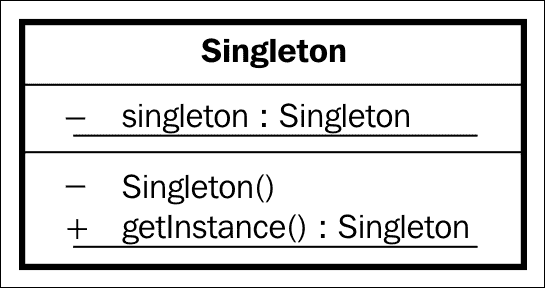

# 四、并发和软件设计模式

作为一名开发人员，您不仅必须编写有效的代码，而且还必须尽可能使用现有的解决方案，以便将来能够更好地维护您的代码。如果其他开发人员不得不在你的项目上工作，他们会很快理解你在做什么。我们可以通过软件设计模式来实现这一点。

为了正确理解模式，我们需要对并发在安卓中的工作原理有一个基本的了解。我们将阐明什么是用户界面线程，并讨论用于延迟线程中事件的不同机制。

我们将涵盖安卓中最常用的模式，这将有助于我们进一步了解安卓的特性和开发技术，成为更好的开发人员。

*   并发
    *   处理程序和线程
    *   阿明克塔斯克
    *   服务
    *   互联网服务
    *   装货设备
*   安卓的模式
    *   一个
    *   适配器和支架
    *   观察者

# 安卓中的并发

如果你是一个安卓用户，你可能知道 ANR 消息。它可能不会为你敲响警钟，所以看看下面的图片:


**活动不响应** ( **ANR** )发生在 UI 或主线程中有代码运行，阻止用户交互超过 5 秒。

在安卓系统中，一个应用运行一个线程，称为用户界面线程。我们将解释什么是线程，即使没有编程背景的读者也会理解。我们可以将一个线程可视化为一列由中央处理器执行的指令或消息。这些指令来自不同的地方；它们来自我们的应用和操作系统。该线程用于处理来自用户、生命周期方法和系统回调的响应。

CPU 按顺序处理消息，一个接一个；如果它很忙，消息将在队列中等待执行。因此，如果我们在应用中执行长时间的操作，并向中央处理器发送许多消息，我们将不会让用户界面消息被执行，这将导致移动设备不为用户做出响应。


这个问题的解决方案似乎显而易见:如果一个线程不够，我们可以使用多个线程。例如，如果我们发出网络请求，这将在另一个线程中完成，当它完成时，它将与主线程通信以显示被请求的数据。

只有主或 UI 线程可以访问 UI；因此，如果我们在另一个线程中执行任何后台计算，我们必须告诉主线程显示这些计算的结果，因为我们不能从那里直接执行。

## 处理程序和线程

我们之前描述的消息在一个名为`MessageQueue`的队列中运行，该队列对于每个线程都是唯一的。处理程序可以向该队列发送消息。当我们创建一个处理器时，它与创建它的线程的`MessageQueue`相关联。

处理程序用于两种情况:

*   向同一线程发送延迟消息
*   向另一个线程发送消息

这就是为什么，在我们的`SplashActivity`中，我们将使用以下代码:

```java
new Handler().postDelayed(new Runnable() {
  @Override
  public void run() {

    Intent intent = new Intent(SplashActivity.this, MainActivity.class)

    startActivity(intent);
  }
},3000);
```

### 类型

创建新的`Handler()`方法时，确保导入了`Android.OS`处理程序。

在这里，我们使用`postDelayed(Runnable, time)`方法发送一条延迟时间的消息。在这种情况下，消息是一个可运行的对象，它代表一个可以执行的命令。

当`runOnUIThread()`活动内部有一个方法允许我们向 UI 线程发送一个可运行的对象时，你不需要创建一个处理程序与之通信。当我们有了活动的上下文并想在用户界面上运行一些东西时，这非常有用，例如从后台执行的任务向用户界面发布更新。

如果我们看一下方法的安卓源代码，我们可以看到它只是使用一个处理程序来发布 UI 线程中的可运行对象:

```java
public final void runOnUiThread(Runnable action) {
  if (Thread.currentThread() != mUiThread) {
    mHandler.post(action);
  } else {
    action.run();
  }
}
```

通常，当我们想要在后台执行长时间的任务并且想要管理并行线程执行时，线程是手动创建的。线程有一个`run()`方法，其中指令被执行，并且必须在创建后启动才能开始执行`run()`:

```java
Thread thread = new Thread(){

  @Override
  public void run() {
    super.run();
  }
};

thread.start();
```

创建线程和处理程序来执行后台任务的缺点是它的手动处理，如果我们有很多线程和处理程序，我们很容易得到一个无法阅读的应用。安卓还有其他执行任务的机制，比如`AsyncTask`。

## 介绍 AsyncTasks

这可能是你在初级阶段看到的，但是我们将从并发的角度来看一下。一个`Asynctask`基于一个线程和一个处理程序，是一个在后台执行任务和发布用户界面更新的简单方法。

一个`AsyncTask`需要子类化才能使用，它有四个方法可以被覆盖:`onPreExecute`、`doInBackground`、`onProgressUpdate`、`onPostExecute`。

在后台做任何工作之前都会调用`OnPreExecute`方法；这意味着它仍然在 UI 线程上，用于在启动任务之前初始化变量和进度。

`doInBackground`方法在后台线程中执行。在这里，你可以调用`onProgressUpdate`，它向用户界面线程发布一个更新，例如，通过增加`ProgressBar`的值来显示任务的进度。

最后一个方法`onPostExecute`，在后台任务完成并在 UI 线程上运行时调用。

让我们考虑一个例子:一个需要 *x* 秒的`AsyncTask`在后台完成，每秒更新进度。进度条对象在构造函数中作为参数发送，秒数在执行方法中作为参数发送，在`doInBackground`中检索。请注意，在以下代码中，`<Integer,Integer,Void>`类型分别指输入参数、进度更新和后期执行的类型:

```java
public class MyAsyncTask extends AsyncTask<Integer,Integer,Void> {

  ProgressBar pB;

  MyAsyncTask(ProgressBar pB) {
    this.pB = pB;
  }

  @Override
  protected void onPreExecute() {
    super.onPreExecute();
    pB.setProgress(0);
  }

  @Override
  protected void onProgressUpdate(Integer... values) {
    super.onProgressUpdate(values);
    pB.setProgress(values[0]);
  }

  @Override
  protected Void doInBackground(Integer... integers) {
    for (int i = 0; i < 10; i++){
      try {
        Thread.sleep(1000);
      } catch (InterruptedException e) {
        e.printStackTrace();
      }
      onProgressUpdate(new Integer[]{i});
    }
    return null;
  }

  @Override
  protected void onPostExecute(Void o) {
    super.onPostExecute(o);
    Log.d("AsyncTask","Completed");
  }

}
```

创建了一个`AsyncTask`类，下面是我们如何执行它:

```java
new MyAsyncTask( progressBar ).execute(new Integer[]{10});
```

如果我们一次执行多个`AsyncTask`，从安卓 3.0 开始的版本中，默认情况下它们会按顺序运行。如果我们想并行运行它们，我们必须创建一个执行器并用`THREAD_POOL_EXECUTOR`参数调用`executeOnExecutor()`。

至于限制，要提到的是`AsyncTask`总是要从主线程执行的，不能在同一个对象中调用`execute()`两次；因此，它们不能循环。

## 了解服务

当下载文件或执行任何想要在任务完成时通知用户界面的短操作时，一个`AsyncTask`是理想的。然而，在安卓系统中有一些情况，你需要执行一个很长的任务，可能不需要用户界面交互。例如，您可以让一个应用打开一个与服务器的套接字(直接通道)，为一个无线电收听应用传输音频。

即使应用不在屏幕上，服务也会运行；它在后台运行，但默认情况下使用主线程。因此，如果我们想要执行长时间的任务，我们需要在服务内部创建一个线程。它必须在清单中声明，如果我们声明它是公共的，它也可以从另一个应用中使用。

与`AsyncTask`相反，服务可以从任何线程触发；它们由`onStartService()`方法触发，由`onStopService()`停止。

可选地，服务可以绑定到一个组件；一旦绑定了组件，就会调用`onBind()`。当绑定发生时，我们有一个可供组件与服务交互的接口。

### 一种服务——内部服务

`IntentService`是`services`的一个子类，可以由意图触发。它创建一个线程，并包含回调来知道任务何时完成。

`IntentService`背后的思想是，如果不需要并行运行任务，那么实现一个接收意图并在任务完成时用通知顺序管理它们的服务会更容易。

我们称之为`onStart`的服务持续运行；但是，`IntentService`是创建的，但是在很短的时间间隔内运行，仅从它收到意图时开始，直到它完成任务。

作为一个真实的例子，我们可以想到一个应用，当应用不在屏幕上时，它需要在后台执行简短的任务。这可能是一个新闻阅读器应用的情况，它将新闻存储在您的设备中，让您可以离线访问它。它可能是一个来自报纸的应用，每天发布文章，允许用户在飞机上或没有网络连接的火车上通勤时阅读。

这个想法是，当文章发布时，用户会在应用处于后台时收到推送通知。该通知将触发下载文章的意图，以便在没有任何额外用户交互的情况下，下次他们打开应用时，文章就在那里。

下载文章是一个小而重复的任务，需要在 app 在后台，在一个线程中完成，不需要并行，这是`IntentService`的完美场景。

## 引入装载机

为了完成的并发部分，我们将快速浏览一下`Loader`类。加载器的目的是使异步加载活动中的数据变得更容易，因此也更容易加载片段中的数据。从安卓 3.0 开始，每个活动都有 `LoaderManager`来管理其中使用的加载器。在基于片段导航的应用中，即使在片段之间切换，也可以在活动级别执行后台操作。

加载器从源加载数据；当这个源发生变化时，它会自动刷新信息，这就是为什么加载器非常适合与数据库一起使用。例如，一旦我们将加载器连接到一个数据库，这个数据库就可以被修改，并且这个改变将被加载器捕获。这将允许我们刷新用户界面，立即向用户反映变化。

在[第八章](08.html "Chapter 8. Databases and Loaders")、*数据库* *和加载器*中，我们将实现`CursorLoader`来查询我们将在`MasteringAndroidApp`中创建的数据库。

# 模式的重要性

当一个软件开发人员必须开发一个具有一定功能的特性或组件时，通常可以用不同的方式来完成；它可以用不同的代码或不同的结构来完成。同样的问题很可能已经被其他开发人员解决了很多次，以至于解决方案被从特定的实现中抽象出来并转换成一种模式。与其再次发明轮子，不如了解并实现这些模式。

在 Android 上开发时，我们每天都在使用模式，即使我们没有意识到这一点。大多数时候，我们使用安卓系统中构建的模式的实现。例如，当我们想要点击一个按钮并设置`OnClickListener`——换句话说，等待`onClick()`方法被调用——我们使用一个观察者模式实现。如果我们创建一个弹出窗口，`AlertDialog`，我们使用`AlertDialog.Builder`，它使用`Builder`模式。例子有很多，但我们想要的是能够将这些解决方案落实到我们自己的问题上。

有不同类型的模式分为四类，以下是我们在开发安卓应用时发现的一些例子:

*   创造
    *   一个
    *   建设者
    *   工厂方法
*   行为的
    *   观察者
    *   战略
    *   迭代程序
*   结构的
    *   适配器
    *   做吧
    *   装饰者
*   并发
    *   锁
    *   调度程序
    *   读写锁

要完成`MasteringAndroidApp`，我们必须实现前三组的模式。关于第四组(并发)，我们需要对 Android 中的并发有一个概念，但是我们自己不会实现并发模式。

### 类型

模式通常用 UML 图来表示。

根据维基百科([http://en.wikipedia.org/wiki/Class_diagram](http://en.wikipedia.org/wiki/Class_diagram))，“*在软件工程中，统一建模语言(UML)中的类图是一种静态结构图，它通过显示系统的类、它们的属性、操作(或方法)以及对象之间的关系*来描述系统的结构。

## 单例模式

软件设计模式，Singleton，将对象的创建限制为单个实例。这个想法是全局访问这个单一的对象。

如果之前没有创建对象，则通过创建对象来实现该模式，如果创建了对象，则返回现有实例。下面是 UML 图:



在某些情况下，我们希望一个对象是全球可访问的，我们希望它在我们的应用中是唯一的。例如，在使用凌空时，我们希望维护一个唯一的请求队列，让所有的请求都在同一个队列中，我们希望它可以被全局访问，因为我们需要添加来自任何片段或活动的请求。

这里有一个单例实现的基本示例:

```java
public class MySingleton {

    private static MySingleton sInstance;

    public static MySingleton getInstance(){
        if (sInstance == null) {
            sInstance = new MySingleton();
        }
        return sInstance;
    }
}
```

要理解实现，请记住在 Java 中，静态变量与类相关联，而不是与对象相关联。同样，可以在不创建类实例的情况下调用静态方法。

拥有一个静态方法意味着它可以在我们的应用中的任何地方被调用。我们可以调用`MySingleton.getInstance()`，它总是会返回同一个实例。第一次，它会创建它并返回它；随后的时间，它将返回创建的。

使用单例框架和测试框架有一个缺点；我们将在[第 11 章](11.html "Chapter 11. Debugging and Testing on Android")、*安卓*上的调试和测试中谈到这一点。

### 应用类中的单例

我们可以将单例实现应用于安卓系统。考虑到`Application`类中的`onCreate`方法在我们打开应用时只被调用一次，并且`Application`对象不会被破坏，我们可以在应用中实现`getInstance()`方法。

应用这些更改后，我们的应用类将类似于以下内容:

```java
public class MAApplication extends Application {

  private static MAApplication sInstance;

  @Override
  public void onCreate() {
    super.onCreate();

    sInstance = this;

    // Enable Local Datastore.
    Parse.enableLocalDatastore(this);

    ParseObject.registerSubclass(JobOffer.class);

    Parse.initialize(this, "KEy", "KEY");
  }

  private static MAApplication getInstance(){
    return sInstance;
  }
}
```

现在，我可以从应用中的任何地方调用`MAAplication.getInstance()`，并在应用类中创建成员变量，通过单例`MAAplication`对象可以全局访问。例如，在凌空的情况下，我可以在`OnCreate()`中创建`RequestQueue`，然后随时从`MAAplication`对象中检索它。执行以下代码:

```java
private RequestQueue mRequestQueue;

@Override
public void onCreate() {
  super.onCreate();

  sIntasnce = this;

  mRequestQueue = Volley.newRequestQueue(this);
  .
  .
  .
}

public RequestQueue getRequestQueue(){
  return mRequestQueue;
}
```

按照这种方法，我们有一个单例，这就是我们的`Application`类；其余的全局可访问对象是成员变量。另一种选择是创建一个新的单例类来存储凌空请求队列，并为每个需要的全局访问对象创建一个新的单例请求。

### 类型

不要使用这种方法在`Application`类中持久化数据。例如，如果我们通过点击主页按钮进入后台，安卓可能会在一段时间后需要内存，并将杀死应用。因此，下一次你打开应用时，一个新的实例将被创建，即使它看起来好像我们正在回到以前的实例。如果您再次初始化`onCreate`中的所有变量，并且以后不修改它们的状态，这很好。避免设置器来确保这一点。

## 观察者模式

这个模式是在安卓中广泛使用的。我们讨论的大多数网络库都实现了这种模式，如果你是安卓开发者，你肯定已经使用了很多次了——我们甚至需要实现它来检测按钮的点击。

观察者模式基于一个对象，观察者，它注册其他对象来通知它们状态的改变；这里，监听状态变化的对象是*观察者*。此模式可用于创建发布/订阅系统:


以下是注册多个观察点的模式的实现:

```java
public class MyObserved {

  public interface ObserverInterface{
    public void notifyListener();
  }

  List<ObserverInterface> observersList;

  public MyObserved(){
    observersList = new ArrayList<ObserverInterface>();
  }

  public void addObserver(ObserverInterface observer){
    observersList.add(observer);
  }

  public void removeObserver(ObserverInterface observer){
    observersList.remove(observer);
  }

  public void notifyAllObservers(){
    for (ObserverInterface observer : observersList){
      observer.notify();
    }
  }
}

public class MyObserver
implements MyObserved.ObserverInterface {

  @Override
  public void notify(){
    //Do something
  }
}
```

观察者，正如你会注意到的，可以是任何实现接口的对象— `ObserverInterface`。这个接口是在被观察对象中定义的。

如果我们将其与我们在安卓系统中处理按钮点击的方式进行比较，我们会执行`myButton.setOnClickListener(observer)`。在这里，我们添加了一个等待点击的观察者；这个观察者实现了`OnClick()`方法，在我们的例子中就是通知的方法。

看一下凌空，当我们创建一个网络请求时，我们必须指定两个监听器作为参数:`Response.Listener`和`Response`。`ErrorListener`，分别叫`onResponse()`和`onErrorResponse()`。这是观察者模式的明确实现。

我们将在[第 6 章](06.html "Chapter 6. CardView and Material Design")、*卡片视图和材质设计*中实现观察者模式变体的一个例子，发布/订阅模式。

## 介绍适配器模式

**适配器**是我们在安卓中创建`ListView`或`ViewPager`时使用的一个元素，但它也是一个众所周知的设计模式。我们将看看两者的定义和它们之间的关系。

一方面，作为设计模式的适配器是两个不兼容接口之间的桥梁。它允许两个不同的接口一起工作。这是与现实世界适配器相同的概念，例如 SD 卡到微型 SD 卡适配器，它允许两个不兼容的系统一起工作。如图所示，使用新的所需方法调用适配器，但是在内部，它从*适配器*调用旧方法。


另一方面，来自`android.widget.Adapter`的适配器是一个对象，我们使用它为列表中的每一行或视图页导航中的每一页创建视图。因此，它会调整数据、一组元素和一组视图。

为了实现适配器，我们必须扩展`BaseAdapter`并覆盖`getView()`和`getCount()`方法。使用这两种方法，适配器将知道它必须创建多少个视图，以及视图是如何创建的。

在下一章中，我们将在使用`ListViews`时进一步探讨这个主题，我们将讨论`ViewHolder`模式，这是在使用适配器和列表时在安卓系统中使用的一种特殊模式。

# 总结

在这一章的最后，你应该能够理解安卓系统中的并发性以及所有不同的机制。您应该知道有一个更新 UI 的主线程，我们可以创建后台线程来执行其他任务。您还必须知道让应用在后台(换句话说，不是在屏幕上)执行任务和让应用在后台线程中执行任务之间的区别。您还应该知道软件设计模式的重要性，并且能够实现其中的一些模式。

在下一章中，我们将看看如何使用列表视图，我们将实现一个适配器，我们将发现一个新的模式，`ViewHolder`，这将是理解安卓棒棒糖中引入的`ListView`和`RecyclerView`之间差异的关键。